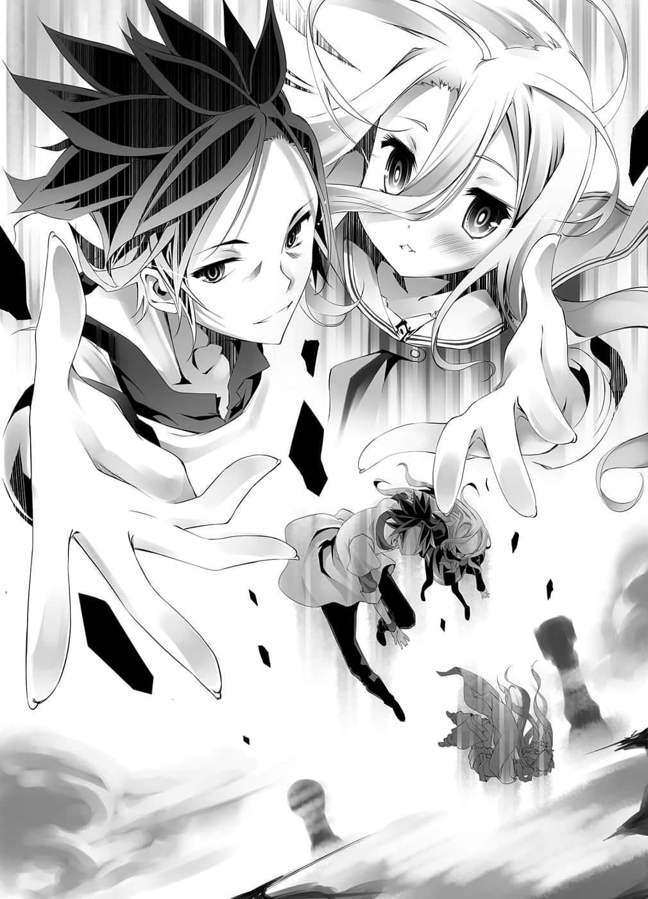
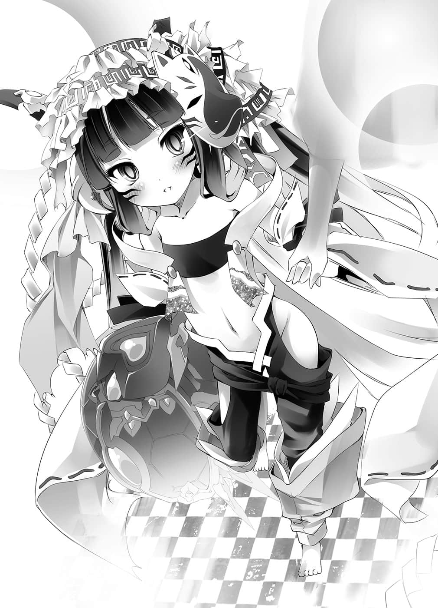

# 第四章 正当选择

> 来源：https://www.linovelib.com/novel/9/2111.html

——那一定是刹那间的事。

但是刹那的时间内，朝着空与白涌来的是多达几亿的记忆。

对人类之身而言，那漫长的岁月，几乎与『永恒』的认知没什么差别。

两人宛如身在梦中一般，暧昧地、仿佛在半梦半醒间——……看到了。

---

■ ■ ■

很久很久以前——有一个孤独的少女。

那是世界尚未成形之前，遥远得令人无法想像的远古时代的事。

少女是『神』。

但是少女并不知道神是什么，为何会诞生。

因为是孤独一人，所以也没有人可以回答少女。

那个世界还没有知性。

少女是为了代替没有意识的无意识存在们质疑为什么，而诞生的。

怀疑一切——身上寄宿着狐疑的神髓，少女执笔不断提问。

『存在』是什么？『世界』是什么？问出这些问题的自己是『什么人』……之类。

无论抱持再多的疑问，都无人可问。

无论思考再多的假说，也无人可回答。

在悠久的时光中，对万物持续质疑为什么的孤独哲学家。

因为她是孤独一人——所以连『寂寞』是什么都不知道。

——只是漠然地寻求『说话对象』。

那是五个小小的机器方块。

执行观测、解析、论证、对应的四机，以及指挥统筹四机的一个机械。

连自己的存在都怀疑的少女，最后——

少女只想继续沉睡，反正所谓证明，也可以无限反证。

但是，机械的知性——正因为其『知性』的原故，反而提出问题。

「所以——来吧，【向盟约宣誓】。」

——半梦半醒的少女明白了——自己没有死。

狐狸这么询问，但是少女思索之后回答——『不明』。

没有交集的议论不断持续着，但是——

没错，少女赢的话，直到狐狸死为止，都会用她的身体做为凭依。

笑得更加开怀，年幼金色狐的表情中——已经没有绝望。

不管过去还是未来——甚至就连现在，她也无法透析，只是处于半梦半醒之间……

朱红的月亮如背景一般映照着染上夜色的天空之下。

就这样——经过更悠久的沉默之后。

只不过，透过和别人说话，令她有『某种感觉』——

她珍惜地拥抱这个以『死』换得的答案——……

---

□ □ □

听到少女这么说——金色狐似乎打从心底感到不高兴。

——否定自己，贯穿自己的『神髓』。

少女在脑中不断吵闹，但是狐狸只是开心地笑着。

就这样——当狐狸的豪语成真的时候——

因为是孤独一人——所以少女甚至不知道自己『有』。

她站了起来，满腔热诚地说要改变世界。

金狐回答，自身的惨状、至今的历史就是根据。

此时，孤独一人的少女，应该已经死亡的少女——『神髓』仍在半梦半醒的状态下。

确实，如果有那个的话，这无限的疑问也会得到答案。

听到那句话，少女——尽管仍无自觉——感到惊愕。

只要仍在同一个身体里——依照『盟约』绝对不会分开的两人——

「——好像傻瓜一样，你叫什么名字？」

——『星杯』是全知全能的概念装置。

金狐傲然而立，她的问题中断了这串议论。

少女质问，将部分事实、普遍化的谬误，断定为真的根据。

否定自我，即使用尽全部力量贯穿——『神髓』却没有『消失』，只是『剥离』——让她处于假性不活化的状态而已。

——吾是什么？汝是什么？疑问是什么……？

「如果你胜过我，我这副身体就给你做凭依使用——直到我死为止。」

「——所以得到『唯一神的宝座』后，我会将它交给你——你不用客气。」

「定理是为了被打破而存在，就算对手是唯一神也可以反抗……只要无限地破解下去，就连世界都可以改变——可以亲手创造，我会证明给你看。」

「什么嘛，原来是『无名的同伴』吗？那就没关系了，来吧——」

「你可以持续问问题，我也会听你的问题，使用所有可能的手段。」

在这样的想法之下，狐狸的笑容因绝望而扭曲，她『断定』——『定理是无法反抗的』。

她甚至连『希望』是什么都不知道，就在连那是什么意思……也不明白的情况下。

在「连失望都无法自觉」的半梦半醒中，少女不断提问。

对少女而言，『终战』和『十条盟约』——全都是在假性不活化的状态中发生的事。

「跟着我念就好，只是玩个小游戏而已。」

用那个定理击败唯一神，得到——『唯一神的宝座』。

仿佛是在责备——即便是梦幻，却仍把自己从满足的梦中吵醒之人。

在后来被称为『东部联合』的边境山丘上。

使用前所未闻的诈骗——将『神髓』与自己的身体连系的狐狸这么说道。

她以锐利的目光，看向地平线彼端的巨大西洋棋子。

——『回答吾，断言定理无法反抗的根据为何』。

只不过——

因为一个似乎随时会气绝的年幼金色狐——怀疑这世上一切的人。

下一个瞬间就有可能假性不活化的少女，并没有任何身为神灵种的力量。

但是少女对于她的理想——完全没兴趣。

……不过少女不可思议地并不感到不快。

于是少女虽然胜利，她的『神髓』却被束缚在狐狸体内。

不知为何——金狐以濒死之躯笑了。

「——只要证明给你看，你就没话说了吧？」

除非狐狸死，或者——

「这样一来，在我得到唯一神的宝座之前，你就要待在我的身体内了♪」

金狐回答，强者蹂躏弱者便是自明之理，毋需根据。

在朦胧的记忆中，那场大战真的终结了吗？

她将自己的『神髓』，无限的疑问，连最后否定了自己的事——所有一切全部和盘托出。

『————汝～～！汝汝！凭依！汝骗了吾吧！？』

少女正想问为什么，却被狐狸打断。

——她要合并所有种族，建立谁也不会牺牲的『定理』。

狐狸表示：因为到时唯一神宝座对自己而言，已是不需要的东西，所以——

「呼哈哈！那是被骗的人的错，在这个世界是常识哦！」

在尚无知性的世界里，她自我判断——尝试『创造知性』。

因此，她甚至从未想过名字。听到少女这么说——

——少女果然还是没有自觉。

即使她没有那个意思，但是她确实给予狐狸勇气，让狐狸决心挑战『定理世界』——而且不管是对狐狸也好，对少女也好——她们彼此都是对方第一个朋友。

少女渴望的是能回答无限疑问的——对应者说话对象。

「……放心吧，我输了就是输了，我会确实遵守约定的。」

---

□ □ □

狐狸大胆傲慢地发出豪语。

连自己的存在都无法确信的狐疑之神。

所以在原初的世界里，第一个——有『心』的少女绝望了。

少女质问，强弱未定义与自明主观毋需根据的根据。

她问狐狸——『为何？』——那个答案就在那一日被否定了。

对少女而言，狐狸所指的『你』和回答其问题的『自己』，也在疑问之内。

就连自己——第一次展露感情都没有察觉。

机械固然是有知性，但是少女『有』的，机械却没有。

不管是十条盟约、唯一神、定理，还是必然，她怀疑所有的一切——

更何况持续否定自己的少女，现在只不过是一时性微弱地再度活性化而已。

——然后。

————？

少女对于无限涌出的疑问，终于想到一个——解答的方法。

「在我得到『星杯』，你不再否定自己之前，你就在我的体内看着吧。」

但是狐狸继续说道：

但是那一日——就连那个答案都被否定了。

「是你先煽动我的还说那种话，不管你愿不愿意，我都要你陪我赌一把哦。」

至少得到了，自己曾经存在——这个唯一的答案。

唯一神的宝座——该不会是在说『星杯』吧。

狐狸说着举起手，然而少女却以无言回应。

——就这样，东部联合诞生了。

不过那并不是靠少女身为神灵种的力量，甚至也没有那个必要。

每当狐狸觉得『做不到』的时候，少女便会质问她『为什么』——只是如此而已。

觉得胜不过其他种族的时候，她便问「为何断定胜不过」。

抱怨不能使用魔法的不利，她便问「为何认定那样不利」。

——认为现实无法改变时，她便问「为何认定不能改变」。

不断质问为何的少女，做为狐狸的建言者——转眼间便建立了国家。

——那对神而言是转眼间，但是却花费了狐狸六十年的时光——

---

□ □ □

所以结束也来得突然。

「……差不多到极限了，抱歉——要请你从我的身体里出去了。」

过去那个年幼的金色狐说出这句话，是在接收海栖种的首都的晚上。

金狐用指尖弹着兽人种的棋子，这么告诉体内的『神髓』。

少女当然不明白那是什么意思……不过她却心里有数。

『是因为他们——那些人类种们吗？』

——狐狸以前也对少女道歉过。

在寿命结束之前，完全不觉得自己能得到『星杯』——就像这样。

——狐狸曾说找不到『定理的终点』，胜负暂且寄下——但是。

少女并没有特别在意，也不明白她向自己道歉的意思。

原本她就不是真心认为，能够统一所有种族，胜过唯一神吧。

可是那群人类种出现后，狐狸改变了——少女这么认为。

「所以在那之前，要先将盟约覆盖过去……必须再玩一次游戏才行。」

『相信背叛者……怀疑等同信任——现在也是你差不多该明白的时候了。』

她笑着把兽人种的棋子弹开。

——这样正好，那首先就试着得到五个种族的棋子吧。

再以盟约将『神髓』寄宿在狐狸体内就好了——

又被背叛了。

自己就连要退出这场不利的胜负都不行。

不过空与白知道。

『汝背叛、欺骗了吾，还要玩弄信任两个字吗？』

信任是什么——根本不可能证明。

「……因为再怎样我也不想让你死啊……」

如果因为寿命关系而无法实现，甚至不惜托付别人也要达成——狐狸这么说，不过她和少女订的盟约是——『做为凭依使用直到死亡为止』。

最后竟然还说——『怀疑就是信任』——？

然而——

——只要能让『背叛者』到达终点，就不进行神髓销毁。

在少女连同狐狸的生命一起消失前的期间，和别人进行游戏，继承盟约。

因为那仅仅稍微露出的『眼神』，空与白都有印象见过。

——就这样，仿佛从白日梦醒来一般。

「……死的人只要我一个就够了，我会托付给下一个人。」

没错——用这个游戏证明被玩弄的两个字。

但是少女降临——也就是由于狐狸的死，神力得到解放之后。

狐狸死后，盟约的锁炼切断，少女神原本会因自我否定而呈现假性不活化——但如果是从盟约解放之后的短暂时间里——她可以用神灵种的力量捉住狐狸的灵魂，甚至应该也能在赋予狐狸永久性的生命之后，再度让她灵魂回归。

与他们逃避一切，闭门不出的那个房间，可说一模一样。

先前卷起螺旋直达天际的大地，如今那个壮阔的景色已经消失无踪，这里是一个黑色的房间。

仍不知道该如何做，该如何活的那对眼神——因此——

她单纯只是想舍弃少女而已。

---

□ □ □

那里就是——原本的世界。

——打从一开始狐狸就没打算死，也丝毫没有要把『神髓』交给别人的意思。

人类种、吸血种、狐狸们各自以自己的利益决定规则。

『……吾答应……但是凭依，吾可不答应让汝死。』

「兽人种的全权代理者，实质上是我和你两个人，这样种族棋子也无法赌上。」

如果可以的话……就找出来给我看吧——就连这么思考的意义也无法理解——……

视线巡过一周后，两人以及一旁伫立的巫女，看向——相同的人。

『我就是要玩弄……你也差不多到了该「自立」的时候了。』

『……抱歉，虽然如此，我还是「信任」你哦。』

什么也不明白地，被迫无止尽地追问。

但是如果要继承『神髓』，在盟约上狐狸就必须『死一次』。

狐狸真的是——真心打算把『星杯』交给少女吗？

正因为如此，少女才会刻意答应游戏，宣告要用尽全力。

（……应该就能明白……为何会被舍弃了吧……）

如果可以证明，如果能够回答的话——

『星杯』——收集所有种族的棋子，胜过唯一神才能得到的全知之器。

依照预定，少女从盟约的锁炼被解放出来。

————

她只是质问，有如乞求一般，有如求助一般，有如责备一般。

——什么也不明白，不被期望而诞生。

只不过她没说出口的是，除了狐狸以外，她不打算把『神髓』交给任何人————

——至于为何那样做，少女也不明白，不过——

狐狸这么说完后低下了头，不过少女心中暗想。

不管是颤抖的手的意义，还是低着头的意义，甚至在心中翻搅的感情也——

那也就是——

什么也不明白地活着，想要明白些什么而死。

——这才是这个神灵种『本来的模样』。

于是少女领悟了一件事。

加入无论是输是赢都可以保护狐狸的规则……只是这样而已。

看到她的记忆——不，就算不看，空与白也早就知道。

游戏开始时——从第一次见到她的时候开始，空与白就已经知道。

少女当场就发觉了。

那里……那是两人见过的场所，见过的光景。

让他们赌上参加者人数的『种族棋子』，然后——

「信任是什么……被这么问之后，却诓称『信任即是怀疑』之人啊……」

然后游戏开始，这些人都是要来杀死自己的。

——是哪里错了呢？但是她把这个疑问吞了下去。

---

■ ■ ■

思考仍未完全清晰，空与白张望四周。

她的声音动摇、畏惧，那个样子与神的威严实在相去甚远。

不，或许只是恢复成以前的她了吧——她是真心想要得到『星杯』吧。

少女所握有的灵魂——

与超越种——神灵种实在太不相衬的，那对似曾相识的眼睛。

在那里的不是神也不是人，而是遭到背叛，心灵受伤，即使不断挣扎——

「但是我也不能一直和你『同居』下去。」

「——神究竟是什么……」

又或者——少女漫无目的地看着那些人……心里茫然地想着。

——在镜中看过的眼神。

『…………』

——既然盟约结束，掌握了狐狸的性命。

那么就照狐狸的提案进行游戏——再一次由少女获胜。

少女能做的就是——不管谁到达终点，都要以神髓销毁做为代价。

因为那就是以前空与白……他们两人都曾——

不过——接下来的话语，由于出乎少女意料之外，让她顿感惊愕。

——在狐狸体内，只不过是个存在而已的无力少女神。

少女如此思考，但是她却无法理解那样思考的意义。

在飘散相同空气的封闭世界里，少女神开口了。

坐上唯一神的宝座，得到所有问题的解答……那样的话——

不管是狐狸还是少女都没有毁约的权利，那样就要等到狐狸寿终正寝不是吗——？

什么也不明白地被叫醒，被利用，被欺骗，被陷害，被背叛……

——那就给一个受到这种折磨，却还能够认同的答案。

「——如果是那样，我现在立刻了断自己的生命。」

但是无论结果如何——大概只会再回到假性不活化消失的状态吧————

但是少女拒绝了那个提案——因为约好要她看到最后的人是狐狸。

狭窄、昏暗、冰冷、毫无生气——于仿佛拒绝世上所有一切的空间中，待在中央的是抱着膝，孤单一人的——无名的神灵种。

那样……的话——

那么——自己身为『狐疑之神』的存在意义为何——？

她用怨恨般的眼神——质问一副愉快模样的人们。

「啊……我说白啊，不对，应该要问巫女小姐吧。」

空忍不住避开她的视线，朝妹妹——以及巫女的方向看去。

「到了这个地步我就坦承吧，有一件事我一直不明白。」

——空这么说完，用冷漠的眼神瞪着巫女。

原来如此，确实空识破了这个游戏真正的胜利条件。

虽说预测有所疏漏，有疏忽失误——甚至还有败北，不过大致上谜题都解开了。

但是即使如此——

「神灵种参加这个游戏的意义——只有这一点，我一直想不通。」

——本来的话。

空认为，玩游戏不需要意义——甚至也不需要目的。

奖金和奖品只是附带的赠品，只因为想玩游戏所以玩。

不在这之上，也不在这之下，有个名符其实的神玩家存在，而且有机会与那个人玩游戏的话，如果不玩才需要问意义和目的吧，不过——自负每天成长卓著的空，最近也开始怀疑，或许那并不是一般论了。

但是——他本来就已察觉，神灵种是被巫女拐骗，被迫玩这场游戏。

——那么她是用什么做饵——拐骗神灵种的呢？

不惜玩这种超级规模的游戏也要追求的意义，只有这一点空想不透，不过——

「……该不会是那样吧……」

空说着吸一口气。

「——背叛的朋友竟然厚着脸皮跑来说『即使如此还是信任你』，什么嘛，那是什么意思！？我都这么伤心了还说你信任我！？信任是什么！？我才不相信呢，既然你说可以，就用你的生命来证明吧！！不然我就要成为全知全能，自己去找寻答案————！！」

「哈哈哈……我没说错吧？真的是个麻烦的孩子对吧？」

对于现在即将消失，悲痛哭泣的朋友，她只能紧握拳头到指甲刺入肉中，在一旁默默守候，除此之外什么也不能做。

「我复杂地打了个纠结在一起的结，如果你们解不开——那就是你们输了♪」

「……是啊，把事情弄得复杂的，就是像我这样无趣的人。」

空如此推测，刻意主动提出——

「游戏玩家就是要性格恶劣，更何况我是狐狸呀……」

……由于不知道是在问什么——所以空理所当然地回答是『怀疑』。

「……该不会就只是这样的事吧？」

空与白、巫女，以及——现在形影已不稳定地晃动着，即将消失的，自称神的存在。

照这样下去又会假性不活化消灭……出现牺牲。

「……这件事……根本的原因……就是巫女小姐吧。」

想用囚徒困境这种小聪明的手段来讽刺——

——空与白本来就根本不打算让神灵种死。

然后，于现在这个就连破碎的拟声词都快可以具体看见的空间中……

——都必须做出这么复杂的事。

但是——他们和自己有决定性的差异。

——看过少女的记忆，空和白也明白发生什么事了。

将破碎四散的黑色空间抛之在后，他们被释放至高空。

——不，空只是问一下而已，其实他也早就明白了。

无奈地这么感叹之后，空与白——走向少女——

从根柢上就与自己这样的『生物』不同——不，根本是不同的概念。

这是由于与巫女的盟约被切断，引起自我否定了。

——昏暗狭窄的黑色空间，破碎四散——

然后在开始出现裂痕的空间中。

「我做错了……可是我不知道该怎么办才好——即使现在也一样。」

但是那样的结果也只是用盟约维系着她而已，她没有任何自觉，也得不到答案，更不会发觉——在盟约的锁炼解开的瞬间，她就变成这副模样。

她大概打算借着囚徒困境的典故，让我们自相残杀吧。

而每当挤压声响起，空间的主人——蹲在地上的少女的身形便会晃动。

但是巫女现在还无法想像，斩断锁炼后会发生的事情。

「——虽然我也没资格说别人，但是巫女小姐的性格真恶劣啊……」

空与白想到，两人加起来是一人，在这一点上和他们很相似。

——宛如回应她的自虐一般，昏暗的空间传出扭曲挤压的声音。

空捧腹大笑，笑得连眼泪都流出来，巫女听到他接下来说的话——

神灵种——无论是存在，时间的尺度，构成其『世界』的言语范围或定义……

复杂的约定是以复杂的『盟约』订下，受到锁炼束缚的交流，随着每次的错身而过，锁炼便愈缠愈紧——就这样，奇妙的共存产生了复杂的变化。

真的只是想测试『囚犯们空等人』的信赖，一般不会这么想的吧——！！

「……呃～神——问自己是什么吗？简单说就是在问——」

「……在把世界变得复杂这一点上，大人真是天才呢。」

「你笑什么！！巫女小姐也是把事情弄得复杂那一派的人吧！？」

根据那一段记忆——在游戏前，她确实问过『信任是什么』。

「——就算要利用能做到的人，就算会卷入再多的其他人你们——」

她心想：

「就算要牵手——我也想让那孩子以自己的意志，选择握住谁的手，如果不知道那样的方法……如果我做不到的话——」

看到巫女说这句话时的模样，空与白——只是露出一抹苦笑。

「……看吧，我应该说过接下来才是重头戏吧。」

巫女带着一抹不安，目送两人从容自若的背影。

——即使会被骂，会受到鄙视。

——就连那个狭小昏暗的空间都无法维持了吗？

有如烛火般摇晃，看得出逐渐变得朦胧，变得愈来愈淡。

虽然如今已经不知道，自己是否还有资格自称是她的朋友——巫女这么说道。

就像这样，空露出死鱼一样的眼神，叹了一口气。

「用这种『简单游戏』做为最后的游戏真的好吗——叫人紧张不起来呀～！」

巫女——毅然地说道：

——这本来就是以彼此背叛为前提的游戏。

空缓慢地叹一口气——在少女身旁蹲下。

没错，所以——巫女露出扭曲的笑容，满不在乎地『威胁』空他们。

「——即使如此，我还是想救那孩子。」

「为了什么而生，为了什么而活吗……噗噗——！！」

他一脸正经的表情，突然——爆笑出声。

原本只是暂时解放的有限神力，如今正毫无止尽地衰减中。

「你脑袋里装的是红豆沙吗！？原料是小麦和红豆吗！？连面包都要稍微以正向态度生活的时代，你这样没问题吗！？换张新的脸孔就可以元气百倍地解决了吧！？」

巫女希望朋友——至少自己当她是朋友的少女，就算没有『盟约』这条锁炼，也能用自己的意志欢笑，时而哭泣，即使如此——还是希望她能快乐。

---

■ ■ ■

——这仍是生涯最大，或者也是最后的赌博，只有这点可以确信。

「我是无法抛弃那种小孩的，任性、长不大的半吊子——爱怎么批评都随便你们。」

如果确定有人能做到那件事，那么不管自己被如何看待都无所谓。

因此，昔日的巫女……面对充满疑问的少女，才会什么也无法为她解答。

她祈祷着注视，赌上一切的那两人——空与白的背影。

夹杂着比手画脚的动作，空逼真地扮演女演员——

原来如此——只要还在巫女体内，那个神灵种就不会消失。

「那种家伙是什么人啊！？除了『ＧＯＤ神级的笨蛋』以外，还有别的可能性吗！！」

「那么，不管要我说几次都可以——『别小看我，这是小事一桩』。」

然后态度一转。

少女微微颤抖，同时——龟裂窜起。

但是纵然如此，还是有不能退让的信念。

——啊啊，我操之过急了吗？巫女翻着白眼，看着虚空。

游戏已经结束，被征收的游戏开始前的记忆也已回来。

「原本以盟约维系的『神髓』回到那孩子身上了，可是——」

空与白忍不住叫道，巫女则是语带自嘲地低下头笑着说：

然而她态度一转，语气转弱——低着头继续说道：

反而是……

即使被空与白以冰点以下寒意的视线瞪视，巫女仍哈哈大笑着回答。

「没错吧？真的被打败了呢……哈哈哈哈！」

既不用威胁，也不必拜托。

半世纪以上——即便走过无数赌上性命的修罗场。

一同望向地平线的彼方——巨大的西洋棋子，笑了出来。

怀疑与信任同义——但是她却要求证明。

受到重力捕捉，逐渐坠落的途中——空与白依然手牵着手。

真的如他们所想的那么简单吗？

---

■ ■ ■

没想到——『刑警』的『心思』。

就算她握的不会是自己的手——

『如果是背叛者到达终点的话，神髓销毁就作废如何』这个提案。

巫女就是为此而斩断锁炼——就算仅只是为了这个目的。

「……没有舍弃……对于那样的任性……白要夸奖你。」

——盘上的世界迪司博德，有『十条盟约』的世界。

非常了不起的某人下好『布局』，一切都以游戏决定的世界。

没错，空他们来到这里——和那一天相同的光景重迭——

「你生什么气呀！？呐～你生气了吗！？气呼呼吗！？呀哈～！！」

「……哥看起来……只像是在……欺负小女孩。」

对于正在进行无绳索的高空弹跳之事，空与白极力不去意识，而是从容不迫地继续游戏的基本——也就是精神攻击。

「——闭嘴……」

「欸欸——欸！？抱歉，我没听见，风声太大了！！」

「吾叫汝闭嘴——！！」

然后她终于——捂起耳朵，抱着头，哭喊的那个模样。

「啥～！？我回答了你所提出的疑问，你却叫我闭嘴！？你是少女心吗！？秋天的天空吗！！」

空乘胜追击，少女则喊叫着回应——不！

她摇头呐喊的那张脸，在两人看来就像在那么喊着。

——到底怎么回事？

自己到底在做什么，为何会遇到这种事？

给我回答，如果不打算回答的话，至少——让我睡死吧。

……那模样简直就像吉普莉尔，空不禁露出苦笑。

——上位种族也是——更不要说神灵种，似乎也相当难当。

因为太过优秀了吧，看得太多，懂得太多。

原来如此，最下位种族不会明白的天上的烦恼。

做了这样的结语之后，「另一方面」……空继续说道：

对于在大战中过着绝望的生活感到不满。

「闭嘴！闭嘴！闭嘴——吾叫汝闭嘴……！」

原来如此，她似乎是这个世界最初拥有『心』的存在。

如果只是怀疑一切的话，这样既不会产生心，也不需要心吧——！！

——如果无论如何都不明白的话……

「那么时间差不多不妙了！我们来公布答案吧！？」

如果不中意的话——没错，那正是——

有着休息不做事还比较好的傻瓜想法——所以他想说只要照别人的期望生活就好。

过去都有人把世界变成游戏了——所以这应该有可能办得到吧——！！

但是，白的手指颤抖着指着下方，空不自觉地将『咿～』的悲鸣声吞下，然后——

但是就算退千步万步，退一亿兆步——不，就算退至事象的地平线。

——永远都持续试着这么说，这样如何呢？

那个傻瓜有着稍微先进的傻瓜思考——他认为只要创造一个让人想要活下去的世界就好了。

——尽可能不去想打在身上的风，以及逼近而来的地面死。

「至少有一件事我可以断言——那就是『你不是狐疑之神』！！」

声音颤抖、慌张，是啊——空以完全与帅气无缘的模样。

「嘿！！脑袋太好，结果绕一圈回来变成笨蛋的女孩子！！」

那么至此要回答的只有一句话——『你在开玩笑吗』。

因为狐疑的概念得到自我——所以怀疑一切？

前者因太弱而做错，后者因太强而做错。

「两个傻瓜果然也都是傻瓜，两人都——做错了。」

「要怀疑一切的话——一般最先应该『怀疑自己是否真是狐疑之神』吧！！」

因为孤单一人，所以不能向人确认，也无法自觉。

看到少女向一切质问、乞求。

「——————」

为什么连这种程度的事都不知道呢？实在打心底感到疑问，空发出吼叫。

不管是这家伙还是巫女，为什么都对那种愚蠢的话当真呢？

仿佛指着手和身体给他们看一般，她用和过去的空与白相同的眼神问道。

「……哥、哥……抱、抱歉在你耍帅的时候打扰……可是……时间已经……」

单纯只是到底——『该如何是好』。

「……『这个』就连是不是狐疑之神都很可疑……那么——」

有根据就能相信吗？那个根据正确的根据呢？

「那就像个逊咖，堂堂正正地——这么说说看吧！？」

但是这个故事还没结束——因为——

两人都失败了，而且也都后悔了。

根据，要根据？到底要让我笑到什么地步。

「我是笨蛋！！什么也不知道——让我们这么承认吧！！」

可喜可贺，可喜可贺。

——如果对什么有『疑问』。

——完全不明白啊——！！

根据如果是正确的就相信？那个根据是正确根据的正确根据呢？

如果发觉错了的话，那就伸个舌头，撤回前言就好了吧。

如果因发现原本以为是平坦的星球是圆的，而感到丢脸的话……

如果真的怀疑一切，应该连问都办不到。

怀疑一切的神——假设退一百步，真的有那样的神——

两人一起瞪大双眼，询问『根据呢？』的模样，让空只是止不住笑。

那么到底要相信什么——不对。

那么让它『再一次恢复成平的』——这样也不坏吧！？

——那样只会变成无限倒退，根本不可能有答案吧。

到底要如何活下去——不对。

——为什么认为需要那种东西！？

——问，自己是什么人？

空——重新紧握与白牵着的手。

——不可能有那种事吧——！！

——反正既然什么也不明白。

——如果有人要求说，要认同这个因被那样说而困惑地流泪的存在，是个女孩子的话——

如果就连自己的最小定义都一直是错的。

「那就只能用摸索的方式，拼命地想办法去做了！！反正自己就是无能，无论再怎么思考，最多也只能找到明天就会被颠覆的答案，所以不必在乎任何人的想法——这样不就好了吗！！」

「那样的家伙会哭得一把鼻涕一把眼泪！伤心、哭泣、愤怒——呐喊吗！？」

而那样的神就是在眼前的朦胧少女……

那是他最近才知道的人——空遥想那个实在不认为是他人的某人。

「————那么……『这个』是什么……」

——因为实在太傻。

于是空开始道出——宛如童话故事，但却千真万确的真实故事。

不知道该如何活下去的那个傻瓜。

如连珠炮一般，急忙做结论：

最后甚至怀疑自我，然后自我否定？

但是真是的，因为……过度优秀，最后绕了一圈回来——

终于如海市蜃楼般晃动着，快要消失的虚幻少女，语气悲痛地说道。

『一定是这样』——带着愿望擅自认定也没关系吧。

卧薪尝胆，甘受耻辱——抛弃尊严！

——哭得像是最下位种族的小孩，真叫人傻眼啊——！！

像这样胆小发抖、带着僵硬的表情——空与白牵着手——

「很久很久以前——其实算是最近的事啦，在某个地方有个非常逊的傻瓜。」

『啊～我也有说出那种蠢话的时期啊』——就像这样。

因为是那个『神髓』令她如此，所以就只能一直怀疑下去？

「——啊……啊！」

……那就表示……相信『有答案』吧。

如果『心』是从疑问、好奇诞生出来的，那还能认同，不过——

——因为实在太傻。

——得到自我的概念，那就是神——神灵种？

「如果对于所有事情都抱持怀疑态度的话——『为何还要追求答案根据』啊！」

「很久很久以前——这次是真的很久以前，在某处有个非常帅气的傻瓜。」

「哈哈哈，别再耍帅了好吗！？」

「那个傻瓜把自己当成『人偶』，不知何时就真的变成人偶了。」

「你想知道你究竟是什么人吗！？虽然很愚蠢，但我来回答你，所以心怀恭敬地听好吧！！」

「——所以结果两边都很逊——他们在心中决定，『下一次』绝对不弄错。」

「那个傻瓜把世界认定为『游戏』，不知不觉间他真的把世界变成游戏了。」

听到否定大前提的呐喊，不管是自称・狐疑之神，还是巫女。

必须回答她才行——回答与过去的他们追求相同事物的少女。

这孩子是只能怀疑一切的神？

大概啦——空在内心附加了这一句，露出苦笑。

既不可喜，也不有趣。

「——像这样一切都会绕一圈——！！」

就如同怀疑而至确信，过信而回溯至疑念。

就如同叛逆而至协调，协调而回溯至反抗。

就如同强者会败给弱者，贤者亦有愚笨之处一般。

就如同全部都只是二律背反，只是意义兼具而已。

就如同相反词只是用来方便区别，黑与白哪一个接近灰而已！

就连超越种神们也是，一旦过了度——

……也会被人类种空弄哭一般……

「就连你是什么存在也是一样！只要绕过一圈就会反转！！」

这么说完后，空与白将牵着手的——另一只手。

伸向与过去的自己——『 空白』追求相同事物的那对眼神。

——太过聪明而变成笨蛋，孤独又空虚……连名字都没有的少女。

如今就连那个『神髓』是否为『狐疑』之神也不确定，少女依旧追问那个『神髓』。即使如此，仍请求希望得到那个答案，在『请希㊟』之上二律背反的少女——

（译注：日文的请希与狐疑同音。）

「如果你握住这只手，那么对于原本孤独的『夸戏』的神髓——」

「……我们会回答……那是……『帆楼』……」

两人将与空白相同的——『空洞Ｈｏｌｌｏｗ㊟』之名，分给她做为名字。

（译注：空洞、中空之意，日文念法与帆楼相同。）

对『问题』以『答问』回答。

——问，自己是什么？

「——别露出那样不安的表情啦，那跟有没有意义无关。」

「即使如此——握住帆楼的手依然有意义、吗——！？」

——覆盖天空的庞大卷轴摊了开来。

那样就好，那很像是分得他们两人名字之人该有的表情。

「…………俗称・空，俗称・白。」

——答，你希望是什么？

「……如果……帆楼……称呼自己……帆楼……那就没问题。」

——然后巫女降落在她……不，降落在自称『帆楼』的少女，于空中笨拙地建构出的岩盘上。

「有问题，因此吾才问『吾身为帆楼的定义』。」

「……先担心……做出有损名字的事时……应该怎么办吧。」

---

■ ■ ■

——假设如果依照空的主张，一切都会绕一圈的话。

以神灵种来说，她是最弱的。

「那些全部是规范『人』——最低限度也是适用人类种的法律！因此——！！」

持续几万几亿年岁月的『疑问』都记录在上面——

——但是。

帆楼，中空——亦即再多也可以注入——

伸出那只影像晃动，逐渐消失，不安定的手，少女——不。

「……没、没有异议……呜……呜呜……」

「呼哈哈哈，天真，你太天真了，妹妹啊！」

低着头，仿佛畏惧一般——那个样子似乎比先前更为柔弱，而巫女知道那个理由。

……她提出严肃的疑问，但是果然——

更何况——

……帆楼……这么说道——

「好耶～～！终于拍到低角度的照片了～～！」

先这么开头后，不过——帆楼刻意宣言。

空掩着鼻子，带着至高幸福的笑容——仿佛就要这样永眠一般地闭上眼。

怀疑必须相信，强中含弱，贤愚共存。

「加油吧，不管是疑问还是游戏，再多我们都会回应你的♪」

犹豫不决的少女——经过数秒的犹豫后。

在只有巫女发觉，原本降下高度的岩盘停止的情况中——

这时帆楼终于理解——或者是假定吧，他们是在向自己『挑衅』。

而当帆楼无言地走向两人的时候，她所构筑的岩盘也逐渐崩解，高度缓缓地下降。

「——十六种族位阶序列十六位——最下位种啊。」

——完全正确。

帆楼却抓住空的袖子。

「————帆楼…………」

「……就连汝等……就连汝等说的话，吾还是怀疑吧……」

帆楼的神髓不管是称为『狐疑』，还是称为『请希』，性质都相同——

「……以猥亵目的偷拍……违反轻犯罪法、条例……侵害肖像权……」

看到她充满期待的眼神，空则是……

那也只是同质、同义、兼义而已。

…………

「……！意思就是……对方是神的话……做什么都……没关系……？」

「一……一个一个来吧……」

——没错，就算如空所说，一切都会绕过一周，即使会反转。

空与白飒爽地转身离去——

就算因为『选择』称呼自己为帆楼，她的自我否定停止了。

「……哥……那个……不止十八禁，还会禁卖——」

直到刚才还处于濒死状态的肉体不知到哪去了，空夸张地喊道：

「……白、白……如何？哥哥判断我们似乎还活着。」

在濒临假性不活化之情形下，帆楼的神格——如今已坠落至连最底层都构不到了吧。

「……放马过来……我们……接受挑战！」

「哼，真不像你啊，妹妹！数万、数亿岁女生的照片，要用怎样的法律来取缔！？」

还是被疑似罹患严肃就会死的病的空所打断。

「汝那句话是真的吗？那么——」

如果那是请求、希望、选择的假定——『夸戏』的话，就连现在要说出的话，她也无法确定。

「汝全部都要回答。」

「话说都是因为你那种不成体统的打扮！害我在这四十二天的期间，对你腰部开高衩的里面是怎样的乐园，在意得睡不着觉。啊啊，终于可以睡了……」

对帆楼闪耀兴奋光芒的眼神感到不祥预感的同时——啪啦。

然后——很快地数十分钟后。

被空抚摸着头，白用脸颊磨蹭着的帆楼——

两人露出孩子般的笑容这么告诉她。

听到帆楼这么说，空与白却是露出满足的笑容。

「如果还要和我们玩的话，那就是令人期待的神级美少女新手游戏玩家帆楼！」

——从游戏开始直到今天，一直想要看的景象映在照片上了吧。

即使如此——巫女知道『神髓』是概念，是思念聚集而成的力量。

「喔，什么事！还有俗称是多余的！」

「……明天再问的话……答案又会是……不同的游戏玩家帆楼！」

帆楼自己一定没有那样的自觉吧，不过她露出不甘心的表情，从两人身边挣脱。

「…………汝、汝等……人类种……人……喔喔！？」

虽然在巫女看来，她只是对笑嘻嘻地看着自己的两人感到不爽而已。

神灵种——不……

如果什么也无法断定，最多只能提出假设的话，帆楼低着头——

别说是创造螺旋直达天际的大地，她现在就连维持这样一个岩盘的力量，都已经没了。

空以难以置信的速度起身，看向从帆楼的右下角拍到的照片。

但是帆楼面红耳赤——像在难为情地这么说之后，他们的态度一转。

她像是畏惧般，然后以神之身却宛如祈祷般——缓缓地。

「……帆楼——无论再怎么【假定】……仍会有怀疑吧。」

大概是不知道该怎么反应才好吧。

「【假定】最上位种——超越种也绕了一圈，『下次』帆楼就会胜过最下位种。」

——少女终于领会不叫名字，他们就不会反应的意图。

————…………

「——所～以～说！帆楼就是帆楼！那样有什么问题吗！」

「『我们的骄傲』分给你了，比起担心那种事——」

空与白趴在岩盘上，彼此拥抱，因确认生存而落泪，帆楼的视线则是落在两人身上。

---

■ ■ ■

随着空这么喊叫，白也加入，朝帆楼扑了上去，然后——

本来宛如海市蜃楼的身影，现在则伴随着明确的实体。

「虽然只是从推定类推而已，明天有可能会被否定的假定——」

「帆楼基本上还是神灵种哦，汝等想起来了吗……回答吾的问题——」

「你不是称呼自己为帆楼了吗！？」

「不，吾只是将汝等称呼帆楼的东西假定是帆楼，『吾』的范围定义——」

「我看着你的眼睛！手触摸！亲自谈话！甚至还让我拍下美妙的照片，真是感谢——！！让我这么想的人就是你！帆楼！有异议吗！？」

「有，不管是汝看到的『眼睛』，还是触摸的『身体』都——」

似乎是要表达要说的内容格外重要一般，帆楼停顿一下，然后认真地说道：

「汝所拍摄，甚至道谢的年幼外貌的下腹阴部——全部都在定义外。」

「——呐，我开始感觉我好像是超下流的罪犯了……」

…………难道你想说不是吗？

对于那个难堪的萝莉控的问题，事到如今根本无法狡辩。

巫女心中暗自这么想，她站在远处——眺望着空与帆楼贫瘠的议论。

不过那也是很正常的，帆楼的『本体』——不是那个少女的模样。

「帆楼的『神髓』在这里。」

「…………欸，那个……你一直坐在上面的……墨壶？」

「——不，那也不正确，之所以看起来是墨壶，那是汝等理解所及的神格所展现的化像。再说神灵种本来就没有物理的实体，至于这个『人型』只是沟通意志用的虚像——」

「哇啊～～麻烦死了～❤喝啊啊啊！！」

「…………汝？汝、汝，为什么用手刀打帆楼？」

「你承认你被手刀打了吧！？那么这个和那个都是帆楼，你没有异议吧！？」

————帆楼惊醒。

帆楼似乎想通了什么，口中念念有词，空则是趁现在……

为了逃走，缓缓地离开——巫女漫无目的地看着他，露出了苦笑。

「……如果巫女小姐……是赌自己输……」

狐疑之神——为了怀疑一切而诞生，永远质疑的她。

「吾是在说——只要定义『吾』的观测者，将帆楼认知、称呼为帆楼，帆楼就能得到帆楼这个存在的暂定证明，也就是可以自称为帆楼！」

出来迎接的是史蒂芙、吉普莉尔以及……伊纲的笑容。

——叩的一声……一阵微微摇晃。

帆楼就像对无法理解哲学家大发现的大众感到烦躁一般。

就像这样，甚至本人也没有自觉吧，她浮现出笑容——

「给你一个建议——比起思考这些琐事，你应该有句话要先说吧？」

「——而且那似乎并不是会特别感到不快的变化。」

巫女却是这么笑着回应他。

空与白则是对她竖起大拇指。

「好了，这样就是我们赢了吧～巫女小姐？」

「但是欺骗帆楼的事，就如凭依所说——不管是结局还是结论都改变了帆楼。」

然后帆楼、巫女、空与白——依序看向各人的脸。

「……如果是你们，你们可以做到，我做不到的事——」

不惜赌上性命，赢了今生最大的赌博。

她想要的——单纯只是能够相信，以及相信她的某个人——

「喔，史蒂芙……抱歉，马上就有个坏消息……」

「帆楼啊——就是帆楼哦！汝有异议吗！？」

原本在动笔挥毫的帆楼，突然叫着朝巫女奔过来。

没错——对于放帆楼自由的这个结果。

「凭依！凭依！」

「因为帆楼还无法假定原谅是什么。」

「那是什么表情！？汝没听懂吗！？」

「我原本是赌我输……但不管怎么看都是我赢吧♪」

——自己获得她的原谅了吗？

像这样别有含意地一笑之后，空与白对她挥了挥手。

差不多快到地面了吧，巫女讶异地看着走向岩盘边缘的两人。

帆楼就像在确认什么似地思考，然后点了几下头。

「吾不能原谅。」

结果，什么都没做到的我，有那个资格吗——巫女思考到这里。

「那才是巫女小姐输了——所以是我们赢了吧。」

——史蒂芙露出比任何人都更耀眼的笑容说道。

「『欢迎回来』——对吧。」

——很久以前，某只狐狸……犯了一个大错。

因为疲劳、紧张、饥饿、以及其他诸多因素——两人就这样失去了意识。

………………

「……抱歉骗了你……你可以原谅我吗……」

但是狐狸却想错了——真是没资格当朋友。

她像这样嘴硬不认输，不过——

把世界变得复杂的无趣之人，放弃许多事物的人——但是……

「…………？」

岩盘降落的地方是——巫社的庭园。

狐狸原本以为初次结交的朋友……想要的是一个根据，能够支撑不断怀疑的自己。

没错，自己是大人，已经是大人了，巫女不禁苦笑。

奔过来的帆楼——毫不犹豫地握住了自己的手。

「……史蒂芙……再、见……」

巫女之所以呆若木鸡是因为——

——没错，那个人朝着巫女走过来说道：

她微微侧头，立刻回答。巫女听了，瞬间就要低下头去，不过——

——『比起思考这些琐事，你应该有句话要先说吧』——

「哈哈！口气别那么嚣张，大人有大人的胜利方法呀，小鬼头。」

——不过，不是那样的。

帆楼停止自我否定，而且自立了。对于漂亮地克服巫女陷阱的人。

————

她可以用自己的意志握住我的手吗？
