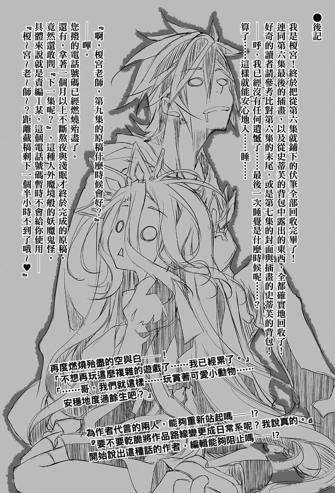

# 后记

> 来源：https://www.linovelib.com/novel/9/2113.html

我是梗宫!终于把从第六集就铺下的伏笔全部回收完毕了！

连同第六集最后的插画，以及从史蒂芙的背包中露出的东西，全都确实地回收了！

好奇的读者请参考比对第六集的末尾，或是第七集的封面与插画的史蒂芙的背包！

——呼，我已经没有任何遗憾了……最后一次睡觉是什么时候呢……？

算了，这样就能安心地入……睡……

『啊，榎宫老师，第九集的原稿什么时候会好？』

——哔，

还有，拿著一个月以上不断熬夜与浅眠才终于完成的原稿，

竟然还敢问『下一集呢？』，这种人外魔境般的妖魔鬼怪，

具体来说就是责编I某，这个电话号码暂时不会给你使用——

『榎～宫～老～师～？距离截稿剩下一个半小时不到了哦～❤』

再度燃烧殆尽的空与白——！

「不想再玩这么复杂的游戏了……我已经累了。」

「……哥，我们就这样……玩赏著可爱小动物……

安稳地度过余生吧？」

为作者代言的两人，能够重新站起吗——！？

『要不要乾脆将作品路线变更成日常系呢？我说真的。』

开始说出这种的作者，编辑能够阻止吗——！？

