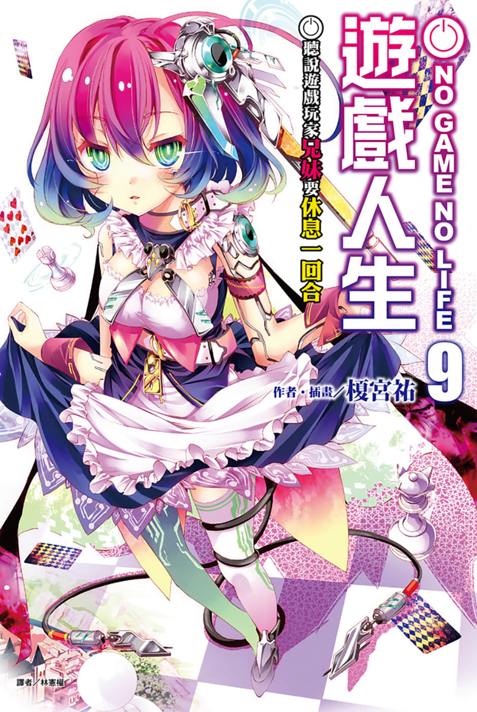
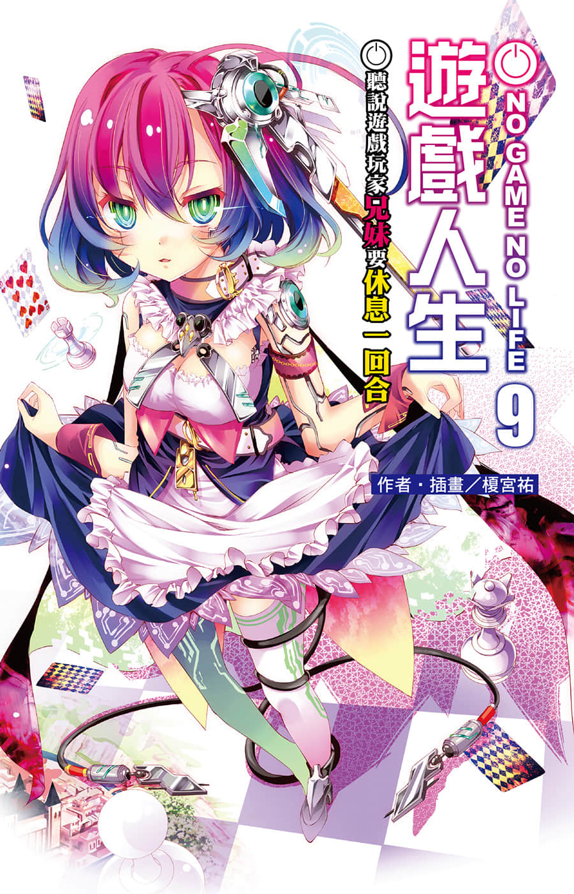
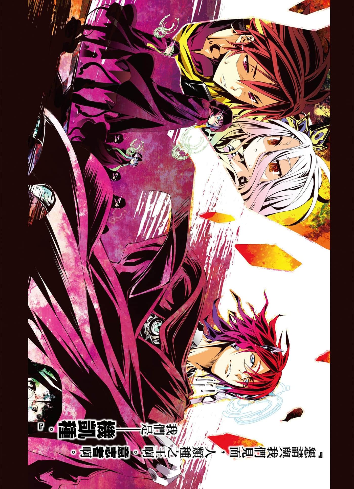
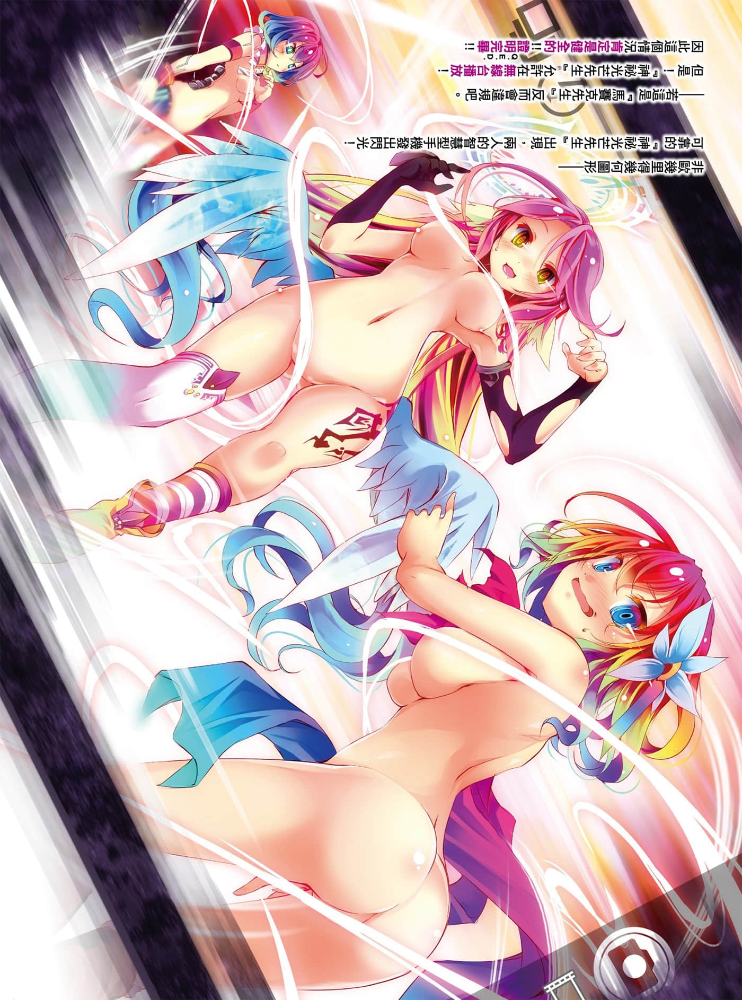
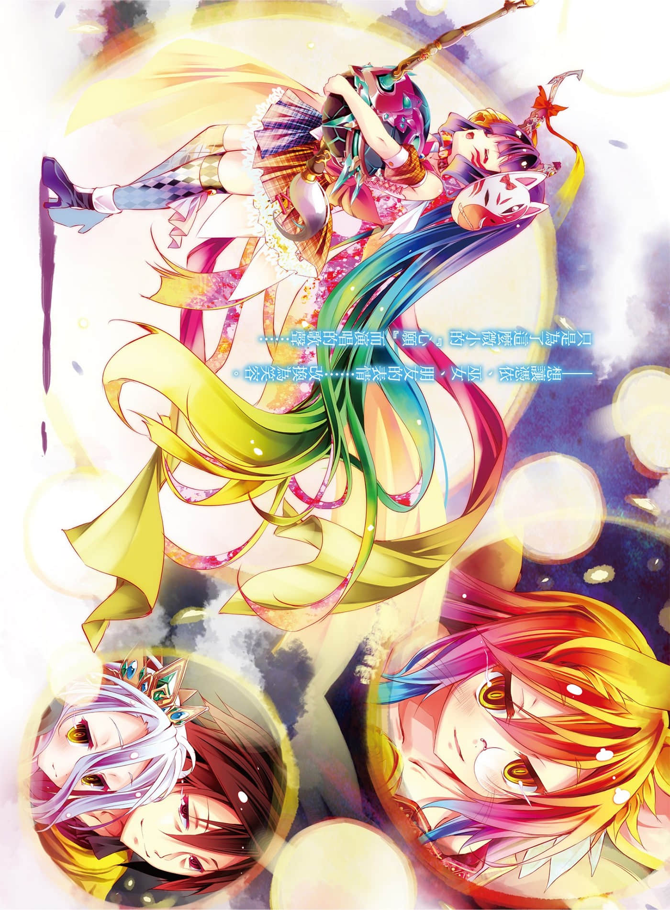
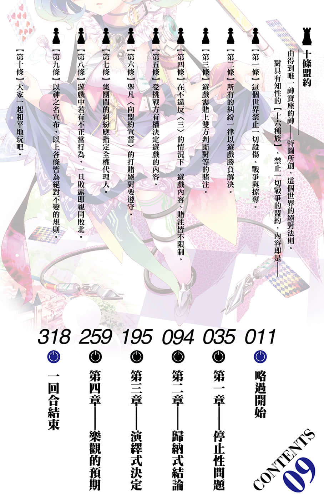

# 插图

> 来源：https://www.linovelib.com/novel/9/118069.html

台版 转自 深夜读书会

作者：榎宫祐

插画：榎宫祐

译者：林宪权

图源：深夜读书会

录入：深夜读书会

深夜读书会：ritdon.com

仅供个人学习交流使用，禁作商业用途

下载后请在24小时内删除，深夜读书会不负担任何责任

请尊重翻译、扫图、录入、校对的辛勤劳动，转载请保留信息

————————————————

【内容简介】

机凯种现身！！

穿越六千年的意念，将再度写下新的传说！

一切以游戏决定的世界【迪司博德】——空与白终于击败神灵种。对于持续扩张的艾尔奇亚联邦，全世界无不加强警戒，国内外紧张的情势高涨——但是！……这些事姑且先放一边。在城堡挂上『暂停营业』的牌子，放下内政不管的空白Ｐ，正倾全部心力要将神明・帆楼打造成偶像……

就在混乱的情势全力加速的时候，就像是看准了这个时机般，空的智慧型手机响起。位阶序列第十位的『机凯种』……结束过去大战的机械男子敬告——

「『心爱的人』啊，我好想你，来，让我们培育爱苗吧！」

『最新的神话』休息一回合……！？ 超人气异世界幻想故事的第九集！！

【作者简介】

榎宫祐

【绘者简介】

人类引以为傲的『弱小』──那也太弱了吧，宝贝。

……嗯，你看吧？要开始忙碌啰～！！

祖先们啊，人类为什么没有灭亡呢？（哲学）

榎宫祐

我是榎宫。剧场版的工作人员问我「具体来说，人类是如何在『大战』存活下来的呢？」嗯……我完全摸不着头绪啊──！？

我是榎宫。故事在前一集也到了一个段落，我顺利地成为一个孩子的父亲，育儿假也结束了！好了，该一边养育孩子，一边写稿，展开新的生活了！！在工作的同时，摸索着执笔速度与节奏，要开始忙碌啰～！就在我这样振作精神的时候──决定要推出剧场版动画了。

