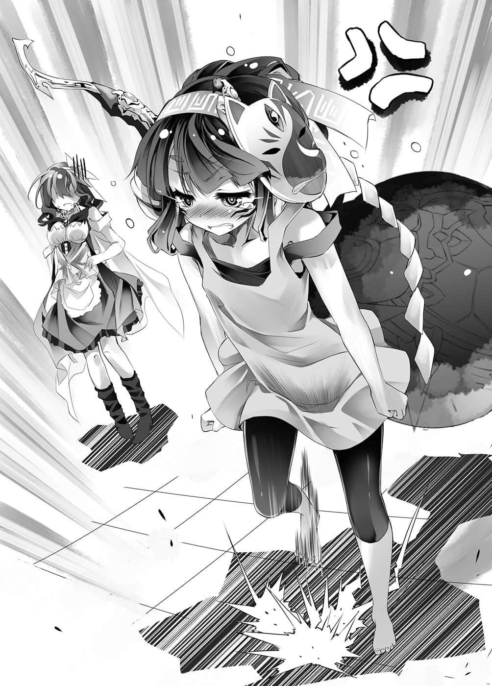

# 略过开始

> 来源：https://www.linovelib.com/novel/9/2115.html

——尽管突然，不过我们来讲解前情提要吧。

可能会有人抱怨是不是有点太突然了？不好意思，恕我不接受那样的申诉。

凡事往往需要『重新整理』。

当今这个时代，如果每次读取进度都要看一遍前情提要，那个游戏想必会获选为ＧＯＴＹ年度最烂游戏。

但如果只看一次的话，请怀着宽容的心情，睁一只眼闭一只眼吧。若您还是会在意，请直接跳过这段。

——故事舞台位于『盘上的世界迪司博德』。

依据『十条盟约』，那个世界禁止所有武力，一切以游戏决定胜负。

降临于那个世界的是——地球出身，只有玩游戏这个长处的两兄妹。

不，这样的形容太简略了，请容我郑重更正。

这对兄妹——空与白是家里蹲的废宅，而且有沟通障碍。在废人之道方面，研究颇深。

而他们的另一个身份，是在各种游戏写下『不败』战绩的『 空白』——两人即一人的玩家。除了那个身份之外，两人几乎为社会所排斥。而这样的他们所降临的地方就是——『艾尔奇亚王国』。

这是曾经被逼到只剩最后一座城市，濒临灭亡的唯一人类种国家。

而空与白两人不费吹灰之力就当上了艾尔奇亚的国王。

面对可以使用魔法和超能力等官方认可外挂的【十六种族】，这对兄妹接连和不同种族比赛游戏。

不过，很遗憾的是，两人跟爱、友情或正义这些属于优等生的正向理念合不来。

他们带领着欺瞒、舞弊、虚假、虚张声势、权谋术数等，如同损友般存在的手段，陆续以游戏打败天翼种、兽人种、海栖种以及吸血种。

最后终于连神灵种——『神』也败在他们的手下。

他们不奴役、支配、压榨那些败者。

而是将之纳入『旗下』，于是『艾尔奇亚王国』成为『艾尔奇亚联邦』，转变为史上第一个『多种族联邦国家』，至今领土仍持续扩张中。

两人仅仅花费了数个月的时间就完成如此丰功伟业。

简单说就是比起集中，万物会更趋向于平均分散的原理。

以及要赢得游戏需要持续地努力——输掉游戏则毫不费力……

「你们完成这样的伟业，人民非但不给予赞赏，反而感到不满——你们知道是为什么吗！？」

没什么好隐瞒的，她就是如假包换的神，位阶序列第一位的——神灵种。

空与白断定，再怎么样也不会有那种评价，两人只想到各种毁谤中伤的话语。

「他们都称呼你们是『无影之王』——对救国之主的『不信任感』，可是有增无减哦！！」

（译注：日文的９８９也可以读作空白。）

而在歇业中的艾尔奇亚城内……更正。

「总比被人说国王脑袋有问题来得好吧！？」

根据钉在石碑上的木板所写，这座城似乎名叫『９８９艺能公司㊟』。

「两位知道现在外面的人怎么称呼你们吗！？」

也就是努力将神灵种——帆楼『打造为偶像』。

这个事实不禁让人怀疑他们是不是疯了，史蒂芙无奈地垂头丧气。

「……就是因为这种没干劲的态度……才会被称为……宽松世代……！」

听到史蒂芙的回答，两人内心松了一口气，空似乎很开心，白则是不满地抱怨着。

听到史蒂芙终于肯用那个称呼，空与白这才回过头来，故意装得好像刚听见似地。

他们觉得奇怪，接起手机一听，电话里传来的话语是——

前者是帆楼——她是一名少女，身后还跟着一个飘在空中的墨壶，大约与她的身材一样高。

她的呐喊还包含了另一层含意——艾尔奇亚国王的精神还正常吗？

——这里是仍存在时的艾尔奇亚联邦・艾尔奇亚王国。

---

■ ■ ■

在同样挂着木板，上头的字如今被改成『练习室』的议事堂内——

博取意中人的好感很困难，被讨厌却只是一瞬间的事。

竟然能让神愤怒跺脚，在某种意义上也算是伟业了，只见两人轻声一笑——

巨大的看板吊挂在尖塔上，上头堂而皇之地写着：

手机在异世界不可能响起，先前也一直收不到讯号。不对，因为根本没有朋友会打电话给他们，所以不管在哪里，手机都不可能响起，但它如今却响了。

看来除非使用那个称呼，不然他们是不会有反应的。

神被两个废人弄哭——史蒂芙冷冷看着眼前的可笑光景。

「吾也不明白干劲是什么意思！可以不跳的话，吾就不跳了！！」

只有红发少女史蒂芬妮・多拉——通称史蒂芙之人的脚步声响起。

事到如今，史蒂芙也不可能不知道这一点，她虽然似乎也死心了，还是不免要问——在王城挂上歇业的牌子，让城内所有的人放假，甚至关闭城堡，这样做到底有何意图。

在每个人都被命令休假，如今空荡荡的城内。

「完全模仿是没有意义的！你不是机器，要投入感情啊！」

年幼少女哭丧着脸，抗议空与白的指示意义不明，而本身正是不折不扣宽松世代的空与白，则是忍不住叹气。

听到帆楼的抗议，坐在椅子上的空与白齐声叹气，然后——

话说回来……

比如说，要将房间收拾整齐很辛苦，要把房间弄乱却轻而易举。

空与白心想——嗯，怎么称呼我们呢？

不过，或许是对两人满不在乎的样子感到焦虑吧——

在音乐游戏和跳舞游戏都拿到最高分的两人这么说道。

没错，就是一切，王位、全权代理者的宝座——全部都失去了。

总的来说，破坏比建设容易，失去也比维持简单。

「照着谱跳是外行人干的事！『诠释』乐谱，使观众热血沸腾，那样才是高手！」

跳完后，空与白直接趴在地上喘气。

后者是空与白——身穿有『Ｉ❤人类』字样上衣的哥哥与白发红眼的妹妹。

对于帆楼而言，要完全模仿看过的动作是轻而易举，然而——

看到两人维持一贯无视自己的态度，史蒂芙大大地叹了一口气，然后——喊出那个称呼。

凡事贵在持之以恒。即使他们是废人，旁人为这些功绩鼓掌喝采一下应该也不为过吧。

这个道理很简单，相信每个人都有类似的经验。

相信很多人都知道『熵增加原理』吧。

——好了，前面都略过未读的各位读者们。

「好了，帆楼！再从头跳一次『天神ｓｕｍｍｅｒ救救我☆』！要开始啰！」

就像这样。

——两人缓缓地站了起来，口中哼着歌，脚下踏出舞步。

先前说到的空与白，他们两人也依循熵增加原理——失去了一切。

「什么！！叫你别跳你就真的不跳，你是现代小孩吗！？」

「……我、我没有体力、跳那么多遍……请你要明白。」

靠着两人的努力不懈，濒死的都市国家艾尔奇亚，如今除了成为世界屈指可数的大国，同时也成为世界最大的威胁……不过这些事情先摆一边。

「帆楼可是依照汝等的指示在跳！汝等要明确指出问题所在！！」

『恳请与我们见面，人类种之王啊。意志者啊，我们是——机凯种。』

但是空却完全没发现史蒂芙，只是专注于以夸张的言词大肆批评帆楼。

他们累积起的一切成就，全都从一通电话开始崩坏。

虽然极力想隐瞒，不过很遗憾——他们就是艾尔奇亚的国王，两个人都是。

「Ｐｒｏｄｕｃｅｒ制作人————！！」

「我以为你们是说笑……不，老实说我一开始就不认为你们会是说笑的。」

空与白只要说出口，就不会只是说笑。

接连打败上位种族，甚至战胜了神……伟大的中兴圣主？

「……没干劲的话……就别跳了……！」

---

■ ■ ■

「明天就是你出道登台的大日子哦！！都已经到前一天了，你那是什么舞步啊！！」

「不行！！帆楼，你那副模样也想成为偶像天后吗！？」

空与白究竟在做什么，甚至不惜封闭城堡？——眼前的景象就是答案。

「嗯？哎呀，你来了啊，经纪人。」

「……可以轻松点……称呼『Ｐ』就好。」

「……虽然我们跳的时候、都没有观众……因为我们不是玩、电视游乐器……就是在没人的时候、玩机台……」

就连史蒂芙也惊讶得说不出话——因为他们表演的歌曲与舞步，只能以完美形容。

但是帆楼大声抗议，愤怒地跺脚。

帆楼含泪对着只会下达模糊指示的无能制作人喊叫。

史蒂芙伸手指着他们说道。

「可是何谓『诠释』，汝需要明确定义要投入什么感情呀！」

「呼……呼……！所以说、就是要这样跳！你明白、了吗！？」

但是空却仅仅注视着帆楼唱歌跳舞，一副懒得搭理的样子。

除了前情提要之外，我也顺便来『爆雷』吧。

辛勤工作赚来的钱，拿去抽扭蛋很快就会花完。

「……名称有点……太中二病了……」

「什么啊，只不过如此吗——话说那称号还挺帅的吧？」

「『跟先前的指示不同』呀！！」

「即使如此，我仍要向你们确认——你们让内政停摆，是想要搞垮这个国家吗！？」

「欸～？不让员工休息，人家会说我们是血汗国家呀……」

——『歇业中』。

堂堂耸立于首都中央的艾尔奇亚城——现在出现了一面看板。

……话说回来，在此之前，史蒂芙已经叫了空与白的名字四次了，但是——

史蒂芙的语气反而似乎比空他们更感到不甘心。

不过就算问他们为什么，两人也说不出来。

面对这个难题，两人深思熟虑后，露出微妙的表情——

「陷害别人，让那个人爱上自己，或是擅自赌上『种族棋子』，那种人怎么会有人肯相信呢？那只不过是诈欺师，就算被当成下三滥也无话可说吧。」

「啊哈～～❤你有自觉真是太棒了～♪再来就只要努力改善就好了呢！！」

空反过来问——自己凭什么受到信任？

只见史蒂芙转着圈子跳着舞，有如歌唱似地接着说道。

她的舞蹈既优雅，又充满情感，就像在跳芭蕾舞一样。

「不～我也明白人不可能马上改变～必须按部就班，一点也勉强不得～比如说——就连对我，你也不肯透露你葫芦里卖什么药。为了改善你那种诈欺师的性格！首先，就从告诉我为什么让内政停摆开始～这样如何呢——！？」

她愈说愈激动，最后演变成出现残像的霹雳舞。

——真想叫帆楼向她学习。空与白的脑中同时冒出相同的想法……

「为什么让内政停摆……？没什么理由……反正也没事可做吧？」

因为现在艾尔奇亚——『无事可做』。

空说出第一个理由，不过史蒂芙似乎无法理解，她提出反驳——

「怎么可能没事可做！工商协会先前不是很猖狂吗？」

……工商协会……嗯～……那是什么？

「就是那些靠着资源外销剧增而得利的贸易业者与诸侯！日前空和白跟他们全部的人挑战游戏，利用【盟约】强迫他们签下文件的那群人呀！！」

「啊，不是啦，没问题，我记得啦，就是那群妄自尊大的家伙们吧？」

空没有说谎，他记得那些人，只是他没说直到刚才自己都忘了他们的存在。

然后空与白同时心想。

「就算吾暂定采用那样的主张，假设汝等的指示是要吾像凭依那样——」

要培育偶像，眼前就有一个前所未有的杰出人才。

两人用力点着头说道，史蒂芙则冷冷注视着他们。

（编注：亚瑟王传说中的岛屿，为古老宗教中心地。）

「这是你第十九次这么问了，我的回答还是与前面十八次相同——因为这是你的天命！！」

「……我们最缺乏的东西……就是凝聚力群众魅力……」

「凭依没有唱歌跳舞！到底有何理由，要帆楼从事这种莫名其妙偶像的行为！！」

空大言不惭地说出逻辑跳跃的七段式论述。

帆楼的表情就像在说：听见了，但是无法接受。她回答道：

从空的表情中，史蒂芙似乎感觉到某种黑暗的情感，不过她决定不予理会。

空如此高谈阔论，史蒂芙却以冰冷的眼神注视着他。

「没错！她甚至已经突破11次元，名符其实是不同次元的偶像！」

史蒂芙这么大叫之后，伸手指着空他们说道：

说完之后，空心想……试着想像一下吧。

「那么汝等就具体指示怎样才是『完美的偶像』！吾会扮演得非常完美！」

「她是活生生的希望！就算有了男友，结婚了，年老了，歌迷也能够流着泪为她祝福——这就是我们描绘的远大理想阿瓦隆㊟，也就是完美的偶像……」

「但是——我说过了，我们是要把帆楼打造成『顶尖偶像』。」

「当然有关连啊，我们要借用帆楼压倒性的群众魅力赢得权威。」

更何况国家急遽地扩大与改革，人民的国民意识、经济建设和法律修正都无法跟上脚步，国内问题麻烦事也与日具增，其中之一就是资本大增的暴发户们在闹事——

「唉～……还不知道别国什么时候会攻来呢……」

「……简单说，这个偶像活动本身就是你们的兴趣吧。」

听到帆楼这么说，空与白却叹一口气，摇头回应：

「毕竟帆楼不会老，也不用上厕所！这样你还要问为什么选帆楼当偶像吗？」

「我说过了吧，我让城堡歇业是因为无事可做。」

「吾不懂。」

不过！『王两人』露出得意的笑容，因为如果要比被讨厌的功力，其他人就望尘莫及了。

艾尔奇亚联邦因为急速扩张而产生的国内问题……确实很麻烦。

「我也不懂。」

「今日事不今日毕……明天的你会引以为耻……帆楼。」

「嗯？不会有人攻来哦！」

「所以理由很明显！现在艾尔奇亚欠缺一项重要关键。」

若是不将她打造成偶像，那就是糟蹋上天赐予的珍宝吧。

说了老半天，结果却是『他们自己也不懂』。

然而帆楼本人却面露不满，默默地将疑问记录在卷轴上。

「能够跨越种族藩篱，让国家团结一心的要素……那就是『爱』。爱是意念，是信念——也就是信仰，而能凝聚信仰的就是神，也就是偶像，就是明星啊！偶像明星必然是美少女，因此那个人选就是帆楼！这个理论毫无破绽，要是能够戳破这个理论，你就放马过来吧——！！」

史蒂芙冷冷回答，帆楼则保持不满的表情继续说道：

因此，空露出远望无尽理想的眼神……发自真心地说道……

「帆楼，我记得你说过你是『多元知性』吧，那是几次元？」

「帆、帆楼还要问！汝等说的话，有一半以上吾都无法理解——喂！空、白！」

「两者毫无关连！汝等欠缺凝聚力跟帆楼有何关系！」

「唉……我们确实精通众多偶像养成游戏。」

她脸上的表情就像在说：在这种紧要时刻，国王却不务正业……不过算了。

「那个工商协会是怎么了？问题不是解决了吗？」

「…………」

「你瞧不起人吗！？我们若是有群众魅力，也不会窝在家里当阿宅了吧！」

而且，不仅表面上在游戏取得胜利，对上世界最大国家爱尔文・加尔得也不战而胜，间接掠夺其领土，引发其内战，这甚至会让各国怀疑，自己的国家是否也正遭到分化。

正在逐渐崛起的大国？多种族联邦？那些根本不重要。

「不懂也没关系！因为实际上我们也还不明白呀！」

或者甚至超越我们的理想——空露出温柔的笑容这么想。

——所以走扩张路线的大国玩法才麻烦。

空说得慷慨激昂，这时他停下来，转身询问帆楼——

然后空咧开嘴，露出下流的笑容说道：

「……是我的错觉吗？空，我感觉你的话中好像夹杂着私怨。」

空与白不禁心想——如果有那样的国家，我一定马上移民过去！

「不过，我确信帆楼自己会体现我们的理想。」

「现在就是考验你们身为国王的统御力——群众魅力的时候了哦！？」

「就是你们的强硬手段火上加油！他们的不满有增无减呀！」

「也就是说，『培育终极偶像』就是国家的最优先计划！」

空与白无意义地来回踱步，说出两人心中所定义的偶像为何。

两人一点也没有自信能够受人喜爱。

空再重复一次让内政停摆的『头号理由』。

空高声地说出『第二个理由』，然后望向帆楼。

「……要戳破诡辩确实是不可能呢。」

但是城堡的运作一旦停摆，史蒂芙反而更容易辅佐。

他们也心知肚明，多种族联邦这个构想本来就难以让人接受。

「……既不是二次元……也不是三次元的——『完美偶像』……」

没错，就好比东部联合的巫女那样——空得意洋洋地说道。

更何况帆楼又有姿色，如果是神灵种的话，相信演技也完美无缺吧。

「喂～帆楼！我们说的话你听见了吗～？」

「……打造完美的角色……并不是那么困难……」

「那就好！帆楼，我们再继续练习，『天神ｓｕｍｍｅｒ救救我☆』从头再来一遍！」

史蒂芙露出仿佛吃得太撑的表情，明显对空的话感到反胃。

「你们懂了吗？」

史蒂芙无言地询问空的真意，而空也明白她想说什么。

身为国家权威象征的人物，竟然是天上天下独一无二、名符其实的神级美少女，同时又是『完美的偶像』——

「很简单啦，简单说就是为她准备好小露性感的舞步和服装，歌曲中加入『我喜欢你』这种歌词，让她脸不红气不喘地说出『我是各位歌迷的恋人～❤』这种台词！为了让歌迷以为自己也有机会一亲芳泽，就举办握手会之类的活动，缩短与歌迷的距离，如此就一举达阵啦！」

「失礼，你真是太失礼了！！这可是兼具兴趣与利益的完美计划耶！！」

「我可以打包票，这样就会聚集很多粉丝，赚到大把大把钞票哦。」

空得意地说完最后一个，同时也是格外重要的要素之后——

「……不……够了……我已经听不下去了……」

慷慨激昂地陈述完之后，那个男的与他的妹妹宛如沉浸在余韵中一般，陷入短暂的沉默。

所谓既顶尖又完美的偶像，那就是——！

这种说法完全不符合原来世界的最新物理学，空就当作参考一般随便听听，继续昂然提出他那尊贵的理想——！！

只要简单扼要的一句话，就能形容如今的艾尔奇亚。

「不会有人攻来的，谁也不敢对现在的艾尔奇亚出手。」

空寻求他人认同自己的理想，却被神和人立刻否绝。

「我们要的是！兼具二次元不合现实的精神性！！又具备三次元浑然天成的真实存在感！！既非2.5次元，也不是3.5或4.0————呃～？」

艾尔奇亚现在——『无事可做』。

「……那就是……群众魅力……拥有凝聚力的……『象征』……」

但是连城堡——实质的联邦政府也停摆，史蒂芙就算想辅佐也莫可奈何……这才是史蒂芙真正担忧的事。

艾尔奇亚是成长茁壮中的大国，不仅平定多个种族，打败上位种族，还将之收编麾下。

因为相较于国外对艾尔奇亚国王——空与白的看法，国内问题根本就是小巫见大巫。

「这、这要视定义而定，不过——『神髓』的核座标是假设在13＋iR的变动次元上——」

帆楼徒劳地抗议，她被空与白拉着手拖走，史蒂芙则是叹了一口气——

听到史蒂芙的自言自语，空立即回答道。

如果只是要像巫女——凭依那样的话——帆楼继续说道：

就算首相空与白不值得信任，帆楼仍能发挥凝聚国家团结的功效。

「……（点头点头）」

那就是——对每个国家掀起战争游戏的『征服王』的国家。

而且是连战皆捷，甚至击败了神，由神秘『国王』所统治的国家。

以战略游戏来比喻的话——这就是赢得太多了。

这么一来，全世界玩家很可能联合起来，艾尔奇亚马上就会面临来自四面八方的围剿。

然而——空却无所畏惧地笑着说『那是白费力气』。

「现在不会有人敢向艾尔奇亚——也就是向我与白挑战游戏。」

虽说赢得太多是很危险的事，不过也正因为如此，所以别人才不敢出手。

而那也正是空他们不满的地方，空似乎感到很无趣，他继续说道：

「可是他们也不能对我们置之不理，所以他们——只能对我与白以外的人下手。」

「……啊！难道说他们会从东部联合或奥仙德开始各个击破吗！？」

史蒂芙叫了出来，她似乎这时才终于想通，身为联邦中枢的艾尔奇亚行政机关停止运作也不会有问题的其中一个理由。

没错，除了艾尔奇亚以外的其他国家，现在都不是顾得上他们的时候。

面对其他国家派入刺探、分化的人员——

「对……可是东部联合的游戏至今仍是必胜方程式……那么结果会是？」

——他们正忙着全力痛宰肥羊……根本无暇分身。

「话虽如此，现在却也还不是我们进攻的时候……所以『无计可施』，这种时候最好的做法是？」

「……『休息一回合』……」

「…………」

——原来如此，现在敌方正在暗中运作阴谋陷阱，准备对付空他们。

联邦旗下的国家则是毫不客气地将计就计，没时间管艾尔奇亚。

「我们只是以我们的专业——用游戏玩家的方式来解决事情。」

空苦笑着心想——我们本来就不是那个料。

听到空笑着这么说——

史蒂芙故意刺激空，提起他曾错算几件事导致必须认输的事，空闻言则不服气地反驳。

「史蒂芙也开始明白了嘛！来，这个给你！」

「……哥，没问题……若说办不到……那是骗人的话……」

「……我们打从一开始就不要求人民的信任和信赖。」

「凡事最好还是交给专家，政治就交给政治家处理。」

「……哥，太逊了……跟小学生一样……」

然而史蒂芙却仍然不能接受，有必要因为那种理由就停止艾尔奇亚的内政运作吗？

「……唉……我明白了啦，你们两位做事有经过深思熟虑吧。」

「可是空啊，你最近经常做出错误判断呢……真的没问题吗？」

——史蒂芙大概也发觉他们的眼神中失去笑意了吧。

「……这是帆楼的……服装……」

但是看到白降至冰点下的眼神，他自暴自弃地这么叫道。

【——了解，全体准备与对象交战，开始预先演算。】

史蒂芙与他们认识的时间也不算短了，所以她不至于看不出这一点，然而——

——日前与帆楼比试的游戏——对神灵种之战。

他们全身被长袍所遮盖，帽檐压得很低，连长相也看不见。

他们对失败充满懊悔，不敢有丝毫轻忽大意——

见到空他们依然不打算告诉自己详情，她心想至少要做点反击。

史蒂芙苦笑着说道，不过她似乎仍有不满。

「错误判断！？你说谁做出错误判断啊！？是哪一天？在哪里？几点几分几秒？这个星球转了几圈的时候！？」

「我们正愁没人会做针线活呢，期限是明天之前，一定要赶上哦！！」

一步又一步地，朝着空笔直前进…………

空与白将数张纸丢给她，满脸笑容地说道：

「货真价实的小学生有资格说我吗！？对啦，我是误判了啦，不会有下次了！」

「……仔细想想……只有我没休假……」

「然后呢！不惜让内政停摆，你们打算如何使唤我呀！」

笔直地，一味笔直地前进，那也就是说——

【解析体传来报告，目标锁定，人类种・全权代理者——推定名称为『空』。】

两人的语气和言词虽然嬉闹，不过内心却完全相反。

---

■ ■ ■

【观测体传来报告，确认有神灵种反应，目标座标推定为『艾尔奇亚王城』。】

没错，所以——游戏就交给游戏玩家。

就算被称为国王或全权代理人，空他们仍然只是一介玩家。

这队黑色人马一边共享从广域观测与分析人潮声音得来的情报，一边笔直地前进。

在插满各式各样旗子的艾尔奇亚城外。

反正你们就是为了这个目的才封锁城堡的吧？史蒂芙苦笑着这么说。

有一队黑色的人马，穿梭于人群之间，走在充满商人叫卖声的中央大街上。

这群人的打扮，简直就像在宣传自己是可疑人物，他们有如行军一般，默默地前进。

仿佛遵循旗子就是为了被回收而存在的宿命。

空与白——这两人做任何事……『背后』一定另有算计。

看到这两个国王如此残忍差使她，史蒂芙眺望远方喃喃说道：
