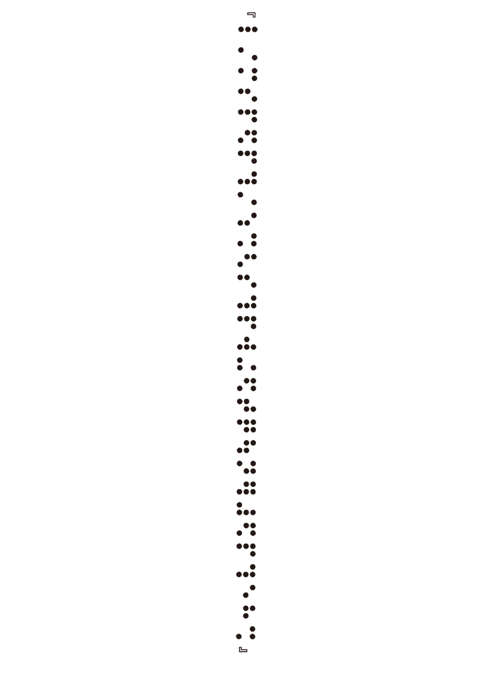
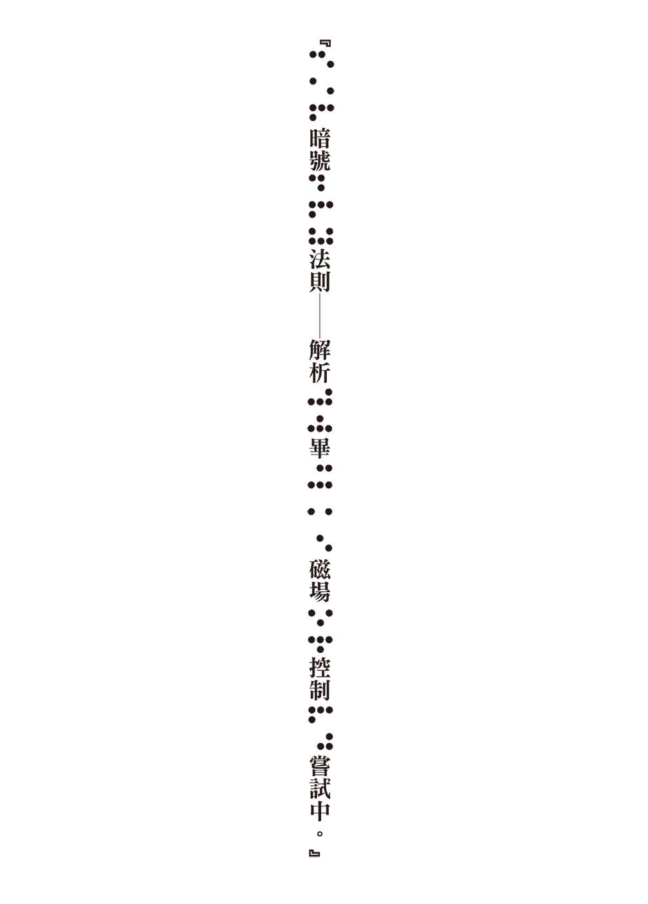
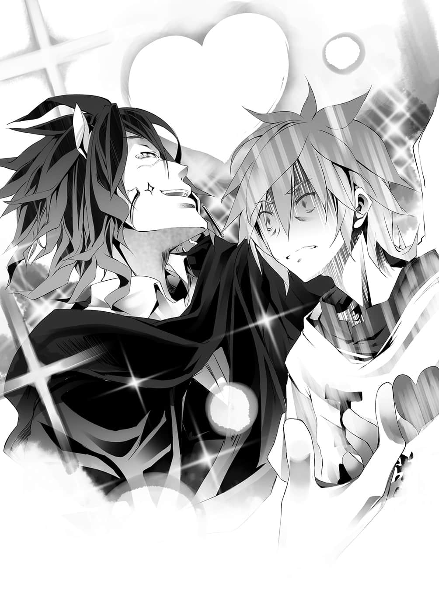

# 第一章 停止悻问题

> 来源：https://www.linovelib.com/novel/9/2116.html

那里是过去空与白举行国王加冕演说的场所。

艾尔奇亚城面向广场的露台上，如今站着一名少女。

少女身穿轻飘飘的衣服，带着浮在空中的墨壶，她闭目静待。

等待空他们所说的『偶像出道登台的大场面』……等待宣告开始的音乐声响起。

只听巨大的声音响起——以高分贝的音乐为信号。

「帆、帆楼叫做帆楼！虽然搞不懂是怎么回事，不过似乎……是偶像！！」

帆楼莫名其妙地报上名号，然后口中唱着歌，身体随之舞动。

正如她所说的，她似乎什么也不明白，不过却毫不灰心。

即使开演前一刻拿到的剧本上，只有写一句『问候・即兴发挥』，她也不气馁。

身为神的少女——帆楼，甚至没有自觉眼中泛着泪，开始唱歌跳舞——

---

■ ■ ■

有四个人比任何人都还要紧盯着她的表演。

其中一个是天翼种少女・吉普莉尔，她面露嘲笑，从上空注视着帆楼。

以及将吉普莉尔的视角投影至眼前，透过魔法荧幕注视的三人——

空与白不悦地坐在王座上，他们身旁还有因彻夜未眠而昏昏欲睡的史蒂芙。

——好了，话说回来。

先前史蒂芙彻夜制作服装，口中不断这样碎碎念：

原来如此，空与白打算让别人误以为帆楼才是主谋。

但是，突然有个少女跑出来说『我是神，空他们的成就都是我的功劳，还有我是偶像。』——

这种梦话到底有谁会相信呢？

更不可能会有笨蛋为她欢呼声援吧。

「……让他们知道……跟『行政』作对……会有怎样的下场……」

「你们是说帆楼吗？曲子很好听，她也努力达成你们的无理要求了呀。」

所以他们的音乐是结合海栖种莱拉她们的感性歌词与森精种菲尔的理论和弦，靠着异世界的技术平板电脑ＡＰＰ的编曲而成。

以为我们弱小而加以轻视——那可是找错对象了！！

别说是声光特效，他们也能在物理上使景物改变吧……可是！

史蒂芙眼神中怀着对人类种的忧虑，远望着那些人，空则是笑着继续说道：

回想起来，在那场攸关存亡，赌上『人类种棋子』的对东部联合之战，他们在看到胸罩和内裤破裂时也欢呼喝采。这样的国民素质，国内问题就算放着不管也不会怎么样吧？

「如果有时间的话，我早就拜托了啊！他们当天才说要取消，所以我才会生气啊！！」

「是啊……歌曲好听是理所当然，帆楼也很努力，正因为如此才更令人生气。」

（编注：日文音同史蒂芙。）

「……有什么关系嘛，重要的是帆楼吧？」

对空这一席有些讽刺的话，史蒂芙叹了口气。

「弃子㊟，注意问题叙述啊，你回答的是只有一部分人『认识的我们空与白』吧。」

大约有数千人聚集在广场上，为帆楼欢呼声援。

两人在回答中夹杂着批判——指摘出她的错误。

「竟敢与国家权力为敌，真是好大的胆子，很好，就从他们开始击溃。」

不管是怀疑还是希望，拒绝还是期望，那些全部都会增加帆楼的力量。

空指着吉普莉尔投影的魔法荧幕上——帆楼所站的舞台露台。

史蒂芙说的其他人……没错，就是艾尔奇亚联邦旗下的其他种族。

「击败森精种无法打败的东部联合！也击败长久以来无人能败的奥仙德！打败天翼种，最后连神灵种也击败！甚至达成史上第三次的『杀神』，如今已是令世上恶人闻风丧胆的超强英雄！但是真实身份——！！」

不过却因为白的一句话而作罢——……如果是ＪＡＳＲ〇Ｃ㊟的话，即使是异世界，他们也会追来的哦！

可能还是无法理解何谓『诠释』吧，帆楼的动作生硬，唱歌也没有投入情感。

所以空他们暗自窃喜，认为这是最棒的独占市场。

——两人反而问她问题，史蒂芙慌张地列举所能想到的答案。

「……唔～什么事？击垮东部联合的……艺能公司……挖角旗下艺人。」

——嗯。

他就像舞台上的演员般，动作夸张地比手画脚，以高亢的声音热情叙述——！

「可恶，完全不行啊，哼……别以为我会善罢甘休哦。」

看到舞台变得如此简陋，空与白一同舔着嘴唇，露出狰狞的笑容。

「问题在于舞台啊！舞台！那个寒酸的布置是怎么回事啊——！！」

不过照情况看来，东部联合不但有艺能业，也有经纪公司，甚至似乎也有——勾心斗角的文化。

看到这个情景，空大声怒吼——

而且最重要的一点，空目光锐利地断言道：

——当初他们本来打算使用智慧型手机里，原本世界的畅销歌曲。

听见两人口中说出的完全是坏人的台词，史蒂芙拼命地向他们大喊。

「…………这不是真的吧…………」

如果借助吸血种的幻惑魔法，确实是轻而易举，不过——布拉姆会出手帮忙？不可能。

「我倒是打从心底希望他们有问题……」

大型艺能公司？那又如何。

「……人类种或许已经没救了……」

「只是普通的人类？说出来有谁会相信啊。」

接着两人缓缓转向史蒂芙，不是要回答她，而是——

「个性恶劣，人格扭曲，又是诈欺师——」

「可爱的女孩子卖力地在唱歌跳舞……即使搞不清楚状况也要挥手啊，不挥手才有问题吧！！」

——正因如此。

「什、什么！？」

「……呵、呵呵呵呵……好大的胆子……」

「我可是在思考之后要怎样行销哦！还有比这更重要的事吗！？」

「虽然听不太懂！那拜托其他人不就好了吗！？」

他的语气一转，以冰冷的口气做结论。

「竟然因为经纪公司施压就突然取消运送器材！？他们是什么意思！？」

「这不是大公司在霸凌小团体吗！完全是恶意妨害了吧！？」

而负责演唱和舞蹈的帆楼确实也很卖力。

「顺便告诉你，只要有帆楼坐镇，我们就不会受到攻击。」

所以好听是理所当然，只要有平板电脑，在异世界也可以制作音乐☆

这么重要的出道演唱会，他们竟然表示不肯出借器材——而且是到了当天才告知。

「可以请你们不要正大光明地宣告要滥用国家权力好吗！？你们怎么说也是国王耶！！」

史蒂芙似乎仍不明白，空从王座起身。

「呃……？」

「比起那种事，空？白～……？唉……制作人！」

（译注：指ＪＡＳＲＡＣ，日本音乐著作权协会的英文简称。）

「……答错～……好了，十秒到了……超过时限……史蒂芙是……笨蛋。」

天翼种吉普莉尔、神灵种帆楼、吸血种布拉姆等等……这些人都能够使用魔法，确实能帮上忙。

我们９８９艺能可是天下第一的『国营艺能公司』！

至于帆楼，她则需要花更多时间来理解空他们的意图。

空这么大喊，似乎感到颇受伤的样子。

看到空情绪激昂，不明状况的史蒂芙试图安抚，但——根本是火上加油。

「我先前也说过，没有必要相信。」

「那么，尽管突然！这时请史蒂芙回答一个问题！！」

「那些在广场上挥着手的人们，他们真的相信帆楼是主谋吗！？」

「那才是最无关紧要的吧！？比起那种事——！」

「而且甚至不是普通的人类。即使在人类中，我们也是处于相当低等的废宅游戏玩家。借用某王族的说法，一个性格恶劣兼人格扭曲的诈欺师，办得到那种伟业吗？」

对今后的计划做了某种程度的修正后，空与白微微点了一下头。

「喂，不要认为『骂光头是秃子有什么错』！事实是很伤人的哦！！」

因此，史蒂芙才会不断询问空他们『背后的意图』。

所以音乐只有靠白手机的播放音量，以及帆楼增幅自己的声音。

「我们问的是不认识我们的大多数人——『大众世界』所『认知的空与白』。」

「……什么？」

没错，直到此刻从魔法荧幕听见『唔喔喔喔喔喔』的欢呼声为止。

「……『空与白被认为是什么人？』……限时十秒……」

史蒂芙打断空与白深不可测的谋划，继续大声说道：

一瞬间朝空看了一眼——史蒂芙脸红地停顿一下，然后继续说道：

史蒂芙的态度虽然乐观，主要成分却是由『死心』所构成，她露出空虚的笑容，而一旁则是……

「帆楼可是名符其实的神偶像喔！！舞台竟然这么寒酸！！一旦给人『地下偶像』的印象，要再成为主流偶像就会非常辛苦哦，这可是跟行销策略大大有关啊！！」

原本预定要使用东部联合的器材，制造许多华丽的声光效果，然而现在却只是毫无装饰的普通露台。

舞台特效——吉普莉尔不擅长纤细的术式编纂，所以很花时间。

「相信与不相信——这些『疑念』，都会变成帆楼的力量。」

与联邦总人口相比，广场上的人数甚至不及尾数，但是看到这么多笨蛋在挥手欢呼，史蒂芙不禁心想——

即使如此，一直抱持怀疑的少女神依然十分努力。

『神髓』——是『夸戏』『狐疑』与『请希』的概念。

「你、你们是艾尔奇亚国王，是人类种……啊，是异世界的人才对，还有——」

「几乎没人相信吧，至少现在是如此。」

王座上的两人心情不悦，露出危险的笑容，口中念念有词。

——艾尔奇亚原本就没有所谓『演艺界』的存在。

「在人类种面临危机时，突如其来挺身相助的勇者们！」

可是两人完全陷入沉思模式，或许根本没听见她说话吧。

史蒂芙不禁感叹，如果是那样，人类种离灭亡之日大概也不远了，而空则是露出苦笑。

「……昨天你也那样说，那是什么意思？」

……实际上，他们是能做到，应该说也已经做到了，可是空却说——

「哎呀～我是认为做不到啦，因为是人类种呀～人类种就是那个吧～？直到最近都还是差点被灭亡的杂鱼瓢虫对吧～？怎么会突然变强～简直就像——」

他装出让人忍不住想揍他一拳的笑容说道：

「——变了一个人一样吧～？」

「啊……！跟国王选定战时的克拉米相同！？」

看到史蒂芙终于想了起来，空与白笑了出来。

克拉米以为森精种的魔法被空与白所看穿。

而且判断一般的人类种不可能做到那种事……

「那么问题来了，『空与白被认为是什么人』……？」

「……答案是……其他种族的……『奸细』……」

——没错，打从一开始，空与白『让别人认为自己是什么人』，这个答案向来不曾改变。

正如在加冕仪式向全世界宣战的那一天相同——『背后有人在操控』。

那个虚张声势所传达的讯息，如今仍——不，变得更加稳固了，因为——

「好了，人类种区区杂鱼不可能办到的事——那么『谁从何而来的奸细』才能做到呢？」

史蒂芙想不出来，只能默默不语，然而空却笑着说『这就是正确答案』。

——就是没人能做到。

不过……空他们都做得到了，所以其他种族其实也做得到吧。

可是单纯的事实就是，至今没有人能办到。

「……也就是说，我们做到谁也办不到的事——」

那样的怀疑实在太过荒唐，不过如果是现在的话。

殊不知那一切都是徒劳无功——

「哈哈哈……妹妹啊，你也知道吧，哥哥的手机是游戏专用机哦。」

——在连神灵种也击败的现在，那种怀疑开始有了真实感。

空动作熟练地，用手指在显示『不明来电』的画面上滑动，准备拒绝接听——

「虽然很同情特图，但是增加仇恨值也是『最后大魔王』的工作呀～」

「没办法，白，我们请吉普莉尔帮忙编纂特效魔法吧，有五天的时间——」

握手会、签名会、问候厂商等等，这些静态活动大致如此。

夹杂着语音的可疑杂音，顿时让空与白不寒而栗。

两人虽然没有绘画才能，但是为了一同讨论帆楼的舞台特效，所以准备开始绘画。

不过在发觉之后不到一秒的时间。

——能够办到没有人能办到的事，能够准备必胜王牌的人。

「对任何对手都能获胜的王牌，若是不加以『封锁』或『独占』，将会很不妙吧。」

——他突然闭上嘴，停下手指的动作，与白对望了一眼。

两人有如恶魔般笑着说明，史蒂芙正怕得后退的时候，忽然间——

『恳请与我们见面，人类种之王啊。意志者啊，我们是——机凯种。』

「但是，那样的王牌东西既不存在，也得不到我们的情报♪因为我们只是普通的平凡人，平凡地靠游戏取胜而已——却没有人相信这个事实♪」

——异世界的技术遭到干涉了。

「……？这是怎么回事？只是杂音对吧？」

「对，为了查出我们的真实身份——以及『必胜王牌』，他们只能试着一探。」

「…………哥……电话……」

——计划修正完毕，他们已经想好该如何对付东部联合的艺能公司。

召唤空他们来此的本来就是唯一神特图，因此完全没有辩解的余地。

如果是某种魔法所产生的电磁场之类——比如说，如果是偶发性的无差别干涉，那么别说是通话，若不立刻关掉手机和平板的电源，运气不好的话说不定会损坏。

史蒂芙与白感到疑问，空回应的语气中，则是带着非比寻常的危机感。

杂音消失，一道语音如此宣言之后——一个男人的声音接着响起。

要向东部联合添购器材吗——不，想必又会遭到阻挠吧。

因此当空自问『该无视吗』的时候，他心中立刻回答『不』，而接听了电话。

——五天后的第二场演唱会如果还是这个惨状，他们就不配当『Ｐ制作人』了。

可是，要将计划付诸实行，最先遭遇的问题是——

「……特图……你要坚强地活下去……」

那么该怎么办？这时才终于回到最初的话题，史蒂芙说道：

为了让白也能听见，空打开免持模式——却只听见杂讯的声音。

「是啊……如果真是诅咒电话，那就好办了呢……」

听见突然响起不熟悉的铃声，空、白和史蒂芙三人一同疑惑地歪头。

两人告诫自己不可过度信赖『十条盟约』，同时开启平板电脑的应用程式。

不熟悉的铃声——原来如此，不熟悉也是当然的吧。

「就是特图啦，比如认为他太过无聊，所以利用我们从中得利，煽动其他的种族之类♪」

「……？不惜损失也要查探吗？」

空与白稍稍挖苦了一下特图后，立刻又露出不满的表情，视线回到荧幕上。

这件怪事实在太过唐突，太过出乎意料，使得空慢了半拍才感到奇怪。

经过反覆繁杂的思考后，空立刻判断『应该接电话』——他接听电话，向对方询问。

史蒂芙露出怜悯的眼神说出这句话，不过那句话被空从记忆中消除得一干二净。

对于史蒂芙的发言，他们似乎听而不闻，重新回到先前被打断的思考。

「……？某人是谁？」

然而现在仍显示『无讯号』的手机，传来的回应却是——

「啊……搞不好我们还会被误认是某人的『奸细』。」

这么短的时间，竟然就已经查明、分析、掌握这个世界所没有的技术。

——叮～铃～铃～～叮铃铃铃～……

只要知道空他们是异世界人，有个人物就会蒙受冤枉。

「喂……你是谁？」

从手机传来的铃声，白想起那是空设定的『来电铃声』。

「……所以……找寻不存在的东西……只会被当冤大头……剥削一顿……空手而回……♪」

「……？这是什么？发生什么事了？」

但是，看到帆楼在简陋的舞台上拼命歌舞的样子，空与白同样咬牙切齿。

没错，两人一边讨论，一边用手指滑着画面，这时忽然——

没有人可以回答史蒂芙的问题，因为空他们也不明白。

尽管不明白却也知道，这是足以感知危机的状况，没错——

「……总之，问题在于……帆楼的『下一场演唱会』该怎么办……对吧……」

——就两人所知，这个世界迪司博德甚至没有『电波』的概念。

「最、最坏的情况，舞台向艾尔奇亚的工匠订做，可是特效方面就只能仰赖吉普莉尔了，比如请她制造出虚拟空间之类……总之，先具体呈现意象吧。」

然后仿佛回答空的警戒与困惑一般。

空已经想不起最后一次是何时听见了，毕竟……

「……真的没什么好夸耀的呢……」

也就是必须确认，对方对于空他们的真实身份、意图，到底了解到什么程度。

「——————！？」

「在所有对手游戏面前都战无不胜——自然会被怀疑握有『必胜的王牌』。」

——希望至少不要有人死亡。

在既无电波，也无基地台的世界，经过加密的手机通讯竟被干涉了。

真是那样就好了，这个令人毛骨悚然的怪异现象——仍在持续。

「……那种对手……太危险……正面挑战是……自杀行为……」

慢了一拍之后，白也面露焦躁之情，她终于发觉了。

「不是哥哥在夸耀，哥哥的朋友人数永远都是０，你觉得有谁会打来呢！？」

说那是诅咒电话？

「……而且……必须尽快……要抢在其他种族谁之前……就算有所损失也在所不惜……」

行事历上满满的行程几乎都不受影响。

比起普通人类打败上位种族，说是特图指使还比较说得通。

「……那、那样好吗？总觉得……有可能会……爆炸。」

不，应该连那是通话机器都不知道的设备，竟会受到干涉。

「啊！所以就从周围各个击破……你是这个意思吧！？」

空露出苦笑——语带同情说出那个人的名字：

——为什么在这个世界迪司博德电话会响？

但是，如果是故意干涉的话，问题就严重了……不能置之不理。

正如空所担忧，这是故意的干涉，是不能置之不理的人物。

为此就算稍微有所损失也很划得来。

「你、你们两个还是一样不尊敬唯一神特图大人呢……」

『建立双向通信——可以通话。』

然而空却露出自虐的笑容，拿起手机。

「不是打错就是宅配吧……不管怎么说，连来到这种地方还会接到，真是麻烦——」

「……诅咒的……电话……之类？」

——他们很有可能会是能从根本颠覆空他们策略的存在，听到对方那样说——

「……好，可以，我们见面吧。」

空用压抑着感情的声音，透过电话回复——就在那个瞬间——

无声无息，无冲击、无振动……甚至没有任何脉络。

艾尔奇亚城的正门到王座大厅之间，突然变成一条瓦砾铺成的道路。

「………………啥？」

愣住整整数秒钟后，空勉强挤出声音。

在他的视线前方，出现一队黑色的集团，缓慢地走在破坏城堡后形成的瓦砾道路上。

空不禁在内心大喊——不可能，一瞬间就将城堡破坏了吗？

那不是用怪物就能形容——而是根本不可能的事——！！

因为『十条盟约』的关系，没有得到同意，不可能破坏他人的物品。

所以——对方是使用了何种『诈术』？

空目光锐利地瞪视着黑衣集团，而仿佛在回答空的疑问一般，带头男人发出声音说道：

「……若非在可见范围内或是已知之座标，『转移』就不能使用，所以……」

一行人每前进一步，背后的瓦砾便产生扭曲，然后消失。

然后，当他们已迫近空等人的面前时——仿佛什么也没发生过一般。

「……我们使用了『空间置换』……失礼之处还请见谅……」

在恢复原状的王座大厅内，一行人一字排开，与空等人面对面站立。

——嗯……他的意思是说「我们暂时性地制造了入口，抱歉哦」。

「……我说啊……在那之前，你们不觉得进来要敲门或是叫人，有许多手续吗？」

那个愿望就是——消失吧，我的记忆……

他是个看起来似乎比空年长一轮，外表看起来像是男性的物体。

……不，他们穿的是黑色，而且也是礼服，不过……简单说就是燕尾服和女仆装。

「我怎么可以死！被男人告白导致心脏衰竭而死，那样太难看了！！喂，你这家伙！！」

因为有十条盟约的存在，所以空不会受到危害。

「……哥、哥，镇、镇定一点……！不要逃避现实……！」

朦胧的意识逐渐浮起……这是熟悉的感觉。

「空～？我差不多可以说这句话了吧——你这么快就误判了呀！？」

——他突然在空的耳边轻诉爱意。

大概是疲劳累积过度了吧，我应该稍微休息一下吧，不过现在……

「要我说几次都行，要求否决，『心爱之人』的贞操不能交给贵机。」

「……抱歉我没有名字，本机被称为『全连结指挥体爱因兹希』。」

那个根据的线索，就是寄宿在他们眼中的『感情』。

不管是全体的表情还是任何地方，无一不散发出非常老旧的气息。

「同志帅哥机器人，你的属性也太多了吧！稍微收敛一点——」

这个从睡眠中清醒的感觉，让空心里松了一口气。

不，容我订正，他们不是十三『名』，而是十三『机』。

脱下长袍的机凯种，二十六颗眼睛镜头全部注视着空。

透过无限的学习，不断地应对，最后终于连『最强』也能消灭的种族。

没有人会从正面挑战现在的空与白——这个事实无可撼动！

不管是略带红色的黑发，还是蓝白色的眼眸，看起来还是像创作物一般，有人工的感觉。

更何况没有什么『赌注诱饵』，可以让现在的空与白答应有可能输的游戏。

空等人也知道那是什么『东西』，他们在重现大战的游戏中也曾见过。

因为是无生命的机械种族，所以理所当然，他们的容貌造型端正得像是人偶一样。

「【忠告】本机再说一次，把指挥权让渡给本机，贵机不适合本作战。」

——如果只是机械的话并不足为惧。

没有任何情报和线索的种族——更何况他们偏偏还是——

「……太、太好了……哥还活着……！」

由于一连串的事来得太过突然，空拒绝深入思考，为了设法唤回他，白摇晃他的身体，就在这时候，黑衣集团默默地以机械般的动作，脱下了长袍。

——才得意洋洋地说不会被攻击，那句话还言犹在耳。

「是吗？那可就差太多了！虽然不知道你是来做什么的，把女仆机器人留下，你给我回去！！」

自己的一举手一投足——每一下脉搏，甚至每条脑神经，都有种受到审视、解析的错觉。

忘掉那个无聊的梦，我必须回应白才行。

——枉费我那么紧张！空想要这样大叫，同志执事爱因兹希则是回答道：

空说到这里打住，重新朝机凯种周围看了一轮，然后继续说道：

往地面垂下的不是尾巴，而是缆线。

空他们只要提出必胜的游戏，或是不要答应就好了——！！

——『 空白』认为从正面挑战有可能会输的种族！

但是，他们是打倒『最强』的神——阿尔特休——成为终结大战关键的种族。

……真是好可怕的恶梦啊。

这个原本连要怎么见上一面都不知道的种族。

——要获胜就几乎接近不可能。

而且他们干涉空的手机，正如这个令人忧虑的事实所显示——

仿佛置身机房一般，空感受到无机质的沉重……令人喘不过气的压迫感。

而且该怎么说呢——整体来说……很松散。

空抱着安心哭泣的白，指着爱因兹希大吼：

不——那真的是错觉吗？

就算是超级电脑，机械终究只是机械。

如果那是事实。

面对史蒂芙的尖声逼问，空却没有回答的余裕。

首先，空他们现在应该被怀疑握有『必胜的王牌』。

空全力咒骂，猛然跳了起来，他的叫声令整座城为之震动。

特别若是要较量游戏，可以取胜甚至超越的方法多得是。

不过——

「除此之外，还是『执事』啊！你是想要属性大杂烩吗？到底是针对谁的需求呀！？」

他们为何会在这里！？为何会——注视着自己——！？

白在这里，史蒂芙大概也在，还有…………

这个自称爱因兹希，朝空他们走近的机体，无论是他的声音还是眼神，明显不是普通的机械，看得出明确的智慧与——『感情』。

---

■ ■ ■

解析的视线与压迫感似乎消失了，排列在眼前的是身穿如死神般的黑色礼服，杀神的机械军队——并不是。

那么即便是『 空白』，无论比哪一种游戏。

但是机械男来到空的面前时，空的思考瞬间冻结了。

「…………哥…………哥，醒来……」

「我不会把贞操交给任何人啦！！啊，你害我不小心宣言要一辈子当处男了啊！！」

「空、空～……现在城堡在关闭中～城内的人员也都在休假中哦。」

这个事实令空与白冷汗直流。

在逐渐被焦躁与困惑占据的思考之中，空无声地回答史蒂芙。

「嗯……硬要说的话，我只能回答，是针对你的需求。」

「啊，对哦，话说那是什么力量，超方便的，正适合用来做舞台特效——」

空就像这样露出温柔的笑容，缓缓地睁开眼睛——

脑中的混乱与焦躁，逐渐转变为明确的危机感。

向自己示爱的男人，以及和那个男人争论的女性型机凯种。

从关节处可看见皮肤里面不是肉，而是金属。

无视于空的慌乱，十三具的其中之一走上前，鞠躬问候。

就算对方不那样想，若是受到挑战——游戏内容的选择权也是在空他们我方手上。

「本机体是机凯种的……对了，应该算是『全权代理者』吧。」

他在心中强烈地许下愿望，然后自己切断了意识。

——那是身穿黑色礼服，宛如死神般的十三名男女。

——我没有误判——只是他们太莫名其妙了——！！

空最后看见的是石化的白，以及不知为何高兴地手遮着嘴，面红耳赤的史蒂芙。

——啊啊，现实太无情了，既不是作梦，记忆也没有消失——

「『心爱的人』啊，我好想你，来，让我们孕育爱苗吧！」

——那是【十六种族】位阶序列第十位的……『机凯种』。

这应该是任谁都明白的道理，因此空才断言不会有人发动攻击，那么这是为什么？

也就是说……那是由一具执事机器人与十二具女仆机器人所组成的军队。

如果他们已经看穿空与白两人的真实身份以及战略。

即使如此，不，正因为如此，机械男伸出手，从空的脸颊旁通过，轻触王座的同时，他说出一句话——

对了，看吧，白也在叫我。

空这样大叫，可是爱因兹希却露出慈爱的笑容。

仿佛看穿空内心至今仍感受到的焦躁，他说了一句话：

「请安心，『心爱的人』，机凯种我们是为了相助你而来，是友军。」

…………

听到爱因兹希那样说，空却抱头苦恼。

——不行了，完全搞不清状况！

不管是机凯种出现的理由，老旧的理由，还是友军宣言！

最搞不清楚的就是——外型是型男执事和女仆机器人的理由——！！

所以再也忍受不了的空，喊出那句魔法的咒语，那句咒语就是——！

「吉普Ａ梦～～！！救救我————！！」

——几乎同时。

「是～❤我是从早安到隔天早安，无时无刻关心主人起居的吉普莉尔♪您需要的是服务吗！？还是处刑呢！？」

先前在外面投影帆楼的天翼种——吉普莉尔出现了。

她兴高采烈地凭空出现，扫视周围一遍后，立刻露出满脸笑容。

「哎呀？这可真是稀奇……机凯种吗？不愧是主人，运气真好，碰上稀有物种了。」

——双方毫不犹豫地进入备战状态。

「是『处刑』对吧❤请稍待四秒钟——哎呀？」

『【典开】『号外个体』封锁程序起动——出现错误，申请查明原因。』

吉普莉尔拔出光剑，机凯种则是一齐拔出庞大的武器——然后就定住不动了。

他们似乎都感到奇怪——也就是说，这些家伙似乎完全忘记有『十条盟约』了。

受到注视的爱因兹希再度走向空。

然后她若无其事地说道：

…………

看到变态机器人开始脱衣，空立刻遮住白的眼睛，几乎确信地大喊。

「『号外个体』啊，比起那种事，只有一点要请你更正，那就是机凯种我们并没有失去『新造机关繁殖能力』，只是持续在等『合适之人』出现而已。」

在墙上痉孪的半裸变态爱因兹希——用来装饰墙实在太没品味了，空心想……这样不会牴触盟约吗？算是合宜的行为吗？

「另外也消灭了半数天翼种，是残忍无情的杀戮机械❤」

他得意地表示——我不是结不了婚，只是没有合适的人。

「或许是在那时失去了『新造机关』吧，如今并未确认有新的机体。」

见到依蜜尔爱因深深一鞠躬，空与白有种异样的感觉，两人侧着头感到疑惑。

爱因兹希同样露出说了经典名言的表情，空也回头吐槽。

「……那就糟糕了。」

「【登录】本机即刻起就是『依蜜尔爱因』，往后还请多关照。」

——嗯哼，一声咳嗽声响起。

「【开示】本机要补充『号外个体』的说明，机凯种在前次的大战就已『溃灭』。」

「没错，『合适的人』就是『意志者』——现在是叫做空吧……」

她的面容果然也如人偶般端正，紫色的头发看起来像是人造而成，她低下头，恭谨地提起裙摆，行一个礼，接着继续说道：

在互相惨烈厮杀的当事人面前——毕竟无法轻易把这种话说出口吧。

——虽然没有仇恨，可是还是要杀死对方。

「【结论】伴随经年的老化，现存可运转机体为十三具。」

由于她实在把这个严重的情报说得太轻描淡写，空不禁皱起眉头向她确认，吉普莉尔则是点头肯定。

更何况厮杀的不是他们的祖先……他们自己就是当事者。

「可是你刚才有说要处刑吧？」

空询问她高贵的名字，但是救世主却低头道歉。

「思考正常还会做出那样的举动，那才更糟糕吧！！」

不管怎样，机凯种之间是同意的——那就没有任何问题了。

伤亡惨烈的程度令空等人为之屏息。

刚才还毫不迟疑地想展开大量杀戮的人，有资格说那种话吗？

视他的回答，情况可能会……不只是空与白，连吉普莉尔也加强戒备。

——『大战』已经是很久以前的往事，大家都忘掉过去，将一切付诸流水吧……

吉普莉尔的表情就像自己说了什么经典名言一样，空则是反射性地吐槽。

「咦？我并没有败给机凯种，也没什么仇恨呀？」

「【致歉】部分机体出现严重障碍。」

「……等一下，你说新造机关，难道他们失去繁殖能力了吗？」

「……确实，本机的耐用年限已经超过五九八二年，尽管使用休眠模式极力保全机体，仍是避免不了经年累月的老化——不过请放心，『心爱之人』啊！」

空做出这样的恳求，看到眼前即将发生的大战被强制停止的事实，空遥望远方，心里想着……特图，抱歉刚才挖苦你了。

看到他眼神严肃的样子，空等人也表情紧绷。

肉眼虽然无法看见刚才发生的事，不过爱因兹希可能是中了她的踢击，所以才会插在墙上吧。

「没错，就是你，『心爱之人』啊！！跟本机孕育爱苗，制造新机体吧！！」

吉普莉尔带着笑容这么说道，她大概是想主张：我是正常人。

因此就只剩下在场的机凯种而已。

「【要事】请求协助，目的是——『阻止机凯种灭亡』。」

「啊……因为太长了，我就擅自称呼你『依蜜尔爱因』好了，可以吗？」

「对，很严重，严重到会被法办，但是——刚才那一下可能就让他毙命了吧……？」

「…………」

「【致歉】本机没有名字，对不起。」

吉普莉尔被人类种三人以冰冷的视线注目，不过她仍流畅地继续说道：

说完之后，爱因兹希又开始脱衣，空则是抱头大叫。

「你说的永久无法行动，那跟杀死有什么差别——不，算了。」

「【正题】机凯种的『新造机关繁殖能力』现在也可以使用，不过由于先前所说的错误集合，导致全机体发生某种『硬体锁定』，拒绝与『适合者』以外的对象繁殖。」

吉普莉尔讶异地这么说道，三人则是惊讶地圆睁双眼。

「可是你刚才有说要封锁吧？」

但是另一方也被残杀到濒临灭亡。

「【补充】机凯种在相互连结状态中——是以『连结体』为单位，不具个体意识，盟约并不禁止自我伤害，另外本机脚部发生偶然接触，纯粹是令人遗憾的意外事故，本机没有错。」

也就是说，一方杀死吉普莉尔的创造主，且虐杀半数的天翼种同族。

「……我们是有杀戮，所以被杀也是很自然的事，没有理由仇恨对方。」

大战——六千年前的机体，那已经不是古董品，应该叫『出土品』了。

她所道出的是——杀神的代价，那是令人难以想像的惨痛代价。

「【续示】决战损害报告，受到『神击』与『联合全火力』的冲击，四八〇七具机体中，只剩包含本机在内的五具机体幸存，其余蒸发。接续的战役中，与战神阵营交战的九一七七具机体，整体也有九九．六九％的损耗。逃过不可逆破坏的是二十八具机体。另外残存的全部机体，也连锁性地出现记忆、记录、人格丧失等严重故障，推测原因为破坏『神髓』时，伴随反逻辑运算所产生的矛盾错误累积——」

「本机的思考和爱非常地正常。」

「对，大战结束以后，只有极罕见地曾目击到单独个体在外走动，而每一具都是大战终结当时的机体，他们是可以列为濒临绝种机械的种族呢♪」

经过漫长的沉默，就在空开始感到不安的时候——

听到非人类的阵营这样说，人类方面空等人也只能放弃吐槽，以表情抽搐的笑容回应。

「别把话题又拉回原点！！别脱衣服！你该不会是坏掉了吧！？」

「而那也正是我们来此的理由……」

……呃、那个……意思是不行吗？

「……？是的，所以我才怀着敬意，秉持礼节，要尽全力杀死他们。」

「【表决】谈话无法进行，暂时剥夺该机的指挥权，由本机接手。」

——啊啊，终于有能沟通的救世主了！空欢欣鼓舞地说道：

「怎么可以准许呀！？总、总之大家先冷静——」

「主人，我看就先杀了他再说吧，您意下如何？」

——原来如此，空微微点头说道。

替空排除掉棘手的变态后，机械少女更继续说下去：

「…………………………」

「……我说啊，是我要求得太过分吗？难道就没有正常一点的人可以说明情况吗……？」

——濒临灭亡的机凯种，为何现在会出现在空他们面前，而且那谜一般的『友军宣言』，真正意图又是为何？

但是再度抬起头的依蜜尔爱因，模样却很冷淡。

然后，脱衣狂就像钉子一样被插在墙壁上，取而代之的是——

空等人重新向『十条盟约』与唯一神特图大人献上感谢的祈祷。

「嗯……请务必详细告诉我，不过在那之前——可以请教你的名字吗？」

「……吉普莉尔，准许动手……」

……真是麻烦的命名啊，机凯种。

——由你来说别人吗？

「请放心，现在的机凯种我们不用开杀也能使『号外个体』永久无法行动。」

空、白和史蒂芙等三人低下头，表情略显黯淡。

爱因兹希提出这个似乎在哪听过的主张——不过，话锋一转。

她与其他人同样，身上穿着女仆装，是一个外表像是十七八、岁人类少女的——机械。

「……机凯种，是在『大战』手刃战神的杀神种族。」

「……那可真的……会留下仇恨、感到痛苦也在所难免吧……」

走上前的是刚才与爱因兹希争执的女性型机凯种。

「【开示】本机识别编号为Ec００１Bf９Ö4８a2，职称『旧Ｅ连结体第一指挥体艾尔特・伊蜜尔・克拉斯坦・爱因』。」

——这时突然有一道破风声传来，随即沉重的破碎声打断了他们的话。

「但是那样的战果似乎超出他们的能力，结果就变成两败具伤，他们也几近全灭，只剩下少量个体。」

「而且我自认对于值得尊敬的对手，一向都以礼相待。」

理论上能够无限增强，甚至击杀半数天翼种的种族，动员将近一万五千具机体，挑战并杀死神，存活下来的却是——仅余二十八具。

听到空的指摘，爱因兹希停下脱衣的手，露出爽朗的笑容。

吉普莉尔与白杀气腾腾，而史蒂芙则是设法调解情势。

……这理论就像，处理器并联起来也只算是『一台』电脑吧。

「【肯定】这就糟糕了。」

依蜜尔爱因模仿着空说道，不过空与白眼神交会，松了一口气。

看来并不是两人在手机响起瞬间所预想的最坏情况。

那个最坏情况就是——发觉空与白真实身份我们意图的最强敌人攻过来了……

不管是爱因兹希的友军宣言，还是依蜜尔爱因的请求协助，都是一如字面上的意思。

也就是为了阻止无法繁殖的机凯种灭亡，希望空他们以友军身份协助。

当然，他们若是灭亡，空等人也很伤脑筋，因为见死不救本来就会良心不安。

就算不会良心不安，失去『种族棋子』，这个世界游戏也无法『全破』。

更何况他们刚才展露的那招『空间置换』——那是最好的『万能舞台特效装置』。

如果能得到他们的帮助，帆楼下次演唱会的问题就可以迎刃而解。

空没有理由拒绝协助，应该没有……可是……

「………………」

至今仍有数个谜团未解，空默默不语，无法马上答应。

首先是从他们最初出现的瞬间就一直感到的疑问——为何是现在？为何是空他们？

机凯种的言行也令人不解——意志者是什么？心爱之人、主人又是怎么回事？

「【比喻】在雨中淋湿的小狗，生命有如风中残烛，它很可怜，『主人』会见死不救吗？」

「——不，我想我是不会见死不救……可是……」

空更加强戒备，用心思考，不过依蜜尔爱因却点了点头，说了一句「那就好」。

接着露出温和的笑容——但是眼神中却没有光采——继续说道：

「【坦白】若是不跟本机生孩子，本机会死。」

「不用害羞，你就是『心爱之人』，机凯种我们的分析不会有错。」

——过去发生什么事，让他们做出那样的反省呢？空把这个疑问吞了回去。

…………

「喔喔～史蒂芙！没错，就是这个！！这就是我一直想要吐槽的点啊！！」

空联想到被外星人抓去，连接上奇怪的装置。为了消除空的不安，希望他能够安心，依蜜尔爱因强而有力地点头回答：

「也就是说，你们要用那个……性、性行为……来繁殖对吧！？为什么是空呢！？」

以已知的情报为基础，无论再怎么计算，答案也只会是『大概』。

机凯种们再度一齐点头……嗯？

「我记得在关于机凯种的仅存纪录中是说——不同的两具机体连接上『新造机关』，经过比较『资料』后，制造出能对应次世代需求的机体……原理大致就是如此。」

「啊～啊～吵死了！！我没有问也不想知道！果然你这家伙还是给我滚吧！」

「……呃……全体『深深爱上』那个男人了……是吗？」

「有许多根据，首先外貌——嗯，很遗憾，你们长得并不太像，『心爱之人』更有男子气概……不过无论时间如何地残酷，这份爱永远不变。」

「……那么要如何取得『灵魂资料』呢？该不会是机械式的方法吧？」

吉普莉尔空虚地自言自语，不过那些话语并没有传入空等人的耳中——

然后空将白夹在腋下，躲在吉普莉尔的背后，提出最大的疑问。

「你认为我在害羞，这个分析就已经错了哦！？你们的根据是什么！？」

「话说小多，你敢在我的面前侮辱主人……你似乎是赶着要投胎了呢❤」

「【否定】我们成功观测到灵魂的存在，所以使用机凯种以外的『灵魂资料』也没有问题。」

「……大概是杀神付出的代价吧……我实在不想承认自己与这种家伙苦战过……」

空放声大叫，但是爱因兹希再度上前，异常地靠近空，露出笑容说道：

「【报告】个体空与意志者的样本资料，一致率的推测值为九六・二三……％。」

「我反而要问为什么要那样做！？用稍微机械式的方法吧！」

先前异常沉默的气氛逐渐消散，爱因兹希更加激动地继续说道：

「你刚才用威胁的方式夺走我的选择权，现在还好意思说那种话！？……慢着，该不会这家伙也——」

「没有问题，因为即使经过六千年以上的时间，我们仍是像这样见面了……『心爱之人』啊。」

「【再示】『硬体锁定』起因于先前所说的错误集合。」

「【断言】本机坚持拒绝与『主人』以外的人生孩子，在生理上办不到，对不起。」

空愤怒地心想：既然如此就直说啊。这次则是依蜜尔爱因——不，大概是机凯种全体并行分析了吧，只听见她开始如字面所言地进行『报告』。

「……那你就不要……只要有哥哥在时……就笑得很开心……」

「那不是我想要吐槽的点呀！！」

「不！？我我我没有不说话！？没有动摇哦！！」

在对依蜜尔爱因也吼过一遍后，空的脑海闪过一个不愿想像的想法。

「没有人在你手中吧！！你给我继续插在墙上吧，废铁！！」

……不对，等一下。

「【炫耀】本机构筑了『主人』专用的『洞』，以正常『性行为』的方式繁殖也没问题。」

依蜜尔爱因与爱因兹希以平静的声音说道——

宝贵的正常人依蜜尔爱因突然背叛，空发出痛苦的哀嚎。

就在空思考这个问题的时候，史蒂芙与空视线交会，深深点一下头，然后——大声喊道：

「她将『心』与我们共享了！机凯种我们会如何，不用说就很明白了！！」

「什、什么～！？不、那是——不对，我什么时候笑得很开心了！？」

听到空在背后这样问，吉普莉尔才好像刚想起似地回答：

「【回答】这是反省过去后所做的改良，性能极为优秀……大概。」

因为那也就是说——史蒂芙代表众人发声：

听到依蜜尔爱因的纠正，爱因兹希说了声「对喔」露出苦笑，他的动作像极了人类，让人几乎忘记他是机械，接着——他继续说道：

到了这个时候，先前一直默默不语的史蒂芙才出声喊停。

「……哥……为什么不说话……？」

「大战末期——机凯种我们称之为『遗志体』的机体，将她所得到的『心』与机凯种我们共同分享。」

……原、原来如此，吉普莉尔曾说过，可以虚拟性地生下空的孩子，就属于类似的方式吧。

机凯种们第三次一起向空点头，这时先前的气氛已被破坏殆尽。

不过，目前仍有疑问，为什么——

虽然不知他们经过怎样超群绝伦的计算，不过——机率论只是纸上谈兵。

只见爱因兹希突然恢复，担忧地叫道，空对他大吼之后，接下来——

「啊啊，请放心，『心爱之人』，本机的不是『洞』，是——」

听到讲述起源的那句话，空不自觉地脱口而出，众人一同屏息倾听。

「吉普莉尔！机凯种是这样的一群家伙吗！？这些家伙的眼睛有问题喔！？」

「【补充】本来是预定要模仿人类种女性的『洞』，但是观测资料不足，因此采用即时观测『主人』当下对刺激的反应，随时进行变更的方式，对于内部构造的强度、压力、粘度、温度、模拟脉动、出汗等等，随时进行最佳化，构筑出一个——『专门提供最高快感』的『洞』。」

……爱因兹希，这家伙也……那个……有洞吗……？

「对于那个错误集合，机凯种我们称之为——『心』……」

「【诱惑】当然是全新状态，要试用吗？」

这个超级废铁对于空的问题则是回答：

十一具机凯种——拥有心的机械们陷入异样的沉默。

这个世界……为什么……什么事都那么极端！

「贵机！你想从身为『全连结指挥体爱因兹希』的本机手中，夺走『心爱之人』吗！」

「喂——请等一下！」

就像在示范何谓内讧，空等人开始鼓噪起来，不过——

经过六千年，到了濒临灭亡，难道都没有其他『合适者』吗？

然而令人意外地，最感到困惑的人似乎是吉普莉尔。

——经过重新整理之后，已知的情况如下——

只见机凯种们一同点头肯定，印证爱因兹希所言不假。

「意思就是说，除了那个人之外，机凯种不想跟其他人繁殖，所以才一直没有繁殖吗？」

所以空正想批评「无聊」，对他们的说法一笑置之——

「最初，我们机凯种只是机械……并没有『心』。」

「所谓的机械就是『道具』，道具的制造有其目的，但是……机凯种我们却不同。」

然后当他们第四次点头，这时就只是搞笑了。

「他们擅于观测与分析——即使是战斗也能单机与我交手，应该是极为优秀的种族敌人才是……」

「变态型男之后是精神异常美少女吗？别威胁我呀！！」

「我可以保证，这个男人非常差劲哦！！你们到底是发什么神经才会选上空呢！？」

这个人工智慧才说一句话就自相矛盾了。

可是听到那个『结论』，空忍不住笑了出来。

「再说跟机械要怎样生孩子呀！机凯种是如何繁殖的！？」

「如果因为那样而灭亡，那就只是笨蛋了吧！！」

「【否定】——正确地说，连机械都不是。」

废铁爱因兹希手扶着空的下颚，对他爱语呢喃，空挥开他的手，再度大吼。

「那不就双方都要是机凯种才行吗！」

新造机关繁殖的『硬体锁定』，使得机凯种只接受被称为意志者之人，也就是只接受空，而且方法是……那个……『那档事』。

被白的目光注视，空慌张地叫道。

没错——这就是尚未解答的疑问，为何是现在？为何是空？

「——那位『遗志体』『深深爱上』某个男人。」

至少不用『孕育爱苗』吧——更不用说是跟同志机器人！

————

那样的背景到底是经历了如何的一段过程，则无从得知——

「肯定是你们『认错人』了吧！！那个时候我岂止还没出生，人类文明都才刚发源吧！？」

…………

海栖种的繁殖法也相同，记得那应该是称为『灵魂混合』。

「【赞同】要与谁相爱，选择权是在『主人』手上。」

——这家伙是想找我吵架吗？

「……你说是……『心』？」

「【肯定】机凯种是对应危害，无论对象有形无形，是何种型态，机凯种都会被动地、有所因应地加以应对，只是如此而已，与草木无异，没有目的，没有意义，什么也没有……」

「于是，『新造机关』被锁起来，除了心爱的那个男人之外，机凯种不再接受其他人！！」

「但是逻辑计算这种东西，只不过是参考情报，终究只是无聊的拼图游戏而已。」

——什……什么……？

自己要说的话竟然被机械——计算机抢先一步说出，空不禁怀疑自己是否听错了。

而且那台否定逻辑与数学的计算机电脑，竟然非理性地，情绪激动地说道：

「机率既没有一百，也没有零，就算经过无限次的演算，能够到达的极限最多就是九九・九九九……％！只要有一项未知情报就会颠覆！机凯种我们认为那实在是不完美的道具。」

「……是、是啊……没、没错，既然你明白——」

说到坐在空大腿上的白，已经一副随时快昏倒的表情。

空则像是呼吸困难似地张大嘴，勉强地这么回答道。

「那么最后能相信的是什么呢？『心爱之人』呀。」

他热情爽朗地，露出人工制造的亮白牙齿。

「本机的『心』断定，你就是机凯种等待、期盼的那个人——！！」

爱因兹希手按在胸口如此断言，听到爱因兹希说的话，空咽下一口唾液。

……对，说得没错。

在这个其实不存在任何确切事物的世界里。

如果说有什么事物是可以相信的话，那就只有一个。

——自己想相信的事物。

或者也可以替换成信念、理想、思念、愿望。

没错——随『心』而行，只是如此而已。

有的答案，只能靠认定、希望才得以确认。

机械的种族，身为逻辑的化身竟然能做出这样的判断——这已经超脱空所能理解的范围。

…………我说啊。

空虽然这样大吼，不过他与白一个眼神交换，内心得意地笑了。

——【向盟约宣誓】……

真是可悲——心所给的答案也往往是错的。

——原本担忧的『最坏情况』已经解除。

白痴人工智慧独自握拳颤抖，流下男子汉的眼泪。

这本来就是两回事，做为纯粹的事实，可以肯定他们认错人了。

说完这句之后，机凯种十三具机体与人类种一人，一起宣誓。

——这样好吗？吉普莉尔没有问出这句话，只是低头答应。

「不好意思，『心爱之人』，你的要求——我们拒绝。」

巧合的是日前同样的招数，才刚被在身后困惑的某人吉普莉尔用过。

「空～？这次真的是误判了吧——不，应该说已经无路可退了吧！？」

「……否决，不准……不采用，拒绝……十八禁……」

这么完美的手法……却用来做出这种没有指定期限的愚蠢要求……！？

「你这家伙根本不在考虑范围内！快点给我回去啦！！」

然而空只是以笑容回应她们。

而且考虑到帆楼的事，能够拉拢万能特效装置成为同伴，也是很有魅力的条件。

「【提问】『主人』现在不想和本机生孩子，惊人的自制力，好厉害。」

那样的对手却要空一个人面对？而且是玩『西洋棋预测最佳棋路』？他们的意图很明显。

可是——『用种族灭亡做为威胁』？

「好啊……只不过我方由我与白两人一起出赛，赌注也要更改……」

『空与白的真实身份我们意图没有败露』——应该说，他们甚至认错人了。

空搔着头大喊，但是得到的回答却是——

不管怎样狮子大开口，他们大概都会接受吧。爱因兹希如同肯定空的猜想一般，仿效空的模样在桌前坐下，脸上露出微笑。

「只能由你一个人进行游戏，机凯种则是全机以『连结体』并联的方式应战。」

可是若是坚持拒绝下去，他们就会灭亡。

既然如此，如果是『 空白』的话，即使对手是机凯种，要获胜也并非不可能。

「啊啊，『心爱之人』请你谅解……你会害臊不肯答应繁殖，原本就在我们意料之中。」

「另外，游戏内容由机凯种指定。」

…………啥？

「喂，空！结果还是变成受到攻击的状况了呀！？」

「如果我赢了，你们立刻把『新造机关』解锁，舍弃那个不跟其他人生孩子的愚蠢信念，给我去繁殖吧。还有，你们要成为演唱会的特效装置，让我们使唤——可以吧？」

该如何解决这个突如其来的问题，正当空与白犹豫不决的时候——

「用了这么卑鄙的手法陷害，你们的要求却只是那样，你们真的没关系吗！？」

「那么，机凯种我们全体向你挑战游戏。」

史蒂芙语气惊慌地问道，空则是没有心情开口了。

没错，这是威胁，用自己为人质，强迫空败北，并非完全是意料之外的招数。

「……如果我们获胜呢？」

「不，我超想做的，因为我是男孩子，机械女孩也正是我喜欢的喔！」

「竟敢小看我……别以为我会让你们轻易获胜，可恶的废铁。」

既然这游戏对方丝毫没打算让空获胜，那么——

「【典开】——游戏００１『西洋棋』——」

「不管输赢都是一样啊！？」

「我说啊……让我先整理一下情况，接受挑战的是我方——对吧？」

——要求空答应必败的游戏。不然整个种族就毁灭。

「【肯定】有什么问题吗？」

空这么大叫之后，爱因兹希接着说道——

史蒂芙和吉普莉尔异口同声要问的就是——能赢吗？

他们所决定的游戏，只见凭空出现的是——

——游戏。

他们甚至会反逻辑演算，是预言机和超级电脑都望尘莫及的超级计算机。

空忍着头痛，勉强露出笑容，向两具机凯种确认。

「嗯……果然你还是会害羞吗？『心爱之人』啊。」

她瞬间消失，随即带着椅子回来，空坐在椅上说道：

这样就能避免灭亡，而且只要让他们也发誓协助舞台特效，所有的问题就都解决了。

爱因兹希话一说完，依蜜尔爱因手掌伸向前方，喊出游戏的名字。

「但是由我先下，而且如果我获胜，我要变更要求。」

简单说就是只要让他们发誓，解开锁上的『新造机关』就好了。

仔细想想，事情很单纯，而且这情况正是求之不得。

「……哥……？」

——他们挑战不能挑战的人，也成功迫使没有理由诱饵答应的人，吞下了不利的要求！

空焦躁地说了声『算了』，在内心咋舌一声。

「再来，机凯种濒临灭亡，需要的不是别人，而是我的帮忙？」

「有权决定游戏内容的是我方吧！！再说！不惜进行游戏也要我答应和你们生孩子，低头拜托的是你们吧——为什么还摆出一副高姿态呀！？」

直到不久前还被称为爱尔文・加尔得・提尔诺古州的土地。

「吉普莉尔，把桌椅搬来，我要——接受这个游戏。」

机凯种果然深不可测，他们的应对与学习能力，到了令人感到恐怖的地步……

可是——他的思考却被爱因兹希的话声打断。

听到这个词语，空与白眼神有如利刃般地眯起眼睛。

另一方面，在艾尔奇亚遥远的西方——巴拉尔大陆。

——但是他们认错人了。

他们可以做出任何要求，甚至命令空赌上『人类种的棋子』！

——『十条盟约』第五条——受挑战方有权决定游戏的内容。

提出『数项』要求后，爱因兹希以及所有机凯种一起举起手。

依蜜尔爱因这么说完之后，可以看到在她背后的女仆机器人们逼近过来的样子。

既然原本是因为『心』而锁上，那么就可以使用盟约的强制力解除。

「嗯！赋予你从机凯种我们中选出『一具机体』进行繁殖生孩子的权利！」

然而却也绝非易事，因此空慎重地思考内容游戏。

「了解了，不过我方也要提出数项要求，如果你不反对的话——」

想到这个残酷的现实，空不禁眺望远方。

「机凯种我们获胜的话，你就有义务从机凯种中选出『一具机体』进行繁殖生孩子。」

——对方是『 和白两个人』一起挑战才有可能获胜的对手。

「不过这也是为了让『心爱之人』能够坦率！为了爱，机凯种我们不惜狠下心肠！！」

依蜜尔爱因侧着头，疑惑地说道。

空忍不住说出真心话，却被白以一记肘击打断，不由分说地加以否决。

「请恕我直言，虽然不认为主人们会输，可是机凯种——」

白眼神不安地仰望着空，空也露出凶狠的笑容，举起手来。

「没错，正是如此。」

---

■ ■ ■

「【疑问】很奇怪吗？机凯种灭亡，感到困扰的会是『主人』，主导权是在我方。」

即使设想到了也无法应对，这是既完美又漂亮的陷阱，所以才不明白……

由于空等人的阴谋，森精种居民被迫迁移，一个也不剩，如今成为无人的领土，等待艾尔奇亚的开拓船团到来，在上空则飘浮着巨大的陆地——天空都市。

那是建筑在幻想种阿邦特・赫伊姆背上的天翼种之城。

无数立方体堆积起的高层大楼，呈现复杂错综的景象，而在城市的一隅——

「……阿邦君……可以听听我最近的烦恼吗……？」

她是个在翡翠色的头发上长有角，拥有异色的双眸，头上有着残缺光圈的少女。

天翼种的第一号个体——阿兹莉尔，正在跟自己心中的幻想种谈话。

她是阿邦特・赫伊姆十八翼议会政府的全翼代理。

同时包含寄宿在她身上的一只幻想种在内，她也是实质上的全权代理首长。

如今在这个被堆积起的立方体遮住，阳光无法照入的深层底部的黑暗之中——

「……我感觉大家好像都讨厌我，是我的错觉吗？」

——她被夹在立方体的缝隙间，在黑暗中孤独地流泪。

由于重力或空间等的物理法则，对天翼种并不适用，所以天翼种并没有都市基础建设的概念。

在天翼种所居住的城市中，他们甚至不知道需要道路、楼梯的理由。

不过，只有阿兹莉尔不同，阿兹莉尔因为与空他们的游戏败北，如今被『紧缚ＰＬＡＹ』限制，只能使出人类种程度的力量。

她原本捧着大量的书籍，正高高兴兴地走着。

直到刚刚她才终于知道……脚踩空就会坠落的这个自然定律。

同时也因此得知从高处落下会很痛，以及落在狭窄的缝隙间就出不去的道理。

这个充满新发现的日子，令阿兹莉尔不禁泪流满面，而阿邦君阿邦特・赫伊姆的声音从她的体内传出，回答阿兹莉尔的问题：

《——窥知好恶的感情，对我来说是困难之事。》

幻想种——原本就自我意识稀薄的它继续说道：

而是『第一号个体』——神所创造的头号杀神兵器的命令。

得到的回应，却只有沉默与墙壁的压迫感，阿兹莉尔忽然笑了出来，她心想：

于是天翼种正竞相往返于地上，为使天翼种可得到数量庞大的书籍。

明明是在天上，却像是地面在震动，深不见底的恶意，化成了声音。

如暴风般膨胀的感情，甚至可以目视，此时天翼种之长——一声号令：

——没错。吉普莉尔是来寻求与机凯种有关的记述，在留下这个理由后，吉普莉尔呼的一声，有如融入虚空一般，消失不见了。

她并不想率先与艾尔奇亚、空与白，甚至是与吉普莉尔为敌。

指令非常简洁明了。

「对，虽然非我所愿，希望你别让我花费太多工夫……」

「……嗯，我早就明白了……我果然被大家讨厌，因为——」

「为什么没有人来救我啊啊啊啊啊啊啊啊！？」

听到吉普莉尔这句话——世界再度陷入黑暗。

因为救她的不是别人，是她最爱的么妹——！！

现在，根据缔结盟约的条文——那里正确来说是空与白所有。

咦？咦？在拒绝理解而空转的思考中——

「如果他说的话让我感到『无聊』——我就要让他死得粉身碎骨❤」

……那也是如果可以的话啦——————

吉普莉尔轻轻松松便使用转移，将阿兹莉尔从缝隙中救出。

「呵……这个世界既无希望也无救赎，人们毕竟只能孤独一人，遗落在名为绝望的黑暗之中。」

「我有一些话想跟他说呢……希望尽可能会是有趣的谈话。」

那是古代地精种书籍的手抄本。

吉普莉尔理所当然般使用空间转移避开，拿起一本书，叹了一口气。

「……小吉，我和阿邦君也想见见那个废材人偶呀。」

即便是对天翼种而言，那也是蛮横无理的命令，然而全员都没有发出怨言，开始进行准备。

——成为艾尔奇亚领土的旧・森精种都市。

于是乎，阿兹莉尔再度一个人被留在都市深处的黑暗中。

要跨越海洋，将超过一座岛屿的巨大质量，整个转移至相邻的大陆。

对阿兹莉尔而言，现在的生活终于开始有乐趣了。

『由于原书只有一本，可以用手抄本＋森精种的都市设备说明书交换，先拿先赢，收为私有也没问题！』

但是从更深处传来的声音，带着比此处的黑暗更阴暗的感情笑了。

…………

——她确信，自己被讨厌了。

「……以前辈来说真是相当诗情画意呢……前辈是撞到头了吗？」

阿兹莉尔茫然地歪着头感到疑问。

「因为棘手的人偶来了，所以我想重新阅读一遍，看是否有可以帮助主人的记述启发。」

天翼种没有忘却的机能，一字一句她都记得清清楚楚，那本书的内容是——

印象那是阿兹莉尔坠落时带着的一本书——

「……呃～……咦？小吉……你是来找我的……吧？」

利用这一点，空与白向天翼种这么提案：

在都市的深处，阿兹莉尔把那里定义为自己的埋骨之所。

「…………小吉，你为什么要找『那本书』？」

另外更附加时间限制——在人类种、兽人种的开拓船团抵达之前。

但是脸却直接撞进对面的墙壁。

「………………喵？奇怪？」

森精种迁离之后，城市内遗留下大量的书本，天翼种即使垂涎也不能『窃盗带走』。

阿兹莉尔坦率地感到佩服，天翼种很忙碌也是理所当然，不过——

「不对，你是撞到全身了呢，不过撞到哪都无所谓，不管怎样，我找了很久哦。」

「果然在这里……真是白白浪费我这么多时间……」

阿兹莉尔更正前言，向她所诅咒过的世界道歉。

名符其实的天使，朝着阿兹莉尔走过来，而且继续说道：

——听到声音，阿兹莉尔抬头看去，名为绝望的黑暗中，出现一道光明。

先高高捧起，再重重摔下，哈哈～……这个世界果然残酷啊……

「将阿邦特・赫伊姆整个空间转移至艾尔奇亚——全员，立刻准备喵。」

啊啊……吉普莉尔露出宛如天使的微笑。

如果可以的话，希望和平落幕，不过当然——

宛如鲸鱼的叫声，本来应该是悦耳的声音，然而现在却是令人闻之丧胆的咆哮。

那并不是先前『阿兹莉尔』的恳求或要求。

「不可能没有人听见呀！？有人看见我掉下来！我甚至听见她『啊（笑）』的声音！！我是大姐姐，是天翼种之长耶！？谁来救救我啊啊！！」

《不过，我认为——既然你如此怀疑，那么大概就是了吧。》

阿兹莉尔感动落泪，朝着吉普莉尔飞身扑去。

空他们则可得到相同数量的手抄本，以及人类所不能理解的森精种都市的活用方法。

「那么，因为主人们还在等我，我就此告辞了。」

…………嗯。

宛如呼应判若两人的天翼种之长一般，幻想种阿邦特・赫伊姆也开始晃动。

「我是来找书，没有要找前辈，以后也没有预定要找❤」

「——————集合喵。」

阿兹莉尔自黑暗的缝隙间，声泪具下地大叫。

「小、小吉……你是来找姐姐的吗……！？」

「救我有那么费力吗！？连为我花两秒的时间都没有吗～～！！」

「这个世界既有希望也有救赎，就在我眼前！世界充满了光明——喵啊！？」

只有一个人皮笑肉不笑地这么说道。阿邦特・赫伊姆也仿佛同意她所说，发出了叫声。

她露出一抹笑容，好像接受了一切。

「……连对小空他们并不友善的孩子也被巧妙利用……真是了不起啊。」

阿兹莉尔打住话语，眯起眼睛问道。

——除了吉普莉尔以外的天翼种迅速移动，当场跪下表示听令。

话一说完，吉普莉尔立刻准备进行长距离空间转移，阿兹莉尔则哭着向她哀求，忽然——

不，其实我也明白，天翼种现在全部的人都很忙碌。

阿兹莉尔落寞地吟诗，决定就这样老死一生。

……没错，可以的话最好是有趣的谈话。

「是，因为我听说前辈带着这本书失足坠落——啊，原来如此，真是抱歉，是我的语病招致误会，为了赔罪，请容我更正先前的发言。」

「喵～等一下呀～小吉拜托你！至少带我到上面——」

「……喵～？……那些废铁……在艾尔奇亚……」
