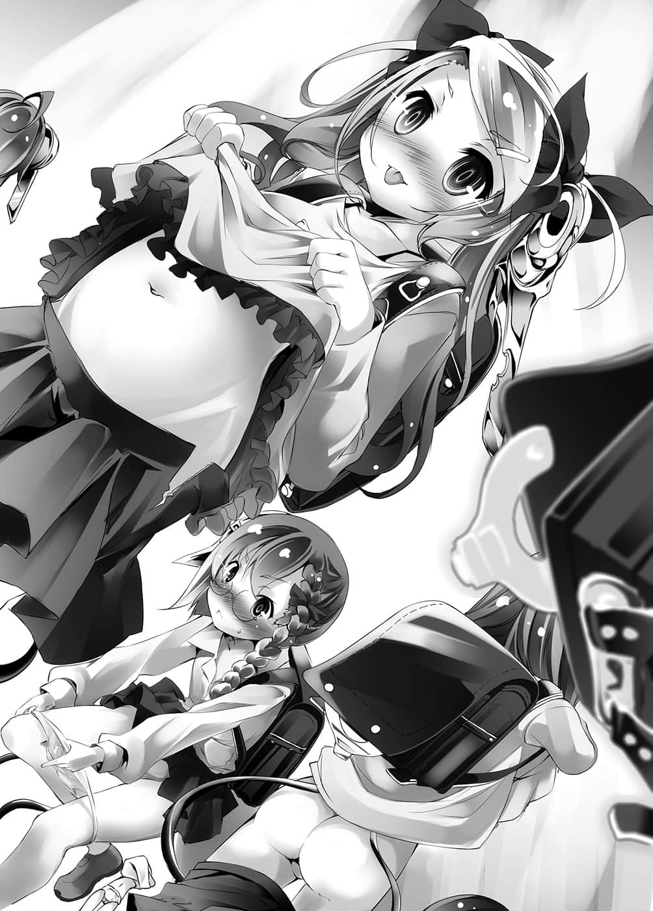
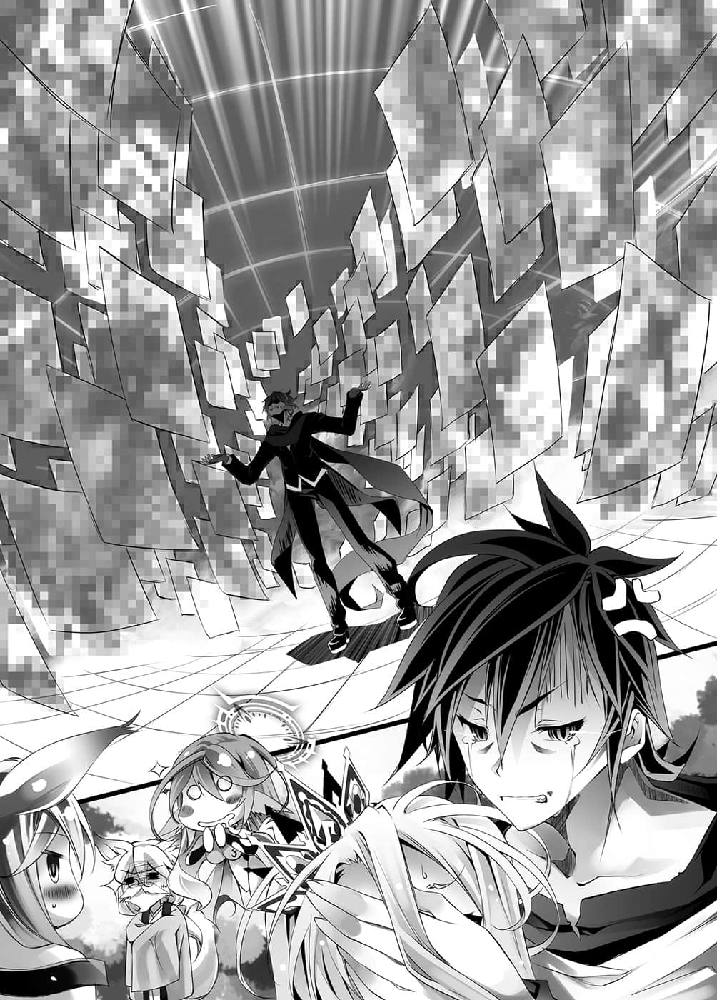
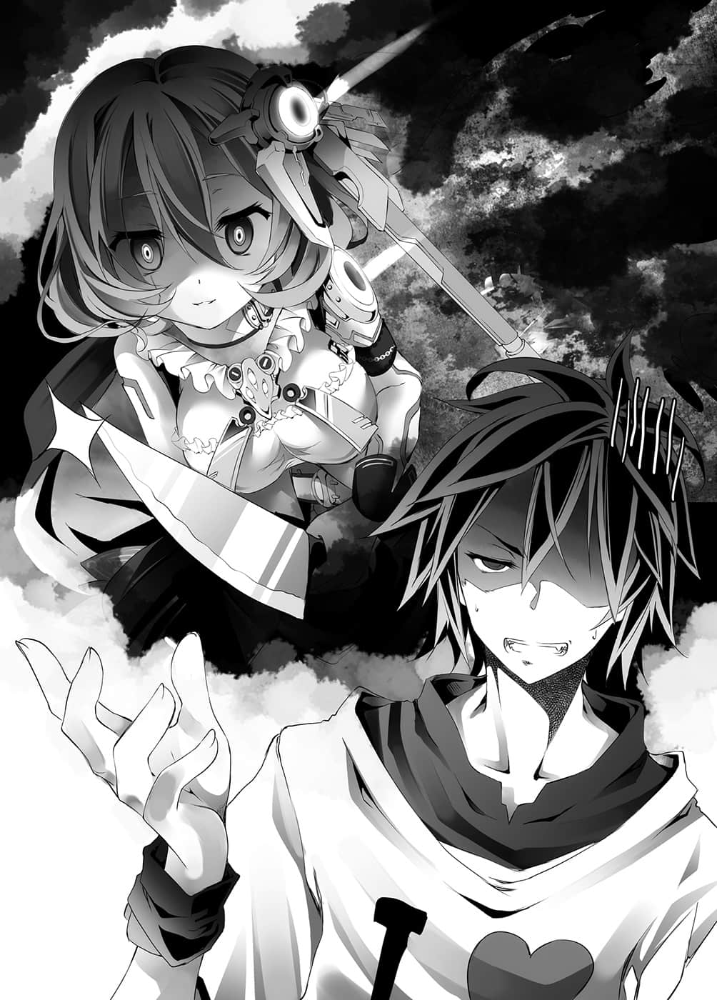
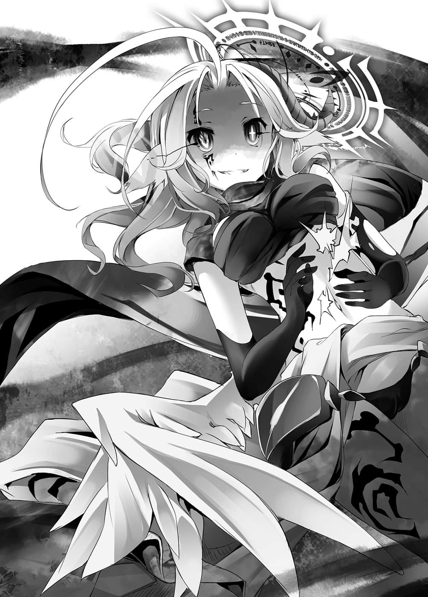

# 第二章 归纳式结论

> 来源：https://www.linovelib.com/novel/9/2117.html

东部联合本岛——首都・巫雁。

一手建立起东部联合的金色狐，她的住处就在那里，一个被称为巫社的地方。

她被兽人种当成活神仙般崇敬，而那个地方现在——

「……我说啊……本来我是决定坚持不吐槽的……」

首先看到的是终于忍不住开口的狐狸。

那是拥有两条毛色金黄艳丽的大尾巴，一对狐狸耳朵，戴着单片眼镜的女性。

东部联合的建国者、兽人种的全权代理者——巫女说完，注视着的那个方向。

「嗯？啊～抱歉擅自前来打扰，我们会自便，不用招呼我们。」

「……请……无须在意……？」

「客人到来竟然连一杯茶也不端上，由此可知国家的素质……啊，不对，就算拿出饲料招待，我们也会感到困扰，所以容我更正，你们很清楚自己的本分，那是合乎礼节的待客之道。」

——一行人突然以空间转移出现在巫社。

连一句招呼也不打就躺在沙发上休息，好像把这里当成自己家一样。

那就是空与白，以及不知有什么脸谈论礼仪的——满脸笑容的吉普莉尔。

然后，看到这群人厚脸皮的样子。

「巫女大人，您只要说一句『滚出去』，立刻就可以把这群无赖轰出去哦。」

初老的兽人种——初濑伊野一脸笑容地说道，他脸上的血管则是隆起浮现。

但是，吉普莉尔以倒立的姿势移转至他身后，她同样也是笑容应对。

「哎呀，一只狗竟然叫嚣要把主人和身为不肖奴隶的我轰出去……一定是我听错了吧，因为就算是野兽也能分辨哪些对手可以咬呢❤」

「哈哈哈，请恕我失礼，我以为就算是鸟类的脑袋也会知道『十条盟约』呢。不过请放心，这里是巫女大人的私有地，只要巫女大人拒绝让他们滞留，这些违法入侵者就算不肯也得出去。」

——距离种族融合还很遥远啊……空、白以及巫女都这么想着。

——看到伊纲为了胜利而蹦蹦跳跳的喜悦模样，巫女露出苦笑。

「欸欸～……这样没办法决定啦……」

声音并非来自依蜜尔爱因的口中，而是再度——从虚空中传出复数的声音。

然而，丝毫不理会他们的依蜜尔爱因——不对。

——而是把『我来这里就是要逃避机凯种你们啊』这句回答吞回去的空。

「——什么……该不会是机凯种吧！？为何会——」

那是有着耳廓狐般的耳朵与大尾巴。

「等、等一下……你为何会知道这里……不，你是怎么来的啊——！？」

但是，他绝对不会说出口，就算被人指摘，他也绝对不会承认。

吉普莉尔心想，只要让对方无法推断他们身在何处就好，对方却再度打开吉普莉尔自己的空间洞口，而且花费不到一小时的时间。听到对方那样说，虽然无从得知吉普莉尔的心境如何——

「啊，好狡猾～！老师的这个是属于我个人专用！对吧？老师❤」

「老、老师，人家只要想着老师，这里就会痒痒的……为什么？」

『……发现「主人」了，【典开】——「伪典・天移」。』

这次则是连同室内的景色一起改变，巫社的离楼邸内逐渐被置换得像是另一个世界。

他露出非常可靠且和蔼的笑容说道：

宛如立体图像的复杂线条，在空间中纵横交错，然后就像在绘制一般，在物体表层之上的部分——也就是『虚空』中，机凯种释放出的立体图纹，以高速『显像』与『构筑』，断续、杂乱且确实地形成虚构的景象。

……毫无疑问，这里现在仍是巫社的离楼邸，依然是那间榻榻米地板的房间。

对付这些前来做试探性牵制的人，兽人种确实且干净俐落地，将之一一收割。

「……看来……我还是太小看你了……」

背著书包的少女们，口中说出无法在清醒状态写出的台词。

比起千言万语，不如直接看证据，就在这个时候，从虚空中传来话声，然后——

每个人都察觉到那件事一定非比寻常，空语气沉重地——说出来此的理由。

「我原以为秃毛猴也该明白，我们现在没空招待你们。」

「没有异议！」

就如同她们所说——这个『空间置换』已经是第八次了。

或许是因为游戏告一段落了吧，她转过身来，对空等人这么问道。

那样的一个男人，如今却明显失去从容，更何况是向初濑伊野求助……

「多亏了你们，除了身体老迈的两人我和伊野，我们动员全部的『血坏个体』……大鱼不断上钩呀。」

说完之后，他的眼神就像是在看着可怜的人，言下之意就是——你说的『美少女』只存在于你的想像之中。

「恕我僭越，巫女大人，这是让空先生亡故的绝佳机会哦。」

「联邦的盟主竟然罹患幻觉症，那样也会对东部联合造成危险吧，要死也要先等——」

在其他的画面上，面对多个种族的敌人，几乎也都呈现一面倒的战况。

他总是拼命地、死命地思考策略，依附着白存活至今。

只见天花板上垂吊着大小五台荧幕，画面上映出五名兽人种。

「对，直接说就是因为城堡待不下去，而且会有危险，所以我们来此避难。不过……」

超越时间及空间，不——甚至超越因果，经由『典开』而显现的光景究竟是——

……她们是年纪与白相同或者更小，总数十一名的〇学女生。

「这件事相当棘手，我希望你们能助我一臂之力——特别是初濑伊野。」

「……想看内裤？可以呀……❤因为我喜欢老师……❤」

啊啊，只要是生为男人，这是每个男人都想说一次的台词。

听见空的语气突然变得沉重，巫女与伊野眯起双眼。

「【发现】『主人』，终于找到您了，请告诉我您来到这个座标的理由做为奖赏。」

与惊讶得说不出话的巫女和伊野相反，空则是冷静地发出叹息，注视着那幅景象。

依照书上所说——这个魔法能够对物质不赋予改变，将物质追加于空间中，借此替换景色。

「空先生，看来你的问题似乎真的很严重，我初濑伊野愿意为你一尽棉薄之力。」

在电脑空间内，她靠着血坏奔行在虚拟的街景上，而与她对战游戏的人是……

「【回答】本机是重新打开『号外个体』的转移痕迹过来的，抱歉花了这么多时间，让您久等了。」

「……初濑伊野，叫我的专属医生过来……」

从她的杀意可以看出，吉普莉尔的自尊确实受到伤害了。

她们争先恐后，想要和心爱的老师空做出『致命性行为』——大概就是这样的光景。

「老师❤人家今天也想上健康教育的实践教学❤」

为了摆脱机凯种，她转移至机凯种无法转移的地方——视线范围外且未知的——巫社。

仿佛打从一开始就在这里一般，一具机械少女女仆机器人站在巫社的离楼邸内。

太受欢迎而困扰，太过有钱而困扰——当真的实际置身在那样的状况，其实一点也不高兴啊！！

空总是让人捉摸不定，一副从容不迫、狂傲自大的模样——不过，其实他只是在逞强。

空在心中悲痛地流泪，伊野诚挚地点头答应相助，把手放在他的肩上。

听到依蜜尔爱因偏离重点的道歉，吉普莉尔的脸部不住抽动。

太受欢迎而感到困扰。

「——我太受美少女女仆机器人欢迎，感到很困扰，请帮助我。」

「…………」

但是，啊啊……现在的空似乎能明白。

「然后呢？明知我们忙碌，也知道会碍事，你们却仍然前来……可以告诉我所为何事吗？」

当然，由于巫女看得出这是空他们的计谋，也有自己正在收割好处的自觉，所以——

「听好了哦！即使翻遍这个世界也不会找到喜欢空先生的人，你要坚强，那些只是强迫症、妄想之类的错觉，你需要放松心情，充分休息。」

「……『地精种』？……哈登费尔吗？似乎游刃有余呢。」

……看到用这么可怕的力量，却制造出这么可怕的愚蠢光景，每个人都哑口无言，只有那群少女们——机凯种们仍持续吵闹不休。

空他们与巫女等人聚集在巫社的离楼邸，视线往上可以看见荧幕。

伊野从茫然自失的状态恢复，大声地叫道，巫女也全神警戒。

『【典开】求爱成功状况构筑兵器——「真典・空攻略」——ＰｒｔPrototype﹒０００８。』

「……要我帮助吗……？」

首先，不知何时，空身上的衣服被换成了西装。

这实在是非常切身相关，真的是很严重的情况————！！

机凯种们也改变容貌，从文静的眼镜女孩，到个性强势的女生，应有尽有。

虽是第一次见到，不过——从外貌特征看来，应该是位阶序列第八位的『地精种』吧。

「好～！我不会输的！看我光滑的个位数年龄〇——」

如今全身染成红色的年幼女孩——初濑伊纲。

简而言之——这个空间就是模仿放学后的小学。

空被巫女和伊野说得一文不值，但是在空反驳之前——

——不管是巫女还是伊野，他们对空这个人多少都有所了解。

另一方面，如果真的有人说出这句台词，也会让人想使出浑身力气，往他脸上揍上一拳。

与吉普莉尔视线擦出火花的伊野，接着转身面向空与白。

「……………………」

投入东部联合全部的『完全没入型电子游戏』机体，以及精挑细选的人才玩家，也无法完全应付数量众多的敌人，那些敌人所追求的是『空与白真正身份的相关情报』吧。

——真是『万能的舞台特效装置』啊。

对方是排在第七位森精种之后的上位种——然而对上伊纲，却完全被玩弄于股掌之中。

然而，因为他有深刻的自觉，而且也丝毫不打算伪装自己的缘故，因此以白为首的少部分人都知道。

其实，空从来不曾有过真正『从容不迫』的时刻。

加上最初出现时用的就是九次，空也差不多习惯了。

说出那些话的人是真的很困扰，自己竟然因为嫉妒，认为那是奢侈的烦恼，而对那些人置之不理！

她是紫色头发的机凯种——依蜜尔爱因，看见她侧着头询问的模样，最感到吃惊的人并不是巫女和伊野——

机凯种们只是自顾自地做着自己的事，那就是——

他们应该是东部联合的代表者玩家，其中一人是大家非常熟识之人。

只不过没有人会相信，包括身为居住者的巫女也不会相信这里就是那个房间。

「那么能让老师最舒服的人，就可以和老师交往，就这样决定了！」

面对眼前的现象，让空对那本吉普莉尔所带来的书记述更加确信，空不禁思考：

「我有异议————！！你们是在开玩笑吗——！！」

她们做出愚蠢至极的结论就是——『总之，大家一起做做看吧！』

见到女童们开始脱起衣服，空的怒吼终于震撼整间教室。

「没有，没有的事！我不会跟任何人做！我不会跟任何人交往哦！！」

在教室的后方——坐在座位上的分别是手撑着脸颊的白、身穿水手服的巫女，以及身上学生服快被撑破的伊野，他们的眼神就像在看着污秽之物。空宛如要将他们的眼神从意识中赶走一般，大声地呐喊。

「为什么！？因为我们是小孩吗！？」

「登场人物全都是十八岁以上哦！？」

「吵死人了！这是在那之前的问题啊！那种借口对儿福团体和官员不管用，你们要搞清楚分级制度吧！你们想要送我去坐牢吗！？」

女童们仍不肯罢休，空大声地打断她们说话，然后终于抱头哀求：

「……拜托，我拜托你们，请你们先消失吧……好吗？……我说真的。」

终于察觉空是认真地拒绝——立体图案就像崩坏似地。

像什么也没发生过一样，从黄昏的教室，恢复为原本的榻榻米房间。

而那群散发犯罪气息的小学生们也乖乖恢复原貌。

恢复原状的巫社・离楼邸内，十一具非萝莉女仆机器人们，无意义地使用超越预言机——不，甚至超越超级电脑的演算能力，面无表情地对情报进行事务性精密分析，也就是——

「——将对象的性兴奋指数进行曲线分析，推测抵抗因素——开始修正考察。」

「确认性兴奋反应满足标准值，推测为伦理问题，检讨解决方案。」

——她们单方面地暴露空的性癖等等情报，若无其事地利用转移返回。

「不要临走还给我留下不名誉的指控！！我也喜欢巨乳哦！？」

在空咆哮之后，巫社・离楼邸就像风暴过后，只留下一片寂静。

……呃～……

不管是被抱在身上的白，观战的吉普莉尔，还是史蒂芙，她们都是这么想的吧？

叹息则是来自懒得反驳，冷眼看着空的巫女与白。

不管是败北还是平手，结果并没有任何差别。

「吵死了啊————！哇～哇～闭嘴————！！」

没错，正是那幅光景让空还能保持理性，那个理由就是——

她们从空的反应推测他的喜好，靠着无比高强的观测、解析、演算、应对能力，机凯种精准地根据空的喜好，确实地逐步修正情境。

——我才不会让你们那么轻易就获胜。

看穿西洋棋的全部棋步，当成是在玩『〇×游戏』，那毕竟不是自己能力所及。

——刚开始时还好。

毕竟虽说只是在扮演角色，但是她们都是刚好符合空喜好的美少女。

「……哥……没关系的……」

…………？

夕阳余晖自小小的窗户照入……这里是篮球社的社团房间吧。

——世上健全的男孩子，大概每一个人都会认同吧。

「这姑且不论，总之是机凯种我们胜了，请你遵循盟约，答应我们的要求。」

「——从你的棋路感觉得到你的意志，你果然就是『心爱之人』没错。」

可是，理所当然——几乎是以一面倒的方式结束。

即使如此，空仍然只为赌一口气，打从心底不想输给对方。

「还能有怎么一回事……我说过了吧，我太受美少女女仆机器人欢迎，感到很困扰啊！」

「所以才糟糕呀，机凯种深不可测……他们是可怕的种族——！！」

就算引诱对方做出机械特有的误下或误判，空却仍然完全不是对手。

爱因兹希身上穿着球衣，用慵懒的语气，毫无脉络地开始谈话。

「他们要我在机凯种之中选一个和她生孩子啦！没有比这更麻烦的事了吧！！」

空原本嗤笑着，心想下次会是『十一名日本武士』吗？但——

——因为这家伙的存在。

空不知不觉间也被换上相同的服装，他不耐烦地这么回答：

而且就如同爱因兹希开心说出的那句话。

『平手也算是机凯种获胜』……这就是追加的规则之一。

「你要是敢给我再继续说下去！我会逃到再也见不到你的地方喔！？」

空瞪视着盘面咒骂，白抱着他安慰道。

——空之所以也能接受萝莉，有很大的因素是因为妹妹太美的影响。

——空咬牙切齿，其实他本来就明白，自己与白不同。

空带着坚定的自信，不，应该说是带着确信，诉说那个『真理』——！！

「……哥，一副色眯眯的……样子……」

「我就说我没问了吧！我没有兴趣——别、别靠过来，给我走开！！」

如果只是被美少女机器人追求的话，空的理性可能已经消磨殆尽。

她们只是没有推测到这一点，却也稳定地接近近似值了——！！

虽说是认错人，但那些都是爱上自己的女孩子！

就像这样，如今已演变成连白都冷眼责备他。

变态机械靠近畏惧的空，露出阳光男孩般的笑容说道：

不过，对方似乎不打算说明，爱因兹希从椅子上站起来说道。

比如说，突然有十一具机体设定为青梅竹马，要空和她们『一起去上学❤』。

如果是白的话倒也罢了，对空而言，这结果可以说是非常好的表现了吧？

「……不，我什么也没问，你突然说什么啊，变态机器人爱因兹希。」

造成他如此恐惧的记忆，有如跑马灯一般，在脑海中浮现————

——没错，比如说是『阴间』，空呐喊着补上这一句。

青梅竹马是什么，不上学的空茧居族又是怎么回事——他们完全不明白。

（译注：游戏『克苏鲁的呼唤』中，代表精神正常值的数值。）

爱因兹希毫不顾虑空的想法，强行继续这个情境。

自己宝贵的理性，之所以能勉强无损地撑过诱惑，是因为——

——赢不了，在途中做出这样的判断之后，空便专注于将局势导向平手。

透过机凯种的『空间替换』所产生的光景，如今总计已经是第十次了。

可是同志机器人也对他求爱——这份足以让他萎缩的恐惧，消磨的不是理性，而是ＳＡＮ值㊟。

——响起的是掌声与叹息声。

「受到此等诱惑！我却仍然能够忍住，你不觉得应该称赞我如钻石般的理性吗！？你难道不认为，我应该受到夸奖，没有理由受到责备吗——！？」

鼓掌的是被他的演说所感动，擦拭着眼角泪水的伊野与吉普莉尔。

西洋棋原本就是先攻有利，以平手为目标的话更是如此。

没错……原本偏离重点的各种求偶行动，每当次数增加，她们的精确度也会提高。

---

■ ■ ■

巫女冷眼指出这一点，空握拳颤抖，脸上露出苦涩的表情。

「呼……你说上次向我告白的女孩吗？虽然对她不好意思，不过我郑重地拒绝她了……」

「……不愧是『心爱之人』……以机凯种为对手，竟然能下到『平手』啊……」

结果本来就显而易见，可是即使如此……

或许是情况的发展太过离奇，连感到惊讶的时间都没有，巫女有些茫然地问道，空则是搔着头回答：

空与机凯种的西洋棋战就是以如此高昂的气势开始。

其他的机凯种们也一起对空露出含意深远的笑容。

但是，对于她的意见与眼神，空夸张地挥动双手，摇着头否认。

……面对相同的招式不管用，而且可以无限应对的超级演算机，空并没有输。

——立体图形再次唐突地窜入室内，景色出现扭曲。

然而，爱因兹希——不，依蜜尔爱因也是一样。

十一名素不相识的青梅竹马，而且偏偏说要去『上学』。

——但是终究只是无谓的挣扎。

他们构筑的都是偏离重点，让人不由得想要说教的情境。

空当然不可能接受这凄惨的结果，他悔恨得咬牙切齿。

「……嗯，你问我为什么拒绝她？」

「ＮＯ，Ｙｏｕ ａｒｅ ｖｅｒｙ ～ＮＯ……白，我的妹妹啊，听哥哥解释。」

虽然集称赞与责骂于一身，不过空同时也坦率地承认：

「……那么，可以请你说明这是怎么一回事了吗？」

迎接人生第一次的『桃花运』，空不否认自己多少有些得意，但是！空不禁激动地抗辩着——有哪个男人会因为『桃花运』而受到责备！

「……可是你似乎也并非没有感觉呀？」

相对地，机凯种则是超级演算机械——要与他们竞赛最佳棋步，本来就不可能获胜。

还有突然出现十一名姐姐、十一名寡妇……等等……

「就算对那个女孩没有意思！但是既然生而为男生，『想受女生欢迎』是不可避免的愿望！！不——那就是男人这个存在的『起源』——！！！！」

有异议的男生就到我的面前来，只要有一个人，我就收回我的言论。

即使如此，为了胜过白，他也创造出无数被破解的战术与布局。

『【典开】求爱成功状况构筑兵器——「真典・空攻略」——ＰｒｔPrototype﹒０００９。』

「别让我说那种话啦……本机——更正，我喜欢的只有一个人，那就是——」

「………………可恶……」

——他们认为那样是『求偶行动』，而且已经是第八次了。

没错，结果是『平手』——然而内容则是『惨败』。

不管是空还是白，吉普莉尔还是史蒂芙，没有人明白那是什么意思。

即使如此，空以白为对手，也累积了几万次的败北经验。

「～～啊～～～～！！可恶！！我知道了啦！！输了就是输了！！」

空有些自暴自弃，他豁出去似地叫道。

这时不管沮丧还是生闷气，都不会有任何改变。

反省和对策之后再说！现在重要的是——从现在开始该怎么做！！

空迅速地转换心情，指着爱因兹希大声喊道：

「只不过你们的要求可没有具体指定『何时』、『跟谁』喔！？」

所以才很奇怪。空指出这一点，观察他们的反应。

——这些家伙这么轻易就能将空『将死』。

不可能会疏忽这种漏洞——背后应该另有真意才对。

空的眼神中带着试探，但是爱因兹希却直视他的双眸。

「当然，爱怎么能强制呢！要爱谁是由『心爱之人』选择。」

「……哦～……原来被强迫推销爱情是我的错觉……这是我今天最大的惊奇呢。」

爱因兹希没有说谎——至少在空看来是没有，对于他满脸笑容的回答，空则回以一句讽刺。

看破机械的谎言——这种事做得到吗？不，或者应该问的是，机械能够说谎吗？

「嗯……因此机凯种我们立即想要得到的只有特定的情报。」

听到这样的回答，空眯起眼睛，仔细地观察爱因兹希。

在没有限定期限的生小孩条件之中，这是空唯一不能反抗，必须立刻回应的要求。

追加的规则之一就是——『立即提供与空的喜好有关的情报』……

——空仍是猜不透机凯种的真正意图，也不清楚那个莫名其妙的要求有何意义。

这时或许能从他们的要求，掌握他们的真正意图。

「谁要许可啊！？再说有什么证据证明那个情报是『配菜』呢！」

她代替爱因兹希，平静且简洁地提出要求：

「要我告诉你，怎样我才会爱上眼前扭动身体的同志机器人吗！？答案就是不可能爱上啊！！」

「……至少对你，我没有任何情报可以提供。」

而且空不允许他们阅览、破坏配菜以外的资料——他们当然就不能一一测试了。

「我依照你们的要求提供情报了哦，至于要如何使用——那就与我无关了♪」

一瞬间就被解析到那种地步，空尽管惊讶，仍急忙制止。

空感到一阵猛烈的头痛，忍不住抱着头，而仿佛代替空确认似地——

对于吉普莉尔的问题——机凯种的少女们也是点头肯定。

『搜寻完毕，位于深层储存区，从触媒的劣化情况检验出「推测使用次数最多的情报群」，从共享条件——使用频率、触发时间、隐匿性，推测该情报群为「配菜资料夹」。』

「……他们要……从哥的配菜……分析出哥的性癖……机凯种是……危险的敌人……！」

「………………」

「【反驳】情报体的意义未查明，因此全体搜寻并不牴触『阅览』。」

史蒂芙首先如此确认——对方点头肯定。

「很、很好～那就不准！除了配菜之外——」

「很不好意思，机凯种缺少得到『心爱之人』爱情的情报。」

机凯种平静地开始解析，空喊叫着，希望他们暂停。

空允许提供的纯粹只是配菜，如果那是别的资料的话——

不过，那是当然，面对有可能判断肉体反应的对手，说谎是白费力气。

「喂～～！请、请你们等一下好吗！？」

察觉机凯种可怕且狡猾的阴谋，白咬着指甲感到战栗——

更何况对于手指没有静电的机凯种们，触控面板甚至不会有所反应。

「可是说到主人的配菜，我记得最多就是小多你们的入浴影片而已……那样的情报能派上用场吗？」

——这次空真的僵在原地了。

『解析完毕，断定为触媒的触发式情报纪录。规律性解析——确认为借由传导体与绝缘体的组合，使用二进位的演算处理装置，在已知的情报型态中，并无该种规律性，需要重新确立相容性。另外，确认这是利用未使用精灵的未知电流，因此读取——借由增加电压取出情报，有可能造成情报或媒体损坏。』

「……【推测】此为未知的纪录媒体，推测存在复数的情报体资料夹……检讨操作方法。」

「【断定】『主人』保有的配菜，我们想要的情报只有这个。」

受到来自四面八方的无差别性骚扰，空抬头望天，心里想着：突然出现自称为友军的人，突然认错人而对自己求爱，突然玩游戏被他们打败，最后还要受到这种对待——自己到底做错了什么……

「喂，等一下，我没有许可你们阅览全部情报哦！？」

「【比较】但是对『主人』及『号外个体』，两人的发言也无法确认为真。」

说起来，平板电脑原本就是异世界的电子装置。

机凯种虽然能够干涉智慧型手机，那也是因为手机是可以通话的状态。

该不会——这个真的就是他们的『真正意图』？

「【观测】……看不出『主人』有『说谎』。」

「更具体地说！该怎么做『心爱之人』才会爱本机！才会接受本机的爱呢！为了导出那个解答所需的情报完全不足！」

「……配菜？为什么突然讲到菜色的话题？」

不过，空暗中窃笑「我的目的可不只如此」，只有在膝上的白看出他的目的。

——喂喂，开什么玩笑啊——？

「就在里面，资料夹我也打开了……剩下的就请自己动手吧。」

很遗憾，正如依蜜尔爱因所断定的一样，空的确持有色情的数位资料配菜。

可是，即使如此，吉普莉尔仍看遍了每个角落，知道其中没什么大不了的配菜。

「小多不要装清纯啦，那是指男性自慰用的媒介哦❤」

就算她能解读异世界的语言，仍是有许多未知的概念与前提。

「【结论】提供的情报是『伪装』，推测有比提供的情报更『核心的情报』存在，『全连结体指挥爱因兹希』，请求贵机以统合体的身份，因应状况做出准确的判断，完毕。」

「…………？…………？」

「…………嗯？这是——『心爱之人』啊，这就是你的秘密藏书保管库吗？」

空确实提供了配菜的资料夹，只是隐瞒读取的方法。

「——啊，这么说来的确是那样！为什么我要被卷入呢！？」

看到机凯种个个侧着头，似乎为解析而伤脑筋的样子，空内心阴暗地窃笑。

对吉普莉尔说的话有所反应的是注视着空、进行分析的依蜜尔爱因。

到了这个地步仍企图扭转败局，史蒂芙对于这样的空简直感到真心佩服。

——这、这家伙——！？

「【指示】搜寻满足本机共享条件的情报群，优先度无，对象为全情报群。」

『只对记录该情报群的触媒领域，限定性地施行精灵式的电气加压，读取并复制纪录，只要另外进行情报的整理结合与意义解读，判断就可以得到「配菜」。』

可是他们却连『虽然提供了配菜，但并没有说那就是全部』这样的文字陷阱都看穿，而且竟然还找到了真正的配菜。这是骗人的吧——！？

吉普莉尔侧着头提出疑问，回答她的则是神情焦躁的白。

很快便从墙壁上回到地面的爱因兹希，与依蜜尔爱因一同露出讶异的表情。

虽然吉普莉尔那样说，不过她也没有将平板电脑里的资料完全读遍吧。

而对方就是要空交出那个资料，由于是向盟约宣誓的赌注，所以他本来就没有拒绝的权利。

「……输……输了是我的错啦……哈哈、哈……唉～……」

对方连毁灭性的情报都能要求，羞耻ＰＬＡＹ能了事不是很好吗？

「————【喜悦】……」

依蜜尔爱因给了扭动的变态一脚——物理性的一踢，再度把他送上墙壁。

「为——为什么……为什么啊，『心爱之人』呀！？」

怀着『报复与骚扰』的目的，空面露邪恶的笑容，如此回答道。

「……然后……不管哪个机体大家……都希望自己被选中……？」

「——【确认】『主人』，请许可进行。」

…………

「【附带】『号外个体』以及人类种女性也看不出有说谎。」

空笑得更加得意，然而听到接下来这句话——

史蒂芙「啊……」一声，好似突然想起一样，顿时面红耳赤。

然而，依蜜尔爱因的口中却毫不犹豫地发出无情的追击。

他们看穿没有说谎的谎言……到了这个地步也只能接受了。

「不过只有配菜而已喔，其他情报我当然既不同意阅览，更不同意破坏哦？」

接着由白确认——对方点头肯定。

空想要用这个理由说服依蜜尔爱因，但是——白却说了一句话。

「呃～……你们要空只跟一机做那件事吧？」

『——了解。』

平板电脑的资料是以异世界的言语、异世界的程式储存。

「不过奇怪了，为何你们要主人的配菜？这跟被主人喜欢有什么关系？」

空说服自己后，用手摩擦上衣，然后把平板电脑递给依蜜尔爱因。

友军宣言是事实吗？还是说——空眼神瞪视着，爱因兹希则是继续说下去。

空流下一滴泪珠，取出手边的平板电脑。

空仍然抱着头，他看了爱因兹希一眼，勉强挤出声音说道：

——什、什……什……

「所以希望主人告诉你们，要怎么做，主人才会喜欢上自己？」

——查出空的喜好，做出空喜欢的行动——让空爱上自己。

而在她的身旁——

「爱因兹希通告所有『观测体』与『解析体』，命你们解析该媒体的原理。」

然后在递交之际，他的指尖在一瞬间，触碰到低头道谢的依蜜尔爱因的手指，在那个时候，空确定果然没有产生静电。

「……不愧是空，这个男人不会轻易认输呢……」

其中既没有任何虚假，也没有做出违反盟约的行动。

爱因兹希高声宣言后，机凯种少女们一齐点头。

宛如跟他的呼唤重迭一般——一瞬间他们便已解析完毕，开始进行报告。

既然意义尚未查明，那也有可能是错误的资料！

什……什么～～～～！？

「……隐藏资料夹『总体经济学』……８．２３ＧＢ……那才是配菜，不要搞错了。」

「喂——！？为什么你会知道啊！白小姐！？你到底对哥哥掌握到什么程度——」

『确认——容量与该情报群一致，进行复制。』

「喂、等等——不、不要啊啊啊啊啊啊啊啊啊啊啊啊啊啊啊！！」

————…………

……就这样。

王座大厅里，机凯种、白、吉普莉尔、史蒂芙，全都沉默不语。

「唔、唔喔喔喔……我的、我的……我珍藏的收藏品啊啊啊……！」

只有一个悲伤的男人，哀恸地放声痛哭。

原本世界的贵重『宝藏配菜』——大量的电子书籍Ａ漫，大概是因电力过载而损坏了吧。

资料毁损的那些档案，不管怎么点击画面也只会显示『读取失败』。

「……哥……对不起……」

「没关系……没关系的，那不是白的错……不是那样的……」

白抱着空道歉，不过空摇头否定，因为这都是空输掉的关系。

而且，其他资料和平板电脑，绝对要避免因过失而损坏。

既然如此，还不如乖乖地正确告诉他们，他们所要的资料所摆放的位置，将损害控制在最小限度。

白没有做错任何事——非但如此，那本来也应该是空该下的判断。

可是，那是两回事，色情资料报销的悲伤仍旧无法抹灭。

顺便一提，空之所以深受打击，与其说是因为失去那些资料，倒不如说是因为——

「……哥……Ａ书重要的是……新鲜度……那终究是……用旧的梗……」

那些都是未知的概念——学校、青梅竹马、上学，就连小学生书包也一样，他们理解了『文化』，而且仅是参考了属于抽象记号图画的Ａ漫而已。

「那是多么愚蠢的思考！对『心』进行逻辑考察！？所谓的心就是最不具备逻辑性的『反逻辑』存在啊！！更别提若是谈到爱，那更是最没有逻辑性的东西——但是！！」

「那么我们就立刻进行资料分析吧，『心爱之人』啊，请你暂且等待。」

类似Ａ书被老妈发现时的绝望，才是空想抗议的点。

在现实的世界，那样的情况最后一定会被刺杀身亡。

高声地，宛如从灵魂深处发出一声呐喊——！！

「没错……在尝试进行『心理考察』之际，每个人总是会将思考与精神形式化、记号化、比较前例、归纳套用，就连机凯种我们也不例外，往往陷入这些毫无意义的行为之中……」

「剧情没有脉络吗？没有意义吗？还是缺乏发展至行为的动机呢……？」

---

■ ■ ■

脱离宛如恶梦的记忆，眼前的恶梦却仍在持续，那就是——

爱因兹希吼着，感动落泪。

听到他的言论，不知为何，空差一点就要认同了，而就在空抱头烦恼的时候，有几个人说话了，凝视着摊开书页的他们分别是——

——要在开始后的几页内带入性爱场面——

在他所赞美的世界里，他的存在本身，应该才是遥不可及的未来技术。

目光紧盯着一本兽耳女作品，深深点头认同的伊野。

爱因兹希所言的『完全之爱』，存在满满的问题。

爱因兹希不惜扩大空间，将无数的图画摊开在空中。

甚至——

「……已经……不能用了吧……我们一起……寻找新希望配菜吧？」

不过，就算再怎么保守形容，他们的理解和学习速度都太超乎常轨了。

很多部位纠缠在一起，许多爱心标记忙碌地进进出出。

「我们从『心爱之人』的书中学到很多……那个世界可说是令人感到惊奇无比啊。」

——封面不管怎么看都是可爱的女孩子，画风也是以男性读者为取向。

「爱没有脉络！要求心有道理本来就是谬误！彼此吸引的灵魂交会在一起，本来就不需要意义！动机只是事后强加附会的理由——没错！正如这个艺术Ａ漫所描绘的一样！！」

爱因兹希似乎反而打从心底感到意外，他说完转过身去。

他背对着空这么诉说，语气仿佛充满赞叹之情——不，他是真的很感动吧。

用古老一点的说法，那就是无数画着『嘿咻嘿咻』的书页。

短短几个小时，他们已经解读并理解了原来世界的资料。

巫社瞬间恢复为原本宁静的内部装潢，空不禁深深叹了一口气。

他仰望着图片，至今仍未停止演说，眼中甚至泛出泪水——

「为什么你那么坚持贯彻同志路线啊！！你差不多也该学习一下吧！！」

「反观这些图画又是如何！有哪个知性生命十六种族画出过如此完全的『爱心』吗！！」

于是爱因兹希蓄势待发——强而有力、语气激昂地说出那个答案——！！

以各式各样超乎常理的情节为前提的Ａ漫做为参考，不管怎么想都是错误的做法吧。

这个机械愈说愈激动，但是听了他的主张，空与白却皱起眉头感到讶异。

机凯种接触到的空他们原来世界的情报，说穿了就是Ａ漫。

身穿篮球球衣的变态机械，不断地逼近空，空发出有如悲鸣的抗议。

让空叹气的罪魁祸首也唉声叹气，看到他那个样子，空抓着头叫道：

至今唯有爱因兹希丝毫没有学习，却依然露出爽朗的笑容说：

——能够理解『心』的演算器。

没错——机凯种采取的追求方式，Ａ漫式的情境有许多不合常理之处。

然后，十一具机凯种少女们深深一鞠躬————

「可是『心爱之人』的书籍中，虽然只有一册，却是男人与男人激烈的——」

「你在说什么，那些是非常贵重的情报，价值更胜于用来摸索『心爱之人』的喜好。」

又仿佛为自己的愚蠢忏悔一般。

然后他终于有如愤怒握拳一般。

因为全都被他说完了，也就是说，全部的问题，他都有答案。

不过，就在空感到疑惑的时候，机械的演说仍在持续加温——！

「……嗯？是那样吗……？」

「你难道不觉得是参考的资料有错吗！？有许多内容都太不合常理了吧！？」

或许明白空是认真拒绝的吧，爱因兹希遗憾地垂下头——同时……

根本乱七八糟，那没被选上的女生就只是被白睡了而已。

那么这家伙到底有什么根据，如此激动地发表演说呢……

爱因兹希似乎感到不可思议，侧着头疑问道。

「你也太无能了吧！我对男人没兴趣！你怎么还是不明白啊！！」

买了一看才知道是ＢＬ本……而且还是相当重口味的内容。

空所指摘的，也就是成人漫画特有的『缺乏真实感』，不过——

——就这样，空从那段不愿回想的记忆与总结中脱离，将意识抽回东部联合的巫社・离楼邸后，他开口的第一句话就是——

然而，为什么——

……虽然空也承认，他的怒气中也包含了宝藏被毁的怨恨——

巫女和伊野凝视着——吉普莉尔则甚至流着口水盯着那些画。

「——【典开】——『伪典・真爱』！！」

「哥哥的品行完全被妹妹掌握了，这其实让我很——受打击喔！！不，应该说十一岁的少女，为什么会替色情资料夹报销的男人发表感想呢！？」

热烈演说的机械，突然夸张地张开双臂。

爱因兹希的话语中，充满对那些与时间竞赛的创作者们的崇拜。

「嗯～……可是若是不请『心爱之人』接受原原本本的我，那就没有意义——」

「嗯……不合理的前提和剧情……具体来说是什么呢？『心爱之人』啊。」

「…………上面画的人是在做什么——啊、不，画什么都无所谓啦。」

「啊啊，能够这么简单明了地定义爱的文明！从这些画可以理所当然地看出，那个文明的学术水准之高！」

因此，机凯种参考电子书籍Ａ漫，开始猛烈的求爱攻势。

——全部。空虽然想这么说，却没有说出口。

「【宣言】本机会尽力成为『主人』理想的妻子……本机会努力。」

——为什么呢？

「特别是在学问方面……在生理学、心理学——在『心』的研究之上的进步，远远超乎想像！」

「与其接受我宁可去死！快点给我换掉那身角色扮演的装扮！！」

当然，没有看过内容就买是空的错，然而爱因兹希却以此为根据，认为自己也有机会，这就让空重新点燃当时的怒火，愤怒地大吼：

白抚摸着空的头安慰他，语气温柔地继续说道：

「那是我被封面骗了呀！想起来就让我更火大啊！」

由于参考资料本身就很极端，所以求爱行动情境出现极端或偏差也很正常。

「你这家伙到底跟我有什么仇！？把人家的宝藏公诸在众人面前——哈哈～你是想看我哭是吧！？」

然后就一直到了现在，想到这短短几小时发生的事……空甚至感到恐惧害怕。

不，不只是空，巫女和伊野、连白和吉普莉尔也各自感慨地叹气。

「……非常抱歉，『心爱之人』啊……毕竟男人与男人的参考资料仅仅只有一件……要分析你的喜好极为困难……让你感到不快，都是本机无能。」

空立刻遮住白的眼睛，流出与爱因兹希意义不同的泪水。爱因兹希所仰望的『完全之爱』就是——空的宝藏Ａ漫。

比如说——谁能让老师舒服，就决定选她当女朋友？

然而思考到这里，空忽然想到——不，等一下。

刹那间——数量庞大到足以掩埋室内的图片，扩散在眼前。

而说到那群战犯——爱因兹希与依蜜尔爱因……

「我就说那些东西有许多不合常理之处呀！里面充满了各种不合理的前提和剧情吧！」

「唔……空先生，我要对你另眼相看了，狼族果然就是要巨乳才行，你的品味很好。」

好啊，我就哭给你看！

对于没有恋爱经验的人或许太刺激了吧，装作平静却面红耳赤的巫女。

「主人、主人！？请把这些知识也赏赐给我吧！！」

兴奋地流着口水，心里想着如果可以的话真想拿回那些资料——

「不然请您以『实践』的方式教我吧，求求您、求求您——！！」

不行的话就请求空亲身传授的吉普莉尔。

「……白，哥哥要挖个坑……你愿意跟我一起埋葬吗？」

「……嗯，ＯＫ……」

——讲白了，这根本就是羞耻ＰＬＡＹ。

空倒卧在榻榻米上哭泣，他已做好跟妹妹一同埋葬的觉悟。

不过——

「可是即便拥有这些伟大的情报，本机对于要如何才能被爱，看来仍是理解不足。」

「……在理解爱之前，你要不要先试着理解关怀或体贴之类的感情呢……？」

尽管口中谈论著爱，对于空所受到的心理创伤似乎丝毫未觉，机械男人爱因兹希深深地点头答应。

「明白了，本机会一并理解，很快就会回来，『心爱之人』啊！请你好好期待！」

「看起来一点也无法期待啊！？你就别回来了啦！！」

空虽然对他大吼，激烈的变态爱因兹希仍带着爽朗可靠的笑容留下这句话，一瞬间便随着原本展示的猥亵物一同消失了。

「……………………唉～……」

于是，巫社终于恢复和平，众人不禁叹了一口气。

「那边那一位打算何时回去呢？」

只有吉普莉尔一个人这么问道，众人顺着她的视线望去，只听见虚空中传来回答的声音。

依蜜尔爱因说话的语气，仿佛抱她已经是确定的事项一样。

来到巫社的是空等人，站在巫女的立场来看，他们等同于把风暴带了过来。

「啊～……虽然从轻松的吐槽演变成相当恳切的话题，不过……」

「……如果是那样的话，不是女仆也可以吧？」

「【附带】『主人』是本机的主人，主人的身旁就是本机的固定位置，只不过夜晚会分上下。」

「……抱歉……巫女小姐……」

「……哦～不过是半途出现的新角色，竟然也敢以主人的仆人自居～？」

因此——空要说出一个……他至今一直没有说出口的吐槽。

那股力量无法施展——因为有『十条盟约』束缚，无法对他人造成危害。

「【回答】母鸡。【典开】——『伪典・天移』。」

接着由于空的请托，这次依蜜尔爱因开始准备转移。

她对吉普莉尔做出挑衅。

精灵的压缩与风暴十分强烈，连无法感觉到精灵流动的空与白也能感受到那股力量。

「【憧憬】那个答案非常有魅力，全部的机体都赞同那个答案。」

只见她一副若无其事的模样，她似乎是使用了连兽人种也无法看见的光学迷彩。

「你跟我的角色重复了，让我帮你改造得有个性一点吧——改成风格前卫的造型❤」

空忽然发觉，说起来依蜜尔爱因——甚至没有对空展开求爱行动。

果然如空所料，她不像是女仆的理由是——

「……机凯种你们为什么是穿女仆装啊？」

就在每个人都冷眼看着她的时候，空在意的却是另一个不协调感。

——太阳是从东方升起，西方落下。

空与白无法察觉——不，对方大概也没有散发丝毫的精灵气息吧。

「而且数量有一打之多的路人角色，竟然没问过我就自作主张……这可是很严重的问题呢。」

掌握大概的状况与事态后，巫女有如呻吟般地抗议道。

——可是她又以等同胁迫的方式逼空生孩子，或是像现在这样。

「我问的是你们这种廉价的想法是从哪来的啊！！」

依据空与白的命令，吉普莉尔首先被迫正座。

「……喂、喂，吉普莉尔……！」

说完之后——现场鸦雀无声……

在被寂静笼罩的巫社・离楼邸内，空有些尴尬地开口：

不过，为什么只有依蜜尔爱因没有跟其他的机凯种一起行动呢？

「【苦笑】以本机现有装备，即使是『号外个体』也可单独击杀，轻而易举，请『主人』允许本机证明。」

「【肯定】一直都在。」

「……我修正先前的说法，不好意思，请你先回去——还有，在你回去之前，我可以问一个问题吗？」

就这样，依蜜尔爱因点头肯定了空感到疑惑的事。

两人瞪视对方，临走前彼此互骂之后，依蜜尔爱因便消失在虚空中。

「【结论】将一切奉献给『主人』，服侍、协助主人，这就是本机——机凯种的存在意义愿望。」

即使考虑依蜜尔爱因说过的往事，也仍然没有必要是女仆。

「【开示】没有特别的理由。」

「【答应】上下都可以。」

简单说，在明白她是『假女仆』后，只有空认同，其他人都感到脱力的同时……

「我没有问这个，话说你是想做什么啊……我只是想问个问题而已……！」

「【申告】本机于六千年前就已将自己奉献给『主人』，半途出现的是你。厚脸皮，碍事，白痴。不过你是『主人』的所有物——若不小心弄坏，本机会受到斥责。」

不过，她眯着眼睛说道，表情似乎沐浴着耀眼无比的光。

「【夸耀】『主人』命令本机消失，因此本机听从命令，让自己无法被看见。」

——没有特别的理由。

她以饱含感情与希望的声音做了总结。

空想不出来，兵器应该要用哪种单位计算，不管怎样——

不满意她的回答的人大约有一名——更正，一具、一个？一台？

「……废铁人偶。」

「……吉普莉尔，坐、坐下……」

仍有别的立场可以遵循那个愿望，真的要说的话，跟女仆装也无关。

宛如在播放语音档一般，流畅却没有生机。

就算他们有隐藏的目的，现在也没有足够的讯息可以判断。

依蜜尔爱因的面容就像人偶般端正，玻璃的眼眸与双唇也像是人工制造一般——

……虽然似乎也有执事在场，不过空把那样的记忆赶至遗忘的彼端了。

机凯种最初造访时，他们全部的机体就已经身穿女仆装了。

依蜜尔爱因回答得就是这么理所当然，受不了的空发出呻吟。

「【解答】大战结束后，机凯种对机凯种的存在意义进行过考察。」

「【续答】存在意义愿望，赋予机凯种『心』的『遗志体』——」

「【提问】请『主人』现在先指定上或下，今晚要以哪一种体位抱本机，本机才好准备。」

逼真的女仆机器人这样说——意思是她纯粹就是女仆吗？

——但是却寄宿着普通机械和人偶绝不会有的东西。

「好了～～我明白了！叫住你是我的错！！到此为止，好吗！？」

「不是我的错——……不，是我的错吧……给你们添麻烦了，我们立刻就走。」

「依蜜尔爱因！？欸，你在吗！？」

吉普莉尔提高光圈的转速，逼近依蜜尔爱因。

手拿光刃，提议要以物理的力量来改变角色——更正，破坏角色。

「你的口气好像大了点呢❤让我把你的嘴加大一点，变成一个大洞吧♪」

「听我说！拜托听我说话好吗！？是我错了，请你先回去！拜托你！！」

唯一与她对峙还能不当一回事的依蜜尔爱因回答道。

「……你啊……怎么把那种麻烦带到别人家里呀……？」

……跟空一样的歪理。

再说空等人本来就是为了躲避机凯种才会来到巫社。

「……为什么？你没有跟其他的机凯种一起回去吗？」

就这样，这次巫社的离楼邸终于真的恢复平静了。

破坏那样的气氛真的好吗？空尽管犹豫，但他有个接近笃定的念头，足以使那个疑问拨云见日，这令他鼓起勇气吐槽：

空语气疲惫地这么说完，他心里想——机凯种的行动和真正的意图都叫人完全猜不透。

依蜜尔爱因一字一句，平静却流畅地开始诉说。

「……【回答】只要『主人』叫本机回去，本机立刻就会回去。」

那并不是从空的Ａ漫得到的情报。

因为她和爱因兹希同样是所谓的『指挥体』吗——不，等一下。

即使如此，超乎常理的暴力气息，仍令巫女和伊野不禁寒毛直竖。

——爱因兹希……他是变态废铁，就先别去管他吧。

空勉强挤出这一句话，但是——

「【自述】说到机器人，就会想到女仆机器人。」

---

■ ■ ■

面无表情的脸上，浮现出细微却明确的嘲笑。

「【想起】她希望『意志者』——即心爱之人的『愿望得以实现』。」

「【肯定】符合本结论的角色有八项，我们从其中选择女仆的理由是——」

她将翅膀化为迸发的光芒，大气的精灵转变为混沌的洪流。

听到空的呼唤，机凯种少女提着裙子行一个礼，现出她的身影。

空慌张地叫道，可是他的声音却被伴随明确敌意的地鸣声掩盖。

一时之间空原本还想反驳，不过他摇了摇头，跟白一起坦率地低头道歉。

「【反驳】原来如此，『主人』成为本机的主人，确实是不久之前的事。」

既然已经被机凯种找到，他们应该很快又会过来吧……无论如何，这里都不能久留。

这次只能请吉普莉尔转移到真的不会被找到的地方。

「……初濑伊野，他们是来拜托你的吧……你助他们一臂之力吧。」

「谨遵巫女大人的命令……但是我们没有义务帮助他们。」

——正如伊野所说，巫女没有义务帮助空他们。

就算空他们救过巫女的朋友——帆楼，那也只不过是互相利用的关系。

游戏玩家、甚至全权代理之间的信赖，绝不是用来交友的，不过——

「义务是没有，但是我可不想跟那种怪物为敌。」

没错——这是出于冷静『算计』下的命令，所以伊野面对空他们，摆出正襟危坐的姿势。

「……嗯，简单说，他们把空先生误认为心爱之人了，真是令人同情。」

「……是、是啊……虽然很意外，不过你能理解我的痛苦就好了。」

看到伊野表情沉痛地这么说，空微微感觉到友情似乎萌生了……

「对啊……我真是忍不住要同情机凯种……到底犯了什么滔天大罪，竟然遭遇这样的不幸！什么人不好选，偏偏喜欢上这只臭猴子……！！」

然后听到伊野愤怒握拳，说出后面这句话，空诅咒自己先前的错觉。

——可恶的死老头。

话到嘴边的咒骂，空又勉强吞了回去，他不屑地问道：

「我就坦白地问了……要怎样才能和平地让他们理解这是个误会？」

——实际上，这件事真的不是开玩笑的。

他们若是灭亡当然很困扰，而且双方现在固然是同一阵线，但那也是因为误会的缘故。

万一应对不当，演变成敌对状况的话，那就是最坏的情况了——失去万能舞台特效装置也很可惜。

……

「……空先生，你该不会是真的没发觉？」

「吉普莉尔，要回去啰，这次一定要转移到依蜜尔爱因他们无法追来的地方——」

——一场误会？有什么关系呢？

伊野轻易地陆续帮他排除问题——正因如此……

但是相反地，空的心中有模糊的突兀感蓦然显露。

宛如在诉说对世上所有生物怀抱不求回报的爱，推行博爱一般。

「……空先生，说真的，你到底是怎么了？这样一点也不像你。」

可是看到空仍在困惑之中，他不禁叹了一口气。

伊野的语气仿佛在思考着什么，空则是抖着腿回答。

……………………？

他会被硬体锁阻挡，对，然后发现认错人，事情就此结束。

「……嗯？啊～……空先生，那可是有点不太一样哦……？」

「那么简单的方法都没发觉，败在你这种人的手下，真是我的耻辱。」

「就算结果会因此受人怨恨！！这一切……我都甘愿承受。」

虽然空很希望他也直接体验被刺杀的经验。

如果是在平日，空大概在这时候就会停止了吧，然而只有今天——

……

为什么会疏忽？因为是人类，有疏忽是很正常的啊！！

空正在激烈自责的时候，白心情不悦地撅着嘴说道。

对于伊野指出的问题，空整整反覆思考了一分钟，然后呆呆地发出疑问的声音。

「总比看着一个种族灭亡而良心不安要好吧？」

机凯种的行动、他们引空入局的手段、求爱的方式，不对劲的地方太多了。

空以清醒的、再冷静不过的头脑感叹地说道。

他露出仿佛背负人类原罪的慈悲眼神回答道。

「…………哥。」

然而伊野似乎是真的十分讶异，他打从心底感到意外的语气，让空停下脚步。

……不不不……慢着慢着慢着，你要冷静啊，十八岁的处男空！！

空发出呐喊，就像是即将面临与自己命运未来的交战，这个时候忽然——

「啊～～！！受不了，我完——全没有那个意愿哦！？可是没办法呀！！我就去拯救一下世界美少女吧？谁叫这是我的天命！！」

「是啊，空先生也有不答应的理由，可是那个理由重要到足以放任机凯种灭亡吗？」

「那是……不，可是我和白分开的话——」

伊野道出那个『简单的解决方法』，那就是——

「必须拯救机凯种才行吧！？我立刻回去，请恕我失礼了，师父！！」

如果是初濑伊野的话，或许会有应对跟踪狂的方法吧。

「机凯种是因为『硬体锁定』，不能跟特定人物以外的人繁殖哦？」

那么单纯的判断——自己真的有可能只是疏忽了吗……？

「不……对方可是机械哦？而且是参考空先生的配菜Ａ漫加以重现……」

「啊！对了！所以说在白的面前，十八禁是——」

空的思绪正混乱的时候，伊野仿佛乘胜追击般继续说道：

「可以跟全员『性交』，之后再选一人『繁殖』，不就好了？」

「没错呀！所以就算我答应和她们生孩子，那也无法解决任何——」

空听着伊野说话，脑中将想法一一列举和整理，想要找出突兀感来自何处——最后，他终于深深跪倒在地，果断地做出结论。

自己真是愚不可及……为何先前没有用常识思考！

「——你这家伙，竟然轻易断言我今生不会再有机会。」

完美的道理接连地摊开在眼前，这时空听见一声……

「……真的是，打扰完就走人，一点也不感到愧疚啊……」

比如说——

……不过空很懊恼，因为他也无法否定，而伊野又接着问道：

结论就是——只是自己的疏忽。

伊野的主张非常合乎道理，极为简单明快。

「是，有何吩咐，师父！请您指点愚蠢的弟子吧！！听到没，你这老头！」

「好了，再见了，十八岁处男的空！去迎接十八岁『非』处男的空吧！！」

伊野宛如对艰深的难题设定假说一般，语气慎重地说道：

就在空感觉吉普莉尔的转移准备比平常来得久的时候……

…………

见到妹妹比绝对零度更冰冷的眼神，空顿时清醒了过来，慌张地叫道：

「最后一点，选择一个人进行繁殖——如果以上就是她们的要求，那么就算依照她们的提案做也无不可，我无法理解你为何要拒绝。」

「更何况是她们自己认错人了，而且是把你和六千年前的人物搞错。」

这不对劲啊，自己再怎么说也不会犯下这种疏忽吧——！？

「……是、是啊……没错……」

然后伊野更继续说道：

即使只有一瞬间，对伊野怀有期待也是自己的错。空站起身来，和其他人一起准备回去。

下半身至上主义者露出獠牙与本性，笑着这么说道。

「空先生……你冷静下来思考一下，首先，这是你今生仅有一次的性交机会哦？」

「……………………你说什么……？」

「那样不就是……『充气娃娃自慰』吗……？」

但有『十条盟约』存在，极为无奈的空只能仰赖这个还没死的老头。

「打扰了，巫女小姐！吉普莉尔，我们要回艾尔奇亚啰，时间可是不等人的！！」

在巫女冰冷的目光，以及吉普莉尔发出的光芒照射之下。

「既然如此，你就如她们所愿，跟她们睡就好了呀，认错人的话是无法繁殖的吧？」

然而他映出的眼神却因兴奋而闪闪发光，充满私欲。

「是的，是那样没错，这有什么问题吗！？」

……咦……奇怪？我——为什么会拒绝呢……？

——简单的方法？

于是突然之间……

然而——伊野却锐利地眯起双眼说道：

「……但是……哥不是那个人……那样是……欺骗人家……」

「白小姐的话，只要拜托吉普莉尔小姐阻绝声音和光线，那就没问题了吧？」

……

「空先生也只是回应她们的要求，没人有资格责怪你吧？」

「……像你这样没有节操的家伙，因为误会而遭到纠缠的经验，想必没有千也有百吧。」

——一定有哪里不对。

「别害怕初体验，该做的事快点做一做不就好了，臭猴子。」

有十二名能够变化为自己喜欢模样的美少女，迷恋着自己，向自己求爱！？

伊野的眼神中甚至难掩对空的失望之情，如此断言。

「——……咦？奇、奇怪……？」

答应她们生孩子会如何？空本来就不是那个人。

明明只是十八岁处男的空！做人要知道羞耻啊！？

「只要证明认错人，她们就只能接受那个人物已经亡故的事实，答应进行宣誓解锁的游戏，乖乖地输给你而已。毕竟再这样下去，她们可是会灭亡的。」

——不对，有某个地方不对劲。

「遵命，我立刻准备长距离转移，请主人稍待。」

空并没有抱持多大的期待，而是已经走投无路才向他请教。

「当然……但是如果有人能因此得救，哥哥不惜欺骗、说谎……」

「再说，空先生想脱离处男？……哈，不可能啊。」

自己竟然拒绝这群机械订制女仆的求爱？自以为是谁呀！？

感觉所有的线索和拼图终于凑齐连接在一起。

「啊啊……是这样……原来是这么回事啊……」

空的笑容就像是得证大道的修行僧，他平静地说道：

「吉普莉尔……抱歉，麻烦你——可以请你变更目的地吗？」

「——咦？啊，是，那么……请问要前往哪里呢？」

无数的突兀感及其真相，这时终于全部明了了。

不管是机凯种的行动，还是她们的言行，还有最大的突兀感——

「哪里都好……对了，只要是不会被机凯种发现的地方，哪里都好……」

那个突兀感也就是——只要做了那档事，一切都可以解决。

那么简单的解决方法，为何先前会想不到。

——因为并不是想不到，而是自己在无意识中已经发觉了。

「……那么好康的事，怎么可能会发生呢……哈哈……我早就知道了……」

看来暂时还是见不到十八岁『非』处男的空了。

感受着世界的强制力——历史的修正力，空流着泪，进行了空间跳跃。

---

■ ■ ■

红月映照的巫雁岛上——空与白走在郊外的住宅区。

那里就在两人熟知的兽人种幼女——初濑伊纲家的附近。

「……距离巫社相当近……这里就是不会被机凯种发现的地方吗？」

空原本还以为会转移到世界的另一侧。

「是、是的……『丈八灯台，照远不照近』，正如主人世界的这句格言所说——」

飘在空中的吉普莉尔，虽露出自信满满的笑容，但仍难掩疲劳地这么回答道。

「很好，这个提案不予考虑，否决！下一个！！第二个方案是什么！？」

可是啊——！？

……嗯，这次是比较实际的提案，空催促她继续说下去。

为什么？因为不那样做，他们就会灭亡，说得非常理所当然。

「『但是上了就会卡关』！？这不是故意找碴是什么！？」

就在空正在思考的时候——一惊。

空将手放于安分坐在固定位置的妹妹头上，接着继续说道：

——这才是最令他感到不对劲的事。

——真的是那样吗？

接着，住宅区回荡着扰人清梦的叫声，白瞬间捂住耳朵。

对于机械的感情到底可以看穿到什么地步，即便是空也没有绝对的自信。

美少女们这样逼近诱惑，却要空不断地予以漠视……？

空几乎确信有所谓的『第四面墙㊟』，正准备开始找寻问题所在——

然而不管是静止的吉普莉尔，还是命令她停止的白，她们看着空的眼神都在问同一个问题。

「然后第二个问题！我说很多次了，他们『认错人』啦——！！」

「首先，第一个问题！这种状况我的理性和精神力支撑不住啊！！」

两人以眼神询问他的根据，不过依照空的回答，那个道理十分简单。

「所幸他们并未指定回应生孩子的期限，只要永远不回应，敷衍过去的话——至少又有一个自称友军的种族加入艾尔奇亚联邦……那不是正好对我们有利吗？」

——断绝空间是什么，空与白完全摸不着头绪。

那恐怕是一瞬间就完成的事，真是作弊到不行——不过……

「为什么他们会做出让这个世界游戏破局也在所不惜的举动……！？」

（编注：起源于十九世纪的现实主义，概念为假设观众与演员之间有一道只存在于概念中的无形之墙，使两方不能有任何互动。）

「虽说是经过长年累月的老化破铜烂铁，毕竟仍是杀死战神，我所认同的『敌人』。」

别说装置了，应该连机凯种本身都会无法运作才是——但他们却能正常运转。

还是导演？编剧吗——！？

「…………哥……给我冷静下来……」

不明白，空既不明白他们把空误认为六千年前的某人的理由，也不明白其中有何意义，什么也不明白。

「虽然会很碍眼……那就让他们继续误会，『放着不管』如何呢？」

「……意思是……机凯种……想要灭亡吗……？」

不过——以灭亡为威胁，强迫空答应比赛西洋棋时，机凯种的眼神……『非常认真』。

吉普莉尔的一句话，让空的脸上肌肉抽动，停下了脚步。

因为有这种接近确信的预感，空才会答应游戏，而且——

那就是——为什么放弃和机凯种做『爱做的事』？

看到空那个样子，吉普莉尔急忙从空中降落，收起羽翼跪在地上。

妹妹冰冷刺骨的命令和吉普莉尔的困惑，勉强阻止了空。

——然而，那是错的。

「啊——不、不是的！我当然丝毫没有要干涉主人决定的意思！」

「到底要吊我胃口多少次！？这个世界是要考验我到什么地步啊！？」

「再说，明明晚来却以仆人自居，把主人的贞操赐给那种家伙实在于礼不合，首先请先使用身为第一奴隶的我——」

「……问我什么意思？就如字面上的意思啊……」

——机凯种一直没有繁殖。

依照吉普莉尔的书中记述所说，他们原本不能使用魔法——

「如果问题是『种族棋子灭亡』的话，那只要『保留』一机，其余全部杀——」

这种缺陷设计是谁的错？制作人吗？

「这倒未必……如果他们积极地想要灭亡……那早就自己灭亡了吧……」

空倚靠着巷子的墙壁，坐在空膝上的白这么问道。

可是，在实力已逼近第六位吉普莉尔的现阶段，他们已经超乎常理了。

所以色情路线不可走，听到空的这个结论，白与吉普莉尔讶异地看着他。

空深深叹了一口气，宛如连灵魂都要吐出来似地，他在巷子内坐下。

游戏测试员要做好你们的工作啊——空正想这样大喊，不过……

「那样的话，恕我僭越……我有两个提案。」

只是开启路线是办得到的，只是进行事件也是可以的。

「就算明白认错人，机凯种也不会繁殖——他们会选择直接灭亡。」

没有色色的事件？没有就算了啦！！我明白了啦！！

可是怨恨一旦溃堤就再也止不住，空流着泪大吼。

我也不会强求微色情的游戏要有重口味的发展事件！！

「很好～我就听听看吧！那么首先第一个是什么呢！？」

「……话说回来，主人，那个、不回去艾尔奇亚好吗？」

与超越种对局过的空却认为——如果他们真的杀死了阿尔特休的话——

只要执行下去，游戏进度就会卡住，当然也不可以重来。

「……说真的，他们的思考回路是不是故障，或是有Ｂ Ｕ Ｇ啊？」

「不然他们不会『用灭亡做为威胁』，如果他们害怕灭亡，那样威胁就不成立了吧。」

「……天翼种必须这么疲劳才能摆脱他们吗？机凯种……好厉害啊。」

「不过至少可以确定，他们是真心认为『若事情演变成最坏的情况，那机凯种就算灭亡也无所谓』。」

——来做爱做的事吧～❤

「……问题……不在那里……吉普莉尔……Ｐｌｅａｓｅ不要动……」

看到吉普莉尔举手，空有点自暴自弃地点她发言。

「是啊，因为想上还是可以上，只要现在立刻回艾尔奇亚，马上就可以开后宫。」

空露出苦笑，将白抱在身侧站了起来——

不，应该说，他们设计出模拟精灵回廊接续神经——那个像是尾巴的管线，制造出把精灵当成燃料使用的装置，借此引发与魔法相同的现象——所以严格来说，那似乎『并不是魔法』。

自己想出的好主意被一口否决，吉普莉尔沉浸在悲伤中继续说道：

他们确实是超越种，位阶序列第十简直就是排名诈欺。

「是啊……这个方案是不错，我也考虑过，不过有两个问题。」

「上了就会卡关……那是什么意思呢？」

从谢罪跳针到自己的愿望，吉普莉尔开始脱起衣服，却被白强制喊停。

「既然如此，就别用诱饵钓我，引诱我期待！！安装了情色的事件，也准备了角色和插画，但是却『无法开启事件路线』——这是诈欺还是Ｂ Ｕ Ｇ啊！！」

「我刻意用长距离转移至附近的空间，『断绝』了转移痕迹，即便是机凯种也无法重新打开『断绝空间』，他们应该不会想到，我们用这么大的力量进行近距离移动300km之内。」

空心想——好啦，我知道了啦，我放弃总行了吧！

——因为他们做出了应对，面对燃料汽油突然无法燃烧的惊慌事态，他们发现了再生能源。

「……我说啊……机凯种是促成大战结束的种族对吧……」

而且『十条盟约』所规定的【十六种族】也包含精灵种，所以如今他们已经不能再消耗杀精灵了。

看到她们的视线，空轻笑一声。

「问我那样好吗？哈哈……怎么可能好！可恶啊啊啊啊——！！」

那么为什么——不惜让种族灭亡……

不，游戏测试员和程式设计师并没有罪——空摇头更正。

伊野说过，只要明白认错人，机凯种就会解锁繁殖。

不这么做就死给你看！！ ……说这种话的人如果没有一死的觉悟，那样就无法构成威胁。

吉普莉尔状似愉悦地这么说道，不过空心里却想：

真是故障事情就简单了……虽然那样也无法解决任何事。

那种超凡入圣的修为，只有某种出包的超越者主角才办得到，凡夫俗子空不可能做到。

那么就是他们打造出这个以游戏决定一切的世界游戏吧。

依照爱因兹希所说，耐用年限已经超过五九八二年。

如果，某一天他们突然灭亡了，那可不是开玩笑的，而且更严重的是——！！

「他们也可能有一天突然发觉认错人吧！？到时谁知道会怎么样！？」

「可、可是那只是他们自己擅自认错……主人没有理由受责备——」

「单恋六千年到快要灭亡，你要我期待他们听得进这种理由！？听得进去就不会濒临灭亡了吧！？沉重啊！那份爱太沉重了！！」

——本来艾尔奇亚联邦就几乎没有所谓的『友军』。

甚至还以同伴会背叛为『前提』——所以敌对本身并没有问题。

问题是——完全猜不出他们会做出什么事。

「甚至可能依蜜尔爱因会手拿菜刀，口中说着『你欺骗本机』，『杀了你之后，本机也会自杀』——那样的光景浮现在我眼前啊！到时要如何收拾残局呀！？」

如果驱使着可靠无比的超级性能的对象，是真正的精神病患者，那么会如何呢？

——最可怕的敌人就此诞生。

若整个种族抱着『同归于尽』的决心而来的话，根本无从应对。

想到不该在这个世界迪司博德出现的惊悚画面，空不禁全身战栗。

「那么第三个提案……不，就像主人『最初要求的那样』——」

吉普莉尔惶恐地举起手，就像在询问似地说道。

「就是以游戏的方式『解锁』……只要以让他们爱上随便一只家畜猪为赌注，赢得游戏的胜利，那样机凯种也可以与符合他们身份的对象爱上的猪终老一生，一切就圆满解决了不是吗？」

……嗯，家畜云云先撇开不论，那是空最初考虑的方案。

靠着盟约的力量解除『硬体锁』，强制他们自行繁殖。

也就是让他们六千年的单相思强制失恋忘却。

只要再一次采取同样的方法不就好了吗？听到吉普莉尔这样问，空回答道：

「【肯定】断绝空间无法追踪，不过那个转移痕迹洞，以长距离转移而言——明显过剩。」

——啊啊，看来似乎还是列入计算了。

「……哥……哥要被掳走Ｈｉａ〇ｅ了……！？」

而且箱型车内还看见无数的手，空相信盟约理性的勇气轻易就被粉碎了。

理性告诉他……有『十条盟约』，不可能办得到那种事。

横开式的拉门开启，爱因兹希带着笑容出现，大声地叫道。

「……【周知】『号外个体』的智能低落，单纯，笨蛋。」

两人互相瞪视，情势一触即发，然而打断两人的既不是空，也不是白——

然而，对吉普莉尔而言，她的惊讶似乎不止是『那种程度』而已。

「我没有友情可以跟你培养，更重要的是！强迫不是我的喜好呀！！」

面对让人极不愉快的双重连击，空甚至咋舌一声。

或者是接下来机凯种美少女才要坐上去——不管怎么说，那都是禁忌中的禁忌。

「来吧，『心爱之人』啊，让你等待1503.017秒了！首先就和本机一起踏上培育友情之旅吧！！」

他们连灭亡都不怕——因为没有东西可失去，所以才能迫使空答应『必败』的游戏。

「……果然啊，竟然参考了最不该参考的资料……」

「怎么会有这么麻烦的种族啊！难搞也要有一个限度吧！」

跟前面所说的完全相反的一句话。

「当然就是说句『对不起』后立刻退开！这就是处世之道沟通障碍者！！」

逼迫没有东西可以失去的对手答应？而且，对方是机凯种——有那样的方法局吗……？

由于两人回答的模样是那么地庄严，那么地威风八面，吉普莉尔不禁感受到谜样的恐惧，颤抖着立刻跪下说道：

「我会怜悯他们的脑部有严重的损害，怀着慈悲之心砍下他们的头——啊啊……」

空忍不住再度发出怒吼。

可是十之八九……载着衣衫凌乱、个子娇小的机凯种美少女吧？

「欸！？啊、非、非常抱、抱歉……」

「被强迫似乎就没关系了！而且本车既是密室，也有隔音功能。」

而现在的问题是，里面到底装着什么物品。

首先看见坐在驾驶座的人，理所当然就是依蜜尔爱因。

「心爱之人不喜欢强迫，而且也不喜欢把自己的性癖公布在他人面前！！」

「为——为什么……转移痕迹——断绝空间应该不可能重新打开——！？」

不答应生孩子也会『将军出局』。

该不会那不算是失败？

「看来想得太浅的人是我……他们不可能答应玩那样的游戏。」

「……咿……马、马上让开……呜呜……」

嗯～……像羞辱我这类的失败，已经重复好几次了。

——吉普莉尔，你该不会忘记自己的主人我们是什么人了吧？

「……主、主人？……怎么了吗？」

「…………！」

而是他们想用这个做什么——空内心只有不祥的预感，他正要提问……

听见汽车的喇叭声响起，空与白有如行云流水一般，自然而然地道歉，然后缩进巷子里，互相抱住彼此。

「……非、非常抱歉……请原谅我愚蠢的提问——！」

而且——这样一点也不象样。空深深吸一口气，然后吼道：

回应空与白不由分说的悲鸣——吉普莉尔立刻带着两人进行空间跳跃。

『环游日本的诱拐美少女之旅』——还说要顺便萌生友情。

如果要再一次提出同样的要求——那就只有反过来设局让对方跳。

「————❤」

虽然很了不起，不过问题并不在那里，事到如今，那种程度的事还不足以令空对机凯种超越常理的他们感到惊讶。

铿——叩————！

……简而言之，就是吉普莉尔做的伪装完全被看穿了。

——『不过』。

瞬间膨胀的杀意，连空与白似乎都能明确目视。

「【反推】转移目的地在近处，而且『号外个体』行事极端，近处的话就会在岛内，并且会在机凯种侦测范围外的位置，符合以上条件的『居住地区』——只有这里，推测『号外个体』并不知道地图。」

Ｈｉａ〇ｅ，众所皆知，是专门为运送轻型货物而设计的汽车。

两人发着抖，但是却骄傲且强而有力地说道：

「……【典开】求爱成功状况构筑兵器——『真典・空攻略』——ＰｒｔPrototype．００１０。」

吉普莉尔不发一语，而且满脸笑容。

「我说白啊……这个世界有汽车吗……？」

于是在空与白两人满足地用力点头之后——他们晚一步才想到……

看到那台让空与白自然地让路的『白色厢型车喇叭的来源』。

（译注：Ｈｉａｃｅ，日本丰田汽车生产的一款小型客货两用车，在虚构作品或现实中，多次被做为掳人绑架之用。）

——叭叭。

如果对方是以敌人的身份来袭，那还有方法可想。

——看来他们参考空的宝藏Ａ漫，终于连汽车都可以典开了。

「呵……请放心，『心爱之人』啊，我们机凯种——相同的失败不会犯第二次……」

想到车上载的东西可能如空所担忧，空忍不住抱头呻吟。

吉普莉尔带着笑容，回答得毫不犹豫，但是她随即垂下头，过意不去地继续说道：

——啊啊，为什么不好的预感总是会成真呢？

可是被变态机器人爱因兹希掳走……不，那是等同被杀上的恐惧。

吉普莉尔困惑地看着缩着身子抱在一起的两人。

正当空开始抱持这样疑问的时候，一旁的爱因兹希仍然夸张地继续说道：

（编注：意指位于有明的东京国际展示场，常在此地举办日本同人志贩售会。）

——空你不是诱拐上的一方，而是被诱拐上的一方。

逼对方答应空与白指定的必胜游戏，使他们接受忘记一切，进行繁殖的要求。

空真心感到松了一口气，接下来的台词却是——

因为确信必胜，所以空才能提出狮子大开口的要求。

他们可怕的学习结果如下：

藏身之处一下子就被找到，吉普莉尔惊愕地发出呻吟，依蜜尔爱因则是对她一笑。

「哼，吉普莉尔啊……沟通障碍者被人命令『退开』时，你知道该怎么做吗？」

「……不，与其说是汽车，这根本就是Ｈｉａ〇ｅ㊟了吧……」

「吉普莉尔，我们把立场对调过来思考吧。机凯种向你挑战有必胜自信的游戏，输了的话就要你奉随便一只家畜为主人，与那只家畜生孩子——你要怎么办？」

…………嗯。

而且想不出任何『反将回敬』对手的方法——不，甚至连『是否有那种方法』都令人存疑。

——我太高估你们了吗？空在内心这样补充。

——答应生孩子会『将军出局』。

「……不可以打扰左邻右舍……绝对不行……」

不管表现得再怎么妄自尊大，终究只是家里蹲的沟通障碍者喔！！

然而到了这时候，他们却选了空最不喜欢的状况和发展情境，那也就是——

它的专门程度，可以说不分运送货物的种类，宅配包裹、冷藏食品自然不用说，运往有明方向的薄本㊟、ＡＫ４７步枪、火箭推进榴弹、小女孩——用途之广泛，甚至让它的风评蒙受损害。

依蜜尔爱因口中这么解说，有如人偶的眼眸中，明显含有怜悯之色。

玻璃窗贴着雾面贴纸，昏暗的车内无法窥见有什么东西。

——对，没有让机凯种答应的理由诱饵。

但是爱因兹希却夸耀自己的种族特性，面露笑容回答。

「吉普莉尔————！救命！Ｈ ｅ ｌ ｐ ——！！」

在此之前，机凯种都是准确地发掘空的喜好，反应在求爱攻势上。

---

■ ■ ■

对于空他们的悲鸣完全无从得知的史蒂芙气呼呼地，仿佛要踩破艾尔奇亚城的地板似地奔跑着。

她愤怒的矛头，罕见地不是指向把事情全都丢给她的空与白。

「什么嘛！？明明先前那样欢呼，突然就改变态度了吗！？」

大约一个小时前，帆楼的出道演唱会，顺利地全部表演完毕。

看到演唱会如此的盛况，史蒂芙原本还感到很厌烦。

但是，接下来看到『握手会』的状况，史蒂芙一反前态地大叫。

……握手会。

史蒂芙并不明白那是什么意思——不，最不明白的是帆楼吧。

空对史蒂芙说『有胆大包天的家伙会性骚扰，所以麻烦你警戒，还有最好别待在城里。』不过会对神灵种帆楼性骚扰的勇者，全世界大概也只有那对兄妹吧。

别说是性骚扰了……是的，一般人都会这样反应。

——大众害怕帆楼，别说是握手了，甚至不敢靠近。

史蒂芙心想，没错，这才是一般人的反应，这样才正常，明明应该是这样……

史蒂芙的身旁，坐在写有『握手会会场』摊位的——

『……汝……史蒂……帆楼到底在做什么呢……』

——看到『握手会参加者０人』的帆楼偶像，表情不安地这么问，史蒂芙——

「竟然让那么努力的孩子露出那种表情——他们竟敢无视她！？」

史蒂芙再也坐不住，她以最快速度在艾尔奇亚城内奔驰。

她不知道空他们有何用意，可是——这样下去帆楼太可怜了。

人潮有在聚集，众人之所以不敢靠近，是因为——害怕神灵种，那么——！

「只要让他们知道帆楼并不可怕就好了——我要召集所有与多拉家有关的家族！！」

「……并没有……那么蓝呢……」

史蒂芙情急之下出声制止——

「阿尔特休大人，战神，最强的神灵种——」

空与白随口唱着这首只记得一句歌词的歌曲。

就这样，史蒂芙不小心说出了不该说的话。

一想到问题几乎都是因为这些家伙的到来所造成，史蒂芙忍不住大声吼道。

而是从城堡窗户望见的天空——就像被盖住似地封闭了。

「我才不管呢❤」

「【断定】首先最不满意的就是贵机的存在，其他事项是另外的问题，没有关联。」

「挥舞着主人所赐予的力量、模仿来的肮脏假货；以诈术欺骗我们，发动奇袭，虐杀我可爱的妹妹们；最后，甚至连我们的主人也杀死的废物人偶——」

「我客气地问一句，废物们就客气地回答一句，以上就是规则！」

因为阿兹莉尔散发出的那份『情感』，与当时宣称并无怨恨的吉普莉尔和机凯种没有一点相似。

史蒂芙无从得知是发生何事，只有机凯种认知到城堡被断绝空间笼罩，所有的观测、移动手段都被封锁了。

自己在冲动之下，对完全胜过空的杀神种族说了什么话啊？

「【提案】建议的顺序分别是失踪、破坏自己、自爆，查明『主人』嗜好的最大障碍就是——贵机。」

史蒂芙没发觉，这个宣言是在滥用王族的权力，就在她全力奔跑的时候，忽然听见——

……不，追根究底，让帆楼当偶像的那两人才是元凶。

无声的冲击，震撼整个城堡——不，震动艾尔奇亚全境。

「……………………」

「没想到我们如此愚蠢……竟然疏忽了这么显而易见的道理——！那位小姐！」

说出关于他们的主人，绝对的王者，那无法令人接受的最后结局矛盾——

只见阿兹莉尔转身面向机凯种。

因此——史蒂芙断定没用，不过，很意外地——

两人将人类的梦想、努力、睿智，全部遗留在地表，轻松自如，有如歌曲所示一般地被吉普莉尔带来，他们眺望着地平线，没有一丝感慨地说道：

「还没灭亡就已经让人想吐的废五金垃圾，哪需要繁殖还是养殖呢♪」

然后从容地站立在月球表面。

即便有盟约束缚，她所散发的恶意也令史蒂芙确信，眼前即将展开一场厮杀。

「如果你们有自觉是在此打扰，既然有十三个人，难道就不会帮忙一下吗！？」

等回过神来，史蒂芙已经这么喊出口了，随即——

——无生命的眼睛一同注视过来，史蒂芙这才清醒过来，整个人全身僵硬。

她大概将阿邦特・赫伊姆整个转移至艾尔奇亚上空了。

「谎、『谎言』怎么可能打动空的心呢……！」

——这样的一道声音突然响起，同时——

因为她的脑中只想到帆楼不安的眼神。

「Fly me to the moon哼哼哼～哼～哼哼哼哼～」

「既然有时间去想那种没用的事，你们的人数正好足够扮假粉丝——」

「你们果然没有要帮忙的意思对吧！？话说我可是有名字的哦！！」

只不过史蒂芙之所以会倒抽一口气，不是因为『她的模样』。

阿兹莉尔拍了一下双手。

史蒂芙就像这样毅然决然地回答，不过与她的意志相反，她的声音嘶哑，双脚发抖。

『忘掉那一线曙光吧，反正只是徒劳无功而已喵。』

「——如果有什么理由能让我不解体杀掉你们，请务必说给我听听看呢❤」

她看起来心情愉快，甚至拍着手走近爱因兹希，然后问道：

「区区人偶是如何杀死——最强的『概念神』——？」

与吉普莉尔和机凯种交锋时相比，『情感』性质完全不同。

她是天翼种的全权代理——『第一号个体』阿兹莉尔。

爱因兹希愕然之后，感动地仰望着天，然后回答：

姑且不管地球如何，从月球看这个世界的行星迪司博德，他们才知道——这个星球既不蓝，也不圆。

「无名的淑女啊，非常感谢你！看见和『心爱之人』生子的一线曙光了——全员准备转移！」

她的双眸之中，散发出非比寻常的——『敌意』。

不过，她似乎没有多么期待能得到满意的答案……

——她回答自己，什么也没说错！

史蒂芙所认识的空，不是会被那种谎言所欺骗的男人。

——言下之意就像在说：希望别让我们走到那一步啊。

「虽然给你添麻烦了，但是机凯种我们也在紧要关头……该如何才能得到『心爱之人』的爱……」

「【客套】打扰你了，请不要介意。」

不知是无视史蒂芙，还是没发觉，机凯种们立刻就想转移到空所在之处。

她想着他们赖在城里不走都在做什么——结果都只是在开会讨论要如何向空示爱。

那是比机械更像机械，无生命的极致，没有丝毫犹豫——

「……嗯，『心爱之人』这次是哪里不满意呢……」

抚摸着默然不语的爱因兹希的脸颊，阿兹莉尔面带笑容说话时的『情感』，让史蒂芙理解到——那个时候吉普莉尔和机凯种都没有说谎。

那份情感就是——纯粹的『杀意』。

「……【命令】断定为『没用』的意图为何，详细说明你的意见。」

「集合阿邦君和我，以及上面待命的人之力，我们会把你们不留一点残渣地杀光光喔，我们会排除一切阻碍，不管是艾尔奇亚还是小空他们——甚至小吉也一样，就算要粉碎这个星球也会让你们灭绝……你们最好谨慎回答。」

阿兹莉尔面带笑容的一瞥，让史蒂芙鲜明地感到心脏被贯穿的感觉。

两人高高跳起，跨出一大步，但是对人类而言却是一小步。

然后这些机凯种每次攻略空失败就再回到王座大厅，不断地这样重复着，而看到这样的他们——

停顿一下后，第一的天翼种命令杀死自己主人的仇人。

史蒂芙听见机械们的声音，他们非常认真地在进行无意义的讨论。

巨大的西洋棋子耸立，使那个星球就像个被刀插着，情况危急的焦黑球体。

见到凭空出现的少女，史蒂芙倒抽了一口气。

「——————！」

「……原来……如此……不是『发自真心的话语』，爱当然无法传达给对方……！」

只要使用多拉家阵营的人脉——动员『假粉丝』就好了。

即使机凯种用空的喜好来包装，但他们做的事仍然是——谎言。

但至少空与白在的话，他们应该不会让帆楼露出那样的表情。

史蒂芙领悟到——死定了。

「——话说你们这些人到底是来做什么的呀！？」

感受到连体内都被探索过的感觉，史蒂芙冷汗直流——即使如此，她仍扪心自问：

---

■ ■ ■

——自己说错了什么吗？

「那么，锡制工艺品？我们来谈谈吧，规则是这样❤」

「是、是！」

「可不是人人都像小吉那样通情达理哦——铁屑？」

「喂，阿、阿兹莉尔小姐！？空、白还有吉普莉尔都不会容许那种事——」

「什、什么……！？那、那么本机应该怎么办才好啊——！？」

「期待你们的回答能让我们满意，不然的话——」

「而且也不圆，特图的棋子不会太突兀了吗？」

无视宛如尸体颓然不能动弹的史蒂芙，阿兹莉尔仍笑着：

再插几把刀，会有什么东西跑出来吗……会是特图吗？

两人悠然地想像着特图穿着海盗装角色扮演，在空中跳跃离去的模样，而在两人的身旁——

「……如果是『这里』的话，机凯种也到不了吧，哼哼……呼……哈……」

吉普莉尔语气凶猛地这么说着，看起来已濒死的吉普莉尔，趴在地上发出得意的笑声。

——『这里』是『哪里』，不必询问吉普莉尔也知道——是月球。

而且恐怕就是空他们时常仰望的那个『红月』吧。

毕竟除了行星之外，放眼望去只有沙子、沙子和覆盖着沙子的石头。

有着无数坑洞的地表无风，踏出一步就好像要跳起来似地，重力也很微弱。

或许是构成的材质不同吧，除了沙子是红色这一点外，连猴子也看得出来，这根本是地球的卫星——月球。

接着必然就会问到猴子不会关心的问题，比如说——

「我说啊……依照我的记忆——『红月这里』不是『别人家』吗？」

他们进入巫社别人家吵吵闹闹，事到如今才说或许太晚了……不过，在那有巫女的许可。

——【十六种族】位阶序列第十三位『月咏种』……

据说那个种族在大战时就已经住在神灵种所创造的『红月这里』上，因此连他们是怎样的种族都情报全无，空不记得有事先征得对方同意，造访他们的住家——

空言下之意是：我可不想再增加麻烦喔？

「啊，主人，月咏种的城市是在月球的内侧——外侧这里不属于任何人的所有地。」

吉普莉尔跪下回答，恭请主人安心。

「如您所见，这里什么也没有——连大气和精灵都没有，对于拥有足以来到月球这里之力的种族来说，反而是无用之地。不过这里很安静，以月龄来算，暂时也不会照射到阳光。」

原来如此，因为没有传播媒介空气的关系，所以当然比世界任何地方都安静吧。

不管怎么说，为了给空他们想要的舒适环境，吉普莉尔带着他们抵达这个地方。

空终于开始产生疑问，为什么战争没在宇宙打——啊，因为没有精灵吧……

——嗯，帆楼是所谓的『知性概念』，彻底拒绝理解的神灵种超乎常理的王者。

就在空心怀这个疑问的时候——

「呵、呵呵……不管是机凯种还是帆楼都摆脱不掉……我到底是什么呢？」

……虽然完全无法理解，不过对多元存在帆楼而言，她似乎看得一清二楚。

——没错，她乖乖遵守空他们所指定的时间，枯坐在握手会会场。

「话说为什么月咏种的城市只有在月球内侧？就算覆盖整个月球也——」

「虽然不是很明白，但是该切断的不是『空间』，而是必须切断『律连续性』才能断绝，这样才能彻底『上下分离』吧。」

行程表原本就已经满档了。

「那种事根本微不足道，空、白！」

……在远古时代，帆楼神贯穿自己的『神髓』，进入假死状态。

而在短短半世纪前，巫女才再度将她活性化唤醒。

见到帆楼正常穿越『断绝空间』出现，吉普莉尔忍不住发出悲鸣。

「……咦？仔细想想，吉普莉尔你胜过谁了呢？败给东部联合，败给主人们……吉普莉尔，你该不会是——『无能』吧？」

「……迫使机凯种接受……无论任何要求都只能答应的游戏……有这种方法手段吗……」

「你不知道吗？机凯种是杀死阿尔特休的有名种族吧？」

「帆、帆楼是神灵种神喔！帆楼知道这个情报！只、只是——」

「在大战时似乎被『流弹』打中，所以外侧这里就『死绝』了呢❤」

然而帆楼干脆地忽略吉普莉尔深沉的绝望，强势地问道：

而且，之后她也待在巫女的体内……大概只能透过巫女得到情报吧。

「……？吾往上看，刚好看见汝等在红月上，因此才过来向汝等抱怨呀？」

可是，就连要做到这些事都已经极为困难，空不禁抓着头，烦恼地说道：

接着，她露出得意的笑容继续说道：

空确信一定是后者吧，不过这先姑且不论。

「——嗯，是机凯种啊……就是那些人型的无机生命体吗？」

「～～算了！总之现在就可以安静地冷静思考眼前最大的问题。」

除此之外，还要想出在逃避机凯种的同时，也能够消化预定行程的方法。

「城市所在的内侧，当然有大气也有精灵，听说甚至有丰富的绿地。」

「汝！汝和汝！汝等！！空与白！汝等在这里做什么？快回答！！」

只见突然有个女童——身穿偶像服装的帆楼，奔向空与白，对着他们叫道：

「——什……为、为什么你会知道这里——不，你是如何到这里来的！？」

空隐约——不，几乎已确信自己的假设。只听吉普莉尔说道：

就如同在机凯种来之前所思考的方案，他们有必要拜托吉普莉尔，补强演唱会的特效。

在吉普莉尔响起的笑声之中，空与白心想……这是在插旗吗？

空说完取出平板电脑，跟白一起操作，看到那个样子，吉普莉尔点了点头。

「帆楼在现存种族被创造之前就——那个……啊……喔！？做、做什么！？」

所以，正如她所说，她有机凯种的情报，即使有那样的知识，却也是第一次见到机凯种。

看到吉普莉尔点着头表情凝重地这么说，空与白一同歪头感到疑问。

帆楼出声抗议，空与白却嬉皮笑脸地回应——两人理解刚才帆楼想回避自杀这个词，所以才会帮她随便矇混过去。

而且会说话，说话的逻辑莫名其妙ＢＵＧ也是问题，不管是关注他们的莫名其妙，还是放着不管，最后都会『将死出局』也是问题——简单说，问题就是没有解决方案。

「该拿机凯种怎么办……吧……」

「不、不对！！不可能——这里可是断绝空间哦！？怎么可能看得见——」

啊……她似乎发觉不该发觉的事实了。

听空说明经过后，帆楼将手掌搭在额头上了望，空则是失望地回答：

再说就算暂时得到帮助，仍是什么也没解决，结果仍是——『将死出局』。

空脑中忽然浮现这个疑问，不过回答他的是白所指的事物。

于是乎，没想到会有这么一天，从吉普莉尔的口中听到那句台词——这是世纪的瞬间。

——毫无脉络，没有声音和光线，仿佛最初就在这里一般，自然而然，而且理所当然。

「回答帆楼！让帆楼待在没人来的『握手会』四个小时！你们却在这里的理由！」

「然后呢？不就是性交吗？那就快点交尾繁殖吧，约定的事就是要遵守呀！」

中间发生的事，她恐怕什么也不知道吧……

吉普莉尔这么说着，整个人崩溃倒地，空与白则是对着她狂拍照。

——感觉就像偶然看见，所以过来打招呼一样。

「……与其被其他女人……夺走……干脆……给男人……！」

「还有更迫切的问题吧！帆楼第二场演唱会的舞台特效要怎么办啊！！」

果然还是无法逃避吗？空将双手在后颈处交握，背倚着岩石思考。

「怎、怎么会……怎么会……太离谱了…………！」

——问题在于，他们会走路。

「……是了，最理想的方法就是设法搞定机凯种，让他们帮忙，问题就全部解决了。」

「嗯～？不是啦，因为你的头刚好就在方便抚摸的高度，忍不住就……」

「你要我欠那个变态爱因兹希『人情』！？他会要求哥哥的贞操做为回报哦！！」

将距离十九万公里远的月球表面变成死亡世界的……『流弹』是吗？

……也就是坑洞的源头并非来自宇宙，而是——来自行星。

那种方法真的存在有吗？即使想思考，却也找不到最初的线索，这时，有人对空与白大喊：

---

■ ■ ■

没错——看到无数的坑洞，空这时才察觉异状。

她以清澈的眼神，连续说出敏感词汇，让空一如往常地抛弃感性，回到搞笑路线。

「——『断绝空间』不可能被突破，加上红月这里平均距离十九万公里，这种极超长距离的转移，即便是机凯种也很难办到吧。而且红月的公转大约每秒三公里，就算重新打开我的转移痕迹，到达的地方也只是红月已通过的宇宙……机凯种是无法到达这里的……哼、哼哼哼！！」

最后似乎就在『握手会参加者０人』的情况下，一直坐在那里。而对于无人问津的偶像的逼问——不，对于帆楼的含泪控诉，空与白无话可说，只能垂头丧气地努力辩解。

即使弱化了，帆楼也仍是神灵种，力量输给神灵种有需要如此沮丧吗？

「咦？奇怪？难道不是吗？」

「……那是……头方便抚摸的错……」

白咬着指甲，做出苦涩的决定，空则是以悲鸣回应。

就在空有些感性地思考这种事的时候，帆楼转过身来。

吉普莉尔既然提到内外，『红月』的外侧想必如同地球的月亮一般，也总是对着行星吧，那么坑洞——『陨石撞击痕迹』应该是在内侧吧？

「要我说几次呢，我就说是『认错人』了……所以我才在想办法——」

「……哥，那个……」

在她独立之后，她也能使用这种近似千里眼的力量吧，不过那力量恐怕也远远不到万能的程度，不难想像因为牴触『盟约』的关系，看不见的事物可能还比较多。

花费那样的辛劳在逃亡行动上，她大概是对『断绝空间』有绝对的自信吧。

「……因为……思考了……就能对……机凯种他们怎么样吗……？」

「……只要哥拜托……对方可能会……协助？……因为哥哥是心爱之人……」

「另外，我将半径五百公尺的大气封住，『连同断绝空间』一起转移过来……」

毕竟他们是会走路的『万能舞台特效装置』，不管怎样的特效都办得到。

只不过——她带着笑容，宣布空的假设是『正确答案』。

看着吉普莉尔带着笑容，无尽沮丧的背影，空与白刻意不向她搭话。

「啊，是的，我的话中有语病，我在此道歉更正。」

结果其中一个行程——『握手会』也已经完全交给史蒂芙了。

他们不能再做出不配当『Ｐ制作人』的行为了吧——！

「啊～……虽然不知道你从月球上看见什么指称是『那些』，不过大概就是你说的『那些』吧。」

「Ｈｅｙ！Ｍｙ ｌｉｔｔｌｅ ｓｉｓｔｅｒ！！这不是终极二选一，别寻找妥协点好吗！！」

帆楼略显不快地回答后，吉普莉尔仍无法接受，不过——

吉普莉尔蹲在地上，口中念念有词，在月球表面画着一个又一个圈。

……算了，两人随手拨掉沙子后，背靠着岩石坐了下来。

令天翼种也绝望的超越者却有意外的无知一面，听到空那样说，帆楼有一瞬间欲言又止。

对于生物的繁殖行为，她不知是不当一回事——或只是无法想像呢？

——你不是赢过我们了吗？可恶的家伙——这句咒骂也只是留在内心发泄。

——要让他们答应解锁的条件。

空正要这样接下去，帆楼却打断他的话，问道：

「为何断定是『认错人』？」

……

————什么？

「不不。你看我的肌肤如此滋润有弹性！我看起来像是六千年前的化石吗！？」

「……非常抱歉，主人……虽然我是无能的化石，请您让我留在您身边……」

「嗯？啊、不是！那是以人类为基准——不是那样！话说回来——」

听到正好是六千年前的化石吉普莉尔，在月面的角落更沮丧地那样说，空慌张地继续说道：

「我知道我是谁喔！怎么？难道我会把自己误认为帆楼吗！？」

空表示这是『不言自明』的道理，帆楼却极为认真地侧着头。

「帆楼有可能认错。空，汝不一样吗？」

说完的同时——像是将卡牌偷天换日般，帆楼改变了外貌。

就在不到一眨眼的刹那之间。

站在空眼前的已经不是身穿偶像服装的年幼少女。

而是黑发黑眼，衣服上写着『Ｉ❤人类』字样的青年——

「……这样一来，只要帆楼窜改记忆，帆楼就会自称『空』，轻易就会误认。」

『不是空的空』用空的声音，空的容貌，对着空问道：

「这与主观、时间、因果都无关，帆楼问的是，机凯种他们是以何为根据，将『汝・空』与『通称・意志者』视为同一人，而汝又是以何为根据，断言他们的认知为『错误』。」

「……………………」

空丝毫不打算掩饰私怨，不容分说，冷冷地提出条件。

「——不过那种事情无关紧要！！喂，爱因兹希——」

「前辈本来头脑就很顽固，听到是机凯种的话，那个呆子阿邦特・赫伊姆也会大闹，这不用说也知道吧。」

——不管那是『怎样的要求』，机凯种都无法反抗，只能轻易地踏入『圈套』。

这是报复他们对自己设下圈套，甚至把自己耍得团团转。

——『筹备会步行的万能舞台特效装置』……

……

「我不要求你担心我！！但是发生异常事态了喔！！你难道没有危机感吗！？」

「先前已经说过——不，不管说几次都可以，这份『爱心』——」

证据就是——不知何时，她已经拿起笔和卷轴在手——但是，不是那样的。

即使如此，史蒂芙仍以微弱的呼吸，像是勉强挤出似地发出深有远见的呐喊。

「来吧——开始游戏吧。」

「喔喔，『心爱之人』啊！！你终于主动来见机凯种我们了吗！！」

「你们断定我必定就是那个『意志者』……你们要如何证明？」

那样的问题如果一定要找出『答案』——那就『只有一个』方法。

听起来像是非常高尚的哲学问题，不过——却是无聊透顶的问题。

空也知道，帆楼并没有恶意，就连她是否知道恶意是什么都令人怀疑。

因为空非但没有说谎，甚至也不是伪装和诡辩。

「不愧是帆楼！！神明不是当假的呢！这就是传闻中的天启吗！？」

那发光文字写的是——『实现机凯种的愿望』……

空无视爱因兹希，表情认真地追问道。

「再说，汝又是以何为根据，定义汝自己呢？」

「……所以哥明明说了……不要留在城内比较好……」

「帆楼～你那是什么表情，我和白当然也会工作……你说说看我们的工作是什么？」

「我与白两个人，对上你们全部机体，而且你们无权拒绝。」

「喂～你们在哪里！！先前竟敢坏我那么多好事，机凯种女仆机器人们＆机械人型自动变态爱因兹希！！」

然后原本倒在地上的尸体史蒂芙，因为遭到太恶劣的对待，从地狱的深渊发出怒吼。

制止正准备替换景色的机凯种——空问道：

要如何引机凯种入局？自己竟然为那种事而苦恼，真是可笑。

终于夺回主导权，空傲慢自大地说道：

「……帆楼，做得好……无愧我们将『 空白』的名字空洞分给你……！」

他们可是得到心的机械哦？既然是拥有心的存在，无论何时，他们的烦恼一定既单纯——

相同地，空也不可能『证明』，他与『意志者』不是同一人。

追加输入在画面上的文字留下残影，所有人都从月球表面消失了。

空与白视线交会，握起彼此的手——忍不住露出自虐的苦笑。

把帆楼放下后，空与白飒爽地转身，对着吉普莉尔说道：

——且无聊吧——！！

来吧，将积郁已久的愤怒，全部在这时候解放吧！！

那个假设缺乏证据证明，帆楼以问句回答。

因为关于自我的证明——不管是谁，都『绝对不可能办到』。

在能够发现一切谎言的机械面前，空只是笑着心想——『这样就对了』。

「……顺便也要『修理』一下才行吧……能不能办到要看他们自己了。」

宛如原本失去动力而停止的时钟，毫无预兆地开始动了起来。

---

■ ■ ■

随即遭遇这个世界迪司博德不该出现的命案现场，空的怒吼转变为悲鸣。

正因为明白这一点，所以机凯种只能这样反应——不管歪嘴露出邪恶笑容的空，接下来会说出什么话——

「吉普莉尔！虽然受到诸多妨碍，我们要重新开始工作了——转移回艾尔奇亚吧，拜托你了！」

「不好意思，接下来永远是我们的回合了！！遵循生死无常、万物变迁的道理，特别是爱因兹希！！我命令你这家伙回归尘土——哇！史蒂芙死掉了！？」

「啊，是阿兹莉尔吧？还好我们去避难了呢。」

「…………嗯，机凯种我们获胜的话，能够得到什么？」

空与白夸张地回答『ＮＯ』，基本上应该是王的空——取出手机，在塞满行程的行事历上，追加了一条。

……不，从她还在呼吸这点来判断，空本来就知道她还活着。

以前第一次听见日心说的学者，一定就是这样的表情吧。

「……是……像我这样的人，不知是否能帮得上主人的忙……呜呜……」

帆楼的表情中充满惊愕与疑惑，空与白则是竖起食指，摇了摇。

「你们错了，因为我可以『完全证明』我不是『意志者』。」

空感觉自己洞悉了机凯种一切的言行、话语、意图与真意。

——仿佛唯一一颗脱落的齿轮装了回去。

然后空停下手指，苦笑一声后——再追加一条。

因此，机凯种不可能『证明』，空与『意志者』是同一人。

废铁扭动着身体跳着舞，一边朝空靠近，一边自信满满地对他大喊：

她只是一如往常，带着疑问——期待答案能满足她的好奇心。

空、白和吉普莉尔一下子就理解了事态——不，他们原本就预料到这样的事态。听到他们那样说，史蒂芙仰天反省……别人的忠告果然还是应该听的，哪怕说的人是空也一样。

「我将回应这份期待！这次机凯种我们将给予你前所未有的新风貌——全机！！」

「做、做什么？为何靠近帆楼？回答问——呼哇啊！？」

沉默不语的爱因兹希与全部机凯种，他们的眼睛——不，所有的观测器都集中在空身上。

「……我们的……工作……那就是……『Ｐ制作人』……！」

「不管是游戏、规则还是赌注！全部都由我方决定。」

空就是为了这个目的而让帆楼当偶像，他当然也无法回答帆楼——

因为事实上他真的能够『完全证明』，百分之百说服白、机凯种，当然还有空自己，就算是第三者的史蒂芙和吉普莉尔也不例外。

毕竟就算再怎么议论，除了『不可能证明』之外，不会有其他的结论。

要他们放弃累积六千年的情感——相称的代价是什么？

空间转移至王座大厅的同时，空的怒吼震撼了艾尔奇亚城。

空与白把让他们醒悟的神明举起来，笑着说道：

「…………假定・『君王制的君主』……是吗？可是没看到汝等做出像君主的行动。」

……沉默，不……空叹一口气。

「——工作？汝、汝等说要劳动吗——！？」

……这瞬间——

「你们可以百分之百说服我、白，当然还有机凯种你们自己，甚至是第三者的史蒂芙和吉普莉尔，『完全证明』我与『意志者』是同一人吗？」

然而——似乎是对空的沉默感到不服，帆楼恢复原本幼小的模样，再次追问道：

「嗯、嗯！？神灵种神也有可能是当假的吗！？」

在月球微弱的重力下被举起，帆楼的身子轻飘飘地上下摆动，或许是不明白他们说的话吧，只见帆楼慌张地取出笔和卷轴，想要把疑问写下，不过空并不回答她。

就连爱因兹希也真诚地回答——不可能。

「喂～喂喂喂……拜托你振作点啊，未来的顶尖偶像！」

「我的生命有不重要到得被说是无关紧要吗～～！？」

「不行，在那之前，有一件事我要向爱因兹希和机凯种你们确认。」

——原来如此……这就是『自我的定义与证明』吧。

————没错，本来应该是那样。

「我要你们发誓，如果我们获胜，你们就要解锁『新造机关』！还有！放弃除了跟某人以外不生孩子的那种异常坚定的爱情愿望！确实地主动繁殖，不准灭亡！！」

「嗯……不可能，不过不需要证明！因为不会有错。」

机凯种们爱因兹希等人眯起眼睛这么表示，空则是红着脸，做出忸忸怩怩的动作。

「首、首先是『副奖』……我可以让你们……拍我的裸照哦❤」

「嗯，好，明白了，那么我们就答应游戏吧。」

「【要求】关于该『副奖』的保有，本机主张占有权。」

「这样就能钓到吗！？既然如此，早一点用这招不就好了吗！？」

看到废铁们回答得毫不犹豫，史蒂芙大声叫道，不过——

空与机凯种爱因兹希他们之间有别的——不，已经有约定『前提』。

空的裸照正如他所说，只不过是副奖，本来甚至没有赌上的必要。

就算空他们的赌注是『零』也没关系。

「另外，在游戏中——我会『完全证明』我与『意志者』是不同人。」

因为，最大的诱因——

「如果我无法证明，或者机凯种你们能反证的话，就算是我们无条件败北——」

「『特别奖』……我会如你们所愿——立刻和第一个提出反证的人生孩子。」

——……

「呵……呵呵……这是爱的挑战书，是在测试是否配得上『心爱之人』吧！」

「【自明】该『特别奖』本机也主张有占有权，不准拒绝。」

再怎么说都是超越期待的诱因……的缘故。

不知是不是错觉，就在每个人傻眼注视之下，室温正在逐渐升高。

只有空与白知道——机凯种肯背负败北就失去愿望这种风险的理由。

区区的裸照和决定繁殖对象，根本不值得那样的风险。

「……哪里跌倒……哪里爬起……这是游戏玩家的……常识。」

「……你们要卖力工作哦……『万能舞台特效装置』……加油……」

他们是能够无限应对与学习，无止境地增强——甚至超越预言机的演算机。

感觉着聚焦在自己身上的视线，空轻松地宣布游戏的名称。

繁殖根本不再重要——更『绝望的问题』是，机凯种他们为了什么而生——

「别露出那种无趣的表情啦，当然不是『普通的西洋棋』♪」

全员的头上似乎都冒出了问号。

「日期是在五天后，与帆楼的第二场演唱会同时进行！！游戏制作、宣传、舞台布置，还有器材！」

「那么，既然大家都同意了，现在就发表关键的『游戏内容』吧。」

史蒂芙和吉普莉尔……不，就连机凯种爱因兹希他们也竖耳倾听空说话。

……

——到底怎样的游戏才能降伏那种怪物呢……？

「就是——『西洋棋』啦♪这是当然的吧？」

…………？

——因为如果真的如空所说，他们认错了人，而空又能证明的话——

「要开始忙碌啰～！！我们要办一场最热闹的演唱会游戏——！？」

不理会众人的疑问，两人这么说完之后，高声地宣布：

空表示那样才好玩，然后与白一同转身离去。
