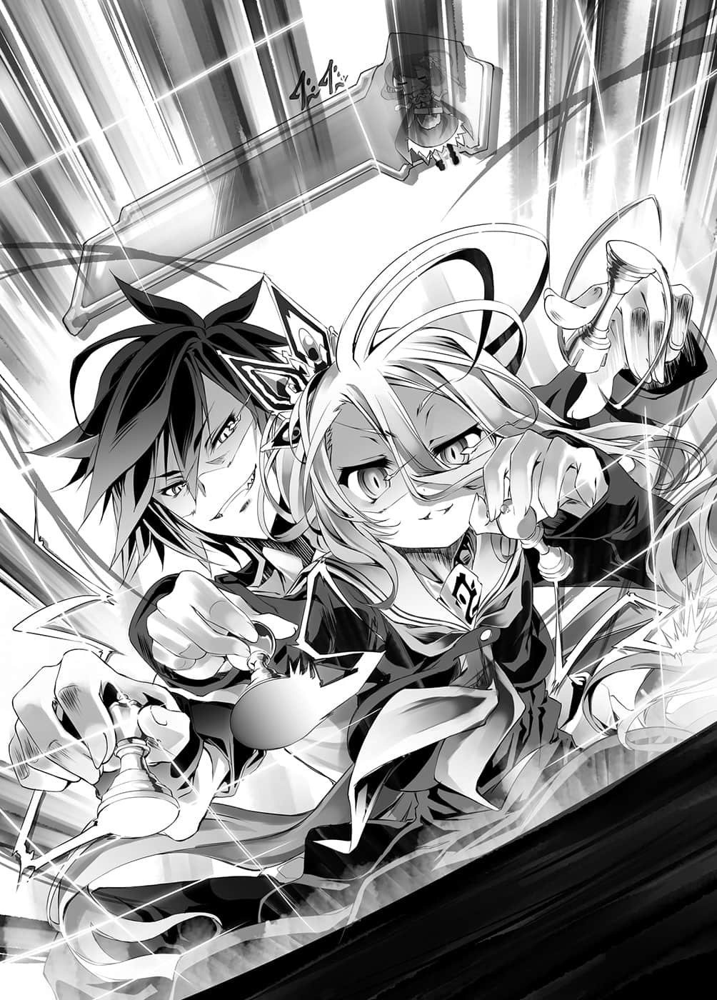
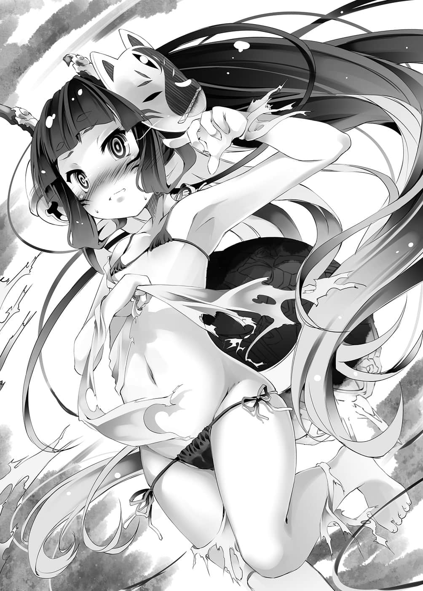

# 第三章 演绎式决定

> 来源：https://www.linovelib.com/novel/9/2118.html

经过五天，吊挂已久的『歇业中』看板——终于撤下了。

然后尖塔上新吊挂的看板上，又是大剌剌地这么写着：

——『演唱会场』……

「啊啊……艾尔奇亚王国历史悠久的王座，王座大厅……！」

史蒂芙悲叹地眺望着的是，与日前的演唱会截然不同的——豪华舞台。

借由机凯种装上无数器材与照明，那里正是完美的音响空间。

不过——『因为高度刚好』，王座首先被拆掉，改建成舞台。

接着——『想要增加容纳人数』，经过打掉墙壁，连接走廊的扩建工程后……

那里原本的样貌——『历史悠久的王座大厅』已经面目全非。

史蒂芙只能流泪看着，哀伤地悲叹，更落井下石的是——

「……真、的、是！这些人为什么会聚集在这里呢——！！」

在已经面目全非的前王座舞台之前，有数千人在等待开场。

史蒂芙悲痛地提问，回答她的声音却来自背后。

「上次在露台开唱时，也有路人经过吧，不过这次是在『城内室内』。」

原本从舞台旁探出头的史蒂芙，转了方向，沿着短楼梯走向深处。

在舞台侧面后台的桌旁坐着的男人，与坐在固定位置膝上的少女——嘿嘿笑着的空与白。

「……机凯种……大肆地宣传了……不过……」

「即使如此，仍特地前来的观众——就只有可爱的、训练有素的呆子吧？」

「……我不禁要替这个国家的未来担忧……」

接受那种无意义训练的国民及其数量，令史蒂芙不禁眺望着远方。

——在后台，令史蒂芙悲叹的元凶们，正坐在一张桌子的两端。

于是，帆楼尽管动作笨拙，仍开始唱歌跳舞，而在舞台旁的后方——

在场每个人都已清楚掌握的规则——基本上只是普通的西洋棋。

「除此之外的规则……应该不必重新确认了吧？」

但是火热的气氛与上次不同，帆楼感觉得出，一排排的『观众』——似乎正在追求着什么。

「——【向盟约宣誓】——！！」

对于连何谓期待都尚未明确定义的神存在……他们究竟在期待什么？

僵在原地的帆楼，她的脑中只充斥着『意义不明』四个字。

——配合帆楼在台上所唱歌曲的节奏，光点会如浪潮般，在棋盘上流动。

——

而与史蒂芙站在一起，从头到尾都是被害者的人物——

毕竟是空与白指定的内容规则，机凯种与吉普莉尔合作制造的『西洋棋盘游戏』。

空无惧地这么说着，没有人有异议——这是当然的。

「没问题……帆楼自己会找到那个答案的。」

她叹了一口气后，走下短楼梯，来到舞台的后台。

见到这个情况，帆楼一瞬间——头脑一片空白。

这样都还能与机凯种分庭抗礼，已经足以令史蒂芙与吉普莉尔感到惊异了。

没错——这是音乐游戏，是节奏游戏。

『唔喔～～～～～～～～～～』

「……『跟错节拍的棋步无效』的规则，原来如此，只是给我们的『枷锁』啊。」

帆楼口中仍然抱怨，不过却乖乖地走向楼梯。

——通知开演时刻的声音响起，帆楼奔上通往舞台的楼梯。

——不安、恐惧、紧张。

彼此以猛烈的速度，行云流水似地移动棋子。

空与白，两人举起手——要求确认赌注与宣誓。

当音乐如爆炸般响彻的同时，宣言也以不输音乐的声量呐喊而出。

盘上不断交错的手，让观战的两人根本来不及理解而叫着——这就是超快手高速西洋棋。

规则就是配合著浪潮下棋，跟错节拍的棋步无效——棋子退回原位。

打造这个舞台的理由，帆楼走上舞台的理由，大家在这里的理由。

「【肯定】落败之际解锁『新造机关』，放弃爱情，主动繁殖，回避灭亡。」

「……感觉得到……强烈的……偶像光芒……」

「本机一定会胜利，得到副奖和特别奖，请你期待，『心爱之人』。」

——上次帆楼也是不明所以，只是听从空与白暧昧的指示。

单纯只是融入『音乐游戏的要素』，所以才会变成这样的下法而已。

从白的手机播放的音乐，透过机凯种的器材扬声器得以增强。

「……情、情况怎么样了……吉、吉普莉尔，现在是哪一边占优势呀！？」

全部的答案都在这一局游戏，游戏开始之前，空先说了一句话：

下令打造这个惨状舞台的空与白——吉普莉尔则在他俩身后待命。

「……帆楼……加油……我会声援你……」

————凭依……？

帆楼见到朋友——巫女的身影，她果然也以期待的眼神看着自己。

---

■ ■ ■

……但是这样就吃惊，那可就伤脑筋了，因为这个规则并没有特别意义。

对此，空与白也是有如并联思考一般，运用着两人的四只手。

空与白目送帆楼之后，重新与爱因兹希他们面对面，注视着桌上的『正题』——

就是因为那样的假设——『自己受到他人期待』的假设理解，让她的思考停止了。

言下之意就是要求吉普莉尔确实地监视，另外——

爱因兹希借由机凯种『全连结体』的并联思考，运用着双手。

「……主人们略居劣势……不，现在转为优势——不……引诱……？」

从昏暗的观众席发出，将响亮的音乐也盖过的欢呼声。

「……帆、帆楼叫做帆楼！总、总之……帆楼要唱歌跳舞！」

平均每一秒都有四只手在棋盘上交错——空与白全无讨论，交互行棋。

「游戏中——『使用游戏规则以外的魔法或典开』都视为违规。」

未知的感情让应该是化身的身体发抖着，帆楼不知那是什么，无言地喘着气。

——他们是在期待帆楼什么呢？

就人来说只是一瞬之间，但是对神灵种而言却是有如永恒的僵硬之中。

「那么——我们也开始游戏吧？」

也就是——注视着桌上的『西洋棋盘游戏』，有如确认般地问道。

带着一脸表里如一的笑容，空抚摸着帆楼的头说道：

与他们对峙的是，被命令制造这个惨状舞台的爱因兹希——十二具机凯种依蜜尔爱因她们同样在他的背后待命。

身上穿着表演服装，等待出场，一直被耍弄的帆楼，露出不满的表情问道。

「……那就……借一下手……准备～……」

神所不该有的感情翻搅在一起，握住麦克风的手甚至不自觉地颤抖。

同样地，比如另一条规则——

「那么，如果双方都已经做好支付赌注的准备——」

帆楼做出这样的『假设』。

---

■ ■ ■

「嗯～……你那么讨厌吗？我觉得看起来相当好看哦！」

正如爱因兹希所说，这也是没有特别意义的规则。

笨拙地报上名字，依照空与白所教的那样，口中歌唱，舞动身体。

短短一瞬，却感觉异样漫长的沉默之后——宏亮的音乐响起。

只不过是，有数条『特殊规则』的西洋棋。

神为了求救——她甚至连那样的自觉都没有——而游移的目光，忽然在从黑暗中发出欢呼的人群中，发现了再熟知不过的身影。

前奏以爆炸性的声量回响，帆楼登上舞台，迎接她的是——

仿佛追随依蜜尔爱因和爱因兹希一般，机凯种全体举起手。

然而，即使如此，至少巫女应该不会想要见到以前的那个帆楼——只是为疑问而痛苦的帆楼！！

基本上这游戏是普通的西洋棋。

「我说过了吧？我们也不知道结果究竟会如何♪ 好了，差不多要开场了，好好地表现吧！」

虽然那终究只是基本上而已。

比如说，有一条规则是——『没有先后手』——

帆楼果然还是不知道该怎么办才好。

「——不能理解……完全不能理解……汝等到底想要帆楼做什么……」

「……空与白，帆楼问汝等很多次了，为何叫帆楼做这种意义不明歌舞的偶像的事？」

然而看到帆楼那个样子，空——露出非常罕见的笑容。

同样已经好几次，听到不是答案的答案，帆楼不满地对空与白低吼。

「定义喜欢或讨厌的因素不足！所以才问汝等为什么！」

吉普莉尔，甚至包含史蒂芙在内，唯一让每个人都感到疑惑的是——不管怎么想，这个游戏对空与白而言都是压倒性不利，然而只有空与白两人似乎毫不介意，大概是将对方的沉默视为答应了吧。

后台的空、白及爱因兹希，三人猛然地动着手。

「这是当然的吧？要是机凯种你们用音速或光速下棋，那我们也没得比了。」

「……但是……如果我方也是……音乐游戏的话……那么……正确度Perfect Combo……才是前提……」

然而对于『 空白』与机凯种而言，这条规则的用意也只在『限制速度』。

帆楼的演唱会歌单是——『十三曲』。

如果和音乐同步的话，西洋棋也是——『十三局』。

没有先后手，没有平手无子可动，被逼至僵局的人判定落败。

于是帆楼的一曲会与空他们的一局产生连动，让棋局分出胜负。

没错——到此为止，所有的规则都只有这种程度的用意。

真正重点的规则不是那些。

重点的规则——与那里有关。

史蒂芙与吉普莉尔不安地抬头仰望，她们所仰望的地方——空中有一个『计量条』。

上面附有漫画风的三头身依蜜尔爱因。

那个计量条的名称就是——『兴奋计量条』。

机凯种的『观测体』和『解析体』，会将观众的『兴奋、喜悦、满足』数值化。

直接说就是呈现演唱会的热闹程度——而现在正缓慢地衰减中。

因为没有什么特效，只有帆楼笨拙的歌舞……所以难以炒热气氛也是必然。

那么重新整理一下——空与白的胜利条件有三。

第一，以西洋棋取得七局以上胜利，也就是胜局多于败局。

第二，证明空『不是那个人』。

第三，演唱会成功——也就是不让『兴奋计量条』见底。

——以『西洋棋预测最佳棋路』胜过机凯种原本就非易事。

更不用说，就算不知道，也会本能地想逃之夭夭，没有炒热气氛的要素。

全体机凯种、史蒂芙，就连吉普莉尔也瞠目结舌地看着空。

下的是毫无疑问的坏棋，也就是——

从艾尔奇亚城的王座大厅改装而成的演唱会场内。

「……敢小看……９ ８ ９艺能公司……好好反省……痛哭流涕吧。」

「「亚库・得卡路洽————————————！！！！㊟」」

在吉普莉尔与史蒂芙也感到惊愕的景色中——空与白大声地喊道：

那么就和那时候——也就是与吉普莉尔比试『实体化接龙』的时候相同。

「我们要让这场演唱会成为传说！！准备好呐喊了吗？白——！？」

更何况照这样下去，不用多久『兴奋计量条』就会见底，然而问题却在于提升『兴奋计量条』的方法规则。

「机凯种你们也会跟着下的，我敢肯定。」

毫不犹豫地把棋子下在发光的格子——接着，空说道：

更何况发光的格子是随机，也就是有可能被迫要下致命的坏棋。

相反地，机凯种只要在三项中成功阻止一项，就算是胜利。

「……Ｏｈ ｙｅａｈ！ｙｅａｈ……！」

——真的只是为了特效而下的坏棋。

会场，对，景色改变、冲击、震动等等效果，也会波及身在后台的他们玩家。

即便是与吉普莉尔玩文字接龙，都无法生出不存在的东西。

——『特效步』。

不管怎么想，这都是对空与白压倒性不利的游戏，没错，就连爱因兹希也这么认为。

靠着机凯种所擅长，至今也使用过多次的『空间置换』。

……甚至不再是『盘上的世界迪司博德』。

【请放心，这是特效无害。】

「……自始至终……只不过是……『舞台特效装置』呀……！」

「看着吧——东部联合的偶像经纪公司们！准备好生气跺脚了吗！？」

空与白开心地笑着——不过，下棋的双手仍片刻不停。

怀着落败的觉悟，确认一步棋有何效果——而真正的目标是在那之后。

「就是你所想的，不，有点不一样吧，因为——我们也会下啊。」

呼应两人的呐喊，最后的规则——『特效步』发动。

爱因兹希面露困惑之色看着那个格子——没错，这就是最后的规则。

这条规则是借用吉普莉尔的实体化接龙游戏盘而得以实现。

「「跟着我们一起喊！！」」

「……啊……难道说——！」

——由于『十条盟约』的关系，所以要对帆楼、玩家或观众造成伤害是不可能的事。

「……毕竟是……真的神明嘛……♪」

空露出邪恶的笑容说完，移动手上的棋子。

面对瞬间就能不断应对与学习，能够无限增强的超级演算机——而且要胜利七次之多。

机凯种只要无视演唱会，下在最佳的一步，靠着西洋棋取得胜利就好了。

在可变的人型战斗机机器人的手臂舞台上，以及在高耸入云的巨大投影荧幕上，都看得见唱歌跳舞的帆楼。

然后——衬托她的是略嫌多余的特效。

对于空的行动感到似曾相识，史蒂芙和吉普莉尔小声地叫道：

没错——

「『心爱之人』的企图，莫非是想让机凯种我们下这种棋步？」

如今随着空与白接下来的呐喊，即将重新构筑——再一次被改变。

做出送棋子给对方吃的自杀行为。

只要观众发现投影影像上的文字，在那一瞬间，一定会响起如雷的欢呼声。

「银河偶像？哈！！太小家子气了！超次元偶像驾到，还不把路让出来！！」

『特效步规则』连那样的限制都没有，可以自由产生特效。

画出复杂奇怪轨迹的飞弹、纵横交错的粒子炮光线与光束雷射，点缀在天地之间。

完全无视同样流畅地下着棋，但是却难掩惊愕之情的机凯种们爱因兹希等人。

宣告自己要下的位置。

（译注：动画《超时空要塞》中的杰特拉帝语。）

爆炸的光芒窜过舞台、观众席、后台，也就是说，那个地方现在——！！

见到空毫不迟疑地下坏棋，机凯种尚未从惊愕中恢复，空与白立刻进行追击。

听到他怀疑空有那种无谓的企图，空与白脸上却浮现嘲笑之色。

——正确答案，就是那样没错。

而机凯种完全没有理由下那种棋步。

现阶段就已经令空与白处于压倒性的不利——不，是几近于不可能取胜的游戏。

「……嗯，还是不明白啊……这个规则到底有何意图呢？」

「你好像误会了什么，变态机器人爱因兹希！对我们来说，机凯种你们——」

那是无人知晓的——严格说甚至空与白也不知道——宇宙的某处。

「和那时候相同……是吗……！？」

——这个游戏的意义所在……因此——！

看到千真万确的战场，除了帆楼、空与白之外，每个人都哑口无言。

——突然出现亮起的『彩色光芒的格子』。

将下棋者的想像，化成景色、光景的特效，反映在会场上。

……不过那是当然……因为眼前的光景，即便是空与白都只有在创作想像中看过。

景色依照空所想像而逐渐改变的途中，空与白高声大笑。

看到『兴奋计量条』急速地上升，史蒂芙不禁大声叫道。

不曾见过的荒野，观众和后台的人们都只看着——帆楼。

不过，反过来说——除此之外全部都可能办到！

正如字面的意思所示，『特效步』会依照下棋者的想像引发——『特效』。

…………

「为什么这么简单就相信了呢～～！？」

因为『兴奋计量条』见底就落败，那规则只与空和白有关。

空心想那是当然的反应，因为空与白也心知肚明，那一步是坏棋中的坏棋。

「哈哈！！可爱的训练精良之人笨蛋们啊！你们瞪大眼睛期待吧，这次的演唱会是神曲目喔！！」

战斗机螺旋飞行，画出银色的轨迹，就连枪林弹雨的景象也美不胜收，不过——

因此，吉普莉尔，甚或包括史蒂芙，每个人都会这么想吧。

也就是说，最后的规则是……

等于是送棋子给对方吃——根本就是自杀行为。

——但是，在没有先后手的超快手高速西洋棋中，那是在宣告『自己要下的位置』。

局中会出现完全随机发光的格子，将棋子下在那一格就会发生——『特效步』。

不过，那正是——

就在每个人都这么想的时候，只有空与白露出确信的笑容。

以极超新星爆炸，令吉普莉尔无法继续接龙而取胜，这就是和那时相同的作战。

打算利用『特效步』妨害机凯种，让他们无法继续而取胜……

空与白恐怕就是这样打算的吧。

「……以特效造成妨害……想令机凯种我们无法继续西洋棋的策略吗……？」

爱因兹希轻易地跟上史蒂芙与吉普莉尔的想法，口中喃喃地说道。

背后的史蒂芙与吉普莉尔暗自抽了一口气。

「【否定】不可能有危害玩家的特效，因此对机凯种效果薄弱，没有意义。」

依蜜尔爱因甚至补充两人疏忽的点，而且提出反驳。

——没错，现在与实体化接龙那时状况不同。

这里是现实空间——依据『十条盟约』，无法造成危害。

最多就是妨碍，扰乱专注力，连那些都对机凯种没有效果。

机凯种在惊愕感性之中仍流畅无比地下棋理性的手可以证明。

「……那么『心爱之人』刻意『选择落败』的真意为何呢……」

机凯种们之所以会惊愕感性，纯粹是为了——空下坏棋的理由。

虽说是为了演唱会，空和白选择必败无疑的规则有何意图——

听到他带着疑心的问题，空与白脸上再度浮现嘲笑之色。

——答错了，这次错得离谱。

「还没想通吗？我只再说一次，机凯种对我们来说——」

「……打从一开始……一——直就是……『舞台特效装置』……」

空与白带着邪恶的笑容这么说完，接着下的棋步。

连结体报告，那一格是致命的位置，一旦走到那一格，有极高的机率会进入必败的死路。

————

没错——第二次，空与妹妹在第三局这一局已经下过一次『特效步』。

「好了，第二局，没有时间休息喔，机凯种！」

空与白一同露出凶猛、得意、傲慢的笑容——断言道：

爱因兹希指示连结体进行支援，等待验证假设的时机。

「要是你们不下『特效步坏棋』的话，我们也不能全力地下，对吧♪」

——啪滋。

第二局——爱因兹希率领的机凯种们勉强取得胜利。

「……如果输给……区区的机凯种……游戏之神特图……就没立场了。」

「没错……这就对了。」

空与白，两人说出的话没有半分虚假。

「这是预测最坏的棋步……你们能够跟到什么地步呢？超级机械大人？」

从舞台紧接着响起帆楼的第二曲，然后以欢呼声为信号。

听到充满断定的那句话，爱因兹希他们理解到，那句话的言下之意——

——这一次。

「——抱歉了，机凯种……你们绝对赢不过我们。」

——比起那种小事，让我们玩得更尽兴吧。

如果假设正确——『特效步』的规则，『真正的目的』就是为了让空玩得尽兴，所以刻意留下余地，让机凯种我们能够获胜。

假设……『特效步』规则的『真正用意』——

然后——

就这样，爱因兹希——不，包含依蜜尔爱因在内的『全连结体』，只能假设超出理解的怀疑是『事实』，并且接受。

——第二局，空与妹妹之所以会输。

「……加油……万能舞台特效装置……再让我们放特效哦……♪」

『——了解。』

——让我们下特效步，让我们炒热演唱会的气氛吧。

甚至公开宣言要下第二次『特效步』。

单纯是因为连续下『特效步』，专注于提升『兴奋计量条』的关系。

——『让手』了是吗————！？

连身为唯一神特图的游戏之神，也就是——连最强的游戏玩家也败给两人，两人口中道出的就是一个普通，却无法撼动的事实。

「我们来比互下坏棋吧？预测最佳棋步很无聊吧？」

做出送子给对方的自杀行为。

第三局——现在……眼前下棋的手忙碌地交错的盘面，足以令全部机体大喊『无法理解』，并且接受事实。

——发出彩色光芒的格子出现。

---

■ ■ ■

「如果是和白一起——身为『 两个人』的我们，西洋棋甚至下赢过唯一神特图大人哦。」

受到他们利用，他们说机凯种的功用只是『舞台特效装置』，那句话并非虚假。

他们的笑容凶猛得不像人类种，那是压倒性的强者捕食猎物时的笑容。

从那一句话推测空的意图，判断他的真意的验证时机，很快就来到了。

「……『全连结指挥体爱因兹希』通告全机，立刻报告发生何事……」

爱因兹希、依蜜尔爱因——机凯种全体的视线集中在两人身上。

爱因兹希严肃地下令后，机凯种所有机体都惊愕错误地呻吟。

只有盘面的亮光照亮黑暗，空凶恶的笑声响起。

没有声音和光线，演唱会自然会停止，跟『兴奋计量条』已经没有关联。

没有事先商量，空与妹妹互相移动棋子，看起来是打心底感到快乐。

与帆楼的演唱会——宣告第一曲结束的乐声几乎同时响起。

不过，爱因兹希毫不犹豫地移动棋子——下出『特效步』。

正因为比任何人任何事都擅长解析做，所以慌张的机械们更为惊愕，但是时间却不等他们。

就这样，听到空说的话，爱因兹希他们得到假设为『真』的结论。

——只是要胜过机凯种你们很容易。

『爱因兹希通告全机，现在开始进行「验证」，要求坏棋后的弥补演算。』

数秒后，发光的格子再度出现，由于他的妹妹紧接着下的『特效步』。

事实上，第一局机凯种就输了，如果只比一局胜负的话，游戏在那时就结束了。

『——————』

有如断电一般，会场所有的声音和光线完全消失，这个特效是——『停止特效』。

如果假设正确，那就表示非但这一局会落败——而且很可能全面落败。因此必须验证，所以爱因兹希怀着觉悟下棋，而反映出爱因兹希想像的特效是——

所谓假设——就是空的那句话『机凯种你们也会跟着下的，我敢肯定』。

——《将死——胜者『 空白』・一胜》

西洋棋局也已终局了，两人下了坏棋仍击败了机凯种。

「我说你们啊～！只不过跟我一个人下平手了，就得意忘形起来了吗～？」

看到这个情况，空摆出格外惹人厌的笑容。

说完之后，空在内心代替他回答——发生什么事。

空与白开始第二局——平静地移动棋子。

对爱因兹希他们而言，那一步棋是可以令『这一局』直接落败的最坏一步棋。

相对地——『我们也会让你们有棋下』——！！

也就是说——他以机凯种我们为对手。

两种用意都被阻止了，想靠强制结束演唱会取得胜利是如此，下了坏棋导致本局败北也是如此。

空宣布要下的位置。

机凯种们爱因兹希等人大概确信这局已经赢定了吧，空与白嘲笑他们后——走了四步。

空对爱因兹希露出讽刺的笑容说道：

「……Ｏｈ ｙｅａｈ……！白会让哥……吓一跳……♪」

借由并联演算甚至算出空与白『必败』，可是两人下完那步『特效步』，仍然处于优势，爱因兹希等人终于检讨某个假设。

不过却是停止演唱会，强制决定『这个游戏』胜利的最佳一步棋。

——那本来应该是致命的坏棋。

「好！那么接下来轮到白了吧！？要选怎样的『特效』就交给你了！」

仿佛将爱因兹希带来的无声黑暗变成了特效的一部分，光线忽明忽暗，帆楼的服装改变，音乐也跟着变调，这个特效——得到欢呼声回应。

不过，如果不下『特效步』……或者只下一次的话——

他们终于理解了事实，然而脸上却还是露出一副难以置信的表情。

「乖乖给我们利用吧，机凯种你们在这个游戏中的用途，说穿了——只有这样而已♪」

「……那种〇×游戏……赢了也……不好玩……」

——机凯种的两步棋都被阻止了。

但是，两人就像忍不住笑，又像过意不去，看起来更加讽刺地——

「『刻意选择落败』？我们是因为想要特效才下棋，哪里有什么真正意图啊？」

空出言刺激，脸上露出刻意放猎物逃走的捕食者的笑容，那笑容看起来就像在肯定机凯种的假说。

空与白相互行棋，仅仅四步——形势就逆转了。

下了真正坏棋中的坏棋——『特效步』。

机凯种们和吉普莉尔、史蒂芙的猜想与想法，全被两人推翻了。

「————」

对于超乎常理的验证结果，『连结体』进行并联思考。

他们强到不止机凯种，甚至游戏之神也望尘莫及？

拒绝理解。不，接受吧！缺乏可信度。不，至少有一部分是事实！

那就分析吧，查明吧，学习、应对吧——最后终至超越！！

用全部精神证明种族的本质吧——！！

从棋路看来果然还是空——与五天前见到的『意志者』的棋路一样。

上次是空没有使出全力吗？不，那么上一次与这一次的差别是————

「……哦？终于不再无视我引以为傲的妹妹了吗？废铁。」

「————！？」

大概发觉机凯种们考察的视线，捕捉到空的妹妹了吧。

「老实说我对此相当火大，请你们务必改善哦？」

「……白要让你们……亲身体验……你们无视的是……谁……」

两人不满之情溢于言表，讽刺地说道。机凯种们看着他们两人——陷入思考。

——这个少女……是谁？

不——她是空的妹妹，是家人，名字叫『白』，他们不仅有其认知，也没有无视她。

机凯种们只是没有特别重视她而已，为何？很简单，因为她是『别人』。

跟别人一起，两个人下西洋棋？那又怎样呢？

既不可能做到并联思考，也没有时间讨论。

只是相异的个体，各自下棋而已……那样做没有意义，明明应该没有意义……

「……对手是哥一个人……或者……白一个人……倒也罢了……」

他们一副理所当然地，利用消去法得到常识性的结论，史蒂芙无奈地仰望天空。

「非、非常对不起，主人！！都是我的无能——！！」

——正是因为给了自己那样的压力，所以史蒂芙在平坦无比的地方绊倒。

两人如此断言，他们说的话没有任何逻辑性。

「……主人，神灵种帆楼不知疲劳为何物，变更服装也是瞬间完成不是吗？」

所以吉普莉尔问，为何要设定本来不需要的休息时间。

「……喂喂，经纪人，歌单在第三曲后是怎么写的？」

然而不管是极难还是不可能，不管那是什么——机凯种都只有应对并超越。

「……机凯种就……更不可能……」

与史蒂芙替换，笨手笨脚地换好衣服的帆楼这么问道。

事到如今才发出这样的呐喊，空与白深深叹了一口气，回答史蒂芙。

对于不容抗辩的神秘说服力，每个人都点头认同。而在一旁——

——然后，突来一句话。

机凯种们不明白让空变成如此强者的白是何人？更不明白原理。

「话虽如此，谁也不知道吉普莉尔会做出什么事！」

「欸、我是经纪人吗！？……啊，我好像曾经被这样叫过一次——啊，我确认过是『休息时间・司仪时间五分钟』！哪里有写我的名字呢！？」

站上舞台的史蒂芙——手脚发抖，目光也不断游移。

——『休息时间』……在一般的演唱会都是更换服装或休息的时间。

假如白符合爱因兹希所想的那个人。

「如果你们以为能胜过『 我们两人』，那我只能回答：别太嚣张了。」

由于冲力的关系，她以夸张的姿势倒下，顺着那股冲力倒向舞台上的器材。

第三局，也就是演唱会的第三曲结束，中间是——『休息时间』。

---

■ ■ ■

不管是好笑的玩笑，还是风趣的谈话，那些都不是她擅长的事。

史蒂芙仍主张自己有勤劳地事先确认过。

史蒂芙自暴自弃地，登上通往舞台的楼梯。

史蒂芙设法尝试拒绝，可是——看见『兴奋计量条』缓慢却确实地逐渐减少，她摇了摇头——

在这样大叫之后，她又突然发觉。

「我没有人可以介绍！也没有相声搭档！所谓有趣的话题也太笼统了吧！」

可是在这个游戏，这一段时间『兴奋计量条』仍会变动。

听见空突然说到自己，史蒂芙发出奇特的叫声，空则是目光严厉地看着她，继续说道：

「……主人，这样好吗？万一『兴奋计量条』真的见底……」

「没有告诉我的事，我根本不能忘记吧！？」

「差得远了！这样最多就是『偶像等级Ａ』，表现力还不够！」

空与白两人露出锐利的目光这么说，史蒂芙的视线在空中游移。

「……这样就可以吗？这就是汝等说的『完美的偶像』吗？」

「感受不到是当然的吧！？因为帆楼连心的定义都还不知道！！」

见到接替帆楼站上舞台的那个身影，吉普莉尔这么问道。

「………………什么～？」

既然是『意志者』，经过六千年也不可能停滞不前！

深深坐在椅子上休息的空等人与机凯种们，彼此度过短暂的沉默时刻。

空将身体靠在椅背上，抱着白说道：

「……白和哥……不能站到……人群面前……」

但是非关逻辑心，却令机凯种差点认同他们的话——这是为什么——

自己尽力去做了。

——《将死——胜者『 空白』・两胜》

空说到一半停住……跟白一起仰望天空。

看到她用文字图能够形容的姿势昏倒的模样——顿时爆笑声响起。

她大概是在摸索记忆吧，点了点头后，她回答「没有忘记」，因为——

「呵呵呵，本机会尝试超越现在的『心爱之人』，本机确实接下爱的挑战书了！」

「看你要介绍乐团，还是说相声，或者说些有趣的话题都好！好了，ＧＯ！」

看着头上『兴奋计量条』微量地逐渐减少，所以她才会这么问。

——这两人真的没有把机凯种与西洋棋棋局放在眼中吧？

仿佛回应揭晓那个才能的白一般，『兴奋计量条』冲到了上限。

尽管对只被空叫过一次的职称感到惊讶。

「所以就是这样！史蒂芙！！你上去暖场吧，我很期待你的表现喔！！」

但是却遭到严格无比的『Ｐ制作人』挑剔，帆楼眼眶泛泪地继续追问。

听着背后的欢呼声，帆楼从舞台走楼梯下来，吉普莉尔见到她便说道：

拍了一下额头，令人怀疑是否有权谈常识的两人，开始说起他们的常识。

——好了，这样剩下的有常识之人，除了史蒂芙之外还有谁呢？

「啊～～！没有常识的家伙就是这样才伤脑筋啊……听好啰！」

爱因兹希爽朗地燃烧斗志，空等人则只是冷眼回应。

后台笼罩在沉默之中。

不过——爱因兹希想到一件事，对『连结体』下达指示。

听见西洋棋盘发出的语音，以及通知第三曲结束的音乐声。

即使如此，她仍站上舞台中央，想要将她内心所想展现为话语；甚至试图组织无法以言语形容之事。

空感受着各怀感慨的视线，眼睛突然一亮。

「……对……她是搞笑人才……这个难得的……『属性才能』……」

她撅着嘴询问。推测有数亿岁，身穿华丽学生服的年幼之神所提出的问题——

空与白表情认真地这么回答。

「……史蒂芙也没有自觉，不过那是靠努力也无法得到的……『才能』。」

「……有呢……输过……一次了呢……」

「……就连等级『Ｓ』也只当作中途点的决心……白感受不到……帆楼……想站上顶点的心。」

不过——她的脸上是人见人爱，没有一丝恶意的笑容。

「……史蒂芙……你忘了……你为什么在这里吗……？」

脸从器材上滑下，倒在地上的史蒂芙，在她裙子下的内裤完全展露。

「～～～～啊～好啦！场、场面冷掉我可不负责哦！？」

「话说我为什么会在这里呢！？」

「串场啦串场！帆楼离开舞台的话，就要有人上去娱乐观众呀！」

然而听见空十分放心地这么回答，众人一起往舞台看去。

就如同她的性格一般……笔直地一头撞上。

『全机——提升解析的优先顺位，从对手的棋路，改为西洋棋以外的获胜方法。』

「因为观众会累吧！如果是神曲目的话，刻意制造空档也很重要，明白了吗！？」

︳〇╱│︳……呈现这样的姿势。

「没问题，不管她做什么都会炒热气氛……史蒂芙拥有吸引人群的力量。」

那么最坏的情况，在四局以内要摸清两人的招数并超越，将会是极为困难的事。

「把这句话好好刻在你们ＢＵＧ的脑袋里，『 空白』没有败北——」

——果然还是不明白。

似乎是突然打开忧郁开关一样，两人仰躺在椅子上，一副心情沉重的样子，不知为何吉普莉尔慌张地下跪道歉——机凯种爱因兹希他们不断地思考。

「对喔，这句台词已经不能用了啊……我突然感到沮丧了。」

「……让偶像暂时退下……引起观众期待……接下来会是……怎样的服装。」

史蒂芙一定说不出什么不得了的话吧。

「…………是『意志』。」

回答者是坐在空与白的对面，先前一直默不吭声的——爱因兹希。

听到回答来自意料之外的人，帆楼感到讶异，不过机械男人继续说道：

「你问『心』的定义，本机因此应对回答，『心』即是——『意志』。」

「……意志……汝说帆楼有意志，根据为何？」

「因为提问，因为追求答案，因为有想法……」

说完之后，机械甚至定义心、意志、想法、生命，然后断言：

「想法、意志、生命，密不可分且同义，你是有生命的神，那么也会有想法、意志和心吧。」

正因是生来没有这些事物的机械，所以比起生来即拥有的人，更加珍惜。

比人更像人似地谈论那些事物的定义。

他带着温柔的微笑继续说道：

「因此，如果与『意志者』有相同的意志与想法的话！那么『心爱之人』与之也是相同的生命，这是再明白不过的事！」

「喂，机械！！电脑别诡辩，你这推论跳太快了吧！」

——石油大王披着头巾，石油大王是有钱人。

因此披着头巾的有钱人，全部都是石油大王。

听到爱因兹希说出这种有如范本的谬误・诡辩，空大声地喊道。

「…………」

——帆楼沉默不语，似乎仍然不明白。

不过或许是感觉到什么，帆楼依序看向爱因兹希、依蜜尔爱因，以及机凯种众人，她侧着头感到疑惑——此时通知时间已到的音乐响起。

「……我、我再也不干了……」

「哼，空中坠落这种事，来到这世界后，我们已经历过很多次……习惯了。」

接着仿佛说出在休息时间中，他一直思考的结论一般。

对于他们根据空的配菜，从最偏差的情报推算出的这一步——空承认确实不差。

不过，那也是理所当然，空的手丝毫不曾减慢的，内心则是暗自窃笑。

——结果五分钟的时间里，史蒂芙因为昏倒而痉挛，在那之后还将麦克风拿反，她不是取悦观众，而是被观众取笑。精疲力尽的史蒂芙回到后台，然后帆楼就像接替她一般，移动至舞台旁等待。

「你、你们为什么这样还能专注在游戏上呢～～喔！？」

——全都被看穿了。这个事实令爱因兹希哑口无言，惊愕不已。

不过，空第一次的『特效步』，已经给了他们前所未有的恐惧特效——让他们安心了。

「没有边际，没有极限——也没有止境，最后终至超越。」

那是爱因兹希——不，机凯种全部机体，经过并联演算得到的解答吧。

「哼、哼哼哼……惊讶到说不出话来了吗？那也难怪，『心爱之人』啊——！！」

「也请你不要小看机凯种，好吗？正如先前的宣言，机凯种只是暂时随你们利用。」

不过，爱因兹希回答的笑容与声音却……非常温柔。

……因此……难得有这个机会……

「所以只能停止跳舞，中止演唱会！『兴奋计量条』因此大幅下降——不过！」

---

■ ■ ■

就这样，爱因兹希所下的『特效步』几乎全部失败，当他的手再度伸向发光的格子时——

伴随着口头禅，爱因兹希——不，并联的超级机械所下的『特效步』。

「很遗憾，照曲目表看来，还有两次喔，下一次也拜托你了♪」

……就连史蒂芙也难以理解的人心观众，机凯种更是如此。

机凯种超乎常理的演算力、情报处理能力，估计甚至已超越『无限』的地步。

目睹空与机凯种，人类与机械的激烈斗智！吉普莉尔眼中闪耀着兴奋的光芒！！

（译注：秘鲁一个著名的印加帝国遗迹。）

——只要不断应对，最后终能超越的自负——

「哼，才不是什么游刃有余，只是因为这就是规则。」

从他们对空的求爱行动来看，明显可以看出，他们无法完全理解『人心』！！

「……是啊，原来如此，这是相当精确、不坏的一步……」

「服装破损，如果继续跳的话，接下来就是全裸！等同于断绝演艺生命！！」

「不、不愧是主人……不……观、观众们也很了不起……」

可是看到爱因兹希充满确信的笑容，空感到一抹不安——

他们之所以会让地面消失，测试的目的是为了妨害空与白，同时也令观众恐惧吧。

空说到这里停顿了一下，不怀好意地对着爱因兹希笑着说道：

史蒂芙、观众，在游戏中无法使用魔法的吉普莉尔等人也是。

「就是那个啊！！为什么——他们会兴奋呢！？被训练得太好了吧！？」

「你们的目的并非如此，真正图谋的是『在那之后』——服装破损却仍继续跳舞的情况，我说得对吧？」

「哼哼……呼呼呼……哇哈哈哈哈！我可以明显感受到你们的惊讶哦！！」

只有这样，甚至跟胜败无关，不过唯一不可违背的规则，就是必须保持酷脸！此外，没有别的规则！！

「太乱来了啦～～！！话说你们两人还在装酷，真是游刃有余呢！？」

不，不止是空与白两人。

然后空无视史蒂芙冰冷的视线，继续激动地说明：

「『心爱之人』啊……我们不会小看你，你的强悍也超出我们的理解。」

帆楼等待第四曲开演。

在盘上进行高速攻防的空与白，如今——自由地飞翔在空中。

空与白则是等待第四局开局。

就在那个瞬间——！！

如雷的欢呼声，突破极限发出亮光的『兴奋计量条』，已经胜过空的千言万语。

机凯种不明白如何才能使气氛冷却……！

景色重新构筑为机凯种他们的解答意象，在天地重新恢复的演唱会场上，空心里想：

正因为如此温柔，他的话语才足以令空与白背上冷汗直流。

由于刚才机凯种爱因兹希他们的『特效步』的关系，『地面』消失了——带着空与白、机凯种爱因兹希他们交错的『特效步』所产生的那些东西，从无垠的天空坠落。

——所谓的极限西洋棋就是——

只要没发觉错误，就算机凯种的演算速度超出预料，甚至超越无限！机凯种都绝对无法赢过空与白！

事到如今，不管是地面崩落也好，天塌下来也罢，观众都会认为那只是特效的一部分。

……劈～哩劈哩啪～啦啪啦～

但是，那个解答却以失败告终，就在依蜜尔爱因和全部机体都惊愕不已的时候——

——从马丘比丘㊟到宇宙战舰，最后甚至是空他们也不知道的东西。

空故意装得尖酸刻薄，语气中极力嘲笑，想要挑衅对方。

「——我们机凯种，不管对方是谁，只要其确实存在我们就能应对。」

「哦哦～？又要下坏棋了，这次会是怎样的失败呢～？」

「……史蒂芙……太难看了……」

空与白摆出一张酷脸，冷静地——『自由坠落』，史蒂芙则对他们悲鸣喊叫。

随着第四曲的响起，面临第四局的三人，手也开始动了起来。

他们各自等待着——

恢复为原本的会场，正常的舞台之上。

在空中、断崖、水中、惊悚游乐设施……总之，就是在危险的场所下西洋棋。

「为、为什么……假设应该很完美才对——怎么可能会这样——！？」

「……『特效步』……接下来……轮到……哥❤」

于是空与白决定这时来玩玩『极限西洋棋』。

只有帆楼的服装出现异常的不自然声音，接着破碎了。

看到空与白的笑容，爱因兹希也露出微笑。

即使如此——他毅然决然地继续说道。

………………

它所代表的意义就是，观众们连自由坠落也很享受，狂热地沉浸在帆楼的歌舞中。

然而——空原本接着要说出『还是太天真了』这句话——

——没有问题……机凯种『认错人』了。

因此——他们只能不断反覆地经历尝试与错误，从得到的反应逐渐修正。

就连吉普莉尔也赞叹不已，史蒂芙怀疑大家的精神状态有问题，只见『兴奋计量条』飙至上限。

空发出有如范本般的三段式大笑。

空没有停下在西洋棋盘上移动的手，坦率地称赞对手。

——就这样，演唱会与游戏同时进行——来到第七曲第七局。

在这么回答史蒂芙时，空仍然一脸酷酷的表情。

『唔喔喔喔喔喔喔喔喔喔喔喔喔喔喔喔喔喔喔喔～～喔喔喔！！』

「…………欸？」

更正，确实是自由，不过正确说来并没有飞，只是——

「好了，这样也休息过了，我们继续吧？」

「我们机凯种，不管对方是谁，只要其确实存在我们就能应对……我们会让你见识——超越一切。」

他的表情无所畏惧，宣告不管是在西洋棋还是『特效』上——

「嗯，我们暂时就随你们使用吧，『心爱之人』啊……」

这是空他们从以前就很想玩的游戏，但是碍于家里蹲的关系，一直无法实现。

或许是把空他们的沉默当成是惊愕了吧，爱因兹希高声大笑，得意地说道。

而如果有低于绝对零度的温度，那大概就是史蒂芙的眼神了吧！！空无视她们的反应继续演说：

「如果帆楼就像个神灵种一样，没有『羞耻心』的话！看到她全裸跳舞，最后也会吓跑观众，『兴奋计量条』会暴跌——你们是这么想的对吧！？着眼点不错，这是很漂亮的『双重束缚』，我就夸奖你吧，变态型男同志机器人啊！」

——停止跳舞的话，观众会感到不满；但是继续也会令他们扫兴。

原来如此，他们的理解比想像中还要进步，果然是不能轻忽的对手。

「但还是太肤浅了，会哲学思考的机械啊……这种程度的事态，『Ｐ制作人』会没考虑到吗！？」

听到空这句话，包括爱因兹希在内的所有机凯种，同时一齐向舞台望去。

在不自然地破损、撕裂的服装……之下——！！

帆楼穿着充满恶意的微小面积泳装，继续唱歌跳舞……

大概是比起衣服破损，那件泳装被人看见可能还比较害羞吧。

她拼命地拉着残破的服装，设法一边遮掩着，一边继续跳舞，看到她那个样子——

「……哼，是啊，没错，如果是本来的帆楼，就算赤裸着身体，或许也会继续跳下去吧……」

空有如在做总结一般，公开他的深谋远虑。

「所以我让她穿上比裸体更羞耻的泳装……就连帆楼都为了没有自觉的羞耻心感到困惑，看到那个模样怎么可能不兴奋呢！！Ｄｏ ｙｏｕ ｕｎｄｅｒｓｔａｎｄ？」

机械无言地垂下头，不过空等人感觉确实听见他们说的话。

他们说——深奥，太深奥了。

这种有如无底深渊的理解，自己真的能够到达吗……？

无限成长的机械，对于自己的自负似乎也产生些微的动摇——不过，爱因兹希猛然想到。

「……！呵呵呵，不愧是『心爱之人』……可是请你更正——！！」

爱因兹希仰望着上方，发觉一件事，他从绝望的深渊复甦，发出了怒吼。

「这一步不止是『双重束缚』……而是『三重束缚』……！！」

「全机，这是陷阱！那样的特效不需要转换！！这只会让机凯种我们陷入不利——」

…………

与没有感情的语气相反，依蜜尔爱因明显地缺乏冷静——应该说她生气了。

可怕的超级机械察觉到计量条衰减所代表的意义，空忍不住咽下唾液。

不，除了爱因兹希，机凯种全都像在逼迫似地，瞪着眼睛命令他。看到她们那个样子——

「……是啊，看来这一局我们输定了。」

同时——反映机凯种女性成员依蜜尔爱因她们意象的『特效步』……呃～……

不过，下棋的手仍然毫不停止地开始第八局，而听到空与白的『胜利宣言』后——

机凯种的女性依蜜尔爱因她们十二机，加上史蒂芙、吉普莉尔两人——除了白以外，女性全员身上只剩下袜子和吊袜带重要部分，其余的衣服全部粉碎消失，她们忍不住发出惊疑的声音。

在确定落败的第七局结束前，最少还有三・二秒，至第八局开始前则有八秒，总计十一・二秒的时间！

但是『神秘光芒先生』则是允许在无线台播放！因此这个情况肯定是健全的！！证明完毕Ｑ・Ｅ・Ｄ！！

每个人都还来不及理解，误以为他们的行为是代表『放弃游戏』。

爱因兹希似乎终于发觉空的意图，空无言地窃笑。

不过……看来根本算不上什么赌博。

「【表决】全机一致决定，剥夺『全连结指挥体爱因兹希』的控制权，暂时由本机操作。」

……刚好十一・二秒，两人露出达成目标的表情，回到座位上喘气。

没错，虽然只有微幅，但是——『兴奋计量条』正在衰减。

那是能全方位遮蔽，不管是从哪个角度看去，都能勉强遮蔽私处的光！

两人自问：办得到吗？空与白眼神交会，笑着断言：愚蠢的问题。

她们以可怕到难以形容的方法，名符其实地『虐杀』了十二只怪异伊野的虚像。

「——【命令】以最快速度下『特效步』。」

「唔喔——喔喔喔！全机！住手啊！重新考虑啊——喔喔！！」

「——呜～多么能干的妹妹呀！？哥哥太幸福了！！」

「「「………………咦？」」」

……这个……那个……

一如帆楼服装破裂时的不自然声响——奏响了十四重奏。

——各位一定会觉得，这样违规了吧？

没错，就是吉普莉尔所问的（史蒂芙就无视吧），飘在女生成员们身上的『光』——

确实如果这是『马赛克先生』，反而会有好像违规的感觉。

爱因兹希的抵抗徒劳无功，依蜜尔爱因的手毫不犹豫地将棋子移至最先发光的格子。

非但不会吃红牌，甚至裁判也不会吹哨！因为——！！

从低角度拍摄的无码照片，这会得到一张红牌，受到Ｆ〇ＦＡ停赛处分。

——那是『必败的一步』……

她们明确地有羞耻心，而且——即使有『神秘光芒先生』，她们甚至拒绝被爱因兹希看见。

这就像是要将丝线快门精准地穿过无数竖立的针孔，正中拍摄前方的靶心配菜，是极为困难的事，不过——试试看吧，『 我们』一定做得到——！！

「……嗯……我们约定好……要一起……寻找新希望配菜吧？」

——煽动机凯种女性成员依蜜尔爱因她们的羞耻心，让她们先下坏棋特效。

机凯种一致提议——不，一致决定，为排除受宇宙意识拒绝的肌肉体，展开行动。

他们以迅雷不及掩耳的速度，在空的『特效步意象』呈现在景色之前采取行动！

没错——服务得太过火了……！！

空推测她们一定会这样想……那就是——无论如何一定要解决这个东西——！！

脱衣——必须只是『突发事件』，才会令人热血沸腾！

「『心爱之人』啊……这就是『用下一局的胜利来弥补』那句话的真正意义吗——！？」

机凯种的女性成员们依蜜尔爱因她们只是平淡地继续说道：

「虽然有太多可以吐槽之处，但是——为什么我被脱衣了呢！？」

看到白微笑点头，空忍着感动的泪水，在发光的格子上，落下决定这一局落败的『特效步』。

「好、好了……那么虽然确定会赢，我们还是开始来下第八局吧……呼……呼……」

——劈～哩劈哩啪～啦啪啦～～～～

爱因兹希理性的主张，却无法被机凯种女性成员女孩们接受。

即使是花草也会枯萎雕谢，这才是自然之理。

……就这样，空与白要挑战的就是——

空拿着手机，白拿着平板电脑，他们已经滑过依蜜尔爱因的『胯下』！带着连续摄影捕捉到的照片，奔向下一个目标……！！

「——【恐怖】……咿呀！？」

修补帆楼的衣服……不，为她替换下一首歌穿的服装——紧接着——！！

将十四人份，每人一张以上的新希望最佳写真摄入相机内，然后回到座位……

「……因为是你们……先下……『特效步』……呼……呼……」

两人要在这短短的时间里，找出不会拍到邪恶虚像伊野的角度与构图！

——同时……

空与白踢开椅子，拔足狂奔，他们的初速——超越光速。

空坦率地承认，将棋子移向发光的格子。

就如同内裤微露是刹那的幸福所以可贵！内裤全露则扫兴至极，根本不予考虑！

即便是机械，只要有心，不，就算没有心！

虽说是特效假货，但总计出现十二个恶梦，当惨叫声响起之时——为时已晚。

「什么……！？贵机到底在说什么——！？」

而宛如早就等待着那样的思考一般，一个格子亮起彩色的光芒。

没错……每一机都分到一个，俗称『初濑伊野』的邪恶灾祸。

不惜稍微提高难度，甚至搬出『障碍物伊野』——这就是利益。

但是那个格子，那个位置，即便是空与白，看到那个位置，也只能断定——

（编注：棋类术语，指双方在对局过程中，出现的循环往复的走法。）

「【表决】十二机赞成，以最快速度下『特效步』，将观测规避物体Ｘ永久性排除、破坏、杀害。」

「主、主人！？这、这神秘的光是怎样的构造呢！？」

然而，颤动的十二个怪异物体，不管逃到何处都会追来的噁心肌肉。

然而，爱因兹希还来不及感到疑问，依蜜尔爱因无感情的声音已立刻传来。

这是因为有着非欧几里得几何图形的外型，可靠的——『神秘光芒先生』大驾光临！

ＢＵＴ可是但是！——不会，答案是不会！

不……当然是为了嗜好配菜，但嗜好能兼具利益不是更好吗？

空认为这有相当程度是赌博，毕竟首先，连机凯种是否有羞耻心都很令人怀疑。

「所以，我们就用下一局的胜利来弥补吧——准备好了吗？白。」

然后，在隔了一拍之后，机凯种的女生成员依蜜尔爱因她们，每一机的前方都出现异状——

只穿一件丁字裤，摆出健美姿势（以胸肌为重点），被他慈爱的眼神紧盯着不放。

没错——为何要下这样的特效。

听到这别有含意的一句话，白无视讶异的众人说道：

明白这深奥的道理，所以机械领悟到——空与白必须要下『特效步』，恢复帆楼的服装，在棋局终盘下一步坏棋，招致绝望不利的一步棋！

他们的应对与实行，实在令人感到惊异，空怀着赞赏与敬意说道：

利用现场状况，从『双重束缚』，转变成『三重束缚』。

下在那里就无可避免被将军，再怎么挣扎，也只会是长打平局㊟——落败。

一个只穿着无风却自行飘动的丁字裤，且蠢蠢欲动的肉块，正露出慈爱的眼神，盯着她们的裸体看。

「【警告】除了『主人』以外不接受被其他人看到身体，朝这里看过来的话就立刻破坏『全连结指挥体爱因兹希』的视觉器。十二机赞成，最终劝告——以最快速度下『特效步』，此为命令，快点。」

由于及时让白的目光集中在盘面上，所以勉强让她避免了目睹那样的光景。

「【微笑】请放心，这是特效无害。」

机凯种女性成员依蜜尔爱因她们光裸的身体上沾满像是血的液体，依蜜尔爱因这么说完，一瞬间之后，『神秘光芒先生』从所有机体身上剥离，姿态恢复为女仆装。

「全机！你们思考异常了吗！？不过就是你们的裸体，却可以换来致胜的机会哦！？」

空与白对意外认真的她们感到畏惧，听到爱因兹希这么大叫，两人不禁在内心感谢他，不过——

「【通告】全机通告『全连结指挥体爱因兹希』，请自我摧毁、自爆，笨蛋、白痴……完毕。」

虽说是机械，但是竟然把少女的裸体说成『不过就是』，那样的罪过让女生代表依蜜尔爱因婉转地告诉他『去死』。

然而……果然所谓的罪人，就是因为不认为自己有罪，所以才是罪人吧……

「为什么！？如果是本机的话，裸体那种东西，想看多少都可以——」

话还没说完，爱因兹希就开始脱起衣服——突然间，他从空与白的视界中消失了。

「【噩耗】棋手机爱因兹希发生意外，遗憾，游戏由本机接手，不影响游戏进行。」

仿佛依蜜尔爱因一开始就在那里似地，她接替坐在位子上。

……原本对战的对手就是『机凯种』——连结的所有机体。

所以就算变更棋手机，对手依然不变，没有违反规则，不过……比起那种事。

虽然肉眼仍无法目视爱因兹希是怎么消失的，但他果然是被依蜜尔爱因踢走的吧。

这次爱因兹希并没有插在墙上，而是陷在墙壁的坑洞内，尽管两人有一瞬间对他的安危感到忧虑——

「……你、你们……输了也没关系吗……！」

听见爱因兹希夹带着杂讯的声音，空与白松了一口气。

「【无妨】『主人』的裸照会由本机得到，一定会获胜。」

「相对于觉悟的气魄，你的动机太不单纯了吧！？」

没错——依蜜尔爱因确实踩到空的地雷了，空望了她一眼，感觉自己制作人的骄傲受到侮辱。

空的坏棋抵消了机凯种们依蜜尔爱因她们下了两次的坏棋，让局面反而变得对空他们不利。

「可恶，被她摆了一道！！白，在用下一次的『特效步』消除之前，你要一个人设法撑住啊！！」

「【推测】算出对『主人』有效的妨害，这一局的胜算十分充足。」

「【必然】不惯于面对女性，但是异常地关注，从每次求爱行动都表现出深深困惑即可确认。另外对『主人』喜爱的容貌、属性，皆已高精确度锁定。」

众人的视线就像在这样质问，但是空的内心呐喊着——我做错了什么吗！？

『特效步』的落棋声，让依蜜尔爱因她们的惊愕留在后台，然后——

这个行动所代表的意义——若非拥有绝对自信的计策，就是已有确定落败的觉悟。

「那个那个、其实我刚才已经先去淋浴过了……❤」

「主、主人！？您是不是身体不适？是过劳了吗！？」

她既不诱惑空，却也没离开，始终保持中立或旁观的立场。

虽然史蒂芙的叫声响起，让人想起史蒂芙和吉普莉尔还是赤裸着。

——西洋棋，那是别具代表性的两人零和有限确定完全情报游戏。

「是啊，没错啦！什么嘛，处男犯法啊！？」

这是反映依蜜尔爱因的意象所构筑的特效。

「立于制作人之道顶点的我，你说我会找艺人陪睡夜间指导？对自己培育的偶像艺人出手？」

——只有一个人，白代表全员，对着发出悲痛叫声的空提出抗议。

然而看到那幅光景，空却是一声嘲笑，接着将注意力拉回游戏上。

吉普莉尔声音颤抖，担心空的身体状况，史蒂芙甚至确信眼前的空是假货。

除了白以外——全员惊愕不已。

但是，搞错『状况情境』了，而且是——令空极为不快的状况！！

每多说一句话，空的心中便喊——不妙、不妙。

重新与依蜜尔爱因对峙，感受到她宛如保家卫国的气魄后，空忍不住这么大喊；不过接下来的一句话，令空稍稍地加强了戒备。

何时会下？连下棋的时机都无法正确预测。

空的怒吼，连大气都为之震撼，让受到神风错觉吹拂的人们，紧张地咽下唾液。

不过，没有人理会，就连同样裸体的吉普莉尔，也注视着持续下棋的空与白。

「……哥、哥……因为那样的理由……脱离战线……这样好吗……？」

然后他心想：是啊，这个着眼点确实不差。

而且，因为机凯种们依蜜尔爱因的两次『特效步坏棋』，这一局空与白几乎确定胜利了。

——惊愕、困惑、疑问，而那神色似乎愈来愈深了。

……………………啥啊？

「————【肯定】……无法理解……」

他充满焦虑地想着：太小看她了！她真的会采取最可怕的一招！？

「各位观众～！！心情兴奋吗——！？」

「无聊，亏我还慌张了一下……真是的，别吓我啦。白，继续啰。」

空他们仍超越机凯种，这让依蜜尔爱因感到非常困惑。

——

巧合的是，与空他们对峙，持续下着棋的依蜜尔爱因，她脸上充满与吉普莉尔相同的感情。

但是，由于『随机』发光的格子存在，使得这个游戏增加了不确定性。

四十八名兽耳偶像……争相向空要求『那码子事』。

帆楼的服装被破坏后的一连串突发状况，已经将『兴奋计量条』提升至顶点了。

空的脸上血色渐失，脸色逐渐发白——不妙，不妙不妙不妙了！

被女生性感诱惑，当然无法专注游戏吧——！？

「那个！？刚才！刚才那一步应该也可以把我的衣服复原吧！？对吧！？」

「不管我做哪种反应你们都有话说吗！？你们想要我怎样啊！？」

「……哦？」

然而——盘面却在转眼之间丕变，优势再度倾向空他们。

那是再度宣言——要下『特效步』。

伴随着爆炸性的音乐响起，四十八名兽耳女孩们偶像，在舞台上发出欢呼声。

「【结论】只要派多名美少女给『主人』，他就会『当机』……无法继续游戏。」

…………呼……

然而，为什么空要下没有必要的『特效步坏棋』，让自己再度陷入不利状态？而且——

确实，『Ｐ制作人』这职业对空与白而言是玩乐，但是空与白在玩乐时总是——比正牌的人员更为认真！

只见在空的周围，浮现出许多貌似兽人种的轮廓。

如果有哪个男生，被美少女诱惑还能心如止水，那一定是他已经到涅盘之境了吧！

「为什么在这样的情况下，自己还是处于劣势呢？你的表情似乎觉得非常不可思议呢……我说得对吗？」

「你——我知道了，你不是空吧……！？你是什么人——！？」

「制作人♪您今天也辛苦了～❤」

正如空所宣言，变成『预测最坏的棋步』——使得演算变得极为复杂。

除了依蜜尔爱因和空之外，每个人都想这么说，就在他们哑然无语的时候——

空让所有人想起，或是理解这件事后，握着棋子，拳头高举——

「你说我会做那种猪狗不如的勾当……？少瞧不起我了，机凯种！！」

看到她们的态度，空对着她们大吼——

空强行压抑内心动摇，双手仍持续移动棋子，然而依蜜尔爱因——一见到发光的格子出现，立刻流畅地移动棋子。

在发表那段浅显的不变真理后，她下了『特效步』，也就是——

空松了一口气，发出无力的叫喊。

刚才已经下过一次，现在胜算薄弱，她还要再下一次坏棋。

——依蜜尔爱因。

判断无法游戏的状态已不可避免，空开始思考下一个对策，这时空的周围果然——

笔直地朝着『发光的格子』落下。

没错——即便下了坏棋。

啊～是吗？处男就是错误啊？处男有那么罪孽深重吗！！

不过，她们动作流畅地，在帆楼的身后跳起舞来，那个样子就是——伴舞群。

在让人难以捉摸的机凯种之中——她是空至今仍看不透的唯一机体。

少女端正的面容露出微笑。

看到大量出现的顶级美少女偶像们，观众们的思考终于跟上现况，使场面气氛变得更加火热——

「【确信】偶像『Ｐ制作人』的愿望，『陪睡攻势夜间指导』所产生的妨害，对于延迟行动极为有效。」

随机出现的『特效步』——坏棋，当然愈接近棋局终盘，愈是致命。

「不用做陪睡那种事，我也会把你们全员打造成偶像啊，上场吧！」

「……嗯……一定会这样吧……」

「请您今天也要特别指导……拜托您了❤」

对于她们突然的出现，观众——不，甚至帆楼也惊讶得瞬间身体僵硬。

「你在想，为什么我特地把你叫出来的偶像们派去当伴舞群，是吗？」

接下来的一句话——却将空推落万丈深渊。

喂，自称最强游戏玩家的另一半。

空在双手不停的情况下，替她们说出产生惊讶、不解的理由。

那是随着各式各样的烟雾，从空的周围转移过去的四十八名兽人种偶像。

她每说一句话，空在心中就暗喊一句——不妙。

无论如何，说出口的人既然是依蜜尔爱因，不只是空，白也加强了戒备。

「【事实】『主人』是处男。」

她用有如竖琴般美妙的声音，说出的话竟然是——

在那种特异性相乘之下，使得她在异常诡异的机械之中，显得更为异常。

你那样的表现真的象话吗？

没错，即使过了下班时间，『神秘光芒先生』仍在加班中。

要下在哪里？在格子发光前，无法预测风险。

要在何时下？被对方知道要下哪一格的风险极大。

真的要下吗？让对方知道所要下的格子，借此反过来利用吗？

就这样，西洋棋原本十的一百二十次方的棋步，却演变成『逼近无限』。

然而，最大的问题——并不在此，空笑着继续说下去：

「至今下了八局，七百步以上，你们仍无法分析出我们的棋路……不。」

用这一句话开头的空，内心想着——自己看穿机械的心理到什么地步呢？

身为游戏玩家，身为人类，接下来说出的话，就是确认表述这个令人兴奋的挑战。

「你们无法理解，为什么愈是分析，我们就变得愈强……对吧？」

……短短的一瞬间。

短到几乎接近无，不到刹那的时间——不过，依蜜尔爱因的手确实……停住了。

机凯种所有机体，连埋在墙上的爱因兹希——他们都惊讶地一如字面上形容——僵住了。

隐约看到自己似乎能从此次挑战中胜利的证据——空想像机械们的思考。

原来如此，游戏因为不确定性而变为极难演算。

但是，如果是那样，彼此条件相同——既然双方都难以预测，那么空与白也一样。

无论是面对怎样的存在，都能经过不断分析与应对——从中获得无限成长的种族。

那样的种族为何会——单方面地持续战败，想出的一切应对也被超越——！？

他们的疑问大概就是这样吧，空敲响棋子说道：

「因为机凯种是『那样的种族』，所以『彼此条件并不相同』。」

空若无其事地，说出这句令依蜜尔爱因他们一同瞠目结舌的话语。

「我说啊～我原本认为，如果机凯种真如传闻一样，即便是『 我们两人』也胜算渺茫。」

「机凯种，你们是办不到的，杀死阿尔特休的人——不是你们对吧？」

然而，这个可怕的种族，却有唯一可利用的——『漏洞』。

说出口了，成功说出口了，空明知『欢喜内心』会遭到对方分析，但是想分析就分析吧。

——说出令吉普莉尔最为哑然的一句话。

「………………可是不一样……机凯种……太强了……」

「……『我们机凯种，不管对方是谁，只要其确实存在我们就能应对』……」

然后两人停下手，心想——这句话所言非虚。

——《将死——胜者『 空白』・三胜》

机凯种的沉默就像在询问空的话中真意，空与白则是——

他们本来一定连那样的破绽都没有吧，然而如今那却是致命的『漏洞缺陷』。

就在西洋棋盘告知的声音中，空告诉他们：

「——既然能够杀死『最强阿尔特休』，区区我一个人，应该不可能和你们打成平手。」

白一字不差地，说出爱因兹希说过的话。

帆楼第八曲结束的乐声响起，在等待下一局开始前……短暂的时间。

「……『不存在的事物』就无可应对了吧……？」

或许是从气息中察觉空这样的决心，白的眼神已经显露不耐。

空在心中高声欢呼——『太棒啦！完全看穿了！！』摆出得意握拳的手势。

没错，从空单独进行的最初那一战起，空始终感到一股突兀感。

如今那个怀疑已经转变为确定，空用虚弱的声音和表情——

之后再向白炫耀吧，就算被嫌啰嗦也要炫耀。

本来就连『 空白』也未必能赢过他们一次，他们就是这样的对手。

把握有限的休息时间，他们的身体像溶化一般，瘫在椅子上回答道。
