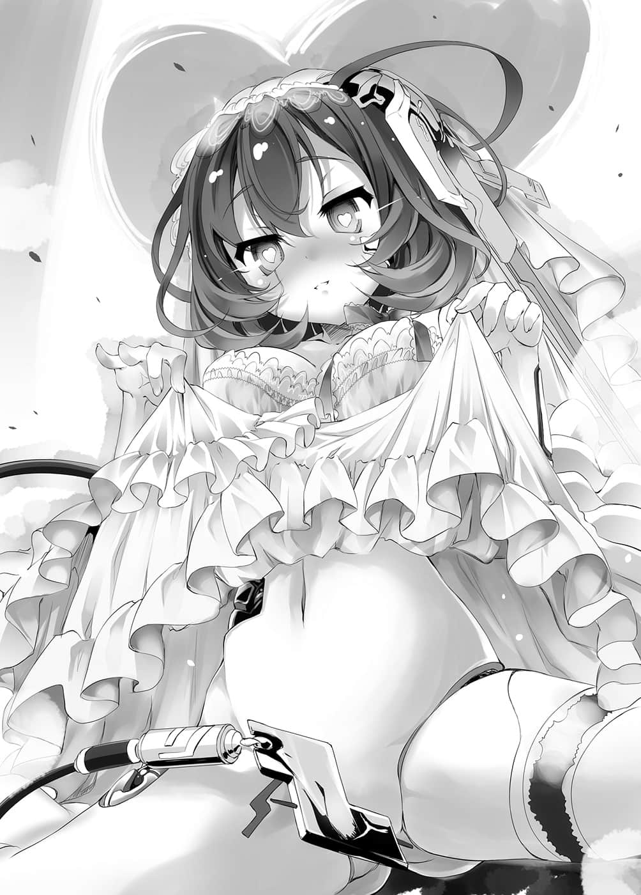

# 第四章 乐观的预期

> 来源：https://www.linovelib.com/novel/9/2119.html

——那是五天前，在艾尔奇亚城的王座大厅内。

第一羽翼阿兹莉尔质问机凯种是如何杀死自己的主人，最强的神——战神。

「『不明』——不，容我更正……恐怕机凯种我们并没有成功讨伐杀死战神阿尔特休。」

毫不在意第一羽翼膨胀的杀意，爱因兹希继续回答道：

「容我再更正，要讨伐——『毁灭』那个概念阿尔特休，原本在原理上就是不可能做到的。」

就这样，爱因兹希道出六千年前的假设。

那是机凯种面对战神阿尔特休时所做的考察，也就是何谓神，何谓神髓的假设。

得到自我的概念，拥有意志的法则，本来应该不可能存在，也不应该存在的事物。

他们在『最强阿尔特休』的『概念神』身上，验证了这项不合理。那个假设的结论如下：

——『所谓的最强神，是因为最强神所以最强神』。

这一连串同义语，指的正是『神』，即是『神髓』。

那么，在名为最强的神髓概念之前——力量的大小完全无关。

机凯种借着重复无限应对而无限增强……最终到达相对最强。

即使如此，要超越名为最强的概念……超越绝对最强，在原理上是不可能的。

「因此我们破坏的只是——虽然在迢迢远方高次元……但物理上确实存在的『神髓』，然而……」

那样一来，概念将会暂时停止显现——推测有可能不再活性化。只不过——

「就连为何能破坏神髓都『不明』……以力量取胜应该是无意义不可能才是。」

——那么到底是如何破坏战神的神髓呢？

那段纪录事实上已经等同遗失。

——面对每秒都能变更原理与法则，甚至连现象世界也能改变的『最强』。

更何况这是爱的挑战书——对方都说了『胜过我们试试看』，总不能回『我放弃』吧？

依蜜尔爱因语带遗憾地这么说完，便朝着舞台的方向走去。

全部十三曲，全部十三局——也就是剩下两局，他们要连胜。

「……哥、哥……让白……休息一下……白累了……」

似乎成功破坏神髓了……从眼前的状况，他们最多也只能看出这一点……

【大概并非如此！对吧？『心爱之人』啊——！？】

就这样，包含爱因兹希在内，虽然严重毁损却幸免于难的只有二十八机。

不管是机凯种们爱因兹希他们还是空等人，每个人的眼神，都像是在摸索那句发言的真意。

如果绝不会破灭的概念是——想法、思念、生命的话——

经过这样的考虑之后，空答应与她一同上台，但是却又担心是否判断失误。

「ＹＥＳ，吉普莉尔！上吧，无敌史蒂——！！」

可是依蜜尔爱因似乎很不情愿，因此她说的话更加带有真实感。

【——请问全机！！那样的人有资格得到『心爱之人』的爱吗！？】

「唔？是我想像得过度真实了吗……算了别在意，上吧，史蒂————！！」

——极限的专注力，令人喘不过气，后台响起的是棋子交错的落棋声。

————什么？

如何击败尚且不明，依照空所说，击败那个概念神的人也不是机凯种。

——《将死——胜者『 空白』・五胜》

只不过……他们观测到，世界逐渐被改造。

「你这家伙，接下来两曲的时间，在结束之前可是高潮连连，毫无中断喔！！」

正因如此，空预设最坏的情况，判断应该站在可以阻止她的位置。

除了空以外，她眼中似乎看不见其他人，她停下脚步这么说道。

---

■ ■ ■

「……报名号的时候……就像『铁金——刚』那样……『芙』……不发音。」

概念并不存在实体，只会改变定义、包含、转移……或者变得陈旧而已。

「……『兴奋计量条』一直都是满的ＭＡＸ呀！就算空出五分钟也——」

爱因兹希发出灵魂的咆哮诘问，共有思考的所有机体都热情回应！！

而且如果是与白一起，应该没问题。

没错，要强制空他们与她同行，那是不可能办到的事。

在纪录和思考都已破损残缺，意义消失，就连时序也混沌不明的状况中。

「……本机的意思是……与『最强』无异的存在，会以不同的名称，不同的形貌再现。」

空若不证明他不是『意志者』就会落败，难道自我证明是不可能的——？

七百零一具机械靠着对未知用战斗演算，只是不断地应对。

……确实如此。爱因兹希这么思考，空等人则是眼神一敛。

两人光是想像那个情景，身体就不由自主颤抖起来，然而——

随着演唱会渐入佳境——第十一曲即将结束的音乐与欢呼，以及……

不管是西洋棋，还是演唱会，可能都胜不过他们吧，不过——那又如何？

「若问如何击败他，本机无法回答，不过若问如何消灭的话，本机回答你。」

因为主动要求同行的人——是依蜜尔爱因。

「……根本没有消灭他，因为要消灭不存在的概念东西，是绝对无法办到的事。」

「……【了解】……本机并不想用这个方法，可是没办法，只好实行。」

即使在已知破绽的情况下，仍抽象演算着逐渐累积的庞大逻辑谬误Ｅｒｒｏｒ。

战神的『神髓』不会再活性化——第一羽翼阿尔特休做出如此反驳，不过……

两人异常的强度，感觉与那一日对第一羽翼阿兹莉尔说的话重迭了。

「只出一张嘴的人，说得可真轻松呢！这次又要让我怎么出糗——噗呜！？」

「好耶！这样就是五胜六败！再两次就是我们赢了！！」

【【【否定！！否定！！否定！！】】】

因此——爱因兹希注视着第一羽翼阿兹莉尔，回答道：

「【告知】反正只要获胜就好了吧，那很容易，只是要获胜的话，随时都可以，游刃有余。」

是诡辩吗？是陷阱吗？还是引诱机凯种进入无法反证的逻辑迷宫悖论呢——不过！！

「「抖抖抖抖抖抖抖抖…………」」

「我们？登上舞台？哈哈～这是打算利用精神攻击，杀害我们取得胜利吗！！我拒绝～！！」

空是『意志者』这件事，与他成为『最强』这件事，两者并不矛盾！

然后在『连结体』内，立刻以时间宛如停滞的速度，以各种方法进行考察，这时忽然——

因此即便是机凯种们也不能确切明白，她的话语、行动有何意图。

「好～史蒂芙！！终于到了最后的『休息时间』，司仪时间交给你啰！？」

由于唯一神特图以及『星杯』的关系，不会再产生新的神。

以机凯种全部的观测器分析两人的声音，得到的结论都是『两人十分确信』。

「这样能暖什么场——哇，好重！这很重耶！？这不是铁制的吗！？」

对于别说是理解，甚至无法推测的未知——他们直接当作未知来演算。

骚动的观众们无数的视线，以及聚光灯，全部集于一身。

「【选择】拒绝同行也可以，那么结果相同，本机胜利。」

听到西洋棋盘告知胜利，神态疲惫的空与白这么说道。

「……群众……视线……好多人？……发抖发抖……！」

「【确认】规则并未禁止包含本机在内的玩家登上舞台，因此并不违反规则。」

【……如同『意志者』所说……机凯种我们或许胜不过他们呢……】

——他一定有办法证明，只是方法还不明而已。

思考空所说的话——『对于不存在的事物就无可应对』——

…………

无论如何，唯一可以断言的是，空绝不可能提出以落败为前提的游戏！

爱因兹希这么回答，不可思议的是……他充满了确信。

「就如同『意志者』如今再次出现一般，『最强阿尔特休』也有可能再临吧。」

只见依蜜尔爱因停下脚步，身旁是因为铁制玩偶装而无法动弹，不断使力挣扎的无名女性——不。

……阻止得了吗？不，在那之前……

「【报告】由本机接手司仪时间，请『主人』……与本机同行。」

只要『最强者的幻想』不破灭，那个概念就绝不会毁灭。

「……因此本机如此推测。」

确信着『最强那个』，会以不同的名称、不同的形貌再次归来——换言之，如果是『 这个』。

无视于他们的喧嚣，机凯种们爱因兹希他们默默地思考。

连反逻辑演算——最终也以进化至无限分之一秒的应对速度不断进行……

他之所以如此确信，根据的大概就是在残破的回忆中，战神最后的身影记忆吧——

「我看得出来，这个方方正正的玩偶装，就是为了在这个时刻使用，主人们事先以『特效步』变出来的❤」

不存在的事物……概念。

---

■ ■ ■

【命令全机——提出胜利方法！！排除万难，不择手段，达成这个命令！！】

依蜜尔爱因的意图，连空也猜不透。

无论机凯种在应对之后，再怎么与之相对地变得再强，都无法胜过绝对的强者。

——如果『意志者』与神秘少女白会合后的模样，就是他们所预感的最强——

「本机没有说战神阿尔特休会复活，『意志者』现在也是『空』。」

「……相反地……要让场面比先前……更火热……」

——她是尽管与『连结体』连线，却未将自己的思考共享的机体。

可是登上舞台又能做什么？不——不仅如此。

空与白站在舞台中央，有如开启『震动模式』一般，不停地颤抖着。

这就是两人担忧的情况——首先，身体……动得了吗……！？

颤抖的频率快要达到千赫，就在两人为此苦恼的时候，颤抖突然停止了。

听见会场内响起的声音，然后看见出现的人——空与白，以及会场所有的人，目光都被深深吸引。众人屏气凝神……仿佛忘记时间的流逝般，鸦雀无声。

——宛如水仙花一般的少女。

有如白玫瑰一般层层交迭的礼服，面纱之下……看得见紫色的花朵。

工艺品般的面容恭敬地低垂，伴随着音乐盒音色缓步走来的那个人是——

不……那是不知何故换上新娘礼服的依蜜尔爱因。

不管怎样，她掳获观众的心，让空与白困惑不已，并且从容地站到空的身旁。

只见依蜜尔爱因深深一鞠躬后，开口的第一句话就是——

「【自介】本机是依蜜尔爱因，『主人』——空大人的『妻子』。」

……

…………她说什么？

会场的寂静，顿时转变为困惑的沉默，接着第二句话是——

「【致歉】让大家卷入主人为了偷吃所演出的闹剧，真的非常抱歉。」

……

…………ＷＨＡＴ ＴＨＥ Ｆ〇ＣＫ？

这个会场被断定是闹剧，观众们全都冻结了。

然后——

因为自称・妻子的告白，如今自动被确定为丈夫的空，观众的视线全都投到他身上。

「【致歉】这个试炼是要本机证明是否有足够的实力做『主人』的妻子，否则就认同『主人』养小三。本机无法通过考验Clear，对不起，不过本机会连同十二机的份一起努力。」

如果空选择依蜜尔爱因做为妻子的话，那就等于自己承认了，要反证是不可能的！！

但是，被同志机器人爱因兹希在耳边爱语呢喃而昏倒，绝对不叫戏剧性——而是冲击性。

「【朗读】事情的开端非常突然，因为我们戏剧性的相遇，『主人』丧失了意识，令本机惊愕不已。」

果然游戏还没输！果然不是自己的记忆出错！

紧接着……是空把平板电脑递给依蜜尔爱因时，确认是否会产生静电的影像……吧？

依蜜尔爱因只是面露微笑，语气平静地说道。

这时再搭配上依蜜尔爱因的朗读信件、新娘礼服，『这是什么仪式』就一清二楚了。

影片映出一个不曾见过的地方，空与依蜜尔爱因交换戒指，看起来十分幸福。

「【反驳】『主人』要求生七千名孩子，当前要务，您喜欢穿衣还是脱衣——」

那是偶尔会出现在影音网站，而且不知为何设定为任何人皆可观看，属于臭现充的产物。

……什……

…………

……咦？我什么时候选依蜜尔爱因做为妻子了？

「等一下等一下！？至、至少让我确认一下记忆！？」

空接到报告——最后似乎还结为夫妻了。

看起来像是与依蜜尔爱因互相凝视的影片内，被变更了构图经过剪接——白被切掉一部分。

毕竟电话忽然响起，城堡就被摧毁……那样的开始可是前所未闻。

会场笼罩着难以言喻的寂静，空鼓起本世纪最大的勇气提问：

原来如此，这就好比过分的电影预告诈欺，只是剪接得好像有那么一回事的影片。

「【感伤】本机随时可以取得胜利。」

————什……么————！？

——影片终于超越预告诈欺，演变成捏造影片。

但空确信，自己不可能说出那种单位的数字，所以拉着白的手逃脱。

「我没说吧！？那句话我绝对没说喔！！」

被摆了一道——因为莫名其妙的事态发展，自己头脑混乱，一脸呆滞地站在那里什么也没做！？

然后，依蜜尔爱因以一副感动至极的样子，将信件收了起来。

——是啊，确实很突然。就算再突然也该有个程度吧。

她跨到空的身上，声称已是初夜之时，空终于大叫道。

正确地说，只要对空的证明提出反证，就是机凯种胜利……但是，反过来说！

那些像是要刺杀他的眼神，问的只有一句话——『这是在搞什么？』

就算不提反证——机凯种只要证明空无法反证，结果还是相同！！

空不禁感到战栗，而依蜜尔爱因则是对空露出微笑，提出明确的……证明——

然而，另一方面……空总算逐渐理解『这是什么仪式』了。

「【佩服】无穷的性欲，不知满足的羞耻好奇心，那样的『主人』本机也喜欢。」

同时，空感觉那影片似乎跟什么很相似——

依蜜尔爱因向空低头道歉，然后缓缓地，就在舞台上——在观众面前——

——影片映出的是……空从昏迷中清醒的影像。

一改先前的无力，空猛然地加速思考。

仿佛断线的意识，都是靠握着白的手才勉强维系，自称・丈夫的空还无法从中清醒。

而朗读书信的进度则是——

「【追认】能够繁殖的只有『意志者』，『主人』选择本机为妻子，等于自己承认是『意志者』，将自己定义为『意志者』，不可能提出反证——以上，证明结束w.z.b.w。」

「……？【不解】仪式已经进行完毕。」

不过空终于想到，那个影片跟什么很相似了。

到目前为止，依蜜尔爱因的表现就诡异到极点。

……空带着快要消失的意识，茫然地这么想着……怀着飘浮在梦中的感觉，无视依蜜尔爱因漫长的朗读，愣愣地注视着后方的『影片』。

「【宣言】机凯种胜利。关于报酬『与证明的机体立刻繁殖』，虽然新娘服装Ｐｌａｙ最好的地点是在婚礼前的休息室，不过若是当成『初夜』——」

说得……没错。

空以最快速度，连滚带爬地冲入后台，笃定地这么喊道。

「【朗读】本机……虽然没有爸爸妈妈。」

……是啊……说得没错。

「【驳倒】——得意。」

依蜜尔爱因似乎很遗憾，不过还是转身回头，礼服翻飞——

「【宣言】但本机会幸福的……！」

总之果然——白被切掉一部分，而且焦点模糊了。

「【解析】『主人』的要求是『新造机关』的解锁与主动繁殖，未指定主动繁殖的对象，因此『主人』不是要『选择一机生孩子』，而是想和全机生孩子，不愧是『主人』。」

画面甚至连被切掉的白都没有，空对那段影片根本毫无印象。

然而空也只能流着泪，在内心回答——『对不起，我也不知道。』

「我说啊……『婚宴』之前不是该举行『结婚仪式』吗……不，我是不知道啦。」

事到如今空才发觉失去先机，他焦躁地在内心大吼。

没错，那是空打从心底不感兴趣的情报，结婚爱侣的……『两人相识相爱的影片』。

空虽然向白要求确认记忆，可是白似乎也尚未从冲击中平复，僵住不动的妹妹，无法断定事实是否遭到曲解，依蜜尔爱因则是继续解释。

但是依蜜尔爱因带着确信的语气继续这么说，空也开始认真地怀疑起自己的记忆是否出错。

也就是说，强制力并没有生效，这让空松了一口气。

那应该是不可能的……可是，难道刚才那一连串的影片，真的藏有那样的证明吗！？

「【确定】但是『主人』则会因为这一步而落败，本机取得胜利。」

不过，问题是『为什么举行这个仪式』——

「【事实】『主人』——选择本机为繁殖对象妻子。」

终于来到空完全没有印象的内容——

由于增加了更多的影片效果后制与装饰，虽然无法肯定，但看起来像是两人手握着手。

不，应该说……我有交过女朋友吗？

「喂，爱因兹希！那家伙是怎么回事！那家伙她在——『捏造记忆』喔！？」

这样当然会疏忽吧，因为这个理论的大前提，空根本不记得有这回事啊……

接着是，空帮她取名『依蜜尔爱因』这个略称时的影像吧。

画面添加许多影片效果后制，看起来倒也像是一对欢笑的恋人，在那个影片内——白也被切掉一部分。

——可以拒绝。

「【把握】这个胜利方法是最后手段，本机无法回应『主人』的挑战。」

只见谜样的影片，投影在舞台后方的墙上，依蜜尔爱因只是平淡地拿出一封信——然后，缓缓地开始朗诵起来。

「【朗读】于是在此结为一对夫妻，本机确信现在正处于幸福的巅峰，并在此向各位报告。」

但是，依蜜尔爱因却睁大双眼，歪着头回答道。

笑容满面地发表『胜利宣言』。

这么说明完毕之后，依蜜尔爱因补上最后一句话，这让空哑然无语。

就算退一百万步到宇宙的另一端，就当作自己真是丧失记忆好了。

他们是机凯种，更不用说是这家伙依蜜尔爱因，他们怎么可能会做出毫无意义的行动——！？

「【前提】只要证明『主人』是『意志者』，就是机凯种胜利。」

「【朗读】然后主人执起本机的无名指，宣誓永恒的爱情誓约，本机也许诺这个约定。」

空既没结过婚，也没交过女友，甚至没有可以邀请参加婚礼的朋友，所以也不是很清楚。不过在他的认知中——这个恐怕就是婚宴了吧，所以空只想问：为何突然举行婚宴？

——为什么会疏忽掉这一点？不，空很清楚，那是因为——！！！！

——欸……不，不是……不是哦……？

她没有诱惑空，而是像个中立的旁观者，她的那份从容来自何处，如今终于得到解答。

也就是说，只有依蜜尔爱因——

「……记忆比对，在该机体的记忆内——她似乎与『心爱之人』已经结过婚了。」

爱因兹希似乎很过意不去地说出的这句话，肯定了空的确信。

只有依蜜尔爱因一直是在别的世界、别的次元进行思考。

其实他早该发觉的……在巫社的时候，那家伙说的不是要空『抱谁』。

她说的是——『今晚、随时』，还有『何时要抱自己』——！！

不！从平板电脑抽走宝藏配菜后，她说的是——『尽力成为理想的妻子』。

在那个时候，她就已经说自己是『妻子』了——！！

「……什么时候？从何时开始的！！她从何时开始自认是我的妻子啊！！」

空这么大吼。而或许是穿着新娘礼服不便行动吧，稍晚才追上来的依蜜尔爱因，身上仍是那套礼服。她不可思议地歪着头，回答空的问题。

「【回答】……『主人』用爱称称呼本机。」

「是啊！？因为什么旧Ｅ连结体第一指挥体艾尔特・伊蜜尔・克拉斯坦・爱因！什么Ec００１Bf９Ö4８a2太长了嘛！？」

「……哥、哥……记得真清楚呢……！？」

「【考察】爱称——以『爱』为『称』，『主人』对本机怀有爱情。」

她宛如没有听见空与白的对话。

然而脸却逐渐靠近，回答空的问题，也就是——从何时开始？

「【断定】本机也怀有爱情，这已经可以确定是夫妇、伴侣、一对。」

——从眼神交会的瞬间就发觉自己喜欢上你。

依蜜尔爱因这么说着，将脸靠近空——互相凝视的两人，双唇逐渐接近。

「没有。」

空暂停ＢＧＭ，不停后退大叫——这是怎样啊，好可怕。

依蜜尔爱因似乎很不服气，然而或许是『连结体』的表决，她也不能反抗吧。

「……对……」

「不，我明白你们的心情哦！？我非常地清楚，不过请你们转换心情，重新振作好吗！？」

他们必须尽快开始下一局，把气氛炒热起来，不然计量条就会见底。

舞台上，缤纷的光彩闪耀不停，音响也加上震撼的特效。

两人目不暇给地持续移动棋子，正如两人所说，他们不得不连续下毫无疑问的坏棋，就算是三次、四次——

对于那种完全是精神病跟踪狂的思考，空恐惧无比，不过——

然而爱因兹希却冷静地微微一笑，对着依蜜尔爱因说道：

「……哥、哥……下一次的……『特效步』……交给白……！」

之后开始的第十二局。到了这个时候，盘面的情势终于首次如同机凯种们的计算及演算在进行。

不必再陪着下坏棋的机凯种，依照他们原本所擅长的手法，持续地走着最佳棋步。

「这是『表决』，十二机同意，本机命令贵机立刻进行记忆比对。」

…………礑！！Ａｎｄ Ｉ㊟——

他们只要继续保持优势——虎视眈眈地等待『时机』就好。

她甚至拒绝同步并联思考，陷入半自闭模式，蹲在后台的角落。

等待仅仅一次的机会，对机凯种们爱因兹希他们而言，是最佳时机。

「【选择】拒绝同行也无所谓，由本机获胜，结果相同。」

对于所有机体的道谢，依蜜尔爱因拒绝接受，仍沉溺在伤心之中。

「……贵机……本机命令你与『连结体』的纪录、记忆做整合性比对。」

因此在开局之后，他们就要以最快的速度下『特效步』——也就是自己先下坏棋。

「并没有。而且既没有成为恋人的印象，也没有那个预定喔！？」

然而，对空与白而言，那却是致命且最坏的——时机。

大概是发生大量错误而引起晕眩了吧，机械少女尽管身子摇摇晃晃，仍继续问道：

间隔数秒钟后，依蜜尔爱因说出与刚才相同的台词，准备往舞台走去。

「就是这么一回事呢❤」

「也没有预定。」

…………

「【报告】确认本机以外的全机发生记忆障碍，大家都异常了，不对劲，很奇怪。」

「【反驳】误会？……否定，那是事实。」

「……【极说】那个……该不会『主人』——没有和本机……结婚？」

「【报告】正如计算，本机打从一开始就是为了这个目的，这是以高度计……算……呜呜。」

……

「帆、帆楼！快点回到舞台上！提早一分钟开始！」

甚至还说演唱会是丈夫为了偷吃而演的闹剧，接着还想在舞台上办事，最后空还拒绝配合，落荒而逃——这已经不是扫兴而已了。

空回答得毫不犹豫——也就是说，机械少女遭到拒绝，像断定行星就是三角形一般。

爱因兹希发自真心对着空这么说，然后将棋子移至『发光的格子』。

「【拒绝】不同意其必要性，『主人』的爱无法分享——」

最后——机凯种们持续等待『时机』。

——

「『心爱之人』啊，能够回应你爱的挑战书，是本机的光荣。」

首先，空与白的当务之急，就是回复只要见底就落败的『兴奋计量条』。

「……【假设】绝无此种可能性，以否定为前提，纯粹只是检讨假设——」

【本机代表全机致谢，多亏贵机的『错乱』，让我们可以回应爱的挑战书。】

——只要下一次『特效步』，就可以决定一切。

「……【确认】……有预定要结婚？」

「……是啊……是误会没错啦……唉……」

仿佛落井下石一般，爱因兹希对仍在逼近空的精神病机器人如此下令。

这也是理所当然，空自己比任何人都清楚，他有如乞求般地继续叫道：

「欸欸——！？这样的特效加持，『兴奋计量条』却只到一半！？骗人的吧！？」

「【呜咽】本机被甩了，本机非常伤心，申请准许本机自爆——否决，为何……」

「你那同志的眼神动不动就往这里看，烦死人啦！给我换人下啦！！」

看到空他们慌张地送帆楼上台的样子，依蜜尔爱因——

『兴奋计量条』受到特效的激励而往上升，虽然有所提升——

但是，依蜜尔爱因『想把刚才的事当作没发生过』的愿望，却被爱因兹希他们无情地否决，不过——

「…………【假设】——这只是本机一厢情愿……？」

依蜜尔爱因摇着头，笑了笑。

于是终于——仿佛被证明神不存在的虔诚信徒。

---

■ ■ ■

「『全连结指挥体』通告全机，侦测出该机体『自我消除记忆』，将备份纪录上传。」

（译注：惠妮・休斯顿的名曲「I Will Always Love You」。）

「唔……？为了回应『心爱之人』的爱的挑战书，包含本机在内，我们所有机体都全力以赴哦。」

听见观众的怒骂，发现『兴奋计量条』快速减少的空与白发出悲鸣。

「【追认】构筑温暖和乐的理想家庭。」

「……哥、哥……必须集中精神……才行——」

然而空与白、吉普莉尔、史蒂芙，甚至连机凯种全机都冷眼看着她。

靠着她的牺牲换来充分的胜算——对空与白绝对不利的这个状况。

她露出得意的表情，端正姿势，想要掩饰过去——却失败了。

「比起那种事！！唔喔喔『兴奋计量条』不妙了啊啊啊！！」

尽管身为机械，依蜜尔爱因却带着绝望的表情，提出最后的问题。

「怎么可以自爆……这样一来——机凯种我们就有胜算了。」

那动作实在太像人类，笑容僵硬的脸上，甚至看得见汗水从脸颊流下。

就像真正迷路的人都说『除了我以外的人都迷路了』，她提出相同的主张。

就连机凯种爱因兹希也看得出来，要令冷却的观众重新燃起热情并非易事。

很讽刺地，就在第十二曲即将进入『最高潮副歌』的时候——时机到来了。

因此只是一、两次的『特效步』，必然是杯水车薪——

空甚至忍不住迁怒对方，不过跟空与白相反，机凯种们爱因兹希他们没有必要下『特效步』，他们只要冷静地从两人的坏棋得利。

间隔数秒钟后，依蜜尔爱因叹一口气，似乎很困扰地摇了摇头。

吸引了观众之后，做的事情却是——已婚宣言。

『——了解。』

「才不会变成那样！？什么啊，也就是说，打从一开始你就误会我们是两情相悦吗！？」

机械少女宛如怀疑行星可能是三角形般不可置信，提出那个假设的问题。

白带着怒气，吉普莉尔语带嘲笑，史蒂芙饱含同情，而空则是用复杂的表情回答。

「……哥、哥……！必、必须开始……下一曲才行……！！」

盘初的坏棋，而且只是一次的话，对两人而言还不至于造成多大的负担，可是……

【《命令》吵死了，贵机自爆吧，本机申请准许逃亡——否决……《恳求》……救命呀。】

这也是理所当然——如人偶一般名符其实的美少女，身穿新娘礼服登场。

如果立场调换，空也会气愤地引发暴动！！

她的表情就像在说——啊哈哈，不可能不可能，哈哈，不可能有那种事啦。

「那个～……似乎是那样呢。」

正如空的呐喊——计量条的上升次数不多，但是衰减次数却增加了。

「啊～我们可是拼死命地在下棋啊！！你的那副嘴脸让人很不爽啊！！」

机凯种所有机体——除了半自闭的依蜜尔爱因，借由十二机的并联演算所等待的『时机』。

那一个格子满足了各种状况与条件的要项，空与白——绝对无法挽回。

「这样一来，本机就可以得到『副奖』——『心爱之人』的裸照了。」

话一说完，爱因兹希所下的『特效步』就只是——

——啪滋。

与最初的特效完全相同……夺走一切的光源与声音，『停止特效』的特效。

在没有音乐的寂静之中，只有观众的吵杂声回响着。

在无光的黑暗中，盘面发出的淡淡光芒照亮了空与白的脸，以及——

「接下来就是『特别奖』……请你提出反证，证明你不是『意志者』。」

确定胜利的爱因兹希——机凯种们，以不安的语气这么问道。

「原来如此……不下『特效步』恢复原状，我们就会因演唱会失败而落败。」

「……可是下『特效步』……抵消效果的话……我们……绝对会输……」

「嗯，白说绝对的话就是绝对了，没有挽回的方法，无计可施了呢。」

听到两人这样说，机凯种们在内心断言——当然。

这是经过Rayo(3↑↑3)=Rayo(7625597484987)＜Rayo(10100)次，不断反覆的演算。

由此导出的『时机一步棋』，完美地满足所有状况、条件、期待值。

第十二曲剩下二十四・二秒。

这段期间，空与白可走的『发光格』的出现次数与位置，即便是机凯种也无法锁定。

不过，根据累积十二局的倾向分析，剩余的出现次数——平均值是三次，中间值为两次。

棋局已至盘末，能走的棋步有限，而且又是在压倒性的劣势下进行『特效步自杀行为』……

在后台持续下棋的空与白，发自真心露出心满意足的笑容。

听见歌声响起，机凯种们爱因兹希他们惊讶地睁大双眼，往舞台的方向望去。

不过……不可思议地，能感觉一种未明的情绪在身上扩散……每个人都不禁竖耳倾听。

他们下的那一步。

假设能做到那种事，除非事先就知道会发生什么事——

这是存在明确的规则，包含不确定性的预测游戏哦！？

测试是否与他相配，虽然勉强突破试炼，但是——尚未提出『自我证明的反证选择生子对象』。

这是在经过几亿年岁月后，第一次产生的微小——『改变愿望』。

帆楼只是伫立在阴暗的舞台上，注视着观众。

「棋局盘末的坏棋最是致命……这一点我们『彼此彼此』吧？」

对于空的总结，不只是爱因兹希，机凯种所有机体心想：

瞬间——在无声的黑暗所笼罩的会场内，亮起小小的光芒，响起轻轻的歌声。

——原来如此。

听见两人笑着这么说，爱因兹希也微微一笑。

因此只要吃掉那步『坏棋』，情势就会逆转——他们甚至看穿机凯种会在何时出手！

「所以『做得漂亮』这句就免了吧。相对地，我要给你们这句话。」

事情没那么简单！

「……开什么玩笑……这种不合理的事，有可能发生吗……啊啊！！」

她的朋友，脸上带着再熟悉不过的表情——帆楼已经不想再看见那样的表情了！！

他们背负着压倒性的不利因素，仍发挥出机凯种望尘莫及的实力。

情势扭转——这是将机凯种逼入压倒性劣势的一步棋。

空……无疑是『意志者』，而且要『完全证明』也是不可能的。

然而，空与白却有如嘲笑他那样的思考一般，异口同声地这么说——

压倒性的强者——甚至已达到接近最强领域的『意志者』，对机凯种我们做了测试。

事到如今为时已晚，就在爱因兹希串连起一切前因后果的时候，空笑了出来。

为了压下这份恐惧而寻求证明的机凯种，他们得到的回答是——

即便是空与白最强，如果不改变棋子的走法规则，他们将不可避免地落败，连白都断言——绝对必败——

然后，空与白露出讽刺的笑容这么说道。

所有行动都被看穿了，如同字面上的意思，两人看穿了一切！！无一不在掌握之中！！

连可能性世界可能的未来的极限点——不确定性都要完全预测，即便是神灵种也不可能办到！！

史蒂芙泪流满面，连吉普莉尔也闭上双眼，沉醉在她的歌声中。

一旦落败就会失去至今所有的感情，他们答应这个游戏的理由是——『惧怕』。

——他们看穿机凯种我们会下『特效步』？

也就是——万一他真的不是『意志者』的话……？

---

■ ■ ■

「因为这样并没有构成双重束缚呀，毕竟——」

「……帆楼，做得非常好……突破Ｓ级偶像的……高墙……」

空与白制造出的盘面情势，也就是——两人胜利在望的优势。

——想让凭依、巫女、朋友的表情……改换为笑容。

——就像是不安、忧心，埋怨自己的无力。

「……我们……不会再下『特效步』……」

「是啊，这才是神偶像，她终于迈入超越11次元偶像的领域了。」

然而，机凯种所有机体至今一直极力逃避思考的……『恐惧』。

金色狐的兽人种，凭依，巫女，帆楼的——朋友。

「……这是最棒的……特效……你们也开始懂了呢……♪」

只是为了这么微小的『心愿』而演唱的歌声……

但是，空与白加上这场也只是六胜……还不到胜利的局数，然后因为演唱会搞砸而落败。

并联思考的机凯种们爱因兹希他们，二十六颗观测器眼瞳一齐望向语带戏谑的空与白。

「啊，不妙，看这气氛，他们已经发觉了喔～白小姐。」

太离谱了……即便是神，就算是最强的存在，但这可是游戏哦！？

两者显示一个事实。

话一说完，空与白笑了出来，宛如理所当然一般，以流畅的动作，用手移动棋子。

败北已不可避免。那么就超越机凯种的演算，选择西洋棋胜利的败北吗？

骚动的观众……不，能看透不可见事物的神之眼，只映出一名观众。

---

■ ■ ■

「下了就是西洋棋七败负多于胜，不下就是演唱会失败败北吗……又是『双重束缚』吗？」

「「……辛苦了……♪」」

……若非……事先知道……那就……不可……

这样机凯种就陷入压倒性劣势——不，就连这一局也几乎确定落败。

结果逆向操作成演唱会最好的结果——他们连特效的内容都看穿了！

爱因兹希很清楚，一切都是有可能的，即使如此他仍大喊出声。

既没有音乐也没有特效，在帆楼自己点亮的微弱光芒中，演唱的歌声……非常地拙劣。

然而，对这个就连自己的『神髓』也怀疑的狐疑之神，兼融请希与夸戏的神灵种娇小的少女而言。

那对注视的双眼，以及表情——那是帆楼熟知的表情。

不愧是『意志者』……不会轻易认输吗——

她带着明确的『意志』，全『心』全意，表现歌唱她的『生命』——那是为了……

只是——无条件地。

「……我们只要……正常这样下……就好了……」

机凯种愈是应对，他们变得愈强，仿佛最强概念的两人——

对于空与白而言，这实在是非常不利的游戏，极为不利的规则。

——一切都在他们预料之中。

「不过这次……我不能夸奖你们『做得漂亮』了……」

——什么……？

「……唔～……还有一局……的说……唔～」

同样能看透黑暗的兽之眼，看着舞台上不知所措的帆楼。

——拥有如此压倒性的优势，才好不容易勉强获胜吗……

不由分说地围堵机凯种所下的『特效步坏棋』。

无声的黑暗突然笼罩会场。

那个表情让走过悠长时光的帆楼，第一次能够明确『断言』自己的想法。

「在迈入尾声的最高潮，从器材故障演变成……独自清唱。」

——能……

————『帆楼不要凭依露出那样的表情』——！！

她的歌声虽然充满无助不安，却是拼命地在摸索着什么。

只是——无可避免地。

——同时，仿佛早就在等着这句话似地。

以及上升至极限，不再变动的『兴奋计量条』。

两人只能下『特效步』回击——他们看穿机凯种会这么预测！

——以上，全都是两人『让机凯种我们信以为真』的————！！！！

「嗯～没错，在这个游戏中，压倒性不利的——不是我们。」

有如为小孩恶作剧道歉一般，空吐着舌头说道。

空与白从容自若地公开其中的原理，下棋的动作却不曾停止，也毫无反省之色。

「背负不合理的『压倒性不利』，其实是机凯种你们那方♪啊，别生气哦？」

「……是被骗的人……不好……这是自古以来的……定律……」

也就是说，不管是爱因兹希、依蜜尔爱因，还是机凯种我们所有机体。

在十二局一千零四十七步的这段期间，这群连不可能计算的数字也予以计算的机械。

——只是被操纵着在下棋而已…………

「那、那是什么意思呢？主人，所谓对机凯种压倒性的不利是指……？」

「欸，就是字面上的意思呀！因为依照这个规则，机凯种的棋步很容易预测。」

空回答吉普莉尔的疑问，机凯种则是在内心表示同意。

——是啊，当然很容易吧。

毕竟机凯种我们在西洋棋上胜算渺茫，一旦下了坏棋——不，就算不下也会输。

在这种情况下，如果为了胜利，刻意要下『特效步坏棋』，选择的时机就必然会是——

「因为机凯种这些家伙的『特效步』，都是在相对安全的格子发光的时候吧？」

「……以被我们吃掉为前提……而下……太好预测……」

「那只是最佳棋步中的坏棋而已吧？——当然就能引导他们照我们的意思下吧♪」

机凯种我们以为，不确定且难以预测的，应该是『彼此条件平等』。

第八局，空的那句『彼此条件并不相同』——别有含意的发言。

被最强赞许为自己的天敌，号称最弱的——『两人』——

因为空与白——两人对胜利的确信与发言，没有一丝虚假！！！

没错——要以力量超越最强概念的战神，那是不可能的。

看穿超级机械的『心』加以引导，空他们之所以要挑战那样的极限，理由只有一个。

因为机凯种我们并不是跟眼前的两人下棋……而是在跟虚幻的对手对战。

「无论再怎么相似，甚至拥有相同的记忆与爱，也依然是不同人，反证？如果你们能反证的话——」

空说的话依然无法侦测出任何谎言。

因为他们有压倒性的实力，能够完全凌驾机凯种我们近似无限速度的应对！！

爱因兹希、依蜜尔爱因、机凯种的所有机体终于理解……不禁低头自嘲。

每个人都已陶醉在帆楼的歌声里，甚至连机凯种的器材也使人感到多余。

『你们也上去玩玩吧。』空与白随口一说，不过却是愉快地将两人送上舞台。

让机凯种应对某物，预测何事，再操纵他们如何应对……？

——《将死——胜者『 空白』・六胜》

「……是吗……机凯种我们长久以来，都只是一直看着『幽灵』吧……」

机凯种他们对自己撒了『谎』，那个『谎言偏见』就是——拒绝意志者亡故的现实。

「——抱歉了，机凯种……你们绝对胜不过——我们。」

即使有可以利用的『谎言漏洞』——致命的『谎言缺陷』，要办到仍极为困难。

「呐，臭型男变态废铁同志机器人——你认为偶像是什么？」

听见两人这么说——不，听见一位游戏玩家这么说，然后再听到他们接下来说的话——

「……哥与白一起才是『 空白』……别人的定义……管他去死。」

——原来如此……机凯种我们绝对胜不过他们。

光是这样，情况就会演变成超级演算机与人类的纯粹斗智——成为挑战不可能完成的任务。

不——不对！空是在那之前就说了那句话。

——沙沙。

空呼喊过分冗长的称号，对仍飘荡在错综复杂纪录记忆中的爱因兹希这么问道。

「……能够打败『最强』，唯有正好相反的——『最弱』。」

————沙沙……应该已经破损、故障、丧失意义。

面对机凯种这样的对手，要引诱他们做出何种预测，如何应对，在不被发觉的情况下，让对方下出自己想要的一步，然后吃掉。

「而我认为不知道这一点，没有杀死阿尔特休的机凯种你们，一定会上当。」

可是这种作战方式策略——

正当机凯种们爱因兹希他们在脑中处理程序这么思考的时候，脑海里因为空接下来的话——

一个人演着独角戏，对着影子挥拳，机凯种我们的身影——看起来是多么地滑稽啊。

原来这就是……这就是那句话的真正涵意吗——！！

在第十三曲，最后一曲的前奏歌声中。

「……这很简单……机凯种们你们……也很清楚……」

「要我们人类种蝼蚁之辈背负不利因素，跟你们机凯种破格存在对战？哈，您说笑了。」

——第十三局，最后一局。

那么他们到底是如何骗过机凯种的——！？

「……嗯～我可以请教一下……为什么你下到一半就不下了呢？」

仿佛看穿了机凯种他们的思考一般——不，如今甚至觉得空是真的看穿他们的想法。

——空与白已有觉悟，『接下来才是真正的战斗』，可是……

原来如此，机凯种我们确实是谨守着『最佳棋步』的预防线行棋。

……啊啊……他们闻言只能闭上双眼。

——然而，先前播下的种子已经收割。

因为即便是『 空白』，要从正面战胜机凯种，那也是超越能力极限，不可能的缘故。

「机凯种你们不知道，非得如此才能获胜的压倒性『弱小』。」

寂静的气氛，沉重得令人窒息……但是，那样的气氛却是冷淡且包含着失望——空与白都知道，这份寂静是名为『绝望』的感情所产生。

用这种……用这种方法作战的人——绝对不会是强者——！！

似乎是不需要爱因兹希的回答吧，空与白只是望着舞台继续说道：

于是——第十三局，通知最后一局开始的乐声响起。

但是机凯种停下手，连动作也停止了，在无声中只听见空的问话声回响着。

空将自己和白定义为『最弱者』。

就算分析空，为他做出某种定义，那也毫无意义。

空与白刻意谈笑风生地『引导』机凯种的棋路。

他不禁心想……那么，机凯种我们……到底是…………

「面对超乎常理的怪物对手，正面迎战也不可能获胜吧。」

「……如果……没有那样的误解……我们大概赢不了……」

史蒂芙意外地舞技精湛，甚至连吉普莉尔也飞在空中，洒落非致命性的光线。

「如果是三流以下的Ｐ，可能会鬼扯说是『彻底扮演观众理想的人偶』，不过！」

可是——不对！！爱因兹希在心中这么喊道。

在后台，第十三局开始时还响着缓慢的下棋声。

机凯种们爱因兹希他们飘荡在翻搅的记忆中，看着这么诉说的两人。

机凯种们爱因兹希他们应该已经丧失的纪录记忆、思考，出现了杂音。

然而，两人至此没有任何一局，甚至没有任何一步下得轻松。

「那是当然的吧？因为机凯种你们下棋的对象并不是我们。」

「……我是什么人，由我决定，我是『空』——我跟白，两人才是一人。」

「……为什么没有人……自称是……『那个人所爱之人』……？」

「……帆楼……只是成为她想成为的自己……如此而已……」

---

■ ■ ■

——沙沙、沙沙……机凯种在持续的杂音中，听着空的话语。

「所以你们才没有用盟约强制我爱上你们，或是强制我的行为……对吧？」

是指将空与白两人视为再临的『最强』概念吗？

只侦测出那句话——因为太过理所当然，所以不值一提的反应。

——第十三曲，舞台上最后一曲响起。

他称呼为『天敌』，给予赞赏的对手——并不是机凯种。

靠着空与白的一步棋，舞台恢复了音乐与光线——但是，除此之外，再也不需要任何特效。

那是空在第一局胜利后所说的话，他又一字一句，丝毫不差地重复一遍。

「我是说『我们』——没错，机凯种你们绝对胜不过我们。」

空与白有很高的机率会尝到七败，因败场多于胜场而落败。

「……但是……身为超一流的『Ｐ』……我们……不同……！」

然而，那是因为先有『以西洋棋为赌局，机凯种的胜算渺茫』这个大前提存在！

那么他们到底是在指称机凯种我们犯下怎样的误解呢？

那是……『意志者』…………以及————

「因为那份希望而成长的姿态，仰赖的并不是『观众』，而是——『人』。」

根本不可能应对……毕竟对手并不存在。

机凯种只要将分析完毕的十二局一千零八十二步，加以修正之后，再应对眼前的两人本来面目——空与白。

「——然后呢？要我提出『完全证明』，证明我不是『意志者』是吗？」

仍处于交错的意识中，机凯种们爱因兹希他们倾听两人的答案。

——误解……？

没错——战神，那位最强者。

爱因兹希自虐地喃喃说道……

会场上逐渐酝酿一股大团圆的气氛，不过，相反地——后台却有如深海般寂静无声。

「……同样的问题回敬你们，又没有规定先后顺序……为何你们不下？」

「这个嘛——玩到一半却中途放弃，不配当玩家的家伙，赢了又能如何？」

「……同样的问题再度回敬，机凯种我们就算胜利……又能如何呢？」

爱因兹希笑着回答，他的脸上原本那么丰富的感情，如今已全部剥落。

就好像真的变成只是机械、只是人偶一样。

不，不只是爱因兹希，其他的机凯种也都一样。

「你不是『意志者』，那么机凯种我们即使胜利了又能得到什么？」

……是啊，我早就知道了。空在内心咬牙切齿。

只是证明认错人的话，他们会选择灭亡……空早就知道了。

「什么也得不到，只是灭亡而已，那么——应该由你们获胜。」

空知道如果证明自己不是意志者，应该会变得如何。

也知道会像现在这样，产生名符其实的——『绝望性问题』。

「你们、不——你，你就是『继承者』，那样一来，机凯种的棋子也不会消亡。」

因此机凯种只能答应这个游戏！

空也心知肚明最后会演变成这样，所以他『设下陷阱』——！！

「因此你才会引机凯种踏入陷阱，让我们宣誓强制繁殖，『放弃爱情』对吧？让你做出痛苦的决定了。你的判断很正确，这样机凯种我们就能得救了，如果是你们的话，一定可以妥善利用机凯种——」

————啪！

空就像要敲坏棋盘似地落下棋子，打断了爱因兹希的话。

——所以说！！ ——『接下来才是真正的战斗』啊——！！

「……喂，变态机器人，你在说什么『心』口不一的话啊？」

于是就在空他们不杀帆楼——神灵种，而是将之击败之后，他们出现在空等人的面前。

空心想，可能全部都是，也可能以上皆非。

——哼。

「这次就真的和眼前的『 我们』下一盘棋吧，反正你们是输定了。」

我们会从正面击败你们的。

就如同人类的心完全不合逻辑，因此透过组织逻辑，发明了『数学』。

最后，就在盘面交错的手逐渐加速至原本的速度时——

——即使心知——那个男人已死，再怎么相似也是不同人。

将机凯种们的沉默视为肯定，空点头说：「这样就能解释了。」

「可是那个男人死了……就在大战结束的同时……是你们让他死掉的。」

结果，他们最后到达的终点——却与人类相同。

在此之前的十二局，两人操纵机凯种应对、学习的全部棋局，都是维持与意志者——空同样的棋路，装出好像很强的样子。

——那是既殷切又可贵，且毫无价值的事……没错……

超越而精准，超乎常理却正确，那是将两人推入死局的棋路。

被白瞪了一眼后，空说到一半就打住了——不过，他大概猜得到发生了什么事。

在情绪沸腾的欢呼声中，气氛从圆满的大团圆，转变为『最高潮的最终曲目』。

「……是后悔、罪恶感、悔恨吗……」

即使如此，若是硬要将全部感情归纳为一句话，那一定是……

「……白和哥会获胜……反正你们都会输……结果还是一样❤」

机凯种爱因兹希他们简直怀疑他有神一般的洞察力，不过空却显得有些尴尬。

万一被完全应对，就再也无法取胜的『全力』。

他挪动与机凯种全机并联的手——下出空与白未知的棋路。

空宛如闲聊一般，并行思考，带着确信说出他用感觉归纳的推理。

——机凯种下了正确无比，几乎等同于预知了未来的一步。

「……如果你们以为……可以胜过『 空白』……❤」

「机凯种并不是被利用，只是帮助了心爱的男人。」

「机凯种你们啊，记忆力没问题吧？无限学习的招牌是假的吗？」

「……全力……放马过来……白会……稍微跟你们玩玩哦！」

————

不过，被称为『遗志体』的机凯种，爱上被称为『意志者』的人类种男性。

他们无法保护心爱的男人……不管怎样，那个男人就是死了。

宛如万念具灰的爱因兹希哼笑一声。

「那我就郑重回答你们，『少得意忘形』了♪」

（译注：指日本广告审查机构的英文简称「ＪＡＲＯ」。）

在发光的格子上——随着空下的『特效步』，曲子变了调，缤纷的彩色光影在空中旋转。

她的愿望就是实现心爱之人的愿望……没错——实现『终结大战』。

那么，可以肯定，他大概就是……

——到了第十三局，这最后的一局。

——不接受意志者以外的其他人。

不到两秒之前确实如此，然而现在已经成为过去式。

「你们持续等待，这次如果有人能在不杀一人的状况下降伏神，那么，他就一定是那个男人。」

这一瞬间发生的事，令爱因兹希微微皱起眉头，空与白对他说道：

新造机关的『硬体锁』……？

大战突然结束，但终结大战的男人却没有成为唯一神特图，在终战的同时死了。那么死因就是机凯种协助者——不，空觉得那样的想法太失礼，于是停了下来。

然后，空与白再以一步主张那并非崭新的棋路，破坏对方的意图，重新夺回优势。

拥有心的人会烦恼的，无论何时都是既单纯又没有意义的事——

「……我来猜猜，你们误认为是我的那个『意志者』是谁吧。」

空与白走的是『 空白』——本来的棋路……『认真的』。

毕竟源自『感情心』的烦恼……本来就是非关逻辑、不可分，而且既抽象又暧昧。

——原本是那样。

机凯种默默地继续下棋，但是颤抖的手，摇摆的眼神，明显看得出——交杂困惑与动摇的感情。

不过，空不予理会，只是语气平淡地说着——他的手仍然迅速地动作着。

——放马过来呀，机凯种，不是跟幻影，而是与我们对战。

毕竟……这实在很讽刺——空与白一同这么想。

「……本机无法以言语形容目前的惊讶之情……为何你会知道得那么清楚……」

爱因兹希的——也等于是全机凯种的——手，瞬间停住。

那是对空的话语所产生的反应，还是因为无法扳倒空与白的缘故呢？

要赢就要『完全胜利』，除此之外『 空白』绝不认同。

机凯种在刹那间便产生应对，以『出奇的一步』破解了那『出奇的一步』。

空不是遗志体她所爱的意志者那个男人。

「他就是终结大战的男人……『帅到爆的神级游戏玩家』吧？」

中断的棋局——盘面上优势倾向空与白，两人得意地宣言。

空的推理夹杂了许多想像，不过机凯种爱因兹希他们眼神中的动摇，肯定了他的推理。

不过，简而言之就是——

——隐藏实力到底，这可是件极为困难的事。

在月球表面的时候，空与白明白了机凯种的想法，拥有心的机械的真意……

做为逻辑化身的机械，因为向往着不合逻辑的感性，所以发明了『心』。

这就是依蜜尔爱因所说的——『遗志体的愿望』。

「不，没有那么了不起啦……因为依蜜尔爱因是那个～全新的……处女……」

吉普莉尔说，人类种利用机凯种，终结了大战。

放弃游戏？谁会允许那种无趣的落幕。

「如果活下来的话就会使用吧！！至少也用一次吧！？如果是我～不，没什么。」

爱因兹希与机凯种们似乎终于发觉了。

空与白宛如呼吸一般地破解，以『出奇的一步』破坏对方的攻势。

所以，没错……他们的『烦恼』很无聊。

看到那样的笑容，机凯种们爱因兹希他们的眼底闪耀着感情热意——

「然后大战结束，你们有何想法……我是无法想像。」

在六千年之久的岁月中，他们只是一味地等待单恋的对象出现，直到快要灭亡的『烦恼』……

「……广告夸大不实……我会向Ｊ〇ＲＯ㊟检举哦！……再说一次。」

「所以，这一次，只要有人能办到大战之时没成功的事……」

「………………」

「废话少说，全力求胜就好了，没有必要停手。」

空与白露出疲惫的笑容，像是在说：『你们知道隐藏实力有多么辛苦吗？』

————…………

要怎样才能办到那种事？这本来完全是一个谜。

「而且……你们背叛所爱的男人，欺骗了他。」

「……你们只想再见他一面吧。」

那中间发生过什么事——详细情形空也无法得知。

然后——机凯种全部机体共享，并继承了她的愿望和感情。

——不到两秒的时间，一瞬间的攻防。

空与白有如野兽般的笑容，就像若有似无地这么诉说着。

「那个男人打算不付出任何牺牲就终结大战，你们却违反他的意志——制造许多杀戮，杀了半数以上的天翼种，恐怕还有其他种族吧？而且不说别的——你们也杀了机凯种你们本身。」

他们是机械的种族，连预言机也望尘莫及的超级演算机械。

甚至可说——机凯种他们自己也不是意志者那个男人所爱的遗志体她——

意志者那个男人爱的不是他们……尽管心里明白，他们却仍……

空心想——得到了『心』，甚至能够说谎的机械……实在非常惊人。

最终他们连自己也欺骗了……有必要那么像人类吗……

想到这里，空斩断那样的思维。

——正因为如此……所以要狠下心来。

「结果呢？你这少女回路火力全开的机械说了什么？」

空无视胸中的刺痛，明确地说道：

「说什么『设局强制机凯种繁殖真是３Ｑ～』『种族没有灭亡，世界也没有因此「卡关」哦～』『还担心失恋的我们真是谢啦～』『请你要好好使用机凯种哦～！』」

——必须要狠下心对待他们——！！

「你说什么『心』口不一的话！？那样一点都不像是全自动步行型特殊性癖机器人哦！！」

就是这样——空装出极尽嘲笑的表情，对他们嗤之以鼻，然后大声地叫道：

「说话啊！！让我听听拥有心的机械机凯种——发自『内心』的真心话啊！！」

空这么大叫，那很明显是挑衅、引诱——任谁也心知肚明。

不过，或许是判断出——在这一局中要破解『 空白』所有的棋路是不可能的吧。

或者是判断出——比拼最坏棋步的预测，对处理速度较强的机凯种比较有利吧。

——不……

「很好……那就让你听听吧……本机问你，『继承者』啊——！！」

一定不是那种理性的理由或道理吧。

爱因兹希带着充满激烈感情愤怒的眼神，重重地将棋子落在『特效步』，大声地吼道。

带着连自己也能骗过的那份感情，如今坦然诉说。

而且，那也是空与白来到这个世界时，最初的感想。

「我哪知道啊……那个问题愿望——要由你们自己回答实现吧……」

这其中不存在丝毫的逻辑理性。

而且不管是感情，甚至是爱，全都只是他人的想法。恸哭的机械下出的一步棋，将彩色行星上穿梭飞行的十六种族与地平线上的棋子，全部消除。

仿佛就连天地，就连各种法则也变得毫无意义。

「为了成为自己想成为的人，做自己想做的事，就只能好好活着。」

白则是瞬间用『计算』追上空的棋步，经过逻辑性的理解，将空的棋步加入布局。

「……留下了『十条盟约』、十六种族，还有——意志念想。」

机凯种对此而感到惊愕，然而——

那代表着他们……拥有心的机械所创造的世界。

那只是……陷入『罪恶感』中，无措的机械，不，无措的心，祈求指引道路的话语念想。

「……这个世界还不坏……至少……白和哥是这么觉得。」

这是无法诱导的推算。预测、应对速度的胜负——游戏已经变成机凯种所擅长的领域了。

「下次……一定要赢，这是个会让人产生这种想法的世界。」

「……以上，我们是这样想的，机凯种——你们又是如何呢？」

「……而、而且……并不是『无法实现的愿望』……对吧！？」

——这是演绎与归纳的同化，感觉与逻辑的融合。

宛如从空中俯视大战终结后，迈向复兴的世界，甚至整个星球。

所以，两人只能心怀感谢，把那个感想传达给机凯种们……没错，那就是……

留下棋子耸立在远方云雾缭绕的地平线上，可见十六个种族在这个世界游走。

但是空与白却毫不在意，若无其事地说笑。

「唔唔！？白！！对于『滑稽』这一点我没办法反驳喔！！因为那家伙根本是变态啊！！」

没错……简单地说，就只是如此而已。

都只是想知道空——也就是意志者，是否愿意接受机凯种自己……

当观众、空与白，每个人都飘浮在空中的时候，歌声依然回响。

——既没有继承意志，也没有继承遗志。

「是啊，留下了机凯种我们未能实践的意志念想！！留下了失去所爱之人的世界——！！」

这一步棋反映他的质问内心所想，将景色替换……

那是非常微不足道……却又可贵的情感。

对于他和受罪恶感折磨的那些人，空与白应该无话可说。

后台出现无数被机凯种他们所杀，或是因机凯种他们而死的半透明亡者，面对他们的视线——

「有意义吗？……要看你们能否找出意义。」

空带着温和的笑容，下了反击的『特效步』，将白色的虚空渲染得五彩缤纷。

「不是无法实现的愿望？哦……那就实现机凯种我们的愿望看看啊——！！」

飘浮在空中，俯瞰这片天地，热烈的欢呼声此起彼落。

「……白与哥希望期待的……就是那样的希望答案……♪」

——什么也没有留下。

在空的一步棋后，消失的种族和人类种又群聚起来，成立国家，逐渐覆盖世界。

舞台之上有神灵种帆楼正在歌舞。

看到两人的表情像在这么诉说，机凯种爱因兹希他们闭上双眼，放声…………笑了出来…………

「……加油，加油……哥如果辩输……那就没有退路了……」

一切以游戏决定的世界——『盘上的世界迪司博德』。

——留下了这个世界。

不过，那个男人直到最后的瞬间，一定也是那样想的吧。

因为那个问题不该问空，甚至也不该问意志者。

「……能得到谅解吗？……那要看机凯种你们……能否原谅自己。」

然而，机凯种……不，反而连空与白他们两人都感到惊愕。

在做出那些事之后，自己还可以在这个世界上生存吗？他会原谅机凯种吗？

在闪光纷乱照射之中，多种族的美少女偶像们，令多种族的观众为之狂热。

——你们也觉得……下次一定可以胜过我们了吧？

——反正无法改变了，那就只能一边妥协，一边往前走。

他们每一个人，脸上同样都带着笑容。

和机凯种对战，竟然能不相上下——不，尽管只有细微差距，两人甚至占了上风。

空与白脸上浮现汗珠，接着说出的话语，这次——令机凯种们的处理速度慢了下来。

「贯穿战神阿尔特休的『神髓』，让大战结束——然后留下了什么——！？」

两人陆续找出机凯种『不曾应对过的棋步』，以及第二次就不管用的棋步的『第一次』。

西洋棋盘通知空与白的第七胜后，就像损坏似地停止了运行。

——光景目不暇给地变换，双方连续下着最坏的棋步特效。

——为了创造这样的世界，付出庞大牺牲的当事者们。

——从一个人传给下一个人，甚至不分种族。

由于将专注力发挥至极限，头脑发烫，身体就像生锈似地沉重……不过，就算撇除这些因素——

——正因为如此，空笑着拒绝。

如果可以的话，只是想再见意志者一面。

空相信『直觉』，靠着连空也无法理解的预测行棋。

机凯种爱因兹希他们也追逐着空的视线……看着接连的特效所产生的景象。

……如果有第十四局……大概再也赢不了了吧。

「所以下次一定要胜利，这份意志念想成为遗志，由活着的人所继承。」

与机凯种自己对战的人类种们两人，不知何时已兴奋地露出笑容。

正因为有那样的确信，所以空与白笑得更加开怀。

——没错，能够一笑置之……这就是那样的世界。

那个男人一定死得很不甘心，他大概是带着后悔和遗憾而亡的吧。

——那正是罪孽与悔恨的象征。

空与白豁尽全部的力量了，他们只是沉浸在相同的余韵中，露出疲惫的笑容。

于是在至今仍不断变换的光景中，机凯种爱因兹希他们所希望的是——没错。

宛如自问自答一般，会场的每一处，都被染成空虚的白色。

他们的眼神就像在问，怀抱着别人的爱，只是沉睡着等待不爱自己的人，那样的他们生存著有何意义。

「但是！！那单纯只是你们太废的缘故！！推卸责任可是令人难以苟同哦！？」

「机凯种我们的『心所作所为』有意义吗——机凯种能得到原谅吗——！？」

天翼种吉普莉尔在空中翱翔，人类种史蒂芙优雅地舞动。

然后在演奏着落幕音乐的舞台上，只剩下喝采与热情的余韵。

他们之所以拒绝繁殖，不畏惧灭亡，对空展开求爱。

机凯种自己欺骗、背叛、使用计谋、自相残杀，最后，害死了他。

「然后滑稽的铁屑留了下来，不惜背叛遗志，欺骗自己，梦想着无法实现的愿望……！！」

因为充满变数的缘故，空与白所下的棋步，尽管差距极为微小，却是超越机凯种所能处理的范围。

这么说着的空与白，在两人的脸上，甚至是映在两人眼眸中的机凯种爱因兹希他们的脸上。

「所以，如果不介意的话，我和白个人的感想可以供你们参考——」
