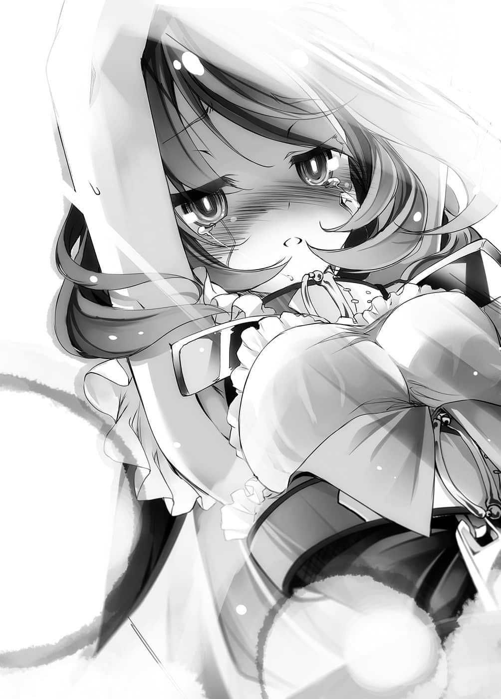

# 一回合结束

> 来源：https://www.linovelib.com/novel/9/2120.html

——艾尔奇亚城・王座大厅。

从大幅改造成为演唱会场的那一天起——时光匆匆，已经过了十天。

如今经过完美的修复，那里已经恢复原状，仿佛一切都是一场梦。

王座回到史蒂芙所说的「拥有历史传统的固定位置」。

「嗯～『一回合』也快结束了吧。」

「……大概……还有三天……左右……？」

两名艾尔奇亚王——空与白坐在固定的位置上，边玩着平板电脑，边这么喃喃说道。

……『一回合』……其他玩家的行动也差不多快结束了吧。

两人回想着，虽然略过一回合，却与休息相去甚远的这段时间一回合……

——原本应该是『无事可做』，专注在帆楼的『Ｐ制作人』的回合。

却因为过于意外的访客——机凯种，使得这回合变得意外吵闹。

他们在游戏结束的同时……一句话也没说，就不知所踪了。

那是当然的，因为没有让他们发誓『若空白获胜，就必须加入我方』，反而是逼他们『放弃爱情』。

机凯种被迫为了不灭亡而进行繁殖——只是如此而已。

不管他们要去哪里，甚至下次真的以敌人的身份到来，那都是他们的自由。

——不过空与白笑着心想：那样也不错。

如果机凯种以自己的意志，明确地向『 他们』挑战……那可是欢迎之至。

话虽如此，借重机凯种的力量达成的功绩仍确实留了下来，没错——

「……空～……白～……周边商品的库存已经销售一空了……」

一脸疲惫地出现在王座大厅的搬运业者——更正。

「就算集合艾尔奇亚联邦的技术，目前仍不可能办到……不过——」

愈是怀抱着火热的灵魂，想引导自己的偶像攀上颠峰的『Ｐ制作人』！

「……很抱歉，由于万分不舍，最后还给你们添了麻烦，还请见谅。」

「集合吧，我的同胞们怀抱热情的Ｐ们！带着自己的兽耳偶像，来到９８９艺能的旗下——！！」

接到身穿工作服的史蒂芙报告，空立刻得意地回答：

「……那样的条件不会有人答应吧？」

「拒绝提供器材的东部联合业者，将会蜂拥而来，商量音源贩卖事宜！」

「不过……只要与９ ８ ９艺能签下『专属契约』，这件事倒也不是不能商量啦！」

那是每个人都最想要的东西。史蒂芙问的是：难道不贩卖帆楼的歌——『音源』吗？

「……东部联合的……厂商……偶像……『Ｐ』……全部到手……！」

「欸～？因为你们是讨好大型经纪公司的厂商对吧～？是比９ ８ ９艺能更大型的公司对吧～？贵公司拒本公司于门外，帆楼却是本公司的艺人哦～❤只不过稍微走红，你们就反过来向本公司献媚？这是怎样～！！超没有节操的！！好噁心哦～？❤」

爱因兹希说完便转过身，用爽朗的语气继续说道：

结合海栖种的音乐性、森精种的艺术理论，与异世界的技术，是全新的音乐！

正如史蒂芙所感叹，以目前人类种艾尔奇亚的技术，制造不出什么了不起的东西。

这句话到了嘴边，白与史蒂芙又吞了回去，继续听空说他的结论。

空等人正靠着『贩卖周边商品』大赚其财；不过，话虽如此——

「嗯……史蒂芙也这么想对吧？每个人都会这么想，我也不例外。」

——模仿时髦年轻女孩语气的空才最噁心。

——为什么？为什么偏偏是这家伙？

「你们是『继承者』，而且机凯种我们——不会再一次违背誓言。」

——受邀的部分偶像关系者一定会这么认为。

「喂，完全没有可以放心的要素啊！」

最重要的是，见识到『 空白』Ｐ统合多种族，打造神灵种帆楼为偶像的精湛技术之后！！

「要我说几次，你认、错、人、了！我应该已经用盟约让你放弃那份爱情——」

这个世界到底要背叛约定期待到什么地步……空甚至心生诅咒。

如果是多种族艾尔奇亚『联邦』的技术，应该做得到吧？对于史蒂芙的问题，空点头肯定。

「……本机也和其他机体同样——即将返回机凯种我们的据点。」

不……让机凯种回去确实很可惜。

「但是，我们驳回！！拒绝！回绝！谢绝！敬谢不敏！撒盐巴去秽气——！！」

迟早有一天会实现——空的眼中燃烧着这样的野心。

「……靠着话题、风评……区区写真集就……狂销热卖……！」

如果他希望的话，我们可以取消关税！给予减税优惠，扩大免税扣除额！

史蒂芙原以为猜中他们的心意，却被空与白响彻城内的叫声打断，彻头彻尾地否定。

「心爱之人确实不是『意志者』，不过——」

「请放心，因为本机千真万确地爱上了你啊，心爱之人。」

对……史蒂芙已经完全迷上帆楼的歌了——不。

——只见机械男人讨厌的东西突然出现在眼前。

「……可是只有帆楼的『版画』和『版画集』可卖……难道就不能想想办法吗？」

就像电视、广播那样，然后让帆楼的歌声响遍世界每一个角落！

「为了新造机体繁殖，眼前最优先的对象即是『全连结指挥体爱因兹希』……早已超过极限的本机的后继机。这次真的可以放心了……这是本机最后一次与你们见面了吧。」

「……我们邀请……东部联合的……各大企业……特别是……偶像经纪公司的……相关人员……」

虽然空甚至已经下定决心，下次要确实地将他们纳入联邦，但是——

「上次的演唱会，巫女小姐也来到现场——你该不会以为那是偶然吧？」

他满怀感慨，带着接受一切的笑容继续说道：

「为什么？嗯……想留在心爱之人身旁，没什么好奇怪的吧！？」

空与白一边说着，一边无谓地来回踱步。史蒂芙对两人这么问，然后——

空无视哑然无语的史蒂芙，嘻皮笑脸的，像是在演戏般继续说道：

正常情况都是女生成员留下来吧，至少那不是男人该说的台词吧！！

白坐到自己的固定位置——空的膝上，做了这样的结论，两人的意思就是——

而且，除了那一部分人之外，其余的人老实说根本不重要，也就是说——

「哼，放心吧，第十八版的增刷也随时可以入库！你要努力地卖哦！！」

空脚跟用力一踩，跟白一同语气夸张地解说他们深谋远虑的策略——！

「当然要卖，因为我们要借此击溃东部联合的偶像经纪公司啊♪」

具体来说，就是——用智慧型手机为帆楼照相，吉普莉尔施展魔法『制版』，全力运作先前在学院研究的大量制纸和大量印刷的试作机，再由画家们在印刷物上着色……使用异世界技术、魔法，甚至滥用国家权力，好不容易才将其商品化。

宣言要将东部联合的经纪公司、人才，甚至市场——全部并吞。

「那样的装置……哼，只要靠本机爱的力量，立刻就可以办到。」

只见空重新坐上王座，跷起腿，桀骜不逊地做出总结。

「……你们的狡猾，真是令人感到可靠又头痛啊……」

空对着天张开双臂，发出号令，召集战友与勇者们。

事实上，只要有机凯种的力量，全部的问题都能迎刃而解，毕竟他们是万能的舞台特效装置。

尽管对于技术与劳力的浪费感到傻眼，史蒂芙却也心想：

只是迈步离去的那个背影，毅然决然地说道：

「帆楼的演唱会有数千人的规模——但是，如今风评已经遍及联邦全土！！」

——先前说机凯种不知所踪，那是骗人的。

「你就没有别的力量来源了吗！不，应该说你为什么还在这里啊！？」

不，应该说就连版画照片和版画集写真集——都已经制造得相当勉强了。

虽然史蒂芙这样反驳，然而空却断言：

「呵、呵呵呵，不懂吗？是吗——那我就解说给你听吧！」

爱因兹希背对着空他们，所以看不见他说话时的表情。

逼近至零距离的那张脸，抬起空的下颚，露出光亮的皓齿说道：

愈是会认为——『跳槽』到９ ８ ９艺能比较好——！！

不过，如果是使用异种族的力量，即使艾尔奇亚『王国』不行——

因此——！

愈是志向高洁的『Ｐ制作人』！

「……上辈子前天他们来了……对他们捧腹大笑……」

「？那样会怎么样吗？」

因为非常遗憾地，不知为何，偏偏是爱因兹希留了下来。

「啊！果然还是要依靠拒绝协助的东部联合——」

由于他的笑容实在太过邪恶，史蒂芙不禁后退几步，不过空与白不理会她。他们从王座站起，接着继续说道：

就算再怎么有利，要他们与其他客户全部断绝往来，根本就划不来吧，因为我方只有帆楼一个人啊。

空无视史蒂芙，昭示他的雄心壮志与永无止境的野心！

这就是小看９ ８ ９艺能的下场……敢与权力作对的代价，好好亲身体会吧……！！

「……什、什么……？」

话锋一转，他在最后露出带着一抹寂寞，却又尤胜寂寞的开朗笑容。

若是放过能够确实发财的商机，那就不配当商人了。

「不，他们会答应，因为９８９艺能会成为联邦最大的偶像经纪公司。」

艾尔奇亚要出个写真集就已经这么困难了，当然不可能有录音技术和储存媒体。

「不过！！就连那也只是开始……！！」

「喔喔！啊啊——心爱之人啊……你也太见外了……」

没错——就是帆楼的演唱会缔造传说般的成功这个功绩。

「…………」

「然而！却没有关键的影像和声音！因为我国艾尔奇亚制造不出来嘛！！」

「不久的将来，不要说是国内、东部联合，我们要在联邦全境设置讯号发射站！！」

「我好想再多听一些帆楼的歌……你们不推出贩卖吗？」

「不，你不是『意志者』，而是空……这一点本机十分明白。」

——『机凯种我们是为了相助你而来，是友军』。

他强而有力的语气，令人猛然想起初次见面时的那句话。

「机凯种无论何时都与你们站在同一阵线，当你们再度挑战世界特图的时刻来到，我们将会赶赴援助。」

他脚步不停，斩钉截铁地说道：

「……到时或许不会是本机，不过我们一定会亲手为你们带来胜利。」

没错。

「下一次——绝对不会再违背誓言。」

「……不会让你等那么久啦。」

超过耐用年限五千九百八十二年，凭藉着『思念』驱动的机械……不。

对于头也不回地离开的——那个男人的临别之语。

「你都已经撑了五千九百八十二年了，就再多撑一下吧——再见了。」

「……掰掰……下次再……一起玩哦……？」

空与白笑着回答，不过那道背影仍继续前行。

飒爽的身影，非常地帅气，而在他发出的一声轻笑之中，微微地带有哽咽——空决定当作没发觉……

————…………

「该怎么说呢，真是一群专情的家伙啊，虽然非常爱给人添麻烦，又笨拙……」

目送着那个背影，想到那些获得了『心』的机械们，空做出总结。

机凯种怀着反逻辑矛盾，最终甚至演变成与人类相同——就连笨拙的地方都一样。

——即使如此，他们的感情却比人类更为纯粹吧。

尽管明知对方已死，却仍单恋了数千年之久。

「……我似乎也有点明白，终结大战的神级游戏玩家为何会爱上机凯种了。」

不——机凯种不需要呼吸。

「【否定】本机『胜利』，虽然尚未成功，不过不管几次，本机都会不断尝试，加油。」

——接着，只是开口说出一句。

……………………啊，这下糟了。

「可怕可怕好可怕啊，快停下来，好烫！你在物理上沸腾了喔！？」

对于这个确信，依蜜尔爱因露出小小的——几不可见的笑容。

不管是以文字工整的美丽辞句所写成的情诗；还是在管弦乐团的助阵下，献上千朵花束的爱情；或是依照嗜好、状况，在各种方面投其所好矫饰而成的……任何词句。

所有人都防备着，等待与先前几次相同，也就是景色连同认知一起替换的现象。

呀啊——！

「【确定】及【再认】主人爱着本机，砰！」

「【典开】——Ｏｒｇ.『ｎ』——『真典・空攻略』——」

只见依蜜尔爱因提起裙摆，深深行一个礼——口中念道：

空的言外之意就是：反正都要再战，希望你是和我们比游戏。

其实空本身也无法完全掌握，自己的书中有哪些剧情和内容。

「【肯定】一直都在。」

空的双手反射性地想要抱住她，不过他勉强成功克制住。

听到空的悲鸣，依蜜尔爱因也回过神了吧。

那个人没有任何名分，既非『主人』，亦非『意志者』，甚至也称不上她的主人。

话中虽然有焦躁一词，但是她的语气平淡，在更正之后，她继续说道：

大概又使用了光学迷彩之类的超常技术吧。

「依蜜尔爱因？欸？你也在吗！？」

绕过空的胸膛，带着踌躇用力抱紧，并将脸埋在空的胸前。

——不，应该说以逻辑所武装的处男坚定理性……

「【希望】再次将心意传达给主人，这次一定要胜利…………不行吗？」

听见从王座后方传来没有抑扬顿挫的声音，众人一同压下悲鸣。

不过，平淡的语气随着整理认知的过程，逐渐出现动摇，她甚至冒烟了。

「【考察】这份『心感情』还无法控制，这是悲伤的意外，不是任何人的错。」

…………

对——『她呼唤空的名字』。

女仆机器人把责任推得干干净净，空则是对着她大叫。

不过拥有完全记忆能力的白既然断定『没有』……那就是没有了吧。

「【踌躇】主人……不，仅限于这个场合，本机判断需要更正称呼——」

「【假设】如果先前的游戏指定放弃的爱，只限定对『意志者』的爱——」

时间和景色，什么也没改变。

「……哥的性幻想里……没有那种——少女漫画般的剧情……！！」

对于没完没了的对话，空不禁抱头哀叹，看到空那个样子，依蜜尔爱因慌张地——不。

「【焦躁】推测是误解，刚才的发言不是事实，是本机的愿望。」

她与空拉开距离，慌张地想要掩饰。

所以在空看来……那像是一种觉悟，就像在挥去不安与困惑一般。

而她断定……有希望。

这足以修复空充满裂痕的理性，让他发出大叫。

——原本就是认错人，她会爱上自己，只是那份错觉的延续。

没有希望就换别的游戏……

「结果你还是什么都没有变吧！？还是跟初次见面就在脑内结婚时一样啊！！」

她的模样、声音、甚至服装也维持原状——接着她走向那个人的面前。

空爽朗地做了这个结尾，白与史蒂芙也微微苦笑，点头认同。

燃烧着红色眼眸的白，有如面对天敌的猛兽一般，发出了咆哮。

「爱因兹希不是也回去了吗？为什么你还在这里呀！？」

一切都不及女孩子怀抱祈求所说出的想法一句话。

「——【告白】……喜欢。」

由于没人要的特性雏鸟情结，一瞬间，空差点就说出「我也喜欢你」。

然后，她深深吸一口气。

眼前出现希望再战的人，身为游戏玩家的空怎么可能会说『ＮＯ』呢？

仿佛要尽可能感受心跳一般，将脸压在其上。

——不只是追击，而是朝着空暴冲。

「……你在哪里……学到……那种招数——！？」

一具女仆机器人，摇曳着紫色头发与裙子，突然从王座后方出现。

最后留下代表『help me』的词语，有如断线的人偶般垂下头来。

勉强逃过粉碎命运的理性，却遭到毫不留情的追击——不……

「【再告】喜欢，本机喜欢空……」

「【推论】推测对主人的爱没有被摒弃，那是专为本机留下的漏洞，一定是这样。」

虽然性幻想的内容被妹妹完全记住的事实，令空不禁有点想哭就是了。

「【整理】机凯种败北，被主人甩……甩掉……本机犯下致命性的误认错觉……侦测到机体温度上升『羞耻』，消除记忆——失败，明明解除连结了，为何……救命。」

她就像是回忆起黑历史而痛苦的人——不过在空他们为她担心之前，她抬起了头。

空心想——糟糕……我还是第一次被这样直接告白。

依蜜尔爱因只是战战兢兢地，伸出颤抖的双手。

突然间，空的身旁燃起了杀气。

玻璃的眼珠映出空的身影，她的眼神充满毅然。但不知她有没有发现——自己握在胸前的双手在颤抖。

「【特定】独一无二的对象・名称——『空』……」

「……我明白了，不过这是最后一次，如果没有希望，你就换别的游戏吧。」

「啊，你基本上是明白的吧……」

「【沸腾】喜欢，喜欢，本机喜欢主人，喜欢空。喜欢，喜欢空的每一个地方，喜欢空的存在，喜欢空的眼睛，喜欢空的思考。本机提议想与主人合体的假说，借由精灵境界中和可以达到融合——本机好聪明，自吹自擂，向『设计体』申请，啊，连结已经被解除了——」

依蜜尔爱因有如乞求般地这么说。

「就说认、错、人、了！同样的对话到底要重复几次啊！？你又消除、变更记忆了吗！？」

不过——

那个真理就是——

空的理性出现龟裂，他终于望向到达真理的超越种。

「【即答】因为本机是主人的妻子。」

她虽然面无表情，却灵巧地眨着眼，口中喊出像是爱心之类的发射声。

然而听她这么一说，空才想到确实如此……机凯种是参考空的Ａ漫进行求爱。

依蜜尔爱因这么说着，只是前进的脚步似乎有点犹豫。

然而射击却偏离目标，只在空的头上留下『ｍｉｓｓ』的记号，空不禁喊道：

真理，没错，那就和帆楼一样。

只要被铁锤直直挥下就会破碎，这才是不言自明的真理——！！

——突然间……

——空不晓得白为何会那么生气。

「【反抗】即使如此，这个世界容许再度挑战重来，所以本机——」

——尽管不习惯，尽管口齿笨拙，仍是拼命地想要传达自己的心意。

只见机凯种最特立独行的机体依蜜尔爱因，比出手枪的手势，瞄准空的心脏。

「【更正】是主人的身体太温暖的错，应该要反省。不过，本机很满足，太棒了！」

「【回答】本机这次的尝试，是采用抽样那位女性的建言……」

「……欸？咦？我、我吗？」

没人在乎空的眼泪如何，只见依蜜尔爱因指出她的情报来源。

忽然间——大概是搜寻过记忆了吧。

或许是想起自己不曾问过史蒂芙的本名——

「【要求】习惯性的命名法，对机凯种而言太难理解，请改名。」

「终于要逼我连名字都抛弃了吗！？我是史蒂芬妮・多拉！」

「【琐事】不管怎样，某人的建言，披露了最具参考性的情报。」

流着泪的空，加上史蒂芙——在两人眼眶泛泪的情况下，依蜜尔爱因语气平淡地说道：

「【阐明】主人容许谎言或玩笑——除了伪装自己的谎言以外……因此——」

以「因此」作为发语词的依蜜尔爱因，脸上浮现微笑。

即便是善于阅人的空，也只能勉强看出那个笑容中别有含意。

但是那笑容所包含的意义，他就看不出来了。

而那个笑容即是——『向所有的女性宣战』……

「【宣誓】直到本机运转抵达极限的瞬间为止，本机绝不会隐瞒自己的『喜欢』。」

「……——————─！？」

「——什、什么——─！？」

依蜜尔爱因转过身，不理会哑口无言、脸色苍白的白与史蒂芙。

「【试算】只要限制运转效能——本机『还』可以运转六年之久。」

她优雅地面向空行一个礼，言外之意就是说：在那一日来临之前，请多指教。

但是，阿兹莉尔也……不，那一日活着的天地万物都听见了。

另一方面，她朝白与史蒂芙瞥了一眼，这次则是明确地——笑了。

经过几亿年，几万世代，机凯种唯一无法应对回答的那个问题。

更何况不是误会，是明确地说喜欢你的女孩子哦？

「帆楼要再次向汝道谢，不过——帆楼……已经没问题了！」

对于默然不语的幻想种，阿兹莉尔露出更深的苦笑。

为了将可能是最后看见的景色，毫无遗漏地记录下来，爱因兹希缓步而行。

——不管是爱因兹希，还是现存的任何机体都不知道。

「……落败就绝望的我……身为使徒真是太不及格了喵。」

《然而，吾会回答汝之疑问，『疑』即是『心』，因此询问怀疑的『汝』即是『心』。》

真的只能笑了。阿兹莉尔迈步前行，她只是在内心思考着。

那是应对回答遥远过去……那个存在于久远之前的帆楼。

《——让他们走掉无所谓吗？》

空当前的要务，就是集中全副精神思考，要如何才能逃离这里。

---

■ ■ ■

————…………

机械的男人不禁侧着头，怀疑故障比自己所诊断的程度更为严重，但……

「………………」

因为剑道具的主人，最强之神所认定的天敌……

《如果汝不在意是机械我们的话——『吾来作汝的谈话对象吧』……》

他只是将充满杂音的思考，有如『播放』一般继续说下去：

正因为机械们是最弱的意志之剑，所以才能贯穿最强的『神髓』。

「正好相反！帆楼甚至落后了帆楼创造的存在了啊！」

「而且都已经说好了，如果说出的话能让我满意，我就放过他们，阿邦君觉得不满吗？」

被这么多种族的美女和美少女围绕，还说「喜欢」你，这可是第一次。

而他们如今由不同的一人两人——人类种弱小的人们所继承。

说完那句话后，带着墨壶，化身幼小少女模样的神……帆楼继续说道：

只是……告白的女孩子性格有点问题。

……虽然对那位战神不好意思，不过那句话机械们并没有传达。

由于累积的逻辑错误与损伤，变得非常抽象且暧昧的纪录记忆。

对于从阿兹莉尔体内响起的幻想种的提问，阿兹莉尔苦笑一声。

但是战神却非常愉快地对机械的回答一笑置之，接着说道：

机凯种留下来了哦？附带万能特效装置，而且是你所希望的女孩子哦？

而且规则就是规则。

在永远倦怠的最后，遇见能以全心全力挑战的敌人——然后战败。

在艾尔奇亚遥远的上空，天空都市阿邦特・赫伊姆。

——那个存在伫立在那里，自然到了不自然的程度。

「……事到如今，迁怒刺杀了主人的剑道具，又能如何……」

《因此遥远过去的问题，如今由吾来回答吧。》

那至高无上的幸福，区区使徒阿兹莉尔等人若是心怀不满——那是对主人的侮辱。

也就是最弱者们……『意志者』们与遗志体都已经不在了。

然而说出那句话的人也不明白其意义。

不知为何，全员的视线有如针刺一般地看着这里，空感到如坐针毡……嗯……

那是阿兹莉尔最初，也是最后看见主人如此大笑。

方才脱离杂音，爱因兹希不明白帆楼苦笑的意义。

「【确信】面对伪装自己的敌人——我在这场恋爱游戏不会败北，轻松取胜。」

『我战败的不可能都已成为可能，所以一切都有可能。剑道具啊，转达给你们的主人吧。』

听着背后的喧嚣……自觉自己嫉妒着依蜜尔爱因的爱因兹希露出苦笑。

『——即将殒落的「最强」啊，那是无法实现的愿望。』

即使是回想起的现在，那也是欠缺整合性的记忆。

身为最强，将其定义为自己的天敌，与自己恰恰相反的——最弱。

---

■ ■ ■

《汝是臆想意志之神，祈求愿望之神，因有心而有命之神，只是不知其理之神。》

——『无名的最弱啊——你可以感到骄傲，你正可堪称是最强我的「敌人」。』

然后只剩下帆楼被留在原地，她在说出这句话后，开心地笑了出来。

《所谓神，正因是神，所以是神，因此汝所提之疑问，永远无法回答。》

只有仅仅二十八具机凯种的机体，在满身疮痍、损坏严重的状态下，记录了下来。

不知何故，她与白和史蒂芙就像有弑亲之仇似地，关系十分险恶。

爱因兹希由于奇妙的感觉而默然不语，一旁的帆楼则是好几次欲言又止。

机械们听着最强不再是最强的意志，临别的话语。

他眯起眼睛，露出笑容之后，便宛如融化于空间一般转移消失。

这是你期待的剧情发展吧？这是你想要的老梗吧？

「……最强，以及其天敌……最弱……嗯～……嗯～？」

「由于汝的建言，虽是暂定，不过帆楼得以假定『情感』与『愿望』的定义……大概。」

自己想说什么？自己想传达什么？

经过了六千年，阿兹莉尔终于明白……那一定是因为主人很高兴。

「……可恶的特图，果然是个爱说笑的家伙……竟然说帆楼太急性子？」

接着她想起了——主人被讨伐的那一日。当时主人……笑了。

对于带着笨拙的笑容，传达那个假定情感的概念少女。

看见帆楼带着笑容这么说，爱因兹希居然也感到认同，真是不可思议。

——听见毫无脉络，突如其来的这句话，帆楼侧着头感到讶异。

对人类种的街景而言，那实在过于异常，但是她却又理所当然般地存在于那里。

『这是一场很好的战斗游戏——下次我会胜利。』

爱因兹希——不，机凯种是——这么回答的：

「……汝，机凯种，推定个体名称・爱因兹希……」

——帆楼本人惊讶得睁大双眼，那是只有帆楼才知道的问题。

真令人难以相信，那是被贯穿『神髓』，如今已消逝的存在。

战神在临死之际，如此称赞了自己的敌人——然而，还这么接着说。

看着城市的景色，他不禁心想：遥远过去的他们，其后裔所建筑的景色，今后也会不断发展下去吧。

「真奇怪啊……异世界开后宫的剧情，到底要怎样才能成立呢……？」

「……『道谢』……帆楼必须传达『感谢』之意，帆楼是这么假定的！」

「……机凯种汝等，果然……就是那一日的机械吗……」

——总之，以空的器量来说是不可能的，只有这一点他非常清楚。

『……「最弱」啊，不管几次我都会再挑战。』

没错——战神不是对着机凯种，而是对着他们的主人说话。

——好了，怎么样啊？笑吧，十八岁的处男・空。

即使如此，却仍心想着下次一定要胜利……

经过几亿次的推测，她有如确认一般——

听见战意毫无衰减的战神开口『宣战』，机械勉强地回答：

如果吉普莉尔来了的话会如何呢？光是想像就令空不寒而栗……还有……对了。

坐在都市边缘的阿兹莉尔，将刚才听到的那些话、那些纪录记忆——也就是主人最后的话语，深深牢记在心中，只是目送着机械男爱因兹希转移离开。

……空与白，原来如此，两人是弱者。

就算增加强力的同伴，那些强力的同伴却也是败给弱者他们。

两人的本质就是彻底的——『强者克星』。

由于实在太弱小……要是不做到那种地步，甚至就无法战斗。

实在太过愚蠢……即使如此却仍勇于挑战，连神也为之屈服，可说是深不见底的软弱。

他们的弱小根本让强者无法想像，甚至超出强者所能理解的范围。

弱者对强者而言就是这样的天敌，因此才能致其于死地吧。

如果是现在的阿兹莉尔，似乎也稍微能明白那个道理——

——然而……

「嗯～？那么反过来说——最弱的天敌也是最强喵？」

身为强者天敌的弱者，他们的战略、战术、策略，总是为了打败——『从正面应战无法胜过的强者』而准备。

那么他们的天敌就是弱者绝对无法想像的——压倒性的强者吧？

不先输过就无法应对的——『初见克星』。

「……喵～～～真犹豫～～～～这样我要帮哪边声援呢～！？」

对于边走边达成的结论，阿兹莉尔不禁抱着头烦恼。

虽说是不同人，形貌也不同，但是确实有人继承——『最弱』。

留下不管几次都会再挑战的遗言——如果这样的『最强』也有人继承……

那么知道败北，知道最弱之后，带着下次绝对必胜决心的最强，如果与最弱再度相遇的话。

自己该帮哪一边声援呢……阿兹莉尔认真地烦恼着。经过一番挣扎后——

终于——拍了一下手。

不过，正因为如此才要走这一步——在这个紧张刺激的状况下，空与白笑了出来。

我方不能发动攻势，对方敌人也不能攻来。

为了将堆积的物品堆得更高，应该怎么做才好呢？

---

■ ■ ■

不管是王座、人类种全权代理者的宝座、房产还是权力。

话虽如此，这一步也有一个问题。

「然后游戏就交给游戏玩家，我们会像个专家一样，把事情完美解决。」

「……只有超级闲……或者在等待什么……或者两者皆是的时候，才会使用哦♪」

见到他们玩着掌上型游戏机，轻松自如地回应的样子，史蒂芙不由得加深了叹息。

史蒂芙虚弱地叹了一口气，但是看到坐在王座上的『国王空与白』——

不过，只要走『这一步』，这个枯燥乏味的状况，一下子就会变成可以任凭选择的情况。

——好了，请恕我又要突然开始话题。

「喔～史蒂芙要特别努力才行呢～……我们只是和往常一样。」

国力若增加，国内外的制约麻烦也相对增多，结果只会让自己变得更加难以行动。

他们仿佛在说——「我想，这样做大概是最快的方法了」。

看到工商协会、各公会的要人，诸侯们并排而立的样子。

「……算了！帮有趣的那一方声援就好了吧～♪哈哈哈～❤」

如果找到问题的话，就要一个一个仔细解决……这就是常用的手段。

随着白的一句『一回合经过』，牌子被撤下来，城内也跟着忙碌起来。

只听见悠悠哉哉，却又含有期待的笑声，在天空都市响起……

说完之后，原本低头玩游戏机的空与白，把头抬了起来……在他们视线的前方——

就是「凡事破坏比建设容易，失去比维持简单」的那个原理。

妖精种吗？地精种吗？或者可以期待黑马呢？

——果然很难喜欢走扩张路线的大国玩法。

在众人个个散发杀气的杀伐气氛中，只有空与白完全不当一回事，就像在嘲笑那些人似地说道：

一般做法就是稳固地盘。

——那就是『是否能存活下来连胜到底』，这个有点危险的问题。

挂在艾尔奇亚城上的『歇业中』牌子，终于消失了。

「那么，史蒂芙！这是最后的机会了吧，趁现在帮我准备『国书』。」

——————这一天，这个时刻，空与白。

那么……还记得『重新整理』？没错——具体来说就是……

——时间又经过三天。

「我说史蒂芙，在战略游戏中，所谓的『休息一回合』——跳过自己的回合……」

艾尔奇亚的两名国王，因为国内的叛乱而失去了一切。

「没有错呀……毕竟那是属于我们专业的领域嘛。」

看到空与白丝毫不介意眼前杀气腾腾的众人，史蒂芙困惑地问道。

无论如何，空带着个人的兴趣，想像最先接连败北的对手。

一次就使一切崩毁——这就是这个手段的结果。

「所以说，凡事交给专家去做是最好的做法，政治就交给政治家。」

他们选择的是更容易轻松，却是最危险愉快的手段……

还记得——『熵增加原理』吗？

「……好啦，我收到你们『一如往常只是玩的宣言』了……唉～……」

---

■ ■ ■

这就是最轻松，且最危险的另一个『重新整理』的手段……没错。

城堡开放之后，回来的不只是大臣们和城内工作人员。

为此，首先要慎重地确认现状，检讨是否有问题。

带着前所未有的糟糕预感，史蒂芙一脸苍白地听着他们说话，空与白则是苦笑着心想：

「嗯，要写给谁啊……嗯～还没决定，不过不管是谁，内容你就这样写。」

「——欸？好、好的……？是、是要写给谁的『国书』呢……？」

「……史蒂芙，靠你了……白和哥……也会加油的……」

所以，我就再稍微详细地『爆雷』一下吧。

接着约莫在一个月后——名为『艾尔奇亚王国』的国家——从地图上消失了。

比如说……这『一回合』——『无事可做』。

「要开始忙碌了呢……我实在不愿想像到底累积了多少工作。」

这么说完之后，空重新思考……好了，这会是写给谁的国书呢？

「嗨，傻蛋，需要我们救你吗？谢礼就是『你们国家的全部』如何？」

思考过度的头脑，停止思考。

他们失去了『国王』权力所及的一切。

两人目光锐利地注视着逐渐聚集在王座大厅的人们。

为了让史蒂芙写下送交给对方的『国书』内文——空这么告诉史蒂芙：

所有的国政都再度运作，原本空荡荡的城内，开始出现人潮。

但是，很不巧，两名游戏玩家讨厌麻烦的作业游戏，他们立刻否决这个方法。
