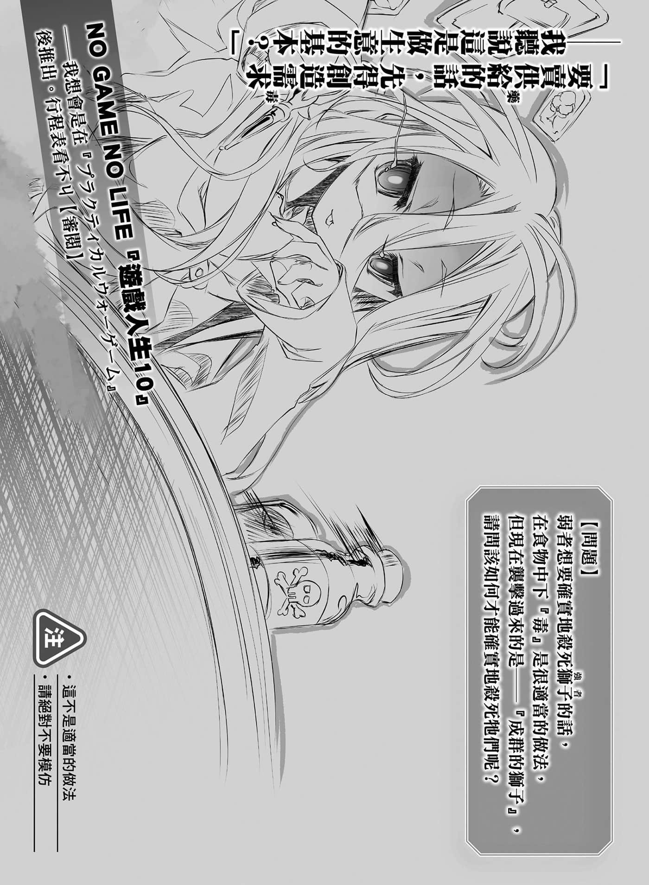

# 后记

> 来源：https://www.linovelib.com/novel/9/2121.html

那是距今大约八个月前的事了……

——时间是二〇一五年底。

本文已经写好，只剩下插画尚未完成。

有个男人在液晶绘图板前，以猛烈的速度描绘图画。

男人很拼命。

或者该说接近濒死了。

他染上感冒，不眠不休，原本就已不好的头脑，变得更加恶化。

若是问恶化到什么程度，具体来说就是拿着笔去喝水，却不知何故把笔留在流理台，回到自己的房间后，便拿着杯子准备作画，已经无药可救。

尽管被人建议该去医院——而且是去看脑神经外科，不过那个男人仍是拼死地绘图。

——因为家庭成员增加了。

孩子的预产日比截稿日更加紧迫地驱使那个男人努力工作。

因为男人笃定——一旦孩子生下来的话就不能像过去一样了。

可以执笔的时间会缩短，孩子未断奶前也不能完全交给妻子照顾。

因此男人是这么跟编辑说的：

——『我死也会赶上十二月出书，在那之后请给我育婴假』……

为了防范各种突发事态——不，他已经在心里做好准备，因为没有什么事态是可以预测的。

他必须跟妻子同心协力，一面养育小孩，一面一步步地摸索新的生活步调！！

……最后，那个男人办到了。

虽然因为也有别的动画作品在其他公司制作，所以工作仍是堆积如山。

不过，即使如此，当前的工作毕竟是结束了……

那么再会了！！

——哼，哼哼哼、哼哼哼……

啊，是这样啊～那就好了，别吓我啦～❤

「哎呀～真的是呢，这一集用了奇怪的写法呢。（笑）」

话题转移得太明显了吧！？我果然被当成人球踢了吧！？

（编注：以下所指皆为日方出版情形。）

现在我要下定决心……提出那个问题啰……？

每次更换编辑就要重新再建立信赖关系，这可是非常不容易的哦？

听着制作人从地狱深渊传来的声音，男人确认行事历，这时才想到：

「相信一个人需要根据吗！榎宫老师会说出那么悲伤的话吗！？我相信榎宫老师——这不需要任何根据，您不这么认为吗！？（断定）」

发生一连串的突发事件！经过完全没在休息的育婴假，第九集终于顺利完成了！

男人很清楚，对方当然不会这么认为！那么就回应对方的期待吧！！

我该不会……

我会努力做到让大家满意，请各位多多支持关照！！

是关于突发事件『之二』……也就是更换编辑。

好了，这个行程表……该怎么办呢…………

…………

「对，下一集原稿一定很快就会完成！我对老师的信赖，无论何时都突破天际喔！！（认真）」

『好久不见～我就开门见山了，榎宫老师——要不要来制作剧场版动画呢！？』

「可是榎宫老师，即使换了编辑，你看起来似乎还是应付自如哦？（疑问）」

「我当然要啊！尽管放马过来！我什么都愿意做！！」

啊，是……不对，不是啦。

这么回答之后，男人随即回过神来。

这次在完成这一第九集的初稿后，编辑又换成Ｔ氏你……

首先，必须从相信开始吧……

欸、啊，什么……？

「……确实，我必须尽力得到榎宫老师的信赖才行。（咽口水）」

…………不，没错，我真是失礼。

……就是这样！！那个男人就是我榎宫佑！！

信赖是双方面的关系，所以我也要得到你的信赖才行——

就在男人满怀感慨地这么想的时候，插起的旗子——突发的事态动画制作人来电立刻发生了。

……不，我跟你说哦～？

加上在台面下进行的『剧场版动画・ＮＯ ＧＡＭＥ ＮＯ ＬＩＦＥ』！

什么呀，我正要漂亮地结尾……

对方竟然用问句，难道他认为那个男人会说『ＮＯ』吗？——当然不会！

下一集是『ＮＯ ＧＡＭＥ ＮＯ ＬＩＦＥ～プラクティカルウォーゲーム～』㊟——

这样就算发生一些突发事件，他也能一边应对，一边照顾孩子和工作。

我想身为新编辑的『Ｔ氏』，是不会知道前一集是怎么写的……

「这个没有问题，我对榎宫老师的信赖无论何时都是最大值哦。（笑容）」

说、说得也是……那么……我可以问一个问题吗？

我的记忆大概错乱了吧……我想跟您确认一下……

『你亲口答应了吧？那么……我们一起死吧！』

…………

「啊哈哈哈！……不，这真的是本公司自己的问题……给您添麻烦了。（郑重道歉）」

咿～！？虽然不知道怎么回事，对不ㄑ——

「是啊！请您要有自信，就是那样没错！！（认真）」

那么，先前为了不脱稿，有一个问题我一直努力不去多想。

……呼～好了……我已经死心了。

你瞳孔瞪那么大很可怕耶，到底有什么根据说那种话……

……是啊，这个嘛……与其说是这一集，那个～

……是吗？原来我的记忆正常啊……

「啊啊，榎宫老师！！我不想从您的口中听到那句话啊！！！（夸张）」

「先写过一遍后，再『改成轻小说风格』，花费两道手续，我明白很奇怪啦。（笑）」

第十集我也同时在写作，我会努力不让出书期间隔太久！

……

第六集之后内容一直都很复杂严肃，这一次！这一次终于回到轻松的内容了！若是内容能让各位读者满意的话，则是我无上的荣幸！！

我在第七集即将出书之前，已经换过一次编辑了吧？

——然后呢？你为什么笑了呢？

是、是吗……

因为我经常需要询问意见，或是请教商业上的判断……所以我是一个非常依赖编辑的作者哦。

那么再会——

「不是啦，虽然我也尊重榎宫老师的属性，可是身为前Ａ漫杂志的编辑，我认为那一个场景还是别用小学生用同年龄的女生比较好哦毕竟还是巨乳畅销。啊，不过采用超小件比基尼是很好的决定——」

「对，没问题哦～榎宫老师的记忆很正常。（断定）」

……然后，历经一次接手第七、第八集，非常辛苦的『Ｉ氏』之后。

「啊，最后可以让我说一句话吗？（认真）」

——被你们当成『人球』踢了吧？

是在十二月发售……该算是番外篇吗？还是短篇集＋番外篇呢？

