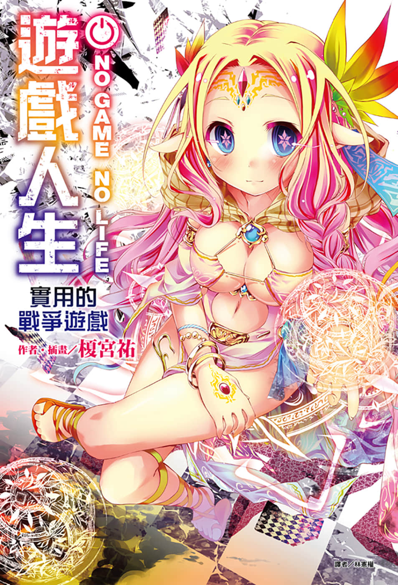
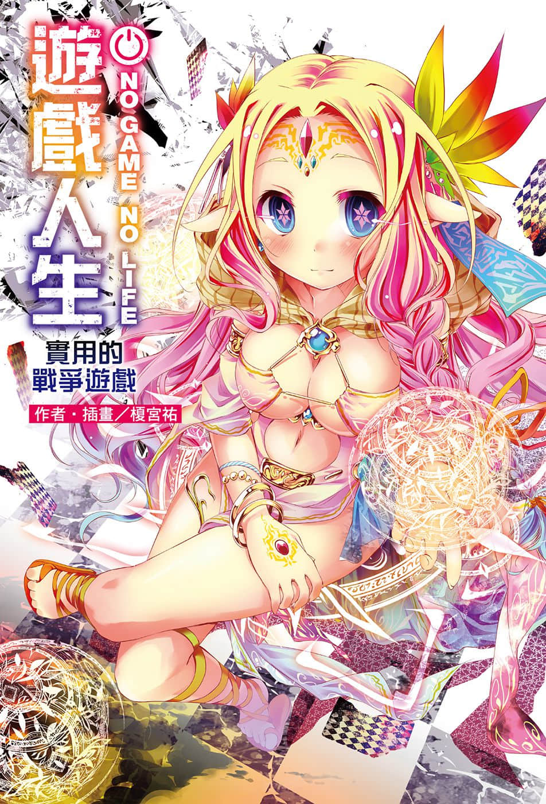
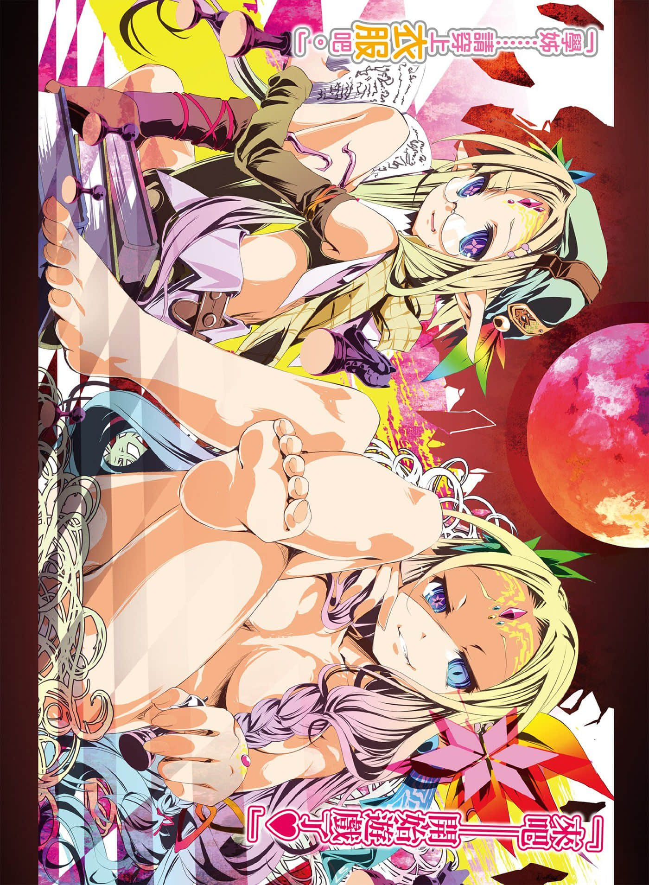
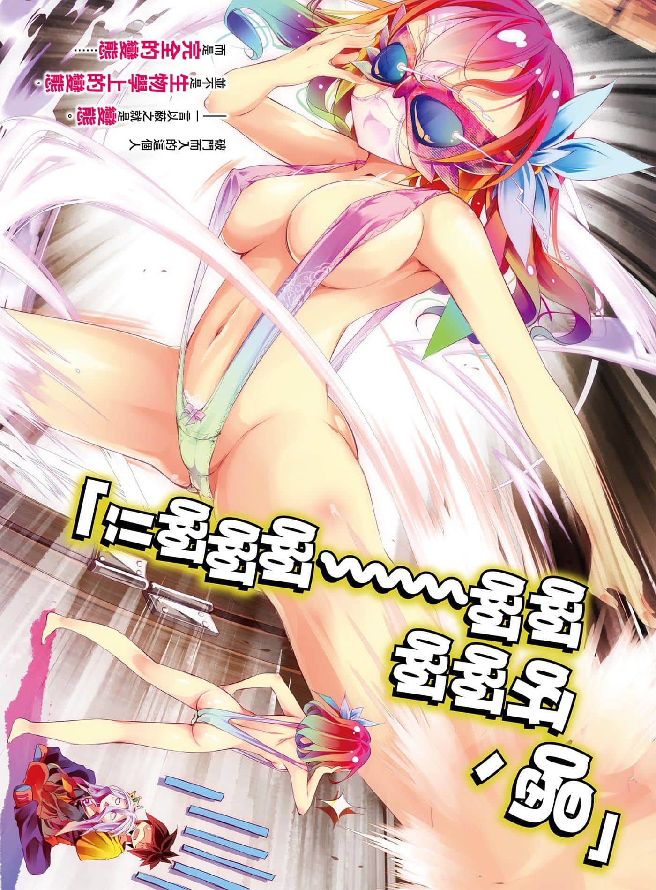
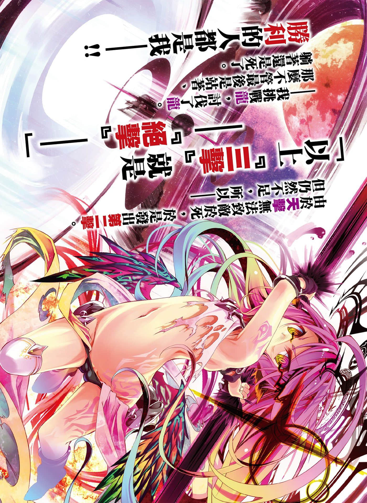
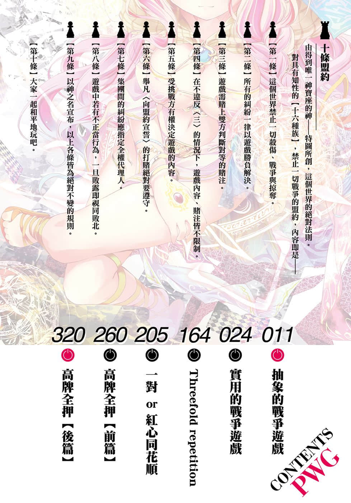

# 插图

> 来源：https://www.linovelib.com/novel/9/118070.html

台版 转自 深夜读书会

作者：榎宫祐

插画：榎宫祐

译者：林宪权

图源：深夜读书会

录入：深夜读书会

深夜读书会：ritdon.com

仅供个人学习交流使用，禁作商业用途

下载后请在24小时内删除，深夜读书会不负担任何责任

请尊重翻译、扫图、录入、校对的辛勤劳动，转载请保留信息

————————————————

【内容简介】

终战的彼端，是另一个毁灭的故事……收录动画特典+全新外传，豪华的特别篇！

【迪司博德】——一切以游戏决定的世界尚未被创造之前，面对长久以来撕裂星球的『大战』，其实并非只有『人类』将其断定为游戏，试图终结大战。只是其他人的规则与人类有点不同，好比说某位森精种梦想的未来就是——『杀死星球上所有的人，最后还活着的就是胜利者』，也就是——『没有规则』！本书收录全新的中篇故事——森精种辛克・尼尔巴连所见证的『另一个终战』，另外也汇整动画特典收录的轻松热血短篇，可谓内容豪华丰富的特别篇！

「来吧——开始战争游戏啰～❤」

【作者简介】

榎宫祐

我是榎宫。

恕我冒昧，听说地球有超过数千种的语言。这意味着『人类基本上是无法相互理解的』……不过不必绝望！因为人类有终极的万能语言──没错！就是肉体语言（暴力）！！

来吧──谈话（游戏）就此结束，准备你的辞世诗吧！编辑！！

榎宫祐

……我、我是榎宫。

为了超越无法相互理解的基本原则，人类发明了理性和语言！你不觉得人类是充满知性的动物吗！？暴力是愚蠢的行为！是否定知性，是对理性的亵渎！！──你不这么认为吗我是这么认为的所以那个对不起我会遵守截稿时间的包在我身上！（满身疮痍）

【绘者简介】

