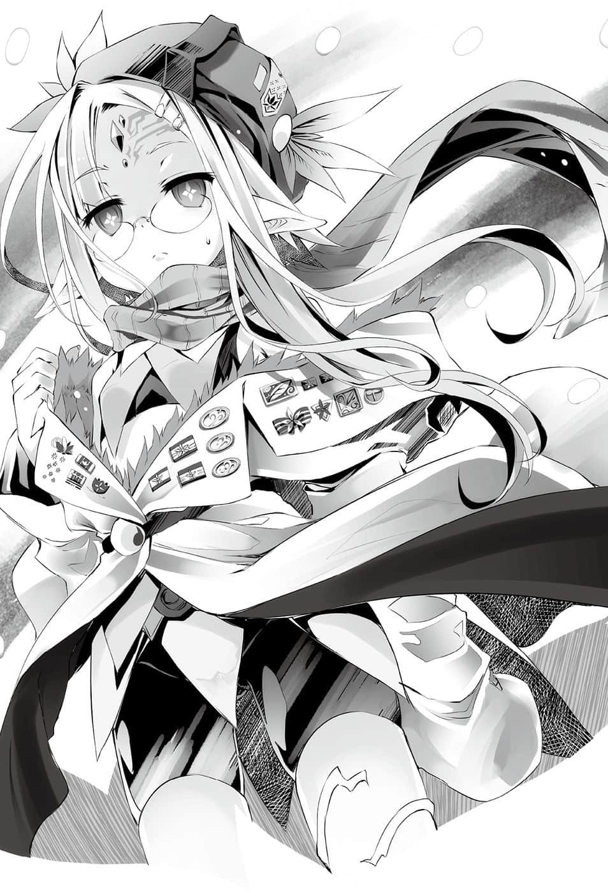
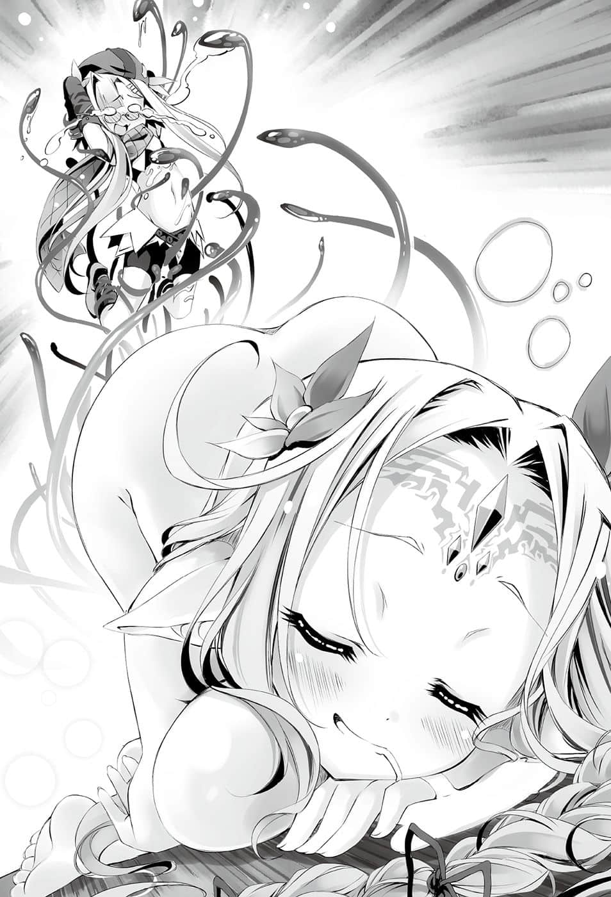
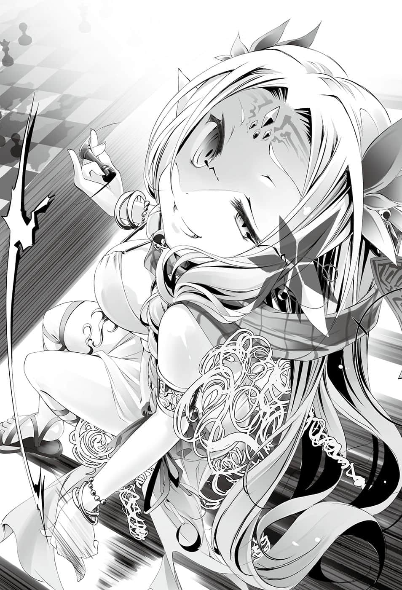
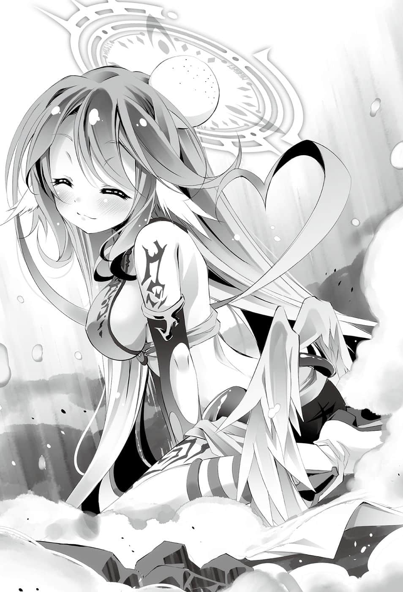
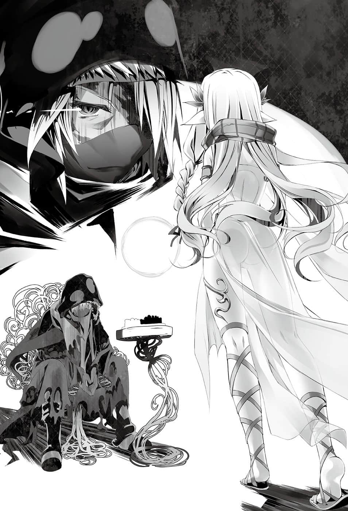

# 实用的战争游戏

> 来源：https://www.linovelib.com/novel/9/2124.html

然后——那一天。

辛克・尼尔巴连躺在已结晶化的砂子上，被高温的砂子灼烧着背部，漫无目的地仰望着天空。

……长耳朵听不见任何声音，额头上的魂石则混浊得有如黑炭。

六片菱形的眼眸也混浊无光，只映出天上的光辉。

那是受烟尘遮蔽，逐渐燃烧消失的红光。

天上降下的灵骸是精灵死前发出的淡蓝微光。

每当闪光出现，就会有一艘森精种的飞行船团坠落。

意识如在梦中一般模糊不清……这时她忽然想到——

这片天空原本是什么颜色的呢？

在大战开始之前，这个世界又是什么模样呢……

她有生以来，第一次产生这样的疑问…………

————…………

——孩提时期，她认为世界应该要更单纯才是。

并不是因为世界的丑陋、无秩序、无意义、无价值。

而是她觉得世界本该如此，而且理所当然。

这个想法来自一个一无所知，却又太过聪明的孩子。

在孩子天真无邪的眼中，世界就是无色透明。

而且——世界最后也遵从她的想法运转。

每当那个孩子说出一个想法，并且加以实践之后——

原本杂乱丑陋的世界便稍微变得单纯好转。

——他们是在进行『游戏』。

然后——自己败了。败给毫无美感，比臭水沟的老鼠还不如的地鼠。

——这时辛克・尼尔巴连还不知道。

她靠着终于清晰的意识，勉强推测出发生了何事。

集团组成部队，部队组成队伍，队伍组成阵形，她将组织战斗变为可能。

她持续了漫长岁月的平淡作业——率领森精种的军团，从事驱除地精种的作业。

既没有意义，更不会有目的。

就在剑即将挥下的瞬间，剑身突然爆炸，从中断成两截。

之后，她得到当代最高位术者的称号——『花冠卿』。

既然会永远持续下去，这就表示战争是正常的吧。

【你的睿智、对种族的贡献、对我的忠心皆十分难能可贵。能够诞生出像你这样的花，正是大战终结的吉祥之兆，而我也终将消灭愚蠢的众神，坐上唯一神的宝座。】

『～～～～～～！？』

对于没有任何人可以阻挡在自己前方的她而言——世事就是如此简单。

『两军』的飞船坠落，战线崩溃——也就是说，那个男人也输了。辛克当然也不知道，男人是因为做梦也想不到钢铁舰队会输，所以看到钢铁舰队与对方同归于尽的爆炸景象，反而感到很开心。

辛克・尼尔巴连看到一个人影。

战败——输了？谁输了？输给谁？为什么会输？

男人愉快地转身离去，在临走之前报上这个名字。

她的听觉终于恢复，原本昏昏沉沉的意识急速清醒。

……辛克只是随心所欲地定义世界，将世界变得更加单纯。

——大战结束后的世界——那是没有纷争的世界。

魔法术式经过她理论化、体系化之后——以集团方式运用大规模术式的技术变为可能。

辛克眼中原本无色透明的世界，如今感觉就像染上鲜艳的色彩一样。

辛克这时也还不知道，那把剑与她交战，因为承受不住过度的负荷而严重损坏。

她首次遭遇地精种驾驭飞行的钢铁舰队，她的船团受到炮击——然后……

辛克听不懂他在说什么，甚至不知道那是什么语言。

正如同河川冲刷土地，海洋打碎陆地，大陆分隔海洋，大地掩埋河川一般，这个星球不断改变面貌。改变星球面貌者，不管称之为海洋或陆地，还是称之为神或森精种，都没有差别。

看到这个情况，男人惊愕地睁大双眼……然后仰天大笑。

初次尝到失败的滋味，在她胸中盘旋的并不是悔恨或愤怒。

…………战、败……？

——只有对『未来』的梦想。

————…………

……原来如此，这才是『大战』吗？

——当这把剑挥下时，自己的生命就会终结。

就连口口声声要终结战争的白痴神，都不知这场永远的战争是从何时开始的。

辛克的意识仍然拒绝接受现实，她的眼神看着男人挥起的铁块——『剑』。

没错，就是这个男人，手持铁块的地精种朝她砍了过来，之后……

她谨守礼节跪在地上，恭敬地低下头，然而她的心中仍毫无感慨。

……辛克・尼尔巴连向前走了几步，仰望天空——笑了出来。

——辛克甚至不觉得发生过战斗，她只是感到困惑不已。

她一直都这么认为——直到今时今日。

但含有六片菱形的眼眸已恢复精神，她挪动目光看去。

自己一直是在战争，有人在和她对战。那个人和自己同样，用『棋子』描绘着『棋谱』……

更不知道男人开心大笑的理由。

——部队是音符棋子，战略是乐谱定石，战斗是演奏棋谱。

不过，她仍然没有抱持任何疑问，只是依照孩提时的感性，继续描绘这个世界。

无论是悲鸣还是惨叫，胜利欢呼还是恸哭，全都应该要宛如交响曲一般，演奏得井然有序。

辛克不曾想过，甚至做梦也没想到。

「……那么美妙的世界，如果只停留在想像中……那就太可惜了呢❤」

对，就是这把剑。她的八重魔法就是被这把有着发光纹路的剑打破，之、后……

……不知是经过了数分钟还是几个小时——

尽管发音笨拙得可笑，而且用尽全力才没有咬到舌头，他仍清楚地用森精语说了一句话：

『～～～～～～』

败给没有丝毫理性、知性、品性——那个可恨的地精种……

四肢好不容易恢复力气后，她站了起来——这一天，她终于明白了。

如果能在那样的世界里，仰望天空原本的颜色，深深地吸一口空气——啊啊……那会是多么地——

没想到这个世界，她只当成是收拾自己房间的这个世界——

——竟然被阻止了。

只见一个男人，扛着比身体大数倍的铁块，正俯视着躺在地上的自己。

「下次再玩吧，我要亲手杀了你。」

「——罗尼・多劳布尼尔。」

简单说，就是那群可恨的地精种灭绝的世界。

——在无声之中，宛如敲击内脏的爆炸声响起。

尽管身体受到灼热沙土与天降黑灰的灼烧，她却无法起身。

唯一神的宝座？想坐就去坐吧。如果无法靠自己的力量坐上去，那就坐马桶好了……

这位过于聪明的孩子描绘出无数的胜利棋谱，对她而言——世事就是如此简单。

——然后她不再是孩子，但世界依然遵照『她』的意思运行。

这个陌生的概念，宛如水滴在砂上，渗透进她的思绪。

战争原本只是既无目的，甚至没有任何意义的行为，但如今只要想到这个行为所带来的结果。没错——

就好比说，整理房间并不需要任何理由。

战败了。

会有人对自己定义的世界不服，而蹂躏、排除那些人的行为，原来就称之为『侵略』。

最后她终于获得自己的创造主——森林之神凯那斯的赞赏。

她感到俗不可耐——大战终结？唯一神的宝座？能吃吗？

跟反对自己世界意见的人发生冲突，原来就称之为『战争』吗——！！

之、后……？

这时那把纹路再度发光的剑，唐突地——

辛克・尼尔巴连独自被留下，一个人躺在热砂与黑炭之中。

由于这份理解太缺乏真实感，以致她的四肢动弹不得，只能呆呆地看着剑锋。

辛克从被击落的飞空艇爬出，那个男人就站在她的眼前。

届时已不存在引起争端的理由——也就是杀光所有碍事者后的世界。

看着死亡在流血的天上飞舞，现在她明白，这丑陋至极的光景，有时也会非常美丽。

因此，辛克・尼尔巴连只是静静地听着。

辛克不知道男人那把被称为『灵装』的剑——就是地精种使用魔法时的『触媒』。

竟然『并非只属于自己』——！！

————

这个丑陋无比的世界将会变得比任何艺术更优美，她不禁感动地笑了。

——这一天，辛克・尼尔巴连诞生了。

……与其说是诞生，倒不如说——她气昏头了。

只不过愤怒这种感情与她实在太无缘，所以她甚至没有愤怒的自觉。

于是，脸上带着凶恶的笑容，找到目的的天才就此诞生————

---

■ ■ ■

——辛克・尼尔巴连。

这位绝世天才忽然失踪与败北的消息，震撼了所有的森精种，令他们陷入动摇与困惑之中。

不过那也已经是遥远的往事。森精种的首都墨尔伦——一个位于广大森林中的城市，如今响起沸腾的欢呼声。

在一艘悠然航行于空中的『草穹船』上——不，在它的船尾楼上，看得见一名个子娇小，即便是长寿的森精种，却仍显得稚气犹存的身影。

身穿不合尺寸的花冠卿法袍，配挂着勋章带，一个人凯旋而归。

她虽是稚气犹存的少女，却肩负着全森精种的希望。

「花冠卿……您此次的指挥也十分精彩。」

少女柔弱的背后，一名年老的舰队提督由衷地向她致敬道贺。

不过，继承消失于历史的传说称号，并且超越其上的人，是一名可爱娇弱的天才。

「……在下什么也没做，这完全要感谢王叶舰队提督的襄助。」

不过她并不夸耀自己的伟业，只是温和地注视着眼下的首都。

如银铃般清澈响亮的声音，话语中带着毫无虚假的谢意。

——妮娜・克莱布。

在前任花冠卿战败失踪后，森精种甚至面临种族存亡的危机。

这位年轻的八重术者如彗星般出现，证明存亡危机只是无聊的杞人忧天。

她带来新的理论，将已知魔法变为『古典』。当她以最年轻的年龄继承『花冠卿』的称号后，即刻着手改革军队，接续前任者辛克的工作，让军队更为进步，可说是掀起了一场革命。

虽然不至于会败北，但是也不免会受到不小的损耗。

——这是理所当然的。因为他们的前方与左右两侧是森精种的大军，背后则是『死之雾音札因・内比亚』。地精种舰队只能依照原先的预定单点突破——除了『中央前面』以外，他们没有其他退路。

比起微微叹息的花冠卿，头戴黑扁帽的女人语气更是严峻。

就连这名自以为了不起的女人——『虚花计划』的当事人，也畏惧这名天才——连她也无法理解这名天才。这么一想，提督甚至开始觉得她刚才的发言很可爱了。

由于妮娜・克莱布的影响力，森精种保有的全部兵力，如今实质上几乎都是由她在指挥。

这时提督身旁传出一道冰冷的女性声音，宛如……那才是——

面对地位、阶级、才能，甚至军功也超越自己的年轻人，提督眯起眼睛露出笑容。

没错，结果是毫发无伤地消灭敌人全部的舰艇。

「恕下官失礼，提督阁下并没有接触该情报的权限，请认清自己的身份。」

她只是昭示，只是解答，只是实行，所有的人都追随她——最后获得成果。

她的举动甚至让人产生错觉，感到一种不相衬的可爱；因此她深不可测的才能，更令人觉得阴森莫名。

——如果没有那位花冠卿的浅笑，那位史上最优秀的森精种妮娜・克莱布的那抹浅笑，每个人可能都已陷入疯狂状态了。

——两人只能庆幸，妮娜是自己人，在向她行礼之后退下。

除了妮娜・克莱布之外，包含提督在内，每个人都只是茫然地看着地精种的撤退情况，不明白发生了什么事。

然而森精种这方也已布阵准备迎击，而且是最精锐的王叶舰队。

「……可以的话，希望下次您能正确地告知下官作战目的……」

连提督自己也觉得这不成熟的情感，实在不符合自己的年纪，他不禁露出苦笑。

即便是地精种的高速战舰，也无法那么轻易就突破森精种的王叶舰队。

「不，没什么——我只是觉得你太年轻了。」

……在不久之前，与幻想种交战还等同于『自杀』。

回头一看，眼前是一名身穿黑衣的女性，黑色的扁帽遮住了面容。

——『全体捕获术式船听令，起动搜查与捕获该幻想种「核心」的术式。』

更别说是讨伐音札因・内比亚级的幻想种了——连在酒席上谈起，都会被当成嘲笑的对象。

包含提督在内，每个人都怀疑她是不是疯了。就在此时，地精种舰队从正面逼近。

在目前已知的幻想种中，它是最可怕的一种『灾厄』。

辛克・尼尔巴连过去被誉为至高且独一无二的天才，她的遗产全数受到更新、改良、超越——变为过去的遗物——然后到了现在。

每个人都以为会发生激烈的战斗。

提督就突然出现在地精种舰队『背后』的幻想种提出询问。

正因为如此，提督才更感畏惧……不，由于畏惧的关系，所以他不能不问。

——地精种舰队『散开』了。

——为什么不从地精种的背后攻击？

「『核心』的封印术式正常发挥效果，搬运也进行得很顺利。」

有人无礼地插话，打断了提督的话。

她超然地立于高峰，俯视万象，到底有谁能理解她眼中所见的景物？

她率领二十艘资料中未记载的『捕获术式船』同行就是证据。

那是为了找出幻想种的『核心』，为了借由地精种的战斗，尽可能使雾的规模变小。

「说什么襄助……您实在太谦虚了，没想到——」

——『死之雾』音札因・内比亚。

只不过……消灭他们的不是森精种军。

……花冠卿仍然保持沉默，提督则忧虑地继续问道：

当高速舰队打算强行独自突破的时候，那样活生生的天灾就出现在他们背后。

任谁都会认为，她带了大批舰队是为了将损害程度抑制到最低——

「花冠卿，请您准许将今后管理『核心』的工作纳入『虚花计划』。」

可是让人不明白的是——为何妮娜能预测到地精种的行动？

那种雾能够自由变化形态，既可以是足以笼罩沙漠的大浓雾，也能是一粒露珠。

一般认为，如果能大规模且无差别地冻结或蒸发那些雾，应该就能勉强逃过一劫。

看到她的反应，提督轻轻苦笑一声。

老实说，就连提督自己也差点要下达撤退命令。

——存在这么大的差距，让人甚至起不了嫉妒之心……

没错，就是出现，毕竟那个幻想种平时与『雾』并没有差别。

她与个性温和的花冠卿不同，丝毫不隐藏她的菁英思想。提督心想这家伙真是个典型的文官，不满地哼了一声。那个女人则是毫不在意，将手上的文件与笔递给花冠卿。

「……有事吗？」

因为『核心』推测或许是雾中的某粒露珠，要找到那粒露珠，终究是办不到的事。

那个年幼的身影独自伫立在船尾楼，似乎很在意宽松的法袍。

据传那是在首都的中央，在森精种的创造主凯那斯的主殿所进行的实验。

……提督认同妮娜・克莱布的才能。自己身为舰队提督，全部将兵把生命托付给他，然而她对部队的掌控却在自己之上，而且没有出现任何伤亡。如今提督对她甚至怀着信赖之情，所以才会希望她『多信任自己一点』。

不过，在危急关头——妮娜・克莱布强忍着笑容，下达的命令却是——『……维持现状』。

于是妮娜・克莱布独自一人吹着风，映在她眼中的是『自己的家』。然而，别说无人能了解她内心的想法，更没有人能够明白她僵硬抽动的双颊、眼角泪光所代表的意义。

「……您是如何预知……『音札因・内比亚』会出现的？」

不，对方甚至还是个来历不明的人物，只是以花冠卿的同伴身份，一同搭上这艘船舰。

接着他们无视森精种，一边与幻想种交战，一边开始撤退。

可是一旦交战，只要『死之雾音札因・内比亚』追上来的话，两军都会——全军覆没。

森精种军原本将部队展开为半圆形，采取纵深防御——也就是『以逸待劳』的阵势，意在防止敌人突破，有机会便从侧面包围。这时却不由得陷入恐慌，不过没有人能责备他们，因为战术的前提已崩坏了——更何况还要对上恶梦，拔腿就逃才是正确做法。

因为若是没有左右两翼的军队，散开的地精种舰队就能逃离幻想种的追击。

妮娜・克莱布确信幻想种会出现，更打算利用幻想种。

——率领那样的大军前来有什么必要？

只要被雾吞没就没救了，无论是有机物还是无机物，全部都会枯萎腐朽而死。

想消灭或击退这种会移动的死神——也就是贯穿这个幻想种的『核心』，根本不可能。

他询问那个将地精种的高速舰队消灭殆尽的存在，那个存在就是——

因此，提督只是怀着敬畏之心，静静地摇了摇头。

妮娜・克莱布率领驻留在北方都市的森精种主力舰队——最新锐的王叶舰队全军出击，更从东西两战线抽调临时设立的两支舰队，在应对上显得有些过度反应。

地精种的舰队与恶梦般的幻想种正在逼近，舰内笼罩在沉默之中，众人的情绪除了紧张与恐惧以外，还有绝对的信赖。突然间——

因为她只是倾听，只是了解，只是怀想，只是思考，只是理解，所以无法与她商量。

——从北方战线传来「地精种的大规模高速舰队接近中」这道紧急情报。

…………

除此之外，一切不明，区区一介舰队提督恐怕是没有资格知情的吧。

不过这也是无可奈何，因为任何人都不得不承认，地精种在空中依然占有优势。

「没想到——您竟然能『不损一兵一卒』就消灭了地精种的舰队……」

花冠卿用她纤细的手签署文件后，那名女人松了一口气。

结果，地精种舰队几乎无法逃出，仿佛在等待幻想种将自己消灭一般。

「花冠卿，向您报告。」

「……好，如果可以的话，在下会告知你。」

「那个作战是以音札因・内比亚的出现为前提——不，您打从一开始就不把地精种的高速舰队放在眼里。包含让我们王叶舰队在内的大军出击，您『真正的目的』是——」

不，其实地精种的行动是可以预测的。与其和森精种同归于尽，不如赌赌看能否尝试靠着机动力撤退。

提督默默地这么想着；而那名女人虽不情愿，却也与提督心有同感。

如今却是如何呢……两人忘我地望着同一个背影。

也就是说——猎捕幻想种才是真正的目的。

只不过就算不知她的来历，她所说的话也肯定了提督的疑问。

——『虚花计划』……提督也曾听过这个计划的名称。

——这个女人并不是提督的部下。

妮娜・克莱布并不多话。

没错，好比说……她的内心其实正想着『我好想赶快回家』——

---

■ ■ ■

——之后，妮娜・克莱布踏入久违十日的家门。

接着她关上门，锁上门锁，甚至张开多重术式，探测庭院里是否有人。

仔细确认过没有人偷听之后，她终于深深吐了一口气——

「真是的～～我已经到达极限了，我再也受不了这种事了啦～～！！」

这就是她开口的第一句话。她脱下挂着无数勋章的沉重法袍，猛烈地砸到地上。

嚎啕大哭的她，高声倾诉无人理解的内心话。

没错，她是对着这个家里的另一个人倾诉——

「学姐！！我可没听说音札因・内比亚会出现哦！？这次在下是真的做好觉悟，以笑容迎接『啊，在下今天就要死掉了』的事实哦！？你听见了吗！？」

妮娜用力踩着地板，在自己家里到处寻找『学姐』。

她内心想着——『实在太谦虚了』？

在下才不是谦虚！在下说的是事实！！因为在下真的什么也没做呀！？

——『如何预知音札因・内比亚会出现』！？

是啊！真不可思议呢！在下怎么会知道啊！？

——『可以的话，希望下次您能正确地告知下官作战目的。』

可以的话，在下也想啊！可是提督呀！？在下比你更想知道啊————！！

妮娜在格外宽敞的宅邸走廊上奔跑，大声地哭喊着。

「你也稍微先透露给在下知情吧！！『捕获术式船』是什么？在下可不知道哦！？为什么在下被任命为最高负责人，却要遵照学姐的指令信行事呢！？」

——对，实际上就结果来看，一切都很完美。

妮娜在那场作战中所做的事，就只是把『学姐』的指令信交给虚花计划本部，仅此而已。

她就是——辛克・尼尔巴连。

到了这个地步，其实只不过是『五重术者』的妮娜已无力抵抗——

……啊，脑袋昏沉沉地……

「所以，有如天才的——啊，不对，天才＝我、我＝天才，所以～……我这个天才的头脑发现了一个十分微小，却是凡人一生也不会想到的道理。」

「呀啊啊对不起学姐创新的思想对在下这样的凡人来说太先进了而且您的身体暴露在外太暴殄天物所以在下才建议您穿上衣服还有就是——！」

只要妮娜对『学姐』稍有怀疑，违抗指令信的话——一切就会破局了吧。

妮娜回想着过去发生过好几次，却仍平安度过的愚蠢危机，她心想——可是那些问题应该都已经有对策了呀。

…………

她就是妮娜・克莱布的『学姐』，而且是同居人。

「不、不管光着屁股是有什么理由，客观来看，现在的学姐……就只是个『色女』——」

「——请不要放着在下不管，自己一个人又睡着了啊——唔噗！？」

刹那之间，术式编纂而成。

——因此，身为凡人的妮娜非问不可，辛克则是深深地叹息。

……这种常识需要特地去学吗？

当她提出悲痛的疑问时，触手突然出现抓住妮娜，将她的疑问变成尖锐的悲鸣。

「不要啊啊啊！？在下不想把第一次送给连学姐都断定是来历不明的东西——不，应该说，请你不要随便召唤来历不明的东西呀！？」

在社会上，学姐已被认定为『失踪』，是远比异界生命更加可怕的人物。

定义世界的人揭露这个简单的答案。没错，那么该采取的行动就是——！！

再来就只是站在提督的身边，不管发生任何事都装出『一如所料』的表情，遵从指令信上的内容行事罢了。

听在凡人的耳中，辛克的理论只像是废人的极致。

「那个……服装仪容——你说的『美感』又到哪里去了？」

站着昏倒的妮娜一清醒过来，立刻面红耳赤地大叫。

辛克甜甜一笑，无言地张开双臂。

「呼呼、呼呼……这、这次又怎么了！？发生什么事，为什么会变成这样！？」

自称独一无二天才的这个美女，她所接收到的天启就是——

看到那幅景象，妮娜的理性顿时一片空白——

「一开始别穿衣服就好了呀♪」

而且她熟知『妮娜・克莱布』的一切，甚至连妮娜都不知道的事也一清二楚，同时也是独一无二的天才。

她微微睁开眼，看着被触手纠缠，拼命地保持理性的妮娜，然后接着说道：

听到这个疑问，辛克打从心底感到不可思议，她歪着头指着自己。

就在妮娜即将失去理性之前，触手消失不见，妮娜摔倒在地上，痛得眼眶泛泪。

她冲出客厅，然后全速返回——

听到学姐露出温暖又邪恶的笑容那样说，妮娜哭喊着恳求她。

——不过，即使如此，妮娜仍没有死心。

同时也是这间豪宅不能雇佣人的『秘密』所在。

「就在这里呀，最原始的『我』就是最美丽的，这是再明白不过的道理哦❤」

辛克叹息一声，半梦半醒地说道。

「在下准备了食物和替换衣物，甚至连急救用具都准备了哦！？这次又是——呀啊啊啊！？」

……即便是辛克也难以长时间维持异界生命。

……因为学姐就在客厅的餐桌上。

「——那么……为什么有必要全裸呢……？」

或许这代表妮娜就是如此深受信赖。可是，即便如此——！！

过去学姐也曾经专注于研究废寝忘食，留下『我有惊人的发现，可是营养不足』的纸条，差一点就饿死；浸泡在浴缸里，因为突然的灵感而陷入沉思，结果差点溺死；还有为了某个实验，连续使用魔法过度，弄到魂石变得像黑曜石一样漆黑，差点丧命——

「学姐——！！为什么虚花计划本部的一个不认识的使者都比在下清楚！！你在哪里！？你也稍微回个话吧，学姐——」

找到说服自己的材料后，妮娜说道：

没错——理论并没有被推翻。

辛克露出骄傲的笑容，而且炫耀似地扭动臀部。

「……妮娜～？你竟敢在我睡得正舒服时打扰我……你好大的胆子啊……」

这句话用词婉转，却不能不问。

『学姐』却能在刚起床时，在半无意识的状况下，单纯为了惩罚人而编纂出那样的魔法。

「竟然说我是『色女』……妮娜你好大的胆子呢～❤」

——像这样的事态并非第一次发生。

「既然已经准备了食物——那就在餐桌上研究好了！！」

——没错，她是完美的美女。也就是辛克自己才是完美无缺。

辛克若无其事地倒下去睡回笼觉，妮娜为了唤回她，正要开口的瞬间，猥亵地扭动的触手却侵入妮娜的口中——

召唤异界生命——这毫无疑问是超高位魔法。

或许是春药成分还残留着吧，妮娜的呼吸显得急促。听完这样的理论，她问道：

——这个世界的万物都应该单纯而优美。

眼见天才的理论出现破绽，辛克思考数秒，然后——

然后『学姐』在餐桌上蠕动，把好不容易盖上的法袍推开。

「我会喷出神秘的春药黏液～用来历不明的触手让你破处哦♪」

她把脱在玄关的花冠卿的法袍捡了回来，急促地喘着气，用法袍盖住『学姐』的裸体，然后当场倒了下去。

这时妮娜找到了她要找的『学姐』，下一秒——她的思考停止了。

看到辛克自称完美的裸体……不知为何，妮娜一瞬间竟认同了。

「……？你可以尽情地发浪哦～……还是这是你身为女孩子的矜持呢～？」

她的意思就是——学姐，你有几天没洗澡了？

正确地说，她趴在杯盘狼藉的餐桌上，正在呼呼大睡。

淫秽的气味直冲鼻腔，意识变得涣散。

妮娜寻找着是什么原因让自己认同。然后，她想到原因是什么了……

光着屁股——不，是全身光溜溜的状态。

「喂——！？学姐，请不要越过身为文明种的最后一道界线啊！！」

没错，就是春药的效果啊——！！

妮娜为了让自己不去意识春药，而倾听天才阐述深奥的理论。

但是，无论如何，八重术式的神技迫使妮娜五体投地，摆出服从的姿式如此喊道。

妮娜内心暗想：不知道是不是在下的错觉，感觉好像本末倒置了。

「——啊，哇，好痛！！……呜、呜呜……」

「呼～……妮娜？天才是会学习的——不吃就会倒下，不睡也会倒下，所以不可以只顾着研究。身为天才的我，当然也学会这个教训了哦♪」

「…………❤」

那是八重术式——妮娜连对方是何时编纂好的都没察觉，她也不知道有何效果。

「因为衣服会脏啊～那样一来我就非换衣服不可了哦？那样太没效率了……没有效率就等于没有美感哦。」

没错，很明显一切都可以在这张餐桌上完成。

那么仪容——即衣服，根本只是画蛇添足，这也是非常明显的事实。

辛克在餐桌上摊开资料阅读，饿了就拿起食物吃，累了就睡。

「不、不知道是不是在下的错觉，卫、『卫生之美』的问题并没有解决呀……！？」

只要妮娜帮自己洗澡，自己在那段时间睡觉就好了。

别说是理论，她甚至连生活都已经难以自理。不过看到她的笑容，妮娜还是叹了一口气。

妮娜心里想着：她还是老样子。

「……好啦……只是你起床后要工作哦……？」

妮娜疲惫不堪地说完，她不禁心想：

——自己在战场险些战死，精疲力尽地回到家里。

为什么还必须看到伟大学姐的光屁股，甚至还得把她背到浴室，帮她洗澡呢？

——没错。

像自己这样的凡人，为什么会成为花冠卿呢？

为什么会接替辛克・尼尔巴连呢？

「……啊……对了——」

原本睡在妮娜背上的辛克，这时突然说话了。

「妮娜……欢迎回家……」

仿佛是先前忘记说出这句重要的话一般，她欢迎着妮娜回家——自己会答应成为替身，正是因为她的笑容。

「…………是，我回来了，学姐。」

妮娜回答之后，回想起改变妮娜・克莱布人生的那一天——

————…………

---

■ ■ ■

……辛克・尼尔巴连是什么人？

若是被问到这个问题，不管多数人怎么回答……

妮娜・克莱布的回答都会是——『不是的』。

所以，那一日……妮娜心中浮现一个漠然的想法……

没错，因为即使是在许久之后的『那一日』，她也抱持着相同的想法——

她想知道辛克・尼尔巴连是什么人……想知道大概连辛克・尼尔巴连本人也不知道的缺陷是什么。

——当天晚上，妮娜疲惫地回到家中一看，却发现——那个人在家里。

过去如淑女一般，超然温柔的笑容，如今却完全判若两人——在她脸上的是凶恶的笑容。

在这个有如圣域的城市里，存在同样最古老的最高学府『白之楼树』。

……妮娜与她的关系并不亲密。

辛克似乎是真心在担心她的脑袋是否有问题，妮娜则是痛苦地回答。

认识辛克・尼尔巴连的人，他们每个人都会说——她是真正的天才、蓝色的玫瑰、活生生的至宝、掌握胜利与荣耀之人……

因为头上流着鲜血，可见头部一定也受到强烈的冲击。

所以——『连她自己也不认识自己』吧——？

妮娜直觉地确信——有人要死了。

「呀啊啊啊学姐，你流血了，治、治愈术式——噗呀啊！？」

更何况大众对『花冠卿』抱持莫大的期待，这个消息更对他们的精神造成巨大的打击……

但是，正因为如此，所以妮娜可以肯定。

她不被任何人理解，也不期待任何人的理解。

辛克・尼尔巴连只有一次注视着妮娜的眼睛。

「妮娜……你没事吧～？那个……主要是头脑方面……」

在森精种的诞生之地，位于纯白森林里最古老的都市——梅坡伊尔。

首先，第一个问题果然还是——

妮娜被派去处理混乱的情况，当她精疲力尽地回家后，却发现混乱的原因——『花冠卿』，那位伟大的学姐，不知为何竟然在妮娜的床上啃着煎饼，似乎把这儿当成自己家。

——『不是的』。

妮娜反射性地接住，睁大眼睛一看。

那个人眼中所见是不同的世界，她是活在不同世界的人。

————

但是她的衣服破烂脏污，浑身是血，多处骨折，伤痕累累。

「——那是在下的台词……！」

只有那一次，她对妮娜露出发自真心的笑容。

突然收到的这个消息，震撼了森精种全族。

请不要把煎饼屑掉在床上——不对。

妮娜・克莱布明确地感觉到自己的心脏停止了。

那个人不是用『天赋之才』就能解释。

因此……辛克・尼尔巴连是什么人？

想到这里，妮娜才终于意识到一个疑问。

妮娜并不否定这些形容词。

辛克的衣服沾满鲜血，不，应该说她几乎是裸体的，而且明显看得出遍体鳞伤。

——辛克・尼尔巴连大败于地精种的舰队，目前生死不明。

不——没有任何人与辛克・尼尔巴连关系亲密。

辛克・尼尔巴连笑嘻嘻地迎接妮娜。

她志向高洁，彬彬有礼，却不恃才而骄，总是尊敬前辈，提携后进。

所以她必须先冷静下来，逐一整理问题才行。

对于当时在『白之楼树』就读的妮娜・克莱布而言，辛克・尼尔巴连是伟大的学姐——不，对于所有的学生而言，她是一个传说，自己甚至不敢自称是她的后辈。

——————她也是仍然有所缺陷的存在。

一般人就算经过数百年的学习，也很难说是否能够被认可是一名成熟的术者。

无数的撞伤、割伤、刺伤、擦伤，光是看得到的骨折就有三处。

那是用夹子夹着的一叠纸——

她正啃着煎饼，躺在妮娜的床上阅读杂志。

辛克・尼尔巴连，她的眼中——『看不见任何人』。

妮娜确信自己是『过去不被她放在眼中』的众人之一。

如果真的了解没有人真正认识她的事实，那么应该回答不出这个问题才是。

——更别提她的笑容很可怕，那是怒不可遏的笑容。

——她是推动世界的人，是更为特别的存在，不过——

然后经过了数秒钟，妮娜的心脏勉强复甦。

只有脸上挂着满面的笑容，而且她竟然还问——「你没事吧？」。

明知不可能，妮娜还是想要知道。

能够回答这个问题的人——其实根本不认识辛克・尼尔巴连。

如果思绪欠缺冷静，她会无法跟上现实的脚步。

妮娜惊慌失措，治愈术式失去控制发生爆炸，让她倒卧在地。

她们只不过说过一、两句话，她对妮娜露出过笑容，所以妮娜单方面记得她而已。

她的高洁是因为漠不关心，她的礼节则是因为看透世事；无论是前人还是后辈，对她而言都毫无意义。

她对每个人都露出丝毫不变的微笑，那就是她卓然不群的证明。

她不是在这个充满不合理的『大战』中，受到命运摆布的木屑。

辛克・尼尔巴连却能用短短三年的时间，精通全部的领域，毕业离开『白之楼树』，她是无人可及的才女。

「什么～？当然是有事找妮娜呀～？」

————…………

对于辛克・尼尔巴连而言，自己也是路人之一。

而她本人则比任何人都美丽高洁，是高不可攀的花朵。

妮娜只是有这样的想法，不，应该说这是她长久以来的想法。

辛克带着笑容靠了过来，妮娜感到毛骨悚然，脸色苍白。

最后甚至得到森精种历史上长久空悬的『花冠卿』称号。

不过，妮娜与其他凡人虽然一同望其项背，内心却有不同的想法。

——辛克受了重伤。

就在森精种不分都市，举国上下皆陷入恐慌的时候，当时身为学生的妮娜也被派去搜集情报，从事无意义的劳动。然后她拖着疲惫的身躯，久违地踏上返家的路途。

更重要的是，这样的怪物竟然在自己的家中等着。

辛克・尼尔巴连战败与生死不明的噩耗传来后，森精种陷入混乱。

「啊，你终于回来了～妮娜，欢迎回家♪」

这是当然的。因为军事、研究、谍报活动——甚至连都市计划都失去了主轴。

就在妮娜头脑混乱，说不出话来的时候，辛克面带笑容，随手抛给她一样东西。

不是一人或两人，也不是两位数或三位数的人数。

当妮娜想到辛克受伤的同时——

妮娜很清楚自己的头脑本来就不聪明。

「当然有事啊！为什么学姐会在在下家里！？」

她稍微地激励自己，强烈地告诉自己要冷静下来。

为什么……学姐会知道自己的名字……？

「我想你应该知道……花冠卿是很忙碌的哦……」

「是、是的……所、所以学姐不在后，大家一团混乱——」

「所以啰……从今天起！妮娜就要成为花冠卿啰～❤」

…………

……………………妮娜呼出一口气。

妮娜终于了解状况，她露出苦笑。

「学姐，在下要去医院，请你跟我来♪」

崇拜的学姐——至高的天才辛克・尼尔巴连明显脑袋有问题。

但就算脑袋有问题，她会偏偏挑上自己，说出那种莫名其妙的话吗？

——花冠卿？是谁？由在下来当？嗯～……？

……不可能，绝对不可能。

什么不可能？——首先，自己当不上，再者自己也做不来，而且这种事不可能发生。

最后，明明没见过几次面，学姐不可能知道自己的名字。

基于这四个理由，眼前的学姐肯定是自己过劳所引起的『幻觉』——

「首先要向术者说明在下看见的幻觉，请他帮在下诊断——」

对于自己极为冷静的自我分析与判断，妮娜忍不住想自卖自夸。

当妮娜握住幻觉的手——就在那个瞬间……

「——呀啊啊！？」

突然，屁股受到冲击——魔法的打击使得妮娜发出悲鸣，手上的一叠纸掉落地上。

就在她快要跌倒的时候，不知何时编纂好的术式，以看不见的力量将妮娜吊了起来。

森精种若是赢得太多，这次就是森精种会成为所有种族的胜利目标。

「我要继续说下去啰～❤我虽然需要花冠卿的地位，不过——」

辛克只是将脸靠了过来，注视着妮娜的双眼。

辛克得意地自夸自赞——我果然是天才哦。

那既不是因为屁股的疼痛，也不是因为她把花冠卿的职务说成是『杂事』。

因为撞到头的关系，原本压抑她才能的限制器坏掉了。

啪啪！啪啪啪啪！啪啪！妮娜的屁股传来充满节奏的拍打声。

——她们的关系有特别熟吗？

妮娜隐约确定，自己要求的不是那样的答案。

妮娜认同的是她超出常轨的『意志』。

她对在下说——两人合力的话，这次就能胜利；只有一个人的话，又会再度败北。

「所以杂事——『对外的工作』全部都交给妮娜啰～❤」

这篇论文的价值难以估计，妮娜突然感到那叠纸似乎变重了，她不禁抽了一口气。

能够推动世界的天才为在下的力量挂保证。

可是辛克却露出无懈可击的笑容，斩钉截铁地回答：

「……什么～？因为妮娜——你喜欢我对吧？」

——啊，原来如此，这样确实就说得通了。

「简单地说就是——摧毁整个星球就好了❤」

这时辛克捡起地上那叠纸，再度塞给妮娜，然后依然轻松写意地说道：

辛克面露微笑，昏暗无光的眼神，令人仿佛听见地底传来的声响。

——她缺少的就是宣言终结大战的『意志』。

没错，这样几乎所有的问题就都能解释了，最后只剩下一个问题。

连身为森精种之神的凯那斯，辛克都不放在眼里。

原本看不见任何事物，缺少某种要素的眼神，如今充满一个『目的世界』。

或者应该说，对方是连神也不怕的人，自己是吃了熊心豹子胆，竟然敢爱上她？

这个循环在原理上不会结束——根本也无从结束，而且会永远持续下去。

如果是辛克・尼尔巴连，或许真的有可能办到。

「咿呀！？呀啊！？喂——好痛！？欸，不是幻觉！」

以辛克・尼尔巴连这等人物来说——她碧蓝的眼眸中竟然没有余裕。

——因为其他还有很多适合的人才吗？

「什、什么！？拒、拒绝学姐！？在下吗！？在在在在下不敢——」

在意学姐为什么选择自己的理由？当然是期待和学姐『两情相悦』。

妮娜甚至忘记被打到变得敏感的屁股，只是愣在原地。

再说又要怎么判定是『胜利』，怎样才是『结束』呢？

不，没有人能够跟得上辛克・尼尔巴连的程度。

「嗯♪妮娜比较好……嗯～？不对……」

——在双唇几乎可以触碰到的距离，妮娜心跳加速，想起了遥远过去的记忆。

——果然自己并不只是想认识辛克・尼尔巴连。

看到辛克只是语气平淡地继续说明——妮娜抽了一口气。

——辛克・尼尔巴连的新论文。

因为想专注在结束大战上，所以——你来当『表面上的花冠卿』。

妮娜终于明白了。

但是妮娜只不过是一个凡人，没有介入的余地——妮娜心里虽然这么想，然而对于接下来脱口而出的这句话，最惊讶的人却是妮娜自己。

然后——她宣告找到自己缺少的要素。

「……为什么……选择在下？」

——曾几何时，她也曾这样注视妮娜的双眼。

标题旁边所写的日期是昨天……该不会她不疗伤就是在写这篇论文？

今天胜，明天败；儿子赢得的胜利，到了孙子又会被颠覆。

——姑且不论自己是否爱上辛克・尼尔巴连。

就算真的遵照凯那斯大人的旨意，消灭所有的神灵种。

「那个！一般都是捏脸颊呀！！或者——咿！？欸！？不理在下吗！？」

「首先～你要把这篇论文交出去，快点从『白之楼树』毕业吧♪」

妮娜急忙否定，然后停顿一下。

话虽如此，辛克也不可能『因为人家喜欢她，她就会喜欢对方』。

要结束大战是不可能的事，至少就妮娜所知是如此。

就如同妮娜想要认识辛克・尼尔巴连的那一天。

所以，妮娜只是问了一句话：

对于辛克断定的根据，自己完全没有印象，不过——

大战一定也不会结束——妮娜如此确信。

「因为妮娜比我更清楚我自己——没有妮娜的话，我是无法获胜的。」

妮娜还在茫然自失的状态下，辛克便解除吊起她的魔法，让她坐倒在地。

理由很简单。也就是说，妮娜在那一天，光是看见这个笑容一次。

辛克的眼神充满自信，没有任何迷惘——她相信能超越一切，就连神也不例外。

——她愉快地说要毁灭世界。

这个世界就是这样一直持续——不，『永远』继续着相同的事情。

「因为我们都是女生，所以我本来是有点犹豫的～不过其实也有很多方便之处哦❤」

——欸？在下是什么时候爱上学姐的？

————

妮娜不禁感到愕然与茫然，她坐在地上喘着气问道：

「……你说要赢得大战，结束大战……要怎么做……？」

听到她轻轻松松地说出荒唐无稽的言论，这次妮娜的思考真的一片空白了。

「现在的我……没有余力去管无聊的『杂事』。」

为了达成目的，她『不可能有余力』带着一个包袱。

是的……妮娜的确也认同辛克所说的，不过她并不是认同辛克提出的方法。

或许是把妮娜困惑的沉默当成拒绝了吧。

辛克露出扭曲的笑容，豪放不羁地扬起嘴角，目露凶光接着继续说道：

「不管是神灵种还是其他种族，用魔法把他们全部消灭，对整个世界来个大扫除就好了哦♪无论是有生命的物种，还是难以判断是否有生命的物种，全部都消灭掉，最后只要我和妮娜还活着——就是我们的胜利哦❤」

「学、学姐觉得……在下可以胜任吗……？」

「我要把这个世界……这个只是单纯游戏的『大战』——」

「我要把大战结束掉——所以必须稍微拿出全力哦♪」

因为辛克・尼尔巴连不可能因为喜欢妮娜，或是因为很好利用这种理由就选择妮娜。

原来如此，她要凌驾众神，毁灭世界——毁灭这个星球。

妮娜只在意为什么是自己。在脱口而出之后，妮娜也扪心自问。

「……你要『拒绝』我吗？你该不会是急着投胎吧？」

对于辛克笑着提出的疯狂邀约，不知为何——妮娜脑中并没有浮现拒绝的选项。

学姐果然是撞到头了。

……妮娜就已经坠入爱河了。

妮娜最终还是不知道，她在妮娜的眼中找寻什么，看到了什么。

自己为什么不拒绝？既然是心上人的拜托，怎么可能会拒绝呢？

而辛克则回答妮娜：

她确实是自己崇拜与尊敬的对象——最重要的是，若是拒绝，自己可能会死。

不，没有一个人与辛克・尼尔巴连关系亲密。

辛克满足地点头，然后露出与那一天相同的笑容。

因为两人合力就能赢——这样妮娜当然没有理由拒绝。

这个世界本来就毫无意义地重复着毁灭与被毁灭。

那么成为推动世界的一方——成为施予毁灭的一方，那样还比较有趣吧？

就在妮娜心中开始有所觉悟的时候……

听到接下来的这句话，她决定告别一切。

「而且既然要找搭档，当然是可爱的女孩比较好呀❤」

「在下这就去提交论文！在下马上就会回来，请学姐要接受治疗哦！？」

世界？那是什么？要毁灭就请毁灭吧！

凯那斯？再见了，在下并没有拜托你创造在下！

在下、在下要为爱而活————！！

就算世界会毁灭，尽管做为回报的笑容太过廉价，仍足以斩断妮娜的迷惘。

就在那一天，妮娜化身成一阵风。

---

■ ■ ■

而决定要为爱而活的一阵风妮娜，即便受到暴风辛克的作弄摆布，至今仍丝毫无悔。

就算平时光是为了替睡着的辛克洗澡更衣，她就要使出五重术式的专用魔法而疲惫不堪，她也毫不后悔！

妮娜・克莱布的宅邸——地下隐藏着一间狭小的秘密研究室。

房间内一整面的墙上布满刻印，书籍资料散落一地。

「嘿嘿……妮娜戴着项圈很好看哦……叫一声『汪』来听听。」

在房间的中央，伟大的学姐坐在椅子上，正在悠哉地打瞌睡。

她流着口水傻笑，似乎正幸福地做着美梦；虽然对妮娜而言，那似乎是不幸的梦。

看到心上人的这副模样，虽然那是让坚如千年的恋情也会为之清醒的模样，妮娜仍不后悔……说不后悔就是不后悔。

她的笑容和打哈欠的动作，令妮娜不禁脸颊泛红——

确实，那一篇论文的内容足以让她当天就从『白之楼树』毕业。

妮娜自问自答——她办不到，而且也不想办到……！！

「在下本来以为，那是在下唯一能帮上学姐忙的特技说……」

不管是辛克散发的气氛，还是光线、气味，全部都连同时间空间一同改变。

——『荆棘』与『圆顶』，以及睡莲的『花蕾』。

「什么～～！？不、不要！不，应该说在下的胸、胸部——」

如果抛弃正常生活，成为像这样的废人，自己是否就能稍微接近学姐的领域呢？

或者应该说，她刚才是睡昏头了。妮娜一如往常地告知她这个事实。

————什么！？

——别说是刚睡醒，就连在睡着的状态都能召唤异界生命的人，怎么好意思说这种话。

这样的话若是说出口，一定会遭天打雷劈，所以她们是用念话交谈；她们用念话谈到的『灵坏术式』之一，就是正以『虚花计划』开发中的技术。

「妮娜不需要什么占卜术呀。」

——『再怎么没用好歹也是神，至少比纸屑有用，我真是对您另眼相看了呢～』。

妮娜吞吞吐吐，拿出数本装在不透明纸袋里的书册。

「那是在找在下的碴吗！？『可能性世界的收敛不确定性原理』——完全否定在下的专业，毕业之后又接任花冠卿——你知道在下的同学有多么怨恨在下吗！？」

辛克像个小孩一样，将脸靠在椅背上，嘟着嘴抗议道。

只见辛克面向书桌，弹响手指，瞬间——墙上的刻印窜过一阵光——

——那是一座异样的『荆棘』祭坛，竖立着八十六根尖刺之柱。

辛克肆无忌惮地倚仗权力，狂风扫落叶似地对妮娜发动性骚扰攻势。

而是从那里往下俯视——看得见更为巨大的圆顶空间。

「……那么我就重新报告，嗯哼……——」

空间内充斥着庞大的精灵量，即便是五重术者也快要支持不住了。

「妮娜……你玩过『牌』吗？」

然而，对于妮娜的问题，辛克也每次都回以相同的答案。

但是凭藉着整面墙上发出淡淡光芒的刻印术式，空间经过扩张与质变。

而且内容太过充足，甚至颠覆既存的魔法体系，掀起了革命，结果——

——大规模的空间转移、封锁魔法使用、分解精灵粒子。

妮娜对她的尊敬之情反而更深了。

「出、出现灵异现象了……！？妮、妮娜的家中有脏东西哦！？」

妮娜忍不住眼眶一热，但是辛克则是笑容满面。

「我们成功捕捉到音札因・内比亚了……是啊，正如学姐的预料。」

可能性世界的收敛不确定性原理——简单地说，这个原理就是……

看到妮娜堆放在桌上的资料愈叠愈高。

——一如往常的色情书刊。

「比起色情书刊，让我摸妮娜的胸部，我的头脑还会比较清醒哦～♪」

不管看见几次，妮娜都被眼前壮观的光景所压倒，接着她提出不知已问过几次的问题。

……没错，是之一——只是四种灵坏术式中的一种。

不，应该说正是因为没有人办得到，所以『花冠卿』才是她。另一方面——

听到妮娜抱头苦恼的声音，辛克终于醒了过来，她懒洋洋地向妮娜打招呼。

「在下处理不了啊！？而且平民百姓也不会像学姐这么懒惰呀！？」

妮娜再度感到疲惫，然后露出认命的眼神报告：

只不过，听辛克说明过术式『效果』后，妮娜不由得想到。

如今那里已经宛如『异界』。

「……是啊……请你冷静听在下说哦！在下的家里其实有在下呢。」

按照辛克的说法，若是不看色情刊物，她就提不起干劲。

「是……我当然有买。呃、那个……一如往常……色色的……」

首先是虚花计划——即使在现场，能够完全理解辛克的『新型术式』之人也寥寥无几。

「是啊！在下无聊的专攻就是因为学姐的论文变成『古典』了哦！！」

——几乎所有的种族都会毫无抵抗之力地遭到消灭吧……

——精灵的时间多元性。

「……学姐，你太厉害了……在下、在下没有那种觉悟……！」

「欸～我才刚睡醒耶……我要求比照民间的劳动基准哦♪这些文件就交给妮娜处理——」

祭坛受到整面施有刻印的『圆顶』保护，『圆顶』宛如拥有生命似地传出阵阵脉动。而在祭坛的中央，仿佛是为了献上供品一般，设有一个宛如由水晶交织成的多层构造物。

身上飘着少许肥皂的香气，换上清洗干净的衣服，头发已梳理整齐。

「我没有忘记啦。你差点就把人生浪费在预见未来这种『不可能』的无聊事哦～？……我允许你亲吻我的脚，表达你的感谢之意。」

眼前就是四种灵坏术式的『其余三种』。

那是一种终极超多重复合术式，凭藉着森精种的创造主——森神凯那斯的加护发挥功效。

不用说也知道，就是辛克叫她提交的那篇毕业论文。

简单地说就是『在精灵场内的时间空间统一理论』。

妮娜对灵坏术式并不是完全理解——不，除了辛克以外，大概没有一个人能理解。

「另外，这一份从虚花计划本部传来的资料，内容是关于幻想种的『核心』今后运用的问题——还有建造『术炉』与极限测试的确认；这一份是参谋本部和情报部的报告书，还有幕僚通知首都缺乏战力——」

——只要能够量产这些设备，将之投入实战。

辛克面露苦笑，妮娜并不明白她的话中真意。

『未来』那种事连神也不知道啦～笨蛋（笑）。

——学姐的论文。

「那么～……我就稍微认真一下吧～❤」

——毫无疑问，这里现在也仍是妮娜家地下的辛克的研究室。

妮娜虽然不住后退，但辛克根本不管妮娜是否答应——不，她甚至不给妮娜拒绝的权力。

更别说是战略、情报、开发等等，没有人能够完全掌握。

「请不要忘记在下只是替身——在下的专攻是『占卜术』哦！！」

对于自己做好死亡觉悟这件事，妮娜也没有力气抱怨对于辛克未告知详情的不满，只是嘟着嘴，然后放弃说明。

「——？啊，妮娜，你回来啦～欢迎回家……呼啊～」

这个术式甚至将创造主当成『柴火』看待，辛克之所以将之命名为『加护』——是表现一种讽刺。

妮娜终于哭了出来，不过——

那里之所以像是异界，并不是因为空间宽敞。

这时辛克低头看了看自己，歪着头感到疑问。

——在那之后，至今妮娜仍受到同学各种阴险的报复，而且——

森神凯那斯以自然的力量，保护源自『神髓』的森林领域。而那个术式就是将那股自然的力量，引导、压榨、利用在刻印上。

——辛克身体颤抖，发出惊恐畏惧的悲鸣。

辛克完全没有妮娜刚才回家后的记忆。

借此引起精灵的自我毁灭，靠着精灵自我毁灭的力量，强行作用在术式上……

妮娜泪眼汪汪地叹一口气，对着要求『刺激』的辛克说道：

竟然会频繁地购买男性取向的——不良书刊，不知别人会如何看待这个事实。

虽然在这个首都的地下，或许也有比虚花计划本部一角更宽敞的研究室，然而——

那位『花冠卿』……那位妮娜・克莱布……

「唔～我才刚睡醒，头脑还不清醒啦～……我需要刺激哦～♪」

这就是被视为由妮娜所构思的『新型术式』——『灵坏术式』。

除了真正的发明者辛克・尼尔巴连与妮娜之外，其他人连灵坏术式的存在都不知道，是机密中的机密。

刹那间，气氛顿时改变了。

「啊，不过现在舔了，我可能就会满足了，所以先记在帐上就可以了～♪」

受『荆棘』所围绕，被『圆顶』所包覆，透出敬畏之光的巨大睡莲的——『花蕾』。

「你没有胸部对吧～那么取而代之，我要舔你的胸部哦❤」

「……学姐，为什么要隐藏这些设备，为什么连对虚花计划都要隐瞒呢……？」

「所谓的王牌就是——保留到决胜瞬间才翻开，那样才叫王牌哦。」

辛克笑着往下方看去，她说那些设备也只不过是手牌。

宽敞的研究室、一台台的机械设备，甚至灵坏术式，对她而言都只是道具。

辛克目光注视之处，在某种意义上来说是真正的『异界』。

那是巨大的书桌——没错，那就是辛克・尼尔巴连的世界游戏。

映在桌上的是画有无数格子的地图，以及多达数千的棋子。

那就是辛克的世界——不。想到这里，妮娜在内心更正。

辛克露出微笑，目光如炬地审视妮娜的文件资料。

「……还是老样子，除了地精种以外，其他种族都很单纯，很容易操纵。」

她的手挪动着一个又一个的棋子，脸上的表情与刚才判若两人。

战况、战局、甚至世界的一切都掌握在她的手上。

也就是说——『辛克・尼尔巴连才是世界』。

「…………学姐，请你平常就保持这样吧……」

然而辛克的认真态度却是『因为想要舔妮娜的胸部』……

这个动机实在太过夸张，妮娜也不禁落泪叹息，辛克却充耳不闻。

「……『核心』也凑齐了……呵呵……开牌的时刻近了。」

辛克只是对成功捕获幻想种感到满意，然而当妮娜看到桌上的局势时，她忽然皱起眉头，对森精种陷入的严重劣势感到疑惑。

虽然如今已经确立捕捉与控制幻想种的手段，但那是经过与妖精种合作实验——借由魔法生命支配控制，因为实验失败而诞生的产物。

术式招致被验体的幻想种失控，也招来同为魔法生命的天翼种的不满与介入。

妖精种位于空间位相境界的聚落『洛园』位置暴露，导致妖魔种侵略。

「就算那些是高速舰队～如果『他』真的笨到以为只靠这点兵力就能压制北部战线主力常驻的都市，那么这场大战游戏我们早就胜利了哦～♪」

…………好，你要冷静下来，妮娜・克莱布。

而且是名符其实的尸骨无存。不管是天翼种还是幻想种，只要被关在效果范围内，他们就会被卷入连锁崩坏，成为增强术式威力的燃料而死。理论上，即便是神灵种也无法抵抗。

辛克打断妮娜的话，再度指着桌子上的巨大西洋棋盘。

虽然捕捉到幻想种，虚花计划的术式也将完成——她们却也付出非常大的代价。

按照顺序，一个一个慢慢问——妮娜试图冷静地保持镇定。

这一点就连妮娜也十分确信，那么『他』的意图是——！？

「嗯～我无法预料呀，妮娜应该也知道吧？」

——意思是不管进攻哪里都无所谓。换句话说……

由她的口中愉快地说出——毁灭世界，最后站着的人就是胜利者。

「………………」

道出荒唐无稽的理想，她打算凌驾众神，杀死所有的人。

那场战斗不只是击破地精种的舰队，捕获幻想种。

本以为是知道幻想种会出现而布局的作战。

所以对于妮娜的问题，辛克回答她的解决方案是——

然而对方是音札因・内比亚——能否逃过一劫还是很难说。

见到妮娜怎么也想不出来，辛克面带笑容地告诉她：

辛克指着棋子从东方绕至北部进攻而来的情况，她歪着头问道：

「只不过～通过北方却是有意义的——那样他们就有能够获胜的策略了。」

「再来就只要朝附近森精种最多的方向全力逃跑❤」

——只要一发就能消灭全部敌人。

为了支援妖精种，森精种扩大战线，被迫分散战力，现状极为紧迫。

「————什么？」

没错，靠着高速舰队的强势之处，将速度发挥至最大极限——！！

不过这次由她口中说出的是，实现荒唐无稽理想的手段的名称。

「——那是……」

「这样一来，我们就能分析出他们预测幻想种动向的方法——他们就只能『认输』了哦♪」

但如果事先看出他们的计谋，维持令对方既无法中央突破，也难以散开逃走的阵形呢？

那即是——虚花计划的目的，最后的『灵坏术式』的名称——

辛克话一说完，便对着桌子伸出手掌——棋局宛如回溯一般，棋子自己动了起来。

从正面对决的话，就算会有所损伤，森精种也不会输。

它会强制覆盖拥有独立精灵回廊的幻想种式基础术核心——令其核心自我毁灭。

辛克笑了出来，而妮娜终于听懂她所说的话，顿时打了一个寒颤。

——不，不对不对，那样逻辑就颠倒过来了。

妮娜从经验知道，若是对辛克说的话一一震惊，身体是会吃不消的，所以她深呼吸一口。

想要发挥高速舰的速度发动奇袭？

「……『虚空第零加护』——再来就只剩实证测试了哦……♪」

「我只是请地精种把音札因・内比亚带来哦～❤」

不，归根究柢，妮娜甚至想不出，他们特地迂回进攻赫尔鲁茵有什么意义。

「他们为什么要特地从『北海』进攻赫尔鲁茵呢～？」

但事实上并非事先知道幻想种会出现，而是知地道精种会把幻想种带过来。

「其实事情并没有那么复杂哦！……你注意看北部战线。」

——『简单地说就是——摧毁整个星球就好了。』

「只要能顺利取得幻想种，经过量产的话——游戏就『将死』了哦～」

但是对于不曾付出过代价的『过程』，妮娜却提出任谁都会产生的疑问。

「我不知道哦❤我们就是要查明这一点～让今后捕捉幻想种的行动更加轻松♪」

「……学姐，你是如何预料到幻想种会出现的？」

——无法预测幻想种的动向？那么只要向能预测的人请教就好。

没错，胜利——『毁灭世界』的目标终于进入射程范围内。

妮娜摇头否定。他们并没有打算隐藏自己的行迹，在这种情况下，他们渡过北海进攻赫尔鲁茵的意义为何……？

然而辛克却不知地道精种是如何把它带过来的——！？

森精种的部队会陷入混乱，指挥系统崩坏。最坏的情况，全部的北部战力几乎有可能全灭。

「为什么明明只有这么一点战力，却还特地往北方都市赫尔鲁茵前进呢～？」

「这个推论太跳跃了吧！？把幻想种带来本来就是异想天开的事，可以用那种事做为判断的根据吗！？」

可是依旧以失败告终，辛克却还更加速妮娜的混乱。

「只要通过北海的话，他们就有手牌能『攻陷任何地方』。」

自己就因为那种离奇的推测差点死掉吗？妮娜不禁想要大叫。

「因为他有能够获胜的策略，如此而已❤」

辛克所指出的是一次可以前进两格的棋子——那是与妮娜交战的地精种高速舰队。

另一方面，地精种就可以悠哉地从中央突围，届时不只毫无防备的北方都市赫尔鲁茵，甚至连北部战线都会彻底溃败。

确实……森精种舰队只要看到幻想种，一般来说阵形就会崩溃。

「地精种他们有办法预测音札因・内比亚级的幻想种的动向……却无法驾驭♪所以他们故意挑衅音札因・内比亚——」

——明明连地精种是否能把幻想种带来都不知道。

却以他们会带来幻想种为前提计划作战，而且还『将计就计』————！？

「那那那那个东西是地地地精种带来的吗！？怎怎怎怎么带来的——！？」

妮娜——不，就连虚花计划的人似乎也不知情。对于这个问题，辛克则是回答：

——幻想种。他们虽然自我薄弱，却仍拥有自我，要预测这种『拥有自我的天灾』的动向是极为困难的。

「可以哦，因为他们非带来不可呀～」

因此只要引导战局，将敌人聚集在效果范围之内。

「……咦？是啊……是那样没错……欸，所以说——」

只要不正面对决就好了。比如说，把幻想种带来……——！？

只靠这一步棋，他们不费吹灰之力就得到能够掌控未来的技术。

更别说有许多个体都像音札因・内比亚一样，难以掌握居处。

…………

听完辛克令人毛骨悚然的结论，妮娜想起她以前说过的话。

如果是从东方过来，那么他们就可以带着地上的战力，攻击北部战线的『东边』。

它是一百八十六重的术式——利用神灵种的加护而得以实现的灵坏术式。

结果正如你所见——辛克把玩着溃灭的地精种舰队棋子说道。

「地精种进攻赫尔鲁茵并『没有什么意义』哦～」

为了进攻赫尔鲁茵，特地从东方迂回至北方跨海进攻，那种做法并没有意义。

一旦大量运用的话，甚至真的能消灭包含这个行星在内的所有生命。

————『虚空第零加护』————

辛克说得好像那是不言自明的道理，妮娜却只能哑口无言。

带着只要从海上进攻就不会被发现的『雾』。

更证明地精种有方法预测幻想种的出现与动向，而且可以借此窃取地精种的技术——

没错，即便对上森精种北部所有的主力部队也能取胜的手牌。

自我毁灭所解放的大量精灵，透过灵坏术式会产生『连锁式崩坏』，然后释放出来。

辛克楚楚可怜的笑容，既令人感到危险，也让人心跳加速，妮娜忍不住露出笑容。

——啊啊，没错，这就是辛克・尼尔巴连。

她就是妮娜不顾身份，忘记立场爱上的人，同时也是推动世界的人。

超越辛克・尼尔巴连的妮娜・克莱布，她的真实身份就是认真后的辛克・尼尔巴连，她只是超越了她自己而已。

当时她的天赋才能已到达无人可以理解和追随的次元。

如今她只为了一个目的，就算倾尽所有的才能仍不满足。

甚至抛弃了名誉与地位……虽然是否有必要做到那个地步，其实颇令人怀疑。

不过，不管怎么说，辛克连私生活都完全抛弃，终于达到极致。

她的存在显示出森精种可能性的极限会是如何的面貌。

也就是——『没有极限』。

正因为她体现了无极限的极限，所以妮娜压抑内心的澎湃向她问道：

「可、可是学姐，地精种——不，『他』会让我们那么简单就成功吗……？」

没错，寻常的地精种别说是辛克，连妮娜也不会把他们放在眼里。

她们两人口中带着敬意称呼的『他』，就是她们唯一的『敌人』。

两人看着坐在西洋棋盘对面的一个男人的幻影，妮娜眼中透露不安，辛克则是露出狂傲的表情。

对方就是辛克即便发挥全力，仍旧无法胜过的敌人。

——罗尼・多劳布尼尔。

妮娜并没有与那个男人见过面，就连辛克也只有在战场与他对峙过一次。

她们两人都确信他与辛克相同，既是实质上的领导者，也是操控战局之人。

——本来他应该是没有触媒就无法使用魔法的下等动物。

面对地精种的主力，『草穹船』或『花航船』连战力都算不上——！！

听到辛克说得愉快无比，妮娜则仰望天空，猛烈反省。

「森精种也会受到无法重建的损害——代价只是地精种舰队，根本划不来呀！？」

残留的不对劲感似乎全都串连起来了，妮娜感到背上不寒而栗。

「多亏水沟地鼠亲切的礼物，我们才刚出炉的『战力』～❤」

相对于辛克编织出新的理论与战术，他同样以新的武器和兵法来对抗。

——他是这世上唯一让辛克尝到失败滋味的人，同样是天才，同样也是掌控世界的人。

「妮娜，使用理论验证试验炉的『虚空第零加护』的极限……威力有多大？」

「什么？……那是把幻想种带来的奇计对吧？」

妮娜惊讶得目瞪口呆，辛克则是笑着继续说道：

「……他为什么用『这种程度的战力』，朝这里进攻呢？」

可是自我毁灭反应用的炉，却只有虚花计划本部的理论验证试验炉————啊。

原来如此，顺利的话，就能用少数的舰队压制北方都市，甚至击溃北部战线也不无可能。

「——就是我们所在的『首都』哦❤」

「目、目前首都只有一个连队的战力哦！！请学姐下达指示吧！！」

妮娜毫不放松地追问，辛克则是噘着嘴，责备似地回答：

「什么——现在根本不是光着身子睡觉，或是用触手凌辱在下的时候了啊啊！？」

——无法控制幻想种？那么交给能控制的人做就好。

「是啊……那样的战力也足够杀死我们了，关于这一点学姐有何看法呢！？」

既然那些全都是学姐的错，那么……难道是——

妮娜焦躁地大叫。她终于理解事实，内心不禁感到着急。

辛克笑容满面地继续说道：

妮娜再度认识到世界的残酷，辛克则是浅浅一笑地告诉她：

不，不只是她们两人会死这么简单。

要得知森精种是如何捕捉幻想种，又要做何用途，具有『攻击窃取意义』的场所是——

「论战力的话，我们很～～～充足哦！」

然而他却在触媒上施加刻印术式，使之转变为『灵装』，甚至用来做为武器。

到底是犯了怎样的重罪，让他必须承受这么重的惩罚————！？

「学姐打算使用『虚空第零加护』吗！？可是还没有『术炉』哦！？」

妮娜吃惊得说不出话来，辛克则是张开双臂表示肯定，那也就是——

然后妮娜接着说道——

「那么，当他得知我们捕捉到幻想种后，他们的『主力』……现在会在哪里呢♪」

——啊，哈哈，哈哈哈。

确实，如今已经拥有幻想种的『核心』，『虚空第零加护』也等于完成了。

但是毕竟还是不可能吧——妮娜祈祷是自己理解错误了。

这一切。

「你要说是捕捉幻想种回来的在下的错吗！？那也是学姐的计划吧！？」

因为他是辛克认定的『敌人』，辛克甚至认为凭自己一人之力胜不过他。

——用只以高速舰编成的舰队，带着幻想种进攻。

「是呀♪所以我们才能『捕捉』到幻想种。」

——

在首都中央的正下方引爆『虚空第零加护』？

「当然，他不会让我们轻松得逞的，那么我要问最后一个问题啰～？」

「因为控制幻想种失败，战线——欸欸！？是在下的错！？那是学姐的指示哦！？」

——为什么地精种偏偏非带幻想种来不可？

可是，如果确信这个策略能成功的话——为什么？

辛克则是愉快地面露微笑，捏起黑色的国王——代表罗尼的棋子。

是学姐……的——

二十万人口、元老院和神殿，还有整个首都——甚至这整座森林都会被消灭。

也就是……『对战者』。

「——————！！！！」

「哼～妮娜，首都战力空虚是谁的错呢～？」

发觉每当自己回答一次，辛克的笑容就更加深一层，妮娜不自觉地停了下来。

根据西洋棋盘的状况，以及先前的谈话，妮娜猜到对方的意图，顿时脸色苍白。

——为什么对方以幻想种被捕捉为前提，为了进攻而做准备呢？

为什么没有准备『后续部队』——！？

——无法预测幻想种的动向？那么只要向能预测的人请教就好。

对方是能与辛克势均力敌的人，那么——

但如果可以应付得来——只要先前以失败告终的实验——控制幻想种的实验成功的话！

她对着棋盘后罗尼・多劳布尼尔的幻影，有如歌唱一般地问道——

最近十年、数十年的战局和战况，以及现在这一刻，还有接下来会发生的事。

——地精种舰队是为了制造双重陷阱的……『弃子』————！！

北部战线的地精种舰队——原来是用来做为『试金石』的——！！

咚的一声，放在棋盘上，那个位置是……

然而妮娜的祈祷却落空了。辛克露出凶猛险恶的笑容，指着脚下说道。

虽然意识瞬间空白，不过妮娜仍勉强清醒，泪眼汪汪地抗议。

「——一个『首都』，就战力而言已经足够了哦❤」

「是『声东击西』！？那么对方真正的目标————啊啊，不会吧……」

「没错❤以妮娜来说，这次算是反应很快了呢。你答对了哦～是的，真正的目标是～」

但是辛克脸上的苦笑不是对着妮娜，而是对着西洋棋盘——不对！

妮娜心想——他一定是非常具有智慧与理性，而且充满魅力的男人吧。

这样的存在令妮娜感到尊敬与少许的嫉妒，而且妮娜对他更是怀抱深深的怜悯。

那么对方这次就会袭击毫无防备的首都，夺取幻想种的控制法——

「————我要『开牌』啰！」

他能让辛克认为必须与妮娜联手，利用大战的一切才能击败他。

如果我方无法应付幻想种，那么对方就会摧毁毫无防备的北方都市，造成北部战线溃灭。

「那么～能够使用『虚空第零加护』是谁的错呢～？」

……他是多么地不幸，竟然生为肮脏、恶臭、下贱的地鼠。

辛克再度回溯历史纪录，微笑看着与妮娜交战的地精种舰队，然后问道：

「因为学姐让地精种把幻想种……带来……————」

然而，正当妮娜惊慌失措的时候，辛克却像是在愉快地观赏她的样子。

难道是……不会吧不会吧不会吧——！！

确实，地精种舰队不管来多少都不堪一击——但是！

————啊——！

一个连队——五个由六百名高位术者组成的大队——总计三千人。

——这一切全在她『掌握』之中。

——为什么辛克・尼尔巴连要『隐藏三种灵坏术式』！！

……明明说过要将众神连同星球一起杀死，事到如今自己还有什么立场祈祷呢？

确实，就算世界毁灭也无所谓，而且妮娜也已经做好世界毁灭的觉悟了。

「唉～……地精种攻击首都是谁的错呢～？」

不不，不可能不可能，再怎么说也不可能吧？

相对于妮娜想到的可能性，在首都正下方引爆『虚空第零加护』反而变得微不足道。

——不到两成。即使如此，首都中央仍会消灭——不，只有首都中央会消灭！

那样并无法将地精种舰队卷入——

「妮娜，既然对方确信我们会利用幻想种……他们的舰队会如何进攻首都呢～？」

不用说，十之八九——不，『百分之百』会采取包围战术。

他们的目的是幻想种的利用法，看到首都的防卫异常薄弱，会认为明显是个『陷阱』。

在那种情况下若仍要进攻，考虑到最坏可能会与幻想种交战的情况，那就只能以人海战术包围——

「妮娜，在对方包围的情况，这三种灵坏术式要如何使用呢～？」

辛克俯视下方的三种灵坏术式问道。

学姐，你是从什么时候……？妮娜并没有这么问。

因为不管是虚花计划本部建立在这里的理由，还是试验炉的威力和影响。

甚或是被迫毫无防备的首都，这一切的答案全都尽在不言中。

不用问也知道——打从一开始，或者从辛克找上妮娜的那一天起，辛克就全部计划好了。

「『五张王牌』——我要用五张王牌杀死『他』，将地精种的舰队『全军』消灭——」

辛克得意地一笑，转身面向妮娜，然后——

「——他能预料到这一招吗……妮娜，你怎么看？」

在呼吸可及的距离，辛克注视着妮娜的双眼，真挚地问道。

「……不可能啦。就算可以预料到这种招式，初次看到也不可能应付得了。」

妮娜忍不住兴奋颤抖，笑着如此断言，辛克则是以当初的那个笑容回应。

即便是最好的情况也是以首都半毁为前提——不过，反过来说，若是不做到那种地步就无法杀死他，不会再有下一次的机会。对手是辛克所认定，在这世上唯一的敌人。

——这场大战是由能够推动世界的两人所操控，一切都在辛克计划之中。

当妮娜正要询问『第五张王牌』的时候，突然一只肉食动物辛克袭向她。

将触媒与刻印术式升华至工学领域，终至神乎其技的男人。

「……虽然对地精种而言太过高级，不过——」

「……第七中队，展开六式并列防护。」

就算可以，学姐仍会凌驾其上——妮娜如此确信，这时她忽然产生疑问。

地精种舰队持续炮击前进，通过防卫地点妮娜他们后，对首都的森林展开包围。

妮娜笑着留下这句话，然后将现场交给部下，转身离开。

『虚空第零加护』加上这里的三种灵坏术式——王牌不是四张吗？

在地精种史上，他既是空前的灵装使，也是绝后的触媒设计师。

但是能够掌握在手中，应该毁灭的世界只有一个——所以必然会有胜者与败者之分。

那个人同样穿戴着假面和斗篷，身材高大。

她心想——这场永远持续的疯狂大战，再过不久就会结束了。

罗尼・多劳布尼尔，另外一个能与她分庭抗礼的人。

他们轮番在上空展开大规模防护魔法，企图突破防护魔法的炮击，受到空中的无形障壁所阻挡，并没有落在城市和森林中。

对方以压倒性的数量一齐射击，森精种之所以能够勉强维持士气——

尽管是奇迹且必然的邂逅，两人却都戴着假面，看不见彼此的脸。

——将增强后的精灵『凝聚』至肉眼看不见的地步，转换为针一般的贯穿力。

但是就算不看脸，两人背负的事物就显示出他们的身份。

对方不惜派出那样的新型舰，而且看他们的数量……几乎是地精种全部的军力。

---

■ ■ ■

「花冠卿！再这样下去我们只会不断消耗——！！」

「花冠卿！敌方舰队往左右散开——我们要被包围了！？」

本来是绝对不该见面的。

黑灰飞落而下，在改变为耀眼雪原的沙漠中，有一个头戴假面、身披斗篷的人影伫立。

妮娜甚至露出挑战般的笑容，她心想王牌有五张之多，你能预测得了吗？

对方的主炮打在森精种的防壁上——进而贯穿防壁，使得妮娜他们被迫必须同时张开第二层防壁。

……那么不管怎样，大战都会结束。

可是妮娜脑中忽然掠过一道漠然的不安。

这是相隔漫长时间后的再会，在彼此重重的思考累积之后，这场对峙终于实现。

天空出现一道光墙包覆上空，闪光冲击在光墙上，发出剧烈的爆炸声。

————

于是进攻森精种首都的舰队，越过彼此的头上，无视两人的意图，开始展开舰炮射击。

当两名天才冲突的时候，在他们遥远的北方——

而且肩负着充斥在天上，凶恶壮观的飞行舰队。

同一时刻——钢铁的浪潮侵袭包覆森精种首都的广大森林。

「……第八中队，展开一式并列防护。」

——之后，又过了几天。

无论是哪一个人先毁灭世界，终结之日都不远了。

两名出类拔萃的天才，他们的邂逅本来就无需言语。

在遥远过去的那一天，刚好也是在同样的天空下，站在同样的地面上。

辛克・尼尔巴连，她真的发展出甚至能消灭星球的技术。

两人彼此都已进入对方的攻击范围，双方只是默默不语，准备好彼此的力量。

妮娜知道一切都在推动世界者的掌握中，她的唇角更加愉快地扬起。

那个人从斗篷的缝隙间，仰望飘飞在血色天空上，闪耀着蓝色光芒的灰——然后只是等待着。

即使如此——他仍一定会来。

每当那艘战舰的主炮闪动，就会窜出看不见的轨迹——随后响起『两声』爆炸声。

他非来不可，不然这场大战就不会真正结束。

这场大战毕竟只是游戏，能够改变世界的人愈多就愈有趣。

那个人不会让任何人有妨碍的余地，他会不由分说，单方面地结束大战……

「……？学姐，你说有五张王牌——咿呀啊啊啊啊啊啊！？」

没错，全都归功于妮娜冷静沉着，眼神坚定，处之泰然的缘故。

就算能抵挡齐射，短时间内，一个中队——两百名术者就会疲惫。

一切都依照那一日『亲手杀死对方』的誓言进行。

有可能是那艘新型舰，也有可能是更厉害的武器，妮娜不知道会是什么。

---

■ ■ ■

笼罩在这一带的只有撕裂天空的闪光，以及震撼大地的巨响。

不知等了多久，终于有一个人影出现，缓缓地逼近而来。

在森精种史上，她既是空前的八重术者，也是绝后的术式编纂师。

——如果有『第三名』可以推动世界的人……

「……那里——就是他们的『墓地』。」

逼近而来的是——罗尼・多劳布尼尔。

等待的人是——辛克・尼尔巴连。

——那个说出『下次再玩』、『我要亲手杀死你』的人一定会来。

就在妮娜・克莱布下达这个指令的同时。

森精种一个连队由三千名的高位术者组成，其中一个中队各两百人。

不管他的王牌是什么，无论他搬出什么武器，或是暗藏着什么招数，全部都白费心机。

双方既没有确认，也没有约定，说起来他们原本是奇袭的一方与被奇袭的一方。

彼此想法不可能会有交集。

如果——另外还有人能超越他们两人呢？

「我认真工作了哦！？我可以舔胸部了吧！！」

——于是在八重术式的拘束之下，妮娜上半身的衣服被不可抗拒的暴力剥光，被压倒性的强者咬住胸部，受到蛮横无理的蹂躏。

她的背上背负着覆盖首都墨尔伦的广大森林——森神凯那斯的领域。

只听见各个大队长传回近似悲鸣与尖叫的报告，语气中充满浓烈的焦躁与绝望感。

「嗯呣～❤妮娜真的是飞机场呢，不过～我可以接受♪」

两度颠覆魔法体系，将魔法升华至艺术的境界，如今已到达神之领域的女人。

如果不轮流接替，他们连防御都追之不及。就现状而言，要对那样的数量反击？根本无济于事。

妮娜做出小小的抵抗，她怀着无奈的心情，思绪飘向远方……

她完全掌控大战，就连神也被她玩弄于股掌之中，但是那样无所不能的能力——并非一人的特权。

更何况在遮蔽天空的铁块中，也存在不曾见过的轮廓……妮娜朝地精种的『新型舰』望去。

「………………」

「……对，就是要请他们包围。」

「若是不分散配置或反击，我们就会被突破！请下达指示！！」

一定要亲手杀死对方，无论如何都必须一决胜负——只是如此而已。

他的背上是长度大约身高一倍的巨大铁块——刻印术式的触媒『灵装』。

只要是『以精灵为动力，全部都没用』。

想到接下来对方会缩小包围进行蹂躏，在绝望感扩散开来的情况下，只有一个人——

那是地精种引以为傲的飞行舰队，受到灰烬遮蔽而染成红色的天空上，满是钢铁的颜色。

「第六中队，展开二式并列防护。」

——众人都很清楚，他们既不能分散，也不能反击，因为敌人的数量太多了。

以舰炮为信号，两名实践主义的棋盘战争家开始交手，破坏世界。

——罗尼大概与辛克相同，他也准备了『王牌』吧。

妮娜无视背后困惑的人们，以远视魔法望向南方森林外，找寻辛克的身影。

——辛克恐怕是在战斗中，然而妮娜却无法窥见。

距离并没有远到看不见，只不过——妮娜所看见的景象实在太超出她的理解范围。

妮娜尽管一瞬间惊呆了，仍迅速重新振作——她摇了摇头，心想这也难怪，因为辛克总是在棋盘上便决定胜负——更何况，这是妮娜第一次看见辛克全力战斗。

妮娜只看到不断闪动的破坏风暴，而那幅景象恐怕就是『那篇论文』的产物——辛克借由统一精灵场的时间空间，进而做到『控制时间』，使自己『加速』。现在回想起来，这就是她在失败后最先构思那篇论文的理由吧——但是，罗尼却仍能紧追在她之后。

毋庸置疑，辛克如今已经超越森精种的极限——不，甚至超越生物的极限了。

看到穿梭时间的她，以及紧随在后的他，妮娜闭上双眼——

「即使如此，胜利的仍旧会是学姐，请你在白费力气后死去吧。」

在替罗尼哀悼一句后，妮娜看向顺利包围首都天空的舰影。

妮娜・克莱布飞过天空，赶回自己的家——做『开牌』的准备。

---

■ ■ ■

——妮娜似乎并不知道，操纵时间是不可能办到的事。

只要生物在『时间』中是以『点』的方式存在——不。

就算像精灵那样，具有以『面』跨越『时间』的多元性，仍不可能办到。

干涉过去会招致收敛世界现在的无限膨胀，未来甚至连收敛不确定性都无法干涉。

因此，辛克只是扩张『点』，达到类似只有自己的时间加速的效果。

对着加速的自己，破空袭来的『第一击』——不。

不管是罗尼用剑挥出的斩击，还是同时产生的极超高温热流。

或是将奇形怪状的砂巨人——连同炼成者辛克一起——斩断挥发的『第二击』。

辛克即便加速时间，却也只能勉强躲过这些攻击，辛克只觉得感动不已。

罗尼的铁块——也就是他自己构思的『灵装』……啊啊，那正可说是……

……对，照这样战斗下去，辛克『毫无』胜算。

这是当然，因为辛克・尼尔巴连从未想过一对一可以胜过罗尼・多劳布尼尔。

即使如此，她仍无法挡下冲击，就像球一样在地上弹跳。

他既不能防御，也不可能回避——辛克如此相信着，然而——

辛克做梦也没想到，自己竟会有抱持这种感情的一天，她闪避攻击，心里这么想着。

辛克听从违背确信的直觉，『反射术式』并不是朝向罗尼，而是对自己的背后发动。刹那间——她感到背后有强大的力量反射回去，彼此冲击。

就辛克的美学来说，她最讨厌的就是半吊子，所以他们是比菌类更低等的多细胞生物。

她瞬间窜改原本用来加速时间的两种术式——转变为对空间发生作用。同时，两个空间冲击碰撞，震碎黑灰飞降的空间，响起听觉无法辨识的轰然声响。

森精种每次使用术式都必须编纂，即使在术式的数量和力量上占优势——在速度上却失了先机。

——如果她不是果断放弃术式，即使只有一瞬的踌躇——

她放弃原本正在编纂的两种术式，发动预留已编纂的三种术式。

刹那间，辛克发出悲鸣，发动刻印在额头与手上的刻印术式。

辛克发动的术式有三种。

而辛克看到这一瞬交手的全部过程——她也露出敬佩的笑容。

——辛克并不明白他将《双剑》掷来有何意义，不过——

但那毕竟仍不能算是『多重术式』。

他最后发出的空间作用攻击，甚至穿透辛克的空间扭曲。

『————哈——哈哈！！』

「————————！？」

她赋予那些『荆棘』的名称就是——！！

（真是艺术啊～真是令人看得入迷的『武器艺术』呀～❤）

如今——他所站立的位置、舰队的位置、天空的颜色，甚至风的味道——全部都和那时分毫不差，这幅情景就像是重回过去的记忆一般。

只见在她视线的前方……罗尼也并非毫无损伤，他没有追击，而是膝盖跪地。

（——疑似转移！？——投掷之后，『在剑的落点发动』转移术式——！？）

不管罗尼抓住的《小剑》刻印着何种魔法，辛克展开的魔法都可以一起反射。

如果她没有进行『疑似空间转移』，她可以确信自己现在已经死了，想到这里她不禁流下冷汗。

——

「现在就是——决胜的瞬间哦～❤」

——使用刻印术式发动的魔法，理所当然只能使用『被刻印在触媒上的魔法』。

辛克宣告要掀开至今隐藏的『五张王牌』。

在疑似转移之前，辛克在罗尼眼前留下了魔法——『物质破碎式』与『电子加速式』。

「你实在太了不起了……这才是我这个天才的敌手哦♪」

然后辛克看到不可能出现在那里的东西。

辛克则是从罗尼的背后——看着前方一带的大气结冰粉碎的情景。

在合而为一的瞬间，立刻变成疑似转移魔法的座标。只见那把剑分开……

在加速的时间中，辛克看着罗尼极为流畅且动作缓慢的手。

一看到他的手滑向刀身的『左右』，辛克立刻判断——『来不及』。

自从败给他的那一天后，辛克一秒也不曾忘记，那是连在梦中也出现的——蓝色照片。

既然无法将术式整合相互应用，那就只能使用多种固定的魔法。

转移至罗尼背后的术式——以及另外两种。

在那一刹那，《合而为一的双剑》已经朝背后的辛克掷出。

——『下一击就会分出胜负』。

看到『灵装』有数个触媒损坏，他露出愉快的笑容。

——地精种。他们毫无疑问是下等动物，这是比神实际存在这个事实更不证自明的道理。

——那么只要『后发制人』就好了。

虽然拥有与简单的头脑相符的身体能力，却仍远远比不上真正的兽人种。

『……？哼——哈哈！』

——于是，男人被囚禁在世界最美丽的死牢中，同时他也看到了『一切』——

这次是分离为无数的《小刀》。

只是『灵装』的话并不足为惧，其他的地精种就算使用『灵装』也不构成威胁。

没错——总之这就是『灵装』这个『艺术武器』的奥秘。

前方两种，后方一种，总共三种魔法；后方的魔法则是可以反射先前的两种魔法，使威力更加增强。

因此，辛克注视的是在罗尼身后，遮蔽首都森林上空的钢铁舰队。

那是因为这个『敌手』的反应、判断、预测，在速度与精准度上具备了超越种族的异常。

然后罗尼还来不及反应，睡莲便包住他，封闭了花瓣。

听到辛克自然流露敬意的话声——即便语言不通，罗尼・多劳布尼尔也以包含相同敬意的笑容回应。

眼角余光看见应该在眼前的罗尼『消失踪影』，只留下淡淡的残留光芒。辛克回头望向背后，视线终于追上他的身影。

辛克稍微弯腰，躲过掷来的《双剑》，用编纂完成的『反射术式』准备追击。

那是令辛克・尼尔巴连也深受感动的——『艺术敌手』。

借由拼图似的『组合连接刻印』，他终于到达多重术式领域的神技。

「————『一动第一加护』————！！」

那是辛克留下的赠礼，只靠刻印结冰与粉碎魔法的《双剑》，照理说是无法应付的。然而——

罗尼发出凶猛的笑声，往插在地上的《大剑》一踩，抓住飞出的《小剑》。

没错——只要预先将术式刻印在触媒上，术式瞬间就会发动完毕。

他们没有触媒就不能使用魔法，别说不会多重术式了，甚至精灵量也远远不及森精种。

「——————！！！！」

瞬间使用多个触媒，确实是可以同时使用复数魔法。

她直接对着正下方的地面击出术式，呼唤第一个灵坏术式。

但是不知是何种奇迹——他们竟然想到预先将术式刻印在触媒上的方法。

只见罗尼抓住辛克躲过的《双剑》，露出凶猛的笑容；他的另一只手则是挥下《小剑》，抗衡辛克的『反射术式』。

因为两者同样都是先编纂共通式，再因应状况，选择代入的术式。

挥落的《大剑》刺进地面，罗尼的手放开剑柄。

然后——罗尼的手抓住从《大剑》分出的《双剑》，斩过辛克原先所在的空间。

但是罗尼眼中怀着敬意，压低重心，用『灵装』摆出架式。他散发出的气息，只透露出一个讯息。

他手上握着的剑——应该是刻有结冰与破碎魔法的《双剑》。

「——！！『刻印变式』！！」

但辛克必须持续使用时间加速的二重术式，才能与这个男人分庭抗礼。

那是应该插在自己身后的地上——与罗尼一同转移的大剑。

然而——

瞬间——罗尼的『脚下』突然透出如波纹般的光芒，开出一朵巨大的睡莲。

辛克张开双手，露出最高级的嘲笑——然后宣告：

——在那一刹那间，罗尼的手以神乎其技的杂耍动作，对散落空中的无数刀刃，进行位置的『排列组合』，再收纳至大剑之中。

辛克卷起沙尘倒在地上，但她立刻抬起头提防追击。

这也难怪。『灵装』明显是森精种的——不，是辛克构思的魔法体系。

辛克瞬间使用空间歪曲魔法，强行进行防御。

她露出凶猛的笑容，命令『第一张王牌』觉醒。

---

■ ■ ■

钢铁的大舰队包围在天上，伴随着舰炮射击，逐渐缩小包围。

当每个人都感到绝望时，妮娜却在屋顶上，露出难为情的笑容仰望天空。

看到辛克所订下的未来成为现在，然后即将成为过去——她不禁想到以往多次提出的愚蠢问题。

——四张王牌，虽然根据辛克所说，其实是『五张』。

不管怎样，据妮娜所知『灵坏术式』有四种。

那是辛克预想到今天这个状况、这一瞬间——不对，更正。

辛克在遥远的过去便『决定』了的这个状况，并且依照顺序，分别替四种『灵坏术式』命名。

——一切只为了完全地、完美地将罗尼・多劳布尼尔杀得粉身碎骨。

辛克现在堆砌的战局、战线、战况和战力，全都只是为了杀死罗尼一人。

「所以怎么可能不使用呢……在下真是大白痴啊。」

所谓的王牌。

必须是绝对不可能应对——否则就不能称为『王牌』。

而用来对付与自己同等以上的敌人，王牌绝对能成立的条件只有一个。

——除了『初次当场必有效的隐藏牌』之外，没有其他的方法。

而在妮娜眺望的视野中，期盼已久的瞬间终于到来。

她明白时候到了，该掀开长久以来覆盖的手牌了。

就在看到辛克打出『第一张王牌』的同时。

——来吧，这场大战到底是在谁的掌握中。

谁会为这个世界划下句点，赢得胜利呢？

你是否猜到『这副牌』了呢？

只见罗尼单膝跪地，汇聚全部精神，将『灵装』之剑握在腰间；这正是精神专注的极致，明镜止水的境界。

声音从首都传至四周，大陆一成面积的范围内，每个人都听见那宛如悲鸣的怪声。

辛克停止疾奔的假动作，优雅地走近，心情愉快地说道。

妮娜在内心嘶吼，开始编织术式，唤醒沉睡在脚下——位于宅邸地下深处，广大地下空间里的『第二张王牌』。

舰队因本身的重量而挤压毁坏，宛如小虫子一般，既悲哀又可怜地坠落。

『～～～～～～！？ ～～～～！？ ～～！！』

通常森精种不可能单独『召唤』这种程度的巨大质量。

于是在短暂的时间里会平静无风，就连天上降下的黑灰光辉也会静止不动。

即使如此——不，正因如此，看到牢笼内『敌人』的身影，辛克不禁重新感到佩服。

---

■ ■ ■

所以在辛克开始编纂的同时——他要以『虚空』的神速，将辛克连同牢狱一起斩断。

多层构造的巨大『花蕾』——一般来说，罗尼大概会以为它是辛克『炼成』的东西吧。

罗尼睁大双眼，大发脾气，看到他的表情，辛克感受到无比的幸福，开心地笑了出来。

「刻印术式真是方便呢～可不可以当成是我的发明呢？」

——『不动第二加护』……

何况罗尼更不可能知道，那朵睡莲——那个『花蕾』牢狱就是『第三张王牌常理无法解释的东西』——！！

那么如今魔法被封，花蕾失去维持的力量，只要靠普通的剑击就能破坏。

当他看到辛克指尖出现些微精灵反应的同时。

——啊啊，没错，就是这个表情。

原理也很单纯。它只是不从精灵回廊吸取精灵，便能引发广范围的魔法爆炸。

也让在下看看你那张脸吧——罗尼・多劳布尼尔——！！

『………………哈……哈哈哈哈哈————！！』

那么，如果完全不能使用精灵——不能使用魔法的话会如何呢……？

然而，他的刀最终仍是没有拔出……

那是辛克・尼尔巴连这个女人，灌注森精种史上空前绝后的才能与热情，刻满一百三十七层花瓣的刻印术式。

不过他知道魔法效果不会永远持续，而且持续时间没有多久，因此辛克才会疾奔。

（译注：六德是汉字文化圈的数量单位，代表10的负十九次方，是刹那的十分之一，虚空的十倍。此处是用来形容时间之短暂。）

看到剑被弹开，罗尼更加惊愕，辛克则是笑着继续说道：

处于这样的困境，如果他还有胜算，那个胜算一定只存在于不满刹那，甚至也不满『六德㊟』的一瞬之间。

辛克就是想看到他的这个表情——！！

只是看到眼前的状况，罗尼便发现一个事实，战舰的坠落与逼近而来的辛克——两者的时间都没有加速。

他知道辛克的行动是为了在魔法解除的同时，用某种术法制自己于死地。

——很遗憾，那东西是斩不断的哦？

这也难怪，因为影响范围内的全部精灵都『暂时性消耗殆尽』了。

他做了这个判断，挥出连辛克也无法看见的一刀，但是——

或许是因为发现了那句话，明白了那句话的意思吧——他发出震撼『花蕾』的大笑。

……他大概会担心，该不会是星球灭亡了吧。

辛克的术式编纂确实是神技，从开始到发动大概只有趋近于六德的短暂时间。

——罗尼啧舌一声。

只不过——钢铁色的天空却会受到重力与惯性束缚，从天上坠落——

就构造上来说，那么巨大的躯体，没有被压扁已经是违反物理原则了。

瞬间——以妮娜・克莱布宅邸的地下为中心。

有谁会知道，那朵睡莲既不是召唤，也不是炼成，而是借由辛克的地下室与『荆棘』一同运用的『非疑似空间转移魔法』，从地下室以空间转移上来的东西。

妮娜・克莱布代替辛克・尼尔巴连，唤醒第二个灵坏术式。

就如同爆炸的火焰会暂时夺走空气——地表的精灵也会瞬间遭到榨取与消耗。

只见刻印无数术式的『圆顶』上，流动着它的名称，那就是——！！

只听见奇特的声响越过城市，传遍森林，令天空也为之震撼，甚至到达天空的外侧。

这朵花是只赠予他一人，给他专用，只为了他而打造的回礼。

『————啊啊！？』

没错……这个魔法会夺取所有魔法与术式的精灵，使之无法产生功效。

斗智落败，中了辛克布下的陷阱后，他仍然很清楚。

半透明的牢狱——『花蕾』里的囚犯是否会表演给辛克看呢……？

辛克知道他会露出那个表情，她一直如此确信，丝毫不曾怀疑。

简单说来，这个灵坏术式就是——『封锁魔法的魔法』。

没错——一般、通常、普通来说，那样做是最佳答案。

辛克发足奔跑，手中是已确定的世界，那么她就要更加地破坏！

辛克甚至不知道罗尼在说什么——她想获得的报酬就只有那个表情。

『这』就是答案。

这个灵坏术式是八十六重的术式——利用神灵种的加护以发挥功效。

在睡莲内的所有花蕾上，刻有必须仔细看才能发现的淡薄文字。

那文字是地精语——意译就是『知道厉害了吧』。

因为相同的原理，『不动第二加护』本身也会如炸弹一般爆炸毁坏。

——地精种舰队……要让那么重的铁块飞上空中，这件事本身就属异常——不。

它是九十九重的术式——是利用神灵种的加护而得以发挥效能的灵坏术式。

「————『不动第二加护』————！！」

「只要在事前起动……就可以『全自动』使用呢～❤」

果然，或者该说是理所当然——他的表情正显示他完全没有料到这一招————！！

因为『花蕾』牢狱——那朵晶莹剔透的睡莲，缓缓地即将再度绽放。

在觉醒的同时也注定死亡的『圆顶』，响起可怕的死前惨叫。

脸上充满惊愕、惊惧、狼狈之情，完全就是遭遇意外状况时的『蠢脸』！！

他打算用这一刀，在若有似无的瞬间斩杀敌人。

同时——世界静止了。

同时他们也感受到绝对的——或者说是绝望的寂静，就连时间也像是停止了一般。

他立刻准备拔刀挥斩————

然后，他打算用『灵装』的刀刃，只靠自己的力气斩破这个牢笼逃出来。

在囚禁自己的『花蕾』牢狱——『第三张王牌』上面，密密麻麻地刻着一句话。

罗尼无从得知『不动第二加护』的有效期限，也就是不能使用魔法的时间。

「你不用沮丧哦！你的判断已经是最佳解答了哦♪」

他已经恢复冷静，并且掌握『魔法被封』的状况，他果然不简单。

那句话就是漫长时间以来，一个女人心心念念着罗尼・多劳布尼尔这名男人。

罗尼看着在拔出前就已爆炸的『灵装』，瞬间愣住……然后笑了出来。

『………………』

——『一动第一加护』…………

罗尼采取的就是这样的妙招，非常简单明快，却能一招定生死。

颠覆最佳答案的关键，正是埋在罗尼脚下的『荆棘』——也就是第一张王牌不寻常的东西。

你也只能笑了吧？你不可能斩得了吧？

在这个世界上仅此一朵，只绽放瞬间的玻璃睡莲——

————『终天第三加护』…………

它是一百三十七重的术式——是利用神灵种的加护而发挥功效的灵坏术式。

妮娜在最初便已起动它，不过它是因为『不动第二加护』的效果而停止运作。

功用是能够破坏封闭在『花蕾』内的所有精灵，而它就是『第四张王牌』的原型。

没错，所有的精灵——『灵装』所发出的精灵也不例外——所以才会造成刚才的结果。

然而仅限于『地精种的精灵』，它的本领将会借由某个花语而开花结果。

那句花语将会令构成罗尼・多劳布尼尔的全部精灵产生连锁崩坏，喷出世界上最美丽的火焰，生命也随之凋谢——带来无法逃过的讣音。

睡莲的花语就是——『灭亡』。

没错——辛克本来就没有必要奔跑。

她只要优雅地走近，触碰『花蕾』，将花语说出口就好了。

然而辛克却特意奔跑，让罗尼使用『灵装』，破坏『灵装』，剥夺他所有的可能性。

辛克的执着与疯狂，让她制造出这个战况，借由三种灵坏术式，只为追求——罗尼・多劳布尼尔完完全全的死亡。

如果有人认为那样的荣耀微不足道，那么那个人一定不了解，罗尼这个男人的价值与辛克这个女人的渴望。

罗尼在大笑一阵后，视线望向远方，他的眼中看到某个事物。

那就是他寻找的东西，幻想种的控制法，也就是——『第四张王牌』。

地精种舰队遵从重力与惯性，宛如打扫灰尘似地聚集在一起，朝着首都中央坠落。

——只要在到达首都之前封住魔法，应该也可以让舰队坠落在城市之外。

然而辛克却刻意让舰队接近、包围，甚至是前进，罗尼似乎也察觉理由为何了。

「你有很多朋友会跟着你一起上路，你不会寂寞的哦❤」

————…………

如果以最大限度美化的话，翻译出来的意思大概就是这样。

或许是更加强化魔法了吧，触手格外精准地抚摸皮肤；触手束紧的感触，令妮娜的某种性癖快要觉醒了。妮娜用血气上涌的头脑唤醒自己，在内心做了订正。

——使用理论验证试验炉进行『虚空第零加护』的临界引爆。

「…………………………❤」

——只能称之为『天灾』的存在————

辛克的声音充满朝气与自信，妮娜则是感动到啜泣。

她不了解自己，因此她需要一个了解她的人——一个明知不可知，却仍相信她的人——

妮娜新落成的住处——屋龄已有二十四年；如今在屋外的温泉浴场中，辛克第一次浸泡在浴池里。见到久违二十四年的辛克，妮娜的感动自是不言而喻。

只是每日数次，回收空餐盘与『指示书』，然后照办。

「是啊……学姐一定可以办到……在下……在下相信学姐！！」

……话虽如此，其实这就是现实。

「没想到学姐真的二十四年没洗澡骗人的吧过长的头发发出恶臭在下还以为是一颗毛线球滚出来了对于学姐的勇气在下呀啊啊啊！！」

「——你想得美～王牌我要隐藏到最后……我才不会告诉你呢～❤」

于是——伴随旧首都遭到摧毁，森精种迁都至新首都梅坡伊尔，而在新首都的郊外。

是啊，损害规模与被夺走的魔法体系？那些当然是无关紧要的误差呀！

因此，学姐如今终于出来，想到学姐的勇气，这种程度的辛苦根本不算什么！！

啊啊，森罗万物中，没有比她更不懂察言观色的家伙了。

辛克是真正的天才，也是唯一的天才，她很有自知之明。

……辛克笑着表示『你不用知道详情，只要知道自己败北，然后就可以去死了』。

外貌依旧？神技依旧？——没有那种事。

两人一同看着中断一切的声音主人——一位『从天上坠落的少女』。

「因为好久没有和人对话，我的耳朵听不太清楚……你是说『在下想要怀孕了』是吗❤」

听到辛克桀骜不逊、坚定不移的语气，妮娜不禁倒抽了一口气。

随后，辛克便关在新居的地下室里——再也没有出来。

然后她与尽管幼化却仍是恶梦的『陨石怪物』交战——最后带着妮娜，勉强逃过一劫。

毕竟那些全都只是『次要目的』……

辛克明快果决地放下一切，反覆进行疑似空间转移，赶至妮娜的身边。

没错，无论多么有才能也无法预测她的行动，她就是战略上『最大的敌人变数』。

如今只是因为某个路过的『陨石』的关系，出现了些许的误差而已。

即使如此，妮娜并没有尝试劝说她——因为那样是在『侮辱』她。

---

■ ■ ■

不管怎样，结果与原先的预期并没有相差太远。

她露出笑容回答道：

那颗到处闲晃的『陨石』更是落井下石，将从首都中央撤离的书籍与生存者掠夺一空，然后开开心心地离去了。

就在妮娜拼命编纂中和春药的术式时，一旁的辛克则是再度浸泡在浴池中说道：

——『女人，你很有一套啊，这场游戏我玩得很尽兴。那么，你最后的王牌呢？』

妮娜只是每日数次，将食物与『报告书』送至门口。

——在辛克的计划中，不管是首都中央还是地精种舰队，原本都是预定要消灭的对象。

（妮娜是我最珍藏的——可爱的王牌，我才不会掀开底牌给你看❤）

——不管是正要开口的辛克，还是即将死去的罗尼，他们都本能地全身僵硬了。

罗尼虽然无从得知全部的真相，不过他大概也猜出这些策略了吧。

「从天堂坠落至地狱，老天对学姐实在太残酷了——！！仅仅闭门不出二十四年就能重新振作，对于学姐坚忍不拔的精神，在下都要落泪了！换成是在下，可能一个冲动就会寻死——呀啊啊啊！？」

尽管威力不及原本的二成，但是破坏力将会消灭首都中央，形成一个墓穴。

……她透过学习知道——没有人能认清自己。

区区一个首都陪葬，就能消灭地精种全部舰队，杀死所有看过灵坏术式的人，丝毫不留活口，完全湮灭证据。

罗尼似乎打从心底感到愉快，但是他也毫不掩饰自己的悔恨，用地精语说出一句话。

她的理论就是——『真正的天才是不会失败的』。

尽管出现了些微的误差！！

辛克将这个想法藏在心底，触碰『终天第三加护』，准备要说出——『灭亡』。

——那一日『天击』所造成的余波，甚至波及辛克与罗尼所在的战场。

那位『号外个体』则露出甜甜的微笑。

『陨石天翼种』毫无征兆地袭击首都，辛克想到那次不幸的意外——

——他太过有自信，想要凭一己之力，超越势均力敌的对手。

而且不是些许——与学姐不愿提起的那段日子相比，根本等同于无！

就连她也只能笑着当成是——『些许的误差』。

无论多么注意健康，想要确实地活下去，却也会因为一次意外而『白费』。

或许是因为魔法遭封印的关系，暂时失去飞行能力了吧，她手按着头上的肿包，张望四周。正确来说，她并不是少女，甚至也不是生物，她无疑该归类为兵器——

——结果『仍然没有杀死罗尼・多劳布尼尔』——！！

——不管是那个号外个体，还是罗尼，在下确信学姐会把他们全都杀死，一定会杀死他们，就算耗费几个世纪也会杀死他们。

妮娜知道辛克心中燃烧着这样的斗志，不过——

到时败者就会被烧成火焰的花朵，连微精灵也不会剩下，辛克正要一口气说出最后的真言——

「————啊噗！」

想到最后第五张王牌——不，那其实是最初的王牌，辛克认为那就是罗尼唯一且最大的败因。

这笔买卖实在太划算了，不买就太可惜了吧？

「是在下口齿不清造成学姐的不便！！学姐还是一样美丽芬芳呀啊～！！」

「凡事总是有误差嘛～没有必要一一去在意啦❤」

妮娜在内心回答——在下不那么认为。

『……哈！哈哈哈哈哈！』

没错——好比说那道名符其实从天而降的『天灾天击』，就是属于『意外』。

她心想：在下只要像先前一样，扮演好表面上的『花冠卿』，完美执行指示就好了！不管是购入色情书刊的指示，还是指示在下穿着性感服装——在下都巧妙闪躲了二十四年——！

地精语对辛克而言是肮脏低等的语言，别说是说出口，就连听到都会令她不快，不过——

辛克就是为了听他临死前的话语，所以才特地学会劣等、低俗、下贱的地精语。

尽管春药猛然灌入，异界的触手纠缠住身体，妮娜只是深深感动，对她大肆称赞。

原本在上空悠哉地坠落的舰队，却只是因为『余波』就轻易蒸发。

……不过在下不想借由侵蚀在下理性的触手来确信这一点。

辛克的魂石因为过度使用魔法而炭化，当她们历经艰难抵达新首都后，几乎同一时间，辛克也收到消息，原本连同『终天第三加护』一起漂流至海上的罗尼，也平安无事地被海浪冲上岸……

「主要目的——迈向胜利游戏结束的计策进行得很顺利哦♪」

好比说——全队并列三千人的防御魔法也徒劳无功，最后首都『全域』都遭到毁灭。

「我不需要在意失败，因为我——从未失败哦！」

她的目光和魔法都被磨练至比以前更高的次元。

但是，在召唤异界触手的神技之下，妮娜的感动还是转变为响彻四周的悲鸣——

有那么好的机会，而且那么夸耀地宣布胜利——！！

妮娜相信学姐会重新振作，因为学姐是坚强的人。

辛克花费如此漫长的岁月，操纵战局，制造出那样的战况！

「妮娜，你真的认为……我是因为在意失败而闭门不出吗？」

「这只是证明这样还不够——『只是无限增加我验证成功的次数』而已哦～❤」

辛克笑着将手掌摊开，在掌上产生出一个小小的影像。

然后，她告知她先前一直躲在地下制造，那个可以证实验证成功的实验名称——

「————『久远第四加护』……」

第五个『灵坏术式』——听完它可怕的效果，妮娜立刻理解。

——啊啊……不管是没杀死罗尼，还是『天击』之事，真的都只是些许的误差……

被地精种方面得知四个『灵坏术式』确实是痛处。

森精种的首都毁灭，地精种则是全军覆没，双方都遭受严重的损害。

于是两方阵营战力不足，招致『单一种族难以继续作战』，而改变了大战的形式。

使得各种族必须摸索联手的方式——『同盟』。

那么最后会造成何种结果呢？

最终未来将会是——『引导战局，将敌人聚集在效果范围内』。

因此为了灭亡世界，满足胜利的条件已经准备齐全。

辛克提示能够站立至最后的方法——『久远第四加护』，然后再度重复一次。

「迈向胜利游戏结束的计策进行得很顺利哦❤」

就连现在的状况都仍在她细小的『手掌上』。

辛克在说这句话时，脸上是符合她美貌的超越者笑容，妮娜敬畏得身子战栗——

「咦——？啊啊啊～～咕噜噜！！」

触手突然消失，妮娜坠入浴池之中，热水从鼻子侵入。

就在她差点溺死的时候——魔法的声音传入脑中，语气锐利得令人发寒。

不管是谁，对方都是敌人，那么问题就在于——是谁的敌人。妮娜也不出声，以魔法问道。

妮娜并不知道那是什么人——也不可能知道。

其实辛克自己才想追上去，激愤、怨恨、屈辱，这些感情在胸中翻搅。

「……你好，抱歉我擅自打扰了。」

听到辛克这么说，妮娜听出她的言外之意，立刻切换意识。

——有别人在家里。

——问题不在于对方找谁……

因此——辛克很欢迎王牌互击，这样就只有她们会存活下来……原本应是这样，可是——

一瞬间露出像是感到为难的笑容——

妮娜说出她终于掌握到的不对劲。

「我们的牌还有一张『久远第四加护』呀……」

不知为何，从那个人的气息妮娜可以确信，他就是怀有这个应该完全矛盾的想法。

「……不过，那个人是——『还没有人知道的存在』。」

而是对方是谁？知道谁的什么事？又是如何得知？以及了解到什么程度。

但是辛克靠着近乎疯狂的理性，压抑住想追上的冲动和一切情感。辛克留住妮娜，她的眼神就像在等待妮娜的答案。

「跟我的预定……完全一模一样哦❤」

妮娜深呼吸一次，深思熟虑之后，静静地开口说出自己的答案：

---

■ ■ ■

这世上不可能存在任何一种『矛』，可以击破这面『最强之盾』。

辛克的预定——正如她刚才对妮娜所说。

辛克对妮娜提出忠告，那也是妮娜下意识中犹豫是否追踪过去的理由——也就是追上去很可能会『死』。

经过数秒的考虑，辛克这么回答道。言下之意是——因为很危险，你就退下吧。

妮娜感觉在辛克的身上，似乎看不见以往超然且绝对的自信了。

疯地鼠还是一样认不清自己的身份，绝对要让他们灭绝才行。

「看来……在那之后——还有『别种胜利』呢……」

『……家里有别人在……』

不管是天翼种的『天击』，还是地精种的『髓爆』，甚至『虚空第零加护』也不例外。

「学、学姐！在下去追那个人……不对，请让在下追过去！！」

「他是要让我们彼此用『王牌』互击——全部的人都同归于尽，这样他就能『不战而胜』了哦♪」

「那个人用和别人不同的规则在改变世界……」

……然后，妮娜仍不敢相信会有那样的光景，而处于半茫然自失的状态。

那个人是真心希望不会有任何人死亡，却仍对自己的胜利坚信不疑。

将敌人集中于一处……再大量运用『虚空第零加护』——将他们全部消灭。

「问在下是什么……学姐都不知道了，在下怎么可能——！！」

「……对方看起来像是……属于掌控世界的人。」

——对方没有透露出任何讯息。

不——在这个连众神也在战争中度日的世界里，就算战争的对象、范围、手段有些许差异，最终采取的手段和想要达成的目的却也一样……可是幽灵却是——

辛克苦笑着说完，然后跨步前行，这时她表情一变。

辛克的背影就像在说，她会刺探出这些情报，可能的话，不惜杀人灭口。

如果那个武器已经完成的情报为真，那辛克也是诚心感到惊讶。

应该没有哪个种族有必要采取那种行动才对。

辛克的表情、语气、动作，甚至是习惯，全部都切换成另一个人，她静静地走出浴池。

「他的目的是『不同于任何人的胜利』——在下看来似乎是这样……」

她注视着辛克的双眼，内心想到——那个人真的察觉到了隐藏在柱子后的自己吗？

举世无双的才女默默沉思，身上散发浓厚的杀气，只说了一句。

「……妮娜，照你看，那个人像是什么……？」

封住具有时间空间多元性的精灵，借此产生一层原理上任何作用都无法打破的膜。

「学、学姐！以前你说过还有另一张『王牌』，不能使用那张『王牌』吗！？」

这表示即便是辛克也不知对方的身份，甚至没有察觉对方的侵入。

自称『幽灵』的人离去之后，妮娜从暗处冲出，想要追赶上去。

没错——姑且不论详情如何，『虚空第零加护』的存在已经被察觉了。

罗尼・多劳布尼尔会准备足以抗衡的手段，自然也不言自明。

但是——

辛克・尼尔巴连打算杀光星球上所有的存在，结束这个世界游戏取得胜利。

——『久远第四加护』……

所谓的『髓爆』——引爆『神髓』这个疯狂的武器，确实令辛克吃惊。

——『对方不会想到会有追兵吗？』……

妮娜反覆地思考。

「那就辛苦他了——既然『幽灵』先生要煽动他们，我们也就省事了❤」

妮娜提案使用那张牌，想要知道详情，但是辛克却翩然回过头。

即使如此，他和辛克似乎有所不同，但妮娜也不知道是哪里不同……不。

她像是凭藉着自己也无法理解的某种感觉说道。

妮娜宛如悲鸣似地回答，可是看到辛克的目光，她顿时倒抽了一口气。

看到妮娜不安地颤抖，辛克满足地对她点头微笑。

只不过他和辛克有唯一的不同处。辛克继续说道：

「那位『幽灵』先生的目标本身是非常单纯的哦～」

那个人竟然将辛克・尼尔巴连玩弄于股掌之上。

不管对方是谁都太危险了——！！

——有着一对阴森黑眼睛的『幽灵』，露出诡异笑容迎接她。

『……是找在下……还是找学姐的呢……？』

可是，潜藏在里面的『真正的花冠卿』，却也无法掌握敌人的身份——

『幽灵』身上披着破布和兽皮，让人完全看不出轮廓。他的声音、目光和动作之中，充满妮娜在辛克身上看到的相同的要素。那毫无疑问是操控世界之人才有的——强烈的『意志』。

「你能够掌控我们到最后吗——让我见识你的手段吧～『幽灵』先生♪」

正常来说，对方的目标应该是妮娜，因为这里毕竟是台面上的花冠卿妮娜・克莱布的家。

辛克并不催促妮娜，她将手肘靠在桌上，手掌撑着脸颊，等待妮娜继续说下去。

它是六十七重的术式———是利用神灵种的加护而得以发挥效能的灵坏术式。

『…………由「我」出面……「你」退下吧。』

「啪！」的弹指一声，辛克的头发和服装立刻整理齐全，妮娜则慎重地点头答应。

在原理上它是最强的防御———不，做为封印魔法，它只是封住作用境界面的精灵。

有能力看穿八重术式的强者，会那么彻底隐藏自己的身份吗？

她露出挑衅的笑容，怀着凶猛的杀意说道。

最令辛克吃惊的是——地精种竟然宣称『髓爆』会超越『虚空第零加护』。

罗尼・多劳布尼尔的目的一定也差不多，大概也类似辛克吧。

妮娜这次则是强而有力地断言。

除了对罗尼用的『灵坏术式』之外，另外还有一张牌并没有对妮娜公开。

「谁怕谁呀……只是多增加一个绝对要杀死的对手而已❤」

也就是——跟主要种族组成同盟，联合起来对付共同的假想敌——战神阵营。

那个人不会让任何人有妨碍的余地，他会不由分说，单方面地结束大战——

正因如此，辛克才会这么急于开发第五个『灵坏术式』。

那是过去曾在脑海掠过的不安——第三名能够掌控世界的人。

妮娜慌张地追在辛克的身后，但是她不禁心想——会是在下的错觉吗？

「那张牌已经用掉了啦♪我第一次期待那张牌猜错呢❤」

辛克露出恶作剧般的笑容，小小地吐出舌头，说了一句『不告诉你』——

---

■ ■ ■

然后——命运之日。

辛克・尼尔巴连在引人入睡的暖阳照射下，漫无目的地眺望天空。

……长耳朵听着风吹草动的声音，徜徉在半梦半醒的感觉中。

含有六片菱形的眼眸，看见古老疑问的答案——映在眼中的是天上的光辉。

那是仿佛会将人吸入的蓝色光芒。

阳光遍照而下——灿然映照出白色的云光。

不管是船团、舰队、还是所有战斗的军队，仿佛全都悄悄被拿掉似地，地平线一片平坦。

大概只有耸立在遥远彼端的巨大西洋棋子是后来出现的吧。

辛克不禁苦笑——看来这就是天空真正的颜色。

漫长的大战结束后，如今这个世界变得这么美丽……

辛克感觉像在作梦似地笑了，然后她明白了……

她输了。

…………对，又一次，她又输了……

虽然再一次失败，但是她胸中涌现的感情，既不是愤怒，也不是惊讶。

——『啊啊，果然没错』。

辛克再次确认……自己『最大的王牌』果然不会失准。

但是那位可靠的王牌本人却茫然自失，尚未重新振作。

「……呃、学姐……？到底发生什么事了……？」

——这是千载难逢的『良机危机』，被抢去先机的笨蛋就会输掉游戏，遭到剥削。

然后——

然后还没有时间休息，却被告知『来吧，要开始下一场战争游戏了』——原来如此。

辛克内心嘀咕——我才想知道呢。

「喂——学姐！？就算是事实也不能说出口啊！！会、会遭天谴哦！？」

「再说……森神凯那斯不过就是创造者而已，违背祂的意思就要判人死刑，如果那种道理行得通的话，那不就等于反抗父母的孩子也可以杀死了？那么度量狭隘又歇斯底里的神，我看比起唯一神的宝座，冰冷的马桶还比较适合祂呢——这些话我憋在心里很久了哦❤」

两人心想……原来如此。森精种与地精种最强的个体彼此苦笑以对，然后转身离去。

她不甘心的就是——为什么那样会决定了『唯一神的宝座』？

她要趁这个机会分裂森精种——『独立』出来，然后——

正因为如此，身为已经两次颠覆魔法体系的人，那么她再颠覆一次就好了。

残害精灵——不，凡是残害【十六种族】的术式，全都从根底遭到禁止而云消雾散。

为了发泄长年的积怨——和兼具某种确认的作用——辛克把森神骂得一文不值。

「……那个……在下已经累了……请让在下休息一段时间……」

原来如此，原来还有这一招啊——辛克坦然对自己的疏忽感到羞耻。

在现在这个时点，没有一个森精种理解状况——因此辛克不能错过这个『危机良机』。

如今已无需言语。

不管是地精种、天翼种、人类种，甚至是那个唯一神死小孩，他们都是自己的猎物，辛克不会让给任何人。

辛克笑了——是啊，过去确实会遭天谴，不过——今后不同了。

……只不过，如果说她有什么不甘心。

妮娜瘫坐在辛克身旁，她问这『一切』到底是怎么回事？

辛克尽管称不上是独一无二，却也是一个天才，她很有自知之明。

自己最大的败因就是一个最愚蠢的疏忽，辛克不禁深深叹一口气。

辛克听到的却是妮娜燃烧殆尽的疲惫声音。

「…………！……学姐……！」

辛克没有义务把这项优势告诉别人，更不会留下纪录。

实践型棋盘战争的胜负被带到抽象式棋盘战争——这个棋盘上的世界迪司博德。

——看来『十条盟约』是真的制定了，他们的冲突也被『十条盟约』强制阻止。

没错——输掉战争游戏了！那就只要开始下一个战争游戏就好。

想起刚才重新创造世界的那个嚣张的『唯一神』所说的话，辛克继续说道：

罗尼・多劳布尼尔也拿出同样提升至更高层次的『灵装』。

魔法的运用从基础受到制约，这对辛克而言也是有利的状况。

【第一条】这个世界禁止一切杀伤、战争与掠夺。

希望不会有人死，却又对胜利坚信不疑的矛盾，就是用这样的方式化解。

彼此拿出所有的力量——朝对方冲了过去。

「那么～我们向盟约宣誓——来玩个『游戏』吧～❤」

包含机凯种在内，那只猴子真的完美地操控了一切。

毕竟魔法突然受到限制……所有种族暂时将会无所适从吧。

辛克・尼尔巴连准备使出比过去更为洗练的『魔法』。

「……我原以为就算是空气一样的神凯那斯，至少也比纸巾有用，我真是白痴了～」

虽然现在做这个考察也已太晚，不过如果辛克的推论正确的话——

说穿了她们就是输了，只是如此而已。

妮娜本来二话不说就答应了，却一下子转变为悲鸣，辛克则是平静地继续说明。

不过她又更正。

辛克想起在见证一切之后仍感到的疑问，她不禁仰望苍穹。

其实发生什么事，辛克全都看见了，所以她全都知道。她们单纯只是——

然后她优雅地迈步前行，仅仅一瞬之间，她向那个确实身在远方的『幽灵』瞪了一眼。

看到辛克笑容中含有的感情，妮娜不禁发出小声的喘息。

两人即将带来激烈的破坏，但是在双方冲突之前，盟约的力量强制发动，不管是契约、誓约还是约定，全部都宣告『作罢』。那条盟约也就是——

——我根本没听说有那样的规则啊……

当他们请求救助，当然要趁机『出手相救』才行。

妮娜慌张地制止辛克，却不知她话中不自觉地也认同辛克的说法。

「——罗……罗尼・多劳布尼尔——！？」

辛克感觉那个人类种似乎是在对她这么说，她一句话也无法反驳。

大战——实践式的棋盘战争已经结束，被别人强迫结束了。

——在『大战』中最针锋相对的两人，在看到彼此的同时——

辛克带着狼狈不已的妮娜向前走，但是在辛克的面前——

「头一个该杀掉的就是凯那斯这个无能的上司啊……」

「啊、好的～♪……——欸欸欸！？国国国、国家！？为什么——」

【第六条】举凡〈向盟约宣誓〉的打赌绝对要遵守。

想起新世界的游戏规则，妮娜惊讶得圆睁双眼，辛克笑着对她说道：

竟然连报告、连络、商量都办不到，辛克不禁痛骂凯那斯身为社会神的不及格，并且咒骂自己。

——『神灵种是什么呢』……

——别悠悠哉哉地去杀死所有种族，早早破坏星球就结束了吧？

「世界被毁灭了——简单说就是……我们被人抢先一步了哦……♪」

——花费长年时间所做的一切，最后却以失败告终。

妮娜倒抽了一口气，叫出那个名字。

「游戏的内容就是——如果妮娜能在期限内建国成功，那就是妮娜获胜。」

辛克简短地回答后，站了起来。

……却出现一名带着铁块的男人。

辛克发誓无论花费几百年、几千年，甚至几个世代，她也一定要杀死猎物。

也就是说，那个自称幽灵的猴子——现在名字似乎是叫『人类种』。

————『只』杀死世界星球……

为了达成目的，要做的事堆积如山——当辛克愉快地这么想的时候……

宛如契约、誓约一般。

不过……

——大战是如何终结，又是谁所终结，这个问题恐怕无人知晓。

别说是两人想要危害对方的举动，甚至为了造成伤害的『术式』也被禁止。

两人的动作出乎自然。

「妮娜，我要赌上什么，你今后才肯和我一起战争游玩呢？」

如果不是因为辛克有天才般不屈不挠的杀意——可能她已经受到挫折了吧……

「别管废物上司，我们若不快点开始『游戏』，就会被人抢去先机哦♪」

「妮娜？你现在立刻去招募优秀的人才，我们要创建『国家』了哦。」

就算要她现在立刻颠覆也没问题——！！

两人只不过是败者，没有提出异议的权利。那么——

于是辛克・尼尔巴连在大战终结后，提出第一个基于『十条盟约』的游戏。

——她的笑容中含有言语诉之不尽的感谢。即使如此——辛克还是输了。

下次一定要获胜……为了胜利，辛克需要妮娜，那么该怎么回报她才好呢？

辛克表示无论任何要求她都接受，然后等待妮娜的回答。妮娜的回答是——

「那、那么——请请、请和在下……结结、结婚！！」

……

…………哈……哈哈、哈哈哈，不愧是妮娜。

辛克很感动。因为不管妮娜要用触手报复，还是要辛克做牛做马，辛克原本都已做好觉悟，没想到妮娜的回答却超乎预期。

「……妮娜，战后第一个森精种国家你就要推行『同性婚姻』，你的观念真是开放呢。」

「——不，那个！那个……其实在、在下——」

辛克原本就知道妮娜喜欢自己，所以才会找上她。

而辛克自己……老实说她并不太明白恋爱这种感情，不过……结婚？

结婚，也就是成为夫妻，发誓和对方生涯与共。

……这不就是自己现在正拜托她的事吗？与头脑冷静的思考相反——

「啊、啊，没关系哦！？我本来就唾弃传统守旧，如果对象是妮娜，我也——你知道的，我是天才呀。我早就料到会有这种情况！所以也编纂了同性繁殖魔法——啊，为了改良为新的精灵运用法，需要等十五分钟左右哦～❤」

辛克莫名躁动，心情静不下来，她连珠炮似地这么说完后，开始改编术式。

她不明白自己为何脸颊发热，目光游移不定，但是又不想被妮娜察觉自己害羞的笑容……所以编纂术式掩饰心情。

然而妮娜却抱着一死的觉悟，怀着一生一次的决心说道：

「那、那个……在、在下是——男的……」

——

————

妮娜领悟到，当她走到眼前，就是自己绝命之时，于是赌上残命大声辩解：

「我辛克・尼尔巴连发誓会成为妮娜的妻子。」

辛克既没有勉强自己的自觉，也不知道自己在笑，是那个人告诉她的。

其实只要一句话——『只不过是准备了指示信小抄，凡人就可以担任「花冠卿」吗？』。

只要一发解析魔法就会败露，撒那种谎没有意义哦～好啦，术式修改完毕，我这就施法啦～♪

「最少要统治两个城市，推行政事，推举全权代理人。期限是——」

看吧～我轻易地就能使出魔法了，我果然是天才哦～！！虽然大战我是输了……不过我对世界的掌握度也相当精准……

「不，在下有好几次都想坦白哦！！每次都被学姐打断——」

那个人说——『学姐……为什么你要勉强自己笑呢？』。

——他们要展开的是一个小小的赌博，决定谁将成为妻子——这种照理说对当事人而言很重要的事。

于是——实用的战争游戏宣告落幕。

「好的！——欸、咦！？在下也必须下赌注吗！？」

「来吧——开始游戏啰❤」

「……是啊……我不是值得你赌上性别也要娶的女人……」

听到那句话，妮娜瞬间停止了呼吸。

——妮娜・克莱布也无法了解妮娜・克莱布。

而且……『相信』比自己更『相信』自己的人。

「——啊……啊、好！好的！！在下一定会在期限内完成建国大业！！」

……但是妮娜并没有那种自觉，因为辛克没有告诉他。

如果辛克相信妮娜办得到，那么无论是怎样的无理要求，妮娜也能做到。

辛克内心窃笑，眼见时机成熟，她于是打出那张王牌，面露笑容重新说道：

辛克注视着妮娜的眼眸，首先说道：

正因为如此，只要辛克相信不可能——那么妮娜自然就不可能做到了吧。

……因此，她面露任何人看了也会坠入爱河的笑容，告诉妮娜：

……这么可爱的容貌，柔弱颤抖的肩膀，尖锐清澈的嗓音……

……哈、哈哈哈，妮娜真是爱开玩笑～❤

辛克周身围绕着精灵，挟着毁天灭地的气势，一步又一步地走向妮娜。

「……你并没有刻意隐瞒，但是我却一次也不曾怀疑你是男生吗？」

「在下没有享受！！在下拼命忍耐着学姐的裸体和春药的诱惑——在下反而应该受到称赞吧！？」

「如、如果要娶学姐为妻，在下也必须赌上成为妻子——那样的赌注算是对等的吗！？」

不知道可以成为丈夫，还是变成妻子——对于这个极为严重的问题，他则是感到恐惧。

「——不到❤期限是一年十一个月，加油啰～❤」

然而妮娜自己本身的反应，才是妮娜所不知道的那张『王牌』。

不过，因为他们的暗中活跃，森精种在最盛时期将会成为并吞三分之一陆地的国家。

不过他没发觉也是理所当然的，毕竟——没有人能了解自己。他举起颤抖的手——

然而当妮娜最后举起颤抖的手击掌时，他还是没有发觉——

原本处于沸点的感情，瞬间降至冰点。这就是捧得愈高，摔得愈重吗……原来如此。

妮娜低头落泪，辛克露出太阳般的笑容，内心想到——

「你穿着女装～清洗我身体的每一寸，大饱眼福之后，还说你曾经想坦白……好了，下一个借口❤」

辛克宛如观察妮娜反应似地说道：

身为战后第一个受到『十条盟约』保护的森精种，妮娜发出了悲鸣，辛克露出一抹苦笑。

「在在在下没有欺骗学姐！！那个！！在下从未说过在下是女人！」

同样地，如果辛克相信妮娜『可能』做到，那么妮娜就做得到。

「期、期限……还有『建国』的达成条件是……？」

即便是现在这一瞬间，辛克・尼尔巴连看到这个伪娘也没有产生丝毫怀疑，那么——

「请等一下啊！？学姐刚才问都不问就要把在下变成女孩子吗！？」

——辛克就应该退出那场胜负比赛。

接着辛克回避自己也无法妥善控制的感情，露出羞赧的笑容——

「妮娜・克莱布——原来你一直在欺骗我啊！」

「————身为男生，那样虽然很悲哀，不过确实如此……」

没错，如果妮娜相信辛克『可能』做到，那么辛克就做得到。

当辛克希望妮娜预测失准的时点，她就已经注定败北了。

「……啊，没有经过同意，性别转换也会牴触『十条盟约』吗……呿！」

（所谓的王牌就是——保留到决胜瞬间才翻开，那样才叫王牌哦❤）

因为会在无意识间做到——会做成功给对方看。

所以只能去『认识』比自己更了解自己的人。

「……可以哦，如果妮娜赢了这个游戏的话——」

做下最后通牒后，两人高声宣告要再挑战新的世界游戏。

回想至今的记忆，辛克有如确认似地问道：

只不过减少了一个月，但这次妮娜断言不可能。

因为只有自己输了要性转换，所以妮娜抗议赌注不公平，但是听到辛克一句话。

妮娜感动落泪，燃起熊熊的斗志。辛克又接着说道：

「好啦～妮娜就是妮娜，性别如何根本不重要。」

——无关期限、性别如何，辛克答应他的『求婚』，令他感动不已。

就如同辛克・尼尔巴连无法了解辛克・尼尔巴连。

辛克无视妮娜，露出羞赧的笑容接着说完，然后举起手准备击掌——妮娜则是将赌注做了个整理。

「那你就已经是女孩子了哦～❤」

决定之后，辛克立刻神速地编纂术式，然而术式却没有发动，就直接消散了。

看到死亡逼近而来，妮娜遗憾地痛哭，早知道就不忍耐了——这时辛克突然停下。

就在解析魔法回答妮娜是『男性』后，刹那间，辛克听见感情结冻的声音。

——为了答谢你至今的协助。

【第三条】游戏需赌上双方判断对等的赌注。

辛克・尼尔巴连与妮娜・克莱布，两人同时吸一口气。

遭遇意想不到的背叛，快要毁坏的心，因为启动自我防御而停止——辛克走上前一步。

「相对地，如果妮娜输了——妮娜就要成为我的妻子哦～❤」

相反地——如果相信『不可能』做到——那么那件事无论如何就不可能会成功……

我会让你毫无痛苦安详地死去——

「你没说谎是吗……你如果还有其他比较好的借口，就快说哦❤」

那一天面对『幽灵』时，在妮娜相信他们已经无计可施的时点。

妮娜似乎终于发觉这个新世界游戏的本质——『心理斗智』，他慎重地问道。

「两两两、两年！？太难——啊啊啊……不！！为了学姐，在下就算燃烧生命——」

以辛克的情况来说……那个人就是辛克第一次真心笑容以对的人。

「——两年……」

辛克露出自虐的微笑，低下头去——

两人准备开始宣誓——

要把这件事告诉妮娜吗……辛克笑了，还是下次吧。

……这场游戏胜负已分，而且是妮娜自己决定了胜负。

「那么～不管胜负如何，两年后我们就是夫妻了哦。来，借一下你的手～♪」

因为只要相信的话，就可以化不可能为可能。

「等等——欸欸欸！？不、不可能！！请不要强人所难！？」

新的世界——抽象的战争游戏宣告开幕。

——【向盟约宣誓】——！！
