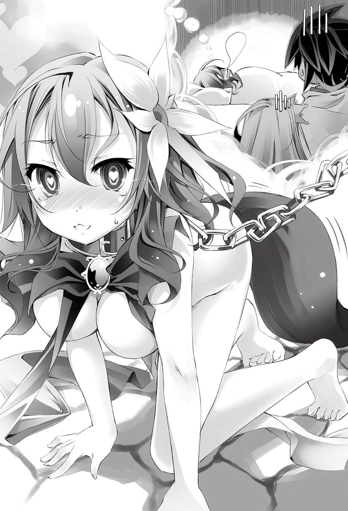

# Threefold repetition

> 来源：https://www.linovelib.com/novel/9/2125.html

——天大的事件，大概都起源于些微小事。

这次也不例外，依然是肇因于微不足道的小事。

这件事就是起源于某两位不工作的国王，与被迫帮他们处理事务的少女，双方的互相抱怨。

——史蒂芙真是笨蛋啊。

——你们两个废人没资格说我。

总而言之，真的就只是这么一丁点儿的小事。

而这样的小事，却发展成为长达五天，『就某种意义上算是大事件』的开端。

————…………

第三天——深夜

艾尔奇亚王国转变为艾尔奇亚『联邦』，如今是制度改革中的国家。

城内响起一道不像是夜深人静时分该有的呐喊。

「为什么——为什么赢不了啊啊啊啊啊！！」

被称为『笨蛋』的红发少女俯卧在桌上，泪湿了地板。

她是史蒂芬妮・多拉——被完全不帮忙处理政事的两名国王授予宰相这个好听的职位，硬是塞给她一堆麻烦的工作；而那一声呐喊，就是出自这位可怜的少女。

「你问我为什么，我也不知道……？」

「……是啊……？」

另一方面，被她称为『废人』，半睁着双眼看着她的则是两位国王。

空——上衣写着『I❤人类』的字样，一名黑发黑眼的青年。

白——仿佛哥哥膝上是她的专属座位般，有一头白色长发与红色眼眸——头上套着内裤的少女。

地上散落着无数游戏。那是史蒂芙为了证明自己不是笨蛋，这三天内勇敢向两名国王——人类种最强的游戏玩家『 空白』挑战后败退的痕迹。

停顿一拍后，史蒂芙非常意外地大叫，可是看到史蒂芙的反应——

史蒂芙不禁对空他们原本所在世界的技术感到害怕，然而空却苦笑着摇了摇头。

头上套着史蒂芙的内裤，原本在读书的白，口中小声地说道。

「只要把脸遮住就好了，完毕。」

————————

史蒂芙打断空的话，红着脸坚持否定。

「尽管来吧！」

「…………是啊，没有错，空就是这种人呢……」

「就、就算退一百步——不，退一万步来说，假设真如空所说！」

「虽然不知为何人类种以外的种族也会有微表情，不过在我们原本的世界，甚至还利用微表情，开发出视觉性的测谎器。这就是所谓的——『眼睛比口更善于言辞』。」

「我是可以教你，不过——很难哦？」

「在游戏时，摆出扑克脸有多重要，你应该已经知道了吧？」

那个微表情代表的意思就是——

空不禁感到踌躇，可是看到史蒂芙那道询问用意的眼神，空只好搔着头向她说明：

——没错，史蒂芙是为了胜过空。

「『吃惊』——为什么被发现了？原来史蒂芙有那种嗜好——」

————

虽然有点迟了，不过史蒂芙现在才想到，要看出0.25秒的表情——她不觉得自己办得到。

而且每当战败之后，她的衣服就会被掀起来，如今赌注之一的内裤则套在白的头上。

「……如何？还要继续吗？」

史蒂芙表情一变，立刻开心地站了起来。

「也就是说，只要看表情就能像兽人种那样看穿谎言了吗！？」

「……不、不用了……」

可是不管比了多少次，史蒂芙依然不是对手。

然后史蒂芙在内心回答——如果是空的话，一定会回答『好玩得不得了』。

「这次则是『喜悦』与『兴奋』……丝毫没有愤怒的迹象……真的假的啊，史蒂芙。」

——尽管嘴上这么说，空却在内心苦笑。

空话一说完，非常突然地对史蒂芙提出一个『问题』。

「……欸、唔哇，真的假的？」

「那、那不就是……实质上的读心术了吗！？」

白仿佛在主张自己和空玩八年的游戏不是玩假的。

如果是真的话，这个技能无论如何都要学会——史蒂芙心里这么想，但是——

判断那是未知的词语和概念的瞬间。

「……用生气的口气重复说两次……史蒂芙……那是……『被说中心事』的证据……」

「没有那么万能……从『微表情』只能看出感情，比如说——」

尽管真的为时已晚，但是史蒂芙或许还是无法放弃吧，她用求救的眼神看着空，空则是露出苦笑。

史蒂芙咏唱魔法的咒语——『无关紧要』，无视白说的话，继续追问空。

「我说过了吧？微表情能看出的只有感情，而且是短暂且无意识的感情。至于为何会出现那样的感情，有时本人史蒂芙也没有自觉，所以——重要的是像刚才那样观察『后续的行动』。」

「在我们原本的世界有一位名叫保罗・艾克曼的心理学家。」

空不由得心想——这是自他懂事以后就了然于胸的事情，事到如今还需要伟大的学者来研究吗？

————

也就是说，空所提的问题，其实是为了观察史蒂芙对突来的问题流露出的『微表情』。

史蒂芙扬言要全部抄下记住，空则是苦笑一声，一边跟膝上的白玩游戏，一边说出他所想到的一切。

没错，很简单。

她表示那已经是魔法——至少也是属于兽人种超感觉的领域了吧。

空重新向她确认，史蒂芙眉头一皱，点了点头。

摆出扑克脸没用——那么该怎么做才好，史蒂芙的眼神这么问。

发问的空反而感到吃惊，他语带困惑地继续说道：

史蒂芙并不打算肯定空所说的话，不过如果他说的是真的——

看到她那个样子，空似乎很愉快，他不借助平板电脑，直接靠着记忆说道：

「首先是『喜悦』——也就是说，笑容只要持续四秒以上，那就是『假笑』。」

听到空这么说，坐在空膝上的白则是仰望哥哥，叹了一口气。

「绝、对！不是那样啊啊啊！！」

看到光是喜悦一项感情就已经抄满笔记本，空问是否还要继续，史蒂芙则是翻着白眼回答。

「史蒂芙脸上最初浮现的表情是——『害羞』。如果只是这样，还可以当成是对羞耻问题的反应；但是你在大叫之前，并没有皱眉表示『愤怒』，反而眉毛扬起。」

「据他所说，『表情』这种东西无关生长环境与文化，无论怎么隐藏，脸上还是会在一瞬之间，无意识地透露出某种『感情』——时间大概不到0.25秒——那就称之为『微表情』。」

史蒂芙内心问道——把人捧上天再推落深谷，有那么好玩吗？

「是啊，没错，然后——遮住了脸，这次声音和动作就会被集中观察了♪」

为了要求空收回笨蛋一词，并且帮她工作，史蒂芙已经连续三天过着晚上到空与白的房间比游戏，日出后回去继续工作的日子。

史蒂芙感到不合理，伤心得啜泣，空似乎感到于心不忍，于是说道：

——老实告诉她「我把我的招数告诉你，你要加油」，这样不就好了？

原本在抄笔记的史蒂芙抬起头叫道。

但是史蒂芙自是无从得知空内心的想法，看到史蒂芙努力抄笔记的模样，空摇摇头笑了。

史蒂芙抬起原本趴在桌上哭泣的脸，立刻取出笔记本。

「但是扑克脸其实是有极限的，所以摆了也没用。」

——不，正确来说，她并不是向『 空白』挑战。

「相反地，即使是瞬间性的笑容，如果眼角没有垂下，那个笑容就不是发自真心。发自真心的笑容，脸颊会吊起，下眼皮会上升；不过如果只有一边的话，那就是『轻蔑』——也就是变成『嘲笑』了。但是只靠微表情，看不出是对谁嘲笑，如果也出现了『厌恶』的特征，那也有可能是对自己的厌恶。所以——」

「——实践虽然困难，不过对抗的方法却很简单哦。」

「那是办不到的。」

「能够看出的『只有感情』……所以这个技术是观察对提问的瞬间反应——」

「太奇怪了！我既模仿空的使诈，也学他预测心理了，为什么就是赢不了呢！？」

——确实，对手如果是『 空白』，她完全不觉得自己能获胜。

然而，结果却是——连战连败。

「——什么？」

「我可不是M哦！我可不是M哦！比如说就是像刚才那样看我的反应吗？」

不过史蒂芙趴在桌上，转过头看着空，率直地听空说话。

虽然不及哥哥敏锐，不过看到史蒂芙明显易懂的反应，就连白也不禁冷眼说道：

「在我们原本世界的人类、这个世界的人类种，还有不知为何天翼种和兽人种也一样，他们全部都有——『微表情』。」

可是史蒂芙显露的微表情——应该告诉她吗？

「我的事无关紧要啦！那么要怎么做呢？空！」

而是挑战称呼自己为笨蛋的其中一人——空，然后地上那些仍然是她连续大败的痕迹。

听到空一口否定，史蒂芙失望地垂下肩膀。空让白坐在膝上，继续说道：

空流畅地，毫无保留地，对史蒂芙说明自己的『特技』之一。

史蒂芙原本又要大叫，不过她忍了下来，为了追求更多的情报，她闭上嘴。

「『微表情』……吗？」

但是空则是口中发出「唔哇……」，吃惊地退了一步。

「原、原来如此！那样马上就可以实践了！！」

没错——她低下头，咬着唇——露出『害羞』的表情。

「欸——？」

这么基本的事，我再怎样也不会不知道——史蒂芙正想这么回答，却被空打断了。

「——什、什么～～！？我怎么可能会高兴！」

「……史蒂芙是……真正的……M吗？」

「史蒂芙，你的内裤被脱，其实你心里很高兴吧？」

「……嗯，好了啦……我就稍微教你一下吧……因为你实在太弱了。」

史蒂芙再度用功地抄写笔记，一边问道：

不过如果是对付空一个人的话，应该多少会有一点胜算才对。

但是空却露出开朗无比，却反而更显得不怀好意的笑容。

史蒂芙思考——比如可以一直低着头。

史蒂芙冷眼瞪视着空，不过空意外地仔细地继续解说。

「可是声音和动作都不像『微表情』那样只出现在一瞬之间。姑且不论能够听见血流声与心跳声的兽人种，如果对手是人类的话，只要注意微表情，也可以利用演戏来误导对手的判断。」

——史蒂芙内心露出深深的笑容。

也就是说，对手如果是人类种的空——史蒂芙虽然这么想，却宛如被空看穿了一般。

不，事实上空就是用他说的手段，完全看穿对手之后，讽刺地笑着说道：

「——但是，当然对手也可以利用这一点。虽然对史蒂芙不好意思，不过这一招对我不管用哦！」

「呜呜……」

没错，史蒂芙刚才的思考就完全被看穿了，所以她完全无法反驳。

再说教她先前这一大串的不是别人，就是空自己。

这是空的特技，熟练度有压倒性的差异，如果要用这一招和空较劲，那就只能看空的表现了。

史蒂芙想到这里，失望地垂下头去，然而——

「而且……」

空脸上出现阴郁的表情，然后带着自虐的笑容提出警告。

「你别想说平常就刻意训练，因为这并不是那么好的特技。」

「…………」

白领会到空话中的真意和沉重，她在空的膝上默默地低下头。

因为那意味着对人性会看得太清楚，不过——

「……什么？为什么？」

史蒂芙是标准的老实人，映在她蓝色眼眸中的青年——空。

他对他自己浮现『厌恶』的感情，抚摸着白，露出羡慕的笑容。

仅仅只是一句话，白就防堵了『空的企图』。

「欸，啊，好。」

然后——

白冷眼断定空在说谎。

「——怎么会！为什么——为什么你会知道！？」

因为如果是真正的笨蛋，行动就会没有脉络，反而难以预测。

「真、的、呢！两位没资格说那种话！给我工作呀！」

史蒂芙甚至开始认真怀疑空是否使用魔法，然而空却若无其事地回答道：

长年与空在一起的白，看得出空问这句话时的表情代表什么意思。

所以她也很清楚要怎么应付空——

空的提问就只是在『引导』史蒂芙。

——没错，不会有回报，因为——

仿佛打从一开始，空就没有打算要听她说一般，空拉着史蒂芙的手，缓慢地上下左右移动了一遍，好像在确认什么。

「白啊！不要随便说出那种话！哥哥会上吊哦！？」

不然空只要列举出各个场所，迟早总是会猜中，而且监视也是必要的吧。

第四天——同样是深夜

「——什、什么？」

「那是当然的吧……平常史蒂芙都不敲门，直接踢开门进入，唯有今天是以最低限度的动作进入房间……我自然会认为，你身上一定藏了什么东西，担心乱动会掉下来吧。」

「……算了，那么史蒂芙，把手伸出来。」

史蒂芙充满自信，动作优雅地说道。空与白则是半睁着双眼问道：

不管再怎么准备，如果是诈术的陷阱，那还是有可能会输。

「……哥……性格……恶劣……」

「不行，如果你把伊纲或吉普莉尔小姐带来，她们会凭借气味或精灵反应找到，那样游戏就不成立了。这纯粹是我和空在比赛游戏呀！」

史蒂芙似乎佩服得瞠目结舌，不过——

「我们现在要玩一个好玩的游戏，开始啰？」

由于实在太出乎意料，史蒂芙不禁大叫，然而空则是若无其事地点头肯定。

与气势十足的声音相反，空的脸上是泫然欲泣的表情。

「这样啊……啊～那就没办法了……唉呀，其实我也很不愿意这么做啊～」

也就是那个陷阱——『不是拿来使用的陷阱』。

那是当然的，因为——

「你和我一个人比的游戏是吧……我不能只是『随口猜』在哪里对吧？」

「————」

空低着头，眼神和表情宛如呐喊似地，如实表现出他的想法。

然后，他缓缓地犹豫了一下——

确认上头写有『这个』的字样后，空笑着说：

是啊，当然嘛，那么——这就不能怪我了吧？没错吧？

空则是整个人僵住，脸上浮现万念具灰的绝望表情。

史蒂芙无法从茫然自失的状态下振作，听到空的声音，她立刻激动地叫道：

「那么史蒂芙，因为白禁止我触摸，我不能自己拿出来，实在是万分遗憾。」

「没错，被引导到不希望我去的方向，不管你再怎么意识——不，愈是意识，反而愈会出力反抗。也就是说，听到我要你说出你不想被找到的东西藏在何处，你的身体就会不自觉地抗拒某个方向。这是廉价的『心理陷阱』，连把戏也算不上。」

——哥哥是明知史蒂芙会如何回答，却还故意问。

正因为如此，她的思考才容易预测。

「白！这是史蒂芙提出的规则，是与我一对一比赛的游戏！这是不得已的状况！还是说白希望哥哥输掉吗！？嗯～～！？」

「史蒂芙，如果有人要求你带他到你的内衣柜去，你会怎么做？」

「——什、什么～！？」

——当然不行吗？是啊，那是当然的吧。

——史蒂芙还没有发觉，对于接下来的发展——空与白几乎都预料到了。

「我、我当然会拒————啊……」

「……对不起……我说得太过分了……可是哥……」

就算你叫我告诉你，我也不可能这么做——史蒂芙正想这么说，空却直接无视她。

——是啊，我已经知道那是什么东西，藏在哪里了，我好想说出来啊啊啊。

「……哥在说谎。」

象征疲劳的黑眼圈比昨天更严重，对于她的活力，实在应该表达敬意。

不过绝望也只是一瞬之间，尽管情绪多少有点低落，但是灰色的——不，桃色的脑细胞处于活化状态的空，靠着可怕的应变能力，改变了主意。

史蒂芙自信满满地这么声明，空则是默默低下头。

「……哥……不准混水摸鱼……」

「……不管使用什么手段，只要找到就算获胜，这样可以吗？」

——那么事情就简单了。

——空与白原本就是夜猫子，通宵熬夜对他们而言是家常便饭，因为他们是夜行性动物，所以不会有问题。可是史蒂芙白天应该还要为宰相的工作忙碌。

平常都是直接踢开门进入的史蒂芙，今天却是确实地敲门，一副游刃有余的样子——没错，史蒂芙就像确信自己会胜利似地，再度来到空与白的房间。

如果就算使用了陷阱，却还能确信不会透露出微表情，那么意思就很单纯了。

……但是很可悲，她的辛苦不会获得回报。

「当然不行！你可以自由去寻找，不过为了不让你拜托别人，我会监视你哦！」

然后，史蒂芙的回答也如同空的预测，从空的笑容很明显看得出他的目的。

他的脸朝向固定位置——也就是看着坐在膝上的白。

史蒂芙高声喊出今天的游戏内容。

「……不过如果是史蒂芙，应该就不用担心吧。好了——接下来要玩什么？」

没错，史蒂芙绝不是笨蛋，她的头脑相当好。

「……哥一开始就知道……游戏的内容……也知道……东西在哪里……」

「——喂！？」

白真心向空道歉，但是既然明白哥哥的目的，她就不能退让——

之后，游戏一直持续到史蒂芙衣服被剥光，只剩下一条被单，然后旭日东升……

「……我说啊，虽然我们没有资格说这种话。」

「今天就是你们受到报应的日子，空，准备好要工作了吗？」

白考虑立刻就让游戏结束，不过空以眼神制止她。

「把你内裤里的东西拿出来。」

「这次的游戏很简单。」

史蒂芙哑然无语，除此之外，心中没有涌现任何感情和话语。史蒂芙依照空所说，取出藏在内裤之中——写有『这个』的牌子……也就是『目标物』。

「——哦～『某个东西』啊……不给任何提示吗？」

然而——白毕竟与哥哥共度了八年的岁月。

「好了，我找到了，这样我就算是胜利了吧？」

——空得意地扬起嘴角。

拉着史蒂芙的手，引导至史蒂芙的『裙子里』。

不过空靠着钢铁般的意志力，压抑想要说出口的冲动——然后提出更有趣的玩法。

空轻轻握住她的手，露出绝佳的笑容说道。

「我在上面写下『这个』两字，我不会使用卑鄙手段，就算你找到，我也不会不承认。」

虽然接下来的发展没有当初预定的好处——

史蒂芙只能张着嘴喘气，而空不管她，再度回到固定的位置。

「史蒂芙——告诉我你将东西藏在哪里。」

——看到史蒂芙似乎想通了，空不禁在内心佩服。

「只要找到我藏在城内的『某个东西』，就是空获胜！」

空脸上笑嘻嘻地，故意装模作样，一副无可奈何的模样站了起来。白看了只是说了一句。

空说着伸出手，史蒂芙尽管诧异，仍是把手放在空的手上。

空暗自窃笑，轻轻将膝上的白挪开。

然后她晚上会来找空与白——比游戏到早上，而且最近一连几天都是如此。

空似乎打从心底感到遗憾，他大大地叹一口气，非常肯定地断言。

「……史蒂芙……你都什么时候睡觉……？」

「再加上，我昨天才解释过关于微表情的知识，你有备而来，脸上的表情充满胜利的自信，然而却不遮住脸。也就是说，你确信就算到了可能会输的关头，你也不会显露出微表情。」

也就是让白坐在膝上，然后继续说道：

那么那个陷阱是为了什么呢？

「『寻宝游戏本身就是陷阱』——只要本人带在身上，无论找哪里，你的表情都不会透露讯息。」

没错，假设她就算真的在城里藏了东西吧。

可是昨天才讲过微表情的知识，史蒂芙应该也会预料，只要接近宝物所在位置，她的表情就会透露讯息。

为了监视，她必须同行，东西又是藏在不管找哪里都可以面不改色的地方。

那样一来，最好的藏匿地点就是自己带在身上，再加上——

「不，史蒂芙，这次我得真心承认，你这个点子真的很好。虽说是带在自己身上，你却仍不敢大意！你更考虑到我这个十八年处男的习性，还有白也在场这一点，把东西藏在我就算猜到也不能随意调查的地方！你真的很努力……但是！」

空打从心底给予史蒂芙赞赏，不过——

「——你的努力还不够。」

进入房间的瞬间就已经输了——这个事实令史蒂芙跪倒在地。

空一脸得意的表情，不过白再度说道：

「……哥，又说谎了……」

「——欸？」

除此之外还有怎样的谎言呢？史蒂芙一副失了魂的表情，白不理会她，继续说道：

「……问题……不在那里……」

「是啊，因为我中途改变主意了嘛，因为史蒂芙——『希望我找到』。」

「欸？那是什么意思——」

——没错，空与白第一眼就看出史蒂芙把『宝物』藏在身上。

但是具体藏在哪里则无从得知。

空本想以此为借口，在健全的范围内摸遍她的身体——这就是空当初的计划。

————

仿佛衣服对她只是妨碍一般，她身上只穿着内衣。

「如果是内裤之中，一般来说怎样都会抵抗吧，但是你却没有抵抗，这就代表——」

这个怀疑令史蒂芙的脚步更加蹒跚——

——正如空所说，如果无意识会背离意识，显现在表情上。

「史蒂公，你一脸幽灵似的表情在做什么，得斯？」

第五天——傍晚

自己口口声声说空与白是异常，是废人，但有可能自己才是最大的变态。

伊纲被某种使命感燃烧着，深深地点头答应。

空没有继续说下去，只是露出得意的笑容，注视着史蒂芙奔跑离去的方向——

这时有人发出呐喊，踢开门侵入。

空只是胡说八道，自己并不是变态。

「……史、史蒂公！不、不是的，得斯！史蒂公不是『变态』，得——」

「空是————变态！！」

可是不知为何——可能是身为兽人种的直觉，又或者是伊纲的第六感。

「第一种，这个游戏就是要找出你自信绝不会被找到的牌子。在连微表情都会被反过来利用的这个游戏中，你想说如果你会输，你就要确认我是使用何种方法。」

那个人——一言以蔽之就是变态。

空与白依然是连夜行性动物也自叹不如的夜猫子，两人在房间里玩着游戏。

听到空愉快地笑着这么说，白则是有点不服气地说道：

但是或许仍没打算对话吧，史蒂芙（推定）指着空叫道：

就在史蒂芙摇摇晃晃地走着的时候，前任驻艾尔奇亚东部联合大使叫住她。

「喝呀啊啊啊啊啊啊啊！！」

五天没睡，再加上疲劳，更别说是被十一岁的小孩称为变态了。

「不、不是——不是的啊啊啊啊啊啊啊！」

「——————咦？」

「——我不是变态。」

这里的变态并不是生物学上的变态，而是完全的变态。

「……史蒂芙，你太堕落了……」

瞬间——史蒂芙的身体瘫软下来。

可是史蒂芙拜托自己告诉她是真话还是谎话，所以——

伊纲专注精神，提升至将近『血坏』的敏锐度，不放过史蒂芙身上的一切情报。

————————————呵，呵呵，呵呵呵呵呵。

由于她的装扮实在太惊人，空和白都全身僵硬了。空勉强发出颤抖的声音，尊称她为小姐，以确认她的身份。

同一日（第五天）————深夜

「我终于清醒了！」

——伊纲也不明白为什么。

可以尽情享用鱼料理——这句话本来应该会让她流口水。

「……有谎话的味道，得斯。」

史蒂芙无神的双眼注视着伊纲，就像是看到天使——或者是幻影。

「……我该不会是……变态吧？」

「是啊，连我与白的关系都算计在内——她进步很多了呢。」

「……史蒂公很烦恼，如果是伊纲能做到的事，那就尽管开口，得斯。」

看到伊纲的样子。

或许是从史蒂芙两眼无神的样子感觉出不对劲了吧。

她感觉那句话——简直就像是——『遗言』。

如果是伊纲的话，如果是这个率直又聪明的孩子所说的话，应该就能让她忘记空和白说的话——！

「……不过，还是白……比较强……」

她头上套着内裤，遮住从额头至口部的范围——说明白一点，就像是变〇假面一样。

「有两种可能性！」

「怎、怎么了……？」

「嗯，我是没有理由否定啦。」

——空接着弯下一根手指继续说道：

她就是被白说的话刺痛心头，尚未重新振作的史蒂芬妮・多拉。

艾尔奇亚王城内，有一个如游魂般徘徊的人影。

「……哥，今天的史蒂芙……相当厉害哦？」

而且头上更戴着墨镜遮住眼睛，那身装扮不称作变态，又要称为什么呢？

被白告诫之后，空只好万分不情愿地改变计划。

史蒂芙感觉身体轻盈，忍不住跳着舞向伊纲道谢。

然而或许是没有打算与两人交谈吧，史蒂芙（暂定）激昂地高声宣布。

伊纲坦白地回应她的要求。

那么只要借由兽人种的五感，或许就能够看穿自己的谎言，得知自己无意识的感情。

「我说史蒂芙，刚才那个心理陷阱，是只要移向你不希望我找的地方，你的手就会自然出力的陷阱。」

「所以我也有点犹豫，为何即使移向下半身仍没有抵抗呢？」

「那个时候，其实无论移向哪个方向，你的手都『没有抵抗』哦。」

「……咦？请问——难道你是史蒂芙……小姐？」

「……是、是啊，说得没错，说得没错啊，我明白了……谢谢你，伊纲♪我感觉纠缠我的东西好像脱落了呢～♪」

然后坐在空膝上的白，半睁着眼睛，直接了当地说了一句话。

不过伊纲的吐槽，似乎已无法传入她的耳中。

史蒂芙满脸通红，只能哭喊着奔出房间。

「伊纲，可以请你告诉我，我接下来说的话是谎话还是真话吗？」

「真的很感谢你～❤为了答谢你，晚点我会请你吃鱼料理，让你尽情享用哦～❤」

也就是——

————…………呵呵。

「我知道啦，妹妹。不过如果她能够不像我这样扭曲，又能够超越我的话——」

——伊纲不知道『变态』这个词是什么意思。

…………另一方面，目送她离去的白则说道：

史蒂芙下定决心开口了。

…………

但是她直觉地犹豫不知是否该坦白说出。

感觉自己做了无可挽回的事，伊纲眼中浮现大颗泪珠，急忙收回自己的发言，甚至不惜撒自己最讨厌的谎。史蒂芙却踩着轻快的脚步，宛如什么也听不见似地，走入城堡里……然后……

————————

「啊～伊纲，呵呵呵，对了，伊纲，你来得正好～」

……………………

她是初濑伊纲，外表像是十岁以下，有着黑发与耳廓狐耳朵的兽人种女童。

空格外兴奋地竖起两根手指叫道。

「是、是吗，得斯？总觉得你反而被奇怪的东西附身了，得——」

——好了，这种情况该如何解释？

从声音听来，空勉强认出她应该就是史蒂芙，他不禁露出僵硬的表情。

「不……不好意思，就算再怎么往好的方向解释，你看起来也只像是睡昏头——」

「然后——白！！」

史蒂芙（疑惑）再度伸出的手甚至伴随着破风声，这次她则是指着白叫道：

「有其兄必有其妹！白也是——早熟的变态！！」

「……跟哥一样的话……白完全OK……」

白也同样表示没有什么理由否定，面不改色地承认。

史蒂芙（疑问）也料到他们的反应，似乎更坚定了自己（神秘的）确信，她亢奋地点了点头。

「也就是说！！成为高强游戏玩家的条件，就是要变态啊啊啊！！」

我终于领悟了真理。

虽然因为被内裤和墨镜遮住，无法窥见她的表情，不过她的声音中有那样的含意。

「……史蒂芙，你累了。我们会反省，我们也会工作，你就睡——」

「最、后、一、局啊啊啊啊！」

史蒂芙似乎什么也听不到了，她的脑海里只有无数的记忆闪过。

全都是关于这个男人，空的，这个变态的记忆。

把至今的行动全部做个总结，这次史蒂芙要赌的只有一个——！

「我要赌的就是——空！如果我获胜——你就要爱上我！」

她伸手一指，锐利地划破空气。

只留下空虚的回响。

接着迎来如深海般的寂静。

两对比宇宙更慈悲的眼神，温暖地注视着史蒂芙。

「……史蒂芙，你就睡吧。我们真的反省了，我们也没有打算把你逼到这种地步。」

「嗯？」

——一天？

「……不过我们总算……处理完了。史蒂芙，你再睡一会儿……」

空安慰白，看着眼前的史蒂芙（变态）。

「……喂，白，怎么办？这家伙借由惊人的方法，真的到达真理了。」

——睡？

另一方面，空则是移开视线，搔着头说道：

「——是、是吗……」

「我、我不是笨蛋对吧？」

「史蒂芙，史蒂芙～听见了吗～？」

空舔了舔嘴唇，冒出冷汗——却愉快地笑了。

——好了，十八岁处男的空。

或许是史蒂芙（完全变态）太过可怕吧，白恳求她继续睡。

♛

「你现在就多休息，身体恢复之后……对了，好久没吃你做的甜点，你就做给我们吃吧。」

「我知道你在担心什么，没事的。史蒂芙平常处理的工作量，只靠我和白不可能做得来……所以我请老爷爷伊野和伊纲、吉普莉尔，甚至巫女小姐来帮忙。」

不管怎样——

「来吧——开始游戏了哦。」

史蒂芙醒来之后，迎接她的是空与白的面容。

史蒂芙并没有发觉，白的眼中含有些许的畏惧。

——没错。

史蒂芙用毯子遮住脸，感觉就像是做了恶梦一样，不过——无关她的思考，她的意识逐渐进入梦乡。

看到史蒂芙说这句话时大胆无惧的眼神，空可以断言一件事。

「……史蒂芙，平常……多谢你……」

「如果只有我和白倒也罢了，连吉普莉尔也在，却仍有我们做不到的工作，史蒂芙能处理这些工作真是不简单。若不是有老爷爷帮忙，我们也无计可施，因为政治是我们最不擅长的领域啊。」

「空、空……」

「可、可是——」

「我要玩游戏。赌注就照你所说，不用变更，那么游戏内容呢？」

「早安，你醒了啊。」

把政务交给这两人处理的话，他们也很可能会捅出大篓子——

「……好吧，我来当你的对手。史蒂芙，是我把你变成这样的，我会负起责任。」

那就是——『觉悟』——就是『解放』——！

「史蒂芙的工作有我们接手……刚刚才处理完毕。」

——我睡着了！？

「………………」

「——不愧是史蒂芙，你现在就休息吧。你还不能倒下，不然我们会很困扰。」

「虽然我完全不明白是怎么计算的，不过那可就棘手了呢……」

他全身只散发出『认真』的气息。

「是啊，你是值得尊敬的大笨蛋，不是笨蛋的话是做不完这么多工作的。」

然而这两人却轻而易举地做完她的工作，自己果然是——

空与白为了做完史蒂芙三天的工作进度，分秒不停地工作，从他们的表情看得出浓厚的疲惫之色。

「不，你就是笨蛋。」

也就是说——面对头脑比自己好的敌人，自己究竟能奋战到什么地步呢？

「不是的，白，这是哥哥的责任，白没有错。」

——『可惜』。

「………………咦？奇怪？我……」

空与白工作了——？不，他们做了史蒂芙的工作——！？

「……哥，现在的史蒂芙很强……单纯计算是八倍……八人份的史蒂芙……」

史蒂芙掀开毯子，准备起床，但是空温柔地制止她，以平静的语气回答。

这叫我怎么放心——史蒂芙顿时脸色苍白。

「——！？我、我睡了几小时了！？」

听他们这么说，史蒂芙用毯子盖住头，战战兢兢地问道：

「空、空？白？咦？我为什么会睡在这里——」

——空的眼中没有平常的余裕，宛如是在应战白一样。

史蒂芙确信就是如此，而空仿佛看透了史蒂芙的想法，他不禁将手掌覆在脸上。

如果能胜过这两人，正常的精神——只是阻碍。

我终于明白了——史蒂芙借着（似乎）清晰的思绪，在内心如此断定。

——另一方面，确认史蒂芙已经入睡之后……

「……可是，史蒂芙……坏掉了……是白的错吗……？」

史蒂芙学会了自己大部分的技术和心理战术，并且正确地解放了。

「什么事什么事？要签名吗？要玩游戏吗？还是要我——」

空说完之后站了起来，白则是少见地表现出畏怯的样子，抓着空的衣服对他说道：

在史蒂芙沉睡的这一整天。

「……史蒂芙……你好好地休息……清醒一点……好吗？」

——如果他们懂政治，在原本的世界就不会那么辛苦了。

…………

不知为何，史蒂芙听完空那样说，她感觉到的是——沮丧。

「……史蒂芙，欢迎回来……」

「如果我输了——我就把我的一切交给你们两人！！」

说我笨蛋？尽管叫吧！

为了胜过空——不，胜过『 空白』，自己缺少某样要素。

史蒂芙（严重损坏）扭动着身体这么说道，空则是在内心抱头想着：

♛

白似乎是真的感到了罪恶感，她攀在空的身上，泪眼汪汪地说道。

不过空却打断了她的思绪。

史蒂芙完全正确，她终于『正确地解放』了。

环顾四周，那里是空与白的床——更正，是棉被。

空在内心这么说道，白则是接着说道：

空宛如忏悔一般，白则是泪眼汪汪地恳求史蒂芙，但是史蒂芙依然无视。

「至少今天、明天和后天预定的工作都做完了，你就多睡一会儿吧。」

然而，空也只能放手一搏，他做好觉悟，重新面向眼前的变态。

「……（点头点头）」

然而如果因此而精神异常，那就得不偿失了吧。

「你不是睡着，你是过劳昏倒了。放心吧，你只睡了一天。」

「……啊……」

「——咦？」

「该怎么说呢……抱歉让你包办我们不擅长的工作，但是老实说，要构筑一个多种族联邦，史蒂芙——只有你做得到。实际上，我本来以为我和白、吉普莉尔、老爷爷、伊纲再加上巫女小姐，合我们全部人之力，应该可以提前做完一周的进度，让你有时间休假，可是——三天就是我们的极限了……所以说……」

「呵呵呵……怎么了？害怕了吗？今天的我和过去不同！没错，今天的我是新・史蒂芬妮・多拉！如果是现在，我甚至可以飞上天！呵呵，想找我签名就趁现在哦？」

————…………

无数的会议和政务，整整一天都开天窗——正当史蒂芙头脑混乱的时候，空与白回答她。

——如果不和白联手，史蒂芙一定是过去仅次于白的最强敌人。

她需要的是近乎疯狂的专注力与精神力，除此之外的一切都只是——阻碍。

然后事到如今史蒂芙才发觉，她自信唯有政治不会输给任何人。

说我变态？有何不可！

「……好的……」

「……史蒂芙的甜点……很美味……」

「……总算顺利掩饰过去了。」

「……嗯……好险……」

空在与史蒂芙（完全变态）的游戏中辛苦取得胜利，得到史蒂芙的一切。

然后，空下的命令很单纯。

——『在你不是因为睡眠不足或精神崩溃，而是真正理解并且解放之前，忘记今天的事吧。』

下了这道命令后，空便把权利全部还给史蒂芙，叫她睡觉，只是如此而已。

虽然只是如此而已，不过——

「……哥……亏你能赢呢……」

足以令白说出这样的话，可见得空是陷入多么可怕的苦战。

史蒂芙与白是完全不同的强，即便是空也是第一次经验宛如与自己交战的感觉。

因此，空坦率地承认。

「幸好史蒂芙睡眠不足，如果那个史蒂芙的身体处于绝佳状况，那么不是『 空白』就赢不了了。」

空虽然嘴里这么说，不过他似乎很愉快，白不满地鼓起脸颊。

然而，白也不能否定，那时的史蒂芙就算说得保守一点，也是精神崩坏了。本来游戏的决定权是属于被挑战的一方，但空却答应史蒂芙所提出的游戏。不过，就算撇去那些因素，即便是旁人也看得出史蒂芙与哥哥的对战几乎是『不分上下』。

「如果这家伙在正常状况下达到那种境地……那就有趣了呢。」

空愉快地说道，但是白却表示：

「……到那个时候……就以『 空白』的身份……应战……」

「我认为再由我一个人挑战也是很好的做法，如果她能用与我相同的手段超越我——」

然后空对白露出得意的笑容说道：

「——那我就再超越她，然后这次我或许就能胜过白了哦？」

「…………」

「……唔呣唔呣……欸……光着身子散步吗……？那是……啊，不……因、因为是盟约……这也是没办法的事吧……唔呣唔呣……啊啊大家都在看我……」

就在事情即将完美落幕的时候，室内听见史蒂芙的梦话。

——说不定那个形态才是史蒂芙的本性吧。

「…………」

空像是在挑衅一般，白也露出苦笑。

这个想法在空与白的脑中一闪而过。

不过为了史蒂芙的名誉着想，两人决定姑且当作没听见。

