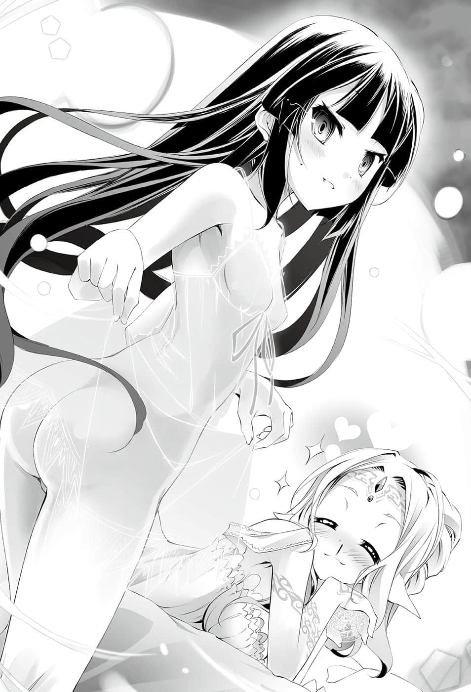

# 一对 or 红心同花顺

> 来源：https://www.linovelib.com/novel/9/2126.html

「………啊………好漂亮………」

爱尔文・加尔得，克莱布州尼尔纳郊外的海边。

黑发少女拿起一枚贝壳在手上，露出空虚的眼神说道。

克拉米・杰尔，十八岁，她是侍奉于森精种的名家尼尔巴连家的——奴隶。

这一天，她被派往某个与尼尔巴连家有生意往来的贸易港商家办事。

回程时经过沙滩，她发现一样耀眼的东西，随手捡了起来。

那是一个手掌大小的贝壳，擦掉沙子，对着阳光一看，贝壳立刻闪耀出彩虹的光芒。

克拉米不自觉地将贝壳抱在胸前，往周围张望。

——『十条盟约』禁止各种『掠夺』。

也就是说，只要有『拥有者』，就算是路边的一颗石头，也没有人可以『盗取』。

克拉米抱着贝壳，战战兢兢地试着后退几步。

——没有发生『被盟约取消』的现象。

也就是说，这枚贝壳是无主之物。

那么就可以把它收为己有——正常来说是这样。

「如果是正常人的情况啦……」

如果是奴隶的情况，想要『拥有』还需要一道手续。

克拉米露出含着自嘲的笑容，抱着贝壳离开沙滩。

————…………

「——主人，我找到这样一枚贝壳。」

克拉米向主人下跪报告。

「我绝对不要因为我的关系，给我唯一的好友带来麻烦……拜托你——」

♟

所以菲尔才刻意说是垃圾——菲尔不禁在内心悔恨起来。

森精种跟会说话的猴子要好，这种事只会成为丑闻。

因此，菲尔最多只能带着过意不去的表情，用那种婉转的方式说话。

这一点从菲尔是代理议员——父亲亡故之后，职位由女儿世袭，就可以看得出来了。

她用看着垃圾的眼神说完后，接着便带着侍女们离开了。

临去之际，主人回头看了一眼。

「那样会给菲尔带来麻烦呀！我绝对不认同那种做法！」

当天深夜。

——这个国家腐败了。

就只有这些——房内少了某个应该存在的东西。

「——被人抢走丢掉了……对吧？」

对于自从曾祖父那一代就是奴隶的克拉米而言，那样就已经非常足够了。

「我不要紧的——在这个国家，人类种比狗还不——」

——考虑到自己的家人从曾祖父那一代就被当成奴隶对待，这样的关系还真是奇怪。

「啊，等、等一下，菲，我马上——」

可是他的任期也只剩下——三年零几个月。

这样的国家最好是崩解一次。

「——白天的贝壳怎么了？」

就连上下议院，最终也只是『元老院』的下属，构成『元老院』的成员则是更高贵的名家——也就是废物老人与他们的继承人，就连选举也不需要，完全采取世袭制。

奴隶是主人的所有物，所有物的一切所有物都是属于主人。

但是——眺望着虚空的那对眼眸中，燃烧著有如熔岩般的愤怒。

身为奴隶的克拉米，想要拥有物品就需要主人的许可。若是菲尔准许得太爽快，会被认为是偏袒奴隶，侍女们将会用更阴险的手段对付克拉米。

就因为是森精种，所以可以仗着出身藐视其他种族——藐视他人。

「没有什么不是哦？现在的尼尔巴连家是由我当家，对于伤害我的好友的人，我没有理由再忍耐下去哦～？」

而『元老院』的决定，连包含全权代理者在内的顾问团都不能轻易违抗。

菲尔在侍女们的围绕之下，露出阳光般的笑容，但是——

菲尔紧紧抱住克拉米，阻止她说下去。

「……丢、丢掉了……」

可是菲尔环视这间简朴的房间——如同字面意思，这是一间过于简朴的房间。

菲尔本来是想要将她们从社会上抹杀——不，甚至是以物理的方式抹杀，现在只是将她们解雇，她们反而应该感谢菲尔——至少菲尔是真的这么认为。

——没错，这样一来，『可以自行处分』的手续终于结束。

「我要把她们全部解雇。」

有人站在她这边，就算对外不能表现给别人看，那样也已经足够了。

充斥在菲尔脑中的漆黑思绪，与她脸上温和的笑容形成强烈对比。

「克拉米……」

既然主人说是垃圾，那么贝壳就『不归任何人』所有——就只是垃圾。

没错，克拉米与『普通的奴隶』有点不一样。

而且就连不过是被尼尔巴连家资产吸引来的寄生虫也一样。

只有菲尔总是会在克拉米受苦时，想方设法帮助克拉米。

「那种垃圾不用一一向我报告，你自行处分就好。」

克拉米以强烈的语气劝阻。

从克拉米的反应看来，侍女们大概是说，因为那是垃圾，所以叫她交出来吧。

既然依照『盟约』缔结了这样的契约，奴隶就绝对无法违背这个规则。

奴隶没有『所有权』——不，应该说没有任何『权利』。

克拉米眼角泛泪，向菲尔恳求。

所以克拉米只说出事实，然而颤动的肩膀却说明了一切。

菲尔心想——我再也忍不下去了。

当克拉米悲伤哭泣时，即使无法公开相挺，她仍是会对克拉米伸出援手，扶持着克拉米。

因此菲尔心想——这个国家腐败了，腐败到了极点。

菲尔心想——真是难笑的恶质玩笑。

「克拉米。」

她的主人是拥有一头奶油色长发的森精种——菲尔・尼尔巴连。

对于只是一介奴隶的克拉米，菲尔甚至肯以好友称呼。

不管是上议院还是下议院，选举制度早已名存实亡。

『盟约』的绝对履行效力，甚至不容许他们因剧痛而昏倒，真的会让他们一片一片把指甲全部剥下。

说人类种是奴隶？

身为奴隶的克拉米，无法对身为主人的菲尔说谎。

菲尔造访克拉米位于尼尔巴连府角落的房间。

克拉米的主人菲尔・尼尔巴连——是她的友人。

听说那样的国家还自称是『民主国家』。

而且她们真的把它当成垃圾处置，当场就打碎那枚贝壳了吧。看到克拉米哭红了双眼，很容易想像那样的景象。正如同这间简朴过度的房间所显示，对侍女们而言，她们看不惯克拉米拥有任何东西——即便只是一枚贝壳。

就算亲昵地以友相称，本来克拉米就算憎恨她也不足为奇。

这就是『奴隶』在爱尔文・加尔得的立场。

那样疯狂的事，在这个国家却发生得理所当然。

「菲，拜托你……只要有菲在，我当奴隶也没关系，可是——」

虽然目前『全权代理顾问团』的权力甚至能抑制『元老院』的势力，但是当他们从全权代理的位置退下来的时候——不难想像『元老院』和其他议院会做出什么事。

……如果对方不是菲尔的话。

但是因为菲尔是尼尔巴连家——名家的千金。当上代家主过世后，如今菲尔代理爱尔文・加尔得的上院议员，她不能在有别人的场合，对克拉米表现出友好的态度。

考虑到爱尔文・加尔得对『奴隶』加诸的盟约，用奴隶还不足以形容他们的惨状。

毕竟只要主人命令『把指甲一片片剥下』，他们就不可能抵抗。

用眼神对她说——很漂亮的贝壳，你要好好保存哦。

若只是因为霸凌一介奴隶就被解雇——菲尔将会受到报复。

「——咦？」

「等一下！菲，不是的！！」

克拉米刚才本来是要说，在森精种看来，人类种比狗还不如——正是如此。

菲尔缓缓松开紧抱好友的双手，然后对她说道：

如果说有什么细微的差异，那就是在克拉米的情况来说——

在这个家里工作的侍女们，出身固然不及尼尔巴连家，却也是来自有身份的家族。

不过克拉米认为——没有问题。

「克、拉、米～❤我想你今天应该也很寂寞，心爱的菲就来和你一起睡——」

足够了……

现任爱尔文・加尔得的全权代理者——就菲尔看来也很危险，而且就算身为全权代理者，那个被认为是『最强』的男人，其实也只不过是靠着民众压倒性的支持，才勉强得以对抗『元老院』。

然后她面露笑容，宛如安抚似地，轻抚着克拉米的头发。

如果这个愿望无法实现的话，干脆——

至少在这个国家，人类种就是受到那样的待遇。

以及铺在地上的稻草，就连床也算不上——或者应该用鸟巢来形容的稻草堆。

只要这一句话。

要成为议员有三个条件，家世、财力，以及人脉——就是这三项。

菲尔脸上挂着笑容，却以阴沉的语气说着站了起来，菲尔抱住她叫道：

人类种可以说是——家畜，甚至比家畜还不如。

房内有奴隶的服装，还有为了不使主人蒙羞，只有最低限度装饰的外出服。

克拉米急忙擦拭眼角，装出平静的态度。

「我要放弃『保有克拉米的一切权利』哦。」

仅仅只要这一句话，克拉米・杰尔就不再是『奴隶』。

从年幼时期开始，一直束缚她的生命与人生的枷锁，这么轻易就去除掉了。

「等、等一下——」

可是得到『解放』的克拉米却脸色苍白，有如喘息似地喊停。

「菲，你要舍弃我吗……！？」

明明从奴隶的身份得到解放，她的表情却没有丝毫喜悦。

克拉米悲怆的表情中，反而充满了绝望。

菲尔心想——那一定是因为克拉米不懂自由是什么。她一定完全无法想像，自己该往何处去，自己该做何事。

因为虽然那么理所当然的自由——克拉米至今却从来不曾被允许。

不允许她有自由的是谁？

菲尔紧咬着唇，到了嘴边的话又吞了回去——她收起平时柔和的笑容，对着克拉米说道：

「克拉米，只要克拉米能幸福，能发自真心欢笑——我愿意做任何事。」

克拉米的手微微颤抖——菲尔用同样微微颤抖的手，握住克拉米的手，然后继续说道：

「所以——我想要听不再受奴隶的锁炼束缚，出于克拉米自由意志的真心话。」

——菲尔心中下了『两个』决定。

她低着头，宛如忏悔一般，告诉不明白她意图的克拉米。

「无论我再怎么自认我是克拉米的好友……想到尼尔巴连家对克拉米的家人做过的事，我就没有资格当克拉米的好友……所以——」

「菲。」

希望你仔细思考再回答我——菲尔这句话还没说出口就被打断，克拉米直接回答道：

「不要问无聊的问题，不管有没有盟约，我的答案都不会变。」

——菲尔在克拉米的房间解说她的计划。

如果无法实现的话——

然而那名人类种因为是『我方的奴隶』，严格来说——并不是人类种。

菲尔掩饰差点夺眶而出的泪水，舍弃『第一个决定』。

第一个决定——如果克拉米拒绝自己，追求自由的话，菲尔决心成全她。

「没有那种事——！可、可是为了我，菲将会失去多么——」

「……真的吗……？你可以发誓吗？」

——会活不下去。

无论情势如何发展，对他们都只有好处，所以议会一定会通过。

「我们要篡夺人类种最后的国家——艾尔奇亚。」

「当下次的选举到来，我就会因为其他议员的介入而被解除议员资格。那么不如在那之前抢下艾尔奇亚，从爱尔文・加尔得夺取领土，然后就可以告别这个国家了哦♪我们伪装要牵制东部联合，比一场假赛，只要克拉米向我宣战，至少可以骗过元老院一次。夺取到必要的领土后，我们就封闭一切贸易……只要别让情势演变到不得不接受挑战的状况就可以了哦♪」

当然，菲尔一定会被问到为什么。

因为菲尔会这么说。

为了让克拉米幸福，那就只能菲尔也一起幸福。

这个房间张设了防音术式——并且施加了术式隐匿，同时为了进一步隐蔽术式，甚至连精灵反应也消除了。

可是那真的是出于克拉米的自由意志吗？

目前，她是上议院的代理议员——在下次选举之前都握有发言权。

菲尔隐藏了五十年的王牌——能够崩坏国家的王牌。

克拉米心想，若说她不开心，那就是说谎了。

他们会说爱尔奇亚是那样的小国，而且又是人类种，事到如今有什么价值可言呢？

「区区的财富和名声，如果能买到克拉米的笑容，那就很划算了啊。」

「那道锁炼是我与菲的羁绊！就算我是一无所有的『奴隶』，只有这份契约不会被其他森精种——不会被任何人夺走……！」

「………………」

这时只要让傀儡坐上艾尔奇亚的王座，让傀儡像先前的『愚王』那样挑战东部联合。

——菲尔笑嘻嘻地，脸上带着太阳般的笑容，说明她的计划。

万一成功，接受提案的议员与通过的上议院，对元老院也会有面子。

——听到她的回答，克拉米只是低下头。

「我只要和菲在一起就好。可是如果菲不幸福，我也笑不出来，因为我最重要的事物就只剩下菲了。」

被称为尼尔巴连之耻——当代最强术者之一的菲尔问道：

不过——听到提案的议员一定会答应。

她要利用尼尔巴连的影响力，向其他上议院议员提议，说明现在是夺取人类种国家艾尔奇亚的好机会。

就算失败，那也是尼尔巴连家的失败，尼尔巴连家将会名声扫地。

「我可以发誓，所以——拜托你，让我恢复成为菲的奴隶。」

这个计划听起来很像是一回事，却有疏漏——的确很像是无能的菲尔会想出的方案。

可是那份幸福——在这个国家绝对无法实现。

与温和的笑容形成对比，她的想法和智慧就像恶魔一样，克拉米默默地咽下唾液。

森精种的一流术者看到这个房间会怎么想呢——或许不会有任何想法吧。

她的全部权利属于菲尔，这也是回避东部联合消除记忆的手段。

造成克拉米这种心理的人究竟是谁呢？

菲尔的计划就是——她要背叛森精种，反过来捅自己的国家一刀。

扭曲的关系，扭曲的感情，使得菲尔已经不知何为对，何为错。

————…………

而他们绝对不会发觉，根本也无法发觉。

——当然，这种计划漏洞百出。

克拉米软弱无力地垂下头，以细小得若有似无的声音说道：

「可是……克拉米……」

♟

东部联合是爱尔文・加尔得过去连续四次败北，『唯一』找不到攻略破口的急速成长的国家。由于在游戏后会消除记忆，所以连他们游戏的内容都不知道。

而那才是重点。

但是即使如此——

「…………」

「……菲……为什么……你要为了区区的奴隶做到这种地步？」

可是，像自己这样的人，值得她那样做吗？

克拉米的答案只有一个。

——因为想要听克拉米发自于自由意志的真心话，所以她才会解开『盟约』提问。

「克拉米不喜欢吗？」

上当了——为什么连这种时候，菲尔都要牵着自己走——

那代表眼前的这位好友，将要舍弃一切，前往不适合居住的地方。

——艾尔奇亚将是对『东部联合』进攻的材料。

♟

克拉米从曾祖父那一代便以『奴隶』的身份，在森精种的集团中生活——对人类种而言，那是多么地凄惨，菲尔明白自己绝对无法想像。

…………

最重要的部分——『要如何查出东部联合的游戏内容』暧昧不明。

那会不会是夺走一切自由后，她唯一能依靠的自由呢？

听到克拉米那样说，菲尔低下头，似乎犹豫不决。

「没问题的，我可以伪装成人类种或采取别的方法。对付东部联合虽然困难，不过我们只要从周边各国再取回领土，扩大人类种的生存圈，或许就能创造出对我而言也舒适居住的场所了♪」

因为这张王牌就是为了让他们疏忽大意而准备。只为了有朝一日破坏这个飘散着腐臭味的国家，菲尔打从懂事的那一天起，就持续扮演了五十年的无能废物。

却只为了克拉米一个人使用，结果却会使她失去一切。

菲尔低下头，隐藏她的泪水。她的泪水来自被需要的安心感，但是菲尔也疑问那份需要是否出于被迫，因而产生罪恶感。

「我的想法也和克拉米相同，所以——」

然而——菲尔却露出奸诈的笑容。

「——什……」

虽然克拉米都说到那种地步，可是菲尔仍低头想道。

——而是『爱尔文・加尔得』。

「又要朗读那一串像是法典的盟约文了吧，都是因为你不考虑后果就放弃盟约——」

他们会刻意通过这个计划，只为了让尼尔巴连家没落。

原来如此，如果是人类种的国家，克拉米想必会住得舒适吧，但是——

「那么我们就来重新缔结奴隶盟约了哦～」

「求求你……贝壳根本不重要，如果连与菲的羁绊都失去——我……」

将克拉米推上王座后，菲尔回头要对付的不是『东部联合』。

如果那样就能让克拉米幸福，菲尔打算舍弃与克拉米在一起的幸福，不过如果克拉米并不希望自由，那么就只剩下——『第二个决定』。

——菲尔提出的计划如下。

这个国家腐败了——这种国家还不如崩坏算了。

克拉米明白她的计划，但是也看出菲尔刻意不言明的事。

「你觉得如何呢？克拉米～♪我想一定会很顺利哦❤」

菲尔这么为自己着想，让克拉米开心得想哭。

「可、可是那样一来，这次不就换成菲不能得到幸福了？」

只要趁此机会，派遣森精种的间谍与菲尔的奴隶——克拉米潜入，那样就可以制造出傀儡国王。

正式的『奴隶盟约』并不是只靠口头说说就可以办到。

不过对于克拉米的疑问，菲尔却是面露笑容立刻回答。

只要让议会有这样的认知，议会就会通过——一定会通过。

「只要克拉米幸福，我就幸福了哦？克拉米发过誓的哦。」

现在艾尔奇亚因为驾崩的国王留下遗言，正在召开选拔下任国王的赌博大会。

而无论菲尔本身被视为多么无能，尼尔巴连家的影响力仍是庞大——当然也有很多人看不惯。

被菲尔的这句话打断思考，克拉米搓揉着红肿的眼睛露出苦笑。

若是不小心用盟约夺走『一切权利』的话，连吃饭、排泄、睡觉等维持生命活动所需的自由，都必须一一得到许可，做为奴隶在使用上实在不方便。然而，若是轻易允许全部的自由，这次则是奴隶本身的裁量权大增，产生背叛主人的可能。

要把人变成完全的『奴隶』，必须阻绝所有漏洞，排除一切暧昧不清之处。

朗读完庞大复杂，足以匹敌法律书的盟约后，再进行【向盟约宣誓】的游戏，借此打败奴隶，这时『奴隶契约』才算完成。

这个设计非常符合爱尔文・加尔得的风格，既周延又狠毒。

不过菲尔则是笑嘻嘻地说道：

「那种垃圾条文根本无关紧要♪」

「什么……？」

克拉米惊讶得圆睁双眼，菲尔则是愉快地宣誓。

「菲尔・尼尔巴连要与克拉米・杰尔比赛游戏了哦～赌注就是——『无论是健康或疾病，两人都要永远携手前行』哦——♪」

「等、等一下！菲！那不是奴隶契约！那那、那不就像结婚契约一样吗！？」

「欸～？两者都差不多呀～？」

「不一样！完全不一样！不一样的呀！」

更何况那样等于是有名无实的契约。

那样随便的契约，没有任何实质上的约束力——

克拉米慌张地抗议，菲尔却笑着继续说道：

「我和克拉米想要的是『羁绊』，以盟约缔结起『无人可以侵害的稳固证明』，那份羁绊不管是称为奴隶、朋友、夫妻，都是无关紧要的小事❤」

「————不对，不用冷静思考也知道完全不同呀！？」

「没有那种事啦～来，快点缔结盟约吧……」

既然克拉米想要谁也无法夺走的锁炼。

那么菲尔愿意和克拉米锁在一起，这就是菲尔・尼尔巴连的回答。

等同于恶梦的无数记忆，现在也确实地侵蚀着自己的精神。

————

所以克拉米理所当然怀疑是否有其他种族介入，因为那才是常识。

克拉米思考，该怎么跟她们说呢？

就在侍女们开始面面相觑的时候，克拉米从侍女们之间通过。

————克拉米虽然仍怀抱这个疑问，最后她依然点头答应。

「上代当家亡故之后，相对于主人一人，家里有『太多』侍女。那些侍女都是无能之人，只要解雇就会被送回下等贵族老家——哎呀，恕我失礼，应该是中等以上的平民之家才对。」

对方虽然一瞬间有所畏缩，但是带头的侍女却笑着说道：

但是她应该早点发觉的，应该怀疑的是另一件事。

「是吗？那么可以请你们认清自己的身份，乖乖让路了吗？各位低能。」

克拉米再度笑了，这次不是苦笑，而是得意的笑容。她握住原本在指间转动的金币。

「不过……咦？我记得每个人都有失言呢……这下有趣了。」

「啊啊，我想起来了！我的立场是『奴隶』！被主人问到有谁在主人背后说坏话，只能实话实说的可怜奴隶！对了，我想起来了，为什么我会忘记呢！」

现在看到眼前的森精种们……克拉米只觉得她们的蠢样非常惹人怜爱。

其中一个蠢货发现克拉米手上的金币。

克拉米仔细地观察她们，确认全员都确实说了菲尔的坏话后，克拉米在内心想着『洒饵完毕』，同时笑容满面地说道：

——这当然是谎言。

不过，记忆中同时也有灿然耀眼的光明，足以驱散那些恶梦。

然而——菲尔口中道出的事情却超乎她们想像。

克拉米当时怎么也无法相信那句话。

不久之前，自己只要被这些人一瞪就会紧张。

空的记忆中存在近乎无限的诈术与骗术。

「菲，今天是大丰收了哦。」

国王选拔赌博大会、存在黑白棋——经过疯狂的连战之后。

——

然后，克拉米甜甜一笑，露出如菲尔一样的笑容，拿着五枚金币晃了一晃。

「我一定会创造一个，让克拉米可以欢笑过着幸福日子的场所。」

「她只要认清身份，乖乖闭嘴就好，然而她却在议会开口，所以才暴露了她的低能。」

但是如今，克拉米拥有空的记忆——一个甚至骗过菲尔的男人的记忆。

看到克拉米嘻皮笑脸，森精种气得发抖，脸上露出凶恶的笑容说道：

克拉米只是保管，言下之意就是在警告她们，夺走金币就等于夺走菲尔的东西。

♟

首先就从自己能做到的事开始吧。

「没错——应该怀疑他们的精神是否正常才对。是啊，那两人——疯了。」

——傍晚，在尼尔巴连府的客厅里。

因为菲尔向元老院报告的是虚假的记忆，不过——

为了让自己学会那些技术，菲才会把金币交给她，不过克拉米当然不能照实告诉她们。

看着金币在指间转动，她想起的是——那个男人。

由于克拉米的态度转变得太突然，一瞬之间，现场鸦雀无声。

正常人应该都会认为那是不可能的事吧。

——自己有那种价值吗？

「——哈，不愧是尼尔巴连家之耻，连掌握一个人类种的国家都会失败，竟然会把巨款交给奴隶保管——真不知道她的脑子在想什么。」

所以她们纷纷露出轻蔑的笑容，嘲笑侮辱菲尔。

♟

那才只是一个月前的事。

「——恕我冒昧，主人利用人类种的国家，查出东部联合的游戏内容，从结果来看，主人可是打开并吞世界第三大国的突破口了哦……？」

「——喂，你怎么会有金币？」

——要做的事堆积如山。

更不用说克拉米亲身体验，深知森精种的魔法有多么霸道。

克拉米留下没有任何人听见的这句话，踩着轻快的脚步离开。

————侍女们顿时全身僵硬。

「那是威尔大人的功劳，只是刚好有人能有效利用废物菲尔的失败而已。」

然后，菲尔敛去笑容，毅然决然地宣言：

「……别太小看人类……是吗……」

或许是终于回过神了吧，眼见侍女们就要怒吼，但是——

「很抱歉，这些金币只是主人交给我保管而已。」

侍女们想起克拉米提到『背后说主人坏话』之事，每个人都面露紧张神情，等待菲尔开口。

想到自己以前竟然会惧怕这些人，克拉米更是觉得自己十分可笑。

——要做的事堆积如山。

那个男人毅然决然地看着自己的眼睛，看着背后有森精种撑腰的自己的眼睛，然后说道：

「被尼尔巴连家解雇后，各位的下一个职场有着落了吗？不，应该说各位的老家还有容身之处吗？」

然后她忽然想到。

身为无法使用魔法的人类，却透过克拉米的眼中——对着在克拉米背后，包含森精种在内的全部种族发出警告——别小看我们人类。

克拉米现在也无法相信。

由于她的发言实在太出乎意料，每个人都吃惊地愣在原地，克拉米毫不顾虑地继续说道：

侍女们个个肆无忌惮地畅所欲言，克拉米则是面不改色，洒下更多的饵。

然后——背后开始争论。

只要人类有心，即便对手是上位种族——甚至是神，人类也会将之全部吞噬。

若非如此，他们家族也不会跨越世代，一直维持着奴隶的身份。

「你似乎忘了自己的立场……看来需要重新管教——」

只见克拉米似乎在拼命思索，然后说道：

艾尔奇亚VS.东部联合之战终于结束，克拉米回到爱尔文・加尔得后，在简朴的奴隶房间里，躺在久违的稻草堆上。她仰望着天花板，把玩着手上的金币露出苦笑。

「呵呵呵，有可能哦。」

克拉米也走出房间，打算趁现在做自己能做的事情——

克拉米强忍笑意，老实地把五枚金币拿给她们看，并且——撒了一个谎。

「————啥？你刚才说什么？」

五名侍女被叫到菲尔的面前。

————…………

「应该什么也没想吧？应该运送到脑袋的营养都跑到胸部去了。」

最后在共享记忆之后，克拉米得到了答案。

菲尔现在正前往元老院，向痴呆老人们报告东部联合的游戏内容。

克拉米忍不住笑了出来，同时回忆在他们挑战东部联合之前，他与自己分享的记忆——空的记忆。

「虽想来赌一下是谁会先被解雇——哎呀，真遗憾，我没有钱呀。我真是的，我只是帮主人保管巨款的可怜奴隶而已。」

——没错，这就是她们的认知。

♟

「别装了啦……你有听见吧？」

——令人怀念的尼尔巴连家的侍女们出来迎接。

「那件外出服你打算穿到什么时候？还不快换上平时穿的破布？」

听到克拉米接着说的这句话，她们再度全身僵硬。

比如说——就像个奴隶一样，来『扫除』一番如何呢？

「我的立场？……对不起，我忘记了，可以让我从你们的立场开始整理吗？」

「你这个奴隶，想说你终于回来了，结果你还真是会鬼混呢。」

借由被空以盟约窜改过的记忆，她会做出虚假的报告。

菲尔默默地看着她们，仿佛像是在说——你们应该心里有数，我为什么找你们来。

「我就单刀直入说了吧，听说有人抢走我寄放在奴隶那里的金币。」

侍女们同时僵住。

如果只是说坏话，那也还可以找借口，但是间接的窃盗——一经发现就会解雇。

更何况一旦有窃盗嫌疑就再也找不到工作——

「那、那个！我不清楚您在说什么——！」

带头的侍女慌张地说道，其他四人也一同点头。

「是吗？我看这样吧……你们全员把身上的物品全部取出放在桌上。」

听到主人的命令，侍女们各自取出围裙口袋中的物品，然后——

在口袋之中，手指触碰到金币的触感，令她们顿时全身僵硬。

等待她们取出物品的期间，菲尔向身旁的克拉米问道：

「奴隶，我以盟约的效力问你……金币确实是被抢走了是吧？」

「是的，主人……可是我完全不记得是何时，如何被拿走的……」

克拉米低着头，似乎打从心底感到过意不去。听到克拉米说的话，森精种的侍女们顿感焦躁，她们绞尽脑汁思考。

——依照『盟约』的效力，奴隶要对主人说谎，在原理上不可能办到。

如果只是菲尔寄放的钱，因为『十条盟约』的关系，所以也不可能掠夺。

那么肯定是有人『以游戏的手段』从克拉米身上夺走了。

那是对菲尔・尼尔巴连做出间接的窃盗行为。

正如克拉米所指谪，被解雇的话，有困扰的会是她们，所以她们没有理由那样做。

然而，金币在自己的口袋中却是事实。

瞬间，全员的脑海闪过克拉米说的话。

「我都很清楚了，原来我家就只有腐臭的害虫啊♪」

她说出自己也早就想说一次的那句话，那就是——

「她、她说谎！她就是犯人！她平时就说菲尔小姐是尼尔巴连之耻！」

「……这也算是一种复仇吗……？」

「等、等一下！菲，不只是那五个人，你把『全部的人』都解雇了吗！？」

为了避免因为说坏话而被解雇，所以有人以游戏从克拉米身上夺走金币，『放在自己的口袋里，想把比说坏话更严重的罪名栽赃给自己，借此避免遭到解雇』。

就如同空在并吞东部联合时掷的硬币，在硬币掷出前就已经结束。

对比她歇斯底里的声音，克拉米则以平静的语气打断她的话：

没错，剩下的四人，全员都会认为她是犯人——然后不可思议的事发生了。

结论是她现在想不出更好的话，所以克拉米回想那一天的那句话。

而且还附上违法偷主人钱的前科。

菲似乎是真的从二楼用魔法扑向克拉米，抱紧了她的脖子，令她发出奇怪的叫声。

「克～～拉～～米～～～❤」

「一切都很单纯，再怎么坚固的要塞也能靠一个小洞攻陷——很像是他会做的解释呢。」

♟

原句照抄太没意思——不妨稍微改编一下——不行。

啊啊，原来如此，这感觉也不坏嘛——克拉米心里这么想。

这样一来，菲尔就『有正当的借口可以解雇她们』。

——事到如今也没什么好惊讶的了。克拉米原本就确定这会是丰收，对于菲的手段比自己更高明，她也习以为常了。

而那样的赠与会招来怎样的结果——比如说像是眼前的结果。

——但是空似乎不这么解读。

尼尔巴连府正门前的庭园里。

但是这种程度的『大扫除』就是意料之外了。

——我要让自己能够自力想到这样的诈术。

是啊，当然是这样——她们也只能这么想吧。

「呵呵呵～这下子这间宅邸就只有我和克拉米了哦～❤」

在场每个人都得到相同的结论。

「嗯……令人相当愉悦呢，也不枉我待在这里观赏了。」

记忆中有附上『空自己的解释』，克拉米想到不禁笑了出来。

那她就满足了。

「……你……！难、难道是你陷害我们——」

而且——『五枚金币中，那个人还取走了四枚』……！

就在她准备离开的时候，忽然，带头的侍女——更正，前侍女看到克拉米，与她对上了眼。

——好了，泥沼般的告密大会就此开始。

克拉米的记忆再度浮现没听过的知识。

在森精种『大人』看来，人类种只不过是比家畜还不如的奴隶。

克拉米坐在庭园中央用木头编成的桌椅上，喝着红茶，看着自出生以来一直虐待她的那些人，手上提着行李，一个接着一个地被赶出尼尔巴连家。

根据『十条盟约』，『掠夺』确实是受到禁止的行为。

「——别太小看人类种了哦♪」

——她心想事态差不多该有变化了。正好就在克拉米抬起头的时候——

那个结论就是——

「你没发觉还比较好哦。你都已经因犯罪败露而被尼尔巴连家解雇——」

对于一句话也说不出口的侍女，克拉米思考应该说什么话。

她们只能这么推论吧。

——没错。

克拉米这么说完后，只见森精种脸色苍白，似乎感到毛骨悚然的样子。

克拉米把玩着手上剩余的一枚金币，嫣然一笑。

只是略施小计就排除了这些人，想到自己以前竟一直畏惧着她们，比起成就感，克拉米甚至对过去的自己感到可笑。

「不是我！正如您所见，我身上什么也没有！」

然而菲尔则是惊讶地说道：

让别人自己去玩游戏，看着他们互相厮杀，最后自己一个人获胜，这也是一招吧？

如今她对克拉米怀抱的感情，却不是轻蔑与愤怒，而是惊愕与恐惧。

——侍女太多……全员都有说主人坏话……最先被解雇的人会是——！

即使那种『赠与』是——在擦身而过之际，把东西放入口袋中。

「——不过空大概会这么说吧……『不战而胜一点也不优美』。很抱歉，即使如此，我还是会用尽所有能用的手牌，直到超越你为止——呃呜！」

对于自己瞬间浮现的笑容，克拉米也觉得——看来我受到空记忆的荼毒太深了。

「大家只要互相掩护就可以得救的说，然而只要我暗示坦白从宽，她们全员就开始互相背叛了哦～♪这样就可以贬低全员的家名，解雇她们～甚至连她们的秘密，还有老家、其他名家的内情，全都一次掌握后，再请她们滚蛋哦，欸嘿嘿～❤」

就如同仅仅『四枚』金币，就可以让森精种的集团身败名裂般。

就算她们的主人是受到其他名家轻蔑的菲，对于会偷主人钱的人，接下来还有谁会雇用她们呢？

然而——并没有禁止『赠与』。

既然在游戏开始前就已经结束——那么甚至没有参加游戏的必要吧？

虽然嘴上这么说，可是克拉米的心中却没什么感慨。

克拉米回想空以史蒂芬妮・多拉『进行实验并确认』的记忆。

眼见她们看着彼此，互相猜疑的模样，低着头的克拉米在内心暗笑。

那么这样想如何呢？

——那么没关系，请便，尽管放声大喊吧。说你被区区的人类种欺骗陷害，高歌自己的无能吧。

克拉米本来确实是打算『扫除』。

——空把他的内裤放入史蒂芙的口袋，想起她当时的反应——克拉米不禁低头笑了出来。

克拉米唯一——没有在其口袋放金币的带头侍女如果这么说，结果会怎样呢？

「那么再见了，膝盖有伤的前侍女小姐，希望你在地狱一帆风顺。」

——这个世界的一切都只是游戏，游戏在开始之前就已经结束。

克拉米从空的记忆中，打开一个讽刺的抽屉。

「难道还想被贴上『被微不足道的猴子陷害的无能废物』这种标签吗？」

看着被带走的那些人的背影——克拉米脑中忽然浮现一句话。

然而见到她的笑容——森精种的侍女似乎终于恍然大悟，她瞪大了眼睛高喊。

当克拉米说出这句话时，到底是怎样的表情呢？

——『囚徒困境』。

（因为她们不知道，我可以对菲说谎，而且金币是我的。）

然后露出宛如死神镰刀般的笑容。

「——什么！？你有资格说我吗！？你跟洛尔卿的管家有一腿，把尼尔巴连家的情报泄漏出去，这我可是知道的哦！！」

克拉米浅浅一笑，菲尔带着笑容与她交换眼色后，接着便带着侍女们离开。

在吵吵闹闹的怒骂声中，菲尔带着太阳般的笑容宣布。

————啥？

「啊……啊……」

「咦？克拉米没打算解雇全部的人吗？只要让她们互相猜忌，再个别盘问的话，大家就会把无关之人的犯罪也全盘托出喔！」

虽然克拉米自己无从得知，不过似乎是足以令那个森精种恐惧颤抖的表情吧。

（若按字面解释——无论多大的事，原因必出于细微之处；堤防也会因为蚁穴大的洞而溃堤。）

——『天下难事必作于易，千丈之堤溃于蚁穴』——

克拉米起身，想要优雅地做个结尾，却有人宛如扑向她一般——不。

「————」

克拉米带着笑容挥手道别，森精种则逃也似地奔跑离开。

那是她应该不知道的话语——因此大概是空的记忆吧，那句话就是——

「那么你们一个一个来，我会个别听你们的辩解哦～♪」

菲尔说要『个别听她们的辩解』就是为了这个目的——

菲不光是『丰收』，甚至还『滥捕』，最后造成『灭绝』，就只是如此而已。

没错，这件事本身并不值得惊讶，问题是——

「然后～这样就只剩下克拉米和我两人独处了♪我们的爱巢完成了哦～❤」

——跳进地狱的该不会是自己吧？

菲尔将克拉米推倒在草地上，不断地逼近而来。

「菲、菲，那个、你你你冷静下来！在这里会被别人看见——」

「啊，说得也是……那么我会沐浴更衣，在寝室等你哦♪」

「我不是那个意思——人已经不在了啊啊啊啊啊！！」

菲尔大概用了转移魔法吧，她消失得无影无踪，克拉米抱头大叫。

然后她心想：

虽然空的眼神就像在说——不管是森精种还是神，我都会全部吞噬。

可是自己真的能够超越菲吗——？

「克拉米・杰尔！！你怎么可以这么早就灰心！菲的确够格当我的对手！」

……是啊，不可能不够格。

只不过是资格过剩而已，完全不会不够格……

♟

深夜的尼尔巴连府，菲尔的寝室响起敲门声。

「唔～克拉米这么晚才来！我差点就要一个人开始了哦！？」

菲尔露出不满的表情说道，克拉米刻意不问『开始什么』，而是回答道：

「我说啊……虽然我不想这么说，可是就是因为菲把侍女全部解雇了，所以家事全都落在我一个人身上哦……就算只是清洗一个枕头，或是一件衣服，我也得自己来。」

不过克拉米还是带着苦笑继续说道：

「什么～？我们是『搭档』呀♪」

附带一提——如果依照计划进行，她们搬出这个宅邸的日子也不远了。

「不敢相信对吧。可是他是真的打心底觉得『当国王麻烦死了』哦……然而他却还是和我们挑战游戏，他的理由很好笑呢。」

「可是我很害怕，因为……克拉米是人类种，无论如何都会比我先死，当克拉米不在之后，舍弃一切的我，实在无法独自活下去……因为我们的种族不同……也无法留下孩子……」

克拉米自嘲地回顾过去。

「克拉米……你果然在意……种族的藩篱吗？」

听到克拉米的回答，菲尔顿时双手合掌，露出笑容。

然后克拉米内心吃惊——这张床舒适得难以置信。

「……克拉米，我希望你原谅我。」

所以菲尔的眼中能够清楚看见克拉米的肌肤。

「你不相信我也是理所当然。」

「我说过要创造一个能让克拉米幸福的场所……我发下那样的豪语，但那只是因害怕而逃避，其实克拉米和我自己都不相信能办到——这就是我呀……所以——」

然而当克拉米这么思考的时候，菲尔却露出不安的眼神看着她。

「嗯、嗯，你这样说我很高兴……可是我想确认一下，我们是——」

她们留在宅邸的时间会变短，为了不让计划败露，她们才把侍女全部解雇。

「『我就是看你那张脸不顺眼』——」

「菲，我跟你约定，我不会再完全依靠菲，或是用会给菲带来麻烦做为逃避的借口，一个人背负一切。所以菲，我要第一次向你提出这个请求。」

克拉米非常佩服，不过菲尔只是以笑容回应。

然而那是因为——

感觉话题一下子跳得太远，菲尔只能愣住无法回答。

「——总觉得有不好的预感……好吧，算了。」

——但是接下来的这句话，让克拉米觉得不对劲。

过去因为在意侍女们的目光，菲尔陪着一起睡的时候，她们总是睡在克拉米在奴隶房里的那堆稻草上。这是第一次睡在对菲尔而言舒适的床上，因为对菲尔感觉过意不去的关系，所以克拉米依言躺上床。

「——抱歉，在你说得这么认真时打扰。那个、你说孩子我有点不懂——啊，好痛。」

那一天谈到要篡夺艾尔奇亚时，克拉米所感到的疑问，再度在她的脑海中闪过。

在克拉米看来，她只看到菲尔眼中的纹样出现些许晃动而已——

「可是现在已经不同了。」

「……不要道歉，菲。」

克拉米仰望天花板这么说道。

「反正再过不久，我们就要跟这座宅邸说再见了，清洁打扫只需限定这个房间就好。只要你说一声，用我的魔法很快就可以完成哦～」

「因为我在克拉米身上，看到我所没有的特质……希望你暂时接受这个理由。」

——森精种长寿者可活上一千年的时光。

「…………」

没错——正因为如此，他们才会放给史蒂芬妮・多拉执政。

不过那先姑且不论——克拉米冷眼说道：

「——？那是什么意思……」

「好了，克拉米♪快过来吧～」

只见克拉米的身上已经穿了一件白色薄纱睡衣，触感就像是高级的丝绸。

「……菲……为什么你要对我这么好？」

自己敬爱菲尔，菲尔也爱护自己，克拉米当然很高兴。

「不可以哦～两人一起度过值得纪念的初夜，应该有更合适的服装哦♪」

——在她抗议之前，菲尔便笑着告诉她。

克拉米打断菲尔的道歉——不，应该说是忏悔。

确实，接下来她们会按照空的计划行事，从内部分裂爱尔文・加尔得。

————不，克拉米承认，打从一开始她就很在意了。

「我认为人类种无法胜过其他种族，他就是看到我这么奴性深重，觉得不能把人类的未来交给我。他对菲的战略评价很高，如果那样的战略是出于『我的』想法……他是真的打算让我获胜，因为他们两人是『游戏玩家』，并不是『政治家』。」

菲尔也会疏忽，也有不擅长的事，这让克拉米不知该安心，还是该傻眼。

「啊——……欸、欸嘿嘿，那、那就期待克拉米亲手下厨了哦❤」

之后呢？菲尔要怎么办呢？所以克拉米才会装作没发觉。

可是——

「没、没有那种事！不管是以前还是现在，我能打从心底信任的都只有菲——」

「好了，完成了哦～」

那时缔结的盟约，到底有哪些部分是认真的——

不过——

「…………」

克拉米将枕头抱在胸前，不满地提出抗议，然而菲尔却说道：

只见精灵瞬间在克拉米周身卷起漩涡，打断了正要反驳的克拉米。

克拉米面露苦笑，谈起与空共享记忆后明白的事。

——菲尔毫不考虑地答应。

「不，等等，等一下——不，这个思考太跳跃了！？」

就算菲尔运使魔法，克拉米最多也活不过两百年。

——克拉米想起以前缔结的暧昧的『奴隶契约』。

「不、不要说什么初夜啦——」

因为他们很清楚，自己就算会玩游戏，也不是能领导别人的料……

但是克拉米依旧不明白，菲尔为什么愿意为自己做这么多。

「喂————！？」

「……明天的早餐你打算怎么办啊。」

听到她的回答，克拉米忍不住流下泪来。

「我们两人就是一人，我们要贴身合体，一起努力哦。」

那是一双有梦想，有目标，看着远方的眼睛。

克拉米的衣服瞬间被脱光，她发出尖叫，用手遮住各个部位。

「……魔法真的太离谱了……」

「情、情趣……不要强人所难啦，我就只有两件衣服——」

「没问题，我们两个人是要生涯与共的哦～」

「克拉米，那件衣服太没有情趣了呀～」

「艾尔奇亚的新王决定战，其实空说的是真心话——他真的认为就算给我当国王也无所谓。」

克拉米感到十分意外，不过菲尔则是平静地向她道歉。

对于克拉米的疑问，菲尔仍然只是以笑容回应，并且继续说道：

到底菲尔所说的『搭档』是什么？

「……菲，你愿意帮助我吗？」

不管怎样，克拉米还是叹了一口气，进入房间。

「……咦？」

那件衣服——『只是以幻惑魔法编成』的衣服。

菲尔平时明明睡在这么舒服的床上，为了自己却愿意睡在那个稻草堆上，克拉米内心感到万分过意不去，忍不住想要转身背对她。

而且只要菲尔睡着，术式就无法维持下去，早上起床克拉米就会发现自己没穿衣服——菲尔对此一字不提，只是面带笑容，拍了拍床。

「啊，是啊，我们的关系更在奴隶与主人以上——不过你说的『搭档』是什么样的——」

「我提出的战略是菲的战略——并不是我的想法对吧。」

「是呀❤我也是最喜欢克拉米哦～？」

她的双眼已经不是菲尔所知的空虚眼神。

——如果说克拉米没发觉，那就是在说谎了。

「我是爱着克拉米的哦……克拉米呢……？」

「……菲，那个……我是喜欢菲的哦？」

即使在深夜的寝室，菲尔露出的笑容仍然宛如阳光一般。

克拉米不会再逃避任何困难，所以——

「其实克拉米也发觉了吧？如果真的只是希望克拉米的幸福，我只要舍弃一切，和克拉米一起离开爱尔文・加尔得，过着流浪的生活就好了。」

「——欸？原谅什么？」

「那么我认为性别的藩篱就更不用在意哦～❤」

看到菲尔面色不安地这么问，克拉米有一瞬间感到困惑。

因为森精语的『爱』与人类语的『爱』有点不一样。

森精语将亲情、友情等许多感情都以『爱』来表现。

可是人类语的『爱』，用在对人的情况则是……恋爱的意味较为浓厚。

而她们现在是以人类语在交谈。

那么菲尔的意思究竟是哪一种——

「……你……不爱我吗？」

看到菲尔泫然欲泣的表情，听见她颤抖的声音，克拉米狼狈地回答。

「啊啊啊，我爱你，我爱你啦！所以别露出那样的表情！！」

接着，菲尔就像是拿下面具一般，瞬间笑容满面。

「好❤说话算话哦，我们彼此都同意，那就没有任何问题哦♪」

菲尔说完就要解克拉米的衣服，克拉米则是忍不住叫道：

「不要脱我的衣服～！那、那种事我还不懂啦！」

「还不懂，又抓到一个证据了，那么我就再耐心着等吧♪」

——菲尔明显像在捉弄克拉米的样子，很干脆地停手。

但克拉米则是战战兢兢地提问：

「……菲、菲……那个、你刚才的话到底哪一个部分是玩笑？」

「嗯？你说的玩笑是指什么？」

「——为了我的贞操着想，我、我要回房间去了！」

「欸嘿嘿～不要紧的，我不会把你吃掉的啦～♪」

因此，菲尔明白他们的想法；既然拥有空的记忆，克拉米也发觉了吧。

「嗯～～～～！还是算了♪」

克拉米心想……试着效法菲如何呢？

「欸欸欸克拉米说过『请让我成为菲尔大人的奴隶』哦！」

————…………

——听到菲尔的语调顿时变得凝重，克拉米的身体也僵住了。

「我我我、我要回房间去了！」

然而，菲尔的情感却远远凌驾克拉米盛赞的理智回答道：

再听这只肉食系色精说话，自己可能会受到污染。

而且他们希望对手很厉害，最好是比自己更厉害的人。

菲尔轻轻啧舌，接着露出得意的笑容说道：

可以确定菲尔是在开她玩笑。

「——啥！？」

比如说，自己可以和菲接吻吗？

「……菲……」

「——————我、我要保留答案！还有那对眼神太犯规了，别再看我了！」

克拉米心慌意乱，菲尔则是一副沮丧的样子，露出楚楚可怜的眼神问道：

只是如此而已——虽然只是如此，不过——

那就表示克拉米认可了她的行为——那样不就得到答案了吗？

思考到这里，她的脑海中闪过那两个人——空与白。

「不过已经太迟了哦♪疑问一旦产生就会渐渐地扩散哦～！」

「……我自己也不明白……」

「我在克拉米身上看到森精种——自己没有的特质，这句话是真的。不过……我想不出有什么词汇可以形容自己对克拉米的感情。」

菲尔露出凶暴的笑容，然后也闭上眼睛。

……对于区区一个人类种，为何如此执着？

「我并不是克拉米的母亲……更何况普通的森精种是不会对人类种这么执着的……所以我也十分清楚自己有多异常……」

如果能够亲吻睡着的克拉米。

却没有用盟约束缚她们，理由只有一个。

虽然试着搜寻空的记忆——但是那两人的关系有点过于特殊，无法做为参考。

森精种的血液——理性对她呢喃细语。

菲尔的脑中浮现一个可能性。

但是已经活了半世纪以上的她明确地回答。

虽然那样开克拉米的玩笑，但菲尔是真的不明白。

「我刚才差点就被吃了，你想坚持那是我的错觉吗！？」

……我才不管，为了她，我什么都愿意做。

「啊啊啊啊啊、啊啊啊啊啊我听不见我要睡了我要睡了～～！」

「唔，被发现了呀……克拉米变得厉害了呢……」

被菲尔水汪汪的大眼注视着，克拉米忍受不住，将枕头盖在头上，然后思考。

因为他们的本性就是游戏玩家，而且是——小孩。

不过打倒特图的将会是她们——菲尔脸上浮现微微的笑容。

「说好友感觉太轻佻，可是我们的关系不是母女也不是家人，更不是主人与奴隶。」

空与白拉拢她们成为『共斗者』——

「——啊！！不、不对！这跟能不能亲吻没有关系吧！？」

菲尔抬起头说道：

菲尔的外表就像是十几岁的少女。

从克拉米的反应看来，空也没有这种感情。

隔了相当一段时间后，克拉米终于坠入梦乡。

——虽然很在意。

「我试着思考过～我问自己会抗拒和克拉米亲吻吗❤」

「然后答案是NO，那么我们最接近的关系果然还是恋人、夫妇——」

菲尔还是会和至今一样，听从感性的指引，只是与克拉米一同前进。

既然是初吻，希望还是能留在彼此的记忆中比较好。

菲尔低着头，语带困惑地首次吐露真心话。

…………

——为什么自己能够相信异种族的菲呢？为什么能把她当成心灵的依靠呢？

于是克拉米顺从理性的呐喊，封闭自己的思绪，强迫自己入睡。

不过就算知道答案，她也不会有任何改变。

空——不，那对兄妹只是想玩游戏。

为什么会这么执着于克拉米——答案是『不明白』。

看着她的睡容，菲尔也在心里思考。

「我、我我我是说过！可是那不是那种意思——」

但是以她们的交情也没有浅到感觉不出其中夹杂着真心。

「那么……是哪种意思呢？克拉米……讨厌我吗？」

——她们会协助空的计划。

「本以为有了空先生的记忆后，克拉米应该就会明白，不过……看来是白费心思了。」

菲尔露出满面笑容，而且接着心想：

「……因为『十条盟约』的关系，要侵害对方的权力是不可能的事，就算睡着的时候也一样对吧……」

如果是单纯的友情会这么互相信赖，彼此交付性命吗——应该很困难吧。

因为不管是克拉米还是菲尔，她们都还没有『成熟』到甘心就此认输。

「只要超越空先生他们，成为唯一神，克拉米的寿命和种族就没有关系了。」

♟

也就是说，行动没有被取消的话。

对于自己而言，菲尔是什么呢？主人与奴隶并不正确，她们也没有血缘关系。

克拉米坦率地承认，菲尔果然还是比自己高明。

「他们的意思就是『我给你们再战的机会，随时再来挑战吧』……非常好～♪我就依照你们的愿望，把你们打到体无完肤……❤」
