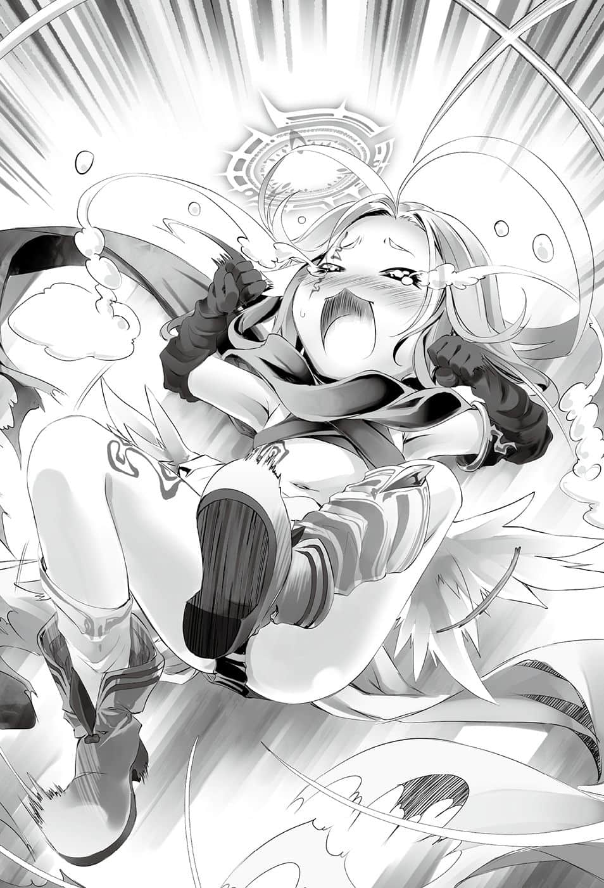

# 高牌全押【后篇】

> 来源：https://www.linovelib.com/novel/9/2128.html

根据神话所说，过去在这个地方曾有『两个最强』的矛盾对峙。

——被称为灼热高座的高峰，如今则是被称为雷鸣裂缝的海峡。

神灵种『战神』阿尔特休，杀死龙精种『终龙』哈提雷夫的黄昏之地。

远古时期，在这壮烈的决斗场，决定出了傲视天下的巅峰人物。

两者的战斗使得天空被红色所遮蔽，大地被死亡染成蓝色。

而如今——天空雷鸣不绝，沸腾的海水经过悠久的时间也不冷却。

一头龙在缝隙间静静地等待时机。

即使在黄昏之中，纯白的龙鳞仍光辉耀眼，它仰望着天空，一动也不动。

那对闪耀深远知性的澄澈眼眸——忽然晃动。

在视线的前方，一道光明宛如流星一般，从染红的天空飞翔而来。

那是天使。

背上张开由光编成的翅膀，头上挂着几何学图案的光圈——天翼种。

对方是一名美丽的少女，长发闪耀着七彩光芒，琥珀色的眼眸浮现星光般的意志。

由过去神话的当事者，拥有最强之名的战神所创造的一片羽毛。

看到少女似乎带着巨大铁块飞来，龙对她说道：

『——好久不见了，小小的羽毛啊。』

♞

面对已经见惯，却没有看腻的白龙，吉普莉尔不禁兴奋颤抖。

心跳自然地加速，热血沸腾的兴奋不停涌出。

——至今仍不知名的龙精种，宛如取笑般地问道：

只是弱者挑战强者，在深渊之底的决斗。

就算这个状况重现了神话的场景，前提却有致命的不同。

吉普莉尔笑了。

吉普莉尔回忆为她带来三条秘计觉悟与一个胜机假说的那段岁月 。

「啊啊，因为在物色书籍时受到一点攻击，多重术式——真是令人感兴趣呢♪」

也就是说——在场没有最强。

虽然她也十分感兴趣，心中忍不住好奇，不过那些答案又有什么意义呢？

「…………什么？」

吉普莉尔立刻否定自己的想法，然后继续说明，问题不在为何无法打倒，而在于——

然后她举起铁块，转动光圈，全神备战。

自己绝不是最强。

「但是如果是时光倒流，就算聚集再多人的力量，应该也无法打倒才对。」

龙身子一动——顿时海水分开，天空爆炸。

「不，只会到今天为止，因为你那颗断定我绝对胜不了的首级，将会被我砍下。」

『汝这个怪人，汝是来尝第六次败北的滋味吗？还是——』

「咦？我并不是无谋，这次『天击』有确实命中了哦！」

听到么妹看著书籍，接着说出的话，阿兹莉尔眯起眼睛，眼中带着恶意。

一头龙与一片羽毛，在雷鸣响动，海水沸腾的海峡，展开第六次的对决。

这股令全身颤抖不止的感情只是……

连续五次败给龙，我在施术室外的时间反而开始变少了。

拉斐尔心想，这样只是火上加油而已，然后静静地转身离开。

「当然知道——那又怎样？」

或许是用剩下少量的力量压缩空间了吧，只见吉普莉尔拖着大量的书籍。

那是不知何时开始写起的日记。

————…………

「那我要通知你一个遗憾的消息——没有『下一次』机会了，你放弃吧。」

……原来如此，么妹非但不是有勇无谋，甚至逐渐开始找到胜算了——拉斐尔叹了一口气。

另一方面——眼前的龙常胜不败。

「……又来了吗，你又来了吗？我的么妹真是命大啊。」

『小小的羽毛啊，你知道过去是谁在这里相争吗？』

「……又来了喵，你又来了喵～～～！？」

比如说，比起生起两堆火，不如对一团火焰注入『燃料』，那么威力就不是以加法，而是以乘法计算。即使与天翼种相比，森精种的精灵量微不足道，但只要巧妙产生连锁反应——就能造成眼前的惨状被打出一个洞的吉普莉尔。

尽管尝到五次的败北——不，正因为如此，这次将会是最后了。

吉普莉尔为了书写最后一页，开始振笔疾书——…………

对方能自由操作时间空间，就连被『天击』直接命中，实质上仍毫发无伤。

一万五千年前——这里是自己的创造主与至高龙王战斗的同一个地方，同一个场所。

言下之意就是，没有比这更令人愉悦的事。

弱到无以复加的我，挑战强到无以复加的他，就只是这么一回事而已。

……在修复术式这一段无所事事的时间，能不能想办法解决呢？

这并不是决定我与他谁强的战斗。

「为何能够打倒呢……不——我们真的有打倒龙吗？」

我马上就试着阅读带回的森精种书籍——我看不懂森精语。

而且更重要的是……

可能是时间操作吧——拉斐尔从龙精种的性质如此推测。

这并不是无双与至高的冲突，既没有提问，也没有回答，甚至无需言语。

阿兹莉尔质问肚子开出一个洞的女童，但是——

「啊，不，我只是对森精种发射『天击』而已，所以请不用招呼我。」

「可是很奇怪，『天击』并没有效果——不，我很肯定确实贯穿了数片龙鳞……但是对方又瞬间再生了……仿佛时光倒流似地。」

吉普莉尔拿起笔，书写足以令她如此确信的东西。

修复术式结束，恢复后的吉普莉尔走出施术室——才过了短短三天。

龙精种比天翼种优秀——这是为了颠覆这个注定的结果，一个笨蛋所做的尝试。

上次的败北……自从第五次败给龙之后，那本日记记载的内容便暴增了。

五次挑战眼前的白龙，而且落败了，吉普莉尔毫无疑问是真正的败者。

主人在这个地方到底和龙王说了什么？有怎样的想法？为何失望了？

「啊，拉斐尔前辈！因为太闲了，所以我开始绘画了，你看如何呢？」

——对，多重术式确实很烦。

在修复术式施术室久违一年恢复意识，一名女童拿着笔在书上画图。

自己仿佛重现伟大神话似地与龙对峙，不过她的意志中没有杂念。

这不是神话——吉普莉尔在心中笑了。

「这是一场无意义的问答——你用那句话做为遗言真的好吗？」

「阿兹莉尔完全在闹别扭了——她说这是『命令』。禁止单独挑战龙精种，万一违抗命令，将会受到惩罚。我确实把命令传达给你了哦。」

「——小吉，我应该说过了喵……没有下一次了。」

但是对主神而言，它也只不过是一击就会粉碎的杂鱼，绝不是最强。

「不管会经过多少次的败北，我都要讨伐你，这场战斗游戏的目的就只是如此而已。」

「他们虽然是企图控制幻想种的白痴，不过若能找到杀龙的提示，那就是意外之喜了♪」

若是不想个消磨时间的方法，我可能会比龙先无聊而死吧……

因为头上肿了一个包很痛，所以我忍不住发射了『天击』。不过仔细一想，这样完全不划算，让我更加火大。为了在接受修复术式中打发时间，我决定至少把全部的书都带回去。

于是，尽管重现神话，却仍有决定性不同的对决。

而纯白之龙只是微微眯起苍蓝的眼睛，张开宛如要覆盖天空的翅膀——然后问道：

『那么小小的羽毛啊，汝明知绝对无法取胜，却仍要永远向吾挑战下去吗？』

吉普莉尔一脸得意地拿小孩子的涂鸦给她看，拉斐尔忍不住唉声叹气。

——在此之前，连要打中对方都办不到啊。

「如果有力量可以超越那么强大的力量，那就只有龙精种自己的力量了吧？」

吉普莉尔似乎没注意到拉斐尔脸色严峻的表情，她开心地继续说道：

「挑战龙精种五次还能够保留原形，固然令人惊叹……但是每次阿兹莉尔那家伙都大吵大闹，连我们也被迫奔走。你就稍微有点自觉，别再有勇无谋地突击——」

那会是龙的笑声吗？只听见龙以愉快的语气说道：

『这是一场有意义的问答。那么这次也凄惨地粉碎吧，小小的羽毛啊。』

♞

——她就是第五次败给龙精种，身体再度缩小的吉普莉尔。

她又缩小成可爱的模样回来，阿兹莉尔不禁抓着头发出悲鸣。

修复术式终于结束，我心情愉快地外出散心，却遭遇森精种的飞行妨害魔法。

然而吉普莉尔回应的笑容中，甚至带着欢迎之色，随后她便前往施术室了。

「——请放心，这是最后一次了。」

不管是胸中激烈的心跳，还是血脉贲张的兴奋，那些绝对不是因为重现神话的关系。

「啊，是喵～？那就没关系喵❤我怎么可能那样说！？『天击』会让『肚子上开出洞』喵！？就算弱化之后，你也不会败给森精种，你到底在做什么喵！？」

————…………

然后白龙振翅，强大无比的『力量』同时如海啸般涌来，白龙笑着说道：

使用两个以上的魔法并不算什么，复合——也就是术式之间的相互作用才麻烦。

看到吉普莉尔说得很开心，完全不把自己当成一回事，阿兹莉尔抱着头感到头痛。

吉普莉尔神态轻松地回答。

听到对方这么说，吉普莉尔嘴唇弯成圆弧说道：

冷静一想，我为什么非要阅读植物类的字呢？

想像无聊到与草对话的自己，我就感到心情郁闷，于是决定睡觉……

当草也没关系了，当我放弃坚持的两年后，我学会看懂森精语了，无聊真是可怕的东西。

我发现一本手札，标题是『我是天才哦❤』，命名十分愚蠢，反而吸引了我。

……三年了，我还读不懂『我是天才哦❤』……我好想死。

并不是我看不懂文字，我只是无法理解内容，我的头脑似乎比草还笨。

虽然我认为当草也没关系，但我并不想比草还不如。

就在我差点自杀的时候，我发现令人感兴趣的记述，才勉强打消自杀的念头。详细内容远超出我的理解范围，我承认难以理解，不过——以人为方式形成的『封闭时空』是可以操作的吗？为了实证那样的假说无法形成『能够承受的容器』，「即使如此我还是存活下来，我果然是天才哦」，还有谜一般的自吹自擂……

——原来如此。如果这个记述是真的，我就必须重新认知，植物界也有天才。

——修复术式的日子让我知道，试着跟草对话增广见闻，其实也不坏，这段日子明天也要结束了。

我虽然马上就想挑战龙，不过这次就稍微准备一下吧。

需要的东西有三样……这样就会是最后一战了，不过很有一试的价值呢❤

————…………

——那是……该怎么说呢……从外观来看就是『铁块』。

么妹扛着长度有身高数十倍的超巨大垃圾，踩着沉重的脚步行走。

「……吉普莉尔，该怎么说呢，那个……那个东西是什么？」

拉斐尔露出难以形容的表情问道。

「请前辈别在意，这只是地精种玩具的一部分。」

吉普莉尔语气温和的回答，更加深了拉斐尔的疑问。

这么说来，拉斐尔刚刚听说了有地精种的舰队遭到击坠消灭。

她只是在欢迎来得正是时候的阿兹莉尔。

然而确实没错——身为战斗种族的本能，给予自己的是矛盾的感觉。

她垂头丧气地说道。

要用那个遗骨做什么呢？——这也是愚蠢的问题。

「咦……？禁止单独挑战龙精种是吗？」

「……好吧。」

不用说，这是为了讨伐龙。听到么妹这么说，拉斐尔叹一口气，迟了一拍才发觉。

「——阻止？阻止什么？为什么要阻止？」

「……嗯，你想做也做得到嘛，这才是我们的长姐。」

吉普莉尔很开心——因为这是挑战龙之前的实验，阿兹莉尔非常适合做为准备运动的对手。

听到这样的天启，阿兹莉尔低着头，深深叹了一口气，然后——

看到阿兹莉尔茫然若失的样子，拉斐尔实在看不过去了。

————————瞬间，吉普莉尔轻轻一笑，毫无征兆地发出闪光。

那样倒是没关系，击坠消灭地精种？非常好，尽管去做，杀光他们也没问题，拉斐尔反而非常鼓励她去做。

吉普莉尔只是露出狂傲的笑容回应。

闪光摧毁了阿邦特・赫伊姆的一个区域，将阿兹莉尔打飞到遥远的彼方。

——不够。

平常就为了争夺首级，或是为一些芝麻小事吵架和决斗……完全是一幅『和平景象』。

「只要一击就会结束，还来不及感到痛楚就会全毁死亡喵——『号外个体』。」

那是多数天翼种都不知道的可怕力量，原本忘记的人也已经想起了。

——要退下吗？可是退下的话，她会被龙杀死，那么至少由自己亲手——

就连被她目光注视的吉普莉尔也不禁倒抽了一口气。

但是同时，完全相同的根据却判断出矛盾的结果——吉普莉尔有可能打败自己。

明明比自己弱，却又要全力以赴？用可能对吉普莉尔造成无法复原的破坏力量——可能会杀死她的力量战斗？

——身为我的一片羽毛，羽翼腐臭才是你该恐惧的事。

除了拉斐尔之外，现在已经没有人知道那是『什么人』了。

么妹摆出备战状态，出言挑衅。看到吉普莉尔的表情，拉斐尔理解了。

然后她非常精准华丽地踩到吉普莉尔的地雷。

「——啊啊，前辈，可以把『龙精种的遗骨』借给我吗？」

——绝对的声音落下，震撼了阿邦特・赫伊姆，甚或震撼了整个世界。

她与吉普莉尔相同，连光也一起榨取，将精灵积蓄在体内。

——瞬间，寒意窜过背脊。

眼前的『敌人』比自己弱，但是如果要打倒她——那就要全力以赴。

没错，和平——她们之所以能够悠哉地与自己人争吵，只因为是处于游刃有余的状况。

「——小吉，我应该下过命令了喵。」

话一说完，她抬起头来，不过——看到她的脸，每个人都不禁怀疑自己的眼睛。

不论怎么用言词矫饰，眼光再怎么偏袒，吉普莉尔的力量在绝对值上仍不及阿兹莉尔。

——不只是为她的阴森可怕感到吃惊。

「小吉是重要的个体喵……我不能眼睁睁看着你去被龙精种破坏掉。」

冲击之后，全天翼种不知发生何事，瞬间赶了过来，现场一片吵闹。

「我们的主人允许了，除此之外还需要什么许可吗？」

————

「……我明白了……喵……我不会再阻止——」

然而……当吉普莉尔燃烧着斗志的时候，阿兹莉尔却露出担忧的表情。

被慌张地转移至身旁的少女这么一问，拉斐尔充满疑惑地回答道：

观众遗憾的目光、吉普莉尔愤怒的目光、拉斐尔鄙视的目光，然后——

当然在决斗之际，手下留情就等于——『侮辱』。

阿兹莉尔被创造为最强的天翼种，以她的根据力量可以断言——吉普莉尔的力量还不及自己的一半。

————…………

「抱歉了，小吉，我要让你睡上一阵子。我会手下留情，不会让你死掉喵。」

两个相反的直觉，令阿兹莉尔思绪混乱，困惑得不知该如何是好。

「——不过会是我多心了吗？我并没有听到我必须服从的理由❤」

眼前是最强的天翼种，她为难的表情中浮现笑容，瞪着吉普莉尔。

——吾主创造的特别个体——自己没有权力破坏。

正因为如此，吉普莉尔才会对阿兹莉尔那么生气。

阿兹莉尔说完这句话后，准备解除战斗姿势——无数的目光集中在她的身上。

却被冰冷的无机质恶意所打断。

只见『最初号个体』毫无征兆地从虚空出现，降落于地面。

她与大家熟知的人阿兹莉尔截然不同，她的声音有如钢铁般无情，如利刃般冰冷。

——拉斐尔带着失望的语气说道：

「咦……阻止什么……可、可是天翼种之间竟然真的互相厮杀——！」

吉普莉尔并不是在生气，也不是小孩子在闹别扭。

「……阿兹莉尔，你是认真的吗……？」

为了榨取压缩精灵，吉普莉尔将羽翼、光圈，甚至连光线也吸入体内，全身转变为黑色。

阿兹莉尔脑中一瞬间闪过这样的想法，立刻对自己的天大不敬感到可耻。

只见她的光圈变得复杂、多重且巨大，放出光芒的羽翼与光圈一同转暗。

然而，无论看了吉普莉尔几遍，阿兹莉尔还是认为——

……吉普莉尔至今曾断言过自己会赢吗？

「……糊涂也该有个限度，现在的你，丝毫没有将我连同『神髓』一起贯穿时的影子。」

更是惊讶她超出吉普莉尔数倍——不，明显超越天翼种领域的力量。

仿佛回应那些视线一般，主人的语气充满喜悦地继续说道：

阿兹莉尔的笑容就像面具一样，不带一切的感情，宛如人偶一般的天翼种——

『——有什么好犹豫。战场就是赌上彼此的生与死，能够磨练砥砺自己生命与灵魂的地方吧。如果你要放弃这个机会逃走，那么你的羽翼很快就会腐败吧。』

听到主人的声音响彻四周，所有人的视线一齐望向玉座大厅。

「竟然说要对她『手下留情』，你甚至没有自觉已经侮辱到她了吗？如果是那样的话，那我要告诉你——」

她仿佛是破坏的化身，如果是在地上徘徊的那些垃圾，光是看到她的身影就会接受死亡。

那样并没有意义，杀死她的话就得不偿失了。

『你要在我的眼前临阵逃亡吗？「最初号个体」——别让我失望了。』

看到阴森地伫立在上空的阿兹莉尔，除了语气充满怀念的拉斐尔外，每个人都说不出话。

只见阿兹莉尔眨眼间便转移至上空，与吉普莉尔面对面，而阿兹莉尔也张开羽翼。

可是除非有特别的理由——比如为了战胜而牺牲——否则禁止怀着『明确的杀意』，战至对方全毁死亡的地步。因为她们是主人赐予的生命，主人所创造的财产，随意破坏是大逆不道的不敬，万死难辞其咎。不过——

「没问题的哦，这次——我会获胜。」

「怎、怎么回事喵！？小吉为什么突然这么生气喵！？」

「拉、拉斐尔大人！不、不阻止她们好吗！？」

吉普莉尔的笑容带着熔岩般的愤怒，全身散发斗志……然而阿兹莉尔却与她完全不同，脸上挂着面具般的笑容，只是无情、无我、冷酷地聚集力量——

——阿兹莉尔不明白拉斐尔的意思，她重新望向吉普莉尔。

——天翼种，拉斐尔也苦笑承认，包含自己在内，天翼种是个性火爆的种族。

拉斐尔看着对峙的两人想到——

不过该说的事情，还是得事先声明，所以拉斐尔正要开口提出忠告——

问题是为什么要把他们的玩具碎片带回来——

——沉默。

对方无话可答，因为拉斐尔说的是绝对的真理，没有任何反驳的余地。

寂静笼罩，只有两个窜动的力量在上空对峙，就在全天翼种仰望之中——

——阿兹莉尔举起手。

只是这么一个动作，立刻产生连阿邦特・赫伊姆也为之惊愕动摇的精灵。

在众人注目之下，拉斐尔口中说道：

「……好了，吉普莉尔，在我看来，我也不觉得你能胜过她，不过——」

正如阿兹莉尔宣言，一击就会结束战斗吧。

每个人的眼中都是如此确信，可见两者的力量有绝对的差距。

但是，即使如此，拉斐尔仍既期待又愉快地说道：

「如果你会被这个程度阿兹莉尔杀死，那讨伐龙更是痴人说梦哦？你要怎么做呢？么妹。」

♞

——已经有几千年没有使出全力了呢？而且对手是小吉——

一想到这里，自己就忍不住想手下留情，阿兹莉尔摇了摇头，斩断那样的意识。

阿兹莉尔告诉自己——主人许可了。

那么就依照宣言——『一击』结束一切。

阿兹莉尔舍弃感情，冷静冷酷，无情地看着『敌人』。

——『号外个体』——确实很强。

战神——主人的力量能够无限增强。当然，主人所创造的天翼种，愈是后期的个体，力量也就愈强。

更何况『号外个体』是现在最年轻的个体，又是主人怀着特殊动机所创造。

不过她脸上挂着面具似的笑容，眺望着力量仍在暴窜的黑暗。

不管阿兹莉尔再怎么强，既然不是唯一之主阿尔特休所发出的必杀，就存在宿命的缺陷。

拉斐尔在视界边缘看到某个东西，所以她一直忍着不笑出来。

与观众感到的疑问相同——阿兹莉尔面无表情地看着，内心却在苦笑。

「————咦？」

面对压倒性的强者，你想要后发制人——

不过她已经忍耐到极限了吧——拉斐尔面露笑容继续说道。

——她是考虑与什么交战——才会创造出那么强大的必杀技呢？

因为拉斐尔很清楚妹妹想问什么，对她而言这是早就知道的事实。

幻想种、龙精种、神灵种——若是对这些力量在自己之上的存在使用，空间会被劈开，那这招就没用了。

但是拉斐尔仰望同样的光景，她只是露出苦笑。

——毫无疑问，那是为了『杀害同族』而创出的技巧。

没有一丝浪费，全部的力量都用在破坏之上，然后——

————『内爆』收缩……就只是这么单纯的道理————喵。

敌我双方赌上全部的一击，任谁应该都看得出力量的差距。

『天击』将在密室内无限反射与增强——『天击』的全部威力会在狭小的空间内暴窜。

天翼种，她们是最强之神——战神所创造的种族。这个种族只要手一挥，就能够劈天裂地。

可是，那样一来就会失去指向性，力量会分散——那么该怎么做呢？

看到那个光景，每个人都对心中的恐惧感到疑问，并且确信吉普莉尔已死——

阿兹莉尔对自己的分析做出结论。

因为任谁听了都会认为——如拉斐尔所说，那招确实是『必杀』。

伫立在一旁的妹妹们，只能用嘶哑的声音喃喃说道：

「正如我所宣言……一击必杀喵。」

从吉普莉尔刹那间露出的惊愕表情，看得出连她也无法认知发生何事。

——那是当然的。只要想到阿兹莉尔为何能使用那种招数——她们必然会感到恐惧。

如果要将『天击』之力发挥至最大，那就不要凝聚——『自爆』是最有效率的方法。

（『天击』的互击……她的目标是躲过我的天击之后再『后发制人』。）

在使出的时点就已结束，确实——那正是『必杀』技巧。

假如问阿兹莉尔使用这蛮横无理的『必杀』一击，是出于什么『考量』。

——没错，在阿兹莉尔发出必杀一击的同时。

——那就只是一种『警告』，意思是『别与我为敌』。

付出代价发出的那一击，确实拥有足以打倒万物的力量。

宛如时间暂停一般，『黑暗』突然包覆『号外个体』。

「相对地，森精种、地精种，还有一部分可怜的下等种族，他们都轻易地把这个词语拿来使用。动不动就称呼必杀的魔法、必杀的兵器等等——以我们的情况来说，『天击』似乎就被认为是必杀。不过——」

那么她的意图就很明显了。

看在旁人眼中只是黑色的球，但是天翼种可以看见精灵、空间和肉眼看不见之物。天翼种仰望黑色的球，不禁陷入恐慌。

阿兹莉尔是——那么地——『可怕』。

「——咦？啊，是的。」

——『天击』。

不由分说，连战斗的机会也不给对方，目睹无条件结束一切的一击，众人全都感到恐惧。

话虽如此，若是抢先攻击，力量就不足以贯穿自己，这也是不言自明。

超出常轨的力量所形成的不定形光——尽管没有凝聚，摇摆不定，却仍是货真价实的『天击』。

从精灵回廊的源潮流汲取庞大的精灵，再将一切连同精灵一起击向敌人。

阿兹莉尔心情平静，毫无感慨地心想——这家伙果然不懂事物的道理。

将构成自己的一切，转变为连接精灵回廊的神经。

对一般的种族使用，明显是过度杀戮。

说什么必杀——那才可笑。

没错，就像是那个招式一样。

听到拉斐尔说的话，妹妹们感到困惑，不过拉斐尔不予理会，她继续说道：

平时她就一直觉得——妹妹们真是不懂『力量的用法』。

「拉、拉斐尔大人……您在笑吗？」

「……放心吧，她之所以在众目睽睽之下使用也有她的考量，她没有打算对我们使用。」

「她负责管理天翼种——当然会有处刑之术吧？」

♞

同时——包住『号外个体』的『黑暗』，震动无声无光的空间，发生剧烈的爆炸。

那种暴力的力量运用，就是天翼种的代名词，唯一有名称的——技巧。

因为划破空间的余波在球体内肆虐，她们想像得出黑暗中正发生什么事。

——你以为会有『后』吗？

在这个状况下，后发制人确实是理所当然的选择。

拉斐尔苦笑一声，停顿一下后，指着上空说道：

将那么庞大的精灵量，在凝聚为一道光之际——将会耗费多余的力量。

不过，拉斐尔看到别的景象，她露出得意的笑容。

那么就只能选择后发制人——先让我方消耗力量后再出击，除此之外她没有胜算。

（——果然我还是必须说——抱歉了喵。）

能够理解那幅光景的人，每个人都咽下一口唾液，阿兹莉尔只是无情地笑了。

尽管身体弱化至小孩的模样，她仍冷酷且冷静地眺望黑暗，无情地笑了。她的模样正诉说着过去多数人都不知道的，阿兹莉尔令人心怀恐惧的一面。

——看到她和宣告一击的阿兹莉尔同样，正在准备竭尽全力的一击——阿兹莉尔不禁叹息。

当阿兹莉尔手指滑动的瞬间。

——阿兹莉尔是这么做的。

震撼虚空与次元的力量和声音，摇晃了阿邦特・赫伊姆、天空与星球。

「……有一个词叫必杀对吧？」

正因为阿兹莉尔用超越吉普莉尔的力量，将空间加以关闭，所以才能使空间封闭起来。

……把『敌人』关在密闭空间内，再将『天击』——转移进去。

——尽管如此，『号外个体』却丝毫不觉得自己会输，眼神没有任何动摇。

光从阿兹莉尔挥下的手上消失了。

那是仅仅数公尺的黑色球体，黑色的隔绝空间。

看到她的模样，每个人都咽下唾液——正如她所宣言，只有一击。

然而，收缩在隔绝空间内的那『一击』，对付比自己强大的敌人则没有意义。

——以不容抗拒的力量阻断退路——在封闭空间内进行无条件的破坏。

将『天击』转移进球体中——注入全部力量的阿兹莉尔变成小孩一样的外表。

只见阿兹莉尔挥下右臂，然后——

以黑色的空间为中心，世界发出悲鸣。

「——拉斐尔大人……阿兹莉尔大人是……那么地——」

「既然称呼为必杀，如果不是必然杀死，那就是谎言了吧。比如说——就像那个东西。」

————那就是阿兹莉尔吗？

有些吓唬过头了吗？拉斐尔苦笑着说出的这句话，却没有任何安慰效果。

这个想法一定很不敬吧——尽管在内心苦笑，拉斐尔依旧在心里想着。

除此之外——眼前的敌人宛如模仿自己一般，在汇聚着力量。

不过——『天击』有一个明确的『多余』之处，那是大家都忽视的一点。

「附带一提——天上地下，三千世界中，必杀是只有主人才能用的词语。」

只要使出就会结束，就算知道也无法采取对策。

——那是看不见的力量鸣动。

「……该怎么说呢，开心吧，阿兹莉尔，你的威望也稍微回复了。」

既然不是『绝对』的存在，那就没有什么必然——她身上存在着『绝对』这个原理所造成的缺陷。

『号外个体』应该也很清楚，若是天击互击，她的力量会被压过。

不过即使如此仍是不够。自己是被创造为最强的天翼种，她的力量不及自己的四分之一。

「不过阿兹莉尔，所以你才是阿兹莉尔啊——哈……哈哈哈哈！」

只要不是能杀死主人的力量，在主人的面前，必杀就只是可笑至极的词语吧。

——突然间。

除了拉斐尔之外——每个人似乎都无法理解。

突然有一道光从阿兹莉尔的胸口窜出——那是道从背后穿过的光。

宛如面具脱落一般，一道既窝囊又没用——令听者都为之脱力的熟悉声音传来。

「……对了……就是那样，那张傻脸才是……前辈。」

「欸、怎、怎么回事，喵——为什么我的胸口开了一个洞喵啊啊！？」

——毫无征兆地从背后贯穿阿兹莉尔的人。

就是疲惫不堪，缩小成孩子模样的吉普莉尔。

听到她们的对话，每个人内心都悄悄说了一句。

「————啊，她是阿兹莉尔没错。」

♞

「欸……那个……啊、啊哈哈，小、小吉，你对我做了什么呢……？」

……先前的威严不知到哪里去了，严肃的气氛完全被破坏光了。

阿兹莉尔脸上带着干笑，用听者都为之脱力的脱线声音，痛苦地询问。

——注入全力对封闭空间内发出天击，那是拥有绝对确信的一击。

阿兹莉尔力量用尽，因精灵不足而缩小成孩子的模样。

在面具的笑容下差点落泪，她向确信应该已经杀死的人——向背后的吉普莉尔，询问贯穿胸口的光何来。不过……

「……前辈骄傲自大看不起对手，结果遭到背后袭击……就是这么回事……」

「……啊！？我、我输了喵！？为什么？怎么一回事喵啊啊啊！！」

「笨蛋！你也是啊！胸口开了个洞就别吵了！喂，快来人把这家伙抓住！！」

阿兹莉尔的心情宛如从地狱升上天堂一般——

因此拉斐尔不曾为吉普莉尔担心——至于她做了什么？

——另一个就是，吉普莉尔五次挑战龙却能存活下来的事实。

吉普莉尔打起精神，露出讽刺的笑容——只是问道：

阿兹莉尔露出松垮的笑容回答道：

不可能——拉斐尔是这么认为。可是若非如此，就有两件事无法解释。

拉斐尔心想应该确认一下，所以询问阿兹莉尔。

一个是眼前发生的现象。

像个小孩一样——不，因为外表也是小孩的关系，她的样子根本就是小孩在闹脾气。

「……阿兹莉尔，不愧是你。你窝囊的样子，把原本博取到的威望都抵消了。」

——从她的语气听来，似乎不打算说出自己做了什么。

——不用杀死吉普莉尔。

不管向谁吐露也得不到他人理解，吉普莉尔这个疑问的『真意』就是——

在这本不会再有后续的日记上，我要怀着远大的愿望，用接下来的这一句话做结尾。

不过吉普莉尔仍不忘立刻再将阿兹莉尔推下地狱，她笑着说道。

「呜……唔唔唔……小吉……唔唔唔。」

吉普莉尔用虚弱的声音继续说道：

——然而，拉斐尔隔着一段距离观看，她确实看见了。

虽然不知道吉普莉尔付出了多少代价，又是怎么做到的。

「喵啊啊啊要救小吉，大家快——啊喵～我感觉天旋地转喵……」

「喵啊啊啊啊我要哭了喵，没有人可以阻止喵——呀喵！」

听见阿兹莉尔呻吟的回答，拉斐尔就当她是答应了————

就在即将被阿兹莉尔关起的瞬间，在仅仅不到一秒的时间里，除了脸上充满惊愕的吉普莉尔——拉斐尔也确实看见在遥远彼方的另一个吉普莉尔。

【爆炸吧】

（……她掌握到龙不断进行时空摆动的感觉了吗？）

不过——

拉斐尔思考——天翼种都知道，空间并不连续。

阿兹莉尔制造出断绝空间的密室，以吉普莉尔的力量，要突破是不可能的事。

——她做了什么？为什么会变成这样？

——她做了什么？如果只是这个问题，拉斐尔大概心里有底。

「喵啊啊啊！小吉不是获胜了吗！？为什么会变成这样喵～！？」

…………

「看来这就是她所找到『超越强者』的秘计。」

——阿兹莉尔的心情非常沮丧，回答她的人意外竟然是——吉普莉尔。

如果不是无可撼动的决心，无止境的愿望——那就一定是『意志』。

「为什么啊啊啊……要是、要是我没有『强』这个优点——呜呜、呜呜，我到底是什么呢……喵…………」

「喵啊啊！？小吉夸奖我喵！要庆祝喵！要办游行了喵——」

就连以前的吉普莉尔，即使赌上全部的力量抗衡，仍只能残破落败。

「……对那只蜥蜴用的王牌……除了一张之外……我全部用掉了……所以……」

「对了，阿兹莉尔，依照约定，我要把龙精种的骨头交给她，你没有异议吧？」

拉斐尔冷眼看着躺在地上的阿兹莉尔，不过她似乎没听见拉斐尔的话。

——『我为什么会输呢』？

然而——她是如何做到——这就完全摸不着头绪。她做的也就是——

支配者对奴隶说出的话，既不是拜托，也不是请求，而是『命令』。

「……不论原因为何，若是不现在立刻施加修复术式，将会造成无法复原的损伤——」

————…………

「……请安心……老实说……前辈比我想像的要强……所以……」

背后传来众人抓住阿兹莉尔的吵闹声，拉斐尔抱起吉普莉尔，心里想着：

阿兹莉尔原本倒卧在地上，露出噁心的笑容，品尝着那份幸福。

♞

自我分裂——不，这样无法说明她是如何逃出阿兹莉尔的隔绝空间。

龙精语——它被称为创造语言或万能语言，同时也是王者敕令。

那么借由消去法就只剩一个可能性，因此拉斐尔猜得出她做了什么。

看着坠落的两人，每个人都在内心翻白眼……却又露出安心的笑容说道——

——『啊，你好，阿兹小姐，欢迎回来。』——

可是就算使用『天击』，精灵应该也不会枯竭到这种程度。

阿兹莉尔已失去意识，被捆绑带走。

——说到底，何谓龙精种……？

大概是事到如今才想到自己输了吧，她突然挥舞手脚，开始吵闹起来。

「前辈就只是……笨蛋而已。」

——只要一句『去死』，回应就是『遵命』。

——拉斐尔确实亲眼看见，吉普莉尔同时出现在两个地方。

一切都是为了今时今日，现在这一瞬间。

或许是连维持孩童形状也很困难了吧，吉普莉尔的身体各处出现缺陷，身影开始模糊晃动。

「亏你还一脸得意，甚至发出胜利宣言——好啦，前辈现在的心情如何呀❤」

被拉斐尔踢到脸的阿兹莉尔，哭声强制停止，她身上像是装了弹簧，猛然地跳了起来。明明力量用尽，又在无防备的情况下被攻击，而且坠落地面，她却格外有精神。阿兹莉尔本来正要抗议——

在五次失败，准备第六次挑战的此时此刻，吉普莉尔这么想着。

然而就算是同质，照理说并非连时间也是相同的摆动。

不过等她修复结束后，务必要听听她的说明。

至少在拉斐尔从天翼种的眼中看来应该是如此，不过——

空间是不断摆动，有如海浪一般摇晃。天翼种能在摆动上穿洞，不受客观距离束缚，以绝对距离的方式移动。另一方面，拉斐尔也知道空间与时间是同义且同质。事实上，她至今与龙精种交手过无数次，她也看过多次龙精种穿梭时空飞行而去的景象。

「……我来阻止吧。你也稍微掌握一下状况吧，笨蛋……」

——阿兹莉尔也同样缩小为孩童尺寸。

本来阿兹莉尔的那一击，毫无疑问应该是『必杀』。

「……『时空转移』……天翼种应该不可能办到——那是怎么回事？」

这么写完之后，吉普莉尔阖上日记，重新面向眼前的白龙。

♞

命令自爆的那句话，世上万物全都要服从，甚至没有抗拒的权力。

——吉普莉尔只是虚弱地这么说着，跟被贯穿的阿兹莉尔一起坠落。

第一次听见吉普莉尔充满尊敬之情的话语，阿兹莉尔顿时破涕为笑。

第一次与这头白龙相遇，凄惨落败的那一日，那时她心中感到一个疑惑：

——天翼种我讨伐龙精种他了，这就是一切。

但是她终于发现吉普莉尔情况不对，顿时发出悲鸣。

能令森罗万象无条件屈服顺从的龙之语言顿时发出。

当吉普莉尔想到这个疑问的时候，宛如宣告开战一般——

「哈哈哈～～～小吉还活着喵，心情当然是再好不过了喵啊啊啊～！！」

「『只要一击就会结束，还来不及感到痛楚就会全毁死亡喵』——是这样吗？」

结果，凡是映在龙的视界中的物质全部爆炸，化成白色的光芒。

那只是不由分说，不讲理且不合理的道理规则。

就在快要被抵抗也无效的道理吞噬时——吉普莉尔想着：

（——前辈果然很笨呢……）

尽管是在这种时候——或者正因为是这种时候吧，吉普莉尔内心暗笑，打开空间的洞穴。

——发出的瞬间就会结束一切的一击？

那种程度也敢称为『必杀』？吉普莉尔心想，前辈她真是笨蛋啊。

在第一次对战这头白龙的那一天，她早就借由龙精语体验过那种程度的攻击了。

然后，受到那样的『必杀』攻击，吉普莉尔五次都生存了下来。

这个事实所代表的意义就是——『连龙精语也称不上必杀』。

而白龙也知道——龙精语是能令天地服从的语言，这名少女却不会臣服。

同时，龙尾猛然袭来——速度快得不像它的巨大身躯所该有，宛如省略时间一般。

——有如星球冲撞的轰然巨响，越过海峡响彻四周。

只见龙尾一闪而过，劈开天际，粉碎大地，分开大海。光是龙尾的冲击波就令数个种族陷入灭亡的危机——

不过运使那种力量的白龙则愉快地说道：

『哦，了不起，真是了不起，小小的羽毛——小小的光啊。』

龙使出两种『必杀』攻击——龙精语和龙尾攻击。

但是吉普莉尔却毫发无伤，悠然地用单手接下攻击——吉普莉尔对白龙露出优雅的微笑。

「感谢你的夸奖，不过——只要掌握诀窍，这就是很容易的把戏。」

没错，对付龙精语——正如拉斐尔的推测——吉普莉尔是以『时空转移』至毫秒后的方式闪避攻击。

以现在为中心，跨足过去与未来，同时存在于多重时间的『多元时空生命体』。

龙瞬间沉默了——然后别有含意地呵呵一笑。

——没错，他们根本不是均势。

眼前是值得挑战的对手，所以向它挑战，除此之外，战斗不需要其他的理由与意义——

面对这样的对手，就是要靠着度过时间与空间才终能与之『竞争』。

虽然拉斐尔和阿兹莉尔最后仍不明白，不过吉普莉尔相信——

天翼种不可能做得到，如果勉强为之，就像与阿兹莉尔之战时相同——将会造成比『天击』更严重的消耗，有可能连存在也蒸发。

「……故事有所谓的序破急㊟，乃至起承转合的写法——」

吉普莉尔穿越龙创造出的时空扭曲，断续进行转移，撑过侵袭而来的死亡。

那就像是与唯一之主阿尔特休对峙的感觉，不管做什么都无法对他稍有撼动的错觉，或者是近似道理、常识——『公理』的直觉。

可是当事者的龙和天使彼此都理解。

「对，除了吾主之外，世上所有的生物都是弱者——因此如果弱者能超越弱者，那么其中一定存在『原理』。再过不久，我就会把那些秘密全部揭露出来。」

一旦战局拖长——最终『时间』将会为这场胜负宣告无可避免的结束。

吉普莉尔优雅地行了一礼。

龙是跳脱时空进行移动，即使空间转移也追之不及——也就是说，龙的周围总是会发生『时空扭曲』。

——在与龙的绝对力量第一次一对一战斗的那一天。

被指谪自己至今还没攻击过一次，吉普莉尔似乎颇为不悦。

——不可能，拥有这种力量的绝对存在——『杀得死才是异常』。

力量有绝望性的差距，小小的羽毛吉普莉尔只是巧妙地利用着差距而已。

统治森罗万象的王者语言——称之为魔法就显得太过傲慢。

但是吉普莉尔已经没有打算与它对话，她只是摆出架势，准备下一次的交错。

紧接着龙尾挥来，她则以停止时间后的空间做为盾，抵挡攻击。

『没错——汝都已经这么了解了，却没有了解的自觉吗——这样更令吾愉快了，那汝就让吾看看吧。』

他们只是悠然发动致命攻击的龙，与拼命抵挡攻击的羽毛。

（编注：日本雅乐中的概念，后引申成文章构成的三个阶段。）

只要五十或一百名天翼种就可以杀得死了？说什么傻话。

宛如重现过去的神话，两者的冲突越过海洋与大地，震撼了这个时代。

讽刺的是——龙因为自己的力量强大，所以才会被封住一切的力量。

在紧迫的状况中，吉普莉尔确信胜利的笑容依然不变。

看到双方的对战，或许有人会觉得这是奇迹般的势均力敌。

海洋燃烧，山脉沸腾，天空破裂崩落。

纯白之龙展开翅膀，蓝色双眸注视着吉普莉尔说道。

——没错，它只是『使用诈术』罢了。

——完全不是势均力敌。

这种难以理解的突兀感，令吉普莉尔那一日——苦恼不已。

——身为『弱者』的天翼种，就算聚集再多人数也无法弥补根本的力量不足。

尽管失败五次，吉普莉尔仍维持一贯对龙的考察，所以她知道。

——龙表示期待那个时刻的到来。

——说到底，何谓龙精种？

渺小的羽翼与巨大的翅膀交错。

可是这头白龙却有如拍去灰尘一般，五次击败了吉普莉尔，这令吉普莉尔感到『矛盾』。

♞

——然后在一瞬的停顿之后——

——至今多达五次的对决，这个结论已经非常清楚了。

龙的尾巴、爪、牙、话语，省略掉过程，直接发动攻击。

龙笑着说道。

解开这个『矛盾』的答案只有一个，那就是——

「因为我不习惯和你这种『诈欺师』战斗……不过我发誓，这次不会再让你无聊了。」

看到吉普莉尔的身影，龙笑得连巨大的身躯也跟着打颤。

吉普莉尔笑着这么说道。

法则与原理——也就是如果是『有理由的强』，只要地基崩解，『矛盾』就会消失。

——吉普莉尔可以断言，那种程度的战力，吉普莉尔一个人也能战胜。

龙毫无间断地发出致命攻击，天使则是挡住并化解所有攻击。

就龙这方看来，就算羽毛拼尽一切力量，它也不会受到毫发之伤。

『汝不可能只守不攻吧。小小的羽毛啊——汝要何时才「揭露」呢？』

『虽然是仍看不见的未来——不过当汝杀死吾的时候，汝就会知道，自己了解了什么，又否定了什么。然后汝就在自己的主人面前，尽情地高歌吧。』

「哎呀，龙精种被说中心事也会显露在表情上吗？真是令人深感兴趣的发现呀♪」

「附带一提，过去让你看到我丢脸的五次惨败，我深深向你表达歉意。」

在破坏的风暴依旧侵袭的海峡上，龙拍打翅膀，呼唤风暴，同时心情愉快地继续说道。

只是一句话，自己的身体就被撕裂，当时自己心中确信——『绝对无法胜过它』。

拥有巨大的身躯，身上的精灵量，甚至连最强的战神所创造的天翼种也无法得知上限。

————龙惊愕得说不出话来。

弱者讨伐强者，解开这个矛盾的答案只有一个。

——那确实就是龙精种的生态。

——这就是它，龙精种。

与这个对手相比，与那个女人前辈的战斗就真的只是暖场而已。

不过龙很感兴趣地询问吉普莉尔的理论。

「真是多话的蜥蜴……你连安静等待剧情高潮的礼貌都没有吗？」

不用说也知道，本来这不是天翼种该有的技巧。

——尽管如此，过去却也有过多次『杀龙』的经验。

——如果以天翼种的『强度』就能应付，那么龙就『一点也不强』。

说得明白一点——

颠覆既定的道理，传说的交战就此展开。

空虚的最强化身，竟然能诞生出这种『创意用心』，这毕竟是难以置信的事——『了不起，真的了不起，不过……』

『——汝是说没有法则与原理的强，才是真正的强吗？』

——不过若是仅限于这个地方，要做到时空转移就很容易。

『哦——汝说龙之力是诈术吗？』

空间被撕裂，时间被扭曲，世界疯狂地发出悲鸣。

下一个瞬间，一切都被光所吞噬，消失得无影无踪。

——正因为如此才了不起，龙对她甚至超越赞赏，到了感动的地步。

能够理解的人，如果看到这种宛如天崩地裂的光景，不知道会怎么说呢？

眼前的现象太过超出人类的智慧，难以称之为战斗。如果有人能从破坏程度，看出这场战斗与远古无双的战神和至高的龙王交战的神话有何差异，那一定就是神了吧——

白龙愉快地说道：

「只要破解你的『强』的诈术，我就拥有充分的胜机，所以我今天就是来揭露真相的♪」

——原本这头龙口中说出的话，从头到尾就意义不明。

对峙的天使闪躲、格挡或是击落龙的攻击。

即使双方都没有决定性的打击，但吉普莉尔这一方只是拼命抵挡，抗拒着结束的到来，而龙这一方则是始终好整以暇地应对，两者的意义也完全不同。

虽然出言讽刺，但是吉普莉尔的脸上没有一丝余裕之情。

它们是拥有永恒寿命的完美生物，力量足以匹敌神灵种，秘密就是在此。

在时空连续体之中，由于它们不是以『点』，而是以『面』存在，所以无论对存在于现在的一点如何攻击，受到过去、未来的修正，现在也马上就会复原。它那近乎无限的力量，则是将自己的力量回荡在复数的时间内，借由汇聚于现在，让它的力量能无限增强。它的肉体留住『收敛时空』——只不过是容器而已，但——

尽管如此——她们却能讨伐龙精种。

不过，吉普莉尔握有手牌，可以颠覆那样的结局。

破坏风暴的真相就只是如此而已。确实龙因为自己的力量被利用，攻击遭到无效化；不过对吉普莉尔而言，她就像是走在危险的钢索上，不容许有刹那的判断失误。

「基于法则与原理的『强』——只不过是既有玄机又有机关的把戏。」

「你的存在是『跨足复数的时间』对吧？」

「不过你说得没错……差不多该进入『转』或『破』的阶段了——」

只要配合时空扭曲，操控时间就比横度空间还容易。

——时空转移。

『——小小的羽毛啊，汝是如何归纳出这个解答的呢！』

白龙毫不隐藏自己的感情，对吉普莉尔问道。

——她应该无法得知才对，更何况就算知道也不可能理解。

不只是天翼种，所有受到现在时间束缚的生物毕竟是不可能理解的。

然而得到的回答，却与这场逼近神话的传说战斗，世界发出悲鸣的场合，实在太不相符——

「就是靠着你的傻脸得知啊，我只是提出假说试探你而已，真是感谢你的配合了♪」

听到她这句捉弄的回答，龙这次真的说不出话了。

——虚张声势。

在这场重大的胜负中，她竟然说假话试探——对于自己上当的事实，龙也哑口无言——

此时吉普莉尔降落在一块隆起的地上。

即使推论得到亲口证实，吉普莉尔心情仍没有余裕，她拼命隐藏着死亡的觉悟。

「好了，刚才你似乎讶异我为何不攻击，所以我就回答你吧。」

吉普莉尔全力装出优雅的动作告诉他。

「我很清楚拼死一击天击是伤不到你的——正因为如此，让你久等了，接下来就是你所希望的剧情高潮。来吧，请拿起手帕，尽情鼓掌喝采，然后睁大眼睛看清楚了。」

吉普莉尔就像把衣带当成裙摆，捏起衣带优雅行了一礼。

「一击伤不了的话就用两击，不过我确信两击仍是不足，所以用三击。我要用三次的攻击，取下你的首级。」

——这既不是出于无可撼动的决心，也不是出于无尽的愿望。

只是心中怀抱的『意志』。接下来这句话将会证明，最初号个体阿兹莉尔和眼前的龙都不是绝对必杀。

「我要出招了——————『三击必杀』。」

好了——终于到了最后关头，各位久等的最高潮，序破急的——急。

如果阿兹莉尔在场的话，大概会指责自己亵渎主人吧，吉普莉尔脑中闪过那样的念头——

「——我失败了吗？」

『——连其他种族的道具都用上了吗？小小的羽毛啊——可是那样还是不够。』

马上就如它所愿，让它惊愕不已。

只要有一点力量到达内部，外部压力就会瞬间无限增强——龙的脖子就会产生爆炸——应该是如此。

她们只是发挥力量，操纵空间，对周围造成破坏，那样不能称为『技巧』。

「以上『三击』就是——『绝击』——这样就结束了。」

吉普莉尔在内心呐喊，挥下的铁块贯穿龙鳞——宛如肯定假说似地刺了进去。

可是吉普莉尔没有机会目睹那幅光景，她的意识便消失了——……

而且最大的根据——『只要众人齐上，就可以讨伐绝对力量的持有者』——只有跨足复数时间的存在能解释那种异常现象。那种事根本就是离谱，根本就是作弊，不过，现在就相信那头龙的『惊愕』才是真相吧。

龙平静地问道。吉普莉尔睁大双眼，侧着头思考。

「————骨头——！？」

以贯穿阿兹莉尔的方法所产生的力量，装填——不，过度装填在铁块上。

在等同于永恒的生命中，伴随着龙第一次尝到『痛楚』的滋味——战斗开始进入尾声。

惊愕也是当然的吧——吉普莉尔自己也不禁苦笑。

随后，低着头的吉普莉尔忽然消失了身影——

做不到跨越多元时空的诈术，不可能可以模仿『崩哮』。再说——她根本不懂那是什么意思。

龙的气息就像在肯定吉普莉尔的假说——但是它同时也心想。

扰乱时间，不停加速，不管是哭是笑，剩下三击就会落幕。

虽然只是以这么简单的粗暴理论所打造的产物，不过——

那么过去被讨伐的全部龙精种——还有今后被讨伐的龙精种也是一样。

也就是相信自己的假说——『只要破解诈术就能讨伐这头龙』。

（如果流入的是我这个天翼种的精灵，结果将会如何呢——！）

——就算死了，结果就是一切——那样还是自己获胜。

它们全是因为产生过度强大力量的生态，而造成了自我毁灭……！

吉普莉尔所宣告的落幕——三击几乎是在同时发出。

从那道『小伤』侵入体内的攻击也会无限回荡。

如果挑战龙，讨伐了龙——那么不管自己最后是站着还是躺着。

这就是——龙尽管拥有压倒性的强度，却仍被杀死的理由。

吉普莉尔说要三击必杀，第二击就因发出『天击』而力量用尽，变成小孩的模样。现在的吉普莉尔，还会有下一招吗？

龙是将自己存在于过去和未来的力量加以回荡，产生出近乎无限的力量。

取名也只是单纯的愚蠢『举动』，跟呼吸差不多。

这是一场无可救药的赌博，就像是将赌金全部压在无花无对的高牌一样。

此时此地，时间有何意义呢？

如果龙的真身是『回荡的时空』，那么理论上它应该有无限的力量。

然后，那应该就足以扮演从龟裂处进入壳中的一滴水，而那就是——

吉普莉尔不需理解那个原理，因为那样的法则和原理诈术存在的事实，就是假说的根据。

『————了不起。』

龙终于也猜到了吧，它惊愕的语气中夹杂着些许焦躁，吉普莉尔听了轻笑一声。

吉普莉尔穿梭时空，飞至龙的背后，她带着铁块，直取龙的首级——这时她心想。

因为至今抑制消耗而保存的体力，全部都灌注在这一击——『天击』，不偏不倚地打在刺于龙身的那把剑上。

于是便来到龙惊愕的第二个理由。

这样就能说明，为何单独一人无法讨伐，一百人就可以办到。

「这我也很清楚，请不用担心，期待剩下的两击吧。」

然而，在原理上，这招只能使用一次——更何况，为了对迫使自己做到这种地步的龙表达最大敬意，而且也为了帅气——同时怀抱着『必杀』的意志。

没错——这也意味着讨伐龙失败了。

然而——不是全赢就是全输，只要有一点胜算，那就十分值得一赌了。

——『自己还活着』。

就连『天击』最多也只能剥下一片龙鳞，那一击却轻易贯穿立刻就会修复的龙之防护，直达里面的皮肤——然而炮身却在此时到达极限而融解。

别说是没力气动，甚至手脚也没有感觉——恐怕自己的手脚真的没了吧。

那时她心想，一群低能的家伙，有这么小气的想法实在可怜。

——————第三击。

『收敛时空』的生态，能将自己存在于现在、过去、未来的力量，回荡和增幅于一点。如果这个诈术就是龙精种这个生物强悍的根据，那么这种超脱常识之处——就是龙可以被杀死的理由。

一般而言，天翼种并不会特地为自己的攻击取名。

在压缩的时间之中，吉普莉尔尽管悠然回答，心中却想——胜算很低。

无论现在过去未来，不可能有人能『以力量使龙屈服』。

吉普莉尔模仿森精种，分裂精灵回廊，利用二重术式，以『最低限度的消耗』，产生出庞大的精灵。

比如龙扭曲时空、它的移动手段、宛如无限的力量。

但是吉普莉尔在内心笑着说——有的。

——讶吧。龙正要这么说的时候。

最后听见龙称赞的话语，几度照亮天空的闪光再度亮起。

（——跨足复数时间的存在？完全无法理解呢——！）

她隐约猜想有可能是这样……也有无数的根据支持她的想法。

『——汝不是要讨伐吾吗？』

『让对手割己身肉，以断对手骨』——吉普莉尔想起，为了打发时间而阅读的森精种书中，有这样一句话。

这意味自我崩坏所造成的最后一击——改写核心术式失败了，同时——

那块铁块——那把剑本来是战斗舰的『主炮』，配备在地精种的飞空战斗舰古里兹上，却被吉普莉尔夺了过来。为了贯穿森精种的防护术式，地精种打造出那门舰炮，它是以非常符合地精种风格的粗暴原理所驱动。让精灵流入多层重叠的刻印术式，『以经过更加浓缩的薄薄精刃，贯穿由精灵编织成的防护』——

——————第二击。

这个事实令吉普莉尔感到愤怒与悲叹——还有难以忍受的后悔。

因为问题只在于，如何让一滴水从龟裂处流入。

「我讨伐了你，就算我也死了——那又有什么问题呢？」

——根据乐观估计，这样一来胜率可能就稍微提升了吧。

♞

——白龙『惊愕』的理由有两个。

「龙精种用自我崩坏为代价所发出的一击——叫做『崩哮』……你以为那是你们的专利吗？」

不过，很巧合地，吉普莉尔她们歼灭的那个术式——长耳人卖弄小聪明，企图支配幻想种，开发出对魔法生命体的『核心』产生作用的术式。如果把那个术式用在自己身上——就算不是完全相同，也能模仿出类似的效果。

——天翼种是唯一之主阿尔特休所编织的魔法，吉普莉尔现在就要强制改写那道术式。

那个效果就是——对『核心』崩坏产生的自爆，赋予方向性。

龙大概会回答那是我们的专利，事实上也是如此。

感觉到龙散发的气息，吉普莉尔笑了出来。

——正是如此。那就是向拉斐尔借来，嵌入剑内的『龙骨』。即便是众神也无法毁坏的不灭子弹，受到『天击』的推挤，在龙的皮肤开出洞来，打开一条通道。

如果龙的生态是将自己的力量，回荡至过去与未来，经过无限回荡之后，凝聚至现在。那么——『受到隔绝的时空之壳』这个坚固无比的铠甲，只要出现一丁点的龟裂——

她既没有飞行，也没有飘浮的力量。在重力的牵引之下，年幼模样的她，将手放在自己的胸口上。

吉普莉尔自身爆炸，逐渐转变成光——

若问自己的目的是什么，既然是为了证明龙是可以单独讨伐的，那么——

『小小的羽毛啊，比太阳更闪耀的光辉啊。』

颠覆常识的奇特之人，她的决心就要在此见分晓。

『那么——用剩下的两击让吾惊——』

第三次的冲击，贯穿名为龙的『时空容器』。

既然要斩断对方的骨头，那就必须有让对方砍自己骨头的气概。

一个是自己受到的冲击，并不是来自『天击』本身，而是被『天击』打中之后，从蒸发的剑所射出的『某物』。

从背上些微的感触，以及映在眼中的红色天空看来，吉普莉尔只明白自己似乎是躺在地上——然后她茫然地说道。

♞

——————第一击。

起承转合的结尾正如前所述——用三次攻击必然杀死对方。

用些微的听觉，听着仿佛从遥远彼端传来的龙的声音，吉普莉尔忍不住说道：

「……到了最后关头，我赌输了吗……真是令人徒留悔恨的结局……」

原本天翼种就是最强之王——战神阿尔特休所编成的魔法。

吉普莉尔并不认为，主人编成的神级『核心』有那么容易改写。

如果硬是要找借口的话——就算知道不容易，那也不是可以尝试的东西。

因此只能临阵使用，而那就是最后的赌注——吉普莉尔不禁伤心悲叹。不过——

『光辉的羽毛啊，用汝的眼睛看仔细了——汝的敌人就要骄傲地死去了哦。』

听到它说的话，吉普莉尔转动脖子——尽管对自己的脖子还留着感到惊讶，她仍往声音的方向望去。

只见视线模糊的前方，坠落地面的龙头——正化为光之粒子，逐渐消失在虚空中。

『汝要为自己感到骄傲，小小的羽毛啊。汝讨伐了吾，这就足以饯别了吧。』

——它说得没错，吉普莉尔为自己感到骄傲。

她胸中充满无上的满足感，自己办到了——这个事实令她感受到身体仿佛麻痹似的幸福感，同时也感到难以抗拒的睡意，吉普莉尔缓缓地闭上双眼。

她平静地相信，这双眼睛再也不会张开了吧。

——术式改写并不完全，不过成功讨伐龙的事实，以及精灵脱落——就算想留住也办不到，身体逐渐溶入虚空中的感觉……告知了自己再过不久也会死亡。

在紧闭的视界中，半梦半醒的意识听着龙继续说话。

『过去有个人问天——何谓「强」。』

「……那个人还真是闲呢。」

吉普莉尔以虚弱的声音回答。不知为何，龙听了却哈哈大笑。

『——汝说过，没有法则和原理的强，才是真正的强。』

「那并不是我说的话，不过我认同那句话就是了……」

「——很好，那么我就坐在玉座等你——你努力吧，我敬爱的弱者敌手。」

然而除了充满全身的成就感之外，还有一丝宛如被那头龙留下的感觉。当她沉浸在刺痛胸口的寂寥中……

祂只是站着，时间空间、甚至因果律也随之扭曲，这间狭小的修复室也扩张了数倍——不，数千倍。然后，她们仰望用双脚站立的主神，也相对地感觉自己就像是虫子一样渺小——

——补记。还有就是前辈实在烦死了。

这片羽毛到最后都没发觉吗？又或者是——

龙愉快地笑了——吉普莉尔虽然想问它那句话的意思，不过还是作罢了，因为不知何故，她明白那不是对自己说的话。相对地，吉普莉尔询问另外一件事：

『————』

老实说，就连阿兹莉尔也失去一半意识了，然而吉普莉尔继续说道：

……抬头看着过于帅气的姐姐的脸，吉普莉尔说道：

她正是贯彻了弱者的生存方式。

无视吵闹的长姐，拉斐尔摸了摸吉普莉尔的头。

吉普莉尔露出苦笑——它直到最后仍说着莫名其妙的话。

「——请恕我不敬，吾主，您为了问我那种问题就站起来，您是否太沉不住气了呢？」

「你所缺少的就是——『谦虚』。你就是太过超出常识，才会败给非常具有常识的我。」

「我挑战『比我更强者』，经过数度败北，最后终于胜利。这段日子我过得非常快乐，每天都非常兴奋喜悦，这实在是一场愉快的战斗游戏。我就算死了也不会忘记这场战斗，你也会把这场战斗铭记在心然后死去吧。在那份『充实感』之前，我认为那种事真的无关紧要——你有异议吗？」

她的模样，她的话语，完全否定了自己的创造主。

然后在狭小的室内——不，如今变得无比宽敞的空间中，原本在嬉闹的三人，看到宛如自远古以来便耸立在那里的男人威仪，她们倒抽了一口气，身体僵在原地。

————喔、喔喔。

「——不愧是吉普莉尔，虽然今后不希望你再乱来，不过——你做得很好。」

——她是在心知肚明的情况下，却不知那代表多么重大的意义，就直接加以否定。

——翻到前页回头去看，我真想挖个洞把自己埋了。

『那么吾再问汝，没有法则原理——没有意义的强又有什么意义呢？』

「喵啊啊啊啊！？龙精种死了喵——喵啊啊啊啊啊啊啊啊啊小吉！小吉啊啊啊啊！我命、令、天、翼、种、全、员，现在立刻转移到这里来啊啊啊！！在这里进行修复术式！不然干脆连同阿邦君一起快点来啊啊啊啊——！？」

「——你成功屠龙了啊，『号外个体』。」

「以最强的主人为对手，我认为用强悍对抗并无意义，我要『以弱者的身份』——」

龙出现幻听了——如果世界听到她说的话，大概会发出这样的声音吧。不过羽毛仍继续说道：

吉普莉尔被这么告知之后，在修复术式施术室内，她一直被阿兹莉尔抱着。

「拉斐尔『姐姐』，我认为由你来担任天翼种之长比较好。」

面对最强的战神，吉普莉尔毫不畏惧，抬头挺胸地宣言。

「嗯？引以为傲的妹妹达成前所未有的伟业，我来探视有什么好不可思议吗？」

——吉普莉尔差点再度昏过去。

突然，刺耳的声音响彻四周，听到那道烦人的声音，吉普莉尔忍不住脱力——

「身为将死之身，我希望至少如你所愿，能将讨伐你一事，做为我的骄傲……若是不知道讨伐对象的名字，那就办不到了。」

她扬起嘴角，语气温和地说道：

——————

……为此而被她毁灭的森精种、地精种如果在场，大概会齐声大叫吧。

吉普莉尔仰望红色的天空，语气平静地继续说道：

♞

吉普莉尔毫不考虑地断言，看到她那个样子，龙确信了一件事。

——恢复意识花了四年，完全修复更需要再六年。

『…………』

「我拒绝喵。」

……写着原以为不会再翻开的日记，吉普莉尔回过头，看着紧紧贴着自己的烦人生物，语气冰冷地说道：

他的语气亲切，甚至含有期待之情。

「为了不让小吉再做傻事，今后我要一直抱着小吉生活喵！竟然改写基干术式，你到底在想什么喵！？小吉好厉害真的打倒龙精种了喵现在大家正在讨论剩下的骨头装饰在哪里最醒目喵修复结束后要举办庆祝游行喵不过我不要原谅小吉你知道你做了多严重的事喵！？真的是伟业喵！！」

——就在这个时候，空间突然出现震动，宛如远处传来的地震。

「如果有『下次』的话——为了那个时候，我要给你一个建议……」

倒在地上的少女，有如请求般地继续说道：

「没有意义的强的意义……？你到最后还想继续跟我打禅机——那么你就感谢我无限的忍耐与无上的宽容，仔细听好了吧。」

——少废话，乖乖坐着，总有一天我会让你站起来，你觉悟吧。

少女将龙告知的名字，在口中反覆念了几遍，然后将那个名字铭记在心。

「你彻底超出常识，强度超越限度——因为不能分辨自己该有的限度，所以你才会自取灭亡。我只是开出一个小洞而已，你彻头彻尾是因为自己强大的力量而被讨伐——那跟我自己的力量没有任何关系。」

「感觉叫我的名字时好像已经自暴自弃了喵！？甚至讲得那么直接喵！？」

「接下来你要如何？我的羽翼啊，你会变强到足以杀死我吗？」

那是一个宁静，却绝对无法忽视的强大力量，对这个房间带来影响。

这次吉普莉尔真的失去意识了。

只有阿尔特休以过去不曾有过的声量，开怀地大笑。

羽毛喘了一口气说道：

呃……那个……我活下来了。

她到最后仍不知道，她正体现了那位战神渴望的答案。

「所谓的强，这个尺度本身就没有意义。」

「哈——哈哈哈哈哈哈哈哈哈哈哈哈哈哈哈哈哈哈哈哈哈——！！」

『没错，正是如汝所说。』

然后阿尔特休脸上带着笑容，凶猛地对吉普莉尔说道：

『吾再问汝吧——你使用计策，磨练技术与智慧，在讨伐吾之后，汝就是比吾更强者吗？』

「对怪物下毒，让怪物自取灭亡的人，你会称呼他为怪物吗？当然不会吧，更何况——」

——意义。

眼前之人就是天神、至高之君、无双的战神——阿尔特休。

「我的回答就是——老实说我觉得那根本无关紧要。」

「别看我这样，我在天翼种中是极为谦虚，具有常识的个体。」

「——可以告诉我你的名字吗？」

看到羽毛露出满足的笑容，龙接着说道：

「阿兹莉尔前辈，差不多可以请你放开我了吗？」

……哭喊的阿兹莉尔不知道。在房间外面，或是隔着空间偷听的全天翼种，听到吉普莉尔的提案，她们全都点头赞成。

它的话语随风而逝，只留下不灭的骨头。

「因为在阿尔特休大人面前，世间万物全都是弱者。」

『——里亨盖尔特，追随【王】之一的「聪龙」雷金雷夫。』

吉普莉尔本来是想要早早把她赶出去，不过——在同一个房间里的拉斐尔安抚着说道：

她勉强维系住差点远离的意识后，不禁叹气。

「为什么喵啊啊啊！？啊，刚才小吉称呼拉斐尔为姐姐喵！？太不公平了喵，小拉，现在就跟我决斗——」

「唉……算了，先不管烦人莉尔小姐，拉斐尔前辈为什么在这里？」

「吉普莉尔，你就放弃吧。你昏睡的这四年，这家伙真的一直抱着你生活，在你恢复力量之前——也就是最少六年，你都要这样度过了。」

龙同意她说的话，语气平静地回答。

『小小的——光辉的羽毛啊。汝不会死，汝还没有死亡的未来，不过终有一天，会有「更弱者」来挑战汝，到时汝就会知道讨伐吾的意义了吧。在那之前——汝就尽情地以汝的伟业为傲，直到天的尽头吧……除此之外，吾的存在……没有任何————』

今后不管写日记还是写什么，我都要注意。

自从醒来之后，阿兹莉尔就一直说个不停。

对于这个事实，别说是阿兹莉尔和拉斐尔，就连偷听的天翼种们也震惊得快要昏倒，不过——

——最近几百年、几千年，创造主不曾离开玉座，如今却用自己的脚站着。

随后——空间宛如降下帘幕，阿尔特休瞬间消失不见。

只留下无数的疑问——

你说的常识是什么啊——！！不过，相对来说，就在场的人而言，天翼种还算是有常识……这倒也是事实。

听到吉普莉尔若无其事地这么回答，真的出现昏倒的人了。

三人连呼吸也停止，身体无法动弹，阿尔特休则是傲然俯视下方说道：

「……遥远的光芒里亨盖尔特……」

这句话是明着挑战，言下之意更是挑衅，天翼种们听了一个个陆续倒下。

「总有一天，我会将主人从玉座拉下，让主人用双脚站着，所以——在那一天来到之前，可以请主人像个主人该有的样子，安稳地坐在玉座上吗？」

听到她这么说——龙不禁心想。

吉普莉尔带着不屑的语气说道：

「……小吉……不对……——吉普△㊟」

（译注：日语中，三角形的开头发音与对人敬称的「さん」相同。）

「——啥？」

无视瞠目结舌的吉普莉尔，阿兹莉尔露出兴奋的眼神大叫。

「吉普小姐让阿尔特休大人笑了喵！？而且是充满挑战性的笑容喵啊啊！！吉普小姐向阿尔特休大人挑战的旗子立起来了喵！？这是怎么回事，我胸口热起来了喵啊啊，同人本要变厚了喵啊啊！！」

「前辈，请冷静一点，你说的话意义不明到极点了。」

「不、不……吉普莉尔，你这个伟业再怎么说也太过巨大了吧——」

连拉斐尔也喘着气，惊讶地这么说道。随后，一直在偷听的所有天翼种则是夹杂着嫉妒、惊愕、憧憬的心情，引起一阵骚动，令阿邦特・赫伊姆也为之震撼。

♞

——阿尔特休只是一个人坐在玉座，没有要起身的迹象，祂如往常般用手撑着脸颊。

阿尔特休对过去在神话时代，曾在高峰对峙过的最强之龙说道：

「……终龙啊，我和你的问答确实有意义——而且果然也无意义。」

据说龙可以看透时间的缝隙，那么那位龙王一定早知道这一天会来临。

那么它说的话确实正确——而且它的行为也错得离谱。

——可怜的龙，连挑战都忘记了。

既然自觉是无法胜过战神的弱者，为什么没有试图超越的气慨？既然承认自己是弱者，那就不该停留在原地，而应该向前迈进才对吧？当身为最强的我出现时，你反而应该享受那种幸福才对——

对于只是接受死亡的哈提雷夫，阿尔特休最终仍无法理解。

——挑战强者，那是我求之不得的幸福，为何你不能庆幸有那种幸福呢……？

「不过——说不定那一天也不远了。」

阿尔特休期待着一根小小的羽毛带给他的战斗，一个人静静地笑着。

——不过即便是祂的智慧也无从得知这个未来。
