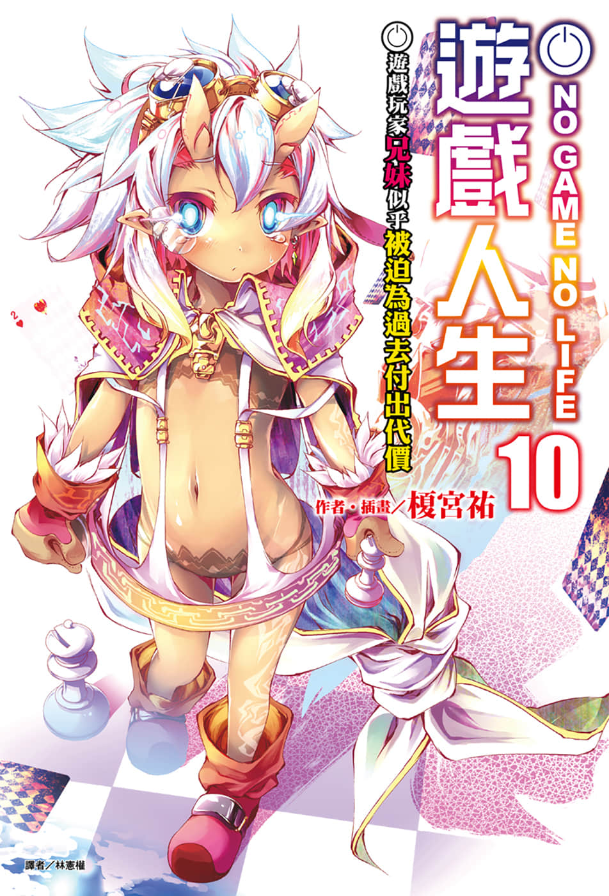
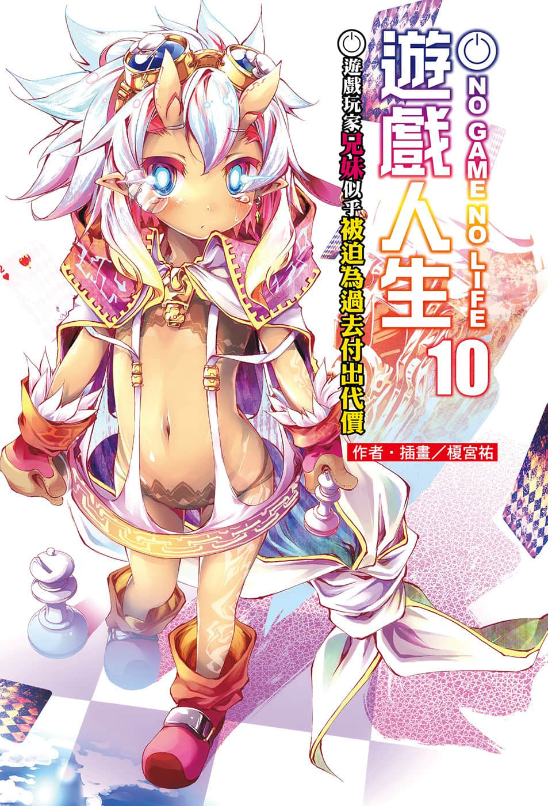
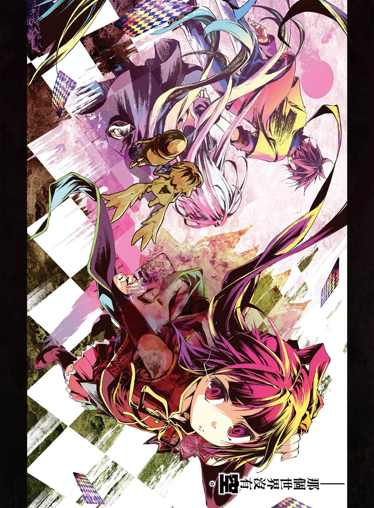
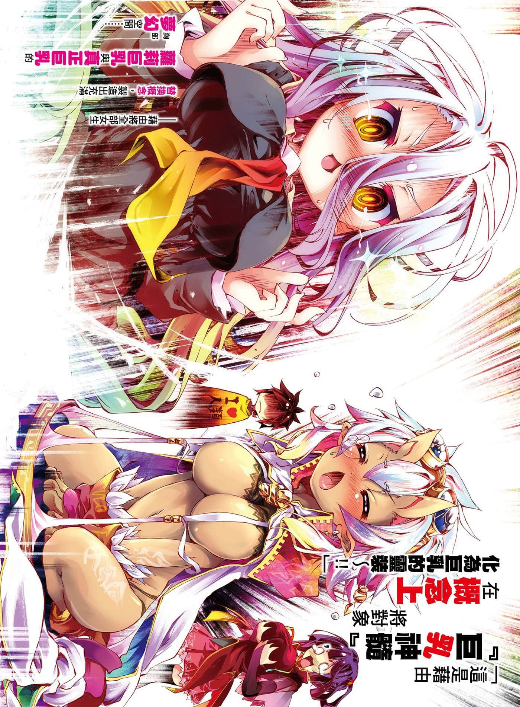
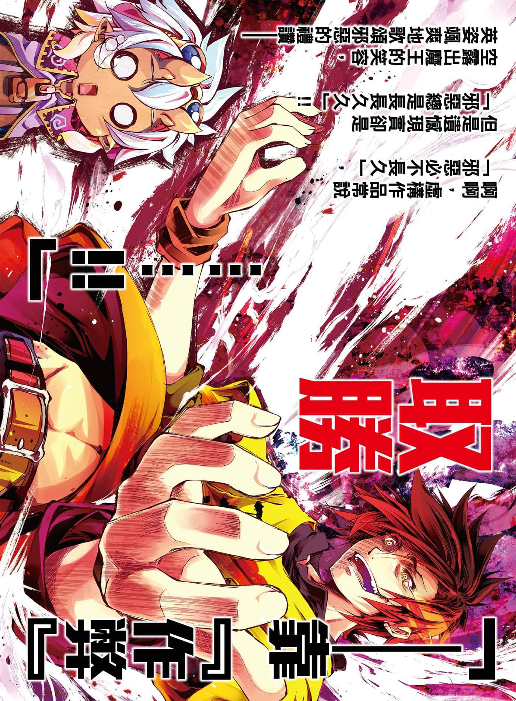
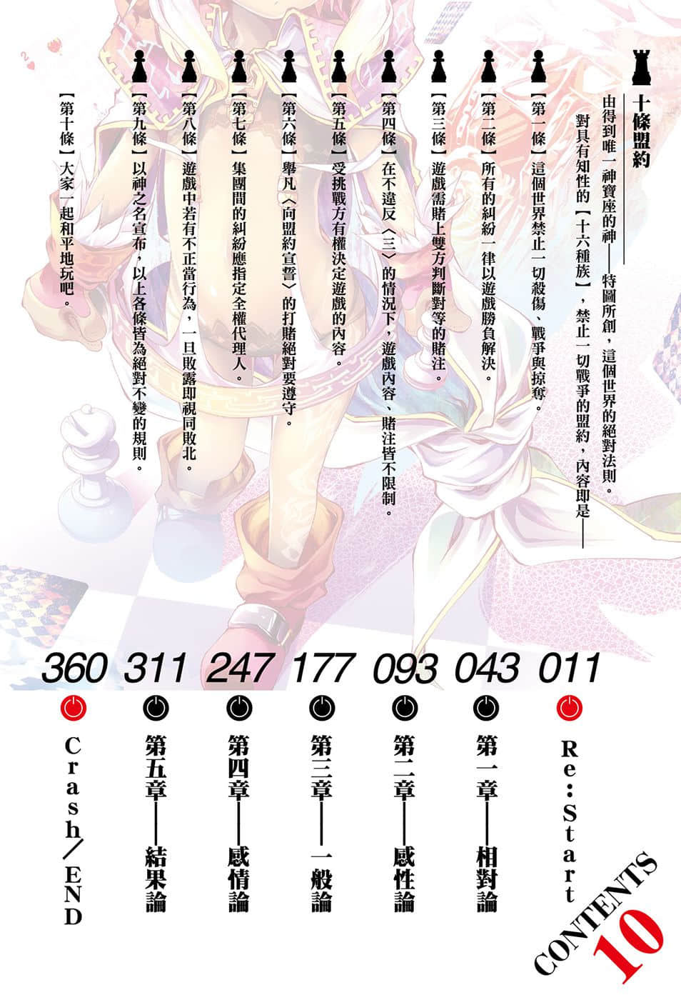

# 插图

> 来源：https://www.linovelib.com/novel/9/118071.html

台版 转自 深夜读书会

作者：榎宫祐

插画：榎宫祐

译者：林宪权

图源：深夜读书会

录入：深夜读书会

深夜读书会：ritdon.com

仅供个人学习交流使用，禁作商业用途

下载后请在24小时内删除，深夜读书会不负担任何责任

请尊重翻译、扫图、录入、校对的辛勤劳动，转载请保留信息

————————————————

【内容简介】

『地精种』势力浮上台面！空与白将被迫面对过往的恩怨（？）

一切以游戏决定的世界【迪司博德】——因为内乱而被赶下王位的空与白，他们悠然自得地在经营药局。两人甚至失去了身为人类种全权代理者勉强维持的社会地位存在价值，前来造访的克拉米，给予的是冰冷的视线。这时他们却收到位阶序列第八位的『地精种』来信，信上提到一个应该会有人问这两名外地人的问题——

「……为什么要逃离你们的战场？」

——即使抛下世界逃走，却仍逃不过逼迫清算『赖帐』的话语……以及！

「来互殴吧！？让我听听你的『灵魂』，你这个贫乳爱好者——！！」

质问胸部喜好的咆哮——！？超人气异世界幻想故事的第十集！！

【作者简介】

榎宫祐

正因为有起有伏，完全不平等，贫富差距过大的关系，所以才会为了些许的差异而苦恼……

榎宫祐

──啊啊，巨乳真难画……！！（苦恼）

【绘者简介】

有一个有名的故事是「溺水之时任由身体漂浮反而能到达岸上」，各位有没有想过──在到达岸边之前不就是「漂流」吗？我就是在惊涛骇浪中浮沉，好不容易才上岸，与各位好久不见的榎宫！为您送上第十集……！

