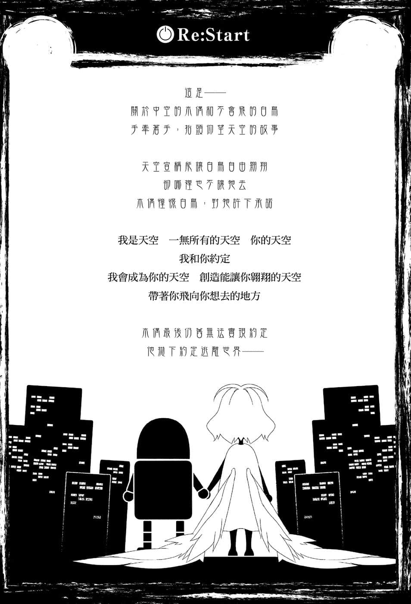
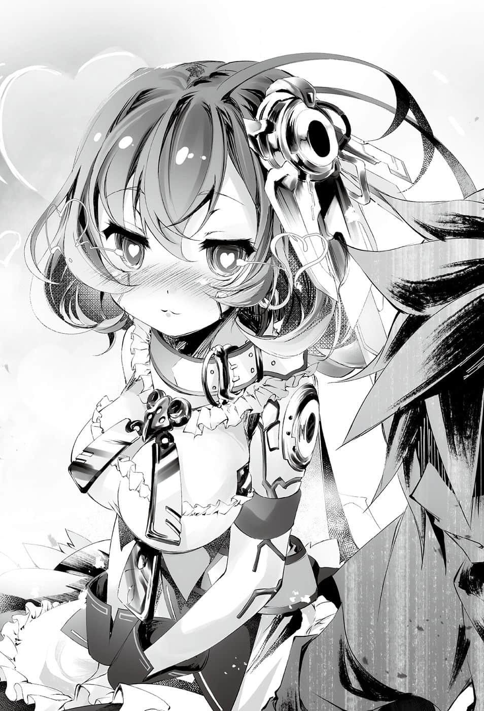

# Re：Start

> 来源：https://www.linovelib.com/novel/9/2131.html

露西亚大陆西部——旧艾尔奇亚王国。

过去它曾是人类种最后的国家，人类种甚至败退到剩下最后一个都市，不过已成往事。

艾尔奇亚如闪电般收复失土，吸收东部联合、奥仙德、阿邦特・赫伊姆，掌握三个国家六个种族，将多种族联邦盟主收入囊中成为无可撼动的大国。但是日前却传出一个惊人的消息，那就是率领艾尔奇亚闪电进击的『王』——『突然失踪』。

历史上，一个国家失去伟大的贤王或领袖，下场就是国政停滞、权力斗争激烈化、情势混乱至极点后发生内乱，造成国家分裂。

然后国力迟早会『衰退』……终至『灭亡』一途……

……只不过，那是指失去的是『伟大的贤王』的情况。

如果失去的是『既不伟大也不贤能的王』，则不在此限。

具体而言，比如像是——

将国政塞给别人去做的『外出王』。

虽然有本国和别国的差别，却同样是『家里蹲的王』。

甚至轻易赌上『种族棋子』与上位种族为敌，采取几近恐怖政治的策略。

像那样的暴君消失，结果反而会一如历史的常规，『艾尔奇亚王国』——更正，『艾尔奇亚共和公国』现在风平浪静。

甚至反而比以前更为安定。

——除了一部分的人之外，比如说——

「……你给我听好了哦？你有三条路可以走。」

没错，比如远在首都西北方的某个驿站小镇的大街上。

「一是把我的巨乳还来，二是告诉我你的『药』是从哪得来的！！三是给我死！！懂了吗！？」

没错，除了泪眼汪汪恐吓路边小贩的黑发贫乳之外，因为贸易激增而来来往往的商人脸上都充满笑容与活力……

「克拉米？我说过那个『药』只是普通的『巴隆草液』而已了唷！」

森精种的巨乳——菲尔・尼尔巴连语气温和地安抚那位贫乳——克拉米・杰尔，然后和颜悦色地继续说道：

克拉米不顾菲尔的制止，正要气愤地踢破大门，但是……背后传来的声音，让她的动作瞬间停住。

「……欢迎？……你们两人……在这里做什么……？」

「……咦？我确实在药圃内洒了各种种子做为『药』材之用……」

三周前——为了找寻突然失踪的『王』，她和菲尔翻山越岭，东奔西走，即使驱使森精种的魔法也掌握不到目标的踪迹。

善与恶的双方，这不叫相关人员，什么才叫相关人员——！！

「毕竟我们是被赶下王位的王……就连待在国内都要担心身份败露。」

「克拉米，你、你冷静一点！你原本也有被欺骗的心理准备吧！？」

「不过里面有包含『洗衣板的种子』与『杂草的种子』这两种稀有品种吗❤」

啊啊——没什么好隐瞒的，门内轻松回应的『两人』，就是克拉米与菲尔找了三周的『失踪的王』。

两人脸上的表情，足以令克拉米屏息，并且想起他们是怎样的人物。

「……简而言之就是……开始新游戏……『玩第二轮』……」

……她的眼神充满怀念之情，口中喃喃说道。

克拉米绕至店的后方，毫不犹豫地翻越种植药草的庭院围篱。

失去一切的两人，身边只剩下智慧型手机、平板电脑、掌上型游戏机等私人物品。

——贩卖邪恶药品的药商与善良的受害者。

「主人～♪属下吉普莉尔『送货』回来了～♪」

看到说话尖酸刻薄的最稀有品种，两人脸部的肌肉不住抽搐。

她们向小贩打听出『药品出处』，并且很快就找到了。

克拉米被两人的气势所震慑，不由得咽下一口唾液说道。

「那是我的台词……你们两个才是在这里摸什么鱼啊——！？」

克拉米嚎啕大哭，正准备破门而入的时候，菲尔忍不住紧紧抱住她。

「你们的主要任务都还没解完呢！？得先把主线剧情过完呀！？」

「听你们这么一说，处境真的很危险呢。做为一个人，可以说是站在悬崖边了吧？」

「————！」

他们是世界首屈一指的战略家，两人即一人的人类最强游戏玩家『 空白』。

——那是头上顶着光圈，有着粉亮发色的天使恶魔。

「……白和哥就是……家里蹲……鲁蛇玩家……」

两个抛下国政搞失踪的懒散魔王看了看彼此，好像感到过意不去似地递出一张纸……

原来如此，确实是梦。只要醒来，一切都会消失——终究只是梦一场。

但是她自信对巨乳的向往绝不输任何人。

得知这两人也是要被自己处决的奸诈恶徒，而且还毫不避讳地交出证明己罪的证物，克拉米心里有一股冲动想要揍人。她接过清单，手一挥，将清单丢入釜中。

「不过当我们来到这个世界的时点——就只是回到起点而已。」

「起床后就恢复原状的空虚！！看到这片飞机场时的绝望！！你敢说我不是相关人员——！？」

「是啊，金钱上是有，但如果是诈欺——干脆从一开始胸部就不要变大呀——！！」

克拉米是贫乳，至今她都是顶着飞机场，塞满胸垫过活。

两人失去了王位，也失去了住处与权力，甚至也失去社会地位。

她是在半信半疑——不，带着九成被骗的觉悟，服下梦寐以求的『丰胸药』，不过——

『那个存在』无声无息地出现，随手打开相关人员专用的门。

走进自称『美梦药局』旁的小巷，克拉米对店名感到讽刺。

空与白威风凛凛地露出自傲的笑容继续说道：

然后当她走向写着『相关人员专用』的门，菲尔却连忙阻止她。

他们是从谷底往下挖洞，然后才跌入这个世界迪司博德的吧。

……其实克拉米本来也不相信那是真药。

克拉米心想——『美梦药局』这个店名确实非常贴切。

「所以我才在调查那个『假奶诈欺药』呀！！菲明白我这个被害者的心情吗！？」

因此经过一晚，梦醒后的现实令克拉米不忍直视。

他们两人把玩着那些物品，仅仅靠着笑容与手指，就将世界玩弄于股掌之中。

他们就是黑发黑眼，穿着『I❤人类』的上衣，围着围裙，手里拿着可疑容器的青年。

克拉米甜甜一笑，然后对着空与白这对可疑至极的兄妹大声吼道：

两人手里把玩着来到这个世界的那一天所携带的物品。

她哭泣发誓，绝对要抓到这个阴险狡猾的犯人。

那是精神上的诈欺……也就是从『巨乳』变成『虚乳』。

无神的双眼流下大颗的泪珠，她悲愤地问道：

空会这么回答——说穿了就是闲闲没事干。

空毫不在乎克拉米与菲尔如利刃般的目光，坐在椅子上，把白放在大腿上，解说着他们的处境，但是空的表情中却没有丝毫悲壮感。

「以『生产职业起手』……如锻造、农业，还有不可缺的就是……『商店经营』……！」

——就只做了这件事。

但是听到她那样说，空与白笑了。

---

■ ■ ■

克拉米怒不可遏。

内心烦恼着哪里有卖尺寸适合的内衣呢～❤

虽然克拉米吐槽他们，却被华丽地无视。

那是一间在大街一隅营业的小店——原来如此，看起来确实生意兴隆。

————…………

「抱歉……我们没有卖鱼……『药』的话倒是不少，你要不要参考看看？」

那张『商品清单』中也有『丰胸药』在列。

「我们失去全权代理的职位！没有工作又身无分文！！而且丝毫没有工作意愿！！」

「菲你说这话就奇怪了，这是相关人员的专用入口——那就是给我走的入口哦！」

「哦～辛苦了——啊，这不是克拉米和菲尔吗？欢迎光临。」

远远看到那间大排长龙的店家所高挂的招牌，克拉米不禁苦笑。

「……应该问我们……『能做什么』……才对……！」

「巴隆草只是能暂时『以空气让胸部膨胀』的灵药草而已唷～！」

克拉米对菲尔说的话也恍若无闻，立刻冲入旅店内，饱餐一顿，举杯庆祝！

但是那一切对他们而言只是『微不足道的事物』。

「可是我们连可以蹲的住处都没有！你竟问我们『在做什么』——这是愚蠢的问题吧！？」

克拉米与菲尔回过头，惊讶地睁大双眼。

以及站在垫脚台上，搅拌着可疑的大釜——拥有纯白头发与红色眼眸的少女。

从美梦中醒来，她的心情顿时从天堂跌落地狱，这是滔天大罪，罪无可赦——！！

「低头往下看去，看不见自己的肚脐……那真是如梦一般的景色啊。」

身为一个人，他们岂止是站在悬崖边，甚至早已坠落谷底了！

「而说到玩第二轮，那就是要解『主要任务以外』的支线吧——也就是说！？」

只要还有笑容和手指，剩下的一切就算全部失去也无所谓。

昨晚落脚在这个驿站小镇，克拉米一见到那种药，立刻掏出钱包付帐。

在让克拉米理解他们是玩弄世界的一方后，两人这次则是表示——

空与白这对兄妹本来就是社会最底层的存在……

「哼……是啊，没错，那一晚确实就像是做了一场美梦……」

「我『胸』中怀抱着幸福的烦恼入睡，那真是美好的一晚……」

「克、克拉米？我觉得非法私闯不是值得鼓励的行为哦～……？」

——若问空与白在做什么。

两人把称霸十六种族与挑战唯一神的事情晾在一边，宣称要玩经济。

——有什么好意外的……！

胸部真的变大了！变成有如梦幻一般的巨乳！

她一把抓起贴有『丰胸药』标签的瓶子，竖起小指，毫不犹豫地一饮而尽。

取而代之回答她的则是空与白所经营的『药局』的商品。

森精种菲尔在看过摆满药材的调配室后，以冰冷的眼神和语气说道：

「巴隆草、恋根、卡玛叶……每一样都是这个大陆所没有的灵药草哦♪」

「————！！」

不愧是森林的种族，空与白露出苦笑，克拉米则是吃惊地睁大双眼。

菲尔的眼光独到，一眼就看穿药效甚至是产地。她的眼神清楚地表示『空与白所说的话不可信』，自称身无分文又流落街头的人——如何能够开店？

菲尔的目光探问他们的真意，但是吉普莉尔笑着说道：

「啊，那些药草是我转移到世界各地采集，然后在后院药圃进行魔法栽培而来的❤」

「你好意思说自己是开新游戏！？这根本是作弊呀！！」

听完天翼种的回答，克拉米激烈反驳，空则是悠然地挥手制止她，然后断言道：

「请你不要做出不实指控好吗？第二轮之后，资料继承是必备功能啊。」

没错——就算那是『破坏游戏平衡的官方允许外挂』。

既然是官方允许，那就没有不用的理由！！

「于是我们靠着第一轮所没有的多轮游戏要素吉普莉尔的力量！！顺利摆脱没工作没钱没住处的困境！贩卖药材做为开店资金，接着自行研发和贩卖商品——这样你明白了吗！？」

空动作夸张地解说。

「……吉普莉尔，你值得嘉奖……」

白竖起大拇指。

「那些只是微不足道的小事，啊啊……承蒙主人赞美，吉普莉尔感到无上光荣……」

吉普莉尔收起羽翼，跪在地上回答道。

「……原来如此，我了解你们『在做什么』了。」

如今克拉米则是揭露将不可能化为可能的方法——

那么不管是『爱情灵药』还是『丰胸药』，只要提供人们微小的梦想，结果就是——

克拉米跪倒在地，一句话也说不出口。

——难怪不管怎么找都找不到他们……

「白，你有没有卖能让我痛揍空的『药』！？不管多少钱我都买！！」

「是啊——终究是梦，只要醒来就会消失的梦——不过啊——」

空轻松地从回忆返回现实，结束今日营业，登上店铺二楼的生活空间。

「那种魔法制造的巨乳毕竟只是伪乳……梦终究只是梦而已。」

非但如此，甚至是常常枯竭的无形商品。

——没错，这就证明了，在梦想之前，连绝望也要屈服！

寂静之中，菲尔温柔地拥抱克拉米，对着她说道：

「于是我们的商店经营不费吹灰之力便进入轨道——造成店门口大排长龙的人潮！！」

原本打算听他们辩解的克拉米不再忍气吞声，大声地吼道。但空却是——

「所以只要贩卖『美梦』就好了，贩卖可以让人短暂梦想成真的『药品』！！」

于是『政变』轻松成功，艾尔奇亚从国王制转变为君主立宪制。

若是真那样自欺欺人的话——

「不——别说了！！我不想听！我、我才不承认那种事！」

打败他们，夺取全权代理者宝座是不可能的事。

「即使你变成巨乳，但是你自己也承认那是假奶！！」

「你就是贫乳！乳量贫乏之人！无论你如何努力，你也不会变成真正的巨乳——所以如果你不以比真物更逼真的假奶为傲——！」

而那样的『药品』所带来的『梦』——

然而正如克拉米自己也承认，而且空也说了，她举出的那些手段终究——

「当你有想成为巨乳的念头，那就代表你不是巨乳——那就是你是贫乳的证据。不管你垫了多少胸垫，你是贫乳的本质与认知都不会改变！！」

克拉米大声哭喊。

她的声量足以震撼整间小店。然后——

「克拉米……你仔细听我说……」

——因为不败的诀窍就在于，不参加没有胜算的赛局。

现实的同义词——『绝望』令克拉米嚎啕大哭，空与白的眼中也泛起泪光。

空与白拭去眼角的泪水，无礼地重新坐回椅子上，眼神一敛说道：

兄妹高声大笑，吉普莉尔则是下跪赞叹。克拉米与菲尔半睁着眼，点了点头。

然后克拉米眼神一敛，这次决心不让空无视自己，大声地咆哮。

比如变性魔法、伪装魔法，或是其他魔法等等……

空这次就真的睁大双眼，感到不明所以。他歪着头，取出一小瓶『丰胸药』。

——三周前……有一群人来到挂着『暂停营业』牌子的艾尔奇亚城。

菲尔的意思就是——即使是魔法也不能把假货变真货——那是在做梦。

「到了那个地步，那可是——比假货还不如啊。」

最擅长魔法编纂的种族——森精种的菲尔继续说道：

没错——不管是哪个时代、哪个世界，美梦总是供不应求的商品。

空与白面露苦笑。

「所有的丰胸——本质上都只是塞胸垫啊！！」

「……正因为如此才有『需求』……」

「克拉米……你有我的记忆，所以其实你应该也懂。在我们原本的世界也有许多丰胸——提升胸围的方法……可是——」

「……伪巨乳……？啊～原来如此，你的意思是……因为是假奶，所以我是在诈欺吗？」

「………………喂。」

差别只在于是塞在乳房之下，还是塞在胸罩之下而已。

然而那些技术终究和这瓶『丰胸药』相同————！

空狠下心，残酷地继续说道：

「简单说你们和往常一样——在干『不正当』与『诈欺』的勾当吧！？」

对，终究是梦——只是幻想，只是虚构的幻觉。

药品的标签上甚至还明确标示『请遵守用法与用量，正确地用药』！

正因为如此，他们才会打着『美梦药局』的招牌。空继续说道：

或者挂着一对伪乳，却得意地欺骗自己，认为自己成为真正的巨乳了。

他们以『罢工』为由，逼迫空与白接受一个简单的游戏。

「你不要表现得过意不去，却又说得理直气壮好吗！？我说的就是你们的『丰胸药』——贩售史上最恶质的假奶给客人的诈欺行为啦——把我的美梦巨乳还给我！！」

「都是因为你们借由【盟约】，强迫《工商联合会》听话，不断『压迫』他们，才会给予他们串连『政变』的借口吧！！」

没错……相信自己可以成为真正的巨乳。

看到自己的话语让跪在地上的克拉米重新站起，空深深点头肯定。

「那么克拉米……『不是假奶的丰胸』是什么？」

……没错，那个方法简单说就是『政变』。

也就是以民生基础设施为筹码，威胁空与白接受简单却『不可能胜利的必败游戏』……

白、菲尔，甚至吉普莉尔也低头沉默。克拉米捂着耳朵，不住颤抖。

「……抱歉，我做了太多『不正当』与『诈欺』的勾当……你在说哪一桩？」

这一群人是以工商会、各公会与暴发户贵族所组成——自称《工商联合会》。

「比如说，东部联合不能缺少大陆资源，本来大陆资源能以『不合理的价格』贩卖——」

空似乎终于想通克拉米在生什么气，他点了点头——然后告诉她。

虽然克拉米发出悲痛的叫声指责空，不过却还是老实地收下小瓶子。

『 空白』是人类种最强的游戏玩家，不败的王。

「比起巨乳克拉米那种巨大矛盾！！世界和平还比较现实！！虽然是荒唐无稽，违反宇宙根源原理，虚无缥缈的梦！不过做梦是个人的自由！」

「……太顺利……生意兴隆到致命的地步……到了对人恐惧症患者我们无法外出的等级……」

虽然很残酷……但这是必须接受的事实。

「而所谓的买卖——无论何时都是针对需求给予『供给』。」

听到空的语气沉重，克拉米抽了一口气，感到事情不寻常。

「以两位主人的睿智与经营手腕，这是当然的结果❤」

克拉米看到三人的反应后说道。

「你们才是该在意的人！！喂，你们有在听我说话吗！？」

她道出空与白被赶下王位的理由——不，是被逼下王位的经过。

「不过我们是家里蹲，本来就没打算出门！出货都是交给吉普莉尔瞬间运送！所以我们就闲闲没事干了！哈哈哈！世界真是好混啊！！」

「……呜呜……呜哇啊啊啊啊啊啊啊～～～～」

「所谓的梦，正是因为现实中没有，所以才是梦啊——！！」

「确实有魔法能让胸部变大……可是～」

「——————————……啊啊！」

仅仅只是这一招，最强的游戏玩家便放弃胜负，交出国王宝座。

---

■ ■ ■

「不过反正政变本来就迟早会发生，你就别在意啦。」

用空气让乳房膨胀是诈欺？那么隆乳技术就全都是诈欺了。

「再服用就好了，只要持续每天服用——恭喜你，这样你也是巨乳了。」

也就是演变成财阀与诸侯挟着银弹和人脉，介入政治的议会公国。

「若是有那样的经营手腕——你们一开始就不会被赶下王位吧！？」

是的，过去因为玩『存在黑白棋』，克拉米曾经得到空分享的记忆。所以她知道在他们原本的世界，存在着各式各样梦幻般的丰胸技术。

原因很简单。

「————不……不要……别说了……别说了！」

「那么这就是在没有梦想的现实中，添加梦想的『添加药』——对，并非特效药，因为毕竟是假象。不过做为『娱乐』来说，那种『药』的需求无穷无尽——正可说是商机无限啊！！」

克拉米对他大喊，却被空两旁的吉普莉尔与白反驳。

「——比起经营『店铺』，你们更应该经营『国家』啊——！！」

——不管乳房内塞的是脂肪还是矽胶，总归都是『填充物』，就只是胸垫。

「是啊，不服用就会消风的伪巨乳是吧！？你黑心也要有个限度吧！？」

「……可是因为多种族联邦政策……商人只能以『合理的价格』贩售……所以政变是迟早的事……」

「那种事……我也知道啊……！」

——没错……空等人的最终目的，是挑战唯一神的计划。

『多种族联邦』的构想，就是不以支配的方式整合所有种族。

若说那样的政体没人会有『损失』，是说得很好听。

不过，原本能以高价售出的货物，如今却只能以合理的价格被迫出售，对于从事买卖的人而言，情况就不同了。

具体来说就是对『商人』而言，『贩售收益的减少』是明确的『损失』。

克拉米也很清楚，商人的不满迟早会爆发，可是即便如此——

抵达二楼的寝室后，三人各自坐在三张床上。

「设法压制他们才是治国吧！！为什么你们还火上加油！？」

克拉米提出反驳——可以别用『压迫』手段，而是与他们『交涉』。

空、白以及吉普莉尔，三人一同露出苦笑。

「喂喂，克拉米……你竟然问游戏玩家『为什么要火上加油』？」

「……政治……不是白和哥所擅长……至于火上加油的理由……那还用说吗……？」

政治是政治专才的工作，没错，如果是某红发少女那也就罢了。

空与白露出邪恶的笑容，告知他们专才玩家的想法。

「既然是迟早会发生的事件，那么就——」

「……让发生条件成立……促成事件提早发生……♪」

——

克拉米与菲尔绝不会笨得小看『 空白』。

————因为实情真的就如她所说。

他根本没有头绪……因此——

空勉强忍住悲鸣，从床上跳了下来。

他并没有小看菲尔与克拉米。

她露出锐利的眼神，面无表情地做出胜利宣言，然后以冷淡的语气简短地说了一句。

那个疑问就是——既然生意那么好，那么到底是谁在贩卖？

「【报告】伴随商品售完，本机自一五〇七时起尝试进行全裸待命，全……裸？」

她的意思是……虽然尝试行动，但是因为比想像中还羞耻，所以催促空快点动作。

「……她不是朋友……而是敌人——！！『其他的工作』……做完了吗……！？」

「哼……什么嘛，你们也有朋友不是吗？真是太好——咿～！？」

菲尔的眼神中透露『警戒』之情，克拉米的眼神则是充满『慈爱』，说出令人眼眶一热的台词——

「你该不会那么小看我，认为我会相信你们真是为了开『药局』而引发政变吧……？」

「是谁呢……？会比典开受到限制的机凯种还无能……那可是令人惊异的未知存在呢❤」

「你知道艾尔奇亚现在变得如何了吗……我可不准你说不知情哦？」

机凯种少女回答得毫不犹豫，身体朝着空靠过来，但是空却摇头大叫。

——留下令两人脸颊抽动的宣言后，依蜜尔爱因转身回头，捏起两边裙角行了一礼，然后翩然在空的身旁坐下。

她『赤裸』的身体裹着毯子，毯子的缝隙间能窥见夹杂着机械的滑嫩肌肤。

空如此热烈地演说之后，重新端坐在床上，眼神一敛，然后道出买卖的基本，同时也是奥义与真理。

——吗～～！

只要能事先预测哪里有顾客，有什么需求，那么商品的优劣就无关紧要了——因此！！

「我就是卖『药』玩游戏，除此之外，有什么是现在的我能做的事吗？」

…………吗～～……

「【提示】列举主人可能的选择，入浴、用餐……或是『本机』。」

「我敢断言！！只要掌握『买卖的基本』，别说是优秀的商品，甚至连劣质商品都不需要！！就算只是普通的空瓶只要贴上『含负离子空气』的标签那个空瓶就能大卖再怎么落魄的小店三天就能成为富翁故事完美结束——！！」

「…………？你是说原本被你们压抑的贸易得到舒缓，这里的贸易量急速增加之事？」

另外，店内清扫、订货——就连本来是白应该要做的市场分析，她也已全部完成。

更别提，问他艾尔奇亚现况如何？

今天又要开始例行公事了……没错——

只听见伴随着——『要洗澡？吃饭？还是我呢？』的新婚妻子式台词。

两人就是为了确认这一点，所以才会寻找空与白。

「【结论】将工作塞给本机，想要限制与妨害本机行动的计划，认定为失败。」

下一个瞬间，她身上已换上女仆装，恭敬地向白与吉普莉尔行了一个礼。

空在内心暗笑，真要说的话——他知道会如何演变。

克拉米虽然讶异，却也慎重地回答。空重重地点头同意，然后继续说道：

有个外表看似拥有红紫色头发的机械少女，从床上——更正，从毯子下起身出现。

依蜜尔爱因对两人的敌意无动于衷，从床上爬了下来。

菲尔与克拉米回以冰点下的眼神，空等人却是内心苦笑。

——轰隆隆隆……空能明确听见大地震动的声音。

「——依、依蜜尔爱因！？原来你在吗！？」

不，虽然没什么好的地方，但是有一个更重要的问题。

因应需求贩售优秀的商品确实很正常，而且非常地合理。

「【建议】本机建议，连续执行所有选项，具体程序『在浴室享用本机』。」

「利用异世界知识制造美乃滋或味噌，靠食物的美味一决胜负？哈！！他们的野心都太小了！动作也很慢！甚至对做生意有所误解，以为『只要品质好就能大卖』，根本目光狭隘！」

空与白很清楚政变会发生什么事——那么当然要拿来利用。

「啊啊，说得也对……你们不可能『招呼客人』吧……」

依蜜尔爱因仿佛火上加油——或者是宣告终结一般说道：

话题突然转变，克拉米被空激动的言词所震慑。空则是不理会她，脸上露出笑容。

「只要能比任何人都提早掌握『人流与物流』——也就是『地段』和『流行』！！具体来说就是受惠于《工商联合会》的经贸缓和而繁荣的地点！！兑换好为了促进贸易而发行的纸币！！那么不管卖什么都可以热卖！！这样你明白了吗～～！？」

果然——『他们是故意引发政变』……

「【肯定】一直都在。」

「【错误】侦测到大幅高出预测值的羞耻……本机准备完毕……快一点？」

「【同意】工作效率甚至比功能受限的本机单机还差。因为解除连结，演算分析能力已降至三十二％的本机已无法理解，天翼种的无能令人惊异，吓一跳。」

她平淡地回答空的问题，然后或许是突然发觉自己的状况了吧——

「【活该】本机胜利～」

「克拉米，《工商联合会》把我们赶下台的结果，这里变得如何了？」

两名超常存在唇枪舌战，而白虽然始终无言，却反而令人感到不安。

………………吗～～……空的声音在回荡。

然后，克拉米与菲尔一同眯起双眼，心想——原来这就是机凯种……

「你不觉得『异世界经营店铺作品』的主角们，他们做事很拖拖拉拉吗？」

没错……像刚才那样的诱惑示爱倒也还好。

——依蜜尔爱因注视着空，除此之外没有别的了。

如今已成例行公事的忧郁，让他不禁仰天叹息。

接下来她们探问的是——『为什么要这么做』……

——去无人岛卖宝石是想卖给谁呢——！？

「…………【恍惚】…………嗯❤」

也就是说——！

政变的目的是为了利益，也就是经贸的缓和与自由化。

——嘲笑正确来说是飘浮在空身边的人物。

依蜜尔爱因睁着水汪汪的玻璃眼眸向空示意——但是意外地有反应的人却是……

「咦？难道是因为解除连结的关系，不只性能，连记忆力也低落了吗❤」

没错——只要促成《工商联合会》发动政变，根本不用预测需求，而是能够创造需求！！

不断向空进逼的是——另一个『多轮游戏的要素』。

「………………啥？你是在说谁啊？」

然后空心想——啊啊……又来了。

听到空与白的回答，两人脸上的表情就像在说——『果然如此』。

没错……根本上就颠倒了，重要的不是供给，需求才是一切！

「【问题】在那段期间，有个无能的家伙坐在主人身边无所事事，那个人是谁呢？提示，鸟头。」

——可是白的敌意与吉普莉尔的杀意突然爆发，令克拉米忍不住发出悲鸣。

空讽刺地说完，躺在床上，回应他的是——

「不对，你不可以一直都在吧！？你的工作呢！？你不是要『看店』吗！？」

「你那样说我也……现在的我们只是一般人，只是寻常的『药商』哦。」

——不过，正因为如此，空才要嘲笑。他笃定地断言！

结果即便以白和吉普莉尔的智谋，似乎仍是无法回避。

这就是这三周以来每天的例行公事——同时也是空的忧郁。

「…………【注视】……盯～～」

「正确地说——这个驿站小镇是贸易路线的中继地……物流都集中至这个贸易据点。」

那就是——

报告完毕后，依蜜尔爱因面无表情，侧着头——

「咦？喂，你是在说哪件事啊！？误解！？」

——如果是在沙漠，『水』能卖得比宝石更贵——！！

「……要贩售『供给』的话，先要创造『需求』。」

察觉一直感到疑问的答案，克拉米这才恍然大悟。

依蜜尔爱因只是坐在空的身旁，脸上面无表情，但是——

「【报告】一四〇九时结束关店作业，一五〇三时已用光学迷彩将纸币移动至兑换所。」

「无论商品多么优秀，没有顾客就没有价值！！」

——《工商联合会》的主要资本，就是空他们所严格管制的『贸易业』。

这段时间她只是脸颊微微泛红，似乎很幸福地凝视着空。

为了回避这个情况，空尽可能不让依蜜尔爱因闲下来。

——你问为什么？

————

「…………喂，空，问你一下哦……这气氛是怎么回事！？」

「我哪知道啊～～！我才想问呢！！为什么我会觉得如坐针毡啊！？」

空吼叫回应克拉米的问题——因为每次这种时候就会演变成『这气氛』。

「……喂……你叫依蜜尔爱因对吧？你该不会——喜欢空吧？」

人类的祖先第一次吃海参时，大概就是这样的表情吧。

克拉米感到难以置信，不过依蜜尔爱因却是以不到一秒的时间回答她。

「【肯定】喜欢，本机喜欢主人，不管说几次都可以。喜欢，本机最喜欢主人了。」

对——正如她日前的宣言，她不会掩饰『喜欢』的心情。

……名符其实的人偶般美少女毫不掩饰地表达爱意。

身为男人，对她好色心起，怦然心动，反而应该是正常的反应。

但是空可以发誓，他既没有好色心起，也没有怦然心动。

他没有，因为办不到，不可能做得到。因为——

「你疯了吗！？这家伙有什么让人喜欢的要素——咿～！菲～救命～」

「不要紧的哦～克拉米——我牺牲生命也会守护你！！」

没错——白与吉普莉尔、依蜜尔爱因只是瞥了一眼，克拉米立刻吓得嚎啕大哭，就连菲尔也做好牺牲性命的心理准备——就是这样的气氛！！

在充满杀意与敌意的沉默气氛里，他怎么可能会怦然心动，心脏反而会停吧——

空与白曾数度听过他们的名字，甚至在东部联合的荧幕上也看过他们的身影，是一个有名的种族——不过……

没错……过去的记忆伴随着心痛的感觉窜过心头…………

「奇怪，我不记得我有洒下『地精种的种子』这种稀有品种——哎呀？」

————

「来找『药商』，除了『药』还能有何来意，他是我们『等待已久』的顾客。不过……」

「……忠实于传统的……设定……诞生于土中……？」

他们以国土与国力皆为世界第二的大国——哈登费尔为领土，而且在魔法道具——使用精灵『制造机械』上，别说是森精种，甚至十六种族也无人能出其右。

空找借口想要逃离这个困境，依蜜尔爱因却露出淡淡的微笑说道：

——「外地人 是本大爷啦 把药拿来 帐先记着。」

那是他们不愿面对，抛下一切逃避至今的记忆。

---

■ ■ ■

「……哦～？地精种在这个时机点，特地从哈登费尔远道而来，拜访自称普通人的『药商』？来意令人好奇呢。」

只有一个像是头脑很差的人留下的署名，文字是粗鲁的人类语，字迹就像小孩子一样。

「……只不过这个顾客似乎比想像中还要棘手啊……」

重新往纸片看去，空脸上的笑容消失，白则是低下头。

只见从推测是地精种的物体上，掉下一张纸片。

「啊～！抱歉，依蜜尔爱因！我忘记拜托你去采收药圃，不好意思，可以请你——」

「……【谢罪】其实尚未完成，有一株无法判断是否该采收，因此暂时保留——」

覆盖的斗篷缝隙下，看得见些许的褐色肌肤与銀发——那是『头』。

在田里的角落，顺势种植的高丽菜旁，那个东西确实长在那里。

魔法适性在第七位的森精种之后的上位种族。

「……我先确认一下，地精种是可以在田里采收到的种族吗？」

——【十六种族】位阶序列第八位的『地精种』……

虽然只是简单的一行字，但是语气却十分蛮横。

「………………」

面对初次遭遇的生态，空与白一同侧着头感到疑惑，吉普莉尔则是随手一拔——

空横抱着白打算逃跑，但是听到依蜜尔爱因的回答——

「【先手】预料之内，一五〇一时已执行完毕，本机要在主人身边待命，幸福——啊！」

——————啥？

克拉米语带讽刺探问两人的真意，空则是勉强露出笑容答道：

「好！现在就去采收那株植物吧！不，我去采收！白也来吧！那么是怎样的植物呢！？」

两名异世界人外地人——空与白的脑海闪过无数记忆。

空皱起了眉头。

而空与白随手拾起一看——

——过去所欠下偿还不清的债，如今终于被逼迫要清算。

——上面既没有收信人，也没有寄信人的名字——不。

「【回答】那是一株只有头部露出地表的小型作物，品种名——地精种。」

依蜜尔爱因早已有所准备，她告知空绝望的事实，不过——
