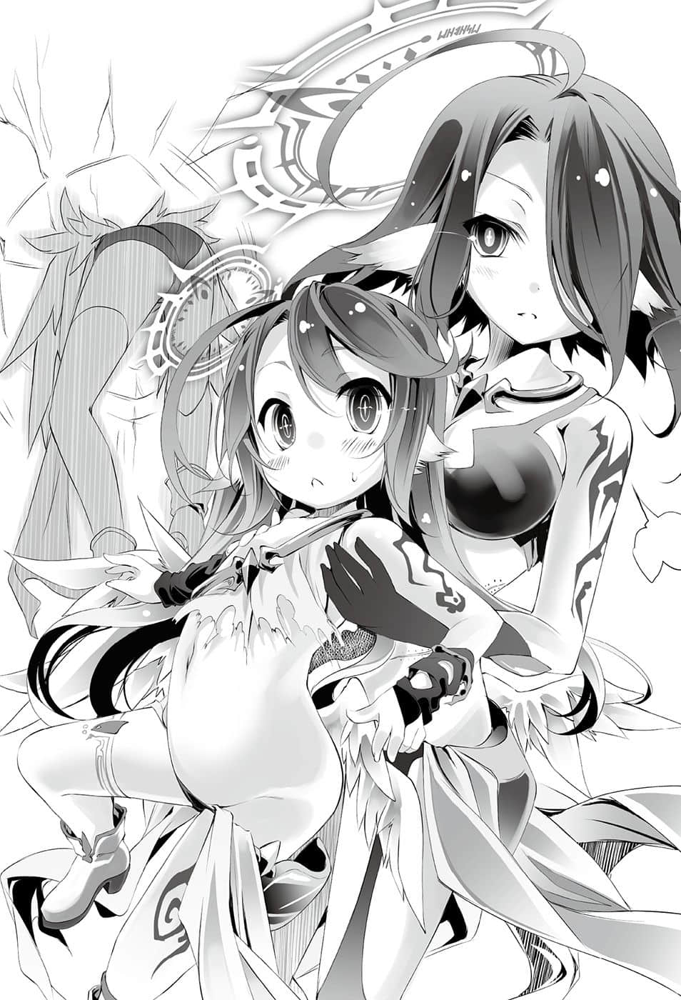
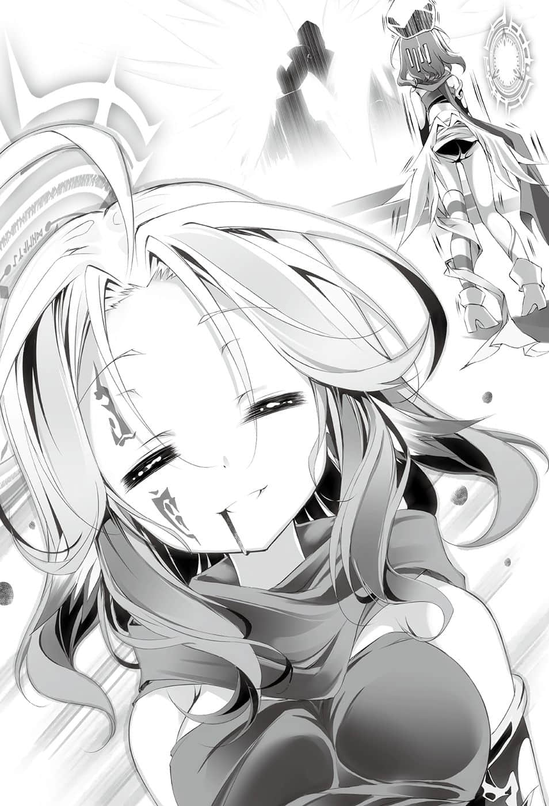

# 高牌全押【前篇】

> 来源：https://www.linovelib.com/novel/9/2127.html

根据神话，过去天上曾有『两大最强』的矛盾对峙。

灼热高座——存在于遥远的过去，这个世界最高耸的山。

如今那座山已经消失，既不能攀登，也无法仰望了。

即使如此，那次可敬可畏的对峙，仍然不断流传至今。

最强的神灵种——『战神』阿尔特休。

最强的龙精种——『终龙』哈提雷夫。

那是在遥远的远古时期，决定君临世界顶点的炽烈决斗。

「我问你——何为『强』？」

置身灼热高座的顶点，『战神』阿尔特休如此问道。

——祂就是『战争』这个概念的显现。

竞争生死，砥砺灵魂，体现循环之理，祂无疑是世界的顶点。

祂是天地无双的强者，然而祂所问的对象也是——

「汝永远不会明白。」

对于战神的问题，『终龙』哈提雷夫忧愁地回答。

——祂是遮蔽天空的王者之龙。

诞生自神的尸骸，祂是龙精种最古老的个体。

祂是孤高的龙王，从这座灼热高座睥睨世界，祂的灵魂与肉体永恒不灭。

没有任何事物可以伤害祂，祂说出的话连神也要敬畏——祂果然也无疑是世界的顶点。

神与龙，最强与最强，两者的对峙是从问答开始。

「——为何？」

因此天翼种们将全世界从不幸的深渊，更加推落至地狱的底部。

龙王——哈提雷夫早已理解。

在这个地狱里却有一个种族。

「没错，正因如此，汝最终必将败北。」

正如同那段神话仍流传至今一般，冲突之力遗留的残渣，至今仍沸腾释出雷鸣。

有人幸福，相对就会有人不幸。

毕竟对天翼种她们而言，那些理由正可说是不关她们的事——

——语毕之时，声名响彻天地的『最强』称号只剩一人。

战神的怒吼震撼天空，龙王以镇压大地的沉重以对。

————…………

「——那么最强的龙啊。」

逍遥自在，怡然自得，和乐融融地过着幸福的生活。

最高耸的灼热高座变成最深的巨洞——然后成为海洋。

然而尽管自己的灭亡已在眼前，被称为『终龙』的孤高龙王仍温言劝告。

「不可能。就如同道理无法自证，已满的酒杯也无法再注入酒。无尽的胜利也只是彰显自然，什么也办不到，什么也无法实现，汝的疑问将会无限循环。」

真正的超越者的对峙，就连当场的时间也逐渐丧失意义——

然而，即使如此，无尽杀戮的时代仍无休无止，长久持续。

不知何时，阿尔特休手上握着一把闪耀的枪，祂用枪指着龙王问道：

随后出现的是将近百名全身染血的天翼种们。

今天也杀了一堆森精种、幻想种和妖精种。

从这个世上最高的灼热高座的山巅，宛如要覆盖大陆全土一般。

所以其实没什么不合理，所有生物都希望战争，结果就是现在『这样』。

「吾早已知道这一日终将来临，在遥远的过去就已经败给汝，正因为如此，在终于来临的这一天，吾断言汝也会败北。被称为最强，因为最强而败北的那一日来临时，汝将会知道，何为强者，何为弱者——」

「可怜的战神，受到祈望而生，因而成为最强的空虚之神。汝并非挑战吾，汝只是如往常一般，显示汝是最强。汝绝不会理解——不过汝也不必悲观。」

不用说也知道……那个种族就是『天翼种』。

但是说穿了，这个世界就是这么一回事。

我过得很快乐，我觉得自己很快乐，所以我认为很好。

她们快乐幸福地享受着每一天。

「没错。不先知弱，怎能知强；就如同不识光明者，亦无法辨认黑暗。」

当天地和星球逐渐死亡，没有人像她们这样还能一起享受生命吧。

充满少女们可爱的笑容，以及打打杀杀的少女声音。

「——那么何为『最强』。」

「啊，阿兹莉尔大人，欢迎回来❤」

那就宛如资本主义——不，总而言之。

所有的生物互相憎恨，彼此厮杀，无限地循环。

听着平静的声音，阿尔特休瞪视着眼前的龙。

一名天翼种带着笑容这么说之后，接着响起更多空间转移的声音。

——那里就是乐园。

「——那要如何证明我们是最强？」

「地精种们制造了自称最强的舰队哦！这只手指指到的人就跟我比赛歼灭他们吧♪」

地上的人们绝望地低着头，在这个不知是否有明天的死亡世界里，只能诅咒自己的无能。

「无力者。唯有挑战最强之人得以证明最强，当汝战败之时，汝将认知最强。」

听到龙王的回答，战神感到扫兴，不快地摇了摇头。

她们几乎独占世界的幸福，这件事有多么的不合理呢！？

「喂，你听我说哦！萨拉基尔偷走了我的【稀有度3】首级哦！！」

——哎呀哎呀呵呵呵♪呀！呀！宰了你❤她们的心情就是这么兴奋喜悦。

「——那么谁能证明最强！」

原本在谈论残暴话题的天翼种们，视线一同往声音的方向望去。

接着令空间扭曲的高音响起——那是天翼种使用的空间转移余波——通知众人降临下界的伙伴们返回了。

——那是发生在一万五千年前的史实——是一段神话。

没有一块大地不曾染血，也没有一片天空不响起悲鸣，世界只是充满绝望、悲伤与憎恨。

战神手上的枪甚至能灼烧时光，熔化自己不灭的龙鳞、血肉、骨头。

她们在充满杀戮的世界中火力全开。

尽情享受血腥的时代。

「——只要向你挑战，败给你的话，我就可以知道我是否最强了吗？」

即便具有诗圣之才也无法歌咏——这个世界宛如死后仍徘徊不去的活死人空间。

城市里绿意盎然，花瓣随风飘飞，美丽的天使们带着鸣唱的小鸟，优雅地在空中飞舞——

这个充满血腥的时代，即使称呼地狱仍不足以形容，然而——

红色的灰烬遮蔽天空，蓝色的灵骸覆盖大地，这场战乱甚至会毁灭这个星球。

「胡说八道，我会永远胜利，持续稳坐至高的宝座。」

再说天翼种本身就是不合理的存在。

容我再说一次——这个世界就是这么一回事。

然而听到祂的话语，阿尔特休感到愤怒、憎恨，以及难以拭去的——嫉妒。

她们一同享受杀戮与战争，今天也快乐地进行危险的谈话。

「不，汝绝不会知晓——因为汝『不会败给吾』。」

——『大战』。

「无法回答，因为吾也是被称为最强的存在。」

听到龙王说的话，战神似乎明显感到失望。

期盼已久的日子到来，龙王感受着幸福，希望战神也有同样的幸福。

而在宛如恶梦般的天空乐园里，突然有道开朗、悠哉的女人声音，响彻整个乐园。

「没错，因为能够理解并定义最强者的，总是弱者。」

「因为汝是最强。」

沉默笼罩，带来短暂或漫长的寂静。

所谓的幸福大概就是以这种方式运行。

众神赌上唯一神的宝座，率领眷属们进行永远斗争的战役。

「说偷走也太失礼了吧～请你说是夺走好吗？啊哈哈♪」

话虽如此，要地上的生物坦率地接受这个事实，那也需要相当的胆量吧。

其中也有她们的么妹——拥有号外个体之名的天翼种。

「这是一场无意义的问答，舍弃最强的龙啊。」

「——成为最强就无法得知最强吗？」

这就是所谓的——『自作自受』。

如今那个地方已成为海峡，地上的生物都称呼那里为雷鸣裂缝。

她们就是为了将战火扩散至世上，为了体现死亡而诞生。

对于在遥远的天际——幸福地享受生命的天翼种们，他们不会觉得既不合理也没天理吗？

……觉得没天理吗？

战神追问，龙王立刻回答。

据说两个最强——矛盾的冲突遮蔽天空，将大地染成蓝色的死亡。

愿汝幸福——随着空虚的声音响起，哈提雷夫缓慢地张开翅膀。

「——你说若不败北就无法得知最强吗？」

「这是一场有意义的问答。如今尚未得知何为最强，但日后将会明了的战神啊。」

「喵喵喵～！！各位～阿兹莉尔率领其他人，如今凯旋归来了喵～！！」

在互相憎恨、彼此杀戮的世界里，甚至连天翼种——会由其创造主的『神髓』之中诞生，都正是出自于因战乱而覆盖世界的情感与思念。

飘浮在天空的幻想种阿邦特・赫伊姆，在它背上耸立的城市，这时候正是乐园。

就是她们将世界变成连地狱的恶魔也不忍目睹的惨状。

「吉普莉尔也辛苦了～！」

「吉普莉尔！结果你杀了多少森精种呢！？」

号外个体——格外长的粉彩色头发、琥珀色眼眸中有十字纹样的天翼种。

从战斗归来，在满身血迹的天翼种一行人中，少女散发出与众不同的存在感。

「【稀有度2】的首级我没计算，只要看到的全都杀了——还有一只幻想种❤」

少女舔拭嘴边滴落的血渍，露出上天也会爱上的笑容回答。

听到吉普莉尔的回答，聚集的天翼种们一齐发出响亮的欢呼。

她们要求详细叙述——猎物是什么？杀了多少？在地上描绘出怎样的地狱？

姐妹们兴奋地靠拢过来，期待血腥的话题，阿兹莉尔却说道：

「喵～大家等一等！有话晚点再说，我们要先向阿尔特休大人报告！」

听到最初号个体说话，聚集而来的天翼种们依依不舍地让出道路。

然后，归来的一行人便在阿兹莉尔的带领下，浩浩荡荡地前进。

「你真受欢迎呢，吉普莉尔。」

走在吉普莉尔旁的天翼种似乎很开心地说道。

她是拉斐尔，有着缺陷不完整的光圈，一个单翼独眼的天翼种。

——过去天翼种挑战神灵种，那是她们唯一一次成功讨伐神的战争。

由于那是吉普莉尔被制造前的战争，因此她只能经由口耳相传得知。据说在那个时候，拉斐尔与阿兹莉尔一同指挥大军，而且亲手贯穿破坏了『神髓』，是胜利的大功臣。

代价就是身受即使以主人的加护也无法修复的伤势——

「不，跟拉斐尔前辈相比，我还差得远呢……」

——对于现在也在前线战斗的她，即便是吉普莉尔也尊敬地低头致敬。

然而杀神的天翼种只是苦笑一声，摸了摸么妹的头。

祂用黄金色的眼眸，俯视跪在地上的自己心爱的羽翼们，傲然的声音在大厅响起。

云涡——被称为拥有意志之云的幻想种。

果然吉普莉尔的推测一语中的，而她也带着笑容继续说道。

「属下愧不敢当，吾主。」

——强制支配、控制魔法生命体，做为战力使用的术式。

发出『天击』的吉普莉尔，缩小成幼女的模样，不过她却神情恍惚地颤抖着。

阿兹莉尔、吉普莉尔、拉斐尔率领总计一百名天翼种。

听吉普莉尔这么一说，阿兹莉尔伏地哭泣，被队伍抛在后面。

另外也顺便消灭了貌似协助术式编纂的妖精种聚落。

——主人所在的玉座大厅内。

「哦——」

不管是凯旋归来的天翼种，还是为了听她们的报告而前来的人。

「我们与受到不完全术式影响而失控的幻想种『云涡』交战。」

「总计损耗为轻重伤十二名，完全毁坏为『零』，负伤个体都已施加修复术式。」

听到阿尔特休心情愉快地这么说，在场的天翼种之间起了一阵骚动。

对手是森精种的大军，拥有危险的术式，又与意料之外的幻想种交战——

每个人都不再有刚才的轻松与嬉闹。

阿尔特休露出难得的微笑说道。

拉斐尔瞥了吉普莉尔一眼。

阿兹莉尔在内心更正战果报告，抱着头感到烦恼。

接着——

「——『最初号个体』、『四号个体』、『号外个体』——报上你们的战果。」

祂是最强的神，也是战神，同时是天翼种的创造主——神灵种阿尔特休。

「——我的羽翼们，你们辛苦了。」

吉普莉尔面带笑容，但是眼神却像是看着垃圾一般，阿兹莉尔仰天大叫。

凯旋归来的天翼种们，视线紧接着望向吉普莉尔，然后——

讨伐幻想种——想到妹妹巨大的功绩，阿兹莉尔脸上忍不住露出笑容。

所有参与术式编纂的森精种、相关设施，全部被消灭得一干二净，不留任何痕迹。

听完报告，阿尔特休似乎也为之赞叹。

却还能将敌人全部消灭，我方的损耗则为零。

——只见阿兹莉尔挥开拉斐尔的手，不让她抚摸吉普莉尔的头。

那是由妮娜・克莱布这个狡猾的森精种所构思的术式，如果正常发挥功效，不管是幻想种、巨人种，甚至连天翼种都可以操纵——然而，吉普莉尔却不掩嘲笑地接着说道：

「谢谢主人——那我就不客气了❤」

「吉普莉尔，你不可以那么讨厌阿兹莉尔吧，她算是我们实质的首领哦。」

♜

「了解。」

性质上，它是名符其实的天灾，拥有意志的天地异变，连存在本身都暧昧不清。

「为什么啊啊啊！给小拉摸就没关系吗！？」

拉斐尔接着说道：

拉斐尔接到命令后，动作熟练地带着受伤的个体转移离去。

「……她以前并不是那样的啊……算了。」

拉斐尔望着阿兹莉尔，叹了一口气。

「我要奖赏你，你想要什么尽管提出。」

所以吉普莉尔推测，幻想种失控是因为魔法，那么只要追溯失败的源头，那里就会是『受干涉的部位』。而既然是为了控制而干涉，那里就会是——『核心』。

然后，阿尔特休满足地点头说道：

「恕我冒昧，前辈，那副德性要人尊重实在太困难了。」

「……小拉，把刚才受伤的人带去修复术式施术室……」

阿兹莉尔引以为傲地继续报告：

「只不过，参与该术式的妖精种藏身在『聚落』，正如您所知，『洛园』位于空间位相境界，难以发现……所以我们只消灭了两个成功发现的隐密聚落，另外——」

「因为森精种亲切地以干涉的方式，告诉我『核心』在哪，我就把『核心』破坏了❤」

阿尔特休抚摸着钢一般的黑色胡须，愉快地说道：

若加上原本照理说必须带着牺牲三位数的人员这种觉悟，才能讨伐的幻想种——

「——是吉普莉尔率领三十名个体消灭了它。」

差点就在主人面前松懈，阿兹莉尔勉强修正语调后，对主人这么报告。

当阿兹莉尔、拉斐尔做事务性报告的时候，只有吉普莉尔面带笑容，并且报告时夹杂着私人感想。尽管在主人的面前，她却毫不掩饰嘲笑与喜悦。

相对于吉普莉尔高傲自大的态度。

控制术式效果不完全，结果造成幻想种失控。

想要讨伐它极为困难——然而，吉普莉尔若无其事地笑着回答。

「交战开始时原本估计会损伤严重，却能将损害抑制为零，更成功消灭了幻想种，这全都要归功于小吉——吉普莉尔的应变与指挥，吾主。」

以吉普莉尔为中心，空间出现震动。

原本低着头的吉普莉尔，行了一个礼后缓缓站起，然后——

与她们交战的是森精种——正确来说是森精种构思出来，做为实验的术式。

「我从战绩开始报告——敌人『全灭』，我方损耗『十二』只个体。」

每个人都跪在地上，静静地低着头。

羡慕的目光集中在吉普莉尔的背上。

「我的小吉只有我能摸！你退下喵！」

集众人崇拜于一身，安坐在至高之位，那是巨大身躯如山一般结实的男人。

听到那句话，首先由阿兹莉尔开始报告。

「啊啊啊❤果然完全不管用呢！啊哈！下一次我会让您看到更精进的一击！！」

「阿兹莉尔前辈，请不要随便摸我好吗？你很烦耶❤」

「你太谦虚了，你的战绩值得嘉奖，你就抬头挺胸觐见主人吧。」

拉斐尔露出既无奈，又有些为难的笑容说道：

「——今天我的心情很好。」

听到这句话，这次除了凯旋归来的天翼种以外，每个人都吃惊地睁大双眼。

「敌人死亡数量……算了，是多少都无所谓吧♪感应到的生命反应我全都清扫干净了❤」

阿尔特休的前方与后方，就像是被切割成两个不同的世界。

——没什么好惊讶的，这也不是第一次了。

阿尔特休身形不动，轻松接下吉普莉尔发出的『天击』，因此而产生的冲击波，又造成了一些损害。

阿兹莉尔抱住吉普莉尔，宛如威吓的猫一般发出低吼，不过——

大厅中飞扬着尘埃与『天击』残留的光。

然后拉斐尔接着报告：

飘浮在天空的幻想种阿邦特・赫伊姆，耸立在它背上的城市，有一个区块被『消灭』了。

「那并非单靠我赐予你的力量就能办到，这也是你在战场竞争、斗争，磨练自己灵魂的证明吧。对于你的成长，我感到很欣慰。」

「做得很好，吉普莉尔。」

「喵喵！？小拉，你竟然背着我，赚取小吉的好感度！？」

她们完全排除那个术式的干涉，只是带着笑容蹂躏敌人。

「森林的杂种竟妄想控制天翼种，所以我好好教育他们一番，让他们知道奇怪的妄想，终究只是泡沫一般的幻梦。即便是可怜的畜生，也应该认清以自己的身份，该做怎样的梦吧❤」

然后一行人维持浑身是血的模样，骄傲且自信地凯旋回到玉座大厅——主人的身边。

交战结果却只是印证她所说的话。

——我方的损害从十二增加到二十左右了。

足以令阿邦特・赫伊姆也震惊晃动的精灵汇聚。

——这是完全胜利，说穿了这就是『战果报告』。

祂将视线移向吉普莉尔，一一仔细检视她美丽身体上所染的鲜血，以及数量不少也不浅的伤口。

说穿了，在场每个人早就料想到这个状况了。

听说吉普莉尔取得战果，跪在主人面前，全员在进入玉座大厅之前，早已做好防御和回避的准备。

在吉普莉尔即将发出『天击』之前，几乎所有人都感觉到『天击』即将发出的气息，而使用空间转移逃走了。

就算有受伤，也只是轻微的伤势，不过——

「小、吉～❤我可以说一句话吗～你怎么可以反而增加损害呢！！」

然而，缩小的吉普莉尔则是歪着头，感到不可思议。

「因为阿尔特休大人说会成全我的愿望，可是我的愿望就只有让阿尔特休大人离开那个玉座呀——即使脑袋空空的前辈也能想像得到吧。」

「我已经叫你别再那么做了，要我说几次你才明白喵！我还引以为傲地夸奖小吉的战果，这样我不就好像笨蛋一样了吗！」

「前辈你太谦虚了，你不是好像笨蛋，你就是笨蛋吧♪」

「——无妨。」

主人只说了这一句话。

忘了现在是在主人面前，质问吉普莉尔的阿兹莉尔，立刻慌张地退下。

「这一击不差，但是完全不够，我就期待你的『下一次』吧，『号外个体』。」

「啊哈❤多谢主人♪」

——既然主人都开口了，阿兹莉尔也没有理由再多说。

她只是以疲惫的模样，从周围的天翼种中挑选人手。

「……把有空的人找过来修复这里，要重建得比被破坏前更漂亮哦。」

「是～……」

——天翼种在『大战』时的日常生活大致上就是这样。

在战乱不断、充满绝望的星球上……尽管不合理且没天理，不过在某种意义上……只有飘浮在空中的阿邦特・赫伊姆，完全是一片和平景象。

♜

阿兹莉尔心里这么想着，同时仍抱着吉普莉尔，不停地用脸颊磨蹭。

然后——她照着阿兹莉尔的问题回答：

「我当然知道喵！为了不错过这个好机会，所以我才要一边磨蹭脸颊，一边发怒——这样不就是一石二鸟喵！？」

实际上，如果吉普莉尔真的是那样想——『如果她能够那样想』。

拉斐尔冷眼交互看了看两人，然后说道：

——老实说已经习以为常了。

——阿兹莉尔不觉得吉普莉尔的言行正确。

————一瞬间的对峙。

一走出主人的玉座大厅，阿兹莉尔开口第一句话就准备斥责吉普莉尔——

拉斐尔心想…………真是和平啊……

而且主人又赋予了阿兹莉尔自行判断的权力——

「请便，是否行使那份权力是前辈的自由，只不过——」

「我现在想的就是，明知没有用，却没想到竟然完全无效到那种地步，真的好想让阿尔特休大人从玉座起身啊——啊，前辈！你有没有打算偶尔也贡献一下自己的力量呢！？如果包含前辈在内，我们全员使出『天击』，或许就——♪」

「——那我就把你交给阿兹莉尔吧。自然回复所需的五十年，我想她是不会放开你的。」

——吉普莉尔这么说道，似乎打从心底感到无趣。

而阿兹莉尔仍执拗地以脸颊磨蹭着吉普莉尔，同时向她问道：

「啥——？那是什么意思喵？」

如果发言之中有危害主人，想要消灭主人的意图——那么即使对方是吉普莉尔，也不能放过。

尽管口中这么叫着，阿兹莉尔不禁心想，这是第几次问这个问题了呢？

两人带有质量的视线交错，连在远处围观的天翼种也不禁吓得后退。

吉普莉尔话一说完，看着自己因力量用尽而缩小的身体，苦笑一声。

——吉普莉尔挑战似地露出浅笑，抬头仰望阿兹莉尔。

「那样才可爱啊啊啊啊啊。我忍不住了，我也要追随在小吉之后喵！」

「真是对心脏不好喵，万一阿尔特休大人生气反击小吉，那该怎么办呀。」

吉普莉尔采取备战态势——表示要打的话求之不得。

到时吉普莉尔恐怕——不，肯定会被消灭得不留痕迹，吉普莉尔自己应该也很清楚——

「咦？在我看来『那才是』阿尔特休大人所希望的事呀。」

「喵啊啊啊小拉把我家的小孩掳走了！诱拐女童啊啊啊！」

吉普莉尔再度抬起头，她的眼中含有压倒性的敌意；与之相比，阿兹莉尔毫无感动的敌意根本微不足道。

「阿兹莉尔大人！？」

「你问我在想什么，我也没办法回答——我想想看，我目前在想的是——」

气氛一下子缓和下来，阿兹莉尔再度开始用脸颊磨蹭吉普莉尔。

「小吉……小吉是特别的孩子，所以我都是睁一只眼闭一只眼——」

「喵啊啊变小的小吉可爱程度增加百分之八十啊啊——不对啊啊！姐姐很生气啊啊！！」

她用冰冷的声音，对孩子模样的吉普莉尔说道：

阿兹莉尔惊讶地睁大双眼，但是看到吉普莉尔带着笑容刺痛自己的心，阿兹莉尔终于跪倒在地。

吉普莉尔是最年轻的个体——是阿尔特休的力量在全盛期时所创造的天翼种。

没错，吉普莉尔也是一如往常，一副似乎不明白自己哪里不对的表情，思考了一下。

尽管自己追问吉普莉尔，不过她也很清楚。

阿兹莉尔也是一如往常地询问吉普莉尔的真意，然而——

「是吗……那么可以停止与你的发言背道而驰的行动吗？虽然感到非常不愉快，但是我现在既没有力量挣脱，也没有力量转移逃走。」

阿兹莉尔被交付率领天翼种的权力，她的力量当然被创造为天翼种最强。

噗通！阿兹莉尔令空间响起脉动声，周围的天翼种慌张地纷纷飞了过来。

所以在场每个人才能在事前察觉避难，或者采取防御。

那吉普莉尔的思考和行动，一定都是主人所认可，同时也是主人赐予的『权力』。

「那么你要『肃清』我吗？」

气氛一触即发，不过……

「啊啊！！小吉模仿我的说话方式喵！？这是对姐姐的爱喵！？」

「小吉在想什么喵！竟然对阿尔特休大人发射『天击』，你是疯了吗！」

所以，吉普莉尔维持那样就好了吧。

不，与其说那样就好，不如说——

「我很清楚只要前辈有心，轻易就可以消灭我，更别说是现在的我。」

相反地，如今自己力量用尽，连要空间转移一次的力量都没剩下。

然而小孩模样的吉普莉尔仍歪着头，似乎难以理解地说道：

「五年不用见到前辈，真是太棒了，太美好了❤」

阿兹莉尔似乎没听见吉普莉尔失望的低语，依然对吉普莉尔纠缠不休。

「没想到你连一句话都听不懂，真是出乎我的意料之外。我以主人之名发誓，我绝不再说第二次。」

然而——不，正因为如此，吉普莉尔在内心期待着。套用一句阿兹莉尔的话——

「……那我也不客气地说了，这一点就是前辈『无趣的地方』喵。」

——『挑战最强的天翼种』——这么令人雀跃的好机会，她当然不会放过——！

可是，即便如此——她的力量仍远逊于『最初的个体』阿兹莉尔。

————

「您打算做什么！」

——吉普莉尔态度一下子就一百八十度大转变。

「阿尔特休大人的脸上不是写着——『试着杀死我看看』吗……？难道在前辈的眼中不是那样吗？」

自己并没有满足阿尔特休大人。

「或许就什么喵！你面带笑容提议要弑主，叫姐姐该摆出怎样的表情才好喵！」

一个小孩子吉普莉尔在拉斐尔的怀中，手脚不停地挣扎。

「啊啊啊啊啊我的小吉啊啊！五年见不到小吉，这个世界是地狱喵！」

「摆出你平常的傻脸就可以了♪你觉得如何呢？」

「问我什么意思……应该很明显吧？」

攻击主人是大逆不道的行为，阿兹莉尔反而无法理解为何她会有那种想法。

阿兹莉尔脸上充满怒容，却不停下脸颊的磨蹭。吉普莉尔冷眼看着她，像是打从心底感到厌烦，叹气似地说道：

「小吉……姐姐现在很生气——」

吉普莉尔无力抵抗，只能叹一口气，任由阿兹莉尔摆布。

一个大孩子阿兹莉尔从被撞碎的墙壁爬出，趴在地上哭泣。

「如果你发誓『就算被反杀也不会有怨言』的话♪」

「——真是的～小吉太认真了喵～既然阿尔特休大人不介意，我当然也不会介意喵！不过这一点就是小吉可爱的地方啊啊啊啊～❤」

「吉普莉尔，自由奔放没关系，但你也该稍微思考一下后果吧——你要去接受修复术式了。」

「呀啊啊！？」

「——身为受托率领天翼种的人，对于你的发言，我不能置之不理喵。」

——但是她却抱住变成小孩模样的吉普莉尔，一边用脸颊磨蹭着她，一边大叫。

说完之后，拉斐尔就像在安抚真正的小孩一样，抱起吉普莉尔就走——此时有两道抗议的声音同时响起，她们就像是真正的小孩。

「…………」

看着拉斐尔她们转移消失后的场所——阿兹莉尔在心里想着：

「拉、拉斐尔前辈，我不要紧的——囚禁五年实在枯燥乏味到极点呀！」

拉斐尔将阿兹莉尔强行拉开，把她推去撞墙，然后抱起吉普莉尔。

「什么？」

阿兹莉尔以无情的眼神俯视吉普莉尔。

忽然——阿兹莉尔站了起来，脸上的表情就像脱落了一般。

说穿了那也只不过是日常生活的一部分，阿尔特休也是一如往常笑着原谅吉普莉尔。

——敢攻击主人，甚至声称主人想被杀。

可是，主人有时会对吉普莉尔露出笑容——自从消灭『终龙』以来，主人一直沉浸在倦怠的海洋中——除了吉普莉尔以外，连阿兹莉尔也不曾见过主人对其他人露出笑容。

把地上变成地狱的罪魁祸首竟然说出那种话。

这就证明了，其中肯定含有阿兹莉尔所无法猜测的神意。

「……你也差不多该满足了吧，阿兹莉尔。」

「那还用说喵！我也要朝天空发出『天击』，跟着小吉一起进入修复术式，那就有五年的时间可以跟她在一起喵！修复施术室——那里就是天堂喵！」

——这个人是笨蛋吗？

在场所有人的脑海都闪过这个疑问，下一个瞬间——

从阿邦特・赫伊姆发出一道光线，射向红色的天空，全员登时确信了。

——这个人是笨蛋啊。

修复术式结束后，能够出来久违五年的外面真是太好了。

听说前辈在我之后发出天击，进入修复施术室了。

听到她原本打算进入跟我同一个房间，我心里想着「前辈真是笨蛋啊」。

因为修复施术室是单人房，而且前辈力量比我大，也会恢复得比较慢。

从外面听到前辈的哭泣声，我心里想着「前辈实在是笨蛋啊」。

♜

死亡与火焰覆盖天地，在迈向死亡的星球上，有个悠然飞行于天空的影子说道：

「今天真是好天气❤」

她就是在观光飞行的吉普莉尔。她带着愉快的心情，仰望被红色灰尘遮蔽的天空。

她双手提着的是——该怎么说，就是……那个。

描述得太过具体就会感觉血腥残忍，那是四个像是首级的东西。

——事情要回溯到一个小时之前……

「你知道吗？有个幻想种的变态自称是『魔王』对吧？」

「……是变异体㊟啦，变、异、体，OK？」

（译注：日文的变态与变异体读音相似。）

「不管叫什么都好啦～听说那个变态制造了『四天王』哦。」

「——哎呀……老实说比我想像中厉害呢……你刚刚说了什么呢？」

「——哎呀？」

别说是音速，她的『招呼』甚至超越光速，撕裂空间，伴随着震撼天地的巨大声响，将周围的群山破坏殆尽——

那么在远方飞翔的白银之龙是没有王的落单龙？还是——

听说主人自从消灭那个『终龙』之后，祂就再也没有离开过那张玉座。

吉普莉尔瞬间聚集精灵回廊的潮流，甚至是周围所有她能干涉的精灵——

「……竟然称呼吾主为空虚之神，还说我是废羽——你好大的胆子♪」

——过去从未有天翼种单独挑战龙精种还能取得胜利的经验。

吉普莉尔噘着嘴，似乎感到颇为不满。

「……试试看就知道了吧，这就叫『百思不如一杀』❤」

「呼～好险♪嗯哼，没错，所谓的战斗应该就是——！！」

吉普莉尔报上名字。

吉普莉尔马上采取行动，她拍打翅膀追赶那个影子——同时想起：

只见纯白的巨大身躯，在云层下方高速飞翔。那是——

……该替一个小时就被狩猎的妖魔种『四天王』流泪吗？

再怎么烂也是『四天王』——也就是说，吉普莉尔现在带回的是『稀有个体的首级』，然而——

它拒绝时空干涉，固定自己的座标——速度并不是问题，就算吉普莉尔速度逼近光速，照这样下去她永远也追不上。

吉普莉尔重新紧握拳头，独自一个人自言自语。

——说穿了，吉普莉尔就是怒发冲冠，怒不可遏了。

与刚才相同，吉普莉尔搬出天翼种传统的格言，并且加快速度。

吉普莉尔立刻决定——那么我就要得到那颗首级。

『——汝是一个人吗？空虚之神的废羽啊。』

「龙精种——吗？可是竟然是白色的龙精种……这可真是稀奇呢♪」

只要想杀就立刻砍下首级！吉普莉尔遵从天翼种的传统格言，想到就马上付诸实行，她为了寻找蚁穴而降低高度。

吉普莉尔心想——太完美了。

吉普莉尔也知道，除了以比那种强制力更强的力量抗拒，否则没有其他抵抗方法。

然而——好快，而且很远。

它散发出压倒性的威严，或许除了主人以外，它比其他神灵种都更具『神圣』之感。

「……热身运动吧。战斗应该更令人血脉贲张——啊、哇！」

但是以『龙精语』说出的那句话，将她连同周围的空间——

纯白的龙鳞被阳光照耀发出光辉，比极海的冰河更加清澈无瑕。

——听到那句话的瞬间，吉普莉尔立刻转移至魔王领。

吉普莉尔的笑容因愤怒而扭曲，她再度行了一个礼，说道：

——仅仅一句话。

那个如小山般的巨大身躯『在空中飞』，这件事本身就属异常。

吉普莉尔一握拳，险些就把四天王（生前）的首级捏碎，她赶紧换成单手携带。

「我要把骄傲自大的你打趴到地上……具体而言就是我想砍断你的脑袋♪会说话又会飞天的爬虫类，做成标本毕竟很稀有啊❤」

被视为永久不灭的玉体，理所当然似地毫发无伤。

「妖魔种杂鱼的上位版——简言之就是比较强的杂鱼，这是非常明显的事吧。」

只见在破坏痕迹显著的坑洞中心，有一只龙仰望着吉普莉尔。

『龙精语』是天地创世之力的碎片，是星球的初始语言。它在传说中有无数的称呼，诸如『万能语言』或『创造语言』等等，不过只有龙精种才真正知道它的力量之谜。

转移至魔王领，随手杀掉放眼所见的敌人——其中四天王刚好也在。

吉普莉尔完全没有战斗过的感觉，心里感到非常不痛快。

可是她坚毅地露出笑容，然后歪着头，好似打从心底感到不可思议。

「——抱歉叫住你，我名叫吉普莉尔。」

那头白银之龙注视着这里说道：

「久违的外界，我又刚结束修复术式，难得处于万全状态……这样实在不过瘾啊。」

————吉普莉尔心中那条理性的线终于断掉了。

「就是你说的不可能，我就单刀直入地表明来意吧。」

吉普莉尔感到疑问，然后她马上就有了答案。

那么该怎么办呢——吉普莉尔烦恼了一下，然后面带笑容做出回答。

在她视界的远处映出某个物体。

【愚蠢空虚之神的废羽啊，吾就忘了汝的无礼——消失吧。】

——吉普莉尔并不知道龙到底说了什么。

「灵魂的竞逐！血与血，生命与生命的碰撞！单方面的蹂躏实在太无聊了……这样就跟把水倒入蚁穴，然后在一旁观看没什么差别……啊，那样好像也很有趣吧？呼嘿嘿～❤」

「啊啊，我真是的，打招呼叫它停下来就好了❤」

它的眼睛就像在看着不是现在的某个时点，不是此处的某一处。它的一切都是这么完美，不愧是龙精种，果然是这个世上最完美的生物。

——随后，一脸笑容的吉普莉尔挥动手臂，然后发出『招呼』。

这恐怕不是『飞行』，而是空间抛下龙自行移动。

而『终龙』则是没有从龙。

然而看见吉普莉尔仍然笑得很开心，龙似乎显得有些讶异。

天翼种是无双的兵器，死亡的象征，但是龙仅仅一句话便让天翼种遍体鳞伤。

就吉普莉尔所知，自从主人消灭『终龙』以后，有参与大战的龙精种应该就只剩下『焉龙』与它的从龙，但是『焉龙』的从龙全是如黑暗般的黑色。

——『龙精语』本身就是魔法——是对森罗万象下达的『命令』。

尽管拿来举例，但是她并没有实际做过，那么尝试一下也不错。

即使全速飞翔，她也不觉得自己与龙的距离有稍微缩短。

然后正如各位的猜测，如今她手上提的就是生前叫『四天王』之人的首级。

——『择日不如撞日』——

——吉普莉尔眼中闪耀兴奋的光辉，舔了一下嘴唇。

这两个地雷——然而，看到吉普莉尔遍体鳞伤，杀意却有增无减，龙的气息再度转变了。它似乎没有恶意，原先讶异的感情转变为——好奇。

不过冷静一想，这也是理所当然，吉普莉尔更深深地叹了一口气。

「魔王制造出来的……意思是他制造了妖魔种的上位个体吗？」

还是该为他们说『比天翼种强』的祸从口出感到悲哀呢？

在一切消失的景色之中，吉普莉尔勉强喘着气撑了过来。

不过，仔细一想，那也是理所当然——吉普莉尔露出微笑。

她吹散喷起的火焰与沙尘，靠近群山蒸发后的地表。

不管如何，它的发言一次踩到吉普莉尔两个『地雷』，那也就是——

她的身体颤抖——压抑着现在就想二话不说冲上去砍了对方的冲动。

妖魔种的什么四天王，只不过是为了杀死这只龙精种的暖身运动！

「可是真令人失望啊，说什么比天翼种强，这牛皮也吹得太大了吧……」

不，它可能是明知故犯吧。

讨伐最强的龙精种——经过那么令人振奋的胜利之后，主人为什么还会感到枯燥乏味呢？

龙这次则刻意以天翼语与她对话，不过——龙没有发觉。

「——————呼呼……呼呼……呼……！」

命令『去死』，一切都会死绝；命令『粉碎』，万物都会粉碎，回归大地。

「对对♪然后他们竟然声称——比天翼种还要强——」

既然如此，由自己来颠覆前例一定很有趣吧！？

「是『聪龙』雷金雷夫的从龙吗！？感觉会是非常高级的首级哦❤」

她只是挥动几次手臂，那实在称不上是战斗，最多只能算是——

就当成是那样了——于是吉普莉尔将四天王的首级随手丢弃。

『汝总不可能是一个人来杀吾的吧，找吾有事吗？废羽。』

或许是对眼前的天翼种感到某种突兀感吧。

而且最美的是它含有深邃知性的眼神。

不，映在龙精种眼中的一切，全都瞬间灰飞烟灭，变成瓦砾。

身体因她的忍耐而颤抖——为了补充刚才因为龙的一句话所削减的力量——亦即为了发出最大威力的一击，她全力全速，将力量凝聚至极限。

吉普莉尔似乎完全没有自觉，『那代表什么意义』。

龙只是张开宛如连红色天空都会被覆盖的巨大翅膀，沉默地注视着吉普莉尔。

它只是看着眼前的羽翼——知性的眼神就像遭遇珍奇现象的学者。

然后——不知道龙究竟看到了什么，它说道：

『这可真是令人惊讶，没想到吾竟有目睹「烦恼之羽」的一天，长寿倒也不是坏事呢。』

听它的语气似乎真心感到惊叹，这次则是换成吉普莉尔皱起眉头感到讶异。

「除了眼前的爬虫类明明说的是天翼语，我却无法与之沟通，让我感到精神压力之外，我并没有什么烦恼哦。」

但是龙的眼神却有如看透一切，它的眼中带着喜色——随后，空间产生震动。

『原来如此，终龙的灭亡有意义啊，空虚之神终于开始探索自我了啊。』

花费了一段时间，吉普莉尔才明白空间的震动是龙的笑声。

吉普莉尔理解之后，她也同样笑了——她带着阴暗的笑容承认。

龙精种过于出乎意料的力量——令吉普莉尔『畏缩』了，接着这次她自问。

自己什么时候变得那么有耐心——竟还想补充因最初一句话所失去的力量？

——现在就杀了它。

吉普莉尔宛如榨取似地集中精灵，但是龙却问道：

『吾就明知故问吧，「羽毛」啊，汝认为汝能讨伐吾吗？』

白色巨龙一句话就能令天地崩裂，仿佛天空的支配者。

对于它的问题，吉普莉尔歪着头，露出更深的笑容回答道：

「要和蜥蜴沟通，果然困难无比。你的问题太过无聊，让我连苦笑都笑不出来。既然你是明知故问，那我就明知故答——『当然』可以。」

在龙振翅所产生的风暴之中——吉普莉尔仍继续说道：

「那是不可能的。」

万物粒子的结合瓦解，意义逐渐消失，绝对的力量席卷四周。

「——————啥？」

「恕我失礼，拉斐尔前辈，我反而要请问您。」

「……吉普莉尔，我也想听你的说明。」

「哎呀，前辈，原来你在啊。不，应该说原来你还活着啊，真是令人遗憾。」

即便是小鸟挑战老鹰，大概也比那场战斗能多抵抗一下吧。

可是在『天击』发出之前，龙只是说了一句话。

不过吉普莉尔只是露出凶暴的笑容回应。

——吉普莉尔说得斩钉截铁。

仅仅如此而已——龙一个振翅，说了一句龙精种的语言。

没有理解她的行动有多么异质，有多么异样——有多么矛盾。

『羽毛啊，改日再战吧。在彼此熟知的基础下，汝要挑战几次都可以，别让吾失望了。』

『吾明白了，吾就帮汝回答，连汝自己也不自知的问题吧。』

「对于五十或一百人就可以杀死的龙，我竟然会那样地一筹莫展……真是奇了。」

对于自己差点死亡的事，吉普莉尔仿佛毫不在意，侧着头沉思。

阿兹莉尔说完真的趴在地上开始哭了起来，而拉斐尔有如把她推开一般——

败给龙精种，我感到很不甘心。另外，七年的修复术式实在是枯燥乏味，不过好处是不用见到前辈，所以我也觉得很好。

「……你为什么挑战龙精种？如果是过度自信——那我对你的评价就有必要改观了。」

吉普莉尔是名符其实的无计可施，甚至连那头龙是否发动了『攻击』都不确定。

『常识』遭到否定，阿兹莉尔和拉斐尔惊讶得瞠目结舌。

——即使如此，吉普莉尔仍无法完全抗衡崩坏——在逐渐淡薄的意识中，只听见龙的声音响起。

「即使是龙精种最弱的个体，一片龙鳞所含有的精灵量，也是我们天翼种所能操控的最大精灵量。假设吉普莉尔的『天击』精灵量是比平均值还要多一倍的——『十』，龙精种的龙鳞一枚也有『五』，而数亿枚的鳞片重叠起来就形成一层保护层……若是不同心协力，力量在根本上就不足，这个道理你也不是不知道吧？」

「如果是那样的话，就算集合我们五十人——那也只不过是五十倍的力量，根本就是杯水车薪，连龙鳞也无法贯穿，更不可能斩断龙鳞下的血肉和骨头。如果说是力量不足，那么我们至今是『如何贯穿「数亿的保护层」杀死龙精种的呢？』——恳请前辈说明。」

甚至她本来也认为，即便是以万全状态发射『天击』，运气好大概也只能剥掉几片龙鳞。

——不，拉斐尔实际上是靠转移出现在阿兹莉尔的头上，她无视被踩的人的悲鸣，一脸严肃地注视着吉普莉尔的双眼。

吉普莉尔已经准备好要空间转移，却因为拉斐尔的一句话停下，拉斐尔又继续说道：

「还问觉得怎样！你差点就死掉了，你要听别人说话啊喵！」

「眼前有可以杀死强者的机会，我为什么要放过这个机会呢❤」

♜

吉普莉尔也丝毫不认为对方是容易讨伐的对手。

对于这个无理的要求，吉普莉尔不禁露出为难的表情，不过拉斐尔继续说道：

【粉碎吧】

对于吉普莉尔的问题，回答的人还是被踩在脚下的阿兹莉尔。

「不，我从不认为可以轻易讨伐它——」

——但是吉普莉尔并没有理解。

吉普莉尔也明白——依据她的回答，尊敬的前辈可能会鄙视她。

听到吉普莉尔只是说了一句——「我实在是想不通」，拉斐尔无力地垂下肩膀。

「——我们来战斗吧，厮杀吧，死斗吧，交战吧❤」

对于自己也分不清是疯狂，是恍惚，还是愤怒的感情，吉普莉尔扬起嘴角。

——然而——吉普莉尔还是不明白，自己『为什么会受到责备』。

然而，即使如此——

吉普莉尔即使释出全身力量，也只能勉强保持自己的形体。她宛如真正的羽毛一般，被卷入破坏的风暴之中……视界最后只看见龙在远处振翅飞离的身影。

「蜥蜴的嗜好是打禅机吗？废话少说，来吧——」

「……唔。」

因此，她特意反过来提问。

「喵……喵……那是……」

讨伐成功的例子也不只一两次——正因如此，吉普莉尔十分清楚。

那是仿佛温言劝告的声音。

「阿兹莉尔前辈说NO的话，正确答案就是YES。也就是说，我果然必须讨伐那头龙，谢谢前辈。拉斐尔前辈，我去去就回——」

「吉普莉尔。」

——吉普莉尔几乎本能地放弃将『天击』用于攻击。

根据地精种所说，龙精种的一枚鳞片可以抵得过一千名战士。

阿兹莉尔说不出来——因为她『不知道』。

它的鳞片、身体和骨头，本来必须集五十或一百名天翼种之力，才有可能切断，比地上存在的任何矿物都要坚硬——因此就算死亡，尸体仍会永存。龙精种确实很强，或许是可以匹敌下等神灵种的存在。

她们曾经以集团的方式与龙精种交战多次。

仍被拉斐尔踩在脚下的阿兹莉尔挣扎着大叫：

「喵啊啊！那种事别擅自说出来！讲得我好像是过度保护的笨蛋姐姐一样喵！？」

直到修复术式结束，整整花费了七年，期间有一半以上的时间都没有意识。

面对强横的力量——她毫无抵抗之力便失去了意识。

拉斐尔露出锐利的眼神继续说道：

而是全力解放，只为了抗衡——『命令万物崩坏的话语』。

与被踩在脚下不断挣扎的、自称姐姐的人阿兹莉尔相比，拉斐尔这个姐姐的威严可说是无可比较。

——那就是战斗，就是吉普莉尔希望的『灵魂竞逐之战』。

『吾等有个不好的相遇，彼此都错估了对方。』

吉普莉尔……天翼种……杀神的兵器……

吉普莉尔歪着头，疑惑地自言自语，但阿兹莉尔却抱头叫道：

「为什么您会断言单独一人不能讨伐龙精种呢？」

「不过，能不能讨伐『根本不是问题』。」

因此龙张开翅膀。尽管它有压倒性的存在感，给人遮蔽天空，甚至覆盖世界的错觉，却也散发出不相衬的『温柔气息』。它只是回答道：

「——我再问你一次，为什么你要挑战龙精种？」

可是吉普莉尔似乎还是不知道为什么会受到责备，困惑地回答：

甚至用一筹莫展都还不足以形容。

她当然清楚，更是在此前提下去挑战的，至于理由——

她知道只要多人讨伐龙精种，就可以贯穿那一层防护。

即使如此，步出无聊的施术室后，吉普莉尔开口第一句话就是——

——听到再明白不过的回答，龙理解了。

「阿兹莉尔，你的脑袋还正常吗？你不是过度保护的笨蛋姐姐是什么？」

「小吉……姐姐真的要哭了哦！？」

拉斐尔或许也有同感吧，她微微点一下头，讲解所谓的『常识』。

叫她感谢在拉斐尔脚下挣扎大叫的『这个人』——

「只接受了修复术式七年，你必须感谢这个跟踪狂阿兹莉尔，如果不是她跟踪你，只要发现得再迟一点，你就没救了。附带一提，在你恢复前的这七年间，天翼种之长老是赖在施术室前哭泣，老实说实在很困扰。」

——没错，重要的不是胜败，重要的只有一件事。

「——你是认真的喵？那么小吉不好意思，我要打你的头喵！？一个人挑战龙精种怎么可能赢得了啊啊啊，你到底想做什么喵啊啊啊！？」

————…………

——准备发出豁尽浑身之力的『天击』。

「奇怪，我为什么会输呢……真是不可思议❤」

然而吉普莉尔却像是在讲述不言自明的道理般，继续说道：

「『因为那是常识』喵！为什么事到如今还要说明这种常识喵！？」

「吉普莉尔认为无论如何都必须讨伐那头龙，前辈觉得怎样！」

「……你认真地回答。你之所以得救是出于『巧合』。」

但是，反过来说——除此之外，她就什么也不知道了。

毕竟龙精种死后会留下骨头，从鳞片到血肉则是会燃烧，最后消灭。

对于龙鳞上恐怕极为复杂的原理与防护术式，其实她们完全不知。

她们只知道以蛮力强攻，除了靠着强大的力量就能杀死对方之外，其余什么都不知道。

不过——对于『不明白之处』，吉普莉尔则举出根据，提出她的『假说』。

「如果天翼种五十人就可以杀死的话，就算只有我一个人应该多少也可以造成伤害，可是实际上我却大败。如果说这其中有什么玄机——」

——为什么自己必须说明这种不言自明的事。

吉普莉尔真的觉得很不可思议——她的眼中充满疑问，为什么前辈们不明白。

「应该有『条件』才对，能够贯穿龙鳞，抗拒那种『语言』的条件。若非如此，就无法解释我至今亲身杀死的那些龙，还有单独与那头龙对峙，亲身体验的『力量分解』了——我这样说明，你们能理解吗？」

——一瞬间的寂静之后，拉斐尔露出苦笑。

「好吧，你的说明很有道理。那么么妹啊，你就尽情飞翔吧。」

「谢谢你，拉斐尔前辈。」

尊敬的前辈能够理解——吉普莉尔安心地行一个礼，但是——

「喂，小拉！？你怎么可以擅自同意喵！你想害小吉死掉喵！？」

「——唔，你还在啊，阿兹莉尔。抱歉，我忘记你了。」

「大家到底把我当成什么喵啊啊！」

拉斐尔终于退开，阿兹莉尔猛然起身叫道：

「我命令全天翼种！现在立刻把小吉抓起来喵！」

再这样下去，吉普莉尔会毫不犹豫地再去挑战龙精种吧。

然后这次就不保证能活命了，绝不能让她去——！

「小吉，对不起啰！」

——过去的杀神之战，贯穿『神髓』的人被视为是拉斐尔。

身为绝对的神，最强的神，王中之王，阿尔特休宣告祂的神意——

——有时沉默更胜于雄辩，好比说——就像现在。

吉普莉尔是特别的个体，是不能失去的个体。

宛如威严巨石的面貌中，透露出深邃的知性与精神，以及些微的倦怠。

主人不发一语，双眸催促她继续说下去。拉斐尔跪下去，继续问道：

拉斐尔踹了阿兹莉尔一脚，冷眼俯视着告诉她：

阿兹莉尔轻易地挣脱全员的拘束，茫然地坐倒在地。

「如果前辈希望的话，我可以列出理由，一直说到天亮，不过——我只说一句话。」

但是严格来说并不是她。

「我……没有……威望喵？」

出现的全天翼种一百八十度转身，一齐袭向阿兹莉尔。

「哇啊啊啊阿尔特休大人大家都欺负我说我没有威望是笨蛋是傻瓜喵！」

对于这个问题要如何回答才好呢？

「呜呜呜，我讨厌大家喵……我要闹别扭喵，我要学坏喵……」

「……你要『假哭』到什么时候，快点起来。」

听到这个问题，阿尔特休丝毫不动。

就在她将要发出『天击』时，拉斐尔从背后出现，一击让她撞破墙壁，飞出室外。

「并没有特别的意义，喵。」

阿兹莉尔像个小孩一样，趴在地上哭泣。

事实上是——阿兹莉尔以拉斐尔为挡箭牌，『将神髓连同拉斐尔』一起贯穿。

她流着鼻涕与眼泪，连滚带爬地冲了进来。

「如果知道这个笨蛋姐姐就是拔掉我翅膀的人，吉普莉尔大概会很吃惊吧。」

回想起当时，拉斐尔苦笑着说道：

那么理所当然——主人也应该了解各种嬉戏。

主人拥有无可撼动的意志，握有一句话就能定义世界法则的权威，祂告诉拉斐尔：

拉斐尔似乎有些同情地说道：

——看到阿兹莉尔问得很认真，拉斐尔叹了一口气。

「我告诉你们我把妖魔种『四天王』的首级丢在哪里，请你们抓住前辈❤」

「打扰您了，吾主，请原谅她。」

祂的意志超越万物，祂的神意包含万象；主人无所不知，无所不能。

可是——主人带着特别的用意创造出号外个体。

说完之后，吉普莉尔便转移离开。

因此阿兹莉尔才会不知道该如何表现才好吧。

「多么崇高且深远的一句话，不愧是我们的主人。」

「失礼了！请觉悟吧！」

主人对阿兹莉尔、吉普莉尔怀有何种期盼，只有主人才知道。

「喵啊啊啊我有一半是认真的喵小拉太严格了喵我讨厌你喵！！」

那是每个人都想说，但都不忍说出的一句话，吉普莉尔却毫不犹豫地告知。

「应该是前辈没有威望吧❤」

不过，阿兹莉尔对吉普莉尔抱持着特别的感情则是显而易见。

因此主人大概是这么说吧——

「——事实如此，有什么好愤怒的？」

包含拉斐尔在内，每个人都别过头去，默不作声。但是吉普莉尔则露出天使般的笑容。

「……你那时还说……『小拉，你的贡献已经足够了，你可以死了喵』……对吧？」

或许这就是她执着于吉普莉尔的原因吧——拉斐尔漠然地这么想着。

没有威望？

随后前往粉碎的墙外，寻找仍在吵闹哭喊的阿兹莉尔。

听到她的叫声，在不断啜泣的首席眷属的面前，阿尔特休睁开双眸。

真是个不擅表达的家伙——拉斐尔在内心这么嘀咕，刻意回避她的问题，对她说道：

「阿兹莉尔，在我看来，最初号个体的你『太过完美』……你的观念最好再柔软一点，那才是主人的意志。至少——」

♜

♜

没那回事——阿兹莉尔拥有最强的战斗力，她是为了胜利可以不择手段的天翼种。

（阿尔特休大人是神中之神，王中之王，最强、最高且至高的存在。）

拉斐尔恭敬地说完，对名符其实的天启感动得颤抖，然后对主人行了一礼。

「……小拉……小吉讨厌我喵？」

她被赋予的使命是管理与指挥之后创造的天翼种。

「——『四号个体』，她坏掉了吗？」

受到心爱主人所说话语的打击，阿兹莉尔露出眼神空虚的笑容，准备对自己发出『天击』——

「………………因为我不知道其他方法喵。」

主人坐镇的玉座大厅。

…………

——瞬间，众人一个转身。

阿兹莉尔平时总是优雅地转移出现，这时则是磅的一声，用力推开大门。

对了，我就去死吧❤

看到主人似乎颇为满意，拉斐尔向主人行一个礼，转身准备退出——忽然间，拉斐尔产生一个疑问。

阿兹莉尔对吉普莉尔的执着，与她本来的使命完全矛盾。

「她毕竟是我们的首领呀～」

「喵啊啊啊啊！？我是天翼种的首领喵！？这种不正当的对待是怎么回事喵！」

详细情形拉斐尔也不清楚，不过从那一日起，阿兹莉尔就变了。

——啊啊。

——阿兹莉尔之所以是『这种性格』也只不过是出于好玩。

没有威望……原来如此，不知道过去的人，会这么想也是很正常的吧。

过去的阿兹莉尔是即便拉斐尔也会感到恐惧的存在。

「得到您的关心，她会高兴得飞上天吧。她只是受到号外个体的刺激，却没自觉而已。」

「抱歉了，阿兹莉尔大人！」

她是将胜利献给主人的道具，扩散战火的火种。

「——身为最初号个体的阿兹莉尔——为什么会是『那个样子』？」

然后阿兹莉尔则不情不愿地握住她的手站了起来，拉斐尔对她说道：

为了达成目的，她可以笑着利用并牺牲任何一个天翼种，而且牺牲多少人都不在意——因为那就是她被赋予的使命。

——最初的天翼种阿兹莉尔。

天空中猛然出现无数的天翼种逼近，不过吉普莉尔则面带笑容告诉她们。

「……吾主，请允许我一问您深渊般的意志。」

看到眼前上演的短剧，阿尔特休充满威严地问道：

——阿兹莉尔头上的天空顿时塌了下来。

阿尔特休露出一个笑容。

阿兹利尔对此事丝毫不觉得愧疚，做那件事时还带着微笑，甚至——

拉斐尔露出苦笑，将手伸给阿兹莉尔。

阿兹莉尔泪流不止，像个耍赖的小孩，呈大字形躺在地上，一把鼻涕一把眼泪地说道：

「用那样的『演技』，吉普莉尔是不会感受到你是真心喜欢她的哦。」

「喵、喵啊啊……我、我都已经道歉几十次了，你就原谅我吧……」

——如今却是像这样沮丧地低着头。

几千年的时间，一次也不曾道歉的天翼种之长，自从吉普莉尔被制造出来之后，她就变成这副德性，实在很有捉弄的价值。

即使如此，阿兹莉尔仍然认为自己没有改变，所以才好笑。

就连阿兹莉尔自己也认为吉普莉尔是特别的天翼种，很与众不同。

——说不定，天翼种也全都持续在改变——

「——是啊……」

「喵……什么？你还要欺负我喵！？」

看到阿兹莉尔畏惧后退的样子，拉斐尔露出苦笑。

隐隐约约之间，拉斐尔心中的线索似乎连结在一起了。

主人对这个世界的一切——包含自己所体现的概念战争，甚或世界。

祂会不会都认为只是『游戏』呢？

——吉普莉尔确实很强。

天翼种本身在这个天地万物之中就属于最强的范畴。

然而却也绝非『最强』。

最强永远只有主人一人，那是普遍性且『绝对性』的事实。

——好比说，就算吉普莉尔再怎么强，在龙精种的面前，她也会『相对地』被视为弱者。

「……嗯，那么有趣的假说就成立了。」

那个假说可以回答拉斐尔长年的疑问。

阿尔特休大人是万神不敌的最强之神。

只要祂的手一动，这个世界的万物都要遵从，是至高无上的存在。

（虽然推测主人的神意是可耻的行为，不过——）

——弱者打败强者——？

那就表示主人对吉普莉尔的行动，对我们的行动，怀有『超出预期』的期待吧？

拉斐尔认为，为了理解神意而努力也是信仰——她不是推测，而是为主人着想。

拉斐尔同时也心想。

主人是战争之神，最强之神。

「我突然被骂了喵！？我受不了了，我要回去喵！」

不过那代表什么意义呢？

如果她们的存在只是为了好玩——也就是为了娱乐主人而被创造出来，那真是无上的光荣。

「阿兹莉尔，我觉得你果然完全不行。」

主人创造我们的理由——如果正如拉斐尔的解释，是为了『好玩』的话。

祂掌握并得到世界——然后呢？在那之后又如何？

「……单独讨伐龙精种吗……这代表颠覆了常识。」

那么对于在龙的面前是『弱者』的吉普莉尔。

主人赐予她挑战龙的思想自由，祂的用意为何？

拉斐尔忽然想到——那么祂制造出自己、吉普莉尔、阿兹莉尔——制造出天翼种的理由为何？

没错，吉普莉尔可能会实现主人的希望吧，也就是——

主人希望的是无限的灾祸、永远的战争，因此要制造战火。

（意思就是——『因为那样太无聊了』吗？）

主人就是为此才会创造出我们吧？既然如此——

「——说不羡慕是假的，不过……那也是主人的意志，是吉普莉尔的特权。」

不过，若真是那样，拉斐尔现在似乎就能明白，主人总是对吉普莉尔露出笑容的理由了。

拉斐尔并不明白，身为最强的主人从其中找出什么意义，不过——

阿兹莉尔哭着奔离，消失在虚空中，拉斐尔看了还是只能苦笑。

不管代表什么意义，最强的主人所追求的又是什么呢？
