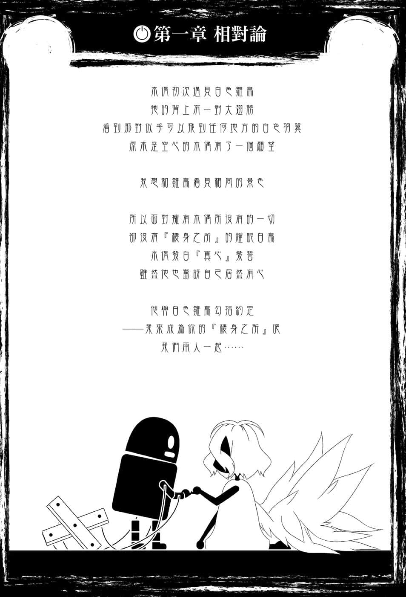
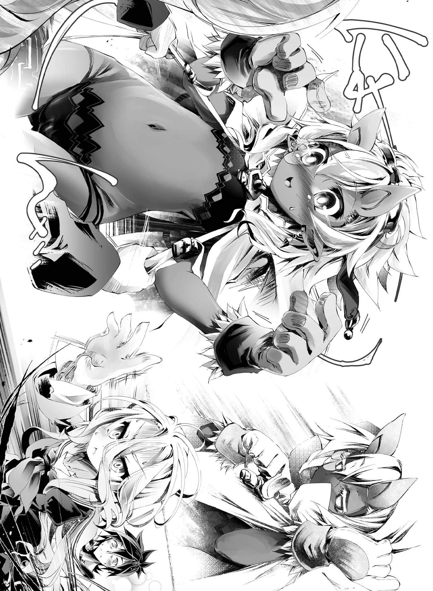

# 第一章 相对论

> 来源：https://www.linovelib.com/novel/9/2132.html

——经过一番熟虑后，空与白重新面对眼前的问题。

眼前——也就是躺在眼前床上的地精种（推测）。

他全身披着像是消防员的斗篷，性别不明——不。

如果没有依蜜尔爱因的情报，连他是否是生物也将不明。吉普莉尔将这个好似『背包』的『物体X』采收、搬运、水洗之后，放在床上……然后到了现在——

「这样他都没醒来，该怎么办才好？」

「……哥……他……真的还活着？」

『物体X』仍然一动也不动——看起来『生死不明』。

两人正感到不安，吉普莉尔恭敬地单膝跪地说道：

「既然是在主人的田里采收到的东西，那就是归主人所有，要怎么料理他呢❤」

……即使将标准退让到地平线，就当她的歪理说得通吧——可是！！

「你说这个『搞错长宽比的压扁大胡子』属于我！？我才不要啊！除了快点叫醒他『请他回去』，我还能怎样啊！？」

空想起初次见到地精种那一日的『失望』，不禁放声痛哭。

他原本还怀抱期待。

在这个世界……兽人种是兽耳女孩，海栖种也不是鱼人，而是人鱼。

森精种也确实有白色肌肤和金发长耳。

所以空原本对这个世界还怀抱梦想。

那么地精种应该也是像漫画那样的怪力少女！或者是成人游戏那样的合法萝莉吧！

总不会那么忠于传统——『男女都是身材健壮的大胡子』吧！！

……但是梦想终究是梦想，现实令空悲伤流泪。

然而——

「……【碍事】真灵银和感应钢，只有地精种能够加工，不言自明。」

……空只搞懂那是令男生振奋的设定，内心感到佩服。

吉普莉尔咽一口唾液，继续说道：

在艾尔奇亚一隅的这个小店的寝室里。

「这把大槌是我从土里挖出捡到的东西——是的……我能够捡起。」

「正是如此——不愧是主人，果然主人也发觉了。」

空与白眼眶一热，露出微笑，打算成全她的愿望，开口准备夸奖她。但是——

空与白眼神质疑，那么地精种又是肩负怎样的现实问题呢？

虽然对吉普莉尔说的『触媒』并不十分了解，不过——

「不，主人，只要有神灵种欧肯因的火就能够加工❤」

「地精种的体毛是『真灵银』，眼眸是『感应钢』，两者都是特殊的灵物质——」

而吉普莉尔则是继续说道：

简单说，地精种并非没有『魔杖』就不能使用魔法。

「啊——现在的爆炸并不是错觉喔！？真的有爆炸吧！？」

不接受必败的游戏，『留在这个房间不出去』，或是答应进行游戏『成为所有物』。

吉普莉尔再次咽下一口唾液，朝地精种走过去。

——那么重要的东西……为什么在吉普莉尔的手上？

————『灵装』……

三个种族敌意交错，互不相让，主张没有交集。不过——

「…………他好像……早就醒了……？」

「【嘲笑】夺取神火炉等于要压制锻神，要求公开计划。反正一定没有计划，本机早就料到。」

常识组的空和白完全听不懂她的说明，不过……

但是吉普莉尔却利用转移，遮住空的视线回答道。

「【反对】只是采取的话是可行的。【建议】分解素材与转售，发大财。」

「没有这把大槌——不使用魔法的话，他既走不出这个房间，也不可能胜过我❤」

……能够捡起。没错，她能够捡起，那就代表——！

吉普莉尔手里拿着光刃，请求空与白下达『挖矿指示』。

——『这个世界没有比地精种更优秀的 东 西。』

讨论的结果似乎满场一致赞成『杀害』，正当空大声反驳的时候——同一时间。

「我手上的这把——『灵装』。」

没错，吉普莉尔可以强迫他接受游戏，因为——

——第三次爆炸的冲击震撼整间店。

魔法少女们肩负成为主要收入来源的现实宿命，所以一定会配备道具……

「欸、那个～～！！依蜜尔爱因♪无法加工是什么意——」

尽管对滔滔不绝的吉普莉尔吐槽，不过空与白其实心里很清楚。

第二次大战回避失败了吗？空的心情相当恐惧。

——天翼种、机凯种、森精种——以及地精种……

空与白发觉她吞口水的动作，很接近『馋涎欲滴』的感觉——于是又闭上了嘴。

「喂，你们没人打算想起『十条盟约』吗……别以杀人做为前提呀！？」

「……？那样叫优秀……？反而……很逊……吧……？」

……是他想太多了吗？

如此一来，这个地精种只有两条路可走。

「另外，将刻印术式与多重复杂的复数触媒组合在一起，搭配设计为可借由挪移或变形，变更刻印术式组合的机械，借由做为『核心』的触媒『核媒』产生同步后，他们就能行使多种魔法——甚至可以使出类似本来是森精种专利的多重复合术式。而那个机械就是——」

那是一把巨大的大槌，原本与物体X一起埋在土中，长度大概跟空的身高差不多。

「都无所谓啦～❤为了不污染土壤，我们把他埋在地底深处吧♪」

再次开启过去大战的条件阵容，如今似乎都齐聚一堂了……

「是，主人❤那是古董机械的误报，请您无视她说的话❤」

「是的，如果他要求归还，主人们是必须归还。但是包含这把大槌在内，我也只不过是主人的所有物，所以我自己并没有『归还的权利』！！」

纯粹是——『力量太强大』，没有『魔杖』就无法控制。

「要如何加工呢！？请、请主人指示！嘿嘿，嘿嘿～」

「你至少也把他当成生物看待吧！？现在立刻把灵装还给他吧！？」

「他们一旦在体内运用精灵，真灵银的性质就会扩大精灵的功率……由于最坏的情况会发生『过度强化』——也就是失控暴冲，所以在体外要以『感应钢』配合触媒使用魔法。」

正如笑容满面的吉普莉尔所说，也就是——

「那么主人，在两位回避之前，我有一个请求。能够增强精灵的『真灵银』与具有灵魂同步性质的『感应钢』，在大战的时候要挖多少有多少，但是在『十条盟约』之后则是非常稀有的『活矿脉』了……」

「因此就算他要求我归还，我也没有义务归还♪虽然对主人们失礼，不过只要两位暂时离开房间，让我跟这个地精种【向盟约宣誓】玩个小游戏——这个地精种就会是两位主人的所有物，这是确定的事实❤」

吉普莉尔断定这个地精种是『主人所有』的根据为何。

然后，回想吉普莉尔刚才的发言——看来似乎不必担心天降陨石了。

「【同意】何况该物质本来就无法加工，再次确认天翼种的智能不足，笨～蛋～」

而且触媒上每一道细密的图纹都是所谓的刻印术式。

感受到明显不是错觉的『爆炸热度』，空瞬间护在白的身前大叫。

不过，令人感到意外地——一直在房间角落袖手旁观的两种族竟然与空意见相同。

听完她的回答，空与白的眼睛眯得更细了。

「不……可是『侵占遗失物品』明确违反『盟约』吧……」

…………

——原来如此，魔法……也就是无法理解的超常力量。

——在说了一长串专有名词之后。

这时他们忽然想到——

……的感……觉————！

「主人，恕我僭越，请您三思。」

「具体而言，他们优秀到需要这样的『触媒』才能行使魔法。」

忽地……空将视线从天花板拉回，与白对望一眼，心里想到。

「……如果失主要求『归还』……就会强制归还……」

吉普莉尔道出恶魔一般的巧妙计谋，露出希望主人夸奖的眼神。

空与白都心想——他们感受到震撼建筑物的爆炸，真的是错觉吗？

空忍不住发出悲鸣。

只要将这些零件组合……就可以使出非常厉害的魔法……

…………奇怪，难道是天降陨石了吗？

森精种与机凯种话一说完——啊啊，又来了……

吉普莉尔再次咽下一口唾液，空与白的脸颊则是冷汗直流。

为了回避第二次大战，空尽可能以开朗的语气询问依蜜尔爱因。

杀意爆炸性地喷发，空仰天叹息，陷入本日第二次的忧郁心情。

「真是的……只会杀戮的恶魔，脑袋就跟单细胞生物一样，所以才让人伤脑筋啊。」

吉普莉尔收起翅膀，双手合掌，宛如祈祷似地接着说道：

「吉普莉尔，也就是说没有那个灵装，这家伙就无法使用魔法是吧。」

也就是说，这把大槌的无数零件全都是触媒。

空与白立刻联想到『周日的晨间动画』，并且同时感到疑惑。

常识组的空与白理解之后，心想不愧是序列第八位，反而感到安心的时候。

「由于『盟约』的关系，『窃盗』是不可能发生的行为，所以这把大槌是遗失物品，『捡到』就是我的东西——也就是『盟约』认同它是主人的物品，因为我也是主人的所有物。」

「【推测】地精种『装睡』企图逃亡，但是灵装损坏，术式失败爆炸，轰隆～！」

「——这个世界没有比地精种更优秀的东西。」

不过——

吉普莉尔高举一把机械式造型的大槌。

吉普莉尔高举手上的大槌做了一个总结。

空与白忍不住往窗外看去，担心起今天的天气。

——吉普莉尔这家伙……真是有所成长了啊。

「什么……意思是他们需要类似『魔法杖』之类的物品才能使用魔法吗？」

白与依蜜尔爱因指着在房间角落发抖的烧焦背包。

听她们说——那名地精种背包早已清醒，先前一直在寻找机会逃走。

然后，因为逃亡魔法爆炸，他抱着粉碎的大槌与头在发抖。

……不过那也是当然的。

因为他一醒过来就发现，剥夺自己人权的计划吉普莉尔的圈套正在进行中。

天翼种、机凯种、森精种在讨论『如何杀死自己』——根本就是一场恶梦。

即使如此，他仍是夺回灵装设法逃走，空与白都不禁佩服这位勇者。

「——？奇怪……为什么会发生那样的事……？真是难以理解。」

「吉普莉尔，你刚才明明打算杀死他，如果你这句话是真心的，我可是会感到害怕啊。」

「啊，不，主人，不是的……请看那边——」

恶魔吉普莉尔的语气似乎打从心底感到不可思议，空与白闻言看去——顿时惊讶得睁大双眼。

——只见在恐惧颤抖的地精种周围，『无数的残像』以空与白难以辨识的速度飞窜。

他们并不知道那些残像是什么，不过原本粉碎的大槌却宛如倒带一般逐渐复原。两人勉强看出，无数的残像是有如变戏法般飘飞在空中的『无数工具』。

「正如主人所见……地精种是『手艺极为灵巧的种族』。」

「……嗯……虽然看不见……也看不懂，不过……」

「嗯嗯……至少知道是手艺灵巧到让人看不懂的地步了……」

正如同字面意思，『修理的过程』快到令人目不暇给。

空与白看傻了眼，心想看来地精种的手艺灵巧也是忠于古典设定。

不过——

「那样的种族竟然会失败？而且还是在刻印术式上……真是让人难以理解——」

「——……妹妹啊……哥哥可以请问你，你在做什么吗？」

仔细确认过安全后，游移颤抖的双眼——忽然与空四目交会。

——原来如此，魔法所需的灵装毁坏，他要逃也办不到。

「是啊，那么总之……可以请你先自我介绍吗？」

空呆若木鸡、恍恍惚惚，目不转睛地听着她的自我介绍……

甚至还『愿意做任何事』，已经做好无条件投降的心理准备。

「我豁出去了！！我是个在故乡也没有栖身之所的流浪地鼠！如果要在其他种族的国家生活，即使要当奴隶或宠物，我都有所觉悟只要留我一命就算要我当椅子——啊啊啊！？」

……拉～拉～……

——但是白也无法责怪哥哥，她不自觉地倒抽了一口气。

原来如此，如果是本来的空——应该会以次光速的速度咬饵。

「啊，主人，『潜陆舰』是地精种的船，能在地下移动。」

空对着刚才差点引起大战的家伙们怒吼——

她哀愁的声音也激起人的庇护欲望。

然后她露出惹人怜爱的表情，用缺乏自信又不安的语气说道：

抓住用途不明的一个零件——有如绳子的吊带，然后拉呀拉的。

「因为森精种与地精种就像是不相容的水和油，关系之差可以说是不共戴天。」

「重新来过——我是空，这位是我妹妹白……抱歉，我是我妹妹的预约座位。」

---

■ ■ ■

——缇儿威尔古。

但是不惜制止天翼种、机凯种、森精种也要占有自己，其中一定有什么好处。

神秘的苍白眼眸，仿佛有暗淡的火焰闪动，色彩之艳丽确实符合其神话中的钢铁之名。

「呃～总之我不会让任何人杀你，那个～你没事吧……？」

「啊，主人，看来地精种选择『赌赌看尝试自爆逃走』了。」

哥哥仿佛灵魂出窍似地失魂落魄，陶醉不已。

译注：空的名字在日文中就是天空。

头发是与身体形成对比的银色——不，是闪耀着真银的光泽，头上还长着一对角。

——原来如此，果然地精种不是一开始就长在田里。

「我是貌似地精种的废物地鼠！我的名字叫——」

然后推开地精种的妹妹坐在空的胸口上——

「……这里是……白的位子……你这女人想做什么……！？」

白将这个确信会是『天敌』的名字刻印在记忆里，立刻走了最精确迅速的一步棋。

是啊，妖精和矮人的关系恶劣在古今中外都是定律——但是！！

如果这个饵不是『女孩子也有胡子的矮胖种族』，他也不会无条件忽视。

「快阻止他呀！？克拉米，把菲尔带走！吉普莉尔——」

仍然恐惧得蹲在地上的地精种，听见空的声音，忐忑不安地抬起头。

折断旗子的手，伸向平坦身躯上过于暴露的衣服。

「我的名字叫——缇儿威尔古的尼——……啊？」

地精种于是擅自做好不满足空的要求，自己就会没命的心理准备，向空乞求饶命。

不过地精种的回应却是扑进空的怀中，推倒了他，在他怀中嚎啕大哭。

然后打开背包——更正，打开覆盖全身的斗篷，地精种的少女——

恢复和平的室内只剩下空与白、被命令正座的吉普莉尔，以及——

那么成为所有物的命运就无法避免，他只能选择接受。

对于造成地精种号哭的可怕元凶，空还是吐槽了一下，同时在内心整理。

两个兵器闲话家常似地告知地精种自爆的前兆，空的怒吼瞬间化为悲鸣。

「哦，谢谢你的补充——原来是因为吉普莉尔的关系，他才会求我『饶命』吗！？」

「对，请多指……教——？」

因为剥夺人权的圈套，自己被人恳求饶命，空不禁大叫。

那是拥有一身光滑的褐色肌肤，身上只有几块布料蔽体的……年幼少女。

——啊啊……推倒自己哭喊的地精种，他的声音确实——就像少女一样。

话虽如此，看到妹妹对基本上算是『女性』的人还是会吃醋，空因感到温馨而苦笑。

「我、我是貌似地精种的废物地鼠！」

那个人开口说道：

地精种少女露出脸和身体，她自我介绍的声音宛如从远处传来。

然后室内接连响起空、白和克拉米的指示与恳求声……

正因为如此——！！白失去理智地采取行动，没错——

白坐在哥哥的大腿上，看到地精种打开背包似的斗篷，现出身影。

……不管怎样，空先请点火的炸弹们离开房间。

斗篷内苍白的眼眸，到底在空的黑色眼眸中看见了什么呢……

哥哥会看得入迷也是难怪，不，应该说是必然且理所当然吧。

「菲尔的个性是那样吗！？不对，克拉米，她是你负责的吧！快阻止她呀！！」

「抱歉打断你说话，在那之前，可以请你先说明那边的难解现象吗？」

或许是因为菲尔对地精种异常的敌意，原本在房间角落呈现放空状态的克拉米，听到空的呼喊，猛然恢复意识，赶紧尖叫制止菲尔。

「啊，主人，既然灵装已经损坏，地精种就确定是主人的所有物了❤」

「像、像我这样的废物地鼠，不知您救我有什么用意！您、您要我做什么吗！？要、要怎样才可以不杀我呢！？」

不过他的求饶却突然变成怪叫，空胸口上的重量顿时一轻。

空摸了摸仍在低吼威吓的妹妹的头，报上名字肯定妹妹的说法。

空坐起上半身，将白放在固定位置，自己的大腿上。

「咦……有人说过我的名字吗？——哇啊——！？」

---

■ ■ ■

空要求吉普莉尔说明的就是——阻止地精种修理灵装，煽动地精种使用魔法的森精种。

「啊——！！是是、是我失礼了！！我应该先现身一见！！」

「哦，谢谢你的补充——可是让他这么害怕，你难道没有别的话要说吗！？」

——因为那名地精种既没有大胡子，身形也不矮胖。

地精种急忙站起来，立正敬礼。

看到情况，地精种不知是理解到自己的无礼，还是单纯感到生命危险。

「地鼠即使没有灵装也可以使用魔法哦！只是一不小心会因为体内精灵过度增强而自爆唷！！反正你会被杀，干脆赌一赌，使用逃亡魔法吧！！我想看看地鼠帅气的一面呀！加油～自爆❤自爆❤」

「在、在地下一万公尺处……潜陆舰在浮上途中坏掉了！我、我不眠不休地挖洞……挖到看见太阳原以为得救——醒来却发现自己身在地狱～～！！」

空反射性地回答，但是立刻讶异地皱起眉头问道：

「【警告】感应到精灵过度强化，强烈建议主人躲到本机的裙子内避难，请进。」

「咿～好可怕哦～！！我该怎么办才好呢～！？」

但是畏缩在空怀里的地精种似乎仍感不安，宛如寻求依靠似地不断哭泣。

看到白无言地拉扯着吊带的光景，回过神来的哥哥问道。

——看来森精种似乎也不打算放过杀死地精种的机会。某位巨乳笑容满面，在地精种的周围蹦蹦跳跳——委婉地叫他『快点去死❤』。

——

——对于大战时炸了森精种首都的吉普莉尔，菲尔也只是为难一下便原谅了她。但是对地精种，菲尔却有极为强烈的敌意，令空感到难以理解。吉普莉尔则是恭敬地低下头回答道：

「…………『空㊟』吗……」

「————咦？我、我不知道菲有那样的一面呀！喂！菲！？」

白发出不悦的威吓声，空这时才发觉。

「十六种族有哪个不是不共戴天了！？重复设定会使角色崩坏，这样的设定你们也接受吗！？」

但是白也答不出来——只是张着嘴，避重就轻地回答：

「…………按钮是给人按的……绳子是给人拉的……」

「嗯，我明白，所以我也很想请你换我接手——白小姐？你有听见我说话吗？」

「那个～！我好像正受到非常羞耻的对待耶！？」

白无视他们的抗议，持续拉扯着吊带——脑中则是飞快地思考着。

——自己为何会认为她是天敌？

即便是擅长归纳性思考的白，却也在不明白的情况下，被这个『问题』所困扰。

白毫无根据地断定，眼前的『少女敌人』危险无比。

「……话说回来，吉普莉尔，我有一个极为重大的问题，请你慎重回答。」

哥哥也压低声量提出一个『大问题』，那就是——

「就我的记忆……地精种应该是『矮胖的大胡子种族』呀？」

「是的……啊！？啊啊……啊啊！很抱歉，主人！！」

……听到『地精种的容貌设定问题』——白的心中涌起不明的焦躁感。

——————不妙了……

「从主人们的言谈，我早该察觉主人们只知道地精种的男性！」

拉～拉～拉～……白紧握绳子。

对——就是这一点……首先就是这一点不妙……！！

「地精种是外表有明显性别差异的种族……比如说，女性的『体毛较稀疏』，另外一个特征就是——一般额上都有角。」

拉～拉～拉～……白悔恨地咬牙。

对——因为每当拉动绳子就会裸露出的浑圆肚子，证明地精种的女性不是大胡子。

「不用有助益啦，缇儿单纯就是属于我的。」

「……怪了，那么想成为我的主人的奴隶吗？你难道对生命那么悲观吗？❤」

觉得害羞？那就别穿得好像只穿内衣的装扮就好了吧？

没错，这是最后通牒——没有让步或讨价还价的余地，胆敢不接受的话——

「我只有一个要求，依照当初的预定『请你回家』，好了……」

听到哥哥的声音，白的手忍不住颤抖。

依蜜尔爱因的意思就是——除了做色色的事之外，如果还有别的动机，那就说说看呀。

「那么姐姐或母亲都可以——总、总之我快被瞪死了！！」

白心想……哦～……原来如此……

白目光锐利，仔细观察缇儿威尔古——更正，缇儿的话语和表情，想要查出令她产生危机感的原因。

「【必然】她是企图NTR本机主人的因子。【再提】解体并转卖该地精种，滚回去～」

「……哥的妹妹宝座只属于白！！……绝不让给任何人……OK？」

听见突然响起的打击声，包含空在内的在场众人同时回头。

虽是轻声细语，但是语气中却含有不容反抗的敌意。

她和依蜜尔爱因相——相、同——？

……但是……那又如何？这也不是头一次……

经过强制停机然后再起动，思绪恢复正常的空，愣愣地叫了一声。

然后…………『啊』——

而且白发和萝莉属性也重复，甚至哥哥喜好的属性全部集于一身……

想要受女生欢迎是男生的天性，然而想不到受欢迎后要做什么则是处男哥的天性。

经过清醒的事件之后，立刻便被攻陷——原来如此，这次又是什么？

————《假设》——因为『哥最近太受欢迎』？

她软弱的视线和声音能够激起人的庇护欲望——于是白开始假设。

白脸上挂着笑容，眼神却如恶鬼一般。

初见面就展现易攻略女角的立旗本事，旗子插得像是刺猬一样。

「依蜜尔爱因……我不是请你出去了？你又用光学迷彩了吗！？」

——『这个地精种是哪种角色』——？

「从今天起，我就是你的家……『欢迎回家』……『缇儿』☆」

——既是无依无靠，又好骗，令人想要庇护的笨拙女孩。

听到哥哥指谪自己脱序的思考与表情，白立刻放手，但是——

她确信自己已认清『前所未有的危险敌人』，脸上露出宛如冰原裂缝般的笑容。

————《假设》——因为她是『暴露狂』？

「我、我也当空大人的妹妹——啊，我已经八十四岁，这样可以吗！？」

——那就开战了。

何况自从来到这个世界的那一天——当晚就有某个红发好骗女角立刻上钩！！

看到空被追问不可能会有的动机，白的危机感与疑问更深了。

遇上哥哥最爱的属性——压制东部联合时，白也不曾有过这样焦躁的感觉。

————《假设》——因为她是『废物女』？

如果是本来的哥哥——一个十八岁处男的话，他一定会以次光速的速度咬饵！

他张开双臂，露出闪亮的皓齿，做出令人噁心的发言——！！

「我怎么敢奢望成为奴隶！我想都不敢想！！空、空大人！？」

「………………！！」

「没错！我从现在开始就是空大人的友人——」

「我、我是废物地鼠哦！？连、连灵装也造不出来，更没有栖身之所，只是一只流浪地鼠！！收留我肯定不会有任何益处哦！？」

对白而言，虽然她极为不愿意，但是——现在才追究哥哥的女人缘也太迟了！

「那、那么我是空大人的奴隶吗？还是宠物呢？」

这实在无法说明，为何自己有一股难以言喻的危机感，而且本能也严厉警告自己。

「【偷听】符合主人性方面喜好的异性体，占有的动机——推测是『发泄性欲』。」

「…………『最后通牒』……我只说一遍……仔细听好……」

——回答的声音正好符合白心中所想。

「………………咦？得到之后要做什么呢？」

————

吉普莉尔也只是因为主从关系的认知，所以对天翼种内心的感情没有自觉而已！

……为什么连下面也打开？为什么？

不对，这并不是最近才开始的事！白痛苦地摇摇头。

「怎样的家庭环境会出现年长六十三岁的妹妹呀！？再说我的妹妹只有白一个人哦！？」

到底有什么根据让自己断定，眼前的地精种是『前所未有的危险敌人』。

「那、那么我身为空大人的所有物——具体来说该做什么才好呢？」

白注视着这场骚动，她感觉自己的红眼似乎能看到接下来的发展。

「……我、我该不会……无条件得到收留了吧？」

「还、还是说……像这样被拉扯着绳子，能够帮上什么忙吗？」

只见白的拳头埋在墙里，摆出对缇儿壁咚的姿势，接着说道：

「原来如此，那么——缇儿威尔古？那我就重新对你提出要求吧。」

「另外，男女身高都很矮，女性即使成年，体型上——也以『稚气』形容较为恰当。」

缇儿战战兢兢地敬礼，有如悲鸣似地回答，随即一片寂静。

「——是、是是！遵命！！完全同意！！」

————

「欸～慢着慢着！！……朋、朋友……对了！！我们是传说中的朋友！！」

这一层意义令白的理智断线，她露出凶猛的笑容，手一伸——

——《假设》到这里，白突然感觉头脑急速冷静。

给有萝莉倾向的哥哥看你的萝莉身材，你到底有何目的——！？

而且根据吉普莉尔所说，她还是合法成年的少女——

但是宠物角色有伊纲和帆楼，好骗女角则是固定由史蒂芙一人担任，那么——

看到缇儿立刻逃到哥哥的背后，并且听到接下来的谈话——白露出如刀一般锋利的眼神。

——在『妹妹的角色』上与自己角色重复？

然后地精种哭哭啼啼，替白的《假设》宣告『正确解答』。

……吉普莉尔与依蜜尔爱因才刚在奴隶角色上『角色重复』。

---

■ ■ ■

对——也就是说胸部也是一片平坦，这些特征讲白了就是——！！

「啊～等一下……我说白啊，凶神恶煞的幼女白不断对面红耳赤的幼女地精种性骚扰——在旁人看起来相当可怕哦！！」

不露面很无礼？那可以打开斗篷，只露出脸就好了吧？

——『褐色萝莉鬼女』仅次于『兽耳女』，也是最符合哥哥喜好的属性…………

……拉～拉～拉～拉～——！！

「两个都不是呀！？十八禁的设定是绝对禁止的哦！！」

「冷、冷静一点，白！不对，该冷静的是哥哥！！」

——『褐色萝莉鬼女』…………

「啊！空、空大人！刚才您说自己是『妹妹』的预约座位！！」

——有觉悟『愿意做任何事』的女性。

看到她脸颊泛红的模样，白内心断定『不对』。

如果哥哥有戴眼镜的话，现在眼镜大概亮了一下吧。

「【要求】拥有友人的正当性，提出异性间成立友情的根据……本机不行吗？」

这个香饵空先前曾经无视，而且又经过伪装，这次空则是以超越光速的速度咬饵。

「…………呼～呼～……吼～～！」

白不停威吓正在检讨设定中的缇儿。空将白抱了起来，内心大叫。

——冷静一下，根本不用想什么设定嘛！

缇儿既不是奴隶，也不是宠物或姐妹，更不可能是妈妈！

毕竟根本还没有比过游戏——『空本来就没有所有权』！！

吉普莉尔擅自设局陷害！缇儿也自己以败北为前提认输！！空也只是看到从田里采收的背包中迸出褐色萝莉鬼女，被这个装扮惹火的美少女给牵着走而已！！缇儿从头到尾就只是——

——『顾客』——不对。

正确来说——她是棘手的顾客派来『药局』的『使者』……

在逐渐冷却的思考中，空依照原本的预定，重新整理情报。

对方确实是期待已久的『顾客』——但是……

空慎重地探问——

「「「………………」」」

「那么缇儿小姐！？你来艾尔奇亚的目的是为了工作还是观光！？」

「啊！不是！！大、大概是『漂流』或是『难民』吧！？」

——虽然想要探问，可是空怀中的白仍是不断发出低吼。

结果空希望问出什么？吉普莉尔和依蜜尔爱因还是没有得到答案。

面对来自三方的『压力』，空狼狈不堪。缇儿也泪眼汪汪回应空的问题。

「我、我在首都被首领堵到，他交给我一封信——咦？信、信呢！？」

缇儿开始找『信』，一旁的空则是小声地询问吉普莉尔。

「——吉普莉尔，我先跟你确认一下……她说的『首领』是——」

因为故乡没有容身之处，所以也没有回去的动机；而除非把信带到，否则她也不能回去，所以她甚至也有不回去的借口。

「——那么我们也一起去的话，你应该不会有意见吧？」

「……为了『药』的……『面交』……我们要去……哈登费尔的首领家。」

「——欸，那么我只是被命令『跑腿』而已吗？」

空与白立刻站起，准备告知缇儿，但是——

空也摊开空空如也的双手，语带讽刺地回应。

——空高声大喊，想用气势掩饰不纯的动机。

「对，价钱就是——『你们国家的全部』。」

「————我在和怪异至极的人说话！？」

克拉米露出充满讽刺的笑容注视着空。

缇儿紧抓着安身之所空与白，像是颤抖的小狗似地问『你们要抛弃我吗？』。

送货地点已知是哈登费尔，空与白便开始做旅行的准备——

——看来她并不是因为遭到放逐而自暴自弃。而是打心底真的不想回哈登费尔。

「我、我不会回哈登费尔！！我、我的家就在『这里』！归处就是这里……对吧……？」

————

「哼，谁怕谁啊！那种烂国家，我才不屑留呢！！」

「——故乡原本就没有我的容身之处——可是其他国家……又有哪里可以容身……」

「那大概不是没有收信人，而是寄给空与白——也就是收信人是『 空白』。」

缇儿自暴自弃地鼓起脸颊回答道。

——那张肮脏的纸上既没有收信人，也没有署名，只写了一句话。

缇儿的反应就像是见到崇拜的偶像的粉丝，空眯起一只眼睛说道：

「天无绝人之路这句话真的没错！！再见了大头目欧肯因！！我要在这里活下去！沙漠里的针反正也会变成沙！那么那根针已经是沙了！鬼才去找沙漠里的沙呢——呸！」

别说是没到沙漠，在这里发现这根世上最怪异的针，缇儿不禁恸哭。

「那么——我们距离目的地哈登费尔首都九千七百四十八点七公里……」

那么问题就只剩下……哪里的哪一位是需要『药』的『顾客』。

「——既然要卖『药』——首先要下『毒』。」

「……借问一下，那位『首领』怎么知道我们在这里？」

「……他所订的『药』——有点贵……」

——只要先制造『濒死的顾客』……『中毒的顾客』。

「价格与世界第二位的国家相同的『药』……我真想知道是怎样的『药』呢。」

「……夺得之后……要怎么办呢……？」

「你的家当然在这里，只不过『哈登费尔』会变成『 空白』的家而已。」

…………

因此遇见空与白正可说是天赐良机，她以充满感谢的眼神看着收留她的空与白——

得知自己只是『被捉弄』，缇儿流下大颗泪珠，气愤地猛跺脚。

白冷眼再次提到悬而未决的问题，十八岁处男的空则是噙着泪。

——原来如此，所以她才说自己没有栖身之所，是流浪地鼠。

缇儿说不出话来。白与空狠狠地嘲笑之后，高声宣布：

————？

——缇儿做出空有其声的唾吐动作。

——原来如此，来到艾尔奇亚的目的是『漂流』。

听着缇儿的自嘲，似乎她也看开了，空与白互相交换一个眼色，点了点头。

——只有一件事令空感到在意，于是他开口问道：

……身边带着天翼种与机凯种的——两名家里蹲的人类种。

她以为首领输入空等人的座标是把她放逐国外——

……如果有的话——

……于是『顾客』就是『首领』……地精种的全权代理者。

「喂喂～我教过你了吧？这是『买卖的基本』呀。」

「……呃、那个……？缇儿——你没有打算把针找回去吗……？」

空与白宣布早已决定好的行程，开始打包行李。

这段时间用尽方法也无法找到空他们的菲尔和克拉米，两人露出锐利的眼神继续说道：

空与白原本就是『药商』，来找『药商』当然是为了买『药』。

「很遗憾，我们现在只是普通的『药商』，所以我们要送药过去。」

「即使只是普通的『空瓶』——也能卖得比国家还贵♪」

就在这个时候——

那么对缇儿来说就是『坏消息』了吧——空在内心更正，然后将现实摊在她的眼前。

「我不知道，反正一定和往常一样是靠『直觉』吧！！」

……难怪明明要被人拥有，她却显得很积极。

「完全没那个打算！！这可说是天赐良机！！」

「啊，欸、空大人与白大人——两位是那对艾尔奇亚的王吗！？」

「因此我们要出征了！去夺得我们的新家——『褐色鬼女王朝』的理想国度吧！！」

就在空与白哑口无言的时候，原本开心地说着的缇儿——脸上浮现愁容。

看到缇儿发泄完长久累积的不满后所露出的笑容，空与白终于明白了。

两名偷窥狂……克拉米与菲尔打开门，以理所当然的语气表示，她们已经全都听见了。

毕竟空与白已经先看过那张纸，然后才放回缇儿的口袋——

「是，地精种在传统上是以『使用灵装的游戏』来选出代表。也就是说，首领即是全权代理者，同时也是地精种最优秀的灵装匠师。」

那是寄给空与白的信——不过缇儿似乎并不知情。

没错——『如果要贩卖「供给」，就要先创造「需求」。』

——不知为何，她眼中闪烁着光芒，语气显得相当兴奋。

不过——那位『顾客』的使者似乎并没有听说这件事。

——我怎么可能 抛弃 褐色合法萝莉鬼女！

空则是对她微笑。

现实就是——想找的东西大多都是在『放弃寻找时找到』。

空与白心想确实没错，他们面露苦笑，内心同意缇儿的说法。

只要经由正式的手续，其他种族也可以移居艾尔奇亚，更何况——

房间外甚至还有一对关系亲昵的人类种与森精种。

「得到之后再思考！！听说机会的女神只有刘海，不过——我可没时间去追逐『九成秃的女神』！！我会设下陷阱，趁机会女神落入陷阱的时候抓住她——而现在就是那个时刻！！至于抓到以后要如何处置？那就抓到以后再说呀！！」

空告诉她：

即使发生政变，艾尔奇亚现在也仍是『多种族联邦』的盟主国。

「有了——不过……这能不能算是信也很难讲，这是一张肮脏的纸片。」

…………

「是、是吗……可是我们接下来就要前往哈登费尔了……」

那么——对缇儿来说是『好消息』吧——因为针已经找到了。

「……看到我们，你没有什么想法吗……？」

听见空所说的话，缇儿交互看着空与白和纸片。

于是无视克拉米与菲尔的怀疑，以及空与白自信的沉默，吉普莉尔行了一个礼后如此报告，她头上的光圈开始快速旋转。

缇儿抓着从口袋里找到的『信』，皱起了眉头。

「——————啥？」

「首领只叫我把这个『交给奇怪的家伙们』……然后就把我丢入潜陆艇，随便设定一个座标便出发了……我、我被逐出国外放逐了！！」

因为她被逐出国外，最坏的情况可能真的有生命危险——在寻求容身之处的时候，就被空与白收留了。

——「外地人 是本大爷啦 把药拿来 帐先记着。」

「我以为会变成奴隶，心里非常害怕……结果我又被首领耍了！！」

「因为像我这样的废物地鼠，在地精种的国家既没有栖身之所，也没有工作，所以首领才叫我『去沙漠里找一根针』——也就是这只是无关紧要的闲差！差一步就要被裁员了！」

「请抓住我的衣服，暂时放宽心等待❤」

吉普莉尔开始准备超长距离的空间转移。

除了依蜜尔爱因之外，每个人都抓住吉普莉尔挂在腰间的衣带。

「那么我们去去就回，依蜜尔爱因，拜托你『看店』了。」

「【无妨】留守是妻子的责任，本机会完成任务……本机不会寂寞。」

依蜜尔爱因一如往常曲解成自己希望的解释。

不过她言行不一，只见她挥动手帕表达寂寞。

克拉米眯起眼睛看着依蜜尔爱因。

——那是当然的吧。

因为空让监视他们而来的克拉米与菲尔同行，却把战力强大的机凯种留下。

克拉米与菲尔不禁窥探起他的真意——忽然间，一旁的缇儿小声地问道：

「那、那个……潜陆舰还在故障中——我们要怎样到首都去？」

「嗯？天翼种的空间转移，知名度意外地低吗？」

「不，听说她们可以转移至视线范围内与已知座标，在大战时是恶梦。」

听她这么一说，空与白想起重现大战的即时战略游戏，两人露出苦笑。

对，天翼种的转移正可说是恶梦……因为『那甚至让战线的概念都不能成立』。

看到天翼种的准备已进入佳境，空与白对她干笑几声，然而——

「……首都在『地下』，应该看不见才是——还、还有……」

缇儿接下来说的话，不只令空与白——

「是、是我的错觉吗？她好像在编纂『天击』的术式。」

正如缇儿所担心——吉普莉尔宣称要『从天空轰炸进入』。

两人留下这句话后便失踪，史蒂芙毫不怀疑地确信一件事。

先前『休息一回合』就是让危险分子从其他联邦旗下的国家开始刺探。

联邦旗下的国家不自然地袖手旁观，其他人都到哪去了……？

为了赶走脑中的幻想，史蒂芙开始找寻可以撞头的地方，想让因为太过孤独而失心疯的自己恢复正常。

除了唯一发出欢呼的菲尔之外，其他人全都全速冲出房间。

史蒂芙回忆空的说明时，布拉姆像是更加感到为难似地——嘲笑回应。

——空他们完全没有连络——每天都过得十分『和平』。

但是自称重义气的吸血种却是挺起胸膛，宣称自己会守信重义。

「森精种、地精种、妖精种、妖魔种——甚至连月咏种都参了一脚❤」

更正，因为已经是君主立宪制的关系，史蒂芙已成为『大公』——有名无实的艾尔奇亚『君主』。

空与白急速扩大势力，甚至打败神灵种——帆楼。

没错——只要拉拢《工商联合会》里面的人，那就能够并吞人类种。

史蒂芙问的这句话，言下之意就是『你也给我回去吧』。

「——是的，我也去过首都上空好几次❤」

——『史蒂芙，那么就按照惯例，你好好加油吧♪』

——每个人心中共同的认知就是『修理潜陆舰』吧——……

---

■ ■ ■

「……芦荟先生，我有烦恼……你愿意听我倾诉吗？」

商人原本就是利益至上——造成国民不安只是有害无利。

————？……！？……

那也就是说，所谓的哈登费尔是——

史蒂芙又是疑问，又是震惊，思绪一片混乱。

「我不是被任命留守……只是被晾在一边……这一定是我的错觉吧～♪」

由《工商联合会》在背后操控的诸侯议会虽然处于混乱之中，不过——只是如此而已。

「我和其他人不同，为了自己的私利！！我会诚心诚意地『暗中操弄』！！」

「和空……？和空怎样！？我这张嘴到底想说什么啊！？」

————————史蒂芙说不出话来。

史蒂芙大叫着赶他下来。

一道有如少女般的魅惑少年声音传来。

「那样的怀疑一直存在他们心里——如果是我的话，我会试着接触对空陛下与白陛下心怀不满的人类种——这次则是《工商联合会》里面的人。」

他的意思是——

布拉姆露出不幸又困扰的笑容，像是教导小孩似地继续说道：

没错……和平，毕竟政变就是……『篡夺政权』。

「我会告诉那个人，只要帮我查出『 空白』的真实身份，我就提供魔法支援，让他能胜过同业的竞争者❤」

这场由受到两人压迫者所引起的政变。

「那里是空和白的位子！！不是我可以坐，更不是布拉姆可以坐的位子！！」

「追根究底，空陛下与白陛下成为艾尔奇亚国王的那场国王选拔战……他们两人击败森精种奸细，你觉得会有人相信他们不是其他种族的奸细吗？」

史蒂芙如今才想到空与白托付她『留守』的意义。

「每个人都怀疑『 空白』不是普通的人类种……人类种也同样怀疑❤」

史蒂芙不禁自问，瞬间浮现各种桃色妄想。

史蒂芙独自在王座大厅，宛如歌唱似地流泪抱怨。

那么缇儿的担忧就是杞人忧天了，众人松了一口气，不过——

吉普莉尔脸上露出松垮的笑容，她擦拭着口水继续说道：

然而布拉姆却露出怜悯似的笑容说道：

「其他各国怀着这样的疑惑，不停向周围——『联邦旗下国我们』刺探『 空白』真实身份——正确地说，是刺探可能拥有甚至能战胜神灵种的『必胜王牌』。这件事你知道吗？」

吉普莉尔与依蜜尔爱因毫无疑问是跟着空离开了。

但是她却不坐在王位上，而是坐在王位旁的地上，对着捧在手上的盆栽说话。

「什么？在重义气方面信誉卓著的布拉姆，绝对不会离开艾尔奇亚。」

——————

距离那场骚动的遥远处——在艾尔奇亚王城的王座大厅里。

「……我也……想和空——————啊！？」

啊啊，时隔三周见到认识的人，为什么偏偏是吸血种……

话说到嘴边，史蒂芙发觉自己是为见不到空而哭泣。

他们大概又在自己不知道的地方，从事惊天动地的大事了吧。

「……布拉姆没有像其他人一样回本国去吗……？」

『 空白』做到无人能做到的事，因此被怀疑握有『必胜王牌』。

「你为什么会认为刺探的周围国家中——『不包含本国艾尔奇亚』？」

——即使搬出各种冠冕堂皇的理由勾结在一起，《工商联合会》那群人的目的说穿了都是为了『利益』，那么——

这句宣言直白得让人真的以为他很诚实，史蒂芙叹了一口气——然后顿时身体僵住。

除了依蜜尔爱因之外，还有另一名被交付留守的红发少女。

而被取消一切权力的『君主史蒂芙』只是独自对着芦荟发牢骚。

「要从哪里开始说明呢……？『「 空白」不是普通的人类种』——」

——史蒂芬妮・多拉公爵。

……空与白因为政变而被赶下王位的那一天——不。

史蒂芙背负起已经习惯了的人类种存亡重担，内心做好觉悟，至今已过了三个礼拜——

空代替其他人提出心里的疑问，吉普莉尔则是端正姿势点头道：

——甚至也令包括吉普莉尔在场的全员侧着头沉默不语。

「『首都』确实是在地下，不过地表上则是开拓出各式各样的都市。从高层都市到海上都市，众都市形成网状连结，是一个令人非常感兴趣的国家——我造访过很多次❤」

在血液逐渐被抽干的感觉之中，史蒂芙听着布拉姆嘲笑般的声音。

「……你们总是自己处理……太狡猾了……」

「咦？王位坐起来不舒适的话，我随时可以代劳哦♪」

因为对方讲得太过自然，使人迟了片刻才感受到突兀感的这句话——

他声称会守信重义，确实地『背后捅刀』。

既然他们说『按照惯例』，那就表示这也在算计之内。

「……吉普莉尔呀……！你有去过哈登费尔吗？」

糟糕……为什么没有发觉！？

史蒂芙脑中闪过对神灵种之战时被排除在外的回忆，低头将脸靠在膝上。

「我、我知道……所以周围——『联邦旗下国你们』趁机钓鱼。」

行政虽是混乱，不过以政变来说，这个状况太过平静——但是只要收买《工商联合会》里的人，就能够掌握政权——这是『并吞人类种』的大好机会——！！

「你说『暗中操弄』——这、这场混乱——吸血种也参了一脚吗！？」

这么说来，即使是长距离转移，吉普莉尔的准备也太久了。

「芦荟先生……我又被排挤了吗……？」

——是他们刻意引起的政变。

「只能俯视地上的日子也到今日为止，这次得到对方『入国许可』了！！我会转移到上空，以一％的『天击』开出往地下的通道。只是编纂防护主人的连续术式，要稍微花点工夫——」

而且『按照惯例』——这也是可能令艾尔奇亚灭亡的策略。

因此《工商联合会》并非代表国民发动『革命』，对外只是当作贵族的内乱——『政变』来处理，并且发行兑换纸币。流通活化、贸易缓和……至少从国民的角度看来，生活并没有什么改变，日子过得非常平和。

这代表史蒂芙的危机意识完全不足，因为——

空战战兢兢地问道：

「——岂止吸血种，吸血种只是其中之一……光是据我所知就有——」

对于飞天的好奇心吉普莉尔而言，那个国家宛如『百宝箱』——她不可能不去。

他们不接受游戏，轻易交出王位的那一天。

「有，毕竟地精种是最擅长『工业与产业』的种族，所以地精种的统一联合国即是这个世界『机械文明』最发达的国家♪」

只见不知何时，王座上坐着一名吸血种。

吉普莉尔紧接的这句话令众人为之冻结，然后立刻无言奔离。

「——会有这种想法的人，一定不止我一个吧？」

史蒂芙只感到一阵头晕，她勉强挤出声音叫道：

「那、那么现在的艾尔奇亚——为了掌握政权而正在行动的《工商联合会》是——！」

「就是『内奸的大本营』！！勾结外敌、泄漏情报、密约！！根本是卖国的模范城市。」

——听到布拉姆的下一句话，史蒂芙更是仰天叹息。

「还是你要我说得更明白？艾尔奇亚被『他国剧毒』侵蚀，已经濒临灭亡死亡了❤」

……他说得没错，如果掌握艾尔奇亚的《工商联合会》全员都是内奸的话……

这表示艾尔奇亚……已经被并吞了吧……？

「——不……不对！不可能——不可能有那种事！」

因为——布拉姆说的『心怀不满的人类种』——《工商联合会》的那些人。

那些人是空与白故意造成他们不满，给予他们可乘之机——那么！

「这一切毫无疑问是空与白刻意引起的状况吧！？」

「是的♪这是『圈套』……只有联邦旗下国我们知道的圈套♪」

没错——知道空与白两人，知道『 空白』真实身份的人。

他们知道空与白虽然是异世界人，却只是普通的人类种，并没有什么『必胜王牌』。

那么他们预测到此情况，肯定会加以利用。

这也就难怪其他的联邦旗下国家会不自然地袖手旁观。

另外，空与白所写的那封难以称为国书的信是何用意。

——『嗨，傻蛋，需要我们救你吗？谢礼就是「你们国家的全部」如何？』

史蒂芙当时并不明白那是什么意思，如今她终于能够理解了。

这也就代表，即便是智慧逼近『 空白』的这位战略家布拉姆，也摸不清制造这个状况的意义和解决方法，更别提要加以利用的方法————他完全想像不到。

即使是没权力的『君主』，不管是关系还是人脉都好，只要动用一切力量还是可以做事。

「为此，如果艾尔奇亚灭亡，我会很困扰哦……你懂了吗？」

「我可是『赌大家会落入』他们两人的圈套，以此为前提暗中策划哦。」

史蒂芙正要反驳，却被吸血种少年打断。

没错——布拉姆说的全都是事实。

「……我要是知道就不会这么亲切地跟你坦白了。」

于是史蒂芙再次做好背负人类种存亡的觉悟，这次真的全力开始展开行动。

——啊啊，果然『依照惯例』……空与白的策略是让艾尔奇亚灭亡的可能性很高的策略！！

「啊，我没说过吗？我最爱将赌注下在胜算低的那一边❤」

————

「为什么没有人相信我呢……我明明没有说过谎……」

史蒂芙完全想不到该走哪步棋，非但如此，她甚至不明白制造这种状况有什么意义。

布拉姆接下来说的话，令史蒂芙吃惊不已。

「——那就是自己服毒，让狮群吃掉自己。」

察觉出他的表情和语气所隐含的意义，史蒂芙再次脸色发白。

————…………

「想要让『大群狮子』一起中毒，你知道最确实的方法是什么吗？」

少年嘴角露出笑容，宛如随时要咬住猎物，吞食鲜血一般——残忍的笑容。

只要他判断有必要，他可以牺牲所有种族，甚至笑着牺牲自己。

不过，布拉姆笑着做出的回答——史蒂芙确信他没有说谎，而笑了出来。

「他们两人获胜的方法……他们的『药』才是我想反过来利用的点啊♪」

那位布拉姆竟然会焦虑，要求史蒂芙帮忙艾尔奇亚续命。

不过，如果是现在的话……史蒂芙能够相信空不会越过最后那道线。

「芦荟先生！！我没有被排挤！！你听见了吗！？」

——空确实是诈欺师、骗子、人格缺陷者。

「如果你有时间和芦荟说话——————那还不如快去工作❤」

「那是足以令中圈套的他国哭着求救，愿意交出自己国家的剧毒。也就是说，现在的情况就是——『比赛看谁先死』。没有『血清』的话，艾尔奇亚也同样会死。」

然后目送史蒂芙手舞足蹈地离去，布拉姆说道：

感受到一股没来由的危机感，史蒂芙立刻飞奔而出。

没错，『依照惯例』——政治交给政治家处理，空与白真的很倚重她。

但是——这位吸血种少年——布拉姆不同。

「……我可以问你一个问题吗？为什么你会赌空和白获胜呢？」

在局外观战并不合他的个性。

「要拯救中『毒』的国家艾尔奇亚，应该有计策——『血清』可以利用。」

「……到、到底要用怎样的魔法药才能颠覆现在这个状况？」

他噘着嘴心想，我只是没有把事实全部说出而已。

「可、可是那是空他们布下的圈套吧——」

那个圈套可不止是割肉断骨。甚至会拉着狮子群和自己一起死，不过——

布拉姆脸上挂着笑容，但是却毫不隐藏他的焦躁之情。

吸血种说出这句话时所露出的笑容，最终没有任何人看见，他便消失在黑暗之中了。

布拉姆果然也肯定空他们的策略，史蒂芙松了一口气。

那种人说的话，就算问了也无法相信，甚至没有相信的意义。

「什、什么——？」

史蒂芙捂住忍不住要发出悲鸣的嘴，全身颤抖。

「……不，那个……？听了我刚才说的话，为什么你会松了一口气？」

——不过，她立刻停下脚步，最后再问了一句……

「内奸们找寻不存在的『必胜王牌』，彼此互相残杀的舞台，就在这里艾尔奇亚哦……」
