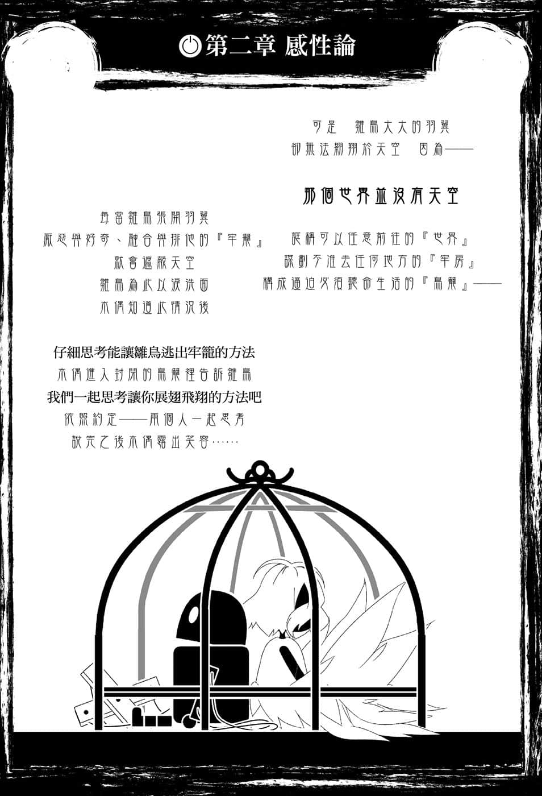
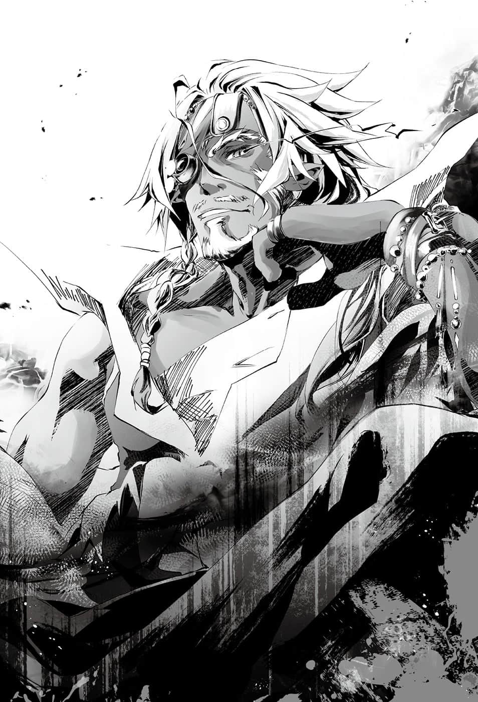
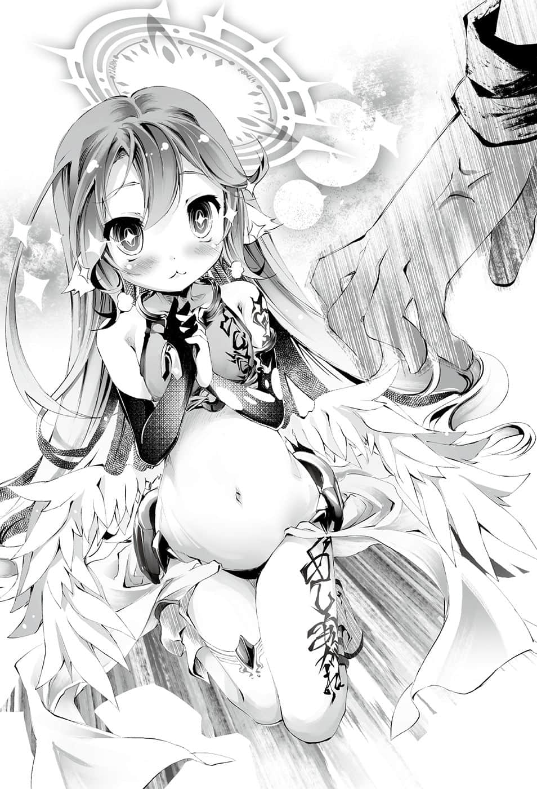

# 第二章 感悻论

> 来源：https://www.linovelib.com/novel/9/2133.html

这个世界城市没有天空……至少在物理上没有。

——哈登费尔首都，据说是位于地下一万公尺的巨大空间。

抵达广大的地下都市后，空与白走下潜陆艇。

两人一起烦恼着，心想该怎么形容眼前的光景呢？

正确来说不是眼前，而是上下前后左右——全方位的光景，若是要形容眼睛所见的话——

「我来猜猜看，那个首领一定是某间名字跟森罗有点像的公司的『社长』吧。」

「……『重力魔法』……具体来说……是在做什么的呢？」

——打关键字『工厂 夜景』搜寻图片的话，大概就能想像是怎样的气氛了吧。

黑暗之中，无数耀眼的光源，衬托出一片奇幻的钢铁森林。

说穿了，就是将某名字是两个F㊟的第七部作品中的米德加稍做改变，再以重力魔法无视一切物理法则，复制贴上到整个天球，便大功告成。

编注：指电子角色扮演游戏「Final Fantasy VII」。

眼睛所见的光景——别说是天空，甚至也没有上下。非但如此——

「甚至连『魔晃炉』都有，我就直说了吧，首领是路〇斯吧？」

看到贯穿都市中央的『光柱』，空带着一半认真的心情向后方问道。

「——啊！不是的，主人。那是先前说的那位神灵种的火——『神火炉』。」

原本兴奋地看着四周的吉普莉尔，赶紧慌张地鞠躬回答道。

「地精种是少数创造主仍健在，并且可以共存的种族之一。那个『神火炉』不止是用在工业用途，甚至也供给这个高度机械文明——都市的『动力来源』。」

高度机械文明——是啊，这一点在路上已经充分见识过了。

具体来说，是在缇儿仍不肯下船的『潜陆艇』上见识到……

——听说那艘船是利用彼我流动差的原理在地下前进。

「……讨厌啦……菲无视我……呜哇啊啊啊啊！！」

——『一切都是为了锻炼而存在』……

可是……为什么？

「就是现在！救命！救命啊！我要被烧死了——好痛！？白白白大人，恕我失礼了！这里就安全了！我逃过一劫了！！」

一切都是为了锻炼而存在——等于是说『世界就是为了改造而存在』。

「你们在『大战』时也将环境连同星球一起破坏了吧！你们有什么立场指责别人呀！？」

吉普莉尔打断空感觉到异样的思考，做出了订正与补充。

虽然空与白既看不清她的动作，也无法理解她的举动，两人仍是傻眼地看着她。

「虽然地精种拥有优越的『机械文明』——却绝不是『科学文明』，他们反而是离『科学』最远的种族……这一点我想主人们很快就会明白。」

空、白和克拉米在内心翻白眼，听着环保主义者菲尔的言论。

「抱住我！！那样一来我就超☆安☆全——」

因为地精种和森精种都坚持——在潜陆舰里待六小时，与对方呼吸相同的空气的话，她们会死。

「——啊！不、不是的！？我只是在发呆而已，没有无视克拉米——」

不过不难想像，若是『魂石』被采掘，森精种绝不会平安无事。

——而且是在地下。在原本的世界，别说是潜水艇，必须开超音速客机才能勉强达到那样的速度。

「另外——论『科学』的话，主人们的世界远比这个世界发达。」

菲尔的表情中充满无言的杀意，吓得克拉米终于哭了出来。

——另一方则是开口闭口就是清风如何，天空如何的种族。

吉普莉尔语带不满地说完之后，随即消失在虚空之中。

「而且那边的锻神欧肯因之火，可以熔解任何物质。」

——空他们瞬间僵住。

听到菲尔脸上带着笑容发表的杀人预告——或许是纽带被拉扯的关系吧，缇儿立刻卧倒在地，朝着白的裙子内钻了进去。

扣掉缇儿修理所需的时间——不到六小时，换算时速则是每小时一千六百公里……

「虽然不知道你为什么那么害怕，不过有一点是可以确定的。」

缇儿被白拉扯纽带而面红耳赤，空则是露出慈爱的眼神，气氛顿时陷入沉默。

「好……辛苦你了，吉普莉尔……不好意思，我想问一下……」

「我已经不是一个人了！！敌人要是来了——」

「……确实是很惊人，不过因为吉普莉尔说这里拥有最发达的科学文明，我还以为——」

缇儿一瞬间便躲到两人背后，泪汪汪地拿着大槌全神戒备。

空慰劳空间转移回来的吉普莉尔后，再次抱头烦恼。

「因为挖掘和砍伐，河川干涸而死，山峰也崩塌而亡。」

白心想与其让缇儿抱住空，不如让她钻在自己的裙子里，所以忍下不满，与空一起要求吉普莉尔说明。

地精种与这个爱和心都已死绝的种族——两者是完全对立的种族吧。

——发出这样的悲鸣，躲到空与白的背后。

「哼哼！我什么也看不见～就、就算你瞪着我，我、我也不害怕！你就编纂加害我的术式，然后被『盟约』抵消吧！呸！」

——究竟是哪一方先开始，如今已不可考，不过不管怎样——

「很好！你就全力向我求助吧！！来啊，放马过来，敌人——」

不可能发生的物理考题都会有一个前提——『假设没有阻力』。连白都要抱头烦恼，不知这个前提是否在这个世界的现实也能通用，不过——

「两个种族的关系恶劣到甚至无视唯一神宝座，长久以来一直互相残杀❤」

「季节会死亡～森精种珍惜的森林……当然！也会死亡……」

——带着『威胁菲尔』回来，一脸疑问的『天使恶魔』。

最后是缇儿所恐惧的『威胁敌人之一』到来，沉默的气氛才得以消散。

「……？啊，抱歉让主人们久等了，我回来了。」

比不用支柱、却能将都市一层一层堆叠起来的地精种更发达？

缇儿抱持不退缩的决心——全力逃避！

重新审视米德加——更正，重新审视哈登费尔的首都，空心想——虽说加入若干蒸气朋克㊟的要素，这景色已完全属于科幻的领域了。

——应该说事到如今才讲环保也太迟了吧——！！

「如果不把那种害兽灭绝……这是全知性生命体的罪过哦❤」

「……我还是不认为『关系恶劣』足以说明她们的情况啊……」

虽然不明白那是什么意思，不过总之这趟旅程总共大约九千七百公里。

她的眼中充满觉悟，并且燃烧着『绝不退缩的决心』——

「菲！！菲！你不要摆出那么可怕的表情啦！菲……」

——于是在场留下的人，暂时就只有空与白以及——另外一人。

空则是欢迎她来到绝对的安全范围——因为以『盟约』为后盾，可以拒绝别人强行分开他们。

「我生理上无法接受❤地鼠就该立刻☆处死哦～❤」

否定之后，缇儿的大槌立刻喀一声，亮起复杂的光纹。

「是是是！？首领来了吗救救我！！」

然后她的杀意终于开始造成地动山摇，空他们这时才明白。

「或许是因为锻神创造主的影响，地精种的中心思想就是『一切都是为了锻炼而存在』。」

突然出现的那声音，有如唱和般高声说道：

「……以白和哥的力量……肯定……无法给予任何救助。」

「我认为是长年的仇恨之故。主人，你看那个长耳朵的额头上——是不是有什么东西呢？」

空点了点头心想……那还真是相当激进的思想。

机械文明与科学文明……两者有何不同？

说是有哪里不对……却又好像没有不对……

可是空仍是无法接受，因为——

所以只好采取对策，抵达哈登费尔之后，再由吉普莉尔去接克拉米和菲尔过来。

而是缇儿燃烧着苍白火焰的眼眸——也就是所谓感应钢的双眼，然后空露出得意的笑容。

「那么，虽然非常不愿意——但我要去『接人』了，所以请恕我暂时失陪。」

——缇儿将头埋在白的裙子里，露出臀部在外面，尽管颤抖，却仍出言挑衅菲尔。

听到她颤抖着声音做出逃亡成功的宣言，空回头望向背后，也就是——

……拉～拉～拉～……

空他们无论如何都想不通，不过听到吉普莉尔接下来的这一句话——

接着，吉普莉尔指着都市中央的光——神火炉，然后继续说道：

「谁叫他们头上要带着石头出生，有意见的话就重新投胎成液体呀！呸！我、我可不会道歉哦！！我绝不跟草道歉！！」

从潜航中到现在，她一直在潜陆舰上铿铿锵锵修理灵装。这时空喊了她一声，她立刻——

————？

「不会的！！灵、灵装的改装勉强赶上了！！」

「啊，不，主人，我只有说这里拥有这个世界最发达的『机械文明』。」

不知何故……跟想像中有点差距。

看到森精种额头上的『魂石』——『矿物』……冷汗自空他们的脸颊上滑下。

两人的眼神中充满疑问，但是吉普莉尔却只是露出意味深长的笑容。

合法褐色鬼女带着不向任何人屈服的钢铁意志，发出怒吼——她的怒吼也就是——！！

具体而言，空他们并不知道那个『魂石』是怎样的东西。

译注：一种流行于20世纪80年代至90年代初的科幻题材。

一方是用可以熔解一切的炉火，肆无忌惮地破坏环境的种族。

那就是猛烈地操控无数工具，持续在修理灵装大槌的缇儿。

「哇～……这里就是地鼠的巢穴……好恐怖的地方～好噁心哦～」

空心想——原来如此。他所着眼的并不是变形起动的灵装。

她拥有那样高超的身体能力，却依然畏惧对方……空与白断言自己无法给予任何帮助，不过——

「森精种驱逐破坏森林的地精种……地精种则是为了『魂石』而滥捕森精种……」

……哦，比能够操纵重力、建造出全天球型地下都市的地精种更发达？

「讨厌！我才不管！呜……我讨厌可怕的菲！！」

因为缇儿的扇风点火，菲尔的杀意再度爆发。

或许是累积的恐惧已经到达极限了吧，克拉米行为退化为幼儿，嚎啕大哭起来，菲尔则是拼命向她道歉。

空看到这情况，叹了一口气，然后决定放弃劝解，不再理会她们。

——看来别指望她们会和解或平息事态了……

「那么可以带我们去见想买『药』的『首领』了吗？」

重新眺望多层型无视重力全天球工厂式的都市后，空这么说道。

——不，应该说空的眼睛只看到在都市内来来去去的地精种了。

说得更精确一点，他眼中只看见地精种的——女性。

没错……愿意把这群合法褐色鬼女卖给自己的『顾客』在哪里？

在这个上下都分不清的地方，空要求缇儿为他们带路——

「话说，你最好快点从那里出来……白快要发飙了。」

「——啊？啊！？虽说刚才情况紧急，我真是失礼了！！」

将头缩在白的裙子内说话的缇儿猛然起身。

「……失礼也该……有个限度——————……吧？」

缇儿手臂一举，做出敬礼动作，同时站了起来。

也就是说——

……白的裙子整个被掀了起来。

看到白耀眼夺目的内裤、肚脐和她的笑容，空与缇儿瞬间冻结了。

「……妹妹的位置之后……接下来是……什么？……想要主角的位置……？」

「……嗯……可是白看不见！……而且也看不懂……！？」

缇儿虽然也敬礼回应，却是坚持不肯退让。

什么？在素材上随便敲出伤痕？

就是观测自然现象，推算与验证其法则的『知识体系』。

敲敲打打折叠起来，刻印术式的机械——灵装就完成了？

那个疑问就是『为什么对应「科学」的是「魔法」』……

空在内心回答『是啊』，对她回以苦涩的笑……

这位讨厌地精种国家的地精种，令他有一种似曾相识的感觉。

言下之意就是，只要直接看证据，你们马上就会明白。

从工业设施内的高架上，俯瞰下方的巨大制造现场……没错——

「是灵装呀，你们看，很简单吧？」

白露出可怕的笑容说道。

「啊，不，主人。灵装是将施有刻印术式的触媒连结与组合后，在精灵、灵魂与触媒同步后才得以使用——换句话说，就是地精种的个人魔法，是以术者的精灵加以驱动。」

缇儿看着黑发的空的黑色眼眸，露出了虚弱的笑容。

宛如经过镜面加工，发出光泽的准・真球体上，刻划着精密的雕刻。

空确实听见副声道响起白的声音了。

然而『机械』——我却不能不追究你！

「对着超过身高十倍的铁球又劈又打——」

「然后由同样随便在制造其他部位的地精种接手。」

「…………白不行了……头好痛……」

吉普莉尔则是订正道：

「随便组装建造之后就变成『飞航舰』了，解说结束！！」

空看傻了眼，他这样询问吉普莉尔。

————

只见大量资材前方，站着一名双手盘胸的厚毛球地精种，「喝啊！」一声吆喝之后，朝着资材劈了下去！

缇儿打从初次见面就自称貌似地精种的废物地鼠，她的语气充满自嘲。

当空面露菩萨般的微笑，进入四大皆空境界的时候，即使逐渐组装起的『飞航舰』形状根本违反航空力学，甚至不知为何能飞行，他也不会在意。真要追究航空力学，吉普莉尔又该怎么解释？算了，就当作是魔法，放弃思考吧。

仿佛在坚硬岩盘中塞入大量炸弹，然后一起引爆似的爆炸声响起——

「好了！缇儿！！我们快点征服哈登费尔，早点回去吧！！好吗！？」

「——这里没有天空…………」

---

■ ■ ■

缇儿仰望上方——全天球地下都市宛如闪耀星空的灯光。

仿佛在现实中看到『以下略』后经过剪辑的影片，白不禁抱头蹲了下去。

那么不管动力是蒸气、电力，还是精灵，应该都没有关系吧！？

「好……吉普莉尔，拜托你将刚才删减的部分，用无删减版或慢动作重播，可以的话顺便附上解说。」

光映在感应钢的眼眸中——但是她的眼中似乎看着更远的地方。

「然后机械的球体就完成了吗！？『灵巧』也该有个限度吧！！」

……『材料、道具：适量』，听到讲座开头第一句就很随便，空与白脸上的表情已经完全不抱期待。

不管动力是什么，那都是『科学』不是吗！？……空与白原本这么认为……不过……

——『是吗？你想战，便来战』——

空吃惊地摇着头大叫——！

——至少该雕刻吧——！！

——回过神来才发现，厚毛球地精种手上多了一个神秘的机械——据她所说就是灵装。

宛如零件自己逐渐拼凑成巨大构造物一般的『惨状』。

「啊！一般的机械是……啊，那边正好在制造『飞航舰』。」

「哼……因为地精种的住处，没有废物地鼠的容身之处。」

「那么！！只要是地精种，谁都可以简单做到的『灵装』制作讲座，现在开始了！！」

「啊！！我、我立刻带你们去『首领府』！可、可是我不见首领哦！我会在附近等待……！！」

空看着少女的背影。

——你要铸造或是切削吧！……最低限度也该组装一下吧！

「很抱歉，主人，正如您所见，地精种『手艺非常地灵巧』……」

「……你以为没有主角身份……可以允许有……主角特权吗……？」

可以进行学术上的研究，并且证实能够重现的话，那么就可以明确说是『科学』了吧？

「我是要求你解释莫名其妙的超常现象哦！？你该不会想说——」

然后——

……听到从来不曾简单过的口号，空马上就开始翻白眼了。

「再来就是凭感觉！随便用槌子敲下去——完毕！！」

「差别只在于刻印术式的有无，做的事情还是一样啊啊啊啊！！」

「在哈登费尔之中……我特别讨厌首都。」

那叫做刻印术式是吧？那就刻印下去呀！至少遵守名称吧！！

「……反正顺路，我也带你们去『中央工业区』吧。」

空与白看着厚毛球地精种轻松捧着巨大铁块的奇特景象，然后——

「……我说啊，难道潜陆舰或是这座机械都市，全都是用这种方式制造出来的吗？」

接着，毛球感觉工作像是告一段落了，他有如举杠铃似地举起驱动炉。

——它是从铁块变成残骸，再从残骸变成如回转罗盘般运作复杂的机械。

根据缇儿所说——厚毛球地精种手上貌似『灵装』的物体。

「……没、没事的，我要回去的是两位大人的身边，这是外出……」

缇儿感觉得出他们的疑问，于是说道：

另一方面，空则是按压太阳穴，深呼吸一次——然后询问吉普莉尔。

如果魔法、精灵、灵魂，甚至连神都是可以观测的『自然现象』。

随即不知何故——眼前的资材变成拥有有机外观的驱动炉。

经过第二次相同的对话，空向吉普莉尔确认他唯一看懂的事情。

「……所以呢？那是……什么？」

为了不输给工厂的声音，缇儿大声呼喊，她所指的就是——下方的光景。

空与白依照缇儿所说，往工厂的一个区域看去——

「……不对……这几乎是『完美的球体』！……加工精确度……跟精密仪器制造出来的……水准相同……！！」

中央工业区里，充满了噪音、机械、地精种以及工业设施。

…………

空与白追在她的身后走去。

……是啊，简单说就是魔法，事到如今也不用吐槽了。

少女踩着忧郁的脚步，在前方带路。

她用斗篷罩住头——回到背包的形态，仿佛说服自己似地喃喃自语。

比如像是『精灵学』，那也只是在数学、物理学之外，新增一个科学领域而已吧！？

缇儿回过头，露出讽刺的笑容。

更何况『机械』是遵循法则，在理论上达成特定动作的装置不是吗？

只见那名地精种将驱动炉一抛，由另一名地精种接过。

这次为了避免无法收拾的事态，空大叫着催促缇儿。

「再说要怎么从一块铁，制造出由复数零件拼装成的机械呀！？」

「……空大人和白大人喜欢这座首都吗？」

「首先！准备『适量』的平凡无奇的地精种与材料！！」

说起来，所谓的『科学』。

一直以来对奇幻作品所感到的疑问，空与白如今目睹了解答。

——各个零件以猛烈的速度交错抛飞，逐渐累积起来，然后以互相碰撞的速度连接、展开、结合——

「……缇儿……为什么你那么讨厌哈登费尔？」

空发出怒吼，他的表情有如阿修罗一般。

「最根本的问题——『设计图』在哪里！？测量器具呢！！除了槌子以外的工具在哪里！？」

机械——也就是『遵循法则，在理论上达成特定动作的装置』……

空问的是企划书、工学理论……简而言之，就是在问『理论』究竟在哪里。

随即缇儿高声解说高度文明的精髓。

「啊！！若是问地精种机械工学与魔法理论的奥义，答案就只有一个！！」

「那就是『别思考，凭感觉！』～～～～！！」

「否定了思考，哪里还有工学和理论可言！你在耍我吗！？」

——『别管理论那种小事，顺势而为啦』——！！

空为了前所未有的不合理而大吼，不过吉普莉尔向他跪下，第三次说出相同的回答。

「主人，非常抱歉，是我说明不足……地精种是『手艺非常灵巧的种族』。」

即使征求吉普莉尔说明，她也只能如此回答，真正的原因就是——

「即使看得见也不会明白……所以不管是我，甚至地精种本人也无法说明和解释。」

——不管是空还是蹲在地上不知该如何计算的白，两人都感觉身上的血液仿佛逐渐被抽干。

依照吉普莉尔所说，地精种的本质就是……

「地精种是锻神欧肯因以『锻』为概念创造出的种族。」

就像问战神创造的天翼种『为什么能战斗』一样愚蠢。

若是问锻神创造的地精种『为什么能锻炼』——

「他们是只靠天赋之才——不，只靠『神赋的感性』就能制造一切事物的种族。」

一定会被反问——『为什么不能锻炼』。

——但如果是那样，即便有工具应该也办不到。

「可是不思考的人类种就不是芦苇！！只是会移动的芦苇！与不会动的芦苇相比，会动的芦苇只会给人添麻烦，是必须洒除草剂消灭的怪胎！！」

除了一脸大佛表情的菲尔点头认同，其他人都被她的气势震慑，一句话也说不出口。

「……不管是这个灵装还是潜陆舰，我最多只能修理或『拼装』而已。」

空不禁嗤笑，不如努力去理解天翼种或神灵种还比较有意义。

「那个长耳朵手上和额头上的刻印术式，也是将地精种随便就能运用的术式，拼命『理论化』之后改良而成的——啊，抱歉。」

地精种们的视线注视着以斗篷遮住脸的缇儿——

「……我无法像地精种那样——我什么也造不出来。」

原来如此，机械文明连科学幻想也望尘莫及。

「…………嗯！……如果是那样的话……OK……可以……」

「另外，不管是以前大战还是现在游戏，该简单生物以单纯的感性施展出的战术，那个种族都得要加以分析，理论化——系统化之后，才得以勉强与之抗衡——啊！现在想起来♪」

「哼！你想破坏也没用，我不怕你——欸欸！？救、救命啊白大人让我躲你裙子下我说谎了我超害怕的！！」

她的断言没有丝毫害意或恶意，庄严得有如佛陀说法。

她威风凛凛的站姿显得颇为自豪，众人这次则是惊讶得哑然无语。

空与白看着自称『废物地鼠』的背上背负的灵装——

「只要随意构思，随手制造——感性自然会引导出『最适当』的做法。」

看着下方谎称工业的魔法现场，空与白准备离开。

——在靠着天赋的感性传承知识与经验的文明中。

「是经过『降级模仿』后才让长耳朵也能操控❤」

「主人，附带一提，根据传闻，听说有个种族一直输给那个思虑简单的种族哦❤」

即便算得上是『机械文明』，却也不是『科学文明』……

————也就是说，他们的种族具有『天才气质』……不。

「因此没有感性的地精种是最低劣的生物！！这是不证自明的道理！！」

伞骨就是——『无数的工具和测量道具』。

——因为自己甚至不是地精种……

空与白露出开朗的笑容这么说完之后，再度迈出脚步。

「因为我是废物地鼠！！明白了吧！？」

「因此他们是绝不会出错的种族……地精种既不需要假设，也不需要验证。」

没有天赋感性的话……甚至也不会有知识可以继承——

然后她接着说道：

但是她脸上露出得意的笑容，一步步朝着空逼近，即便是空也不禁感到紧张而戒备。

尽管动作快得无法看清，而且手巧得莫名其妙。

只要随着『想像』动手挥洒，就能将『想像』原原本本地化为『创造』。

——自从克拉米哭泣抱怨『我讨厌可怕的菲』之后。

「……他们那种生物就是因为智能不足，所以只会简单思考，只是如此而已。」

「克拉米……你要平心静气……恐惧也是烦恼哦……」

「菲！？这么廉价的挑衅，你可不能上当哦！？」

内心如此断定后，空与白准备离开中央工业区。在他们的背后，有人说了一句话。

先前一直保持沉默的菲尔，对地精种的评论有不同的意见……不。

理解灵装爆炸时，吉普莉尔为何感到困惑后，空不禁心想。

她的脸上完全显露出她的自卑感，然后——

「……当然呀，只要一粒精灵粒子偏差就会失效的刻印……与纤细完全无缘，连刻印术式也不会使用的粗暴之辈说的话，怎么可能动摇我的心……」

他们是真正的天才——『感性的怪物』。

——地底都市同时响起不可能听到的雷声。

——缇儿应该是『绝不会出错』的地精种才是。

——听着背后的吵闹声，空与白看着走在前方的小小背影。

「……是的，你们已经明白了吧……」

缇儿的苦笑就像是在公开廉价的作弊手法，她回过头来，用手上的灵装往地面一打，大槌立刻展开成数千伞骨状。

但是机械文明甚至不是科学幻想，连科学的『科』字都谈不上，而是『纯幻想』！！两人终于明白吉普莉尔的话中真意。

「……我……完全没有那样的『感性』。」

终于——！！

「是、是啊……这个世界也有那样的格言——」

「空大人！？我听说『人类种是会思考的芦苇』！！」

——那就没有任何问题了！！

听到如此不容争辩的解答，空与白不禁咽下口中唾液。

缇儿打断空的回话，激烈的言论令空也不禁倒抽了一口气。

原来如此，地精种确实在工艺上是外挂种族。

缇儿连珠炮似地骂完之后——菲尔维持着大佛的表情编纂术式。

——她露出骄傲的表情高声断言——！！

但是，缇儿在修理灵装和潜陆舰时所使用的东西。

「啊，不能吃也不能烧的草，快点腐朽，变成化石燃料后再来说话，呸！我、我不会道歉！我绝不会向森精种道歉！！」

——自以为理解才是最危险的认知……

「……这样你们还要问……我为什么会讨厌地精种的国家吗？」

「不会思考的人类种！五感不敏锐的兽人种！不会战斗的天翼种！没有魅力的海栖种！不会学习的机凯种——根本『不值一谈』！」

感受到两人的视线，缇儿头也不回，以充满自嘲的语气点头说道。

缇儿的激烈言论，让人想起她先前的确也一直是这样的主张。

吉普莉尔似乎打心底觉得好玩，为了攻破菲尔的大佛表情——她使出全力刺激菲尔。

如果说地精种的本质就在于他们的天赋——『神赋感性』的话，缇儿她……

空与白——克拉米，甚至连吉普莉尔也不禁沉默不语。

…………呃～……？

——『没有理论的机械』……原来如此，那并不是科学，完完全全是魔法！！

仿佛肯定空的想法一般，缇儿露出自嘲的笑容说道：

见到此情况，吉普莉尔露出满面笑容继续说道：

「……只要先告诉我们……那也不用……慌张了……」

「可是就连拼装，也会因为我『不懂刻印的意思』而失败。」

然而她用的却是连空也能理解的方法——那就是…………

「你真的封住感情了吗！？别用那样的表情和声音回嘴啦！！」

空与白终于理解地精种的本质，两人看着彼此，深深点头。

他们的眼神就像感到疑问——你在这里做什么？

——不过森精种，唯有你例外。

毕竟在根本上，人类无法理解——不。

是啊……如此一来，『科学』与『魔法』有何差别的疑问就有答案了。

「……菲？你的『无』之表情也有点可怕哦……」

「也就是说，地精种拥有性能破天荒的『神之加护』对吧？」

「……只靠感性传承知识和经验，不断持续改良的机械文明……」

缇儿激动到口齿不清，人类语也变得奇怪了。

「真是的……如果地精种的存在本身就是魔法，那一开始就直说呀。」

吉普莉尔刻意演戏，朝着菲尔瞥了一眼。

他们靠感性获取灵感，靠感性反覆锻炼，最终造就如此发达的文明。对他们而言，理论是没用的。

他们虽然会尝试，却不会『出错』；虽会验证，却不会『失败』——

……怎么可能会喜欢这里，而且这里也不会有她的容身之处吧。

——没有理论就能操纵机械的天才种族，确实是完全无法理解的存在。

……在解说地精种的工艺时，那个地精种始终像是在诉说别人的事。

——看到菲尔『大佛』一般的表情，克拉米反而跟她保持距离。

菲尔用魔法封住感情，她的表情正有如佛陀一般。

空隐约想到……啊，那是工厂的声音吧……

空与白强而有力地站起来，他们不再慌乱了。

缇儿想要逃进白的裙子内，但是第二次就被拒绝了。

看到缇儿躲到空与白的背后发抖，不只是空，连吉普莉尔和菲尔也皱起眉头感到疑问。

「不……那个、可是缇儿……你有在制造灵装吧？」

虽然缇儿对自己的自卑已经超越自嘲，甚至到达矜持的地步，不过——

「在我看来，你的手艺已经够灵巧了，哪像我们人类种，根本连精灵都看不——」

为了弄清楚心中的违和感，空正要说话，却被缇儿打断。

「空大人，人类种不会飞。」

「………………人类种是不会飞没错。」

——缇儿目光直视空。

苍白眼眸的她接着说道：

「所以你要说不会飞也是没办法的事吗？」

————

……啊啊……原来是这么一回事……

缇儿不管沉默的空，再次露出自豪的表情。

「不会飞的鸟就是『鸡』！是家禽！只有被烤成美味佳肴享用的价值——啊！？没、没办法变成美味佳肴的我，连家禽都不如吗！？我、我对鸡大人失礼了……不、不管怎样！！」

在地下一万公尺进行演说的缇儿，如今演说也进入尾声。

「既然没有感性！不会制造灵装！也不会使用魔法！那么也就不是地精种！！」

——听到缇儿一连串的否定，空隐约掌握到违和感的原因——但是缇儿演说的结语却令空的思考强制结束。

「而且甚至连毛也没有！！我是『白板』！！劣等证明结束！！」

「什么！？至高无上的优点到底证明什么了！？请你再说得详细一点吧！？」

「咿……我、我不认识他……事发突然……我都搞不清楚状况了。」

「喂！给我从实招来！！你为什么会知道被害人的行动！？你究竟是谁！！」

没错，他就是——

「啊，是在说『胡子』吧！？一定是吧！？我想说你突然在说什么，害我慌了一下——」

「可是奇怪了……『体毛稀疏的体质』——如果是不会因体毛而造成体内精灵过度强化的体质，那应该不用触媒就可以使用魔法——应该也有好处吧？」

但是那对眼眸却是深信自己不如别人。

但是回答她的却是突然响起的男人声音。

栖息在地狱的邪恶男人——本来就是毛更多的『毛球』。

——那个地精种是什么人，既不用问，也不用推测。

注视着黑色眼眸的那双眼，看起来恐惧不安。

没错！！她确实说过，那并不是银色的头发，而是真正的银——真灵银的头发！

吉普莉尔却突然说这个乐园其实是地狱。

空猛然转身面向缇儿，速度之快，几乎快要摩擦空气燃烧，而空看见的是——

「喔，你这么想要叔父大人，忍不住自己投怀送抱吗？我都不好意思了，『臭侄女』。」

「你是说那是因为不是体毛稀疏，而是『无毛』……所以也没有魔法所需的最低限度的精灵强化吗？」

「……不要紧……只要相信……就会长出来……——给我长～出～来！」

「只要跨在男人身上，稍微恳求一下……绝对让你飞到最高点——啊，不过那个家伙不行，他是处男，又是喜欢贫乳萝莉的妹控……喂，你的性癖没救了哦？」

「啊，主人，我也——不，应该说天翼种基本上都不会长毛❤」

那是发音非常拙劣的人类语，并且充满下流的情感。

听完流浪汉的供述后，在临时制造的隔绝空间里，空露出严肃的表情，询问在背后可怜地颤抖的被害人。

缇儿问道：

空大吼之后回头看去——却只看见冒着烟的烟灰和酒瓶，以及淡淡的粒子状光影残留。

「地精种的毛量力量就是精灵强化力、素材量——也就等于是『力量』的同义词。男性为了夸耀毛量会特地留下来，不过因为女性的毛量原本就少，所以基本上都是全部采取剃掉♪」

虽然肉眼完全看不见，不过事后根据吉普莉尔的解释，缇儿突然向空与白飞奔而去，那个男人却以『类似空间转移』的方法抢到她前方，让缇儿扑进男人的怀中。

——幼女妹妹的冰冷眼神，她正拉扯着幼女缇儿的吊带，让斗篷一开一阖。

「不……我不是啦……本大爷只是来接臭侄女。」

所以精灵会过度强化——因此需要触媒。这也听她说过了！！可是——！！

得知真相的空不禁双腿一跪。

空哭着对称呼自己为变态的视线哀求——

「啊，主人，我确实说过地精种的女性体毛稀疏，不过——」

「没有！！因为没有体外增强的话，那就『连一个魔法也使不出来』了！！」

「从孩提时期我就照着镜子，相信毛会长出来，至少长出一根来。到现在过了七十年——连一根汗毛都没长出来！！我相信了，却没得到救赎！如果怀疑的话，那我就让你们看看！！这就是光滑的现实————」

燃烧着苍白火焰的感应钢眼眸像是在问——我会被抛弃吗？

只见浑身脏兮兮的灰色毛球打了一个酒嗝，他的打扮就像身穿破布的流浪汉。

她仿佛在问——我能够有什么用处吗？

你的感性实在太差劲……！！你会受到诅咒……！

「我——『能够比鸡更有用处』吗？」

「我、我有汗毛啦，空！？森精种菲才没有哦！？」

「让我确认一下！？你是在说胡子是吧——啊！？」

「……『白板』……语源是……麻将的白牌……意指……『体毛』稀疏……」

她是唯一且真正的『褐色合法萝莉鬼女』！

男人一手抱着哭喊求救的缇儿，另一只手则抓住机械式的『大剑』。

「我真的可以……把两位当成我的安身之所吗……？」

「别给我大吼大叫，性侵犯！！小心追加一条恐吓罪哦！？」

「好了！！我就来把臭侄女变成女人！！让你高潮不断——」

「地精种的体毛——『真灵银』是能够增强精灵的优秀素材。」

缇儿猛然将手放在内裤上，空立刻冲上前，把斗篷拉起来。

吉普莉尔接着说明道：

——街上到处都是褐色合法鬼女。

高傲的声音。只有感应钢的独眼冷觑众人。

缇儿自己大概没有自觉吧——她望着空问道：

……拉～拉～拉～……

……拉～拉～拉～……

讽刺的笑声与紧迫的悲鸣，在空等人的眼前响起。

「犯人说是来迎接被害人——这表示他事前便知悉被害人的行动……主人，犯人大概幻想自己是被害人的叔父吧？我认为应该追究其他罪行……至少他肯定有跟踪被害人——」

空喘着气心想——在公共场合，你想做什么啊！？

「我说啊，你们是在说胡子吧！？看就知道你们没有胡子，而且没有也比较好呀！喜欢胡子女的男人至少不会是多数派吧！？别用那种眼神看我了！？」

听到缇儿恐惧地哭着回答『我不认识他』，犯人立刻大声吵闹，空则是斥喝制止犯人。

创造感性种族的神灵种……锻神欧肯因啊……

「——就礼貌上来说，我应该说声『欢迎来到哈登费尔』是吧？混蛋们。」

「为什么跟鸡比较啊！？也别夹杂着谎言与实话抹黑我，这样很难反——驳？」

「空、空大人是喜欢光滑无毛的大变态吗！？」

「对！可是做了增强精灵的灵装也会爆炸！不能增强精灵就不能使用魔法，因为我完全没有毛！然而，我也没有感性可以制造增强的灵装！！想要拜托别人帮我制造，却没有人要制造劣等用的灵装——因为那就像是给鱼制造水中呼吸器一样莫名其妙！！至此我已经束、手、无、策了！！」

但是不知缇儿是如何解释的，只见她羞红了脸，毅然决然地——！！

取而代之的是——

「触媒固然不用说，灵装也会用到真灵银……地精种所制造的机械几乎都会用到。不过想要利用，必须先『采取』……也就是说要『剃掉』。」

空无言地『转移话题』，慌张地看着城市吼道：

他用脸颊磨蹭着缇儿，口中的醉言醉语已经说明一切。

什么也做不到的自己，有和两人在一起的价值吗？

空眯起眼睛，注视着在深渊之底闪耀的希望之光。

但是却仍是罪犯，除此之外什么也不是。

「可以哦，你只要『给人享用』就好了……嗝！」

「……空大人，正如你所知，这里没有我的容身之处。」

「……哥……白也……没有毛……」

——罪犯。

空表示那样的提案既下流又多管闲事。

吉普莉尔在空的身旁，负责记录灰色毛球的口供，空询问她的推理。

——……啊啊……神啊……

空还抓住一丝希望，然而吉普莉尔却说出残忍——但是只要一想就知道是理所当然的答案。

……劣等？这些家伙在说什么？

「等一下……吉普莉尔——你说女性也是大胡子吗？哪里有啊！？」

---

■ ■ ■

女性们的视线集中在空的身上，她们的眼神就像在说『不然你以为在说什么？』。

于是吉普莉尔立刻阻断空间，顺利逮捕做为现行犯的流浪汉。

——也就是说这个都市……这个高度的机械文明……是用胡子打造的地狱……而且……

白持续拉扯着吊带，空听见白在诅咒『最后的希望啊，消灭吧』。

「……缇儿？根据犯人的口供，他说他是你的叔父哦？」

「那纯粹是相较于男性较为稀疏，她们也是——『大胡子』喔！」

「不是啊啊我是被抓住了！！空大人、白大人，快救我！！」

而褐色萝莉鬼女也只是剃过的大胡子。

「……克拉米也没有毛，你敢对她出手，我就超渡你喔！」

只有缇儿——啊啊——只有她不是大胡子——！！

缇儿宣告自己『走投无路』，但是她的声音对空而言却是希望中的光芒。

「少开玩笑了，臭侄女！你是因为本大爷来了才想逃吧！！」

对于空的问题，吉普莉尔则是回答道：

「我『感觉到』的啦！！问我是谁？喂，臭侄女！你没把信交给他们吗！？」

「你、你在说什么？首领应该是在『首领府』里，而且也没有国家元首会以那种装扮迎接来宾！因此我不认识你！！」

听见缇儿哭着喊出的歪理，空大致上已经明白状况了。

——也就是说，这个醉酒的灰色毛球……这个强制猥亵未遂犯……

他就是地精种的全权代理者——哈登费尔的『首领』。

而且根据口供，他也是缇儿的叔父——

「……嗯，那么退一百步，假设你是『首领』，也是缇儿的叔父。」

「假设什么！那是事实啊！可恶！！」

「是事实更糟吧！？强迫与侄女发生肉体关系难道在你们国家是合法的！？」

「不……那个……我是因为喝醉酒……只是开个小玩笑而已。」

听到毛球这么说，包含克拉米在内的女性们利刃般的目光立刻集中在他身上。

喝醉酒、开玩笑……那是渣男所用的差劲借口中，排行前两名的。

「那么我再次询问被害人。缇儿威尔古小姐，你的叔父是怎样的人？」

「至、至少我不记得亲戚之中，有衣服破破烂烂，发出酒臭味和烟臭味的毛球——不过，首领是真的很臭！！非常地臭！！」

在空催促之下，缇儿脱口承认他是首领。

可是或许是被泪眼汪汪的缇儿一脸悲痛的表情不断说他臭，令他感到大受打击吧。

『首领』垂头丧气，说不出话来。

——一旁的白则是一个人在沉思……

——缇儿是最没用的地精种，她的叔父却是最优秀的地精种。

抵死不从的垫底少女，配上纠缠不放的自我风格大爷系残念中年。

也就是——地精种史上空前天才的最后作品——不。

「灵装是术者个人运用的机械——是与『核媒』同步后，以行使的复数刻印术式构成的系统，所以造型不管是大槌还是机器人都没差，形状与规模都没有限制……」

机凯种过去似乎是把精灵当成燃料消耗，做为自己的动力。

因为酒醉毛球与合法萝莉——美观上的问题尚未解决！

——『首领府』……一行人搭乘升降机，从存在于都市中央区的巨大天井往上升，前往维格所在的五百零八层。

另外——在种族适性的加持下，甚至可以编纂出超越森精种的超精密复杂术式。

那是像个玩具似地随随便便挂在空中展示的『炸弹』——

「『首领府』五百零八层楼！！我会哭着把他们带到会客大厅首领的面前！！」

「一个不小心就会炸掉大陆的炸弹——你们应该快点丢掉，不然至少严密保管吧！？」

灵装可以模拟原本只有森精种才能办到的多重复合术式。

「……你要确实地把他们带到我——不对，带到首领那里去，知道吗？」

不过他似乎仍未重新振作，只见他摇摇晃晃地转身回头。

白想到一个可能性。

像天翼种、机凯种不也是会走会飞会转移的炸弹吗？

「吸、吸、吐～吸、吸、吐～不可以让克拉米害怕，吸、吸、吐～」

「……是哈登费尔的……行政中枢对吧……？」

「连核武也甘拜下风的武力，你们怎么好像没事一样拿来装饰啊！？」

「菲！？你怎么了！？我明白了，我和你一起做！来吧！吸、吸、吐～！！」

「是的，那东西能引爆不活性化的『神髓』……正是『髓爆』❤」

缇儿顺着空他们的目光看去……却冷静平淡地回答他们的疑问。

大战末期除了灵装以外的武器，几乎也全部都是那个男人独力所造。

或许有人会认为……

「混蛋们，臭侄女要是又逃走，我会去把她抓回来，请你们稍等——」

那么如果是不小心满足条件，就会在无恶意的情况下发动的『装置』呢——？

因为在觉醒事件时，立刻便确实地被攻陷，所以白原本以为她企图争夺妹妹的位置。

听到仰望着上方的吉普莉尔这么说，空与白松了一口气，跟着她抬头往上看——但是三人却一同感到纳闷。

「是！我们原本就在去见首领的途中！！帮我告诉首领，不用派不认识又有体臭的可疑人物过来，我也会确实把人带到『首领府』！！去去！！呸！呸！！」

---

■ ■ ■

「那么你可以走了，不过最后要请教你——不对，首领大人的尊姓大名？」

他发明刻印术式，创造出灵装，是一个划时代的匠师天才。

（……已达成『配对确定』的条件……？嗯……状况证据充分，不过还不能确定……）

「……菲，我看得出你拼命在维持感情封印，不过……那样心情会比较平静吗？」

看到在重现大战的即时战略游戏时所见过的武器，空开始怀疑『十条盟约』的禁止武力是不是说假的——

……简而言之，他是逼得森精种使用刻印术式的远因。

他们想起关于机凯种的文献叙述。

也就是说，他是把星球破坏殆尽的大战犯之一。

「维格・多劳布尼尔，快点来吧，『臭异世界人』。」

空与白脸色苍白，膝盖颤抖，指着某个物体问道。

吉普莉尔代替抓着空与白的衣服蹲在地上发抖的缇儿说明道：

「不是的，这是首领祖先的纪念碑——只是装饰而已。」

不过——如果她其实『心有所属』呢……？

空与白心想……

那应该只是『未爆弹』了吧，为什么还拿出来展示呢！？

「他逼得森精种也必须模仿刻印术式才能与之对抗，是大战的关键人物之一……而我也曾在『杀龙』之际，使用过他的作品❤」

即使经过六千年也无人能及，那是最初且最后的作品……

但是，因为『盟约』的关系，他们不能再消耗精灵——精灵种，所以改变了动力系统……

毛球似乎想要当成是这样，所以空等人点头答应。

……装饰？祖先？空眨了眨眼，缇儿则回应道：

——如果她心有所属的对象并非哥哥？

「首领去洗澡……就当本大爷是负责传话的人吧……」

虽然空与白哭着控诉，不过听到吉普莉尔单膝跪地这么一说。

「虽然我希望是眼睛的错觉——不过『那个』也是因为是他的作品，所以才摆出来装饰？」

这个激起人的庇护欲望，『无主』好骗的笨拙女。

从上升的升降机的窗户，眺望快速通过的天井景色。

因为即便『十条盟约』能够取消恶意的危害，但是过失——『意外』就不在保护的范围内了。

「……什么啊……巨大机器人也是『灵装』吗……？」

「那是哈登费尔初代首领——《罗尼・多劳布尼尔》的遗作咿啊啊！？」

据说他是在大战末期率领地精种的男人。

——嗯～……竟然挤下『髓爆』，说是『最高杰作』啊。

对于空的探询——男人只留下淡淡的光影，以及不满的话语，然后便凭空消失了。

「主人，请安心，展示在这里的东西全都不会运作了。」

——没错……他们指着一发就能粉碎大陆的『髓爆』。

「《罗尼・多劳布尼尔》——听说他是地精种史上有名的『空前天才』……」

「真是情绪不安定的长耳朵呢，你用拉玛泽呼吸法㊟是想生什么呀❤」

「应该不是放置大量破坏武器的『军事基地』吧……不，应该说别保有武力啊！？」

——不过是威力超大的炸弹，事到如今有必要大惊小怪吗？

毛球阴郁地垂下肩膀，将手上的『大剑』——灵装一挥。

「……啊……我想起来了……本大爷是……冒牌货。」

「『盟约』之后，凡是有害精灵的运用与魔法，全部都不能使用了。」

而且虽说是间接性的影响，不过他也是促成『虚空第零加护』诞生的男人。

「那是没问题啦，不过……缇儿，我请问一下，所谓的『首领府』……」

三人目光注视着一个不曾见过的东西，或许是察觉三人的疑问了吧——

那也是在重现大战的即时战略游戏中看过的东西……

用无数刻印术式组成可变机械的核媒，再与之同步，加以运用——就是所谓的灵装。

——但是菲尔的杀意突然爆发，打断了她的话。

也就是说，站在持续上升的升降机上，他们所看到的武器并不是『未爆弹』，而是等同『模型』一样的东西。

空大声地指责，因为在禁止武力的世界中，那是不该存在的过度武力。

看到视线前方——雄伟的『巨大人形机械』，空露出僵硬的笑容。

空效法泪眼汪汪的缇儿，目光锐利地看着毛球。

缇儿撤销告诉，吉普莉尔也解开空间阻绝。

「空、空大人、白大人，绝、绝对不要放开我的手哦！我们说好了哦！？」

『首领』似乎终于从打击中振作起来。

但是白这段从另一个角度出发的推理，当然没有人知道——

「……啊……刚、刚才的谈话……唯一的例外……就是那个东西……」

随后剑身份解成无数的零件——不对，是无数耀眼的短剑。

——不，正确来说，他们看的是装饰在天井的某个似曾相识的物体——

「……只有那个是『战后』的作品——同时也是初代首领的『遗作』。」

白虽然这么一想，但是又赶紧摇头——还不能大意。

然而，事实并非如此。

缇儿原本打算在附近等待，但是她的想法被毛球轻易看穿。

或许是看到克拉米安抚爆炸点菲尔的模样很有趣吧。

刚才男人的自我介绍，导致现在众人乱成一团，缇儿躲在空与白背后，抓着他们的衣服不放。

译注：分娩过程中的一种技术。

「据说是无人能超越的最高杰作，而且也是『终极灵装』。」

——被说臭的不是我。

——那个机器人总高度十公尺以上，身上有一层黑色铁块，造形非常怪异。

表面覆盖像是电子回路的刻印术式，是一个坚固又强硬，充满厚重感的机体。

肩部则有着与巨大机体相比，仍然显得超出规格的超重量级铁块。

那明显是为了战争而开发的巨大机器人——既然是战后所制造，那么现在也可以运作。

「可是这么大型的灵装——我不认为以地精种的精灵量可以运作。」

「是的，我自己自然不用说，正常的地精种也无法起动那个灵装……」

——听到似乎没有人能驾驶，空暗自松了一口气。

「那么那个巨大人型灵装是为了怎样邪恶的目的而制造的呢？」

光是破坏星球还不够，接下来是要粉碎宇宙吗？空语带讽刺地问道。

缇儿回答后的瞬间，吉普莉尔的声音和表情立刻消失了。

「『在肩膀上』的是——『改写对象概念的灵装』。」

…………

「听说那是『髓爆』所使用的不活性化神髓……也就是在『物质化的神灵种化石』上施加刻印术式，利用能修正内含概念的『改窜神髓』所形成的概念共鸣机。」

……………………

空与白沉默以对——顺道一提，克拉米也相同，或许全人类种也会同样反应吧。

不管怎么样，为了替常识派的人类种代言，空与白两人眯起眼睛说道：

「吉普莉尔……直接告诉我们那个玩意儿有多危险好了。」

「……超危险……真的危险……难以置信的危险……三种的哪一种？」

意思就是——原来如此，听不懂她在讲什么啊——！！

——以刻印术式无法理解修改神髓无法理解的概念无法理解……？

因为在看到『那封信』上的那一句话时，他们就已经有所觉悟。

不可能，怎么可能有那种事，吉普莉尔是对的，那东西应该是假的……可是——

「……是的，因为我们根本也没有研究，所以当然没有答案。」

派出缇儿的数日之后——他能凭『直觉』在那里迎接。

——硿一声，升降机停在五百零八层。

因此一脸嘲笑之色的维格接下来会说什么话，他们也早就知道了。

「～～真是的……匆忙之下，害我胡子刮得太多了，可恶……」

维格・多劳布尼尔说道……

看到他摸着下颚，频频在意自己体味的模样，空与白心想。

「喂，我可不会再让你说我臭了，好了，快点过来。」

——『嗨，傻蛋，需要我们救你吗？谢礼就是「你们国家的全部」如何？』

「不过对于没有交情的人，确实是不会让人赊帐吧？本大爷也没打算跟『人渣』交朋友，比如说——」

他的笑容狂妄又凶猛，那是身居『顶点首领』的笑容，与刚才的『落魄醉汉』根本判若两人。

那个男人的眼神就像在说他早已等在那里了，等待缇儿、空与白、天翼种，甚至是森精种。

那已经不是外挂或诈术了……而是『执行作弊码㊟』。

「是，那是超级危险，有够危险，不可能实现的胡言乱语❤」

男人手撑着脸颊，手肘靠在王座上，然后晃了晃拿在手上的书信。

「……主人，看来正如她自称的一样，她真的连地鼠也不如，她说的话请别当真……」

缇儿直视着空，肯定空的疑问——空惊讶得说不出话来，接着缇儿又继续说道：

「……反差属性、粗野残念中年……『叔侄配』的旗子立起来了吧……！？」

————这个人确实是『天生强者』。

……两人半睁着眼睛，就像是在问『那不都是肉无法理解吗？』。

「原本是唯有他一人到达的神之领域——」

「正是如此……我并不是在比喻，那真的是属于『神之领域』的灵装。」

不理会紧张戒备的吉普莉尔、菲尔与克拉米，维格闹别扭似地嘟嘴抱怨。

没错，再次与那个男人对峙——他坐在机械的王座上，手撑着脸颊，全身散发的气息……

「如果那种事有可能做到，那么要在概念上打败对方也办得到了吧。」

……现在却毫不隐藏地展示出来？

看到明白一切的维格，脸上露出嘲笑的表情回应，空内心苦笑。

听着缇儿平淡的语气，空确信『她没有说谎』。

空心想……是啊，就连神灵种自己——帆楼也为此苦恼了几亿年。

再来，只要维格亲口说出『支付「药」钱』这句话。

……是啊，而且说在六千年前就已发明，甚至加以利用，却隐匿消息至今，连吉普莉尔也不曾听过风声。

既然空与白是『药商』，维格是『顾客』——胜败就已经决定，不会改变了。

「……很抱歉，对于初次见面的客人，我们不接受赊帐。」

「啊！我不知道你在说什么！我今天还是初次见到首领呀！！」

超常识派代表吉普莉尔嘲笑缇儿的头脑伤势危险，并且接着说道：

缇儿躲在空与白的背后发抖，她催促着说道：

————改写对象的概念…………？

「像除臭刻印那种莫名其妙的术式，亏我能造得出来呢……本大爷真不愧是天才。」

正如他所说——自己是第二人，事实只是如此而已。

……那是当然的吧。他是凭藉感性建立如此文明的种族——地精种的顶点……

空的眼神就像在质疑『那已经不是游戏了吧』，然而——

没错，那位到达神之领域的天才，在地精种史上虽是空前——但却并非绝后。

---

■ ■ ■

空与白终于明白大致情况，内心表示赞同。

是啊……只不过这个男人并不是『普通的顾客』。

「嗯？对喔，那才是正题……那么，好啦，把药拿来吧。」

书信顺利送达——空确认维格已经落入他们的『圈套』。

原来如此，那就像是在两片肉的中间夹一片肉，然后宣称那是『汉堡』，实在是令人反胃的暴行。

那样一来——全地精种将会毫无选择余地，成为空等人的囊中之物。

不管怎样都要对侄女性骚扰，被侄女讨厌又心情低落的叔父……

吉普莉尔言词之中责怪使主人困惑之人。

哈登费尔的现任首领将大剑竖立在王座旁，傲慢地跷着腿。

在王座的男人，他的灼眼看穿一切，空与白心想果然没错。

「喂喂，你们应该先付清『自己欠的帐』才有资格说那种话吧。」

「…………？」

没错……那就是空与白叫史蒂芙写下寄出的那封国书。

「空空空大人！！把、把药卖给顾客，我们快点回去吧～～！！」

拥有极致的天赋，无需理解便能凭藉着感性，将任何人也无法明了的不可能化为可能。

「……意思是你愿意用哈登费尔的全部来支付吧？」

「嗯？我才不付钱，先欠着吧。」

……事到如今再装模作样也太迟了……

升降机通过，缇儿俯视如今已经远在下方的『巨大人型机械』……脸上露出空虚的笑容，以平淡的语气说道：

——无关事情的经过、过程或因果，『直接认定败北』……？

克拉米仍然搞不清楚状况，她讶异地皱起眉头。

「缇儿～？你说我很臭，叔叔还怀恨在心哦～？」

从打开的门后传来声音——正如那个男人所说。

——是啊，这是早就预料到的回答……

——他就像是被反抗期的女儿排斥的可怜父亲，这个印象固定了。

对于各种理论计策都有对策——不过……

「但那是在本大爷诞生之前啦，真是丢脸啊……」

也就是说——他是『棘手的顾客』。

更别提正如缇儿所说……即便维格是『强者』，也太迟了。

「……那是唯有初代首领……唯有他一人到达的神之领域——而且也是他留下的产物……」

「更不用说是改写了……那么夸大不实的话语，即便是玩笑也不值一听。」

「虽然如此，不过因为原理是暂时活络不活性化神髓，与对象产生概念共鸣，所以一旦停止就会恢复原状——而且也只能改写为『改窜神髓』的特定概念。」

一种是缇儿误会了，果然改写概念还是不可能办到；另一种则是——有人将不可能化为可能。

难怪连天翼种也断定是胡言乱语……咦？那这代表什么意思？

「欸，意思是如果改写为『败者』，那就会『无条件败北』吗？」

他能凭『直觉』找到连菲尔她们都找不到的空等人。

「而且更不用说……那个特定概念——并不是什么『了不起的概念』……」

胡乱剪短的灰色头发——不对，银色的头发下，火红的独眼感应钢透露出他的意志，身上是与眼眸搭配的服装，周身散发理所当然的傲慢气息。

——今天，在那个时间，出现在那个地点……而且只是靠『直觉』。

——『概念』……也就是『抽象意义』。

但是————

「更何况什么是所谓的『神髓』……这个问题至今仍无人研究出答案。」

看到他的相貌与独眼——即便是上位种族的天翼种吉普莉尔与森精种菲尔，两人也不禁各自挡在主人与好友的身前……无言地全神戒备。

「臭侄女，你在胡说八道什么，给我订正。」

——那么就有两种可能。

听到那个毫不吃惊的男人是『首领』时，空与白心中的疑问已转为确信。

译注：利用游戏程式漏洞，执行平常无法执行的代码，叫出特定功能。

没错……他们当然也知道，维格接下来要说什么话。

兄妹低头不敢看着王座。

相对地，只有在他们背后的克拉米，睁大了双眼，露出痛苦的表情，伴随着耳边的杂音，听着男人说出的话。

「从自己的世界赖帐逃走的——丧家之犬。」

---

■ ■ ■

…………

……………………

不管是吉普莉尔质问的声音，还是各式各样的气息——全都远去。

克拉米的脑海里充满不断闪烁的光景。

那是甚至伴随着疼痛闪烁的幻觉，是属于又不属于自己的记忆——

「是啊，你们很有一套，不只是本大爷——几乎全世界都中了你们的毒。」

——沙……

包括坚持别过头去，屏气凝神的缇儿在内，一切都在意识之外。

在克拉米脑海中闪动的是，抛下过去世界而来之人的记忆——

那是不败的兄妹的记忆，却也是一次也不曾胜利过的男人的记忆。

「本大爷被迫只能做出选择，看是要将一切无条件交给你们，还是灭亡。」

————沙沙……

在克拉米脑海中闪烁的是，一个哥哥与妹妹躲在狭小牢笼内的记忆。

他与妹妹……两人除了彼此的身旁之外，在那个世界没有别的容身之处。

因此，没有可以回去的世界的哥哥————

「……有趣，你们让本大爷中计，游戏结束，是本大爷输了。」

「以前是用拳头互殴啦，不过因为现在有『盟约』这种逊规则——」

「好啦！！我们来『互殴』吧！？异世界人！！」

对于维格的提问，空与白当然无话可答。

王座转变为钢铁编织成的钢带，画出螺旋的形状，伴随着巨大声响将维格包覆——

空闻言露出苦笑，内心也赞同她的说法，然后开始回想并整理情况。

那是各国亟欲探索的『 空白』的真实身份——『必胜王牌』的解答。

不管用怎样的攻击互轰，损坏的都只有核心，不会危及术者。

他要问的是早就该有人对异世界的两兄妹提出的问题。

……

「所以——我们用灵装来互殴吧。」

——同意对方提出的游戏之后，一行人离开『首领府』。

---

■ ■ ■

看到空与白打心底害怕的样子，维格呵呵一笑。

疼痛逐渐增强，在克拉米脑海闪烁的幻觉是……

维格见状笑得更加开怀，那只火红的独眼像是无言地在说——

「您、您是认真的吗！？竟然要跟首领比赛灵装，那是绝对赢不了的哦！？」

不管是在王座等着他们的灼眼，还是接下来他要提出的问题。

毕竟维格所提出的游戏，详细内容简单来说如下……

包括刚才看到的『髓爆』，空对于最近可信度堪虑的『盟约』感到疑惑，他毅然决然哭着要求说明具体规则，视情况有可能不答应游戏————

维格的语气和眼神逼迫他们清算自己的过去，不过——

意思就是——『你们在这里做什么』……

非常地简单明了，虽然完全不明白原理，不过不管怎样似乎是安全的游戏。

「既然你们自己都欠债不还，我也要赊帐，当然我也会赖帐哦？」

不管怎样，巨大机器人指着空与白——

维格握住灵装大剑大吼的那一刹那，空毫不迟疑地举白旗投降。

宛如接替痛苦蹲下的克拉米一般，空与白抬起头来。

历经迷惘、烦恼、犯错，不断地失败与迷失之后，终于手染鲜血。

……讲白一点，如果刚才看到的机体是『V系Normal』，眼前的机体就是『4系Next』。

啊啊，是空的记忆——

——只要双方同意，『格斗技体育』也会成为游戏吗！！

最后在过去的世界走投无路，即使如此仍是犹豫不决……终于来到了异世界。

——使用灵装进行『机械战斗游戏』……

现在这个场合，不管说什么都是空口白话。

是啊，非常简单明了。

可是空他们并没有游戏的前提——『灵装机器人』。

『用与灵魂同步的灵装——机体互殴，够简单明了吧？』

「但是对于品味差劲的人渣不懂的人——即使低头拜托我，我也不会和那种人做朋友哦？」

以及与他——与木偶相依为命的少女——雏鸟的————

「扩张灵装——接续。醒来吧，本大爷的机体！！」

那架机器人同样佩带超出规格的巨剑，是拥有洗练的流线型造形机体。

————沙、沙沙……

「你知道就好，男人了解彼此的手段只有一个——不用说也知道吧？」

来吧，开始游戏——

不过，如果是知道异世界人的感性怪物维格——只要他能凭『直觉』接受真相的话。

白、吉普莉尔、甚至克拉米，每个察觉情况的人都摆出庄重严肃的态度。

维格说完后，缓缓将灵装大剑插在王座上。

对于这个充满大男孩的梦想与浪漫的提案，空与白眼神一敛，点头说道：

「很好，如果是『钢●格斗』就不会违反『盟约』，我就听听你怎么详细解释这个歪理吧。」

——那个物体总高度大约十五公尺，是身穿银甲冑的巨大骑士。

然后宛如四脚步行的野兽撑起上半身似地，那个物体从裂开的地面下现身了。

「不是用灵装分胜负吗互殴不是违反『盟约』吗不要我反对暴力！！」

「不过，如果是本大爷猜错的话——做出试探『朋友』的行为就是本大爷的不对，做为对朋友的赔罪——本大爷的东西就全是朋友的东西，我会连本带利偿还。」

一边是诈欺师兼骗子——空，另一边则是感性的怪物——维格。

听到他这句话——啊啊，感谢『十条盟约』！

——也就是『机器人战斗游戏』。

也就是说，维格提出的决胜游戏就是——实际搭乘机器人，实际进行互殴。

「……那样如果行得通……那就可以战争了……而且那是武力……吧？」

空与白一同感谢某神特图——下一个瞬间！

而核媒的强度与同步的灵魂成正比……

——她说那是『空他们绝对不可能赢的游戏』。

他呐喊一声——同时插着大剑的王座立刻变形。

不好意思，为人之道游戏玩家就是无条件屈服于暴力——！！

——谈谈你的答案，你的灵魂吧，不是只用话语谈，要用行动——直接放马过来吧！！

空已经开始猛烈地展开思考，缇儿则是紧追着他问道：

那个东西跟从升降机看到的展示物属于同一种类——不过，正确来说是有如进化型的『巨大人型机械』……

所以——

「……你们那么有本事——为什么还要逃离你们的战场世界？」

空与白全都了然于心……他们面带苦笑听着男人说的话。

也就是正如字面上的意思『灌注灵魂互殴，核媒毁坏的一方败北』。

---

■ ■ ■

…………

那是将罪孽与过去连同世界一起抛下——坠落异世界的男人。

如果他『硬是要问』的话——那么回答的手段就只有一个。

应该没有人会相信的答案——两人只是普通的人类种。

……对，早就知道会如此，不用说也知道——

————…………

————沙沙、沙——

维格的声音从扩音器传出，空等人表示赞同。

也就是质问挑战唯一神的『异乡客』——

——地精种的游戏并不是依照传统以灵装决胜负吗？

说完后，维格从王座起身，与握着白的手的空，彼此狂傲地交换视线，同时笑了出来——对，无话可答。

「……简单说就是你不跟看不顺眼的家伙联手——对吧？」

简单来说就是机器人格斗，不过灵装彼此造成的伤害似乎会反映在核媒。

然后终于——

就算有灵装，他们也不会操控精灵，既无法成为术者，也无法操纵。因此——

『那你可以找人跟你一起使用。除了灵装的刻印术式之外，禁止使用魔法，核媒一人一个。这个国家的资材、设施、人才全都借你们，剩下的你们自己想办法搞定。』

——这个游戏是从机体的设计与制作、选择驾驶员开始。

但是，反过来说，除此之外，游戏的规则就是不管驾驶是谁，使用怎样的机体，给谁制造，甚至场地和日期，一切都给空他们自由决定。

『……你们全部一起上吧——就算带「其他朋友」来也没关系。』

——意思就是即使对手是机凯种依蜜尔爱因或神灵种，自己也会获胜，充分展现无比的自信。

事关刻印术式、制造机械，【十六种族】无人能出地精种之右。

现在无人能制造出比地精种之首更优秀的灵装。

也就是说——这是『维格的必胜游戏』…………

————…………

「缇儿，你还没搞懂，我们比的并不是灵装的优劣……」

在整理完情况之后，空拍一下额头，笃定地说道：

「这是一场『灵魂』的胜负啊——！！」

「…………是……吗？」

没错，人终究不能相互理解，或许人本来就不能互相包容吧。

「不过，即使如此，只要灵魂、信念是货真价实，人与人还是能够彼此认同！！」

「……不过哥……丝毫不打算……认同对方吧……？只想让对方……认同自己。」

身旁的白惋惜失去的事物，抓着胸前空荡荡的空气，哀伤地说道：

「那是当然的吧！？因为那家伙——————有病喔！？」

身为文明种族，空认为有必要启蒙他——不，或许是治疗吧！？

所以她当然想要早点回去——空忍不住移开视线。

---

■ ■ ■

「怎、怎么可能有这种傻事……这对胸部是怎么回事！？形状、弹力、重量，全部符合本大爷的理想！？」

「听说在大战末期，首领的祖先罗尼・多劳布尼尔被『某位巨乳』爱上。」

「也就是说，这真的不是假奶梦吧！？看不见脚是因为胸部挡住了没错吧！？既然是『概念上的巨乳』，那就确实是巨乳了吧！？呜……这次不会消风了吧！？……呜呜……呜哇啊啊啊啊……！！」

「嗯，果然必须变成真正的巨乳才行……真是的，臭侄女老是马上逃跑。」

缇儿点头，跟着摇晃的『丰满巨乳』就显示了真相。

……是啊，如今的空也明白她的话中真意……

动作泰然自若，表情恐惧战栗，毅然决然地大揉特揉……

「你在说什么呀，不，我完全没有兴趣——啊❤白小姐，怎么那么大胆❤」

——突然重力增加了。

也就是说，先前展示的那具机械的肩膀，以及眼前机械的巨剑，正是体现空前与绝后的两位天才白痴所追求的人造之梦！

空皱起眉头，白则是不安地挤着胸部逼问：

「喂，过来啊，『素材假货』。本大爷会确实把你变成『真货巨乳』，你要感谢我。」

……空回想稍早之前在『首领府』发生的事件————

——向地精种追求巨乳的话，必然就会是——喜欢萝莉巨乳。

——没错……不用动用到『巨乳神髓』。

不明白发生什么事，原本处于放空状态的空，询问眼前的光景。

——一直静观骚动的菲尔，这次则是以佛陀的语气说道：

怎可能有这种傻事——！神之领域的变态全身颤抖，无视自己比任何人都傻的事实，他用颤抖的手指，将丰满的乳房享受一番后——动作顿时停止。

空这么说道。他目光游移，不知该往哪儿看——瞬间。

靠着过于灵巧的手，听见的已经不是揉胸所能发出的状声词。

「所以纯粹就是传说——地精种没有巨乳，既不知道『某位巨乳』是谁，是否真实存在也是不明。无论如何——没有就自己制造。」

虽然也有一个宣布要从人类退化成四脚兽的可怜家伙，不过先不管她——

对，不可能会有，所谓的梦想，就是因为没有所以才是梦想。

他似乎现在才发觉不共戴天的敌人菲尔在那里。

只见维格机体的巨剑光芒四射，同时——

「喂……你们两个！别把我晾在一边，以我是萝莉控为前提进行讨论好吗！？」

「受到那位巨乳热烈地求爱，祖先大人也终于拗不过她而坠入爱河——在那之后，多劳布尼尔一脉之人就变成只能爱巨乳了。」

他的动作自然得，让任何人——甚至是唯一神或『盟约』，都不会抱持疑问般自然——

白与吉普莉尔小声地讨论，空则是接着痛哭呐喊。

冻结的时间之中，只有一个人像是在主张自己能动似地！

然后维格从巨大机械下来，露出满足的笑容说道：

「祖先大人用『巨乳神髓』，制造出可将对象在概念上改写为巨乳的灵装……！！」

「果然是什么意思！？不，应该说哥哥对妹妹会举什么呀！？」

女性们欢呼、感动、惊愕的声浪一口气爆发。

「你这家伙！亏你能在得到巨乳的瞬间就变得这么嚣张！？我都要感到佩服了哦！？」

正确来说就是……（晃动）……

「咦？主人讨厌萝莉巨乳吗？」

「话说白小姐对巨乳有所不满吗？您好像感到苦恼？」

——只见……啊啊，概念共鸣的效果波及在场全部女生。

「…………………………我说缇儿……？」

——他果然是罪犯，看来这个国家的司法不健全。

——维格・多劳布尼尔目光如炬，翩然走向菲尔。

「……哥，看到白的……胸部……果然还是——不举吗？」

「你们看！仰躺会感到难过耶！你们知道吗！？幸福是能用重量测量的哦！」

——总觉得……好像有哪里不对劲。

缇儿突然诉说往事，空则是默默倾听。

「没想到真的改写概念了……？咦？我似乎没有变化。」

「维格机体的——巨剑，跟那个『神之领域』的灵装也是相同的东西吗？」

——『那个特定概念——并不是什么「了不起的概念」』——就是当她说出这句话时的笑容。

……揉了菲尔的胸部……

借由四脚步行，让重力拉住乳房的克拉米，一脸得意地向空叫嚣。

——那是发生在说明完规则，彼此都同意比赛游戏之后。

也就是说，两名至高的天才不惜踏入改写概念的神之领域，他们所追求的就是——『巨乳神髓』！！

感受到令人产生如此错觉的紧张感，使空回头一看——却见到维格正瞪大眼睛伫立在原地。

（裂！）

——必须以魔法封住感情才能压抑杀意的菲尔・尼尔巴连。

「啊，四脚着地会出现很深的乳沟！我要回到四脚步行！！菲！你看！你看我的『巨乳』！菲！你要维持悟道的表情到什么时候呀！？」

然后红色的独眼精光四射，他露出狂妄大胆的笑容，接着说道：

面红耳赤的缇儿点头肯定，然后她告知的真相就是——

然后……维格他——仿佛打从出生时便约定好了一般。

「你们是萝莉控已是确定～差别只在于在萝莉控的基础上是否喜欢巨乳而已～哦？简单说就是确定是变态了哦……」

「…………我正在计算……这个对妹妹角色……是加分还是扣分……！」

不，宛如远在出生前便立下的誓约——看起来是那么理所当然。

「……你把缇儿变成巨乳，我能理解……可是——为什么其他人也是呢？」

不管认不认同萝莉巨乳，你们都是同次元的变态。

「……地精种有巨乳吗？」

维格机体的巨剑喷出的光芒，那正是『神之领域的产物』。

啊啊，有如川流不息的大自然似地，维格悠然伸出手——

「呵，那也是没办法的事吧。对萝莉控而言，只有巨乳存在的世界……是地狱吧？」

不过，另一方面——空也由衷表达敬意。

摸摸摸……！

「……经过统计……很难判断……所以我才在烦恼……」

这里是充满萝莉巨乳与真正巨乳的梦幻空间。

「什么嘛！？你是在炫耀自己本来就是巨乳吗！？……呼，算了，我的心胸有如这对巨乳的表面积一样宽广，即使是恶魔你，我也能笑着原谅哦♪」

每个人都茫然自失，寂静得像是时间也忘记流动一般。

浮现四片菱形的眼眸，注视着空与另外一人——维格。

「哼……本大爷的『血』在呐喊——还不行……这毕竟是加工前的『素材』。」

实在是穷极无聊，浪费才能到极点了！！

……这样啊……真是辛苦了，话说回来……

也就是说，维格平常就无预警地突然使用这个机械。

缇儿表示肯定，脸上露出在升降机也见过的——空虚笑容。

假如概念被变更为『败者』，甚至会无视因果，无条件败北。

揉揉！摸摸！乒砰——！！

「当然——没有。」

他们是极端的天才，简单来说是笨蛋，太棒了，值得尊敬——可是！！

「……是的，那是史上第二的『改窜神髓』——概念共鸣机。」

——『概念被改写了』……

听到菲尔这个令人极为不能接受的推论，空正想反驳的同时。

——所以就制造啊。

「……从黄金比例变成白银比例……吉普莉尔也变大了……」

叔父总是抱持性骚扰的心态，将侄女变成巨乳，对着她流口水……

——原来如此，所以也难怪缇儿不想见维格。

看到『从一开始就是理想的巨乳』——维格不禁战栗，睁大了双眼呻吟。

或者应该说……对方实际使用后……看到『这个结果』就再明白不过了。

（破裂——！）

「世上万物——特别是巨乳！！全都是为了给我锻炼而存在！天然的乳房只是不经思考自己长出的未完成品——你是很有挑战价值的『素材』！！」

空等人确实听见某个东西激烈破裂的幻听。

「…………那该不会是在说我吧……？」

菲尔用宛如机械一般的无情语气问道，但是维格却——

「你是谁啊！？长出『素材假货』的草不要突然说话啦，害我吓了一跳耶！？」

他惊愕的语气——宛如现在才认知乳房以外的部分。

——————听到某个物体终于粉碎的声音，空明白了……

「啊——原来如此，我就想说有哪里不对劲……」

——原来如此，地精种的思想……『一切都是为了锻炼而存在』……

不经研磨，钻石也只是石头；未经锻炼，铁也只是沙子。

使用那个『神之领域』的灵装锻炼后的乳房，才是至高无上的巨乳。

除此之外全都是素材——就如同维格所说，是未完成品。

「能够得到『盟约』允许进行爱抚——那就是他只有『好意』的证明吧。」

「对、对呀，这位先生好意救了我！！所、所以菲尔你要忍住呀！？」

吉普莉尔表达佩服，克拉米则是安抚菲尔。

但是她们的声音都像是在远方，空只是反刍着自己的结论……

缇儿说维格是『变得只能爱巨乳』，不过——不对。

这家伙……这混帐……维格不是只能爱巨乳。

——他是『只认同巨乳』————！！

由于她知道空的记忆过去，所以眼神中的感情十分复杂。

菲尔当然也可以参加，毕竟——

「……恕我僭越，主人，这样真的好吗？」

——『不能认清这一点的话就是低劣』——！！

叫她忍下维格的暴行，是否令好友精神崩溃了呢？克拉米的眼中泛起泪水，不过——

「你们无论如何就是要污蔑我是萝莉控吗！？要怎么想是你们的自由，但是如果强迫别人接受，那我就只有反抗，请你们今后好好记住——我就说我不是了嘛！！」

吉普莉尔感受到久违数千年的感觉，她不禁抽了一口气，翅膀不住颤抖。

「属下竟然至今都没察觉！请原谅属下的无能！我立刻改过——」

也就是说——在质问过去的同时，维格也问现在品味。

——是啊，毕竟规则是『核媒毁坏就算输』。

「……呵……萝莉控的自由啊……有病的是哪一边呢……？」

「——是……是的！！没错！！」

「你至少选好一点的题材来说吧！？那是顶着一对伪乳，用一脸得意的表情说出的台词吗！？」

「是呀～身为好友，我们会尽力帮你们赢得胜利哦♪」

---

■ ■ ■

「——我会让你明白，到底谁的品味差劲，维格・多劳布尼尔。」

「伪？我可是赞同他的部分主张哦？如果超越天然真货的话——那就比真货更优秀！」

「恕我失礼，主人，您从刚才就在沉思什么————！？」

「主人明确表现出好感的对象是小狗伊纲、蚊子布拉姆、帆楼以及这次缇儿的……啊！」

————————所以他是在质问乳房的喜好————

有如暖阳般的声音响起——瞬间现场一片寂静。

她似乎发现了什么，身体与声音都在颤抖。

没错——克拉米陶醉地欣赏着巨乳，笃定地说道。

听见令人难以置信的发言，克拉米提心吊胆地询问，确认好友的精神状况。

「喂！你这样随便给我贴标签，我可会坚决抗议近期的巨乳法西斯话题哦！？」

缇儿深受感动，向空敬礼。但是，克拉米却是嘲笑回应。

——唯一哭着拒绝停止概念共鸣的贫乳，她高声地继续说道：

没错，那就是——！！

若是破坏维格的核媒——那会是谁『胜利』呢……？

——于是一个男人带头，一行人走在『中央工业区』中。

——『因为我们是朋友嘛～』……两人齐声说道。

看到空与菲尔丝毫不是出于真心的笑容。

即便是自己的主人也不可能发出的气息，却是从人类种身上喷发而出。

「那么为了空先生他们！我们赶紧开始寻找人才和设计刻印术式吧！」

目送两人的背影，估计她们已经完全远离后，吉普莉尔仍然维持幼女外表跪在地上——不过或许是看不见空的眼神吧，她开口问道：

缩小成孩子模样的吉普莉尔，有如祈祷似地恳求道：

「这场胜负确实需要森精种的协助，不过——我认为她一定会背叛。」

即使逼近真货，甚至超越，伪乳就是伪乳。

那还用说，当然是——『破坏核媒之人』。

吉普莉尔愕然不已，终于收起翅膀跪下，有如乞求赦免似地说道：

那也就是——『会被杀』的确信。

不过她的目光甚至在犹豫，不知是否该问出口。

「啊……朋、朋友……？我和空吗？菲，你、你是怎么了！？」

「克拉米，用那种态度对待『朋友』是不行的哦～❤」

于是空终于明白，自己心中某个东西粉碎的声音究竟为何——瞬间。

既然不管什么机体都可以，要带多少朋友挑战也没关系的话。

空大声喊叫，然后听见轻笑声，抓着头转身望去。

「如果对方只认同自己的喜好，而且强行加诸在别人身上！那我就只好行使我的自由了！！」

然后一瞬间，她的身上覆上光芒。

————

「……吉普莉尔……你在做什么……？」

菲尔强而有力地笑着回答，随即转身离去，克拉米也跟在菲尔的背后。

「咦～？空先生他们和我们是曾经裸裎相见的好朋友————没错吧？」

空心想：是啊，思想主义、兴趣嗜好是各人自由，应该予以尊重。

空带着笑容，毫不犹豫地回答。因为那种程度的事他早就已经掌握，而且也心知菲尔会背叛。

「我说的是事实吧？你是个妹控，而且还喜欢白板……有什么借口吗？」

虽然没头没尾，但是克拉米仍是无法不确认。

对，规则是……你们全部一起上没关系，朋友也可以参加。

即便是克拉米也看懂了。

正如他说『我不会和品味差劲的人渣做朋友』，他高姿态提问。

但是，在临去之际——克拉米忽然回头望向空与白。

然而，在空开口之前——

在书本上写字，似乎颇为烦恼的吉普莉尔回答道：

…………

先前的杀意与佛陀表情都已不见，一如往常的温和表情却反而阴森可怕。

「你记忆里的游戏也说过一句名言吧——假货没有理由比真货差！！」

「请主人允许我重新以『幼女的模样』侍奉，并且随主人享用……！」

「……你们还好吧？」

——菲尔始终面带温和的笑容，一边回答一边向空确认。

「我就说不是了！！还有不管几遍我都要确认，你是在说胡子的话题吧！？」

「我们要大喊『少啰嗦』！！『去死吧』！这就是反抗的自由！！明白了吧！？」

停止概念共鸣，众人恢复原状，空松了一口气——主要是对白。

只要破坏自己以外全部人的核媒，就是维格『胜利』，不过……

——『那种特殊性癖的人渣不懂的人，我是不会跟他交朋友的哦？』

——『喜欢贫乳萝莉的妹控，你的性癖没救了哦？』

看到空与白的微笑，克拉米微微点头，然后头也不回地走了。

但是——

「另、另另、另一方面……并没有特别表现出好感的，则是那边的长耳朵菲尔、巫女、海栖种及其女王莱拉、阿兹莉尔前辈、那个机凯种依蜜尔爱因以及……『我』……啊啊——主人！！」

「你要赌上自己的品味与性癖互殴，好呀，我们就来互殴吧。」

正如初次见面的第一句话——维格他问了。

「哼，你这样问就太见外了。要胜过维格，我们必须同心协力才行呢，我的灵魂之友啊♪」

空大声吼道：

「～～话说，你要观赏那对可恶的伪巨乳到什么时候呀！？」

「是，我在列举过去主人对『初次见面之人表现出的反应』。」

空发出怒吼，而在另一边——或许是还在惋惜失去的东西吧，白抚摸着胸部，哀愁地问道：

「当然，她那样说就是在宣誓『我发誓会堂堂正正地背叛』哦♪」

那么就依照他的愿望，空眼神中燃烧滚烫的灵魂，口中发出宣战布告。

也就是『胜过维格之人』，那么——

「原本这个游戏不管是输是赢，我们都会把『药』交出。」

「……问题本来就只是……是否支付药钱……也就是全财产国家……」

「那么只要抢在我们前胜过维格——菲尔她们就可『不出任何赌注无风险』便『得到全部药钱全报酬』——这么好的机会，她们不可能不背叛吧♪」

……至于菲尔『得到地精种的一切后想做什么』……

虽然多少不禁替地精种捏把冷汗，不过——

「没有问题，她们是赢不了的，除非照我说的去做，对吧♪」

空露出邪恶的笑容如此断言，吉普莉尔则是点头附和。

「……是的，刻印术式只有地精种和条件限制下的森精种可以使用，另外能够制造灵装的也只有地精种——他们不可信任，所以完全没有胜算。」

没错，这个游戏最少需要——刻印术式的机体与灵装。

虽然对方说人才和材料都可以随意使用，但是——敌方的人才不可信任。

因此吉普莉尔才说空不可能胜过菲尔她们和维格。

「嗯，是我的错觉吗？听你的话意好像是说『即使是我们也没有胜算』？」

「坦白说……是的，以我浅薄的思虑，实在觉得『不可能获胜』。」

对于空的讽刺，吉普莉尔为自己的不敬感到惶恐，更加缩着幼小的身体回答道。

维格是最优秀的灵装职人——因此才能当上哈登费尔的首领。

因为无人能以灵装胜过他——所以他才能成为全权代理者……那么主人必败。

吉普莉尔仿佛在为自己愚蠢的想法乞求原谅似地，执意提出疑问。

「这是『敌人的必胜游戏』……请问主人为何要接受呢……？」

没错——何况依照『盟约』，空与白应该才有『决定游戏的权利』。

但是她的眼神唯一确信的，是自己不如他人。

发现两人注视着自己，缇儿目光游移，寻找背后是否有人。

然后…………她虽是提心吊胆，不过燃烧苍白火焰的感应钢眼睛，笔直注视黑色的眼眸。

「……连鸡也不如的我……能够做什么事呢……？」

更别说空他们有『药』——是的，维格自己也承认。

「比首领更会制造灵装的地精种吗！？那、那种人——」

缇儿大叫不明白两人的意图——她虚弱的眼眸显得不安而怯懦，眼眶浮现泪水。

不过，空与白却是盯着她看。

可是两人仍是注视着她。

「——因为有胜算呀，那不是维格必胜的游戏♪」

两人表示虽然多少会花费一些工夫——他们仍然会依照预定得到胜利。

「在哪里呢……——欸？……开玩笑的吧？」

「对，正因为如此，所以缇儿办得到，不，只有缇儿能做到。」

然后依照预定得到哈登费尔。

她看着空，眼神就像在说——自己没有价值，什么也做不到。

瞬间——缇儿眼中涌出绝望的泪水，全速奔跑逃离……

被她这么一问，空与白瞬间一同低下头——

不败的诀窍就是不玩没胜算的游戏……那么——

缇儿终于明白空与白是在看谁，不过——

所以空他们完全没有理由答应游戏，更何况是对手擅长的游戏——为何要答应？

「……制造灵装的人选……也有『比维格更合适的人才』❤」

空神情阴暗复杂地这么说完之后，接着表情一变——露出狂妄的笑容继续说道：

她果然没有自觉——对于她问空的问题，空与白则是各自回答。

听到空说的话，缇儿睁大双眼，倒抽了一口气。

空他们握有的『药』，能让维格无从拒绝，二话不说地交出哈登费尔。

「我、我不明白你们的意思！！我、我是废物地鼠哦！？」

「而且你问我们为什么接受游戏？那还用说吗？」

到底有谁办得到——缇儿惊愕地叫道。

「一个是自称废物，一个是无法超越的强敌！这已经是逆转胜的固定路线了吧！？」

没错……他确实是『棘手的顾客』——但是毕竟仍是顾客。

「……靠着『天地定理立旗』……可以『觉醒开启事件』……！！」

「我们前债未清却『不准别人欠债』——确实未免说不过去。」
