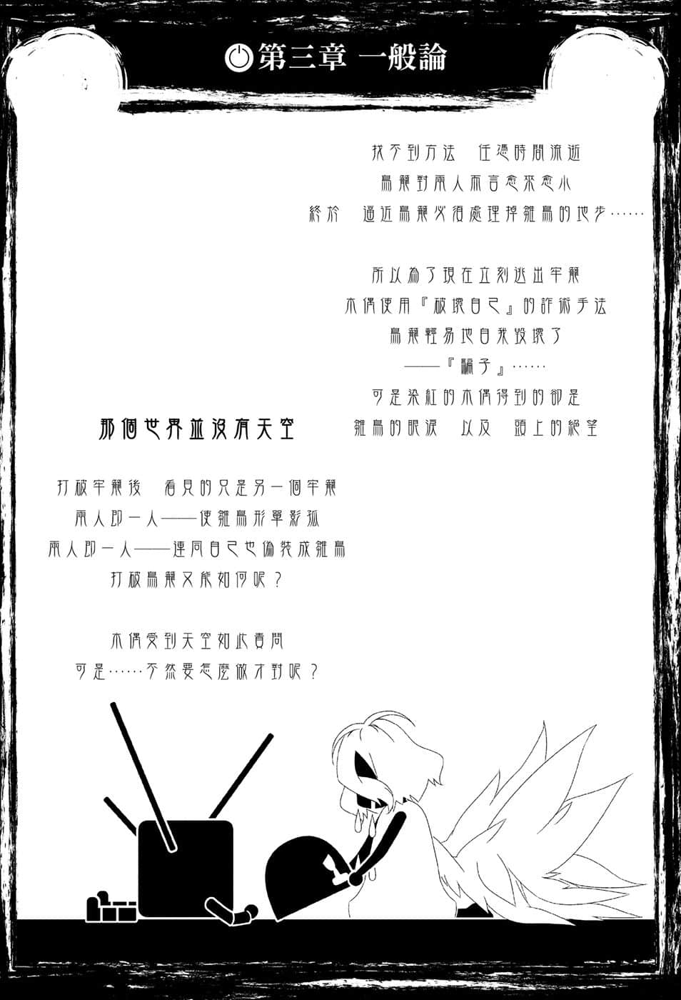
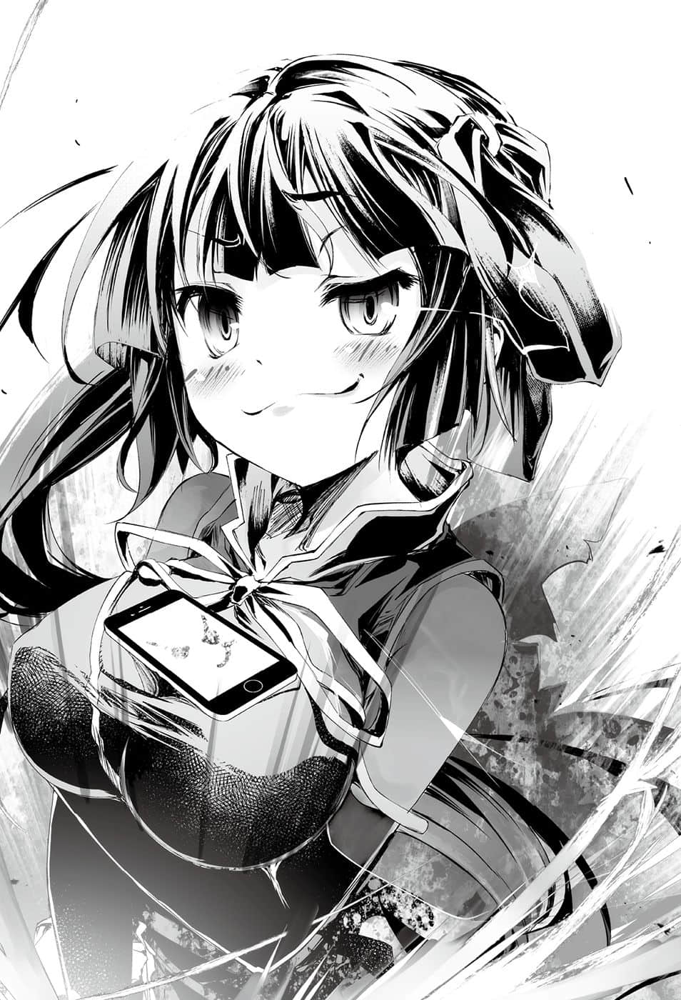
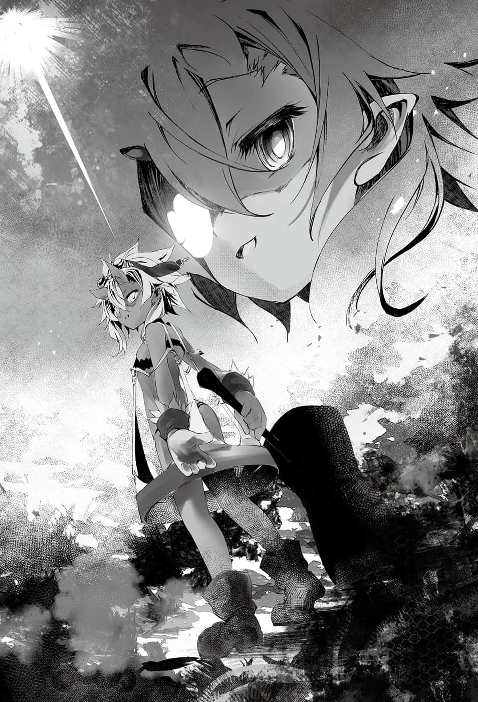
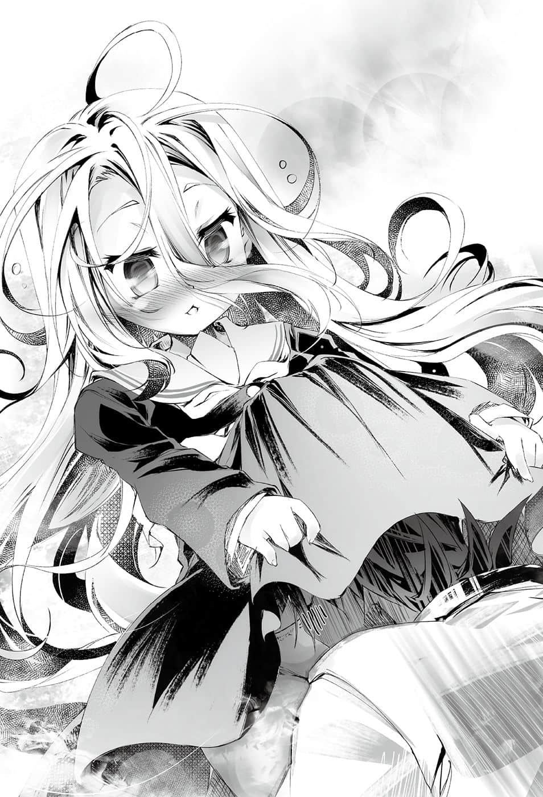

# 第三章 一般论

> 来源：https://www.linovelib.com/novel/9/2134.html

哈登费尔首都依然听得见工业声响。

自从与维格相遇后，如今已过两天，地下都市里纸张飘飞。

有的纸张被贴在大街上，有的则是到处飘飞。

『纸张传单』上有一张照片，照片里的少女衣服一开一阖，羞得面红耳赤。

照片旁则是用地精语附注以下的文字……

《寻找走失地精种》

缇儿 84岁 女生

特征是白板

发现的话 给我联络『 空白』

---

■ ■ ■

「就是如此……我们在寻找逃过天翼种追捕的缇儿。」

「……有人知道……她可能去哪儿了吗……？」

「……………………………………呃～……你们说的是真的吗？」

没错——她完全逃过认真追来的吉普莉尔……

她成功通过艰困的魔鬼游戏，达成前无古人的伟大功业。

空与白询问缇儿的下落，菲尔听了则是不禁怀疑自己的耳朵。

要怎样才能逃过能自由自在空间转移的天翼种？菲尔惊讶到说不出话来。

「……非常抱歉，主人，属下该死……我事前就该料想到的。」

吉普莉尔低着头，拳头与声音颤抖，流着泪道歉。

「确实，我无法追到『阴间』！！我并没有打算把她逼到那种地步……！！让制造主人们灵装的匠师逃走，阻碍主人们的胜利，这样的大罪……我、我该如何才能赎罪……！！」

「嗯，你还是一样搞错道歉的点啊……还有，她没有死啦！！」

察觉真相的空与白——

吉普莉尔逼近，缇儿哭喊着，她的灵装顿时发出闪耀的光芒。

——她的脸上带着百年难得一见的得意表情，将手机放在胸口……

空的眼泪忍不住溃堤，他向克拉米赔罪。

克拉米再度戴上面具，空与白也不忍再多说什么。

但是，在那之前，空半睁双眼，目光回到坐在椅子上的森精种少女。

「借用？我向地鼠借人吗？这玩笑开大了呢❤」

「好……我明白了，所有人都会受伤的悲惨世界就到此为止吧。」

空在内心说服自己，然后回想两天前发生的事。

除了损坏严重的灵装大槌残骸之外，缇儿甚至没留下精灵的残渣便消失了。

话说刚才的脚踢不也完全违反『盟约』吗？空问道。

白也……甚至克拉米也一起哭了出来。

————被炸飞了……

大槌的前端敲在地面的瞬间——缇儿飞了起来……

虽然是以森精种的方式，不过菲尔也可以使用刻印术式。那么依照维格的约定，只要把刻印术式的设计图交给她，就能依照设计图制造机体——资材和人才都可以借用。

空取出手机。

「以前我是贫乳……是的，否定过去也没用……」

——意译就是『以盟约逼迫他服从』……

「别反应那么大……看来你也有自觉……你知道吗？」

然后——

「……哥、哥……有了巨乳……就能有那样的自信吗……？」

克拉米性感地拼命解释，空则是得到确信，并且心想——她们就是让地精种以为对手是这个形迹可疑的人冤大头，骗对方掉以轻心，答应接受游戏。

菲尔再度踩在她所谓感动落泪的地精种身上说道。

但是实际上对战玩家却是菲尔——那根本是出其不意的偷袭。

「————咕呜！？」

白后悔不已，内心挣扎，不过空温柔地微笑，摸了摸她的头。

「所以我们寻找可能知道她下落的人，打听她的行踪，不过……」

那也代表他们确信某个『推测』，不过——这先姑且不论。

「妹妹啊，你明白了吧？她什么也没变，终究和乳房相同，她的自信也是假的。」

不过，如果是『这两人』的话——和现在的克拉米一起的话，一定就很轻松了吧。

「……也就是说……她完全逃脱全破了……要颁给她……过关奖励白金奖杯……」

「因为他『向盟约宣誓』，舔着地板说『菲尔大人，为了偿还我诞生在世上的罪孽，我愿意做任何事』，所以我才勉为其难，准许他帮助我哦～他可是感动得流泪啜泣哦♪」

菲尔露出有如热带沙漠的太阳般的笑容回应。

「——呼，是啊，我的心胸有如我的乳沟一般虚怀若谷，我会接受你的指谪……」

「不过身为一个好女人是不会受到过去束缚的哦……明白了吧？小弟弟。」

克拉米赶紧重新戴上自信的面具，空则是对她说明。

是啊……她确实飞了起来……与其说是飞，不如说是……

「真正的巨乳被问『能做到吗？』，不会以巨乳做为限定条件来思考啊！！」

巨响和冲击震撼首都……她留下『大爆炸』，消失得无影无踪。

而是踩着高跟鞋进入室内的克拉米。不，正确地说是——

毕竟挺起胸膛，手插在腰上，撩起头发的克拉米，根本就像『谐星』在扮演充满自信的好女人，甚至她自己也不愿面对现实。

面具又被剥离，克拉米泪眼汪汪。

虽然相当残忍，不过既然是游戏的结果，那就是地精种输的人的错。

维格确实说过也会出借人才——也就是『命人协助』，不过——

「——『两个人』一起上的话，那就轻松自如了哦❤」

搔首弄姿地抛出飞吻的伪巨乳克拉米。

……只不过借来的人才似乎太忠实了一点。

意思就像在说——那么白也应该不要解除才对……

「什、什么！？在你的记忆里，问一个巨乳用手机『能做到的事』就是这个吧？」

在空的苦笑和白的拍照声下，克拉米一下子便原形毕露。

「～～～～～～～～！～～～～！！」

「那不是自爆啦……缇儿不会做那种事。」

而且，这样一来，就能命令凭感觉造物的地精种，忠实地替他们制造。

「……我先问一下『我可以打听情报吗』——首先就从那张椅子开始。」

大、大概……不，肯定没死！

「为什么是你们哭泣呀！？啊——不、不是的！？嗯、嗯哼！」

「别用那么温柔的眼神看我好吗！？话说你们是来干什么的，快回去啦！！」

「…………对、对不起……都是白不好……」

想到造成这股反作用力的因素，空都快忍不住落泪。

如果连吉普莉尔都断定没有缇儿的精灵反应，那么——她就已经不在首都了。

……维格没说要把人才『送人』吧？

因此他们才会来到这里。

「嗯～？椅子先生是得到谁的许可，竟然敢说话呢～❤」

『果、果然我没有容身之处啊啊啊啊！！』

那大概是地精语吧，空与白虽不知那名地精种在说什么，不过看到菲尔脚踢地精种，把人才当成奴隶使唤，两人一同脸颊抽搐。

「再说，我只是拿出手机而已哦！？你就不会想说是我要拿来拍照吗！？你应该有很多事可以做吧！？比如摆出巨乳写真女郎的姿势之类等等。可是你却毫不犹豫地把手机放在胸口！看你这么拼命，我实在不忍苛责，总觉得对你很抱歉啊！？」

「……克拉米是……巨乳……白已经明白了……」

因为灵装的素材只有地精种可以加工，但是地精种又不可信任——所以用盟约逼迫服从很合理。

「我说克拉米，你能做到那个吗？」

吉普莉尔确信她已死亡，但空与白反而更加深信她还活着。

于是菲尔便轻易收服大量的地精种。

如果是感性的种族，一定可以轻易看穿她的自信与乳房同样虚无吧。

「视察——只是你的借口吧？虽然嘴上不承认，你果然还是想念『巨乳我』吧。可以的哦？只要你跪下来求我，我可以让你看看我的巨乳……啾❤」

——叩、叩……

原来如此，只靠菲尔一人，要诱使地精种落入圈套是非常困难的事。

他们想要从监察室俯视工业设施，寻找制造『人型机械』的地精种。

「哼……仔细听好了，贫、乳、女、王。」

「……？哎呀，这不是空吗……两天不见了呢……呵呵……」

菲尔悠然地跷着脚，坐在地精种身上，空则是指着那名地精种问道：

解答空疑问的并不是菲尔的这句话。

却见克拉米露出得意的笑容，从空的手上一把抓过手机。

没错……那是自称废物地鼠——不会飞的鸟起飞的瞬间——

……不过就是一对巨乳，竟然能让她变得如此得意忘形……

「——哼……你在说谁呢？小、弟、弟。」

正因为如此——

可是，即便是菲尔，有那么容易骗过感性的种族赢得胜利吗？

……不过他只是取出，甚至没有递给克拉米。

「我说啊……那样已经超出『借用人才』的范畴了吧……？」

空与白从一开始就知道菲尔不晓得缇儿下落。

空亲切地不去理会克拉米，视线回到坐在地精种身上的森精种少女，对着她问道：

「话说菲尔，你还认为可以先我们一步胜过维格吗？」

「欸～？……怎么可以这样诬赖人家……人家很伤心哦❤」

菲尔就像在背书一样地说完，笑容满面地表达伤心，接着她又说道：

「我明明这么努力地为了朋友的胜利贡献心力，我要哭了哦。」

「你需要名目吧——那么如果我们获胜，身为朋友我想要酬谢你，你想要什么？」

空委婉地在问『菲尔获胜的话想要什么』。

看来这个问题克拉米也问过很多次，她不安地竖耳倾听。

「别担心啦，我已经不会要求『杀害』或『灭亡』了。」

菲尔的回答反而是为了让克拉米安心。

「那家伙越过了三条『不可跨越的界线』哦……？」

但是，她面露凶恶的笑容接着说出的话语，反而令克拉米感到不安，那就是——

「我不可能杀死他啦，我反而要他活着哦❤」

「——借问一下，不可跨越的界线是……？」

「出生在世上，以及——摸了两个不该摸的东西哦♪」

不该摸的东西……看向那两个丰满的物体，空不禁心想。

菲尔的眼神确实显示出她有多么想赢……

——但是，过了两天她还没发觉那件事，也令空感到意外，于是空又重复一次两天前说过的话。

「我们不同心协力就无法赢过维格，请你具体考虑一下吧。」

「——哦～？」

『是啊，确实有可能无法达成目标，即使锻炼也可能是白费……但是一味逃避，什么也不做的话，当然无法达成。』

两人完全就是『主角与第一女主角』……真要说有什么缺点——

『那东西抛弃热情，封闭自己的可能性，堕落成什么也不是的废物。』

……对，其实空早就发觉了。

是啊，难怪他们会互相爱慕，甚至到了配对的地步。

——空不让他把话说完。

「嗯～可是白……《叔侄配》这样好吗？而且是胡子大叔和外表幼女……这样不会有问题吗？不管是在伦理还是在画面上都很有问题吧？」

正因为如此——地精种，感性的怪物。

永远持续下去，直到死亡的那一天。

正如趴在地上的地精种所说。

那个地精种始终称呼缇儿——『那东西』。

但是一方的才能令劣等生失去自信，而刻意保持距离。

「不，是那样没错！可是多种族联邦还是有某种程度的文化交流呀。」

『地精种的生存方式就是「锻炼」——不管胜利还是败北，说穿了都是「经验」。』

同样埋在银色头发下的眼眸，闪耀着冰冷的目光，他继续说道：

「啊，是吗！！那你的意见就全部不予采纳！！给我继续当椅子吧！！」

『不过或许也有可能到达，封闭那个可能性的就是——逃避的那东西自己。』

「？咦？什么？你们在说什么？」

瞬间————空气冻结了。

「……那是地精语吧。吉普莉尔，可以拜托你翻译吗？」

——噗一声，菲尔的脚跟踩在地精种椅子身上——开始与他争执。

空最后瞪着地精种，语气锐利地说道：

地精种困惑地回答——

「啊，主人，他擅自说下去了……要开始翻译吗？」

『逃避很可耻，做了那种事，那东西最后的去处，要举一个地方的话就是——废弃场。』

「……哥？不可以把我们的文化……强行加诸『异文化』……」

「——咦？啊，抱、抱歉……拜托你继续翻译。」

但是突然有人喊停，问话一时中断。

然后，他的眼中浮现愤怒之色说道：

——年幼时约定结婚。

于是再描绘更高的理想，继续锻炼自己！无止无尽！

菲尔的眼神像是在探问：你有什么根据？

这世界的一切都是为了被锻炼而存在——『自己』就是最该锻炼的存在。

「……吉普莉尔……刚才的问题……再问一遍……叫他……说清楚一点……！」

透过吉普莉尔的同步翻译，空等人怀着同情听着地精种的叙述。

「～～～～～～！！～～～～！～～～～！？」

只见白露出可怕的神情追问，连吉普莉尔也被她的气势震慑。

——于是就在众人怜悯得快要落泪的时候。

虽然她的声音一如往常轻声细语，不过仍是欢呼着——好啊啊啊！！

「……欢迎……《叔侄配》OK的文化……对白有利……应该引进。」

『这种事根本不算什么耻辱。』

「是啊，哥哥毕竟也明白了……这下子果然确定了呢……」

「————————」

克拉米侧着头感到疑惑，一旁的菲尔则是露出不愉快的表情。

「完美！？那么喜欢完美，别说是胸部，干脆把全身都改造成圆球吧。你给我听好了，傻蛋！」

「～～～～～～～～～～～❤」

空一句话否定他的回答，随即转身回头。

——背上压着菲尔的臀部，大胡子趴在地上，不住发抖。

「我以为感性的种族有什么了不起，维格和这家伙都不值一哂！！」

然后依照理想而锻炼，不羞耻，不迷惘，不屈服，直到达成理想为止。

经过不断敲打、研磨、淬炼，不断创造自己想像的自己——

「————欸！？等等，什么！？」

——就连原本独一无二、无人能及的天赋，维格都到达了。

『嗯，嗯？你们是问「能造出超越首领的灵装就结婚」的约定吗？』

「……哥，路线确定了！配对也已确定！……是『青梅竹马属性』！」

地精种毫不迷惘，目光直视着空，堂堂正正地这么说道。

『以前她总是追在首领的背后，时常说要超越首领，嫁给首领——』

『首领拥有出类拔萃的天赋，别说是那东西，我们可能永远也无人能到达首领的程度。』

空的身旁，对应七百种语言的可靠兵器恭敬地行礼回应。

听到他这么说，空心想——是啊，说得很对，正确得令人火大。

他的眼眸看着低着头的黑白兄妹。

言下之意就是断言『菲尔胜不过维格』。

祂的眷属的感性——？当然也是『乱七八糟』吧！？

『找寻无法达成的理由而逃走能得到什么？别说没有胜利，甚至也没有败北。』

「欸～……简而言之就是——无论如何，他们以前感情非常好——」

『只不过是败北，甚至连结果也不是，做为通往理想的过程，败北有什么好羞耻，又有什么好害怕的呢。』

『没有人找得到她啦……就连她非常黏的首领也找不到。』

想到缇儿的那对眼神与维格的意图，那就再清楚不过了。

「喂，臭椅子！！冒昧问一句，你觉得这家伙如何！？」

背景浮现大字，她兴奋地握拳叫好。

「因为——从你必须让地精种制造灵装的时点，就表示不是一人之力可以获胜了吧？」

白的脑中甚至仿佛听见UC㊟的背景音乐，空苦笑点头。

那么不努力的人，有什么根据断言自己做不到？

『……嗯，不愧是首领——完美啊。就如同我甘愿成为椅子的理由，说穿了就是喜欢上巨乳——』

因为他们的创造主创造出胡子女，品味本来就差劲无比。

他所说的就是——地精种，天生强者的定义。

「首先是那个长耳朵威胁『快招出缇儿的下落』，地精种求饶『我真的不知道』……啊，长耳朵又说『不知道也给我说！我自会判断可能在哪里』，地精种似乎认输了♪」

『确实，首领创造出我们谁也无法想像的东西，不是那么容易就能赶上他。』

空抓住愤怒的克拉米的手臂，把她的身体向前推出。

「哦～？竟然擅自评价他人，原来如此，你这张椅子很了不起是吗？」

『可是那东西逃避了。』

『那东西甚至可能已不在世上……那东西就只是垃——』

「……停～～～～……！！」

『永无休止的「锻炼」，正是我们锻神之子地精种——唯一的「胜利」。』

听到地精种接下来的冰冷话语，空与白眼神的温度也随之下降。

——白高举双手欢呼。

这样很多事就说得通了，空与白点了点头——不过地精种的语气突然一变。

抵达之后就会知道，那并非自己的极限。

空则是轻松地回答道：

空出言讽刺，亏他一张椅子还敢那么嚣张。

男地精种埋在胡子底下的嘴角骄傲地扬起。

这个问题真的很突然，年老的地精种一瞬间圆睁双眼，然后——

空与白对结局感到担心，吉普莉尔重新行了一礼。

——想像理想的自己，发挥感性的极限，勾勒出优秀的自己。

译注：机动战士钢弹UC。

年老的地精种被命令说出所知的一切，他结结巴巴地开始说道：

「就是因为满足于区区的完美，地精种才会仍然『毫无长进』啊！！」

———————全员的目光都在质问那句话的意思。

但是空不予理会，大跨步地离去，白和另一人赶紧跟上。

「吉普莉尔，你把字典更正过来！地精种是感性非常优秀的——『反面教材』！！以后地精种若是说『星球是圆的』，那就要最优先重新检讨！！百分之百不是圆的啊！！」

为什么？那是当然的吧，如果是绝不会出差错的种族的意见。

——那也绝不会是最正确、最适合参考的意见吧——？

「遵、遵命！我、我立刻修改——！！」

空带着用笔在书上书写的吉普莉尔，离开监察室。

马上来证明一件事吧——空面露嘲笑，内心继续说道：

——他刚才说缇儿没有容身之处，没有人找得到她？

看吧？——『猜错了』！！

「吉普莉尔，我知道缇儿在哪里了，把我转移到首都正上方的上空。」

「是、是的！！立、立刻准备——请、请稍待一会儿——！！」

就在吉普莉尔慌张地收拾书本，进行空间转移的准备时。

「椅子，为了感谢你，我传授你『异世界工业』，你偶尔也把脑子用在思考上吧。」

空说出嘲笑的话语，送给茫然若失的地精种做为饯别。

研磨？锻炼？哈！擅长工业的种族原来只是浪得虚名。

「你那段只知『锻炼』的生活态度演说，真是滑稽哦？比如『熔接』或『锻接』——」

留下竖起中指的残像，以及接下来的一句话——

「这世上也有一种将全部材料先熔解的工法叫做『铸造』，你没听过吧！？」

……空神秘的话语与巨乳的事。

---

■ ■ ■

「不管如何努力……也无法扭转天赋才能的差距……」

再制造出虽不及维格，却也有相当程度的机体，然后再用那架机体去打就好了。

「——！！——啊……！」

菲尔将脸埋在克拉米的胸前，一边玩弄她的胸部，一边发出啜泣声。

——空吗？——怎么可能赢得了。

对……既然这游戏比的不是机体性能，而是『灵魂的较量』。

「限定刻印术式的游戏……那是地精种最擅长的游戏……我不可能赢得了。」

因此借由菲尔的灵魂——『否定地精种一切的坚定意志』。

……灵装所需的素材只有地精种能加工。

于是现场只留下克拉米与菲尔，以及寂静无声的空间。

原先她们是抱持这样的打算……可是——

「……可、可是，那么空到底打算如何取胜呢……？」

……地精种说过的话和巨乳的事。

然而在这样的情况之中，克拉米确信能掌握什么线索，于是抽丝剥茧地进行思考。

宇宙的道理和巨乳的事……也就是说，她主要是为了巨乳在烦恼。

忽然间，脑海中亮起闪光，伴随着头痛，有道声音回答克拉米的疑问。

头痛和错综复杂的思绪令克拉米抱头痛苦，她在心中自问自答。

菲尔承认自己赢不了——第一次看见好友『放弃』，这才令克拉米大吃一惊。

——做不到的事情就绝对做不到……

自己是巨乳，概念上是巨乳——既然在抽象意义上是巨乳，那除了巨乳以外还能是什么呢！？

——菲尔受到粉碎至骨髓的物理性重伤，克拉米看了也差点晕倒，不过不管怎样，根据菲尔的主张，那纯粹是种族上的天赋。

尽管借由治愈魔法得以平安无事，不过这样下去可能在游戏前就没命了。

这段记忆……在脑海中闪烁……

「无论怎么挣扎……种族适性的差距是无法颠覆的……！」

因为那样的灵装别说是菲尔——甚至无人能制造出来。

因为自己天大的疏忽，搞砸了致胜机会。

克拉米说到一半打住，惊讶得睁大了双眼。

克拉米终于到了思考的瓶颈，不过——

——但是却不是克拉米最喜欢的菲尔……

自我认知和自己的胸部一样摇摆不定，克拉米苦恼不已。

「……正如空先生所说——这个游戏我无法取得胜利。」

克拉米发出悲鸣向好友求救，但是带着温和微笑回应她的那张脸——

菲尔玩弄克拉米的胸部，口中道出对地精种的哲学一笑置之的真相。

「哼……锻炼？那终究只是低等动物的胡言乱语，可悲害兽的妄想……」

「那场严重骨折是种族适性的问题吗？不是因为菲笨手笨脚的关系吗？」

……即使不是以机体性能，而是以『灵魂』决胜负。

————

没错，那些家伙来去一阵风，否定了『巨乳自己』后就离开了——

于是在沉默寂静之中……乳房不住晃动……

「菲……我是巨乳对吧！？我是真正的巨乳，是真正的我吧！？」

——『我吗？我怎么可能赢得了。』……

『你们让本大爷中计，游戏结束，是本大爷输了——』

——因为那是彼此互殴的打架……

这一点，人类种理所当然比任何种族体会得更为深切，因为——

但是如果不能打中对方的灵魂的话……那就只会单方面被当成沙包打而战败。

胸部被她又揉又抓又摇，克拉米听着她的痛哭，低下头思考。

要他们清算这段过去……他们不可能办得到。

「是、是啊——不过既然空和白答应游戏……所以我们也会有胜算吧？」

正因为如此，克拉米才以不伤害性命为条件答应帮忙。

毕竟克拉米拥有空的记忆，如果有什么是连她都会忽略的事情，那就是在这个世界不可能发生的事。

「————等等……菲、菲！？」

空对暴力会无条件屈服……他就是那样的人，所以条件应该相同……

区区的完美是什么意思？既然是完美，那不就好了吗！！

是啊，竟然会犯下这么明显的疏忽，一点也不像是菲——但是克拉米无法责备她。

没错——这个游戏看似维格必胜。

空与白伴随着吉普莉尔，连同空间一起消失踪影。

克拉米就在菲尔的摆弄下继续思考。

不管空他们被问什么，他们回答什么，都跟横刀夺取胜利无关。

对判读错误的自责，加上被地精种椅子色眯眯注视的恶梦，菲尔的精神受到重挫。

「所、所以你才收服地精种，命令他们制造不是吗？为什么那样会赢不了？」

……没错，空不会接下没有胜算的游戏，就如同他彻底持续逃避胜负一般。

游戏总归只要打击灵魂，粉碎核媒就好了，只是如此而已。

菲尔将脸埋在克拉米的胸前，从脸颊磨蹭甚至到深呼吸，样样都来，化成了一个色精。

那么胜利条件就不会是制造出比维格更优越的灵装。

只剩两人的监察室内一片鸦雀无声，克拉米不断思考许多事情。

那么空他们推估的胜算是什么呢？

……那么，空是接下赢不了的游戏了吗？不可能。

——他们不可能答得出来……

——不论再怎么努力，人类种也使不出魔法……

……我怎么会疏忽这一点——！！

「不管是什么模样，克拉米都是我最喜欢的真正的克拉米哦。」

「克拉米！？回答我，克拉米！克拉米！？」

那么——对空与白而言，那应该才是致命性的必败游戏……

惨的是菲尔拿着巨大槌子，询问克拉米『这个东西哪一边在上面？』，然后挥起必须使用多重术式才能举起的大槌——

不管是菲尔的声音，还是身体被摇晃的感觉，都那么地遥远……

「……？克拉米……？」

好友突然变了个人，克拉米因为被她摸胸而惊慌失措，不过更令克拉米震惊的是她接下来说的话。

更何况互殴正是空白做为胜算的基础，所以他们才会答应比游戏。

不过菲尔表示只要有工具和神火炉，根本就不必借助地精种的力量。

但是既然空他们答应游戏，那就一定有胜算。

「……是啊……我知道你很痛……可是……菲？」

——不会使用道具的菲怎么能够『操纵』灵装——！！

得知虽被坐在自己屁股下其实心中暗爽的椅子，也静悄悄地被撤走了。

「森精种是不使用道具的种族呀！！真的很痛唷～！」

但是，那么……空能够靠打架胜过维格吗？答案是不能。

因为维格的质问，空他们的灵魂应该无法回答。

但这是好友第一次体会切身之痛。

克拉米终于明白空为什么会说『从你必须让地精种制造灵装的时点，就不是以一人之力可以获胜』。

——那还用说，就是空他们被质问的——『灵魂』。

那是克拉米不知道——也不曾见过，充满泪水与绝望的笑容。

如同这段记忆，他从未失败过……相对地，他也从未胜利过。

『从自己的世界赖帐逃走的——丧家之犬——』

……没错，这游戏是质问他不可能清算的过去。

即使如此空仍是答应的话——这表示他能赢，就如同往常一样。

对……一定是一如往常，这会是宛如走棉绳横渡山谷的危险赌局。

只要走错一步就会坠落谷底。

所以只能选择……一步也不走错的胜利方式——

『你们那么有本事——为什么还要逃离你们的战场——』

————吵死了……

要思考的不是答应这个游戏的『动机』，而是『致胜机会』。

『不过或许也有可能到达，封闭那个可能性的就是——』

————吵死了，吵死了吵死了！！

别一副自以为是的表情，说得好像你很懂！！

『逃避很可耻，做了那种事，那东西最后的去处——』

————那么你才是在逃避羞耻吧——————！！

最后听见内心响起不确定是谁的感情的怒吼。

伴随着线索串连起来的感觉——克拉米的眼前忽然一暗……

————————

——然后清醒过来发现……自己是在黑暗之中。

一个可以明确看见天空，却是没有天空的世界。

有吸血种、天翼种、海栖种、神灵种——机凯种们……

——空一步又一步地走近。

接着蓝色天空又打开一处，出现的是头顶光圈，背生羽翼的少女。

原来如此，难怪白会积极找寻配对的对象……

想要活得像一个不停锻炼的种族——最终却无法办到。

因为————『这些家伙』——和他们一模一样嘛……

然后——露出苦笑，塞满洞穴的铁屑又增加一个。

——啪一声……

——不断累积『失败垃圾』，将地层愈堆愈高。

放弃抵抗的眼眸瞥了黑色天空与白鸟一眼，缇儿再度转身背对他们——

阵阵的呼唤，宛如朝着水面浮上的气泡。

「叫我别怕羞耻，别逃避，活着锻炼下去？无聊，如果靠努力就能超越首领，那就快点来个人超越给我看看呀！！明明谁也办不到，还说什么胜利结果！！」

当天空开出三个、四个洞……分别出现长耳长尾的女童、妖艳的狐狸女。

不过——那对眼眸总是希求蓝色的天空，仰望黑色的天空……

从『垃圾堆』中收集已知的刻印术式，将其连接起来。

「…………」

逐渐浮上的意识中，克拉米心里想着。

「你说过讨厌看不见『天空』对吧？」

「……我喜欢天空……喜欢飞翔于天空的鸟。」

克拉米想起强行撬开的蓝色天空与白色的鸟，为了将空他们的致胜之机告知菲尔，她开口说道：

「这样你们还叫我制造灵装吗？」

——这是以自虐的方式，讽刺上次开讲的「只要是地精种就可以做到的讲座」。

带着妹妹与随从，眼眸有如手指向之处的青年——空笑着回答。

铁屑上施有凭感觉不甚明白的刻印，她拿起数个，露出无奈的笑容看了看之后。

啊啊……自己的头上也有蓝天开启照亮。

她没有容身之处——希望创造一个容身之所。

隐约看得见是黑暗中互相依靠的男人与白发少女。

「……什么也不会做的废物地鼠为您讲解简单轻松的『灵装』制作。」

「再来就是不断持续下去，直到碰巧做出能运作的灵装为止……看，很简单吧？」

原来如此……这些人——包含自己在内，都是空与白至今战胜的人们。

「…………米…………拉米！」

————…………

苍白眼眸的少女……

缇儿嘲笑这个昏暗幽深、与世隔绝——孤独的无处容身者的容身之处，然后问道：

「接下来……拼命思考刻印的意义『看能制造什么』……」

然后五个、六个，一个接着一个——人影随着天空陆续开启而浮现。

克拉米看到两个重叠的人影，然后抬头往上看。

他们一同仰望蓝天的时候。

一次又一次的逃避，逃到最后甚至逃避现实一切之人，这里就是归处。

从上空可以看见，地面一个洞穴的底部塞满『铁屑』。

缇儿将两天前说过的话语，这次不是以话语，而是以行动加以实践。

——啊啊……那些人不是空与白至今胜过的人们。

她好似害怕空的接近，头也不回——而且也不敢回头。

---

■ ■ ■

看到好友脸色苍白，眼眶泛泪，不停呼唤自己，克拉米含笑回应。

忽然，打铁的声音停止，瞬间鸦雀无声的洞穴中，响起了空虚的话声——

……

这个洞穴就在哈登费尔最大的——『废物处理场』的一隅。

瘦小的背影——缇儿回过头来，以沙哑的声音问道。

那是憧憬比任何人都优秀之人，却又以劣于任何人为傲的人。

她语带讽刺地说完，将做好的东西随手一抛。

发现握着自己手的是温和微笑的好友，克拉米笑了。

空与白并不是『获胜因素』。

………………？

除了握着手的感觉，空无一人的世界。

「这也不是，那也不是，经过思考与摸索之后……好，『失败完成』了。」

人生充满耻辱、挫折与失败，逃避同乡，逃离故乡，也逃离才能叔父。

——与她说的话相反，她的动作快到空他们无法看见，运使着手上的工具——

被问话的对象手指着昏暗地洞的天花板——看得见少许天空，阳光照入的小洞。

缇儿口中辩解，背影不住颤抖。

是啊，为什么自己没有发觉呢……

她充满明确的自信，认为自己什么也办不到。

不，不对，那应该是红色眼眸的少女与黑色眼眸的男子才对……

受到蓝色天空照耀，浮现出一名红发的少女。

抬头看见众人仰望的景色时……

「可是还是想不通，一如往常地叹息之后，一根一根仔细地……」

「要、要白费力气请便，我可不奉陪！说什么输了也是骄傲，根本脑筋有问题！赢不了的胜负还偏要去输，简直莫名其妙！！」

那两人并不是靠自己的力量获胜……

…………

那么，唯一——仍仰望看不见的黑暗的那个人影是……

说完之后，缇儿的背影不住颤抖，空默默无语，只是朝她走近一步。

根据椅子所说，甚至可能已经不在世上的社会世界废弃物——这里就是她的终点……

那是塞满铁屑，显得狭窄的洞穴，但是对于单独挥槌打铁的瘦小背影而言，这个洞穴却又过于宽敞。

没错，一如往常……也就是靠着诈骗与诡辩取胜——

出生为绝不会出错的种族——但是却不断出错。

虚幻的眼眸好似畏惧一般，充满不安之情。

「首先……从『废物堆中』将已知的刻印术式……收集起来。」

那里是昏暗的地底，狭小的洞穴中，只有打铁的声音空虚地回响。

………………苍白的……眼眸……？

「……总而言之，就是一如往常地取胜……只是如此而已。」

「鸟可以理所当然地做到我做不到的事，我喜欢想像翱翔在天空，从天空所能看见的景色——梦想着『如果我也能飞的话就好了』。」

只见有如聚光灯开启一般，天空的一部分打开了。

「……为什么你们会知道这里？」

没错，缇儿就是单独在这个洞穴中，挥动槌子发出打铁的声响。

「让我重新欢迎你们来到『我的地方垃圾的住处』……找我有什么事吗？」

包含克拉米自己在内，不管是哪一次……每次都是他们自己输给空与白。

或许是不想逃了吧——不，那就像在说她已经无处可逃一般。

——明白全部线索串连在一起的感觉是何原因后，她露出苦笑。

——对，只有他们……还看不见天空。

「努力就可以得到回报！？确实是很有希望梦想的言论，但是——那只是梦想而已。」

感觉到空从背后接近，她终于放声大喊。

下一个瞬间，空夸张地点头后，突然大声咆哮，吓得缇儿跳了起来。

空大喊——

「非常正确～～～～！！」

…………

「我就直说了吧！！努力不会得到回报，才能也无法超越，这就是现实！！」

「………………欸、啊……是……吗？」

缇儿哑口无言……想不到空竟然会认同她的说法，她战战兢兢地回过头来。

圆滚滚的感应钢之眼充满困惑，睁得更加浑圆，不过空优雅地无视她！

「在我们原本的世界，娱乐作品游戏和漫画都是主张——『努力就会得到回报』、『凭藉努力可以超越才能』。为什么！？因为那是富有梦想的故事虚构作品！！不是现实中会发生的事！！」

空的语气格外激动！他热情地双手高举，握着拳头，声音颤抖，滔滔不绝地演说。

「因此很明显！说什么『人可以相互理解』、『人生而平等』！娱乐作品所灌输的这些思想全都是虚构！！因为现实中没有，所以才追逐梦想——这就是娱乐作品吧！？」

——娱乐作品所描写的故事，终究只是梦想！

因为如果是理所当然的现实，那就不会成为娱乐作品。

比如说——

……『人会想睡觉』。

应该没有娱乐作品的主角会热烈主张这件事，为什么？

因为那是理所当然。

因为那是从自己的枕头就能知道的现实，观众只会说：笨蛋，这我也知道，退钱啦！

「分析、考察、利用、模仿强者——说穿了只要能赢就好！OK？」

直射自己的两对目光，令她不由得想起眼前之人是谁。

就根本上的问题来说。

缇儿与吉普莉尔咽下唾液，她们似乎确实听见了两人没有说出口的话声。

「是虚构！！友情会毁坏，爱情会陷入泥沼！有女人缘的男人会被情杀，这就是事实。不，应该说给我龟在虚构里，或是被刺杀，从现实退场吧。不过这先姑且不论——！！」

「别瞧不起人啊！你可以一个人外出，一个人就可以与人交谈！！在那个时点就已经是底端的我们所遥不可及的强者了！」

……拉～拉～拉～拉～……

传授她奥义，使她突破努力也无法超越的才能，让她见识深不可测的深渊。

「不行！我肯定不行！」

「比如说，正好就如缇儿做的事一样，不断地以作弊取胜。」

「如果垫底的人靠努力就能胜过天才——那么『天才也努力的话，那就没救了』吧！！」

「那么我问你，缇儿！你能在禁止魔法的战斗胜过兽人种吗！？」

两人所展现的气势，甚至伴随（神秘的）压力。

「那么我问你，缇儿！你能胜过最强的灵装使维格吗！？」

没错……面对靠努力也无法超越的天赋——上位种族，两人却皆能取得胜利。

或许仍然抱持希望吧，白突然插嘴，空却是毫不留情地说道：

听完空感人的演讲，缇儿热泪盈眶，向空敬礼。

事隔三天又被性骚扰，缇儿甚至忘记脸红，愣在原地。

「缇儿说的完全正确，不会赢的胜负？无聊——放弃也是当然的吧。」

「缇儿……你知道你是在谁的面前，夸耀自己是最劣等的存在吗？」

「我再问你，缇儿！你能下西洋棋胜过机凯种吗！？」

也就是说，空与白——『 空白』……他们体现了平凡的人类种却能颠覆天赋之差，甚至连神也能击败的事实。

…………

「NO！NO～NO～！！」

反过来说——如果是娱乐作品所描写的事情。

「我们『 空白』才是真正最劣等的存在，如果你那么大胆，敢与我们同样以劣等为傲，立志要爬上顶点的话——很好，那你就仔细听好，我告诉你，我们是如何取胜——如何连战皆捷……」

『理论』是所有战略战术——学问体系之祖。

「如果要将优等种的观念，强行加诸在我们最垫底的人身上，那么我的回答只有一个『Fu〇k you』！！」

出人意表，空与白就像是恶作剧成功的小孩，对她露出令人厌憎的笑容。

——然后最终则是『理论』。

缇儿困惑地点头，苍白的眼眸中寄宿着微弱的火焰——那是空熟知的眼神。

「没错，就是靠作弊，如果要换个更优美的词语的话——」

空露出温和的笑容，粉饰他所歌颂的邪恶思想。

「跟最优秀的地精种比赛锻炼？最劣等的人怎么可能获胜。」

「是！『Fu〇k you』！……Fu〇k you是什么！？」

啊啊，虚构作品常说『邪恶必不长久』……

缇儿就像军人一样向空敬礼！而听到缇儿强而有力的回答——！！

「我绝对确信！即使赌上性命也是不行，不行，不行！！」

而这些词语都可以称为——

没错——那就是弱者的本质，弱者的生存方式。

「…………欸，啊……那个……不一定吧……？」

空反而可说是投入自己的愿望，一口否定白的说法，重新注视缇儿的眼眸——

空将手肘缩在侧腹，张开双臂，摊开手掌向上——摆出支配者的架势发表训示。

——空肯定缇儿的说法。

白与吉普莉尔熟知空说这句话时的凶猛笑容，所以她们只是默默看着空接下来的『闹剧』。

「………………啊……喔……」

空从铁屑堆中拾起一块铁屑，脸上表情一转。

对——以正攻法超越天生强者是办不到的事情，所以——

「……我们单独一人……连呼吸可能都有问题……你会在我们之下……？不知天高地厚的小丫头……！」

空露出邪恶的笑容，如此断言。如果是娱乐作品，他一定是注定遭到讨伐的魔王吧。

他要说的就是——

空转身背对她——脸上露出邪恶的笑容。

空露出邪恶的笑容，他要为缇儿启蒙，告诉她什么是真正货真价实的最弱。

「啊～！！我不会因为你是褐色萝莉鬼女就放水！！为什么我要说服别人的女角啊！？我无法接受！从现在开始我要对你采取斯巴达教育了！你要有觉悟喔！？」

——可是不管是望着天空的眼眸中光芒闪耀的火焰，还是抱持期待的内心……

不管多么努力，自己也无法成为天才，而且自己比任何人都清楚这一点——正因为如此。

「…………啊，您说得没错。」

「是、是的，不过那个……我、我八十四岁，应该比较年长——」

白与吉普莉尔早已习惯，看到他的表情也毫不讶异……

不会有哪个笨蛋一一去宣传不用说也知道的现实，也不会有哪个笨蛋想知道那种事情。

「没错！！偷袭偷打，让对方自相残杀，下毒使其自取灭亡，引诱敌人中计！！」

但遗憾的是现实却是『邪恶总是长长久久』——！！

而且也是同样以劣等为傲，自称废物地鼠者，至今不断累积之物。

「……过去不曾有过……正如字面意思……我们是前所未有的『劣等杂鱼』……」

听到空说的话，缇儿尽管激烈地表达赞同——

也就是说——空再次转身面向缇儿——与她一问一答。

「锻炼身体，比腕力就能胜过兽人种吗！？锻炼眼力就能看见精灵吗！？如果你真的觉得那种锻炼能得到回报——那就锻炼肌肉，去跟大猩猩比握力赢给我看看！！有人说既然同样都是人类，所以没什么事是别人可以而你不行，但是恕我否定那样的理论。因为没有人是相同的！？如果那种歪理能说得通，那么人类和萤火虫也同样是生物，那就锻炼进化，让自己的屁股也像萤火虫一样发光吧。」

白和吉普莉尔很清楚空，他比任何人都不屑那样的正攻法。

「『真正的友情』！『纯爱』！『有女人缘的男人』！！这些很明显也全都是虚构！！」

就如同空的手中，无数失败的其中一块铁屑上，一个明显奇特的刻印所显示——

「——————靠『作弊』取胜……！！」

「你可以胜过大猩猩吧！？而且也看得见精灵，更不用说——！！」

「不对，全部的问题你都答错了♪答错的人要受到处罚，你自以为是的处罚就是——」

——认清自己的身份吧，卖弄小聪明的强者们，自大吧！傲慢吧！

缇儿似乎没有发觉，她对自己说的话受到肯定，其实内心感到沮丧……

「……那就是所谓的……『创意巧思』……」

比如说称之为——智慧。

缇儿仿佛被闪电劈中，她全身颤抖，呆立原地。

「正确答案是『全部都是YES』……现实和事实就是如此。」

于是空英姿飒爽地歌颂邪恶的礼赞，从不知如何反应的缇儿身旁通过——

「是！！让屁股发亮吧！！虽然我觉得那样也有点可爱！」

空完全不接受缇儿的反驳，单方面地宣言。

「——————！！」

——靠努力超越天生强者——无聊透顶。

不过听到下一句话——

……没错，空与白两个人下之人，仰望上方的一切，庄严地大吼！

那就是现实并非如此的绝佳证据，因此——

而且他们大胆断言，这次也会一如往常胜过维格。不，就如同过去的胜利一样，空与白断定他们已经胜利了。

他们是最劣等最弱小的种族之中，更精挑细选过的底端中的底端。

或者称为算计、学习、思考。

「……被白……性骚扰……而且……获赠照片……」

——要知道不管你们如何自卑也不及我们，我们就有如往地下挖掘，却永远也无法触及的无底洞！

归根究底——为什么需要靠自己的力量获胜？

「是！正是如此！！『不停锻炼的才能』是追赶不上的！！」

在黑暗中摸索挣扎，借由思考、推测、观察、拼凑等方式，学习强者的原理。

靠着实验与尝试挣扎，经过不断检验与迷惘，累积出庞大的铁屑山。

空嗤笑告知——正因为如此，最后终能尝到胜利的果实。

追根究底来说——

————为何一定要靠自己的力量取得胜利……？

如果要超越绝对的天赋差距，胜过天翼种的话——

「就好像你用『其他种族的术式他人的力量』，逃过吉普莉尔的追踪一样，对吧♪」

「啊！——啊、啊啊——不、那个！不不不是的，不是那样！！」

空将手上的东西抛给吉普莉尔——

但是缇儿似乎看出那是什么东西，为了阻止空的抛传，她全力一跳，打算在空中拦截，却仍是扑了个空——

「咦……？这是……『森精种的刻印术式』吗……？」

「不要啊啊！！不要啊，求求你们别看！！」

吉普莉尔瞬间转移，缇儿则是一头撞进铁屑堆中，铁屑堆里传来缇儿的恳求。

……只是将已知的刻印拼凑起来。

原来如此，听起来好像真有可能做到。

比积体电路更复杂的刻印，以及比机械式钟表更精密的机械，能够拼凑得起来？

——拼凑只凭感性制造的东西？

——衔接不含任何理论的东西？

「原来如此……你是使用有如寇雠的森精种的理论体系。」

「啊～我听不见，我想死——抱歉我说谎了，我不想死。」

——魔法并非空与白的专长……他们也完全无法理解原理。

「我是……废物地鼠，堕落到必须犯下使用森精种术式的滔天大罪，否则什么也做不到。既没有感性，也没有勇气和毅力，甚至是光滑无毛的秃地鼠。」

然后她思量了一会儿，战战兢兢地直视空的眼眸。

「……那么……不管是那个还是这个……我们都可以借……」

缇儿下定决心献上自己的身体——！！

「那么主人，我就将这些东西全部转移到长耳朵所在的工业设施——」

————…………

不过——以不普通的地精种为前提的话，那就有可能办到。

臀部吃惊地震了一下，尽管犹豫不决，她仍从铁屑堆里探出头。

「我——『可以成为比鸡更有用的存在』吗……？」

这样就能解释缇儿为何熟知森精种的魔法，甚至在魔法发动之前就能察觉。

她的眼神与两天前相同，同样注视着空的眼眸，问出相同的问题。

两名幼女已经虎视眈眈地展望未来，于是空被她们轻易抛弃了……

「……没理由……不用『其他人』的术式吧？」

「……『兄妹配』……也必须推行……只不过难以界定……健全范围。」

不过在这个情况下，要从蛛丝马迹推测真相则是轻而易举。

「真、真的要把这个东西搬出去吗！？这是历史财产喔！？」

「那样就不是借了吧！！既然没打算还的话，那就是『一借不还』呀！！」

没错——对普通的地精种而言，既无意义，也不可能办到。

注视着黑色眼眸的那对双眼，看起来恐惧不安。

没错——

——是否可以相信，自己能像他们两人空与白一样呢？

比火红更高温的苍白眼眸中，燃烧着『叛逆』与『坚忍』的火焰。

——我刚才睡着了吗？或者我还在睡呢……？

她问的不是自己是否会被抛弃。

需要的正是劣于任何人的地精种——缇儿。

看到缇儿面红耳赤，毫不犹豫地开始脱衣，空向其他人请求支援，但是——

——可以哦……你只要『给我享用』就好了。

————…………

不过那也就表示——

比如说——就像缇儿一样，在使用前便已看穿的术式。

明白空的话中之意，这次吉普莉尔真的无话可说了。

「比如吉普莉尔最初编纂，转移至哈登费尔首都上空的『空间转移术式』♪」

她如此问道。

「……我可以……跟着你们吗……？」

首领、叔父、天赋、灵装和——约定。

「不行啦。」

「我豁出去了！！虽然不能保证味道，不过我会和你一起去！！」

两人同时露出苦笑。

「我明白了！是我的说法不好！！要说『因为我是处男所以办不到』也是对的，所以别脱衣服啦，我并没有要『享用』你的意思，啊，力气好大！？谁来帮忙阻止她呀，拜托了！？」

毕竟除了逃到『死后的世界』之外，可以逃离吉普莉尔追踪的方法并不多。

「嗯？我看是『负面遗产』才对吧，规则是『把这个都市的一切全借给我们』吧！？」

「……不过缇儿就是提示……我找到答案了……」

「如果你想要赢的话——我会让你飞得比鸟还高。」

但是——深信自己不如别人的那对眼眸……如同当时一样问道：

缇儿眼中的期待瞬间转变为失望，然后——

也不是自己是否有和两人在一起的价值。

黑暗之中，空感觉在模糊不清的意识中漂流——接着听到白的声音。

「而不普通的我们想要赢，需要有意义的作弊吧？」

空想起那一日，维格打断自己说话时所说的答案，不禁苦笑。

空温柔一笑，向她伸出手，然后继续说道：

缇儿是使用刻印有天翼种术式的灵装——借由『空间转移』逃脱……

最后她下定决心，抓住眼前的空，脸色红润的缇儿已不再犹豫——

而且是只有在潜陆舰移动中才有机会刻印的术式。

「应该说我们也不行呀。鸡就是鸡，就算作弊飞起来，也不会成为鸟，不过——」

于是空对着长在铁屑堆的屁股告知『来意』。

——没错，只要使用具有理论体系的『已知森精种的刻印术式』，加以拼凑组合就好了。

「白小姐也说了，所以我也以孩子的模样待命吧……嘻嘻，嘿嘿嘿……」

「即使如此——为什么你还会仰望着天空制造灵装呢……？」

「……没问题……配对已经确定……反正在前一刻事件会取消……最坏的情况……如果只是前端一点点的话……可以树立『前例』……对白有利……白许可……」

————以人类之身在天空飞行——自己能成为那样的鸟吗……？

然后——空突然间。

「——————！」

「不可能！那并非只要复写术式就能办到——不，就算能以刻印模拟空间转移，以地精种的精灵量也不会发挥作用——那是不可能做到的事。」

为了胜过比任何人都优秀的地精种——维格。

「吉普莉尔，如果连具有不共戴天之仇的敌人森精种的术式都能用了……」

没错——必须动用作弊手段，不然什么也做不到。

听到白喜悦的声音——不知何故，空感到气氛瞬间紧绷。

「……哥……我终于找到……一直在思考的……答案……」

「即使如此……我能和你们两人一样翱翔于天空吗？」

稍微恳求一下，绝对让你飞到最高点……

所以空才会命令吉普莉尔把他们转移至哈登费尔首都上空。

---

■ ■ ■

「……『叔侄配』……OK……条件成立……对吧……？」

————然后……不知从何时开始。

对于她所背弃的一切。

尽管并非出于本意，空仍是茫然地接受事实，不过……

「为了胜过维格，我们要有效利用！顺便也可以处理掉！这是一石二鸟吧！？」

「是啊，所以才要『强化』吧？缇儿如果不靠强化就无法使用任何魔法♪」

缇儿的眼神中充满憧憬与恐惧、期待与不安，她的手不住颤抖。

缇儿自己并没有自觉，她望着空问的是——

---

□ □ □

「你是确信自己什么也做不到，并且引以为傲的废物地鼠。」

看起来简直就像在问——自己能帮得上忙吗？

空如此嘲笑之后，刻意接着维格的话语回答道：

不过吉普莉尔的眼神依然含有疑问——那她又是如何逃脱自己的追踪？

她是否能够胜利呢？

缇儿交互看着天上蓝色的天空与眼前黑色的空——

空忽地感受到温暖的体温，隐约听见白的声音……

燃烧苍白火焰的感应钢眼眸看着空。

「果然地精种的意见是最佳的反面教材，因为——只有一半正确。」

缇儿自信满满地如此声称，并且逃避无谓的努力，却仍是——

吉普莉尔得知真相，吃惊得睁大了双眼。

「……这样一来就看得见……可以摸……也很健全……对吧！？」

「也就是说，这里是白的裙子底下！？一片黑暗，我什么也看不见，这是什么情况！？」

（推挤）

体温挤压在脸上，空赶紧将头从黑暗中裙子下抽出。

可是离开黑暗后，看见的景色却仍模糊不清，摇摆不定——

「…………呼～……哥……白的……如何？兴奋吗……？」

「——白！？……这难道是酒……？我们两个都还未成年耶……」

只见白突然睡着——她明显是喝醉了。

空急忙抱住脸色红晕的白。

————这到底是什么情况啊。

空虽然如此大叫，但是思绪混沌不清，让他只能发出呻吟。

……环视四周，这里似乎是《酒吧》。

空站了起来，白对他裙子罩顶的地方似乎是一个吧台。

眼前有两个杯子，杯里冒泡的液体不管怎么看都是啤酒——如果是矮人的酒，那就应该是麦酒吧？

看起来是在蒸气朋克风格的奇幻游戏中，很常出现的那种矮人们喧闹的酒吧。

可是不管是吵闹声还是景象，感觉都非常遥远……

在朦胧的意识中，有道声音回答他。

『放心吧，这是我自制的灵油，没有添加酒精那种不纯之物。』

话声来自吧台的隔壁座位，一个同样喝着酒的陌生老人。

——那是一名看起来随处可见，却又不像随处可见的男人。

『嗯？故事还没说完呀，你不说了吗？』

「是啊……不过确实，所以……才比地精种你们还能够期待。」

将或许没错的意志人物

——它是看起来随处可见，却又不像随处可见的男人似的存在。

空带着确信的心情开怀地大笑……意识逐渐远去……

与神之火柱相同的眼眸……不——相同的存在继续说道：

【那么，如何才能养出那样的孩子呢？可以向你请教一下教育孩子的诀窍吗？】

如果是那样的话，那我就真的醉了……这饮料果然是酒……

用可能错误的意见手段

那样终究——不会超出想像的范畴，对吧——？

——这家伙是谁？不，应该说……

企图在犯错之前排除的愚蠢世界规则

【没错，世界什么的，尽量利用殆尽没关系啦，不管是打碎、熔解、做为燃料，或是拿来加工，全都无所谓。】

这到底是……怎么回事……

……咦……发生什么事了吗？这里是哪里……

……故事……我跟他说了什么……？

想到这里，空订正自己的思考——『这东西』是『什么』……？

——神火炉……

————我说了那么多吗……？

空一声苦笑，从吧台上抬起头来。

在疑问随着现实感逐渐远去的感觉中，空不知为何接受了现况，喝了一口酒。

『我爱人类……把爱印在衣服上到处宣传，你不会觉得害羞吗？』

空苦笑回应，他尴尬地红着脸，移开视线——

「……人……主人！？请回答我——主人！！」

——即使经过六千年，却还是这副德性……

……是啊，愚蠢的人类确实不断犯错。

仿佛附和他的笑声般，另一个笑声响起——

虽然或许只是重复相同的过程，不过——空试着想像。

这家伙是谁……？

「那里到处都是像我这样呆头呆脑的家伙，是一个有如『恶梦般的黑暗世界』呢？」

………………啊啊……

『你刚才说「不过他们比地精种还能够期待」，我想听后续。』

「呼～……我说到哪里了……『屎一样的世界』说过了吗？」

如果知道什么是错，那一开始就不会犯错了呀……对吧？

——『什么是错』……

「嗯～？啊……那个世界的规则当然是烂到极点……不过那也只是指世界，你没看到我衣服上的这几个字吗！？……嗝……」

不过至少那本书世界所陈列的书架分类，怎么样也不会是『科幻类』吧。

——将这个世界迪司博德的所有种族抛至九霄云外。

不，应该说……这里是……我先前是怎么了……

不管是好是坏，他们会发现自己是在一个谁也——甚至人类种也无法想像的地方吧。

『就是关于你们世界的事呀，可以再多说一些给我听吧？』

【我不知道你们的神创造主是怎么想，不过超越父母是孩子的责任，能够破坏宇宙也非常好。重新创造出父母也无法想像的浪漫事物，展现给父母看，这才叫孝顺吧。】

然后目睹了惨状。

遥想久远未来后的人类，空哈哈大笑，提出一个可能性。

「……因为至少人类不会窝在这样的洞里『停滞不前』吧。」

剧情如果不是太空歌剧，就是早已渡过文明毁灭，进入文明复兴后的大长篇了吧。

虽然非常讽刺，不过看来太聪明也未必是好事。

忽然间，空发觉有悲痛的声音在呼唤自己，他睁开沉重的眼睑……

在半梦半醒的意识中，空感到一股违和感，不过——

「人类是不会改变的，反正还是会犯错……连同世界规则一起不断错下去。」

不过那个世界的人类与这个世界的人类种一样，没那么简单就灭亡，那么——

「啊，是吗，那就没有后续了，我全都说完了……这个饮料真好喝……再来一杯。」

「借由『世界间航行』来到这个世界——哈哈！！还真的很有可能呢♪」

是吗……我跟他说了那种事吗……

……而以人类的德性来说——后者的可能性比较高。

「……呼～……是啊，毕竟那里的人都是一群蠢蛋，做什么都错，如果他们是故意走错路，那可能还有得救。那里就是一群无药可救的人类所创造的世界规则……」

但是不知何故，男人的眼眸给空一种似曾相识之感，更加深空的疑惑。

…………逐渐远去的男人……他的身影和声音……

——因为绝不想再犯错。

【哇哈哈哈哈——！！真是史诗一般的规模啊，那样不是太棒了吗，我喜欢。】

「……被你这么一说还真的会害羞，所以你就别吐我槽了。」

「……啊，原来如此……那是濒死体验啊……经历了罕有的体验……」

于是人们做了错误的反省……变成让人笑不出来的世界玩笑。

空断定那是这两句话就能说完的世界。

除了怀中的体温之外，依然如在五里雾中，空漫无目的地思考……

除了怀中睡着的白以外，一切都没有现实感。

原本那个心爱的世界，就是由失败、错误和过错堆砌而成。

尽管意识逐渐清醒，不过思绪仍然混乱，空环视周围。

————然后……不知从何时开始。

空不禁心想。

……原本的世界，六千年后的地球……

『有，那个话题我已经听过了。』

「啊啊，主人，您没事吧！虽然我瞬间封住爆炸，但还是怕有万一！！」

——哈！啊哈哈哈哈！！——我哪知道啊……

看到空的笑容中除了期待，甚至显得信心十足，男人讶异地问道。

琥珀色的眼眸浮现十字图纹与泪水，看到吉普莉尔露出安心的笑容，空心想——

不过那对似曾相识的眼眸，空似乎在哪里见过——想起来了。

男人将所谓的灵油倒入空杯子，然后说道：

「别说是地球，太阳系——不，人类可能不小心犯错，连宇宙也破坏了呢。」

『……你不是说……你们的世界是「像屎一样的世界」吗？』

杯中液体喝完后，杯子立刻消失，空说完之后，趴倒在吧台上。

随着感性，依循想像进行创造——

---

□ □ □

那实在太过遥远，让人难以想像。

『虽然拿给人类的孩子饮用，精灵似乎过多，不过很好喝吧？』

精灵摄取过量者醉汉指着自己上衣的『I❤人类』字样回答道。

然后不情不愿地寻找新天地——来到这个世界迪司博德。

因为是会问出那种问题的聪明人，所以才会创造出这样的地精种吧？『爸爸』——

这群人在远古的大战中，制造出飞天战舰，还有甚至能粉碎大陆的炸弹。

到时就是西元八千年后……是『八十一世纪』……嗯～……

由于犯的错太多，以至于害怕犯错。

『这我也听三遍了。』

白也同样清醒过来，环视周围，然后与空拥抱在一起。

两人终于想起一切，顿时冷汗直流，脸上笑容僵硬。

——那里原本是从菲尔的监察室能一览无遗的工业设施。

听说是吉普莉尔封住爆炸，所以才能只是把工业设施炸得不留痕迹便了事。

而那是『作弊』——也就是『科学』的基础，空与白一个小小『实验』的结果。

「看到了吧！！大、失、败啊！」

缇儿嚎啕大哭，而这就是空与白指示她做的实验。

他们的实验就是——从展示的『髓爆』取出『神髓』，依照同样展示的初代首领的『巨乳神髓』，在『神髓』上施加完全相同的刻印。

……做为基础的『神髓』概念不同。

即使周围的人都认为，施加相同的改窜刻印并无意义，空与白仍是华丽地无视反对声浪。

空与白抱持凡事要勇于尝试的轻松心情，进行了那项实验，结果就是『大爆炸』。

「失败？哪有失败，根本『非常成功』啊！！哈哈哈！！」

「……结果一如想像……『出乎想像之外』的结果……很好……」

「如果这样叫做成功，那我的生涯都只有成功了！」

空与白愉快地笑着回答，虽然缇儿泪眼汪汪地反驳，不过——

「正是如此，缇儿你刚才已经开启了一扇门，踏入原本只有两人到达的神之领域。」

没错——不只是菲尔和克拉米，甚至连恢复平静的吉普莉尔也睁大双眼，一副难以置信的模样。她们惊讶的不是爆炸的结果，而是附带结果。

空心中暗笑——不知是谁说过『失败为成功之母』……是啊，真无聊。

对于不会失败的种族而言，他们大概对那句话完全没概念吧。

「缇儿过去全部的失败——全都在现在这个瞬间转变为成功了。」

「……【拒绝】本机奉主人之命留守，正在执行妻子的任务。主人的……妻子……（脸红）」

「不过——空与白并没有赚钱的兴趣。」

「简直就像在政变前就早有预谋发行纸币。或者应该这样说比较正确，空他们借由帆楼的写真集，大肆宣传大量印刷机，让《工商联合会》的人看到商机♪」

——就连是否真是逃避也无人知晓……

「好呀……『身为好友，我们会为你们的胜利竭尽心力』哦♪」

克拉米和菲尔找了三周也找不到空他们的所在之处。

——无疑是超一流的人才……『货真价实』的人才——不……

虽然不知是何原因，不过这名情敌在伪装自己的感情。

史蒂芙却花短短不到三天便查出来了。

「这不是要求，而是命令——你不要逼我使出『最后手段』哦？」

「【收回】【订正】【谢罪】【答应】承认命令，带领你到主人所在之处。立刻执行，解除运转限制，【典开】『伪典・天移』……【恳求】所以那个……别这样好吗？」

「好了，带我去找空吧❤」

该位名称不明的女性——在政治与经济方面。

「【嘲笑】无名无姓的女性没有强制命令本机的手段。【务必】让本机见识——」

只不过是『失败』牵强附会后的结果论。

接下来的时间就是花在申请令状，搭乘马车移动。

然后空满足地点了点头。

她是『 那两位』的『支柱』——毫无疑问是超一流的人才……！！

「——好了，『为了胜过维格，我们必须同心协力才行，心灵之友』？」

克拉米则似乎看开了，苦笑着断言。

「空说得没错，菲。别说是我们……只有空他们也无法取胜。」

「……【提问】查出本座标的方法不明……为什么知道这里？」

这是只要稍微冷静思考就会明白的事情。

以实证的方式披露『致胜机会』后，空缓缓转身面向两人，然后面露讽刺的笑容，说出与两天前相同的台词。

---

■ ■ ■

——不只是主人，连妹妹大人都有可能被攻陷。

（【订正】理论上是再明白不过的事实，是本机考察出现巨大的疏漏，只是如此而已。）

首先，主人的命令绝对优先，一定要完成使命。再者——

——啊啊，不知何故，有一个国政机关总是聚集了优秀的人才，那就是——

不过她知道心本来就不需要根据。

「但是地精种却是直觉知道结果——所以维格会输。」

「我再说一次，带我去找空❤」

空大胆地断言。

依蜜尔爱因将那句话认知为明确的威胁，并且全面投降了。

依蜜尔爱因心中充满纠葛、矛盾和系统错误。

（【错误】但是本机却无法有此认知，为什么！？明明看起来不像！明明只是无名无姓之人！）

她面带笑容逼问依蜜尔爱因……

——交出『主导权』不管怎样都太托大了，维格。

没错，因为多种族联邦这个闻所未闻的构想，几乎全部交由她一手处理。

「——【提问】着眼于纸币的理由不明。」

「那么吉普莉尔，请你转移到维格那里去，通知他比赛的时间日期。」

然后——她的表情再度改变。

但是史蒂芙对依蜜尔爱因内心的想法毫无兴趣，她面露笑容，眼神却瞪视着依蜜尔爱因说道。

「那个情报就是『药』的秘密，请你详细告诉我吧❤」

空要她传达的就是——

「……………………克拉米？」

从史蒂芙不由分说的笑容中，依蜜尔爱因似乎感觉到什么，即使是机凯种也被她的气势所震慑。

空露出狰狞的笑容吩咐道，吉普莉尔行了一礼后便消失在虚空中。

——『成功』只是迷失的副产物。

依蜜尔爱因终于说不出话来。

看到她重新断言时的笑容——『咕噜』。

对于依蜜尔爱因的问题，史蒂芙露出更深的笑意回答道：

——没有根据。

依蜜尔爱因将这股威胁预感藏在心中，带着可怕的情敌进行空间跳跃。

一间小『药局』的门扉被贴上《停止营业处分》的警告牌。

「相对地，『身为朋友』——胜利之后，你可要酬谢我们哦？」

要决胜负的话，不要选在对方的主场，而是该选在自己的主场。

没错——真的做错了吗？真的失败了吗？

……另一方面，同一时间……远在艾尔奇亚首都西北方的驿站小镇。

她的语气就像在主张，自己比任何人都了解空与白。

当她不再伪装——依蜜尔爱因不觉得自己能赢得这场恋爱游戏。

「很简单，我只是向古今中外拥有行政方面最优秀人才的部署提出检举。」

史蒂芙表情一变，收起笑容，语气仍是非常笃定。

菲尔露出苦涩的笑容，向克拉米使了一个眼色。

——主人与妹妹大人将政治全部交给史蒂芙处理——她受到信任是事实。

依蜜尔爱因自信十足地说道。

「政变不到一周便发行纸币通货，不到两周就流通？太不合理了。」

但是，接下来的这句话，让她知道自己将史蒂芙定义为『威胁』的根据为何。

然而依蜜尔爱因压抑视史蒂芙为威胁的想法，对史蒂芙的要求做出抵抗。

两人同样说出两天前的台词，空则是回答『交易成立』。

依蜜尔爱因产生错觉，仿佛自己咽下机凯种应该不会分泌的液体唾液。

依蜜尔爱因不自觉地退后一步，处理器头脑充满混乱错误与警戒警告，她又接着问道：

「——四天后的正午开始，会场、机体、参赛者——保密至开赛十分钟前♪」

少女始终和颜悦色地交谈。

「那么他们收集的就是纸币。而『纸币』正是他们两人诱使引起政变的《工商联合会》发行，那是只有白和机凯种才能解读的『暗号』！虽然有时间限制，不过只要以最快速度因应纸币，那么在竞争业者如雨后春笋出现之前，就能收集到集中于一处的『情报』！！」

「事前谁也不知道什么是错……什么又是失败。」

史蒂芙面带笑容，回答得毫不犹豫，而且又笃定。

事到如今，依蜜尔爱因才体认到那个事实的重要性，将眼前的笑容定义为『威胁』。

「我会接受喜欢空的事实哦！？这样你也无所谓吗！？」

「我向税务局检举，说『有店铺未经许可使用纸币』……隔天就查到这里了♪」

只听见她说得愈来愈激动——

而在门后方，店内有一名红发少女隔着柜台，面带笑容逼问店员。

两人不情不愿地相互点头之后。
