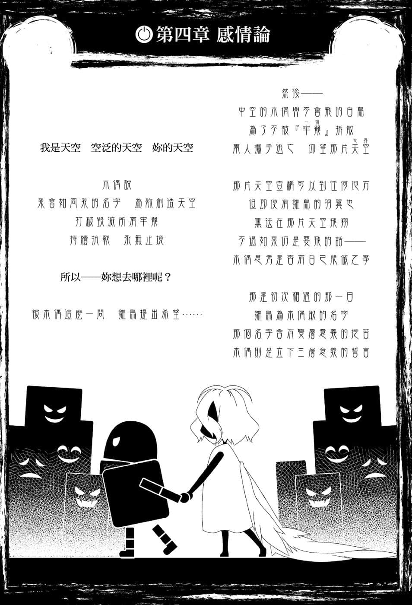
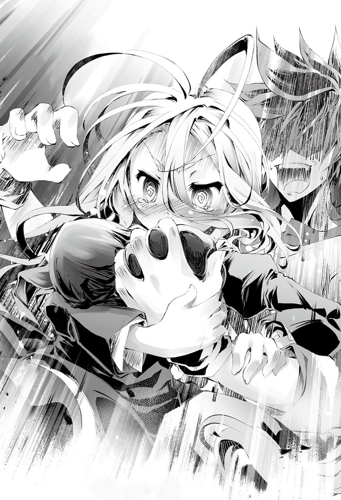
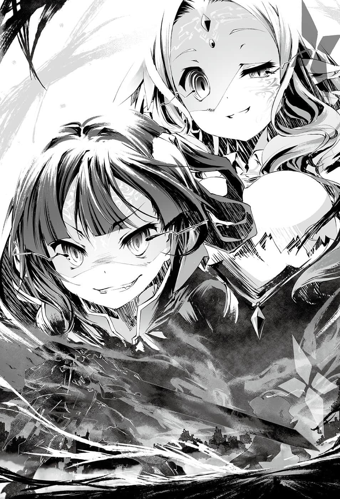

# 第四章 感Q论

> 来源：https://www.linovelib.com/novel/9/2135.html

于是到了指定的日子……距离游戏开始时间剩下一小时的时候。

空身在黑暗之中，除了坚硬的座位与大腿上的感触白，一切都暧昧不明。

「扩张灵装……连结！起动……！？」

背后传来缇儿的喊叫，同时大槌挥下，脚下响起打击声。

众人一起在心中祈祷——拜托顺利起动吧。

随后——

精灵光窜过刻印，照亮狭小的黑暗——也就是三人乘坐的『操纵室』。

接着『机体』的视野映在操纵室的整面墙上。

——这里是早在久远之前便被遗弃的地下废弃都市。

这是一处『废弃物处理场』，除了永远的神火之外，停止运作的废工厂都被铁屑所掩盖。

遗弃物品的集中地——也就是『指定的会场』。

而伫立在那里的是一具巨大的人型机械，双手装备厚重的机关炮。

只见那具机体摆出夜叉㊟的架式，然后左手转动，仿佛要朝八点钟方向射击似地——

译注：日本漫画作品《庭球社》中的奇特姿势。

「好！缇儿，运转得很顺利哦！白那边如何？」

「……全部正常……射击……包在我身上……！」

狭小的操纵室里，空与白坐在单人座位上，各自握住两侧的操纵杆，相互进行确认。

空负责右侧，白负责左侧的操纵杆——两人用感应钢的手套握住触媒，就像在控制自己身体一样在脑中想像。看到机体依照脑中所想，摆出『帅气的姿势』，两人满足地点了点头。

机体仿佛自己的身体一样——不，两人操纵一具机体，动作比自己的身体还要轻巧灵活，两人脸上露出笑容。

不过，在他们的背后……

「不说她了——倒是你们真的能靠克拉米的操纵战斗吗……？」

「……距离游戏开始……六百秒前……」

装置在天空散开，贴附在天花板上，那些是无数的摄影机与转移用锚钉。

然后一台华丽的银色机体有如炮弹一般着地，激起了铁屑与瓦砾。

——『是啊……看起来只让人觉得在搞笑』……

与其说是巨大机器人，倒不如说是适合当遗迹守护者的钢铁巨人。

不过，缇儿表示不论何时爆炸都不奇怪。

「你这家伙没有资格说我们啊啊啊！！搞笑的笨蛋是谁啊！？」

令人恼火的是它们还健康地摇晃——与日前见到的机体有一处不同。

声音并非从通信传来，而是一台机体从外部扩音器发出震天的呐喊。只见那台机体借由锚钉模拟空间转移，夹带着苍蓝的光粒子，出现在会场的高空。

事实上，他就是最优秀的地精种——拥有当代第一的天赋与灵装。

「你终于连是否有生命都不管了吗！？竟然开『巨乳机器人』说出耍帅的台词！你脑袋有问题吗！？」

空与白无视质疑，一同闭上双眼，等待开战时刻来临——

维格的语气中充满失望之情，对于维格通信中的责问，会场内每个人都认同。

空心想——感觉不错……就像是白睡在自己身上时的感觉。

不过——

——如果不是灵装彼此冲撞所造成的损害，那就另当别论。

《用那么弱的机体就想赢本大爷——你们在搞笑吗？》

因为我方的指定，不论是会场还是我方的机体，直到开始的十分钟前都要全部保密。

寂静之中只听得见神火炉燃烧的声音。

「应该说能够与维格战斗的人——大概只有『 空白』。」

具体来说，比如『爆炸』之类——若是机体自己毁坏，则不保证安全。

《——缺少吉普莉尔，真的能够顺利进行吗？》

空代替她们吼出心声。

两台机体五个人，等待着游戏开始时间，以及对战敌手的到来。

只是起动机体，确认动作而已，画面就被错误的警告染得一片红。

《……我最后再确认一次，由我们取得胜利真的没关系吧？》

然后——

具体而言就是一旦同步，庞大的精灵量就足以使感应钢蒸发的天赋。

……明明是只靠意念就能如自己身体一样操纵的机体，到底怎么操作才会变成那样呢？

…………

『开派对啦啊啊啊啊————！！』

三人的灵魂同步连结三个核媒……控制一具机体。

《…………嗯？这里就是会场吧，其实不管在哪儿都无所谓啦……》

「……我们会好好『游玩』……直到尽兴为止……♪」

不过『 空白』同样身为人类，条件是相同的吧。

菲尔的声音来自装载于机体背部的超规格不明物体——看起来是木制的怪异巨炮。

哈登费尔是领土位居世界第二的大国，众人感受着地精种关注所有影像机的视线。

「才不顺利……仅仅是刚才这个动作，画面已经红通通一片了。」

不过空在内心补充——『至少到机关败露为止』。

放大荧幕才看得见那具机体，它的轮廓明显有别于其他系统。

要破坏彼此的机体是不可能的事，照理说这应该是超安全的格斗游戏，但是……

那个机体拥有洗练的朴素造型，搭配上大量的花草装饰，机体上浮现多道精灵光的轨迹。

毕竟——天赋之差绝对无法改变，过高的天赋亦然。

也就是说，一旦空与白所握的操纵杆、缇儿的大槌毁坏的话，这场游戏就算输了。

——空、白与缇儿，以及克拉米和菲尔。

——没有地精种会问为什么，因为——

那个机体用左手从背部拔出超出规格的『巨剑』，用剑指着无数的摄影机，对着全哈登费尔发出胜利宣言。

缇儿坐在副驾驶座，手握大槌的柄，悲壮地向他们抱怨。

虽然空他们无从得知电视机前响起怎样的喝采与BGM。

——没错……是『借来的东西』。

甚至空、白和缇儿等三人操纵的机体是——

看到不自然加上的巨乳，每个人的脸上都露出厌恶的表情，不过……

没错……操纵灵装战斗，损伤全部会反映在『核心』——也就是核媒。

但是回答的人却在远方。

因此机体成功起动——没有在开战之前就败北，让他们松了一口气。

……波涛汹涌……

心跳、呼吸、甚至感情都隐隐重叠……也就是一如往常的感觉。

想到那位天赋之才吉普莉尔，空明白其实『另一位天赋之才』才是问题。

维格会轻视和感到失望也是理所当然，因为没有人可以反驳，他们的机体确实不如维格。

《空先生你们才是——真的能依照约定战斗吧？》

从空、白和缇儿操纵的机体向外望去，远处一间废工厂的屋顶上，有具静待时机的机体传来通信。

只有她语气忐忑不安，然后有如回应她的话声，装置发射升空。

「真的没问题吗！？空大人与白大人倒也罢了，我们三人一起与首领战斗，这样真的好吗？赶工四天制造的机体，不保证可以顺利运作哦！？虽然给我四十年工期也无法保证就是了！？我、我不想死呀……」

空与白嘻皮笑脸，回答的语气轻松无比——然后说道：

……空、白以及缇儿，戴着感应钢的手套握住操纵杆。

《……至于你们的机体根本是『借来的东西』吧？如果瞧不起我，马上把你们打爆哦？》

克拉米带着复杂的心情再次确认，菲尔则是尖锐地探问。

在维格的机体之前，即使是菲尔也不得不自嘲自己机体的劣势。

连游戏的参加条件都无法满足，那位天赋之才吉普莉尔只能在缇儿的秘密基地闹别扭。

在测试机体之际——菲尔在尝试操纵时，曾经展现令人无法想像的操纵『天赋』。她将机体的双手双脚同时向前伸，最后跌了一交，头下脚上插在地面。

那是展示在首领府内，六千年前初代首领的机体。

《……这一点我们也很清楚，至少比起菲，我还比较会操纵。》

『本大爷——哈登费尔「大」首领大人登场啦啊啊啊！！』

操纵室内白与缇儿的表情——不，别说是会场内的克拉米与菲尔，就连会场外正在看转播的吉普莉尔也是同样的想法吧。

『喂！导播！！放主题曲了吗！？胜利后的实况解说也准备好了吗！？』

不过空苦笑着回答，原本预定就没有要让吉普莉尔参加。

不过现场只有空虚的回音与无言的反应。

维格似乎有些不满地切换至通信，机体的头部面向远方——话锋一转。

那种感觉仿佛是三人心连着心，感情并列在一起。

那与其说是天赋，倒不如说更令人怀疑，那该不会是种族的诅咒，让她不能使用道具。

「放心吧，既然是玩游戏——我们也会尽情享受游戏♪」

而那些器材都是维格所准备，目的是为了将比赛转播至国内全境哈登费尔。

却不能不吐槽！！

唯一应该同样连结在一起的缇儿——

空无奈地苦笑问道。

是啊——不能反驳……虽然不能反驳，但是……！

《我就在『这里』辅助了，这就叫适材适用呀～♪》

「是啊……吉普莉尔无法参加这个游戏——这是早就知道的事。」

也就是说，克拉米负责操纵，菲尔则进行射击。

不需触媒连结，空与白一同感受着令人舒畅的紧张与心跳。

已经是过去的遗物，可说是古董，再加上肩上的『巨乳神髓』也已拆除。

虽然与六天前见到的机体有一处差异，即使如此——

无论如何，通信就是来自克拉米与菲尔所搭乘的那具机体。

《呼～……自从那颗原石从天而降，我受到启发，已经将理想极限更向前跨出一步了。你看到这对巨乳还不明白……还是怎样？你是不懂铜像艺术的小鬼头吗？》

「铜像艺术会摇晃胸部吗！？话说你别又抬又挤又扭啊！！」

维格毫不介意地夸耀自己的机体，空忍不住抱头。

「……我说啊，在游戏中的领域也一样，太走偏锋会提高入门的门槛呀……你应该打开变得比针孔还小的视野，用一般人的眼光来看——至少把整个机体做成女性型吧！？」

最令人恼火之处，如果那个机体是像电脑战机Virtual-〇㊟那样的女性机器人倒也罢了。

编注：SEGA Games 所制作的机器人对战游戏《电脑战机Virtual-On》。

但是那只是在华丽的机体上加装巨乳，就只是会摇晃的铁块而已。

……为什么会摇晃？流体金属也没那么会晃动吧！！

《有什么办法，因为我说过要用这个机体战斗吧！？重新制造就违反规则了吧！？我只是将造型进行微调而已，不会影响性能啦——本大爷也是伤心断肠啊！？》

「你直接把肠子扯断吧！！为什么要固执于战斗的机体呀！？」

通信传来这段不堪入耳的对话，不过无视他们的谈话，缇儿口中说道：

「……距离游戏开始时间……剩下六十秒……」

缇儿不安的情绪似乎仍在升高，而宛如配合她这句话一般。

——报知即将正午的神火炉蒸气声，响彻整个废弃物处理场。

《……那么——规则和赌注都不准变更——》

虽然不知他是对哪一边的机体说话，不过维格的机体伸出手掌继续说道：

《胜负就看是本大爷破坏你们所有人的媒核，还是你们破坏本大爷的大剑……附带一提，你们的『参加者』就这些人吗？如果要中途参加就要趁现在哦？》

维格『直觉』察觉吉普莉尔不在，大胆地问道。

不过空与白、缇儿也举起机体的手说道：

「哎呀，因为我们朋友很少，参加者就是会场内的全员，不会有人中途加入。」

——不……问我为什么，因、因为我妹妹——白也在呀。

通知游戏开始的『神火炉』，吹响开战的号角，同时——

他的嘴角一扬，仿佛要进入正题似地加重语气。

一道声音打断白的娇喘，空感谢同样巨乳化的缇儿。

——维格的一刀砍在空白机的胸部之上，一挥而过。

——啊……我开始觉得我有在逃避了……

既然巨乳妹妹说OK，那自己本来就没有必要客气！！

那个变态竟连被砍倒的少女像也把它变成巨乳了。

吉普莉尔请求空揉一揉她的丰满巨乳，空仿佛回应她的要求一般，伸出了手。

「主人……胸部并不可怕，请不要畏惧，拿出勇气吧……」

「空、空大人……白大人！！操、操纵……你们灵魂脱离同步了！！」

——宣告游戏开始的神火发出巨响的同时。

更何况操纵者是地精种的顶点维格，空等人原本就不考虑与他近身战斗。

空只能茫然地注视着注入全部灵魂的一刀，对着自己的机体挥下。

手上揉着柔软到不自然的幸福，空听到远处传来的声音。

于是……啊啊……如果『幸福』有形状，摸起来一定就是这种感触吧。

——……（紧握）

「喂～～白！？哥哥揉妹妹（十一岁）巨乳，全场会一致判决有罪啊！」

冲击袭向同步的核媒，空等人发出悲鸣————

《哈！臭侄女，你也参加啊……不再逃避了吗？》

《先说好，约定是约定，你可别期待我会手下留情哦。》

……攻击的伤害会导向核媒——没错，就是借由感应钢与灵魂同步的核媒。

---

■ ■ ■

维格是将巨剑朝锚钉掷出，利用《模拟空间转移》来到眼前。

『……哥……这是假奶……清醒啊……』

「冷静一点，白！！在妹妹的胸部塞气球，说服自己因为是气球，所以摸了没关系，那样的哥哥根本脑袋有问题吧！在社会上也是会惹人非议的哦！？」

因为如果拒绝这对巨乳，身为男人反而是一种羞耻吧。

『啊啊————————啊啊啊啊啊啊啊啊啊啊——！？』

仿佛记忆缺漏了数秒，原本应该距离四百公尺远的机体，却毫无脉络地突然出现在『眼前』。

在幻觉中享受到的幸福，原来是坐在大腿上巨乳化的白，空为自己的罪孽深重痛哭流涕。

在身旁微笑的白——巨乳幼女竖起大拇指比『GO』，笑得非常灿烂。

…………咦？这么说来确实……空差点就被说服了。

《那就先试探一下吧……我要确认你们是不是小看我，再怎么样也该躲得过这一击吧？》

——欸……与其说是逃避，不如说我是拼命地在忍耐。

他们只感到毛骨悚然，并且确信自己的机体会被劈成两半。

没错——终究是假货……比不上『真正的白』——！！

空急忙想要放手，不过却被白一把抓住，不肯放开他的手。

「……禁止使用灵装与刻印术式之外的魔法……反正我们也不会魔法……没问题。」

但是依照『盟约』与规则，伤害导向空、白和缇儿的核媒。

投身空中——手因『恐惧与不安』而颤抖。

——【向盟约宣誓】。

不过，发现空与白的心情和情感也与缇儿相同，她的颤抖稍微止住。

维格露出凶猛的笑容——不过回答他的却是宣告正午的灼热业火。

然后三台机体操纵室内的六人，各自举起手齐声唱和。

眼前吉普莉尔摇晃着胸前的双峰，悲伤地如此说道。

————

————…………

《既然好友这么说，虽然我觉得很有问题，不过仍会勉强配合哦～♪》

「…………！」

看到已远离的维格机造成的惨状，白与缇儿也不禁脸色苍白，咽下口中的唾液。

回过神来，空身在清风轻拂的山丘。

没错……怀着与缇儿同样的『恐惧』——但那却使他们的专注度集中至极限。

「那我们就开打吧？用你们的『灵魂』让本大爷认同吧。」

缇儿颤抖着握住大槌——透过核媒，空与白也隐约感觉到缇儿的心情。

听到缇儿微小的声音，维格愉快地笑着说道：

难道是想延长自己的刑期吗？白透过空的手揉着自己的乳，对他说道：

——虽然早就知道会这样，三人仍是同感战栗，真是可怕的游戏。

克拉米她们搭乘的机体立刻转身，躲进废墟之中。

但是，令三人感到战栗的不是那一击的威力，而是制造出惨状的当事者维格。

空代替对维格感到畏惧的众人发出怒吼。

……对于不会飞却又挑战『天空』的人而言，那是理所当然的感情。

巨乳吉普莉尔眼眶湿润，空目光游移，寻找拒绝诱惑胸部的借口，但是……

尽管语气显得不满与遗憾，不过菲尔也同意了，维格脸上露出些微苦笑。

这一击足以将机体连同空等人的生命一起斩断……本来应该会是当场毙命的斩击。

————…………

空抓着的操纵杆出现龟裂，空一边大叫，目光一边回到眼前的光景——

看到维格机的左手重新握住剑柄，空终于勉强理解发生了何事。

「…………嗯❤」

真伪交杂的铁块，伴随比神火更激烈的巨响，展开了冲突。

维格的机体性能不明，但是肯定优于我方机体。

——欸……咦？我……我有逃避吗……？

《呿！竟然拒绝本大爷理想的巨乳，一个处男还敢挑三拣四……你以为你是谁啊。》

空带着坚定的意志摆脱幻觉，意识回到白真货所等待的操纵室。

然后一旦心灵屈服——正如同操纵杆的龟裂所示，核媒也会破碎……

也就是说，正如同字面意思，双方使用灵装互殴，如果对方的灵魂凌驾自己，就会发生刚才那样的侵蚀。

「连石像你都只认同巨乳石像，你这挑剔到极点的家伙才是变态吧！？」

「……假奶比较好！假奶是……填充物……！！那么……要摸要揉都……没问题！就好似塞在胸部的『气球』……摸了……会有问题吗！？」

…………

「……主人，为什么——为什么您要『逃避』呢……？」

因此空他们采取以机关炮射击的中长距离战，不过——

但是即使明白发生何事，别说是采取回避行动，甚至连动一下也办不到。

「您是因为对身为男人的自己没有自信，所以才逃避『我胸部』吧。」

随后——『某个』飞行物体映入眼帘，速度快得甚至超越头脑的认知。

「为什么呢？像我这样的身体胸部，不值得主人使用揉吗？」

然后空他们所操纵的机体也毫不犹豫选择后退。

具体来说，就是与白和缇儿同样，掉落在维格机脚下的石像。

维格的机体在四百公尺的远方，目送空他们的行动，从他的机体传来通信说道。

《……喂，你们这些家伙，我要追加一点赌注。我想请问你们到底是用了什么方法，让臭侄女燃起斗志的呢？等你们输了之后——从昏迷中醒过来再告诉我就好。》

不管是空、白甚至是缇儿……他们接下来看到的只有——眼前维格机挥起的那把光芒闪耀的巨剑。

「我的身体胸部是主人的东西胸部……可是您却一次也没揉过。」

这一击甚至起动了剑的『巨乳神髓』——概念共鸣机，劈开了会场的铁屑堆。

没错……从某个远方传来——不是来自身旁『巨乳妹妹』的声音————！

最后缇儿也同样——虽然不安，却感觉更加充满『期待』。

对……这正可说是『性癖的格斗』……！！

机体不会毁坏，所以很安全，但是一个不小心，连石像也会无差别地变成巨乳至上主义！！

……巨乳至上主义跟死亡究竟哪个好，实在有点难以界定……！！

那样的恐惧，令空等人的机体提高警戒，全神戒备。

《……哈……不可能啊……？》

而对峙的维格机体则是打心底感到愉快，询问刚才那一瞬间发生的不可能现象。

没错——

《首先是臭侄女的精灵量竟然『与本大爷不相上下』……不可能啊。》

对——空等人所操纵的机体是唯一可与维格匹敌，过去的天才所留下的杰作。

初代首领的机体即使卸下『巨乳神髓』，也是只有维格才能操纵的机体。

更何况——

《将质量那么大的东西进行模拟空间转移，却还有如此火力？不可能啊。》

没错——如同刚才维格机所做的一样。

空等人也在光辉的斩击劈过之前，以模拟空间转移的方式，移动到维格机的后方，回避了攻击。

然后在转移之后，紧接着射击双手的机关炮，以大量的炮弹阻止维格追击。

那些炮弹将阻挡在中间的废墟，连同维格机一起贯穿，阻止了维格机的脚步。

没有与维格同等的精灵量，炮火不可能有那么强大的火力。

《不过，最不可能的是——》

维格以欢愉却凶猛的语气，说出更加不可能发生的现象。

《你们无法反应过来，却能闪过攻击，并且迎击本大爷的追击——到底是用了怎样的方法？》

来自通信的忧郁声音，传入全员的耳中……但那也只是一瞬之间。

而是因为他们清楚看见维格狰狞表情的幻觉——

而会场内的影像会在全国哈登费尔播放——影像亲切地告知了敌人的位置。

对，正如菲尔与空他们的『交易』，她们也有充分的胜算。

《……哥……！比起吐槽……转移更重要……！》

他假装要发动攻势，实则毫不犹豫地转动机体挥出左拳，同时大喊道：

是啊……维格所问的『不可能』之中。

维格机处于无法回避的姿势，刹那间理所当然地被射穿。

不可能看得见，甚至也不可能反应得过来。

于是这两张『王牌』成功侵蚀了维格。

朝着如电光石火般刺在天花板的巨剑，模拟空间转移至其上的机体怪物。

《别肯定他说的话呀，白！！你是因为不知道哥哥认真起来的大小——不对！知道的话才是问题吧！？》

《……确实，不论怎样的机体，有几台都没关系——而且也没规定不能在会场做手脚……那么你们将会场保密到游戏开始前的用意就很明显了吧？》

《因为你大喊只认同巨乳，所以我灵魂的声音也以吐槽为优先了呀！！》

《会场本身就是你们的机体——也是『猎场』吧？哈……》

《只有你一个人的意图跟别人不同吧！？输了的话，我很可能会精神死亡哦！？》

空与白从容自若地出言挑衅，却被缇儿多余的发言破坏。

躲过既无法找出转移处锚钉，转移后也不可能反应得过来的攻击。

规则中也没有规定『参加者克拉米等人不可在操纵室内看转播』。

因此在机体上完全没有施加提升机体性能的刻印术式。

《……哈，果然是那么一回事吧？》

《哈！！很好……就别让我轻松看穿机关，我可是会很失望哦？》

——并未包含『为何能够回避』……

《……哥……！……他说的是对的……不可以听他说话……》

为了使超规格巨炮——增强火力的《狙击炮》发挥功效，他们将刻印术式全用在火炮上。

那么，这一连串的动作，全都是在既无反应也无意识之下做到。

菲尔的『灵魂』所表达的就是——

那是借由菲尔赌上全部心力编纂的刻印术式，使炮弹加速至极限的魔炮。

——铁拳迎击炮弹，两者冲突之下光芒四射，冲击波摧毁附近一带的废墟，维格的机体却仍悠然伫立。

维格大吼，语气中透露明确的恐惧与焦躁之情。

接着将《巨剑》变为无数的《弯刀》，画出无数弧形的轨迹。

然后是菲尔强烈的『灵魂』……厌恶意志，菲尔断定它可以力压维格。

——因为事先钉下模拟空间转移的锚钉，所以他们才能躲过第一击。

或者又比如说——

她的灵魂过于强烈，足以令自己陷入自我厌恶，维格不禁感到战栗，并且大声怒吼。

——不由分说，纯度百分百直接了当的全部否定——也就是『生理上的厌恶』……

没错——这个游戏……这个可怕的游戏……！

她们在机体之中，神情严肃地观察空他们的机体与维格的机体认真交战。

没错，不管是空还是白，甚至缇儿都对维格机的动作反应不过来。

空等人的机体消失，自己的位置则是被菲尔单方面掌握。

《——不过，在那之前。》

「那个！你们两位冷汗直流，这种话还是不要讲比较好吧！？」

《『臭素材』你以为不会被发现吗？——你是在小看我吗！？》

超规格的巨炮趁着维格大意的瞬间，发射应该是肉眼也看不见的魔弹，但是维格却凭藉感觉，拳头迎向想像的弹道。

「……如果你能揭开我们作弊的……秘密……那就试试看吧♪」

——在机体性能和操纵技术上，空等人本来就没有胜算。

比如说——

对，他们是怪物。虽然早有预料，但是他们的不合理却令人无法理解。

更别提他们并没有完全避过斩击，意识甚至陷入数秒钟的幻觉。

《弯刀》穿过废墟的缝隙，有如骤雨般模拟转移的——维格怪物。

明明就连克拉米与菲尔的狙击——亚光速的魔弹，也必须在敌方大意时才能命中，第二发就被躲过了——

甚至仿佛早就知道维格机会出现在背后，大吼着对维格击发枪林弹雨的——空与白怪物。

---

■ ■ ■

即便是空与白，他们的肉体也只是普通的人类——！！

「哈哈，在游戏中不可能发生的事？那当然就是『作弊』吧♪」

从现场的紧张感可以理解，刚才的一击正如他所说，其实只是试探而已，躲得过是理所当然。

维格机狂傲地说完，摆出架势，气氛再度紧绷。

——刚才那一击到底是如何躲过的？

但是空等人也早有心理准备，这种程度的机关维格凭『感觉』就能猜到。

《……是吗……原来本大爷……是没有生存价值的蝼蚁吗……》

《啊啊！？喂！本大爷很大喔！！小不拉叽的人是你吧！！》

《我对地鼠这种生物————『生理上感到排斥❤』哦♪》

而接下来就要认真了，维格的机体往地面一踏——

没错——规则没有规定『不能在会场做手脚』。

——维格透过通信询问其中有何机关。

忽然————维格向周围一瞥，抬头仰望上方。

通信传来的声音，轻易揭露作弊的一部分，空等人都感到不寒而栗。

——他们如何让子弹命中？

空等人并不知道维格具体看到什么，或是经验了什么，不过……

——不知他们是如何判定，也不知是如何反应过来。

然后——

维格重新振作，勉强来得及躲过紧接而来的第二发炮弹。

《知道吗！？对乳房的喜好，与自信你这家伙的大小呈正比哦，胆小鬼！！》

《什么意思？灵魂互击——我只是用我的性癖灵魂砸你呀❤》

《哈！！炮弹的威力虽大——『灵魂』却很轻啊！！》

《哈！！你不敢回答自己『大』就证明你这男人很小啊。》

——『可恶的怪物们』……

克拉米与菲尔的机体自游戏开始后便躲藏起来，炮弹便是来自她们机体所背负的巨炮。

《即使打得到机体，却没有传到本大爷心里！！你灵魂的声音在哪里！？》

无数的《弯刀》以无法辨识的速度飞翔，却回避了那些《弯刀》的机体怪物。

空等人也靠着同样藏在会场内的『机关炮的弹药』进行补给。

却听见通信传来回答维格的声音。

《那正好哦，反正我赢的话，我也会那样命令你哦❤》

因此克拉米与菲尔便停止动力，消除精灵反应，将机体潜伏在废墟的死角。

最后，从空他们机体背后的高楼高楼，施展连同高楼一起一刀两断的斩击——

《……竟敢称呼本大爷为『猎物』——你们也太嚣张了吧……喂。》

《——唔哇好危险，死素材！你这是什么意思？我差点就发狂了喔？喂！》

《我是说心眼小啦！你刚才说我什么小不拉叽！？我、我我才不小！？》

机体再次消失踪影，听到菲尔的通信，空等人重新感到战栗。

——那是来自超过七千公尺远的魔法——速度甚至接近光速的炮弹。

正可说是『性癖格斗』的游戏——就像这样，菲尔的『灵魂』瞬间便使维格变得忧郁。

因此令空等人不寒而栗的，并不是被看穿一个机关。

《是吗？那你就是过度自信！！『小不拉叽男』，你要谦卑一点啊！！》

正如她们的预料，所以克拉米与菲尔才会看着画面在内心咒骂。

反而应该问——为什么会被发现？

更何况——！！

维格机从崩毁的大楼冲出，一拳朝空白机挥去——模拟转移有刹那间来不及发动。

命中之后，从转移后的机体传来的通信声音最令克拉米感到不解。

那也就是——

《～～～～喝！没问题！！消失吧！巨乳至上主义者！！》

《我、我还可以战斗……没问题！！》

——他们是怎么撑住的？

怎样才能像他们那样『坚持拒绝巨乳强大』呢——！？

换成自己的话——光是最初的一击，核媒大概就粉碎了吧——！！

最令克拉米不解的是能够忍受巨乳诱惑的不可能现象。

克拉米在内心大喊。

不可能，太异常了。这会是普通的人类种？平凡的人类吗！？

他们绝不是人！如果是普通的人————

《……哥……为什么要否定白的巨乳……？》

《——————什么？欸，白？》

没错……如果是普通的人——就会如此。

忍受不住诱惑的白悲伤的通信声音，回答了克拉米的思考。

——对……差点忘记了。

克拉米露出微笑，同时菲尔默契十足地瞬间重新启动机体。

没错……空他们只是普通人，会迷惘也会失败，是普通的人。

两名仆人继续说道：

没错，这是萝莉控的宿命习题。面对这终极问题，空感到困惑不已。

「【断定】本机可以言明，经过机率计算，主人们会就此认输的机率是『零』。」

即使如此，她们也接受、承认并原谅过去……同样注视着希望。

既然是他们两人都刻意避而不谈的过去——……

「你这个出土物连主人吩咐『留守』的命令都无法遵守吗？」

维格机在发射之前便掌握弹道，在克拉米扣下扳机前便跳跃闪避。

史蒂芙大声喊道：

但是维格又再一次地……

《喂——首、首领！首领攻过来了哦！？》

「……欸～也就是说……我整理一下哦？」

若说自己不曾在意，那就是说谎了，因为……

史蒂芙内心叨叨絮絮（中略），不过其中最重要的部分就是——确认打这场没有必要答应的游戏的理由。

她说的话并非出于本意，但是其中却也不是完全没有真心话……

既然自卑感挥之不去。

两人即一人的兄妹，就连神灵种也能玩弄在手掌心，只要他们有心——一定可以做到任何事吧。

「好处我们就收下了！为了我的希望巨乳，请你牺牲吧，空……！！」

「也就是说，他们明知是没有必要比的游戏，却仍接受了？」

「——————！！」

不管是什么，那都不是她和菲尔能够模仿，而且也无关紧要。

正因为空听得出来，所以他才会感到困惑。

空等人陷入混乱，维格企图追击他们的机体。

维格避开的炮弹，打在空等人的机体上。

连侄女缇儿也说他比黑色害虫还噁心，男人的叫声表达出他的伤心。

吉普莉尔与依蜜尔爱因只是一同对她回以怜悯的眼神。

事实上，她们两种族两人，现在也仍互相仇恨，彼此对立——

「因为只有朋友才接受赊帐！？然后因为受到对方挑衅，跟讨厌巨乳的人无法做朋友！？所以跟对方进行讨论巨乳对错的游戏——！？那种事根本无关紧要吧啊啊！？」

她们的回应也就是——利用空他们取得胜利——！

「是呀～这是第一次用的招式哦～❤」

——空与白的过去，来到这个世界迪司博德以前……在原本世界的两人。

……如果被国民知道，这次可能就不是政变，而是会发生人民革命了。

所以史蒂芙也一直觉得自己不该过问，因为……

《唔哦哦哦你是得到谁的许可，竟敢进入人类的生存圈！？滚吧，黑色的恶魔！》

听吉普莉尔说明一连串的经过后。

现在被空等人的子弹打中——等于跟被菲尔的子弹打中一样恐怖。

仿佛要掩饰自己的心意，史蒂芙正要报上名字，却被吉普莉尔打断，史蒂芙倒抽了一口气。

「那么你还要问主人他们逃避过去的理由？正可说是蠢问题中的蠢问题。」

听到通信之中，白对空提出的『终极问题』，克拉米安心了。

只要空他们依照『约定』行动——那我方也要回应！

——垫再多的胸垫，贫乳也不会成为巨乳……但也正因为如此！

——对，白只是被维格的灵魂打中，暂时性地与他同步而已。

不，应该说不用别人，史蒂芙自己就开始思考要发起革命了！

魔弹以接近光的速度袭来，既是不可知，也是避无可避的一击。

不过克拉米与困惑的空不同，她很清楚白的心情。

---

■ ■ ■

看到两人根本不打算听她整理状况，史蒂芙对她们叫道。

更可怕的是——

「说、说什么辞退，我本来就——所以我说我有名字的啦！？我叫史——」

《……因为哥是萝莉控嘛……所以喜欢飞机场、对吧……可是，白长大之后，胸部变大的话——哥会讨厌白吗？会抛弃白吗……！？》

「【真理】机凯种的过去、罪孽，清算也不能当作没发生过……也不可以当作没发生过。」

「归根究底，要用什么标准来评断『过去已经清算了』呢？」

「——愚、愚蠢的问题吗……？」

既然不管有没有巨乳，本质仍是相同的————！！

《所・以・我・就・说，我不是萝莉控了吧！？不，应该说不管白会不会变成巨乳，或者是变成老太婆，甚或变成男人都一样！！哥哥不可能讨厌白啦——欸！？ 怎么哭了！？》

克拉米瞄准维格机，心里想到——

而且——

史蒂芙想像比如自己突然被丢到异世界，自己会怎么想呢？

吉普莉尔抱膝看着荧幕，那里是缇儿的秘密住处。

除了克拉米之外，维格是唯一知道——不，他大概又是凭『感觉』吧。

「【同意】接受过去，寄希望于未来，这是机凯种向主人们学习的道理。」

……空等人短暂地被菲尔的灵魂侵蚀——也就是受到她的思想感染。

是啊……终究是假奶，不管多么真实还是和胸垫一样。

「空他们制造出其他国家就算花费全部财产整个国家也要买的『药』——也就是制造出那样的情况毒。」

——『不再是萝莉后该怎么办』……

——空他们是用了怎样的诈术才能够与维格对抗？

随着克拉米悲剧性的泪水与台词，她们的机体消失在废墟的黑暗中。

史蒂芙内心感谢吉普莉尔打断她失礼的胡思乱想，询问她评断为愚蠢问题的理由，但是她回答得好似史蒂芙问的才是蠢问题——

《你这家伙——喂！烂素材胸部！？你到底跟我有什么深仇大恨啊！？》

「最后甚至问出『为何逃避』这种愚蠢的问题，主人才刻意接受对方的挑衅。」

《——哈！！同样的招式，你以为第二次还会管用吗！？我看你还没睡醒吧！？臭素材胸部！！》

史蒂芙胸中有股感动涌上心头，她拼命忍住泪水，听着她们说话。

「——喂，你们哪个人也听我说话呀！？而且我有名字哦！？」

——天翼种与机凯种……双方过去都曾杀死对方无可取代之人。

「主人他们被逼迫『清算过去赖帐』，也就是在原本世界的过去。」

那段壮烈的过去，不是活在盟约后世界的史蒂芙所能想像。

「【难解】无名无姓的女性在政治经济方面天赋卓越，同类别的心理战游戏却极端无能，无法理解。【撇开】已掌握你对主人毫不了解，你没有被爱的资格，建议辞退这场恋爱游戏。」

——距离八千两百零四公尺。消除精灵反应，藏身暗处的机体，发动连同遮蔽物大楼一起贯穿的狙击。

……大概会想回家吧，至少会有不舍或思乡之愁吧。

可是那两人却完全没有——他们绝口不提。

而在离会场稍远的昏暗洞穴里，有位少女冷眼注视着战斗的影像。

『不可知的事物，毕竟仍是无法知悉』，菲尔以嘲笑回应维格，同时——

然而克拉米毅然决然地无视他们，机体转身移动，再度潜伏。

「【泪眼】本机受到无名无姓的女性胁迫，她是致命的威胁。本机的最优先事项是主人的人身安全，因此回避该威胁比主人命令更优先。天翼种也应该会同意……本机没有错。」

《果然我是正确的！首领比蟑螂还噁心～～！！》

不顾开始紧紧盯着荧幕不放的依蜜尔爱因，史蒂芙说道：

避无可避的一击被避开了，通信声音告知了如此的矛盾，但是菲尔也毫不惊讶——

——两人语气平静地如此说道。

《……咿！？快、快找报纸……拖鞋——克、克蟑……！》

克拉米在刹那间理解了白，而她扣下扳机的手指则是超越空的理解。

空、白，甚至连缇儿也瞬间受到菲尔的灵魂侵蚀，在发出悲鸣的同时，机关炮也激烈地炮声隆隆。

游戏开始之后，依蜜尔爱因便带着史蒂芙出现。

「我们在大战过去时互相厮杀。过去或许是错误，不过正因为有过去的一切，所以才有现在今天的我们。」

「小多，你只看得见事情表面的浅薄思虑这点还是一样没变呢……」

「那么——有胸部当然比没胸部好吧！？」

「所以我希望我过去的一切就像现在一样，能够断定是为了与主人们相遇而存在。」

「【宣誓】主人们的过去是为了与我等相遇而逃避，本机会证明这一点。」

——听到宛如祈祷一般的话语，史蒂芙的脸颊滑下一道泪水。

然后——吉普莉尔重新指着荧幕。

「为此——这场游戏是意义格外重大的游戏。」

《乖乖对自己坦诚吧！！你是因为没有自信，所以才逃避巨乳的吧！？是吧！？》

《少啰嗦！！自称胸奴重度玩家就不认同巨乳游戏玩家以外的人，那种风潮应该遏止！！》

「…………你是说这场喜欢或讨厌巨乳的争论吗……？」

即使是感动的泪水也瞬间被他们的争论破坏气氛，不过——

「【叹息】……解说，主人在本游戏中的主张，并非是巨乳的对错。」

「小多？主人有说过一句『讨厌巨乳』吗？」

听到两人这么说，史蒂芙也想到确实没错，视线回到画面上。

——受到维格或菲尔的灵魂侵蚀，会有非常明显的特征反应。

然而——受到空与白的灵魂攻击，反应又是如何呢？不，更何况……

「对了……说来空——『并不讨厌巨乳』呀！？」

是的，空是萝莉控，这事实非常明确，比唯一神特图的存在更真实。

就连史蒂芙也差点忘了，与空初遇的那难忘的一天——！！

「那个男人！揉了我的！！那个……胸部哦！？」

史蒂芙大叫，至于加快的心跳与火热的脸颊，史蒂芙则解释是因为生气的关系。

没错……史蒂芙知道那个处男男人——说穿了他一点也不挑。

于是靠着『子弹』内的故意错误爆炸，射击出的飞翔体能达到音速的二十四倍，化成连维格也难以目视的子弹袭去。

《啊，抱歉，那么——我现在就揭开最不可能的现象。》

史蒂芙似乎确实听见，那两对锐利的眼神在对她说话。

「【确认】推测你是在夸耀『自己才是巨乳』，而且——」

「……『用魔法加速子弹』什么的……太瞧不起……牛顿第三运动定律……！」

操纵室响起通信，随即听见凶猛的大笑声……啊啊……

但是令缇儿难过的是，强化器也会因此无法控制而爆炸。

——爆炸？很好啊，就让它爆炸吧。

《——你们这些家伙……是『在行动之前就行动』了吧——？》

「无论如何，主人的灵魂会透露出主人的理想——也就是『现在答案』。」

明明不可能看得见，甚至不可能反应得过来。即使是空与白，他们自己还是人类种凡人。

不过，他们现在仍然不停输入下一个，甚至再下一个未来的指令，对抗天赋强者。

没错——靠着矛盾的确信感觉，正如同通信中狂傲的声音所揭露。

两人操纵的机体借由模拟空间转移轻易回避，拉开距离。

然后维格机以缇儿也看不见的动作挥出斩击——

不过这个问题，缇儿自己就可以回答，因为她早就知道一切答案。

如果空真的是只要对方是女人谁都可以，那么他为什么没有对任何人出手！

两人使用灵装的方式都是缇儿从未想过的方法，她茫然想着——『他们到底是如何做到的？』。

她们的意思是——就连我（本机）都没被使用过的说……？

「所以说，比起这个游戏和主人的过去——主人现在的喜好才是无比重大。」

但是，那么——过去无法清算，也不可以正当化。

——他们是如何避开这些攻击？

《我要解开你们无法反应却能应对的『真正作弊的秘密』啰，准备好了吗？》

但是他自发性地，靠自己的意志，主动揉女人的胸部。

白的计算加上空的操控，借由预测与引导、战术与战略，先行输入指令。

她看着与维格抗衡的两人，两人的背影感觉非常遥远。

——大概查不出来吧……

《既然如此，本大爷只要以动作被预测为前提行动就好了——！？》

……不靠灵装强化，自己就会因精灵量的不足，连一个魔法都使不出来。

听起来很像是诡辩或文字游戏，但那正可说是『作弊』吧。

也就是说，回避维格最初一击的原理就是——维格宣言要发动攻击，不过在那一瞬之前，空与白已经输入转移回避、反转至未来位置、甚至是射击等自动执行命令……只是如此而已。

动员这全部技术，他们才能『持续取得先机』，勉强应付维格的动作。

维格语带讽刺地说完的同时。

但是秘密被破解，一旦失去先机，他们肯定无法应对。

——他们根本没有避开。

那个男人毫不客气地公开说要在浴室偷拍自用，事到如今他哪会讨厌巨乳！

操纵室内，缇儿操纵着奔驰于会场的机体，心中怀着比任何人都深的疑问。

先前一直准确无比击中维格机的子弹——首次落空了。

---

■ ■ ■

「【命令】尽速告知你的『自虐式炫耀』的详细情形，不建议拒绝，想吃苦头吗？」

————只有你这婆娘一个人——！！

原来如此……史蒂芙咽下一口唾液。

「你是说你曾经承蒙主人使用……这是在『嘲讽』我吗❤」

但是弹速却能捕捉到维格，甚至弹幕也可以阻止维格机体的脚步——

原来如此，正如两人所宣言，就算空的过去最终是为了与她们相遇。

感觉空与白的背影愈来愈远，缇儿的表情更加阴郁。

那么——空真正想说的是什么呢？史蒂芙的目光带着这样的疑问，但是——

她们的目光与话语，使史蒂芙产生物理上被贯穿的感觉，她差点晕了过去。

史蒂芙轻轻咽下唾液，仿效两人，眼神认真地注视画面。

缇儿制造出可以『提前输入』的操纵杆。提前输入……简单说就是输入『指令』。

「……主人是萝莉控已是确定，接下来只差是否有胸部……」

——随后。史蒂芙原本红晕的双颊，瞬间变得苍白，两道冷酷的声音继续说道：

……你真的没发觉吗？史蒂芬妮・多拉。

「【保留】……本案件才是问题，主人对自己的事并不多谈。」

只是机体不在维格攻击穿过的未来。

《这种不可能实现的火力，你们是故意让触媒失控，把触媒当成用过即抛的物品吧。》

正因为是现在，所以才要追究！！

——那叫做只是普通的作弊？这叫做只是普通的弱者……？

空果然是什么女人都好——不，他只是毫不关心。

那位空……那位处男男人————被这么多女性围绕。

两人笑着回答。依照他们的说法，那是异世界的『大炮』的原理。

「…………什么？小多，那我可是头一次听说。」

然而——史蒂芙注视的画面里。

《哈！我终于看出来啰……？你们那不可能现象的秘密了！！》

——如果确定喜欢萝莉，那就永久萝莉化。

那么现在今天呢？空与白会展现怎样的灵魂答案取得胜利呢……

动作和反应都会来不及，因此缇儿依照两人的要求——

不，现在看来，为什么只对史蒂芙一个人出手呢？

——空喜欢贫乳的话，立刻把自己重新塑造成贫乳。

而他们输入的未来，与绝对强者维格以感性想像感觉看到的是不同的未来。

没错——为了创造「能断定过去是为了遇见自己」的未来——！

——他们是如何让子弹命中？

——在极限的紧张与焦躁之中，空与白却好像非常乐在其中。

然而最令缇儿无法理解的是，核媒传来空与白的感情，她愣愣地注视两人的背影……

「……嗯……！输入取消……哥，用拼劲……躲开！」

——子弹根本没有命中。

只是维格就在子弹飞去的未来。

即使是既没有天赋维格的精灵量，也没有天赋菲尔的术式编纂力的废物地鼠缇儿。

两人道出自己的决心。

她并没有自觉，其实她的关心都放在为什么只有自己被揉乳的问题上，啊啊……她用极为真挚的眼神注视着荧幕。

两人却对缇儿笑着说——为什么要控制？

「真是轻松的怪物理论啊！！呿！——接下来才是重头戏，白，你可以吗！？」

「什么嘛，原来是那个秘密啊！？就常识来说，本来就该这么做吧！！」

「【重大】机凯种残存连结体也无法断定主人的喜好，如今终于要揭开这个谜题了。」

空与白看得见的事物，自己却看不见，也想像不到，而且——

她们确信今天就是成为神话的日子，史蒂芙看到她们的样子，心里想的是——

吉普莉尔用笔在书上抄写，依蜜尔爱因的头部则发出喀喀的声音。

或者该说，将一连串的事件在脑中总结之后，史蒂芙的疑问转变为确信了。

没错——受到两人操纵的机关炮火扫射，维格看穿了他们火力的玄机。

他们看到超越强者之上的未来——不，他们是不断地重新创造未来。

在千钧一发之际，维格机躲过我方的炮击冲来，空与白再次回避与迎击——

「【再算】追加例外要素，确认符合主人喜好的个体中，有外表非年幼者，重新分析。」

比起紧张与焦躁，空与白心中更充满想要大玩特玩的『享乐』心情。

忽然间……

缇儿感觉两人的背影消失远离。

然后在应该颇为狭小的操纵室中。

——缇儿看见又蓝又高的……『天空』幻觉。

那是孩提时所看见的……那片天空。

那片不知从何时开始……再也不曾看过的天空……

相同的操纵室、相同的核媒、天空中没有操纵相同机体的两人……

缇儿终于低下头……脸上露出灰心的笑容……感到失望不已。

——正如空所说，自己连最底层都不是……

他们两人果然会飞……他们是在黑色天空飞翔的白色羽翼……

如果能够做到这种事，能够踏上如此高峰的人是弱者。

那么天赋果然还是无法超越……名为最弱的天赋也一样。

——对自己而言，顶天和底层同样都在……遥远的彼方……

《那么剩下的不可能就只有一个了吧……》

不管是通信传来的声音，还是核媒紧接着出现裂痕的感触，全都感觉那么地遥远……

终于空与白的操纵被完全捕捉，机体被铁拳击中，坠落地面——

「啊啊啊……我不认同……我绝对不认同巨乳至上主义！」

「……哥、哥……白……真的……巨乳……不行！？」

不管是抵抗巨乳思想的空与白的声音。

——克拉米与菲尔全身浮现『刻印术式』——体内时间加速，两人的机体将狙击炮架在腰间。在她们的眼中，维格机体的动作看起来非常缓慢。

——解放的强烈感情并非恶意。既不是杀意，甚至更非敌意。

《……❤原来如此，是『模拟空间转移弹』啊……这么说来，森精种大人无需锚钉就能模拟转移……那是我这只蝼蚁想不出的方法——不对，喂～～！？》

但是缇儿不可能答得出来，没有人可以——

「当・然・呀！！『掀开底牌』——要开始了哦！？」

既然如此，自己和菲尔也不要留下遗憾————！！

《——————！？》

维格顿时失去从容的神情，反射性地拉开距离，让机体摆出架势。

……那单纯是——

背对着穿透天花板的神火炉，操纵者——克拉米啧舌一声心想：

相反地——他甚至脸不红气不喘地说，只要每天服用丰胸药，你也是巨乳。

「……既然对自己犯下的罪没有自觉——那我就要让你对自己的罪孽刻骨铭心……」

「竟敢擅自对我的克拉米动手脚，甚至还说她是假货……」

那就是……说起来，何谓『真正的乳房』……

——确信她不会轻易屈服，克拉米紧紧抓住自己的触媒，心里想着：

所以自己是可以成为巨乳的。如果伪巨乳是因为假奶，所以才无法引以为傲的话——

《好啊，那你们就先跟这些东西玩吧，我一分钟就回来。》

克拉米口中说出违反理性的这句话。

那是光是想到就觉得忧郁的灵魂，因此维格一边抱怨必须回避的烦人灵魂，一边悠然地准备将机体往一旁短短滑动一步。

就连空间也超越，挟带令废墟倾倒的冲击波，完美地击中维格的机体胸部，让他的机体在地面滚了数百公尺。

是啊——走投无路，死棋了，这是早就知道的事。

装进概念也无法成为巨乳，贫乳的乳房里装的是什么——？

---

■ ■ ■

是啊，其实我早就发觉了……只不过我先前都在逃避自己真正的心情……

从一瞬间的忧郁重新振作，维格躲过第二发炮弹，怒发冲天到极点。

维格通知空等人一声，遵从自己感性的告知，同样全神以对，丝毫不敢大意。

「菲……没关系的……我不再对自己说谎了……」

「……菲？跟那家伙一对一决胜负……我们能打到什么程度？」

超越菲尔全身的精灵量使得光线折射，将机体染红。

……没错……为了不让克拉米害怕，菲尔将两个术式分配在封印感情，如今她解放全部的力量——

啊啊——如果是现在的话……克拉米也能了解。

——怎么可以杀死他？谁要杀死他啊？必须让他活着才行。

对……在刻印术式与灵装方面，无人能出地精种——维格・多劳布尼尔之右。

对方越过了不该越过的线——最不该越过的『第三条线』。

他虽是当代的顶峰，独一无二的强者才能，不过——

「——我谦卑的胸部里，装的是我的『灵魂』哦……！」

还是操纵室映出维格机俯视下方的影像，或者通信提问的声音……全部都那么遥远……

不过……

那是菲尔对越线之人怀抱的、最纯粹的感情。

维格再度靠着『直觉』，感觉到有亚光速炮弹逼近的预感。

不过趁此空隙，空等人的机体也勉强站起，维格朝他们一瞥。

维格仿佛看穿一切似地一笑之后。

《——吵死了……现在是相当严肃的场面耶，也该察言观色吧……》

是啊——因为她说过，不管怎样的自己克拉米都是她最喜欢的真正的自己克拉米。

对方是怪物，只要被近身就是必败——那就是那台银色机体，那就是他的天赋。

那么『真正的巨乳』……乳房里装的又是什么？

《……既然你们那么厉害……为什么要逃走……？》

《话说这件事与你们无关吧……你们的灵魂我也知————什么！？》

——这就是协助条件，这就是他们的『交易』。

要怎么做？那还用说——这就是两人激烈的感情。

《…………哈……原来如此啊……？你们是『诱饵』吧？》

就在这个瞬间。

——即使如此，大概仍不足以折断维格的核媒吧。

但是袭来的子弹却超越音速和光速，达到无可回避的——无限速度。

没错……乳房里装的是灵魂自己。

「不管是怎样的菲……都是我最喜欢的菲！！所以——说出你的真心话吧！！」

然后在遥远处，装饰无数花朵的机体再也无法躲藏。

——『你这家伙！给我磕头赔罪啊！喂！』——

虽然不愿意，但这是不争的事实，克拉米也同意好友的回答。

《～～～～你们不要太过分了哦！？我真的打爆你们喔！混帐！？》

将稍微早了点的宣言说出口的同时——第四张『王牌』的力量在两人的身体流窜。

……他提问的语气不带感情，既不责怪，也不责备，甚至没有失望。

已无胜利机会，她们输了——而这将成为空他们的胜因……！？

对——因为那两人说过『你们可以取胜』，他们玩得那么开心——

不过那是当然的吧。一旦对方得知她们能击出几乎不可能回避的子弹，那一瞬间，对方就会视她们为最优先的目标……然后——

因此——『在克拉米她们落败之前，由空他们吸引对方注意』……

当概念共鸣机——『巨乳神髓』将大家变成巨乳时，空为什么会那么生气。

留下无数的《弯刀》与蓝光袭向空等人的机体，维格的机体跳跃离去。

而且是一张危险的王牌，如果要使用就必须一击致命，否则就会走投无路。

最适合这家伙的并不是死亡，而是理解。也就是——

《……喂，你们这些臭素材，我约好一分钟就回去，不好意思——请你们立刻去死吧。》

很简单，空从来没有说克拉米不能成为巨乳。

即使不到顶峰，却也是屈指可数的强者敌人。

千万别忘记，在高度术式编纂方面，森精种——菲尔・尼尔巴连，同样无人能出其右。

《……喂，看来我没办法在一分钟内回去了……抱歉，我会迟到哦。》

包含了梦想与野心，以及为了追求巨乳而挣扎的这段路程！还有意志与矜持——！

克拉米以这样的自己为傲，菲尔也露出太阳般的微笑，点头肯定她。

「我也不会让菲再说谎，我不会害怕菲的……」

——就会像现在这样。刀刃飞来的瞬间，银色的华丽机体从虚空中出现，性能与操纵技术皆优于己方的机体敌人传来通信通信声音。

而空他们——虽然难以置信，不过他们真的履行交易了。

同时——眼前机体的感情爆发性膨胀。

维格看到她们的机体，只是『直觉地』把自己的机体重心压低——

「————只要你使出『全力』——那就还有得拼对吧——！？」

——『模拟空间转移弹』……那是第三张『王牌』。

虽然不知感受到的压力因何而来，不过——

克拉米露出苦笑，对自己背后的同乘者问道：

《要听你们的灵魂，得先把那边的两人打爆是吧？》

「根本不成胜负呀～就如同交易内容，我们『走投无路』了哦……」

她惊讶地睁大双眼，露出满面微笑，她——还没使出全力！！

「……我要让你好好『反省』——让你知道你是对谁出手。」

……既然不管里面塞的是脂肪或空气，终究是填充物，终究是假奶的话——

他的语气简直——

——于是两台机械彼此对峙，激荡出精灵与享乐的火花。

赌上彼此的罪业，彼此的手牌，以及彼此的鲜血——还有灵魂深处的情感。

仿佛要履行远古的誓约一般——毁天灭地的破坏，在盟约的保护之下交错。

---

■ ■ ■

另一方面，同一时间——无视于展开斗争的地狱。

空的意识飘荡在乐园理想国度中，歌颂着爱与和平……

对……白、缇儿、吉普莉尔、依蜜尔爱因、史蒂芙固然不用说。

甚至连伊纲和帆楼也害羞地要求空揉她们丰满的巨乳——啊啊。

这里无疑是理想国度，每个美少女都用甜美的声音轻声问道：

——『呐，你有什么不满？』

空毫不考虑地回答『不满？没有呀』。

在巨乳的围绕下，空心想怎么可能会不满……

因为巨乳很美妙，不用一一说明也知道吧。

揉起来的感觉很舒服，又有性感的魅力——这种低次元的道理不言自明，根本不值一提。

若是问巧克力为什么美味，如果回答『因为很甜』也是令人头痛。

那么黑巧克力就难吃吗？再说假如只要是甜的就好，那吃砂糖不就好了。

巨乳的魅力在何处——若是硬要说一个答案。

空会回答——『在于记号性』……

没错，巨乳是有记号性的……说穿了就是揉了也会被原谅。

比如试着替揉巨乳的动作加上状声词。

——揉揉、挤挤、摸摸——感觉就是合法的对吧？

没错，他们终究只是人，只是弱者，只是——作弊。

传过核媒的感情，既是对两人怀抱的感情，同时也是缇儿对自己怀抱的感情。

弯刀超越音速，在空中画出银色轨迹逼近而来——那轨道已是避无可避。

「如果是更好一点的机体，两位已经……胜过首领了……果然——」

「就算『飞机』会飞，那也不是人在飞，而是飞机在飞而已哦！？」

——铿！

还是因为察觉空与白凶猛嘲笑背后所隐含的讽刺呢？

看到《弯刀》在头上画出的轨迹，空心想不妙，焦躁地咂舌。

「……要收集更多……更多……！」

「即使如此还是赢不了——所以……！！」

空与白凶猛一笑，仿佛呼应他们一般，爆炸声响起，下一个瞬间——

「——————咦……？……啊、咿……！？」

勉强避开刚才削过机体的超音速《弯刀》，然后——

——否定了真正的这个、我我家的、值得骄傲妹妹的……

「白，不管要我说几次都行……无论变成什么模样，白都是哥哥最喜欢的白。」

背上感受到光滑的高弹力冲击，空的意识瞬间被拉回——

借由数学进行预测，根据知识进行引导，各种学问与理论体系，那些全都是——

正确来说，是被受到冲击而摇晃的缇儿唤醒——说得更白一点，是被她几乎全裸的身体唤醒。

机关炮连同右臂毁损，机体已至极限——模拟转移也不能用了。

不过这时却有与一瞬之前不同的感情传过核媒。

——对，那是弱者的邪法，非做到那种地步才能获胜。

世上没有自己容身之处……缇儿虽然接着这么说，但是……

缇儿目光游移。

——无数的弯刀画出如回力镖的轨迹，从空中袭来。

但是那些东西——在阴错阳差之下契合在一起。

空与白对战强者维格所使用的各种诈术——战略与战术。

也就是说，人类会不断地犯错——与地精种的『锻炼生存方式』是正好相反的『迷失生存方式』。

空刻意说笑，却被白施以肘击——两人大胆的笑容就像在暗示：

「……我不管是机体还是核媒大炮都已经到极限了……！」

又一把弯刀被击落，但是机关炮连同左臂一起爆炸，爆炸声盖过了缇儿的声音。

高高飞起的机体与空的笑声，令缇儿再度吃惊地睁大双眼。

可是那个可恶的家伙却擅自将白改造成自己喜好的模样，甚至还说巨乳以外的白是假货。

「我们只是把从别人那里借来的东西，加以拼凑利用而已。」

「——————啊……」

缇儿之所以倒抽了一口气，不知是因为击坠弯刀的右手机关炮也发出毁坏前兆的声音。

如今三人一起被炸飞——缇儿终于明白了。

仿佛随时会破碎一般，缇儿与大槌和机体一起发出悲鸣。

只见有一把弯刀再度逼近，兄妹举起机关炮一同发出怒吼——

那是过去无法想像的『天空高峰』……是她深切盼望的场所。

但是同样替揉贫乳的动作加上状声词。

——人类是高贵的弱者一群笨蛋，可爱的愚者一群傻子。

两眼无神的白喃喃自语，正如同仿佛随时会破碎的操纵杆所示。

——突然受到震撼整个会场的冲击，空勉强被拉回到现实。

刚才只是稍微被削到一下就如此了，白有如梦呓般问道：

虽然仍在幻觉之中。白的脸颊泛起朱红，但是当她听到接下来的这句话——

「咿啊啊啊！？欸？啊！？发、发生什么事了吗！？」

——擦擦、搓搓、捏捏——不用说就很像是犯罪吧？

或是在阴错阳差之下——诞生出奇迹般的迷失副产物。

——偶尔会出现某种机缘巧合。

因此在巨乳美少女幸福的拥抱下，空可以断言没什么好不满。

收集地精种的遗作理念，森精种的理论意志。以及——

「……你们两位果然可以飞……你们是鸟儿……」

「为什么！？如果是缇儿的错，在刚才你几乎全裸的冲击下，我就真会喜欢上萝——痛！？」

「……我会张设预防线假装抗拒哦？哥……那么讨厌……巨乳的白……？」

————…………

它们似乎有自动追踪的功能，虽然比维格容易对付，不过——

「——唔喔喔喔！？好危险啊啊——！！」

缇儿吃惊地睁大双眼。

孩提时曾看见，原本已看不见的那片天空——如今自己正是在那片天空之上。

白愕然地恢复正常，她脸色苍白，为了抗拒绝望，重新握住操纵杆。

利用双脚的爆炸，他们将五把弯刀抛在下方，两人将机关炮瞄准五把弯刀。

但是在击坠弯刀的炮门巨响之中，夹杂着一个比空和白更为虚弱的声音。

「……啊……即使是未成年白……如果是巨乳的话……也可以用不幸的意外幸运色狼带过……」

就算用『创意巧思』这种词语矫饰——

因为不管说几次都可以——我……最爱乳房……了…………？

比起机体，缇儿似乎更是快要崩溃——不，她已经崩溃。她哭着说道：

「哈哈！！剩下六把！！——啊，抱歉，缇儿，我没在听，你刚才说什么！？」

……他们正飞在会场的『天空』。

……这台机体原本就是勉强在运作。

但是正因为如此。

「可是一旦屈服于维格的思想，除了巨乳以外的白都会被否定哦！！」

她原本就是完美无缺的美女，因为素材本来就优秀，所以那也是理所当然的。

————！

眼前是经过迷惘、烦恼，甚至灰心之后，却仍仰望的那个又蓝又高的天空。

虽然也有人类空与白会将那些副产物拼凑利用，然而——他们仍会呐喊——！！

「好了……你要忍耐到什么时候？」

从那样的生存方式——从那样的迷失——

偶然拾得的理论，堆积如山的迷失错误与失败垃圾，甚至不知那些东西有何价值。

「我们是乘着从缇儿的迷失生存方式借来的羽翼——在飞翔哦。」

苍白眼眸中映出五把弯刀，而她确信那五把弯刀将会带来结束吧。

「……她说……哥变成巨乳至上主义……是她的错……」

这表示他否定了在此之前的、过去的、现在的——

随时都有可能解体，就算一开战就爆炸也不奇怪，不过——

「……就连飞机……也不是我们制造的哦……！？」

谁要屈服于他的烂嗜好，在让他理解谁才是正确之前，谁要屈服于他啊！！

「喂，缇儿，你过劳了吗！？人不会飞喔！？这是作弊，只是作弊而已！！」

——没错……巨乳的白？说穿了，空完全可以接受。

而在操纵室中，缇儿则是看见又高又蓝的『天空』幻觉。

————否定了白的一切——！！

空重新确信这一点，他抱住坐在大腿上的白，尽可能以温柔的语气说道：

「……我、我……不行……了……！」

——刚才的话我们就当作没听见了。

——无法控制而爆炸？很好啊——就让它爆炸吧。

虽然连绵持续着丢脸的生存方式，即使如此仍持续挣扎。

如果直接被击中的话，核媒——也就是心就会屈服了。

仿佛要与贯穿下方《弯刀》的炮火对抗，空扬起嘴角叫道：

「————————笑吧！！

现在就是你梦寐以求的最棒的瞬间吧！？

缇儿，你现在就在超越想像极限的地方天空哦——这片景色感觉如何呀！？」

…………『哈。』…………

猛然惊觉机体正在落下，缇儿露出复杂的苦笑——

然后————

残破的机体四肢全部损坏，倒卧在地，化成不会动的铁块。

《…………呼……真是的！算了，我也玩得够尽兴了！》

在原本是人型，如今已化成铁屑的机械里，传出克拉米不愉快的通信声音。

《依照交易，接下来就随你们便了！！呜呜～不甘心呀～！》

……哈哈……克拉米与菲尔也撑得相当久嘛……

操纵室内，空与白两人一同苦笑。

「好……我们也玩得够尽兴了，比预期中打得还要精彩♪」

「……嗯……那么下一个……接下来……轮到缇儿玩了哦♪」

「………………啥？呃～？我……什么？」

空与白说得好像是递交游戏遥控器一样，缇儿惊讶得目瞪口呆。

「凭我们是赢不了的。无论用什么机体……我们都不会赢。」

「……他的质问……清算过去……白和哥……无法回应……」

一瞬之间——两人低下头说道，但是随后神情一变。

「去告诉他吧？有些『胜利景色』是只有比任何人都低下的人才能到达看到。」

缇儿就像是射出去的箭，再也无法停止。

他们露出打从心底觉得愉快的笑容，注视着缇儿的眼眸，继续说服她。

为了保险起见，空如此大叫，但是缇儿已经听不见空的叫声……

「可是如果是缇儿——如果是现在，你回答得出来了吧？」

「我说啊，就算造出飞机在天上飞，人也无法成为鸟。」

——缇儿低头笑了。

对……注视着那对苍白——比火红更高温，但是却摇摆不安的眼眸。

「我说啊，虽然我隐约明白，不过我还是要说，你说的应该是胡子吧！？」

从『叛逆不认同』与『坚忍不认输』终于演变为『打倒想胜利』，眼中被动燃烧的火焰意志，最终化为不再动摇的意志——

两人邀请她，一起到她所希望的地方。

「不过——『鸟不会想要制造飞机』……你知道为什么吗？」

「……我们会和你一起飞到……比鸟更高的地方♪」

她的呐喊代表着兴趣、渴望以及绝对，也就是——！

——除了自己，没有人可以到达！！

「哼、哼哼哼，求之不得，交给我吧！！」

没错……维格问题所问的第三人。

——黑色的眼眸天空如此说道。

她一脚踢破操纵室的舱门，冲了出去——以猛烈的速度，开始修理破裂的灵装大槌……

「这个世上不会有哪个灵装工匠比自己更差劲～～！！」

如果是真命天女主要女主角——侄女缇儿的话会如何回答。

「……缇儿是……『为什么逃避』呢……？」

但是缇儿也注视空的眼眸，仿佛要探寻他的话中真意。

——远在蓝天之上，遥远高处的宇宙天空色露出得意的笑容。

「因为我是——无毛啊啊啊啊！！」

——如果要揭露比任何人都低下之人才能到达的胜利高处。

「————！」
