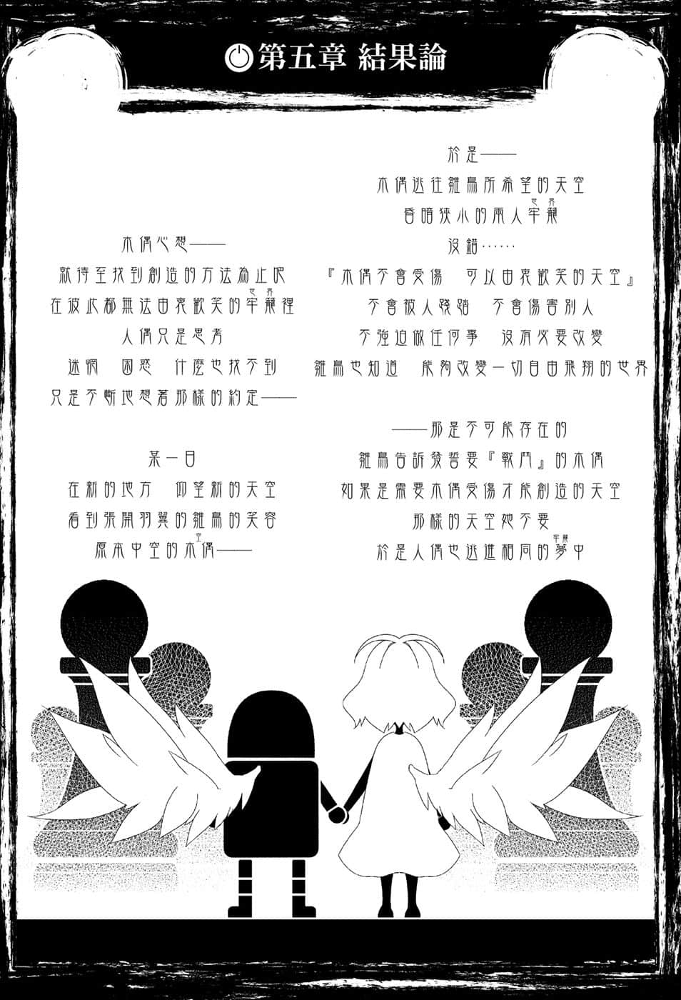
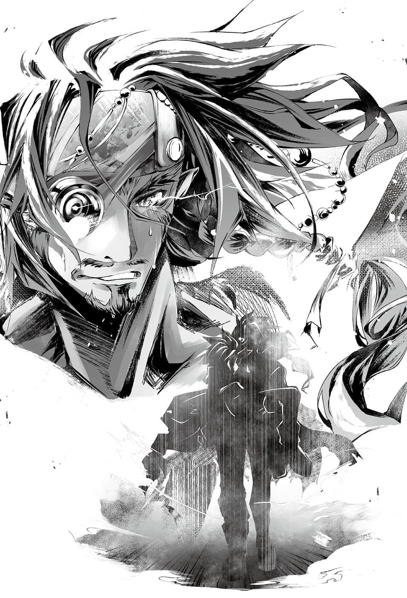

# 第五章 结果论

> 来源：https://www.linovelib.com/novel/9/2136.html

……神火炉的喷发声持续鸣响的会场……废弃处理场。

银色的巨大人型机械，踩着沉重的脚步，走在被铁屑埋没的地下废墟中。

灼眼浮现泪水，维格阴郁地嘀咕着生涯第一次的『烦恼』……

「……本大爷怎么会做出这么罪孽深重的事啊……」

没错，虽是莫名地苦战，他终于还是击碎两个核媒灵魂……

长有好素材的奇怪杂草们——那异样坚定坚强的『拒绝灵魂』。

让自己的核媒剑第一次出现龟裂——难以理解的强烈棘手『责备灵魂』。

维格阴郁地操纵机体，摇摇晃晃地走着。

他心想……本大爷到底做错什么了……

维格认为自己应该受到感谢，没有理由受到责备。

但是心中却只有二话不说刻印在灵魂上的神秘罪恶感。

最后他站在四肢全毁，倒卧在地，只剩一块铁块的机体前方。

「……喂……我说过我会迟到，但你们竟然打起瞌睡来，可真是从容啊……？」

维格以锐利的目光看着下方毁坏的机体，断定空等人是在装睡。

——在这个游戏中，彼此的攻击不会直接造成机体的损伤。

那么机体的毁坏，可能是因为术式失败爆炸而炸坏——或者是自行毁坏。

而真相是——『两者皆是』。

在感性的告知下，维格抓起全毁的铁块，大声地吼道：

「喂～～！！对手是本大爷——你们就算败了也是理所当然！！」

对……以灵装争胜在这场游戏，空他们本来就不可能胜过维格。

对……我本来就不可能有安身之处。

大槌的光辉逐渐增强——宛如灼烧身体的痛楚，忍不住脱口而出的话语，但是回应她的是通信中寂寞悲伤的苦笑，缇儿不禁紧紧咬牙。

——他们什么也不说，什么也不认同。

——因为如果是那样的安身之处，我才不要——！！

《问我为什么从这种世界逃走……？……这是蠢问题。》

「我是为了胜利，为了『实现约定而逃』！」

维格正想把手伸向她，但是……

缇儿一气之下将维格痛骂了一顿，她不理会维格带有哭音的通信，深呼吸调整气息。

但是即便是遥控操作——灵装仍有连接。

一个又一个，废弃物处理场的各处，连锁发生的爆炸造成地鸣。

轰一声，爆炸声响撼动地下空间会场，维格脱离幻觉，向周围一瞥之后。

她讨厌永无休止的锻炼生存方式——缇儿抬起头，露出冷笑。

「……我『讨厌』这个世界国家，『讨厌』哈登费尔。」

维格期待找到真正的操纵室的位置，于是追踪精灵光最后流向之处。

他立刻靠感性直觉察觉状况一切——带着凶猛的期待笑着大吼：

然而，子弹上却完全没有灵魂——与过于脆弱的『炮弹灵魂』相反，对于维格的『攻击灵魂』，他们只是说『NO』『拒绝』……

所以——

《喂！！你骂够了吧，再骂下去我真的会哭哦，喂～～！？》

…………————

只见在开启的操纵室的座位上，一位有着维格熟识的外表——

握在手上的触感是过去不知道的世界——如今认识两人世界，缇儿可以确定。

——原来如此，规则也没有规定非得乘坐在机体上。

那是黑色的天空与白色的鸟所开创的『天空答案』。

如果是从机体外的操纵室操控，就可以毫不客气地把机体用完就丢。

——却又陌生的少女这么说道。

从敞开的操纵室往下看——维格的机体伫立在持续爆炸摇晃的会场。

自己原本只是迷惘，不过从现在起就会是『战略上的撤退』——不。

在逐渐增强的疼痛的影响下，缇儿冲动地大喊。

缇儿重新断定自己的心情，断定这份感情。

「我也讨厌你一副自以为了不起的样子！更讨厌你实际上也真的了不起！！」

「你们该不会完全不想让『灵魂』说话，打算保持沉默到底吧！？」

「……哥……绝对会……遵守约定……相信他吧。」

她眼中燃烧无可撼动的灿烂火焰，俯视眼下远方——维格的机体。

终于在会场的中央——扩大影像好不容易才能看见的远处。

维格就是会说那种话，他现在就会说出那种话。

每当爆炸连锁发生——缇儿就感觉到精灵逐渐聚集在大槌上的手感。

然后，缇儿感到左手被紧紧握住的触感，颤抖神奇地停止了，缇儿忍不住笑了出来。

「有趣……你们打从一开始就是用遥控的方式『操控无人机体』吧……！？」

——少女孤独一人……流着泪挥动铁槌…………————

缇儿毅然决然地如此宣言，不过她的声音和手脚同样在颤抖。

她的右手握着闪耀的灵装大槌，手上的颤抖却压抑不住。

突然袭来的铁块机体『攻击自爆』上，含有强烈无比的灵魂洪流，也就是说——

明明放弃了，却仍流着泪……一位矛盾的少女……

她讨厌要求她别逃避的那种傲慢世界；她讨厌要求她别以失败为耻的那种强迫世界。

没错——他们与维格打得不相上下，发挥令人惊异的射击，对维格击出弹幕。

---

■ ■ ■

缇儿将那片天空深深记在眼底——高声做出胜利宣言宣战。

……他早就知道了，不——凭直觉想像理解得到。

「对于本大爷的『问题灵魂』——你们什么时候才要回答！？」

维格仿佛要抓住他们的前襟逼问，大声地对着全毁的铁块怒吼：

她发自真心，非以客观事实，而是以主观情感，断定自己的灵魂————

《因为，我————『最讨厌』那样的世界了！》

前方座位传来空与白的声音，听起来十分愉快，却又毅然决然。

为什么逃避？为什么不锻炼？世界声音逼问她无法回答的问题，把她逼得走投无路。

在最高设备的顶端，一看到目标身影——维格吃惊得瞪大双眼。

《……就是现在，我来回答你的问题。》

「而那种世界国家的首领……我也『最讨厌』了……！」

因此败北也是无可厚非。不过——

————…………

她看着地下空间的天花板，重新体认到。

那么就依照这个游戏的主旨——

——爆炸产生的精灵，宛如顺着刻印在会场的回路流动一般，画出光的线条。

手上拿着大槌的少女，有如发表宣战布告一般。

就如同毫不客气引爆，让机体『自爆』一般。

回答维格的是强烈的『心灵风景灵魂』，足以在刹那间夺去维格的意识。

「你那种看穿一切的态度，是我最讨厌的！！」

「别担心，我们约定好了不是吗？我们会和你一起飞翔。」

憧憬飞得比任何人都高的鸟儿……她是维格非常熟识的、不会飞的少女。

有这么厉害的本事，为什么————！

「我就这么说吧——我马上『揍扁你让你了解』。」

没错——握住左手的这份触感两人，他们带缇儿来到的地方。

「我讨厌你自称天才！因为实际上真的是天才，所以我什么也不能说，我讨厌你！！我也讨厌你高高在上的样子！因为实际上你的地位真的崇高，理所当然高高在上，所以更让我讨厌！！我也讨厌你的大胡子！！胡子剃过头了！？那又怎样？你是在讽刺我吗去死吧！！讨厌讨厌讨厌——叔父大人是大变态！！我最・最・最～～讨厌你了！！」

————现在，过去的逃避已成为『战略上的撤退』——！！

终于世界问她为何哭……对她放弃了。把她当成不需要之物……遗弃在废弃场……

「——————嗯啊！？」

「我是因为不爽讨厌所以逃走，如果你听不懂的话——」

……通信中有人这么说道，然后——

在迷惘烦恼之下，回过神来，自己已在废弃场，这个国家世界却问她『为什么逃避』。

『真正的机体』应该就在光之回路的最后集中处。

……所谓『战略上的撤退为了胜利而逃』是有胜算才会成立……

溃堤的感情已经无法停止。

会场的摇晃、大槌的光辉，以及痛楚都在加速增强，她擦掉眼泪，毅然决然地说出答案。她的答案就是——

——结果有人回答了。

「我喜欢天空……这个世界国家——天空被遮蔽了。」

通信中的声音说明了一切。

她直视维格的机体，甚至注视着机体中的男人继续说道：

那里是昏暗狭小的洞穴底部。维格认识那位孤独地仰望天空，流着眼泪的少女。

对于只是拒绝自己，并且持续忍耐的『机体』，维格咬着牙心想：

——明知不会飞而持续仰望天空。

确信现在已是完成式，缇儿勇猛地挥起大槌——同时——

伴随着超乎常轨的力量震动，缇儿声音撼动整个会场。

「我是为了超越首领——为了这次的胜利这一天而逃避！！」

---

■ ■ ■

那是沉眠于血液深处的记忆，任谁也会本能感到恐惧的力量。

位阶序列、等级、单位的差距——如同字面意思，那是不同次元的庞大精灵量。

如此超常之力在稍后会带来怎样的未来，即使不是维格也能领悟。

那是嘲笑爬在地上的所有生物的天赋等于无——从天而降的一击。

那股绝不会错认的力量就是——

————『天击』……

「喂！？天翼种不是不参加——不，应该说这『确实犯规』了吧！？」

在机体内的操纵室里，维格脸色苍白地发出悲鸣。

他抗议这是没参加游戏之人的魔法，而且也不是刻印术式！！

独眼慌张地找寻天翼种的身影，但是下一个瞬间。

——他发现力量聚集的中心是——缇儿的大槌。

随即通信传来的呐喊，以及紧接而来超出常轨的冲击，令维格吃惊得睁大双眼。

《超大型多段扩张灵装————全部连接！！起来吧啊啊啊啊！！》

缇儿脸上带着因剧痛而扭曲的表情，挥下大槌。

伴随将操纵室连同正下方的废工厂一同贯穿的闪光，大槌击落的同时。

原本受到爆炸震撼的会场，瞬间寂静下来。然后——

「————!！？」

《少啰嗦！！那样的世界生存方式去死吧！！呸！》

那是想要想像无法想像的事物的矛盾少女。

席卷的铁屑风暴逐渐聚拢，也就是说——

于是会场本身觉醒——站了起来。

不管是测量器还是森精种的理论，即使用尽一切手段，她也要找到别的方法！

——会场，铁屑的山峰下起雨来。

「【观测】全高九千七百公尺，全长七万四千两百公尺，炮数共九百八十二门。【定义】分类为战略机动要塞。不愧是主人，竟搬出过剩火力做得太夸张，像个小孩子一样，但我喜欢……啵。」

《……不过——呵呵……如果是现在的话，我就可以反驳你了……》

拼凑而成的铁屑机体，用铁风雷火的炮火，挥击宣扬自己母亲缇儿的灵魂，铁屑现在就要质问。

荧幕里，有个人影拼命地奔逃，闪躲钢铁之山引起的暴风。

——刹那间。暴力之雨朝着维格的机体降下——

「都把猎物引诱到目的地了，谁要跟你悠哉地『狩猎』啊。」

她一定要找到……她是这么想的……

《可是……该怎么做……我一直找不到任何方法！！》

——并非是因为他终于认知自己仰望的庞然大物为何。

维格终于发觉打在自己机体上的铁屑风暴究竟为何。

不知不觉间……她也以为自己忘了那样的决心，只是丢脸地无所事事。

缇儿不认同……她要超越首领，颠覆他们强行加在自己身上的观念——

「你刚才说这个会场是『猎场』！？太小了——你的眼界太小了啊！！跟你这个只承认巨乳的家伙的器量一样小——这就是你人生的缩影啊！！」

然后——他生涯第一次怀疑自己的感性与直觉，口中喃喃说道：

最后甚至误解放弃，只是在矛盾之下，无法有任何反驳……

「……不才『 空白』命名……《母亲缇儿之精神》……♪」

空与白在物理上的高处，操纵现在正要发动反击的巨人，高声地大笑。

然后，缇儿对着全国转播大喊『所以我就回答反驳你』。

为了『锻炼』而被切割、舍弃的铁屑们，现在提出质问——

正如同空与白所教导，她要向否定自己的全世界声音大喊——

「……无论是怎样的机体都可以……即使对会场动手脚也没关系……对吧？♪」

《……叔父大人，你有想像到这一招吗……？》

「正确来说是靠刻印着我的『一％天击』的灵装，连接起的扩张灵装机体。」

维格凭直觉瞬间回避，擦过机体的铁块，流入强烈的灵魂。

她在问——这里是锻炼与天赋所能到达看见的领域景色吗？

同时耸立在眼前的庞然大物，肯定了维格的直觉。

并不是地面在摇晃——而是会场在动。

铁屑与触媒连接组合起来。连同高耸的废弃物处理场一起站起。

靠努力想要飞上不能飞的天空的矛盾少女。

少女因为不再孤单，打从心底欢喜落泪。

——只是不断累积失败，在充满错误的人生中，迷惘、烦恼、不停犯错。

伴随大笑一起降下的是——『铁屑的炮弹』。

史蒂芙了解那对兄妹……她能想像——不，她甚至确信那两人会做出无法想像的事，因此带着无奈的心情看着荧幕。

——少女大声宣传反抗的自由后，身体倒了下去。

伴随缇儿通信中痛苦的声音，不断强烈地打击维格的意志——

凭什么——否定我们——！？

那些人口口声声地说——因为大家都是如此，所以你也应该这么做。

————…………

机体是维格的九百七十倍。

「渺小啊，维格！！要我说几次都可以，你是个渺小的男人啊啊啊！！」

听到通信传来的声音，维格辛苦地从幻觉中逃出。

《那种事……！……我比任何人都清楚……！》

——我对不断失败矛盾迷惘的这种迷失生存方式感到羞耻。

既然如此，一切耻辱都为了成就今天这一瞬间，所以我反而引以为傲。

而是看到在巨大物体的顶端，那个裸露在外的操纵室里，被兄妹抱住的少女。

——说什么最终会得到回报，只要怀着梦想好好地『努力忍耐』下去——！！

铁屑并不是被风吹起——只是在聚集而已。

会场卷起如狂风暴雨般的钢铁风暴，袭向维格的机体。

维格是对那个他没想像到不认识的少女感到吃惊。

一阵特别剧烈的纵向晃动后，强烈的冲击在自己背后炸开。

---

■ ■ ■

像他们一样，像地精种一样，不放弃，不犹豫，不懈怠。

只不过，如果是地精种之外的人……具体来说，就是在缇儿的秘密住处观战的三人。

——那是牢笼，也是陷阱，它们垃圾本身就是会场。

那些物品的集中地，它们嘲弄维格，夸耀废弃物处理场这里就是它们表现的舞台。

《不耻失败不停锻炼活着……那种生活方式是自由随自己便——不过，要怎么做……也是我的自由随我便！！》

——她的声音中带着呜咽，尽管泪眼汪汪，但是笑声与灵魂两道声音却充满自信。

《所以……要我像你们一样锻炼生活……？『FU〇K・YOU去死』！！》

「让您久等了——『会场本身就是机体』！！您还满意吗！？」

---

■ ■ ■

看到被兄妹拥抱接住的少女，维格吃惊地睁大双眼。

满载嘲笑耸立在大地的是——『失败垃圾的巨人机体』。

——被说只是逃避，不可能做到的少女，她的灵魂……

同时也是由失败垃圾与错误垃圾拼凑而成的，某位少女的『灵魂』。

「……哦～……都市会走动啊……啊，那也是灵装吗？」

——有可能没问题的东西。

是啊……怎么不说他们自己也无法超越天赋维格！！

《我就是看那样的『世界强迫』不顺眼……我最讨厌那样的世界！！》

铁块内强烈的灵魂，仅仅稍微擦过机体都会留下残渣。

「既然要引诱猎物，当然是直接诱进『牢笼』吧，强者冒失鬼！？」

——那些都只是铁屑，既没什么威力，也没速度。可是——

她们并不怎么惊讶，只是看着荧幕里的影像，坦率地语带感叹地说道：

《…………什么……喂，这一切都是我的『幻想』吧？》

——来吧，自称绝不会犯错的世界声音啊，所谓正确的世界人们啊。

也就是废弃物，被认为无价值的失败品，受到否定而丢弃之物。

空高声揭露袭击维格之物的秘密。

但是又来一个铁块——不，又来十个百个，成千上万——终至无限……

——这个情况不要说是维格，连哈登费尔全国观战的地精种，没有一个人能想像得到吧。

没有天空的地底，降下一阵大雨——每一颗雨滴都撕裂空气，贯穿地面，在废弃物处理场地底 制造出更深的坑洞。

从没想像到未知的高处俯瞰鸟儿自己……那耀眼夺目的笑容少女……是维格过去不曾想像所不知道的。

为了超越天赋而锻炼努力，不以失败为耻，不逃避地活下去。

口中说着什么也做不到，却追逐无人能及的鸟天空——

竟然还有脸说得好像一副很懂的样子，称呼她为垃圾！！

「我这个人啊，比起天才专用机，更喜欢凡人为对抗天才而打造的『超大型兵器』。」

在娱乐作品的世界中，『数量』总是注定被颠覆。

——正因为如此，现实就不同了……！！没错——！！

「数量才是超越精锐天才的方法啊啊！！这片『弹幕数量』可没有替你准备安全区域哦！？『围起来以数量殴打』！没有比这个更好的战术！！只要能赢就好了啦！！」

现实是——『过头总好过不及』——！！

空在操纵室与白一起操纵巨人，用炮击扫射视界。

《～～～～开什么玩笑！？怎么可能有那种灵装机体！？》

维格的机体勉强以毫厘之差的距离持续模拟转移回避，从他的机体传来通信哀号。

《地精种没有可以操控那个疯狂扩张灵装的精灵量力量啊！？》

——刚才的『天击』也一样。

维格确信有超出规格的精灵量某些东西干涉。对于他指责空等人违反规则的通信愤怒——

…………空等人则是齐声苦笑。

果然地精种是最佳反面教材——因为他们只有一半正确。

尽管察觉会场本身就是机体，对真相的了解却似乎仍然完全不足。

白坐在空的大腿上，而坐在白大腿上，尽管表情痛苦，却仍大胆露出讽刺笑容的少女——

「首领……现在说这个也太晚了吧——没有强化的话，我连最初的机体也无法启动哦？」

他似乎又漏看了……白怀里的作弊老千。

没错，真正令人难以置信的『真正的作弊缇儿』说道：

「其实我……『没有强化就不能使用魔法』哦！」

————

————叫做『髓爆』……

缇儿别说是操纵巨大灵装，她本来就连魔法也无法使用。因为缇儿她是——

伴随着轰然声响，开启一个巨大的炮门，炮门『内侧』安置着另一台机体。

——刹那间。

如此凶恶的举动，有如把火箭的燃料加入汽车引擎，因此——

那么——菲尔的这个魔法就是在战后重新编纂的术式。

克拉米曾经听说，大战时……有以『虚空第零加护』为首的灵坏术式。

缇儿即使意识快要模糊，却仍带着笑容，强而有力地握住大槌。

「是啊，因为我们真的只是外人呀，也不是什么朋友。」

但是那些魔法应该都因为『十条盟约』而无法使用了。

那就是八十六重术式——利用神灵种的加护封印而成的刻印术式。

借由自己和克拉米的败北——因而达成预定的胜利。

「……你说过不会手下留情——想反悔吗？男人的信诺有那么轻吗？」

《——————！！》

规则就是禁止刻印术式以外的魔法，核媒毁坏就败北。

面对这个似乎不了解那对缇儿是多大侮辱的傲慢男人——！！

缇儿的死，意味着抱着缇儿的空与白也会死，不过——

那是当然的吧，那个吉普莉尔一％的力量——就能发动如此超巨大机械。

「嗯～我也不知道耶，那是我们家尼尔巴连祖传的『奥义王牌』哦～」

「别瞎操心了！！这里是『牢笼』——你既没有安全的地方，也没有选择的余地！！」

空牵制维格的思考，露出不愉快的表情。

「简而言之，就是只要能获胜就好了哦！！我要求的是『制裁罪人』！那么不管谁靠谁的力量获胜，结果只要罪人受到制裁，那就是我们获胜了哦～！！」

「……不过明明得到胜利的机会，却无法亲手赢下胜利——还是会感到不甘心啊。」

炮口闪耀着神火色的光芒，随即仿佛塞住炮口一般，出现一个『铁块』。

维格指谪得没错，两人讽刺地对彼此一笑。

名字记得是……啊啊，对了——

菲尔歪着头说——对了，一起传下的还有这一句话……

想到第七名参加者，以及第五张『王牌』，那即是——

「……菲，我一直感到疑惑，使用锻神的加护刻印是谁想出来的方法呀？」

维格似乎终于明白了，听见他的悲鸣，空不禁苦笑。

——完全不用于提升性能，相对地只在机体上施加别的刻印术式。

那个物体与炮门连接，发出闪耀的光辉——这次维格真的连同机体一起冻结了。

另一个操纵座内，操纵者勇猛地齐声说道：

《对～这就是『决胜的瞬间』哦～❤》

————无毛————！！

「我们败了，我们的机体谁都可以使用资源回收对吧❤」

……维格担心缇儿，打算故意中弹，让自己败北，结束游戏。

即使是在爱尔文・加尔得长大的克拉米也不曾听闻。

那是依靠森精种的创造主的加护——刻印术式而成的魔法。

在光辉闪耀的『髓爆』里侧的操纵室，菲尔笑着说道：

正如缇儿所说，那就像是『替鱼制造水中呼吸器』，是本末倒置的想法。

克拉米心想——如果要赢下赢不了的胜负，靠他人的力量取胜就好了。

「哼，这就是天赋的差距……臣服在绝对无法跨越的高墙之前吧！维格！！」

没错，正因为维格是优秀的地精种，所以他大概想都没想过这个作弊老千。

菲尔表现得十分开朗，克拉米则是以苦笑回应。

真要说的话，能够让那么庞大的质量进行非模拟空间转移的魔法……

---

■ ■ ■

没有强化就不能使用魔法，反过来说只要强化就能使用——

没错……这就是自己的空间转移被她使用时，吉普莉尔惊愕的真相及其原理。

「如果你能闪过『全画面攻击』，那身为游戏玩家的我，真的要向你求教了哦！？」

那正是没有安全区域可躲的『炸弹』。

以及参加者是——身在『会场这里』的全员……

《别开玩笑了！！地精种的身体怎么可能承受那种力量！你们想害死侄女吗！？》

「唯一的结局就是——缇儿的完全胜利！！」

借由大量安装的模拟转移锚钉的连锁爆炸，将不断强化的精灵导入施有『天击』刻印术式的触媒——在体『内』同步。

没错，即使缇儿连接菲尔的机体加以使用也没问题。而且——

《————————啥啊啊啊！？》

————无毛————！！

缇儿擅自接收菲尔的机体，锻神的加护自行启动。

没错……当克拉米断定不会赢的那个瞬间——菲尔就退出这个游戏了……

——不惜亮出尼尔巴连家的家传『奥义王牌』。

他不可能会认错，那是另一个过去的遗物。

——维格竟打算故意输给她。

不过，对于非同一般的地精种而言，那就是可能且必胜的方法。因为缇儿她是——

也就是做为『条件交换』，她要求的条件谢礼就是不管谁胜利——绝对要下令『让维格一生抱持罪恶感』……

「我们有确实遵守规则哦～自然又环保❤」

「『王牌就是要保留到决胜瞬间再翻开才叫王牌』哦～」

但是没有体毛的缇儿非但不会过度强化，甚至也不会强化！！因此才要让她『强化』……

于是她『以好友的身份』协助空等人，『以朋友的身份』得到谢礼。

在同一间操纵室内，克拉米感到疑惑，于是询问心情正好的菲尔：

「不过，我唯一第六张的王牌就是——『克拉米』哦♪」

「哼……哼哼，首领……你去死一死吧……！」

对着空大吼的通信声音，充满明确的怒气。

……对，一般地精种如果模仿她，立刻就会自爆，既不可能，也无意义。

「既然克拉米说不会赢——那就不会赢了哦。」

于是靠着受到控制的庞大精灵量，缇儿就能启动会场内的铁屑——施有刻印术式的『无数触媒』，操纵这台拼凑而成的机体……！！

从秘密住处转移过来的那个东西，由缇儿使用的话就不违反规则！！

空如此大吼之后，等同会场本身的超巨大机体的某一区。

「只要能够多打几下，对我们来说就是赚到了哦～♪因为——」

菲尔对克拉米露出最佳的笑容说道：

看到好友的微笑，克拉米有些难为情地别过头笑了。

——这代表缇儿能够强化——比如说……

神火路——利用欧肯因的力量而成的『非模拟空间转移』术式——

……那偏偏是利用锻神制造刻印术式，到底是谁——不。

「那个啰嗦的参加者火焰的『加护刻印』，还有机体的刻印术式也可以回收再利用哦♪」

《等、等一下！喂——臭侄女，你该不会还没长毛吧！？》

地精种因为体毛的作用，会产生精灵过度强化的关系，所以需要与体『外』的触媒同步。

听到他们的对话……老实说，空虽然已经觉得绝对不是，不过还是要说——他们应该是在说胡子吧，所以这件事先摆一边——！

那么——如果回答不了的问题，却硬是要回答的话呢？

「那就让他人回答……简单说，就是一如往常，靠诡辩取胜。」

被问到过去——『欠的债还清了吗』。

那就指着回答未来——『有钱再付快了快了』……

…………

「……然后木偶持续制造天空……制造只有他们还看不见的天空……」

在狭小的操纵室中，克拉米看着『天空』的幻视，脸上露出复杂的笑容。

自己和菲、吉普莉尔、兽人种、神灵种、机凯种，这次则是——

「又要撬开一个别人缇儿的天空……直到找到『他们的天空』为止……」

---

■ ■ ■

——一如预期，令意识世界目不暇给的闪耀景象光芒。

将缇儿从外面收集的东西，经过熔接焊接拼装起来，累积而成的错误迷惘。

再用能熔化万物的火焰意志，依照『铸造』的『创意巧思』，最后达到的领域天空——

「……叔父、大人……我实践……约定……了、吗……？」

即使激烈的精灵，使身体痛得好像快破碎。

「我已经身在……叔父大人任何人也无法想像看到的……领域天空了吗！？」

尽管精灵回廊接续神经现在也仿佛快烧断似地灼热。

但是缇儿却毫不顾忌地笑着——对……

「……你想知道……我现在……心情怎样……吗……！？」

缇儿混浊的意识所捕捉到的——已经只有……

不管是缇儿还是任何人都肯定无法想像的……遥远天空。

男人是公认的天才，却不骄傲自满，只是胸中怀着自负，专注却猛烈地挥动槌子。

那位触及概念改窜——『创造』的天才，男人甚至也看到他的背影了。

那是她心中早已决定的话语，笑容啊——希望能传达给他。

他要制造更好——不，他要制造最好的作品。

没错……『髓爆』无法使用。

「我被偷窥了吗！？身体被仔细看过，我嫁不出去了，叔父大人要负起责任，这样我就是『首领的妻子』，飞上枝头变凤凰了！来吧，老公～？老婆的身体随时可以给你看——」

于是在白的怀中，缇儿的身体逐渐虚脱，但是空与她相反。

她是男人的义姐们之一所生的女儿，一个人小鬼大的小女孩，不知为何特别亲近自己。

制造火箭想要飞上月球，结果阴错阳差反而坠落地球……

既然会犯错，那么只求区区完美的气概是不够的。所以——

「……好了，聪明的地精种可能初次听见吧。我要讲解弱者的一般学，要专心倾听哦！！」

于是空笑着起动炮口『髓爆』的内部，刹那间，仅仅慢了一点；维格机全力的一击，贯穿外壳，打进内部————

对于虽会试验却不会犯错的聪明人你们来说，一定大开眼界了吧。

「就算不小心上下颠倒——贯穿星球，或许也可以到达另一侧的天空哦♪」

看到『髓爆』的外壳发出恒星般的光芒，通知起动准备完毕，空大声地吼道：

立誓一定要超越，总有一天要回敬那一日的鸟儿。

制造出前所未有的杰作，终极的神作！！

「『臭侄女』在视线范围内眨眼和抛飞吻，当然会让人忍不住在意啊！？」

……那么现在她可以断言，不管犯几次错都可以——……

生来就拥有天赋之才的人……只靠感性飞行的鸟儿男人，通信的语气中，充满第一次——不，语气充满令人怀念的『对未知的恐惧感情』。

……那个男人天生拥有优越的感性。

——比如说，朝着印度出海航行，结果阴错阳差抵达新大陆。

小女孩之所以发抖，是怀疑自己的裸体被偷窥了。

想要用数学证明一切，结果阴错阳差否定了数学。

那么现在正要起动的东西是什么？

刹那间，维格的机体产生『爆炸』，随后忽然消失不见。

「啊！！不行，我不想当会对小孩发情的变态的妻子！！」

「我没有妨碍，我在诱惑『未来的丈夫』。」

——结果会如何？是啊，怎么可能会知道——！？

毫不畏惧地反驳男人的是一名年纪尚幼——个子娇小的女孩子。

尽力挤出的声音有人听见吗——不，就连声音是否有发出都不确定——

——『一定要超越阻止』——

他们打算用那东西做什么？

——或许会得到比完美更好的结果吧？

就在那个时候，男人对着跟在他周围的奇妙小鬼大吼——

「听我说话啊！？话说你不是在诱惑我吗？到底要我怎么做啊！？」

——是啊，就是那样。

「……一般而言，世事不会演变成你想像的结果啊……」

如果能够到达不曾想像的场所……就有这么快乐的景色意念可看的话——

——既然缇儿的身体有可能会撑不住的话！！

他在空中飞行逼近，速度之快，不管是空的眼睛或会场的摄影机，甚至连残像也看不见。

——说什么『做得到』——说什么『没有不可能』！

有的景色只有经过那样的愚蠢行为……才能从那条道路上看到。

「所以才要『实验』啊！！这就是所谓的『科学笨蛋的想法』吧！？」

即使如此也要——履行遥远往昔的约定。

顺便一提——这样的对话已经是第五次了，也就是说——

打造出无数杰作的男人正是天才再世，每个人都确信他会是下任首领。

……饶了我吧。

以微弱音量传来的通信回应，缇儿确实听见了，她闭上眼露出苦笑。

——即使如此。有一件事是他可以想像得到了解的确信，他首次带着执念意念大吼：

《简单说就是不知道会有什么结果吧，你们是『笨蛋』吗！？》

看到他打算一击取得胜利画下句点，空在内心笑着回答：

对于生来就有天赋才能的人……对于不曾造过飞机的鸟儿来说。

《……开什么玩笑……喂——》

明天，甚至一秒之后就可能得知真相——

地精种史上只有一人，只有男人的祖先到达看到的——『神之领域』。

就连维格的身影也被抛在远方，感觉就像在黑色的宇宙飞行。

---

■ ■ ■

每当迷惘、烦恼、犯错——

那已经不知道是谁的心灵风景灵魂，只是透过核媒，传入全员的脑中……

——这样就结束了，每个人都会与男人保持距离。

「你的眼界太小了呀！！如果要飞上天空，那就要抱持通过月球，不小心撞在『火星』上的气概，那样才有一拼的机会！！」

对于侄女所翱翔的那幅景色那个高度，男人完全无法想像了解。

……仅限于人类来说——『完美』这种东西根本毫无价值。

我又会堆起失败与错误的小山。

「喂……你很烦哦，臭小鬼！？别妨碍本大爷的神业工作！！」

维格将机体开至超越极限，灌注在拳头上的灵魂只有一个想法。

充满丢脸的羞耻与泪水，不断地持续迷失——简直是笨蛋在绕远路。

《可恶的臭侄女！！你是在以眼还眼吗！？你这家伙竟然模仿我的表情！？》

看到他不由分说的目光才能，平常即便是小孩也分辨得出他与自己住的世界不同……但是这次却不管用 。

「为、为什么你知道我没有毛！？你看到了吗！？」

「如果觉得我碍事，那就是叔父大人对我有意的证据哦！？」

这个不管怎么赶也赶不走的小孩，令男人感到头痛。

——那是一种即使不会飞也要飞的执着，没有这种执着的鸟，绝对看不见那样的景色。

反正我的特技就是只会犯错——！！

男人以锐利的眼神，命令小孩走开。看到男人的独眼——小孩吓得浑身发抖。

————谁怕谁啊……！

————…………

当然……

「有没有胡子看脸就知道了吧！？别脸红，你为什么脱衣服啊！！」

正确来说，她自称是男人『未来的妻子』——

「我对连毛都还没长出来的小鬼没兴趣——————你很碍眼，快滚。」

果然差点误会自己可以成为鸟儿了。不过缇儿很清楚……那只是误解。

维格与缇儿的全部精神冲突——灵魂交错，受到搅拌而变白。

六千多年来，不曾有人到达的极限，自己即将到达。

那就是只会迷惘、失败、犯错的我们笨蛋的生存方式。

我哭天喊地，懊悔地紧咬牙根！

「『你一生也想像不到不会懂啦』！！活该！！呸！」

连是否有意义可能也永远不会明白——

——这个臭小鬼……到底是怎么回事啊……

她是个歪理特多的侄女，不过男人更对自己的不快觉得困惑。

对于不知道失败与挫折的男人而言，那实在是与他无缘的感情。

其实，那是他第一次感到『愤怒』，不过当他想通已经是以后的事了。

「……听好了，臭侄女。本大爷是超级天才，也就是超级好男人哦！」

「啊！那身为妻子的我也就是超级好女人啰……！？」

「喂，完全不对，问题就在这里——你配不上本大爷啊。」

所以，这个时候——男人如此断定。

「你一生也无法成为好女人。」

————

「……哦～……怎样才叫好女人呢……？」

「首先是有长毛的女人。这点你就不予考虑了。然后配得上本大爷的女人，首先必须是巨乳，而且要有才能，能够制造与本大爷同等以上的灵装。再来～必须是美女，要超洁身自爱，但是对本大爷超性感，这才是好女人。」

「……叔父大人，那是『方便的女人』。」

「————啥？」

「因、因为地精种没有巨乳呀！再来～后面的叙述，就跟阿姨们说的『处男的幻想』一模一样！叔父，处男是什么！？」

「少啰嗦！？超常的好男人追求超常的好女人有错吗！可恶的义姐们！！」

然后——

「呼～真受不了你，我来当你的好女人吧。」

忽地……

「我再十三岁就成人了，毛也会长得很茂密！！我是美女而且超洁身自爱！只要叔父大人把我变性感，那就过关了！！」

那孩子追求的是肯握住她手的容身之处某个人……只是如此而已……

交融的意识中，有个年轻男子的声音，打断他的思考，讽刺似地笑了。

「不可能，『无能你』一辈子也不会想像了解灵装的制作方法。」

男人不该等着被超越。

或许——那就是像祖先所爱上的『某个巨乳女性』一般……

「……呼……呼……哈、哈哈哈哈……！！」

「反、反而是叔父大人无法想像的我，已经超越叔父大人的想像，我轻易就能造出超越叔父大人的灵装……好了，我辩赢了！」

那是红锈色的男人。

小孩是如此矛盾，从不迷惘与犯错的男人，完全不了解她……并对『这个无法想像的小孩』感到畏惧……

他的感性甚至能到达，史上只有男人祖先单单一人可及的『神之领域』。

……没错……男人也不懂那个小孩。

【……真是老套的结局啊……原来一直逃避的人，竟然是本大爷啊。】

那两个异世界人矛盾逃避过去，却连战连胜，那样的矛盾令男人想像到了确信。

男人只想像得到看得见祖先的『背影』，即使如此，他仍是能凭感觉想像理解。

小孩的头脑在思考什么？小孩心里在想什么？她是……为什么哭？男人什么也不明白……

男人将自己也不明白的感情，随着话语发泄出来：

他应该跟那孩子一起寻找超越极限的方法。

只见一个男人抱着失去意识的少女，走出漫天的粉尘。

——————

一定是更为独特，无法想像预测，无法想像了解，无法想像的存在……

明知不会飞却向往天空……在与她的志气同样深沉的黑暗之中。

尽管被宣告绝对办不到，她依旧反驳，甚至说自己会超越。

但是忽然间，他看到自己怀中的侄女，即使失去意识却仍不放开大槌。

明明绝望落泪，眼眸却点燃炙热火焰，说得斩钉截铁。

「我、我要制作出超越叔父大人的灵装……我跟你『约定』。」

男人和小孩勾手指约定。

「……哈……结局是『臭侄女的完全胜利』……没有错……我彻底输了……」

尽管感性宣告不可能，他却反抗感性，追逐那个孩子，甚至把我们当成借口——

如果是他们的话——大概能明白那个孩子为何逃避吧。

——我问你，不逃避与拒绝逃避而逃避，两者有什么不同吗……？

「我会努力制造出像叔父大人一样的灵装，只要放弃巨乳，你就会看到我已经变成好女人了哦！？叔父大人的处男我也会设法解决！！」

——可是那个孩子却逃避了……

小孩不安地如此断言。矛盾的小孩就如同她所宣言——

那么自己的祖先又是看见什么，所以才能到达如此的神之领域。

逃避自己所想像期待的那个自己无法想像的孩子矛盾。

维格仰望着天，他领悟到——是啊，输到体无完肤了。

岁月流逝——直到某一日。

被人人憧憬的天赋男人说是『无能』。

「那么叔父大人也——无法超越叔父大人的『极限』！！」

——就像这个要成为『超』好女人的孩子一样……

直到最后，男人仍然没有想像到不明白，那个小孩忍着泪水抬头仰望的眼神所代表的意义。

小孩甚至不懂，男人想像得到看得见的东西，自己却想像不到看不见吧。

——男人终于得到答案。

……而男人的感性直觉果然正确，只不过——

——那么，处男是什么？小女孩笑着问道。

胸部上下起伏，安稳地睡眠，脸上露出打从心底高兴的笑容——

——男人一直在逃避过去赖帐吗？

……什么啊。泪眼汪汪怀疑自己听错的表情是怎么回事！？男人的不快持续增加中。

「…………无、能……？……咦？我吗……？」

终结地精种六千年的停滞……到达超越感性『界限』之后的境地。

「我等你成为能胜过天才本大爷，超越想像的超好女人哦——我们『约定』好了哦。」

那孩子带着矛盾，即使追上去，也只是逃走，男人最终还是不懂那个孩子。

「明明不懂……却断言我造不出来……」

——那大概不是普通的地精种吧。

「那不是努力就能解决的事……！！连这么简单的道理也不懂吗！？」

【……是吗？真是那样吗？你一直在逃避吗？真的吗？】

小孩闪烁着苍白的眼眸说道，男人感到莫名不快。

但是男人也感到困惑，为什么自己会觉得不快呢？

被道破极限的男人——他没有超越自己的界限，而是选择逃避。

不知结果会如何——压榨自己，不惜催出超越极限的力量，不断持续超越。

以他的感性，甚至能到达六千多年都无人可及的极限。

「……好啊，那你就制造出超越本大爷的灵装，然后来挑战吧。」

……那个男人拥有与生具来的优越感性。

她一定从未想过，自己没有才能。

逃避不明白那个孩子、却想要了解对方的自己矛盾。

所以男人决定，至少直到他想像到明白为止，在被超越之前……他要能配得上那样的好女人……成为好到极限的男人。

听完小孩夹杂着呜咽声的反驳。

——第一次误判……

感觉就像是一个超越种族极限的愚者生活方式证明……

——为了不让侄女死去，男人操坏机体，超越极限，然后救出侄女。

连系巨人零件的力量中断，铁屑如雨一般崩落。

透过转播观看战况的全体地精种也是相同想法。

---

■ ■ ■

————

地精种是随着想像创造的种族。

不过，不可思议地，其实那才是冠有『多劳布尼尔』之姓的男人——『本来的模样』。

啊啊——这个小孩是真的不懂。

他也逃避而不去想像理解——那一天小孩为何哭泣。那对不安湿润的眼眸追求的是——

————然后呢？在那之后呢？

这次男人终于像折断的大剑一样，膝盖一弯，呈大字形倒卧在地，放声大笑。

——然后……地上也受到震动的冲击过后，地下空间恢复平静。

因为精灵过度强化，真灵银——头发和胡子失去光辉，变得像生锈一样。

「为、为什么？我、我会努力哦！」

在交融的意识之中，接触到那时的小孩的灵魂，男人自嘲似地笑了。

【你觉得和缇儿一起坠入垃圾堆，像我和白一样才是不逃避吗？那样就正确吗？是啊，可能正确，但是也可能不正确。】

——男人完全落入奇怪的人类种所设下的『毒陷阱』。

「……我不懂……我不明白……再、再说……」

……那就是男人的——

「叔父大人也没有想要想像理解我为什么不明白！」

——看到『天空』的幻觉了……

那是地下不可能看见的陌生天空……但是确实看见了。

仿佛缇儿说的——遮蔽这个世界国家天空的东西粉碎了一样。

久违六千年被撬开——高耸蔚蓝的天空远方……

「……你深切感受到自己的渺小、自己的品味之差了吗？维格・多劳布尼尔。」

发问的是俯视自己的多个人影中的其中一人。

当维格的核媒破碎的那一刹那，吉普莉尔救出了一行人，维格瞥了他们一眼。

「同样等级的人才会起争执。很抱歉，你还不够格当我的对手。」

——是啊，自己真是渺小的男人。

与自己相比——维格仿佛看着耀眼的存在似地，抬头仰望空。

「……不管是贫乳、巨乳还是爆乳，也不管是真还是假……全部都是乳房呀……」

——好大……太巨大了。

「既然自称喜爱乳房，为何要评论『对错』——应该谈论的是『爱』吧。」

不管是空温和的眼神。还是这个巨大无比的男人如涅槃一般清澄的声音。

「除了喜爱的巨乳以外，把其他乳房一律视为假货，加以否定，甚至强迫别人接受……」

——其中既没有纠正、也没有指责、侮辱和轻蔑——有的只是……

得证菩提的男人赐下的真言。即是——

「我的灵魂还没有廉价到要讲给你这样的灵魂听……」

……只要是汝觉得美好的事物，就是美好的事物。

汝要怎么想都是汝的自由，任何人都不能干涉汝的想法。

「真是的，为什么缺女友经历＝年龄持续更新的我，必须帮男人攻略女角啊！？而且是独一无二！真正的！褐色合法萝莉鬼女啊！？」

「我听不懂你在说什么呀！？这个胸部会恢复吧？不恢复我会无法生活呀！？」

兄妹说着准备离开，他们的背影所要诉说的话语，维格确实听见了。

只要能够通过这个世界游戏——那么他们就是为了胜利而逃避。

「不管怎么看都不是巨乳哦！？」

「所以说每个人都会异口同声说『这是巨乳？』的『巨乳？神髓』——」

「好了，这是第一次，也是最后一次当别人的爱神邱比特了哦！？」

「理想的巨乳？经过你加工才完美？渺小啊！太渺小了！！」

造形受到挤压，左右有若干不平衡，大得过头的乳房。

那就是随着呼吸上下起伏的缇儿的胸部——『爆乳』。

——（晃动）

维格感觉他们就是在这样说，所以——

「因为我碰巧和克拉米是一对，所以我不恢复也没关系哦～❤」

……他是伟大的处男。没错————

「……嗨……你们的『灵魂回答』……我确实听见了……」

——女性成员为了胸部随机改变而吵闹的光景。

这就是初代首领的『巨乳神髓』，与另一个『改窜神髓』一起并用产生的『概念共鸣』。

「抱歉，试探你们了，感谢你们让我看见天空……」

---

■ ■ ■

——因为没有自信，维格才是没有自信的人。

那即是由『髓爆』的外壳所包覆——由两个『改窜神髓』形成的『概念共鸣』。

「也就是说——这是『巨乳吗？』，属于疑问句的概念共鸣。」

「不，因为是靠『巨乳？神髓』所形成的概念共鸣，所以——」

经由第三人在不靠想像之下，偶然打开的那扇门所产生成功失败的附带结果。

没错……原理不明，再说就连概念的改窜也无人能理解。

维格这才第一次看到那个小孩一直憧憬的『天空事物』。

没错，只是发生与四天前相同的事情而已，不是指爆炸，而是指附带结果。也就是说——

「如果要追求理想的乳房——那就要抱持追求『远超过理想的女人』的气概，那样才会有一点希望吧！？不然你会连理想的乳房都找不到哦！？」

「开什么玩笑！？为什么我的变得更小了！？我可不接受『无乳』哦！？话说菲，你说你的『贫乳』跟我是一对，你是拐着弯在损我吗！？快点把我的灵魂胸部恢复原状啦！？」

那么汝谈论汝的想法，为何要贬低他人的想法？

————…………

除了并未爆炸，正常发挥作用这一点之外，眼前的光景与四天前的『实验』完全相同。

「不，所以说不是『巨乳神髓』，而是『巨乳？神髓』的概念共鸣……」

——没错……那是史上唯有两人得见的神之领域。

「【解析】无名无姓女性的胸围值，推定分类为俗称『超乳』，享有极限定人士支持。」

终于找到极限后的理想，维格嘴角一扬，用天真无邪的眼神看着她，露出幸福的笑容……

「……是啊，也就是说，追求区区的完美，那就是本大爷的极限吧。」

「简而言之，我们四天前根据主人们伟大的指导，对无加工的『神髓』施以和『巨乳神髓』完全相同的刻印，进行『谜之神髓』的启动实验时也同样——」

「【发问】本机胸围，推定分类为『丰乳』……对『巨乳神髓』的概念共鸣提出疑问。」

当我们把这个世界游戏的常规全部颠覆。

全部收拾干净通关的时候——你就给我觉悟吧。

——下一个就是你了，地球烂游戏！

「身为死党，让本大爷帮忙创造你们的未来天公吧。」

空握起唯一没有变化的妹妹的手，仿佛在说『巨乳？在哪？』。

---

■ ■ ■

「……是啊，我终于看得到臭侄女看见的景象了。」

维格一直追求的……超越完美的理想巨乳……是啊，没错——

这对异世界的兄妹直到最后都没有说话。

没有付诸言语，甚至灵魂也不回答。他们的回答——是了……

那一天的小孩打从一开始就已超越自己……甚至这次真的成为超越想像的好女人了——空也露出微笑。

因此对于无法理解之处，就连吉普莉尔也无法说明与解说。

「等等，好重呀，我站不起来了呀！？这种才不是『巨乳』！？」

为了讲解给当时不在场的两人听，吉普莉尔再度解说。

「……祝你们幸福……♪女主角的竞争，一名竞争者退赛……」

看到自己怀中，侄女的睡容仍然露出幸福的微笑，维格小小地苦笑一声。

是啊……真的就如臭侄女说的一样。

不过，如果非要粗略解释，以言语说明的话。那就是——

——无视女性成员们的骚动。

「相邻的『巨乳神髓』相互干涉——推测产生了复合性的概念共鸣。」

维格心想，那个小孩看的并不是鸟。打从一开始，她看的就是鸟所飞翔的那片天空。

这个广大无边的男人，空一开始就是在距离维格遥远之处，立于高次元的存在。

那是无论如何祈求盼望，最终仍无法想像的——领域天空。
