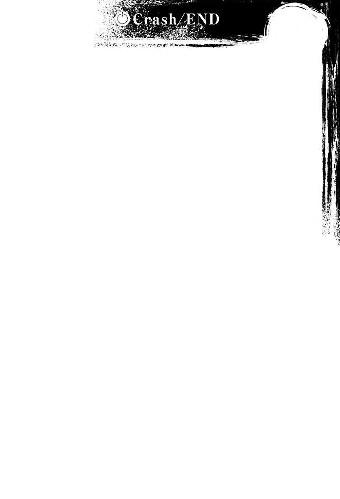

# Crash／END

> 来源：https://www.linovelib.com/novel/9/2137.html

然后一夜过去——哈登费尔的首都。

打破种族极限的激烈战斗，兴奋的热度尚未冷却的地底都市的一隅。

在一间小酒吧中，有一群人围着桌子举杯庆祝。

那是赢得那场激战胜利的当事者们，更正确地说是——

「【开议】第一回『结果主人的喜好到底是什么』彻底考察会议。YA～」

「「「「YA～」」」」

「不，没什么好YA～的吧！？啥？这不是庆功宴吗！？」

空发出如此悲鸣，却见四名女性走近围住空……

……菲尔与克拉米不知是早早回去了，还是去别的地方避难了吧。

不管怎样，除了她们两人之外，吉普莉尔、依蜜尔爱因、史蒂芙……甚至连白也在。

以庆功宴为名的聚会开始，空遭到女性成员们『审判』。

「你说『结果』是什么意思！？所以我说要平等地爱护胸部吧！？」

空立刻表达抗议，却被间不容发的连续回答否决。

「【否定】此主张是诉求思想自由、包容喜好，主人自己的喜好并未回答。」

「另外，主人也说过，主人的性癖没有廉价到能够轻易说出……」

「……必然……哥有……哥的主张……只是……没说出口。」

然后仿佛摆出证据质问被告一般——

「【播放】——『不管白会不会变成巨乳，或者是变成老太婆，甚或变成男人都一样！！哥哥不可能讨厌白』、『无论变成什么模样，白都是哥哥最喜欢的白』，本机记录到以上的发言。」

「谁叫你擅自记录的啊！？」

「……依蜜尔爱因，我想要……那些声音档……！」

「超越维格的灵装工匠——缇儿就是新首领♪」

因此空十八岁处男与万人迷之间没有共通点，他无法理解现在的状况。

「什么！？咦？由我来当首领——地精种的全权代理？欸，绝对不行啦！」

听到他们说的话，缇儿侧着头感到疑惑。

「【结论】主人的喜好断定为『兽耳褐色巨乳伪娘萝莉老太婆』……！」

「…………！」

——这时候如果照实回答，就会发生某种不好的事……！！

「抱歉，我来晚了。我费了一番工夫才摆脱『追兵』……」

因为哥哥知道那副表情，那是期待哥哥犯错的表情。

「所以维格的一切全归胜者——也就是属于缇儿所有了吧？」

然后——背后亮起一瞬的闪光，听着背后男人的声音，空与白步行离开。

「…………♪」

随之而来的是少女的声音——那是红着脸，微微低头发问的史蒂芙的声音——

「嗯？想要的东西全部都得到了吧。」

傲慢与谦虚、矜持与恭敬兼容并备——史蒂芙也不禁抽了一口气，空则反射性地啧舌——这个地精种盛装打扮之后，这次真的像是无可挑剔的好男人。

在寂静笼罩之下，空受到目光注视，他不发一语，抬头仰望上方——心里在想：

他就是维格・多劳布尼尔，正如同他接下来所说……

问题只在于是否要回答维格的『灵魂问题』。

对……白脸上一副『来，快说吧』的表情就是最大的铁证。

史蒂芙也察觉到是怎么回事吧，她留下祝福的笑容，向后方转身离去。

缇儿敬了一个礼，然后忸忸怩怩地说出迟到的理由。

空从未以自己的意志，靠自己的手享受过艳福！

「……把你的『安身之所里面』——让本大爷做为安身之所吧。」

依照约定……『夫妇一起』——以朋友的身份协助他们————

不管怎样，空与白都必须把『药』卖给维格。

「——欸……麻烦再说一遍？」

「「什么～～～～～～～～～～～～！？」」

但是另一方面，依蜜尔爱因与吉普莉尔则是不慌不忙地追问……

——甚至没有必要获胜……只不过——

「……留到『结局』之后……我们……离开吧。」

然后——呿！女性成员们齐声啧舌。

「我、我一醒来……不知为何大批地精种朝我围了过来……我差点就被绑架了，好可怕！不过，我也是逃跑专家，不会被他们抓住！！」

「……好了，那么邱比特就暂时离席，庆功宴就——」

自己的身份无法享受主角特权，如今却吸着女性战场的空气，空在内心回答：

如此说完之后，空与白从座位站起，吉普莉尔与依蜜尔爱因仿效他们。

维格认为如果回答不出来，空他们就不会答应游戏，于是故意挑衅；空他们答应游戏的话，他也只是想问个问题而已。

缇儿当然不知道，那是因为主宾到场，她们在惋惜审判被强制结束。

「【新证】主人以自由意志，享用无名无姓女性的乳房，综合以上情报推定——」

之后的问题就只是支付『药钱』与否——『药钱』就是这样付清了。

鸟可以飞翔在无法想像的天空，但是却无法创造天空。

空在游戏中说过的话被大声播出，兄妹发出意义不同的悲鸣。

——缇儿与史蒂芙发出悲鸣。

各式各样的目光聚焦在自己身上，空感到苦恼不已，这时候突然——

「【整理】主人的喜好推测有幼女取向萝莉控，扩大至不限年龄性别，必须再考察。」

没错——支付赌注，失去一切的维格，他唯一剩下的是——

只见缇儿拼命调整呼吸，深深地低头道歉。

——『万人迷』才该受到的对待，为什么是自己在承受？

她以自信满满的语气，毅然决然地——

「啥？那、那样的话，你们不就什么也没得到吗！？」

为什么……

「但是另一方面，主人只对年幼的外表表现出好感反应……再加上——」

「缇～～儿～～！！真是的～等你好久，我差点就死了，你怎么来得这么晚！？」

「既、既然如此，空……你为什么……那个……只有揉我的胸部呢？」

维格真正想问的是对方的答案，也就是————

——身穿婚礼服，右手拿着剑——左手拿着花束的男人。

这次的游戏，空他们本来并没有必要答应。非但如此……

「打从一开始，本大爷中圈套时就输了。剩下的就只是能否成为朋友而已……」

「他、他们是想抹杀赢过首领的我！！哼哼，不过我才不会让他们得逞！！不、不会让他们得逞对吧？救、救命啊……！」

——（静～）

「哼、哼哼！！甩、甩掉了……我成功脱逃——啊！？」

所以——

然后，依蜜尔爱因陈述她推理的结论，即是——！

维格单膝跪下，递出戒指——少女见状吃惊地睁大双眼。

没错——

「所以说，你回想一下……宣誓的赌注内容。」

——空大吼，与其被那样指控，还不如被说凡是女性来者不拒还比较好。

杀气腾腾的法庭中，救世主突然出现，空朝她扑了过去。

药钱……维格的全部财产国家是支付给胜者。也就是——

与维格『约定的少女』——为了让她履行约定……

——我为什么揉史蒂芙的胸部？

但是为什么？到底会发生什么坏事，然后白会因此得胜——！？

没错……正如同空需要白，白需要空一般。

「我的喜好也太挑了吧！？有哪个生物有那么多属性的啊！？」

缇儿也需要鸟……维格也需要天空。

「……对，一切……当然，全权代理的宝座也是……也就是说——」

那是为了什么而比赛游戏呀，史蒂芙夹杂着悲鸣问道。不过——

————

没错——何况空他们的目的本来就不是支配，而是联手。

「然后我们成为死党了。本大爷向灵魂发誓，一定会助你们一臂之力。」

看到缇儿畏惧地恳求，空与白相视苦笑——

另一位主宾悠然地踩着脚步声来到——回答史蒂芙的疑问。

「……因为这个国家的……全部……都是属于缇儿的……哦♪」

空与白握住彼此的手，心里想到……

「是啊，一个人是不行的吧，不过如果是和本大人一起，那就可以了吧？」

虚构作品中的存在——在现实中会遭到情杀，从人生退场的存在。

因为妹妹白许可了啊，没别的原因！！

拥有无比的才能与极限，如今甚至知道追求高峰，生着红锈的真灵银男人。

「是啊，不会让他们抹杀你——应该说没人能杀你。」

……求救。

即使如此，空拥有比别人更会判读心理的能力……因为说谎的人偶才有的『天赋』，让他确信一件事……

「让本大爷看见本大爷想像不到看不见的事物吧，每一次本大爷都会让你看见更惊奇的事物。」

缇儿超越维格，维格也会超越回去……

那样就好。空也望向握着自己手的鸟，与她相视一笑。

——即使花费工夫作弊，好不容易才捉到的鸟。

下一个瞬间就会从手中挣脱，飞向遥远的彼方。

空与那只鸟彼此得意一笑。

「所以……怎、么说呢？这次我没有喝酒……我是认真的。」

很好，不管几次我都会再抓到你——空笑了。

嗯，不管几次我都会从你的手中逃走——鸟也笑了。

——每一次都会让对方想起……自己没有极限。

「你可以给本大爷享用吗？我们一起飞到最高点吧。」

————那条伏线……有必要回收吗……？

不，那恐怕是攀向更高峰的意思吧。一定是的……大概……

一直等待缇儿的处男说出真心话了，空等人极力不去思考，准备离去——

「哈，我绝对不答应。我最讨厌首领了。」

…………？

「还有『爆乳这个』，你捉弄人也该有个限度！！呸！！」

…………哎呀……？

空等人停下离去的脚步，带着困惑回头看去，他们看见的是——

一脸困扰的表情，忍住大颗的泪珠，爆乳化的缇儿。

「【解析】该自称姐姐者检测不出《姐姐属性》，断定为『拟态』。但是从对象可以检测出的『恋慕』标的是主人与妹妹大人——两者不可分。【问题】你是二刀流吗？」

……嗯……为什么呢……

——她仰望空与白，仰望黑发青年与白色少女。

突然空气一变，沉默笼罩，空理解到气氛紧张。

「我的胜利就是弟妹三人的胜利，然后这种国家——还有叔父大人，姐姐是一点也不想要！要杀要剐都任由弟妹两人处置！！呸！」

「——『当解开宇宙全部的谜题时，那会是最后留下来的谜题』……就是这样……」

缇儿气呼呼地对维格补了最后一刀，空战战兢兢地问道：

「不是，在那之前——缇儿是我们姐姐的设定是从哪里冒出来的？」

巨乳主义思想维格的灵魂……一次也没有染上缇儿……

「而、而且……呜呜，我花费六十年以上的事……首领一晚就学会，又对我爆乳化性骚扰——捉弄我那么好玩吗！？给我把爆乳这个恢复！我讨厌首领！！空大人、白大人～救命啊～～呜呜呜呜！！」

空露出打从心底感到伤脑筋的表情，看着仍然维持帅脸的维格像，严肃地问他该怎么办。

她要让空与白实现那个尚未看见的约定天空。

但是，身为绝不会犯错的种族……因此也绝不会正确的种族的顶点，却反而向空请教，一个他完全不懂也无法想像的事物——

原本一直爱着宣言要超越自己的侄女，持续等待着的专情男人。

对……缇儿确实需要鸟，需要维格，不过……

——有这么多提示，她却不知道是求婚……？

「既黑又辽远，可以带着鸟儿到任何地方……我看得见那样的天空。」

属于白的妹妹宝座——也就是『尼伊』这个人的妹妹宝座。

「欸……不，可是缇儿？你不是『约定』——超越维格的话……」

————嗯，这么说来……空事到如今才忽然发觉两处不对劲的感觉……

但是被这么一说，听起来就是个十足的变态……

缇儿如此断言——不过空与白确实听见了副声道的声音。

「欸……？『白是尼伊的妹妹』——那就代表『我是白的姐姐』对吧？必然就成为『空的姐姐』对吧……？咦？」

不过，只有白的手，他毫不犹豫地握起，转身逃离没有胜算的胜负————

「我有『约定』要制造出超越首领的灵装……那个『约定』怎么了吗？」

……首领？那是谁？我不需要那种人——……

——不……那个设定并没有『盟约』的强制力。

即便是发展至颠覆一切不可能的人类——只有那是唯一……

「从『五岁』时起！！每次见面就把我巨乳化对我性骚扰，原来不是捉弄我，而是为了结婚做准备吗！？害我睡觉做恶梦，变得讨厌巨乳哦！？你是为了和被调教成性感听话的巨乳女人的我做爱，所以怀着性方面的目的，等待了七十九年吗？」

……嗯，原来如此——这就是刚才背后感到闪光的原因。

空问到被白打断的自我介绍的后续，不过根本没有后续——

——————啊！！

……也就是『哥的㊟妹妹宝座只属于白』，白这句最后通牒，缇儿之所以全力点头答应，无条件表示同意——原来如此……

「说、说什么我的里面，要我给他看他看不见的事物……我、我会被强暴！」

「……白是笨蛋！为什么没发觉……『旗子太多了逆Flag』……！！」

她的脸色逐渐发白，睁大双眼，发出悲鸣。

在空开口之前，缇儿已经以胜过『盟约』的意志，坐在空大腿上的白身旁的位置——缇儿仰望空的眼眸——不对。

「我的容身之处已经决定好了！」

「呃……那个～可以打扰一下吗？」

「欸，事到如今，我是被那群称呼我为垃圾的家伙当成首领，一反前态地追赶着吗？啥啊～他们是在耍我吗！？」

「咦？如果是这样的话，只要解析主人，那就可以知道主人喜欢的对象和喜好了吧？」

「……那个……缇儿……」

以及求婚被一口回绝，跪在地上化成石像的维格。

她仿佛知道空与白的约定……那个没有实践的约定。

「等等！？依蜜尔爱因，你可以解析恋爱感情吗！？」

昨天看过后，今天维格就马上赶上缇儿，制造出『爆乳神髓』了吧。

「这片天空『无限辽阔』，我也想一起去确认。」

「好！别说是一下，多久都行！这个国家的处置——」

如此说完之后，缇儿似乎隐约想起了吧。

……不是吗？我要被抛弃了吗？

……的确是有这种结局呢。

他也明白无数的视线看着自己，甚至要窥探自己的体内。

因为维格的概念共鸣，缇儿摇晃着丰满的胸，注视着空——

「就是『这里』，我是他们两位的姐姐！！」

也就是说，缇儿并没有将之看成求婚，而是解释为性骚扰——不，是预告犯罪吧。

「……我说死党啊……所谓的『女人心』是什么？」

自己做错什么了吗……他果然不觉得自己会有了解女人的一天。

「维格，这情况是……准备了炮灰的『NTR系』吗……？」

空可以怀着确信告诉他，这个谜一定永远不会被颠覆吧，而宛如肯定空一般……

既不知往何处，也不知原因，或是为了什么——走下迷惘的一步棋。

照字面意思，听起来确实是那样没错，可是维格穿着婚礼服，而且递出戒指。

话一说完，接下来的这句话，让空与白在维格之后，也石化了。

她声音颤抖，说出接下来的事情，令空等人这么想。

然后看到摆出帅脸化成石像的维格，她的泪水不停地流下。

——『缇儿威尔古的尼————…………伊～……～？』

「我喜欢这里。这里——看得见天空。」

「是，我是缇儿威尔古家的——『尼伊』哦……？」

————嗯……原来如此。

————啥？

——『尼伊・缇儿威尔古』歪着头回答道。

「啊啊……朋友啊。那在我们原本的世界是唯一『完全解开』的疑问。」

可是为何那些目光有如针一般刺在自己身上呢？

就在每个人都哑口无言的时候，见到白坐在空的大腿上，缇儿往白的大腿上坐去。

「我会证明，那片天空甚至会延伸至异世界！！」

靠着盟约的强制力，缇儿的胸部恢复原状，终于她冲到空与白身边大声哭泣，看到她那个模样，每个人都说不出话来……

于是空一如往常。

译注：日文的哥与尼同音，所以这句话也可以解释成『尼伊的妹妹宝座只属于白』。

——她想要实现甚至连两人也不知道的约定天空——不……

听到空这么说，白或许是想到了吧，她睁大眼睛，脸色苍白……没错……

不管是「飞翔在无法想像的天空」的鸟，还是「创造无法创造的天空」的空……都在这。

满足真结局的条件后，结果反而是令人不爽的结局……

看到她简直像被捡到的小狗，空想起一件先前保留的案件。

「正如同自己的过去全是『为了遇见两位而存在』——如同两位给我看见天空一样，这次我要以姐姐的身份尽一份心力，让你们看见那片天空！」

「请你再说一次你的名字——说『全名』。」

「……真的假的，异世界真了不起啊……拜托，可以告诉我吗？」

啊啊，人类飞出地球，总有一天会到达宇宙的尽头，甚至到达尽头的深处。

空代替目瞪口呆的众人发声，但是缇儿却很惊讶。

「欸，我约定的纯粹是……以灵装超越首领哦……？如果是结婚的话，那我就不是『讨厌』，而是『害怕』了！！因、因为——」

然后缇儿眼睛一眯——露出连空与白也看得入迷的笑容。

先前的『欢迎回家』捡到缇儿，当时曾经要决定缇儿的位置如何，然后——

缇儿露出小狗一般的湿润眼神，白则尚未脱离石化。

然后，缇儿从来也没说过……想要超越维格，然后与他结婚……

---

■ ■ ■

——然后，当每个人各怀心思，追赶空的背影离去后，只剩下一名男人。

身穿婚礼服装的维格，在孤单一人的桌上，累积了大量的空酒瓶。

……全心全意的求婚失败后，追赶空他们离去的缇儿，在临别之际提出要求命令。

首先，依照与克拉米她们的条件交换，她在维格的精神植入『一生的罪恶感』。

除此之外，她既不要叔父，也不要国家，把包含全权代理的一切交还给维格，最后留下一句话——『等你去到巨乳的星球后再来跟我说话，呸！』……

那是婉转地对他说『别再跟我说话』，给了男人一个特大的『拒绝讨厌』。

『……你被狠狠地甩了呢，小兄弟。你居然会受挫折，这倒是难得的下酒菜。』

——忽然，不知从何时起。

或者打从一开始就在了吧，坐在隔壁的人笑着对他说道。

对于那个愉快地喝着灵油的声音主人，维格只是低沉地回应：

「……抱歉，我很忙……可以让我一个人静静吗？『大老爹』。」

——那是个随处可见，却又不存在于任何地方的人。

那个概念男人呵呵一笑，他看起来像中老年男人，与神火有着相同的眼眸，相同的外形。

维格一声叹息，目光恢复锐利，为了保险起见声明道：

「那些人是『朋友』，这是本大爷做的决定——如果你是来抱怨，那你可以闪了。」

维格表明要与他们联手，无论谁反对，他都不接受。

『你要做的事我哪有插嘴过啊……随便你吧。』

但是他就像是火一般，翩然应付过去。

『没想到我的加护竟然有被森精种使用的一天，真是有趣的一群人。』

他就像猛火一般，更加豪迈地开怀大笑。

空与白脸上的笑容更深了，听到他们说的话，史蒂芙倒抽了一口气。

「是啊，我能想像到知道大老爹想说什么，你想说『宇宙没有精灵回廊』吧？我要仿效死党，利用爆炸飞行，然后就靠『惯性』！！回来就利用『改窜神髓』的概念——！！」

——相反地，身为『朋友』，空还想送他赠品为他做些什么呢。

以化为间谍天堂的艾尔奇亚为舞台，就会开始炽烈的『谍报战』。

锻神只是愉快地笑了。

「对，可是如果我们真的握有『必胜王牌』——」

『异界人之子，我的孩子里也有很笨的家伙呢。你就好好期待吧？』

没错——罗尼・多劳布尼尔与维格・多劳布尼尔。

「没有的话，『制造就好了』吧——只是如此而已。」

「因为我必须去『巨乳星球』啊！！」

空与白露出苦笑，依蜜尔爱因平淡地进行报告。

「【察知】药钱『你们国家的全部』——全财产。包含债务者的身体在内，也就是借口。」

然后吉普莉尔随手在空间开洞做为回答。

——他究竟想像看到什么了呢？

「艾尔奇亚还是濒死状态哦——因为中了你们的『毒』。」

维格露出得意的笑容，然后继续说道：

空想到同样身为处男，过去从没有这么意气相投的朋友，史蒂芙则是继续说道：

于是就在众人各自踏上归途的时候，忽地——

「——本大爷要和朋友联手，这一点绝对不变，我不会卸下全权代理的位子丢下工作。因为我发过誓了，真是期待啊。」

要飞上天空的话，就要抱持一个不小心甚至会通过月球的气概，那样才有机会——

「来了来了，想像看到了，本大爷不愧是天才本大爷！！就是这样，再见了，大老爹！！」

看到两名随从与妹妹露出怀疑的眼神，史蒂芙大声叫道。

以及——尼伊・缇儿威尔古。

艾尔奇亚现在情况如何？完全没有头绪。

『……哦，那可真是抱歉，确实是工程浩大，一定会很忙碌吧。』

——史蒂芙要求解决『人类种灭亡危机』的『解药』，不过……

「……话说回来，空？你有把『药』确实交给维格先生吗？」

空面露冷笑，眺望着议会的光景，史蒂芙代表众人回答空的问题。

————

——锻神・欧肯因……

——创造『全知全能的概念』……这不是很有趣吗？

没错——于是空他们只要消失踪影，连菲尔她们都找不到的话。

在六千年前就已经做到了。

「听好哦？首先本大爷并没有被甩！！那是当然的吧，根本没被当成『求婚』呀！？再者！！」

「——————！！」

『前往不存在的星球——这是连神也不可能做到的矛盾，你却说得那么轻松，真佩服。』

「有，吉普莉尔已经运送完毕了——喂，我可不会诈欺人家的货款啊。」

——『去到巨乳的星球后再来跟我说话』的这个命令。

——『神髓』是什么……维格还是没能明白。

『哦，你要像个失恋的小女生一样，忙着哭哭啼啼吗？真是工作辛苦了呢。』

「……那么『必胜王牌』……在哪里？是谁的？……在谁的身上？」

那是锻神神也无法创造与想像的领域，但是却没有一人发觉。

神火炉高高地喷出火，神灵种宛如体现自己的概念似地笑了。

「既然如此，你是不是也差不多该把『药』给我了呢……？」

「但是『 我们』却抛弃人类种，不接受游戏，交出王位……」

他的笑容奔放不羁，正是符合地精种创造主的笑容。

空侧着头感到疑惑，不过回答空的不是史蒂芙——

那是当然……因为就连神灵种本人欧肯因也不明白。

听到维格急切的语气，锻神也承认，是啊，毕竟——

只有三人到达的『改窜神髓』，那并不是什么『神之领域』。

「………………什么？」

---

■ ■ ■

——为了找出是谁把『 空白』……把『必胜王牌』藏起来了。

「那就真的请你让本大爷一个人吧，现在是本大爷生涯最忙的时刻。」

于是他就无意义地开始着手——十六种族首次的宇宙航行。

「『去到巨乳的星球后再来跟我说话』——这代表去过就可以跟她说话了吧！？她只有叫我去，可没叫我别回来啊！！所以本大爷可是忙得很啊。」

——在空间打开的洞是通往——艾尔奇亚议会的国会议事馆。

——各种族各国的王牌、对国家的游戏、甚至连不需要赌的种族也赌上去。

「啊啊……你放心吧，艾尔奇亚不需要『解药』。」

「……《工商联合会》的叛乱……那场不可能的游戏也赢得了……吧♪」

因此在一周前……对于克拉米和菲尔的质问，空是如此回答的：

维格有如连珠炮似地滔滔不绝，但是这时他表情一变，眼神转为锐利。

那是叫他去不存在的星球……对于不可能的要求，盟约并没有强制力。

「只要找到一处没人到过的星球——那里就是巨乳星球！！因为本大爷会插旗命名呀！？本大爷的所有地星球——要怎么命名是本大爷的自由吧！？」

然而对于欧肯因的讽刺，维格回答的话语——却令锻神也不禁无言。

『……自己亲手创造「星杯」，这我倒是没想到呢。』

史蒂芙发觉并未看见空他们把『药』交给维格，她半睁着眼，怀疑空『收了货款却没出货』，但是空也半睁着眼睛回答。

来做个实验也不坏吧？锻神得意地笑了。

大概是自己说着也感到伤心吧，他擦掉灼眼浮现的泪水。

更别说他的手段是——

毕竟——看来孩子超越父母的责任。

各诸侯与在其背后操纵的——《工商联合会》的成员所出席的议会。

「他们会赌上本来不该赌上的情报——开始一场深陷泥沼的『谍报战』。」

急急忙忙奔离的孩子……果然似乎并没有发觉。

「不、不是啦！？如果你们忘记的话，可以麻烦想起来吗！？」

————

其中甚至也有危险的情报，万一全被得知，国家迟早会陷入不利的状况，最终导致灭亡。

自己连这一点都没发觉，看来自己也相当笨呢……？

「为什么？药钱是『你们国家的全部』——有名无实的君主现在的史蒂芙付不出来吧？」

以及自己的孩子，如今终于明白，欧肯因笑着心想——

……在大团圆的气氛之中，这是不明详情，尚未解决的最紧要问题。

「【报告】预定时刻前，距离程序开始——剩余九十八秒，开～始～了～」

过去的大战——想到为了重新创造世界而追求的『星杯』，欧肯因不禁苦笑。

「原来如此……以把国家还给主人们为借口，小多要把自己的身体卖给主人？」

没错……宣称会破坏宇宙的人。

「史蒂芙，别国利用《工商联合会这些家伙》在寻找什么？」

「空与白——『 空白』的真实身份，连神也能击败的『必胜王牌』对吧？」

「但是，本大爷对『臭侄女超好女人』的辩解，还有重新向她示爱也是当务之急！本大爷正忙着喝酒，补充我的想像，好制造出能去巨乳星球又返回的灵装哦！？」

「哈——我向死党学到一件事，也教给大老爹吧。」

「……史蒂芙也……学聪明了，每个人都……大意不得……」

『……我也终究只是「锻神」……是只知道锻炼的滑稽存在。』

——只是『人工创造的神』……

————

不过……空知道那团泥沼之后会变得如何。

「【读秒】八、七、六、五——」

随着依蜜尔爱因的倒数，空露出绝佳的笑容。

「史蒂芙，我们下的『毒』，名称叫做——」

——与零的声音同时，空间洞穴里——突然……

议会的大多数成员一齐起立，空嘲笑他们口中说出的话，公开毒药的名称。

「——『自白剂』。」

『我勾结妖魔种，从现在开始，我会阶段性公开我所知道的一切。』

『我勾结森精种，从现在开始，我会阶段性公开我所知道的一切。』

……没错，他们的嘴巴不听使唤动了起来，每个人脸上都浮现困惑与焦躁、恐惧的表情。

妖精种、月咏种、吸血种、龙精种，除了勾结对象的名字不同，口中说出的一字一句都是相同的台词。

看到人们有如合唱似地吐出自白宣言——史蒂芙在内心大叫。

……为什么——为什么我没有发觉呢——！？

空与白引起叛变，引导《工商联合会》发行兑换纸币……

自己明明都看出这些了——为什么没有想到煽动他们不满的『方法』！！

那就是他们关闭城堡，在宣告『休息一回合』之前进行的『压迫』——！！

没错……工商会，现在的《工商联合会》——贸易业者和诸侯们。

——他们被空与白逼迫进行游戏，不由分说地……

也就是——受制于【盟约】被迫签下『文件』的一群人——

那些『文件』不就是可以灌输命令毒药的『陷阱』吗！！

「这样一来，发现中计的家伙就必须上门光顾了♪」

——没错，弱者的一般学。

也就是说，生活在炽烈谍报战中的间谍们，其实是——『双重间谍』……

史蒂芙只能哑口无言，吉普莉尔不理会她，接在空与白之后说道：

「这样一来，首先就将潜伏在艾尔奇亚的《工商联合会间谍》一个不剩地全揪出来了。」

——于是，这一天刚好是国内发生叛乱满一个月，数日之后——

「不过那些人的记忆都消除了，『契约书文件』也在销毁后，重新做了一份，所以他们也无能为力吧♪」

「……对于间谍候补也不做一下身家调查，敌人一个个都很轻忽大意啊。」

——真是怪物。空与白不禁一同感到战栗，不过——

————『堕落园』……

『空白』预测他们的行动立下『盟约命令』——即使对他们的行动感到疑惑，却也不可能以魔法看穿。

只要陷入国家种族间的泥沼战——他也想像到确信国家会因此大败灭亡。

世事不会如想像所料。不论好坏都一样——空脸上浮现冷汗与期待，然后宣布：

会场此起彼落的情报，大部分都已交至空他们手中，而且——

然后，抛下只是哑然失声的史蒂芙，另一方面，空与白心想——

「他们没有自觉，也没有记忆，将得到的情报，用自己也不明白的暗号写在纸币上，规律地向我们报告。真是一群充满爱国心的人，虽然他们并没有自觉☆」

「好了——开始协商游戏吧，强者冒失鬼们。」

一道声音宛如回应两人的期待般响起，只要是居住在那个地方的人都听见了，那是在空间位相境界回荡的声音，也就是——

空看透史蒂芙惊骇的内心，苦笑着继续嘲讽。

「……扯上关系的种族……几乎一起——『将死』❤」

不然就是进入国家与种族间如泥沼般的消耗战，迟早会大败亏输，终至灭亡。

『艾尔奇亚王国』更名为『艾尔奇亚共和公国』，从地图上消失的这个国家，这次则是从地上消失了。

想到他的根据——兄妹一同露出凶猛且挑衅的笑容，同时心想：

只凭『直觉』便在某种程度上察觉这个事态……

也就是『二选一』——看是要交出国家的全部。

「停止自白需要『解药』——『异世界语日本语的词语』。」

——也就是说，维格看到空他们寄送给全部相关种族的『国书』。

——没错，这就是在自白之际，没有出现地精种名字的理由。

「可是『你们国家的全部』……这种价钱，不可能有人会乖乖付帐吧？」

——即使是有如维格・多劳布尼尔一样的怪物。

没错——他们没有记忆、自觉，甚至也没有认知。

兑换纸币也是依照他们的判断，根据他们的意志发行之物。

---

■ ■ ■

维格凭『直觉』找到空他们的药局——甚至也看出空他们的讽刺。

「【毕竟】是阶段性自白，在致命情报泄漏前购入『解药』已不可避，客人络绎不绝。」

这也就是由吉普莉尔运送——传达给间谍全员『解药』的真相。

密钥只有白才有，因此——非但不会败露，甚至也无法解读。
