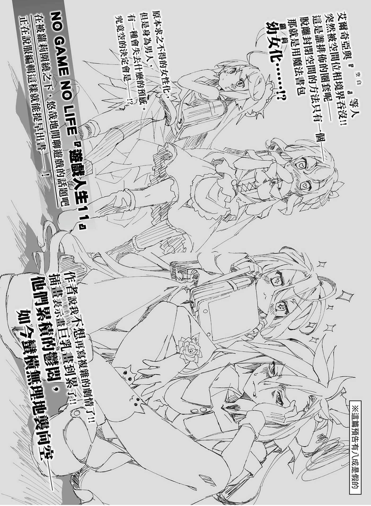

# 后记

> 来源：https://www.linovelib.com/novel/9/2138.html

许久不见了，我是榎宫佑。

距离上一集——实用的战争游戏已有一年一个月㊟。

编注：以下皆指本书于日本出版时的情况。

如果从第九集算起，则是几乎长达一年半的延期发售。

在此我要向读者及各相关人员致上深深的歉意。

——我这样写，责任编辑接下来一定会说：

「……这样的文章我在第七集后记好像也看过，会是我的错觉吗……」

是，我想你一定会这么说吧，我也早知道你会这样说。

当然，原稿迟迟无法完成，使得发售日延期，这百分之百是我的错。

我也心知与我辩解的余地相比，用来形容鱼很多的『』，这个怪字的空白都还比较宽广，也就是我完全没有辩解的余地。尽管如此，我还是要说——

——不然我要写什么才好呢！？（恼羞）

嘴上说说，要怎么说都行是吧！？毕竟这里甚至不是用说的，而是书面文章嘛！？

所以呢！？就算我毕恭毕敬，写了一堆庄严隆重的道歉言词，但是我要如何让大家相信，其实我内心并没有觉得很烦呢！？

读者得知原由就会谅解吗？就算道歉又能满足什么呢！？

对于一次又一次的延期，却仍愿意等待的读者，我能做的事只有——

写出一本好作品，让读者觉得——『等待有价值』。

以及祈祷作品能令读者们满意而已。

…………

「……听起来很像一回事，我差点就认同了，但这并不能成为忽视你拖稿的理由哦？」

————啊，呃～……那个～去年不是有剧场版上映吗？

就是跟本集同月发售DVD与蓝光的『游戏人生 零』。

因为那部作品……实在太棒了……

下一集我会更早完稿的，请务必支持……那、那么再会——啊啊！！

对不起，非常抱歉，同样是同月发售的漫画版第二集也请多关照！

那个～……我想我也不能输，所以——

「简单说，就只是你擅自提高门槛，让自己陷入低潮而已吧！！」

「看你行云流水的宣传，身为责任编辑应该帮你加分，啊，请继续说。」

