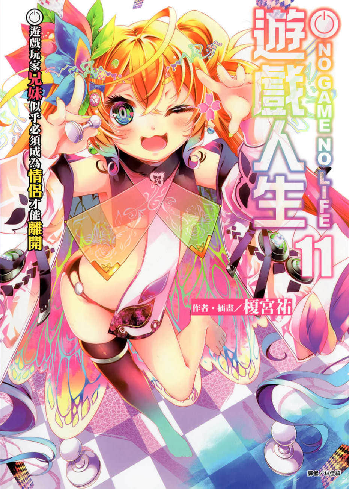
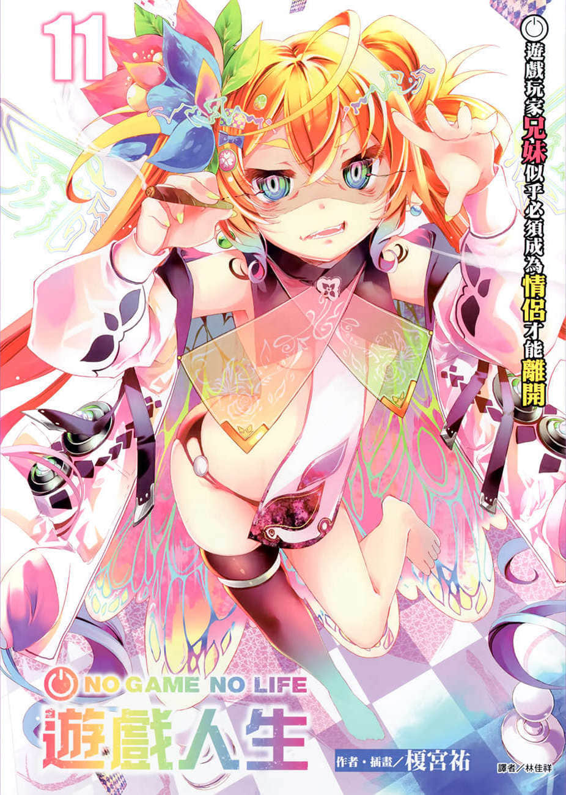
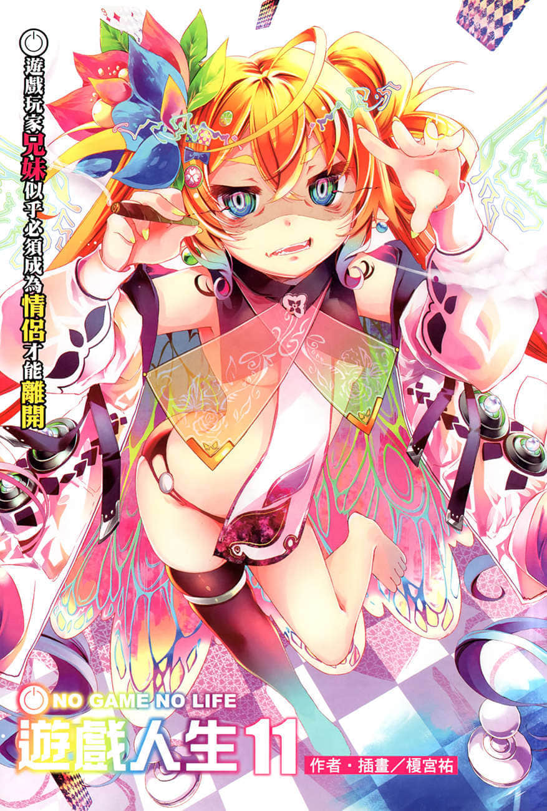
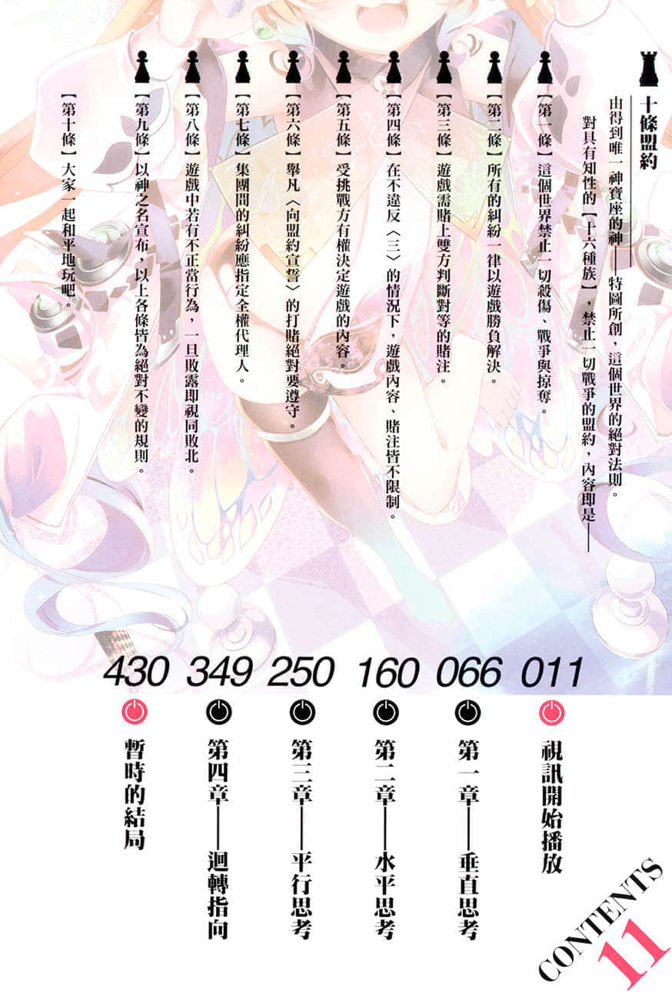

# 插图

> 来源：https://www.linovelib.com/novel/9/162152.html

台版 转自 轻之国度

作者：榎宫祐

插画：榎宫祐

译者：林佳祥

扫图：花椰菜

录入：轻之国度录入组

修图：零食

轻之国度 www.lightnovel.cn

仅供个人学习交流使用，禁作商业用途

下载后请在24小时内删除，LK不负担任何责任

请体谅图源、录入、校对的辛勤劳动，不可修改文本档，转载请务必保留资讯

本文特别严禁转载至轻小说文库

────────

简介：

这一回的直播内容，是目前『棋盘上的世界』最夯的五人情感发展是也！

这里是一切凭游戏决定的世界【迪司博德】。有一天，空与白、史蒂芙、吉普莉尔、依蜜尔爱因突然在陌生的房间里醒来。一行人完全没有之前的记忆，正陷入混乱的时候，出现在他们面前的是位阶序列第九位的『妖精种』佛耶妮可兰！

「大家注意！现在要开始老娘个人的直播企划『不成为情侣就永远出不去的空间』，敬请收看是也✿」

异世界网路直播突然开播！空是否能够战胜世界的命运（没女人缘），从四位女主角当中找到自己的真命天女！？

「不对啊！再这样下去这四人肯定会凑成两组百合情侣，只有我一个沦为边缘人！」

面对注定败北的命运，空只能痛哭流涕！？白等人的恋情又将何去何从！？超人气异世界奇幻钜作，第11集！！

