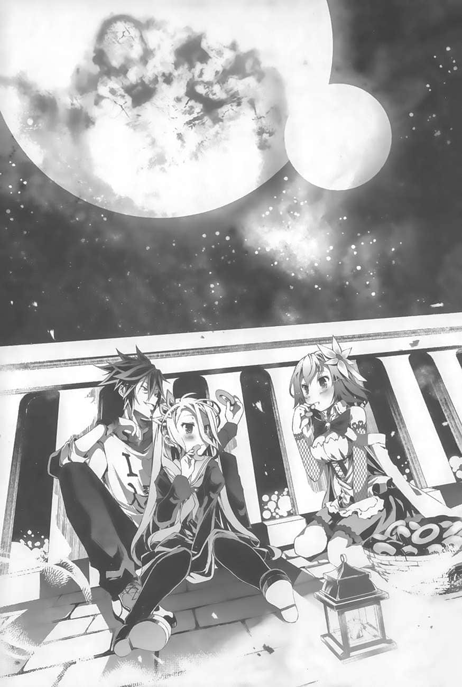

# 视讯开始播放

> 来源：https://www.linovelib.com/novel/9/163397.html

听说，初恋总是在结束之后，才察觉初恋曾经来过。

那么，我是否永远没机会察觉初恋了呢？──少女是这么想的。

这段恋情，永远无法知道是从何时开始的。但是，即使如此──

至少，我知道它永远不会结束。

────…………

──这段恋情究竟是从什么时候开始的，少女并不记得。

她只知道，应该不是跟他第一次见面的那个瞬间。

她觉得应该更早，或许是从诞生的那一瞬间，或者是更久之前。

她甚至无法想起，喜欢上他之前的自己，究竟是怎么呼吸的。

为了看到他的面容──除此之外，少女想不到其他早上醒来的动机。

想要让他欢笑──除此之外，少女没有理由笑。

想要感受那臂弯的温暖──除此之外，少女没有理由睡眠。没有任何理由……

没有他的时候，以前的自己到底是什么样子？少女无法想起，甚至无法想像。

因此，少女认为自己诞生在这个世界上的目的，肯定是为了与他相遇。

在与他相遇之前，自己都还不算真正地诞生在这个世界上。

因此，这段恋情结束之时，同时也是自己命尽的时候──或多或少，少女的心里是这么相信的。

或者是……某一天，少女这么想。

即使自己死了……说不定也会为了去见他而转世投胎。

既然这样，有没有可能我其实已经怀着这样的想法，死过了一次？

似乎有道理。如果我是在前世爱上他的，也难怪现在想不起来。

「是。也就是说，她们真正的目的是在您身边随侍的权利，主人。」

空仍然无法理解。吉普莉尔满脸笑容地解释给他听。

---

□□□

……看起来似乎只是在玩扑克牌……？

不过，吉普莉尔却以有如演戏般的夸张语调，滔滔不绝地说了起来。

「……哥，你就是这样……才会一直都是……处男……」

──这么说，好像也……没错？

既然这样，是不是该让她们所有人都回故乡去呢？空这么想，但是──

「当人类种面对无法对抗的强敌、每个人都放弃抵抗的时候，只有您无畏无惧地果敢挑战，总是能以智略降服敌人，最后甚至让神灵种（神）臣服。还实现了『跨越种族隔阂的共荣』这种谁都不敢梦想的事。您的丰功伟业具体证实了人类种拥有无限可能的事实。简直是活生生的传说，最新的神话！！以上，这就是我对主人您的审视。」

这……

「更何况，即使没有这些要素，主人现在的地位是一国之王，这是毋庸置疑的事实。无论个人的人品如何，女子为了您的财富与权力而接近您，也是理所当然的事。」

因为，这段恋情必定不会结束，即使是到死之后……

---

■■■

「白小姐想说的是，落败才是这些女子真正的目的，主人♪」

「主人，您这么说就不对了。您应该好好地审视自己。」

审视自己吗……

来自坐在大腿上的妹妹的震撼性指教，让空以光速被定位为昏君。

「……唔，不管怎么说，最近的情况真的不太对劲……」

面对那个敌人，这一天，白先是「呼」地轻笑一声，然后……静静地爆怒了。

其中一人是个黑发黑眼珠的青年，身上穿的T恤上印着『I❤人类』的字样。他是空。

「首先，主人您是拯救了这人类种最后国度──艾尔奇亚的『英雄』。」

「……真不愧是吾王，果然高明。小女子心服口服。」

──如果她赢了这场游戏，某伯爵家的地位将得以提升，并且成为新领地的边境伯爵。

坐在如此勤劳的两位国王对面的，是他们今天的对战对手──某伯爵千金。

落败的伯爵千金起身的同时这么说道，并且优雅地捏起裙子，深深一鞠躬。

五人同时凝视着那扇『门』。那扇『门』相当巨大，而且，上面还这么写道……

「……奉父母之命而成为仙人跳的工具，这种事还真让人不愉快……」

这即是这场对决的赌注内容。不过……

这里是任何事都透过游戏裁决的世界──『棋盘上的世界（迪司博德）』。在这样的世界，一国之王正在玩游戏。

──原、原来如此，这么说好像也是。

那一天，少女──白，正站在某一扇『门』之前。

先前还不在场的声音这么插嘴道。听起来是声调华美的女性嗓音。

「您从异世界降临到这『棋盘上的世界（迪司博德）』，凭人类的血肉之躯破解了森精种间谍的魔法，成为了国王……如果没有主人，人类种可能早就灭亡了。」

既然这样，我果然永远没有机会察觉初恋的到来。

连『哈』这个用法都出来了，真是老旧。

虽然不管怎么看都只是在玩，但是这无疑是很高尚的劳动。不管谁来看，事实很明显地都是如此。

艾尔奇亚的文明水准顶多只有十五世纪初的程度，当然没有抗生素了。

「那么，容我再问主人一次。主人，您为何认为自己不受欢迎？」

只要把『实际上是个沟通障碍处男的故事』这个部分掩盖起来的话，完全就是一桩英雄传奇。

这里早已不见当初濒临灭亡的惨状。相反地，成了人来人往、朝气十足的王都。

「今后，小女子就遵照誓约，以『侍女』的身分服侍您。」

说是贵族的政治婚姻，听起来确实是不好听；但是，以职业与经济能力等条件来估量结婚对象，即使在平民之间也是理所当然的事，其实也没有批评的必要。

艾尔奇亚王国的首都──艾尔奇亚。

──以前的某一天，她曾经想过这种事。自那之后，不知道又过了多久。

……是没错啦……

那『某个存在』什么话不说，偏偏说白与哥哥不是情侣。不只如此，还打算让哥哥与自己以外的人成为情侣。

……原来是这么一回事。空这么想，同时皱起眉头。

不过，他们现在竟然在工作。

「好，是我赢了。抱歉啦，想当我的对手，下辈子再说吧♪」

这真是太奇怪了。这些千金小姐失去了争取新领地权利的机会，还被迫穿上女仆装在城里倒茶。但是，穿着过膝长袜的她们却反而兴奋地握拳大喊「好耶！！」，这到底是为什么……？

如果输了，就必须遵从宰相的政策，以侍女的身分在王宫服务。

也就是说，门后的『敌人（某个存在）』正企图终止这段即使是死亡也无法终止的恋情。

但是，如果对方提出的要求是『跟国王直接有关的事』，当然就得由国王亲自面对了。

──没错，竟然在工作……真的吗？

除了她之外，在场的当然还有她的哥哥。不知道为什么，还有另外三个多余的人。

「而且您一坐上王位，就马上运用异世界的知识平定了艾尔奇亚！！轻易地降服了身为天翼种的我！接着降服了世界第三大国──东部联合并夺回领土更进一步阻止了奥仙德的奸计！！最后还降服了神灵种与机凯种而且──这一切过程中，完全没有让任何人流一滴血！」

「偶尔忧国忧民是我永远无法摆脱处男之身的原因吗！？既然如此，这种国家应该立即灭亡才对！」

无论实际上的情况如何，只看结果的话，要像吉普莉尔那样理解好像也不是不行，或许吧？

也就是说，这扇门里面有『某个存在』。

空随性地翻开他手上的五张牌，这么说道。他很明显地出了老千，却巧妙地隐瞒，完全没有被任何人发现。获胜之后还不忘出言挑衅。这一切都是再自然不过的劳动行为。

「该不会流行着什么奇怪的感冒吧？我可不希望连来到异世界都还要面对可怕的传染病喔。」

「吉普莉尔，我看妳还是不懂人类。我这种人哪有什么好喜欢的？」

另一人坐在空的大腿上，是个有着一头白色长发、一对红宝石色眼珠的少女，她是白。

由于艾尔奇亚获取了新的领地，国土范围急速扩张，同时也因此得到了新的资源与稀少物产。为了争取相关权利，贪财的家伙们……应该说是诸侯们纷纷上王城来陈情。这种事务平常都是由宰相出面应对的。

……这倒是……

──『不成为情侣就出不去的空间』……

上门挑战的不是诸侯当家本人，而是由当家的千金代理──这种情况已经是第五次了。

有必要的话，或许该联合整个艾尔奇亚联邦商讨对策──空是这样想的，但是──

「……什么？落败才是真正的目的？」

看起来不但一点都不懊悔，反而还很兴奋的样子，红着脸颊开开心心地离去……

「主人何出此言？对她们来说，这是求之不得的结果。」

空心里这么想，眼光空洞地凝望远方。这时候──

这位伯爵千金，今后就是侍女见习生E了。望着她离去的背影，空不解地这么喃喃自语。

借着落败的代价，让自己的女儿留在国王身边，让她们用美貌与魅力色诱空。比起在游戏中获胜，诸侯们认为这种方式更有机会捞到好处，顺利的话，还能让自己的女儿坐上王妃宝座。

而且这些千金们输了游戏之后的反应全都很不对劲。

……原来如此，经过如此修饰之后，听起来确实是很帅气。

处男、沟通障碍、没有学历、没有工作经验、没交过女朋友，整天只会宅在家玩游戏，形同废人。

耸立于王都中央的王城谈话室内，目前有三道人影正围着一张圆桌。

对这些贵族们来说，这是布局政治婚姻的常见手段。但是──

「于是，在您的英明领导下，艾尔奇亚就从一个濒临灭亡的国家，扩大为由复数种族组成的艾尔奇亚『联邦』，规模足以匹敌当今世界最大国──爱尔文•加尔得。」

「……这、这个嘛……白小姐，吉普莉尔是这么说的，妳觉得如何？」

「虽然我对人类的情感还很陌生，但是就连我也看得出来，她们都很『哈』您喔，主人。这是很明显的♡」

这两人是艾尔奇亚之王。他们备受民众爱戴，被冠上『放荡王』、『不在家王』、『不劳动王』等无数的称号。

同时，一名少女的身影自什么都没有的空间中浮现。眼珠子上有十字架图形的她，是天翼种的吉普莉尔。

「…………客观上来说？」

「……嗯？为什么？」

「主人这样的人物，客观上来说哪有不受异性喜爱的要素？」

一旦爆发传染病，国家很可能直接面临灭亡危机。不只如此，空与白本身也会有危险。

不过，空认为这是绝对不可能的。他叹了一口气。

这种只有耻辱的生涯有什么好审视的？

但是──

她说的好像没错。冷静想想，事实应该是她说的那样……吧？

但是，即使如此，面对这种与个人的直觉相反的答案，空还是忍不住将眼光朝下，征求白的意见。

坐在空大腿上的白还是一脸不悦的样子。

「…………嗯，最近，哥……有点、太受欢迎了……」

这也是她一直不高兴的理由。而如此肯定的答案自白的口中说出，让空感觉非常震撼，仿佛脑袋被敲了一下。

这么说完全没错嘛！！

冷静想想──我可是国王耶！

而且还是人类种之王，是救国英雄喔！

这样都不受欢迎的话，还有什么人会受欢迎呢！？

追根究柢来说──这是任何事都凭游戏裁决的世界。

在这个【棋盘上的世界（迪司博德）】，一切的武力都被禁止。任何事都以游戏决定。在这样的世界，游戏方面的卓越能力，不就是唯一被允许的『绝对武力』吗！？

人类最强的男人──当然是人类女子心目中最景仰的对象了，这是当然的吧！

「不只，主人。请容我指正，您这么说就太谦虚了。」

空似乎在不知不觉中把内心话说出口了。于是吉普莉尔严正地订正了他的话。

「主人您确实是『人类种最强』的存在。但是，却不只是『仅限于人类种当中』最强的存在。」

妳说……什么……？

「主人不但折服了身为天翼种的我，而且也击退了森精种。其他还有兽人种、海栖种、吸血种、神灵种，就连机凯种也拜倒在您的神威之下。这些事实即可证明您拥有的武力远超过『人类种最强』的定义。」

─、也就是说，怎样？妳该不会是想说我……

「妳的意思是说……不只是全人类的女性，就连女天使、女森精族、兽耳女孩、小美人鱼、吸血鬼少女……甚至连小女神与机械少女，都要屈服于我的武力（魅力）！？是吗？」

这真是太惊人了……那我岂不是人类史上最受欢迎的男人吗？不，不只人类！

然后──她冷静地、沉着地，深深叹一口气，接着开口：

那似乎是某物碎裂的声响。同时，世界也开始褪色。

「而且都不工作，每天只知关在城堡里，完全不肯在民众面前露脸的放荡王，怎么会以为自己会受女生欢迎？别只顾着做荒唐的美梦，至少做好自己的工作吧。」

咦？史蒂芙到底在说什么？完全不明白她的意思。

男人之所以赌命战斗、之所以追求财富与名誉───之所以活着，就是因为想受女性欢迎！

很好、很好，真是个惹人怜爱的家伙。放心吧，全都包在我空霸王身上。我会好好照顾妳们每一个──

空缩在被窝里，听着史蒂芙在门外敲着门如此喊道。

──后宫，也就是一国之王让妻妾与情妇居住的宫殿。

「……你差不多该醒醒了吧？」

既然这样，空究竟要怎么做才能受女性欢迎呢？答案很明确──

听着这早已熟悉、来自现实的呼唤声，空费劲地挤出沙哑的声音回应道：

一进办公室，空马上对着坐在办公桌前低头写字的红发少女这么说道。气势如虹的他，背后仿佛浮现了少年漫画般的拟音字。

「呼噜……」

在逐渐清醒的意识之中，空竟然──微笑了。

因为，就连在梦中也无法享受后宫的滋味──不，这并不是他哭泣的原因。

「这是我听说过最莫名其妙的理由！既然你在里面，就快点给我起床、快点出来！」

「……我就、准吧……哥，恭喜你……摆脱处男之身。」

但是，这个男人依然还是处男王，面对吉普莉尔的提议，他还是退缩地垂下了视线。

「白啊……哥哥我就这样在被窝里化为枯骨算了，可以吧……？」

──不，住口……别再继续说下去了……！

她又说了一句，于是又响起了碎裂声。

「……既然知道自己一辈子都不受女性欢迎了，那为什么……为什么早上还要起床？既然知道前方等着自己的只有绝对不受回报的痛苦，为什么还要活着？唉唉……我已经累了……」

「事情就是这样，主人。接着，在以上这个前提之下，吉普莉尔我有个提议。」

那是──美梦逐渐破碎的声响。

不受欢迎的现实让我疲倦。

真要说的话，我跟白怎么可能会认真工作？光是看到这里就该知道这是一场梦了。

──没错，我早就察觉了……这是一场梦。

而是他在梦中被迫发现了不想面对的事实。

从生物学的角度来说，就是彰显自己身为卓越个体的事实，与有魅力的异性结合、繁衍。说得直白一点，男人之所以努力，只是因为自己觉得那样很帅气。

──那是『不可能』的……

────？

拥有这样的权力与地位，空却还是不受女性欢迎，也是不折不扣的现实。

于是，空以光速进入了得寸进尺的状态。吉普莉尔也理所当然地跪下，向他开口说道：

──劈啦，又一声。

没错──空是个处男。

原来，有史以来『最大最高等的万人迷之王』早就已经诞生了吗！？

──人究竟为何而活？

空抱着在一旁睡得正香甜的妹妹，流下这辈子最后的泪水。

最后，破碎声响终于被喀喀的崩毁声取代。

我、我可是……人类最强的……游戏玩家……

「更何况，空是不可能受欢迎的，不是吗？」

但是，结果却出乎意料之外。想不到白内心虽然纠结，最后却还是竖起了大拇指。

──为、为什么啊？

骇人的破碎声响起──空终于明白，那是自己的心破碎的声响。

坐在大腿上的白望着空的眼光更是冰冷得冻人。这让空紧张地绷紧了全身，等待她的发言。

「喔……？妳说妳对我这万人迷之王有提议，是吗？好吧，朕特准妳开口，不妨说来听听。」

空渐渐地从梦中醒来，同时心想──

还是不好吧……做到这个地步，就太夸张了。

于是，空鼓足所有的力气，用哭肿的声带朝着门的另一头这么说道：

……既然是梦的话，至少让我做点色色的事再醒来嘛……

「……………………呃？咦？」

唉唉，不只是在梦中，就连在现实里，史蒂芙今天也一样来吵醒我，逼我工作。

「是没错。但是，那也是因为有白在，你才称得上是人类最强。至于你个人嘛──」

这个男人，似乎在不知不觉间成了万人迷之王。

「……你应该已经察觉了吧？这是梦。」

这时候，艾尔奇亚的宰相──史蒂芬妮•多拉，慢慢地、缓慢地转过头来。

「最近收为侍女的那五人……别让她们当侍女了，不如让她们加入您的『后宫』，您觉得如何？」

---

■■■

这是真的。更重要的是，他是一国（艾尔奇亚）之『王』，这也是不争的事实。

说到这里，史蒂芙的声音突然急速远去。

为了掩盖史蒂芙的话语，空费劲地大声叫喊。

…………可、可是……

……那么，如果那是绝对不可能实现的事，那该怎么办？

别、别再说了……够了！！

「看她们的表情就知道，她们是绝对不会拒绝这个提议的。相反地，应该会很乐意加入后宫吧。到时候，请务必也让我加入您的后宫❤」

「史蒂芙啊啊啊啊啊啊现在马上建立后宫！我要成为后宫王！！」

哼哼，我知道了。史蒂芙也想加入我这最强王的后宫，对吧？

也就是为了让女生对自己呼喊「好帅喔❤」，并且用变成爱心形状的双眼望着自己。

也就是真正的『一夫多妻』的那种后宫。

「男人活在世上的理由……简单来说就是为了受女性欢迎……」

听着自己的心灵崩毁的声响，空只能无奈地哀叹……

不，应该说，至少在梦里让我做点美梦吧……

──劈啪、劈啪。

连在梦中受欢迎的权利都没有，这样的人生令我疲乏。

──梦醒之后，空哭了。

或许，这是空心碎的声响。

这种事，空不知道已经想过几万次了。

「只有一个人的话，别说玩游戏了，就连说话跟走路都没办法，连婴儿都不如。」

他确实是个足不出户的茧居族，成天游手好闲的废人。

然后，空闭上双眼。

「…………嗯……如果都是『妾』的话，自然就不是正宫……是吧？」

「空～～！！白～～！！你们在里面吧！？还在睡吗！？」

面对这高尚的疑问，至少各位男士的心里都有个明确的答案才对。

「我完全听不懂你在胡说八道些什么！！废话少说，快点给我醒来！！出来！！现在发生异常状况了！！我们───被困住了！！」

史蒂芙这么吼道，并且开始粗暴地踹起了门。空不想理她，又缩进了被窝之中。

心动不如马上行动，空将白抱在腋下，有如飞箭一般冲进了办公室。

但是……有什么关系呢？即使只是梦……

没错……我、累了……

「……反正我不受欢迎啦，不想起床了……」

无论男人怎么赌命奋战、争取财富与名誉，也无法让女生用变成爱心形状的眼睛望着自己──永远不受女性欢迎，永远交不到女朋友的话，那会怎么样？

「满口谎言的骗徒、诈欺犯。平时总是表现出傲慢的倔强模样，对自己却一点点信心都没有。满口说想要受女生欢迎，但是面对他人的好感却总是不知该如何是好，只能逃避。虽然想要女朋友，却无法区分自己想要的究竟是性欲还是爱情，甚至不知道自己真的想要的是什么。狡猾、卑鄙而自卑，人格残缺不全。空，你就是这样的人。」

他将脸埋在枕头内，哭得全身使不上力。

但是，就如同梦中的吉普莉尔说过的，即使如此，他还是人类种最强的游戏玩家之半身，

史蒂芙这么说的同时，耳边立即响起「劈啪」一声。

「非常抱歉，主人，空间转移与魔法似乎都失灵了……」

「【补充】目前所在地不明。包括疑似是出口的门，所有建筑物都无法破坏。同时也未发现任何可供摄取的饮水与食物。【结论】主人与各位正面临严重的生命危险。真的很不妙。」

在史蒂芙之后，又有两道声音陆续说明了状况。空与白听了，这时才总算从被窝里起身。

────…………什么？

「…………咦？这是什么地方？」

好不容易挣脱床铺的诱惑，空终于带着白出了房间。

他发现这里并不是艾尔奇亚王城的城内，也不是空与白位于城内的住处。

那是一个完全陌生的房间。现场除了史蒂芙以外，还有另外两个人。分别是顶着光环的天翼种少女───吉普莉尔，以及有着一头菖蒲花色头发的机凯种少女──依蜜尔爱因。

据她们所说，在这里似乎无法使用空间转移与魔法，也无法破坏建筑物。

这些情报听起来实在令人担忧。这时候，史蒂芙又忧心忡忡地继续说道：

「看来空果然也不知道这是怎么一回事……我们所有人都一样，一回过神来就发现自己躺在陌生的房间里。这里……究竟是什么地方？应该说，为什么我们会在这里？」

也就是说，空与白、史蒂芙、吉普莉尔与依蜜尔爱因，五个人都同样在陌生的房间醒来，而且完全不知道自己为何会在这里……

既然无法使用魔法，五人等于是被困在无法自行逃脱的密室，而且这里没有食物。

正如史蒂芙刚才所说的，这完全是异常状况。空冷静下来，仔细観察周遭。

不管怎么看，这房间还是很陌生。房间的装潢风格有一点俏丽。

由于房间里没有任何窗户，无法从室外的景色判断自己目前所在的地点。

房间中央像是意思一下地摆着一张桌子与沙发，还有五张椅子。

另外，还有四扇小门，以及一扇大门。这个空间里有的，就只有这些。

四道小门的背后分别是空与白、以及另外三个人各自醒来的房间。

既然这样，出口必定就是那扇大门了。空这么想，不发一语地走向大门。

「请、请等一下！问题根本就不在这里吧！？」

正当空的脑袋被欲望占满，举棋不定的时候，史蒂芙慌张地大声叫道。

──呼……看来我的第一个女朋友是依蜜尔爱因，也不赖。

「我就是在提出解决这个问题的方法啊。只要我跟主人成为情侣，那必然地白小姐跟小多妳就是一对。至于最后一个人──在这之中真的要『割舍某一个人』的话，当然非这破铜烂铁莫属了。应该让这产业废弃物正式地被废弃，那就成啦。」

「【整理】情侣成立是脱离该空间的唯一条件。本机喜欢主人。好喜欢，最喜欢了。爱您。嘿嘿嘿。接下来，只要主人开口发出『我也是』这三个字，这样情侣就成立了，即可脱离该空间。来吧，主人，跟着我重复，『我•也•是』。」

要比喻的话，就是吃遍了各种精致美食之后，最后喜欢的还是味噌汤。

────────唔？

---

■■■

couple这个词，辞典上的解释是『一对、一组，主要是指两者之间有恋爱关系的恋人或是夫妇』。

正当空差点要被依蜜尔爱因牵着鼻子走而答应的时候，吉普莉尔靠在他的左臂上这么说道，仿佛要将即将倾斜的天平拉回来似的。

从厨艺到缝纫等家事她都做得来，是个富有家庭魅力的女性。

空与白虽然也明显是两人一组，但是现在既然出不去，那么这里的couple指的就应该不是两人组的关系吧。

「【反驳】不懂人情世故的天翼种，无法提供让主人满意的服务。」

反向旗子都立好了，条件也都凑齐了，幸福的胜利（接吻）就在眼前啦！

不过，这也是当然的吧。

听着如此甜美的呢喃，空的脸上浮现的是男人真的图谋不轨时的表情。

她不会像依蜜尔爱因那样主动服侍我，而是乐意地满足我所有的要求──这种不由分说的包容力确实值得期待。结果到底会怎样呢？

──最先采取行动的是她。就某个角度来说，是空预料中的结果。

不过，只要『十条盟约』的限制还在，对方应该无法单方面地掳人、监禁、甚至消除记忆才对。

连一瞬间都没交过女朋友的处男，跟虽然一下子就分手但还是有交过女朋友的处男，两者之间的现充度乃是天壤之别，这是很明显的事实！！

那是因为──『0无论乘以多少，结果还是0』，一定是这样一开始就是0的话，无论乘上财富还是名声，到头来还是无（0）。但是！

五人看着牌子──正确来说，是牌子上写的一排文字。是用人类语写的。上面写着──

很好，真是太好了。我的人生好像到现在才真的让我当了主角。

终于，空所期盼许久的发展来了！

──什么？你说反正到最后又是差一点要上垒的时候，事情就落幕了？

没有女朋友的期间=生存期间的现象，终于要划上句点了。对他来说，这是最具历史意义的事件！

……不过，空当然不敢太乐观──毕竟现在是异常状况。

另外，四个人也跟空一样过来看着这张牌子。

这里可是密室，不能做什么色色的事。话说回来，那些被关在不做色色的事就无法出去的房间里的人们，竟然真的有办法在明知被监视的状况下，做色色的事而毫不放在心上，真是太佩服了。正因为这样，所以他们才能当现充吗？总之，我打从一开始就没有奢望那种事！！

例外的情况只有『双方同意』。也就是说，目前这状况是在当事人同意的前提下发生的。

……大门没有门把，也没有钥匙孔。完全推不动，没有要开的样子。

换做平常的话，空这时候已经吓得畏缩了。但是现在却不同，他仍然维持着认真的表情，在心里仔细地衡量着。

哼哼，没关系，事到如今，我也没奢望到那个地步。

太爽啦！受欢迎的男人果然很辛苦呢～～～～！！

有着一头飘逸菖蒲花色头发、身穿女仆装的机械少女，依偎在空的右手臂上，然后开口。

「嗯？妳这个连被主人厌恶的事实都无法察觉的人工无能，刚才说了什么？」

说来说去，还是她最有女朋友的样子。

如果空在短短的一瞬之间有过女朋友的话，那就是『0•1』。有0•1的话，乘一乘到最后还是有机会大于1的！！

──唔，由吉普莉尔来当我的第一个女朋友吗……嗯，确实是没话说。

……太漫长了……苦等十八年，来到这个世界之后，过了这么久，终于等到了。

因为，眼前的大门上挂着一张牌子。

「什、什么啊！？我、我是说，现在的情况根本跟这件事无关吧！？」

「空！？怎么了，为什么突然哭了！？」

虽然她有点病娇倾向、而且是个废柴，还会单方面地把太沉重的爱强加于人，但是外观看来无疑是个美少女。而且还是可客制化的女仆型机器女孩，会叫我主人。好，就决定是妳了！

「我们有五个人，就算其中四人能凑成两组出去，那剩下的最后一人怎么办！？」

……你一定觉得这两者之间没什么不同吧？

────────咦！？原来妳们是在讨论这个吗！？

大家都没有这之前的记忆，而且被困在无法出去的密室里，生命也受到威胁。在这样的状态下，还被迫发展恋爱关系……

在空的耳中，史蒂芙的声音听起来有些遥远。沿着脸颊流下的，是感激现实的泪水。他刚才还打从心底诅咒着的现实。

当我从这里出去的时候，空的个人条件就会自动从「没交过女朋友的十八岁处男」升级成「有交过女朋友一瞬间的十八岁处男」！！

对于永远无法受女性欢迎而绝望的空，面对这种状况，当然要落下感动的泪水了。

上面写的文字，恐怕就是最大的问题所在──五人不约而同地这么想。

「还是说小多妳终于要承认对主人有意思了？❤」

「【明了】已经掌握状况。如此状况其实非常容易解决，小菜一碟。Einfach（简单）。」

我应该也不会一时失去理智，凭着兴致答应参加没有胜算的游戏才对……！！

──滴答……

这你就错了，两者之间完全不同！

既然这样──我就没什么好怕的了。

──……

既然这样，那肯定就是「恋人关系的两人一组」了。这是很明显的事实！

即使只是为了离开这里而在形式上假装是情侣，我也甘愿！！

「【驳回】名称不明女性多次否定自己对主人有好感，因此不予认可有权参与本问题的讨论。建议妳立即远离主人，走开。」

──『不成为情侣就出不去的空间』……

对战的对手与目的仍然不明──而这也是游戏本身的条件之一──这是一场可攻略的游戏。

来吧，让我看看，我值得纪念的第一个女朋友究竟是这之中的谁呢呢呢呢呢呢～～～～～呢！？

「你们先听我说啊！既然只有情侣才出得去的话──不就表示只有四个人能出去吗！？」

我应该不至于对自己不受异性欢迎的现实过度绝望，最后饥不择食地想说「只要交得到女朋友的话怎样都好！」而同意了这种游戏吧！

「【放弃】检测到号外个体的听觉异常。毕竟年纪大了，这也是没办法的事。真可怜。」

这种有如青梅竹马女主角一般的稳定感让空心动了。但是……

──没错，眼前这个状况无疑是一场『游戏』。

「──既然这样，主人，请让我当你的女朋友。」

除非我本身判断在这样的条件下一样有胜算，否则这个状况是不可能成立的。

而且，她虽然是美少女，但也不会美得太夸张。那种普通的感觉反而更好。

当然我也知道，明明是个臭处男，哪有资格对女生品头论足地选女朋友？

没错──这就是『不成为couple就永远出不去的空间』！！

「您没有必要选择那个没什么戏分的破铜烂铁，有我当您的奴婢就够了。从说早安的时间到翌日说早安的时间，我会像二十四小时营业的便利商店一样地，为主人提供任何您想要的服务❤」

──唔唔，果然还是该选史蒂芙当我的第一个女朋友吗？

「【否定】情侣的定义并不明确，推测至少一方要怀有恋爱情感。本机超级喜欢主人。因此本机与主人可以马上成为情侣。而妹妹小姐可以命令号外个体喜欢自己。也就是说，要死的必然是名称不明的女性，也就是妳。」

两个杀气腾腾的美少女隔着空，展开激烈的唇枪舌战。

如今被困在这『不成为情侣就出不去的空间』的，有四个女生；而男生只有空一个人！

也就是──全世界最认真（帅气）的表情。

──……

「总比脑袋有问题还要好──喔，抱歉，是我说错话了。妳连脑袋都没有吧？」

接下来听到的这句话，让他失控的思绪终于──停顿了。

空在0•1秒不到的时间之内想完这些事，接着以锐利的眼光望向女生们。

冷静想想，自称是我奴婢的吉普莉尔应该会特别包容我吧，甚至超过恋人该有的限度。

但是，这是特殊状况。没错，一切都是不得已的！！

空身为王者，而且还是人类最强游戏玩家的半身，为何不受女性欢迎？

「如果恋爱情感是条件的话，遵从盟约立下誓约来进行游戏就没事了。因此，没必要在乎破铜烂铁的废话。还是说，小多，妳以为连妳都知道的事，主人会没察觉吗？」

「【必然】『要割舍谁』是个无法回避的问题，因此主人才会流泪。」

「原、原来是这样吗……空，真的吗！？」

「────…………」

史蒂芙如此质问道。但是，空却无法回答。

不只是因为当下的气氛让他无法说『我并没有想到这种事』。

而是──他现在根本没心情顾及这种事，脑袋正在高速地猛转着。

慢着慢着慢着，这样一来状况可就完全不同了，十八岁处男空！快思考！

她们说的没错，照牌子上字面的意思，只能有四个人出去。

另外，理所当然地──同性也能凑成情侣！

──惨了惨了惨了惨了惨了惨了，这下真的惨了！！

既然这样，接下来事情会如何发展不是很明显了吗！？你看得出来吧，烂人杂碎十八岁处男空！？

「我不答应！如果妳们是在讨论要牺牲谁，我不参与这种讨论！！」

「【要求】请提出替代的脱逃方案。若无，则该由本机与主人结为情侣、离开这里之后寻找回来解救最后──人──也就是名称不明女性──的方法，这才是最合理的方案。」

「不妳们看看空那苦恼的表情！！他一定是在思考其他的方法！！」

史蒂芙，抱歉，我辜负了妳的期待。我并不是在想那种事。

当然，这也是非想不可的事，必须尽可能快点想出来才行。

但是，目前空还有更应优先思考的事。他正全速转动着脑袋思索着。

──再这样下去，结果究竟会如何？

空一定能交到女朋友、一定出得去吗？这个预测恐怕该修正了。

「虽然我是个连恋爱情感都不明白的拙劣奴婢……不过既然白小姐允许我抵抗，那我会倾尽全力对抗您。恳请赐教。」

这也难怪，因为那是一扇拉门。

花朵上，有个年幼的少女正在飞舞，舞动着一对仿如用彩虹组成的小巧翅膀。

应该说是──『根绝宣言』。

由花朵编成的『门』挂着一张豪华的牌子，上面写的一样是那些字。

──小学的时候，老师要求全班各自跟好朋友两人凑成一组。这种经验，对空来说是心理阴影。

「……输的人……必须『永远抛弃对空（哥）的一切感情』……必须讨厌哥……之后再决定……跟某人成为情侣……那不就好了吗……？」

看起来就像个仿造美丽少女的外貌做成的人偶，因为得到生命而动了起来，充满神秘的魅力。

不过──

现在就来分清楚，看看谁是真正的女主角。

──天翼种与机凯种，这个世界两大强得夸张的种族，竟然会紧张得立即采取备战态势，这代表什么？

到目前为止一直低着头、不发一语的白，终于说了话。

那扇大门无论怎么推、怎么敲都打不开。

外面是一座小小的庭园，众人所处的地点正是庭园深处。

「【紧急】确认第三种危险种族的存在。请主人立即拟定战略。非常不妙。」

「……说的没错。主人是不可能会答应牺牲某人的。我竟然有如此愚昧的想法，真是不可原谅……」

没错，这是不可能的。

在空的背后僵住了身子的吉普莉尔与依蜜尔爱因紧张地叫道，同时表现出强烈的敌意。

──『不成为情侣就出不去的空间』……

「我、我根本就连可以抛弃的感情都没有耶！」

在三人的包围与逼迫下，史蒂芙转而向空求助，要求他解决这混乱至极的状况。但是──

「……什么跟什么啊……这是瞧不起人吗？」

──碰！！

「………………是我的错觉吗？我开始觉得空根本没察觉了。」

但是对白来说，被别人指称自己与哥哥『并不是情侣』的时候，她早就气炸了。

───这正是个好机会。

「这种状况……我怎么可能会同意！！不是吗！？」

依蜜尔爱因与吉普莉尔都怀抱必死的决心，斗志十分高昂，全身散发足以撼动大气的强烈斗气。

她的头上有花朵装饰，柠檬色的头发绑成两条。莱姆色眼珠茫然地注视着虚空。修长的手脚、微微隆起的胸部、凹凸有致的腰线，这副模样就像还未成熟却含苞待放、带着一点妩媚的青春少女。

然后，白抬起头，那有如死神般的面容──转头了。

「主人！您没事吧！？这……！？」

原来如此，确实是『空间』……

「……所有、人……都给我住口……」

「我怎么可能会认可这种状况……竟然要『五个人各凑成两人一组』！？我怎么可能会答应这么残酷的事！！肯定还有其他规则存在！！喂，回答我啊！！」

史蒂芙也抱着必死的决心，如此大声地喊道。但是──

事后回想起来，空在这时候应该要更有危机感的。

「【反省】拒绝任一牺牲，才能得到真正的胜利。这才是主人的作风。本机非常惭愧。」

依蜜尔爱因板着一张脸，吉普莉尔笑容满面，白的脸上则是冷笑。

她的体型确实是很娇小，站在地上的话恐怕比幼儿还要矮。

她得到的回应，却是重击声响，一瞬间让现场恢复寂静。

但是，很遗憾地，这时候这个烂人杂碎十八岁处男没有心思想这种事。

白提议了一个游戏，以比自己的性命更为重要的『恋情』做为赌注。

不由分说的命令语调，让现场顿时一片鸦雀无声。

「既然没什么好失去的，那就没问题吧？小多，妳也宣誓吧❤」

「……各位……来玩、游戏吧。」

牌子上可没有说空等人刚才所在的房间就是该空间。

「可、可恶啊啊啊啊啊啊啊啊啊啊啊啊啊啊！！」

其他三个女性都是认真的，如她们所说的，绝不放过任何敌手。三人将史蒂芙团团包围。

──妖精种……原来如此。

原来是空使劲地揍了大门一拳，力道大得让人忍不住担心他的拳头。空的咆哮让其他人傻了眼。

白装出笑容，强忍著有如岩浆般沸腾翻滚的情绪，故作开朗地说道。

「……史蒂芙……这种无聊的闹剧……就别再继续演了……」

「【应战】本机的爱（心灵）面临剥夺。面对任何危害就必须应对，排除万难、不择手段也要消灭敌人，这是机凯种的本质。以上……拚上性命放马过来吧，本机绝对不会输。」

──当然，在场的任何人都无法推知白心里的想法。

但是，让众人说不出话的，并不是如此迷糊的误解，也不是这里的景色。而是──在花田的正中央，飘浮着一朵特别大的花。

空充满愤恨的呐喊声，让随时准备爆发冲突的美少女们恢复了冷静。

---

■■■

她们肯定会凑成两组百合情侣，让我一个人当单身狗！！

白究竟有什么打算？

她只是体型特别『小』而已。

「出去！！放我出去！！你到底是用了什么奸计把我们骗进来的！？」

看见眼前的光景，所有人都同样地──说不出话来。

这游戏的提议，同时也是对白以外的女性们的宣战──不，不是。

「【命令】既然这样，妳应该马上接受。根据本机的分析，潜在的最大威胁乃是名称不明女性。本机要趁这个机会在主人争夺战中排除所有敌手，一个都休想逃，登登、登登登～」

这时候……

而且，在刚才的议论中，更没有人提及『空与白成为情侣』的可能性。

空很清楚，自己绝对不可能同意这种状况！！

空发自内心地激动怒吼，要求理应存在的『游戏主办人』提示真相。

「……………………………哥………真是傻瓜。」

那就是──

空抱着姑且一试的心态将门往旁边推，于是门轻易地打开。空则是煞不住车，整个人摔了出去，脸重重地摔在门外的地上。

「空！？没事吧……咦……！？」

照理说，不经同意的话是不可能成立这种状况的。但是，即使如此。

唯有白一个人完全看透了哥哥的心思。为了回避她那冷漠的眼光，空悲痛地敲门、呐喊。

因为这种状况继续发展下去的话，结局肯定只有一个。

庭园的外围是枯树林与玫瑰花墙。鲜艳缤纷的花田中，有无数的花瓣纷飞。

春天的可爱花蕾、夏天的鲜嫩绿叶、秋天的成熟花朵、冬天的坚忍幼苗……

就让我在这里把妳们全数驱逐，一个都不留。

没有成为情侣就无法打开的门，竟然突然开启了，让空扑了个空，向外倒下。

不……那并不是什么『年幼』的少女。

我不可能会答应这种让一个人落单的状况。

空抬起头来发牢骚，但是说话声却愈来愈小。

其他的女性们虽然不知道白的心里是这么想的，但是她全身散发不由分说的『敌意』，仍然明显地传达了她的意图。女性们将如何反应？

哪有！？我可是打从一开始的0•001秒就察觉了！？

「──妖精种！？也就是说……莫非这里是空间位相境界──《洛园》的内部！？」

「这未免也太糊涂了吧！？这么多人，都没人试过用拉的……吗……？」

那不可能是人类。身形小巧而梦幻的少女，这样的外表无疑就像──

「空……！果然……！」

追着空出来的女性们也跟着倒抽了一口气。

这座庭园，仿佛是由自然界所有美好的东西拼凑而成的艺术品，就像优秀的艺术家巧妙地把各种美丽的自然景物拼凑在画布上一样，美得不自然。

「这……！空，快点阻止她们啊！」

但是，只要有『第六人』存在的话，一切的问题就能迎刃而解！！

眼前这外表怎么看都像妖精种的少女，肯定就是『这个游戏的主办人』！

她应该就是把我们困在这里的元凶。这个新角色同时也是这个空间的『领队老师』，命中注定要与我这被排挤的边缘人凑成一对的本集被害者（女主角），真是可怜！！

……话说回来，第一个交到的女朋友竟然是这种小巧的尺寸，感觉好像有点……

不对，区区处男哪有资格挑三拣四的？我完全OK啦！

嗨，小姑娘，妳好。妳就是我的partner吧，不容妳拒绝喔──！

空的脑中想着这么渣的事，但是他当然不会表现在脸上，依然维持着一副帅气严肃的表情。

虽然只是暂时的，但眼前的她是要成为空的『女朋友』的人物。

既然是第一次见面，对方肯定不会知道自己的内涵。

只要能搞好第一印象，说不定还能更进一步地『一亲芳泽』呢！！

这么好的机会，绝对不能错过。空的斗志高昂，眼光也充满热情。

但是，对于他的热情眼光、以及吉普莉尔与依蜜尔爱因浓得充满质量的敌意，妖精种少女却完全不以为意，只是一脸平静地在空中飞舞。

没错，她正在跳舞。

伸直的手指划过空中，脚下所踩的花瓣是她的舞台。

每当少女的脚踩过花瓣，那朵花便立即喷出无数的泡沫。

那并不是幻象特效。泡沫乘着风飞撒至庭园各处，每个泡沫破掉之后又生出新的花朵、树木、岩石、水泉，新的景色随着泡沫陆续诞生，甚至连天空的色彩也被改变。

虽然不明白其中的原理，但是空与白、甚至是史蒂芙也猜得到是怎么回事。

──这应该是妖精种的魔法。

那妖精轻盈曼妙地跳舞的同时，正在创造这小小的庭园。

最后，妖精种创造小天地的神迹似乎告了一个段落。

少女哇哇大叫地抛开烟蒂，一边打滚一边哀嚎。

不但播放了主题曲，还有非常多余的标语介绍了空等五人。

正当空在心里唉声叹气的时候，两道口气焦躁紧张的声音打断了他的思绪。

──看她的反应……莫非荧幕另一头的观众们的反应很热烈？

在克拉米的记忆中，这个种族似乎还被迫参与国家机密级的魔法协助……

第一个条件跟预料中的一样。两人必须以情侣的身分穿过庭园深处的那一道门。

「以上！！这次的直播内容是目前『棋盘上的世界（迪司博德）』最夯的五人的感情发展是也！！看到没？全都是大咖，很了不起吧！？怎样，脸颊有没有肿肿的！？痛不痛啊！？」

听到她说条件不只一个的时候，空等人都眯起眼睛，仔细地听她继续解说。

但是，吉普莉尔与依蜜尔爱因的紧张表情，依然让空、白与史蒂芙忍不住倒抽一口气。

才刚开始五秒钟就原形毕露。

但是，这时候佛耶妮可兰依然没有要理会五人的样子，继续洋洋得意地介绍。

「……主人，非常抱歉，我真的不知道应该如何是好。请给我指令……」

接着，她连忙熄灭香烟，干咳一声确认喉咙的状态。

被困在泡沫中的空这么吼叫道。但佛耶妮可兰却似乎没有听到，还是跟刚才一样，完全不顾现场其他人的反应，自顾自地解说她的企划主旨。

该任由她继续准备吗？还是应该在她开始游戏之前采取对策？

她终于表现出符合那可爱外貌的言行举止。

「【警告】目前搜寻不到在《洛园》内胜过妖精种的前例。无法推算出有意义的应对方式。」

看着她紧靠着『平面状的光（荧幕）』说话的样子，就知道了。

「第二就是购买『钥匙』，使用钥匙的话，即使是单独一人也能出去是也！！」

不顾众人惊慌的反应，妖精种少女突然展开了她的────

「呼──……啊？喔，看来你们是醒来了。呃～就是那个是也。你们再等一下是也。游戏的准备还没完成，老娘现在还没空理你们是也。」

关于这个种族，空与白也有最基本的了解。

「五人离开这里的方法有『两个』！！」

我刚才确实是说过不应该挑三拣四。但是，这样未免太不挑了吧？

「佛耶妮可兰频道主办的个人直播企划！！

妖精种的少女突然如此大叫，打断了空等人的思绪。

「当然，这里没有食物、也没有水是也！这五人生活所需的东西全都要靠各位观众的施舍──也就是『支援（课金）』是也！天翼种跟机凯种或许还好，但是其他三人要是没水喝的话，可是连三天都撑不过是也！各位观众，不想让你的偶像死翘翘的话请随时给予『支援（课金）』是也✿」

她以优雅的姿势在花瓣上坐下，肩膀些微起伏，喘一口气。

『等等！！妳应该先跟我们说明状况才对吧！！』

这个种族的大多数个体都是爱尔文•加尔得这个国家的奴隶，也就是森精种的奴隶。

然后，她终于开口了。她的声音美妙无比，仿佛听到的人都会马上爱上她。

「好耶！赶上了是也！那就马上开始吧！咳……呃、啊～开始是也！」

她正对着浮现在她面前的『平面状的光』说话。

说完，她张大嘴巴，喷出一口烟。接着继续说：

不会吧……我人生的第一个女朋友真的是这种全身烟酒味的熟女吗？

「大家好♪老娘为数甚少的频道订阅者们，大家好！老娘是佛耶妮可兰是也✿」

最后，更是把还没熄火的火柴随手一丢，完全一副理所当然的样子。

她说──

「──唔喔！？怎么了！？」

「第一！『认定彼此是情侣的两人』手牵着手穿越『门』！！

「啧，烦死了……为什么老娘非得干这么麻烦的事不可？该死是也。」

「是，主人。那正是位阶序列第九位──妖精种。绝对没错。」

由于眼前的妖精与印象中的实在相差太多，空忍不住这么说出了他的感想。

她的说明与空等人的认知差不多。既然这样，最令人在意的当然就是──

就算再怎么会幻想，我也无法想像自己跟这家伙成为情侣的样子……

不顾一旁看得目瞪口呆的空等人，妖精种少女熟练地从裙子的口袋里掏出香烟与火柴，以流畅无比的动作叼起香烟，点火。

「……哪是什么妖精……应该是偏乡酒店的妈妈桑吧……」

──【十六种族】位阶序列第九位──『妖精种』……

她以蹲马桶的姿势坐着，手撑着脸颊，一开口就是足以浇熄任何恋情的粗鲁言词。

---

■■■

而且她还是个可悲的『底端网红』。

但是，又能采取什么对策？现在能做些什么？

──不会吧，听起来太可怕了，真的不是开玩笑的。

这全身上下都是可爱要素的小巧少女正一脸不愉快地歪着头，瞪着空中。

就连她正在跳着的舞蹈，刚才看起来还很惹人怜爱；现在看起来却好像在偏远的剧场工作、为了生活不得不上工的老牌脱衣舞娘一样。这妖精全身上下的气质，像个尝遍人生辛酸、最后只能对人生绝望、怨天尤人的风尘大妈。

不，我要冷静。大战的时代已经过去了。应该不会发生那么可怕的事……应该吧。

天啊，预定成为我第一个女朋友的人竟然是个太妹。

后来，她终于想到可以用魔法熄火，于是连忙跳起了舞。她那副模样，让空与白、甚至是史蒂芙都翻了白眼。他们心想──『从各方面来说，一切都太糟蹋了』……

不过，现在这不是重点。

「这里是老娘所建构的《洛园》，现在有五名男女被困在这里是也！！这五个人从今天开始必须在这里共同生活、并且谈恋爱！而且『无时间限制、无期限』是也！！」

────────

空无法理解两人为何这么紧张，讶异地问道。两人不约而同地点头。

刚才这种演出，简直就像十八禁恋爱游戏的开头动划一样。

「哼哼哼✿『就这样吗？』、『反正妳佛耶妮可兰不过就这点能耐』之类的挑衅，也就只有现在写得出来是也！！你们最好先把脸皮练得厚一点，到时候被『打脸』才不会太疼是也！！接下来，令人在意的『五位』参加者究～竟是谁呢！？来吧，你们几个！尽情地说、尽管介绍你们自己是也！！」

「【纪录】曾在《洛园》内与妖精种交战过的四百三十七架旧欧鲁托连结体全数未归队。全灭。」

「如同之前的预告，今天要开始的是非常特别的直播企划……去你的！是哪个人渣在开播五秒就给老娘点低评价的！？小心老娘宰了你是也！啊，讨厌～开玩笑的啦～千万不要退订老娘的频道是也。世间的人渣就只有老娘一个人啦～啾啾啵啵✿」

──『钥匙』……？

「……咦？话说……妖精种真的是那么危险的种族吗？」

妖精种少女突然变了个人似的。

「是。在大战时，序列七位以下的种族中，妖精种可是唯一消灭了二位数天翼种个体的种族。」

『即时！来真的！恋爱纪录片～不成为情侣就永远出不去的空间～』是也✿」

少女这么宣告的同时，还响起了吵闹的拉炮与喇叭的音效。

「真是的，竟然要在这么短的时间内建构这么大的空间，怎么想都不是老娘一个人干得来的活吧……哇！好烫！啊、烫死了！烟灰掉到裙子上了是也！要、要烧焦了是也！水、哪里有水是也！？」

在突然响起的轻快背景音乐之中，自称是佛耶妮可兰的妖精种少女这么说道。但是，她说话的对象，并不是被困在泡沫中的空一行人。

当然就是脱离空间的条件。

──啊，竟然叼着香烟跳舞。而且她干嘛一直啧来啧去的？

「真的唷！真的唷！这次的特别企划真的真的很有意思是也！！标题就叫做──」

「…………吉普莉尔，我说……那就是妖精种……吗？」

突然，空等人被困在泡沫内，完全没有抵抗的余地。

下一个瞬间，空等人的身体被迫配合介绍主动摆出姿势。他们的意志完全无法抵抗。

虽然空完全不懂魔法，也没有任何关于妖精种的知识，但是，当下他马上就明白『现在是什么状况』了。

先前从未听闻过的情报，让空等人不解地皱起眉头。但是，妖精种少女依然不理会他们。

那个妖精种刚才说过，她正在准备游戏。

──不管怎么看都是在做『网路直播』。

「接下来就马上为各位观众解说这次企划的主旨是也！！」

还不时地拿饮料起来喝，那该不会是酒吧？

竟然还用等同于威胁的方式，要求观众使用线上直播的超○留言功能。

「以上，就是这样！！今天的第一回直播──也就是开头介绍就到此为止是也✿」

于是──

「明天起每天晚上八点准时开播是也！！好了，还不快去向你们的朋友宣传！！不准剪接、不准转载、全部都不准！！一定要诱导大家来频道观看是也！！那就先这样了，掰掰啰～✿」

一直到最后，妖精种少女还是没有给空等人发言的权利。

这场开播告知的直播，就这样不由分说地落幕了。

---

■■■

──困住五人的泡沫消失无踪。

但是他们还是说不出话来，只能茫然。

「哼哼哼……爽啦，频道订阅数这么快就开始增加了！太容易啦───！！果然还是找当红的人物来当来宾，才是最轻松的方法是也！～～啊～哈哈哈！！那些说我是底端网红的乡民应该已经哭晕在厕所了吧，废物！！超爽的啦～～！！」

佛耶妮可兰依然无视他们，自顾自地掏出香烟，得意地发出下流的大笑声。

虽然空说不出话来，但他还是预测得到，这种状况下肯定会发生放送事故的。

「……我说啊……妳应该没有忘记关掉麦克风跟镜头吧？」

「呀比呀比✿各•位•朋•友～请继续支持老娘的频道是也✿」

佛耶妮可兰以光速抛开香烟，装出可爱的样子打圆场。

然后，这次她总算记得关闭镜头等装置了。

「……唉唉，来不及，已经被批评得很厉害了喔……算了，也好。多被讨论一点比较容易促成话题吧？」

看着佛耶妮可兰擦着冷汗嘴硬的模样，空不禁按住了额头，同时开口问道：

「……呃，妳可以整理一下规则吗？也就是说……」

「嗯？就是刚才的开播告知直播时说的那样是也。」

佛耶妮可兰不解地斜着头，一副完全不认为自己少说明了什么的样子。

确实如她所说的，介面上多了一个陌生的图示。点进去一看，上面显示【15000】，同时显示了购买画面。

女性们各自满怀敌意，窥探着彼此的动静。但是，在空的眼中──

「老娘可是『主办人』。你们这些人来这里，就是要设法让老娘成为受欢迎的网红！你们该做的就是讨观众欢心，在这里尽情地谈情说爱，给老娘多赚一点『支援（课金）』进来就是了！老娘很期待你们的表现是也！！老娘在超级不远的将来一定是超人气直播网红！好了，老娘还有很多事要忙，先走啦！！掰！！」

面对这无可避免的结局，空只能悲痛地哭喊…………

听佛耶妮可兰这么说，空与白立刻取出自己的手机与平板电脑来查看。

「【了解】以主人的爱为赌注，一决胜负。容本机在此正式宣战。都给本机放马过来。」

「另外，在我的设定之下，空跟白的那叫什么『智慧型手机』跟『平板电脑』的东西……总之就是那些装置，会显示来自观众的捐款，也就是『支援（课金）』是也。」

自己必然会落单。

「────嗯，那么，先容我确认一件极为重要的事。」

佛耶妮可兰一口气说完之后，不等其他人开口就消失在空中。

这游戏确实是很单纯。但是，目前还存在着一个问题。

「啊？当然不可能了是也。你瞧不起老娘吗？」

这样就能解决『一定要牺牲一个人』这种不可能被空接受的前提了。

空非常肯定，最后一定会凑成两组百合情侣。

空好不容易下定决心提出疑问，佛耶妮可兰则是歪着头，不屑地回答。

那就是──

「结果还是要继续做这种事吗！？我还是觉得不太对劲耶！？」

然后，气氛逐渐变了起来。空仰望天空，脸上浮现笑容。

「这么快就有人给你们包红包啦。这就是『支援（课金）』是也✿你们可以用这个买东西是也。只要成为情侣，或者是用那些钱购买『钥匙』，你们就能离开这里。以上是也。这游戏很单纯吧？」

「再这样下去最后落单的肯定是我！我不要啊啊啊！让我出去啊啊啊啊！！」

没错，就是这样。只是，单纯地说，也就是说──

这个问题的答案，关系到这个游戏究竟是天堂还是地狱。

也就是说……有四人可以凑成两组情侣。

听佛耶妮可兰这么解说之后，空先是深呼吸一次，然后──

被留下的一行人不知所措，茫然地呆站了五分钟。

女性们又开始互相牵制了起来。

最后一个人可以用『钥匙』离开这里。

以『永远讨厌空』为代价的游戏即将开始。

…………

「……那……我们继续谈正事……吧？」

「能够全力挑战白小姐，真是无上的殊荣。让我们堂堂正正地对决吧。」

「既然说是我们五人的话，那么──呃、我是说，可以跟妳成为情侣吗？」
