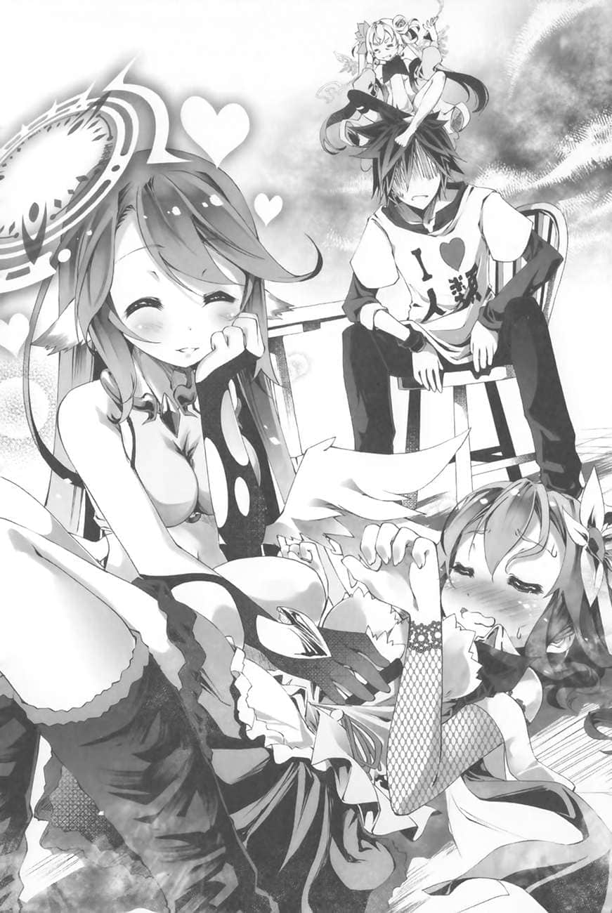
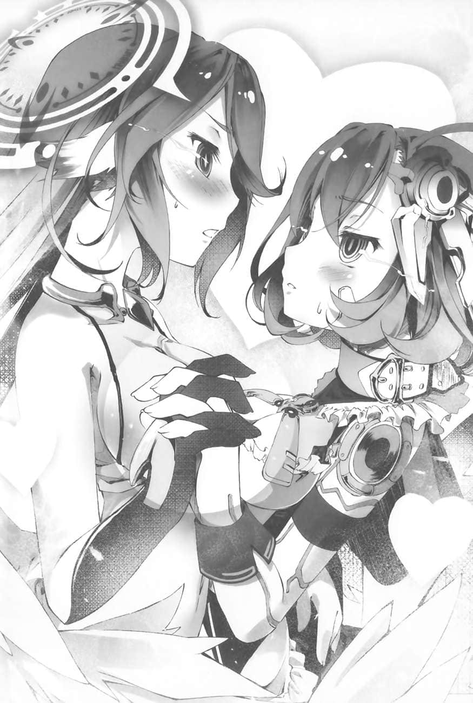

# 第一章 垂直思考

> 来源：https://www.linovelib.com/novel/9/163398.html

虽说有些突然，不过来谈谈别的话题吧。

空很讨厌死亡游戏。

正确来说，他厌恶的是死亡游戏『成立的前提』。

死亡游戏──那是古今中外许多作品描写过的游戏题材之一。

游戏的参加者大多无路可退，为了活下去，必须赌命参加游戏。

参加游戏的原因很多，有的人在不知不觉间被掳来，被迫参加游戏。要不然就是背负钜额的债务，为了偿还只能参加游戏等等……不管是什么样的因素，参加者都是为了避免破灭的下场，各自以智慧、勇气、甚至是疯狂来做为武器，对抗毫不讲理的死亡游戏。

要怎么做才能生还？

该与谁联手、依赖谁、欺骗谁、背叛谁，才能够让自己活下来？

参加者用各种方式拉锯、谋略尽出，在谁都不能相信的状况下面对死亡危机，最后发挥惊人的创意找出胜算。这种生死一线间的人情戏码，正是死亡游戏的魅力所在。

──但是，空对此存疑。

所谓的死亡游戏，真的有『胜算』存在吗？

答案很明确，当然是『NO』。

因为死亡游戏没有『胜利』，自然不可能有胜算可言。

难道不是吗？

在如此不合理的死亡游戏中，凭着智慧、勇气，甚至疯狂等各种武器拚命抵抗，即使最后能存活下来，真正的『赢家』还是『主办者』。

没错。在死亡游戏中，握有主导权的永远都是『主办者』。

以刚才的例子来说，有能力把人抓来并强迫其参加游戏的人物，随时都有能力杀掉参加者。至于钜额的债务，那就更不合理了。谁会把一大笔钱借给无力偿还的对象？那不是傻瓜吗？很明显地，一开始的目的就不是为了让对方还钱，而是要逼对方参加游戏。既然有能力让被害人无法申告破产并取得行政方面的保护，那么主办者肯定是法规无法规范的存在，光是被那样的人盯上就肯定是走投无路了。

而且，不管怎么说，死亡游戏这种行为，完全是违法的。

违法的行为当然不能让外界知道了。那样一来，怎么可能真的遵守约定，让参加者活着回去呢？那不是徒增曝光的风险吗？

也就是说，即使参加者拚死挣扎、最后真的活下来，最后等着他的也只有被灭口的下场。

『【解答】概算肯定的机率是98•3%。但是该空间由个体名称佛耶妮可兰所独自建构。若由复数个体建构，应该会更大。这一点无法断定。』

从行情看来，似乎1等于1日圆的样子。

──那么，有什么方法可以避免断头台的刀子被放下呢？

既然这样，外界自然也无从得知这种事了，也难怪没有留下纪录。

吉普莉尔先肯定白的看法，然后继续说明。

「……这不行。应该说……办不到……吧。」

史蒂芙提出了非常有道理的疑问，不过一样在门外的依蜜尔爱因马上回答了她。

在游戏之中，胜利必然只属于支配游戏、永远握有主导权的人。

──在《洛园》内，只要消费灵魂，就能创造任何东西。确实可以当作真正万能的货币使用。

妖精种在大战结束之前即与森精种建立同盟关系，不知道为什么现在过半数的个体都沦为森精种的奴隶。

『是。但是，「灵魂」当然不是无限的。』

话说回来，那个名叫布拉姆的吸血种也是消费『灵魂』来使用魔法的……

---

■■■

这根本不是什么游戏，而是行刑人的『余兴娱乐』而已。是死是活全看对方的心情，在他一念之间。

『【补充】人类种一样也是以劳动时间，也就是「寿命」换取货币。不同于妖精种的灵魂授受，寿命可以换成金钱，但是金钱无法换成寿命。是不可逆的转换。』

「……别争着做这种事……都退下。」

『空间位相境界《洛园》的范围内，等于完全是妖精种的天地。虽然无法把造出的物品带出去外面，但是只要以「灵魂」做为代价，他们在这里可以「创造」任何东西。不只是空气跟水，甚至是「生命」恐怕也造得出来。』

『即使是在大战时期，顶多也只能运用大规模精灵来将《洛园》连同空间位相境界也就是亚空间的扭曲强行消灭。这是唯一能从「外部」干预的方法，但是在「十条盟约」的规范下，现在也没办法这么做了。』

总觉得这段对话给货币经济狠狠地泼了一桶冷水。

不过，既然种族不同，经济结构不同也是理所当然的吧。

原来如此……那么，接下来白要提出最大的问题了。

『位阶序列第九位──妖精种，自大战时期即与森精种维持着友好关系。」

『至于那所谓的「支援（课金）」，指的应该就是刚才提到的「灵魂」──也就是货币的让渡。』

『……恐怕没有，主人。』

──又是灵魂。这种话题总是让人听得一头雾水。

「……第一……这个状况，是爱尔文•加尔得……造成的吗……？」

吉普莉尔似乎察觉到白的疑惑，继续解释道：

从被迫参加的那一瞬间开始，参加者就注定是输家了……

吉普莉尔满面歉疚地回答道。不过，这个答案也在白预料之中。

就算真的能逗笑行刑人，也不保证他──定不会放下刀子。

至于这什么空间位相境界的，更是莫名其妙……

──该怎么说呢？

那当然只有一个方法，就是『一开始就别上断头台』。

『咦？可是，妖精种多半不是在爱尔文•加尔得当奴隶吗？』

开播通知直播结束的时候是【15000】，现在则是【14900】。

『总之，如序列所示，妖精种的魔法适性只次于第七位的森精种与第八位的地精种，其最大的特征是并用自身「灵魂」的魔法体系，特别是干涉空间位相境界，进而建构我们目前所在的这个被称为《洛园》的场域。』

根据刚才的说明，白手上的手机可以确认课金的内容。现在她开启画面来检视。

那么，妖精种的杀手锏就是这种『强制把人关起来并逼迫其凑成情侣的游戏』吗？

至于死亡游戏，参加者在游戏一开始的时候就是『主办者』的手下败将，早已失去了任何主导权。

听完吉普莉尔的说明之后，白在脑中整理情报，然后提出疑问。

『用主人们容易理解的方式来形容的话，《洛园》便是「建构在网路中的虚拟空间」，而「灵魂」则是能创造、更动假想空间的资料，可以说是一种「虚拟货币」。』

──『支援（课金）』……

这正是吉普莉尔与依蜜尔爱因的空间转移无法生效的理由。

也就是说，一旦被妖精种关在《洛园》之内，就等于失去先机，只能任其摆布，『必败』无疑。

白为吉普莉尔的贴心解说道谢，并继续听她说明。

在断头台上，面露冷笑的行刑人对脖子被架上断头台的参加者说「来玩一场游戏吧。要是能逗我笑，我就不放下断头台的刀子」。

这惊天动地的说明让白有些感动。不过──

『空间位相境界是类似「亚空间」的东西。妖精种运用这个建构出一种情报传达网络──类似主人们的世界的网际网路──并且提供给森精种运用。』

白心里这么想，眯着眼睛叹气。不顾她的反应，吉普莉尔轻描淡写地继续说道：

同时也解释了妖精种在大战时期，有能力消灭天翼种与机凯种的原因。

「……第二……这就是『妖精种的游戏』吗……？」

『是。目前有六成的个体都是森精种的奴隶，全权代理者也不存在。』

『【否定】脱离是有可能的。具体方案为抹杀施术者。推测只要施术者死亡，空间本身即会崩毁。』

『咦？也就是说，这些妖精种观众正在用自己的「灵魂」捐钱给我们吗？他们就为了这么无聊的事，愿意提供自己的灵魂？他们疯了吗？』

『我曾经听说，由于妖精种能各自消耗灵魂来更改《洛园》的内容，因此当他们之间对《洛园》的内容意见相左时，会玩一种「互相涂改空间的游戏」，算是一种抢地盘游戏吧。但是，就我所知，妖精种没有玩过现在这种游戏。』

这是妖精种造成的状况，而妖精种大多都是爱尔文•加尔得的奴隶。

奉『游戏在开始之前就结束』为信条的空，当然讨厌死亡游戏了。

要在死亡游戏之中得到真正胜利的唯一方法，就是说什么都不要参加游戏。

──原来如此。

「……那么，吉普莉尔……告诉我……关于妖精种的详情。」

「……那……我有、疑问……三个吧……？」

『另外，妖精种都透过情报传达网来互通「灵魂」，当成「货币」来交易。』

『由于妖精种是「花之种族」，在生态上与守护森林的森精种并不对立。双方的关系相当友好，甚至在大战末期还共同研发魔法术式。但是，在战后的某个时期，突然大多数都沦为奴隶了。剩余的个体也没有拥立任何全权代理者。至于这背后的因素与经过，至今依然不明。』

「……别吵……滚边去。」

如果有无限的灵魂，理论上妖精种在这里甚至可以创造天地。但是，只要灵魂有限，创造便不是无限。

还是别想太多了。

总之，即使是天翼种与机凯种也必须做到这种地步，才有可能自行脱离。

处境如此的妖精种如果要与其他种族进行游戏，大多是基于森精种的指示吧。

虽说事到如今，也不敢奢望这些十六种族有什么限度可言就是了。

大多都是必胜，或者是只对自己的种族特别有利的游戏。

不过，吉普莉尔接下来说的话，让白有一点点讶异。

『追根究柢来说，唯有妖精种才能从《洛园》内部与精灵回廊建立连结。』

他们事先将平板电脑设定与手机连线配对，然后交给吉普莉尔。房间外的吉普莉尔透过平板电脑回答白的问题。

「……第三……我们有办法……自行脱离这里吗……？」

原来是这样。看来那个佛耶妮可兰真的是透过网路直播给网友看的。

也就是说，死亡游戏实际上只是个『断头台』。

这正是连魔法都无法使用、让众人真真正正地束手无策的真正理由。

毕竟对那什么空间位相境界的干预，似乎是妖精种专属的能力。

──但是……所以怎样？

依蜜尔爱因认为虽然也有可能不是爱尔文•加尔得的意思，但是机率低于2%。白在心里也同意她的看法。

听到史蒂芙与吉普莉尔在门外如此的问答，她的感动很快就被泼了冷水。

『如果那个佛耶妮可兰真的独自建构了规模这么大的《洛园》，她很有可能几乎快耗尽自己的「灵魂」了。』

果然……在这个世界，友好什么的只是痴心妄想……

『【否定】在盟约的规范下，不得「危害」施术者；但若为「过失」即没有问题。提议。由本机进行自爆。如果个体名称佛耶妮可兰「偶然」被保有精灵的爆炸波及，即有机会。为了主人，本机不惜牺牲性命。但是，请主人最后给本机爱情。Tell me「I love you」。』

……说到这里，应该明白了吧。

即使如此，这种能力还是太超过了吧？白这么问道。

对于白如此的疑问，这次由吉普莉尔回答。

『不……虽然妖精种的领土是面积广大的花田──也就是紧邻不可侵犯领域的土地，但是那里实际上是受爱尔文•加尔得保护的领地。因此，至少目前在正式的纪录中，不存在妖精种与其他种族进行游戏的纪录。』

只要消费这些数字就能购买生活所需的任何东西。白刚才在心里想着『水』并按下了『购买』按键，于是画面上显示【消费100】的讯息。再按一次荧幕，手机中便冒出一颗泡沫，破裂之后变出了一瓶2公升的保特瓶装水。

每个种族都有用来对付其他种族的『杀手锏』。

种族与种族之间维持友好关系？这个世界竟然有这种事？

「……这能力……未免……太扯了吧？」

『【反驳】妖精种之间可互相让渡灵魂。因此能透过正当的劳动赚取灵魂。另外，本机还推测妖精种能透过「某种手段」使灵魂增幅。对他们来说灵魂是流动性的，可视之为与人类种的金钱相同的东西。』

『这种事我也办得到。为了主人们，我很乐意牺牲。请如此命令我吧♪』

与空一起回到自己的房间之后，白瞄了房间的角落一眼，放弃坚持己见，对着手机这么问道。

看来她真的是个Y○utuber。

──这个世界的各个种族真是一物克一物，好像猜拳一样……

白半闭着眼睛，感佩造物的巧妙，同时在心里整理思绪。

也就是说，除了成功攻略这场游戏之外，没有其他脱离办法。

她再度确认这个结论，接着将眼光转向房间的角落开口。她先是赔罪，接着求助。

「……哥……抱歉……白……刚才一时慌了……我们先出去房间外，好吗？」

没错，本来该在这里整理情报的，应该是空才对。

但是，刚才在佛耶妮可兰的开播通知直播结束之后，看到女性们争着要让彼此讨厌自己，空便闹起了脾气，撂下一句「我不管了！我讨厌妳们所有人！」之后，便搂起白冲进了房间里，把自己关了起来。

他缩在棉被里发抖、哭泣，那样的空就连白都对其感到害怕，不敢面对。

---

■■■

「……哥……拜托……白真的……不知道该怎么办……」

少了哥哥，白真的没办法独力解决这种状况。于是白继续恳求哥哥。但是……

「呼呼，我的妹妹啊。哥哥我沦落到被迫参加这种死亡游戏，表示我就是个失败者……派不上用场的。」

深信自己是败者的空以绝望无比的语调回答道。

没有错，在这个受到『十条盟约』限制的世界，要像空与白原本的世界那样强迫别人参加死亡游戏，其实是不可能的。

既然这样，事实上一行人仍然被迫参加这样的游戏。想得到的结论就只有一个。

一行人已经在某场游戏中落败，结果才会沦落到现在这样的窘境。

既然已经是败者，事到如今哪能派上什么用场？

空如此唉声叹气地说道。但是，白却提出了不同的看法，继续坚持道：

「……说、说不定……我们是自愿参加这个游戏的。就像帆楼那次……一样……」

这么说好像也是。

参加死亡游戏的前提，除了刚才想过的那些之外，还是有例外存在的。

假使这个游戏有『隐藏规则』存在，只要是能用YES或NO导出结论，佛耶妮可兰绝对会回答，绝不说谎。

「当然记得，我大概比谁都清楚吧！！就是因为清楚才这么沮丧啊！！」

「够了没！？你们要在房间里缩到什么时候！？直播的时间快到了是也！！」

空依然垂头丧气，有气无力地这么说道。

看来，空不只无法理解恋爱综艺节目，根本就连恋爱本身都不了解。

空等人只能默默地看着她说话……不，其实他们根本不被允许发言。

正当空如此接受命运，做出了悲痛的抉择时──

「更何况妳随便找几个人关起来，让我们在这种有限的框架（封闭环境）内谈恋爱，这是什么道理！？这种状况下产生的恋情不过只是『在受限的状况下不得已的消极选择』而已啊！！」

不然就是透过手机购买『钥匙』，有了钥匙的话，一个人也能出去。就这么简单。

「干劲！？哪来的那种东西啊，妳到底想要我们干嘛！？」

「因为我是不可能会同意这种状况的──绝对不可能。哼哼……呼呼……」

不过──

佛耶妮可兰叼起一根烟，一派轻松地笑着说道。

史蒂芙害怕地问道，空只是激动地一吼。

「你、你到底是有多没女人缘才会有这么偏激的思路？」

听了佛耶妮可兰的下一句话，空马上改变主意，而且还在一转眼之间以吉普莉尔也无法察觉的高速移动至房间外面，催促其他人快点出去。

在空的眼中，这场游戏根本莫名其妙，而且自己还注定落单，实际上等于是一场死亡游戏，自己是不可能同意这种游戏的。

──为什么漂流到无人岛的人们会彼此结合？

「我要是缩在房间里，白也无法行动吧……我就去客厅好了。妳们四个就在客厅谈恋爱吧。我抱着大腿缩在客厅的角落当盆栽就好……」

对于史蒂芙与白的如此冷眼指控，空愕然地呻吟一声。

要不然就是为了击溃『主办者』而自愿参加游戏。

只是……根据手机画面中的资讯，钥匙的价格很贵，5的后面有9个0。

「完全没有意见，真不愧是主人，真是独具慧眼。」

「……至于哥……当然是、后者……也就是、见不得别人好。」

没错，规则很单纯，成为情侣就能出去……

「人本来就只能喜欢上身边的（邂逅到的）对象，这是当然的。如果觉得这种事不合理，就等于认定『恋爱本身是不合理的』，要不然就是『不想看到别人谈恋爱』，肯定就是这二者的其中之一而已。」

但是，很遗憾地，以这次的情况来说，那是不可能的。因为──

着来昨天的放送事故还没烧完。

「总、总之，老娘准备了很多很欢乐的企划是也！！这些企划一定能强制加深这五个人的感情！！那么，马上开始我们的第一个企划吧！！题名就叫做──」

「嘿，各位，发什么呆！？这样拖拖拉拉的也无法改变状况，我们快上吧！！」

但是，佛耶妮可兰似乎还是不满意，激动地搔着头，大吼大叫了起来。

「说得也是……妳们说得对。知道了……我出去就是了……」

当时，空他们为了实行自己的策略，主动选择放弃记忆、参加乍看之下像是死亡游戏的对决。

面对她如此的提议，众人看了彼此一眼，同时点头。但是──

为什么观众看到这种戏码会感动落泪？完全无法理解！

「我就是彻底没女人缘啦！！有意见的话说出来看看啊！！」

也就是说，那些是还没被『主办者』剥夺主导权的人。

既然是被迫参加的游戏，空深信目前无计可施。但是──

「随便把几只老鼠丢进同一个笼子内，看牠们在别无选择的状况下彼此繁殖，谁会喜欢看这种情景！？『除了生物学者以外』，根本不可能！！这是什么无聊的嗜好！？」

目的往往是──为了拯救被迫参加死亡游戏的某人。

「当然是要你们恋爱啊，还要老娘提醒吗！？第一天能做的事可多了，你们突然被关在密室内，总会不安吧？大可以互相安慰、埋下日后恋爱的伏笔之类的是也！！这还要别人教吗！？」

也就是──【50亿】。

「什么！？为、为什么！？」

「只要你们胜利，老娘就遵从盟约发誓，以『YES』或『NO』回答你们任何一个问题，绝不说谎是也。这个小游戏算是送给你们的特别优惠是也。」

必须用这么荒唐的价格买到钥匙，才有办法独自出去。

「才不会！！我要是办得到这种事，早就有女朋友了！瞧不起我吗！？」

「为了在状况陷入胶着的时候灌水，老娘才想了这个方案。想不到竟然在第一天就必须祭出，真是始料未及是也。总之，你们五个必须在今天直播的时候『玩游戏』是也！！」

吉普莉尔与依蜜尔爱因却肯定空的看法并加以赞赏。不过，感觉好像哪里怪怪的。

「『告密告白游戏』──！！耶耶──！！咚咚锵锵──！！」

既然这样，应该比自己更能够取悦观众吧。

以前对抗神灵种──帆楼的时候，空他们就是如此。

空如此悲叹道。但是──

「任何问题都行吗！？那么，『是否有其他离开这里的手段』这类的问题也算数吗！？」

妖精种少女似乎失去了耐性。

……呼、呼呼……

不过，其他人至少比自己多懂一些的样子。

「别说这种有如狗屎般的正确道理！！要不我这就哭给妳看！！」

「……空，那是理所当然的事啊……」

这种情况下，哪有脸说得好像谈了一场惊天动地的恋爱似的！？

──竟然连史蒂芙都……怜悯我……

为此，需要取悦观众，也就是谈恋爱。

「用不着这么紧张是也。只是简单的小游戏是也。」

要怎么努力才能让观众看得高兴？

「各位观众，大家好！！第二回直播终于要开始了是也！──上次那个真的是误会是也！没、没错，老娘当时在骂的是自己！老娘才是废物，底端网红！！接下来继续由各位的沙包──佛耶妮可兰为大家直播，敬请观赏唷✿」

──努力？是要努力什么？

「因为根本没什么好问的……」

「老娘本来是打算把第一天的情况剪成影片上传给大家看的，结果你们竟然就这样在房间里缩了一整天，完全没有任何动静！这是什么意思是也！？你们有没有干劲啊！？」

「当然。只要是能用YES或NO回答的，任何问题老娘都一定照实回答。」

只有四个人可以凑成两组，用前者的方法出去。另外，要设法争取妖精种观众们的『支援（课金）』，才买得起钥匙，让最后一个人脱困。同时，为了让一行人活下去，也同样需要争取『支援（课金）』。这就是这个游戏的概要。

例如，各作品中总有一、两个角色是『明知是死亡游戏仍自愿参加』的人。

「至于小游戏的内容，则是『让某人与某人暂时成为情侣』，当然也包括空在内是也。」

「……我不参加。妳们四个自己玩吧……」

……呃？咦？

唉唉──既然落单的结局无法避免，至少要设法避免饿死的下场，让其他人能够自由行动才行。

「这种话你敢说得这么笃定，却完全不肯努力追女生，你就是这样才没有女朋友是也！！」

那当然是因为『别无选择』，这就是最终答案！

「别忘了，不成为情侣就出不去，而且不争取『支援（课金）』的话，你们可是连食物都没得吃喔！！规则还记得吧？还是说你打算饿死在这里！？」

佛耶妮可兰忙着打圆场、讨好观众，并宣布第二回的直播开始。

他们上断头台不是出于被迫，而是由于自己的意志与策略。

空一点头绪都没有，这就是最大的问题。

──游戏……？

一听到这个词，空等人反射性地提高警觉，眯起眼睛。

「【同意】任何生物的繁衍，原则上来说都是消极选择的结果。除了从身边的个体中挑选对象之外，没有其他方法。因此，喜欢的对象必然会是同班或同社团等有限的框架（封闭环境）内的某人。主人真了不起。【再认】在这样的条件下本机还能遇上真命天子（主人），真是太不得了了。幸运。」

---

■■■

「啊啊啊啊！再这样下去没完没了是也！！那就只好变更行程了是也！！」

空则是拚命地抓住棉被抵抗，同时吼了回去。

「什么『恋爱纪录片』嘛！那是这世界上我最无法理解的类别！」

「────咦？」

甚至连看都看不到，只能被迫坐在客厅的桌子旁听着她直播。

佛耶妮可兰让空与白所在的房间的门消失，闯进房间里，扯掉空的棉被，大吼大叫了起来。

但是，眼前有一个很大的问题。那就是──

佛耶妮可兰吵吵闹闹地宣布了游戏的标题。

空一行人非常专注地听她说明，甚至比观众还要认真。

因为，他们到现在还不知道，那究竟是什么样的游戏。

佛耶妮可兰到现在只向他们说明过一件事，那就是他们现在必须坐在桌子旁，闭上眼睛，而且绝对不能交谈。

因此，现在空与白正握着手坐在一块，闭着眼睛，默默地等待说明。

「首先，让这五个人各拿一张纸牌。这是特别的纸牌，只要在心里想，就能让纸牌的牌面上浮现想要的文字是也！！」

空的右手牵着白的手，左手则在这时候被塞了一张纸牌。

「现在，要请五人在牌子上写『A喜欢B』。A必须是自己以外的四人之一，B则是除了A之外，包含自己在内的任何一人是也！！」

唔唔……

「例如空不能在牌子上写『空喜欢B』，但是可以写『A喜欢空』就是这么一回事！！当然也不能写『空喜欢空』。总而言之，这个游戏就是要请五位以告密的方式说出谁喜欢谁是也！！」

……真是个坏心眼的游戏。

不顾空等人在内心如此吐槽，佛耶妮可兰继续解说。

「如果其中两张牌上分别写着『A喜欢B』与『B喜欢A』，那告密告白就成功了！！A与B就能成为情侣是也！！游戏必须一直持续到至少有一对情侣成立为止！另外，如果在第一轮就有情侣成立的话，这五人可以得到奖赏是也✿」

──原来如此，奖赏指的就是她事前立下的誓言中提到的『优惠』吧。

也就是可以要求佛耶妮可兰回答任何一个，能够以YES或NO回答的问题……

「写好之后，纸牌将由老娘收回，不会让这五人看到。收回的纸牌将由老娘与观众们一起确认，并且当场发表是也✿也就是说，采完全匿名的形式，这样一来五人就能够尽情地告密是也！！喔耶！！」

……也就是说，没办法对佛耶妮可兰作弊。

「当然，禁止五人互相讨论！！一旦睁开眼睛或者是发出声音，当下就算这五人输了！！从直播的角度来说那是最糟的结果，拜托各位要遵守规则是也！！」

佛耶妮可兰不忘如此防堵空等人作弊，于是终于结束了她的说明。

然后，她高声宣布这个游戏最大的目的。

那就是──我最爱的妹妹现在不是自己人，她背叛了我──空这么想，只能欲哭无泪。心想──我这次又踩到她的哪颗地雷了……？

听到佛耶妮可兰这么宣布，空在心里兴奋地握拳，摆出胜利的姿势。

空如此感动着，同时等待佛耶妮可兰继续宣布结果。但是──

这判断是多么地合理，而且还有牺牲小我的精神。竟然能在一瞬间做出这样的判断，真是太英明了──正当空如此自夸的时候──

而且这样一来根本不是什么『告密』，只是普通的告白。

这就是佛耶妮可兰真正的目的啊……这么简单的事，为什么哥就是不明白呢……？

没错。对白来说，即使要暂时放弃跟空凑成情侣的机会，也要先设法阻止空跟吉普莉尔凑成情侣才行。

……说不定……哥真的是个笨蛋……

──这个角色确实是很危险。

本来以为在这场直播游戏的尽头等着自己的，肯定是落单的结局。

我什么都不明白。虽然不明白，但是目前能肯定一件事。

因此，空认为应该由自己来承担风险，除了自己之外不做第二人想。

「「「什么────！？」」」

依蜜尔爱因……骗了吉普莉尔……？

但是，空与白却可以如此简单地共谋。

但是，这场小游戏却为空带来颠覆结局的一丝希望。对他来说，承担如此风险是值得的。空肯定自己稳操胜券，呼吸不由得急促了起来，心想──这场小游戏，我赢定了！！更进一步地说──

「【嘲笑】受骗的傻瓜只能怪自己笨，这是这个世界的绝对真理。必然地，可说号外个体是傻瓜。证明完毕（大笨蛋）。」

如果只是随便写写，配对成功的机率大约是四成左右……还不算太低。

──空用手指如此暗示白。

隔了数秒之后，白回答『了解』。

然后──

这是她一开始跟空等人说过的事，也就是她设计来取悦观众的要素。

『我写「吉普莉尔喜欢空」，妳就写「空喜欢吉普莉尔」。』

──总而言之，就是个不能互相讨论的配对游戏。

但是空完全不在意她，只是闭着眼睛，在脑海里整理规则，并进一步地深思。

以佛耶妮可兰的角度而言，她必定希望凑成情侣，这样才能炒热直播的气氛。

空与吉普莉尔、史蒂芙三个人齐声哀嚎。

『白会写「史蒂芙喜欢吉普莉尔」。』

因此，在游戏中，白不出声，只是动了动嘴唇，说了一句话──『哥想要跟吉普莉尔凑成一对』……

空没有理由继续闭着眼睛，当然也没有理由保持沉默，猛然地提出了抗议。

她才开始回应没多久，就跟观众吵了起来。

这样一来，玩家之间根本没有任何交流或拉锯可言，胜败完全凭运气。

由这样的结果看来，自己与白的票肯定是被忽略了。那佛耶妮可兰肯定有作弊。

「喔喔！真是太意外了！？竟然真的在第一回就配成了情侣是也！！」

「那么，马上开始第一回合的游戏！给各位五分钟的思考时间，开始是也！！」

我可是一点都不想承担这么危险的事，真的！！

接着，他感觉有人从左手抽走了他的纸牌，忍不住面露慈悲的笑容。

这个游戏最大的目的，就是让某两人暂时成为情侣。

依蜜尔爱因能够跟白进行一样的数理性、合理性思考。

规则确实禁止玩家讨论，不只不能出声，连彼此的表情都看不到。

──所有人一定会写『空喜欢自己』的……

结果，事情的发展完全顺了白的心意。

在这空间内也无法使用魔法，因此无法与吉普莉尔或依蜜尔爱因共谋。

所以她故意提升难度，在这种实际上必须多玩几回合的游戏中加上『第一回合成功才算赢』的条件。

「喂，这到底是怎么回事──啊啊啊我错了，对不起，请原谅我！？」

即使闭着眼睛，也能够读得到白的唇语──白如此判断，接着又用唇语说道：

即使如此──

「──妳、妳这破铜烂铁，竟敢骗我！？我看妳是真的活得不耐烦了……」

「趁着这个空档，老娘就来回应各位观众的留言是也✿『佛耶妮可兰小姐，妳好。』妳也好啊，银莲花小姐✿『妳的话是最不必要的，完全是垃圾。』呵呵，妳才少啰唆是也✿不爽的话，就马上滚蛋是也，废物！啊啊，等等，竟然真的少了一个观众是也！？说笑的啦，老娘下跪磕头就是了，拜托继续看老娘的直播啦！讨厌～别这样嘛✿」

一个人能写的组合有4×4＝16组。

白的眼光直盯着空，犀利得仿佛刺穿昆虫标本的钉子。她心里想的是──

但是，那纯粹是『随便写写』的情况。如果把玩家们的心思考虑进去的话，那就更复杂了。

既然配对完成，这个小游戏就结束了。

另一人同时提出抗议，是与他共谋的白──不。

哥似乎想了很多，但是，这游戏其实非常、非常单纯。

即使哥再怎么擅长算计与拉锯，只要扯上跟恋爱有关的事，就会跟废柴一样派不上用场……

空听到佛耶妮可兰这么说道。

「喂，别闹了！开什么玩笑，那是不可能的！妳该不会作弊吧！？」

不过──空进一步思考，这么做也是有风险的。

刚才到底是怎样？现在又到底是怎样？

因此，第一个人应该选吉普莉尔。即使情况再怎么糟，她应该也不至于带来危害才对。而且，空与白的命令可以阻止她的任何行动，能把风险控制在最小范围。这就是空选上她的理由。

等等，说起来，佛耶妮可兰发表结果的时候，表现出质疑反应的只有空、吉普莉尔与史蒂芙三个人。

空默默地动起右手的手指，也就是与白牵着的那一手。

所以，哥只需要选一个自己喜欢的女生，写『某某人喜欢空』这样就赢定了。

也就是说，对空等人来说，实际上是『一次决胜负』。

虽然只是仅限一天的暂时女友，但是这下子终于能升级成有交过女朋友的十八岁处男了。

这两人光是牵着手就能讨论明天的菜单内容。这样的两人一起做票的话，即使是闭着眼睛也能够一次就任意地配对成功！

「另外，在这个游戏中成立的情侣，将在一天的时间内『强制成为暂时情侣』是也！！」

但是，面对两人比绝对零度更冰冷的眼光，空马上改口求饶。

---

■■■

这不是很简单吗？因为……

就在这一天，永远的0终于要进化成0•1了！

是吉普莉尔。她恶狠狠地瞪着依蜜尔爱因，全身散发的猛烈杀气，仿佛要扭曲空间。

不过，唯有在堂堂正正地决胜负的前提下才是如此。

「五分钟过了是也！！那老娘要收回纸牌，进行第一回合的统计是也✿」

他忍不住苦笑，心想「妳以为我会跟妳堂堂正正地对决吗？」──

因此，白相信光是这么说，她就能理解白的意图，并且配合。因此，依蜜尔爱因必然会设法阻止吉普莉尔写『空喜欢吉普莉尔』。方法很可能是透过某种手段告诉吉普莉尔说『妹妹小姐要我传令，妳必须写「空喜欢白」』，而依蜜尔爱因自己则写『吉普莉尔喜欢史蒂芙』。

佛耶妮可兰这么大喊之后，接着又滔滔不绝地说了起来。

但是，另一个人──无论怎么选都无法完全排除风险。

依蜜尔爱因身为机凯种，拥有非常敏锐的感应与观测装置。

──不妙，这到底是怎么回事！？完全想不透。

终于交到第一个女朋友啦──！！

空完全摸不清状况，只好转而要求白与依蜜尔爱因解释。但是──

但是，理所当然地，其实她并不想回答空等人提出的疑问。

该让谁跟谁配对，有必要极度审慎地思考。

「统计结果发现，史蒂芬妮与吉普莉尔竟然是两情相悦是也！！真是令人意外的组合是也！！」

同时，这么做还能满足胜利条件。因此，她相信依蜜尔爱因会答应配合她这个次等的策略。

原本来说，这种游戏必然该多玩几回，根据各回的结果判断倾向，彼此交流、拉锯。但是，这次空等人要赢的话，必须在『第一回合就配对成功』。

──『限定在一天之内强制成为暂时情侣』这样的规则会带来什么后果，目前无法具体地预料。

「「呜！？」」

白依然用杀人般的眼光瞪着空与吉普莉尔，吓得两人忍不住惊呼。

白当然生气了。在白的眼中，这次完全是空不对。白心想──

如果真的要两人一起用确实的方式得胜的话，只要两人各自写『空喜欢白』、『白喜欢空』不就没事了吗……？

为什么还特地要求白把哥跟吉普莉尔凑成一对呢……？

吉普莉尔，妳也是……

妳一定是想趁着这个机会写『空喜欢吉普莉尔』对吧……？

要不是依蜜尔爱因阻止妳，妳肯定已经这么写了，对吧……？说啊……？

「好了！接下来就按照规则进行是也！！」

所幸──对空与吉普莉尔来说是幸运的──佛耶妮可兰高声地宣布接下来的步骤，阻止了白进一步的指责。

「吉普莉尔与史蒂芬妮接下来一整天将强制成为暂时情侣！就从现在开始是也！！」

史蒂芙与吉普莉尔凝视着彼此。

『噗通』一声……那是两人坠入情网的声响。

包括白的所有人，大家都感觉真的听到了这样的声响。

---

■■■

『强制在一天之内成为暂时情侣』……

这条规则究竟会带来什么样的结果？空、白、甚至是依蜜尔爱因也忍不住吞了一口唾液，紧张地注视着两人。

史蒂芙与吉普莉尔成为情侣……？实在无法想像。

但是，两人正注视着彼此，脸颊微微地泛红……这就是成为情侣的状态吗？

……咦？就这样？正当空觉得有些意外、甚至扫兴的时候，下一个瞬间──

「──────❤」

而史蒂芙也明白这一点，道歉的口气中透露着喜悦的味道。

也就是说，被迫与不喜欢的对象成为情侣的记忆，多少还是会残留。

「呃……是……」

根据先前听说的情报，妖精种与森精种两个种族之间的关系原本非常友好。

「……小多？如果是主人们问妳话就算了，妳身为宠物，怎么可以在没有我这饲主的允许下主动跟别人说话呢？看来妳还有欠管教唷❤」

「妖精种的精灵回廊接续神经有点特殊是也。是透过空间位相境界像树根那样延伸，妖精种之间透过这道连结──也就是树根──建构起情报传达网。老娘的直播是透过『直接连线』是也，因此只有订阅了老娘的频道──也就是跟老娘之间建有个人直接连结的妖精种个体才能看到是也✿」

「……【确认】一天过后，被捏造的记忆，当然会消失吧？」

至于史蒂芙则是紧抱着自己的身体，眼眶泛泪，全身不停地颤抖。

假如佛耶妮可兰说的真的是事实，就表示──

「回主人。是从第一次跟两位主人玩过游戏后的翌日开始的。听说主人曾经让小多戴上项圈、狗耳朵与狗尾巴，并牵着她散步，于是我也想做一样的事。小多的反应真的很可爱呢。每次被我欺负的时候，那张哭脸实在是让人兴奋得受不了。尤其是光着身子散步的时候」

「我、我说……吉普莉尔啊，妳跟史蒂芙现在是情侣吗？」

可恶！可恶！为什么我输了这场游戏！？

看空满面疑惑，佛耶妮可兰滔滔不绝地说了起来，完全没有要隐瞒的样子。

话说回来，一开始的时候佛耶妮可兰确实有说这是『个人直播』。

史蒂芙虽然被当成狗命令、抚摸，但是却红着脸颊，似乎也没有很不满的样子。

「吉普……呃、主人！不是说好这件事不能说出去的吗！？」

吉普莉尔与史蒂芙上演的百合情侣戏码似乎颇受好评。

「区区奴婢也能饲养宠物──都是多亏两位主人宽宏大量的许可。」

空等人见状，当下马上明白，这两人真的成了情侣了。

「……明知百分之百会被偷看，还不惜使用网路？谁要用这种网路啊……」

佛耶妮可兰的话让白与依蜜尔爱因不寒而栗。但是，空有别的想法。

这很明显地不是情侣之间会有的反应吧？正当空感到不解的时候──

先不管这种事了。

她们就是那样的情侣。

吉普莉尔以突破音速之势扑向史蒂芙，然后──

「呃……我确认一下，两位是什么时候开始变成这种关系的？」

「当然不会消失了♪不过，会认知到那是『被捏造的记忆』，所以顶多只会当成一场梦吧。而且就跟作梦一样，以后自然会渐渐忘掉是也✿」

──这到底是怎么一回事？

佛耶妮可兰说明的理由，就跟半闭着眼睛的空猜想的一样。也就是说……

「之所以会发展出『情报传达网』这种东西，并提供给森精种当情报网络使用，也是为了偷看他们之间互传的那些『有的没的』是也。」

虽然吉普莉尔指责了史蒂芙，但是，口气之中确实透露着明显的独占欲与嫉妒。

既然这样，假如自己跟吉普莉尔配对成功，也可能会被菲尔与克拉米看到。那样似乎不太好……想到这里，空开始纠结了起来。

「不不不，这当然是情侣了！！这是她们两人『无意识下互相认可的情侣关系』是也！！」

于是，吉普莉尔从史蒂芙的身旁冲过去，猛地撞在墙上。

对于我这即使在梦中也不受欢迎的处男来说，这是多么充满希望的规则啊！！

史蒂芙拼命地向白这么辩解道。

「咿咿！对、对不起啊啊啊！！」

「等等、等一下。妳刚才是不是说了『自愿去当奴隶』？」

而且，根据吉普莉尔的说法，这「钱」可是「灵魂」耶。

「因、因为……那个吉普莉尔来请求、来恳求我耶！我、我其实也不喜欢这样！我、我也想当普通的、恋、恋人──」

吉普莉尔的表情笑开得像一朵花，史蒂芙则满脸通红，表情僵硬地抽动着。

两人当然不记得许可过这种事了，更何况吉普莉尔根本没有来征求同意这种事。

「……怎么？区区宠物敢对我这个主人有意见吗？嗯❤」

这些家伙根本是疯了吧？空这么想，眼睛半闭。

也就是有上锁的直播──不，就机制来说，应该类似P2P连线吧？

「咿咿！？要、要处罚的话，拜托请手下留情、温柔一点！」

「我只是想说这家伙明明是宠物，却穿着衣服，实在是太嚣张了。于是一时忍不住就想要……不过，既然不允许我脱她的衣服，现在就先放她一马吧。小多，坐下，握手❤」

「……对了，这场直播也会透过网路让森精种的观众看到吧……？」

让两人以无意识之下可接受的关系成为情侣。

「啊，森精种不会看到这直播。这是『个人直播』是也。」

「喔嘿嘿～赚了不少观看数是也～～各位观众！请多多『支援（课金）』是也✿」

到底发生了什么事？空还来不及理解，佛耶妮可兰先采取了行动，似乎是取消了某个机关。

难道，她们刚才差点就做出了会让直播被BAN的行为！？话说，现在到底是怎样了！？

也就是说，除非史蒂芙在无意识之中有这样的想法，不然这种状况是不会成立的。

空战战兢兢地问道。

我至少能做个美梦，在梦中我跟吉普莉尔是某种形式的情侣！！

空满腔悔恨，不停地在心里检讨自己的败因。

手机的荧幕上也有显示──如果没看错的话，显示了【1万】、【2万】等金额。

也就是说，正因为森精种是空的心目中受官方认证的『色精种』，自然不乏复杂纠葛的恋爱话题以及创作物。而妖精种就是为了这些，自愿成为森精种的奴隶。

「才、才不是这样的！我、我是因为吉普莉尔这样请求，才无可奈何地答应她……！」

──也就是说，如果当初按照我的计划，让我跟吉普莉尔成为情侣的话。

……原、原来如此……？详情还是有听没有懂。

原来如此，现在我明白了。

两人之间现在怎么看都不像是情侣，而是主仆。于是空质疑游戏的规则有假。

「妖精种最喜欢的就是『别人的恋爱话题』是也！」

「呜、呜呜……！」

「呼呼呼……妖精种最喜欢别人的恋爱话题是也。甚至可以为了这种事自愿去当奴隶是也。更何况是堂堂天翼种恋爱的模样──当然有很多人愿意花钱观看是也✿」

墙边的吉普莉尔一脸不解地这么回答道，同时手抚摸着头上的肿包。

「……也就是说，现在那些赏妳『支援（课金）』的家伙们，都是特地跟妳进行个人直接连线也就是订阅妳的频道，还特地花时间观看这种事，而且还特地付钱给妳，是吗？」

看来这两人是遭受了大规模的记忆窜改。

「咿咿咿！？」

但是从某个时期开始，妖精种成了森精种的奴隶，只是背后的过程与原因不明。据她这么说，难道是……

假如汇率真的跟日圆一样，等于是在这时候捐了一、两万日圆过来……

同时，为了让两个当事人认知自己与对方已经是那样的情侣，还窜改当事人的记忆。

佛耶妮可兰看着荧幕，一副很开心的样子。看她这副模样，空顿时恢复冷静，想起了一件事。

「好，真乖。小多真是个乖宝宝❤」

「妳的意思是说……史蒂芙心底认为……当吉普莉尔的宠物……是可以接受的……？」白对佛耶妮可兰这么问道。

看来史蒂芙与吉普莉尔之间有着这样的共同认知。

「森精种的寿命很长，但是生性执着、喜欢纠缠，他们的恋爱充满复杂的纠葛。而且因为个性闷骚，艺术也都往那方面发展。因此咱们妖精种从太古以来就喜欢跟他们合作，有些个体为了稳定的恋爱话题来源更是不惜成为他们的奴隶。毕竟咱们可是《爱神（阿尔拉姆）》所创的种族，别小看咱们对爱的重视是也！」

「喔喔，再下去可不行！不可以做限制级的事喔，不然直播会被强制终止（BAN）的是也✿」

但是，佛耶妮可兰却兴奋地反驳了起来。

「嗯？啊～对喔，爱尔文•加尔得把咱们的事列为国家机密，所以外界的家伙们不清楚妖精种的生态是吧？既然这样，就让老娘告诉你们是也！」

佛耶妮可兰这么回答道。

也就是说，『一日限定强制成为暂时情侣』这条规则，并不会让两人喜欢上彼此，只是强制两人『成为情侣』而已。

天翼种与人类种成为情侣的情景，被全世界──至少被森精种看到了。

听到她这么说，空与白姑且看向彼此，确认了一下。

「喂，佛耶妮可兰！这哪是什么情侣、？妳竟敢骗我们！」

既然这样──依蜜尔爱因满怀警戒地提出疑问：

不只如此──

「我跟小多？主人说笑了。小多当然是我的──宠物。」

确认到这项事实之后，空先是呼了一口气。

「在他们森精种的眼中，咱们妖精种不过是『有通讯机能的便利花朵』而已。森精种才不介意花朵偷看他们的讯息是也。」

原来如此，对于下等种族的认知，比空想像的还要具绝对性。

不过，这实在是……面对太过于令人震惊的事实，空忍不住呻吟了起来。

「……你们竟然就为了这么无聊的理由去当森精种的奴隶……？」

「才不无聊是也。对咱们妖精种来说，这是名符其实的生命线是也。」

佛耶妮可兰不悦地嘟起嘴，继续说明。

妖精种乃是花之种族，只要有土壤、水与太阳，甚至不需要食物。

只要是在《洛园》之内，他们甚至可以任意创造他们要的土壤、水与太阳，可说是活得非常节能的种族。

但是，行使魔法需要消费『灵魂』，因此无论如何还是需要补充灵魂的。

「至于让『灵魂』增幅的方式，就是观赏『他人的恋情』是也✿」

佛耶妮可兰这么说道。那正是依蜜尔爱因之前提过的『某种方法』。也就是说──

「观看、听闻别人的恋爱话题所产生的种种情绪──亦即辛酸、感性、崇高等各种情怀，也就是『萌』的情感！这种情感才能让咱们妖精种萌发、生长！！毕竟咱们是花！！花要萌发！！……咦？老娘这么用心地说了一个种族笑话，还不快笑是也！！」

发现自己的笑话冷场，佛耶妮可兰似乎非常震惊，眼眶泛着泪水抗议了起来。

虽然很抱歉，但是空真的没心情理会这种事。他忍着头疼，继续问道：

「……不，即使考量到这一点，也没有必要特地去当森精种的奴隶吧？」

「即使没有必要，但是咱们就是想要这个方便。就生态上来说，森精种与咱们很契合是也。」

对了，吉普莉尔也这么说明过。

既然这样，妖精种应该也跟那些恨不得根绝一切植物的地精种势不两立吧。

即使如此，除了地精种之外，应该也可以跟森精种以外的种族合作才对。实在没必要沦为奴隶……

「妖精种哪有其他的选项可言？那些高位阶的种族，就连有没有自我都很可疑是也。吸血种快灭绝了，海栖种只知道捕食配偶，月咏种只会宅在家，人类种完全没有魔法适性可言。至于兽人种，他们只会谈跟野兽没两样的恋爱，哪能期待他们稳定地提供什么优质的恋爱话题！？」

「根据这个前提，佛耶妮可兰，我这就向妳『提问』──」

──光是就『不需要繁殖』这一点来说，天翼种也是一样的。

「……可以……告诉我们吗……？」

史蒂芙等人现在才发现这件事，慌张地用眼光到处寻找空与白的王冠。空不在乎她们的反应，继续说道：

白半闭着眼睛这么问道。但是，佛耶妮可兰似乎没听到她的疑问，开始滔滔不绝地解说了起来。

她所指的，正是在两人交谈的期间仍一直持续着情侣关系的那两人。

史蒂芙忽然恢复正常，空与白两个人战战兢兢地从房间探出头来，窥探她的反应。

「还有什么意思？」空还是一副有气无力的样子，接着回答道：

「啊，老娘差不多该准备直播了是也！今天的直播内容是让观众看老娘编辑好的影片，同时回覆观众现场的留言是也，所以今天你们可以悠哉一点是也。下一场『游戏』也是明天晚上八点开始是也，你们可要事先待机、别迟到了是也！那么，老娘先失陪了是也，大约两小时后见是也！掰！！」

「──『我跟白已经不是艾尔奇亚的国王了』──是不是？」

「我哪有能力光凭YES或NO的提问就导出必要情报！？」

「好了，既然所有人都恢复正常了，你们可以『提问』了吧？今晚的直播也快开始了，速战速决是也。」

这一瞬间，史蒂芙、吉普莉尔、依蜜尔爱因、甚至是白，全都瞪大了眼睛。

「……既然这样，史蒂芙，我先问妳一个问题。」

「妳要把那个播出去！？不是说真的吧！？是开玩笑的吧！？」

空就连以前的基准都无法理解，当然更不能理解这么前卫的恋爱观念了。

之所以一直躲在房间，是因为兄妹俩认为在百合情侣卿卿我我的空间根本待不下去，完全没有容身之处。所以兄妹俩不等直播结束就速速回房，一直玩游戏等待时间过去。因此，他们也不知道后来吉普莉尔跟史蒂芙之间究竟发生了什么事。

──唉唉……我真的没什么好问的。

因此──

「史蒂芙，既然妳这么说，那就妳来问吧。」

---

■■■

「主人，应该说，妖精种可以消费『灵魂』使用魔法，要是本身还能透过恋爱让『灵魂』增幅的话，那等于是永动机了……那样一来未免太扯了。」

被抹消的记忆──那段期间肯定发生了某些非常可怕的事。

「最后那个再说得详细一点。妳的意思是说，兽人种的恋爱是……也就是说，伊野那样是普通──」

空决定不再多想，只是叹一口气，放宽心胸接纳两人的说法。

空认为史蒂芙应该会想问问题，因此，要问的话应该等那两人恢复正常之后再说。

「没错──那些都过时了！！老娘现在想欣赏的，是那种足以毁天灭地的大恋爱是也！！」

直播结束后，一天的时间过去了。也就是说，自从强制成为情侣之后，已经过了22个小时。

虽说这并不成为不谈恋爱的理由，不过真要说的话，算是种族方面的制约吧。

史蒂芙就像真正的拘似地仰躺着，任由笑容满面的吉普莉尔来回抚摸着她的肚子。她的表情看起来虽然有些害羞，却又掩藏不住喜悦。

「咦？那还用说，咱们妖精种自己是完全不谈恋爱的是也。」

「等等，妳的意思是说……莫非，妳们妖精种同时具有『雄蕊与雌蕊』吗？」

「咱们妖精种基本上就是花。花都靠花粉繁殖，不需要谈恋爱是也。」

「妳睡觉的时候会穿现在身上这套衣服吗？」

「咕嘿嘿……你们放心是也。直播结束之后整整一天的情境老娘都录下来了，目前正在不眠不休地精心编辑，准备做成两个小时长的简介影片是也。这下子今晚的直播就不愁没有话题啦！你们跟所有观众都能看到这影片是也」

说到这里，佛耶妮可兰在空的头顶上一屁股坐下，手指着某个方向。

「该问的事可多了吧！？例如有没有『离开这里的其他手段』之类的，不然至少也要设法厘清目前的状况！」

「……话说回来，佛耶妮可兰干嘛不参加？」

面对空的质问，佛耶妮可兰先是讶异地瞪大眼睛，然后这么回答道。

史蒂芙代表所有思绪还没跟上的其他人上前去逼问空，语调近似哭叫。

「嗯？那当然了。要看吗？」

这样一来我就不用落单，也能真心地祝福史蒂芙与吉普莉尔凑成百合情侣，放心地欣赏她们的缠绵了……空在心里这么嘀咕道。

空在内心这么嘀咕道。不过，佛耶妮可兰的话当中有更令他在乎的部分，让他忍不住插嘴：

「这场直播还有一个多小时才会结束，请等到那个时候再说是也✿」

「绝绝绝绝、绝对不告诉你们！」

然后──

──对喔……都忘记有这回事了。

「【报告】名称不明女性与号外个体之间发生的一切已全程录影，请问主人要观看吗？」

「……不，不只一个小时，让我们回自己的房间里等一整天吧。」

「咦？呃……不，当然会换上睡衣了。啊，如、如果你指的是我来这里之后买的睡衣，我可没有浪费钱喔！我挑的是便宜的款式……」

「我想也是。睡觉时至少会取下饰品吧，不然可是会戳伤自己的。至于我跟白则是带着手机、平板电脑与掌上型游戏机。但是，却唯独缺了一项应该有的东西。」

「等、咦、等等，这、刚才的话，到底是什么意思！？」

史蒂芙抬头挺胸地这么说道，一副理所当然的样子。空叹了一口气，心想──

「森精种那种复杂纠葛而且又含蓄保守的恋爱，老娘快腻了是也！老娘相信，今后会成为新的基准的，是那种跨越性别与种族的压倒性恋情！！就像这样！」

据佛耶妮可兰所说，这将成为新的恋爱基准。

「──『YES』……是也。」

即使如此，手机仍然不断传来锵锵声响。那是观众们传来『支援（课金）』的音效。他们似乎都同意佛耶妮可兰这样的看法，以支援（课金）代替掌声。

「我说过，我没什么好问的……」

史蒂芙与吉普莉尔的百合缠绵──要是在正常状况下，空当然很想仔细观赏了。可以的话，甚至想存在手机里当作平时的配菜来享用。但是眼前这个状况，换个角度来说同时也是别人凑成情侣、自己逐渐落单的过程，心里难免有些抗拒，觉得自己可悲。空实在是看不下去……

第三天的晚上。

「呃、等等，这、这不是很严重的大事吗？」

──老实说，有点想看，但又有点不敢看……

面对佛耶妮可兰的催促，空的反应还是一样。

具体来说，到底发生了什么事？史蒂芙等人以眼神如此问道。但是，空只是摇摇头。

从这一点能导出的事实──根本不需要问。

不过，这个时候，佛耶妮可兰又来了。

「睡觉的时候当然会取下，所以一开始的时候我也没想太多。但是，妳们身上穿的也是平常的服装，这很不合理吧？因为妳们并不会穿着这套服装睡觉。更不用说手机跟平板电脑了，我们睡觉的时候可不会把那些东西带在身上。」

「──啊！我、我刚才到底在做什么！？」

「……其实从我们还醒着的时候，游戏就开始了，我们身怀各自的『私人物品』被关在这里。但是，『私人物品』之中却不包含王冠──或许我跟白早已被剥夺了王位，这么想应该比较合理。」

赢了这场小游戏，一行人有权要求佛耶妮可兰回答任何一个可以用YES或NO回答的问题。

佛耶妮可兰回答了空的提问。

「绝、绝、绝对不能让他们看！吉、吉普莉尔！妳、妳可别误会喔！刚才发生的一切都是被强制的，绝对不是我个人的意思！明白吧？」

──这么说来，这个世界真的没几个种族会正常地谈恋爱呢。

「一开始的时候我们才刚从睡梦中醒来，所以没有想太多。不过……我跟白的『王冠』不见了。」

慌慌张张地这么说完之后，佛耶妮可兰的身影忽然消失在空中。

「关于恋爱，咱们只喜欢『旁观』是也！在热情而且专注的伟大恋爱上演的时候，咱们只想缩在一旁当一朵默默绽放的花朵是也绝对不应该介入其中，那是万万不可的是也！！难得的恋爱之花，怎么可以被其他存在玷污是也！？」

真的要问的话，那也不过只是『确认』而已──

这么打定主意之后，空转身背对打得更加火热的那两个人，匆匆回去自己的房间。这么做也是为了逃避白指责自己的冷漠眼光。

眼看史蒂芙对自己头上那吞云吐雾的妖精这么哭喊，空的心里其实很挣扎。

「唔……做什么？我也想知道。」

看她们的反应，加上这样的状态持续了整整一天，不难想像两人之间发生了什么事。

佛耶妮可兰不理会空的疑问，继续滔滔不绝地激动说道：

由于直播结束，她又原形毕露，一屁股粗暴地坐在空的头上，脸上浮现猥琐的笑容。

王冠──也就是平常空套在右手臂上、有如臂章一般的东西，以及白平常戴在头上当发饰的那个东西，两者都──不见了。

回答问题之后，史蒂芙连忙接着辩解一些完全不重要的事。不过空不理会她，继续说道：

「……停。所谓的雄蕊与雌蕊……是『比喻』，还是字面上的意思？」

「什么？问我吗？」

老实说，空不觉得有什么好问的。不过──

真要说的话，佛耶妮可兰加上了限制条件，阻止了限制级情境的发生，所以其实也很难说。不管怎么样，空与白决定依史蒂芙的意思，不再追问。

「妳自己就是很扯的种族，没资格说别人扯。」

「没错，确实是严重的大事。」

「啊，对了对了。你们在第一回合就配对成功，所以必须给你们奖励是也。」

「我知道，那也是我要跟妳说的话。不过，这确实是个很刺激的体验❤」

「更进一步的事，我就不知道了。应该说，被抹消的那些记忆就是为了让我们无法推测发生了什么事。」

「主人……这到底是怎么一回事……？」

吉普莉尔、史蒂芙与依蜜尔爱因都以眼神要求空更进一步地说明。

──但是，老实说，空现在的心情非常消沉。

现在还要被迫说明消沉的原因，让他的心情更是忧郁到极点。

空真的很想叹口气就转身回房间里躲着。但是──

「……哥？」

唯独白的眼光，空是无法抗拒的。于是空还是叹口气，然后──继续说明。

「…………白。被关在这里之前，最后的记忆是什么？」

「……依蜜尔爱因……在艾尔奇亚留下……吧？」

没错。那时候──机凯种突然造访艾尔奇亚，与空会面。

经过一些混乱的过程之后，机凯种离去，只留下依蜜尔爱因一个人……这就是空目前想得起来的最后记忆。而史蒂芙、吉普莉尔与依蜜尔爱因也不发一语地点头，看来她们的记忆也一样。

但是，这并不代表『在这之前的记忆都还在』，因为──

「没错。但是，记忆消除的范围却还包括在那之前的记忆。」

另外四人讶异地瞪圆了眼睛。为了证明，空拿出手机给她们看。

「瞧，工作排程器的内容，机凯种来之前的时期也是一片空白，非常不自然。」

空在规划任何事的时候，都会在这个应用程式中记下该做的事。

但是，即使是本来该有明确记忆的时期，排程表上却没有任何内容。

这样看来，根本不知道那个时期的空规划了什么事，完全不记得。

但是，空跟白两个人随时随地都在策划某些事，没有一天是空白的。

嚼嚼嚼……吞。呼……吃饱啦。

尽管两人拒绝，史蒂芙依然笑容可掬地这么说道：

更重要的是，只要参加游戏，还是有机会跟某人成为情侣的。

腹部被妹妹狠狠地揍了一拳，空痛得缩在地上。白不理他，眯起眼睛，眼光转为犀利。

「咦？小多，为什么餐桌上有五人份的碗盘？」

「我们犯下了某些失误……『败北』了。结果落到现在这步田地。」

说完，空便带着白回房了。史蒂芙、吉普莉尔与依蜜尔爱因只能茫然地望着他的背影离去。

「世界上明明就有我这种满脑子想着『反正我不需要女朋友』、『反正我交不到女朋友』，只能打肿脸充胖子地装出大彻大悟的态度，实则缩在被窝里忍受空虚寂寞冷而发抖的可怜虫；但是妳们这些人完全没想过我这种家伙的感受，只知道到处散发温暖又傲慢的气场！！可恨的幸福者啊！速速从吾的面前消失吧！！」

「够了，别再装傻了！妳们这些阳属性的存在！！像我这种等级的阴属性存在怎么可能没察觉妳们发出的阳光气息！！我是不会看错的！妳们两个全身散发出来的气场，就是刚开始交往的热腾腾青涩情侣那种虽然不安却又温馨的气氛啊啊啊啊啊！！」

吃完之后，空将餐具放在桌上，彬彬有礼地双手合十表示感谢。然后，蓄势待发……

「啊……没事，只是……我知道我这么做等于是强迫妳们吃东西，不过……因为我只准备了最基本的食材与调味料，不、不知道合不合妳的胃口……」

「美味的饮食是『心灵的养分』，妳们也有心灵，所以还是需要的。如果妳们还是不肯吃的话，那会让我们这些要吃饭的人吃得很不好意思，这样对我们不好，明白吧♪」

「咦！？情、情侣！？在哪里！？」

「……我以前就有个疑问。小多就算再怎么烂，以前好歹也是王族。」

空这么唉声叹气地说道。

史蒂芙、吉普莉尔、甚至依蜜尔爱因，都愣住了。

第四天──的傍晚。

「……！那、那就好！」

「【肯定】在昨晚20：43，确实已经过了24个小时。到现在又过了19小时23分钟。」

「……小多？我的脸上有什么吗？」

「【婉拒】本机不需饮食。给本机饮食是无意义地浪费主人们的宝贵资源。」

「【否定】号外个体从个人的角度对名称不明女性表现出兴趣，这是没有前例的现象。也不曾对名称不明女性的料理发表过感想。【报告】检测出号外个体与名称不明女性之间有《好感》。」

「……【肯定】与本机内建的观测机器一致。」

这两人虽然不需要饮食，但也不是不能吃喝。接着，她继续说道：

「……如果无论如何都想知道的话，我会透过下次的『提问』让妳们知道答案。」

依蜜尔爱因也认同这之间经过了三十九天。总不可能这段期间一直在睡觉吧。

---

■■■

「事情就是这样，我要回房间里闭关了……明天见……」

「不用担心，我知道妳们会这么说，所以我准备的份量其实只比三人份遗要多一点点。我知道吉普莉尔喜欢红茶，而依蜜尔爱因其实喜欢咖啡。」

败北……？

昨晚的直播结束时，剩余的金额是【1984000】；但是，史蒂芙虽然大规模地改建客厅并购买食材，剩余金额仍然有【1871000】。也就是说，她只花了十万多就确保了稳定的饮水来源，以及一个星期以上份量的食物。在财政管理以及空与白完全不行的『生活能力』方面，史蒂芙真是个可靠无比的帮手。

虽然史蒂芙这么说，但是餐桌上有主食、主菜、配菜、还有简单的甜点，一应具全。

「身体没顾好，心思自然无法正常运转。请吃饱一点！不过，我只买了最基本的调理器具与食材，没办法做什么大不了的菜色就是了……」

「照理说应该不需要自己下厨才对，为什么这么会做菜？」

「要填饱肚子的话，买白吐司不就好了！？」

然后──

「（盯……）」

──这……也有道理。

接着，空与白在史蒂芙的督促下在餐桌前坐下，看着料理一一上桌。

因为这种气氛散发出来的那种『单身狗滚边去』的无言拒绝，对于没恋爱经验的他来说，再熟悉不过了！！

这四天来──不只，应该说来到这个世界（迪司博德）之前，空与白每天都只吃白吐司、杯面、营养饼干之类的东西果腹，对他们来说，眼前餐桌上的料理已经算是非常丰盛了。

空透过手机确认『支援（课金）』的剩余金额，内心赞叹史蒂芙的精打细算。

「虽然我的手机也可能被别人动过手脚，上面显示的日期不见得是正确的；不过，我认为从依蜜尔爱因决定在艾尔奇亚留下的那一天起，到现在已经过了三十九天了。」

但是，空又是凭什么断定这场游戏『怎么样也赢不了』呢？

佛耶妮可兰所宣布的下一次游戏时间──也就是晚上八点──还不到，空与白就受食物的香味吸引，无法克制地从房间里探出头来。

完全就是班上在不知不觉间开始交往的两人之间的那种气氛！！

「还要我说得更清楚吗？现在这步田地，就是记忆与纪录都被消除，让我们怎样也想不到真相，而且还被迫参加怎么样也赢不了的游戏！状况就是这样！」

两人看到的客厅景象，跟昨晚完全不同。

对史蒂芙等人来说，空的论调太过于跳跃，只能不解地望着他。但是……

「咦？喔……那是因为，小时候每次我做点心给爷爷大人吃，他总是会很开心。」

「于是我愈做愈得意，不知不觉间就培养出兴趣了。我向侍女们学习做菜的方式……虽然她们总是劝阻我，说『公主大人不应该进厨房』，不过我就是不听……呵呵。」

虽然空对恋爱一窍不通，却不可能认错那种气氛。

「喔……我觉得可以啊，没什么问题。」

「由于我们在机凯种来之前策划的某件事，导致我们被赶下了王位。」

空与白竟然输了？『 （空白）』真的输了？

空，哭了。

她们的脑袋无法接受空说出来的这个事实。

在生活方面的事，则是在场的人当中最能掌控主导权、不容许反驳的人物。「简直就像老妈一样」──每个人都这么想，不过两人也不敢说出口，只好不情不愿地跟着在餐桌前坐下。

「如果我们必须在这里度过一周以上，与其每次都花钱购买已经调理好的食物与饮水，还不如在庭园里造一口井，吃的方面就使用最基本的调理设备，买进食材来一次调理，这样才比较划算。」

佛耶妮可兰说过，明天有『下一场游戏』。

「哪有！？我跟吉普莉尔都很正常，跟平常没两样！！」

说完，史蒂芙「哼哼」两声，得意地挺起胸瞠。

──史蒂芙，妳这家伙……虽然在游戏方面妳是食物链的末端，不过……

「才没那回事！！」

「这样啊……喔，妳泡的红茶很好喝。」

空一直坚信自己一定是最后被留下的那一人，忍不住大声哀嚎了起来。

「……『一天』的时间……应该……早就过了……吧？」

她应该会故技重施，以『提问权』为诱饵，要求一行人参加强制配对成情侣的游戏。

「……那么，为什么……史蒂芙与吉普莉尔依然……还是情侣呢……！？」

「……咦？怎么样也赢不了的游戏……？这话是什么意思？」

「鸣哇啊啊啊！白！！妳看那一对臭情侣啦！哥哥我的心被她们伤透了！！」

「啊，空、白，你们来得正好。我正要去叫你们呢。」

但是，两人不但没有记忆，就连纪录都像被菜虫吃掉的菜叶一样消失。不只如此──

「……哥……别吵……」

没错，我是不可能误解的！这种让人不好意思插嘴的气氛……！！

「这还用问？当然是妳跟依蜜尔爱因的份啊，吉普莉尔。」

其间，空与白正默默地吃着饭，只是嚼着食物，不发一语。

空终于再也挤不出任何一丝力气，只是丢下这句话就垂头丧气地转身离去。

「不用担心，我有仔细地计算过收支。」

既然这样，在下次『提问』──应该说『确认』之后，应该就能得出所有的答案了。

没错，客厅里多了厨房、餐桌、餐具、锅具等物品，与之前相比多了不少生活感。这些应该都是她们透过昨天交给吉普莉尔的平板电脑──也就是『支援（课金）』购买的。

因此──结论很单纯，简单来说──

──这家伙竟然乱花钱！？

「呃啊啊啊啊！呜呜……我受够了！人家要回家啦啊啊啊！让我回归尘土吧……！」

嚼嚼嚼……

总之，还是先怀着感恩的心享用吧。空与白双手合十，说声「开动」之后，正要开始吃的时候──

「我才不烂，而且现在也是王族！」

记忆被彻底抹消，确实是怎么样也无法推理到底发生了什么事，这一点还能理解。

「史、史蒂芙！？别乱花钱啊！妳忘了要存钱买让我出去的『钥匙』吗……！？」

没错，吉普莉尔与依蜜尔爱因都是以精灵做为活动身体的能量，不需要普通的饮食。

「是的，白小姐。在小游戏结束之后，我确实是让您看到了难看的一面；但是，现在已经恢复正常──」

但是，空仍继续说下去。他的口气显得有些不屑，大概是自暴自弃吧。

客厅旁的厨房内，史蒂芙正在笑咪咪地做菜。

「【命令】闭嘴。此乃严重疑虑事项。妖精种个体（佛耶妮可兰）所说的『一日限定暂时情侣』可能有假。【要求】尽速解答──两位，妳们现在的心神状态真的正常吗？」

「────！？」

对于依蜜尔爱因的疑问，史蒂芙与吉普莉尔不由得倒抽了一口气。

「咦？老娘没告诉妳们吗？抱歉是也。」

回答问题的不是两人，而是从什么都没有的空中忽然现身的妖精种少女。她叼着香烟，心情看起来很不错。

「耶！多亏妳们两个，老娘的频道订阅数急速暴增啦！再这样下去，不久后的将来我佛耶妮可兰肯定会成为超人气网红是也！看在老娘心情好，就回答妳们这个问题是也！」

她笑得开心，继续说下去。

「在老娘创造的这个空间里，恋爱情感会随着时间经过而增幅是也。」

「当然，如果原本是0的话，不管怎么增幅一样是0是也；不过，以强制的手段让两人以情侣的关系度过一天的话，便足以让『0增为1』是也。只要有1的好感，随着时间经过自然会增幅为2、3……就是这样。让咱们看看妳们究竟能否定好感到什么时候吧。」

佛耶妮可兰笑着说道。她的笑容，在空以外的四人眼中看来，仿佛死神的镰刀，使她们在心里惊声尖叫。

看来──这才是她『真正的目的』！！

前天的告密告白游戏，只是个非常简单的小游戏。

让两个人在一时之间成为逢场作戏的情侣，两人之间的恋情只是暂时的。

但是，这个游戏真正的目的，并不是将两人配成一日限定的暂时情侣。

只要今后再来几次同样的期间限定配对游戏，最后终究能够凑成真正的情侣，而且完全不顾当事人『原本的心意』如何。

为什么没察觉到这一点呢？当初真该更提高警觉的。

这里其实不是什么『不成为情侣就出不去的空间』，而是──『不由分说地强迫成为情侣的空间』

本机对主人的感情、我对空的感情、我对主人的感情、白对哥的感情──对佛耶妮可兰来说，全都是不屑一顾的东西！

这个事实让女性们不寒而栗，脸色转为铁青。剩下的最后一人，则是唯一完全不了解状况的人。

「也、也就是说，我还是有可能跟某人成为真正的情侣啰！？」

因此，空当然也知道这种套路。

吉普莉尔与依蜜尔爱因各自这么说道。从某个角度来说，她们的意见似乎是一致的。

「什么事都没发生！～～当然，任～～何事都没发生过！！」

空摇了摇头，改口说道：

「白，我的乖妹妹，快告诉哥，这种套路妳是从哪看来的？……算了，妳还是别说吧。」

而且还说过，会透过下次的提问来说明。

「要不然就是──让我死去。」

另一方面，其他人肯定也会全力阻止自己跟空成为情侣。

「既然这样，妳们为～～什么还牵着手！？」

天翼种与机凯种──两个势不两立的种族竟被强制配成情侣。

「【阻止】本机主张号外个体的基本人权。禁止剥夺自由意志。妹妹小姐，那样太狡猾了。」

「啧，果然是这样。」空只是叹了一口气，在心里嘀咕道。

「留下的那一个人，无论怎样都没有机会恋爱，当然也不可能得到『支援（课金）』。」

「我说过，我没什么好问的……」

昨天玩的是猜硬币游戏。

---

■■■

即使有『无意识之下可接受的关系性』这一条规则存在，但是这两个种族从原理上来说应该无法接受彼此才对。不过实际上，情侣关系似乎还是以意外的方式成立了。

佛耶妮可兰猥琐地大笑几声，接着又继续说道：

于是，第四天的游戏终于要开始了……

于是，两人之间顺利地竖起了恋爱旗。虽然微小得跟微粒子差不多，但还是存在的恋爱旗。

所以空才会一直都很沮丧。

「啊，抱歉，老娘补充一下。『记忆操作』跟『自尽』都是被禁止的是也。」

「当然要参加了！！为了争取提问的权利，只好心不甘情不愿地参加了！对吧，各位！我们快上吧！！」

空深叹一口气，开口。

这样一来，空与吉普莉尔还有依蜜尔爱因的情侣路线都被确实地断绝了。相对地，前往地狱的道路却扎实地铺起──不，根本是铺了铁轨。空绝望地流下眼泪。

空激动地同意道，呼吸也变得很急促。但是，女性们非常苦恼，根本没有心情理会他。

不知道女性们之间是怎么拉锯的──到现在还是无从得知──空还是理所当然地没能跟任何人配对成功。空完全无力干预游戏的发展，最后眼睁睁地看着吉普莉尔与依蜜尔爱因被凑成一对情侣。

「【执行】删除记忆程序，开始启动。错误。转而执行自爆程序。」

面对这些对手，必须让某两人凑成情侣，同时让自己一个人跟空配对成功，这个游戏，需要这种神乎其技的心机算计。不再是前天那种轻松的小游戏了。

直播也无法继续进行，更无法得到任何『支援（课金）』，一切都到此结束。

因此，空接下来要说明的，其实也是打从一开始就知道的事。

空本来想对白追究这一点，不过仔细想想，少女漫画可能也有这种套路，所以还是算了。就当作是这么一回事吧。

『…………』

两人还是老样子，对彼此展现出强烈的敌意与厌恶。但是，史蒂芙高声地提出质疑。

既然知道即使只当了一天的情侣，长期之下还是会成为真正的情侣，对所有女性来说，当然要全力避免跟空以外的人成为情侣了。

听了佛耶妮可兰的话，吉普莉尔与依蜜尔爱因满心绝望，脸色转为铁青。

直到被史蒂芙点破这一点，两人才连忙放开彼此的手，但是为时已晚。

健全的漫画里当然不可能有这种套路，不用想也知道是从哥哥私藏的薄本看来的。

「我就依序解释吧……首先，这场游戏是不可能出得去的……不，这么说也不对。」

────

「……这种套路、白知道。一开始、都说是、为了主人……说很讨厌……但是、最后、上瘾……不知不觉间……『为了主人』只是借口……都是、这种套路……」

「事情就是这样是也！好了，如同之前预告的，今晚的直播内容又是『游戏』是也！规则跟上次不同，不过赌注是一样的是也！只要你们赢了，就能得到一次提问的权利是也。胜利条件则是至少凑成一对一日限定情侣是也──你们愿意参加吧？应该不会拒绝吧？」

昨晚的直播是很简单的猜硬币游戏。游戏结束之后，空与白在房间里躲了一整天。现在，两人出来看看状况。

「小多，请收回妳的话。当时在我的认知中，是主人命令我与她互相拥抱。即使是在受强制的时间内，我也不记得我有把这破铜烂铁当成恋人过。而且，我也完全没有跟她要好过，之前不可能，以后也永远不可能。」

四人哑口无言。最后，史蒂芙才代表众人发出声音，打破漫长的沉默。

因此，这不是『提问』而是『确认』。

「【肯定】昨晚的行为只是基于『这么做的话主人会开心』的错觉而发生的行为而已。本机对主人的爱才是前提。」

「……好，我本来是打算什么都不问的，不过我还是问吧。可以告诉我发生了什么事吗？」

今晚的直播内容应该是跟前天一样，以吉普莉尔跟依蜜尔爱因之间的互动影片为主吧。

吉普莉尔突然跪下，有如祈祷般地垂着头请求道。

史蒂芙、吉普莉尔、依蜜尔爱因、甚至是白，都同时将眼光转向空。

「话说回来，天翼种竟然跟机凯种恋爱！没有比这题材更具话题性了是也！开玩笑，当然不能让你们删除记忆了！！老娘还要反过来煽风点火，增幅妳们的恋爱情感是也！咕嘿嘿！」

可不能够以为只有一天的时间所以没关系，就轻易地跟其他人凑成情侣。

「……吉普莉尔……『命令』──」

没错──两人的心神早已恢复正常。

「想不到我竟然会有必须感谢妳的一天……白小姐，请原谅。」

「在这场游戏中，你们『哪些记忆能保持到什么程度』都是在游戏前事先规定好的条件，因此你们无权控制记忆。请见谅是也♪」

佛耶妮可兰笑得非常得意。

────────

「呃……是，不过，这不是一开始就知道了吗？」

但是，即使在被史蒂芙逼问的时候，两人的手却依然牵在一起。

佛耶妮可兰的身影突然从空中冒出，开口打断了两人。

至于空，则是再度说出他已经说过好几次的那句话。

看来在受强制的时间内，两人的心里都出现了『被空命令与彼此拥抱』的认知。

「【指正】根据本机的检测结果，号外个体在拥抱本机时发生了异常的兴奋反应。妳竟然喜欢本机，超噁的。」

更何况，只要有四个人离开这里，佛耶妮可兰的企划就再也无法继续下去了。

「【报告】名称不明女性正在质问我们。据本机推测，由于她在昨晚之前跟号外个体之间的气氛还很好的，游戏结果却让本机与号外个体配对，所以她吃醋、生气了。本机也非常不愿意啊。」

空的态度看起来不抱一点希望，接着开口说明这场游戏──目前这个状况的本质。

游戏还没开始，女性们已经激烈地互相牵制了。而空虽然很明显地是这件事的中心人物，现在却比任何人还要置身事外。

「提问──『这场游戏，无论最后用什么方法离开这里，败北的都是我们』……是不是？」

对吉普莉尔来说，纯粹只是因为被空这么命令。

空的双眼闪闪发亮。这个处男只要面对跟恋爱有关的事，智商就会降至个位数。

「不太一样，应该说……若只是要出去其实很简单──『互相认定彼此为恋人的两个人（情侣）』手牵着手穿过『门』──这条件其实太过于简单。只要随随便便地透过盟约发誓『将彼此认定为恋人』，然后进行假游戏，随时都能让四个人出去。不过，只有四个人就是了。」

「啊！？咦！？等等……这、这话是什么意思！？」

「如果在这一天之间让我跟这产业废弃物有了至少0•1的恋爱情感，那么，得在这样的情感随着时间增幅之前将我的记忆消除。要不然就是──」

「今晚的直播就快开始了，你们不『提问』吗？」

两人一出房间就看到史蒂芙正在逼问吉普莉尔与依蜜尔爱因。虽然她对兄妹俩这么说，但是看她这么不高兴的表情，很明显地一定是发生了很多事。

「「────！？」」

「少来了，我跟她之间什么都没有！吉普莉尔想跟谁要好，当然随她去！我才不介意呢！」

「所以，必须透过直播赚到【50亿】这种完全不可能的金额来购买『钥匙』，否则实质上谁也无法离开这里。到这里为止听得懂吗？」

这下子，游戏的条件就跟前天不同了。

「我是为了主人的命令，不得已才拥抱『垃圾』。蒙受如此屈辱，内心当然会涌现难以名状的情绪了。妳这破铜烂铁不应该会错意，不然我可能会一个不小心杀掉妳喔♪」

没错，问题在于这样一来，就有一个人必须留下。

前天，空断定这游戏是『无论如何都赢不了的游戏』。

「主人，求求您，请命令我失去从昨晚起的记忆。」

佛耶妮可兰似乎还没完成影片，催促一行人尽快提问。

第五天的晚上。

双方各自被植入如此的认知，于是天翼种与机凯种就配对成功了。这么罕见的事，可说是历史上的一大创举。

说到这里，吉普莉尔脸上浮现毫无牵挂的爽朗笑容，仿佛要道别似的。

没错，打从一开始就知道了。

「啊，现在即使是我也看得出来。妳们现在是不是打算以删去法决定先一起坑我一个人再说？很好，放马过来啊！我可不会每次都乖乖地让妳们坑！」

依蜜尔爱因则主张空对她说「妳们互相拥抱的话我会很兴奋」。

「但是……正常来说，要赚到50亿是不可能的。」

根据手机上显示的内容，这五天来空等人赚到的『支援（课金）』是──约【897万】左右。

照这个速度进行下去，得花上好几年才有可能赚到【50亿】。更进一步地说──

「反过来说，如果赚得到的话，要赚到60亿、甚至100亿也是有可能的。那么，谁会甘愿放过这种摇钱树呢？」

「────」

因此结论其实非常单纯。

「佛耶妮可兰（这家伙）打从一开始就不打算让我们出去。」

「……可、可是……哥不可能……同意这种条件……」

没错。删除记忆，让众人怎么回想也无法推知真相。而且还把众人永远关在这里。这种条件，空是绝对不可能同意的。

「所以才说我们『败北』了，导致我们被迫处于这样的状况之中。」

这样的状况，肯定是爱尔文•加尔得搞的鬼，八九不离十。

空等人输给了爱尔文•加尔得，因而被赶下王位，陷入如此状况之中──

也就是说，这场游戏本身就是空等人败北的结果，是『处罚游戏』。

因此，空才如此『提问』──不，应该说是『确认』。

「妳们仔细回想规则。佛耶妮可兰只提到『出去的条件』，但是，对于我们的『胜利条件』却只字未提……为什么？因为，根本就没有什么胜利条件。」

「……………………」

没错，这里是『不成为情侣就出不去的空间』

但是，这个条件中提到的，只有脱离这个封闭空间，也就是《洛园》。

可不保证『这个空间之外不存在另一个《洛园（封闭空间）》』……

基本上，赚到50亿是不可能的。假如真的有能力赚到，那佛耶妮可兰更没有理由放人了。假使真的牺牲了其中一个人，让另外四个人出去，出去之后面对的也只是『败北之后的外面世界』。

「……佛耶妮可兰，该让我『提问』了。」

如果真的存在垂直思考的推理无法获得的答案──

「……等、等我一下，白……让我再想一想……」

不过，既然这样，为什么本来该与空等人同一阵线的佛耶妮可兰必须亲手造出这样的状况？甚至不惜彻底消除他们的记忆，让他们陷入这种当事人不可能同意的状况。

从前天的晚上就是这样，他无心在乎琐事，一直持续不断地思考到现在。

……或许她确实是『主办者』，但是，即使如此──

即使不是败北，至少也失去了主导权。不管怎么想，这个结论都不会变。

…………

「【结论】另外，本机乃是主人的女仆。该个体则是主人的亲信，同时也是艾尔奇亚联邦盟主国艾尔奇亚王国的宰相。社会地位必然在本机之上。因此，称呼史蒂芬妮•多为多小姐并无不妥。本机正常。深爱着主人。」

──难道说……该不会……其实是那么一回事？

「要老娘说几次都行。老娘向盟约宣誓，答案是『NO』是也。」

空并没有任何根据。

但是，可以肯定的是，空等人肯定是输给了某人，导致现在才会陷入这种状况。

──主办者本身是主角方的『共谋者』。

「……各位，抱歉。刚才说得一副不可一世的样子，不过看来是我完全解读错误了。让我醒醒脑、再好好想一想。」

现在是第七天的晚上。

佛耶妮可兰顺从空的要求，不说话，没有任何表情，只是用眼神表示。

佛耶妮可兰笑着这么说道，然后跟往常一样地忽然消失在半空中。

空的语气、表情、甚至是眼神，似乎让佛耶妮可兰察觉到了什么。

如果买不起钥匙，实际上任何一个人都出不去。

「首先……这还不是提问，而是确认，所以妳不用回答也无所谓。」

这是因为败北而开始的游戏，不过是行刑人以「是否放下断头台的刀」为赌注而开始的余兴节目。

「──『YES』是也✿」

正在吵闹的另外三个人也一样，马上安静下来，注视着空。

就是因为这样……无论这里是断头台上也好，会被砍头也罢，至少在死前让我交个女朋友吧，

---

■■■

空这么喃喃自语，然后领着白回房间去。三人无话可说，只能目送他的背影离去。

但是，在这个前提之下，如果还有『胜利』的可能性……还有『胜算』存在的话──

────…………

「为了逆转败北，我们与佛耶妮可兰才只好同意参加这场游戏，甚至不惜接受对我们极为不利的条件……事情就是这样。」

也就是『赚取大量的「支援（课金）」』。

佛耶妮可兰焦躁地说道，同时抽着烟、喝着酒。空面向她，开门见山。

因此，空决定相信自己的直觉是正确的，接着提问。

「妳漏了一个字！还漏了一个字啊！我是史蒂芬妮•多──」

「──『NO』是也。」

「佛耶妮可兰──妳是站在我们这一边的，是吧？」

由于配对成功，空再度得到了『提问权』。不过在游戏结束后，他同样地马上带着白离席，在房间里关了一整天。因此，自然不知道在那之后一天的时间内发生了什么事，更不知道两人的关系变成了什么样子。不过老实说，空也没有心思在乎这种事了。

「嗯嗯……频道订阅人数与收益的增加情形都还算不差是也，不过，新的配对似乎不如天翼种与机凯种的组合那么有话题性是也。应该说是史蒂芬妮太容易心动，反而无法炒热气氛是也。这下子该怎么办呢？或许有必要想想新的灌水内容是也。」

包括「对森精种的恋爱感到厌倦」、「有些妖精种为此成为奴隶」之类的事，她提起来都一副事不关己的样子。更重要的是，她的态度打从一开始就没有任何敌意。

「该怎么说呢……抱歉啦，让妳等这么久。现在我总算掌握状况了。」

即使摆脱强制成为情侣的效力影响，三人之间仍然形成了复杂的三角关系。但是，空完全不放在心上。

打从被迫参加的那一瞬间开始，就不可能有胜算可言，输定了。

然后，众人的眼光纷纷聚集在空的身上。他正咬着指甲、皱着眉头，拚命地转动脑袋思考着。

空发现自己解读错误，是在第五天。而翌日，也就是第六天，晚上的直播时间又进行了一场『小游戏』。小游戏结束之后，又过了一天，也就是现在。

没想到我会慌成这样。这种事，只要冷静地想一想，马上就能想出来才对。没错──

空的直觉是这么认为的。佛耶妮可兰究竟会如何回答……？

空与白从房里出来，马上就目击了可怕的纷争现场。

「……哥？」

那是没有『恶意』的眼神。甚至不存在任何『敌意』与『害意』。

不管怎么想，还是无法推测到真相。因为记忆就是为了这个目的而被刻意删除掉的。

「提问──『妳也是这个游戏的参加者，而妳的「胜利条件」──跟我们一样』。」

「────✿」

但是，佛耶妮可兰的答案却令人意外。

────…………什么？

昨晚的直播内容，一样是很简单的心理游戏。

佛耶妮可兰停下手边编辑影片的工作，笔直地看着空那黑得有如黑夜般的眼珠，重复说道。

也就是──

但是，『直觉』告诉他，眼前这家伙──至少不是『敌人』。

「请问……所以现在到底是什么情况？」

这很明白。前提是，如果佛耶妮可兰真的不是敌人，而是自己人的话。

这次换史蒂芙与依蜜尔爱因被配成一对情侣。

空决定相信自己『原本的推理法』所导出的答案。

真要说的话，她的角色就是死亡游戏剧情类型的『最后一种例外』──

「我说过！那是被强制的，不是我的意思！」

「唉唷唷，怎么，不叫她『名称不明女性』啦？妳们可真是恩爱唷～❤」

只是，在这样的状况下，『胜算』依然存在，而且佛耶妮可兰是自己人。如果真的是这样的话──

──她的答案竟然是『NO』？也就是说，胜利条件是存在的？

「首先，佛耶妮可兰并不是爱尔文•加尔得的爪牙。」

「……好了，今晚的直播差不多要开始了，老娘就先告退是也！！明天晚上八点一样有下一场『小游戏』，别迟到是也！掰比！」

看她脸上那桀骜不驯而满意的笑容，空也跟着苦笑起来。

「是喔？真的是这样吗♪没关系，真的。上次那样子逼问我，这次自己却跟这破铜烂铁这么要好。没关系，很好啊。我倒是希望小多妳赶快带着那破铜烂铁出去，将她丢进垃圾回收车内。我求之不得♪」

因此，这其实是一场死亡游戏。

「我想我们一定是犯了某个错误，然后──大概是输给了爱尔文•加尔得。」

其他人听得一头雾水，最后终于由史蒂芙代表大家这么问道。空搔了搔头，不断地反省自己。

因此，包括删除得如此彻底的理由、以及同意这种状况的必要性，空就是想破头也想不到。

那莱姆色的眼神，跟两天前与空对视的时候完全一样。

────等等、等等，等一下、等一下。这是怎么回事？

「多什么……为什么就是没人肯正常地叫我的名字！？」

如果真是这样，这件事的前提就完全不同了。

那么，身为主办人的佛耶妮可兰，她跟我们相同的『胜利条件』是什么？

空的心里这么想，眼神空洞迷茫，泪光闪闪。

「【审议】──否定。【事实】本机知道史蒂芬妮•多的名称。因此先前称之为名称不明女性，是不当的行为。本机只是改正了错误，与好感无关。」

现在完全无法判断对手是不是爱尔文•加尔得。

至少，佛耶妮可兰并不是『行刑人』。

────空花了两个晚上的时间思考。

佛耶妮可兰的眼神所透露出来的，是期待、信赖，以及──不安。

留在现场的众人，茫然地呆站了好一会儿。

「……请先等一下，妳说什么多小姐？莫非是指我吗？」

所以他才判断目前的状况（这场游戏）乃是起因于自己的败北。

胜利条件，就是在游戏刚开始的时候提到的条件。

空注意到佛耶妮可兰那莱姆色眼珠的眼神，讶异地瞪大了双眼。

「【拥护】强制成立情侣时的行为非自由意志所能控制。号外个体应该也跟本机体验过相同的状况才对。因此指责多小姐的行为本身并不具正当性。推测。妳在吃本机的醋。真难看。」

所以，真的赚到50亿，就是能让我们跟她颠覆败北的共通胜利条件。

「呃……是我的理解能力不足吗？所以我们到底是犯了什么错误、输给了什么人呢？最关键的部分，还是完全不明白，没错吧……？」

史蒂芙如此质疑自己，不过，吉普莉尔、依蜜尔爱因、甚至是白，也同意她的看法。

四人同时以不解的眼光注视着空。但是，空只是摇了摇头。

因为，那些并不是什么『关键的部分』。

真要说的话，甚至可说是『一点都不重要的事』。

只是──

「既然这样，佛耶妮可兰，我可以为史蒂芙她们再问一个问题吗？」

「嗯？提问只限一次是也。所以，这次老娘的回答可不保证是实话是也。」

意思是可以问，但是可信度并不受盟约保障。

看佛耶妮可兰这么好心地补充如此的说明，空苦笑了起来。

「不，妳当然会说实话了。因为妳是我们的同伴。」

没错。真要说的话这家伙从一开始就「话太多」。

包括直播的机制、妖精种的生态等等，对于空等人的疑问，她全都回答了。

她应该只是『无法主动告知』……『只要被问起，还是能回答』……

这恐怕也是这场游戏开始的条件之一。

「再说，妳就算不回答，我也知道。我只是为了史蒂芙她们向妳确认而已。」

空非常肯定这一点，接着提问。简单来说──

「提问──『艾尔奇亚濒临灭亡，是风中残烛。这游戏的结果攸关艾尔奇亚的死活』……是不是？」

「────！！」

尤其眼前这家伙可是──

但是──

佛耶妮可兰在自己位于空间夹缝的房间内洋洋得意地大笑，笑声非常低俗。

因此，自己的干涉无法保障任何结局。

从他们的记忆中被彻底抹去的『毒』──正是导致『外面』那状况的原因……

难道我又解读错了吗？正当空开始紧张的时候──

那是当然的。因为她的频道订阅数从原本少少的87人暴增为12万以上。

这表示未来并非永恒不变，未来绝非绝对。

而是因为她感觉对方竟然似乎有些不安。

对于佛耶妮可兰的疑问，【声音】简要地这么回答道：

虽说目前的状态也不能说有多自然就是了……

追根究柢来说──

不过，并不是因为那【声音】的回答。

吞云吐雾之间，佛耶妮可兰对那【声音】提出了内心的疑问。

「不，这样还是不好是也！不、不过，或许可以做为以后参考的资料……没、没错！这叫投资是也！为了提升直播的品质，投资设备也是应该的……」

听佛耶妮可兰这么说，空感觉自己正在冒冷汗。

『支援（课金）』，也就是灵魂的量，也到达了佛耶妮可兰不曾拥有过的超高金额。

佛耶妮可兰这么说服自己忽视目前的不自然。

龙说得不多，却不由分说地让人理解如此的事实。

为了拯救艾尔奇亚而上演自以为聪明的恋爱剧情，肯定无法满足这些自以为评论家的臭乡民观众──也就是胃口水涨船高的妖精种们。

为此，需要以比吞没艾尔奇亚的力量更强大的能量，对空间位相境界施加逆向干涉。

──这也难怪，毕竟连神灵种都败在空他们的手下是也。

---

■■■

什么样的状况，能逼得空等人不得不接受这五人都离开艾尔奇亚的条件？

毕竟这直播企划本身就是在跟爱尔文•加尔得的阴谋作对，当然不能高调地宣传。而且还透过盟约要求网友发誓保密，即使透过口碑传播也无法公开详情。在这样的限制下，无论怎么做都无法让情报迅速地扩散出去。目前这样的扩散速度已经算是很快了。

──我们到底犯了什么错？

五人都不在艾尔奇亚──这样的状况本身即可证明，艾尔奇亚正面临灭亡的危机。

「嘎哈哈哈哈！！咕嘿嘿！！今天也赚饱饱是也！！」

「这老娘当然知道是也。但是，观看直播的条件是瞒着森精族、与老娘建立个人连线、并且向盟约宣誓『绝不说出去』，满足这些条件的网友才能观看老娘的直播，这限制实在太多了，当然很花时间是也！」

「因为『不只是艾尔奇亚』，所以老娘才说『NO』是也。不只是艾尔奇亚，还包括所有的人类种，甚至是复数种族都面临了即将灭亡的危机是也✿」

明白对方的身分之后，她马上抬起头，同时不悦地「啧」了一声。

那【声音】简要地如此命令道。

【招供已经开始，没时间了，快。】

如她所说的，【声音】的来源，正是龙。

长期以来因为缺钱，只能含泪放弃的各种欲望，这下子都能轻易满足了，可以买个不停。

────咦？

要是让空等人在了解全部状况的前提下参加直播，能给观众看到的肯定只是『假装的恋爱』。

听到责备的声音，佛耶妮可兰先是有如连珠炮一般地为自己辩解，同时猛地下跪磕头。

「妈的，害老娘白磕头……你要干嘛是也？」

不可能发生的未来，实际上却成了过去。

佛耶妮可兰不屑地哼了一声，心想──不用你提醒，老娘当然知道状况是也。

但是，那【声音】并不是来自荧幕。

没错──事到如今，输给谁、怎么输的，已经完全不重要了。

看来，因为自己的败北，『外面』的世界陷入了比想像中还要严重的状况。

「现在老娘即使不是顶级网红，好歹也算得上是中阶了吧！？算是小资女？不，应该是小贵妇是也！有了充裕的灵魂（金钱），心灵也会跟着充裕，对于那些说老娘是底端网红的垃圾乡民们，现在的老娘也能友善地对待──屁啦，才不可能是也！嗯，老娘无法说谎是也✿」

这样的存在竟然也会感到不安，那是不可能的。

佛耶妮可兰一脸严肃地这么说道，然后便消失在空中。

先确认荧幕直播画面处于离线状态之后，佛耶妮可兰用力地对着画面竖起中指。

空只能拚命地思考，无暇理会史蒂芙。

──【十六种族】位阶序列第四位──『龙精种』……

所以他们本身就是一直活在剧透当中，是一种可悲得莫名其妙的种族。

【吾曾经预视『大战』将会永远持续。但是，大战最后却终结了。】

──不，肯定没问题的是也！简单来说，只是程度的问题是也！

「……『NO』是也。」

───咦咦？

【吾视不到未来。】

她的眼神还是一样，透露出期待、信赖，以及或许是不安的情绪，接着──

话虽这么说，不过妖精种追求的是真正的恋爱，是发自自然情感的火热恋情。

「啊呃呜呜喔喔！？当、当然是说笑的是也！讨厌～老娘只是稍微开个玩笑嘛～呃，不，老娘确实是一时鬼迷心窍，但最后还是未遂，请原谅──不对，等等，原来是你这家伙是也！？」

更重要的是，如果这场游戏的目的是为了颠覆败北而进行的，那恐怕──时间所剩不多了。

佛耶妮可兰吐一口烟，歪起嘴角笑了起来。

【不准浪费。】

「要怪就怪你彻底删除了空他们的记忆，还禁止老娘主动说明是也。要不然事情肯定可以进行得更快是也。」

即使身为超越种，连这么简单的事都不理解的话──

因此，如果只是不久的未来之内发生的事象，他们应该能清楚掌握才对。

「……既、既然有这么多的话，老娘稍微挪用一点点应该也不会被发现……吧？」

【吾只能承认，吾不过是愚味无智的存在，无法预识未来。】

所以，空正在全神贯注，思考『以最快的速度赚到50亿』的方法──

「是喔……」

「……空？空？所以到底是闯了什么祸……？」

佛耶妮可兰讶异得瞪圆了眼睛。

反过来瞧不起那些瞧不起自己的人──还有比这更爽的事吗？当然没有了！

这句话，让空与佛耶妮可兰以外的所有人倒抽一口气。

【吾只能累积。现在乃是吾首度主动干涉时间。】

在森精种的研究中，有些学者甚至认为龙精种是凌驾于神灵种之上的存在。

现在的状况──即是受爱尔文•加尔得所奴役的妖精种们行使了『堕落园』，将整个艾尔奇亚困在空间位相境界──也就是《洛园》之中。现在必须尽快在间谍们供出一切之前将其解放。

为了镇定动摇的心神，她掏出了一根烟来点火。忽然，内心浮现了一个疑问。

相关的记忆都被消除，也无法与外界取得联系，现在想这些并没有意义。

正当佛耶妮可兰如此将自己的行为合理化的时候──

第七天的直播也顺利地落幕了。

佛耶妮可兰手舞足蹈，同时发出难听的笑声。忽然，她停止了动作。

对于这个推测，空非常地肯定。但是，佛耶妮可兰脸上却浮现桀骜不驯的笑容。

现在有这些灵魂（钱）的话，应该买得起那个花冠卿（格兰•梅卡兹）的超稀有影片，还有专家特制的特殊情景空间建构术式（资料包）……

如此不确定的未来，正有意地确定逼近。

据说，龙精种是跨复数时间的存在，也就是同时存在于现在、过去与未来。

没错……那正是空等人绝对无法自行推知的真相。

「……话说回来，你们『龙精种』不是看得到未来吗？是在急什么啊？」

史蒂芙半闭着眼睛不断问道。但是，对空来说──

然后，眼珠子转动，偷偷地、偷偷地，瞄了瞄荧幕上的数字，也就是空等人赚取的『支援（课金）』的余额，喃喃自语。

所需要的力量──也就是『灵魂』的总量，正是【50亿】。

「连老娘都知道的事，你竟然不知道吗？看来龙精种也没什么了不起是也。」

「好好努力是也。老娘也是彻底豁出去了是也。」

「嘎哈哈哈！看看你们的嘴脸，蠢蛋！！呜嘻嘻～～！！」

「未来当然是确定的是也。答案永远都只有两个是也。」

也就是，

「『非黑即白』──也就是只有输或赢，两种可能是也！」

佛耶妮可兰一脸神气地这么说道。接着──

「而老娘则是把一切押在他们会赢是也。毕竟要是输了──老娘就没有未来是也。因此，未来只可能会有一种是也。」

说完，她「呸」地吐掉香烟，朝着【声音】的来源方向瞪着不在眼前的龙，放话说道：

「──『咱们赢了』……这就是即将成为过去的未来是也。」

【容吾指正。即使胜利，局面也不过是平手。】

「少啰唆是也。」

【但吾也认同，汝的期望也是未来之一。】

然后，【声音】的存在感忽然消失无踪，仿佛梦醒。

在消失之前，那【声音】说到最后似乎在笑……不过，或许只是自己想太多了。

佛耶妮可兰呼地静静吐一口气，大大地转动肩膀。

到现在她才发现，原来自己一直紧绷着全身，忍不住嘀咕起来。

「……真是的，就算没有实际见面也让人这么耗费体力，真是只该死的蜥蜴是也……话虽这么说，但他说的也是事实。照这个速度下去是赶不上的，这下子真的不妙……」

虽然『支援（课金）』的金额确实多得让人忍不住手舞足蹈，但是离50亿却还很遥远。无关佛耶妮可兰是否浪费使用，照这样下去至少也要等上数年。

还是必须想想办法才行──佛耶妮可兰这么判断，思索了起来。

「……好了，该如何是好呢？……嗯？好像有烧焦味……啊啊啊啊啊！！烟蒂没熄，花瓣烧起来了！水！快来水啊！！哪里有水──！？」

于是，佛耶妮可兰一个人在现场慌张地大呼小叫……
