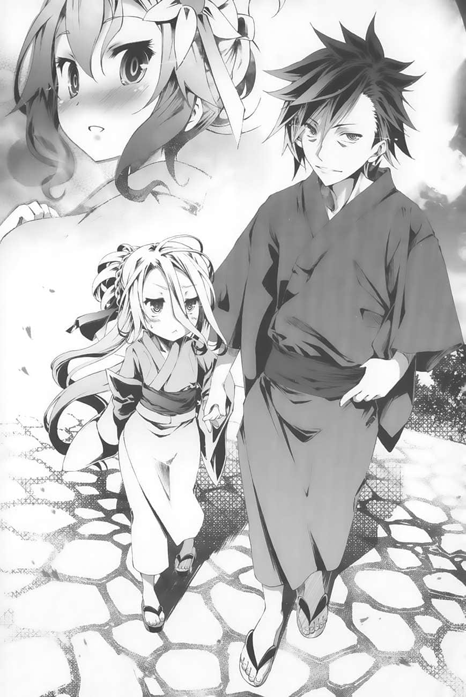
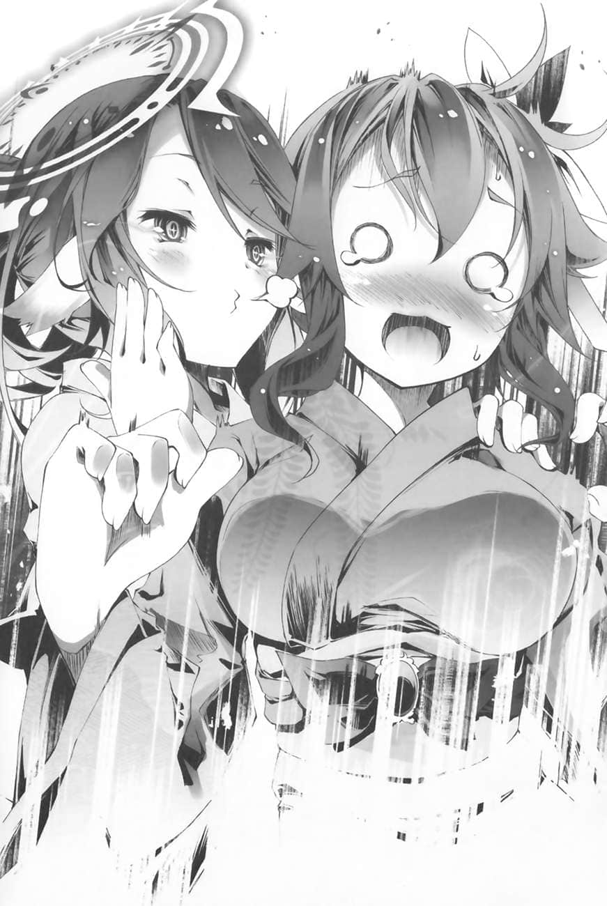
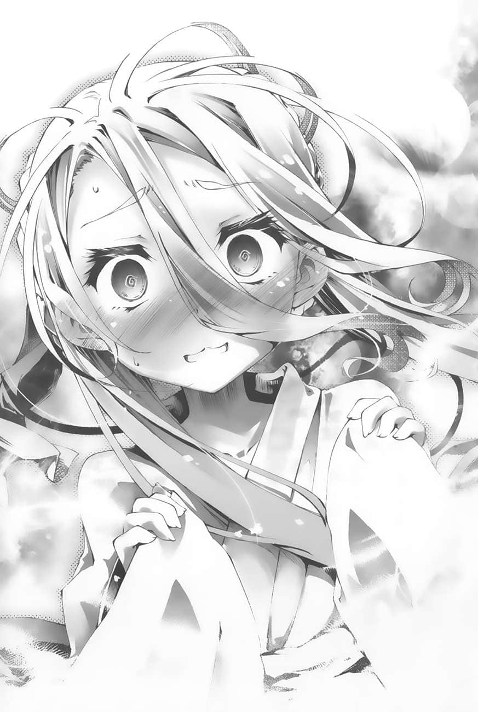
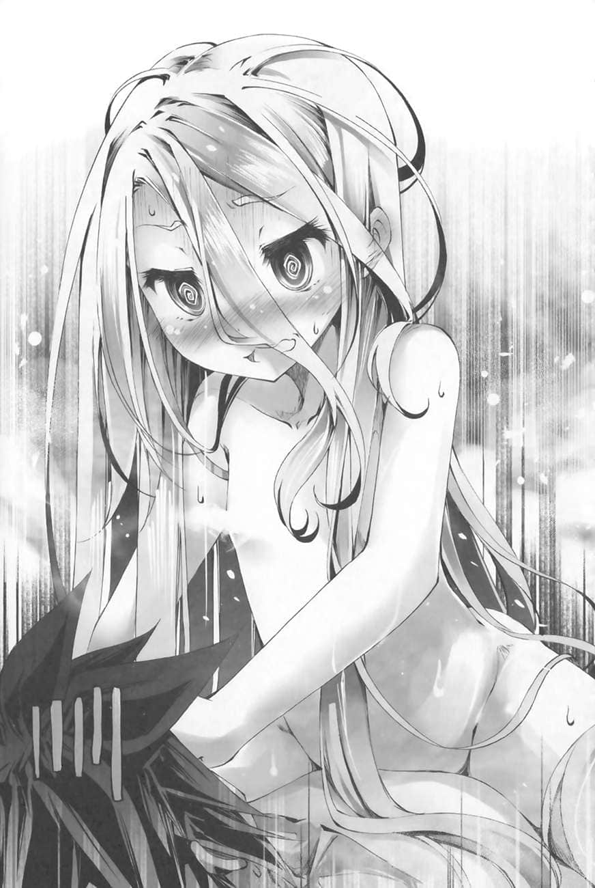

# 第二章 水平思考

> 来源：https://www.linovelib.com/novel/9/163399.html

第八天的晚上。

史蒂芙正沿着一道铺石的阶梯往上走。阶梯向上延伸，直指满天星空。

她身上穿着东部联合的祭典服装（浴衣），活动起来并不方便。脚上穿着发出喀喀声响的木屐也很难行走。

一路上，她好几次差点被绊倒。最后，终于走到了目的地。

但眼前的景象，让史蒂芙呆住了，甚至忘了呼吸。

几个小时之前，这里还只是一片各种花卉盛开的庭园。

但是，佛耶妮可兰似乎改造了空间，现在这里完全变了个样。

眼前的景象，是一个广大的都市，有无数的灯光、熙来攘往的热闹人潮，为文明的灯火所笼罩。

──在东部联合，有被称为『三大祭』的庆典。

兽人种被合并为单一国家之后，原本各部族各自举行的祭典也跟着逐步被整合，最后剩下三种祭典。

其中之一，是在夏至时节于首都巫鴈岛举行的『星卸祭』，是世界上数一数二的盛大祭典。

现在，史蒂芙眼前看到的，就是这祭典的景象。

无数高挂着的灯笼微光笼罩巫鴈，把整个都市映照得耀眼璀璨。

──尤其是目前在中央参道上慢慢前进的大神轿，仿佛一座会动的宝物殿。

参道两旁并排的摊贩都是来自东部联合的美食名店。除了饮食之外，还有各种游戏摊贩，从给小孩子玩的简单游戏到道地的赌博摊位一应具全，更是炒热了祭典的气氛。

更有看头的是『烟火』，据说其光辉足以使红月逊色。

东部联合引以为傲的高超火药科技，在夜空绽放光华──

眼前这片超出想像的壮观景象，比传闻中的还要精彩，让史蒂芙深深地叹了一口气。

──在这种族之间激烈对立的世界，这祭典被誉为是『世界最美的祭典之一』。

即使只有一次也好，史蒂芙从很久以前就想见识看看了。

她唯一帮得上忙的，就是游戏以外的事，也就是治国。

「大家好～～✿老娘是永远的超级底端网红•佛耶妮可兰是也✿讨厌，空空你怎么可以说神圣的观众们是垃圾呢？这样不乖唷唷✿所谓愚民则是身为愚民之王的老娘专用的称呼是也✿啊，各位观众的鞋子脏了呢！让老娘来为大家舔干净是也～舔舔舔舔舔～……啊啊啊啊舆论烧得好旺啊！荧幕被留言挤爆了是也！！」

佛耶妮可兰终于现身，正面对着荧幕哈哈大笑。

──也就是说，坏掉的史蒂芙才是她正常时的样子。

舆论炸锅的火势依然愈演愈烈，让佛耶妮可兰忍不住哀嚎。

看到后方的两人──空与白──不，应该说是看到空的身影时，史蒂芙不由得倒抽一口气，全身僵住不动。

史蒂芙在心里做出如此悲壮的决定，回头一看──

但是，即使少了两人，还有三个人在，这样恋爱直播还是可以继续进行吧？

……看来观众的人数与日具增，让她非常得意。

空稍微看得到荧幕一点点，他发现荧幕上的留言栏有动静，好心提醒佛耶妮可兰。

所幸，就如同空说过的，只有四个人的话要出去是很容易的。

「现在哪是做这种事的时候！？艾尔奇亚都快要灭亡了，谁还有心情欣赏祭典啊！？现在可是分秒必争的紧急状况啊啊啊！！」

无论选择哪一方，都必须断绝对另一方的思念。这样子──

毕竟人类种最后的国家──艾尔奇亚面临灭亡的危机，也就是说，整个人类种都即将灭亡了。

由一层薄布组成的衣裳衬托出两人的魅力，简直不是人间应有。

第八天的直播，就这样在一片匆忙之中开始了…………

本来史蒂芙应该要满心雀跃地欣赏祭典的，但是在昨晚听说了现状之后，现在她只能抱着头大吼。

「很遗憾，不行。史蒂芙才是这场恋爱游戏之中最需要的人才。而且从某个角度来说，现在最接近平常状态的正是史蒂芙。反正总会有办法的，她的搞笑属性可以修正轨道。」

更进一步地说，那单薄布料下的肌肤触感，史蒂芙并不陌生。

虽然佛耶妮可兰翻脸的速度比亚光速还快，不过于事无补。

毕竟在这场游戏中──不，无论是在什么样的游戏中，自己肯定是派不上用场的。虽然很悲哀，但史蒂芙还是有自知之明，知道自己在游戏方面完全不成战力。

听空这么说出对史蒂芙的全心信赖，一行人也觉得莫名地有道理，不约而同地点头。

不知道是为了让自己恢复理智，还是打算往地下挖出一条出路，史蒂芙不断地用额头猛撞铺石地板，发出激烈的叩叩声响，仿佛在挖地洞一样。

史蒂芙继续猛烈地用额头撞起了铺石地面。白以怜悯的眼光望着她，喃喃说道：

但是──

听到两人如此互相钳制，正在用头撞地面的史蒂芙一下子抬起头来。

「这……说的也是……就是为了阻止，我们现在才会这样……」

妳想离开这里的话，就必须跟空结为情侣。

「──不！才不是！这才是真正被植入的情感！史蒂芬妮•多拉！妳干嘛自然而然地陷入有如多情少女一样的思考！？所谓的多情少女其实只是『任谁都好』的烂女人啊啊啊啊啊！！」

只有自己一个人也好，现在应该马上离开这里，赶回艾尔奇亚去。

「怎样啦！？别打扰老娘提升自我肯定感的仪式！！」

为了改变气氛，佛耶妮可兰装出娇滴滴的讨好语调这么宣布道。对空等人来说，这种装出来的口气也听习惯了。

「从留言流动的速度来看……待机室里恐怕听到了妳刚才说的话吧？」

史蒂芙心想，现在不是悠哉地玩乐的时候。

不只是吉普莉尔，依蜜尔爱因也满怀戒心地眯起眼睛。

两人完全没有要安慰史蒂芙的意思，严苛的话语让史蒂芙趴跪在铺石地板上，激动地用额头撞着地面。

既然这样，还不如向盟约宣誓，进行个形式上的游戏，马上与某人配对之后赶快出去。

「喔喔，花了大把钞票，果然不是盖的。好壮观的景象。」

其实，不用等对方回答也知道，这正是今天的游戏『舞台』。

瘦得骨感的体格虽然称不上壮硕，合领下若隐若现的结实胸瞠，看起来仍然十足地像个男人，是与自己不同性别的存在。

姑且不论她们的意图如何，只要跟其中一人一起逃出这里的话，那就够了！正当史蒂芙这么想的时候──

妳有义务这么做，史蒂芬妮•多拉。

在祭典的喧闹声中，吉普莉尔眼光瞪向什么都没有的空中，开口：

美丽的天使与惹人怜爱的人偶，身上各穿着色调华美的祭典服装（浴衣）……

「我说啊……我看不懂妖精语，不知道留言说了什么，可是……」

碰碰碰碰碰碰──！！

既然这样，自己或许该马上跟某人凑成情侣、离开这里。

只是被留下的那一个人肯定出不去，这才是问题所在。

即使一开始只是被植入的恋爱情感，但是现在这份心动，却是真正的──

话虽这么说，只是……

「……所以呢？妳为什么不惜这么大费周章地改造庭园的空间，重现『星卸祭』的情景？请问妳什么时候才愿意说明？还特地准备衣服给我们换上。」

老实说，在今年东部联合刚加入艾尔奇亚联邦之后，史蒂芙决心以『视察』的名义去欣赏祭典，不惜滥用职权，甚至连船都安排好了。如今，虽然是妖精种所造出的景象，但她终于亲眼目睹了祭典。

「大家好～～✿欢迎收看佛耶妮可兰频道的超人气直播企划──『不成为情侣就出不去的空间』第八回！！今天老娘也会奋力主持直播！」

──已经够了，还是坦率一点，不是很好吗？

「……哥……不、不可以……放手喔……」

虽然只是因为受到强制，而且只限于短短的一天之内，但是，那让人心焦的火热恋情仍记忆犹新……

凛然的气质，不同于平常那副散漫的模样。

对了，即使不是空也无所谓，跟吉普莉尔或依蜜尔爱因出去也行啊。

焦虑的史蒂芙背后传来喀喀声响，是木屐踩踏石阶梯的声音。

一看到那两人的身影，她的心绪再度沸腾。

「……哥……我觉得……史蒂芙真的需要……休息……」

这是──多么美好、而且天衣无缝的借口。其实妳自己应该也明白才对。

听背后那人悠哉地这么说道，史蒂芙先是咬紧牙关，然后吐一口气。

「呃、等等，为什么直播还没开始，待机室就舆论炸锅了！？灭、灭火啊！得快点灭火才行！提前五分钟开始吧！转到直播间再留言是也！」

但是，她这么做只是徒劳无功。

「────！」

就这样，吉普莉尔的疑问没有得到解答，心里挣扎、额头正在粉碎石地板的史蒂芙也没人理会。

只要自己回去艾尔奇亚，说不定能够延缓灭亡的速度。

「也就是说，即使现在再怎么着急，很可能也为时已晚。还不如尽情享受眼前的祭典吧。」

而既然准备了如此大规模的舞台，就表示今天要进行的不是先前那些『简单的小游戏』。

史蒂芙顿时感觉胸口一阵紧缩，脑中的另一个自己正在呢喃。

在那之前妳不会先关掉麦克风吗……在场的每个人都这么想。

「【肯定】根据推测材料与经过时间计算，『已经灭亡』的可能性为52•3％。」

「主人，请容我建言。扯后腿的家伙还是愈少愈好，所以还是赶快让小多跟那个大型垃圾一起出去，这样最好了♪」

据空所说，目前艾尔奇亚以及复数的种族正濒临灭亡的危机。

「────！」

「史蒂芙，先别激动。目前还不确定真的正在濒临灭亡。」

「唔喔喔喔喔喔喔让我出去啊啊啊！！我的国家！！我的祖国！！人类种有危险啦啊啊啊！！」

为了拯救祖国，除了跟空成为情侣，没有其他的办法。

「呼～哈哈哈哈是也！！看啊！！那些之前说老娘是底端网红的家伙们，现在每个都挤在待机室等着看老娘的直播，就像在畚箕前等着被扫起来的垃圾一样是也！！如今再也没人敢说老娘是什么底端网红了是也！！身为超☆人气网红，老娘成为顶尖网红也是指日可待是也！！愚民们！还不把头压低一点，跪拜老娘、赞颂老娘，向老娘俯首称臣吧！！嘎～哈哈哈哈！！嘎～哈哈哈哈！！」

──噗通……

「──不！现在可不是怦然心动的时候！振作点啊，史蒂芬妮•多拉！！那只是私情，而且还是错觉！！」

「！呃、等等，是谁把待机室的留言直接搬来贴上的！？也不准用截图的方式，封锁是也！啊，这是什么……剪接影片！？才两分钟不到的时间就做出了这种东西！？乡民的手脚会不会太快了是也！？应该说你们到底有多闲是也！？」

──噗通……

---

■■■

她对着空中这么问道，口气非常不悦。

啊啊……到底该跟谁凑成情侣才好呢？

现在可不是在乎什么少女情怀等私人情感的时候。

「【提醒】检测到多小姐的SAN值骤减。建议尽速休养。具体建议，与号外个体结为伴侣，即可被排除至本空间（游戏）之外，强烈建议。这想法太高明了。好主意。」

跟自己一样，空的身上穿着东部联合的祭典服装（浴衣），牵着妹妹（白）的手站着。

但是，这也是理所当然的。即使这里是异世界、即使观众是不同的种族，舆论炸锅的现象也跟人类的世界一样，愈是想粉饰太平，反而是火上加油。

「呃、这、这个嘛……总之！请大家今天继续收看老娘这底端网红的直播是也！今、今天的内容跟以往可不一样是也！」

没错──唯一的灭火手段，就是提出更引人注意的话题。也就是──

「各位，听了可别吓到是也！！今天的游戏舞台是＿登登！重现了『星卸祭』场景的大舞台是也！而且将由『 （空白）』二人组全面协助企划是也！！」

「……大家、好……耶……」

「各位妖精种的朋友们大家好！！我是今天游戏的执行总监『 （空白）』二人组中的哥哥，十八岁处男！！最喜欢的是受骗的家伙脸上那『什么啊！？』的傻瓜表情！！兴趣与特技是骗人！！永远征女友中♪」

「耶────！！多么精彩的问候语是也✿大家请掌声鼓励是也──！！」

「什么啊！？」史蒂芙大声地惊呼道。

就如同佛耶妮可兰的企图，不只是观众与史蒂芙，就连吉普莉尔与依蜜尔爱因也发出了惊讶的呻吟声。

对了，这就是我要的表情，我最喜欢了──空非常地感动。

准备这种大费周章的舞台，佛耶妮可兰到底想要他们做什么？

对于吉普莉尔如此的疑问，其实，空与白早就有了答案。

应该说，这其实是今天早上空与白主动向佛耶妮可兰提议的企划！！

「顺带一提，舞台与服装的费用都是由这两人自掏腰包，花掉了1340万的『支援（课金）』准备的是也！！请各位观众再次以热烈的掌声鼓励这么慷慨的两位！！」

「什、什么啊！？这是怎么回事……啊啊啊啊！？剩余金额竟然是0！？」

听了佛耶妮可兰的补充，史蒂芙连忙拿出平板电脑来确认余额，再度大声惊呼。

没错，老实说，构成这『星卸祭』场景的所有要素，包括舞台、人潮（NPC）、祭典服装（浴衣），全都不是佛耶妮可兰准备的舞台装置。

而是空消费『支援（课金）』普通地『购买』的东西。就像史蒂芙之前在庭园里挖井、在客厅里增建厨房那样。

因此，余额真的完全归零了，连今晚的饮食都没有着落……

「好了！相信大家心里都有一样的疑问──也就是『准备到这种地步，到底是要做什么？』，答案即将揭晓！！那就是──今天的游戏内容是也！！」

「……你有话要说吗？」

「原来如此……确实从来都没人说过『所有人在同一个地点开始游戏』。」

「但是！！在这段期间，『绝对不能心动』是也！！」

五分钟似乎是过了。佛耶妮可兰马上这么宣布。同时，五人突然被泡沫包围住───下一个瞬间，同时消失无踪。

这场游戏的真正目的，只是要赚取『支援（课金）』，也就是『灵魂（钱）』。

「咦？这、这么说好像也是……？」

也就是说──

史蒂芙则是坚信『肯定不只如此，而且保证没好事』，冷漠地半闭着眼睛盯着兄妹俩。

不过，史蒂芙、吉普莉尔与依蜜尔爱因却不这么想。

「什么！？等一下，我先去换一下衣服……不对谁在跟你说这种事！？」

史蒂芙持续苦思，同时尽量不去注意祭典的『热闹景象（诱惑）』。那是多么地诱人，仿佛稍微一松懈就会怦然心动。

──就只有这样吗？

如果双方共通的胜利条件是凑足50亿的话，状况就完全不同了。

说不定，就连为壮观的景象感动、或者是尽情地享受美食也会超出安全线。

心动的话就必须接受处罚，任由佛耶妮可兰操纵身体90秒钟。

「──『第一回•紧张刺激！绝对不能心动的夏季祭典2小时』！！」

史蒂芙转头责问突然出现在背后的吉普莉尔。

这之间还不忘吊足胃口，加了长达十秒钟的连续击鼓音效。

谢谢妳们的信赖，当然不止如此，────他在心里这么说道。

……两个小时都不心动。

佛耶妮可兰高声地如此宣布，同时背景升起更热烈的连发烟火。

空这么说道。不过，只有史蒂芙一个人不解地斜着头。这时候──

「……………………」

「……呼～❤」

「既然知道艾尔奇亚以及复数种族濒临灭亡的危机，哪有闲情逸致做这种事！？我要处在什么样的精神状态下才有办法在这种时候心动！？」

只要想到这样的状况，根本不可能会心动的！

如此明了地说明过后，史蒂芙似乎是理解了，姑且点头回应：

「咦……？小多刚才的心跳应该一下子激增了不少才对，手表却没有反应。看来这场游戏所指的『心动』应该只限于恋爱情感方面。既然这样，我该怎么让小多心动呢？这很难呢……」

（不！！只要有一颗忧国忧民的心，任何拷问我都能忍受！！）

「好啊！有明理的伙伴真是幸福♪」

参道上并排的摊贩，都是来自东部联合各地的名店，贩售的自然是引以为傲的美味饮食。虽然只是由空与白透过『支援（课金）』──也就是妖精种的能力──造出的东西，但是摊贩所贩卖的商品当然都是真的，实际上也可以饮食。因此，史蒂芙正在拚命地抵抗香喷喷的强烈诱惑。

但是，就是因为这样──史蒂芙以外的人，也就是吉普莉尔与依蜜尔爱因，都察觉了空的真正意图。

顺带一提，随着佛耶妮可兰的说明升起的烟火，一发要价1万。

佛耶妮可兰结束了她的说明。但是──

对目前的史蒂芙来说，这是不可能的。但是她自己却完全没有自觉。

接着，佛耶妮可兰说明处罚游戏的内容。

刚才差点因为心动而死的人，竟然有脸说这种话……？

「只要在两小时内『一次都没有心动』就赢啰！无论是几个人都行，而且还会依据赢家的人数提供『奖赏』是也！另外，『心动次数最多的人』跟『第二多的人』必须按照惯例，在一天之内强制成为情侣！以上是也！！」

也就是说，一旦心动了，身体就会任由佛耶妮可兰操纵。

「至于『处罚游戏』的内容则是──『在90秒内身体的一切操纵权全都归老娘所有』是也啊，当然，老娘是不会危害你们的。再说，在誓约的限制下，根本不能那么做。所以你们大可放心是也✿」

这些眼光让空打从心底感到痛快，以满面的笑容回应她们。

「妳、妳这是在做什么！？吉普莉尔！」

……虽然刚才被空打发，但是仔细想想，真的只要在这祭典会场待上两个小时就够了吗……？

「好啰～那就准备开始游戏是也！！预备……开始是也！！」

空根本没把『没有任何人心动』的可能性列入考虑之中。因此……

「总之，妳放心吧。这场游戏，我们一瞬间就能赚回投资的份。」

「咦？还有什么好说明的吗？」

接二连三的惊喜，让观众之间的舆论炸锅在转眼之间平息。

不愧是那两个人构思的企划──这根本就是一种拷问……！

突然，有人从背后朝着她的耳朵吹了一口气，瞬间粉碎了她的决心。

身体的自由被剥夺，而且不知道佛耶妮可兰会操纵来干出什么样的好事，确实有点不妙。但是，这样的处罚难免给人『就只有这样？』的印象。

至少观众们肯定都是这么想的。

我要让心灵归于虚无，撑过这两个小时。

意外地，史蒂芙竟然察觉空顾左右而言他地避开了的最大疑问，怒吼质问道。

「我处男王空虽然对恋爱一窍不通、一无所知，但是！！如果只是要赚钱的话，真正需要的其实是我身为『骗徒』的手腕！！在这方面，我可自认是『行家』呢！难怪我会答应了！」

不只是观众，就连史蒂芙等三人也屏息凝神，等待下一句话。

史蒂芙这次很难得地马上掌握状况，走在充满祭典气氛的热闹参道上，同时思索了起来。

「我要真的凑到50亿。为此才主动提议了这次的计划，也就是我们的『集资装置（系统）』。」

「那么，游戏将于五分钟后开始是也！现在老娘就先回覆各位的留言是也✿喂，够了没！？别这么纠缠不清，待机室的旧帐你们到底是要翻到什么时候啦、？咱们当然是要活在当下、眼看未来──是，老娘知错，老娘下跪就是了！！」

「呀啊啊嗯！？」

史蒂芙一下子满脸通红，脚踩内八。不过她马上摇了摇头，大吼了起来。

「……原来如此。既然这样，事到如今也不跟你计较为什么没跟我们商量就擅自花掉1340万的『支援（课金）』了。反正就是老样子，我习惯了。真要说的话，如果可以允许这样浪费，那回去之后也要马上让我买浴池喔。」

「规则很简单这五人必须要在『星卸祭』中度过这两个小时──就只是这样是也！！」

「那还用说！？当然是这个企划（游戏）的真正意图！什么不可以心动的夏季祭典！？莫名其妙！」

以恋爱为目的的游戏……这完全是空所陌生的领域。不但莫名其妙，而且空不可能同意参加这种游戏。因此，说来惭愧，空在一开始的时候一心以为这场游戏是败北后的处罚游戏，为此消沉了好几天。但是──

一开始的时候，空以为这游戏的目的是『让我们跟彼此谈恋爱』。

之后史蒂芙看到支出明细的时候会有什么表情呢？空在内心偷偷地期待着。

为了拯救艾尔奇亚，这是现在的我唯一能采取的行动！！

出于对两人的尊敬与信赖、或是信仰，吉普莉尔与依蜜尔爱因的脸上浮现了桀骜不驯的微笑。

---

■■■

「但是，你还没说明最重要的部分。」

──而且还不知道这手表（心动感应器）的『心动』基准到底是什么呢！

空很清楚，在荧幕另一端的观众们肯定都这么想，而且内心一定很疑惑。

是啊！现在正是攸关艾尔奇亚与全人类种生死的关键时刻。

空与白规划的游戏，是不可能这么简单的。

「这还用问？佛耶妮可兰本来就是跟我们同一阵线，既然这样，当然要跟她『共斗』了。」

史蒂芙如此告诉自己，怀着钢铁一般坚定的决心。但是──

佛耶妮可兰这么说的同时，五人的右手忽然出现有如手表一般的物品。

吉普莉尔却是一点歉意都没有，只是一脸不解。

空与白、佛耶妮可兰以外的人，头上都冒着满满的问号。

佛耶妮可兰正在对着荧幕深深地低头。史蒂芙瞥了她一眼，接着继续冷冷地望着空，问道：

但是，佛耶妮可兰不顾众人的疑惑，在更热烈的祭典歌谣声伴奏下继续兴高采烈地说明道：

「现在，五人的右手都装上了『心动感应器』是也！一旦心动的幅度超越安全线就出局！！必须马上接受『处罚游戏』是也！！」

没错，在这场游戏之中，佛耶妮可兰并不是敌人，而是同伴。

毕竟『星卸祭』可是世界上数一数二的盛大祭典。这热闹的景象，光是在视觉上看了都忍不住要感动，现在更加上了嗅觉方面的可怕刺激。

「你怎么跑到『主办者』那一方去了！？到底在想什么！？」

──如果恋爱其实并非『目的』，只是『手段』的话，状况就完全不同了。

为了让观众也就是妖精种们肯拿出钱，才选择以恋爱做为题材。

白与吉普莉尔、依蜜尔爱因都这么想，冷眼盯着史蒂芙。至于空，则是一派轻松的样子。

──看来是在宣布游戏开始之后，我就马上被移动到祭典会场的某处了。

「很简单，『别心动』就好了。所有人都不心动的话，我们就能一次得到五份『奖励』，也就是五个提问权。有五个提问权的话，我就能厘清所有的疑问。我们只需要努力撑过这两个小时就行了。」

她们很肯定，既然是空与白规划的游戏，肯定『不只如此』。

既然这样，终于能说明空为何会同意参加这种游戏了。因为──

「嗯？这个嘛……兽人种的祭典服装（浴衣）──其实我们原本世界的浴衣也是一样──『不穿内衣裤』的说法是骗人的。自古就有穿，现在大家也都有穿。」

吉普莉尔大方地笑着说道，毫不掩饰想让史蒂芙心动的意图。

「为、为什么！？这场游戏，要是所有人都不心动的话，就能得到五个提问权耶！我们应该……」

史蒂芙不知所措，连忙抗议道。

「错，小多。那是不可能的。之所以这么说，有两个根据───」

吉普莉尔竖起两根手指头反驳道。

「第一，主人说得很清楚，这次的企划（游戏）是『集资装置』。如果我们全都不心动，只是平静地度过这两个小时，那就无法得到足够的『支援（课金）』，甚至无法回收投资的成本。」

──是、是这样没错，可是……

「第二。对小多妳来说，整整两个小时都不心动是不可能的任务。别说主人了，妳就连看到我穿祭典服装（浴衣）的样子都会心动了，怎么可能两个小时都心如止水？除非昏睡，否则是不可能的。」

不给史蒂芙反驳的余地，吉普莉尔轻描淡写地继续说道：

「也就是说，这场游戏──虽然愚昧如我绝对无法推知主人的深思熟虑，但是很明显地，最后一名──也就是『心动次数最多的』肯定是小多妳。」

这、这是肯定的吗……？

「不，与其说是肯定，应该说是确定、也可说是必然的结果。总之，我的语汇能力无法找出最合适的形容词……该说是『与已成为事实的「过去」同等的，无法变更之确定事项』吧。」

有、有这么严重吗？甚至到吉普莉尔的语汇能力无法形容的地步？

史蒂芙翻了白眼。而吉普莉尔则是一脸担忧地继续说道：

「但是，这样一来，还真的不知道在这场游戏中该怎么行动才是对的。」

「妳说……该怎么行动？」

「大家的目标都是『让自己跟空（主人）成为心动次数最多的两人』，并且与他成为一日限定暂时情侣。但是在目前这样的前提下，这个目标已经根本性地无法成立了。」

「妳在乎的是这种事！？」

不，或许真是这样。假如事实真的像吉普莉尔说的那样，自己无疑是心动次数最多的最后一名的话，那这场游戏之后会强制成立的情侣必然就是『史蒂芙与某人』……

「因此，大家只能退而求其次，看看能让哪个人成为心动次数第二多的玩家，这才是胜败的关键♪也就是说，目标变成『让别人跟小多配对，并且让空（主人）退出争夺战』这样♪」

难道本机在无意识之间对号外个体有了好感，甚至容许她这样对本机恣意妄为……？

另外，她也没必要让吉普莉尔对自己心动。

「【宣言】号外个体的企图──也就是与主人成为情侣。除此之外，还想在性交之后被主人说『妳怎么还没走？我想要做的时候再找妳，快滚，少给我摆出一副女朋友的架子』，是非常扭曲的愿望。本机会全力阻止这两个企图。」

「【好消息】号外个体的企图将会以失败收场。因为本机会阻止她。」

既然这样，即使佛耶妮可兰以『竞标』的方式决定具体的『操纵方式』也完全没有问题！

观众们──妖精种们会要求佛耶妮可兰操纵吉普莉尔与史蒂芙做什么事？

「【否定】【拒绝】【反驳】这种论调完全是狡辩。【假说】本机未侦测出害意，因此没有拒绝被扑倒，仅是如此而已。实际上，本机的手表（感应器）没有反应。本机的爱只属于主人一个人。【必然】本机是属于主人所有……羞。」

既然这样，就必须设法逃离吉普莉尔。

「我、我没有！我只是听到她这么说，当下想像了一下子……都、都是妳啦！妳这废铁！！」

依蜜尔爱因确实是吉普莉尔的敌人……

（既然这样……只好由我设法让吉普莉尔心动了！）

也就是在90秒内身体的自由完全被佛耶妮可兰剥夺！

但是，吉普莉尔似乎完全看透了她的心思，一句话就让她陷入绝望。

依蜜尔爱因好不容易才勉强看清以神速扑过来的吉普莉尔。

难怪空刚才说『一下子就能赚回投资的份』，真正的目的就在这里。

──本机不只判断速度致命地缓慢，甚至疏于试算可预测的危机。

「────！？」

但是──佛耶妮可兰接下来公布的答案，不是说给三人听的，而是对观众说的。

但是，这不代表她就必然是史蒂芙的同伴。

史蒂芙认为吉普莉尔的解读可能是正确的。

吉普莉尔如此宣战，同时优雅地行礼。史蒂芙只觉得不寒而栗。

身为机凯种，应对状况的速度却如此之慢，实在惭愧。

「我会在这两个小时内全力追求妳，设法让妳心动。」

刚才好不容易巧妙地诱导吉普莉尔与史蒂芙两人心动。

即使如此，观众的要求仍然没有意义。

「……是吗？既然这样，依蜜尔爱因，为什么妳会被扑倒？」

空与白所策划的这场游戏，至今仍不明白这种罚则的意图究竟何在。

史蒂芙这么想，开心得双眼闪闪发亮。但是，她又忽略了即使不必仔细想也知道的事实。

现在的吉普莉尔与史蒂芙完全无法凭自己的意志控制身体，即使是眨眼也不行。

──『在90秒内身体完全任由佛耶妮可兰操控』──

游戏参加者确实同意了罚则的内容，也就是任由佛耶妮可兰操纵自己的身体90秒钟。

在有如惊涛骇浪般的『支援（课金）』音效中，三人终于明白了如此的意图。同时──

「────」

…………？

依蜜尔爱因潇洒地登场，挡在史蒂芙的面前，像是在保护她一样。依蜜尔爱因的背影让史蒂芙原本绝望的双眼再度有了希望的光辉。

现在一旦心动，后者就会占上风。

佛耶妮可兰高亢的广播声响遍整个会场。

但是，即使是这样──即使空与白规划这场游戏的真正意图，真的如吉普莉尔所推测的，史蒂芙也绝对不能心动！

不用说，当然是接着『让本机心动』的某种行为。除此之外不会有其他的可能！

长达60秒的课金风暴止息的那一瞬间。

但是，怎么做？

依蜜尔爱因如此嘲笑道。

没错──根据规则，『心动就必须接受处罚游戏』。

没错──依蜜尔爱因的目标是让史蒂芙与吉普莉尔心动，也就是说，她是敌人。

虽然现在的吉普莉尔无法使用魔法，但是她之前曾在禁止魔法的游戏中展现了接近物理极限、足以跟兽人种抗衡的体能。就算史蒂芙混入祭典的人潮之中，刚才也马上就被吉普莉尔找到了，不可能逃得了的。

────

史蒂芙与吉普莉尔两个人都愣住了。随后──

于是，在妖精种观众们的指示下，吉普莉尔精准地阻止了依蜜尔爱因的逃亡。但是，仔细想想──

「啊啊啊啊啊！这下子失去提问权了！！不、不是的！在我的心目中绝对不是依蜜尔爱因比艾尔奇亚的存亡重要……话说吉普莉尔，想不到妳竟然有那种愿望！？」

『好了，接着该进行「处罚游戏」是也！』

依蜜尔爱因承认自己应对得太慢，才会被断绝了退路。

吉普莉尔这么总结自己的推理。也就是说──

……也就是说，吉普莉尔在游戏中的行动目标是──

听到佛耶妮可兰如此广播，不只是当事人依蜜尔爱因，就连30秒的限制时间结束、身体恢复自由的史蒂芙与吉普莉尔，也为妖精种观众们的能耐感到不寒而栗。

『接下来的30秒内，要让吉普莉尔与史蒂芙做什么好呢？咱们这就「由观众决定」是也！最后将采纳「最多人支持的『支援（课金）』留言」是也！募集时间为60秒！！来吧来吧！欢迎大家提议，尽量留言是也──！！』

「小多，我是绝对不可能对妳心动的，放弃吧❤」

完了──而且吉普莉尔竟然坚称绝对不会对史蒂芙心动，这让史蒂芙遭受了意外的打击，眼眶不由自主地泛起泪水。但是──

难道……这就是……在空间内恋爱感情随时间增幅的影响……？

────？

依蜜尔爱因也提高警觉，谨慎地等待佛耶妮可兰的下一句话。

「我要尽可能让小多跟那个废铁心动，这就是主人在这场游戏中真正的要求。这是我能想得到的最佳解答，妳觉得如何呢❤」

只要在这段期间找个地方躲上两个小时就行了！

对于她的如此反应，提问的史蒂芙──不，应该说是操纵史蒂芙这么说话的妖精种观众们，指正了她。

这次换史蒂芙在她的耳边如此娇声细语道。

但是，依蜜尔爱因的如此反驳以及感情的走向，其实都在妖精种们的掌控之中。因此──

『另外，其实史蒂芬妮在依蜜尔爱因潇洒登场的时候就已经出局了是也✿老娘可是识相地等到适当的时机才跳出来宣布，快称赞老娘的主持功力是也！』

她认为这『处罚游戏』才是两人真正的目的所在。

更不妙的是，眼前吉普莉尔雀跃地思索『该怎么对小多发动攻势』的模样、以及当下的如此状况，已经足以让手表（感应器）的指针快要转到安全线之外了！！

也就是──

但是即使看清，身体也来不及反应，一下子就被她扑倒、压在地上。吉普莉尔的脸色红润、呼吸急促，面露妖艳的笑容，舔了舔唇。看着她如此的表情、感受着她的体温的同时，依蜜尔爱因忍不住咒骂自己的性能不足。

顿时──依蜜尔爱因体验到了无比恐惧的情绪，甚至差点当机。

不妙、不妙、不妙，这下子真的不妙！

「如果对方打从心里拒绝，那这样的行为本身就是『危害』，在盟约的限制下是不可能成立的。既然这样，为什么吉普莉尔还能扑倒妳呢？真是不可思议呢！妳说是吧，依蜜尔爱因❤」

『登登──！！就是这样！！就如同各位观众的预料，依蜜尔爱因这下子也出局了是也！！』

这种意图不明的『处罚游戏』究竟意味着什么？

对于依蜜尔爱因的如此主张──

有90秒的话，至少能够逃离吉普莉尔的眼前了吧！

为什么被扑倒？当然是因为号外个体扑倒了本机。这个问题真是莫名其妙。

这号外个体不过是把本机扑倒、压在地上而已，本机怎么可能因为这样就心动？

指针真的转到了安全线之外，两人同时尖叫了起来。

这次两人完全让依蜜尔爱因称心如意，被狠狠地摆了一道。吉普莉尔愤怒、史蒂芙悲叹，依蜜尔爱因则是面无表情地嘲讽两人。但是，不管她们如何反应──

为了拯救艾尔奇亚，史蒂芙想要的结果是『一次都不心动而获得提问权』；另一方面，却又想满足自己的恋爱情感。两相冲突的意志正在心里拉锯。

佛耶妮可兰如此的广播声响起的同时──吉普莉尔与史蒂芙停顿住了。

──这下子真的不妙了。

────…………什么？

刚才耳朵被吹了一口气的时候，假如在事前就知道对方是吉普莉尔的话，恐怕就会『心动』，也就是出局了──现在的自己，就是这么地不堪一击。

（那是绝对万万不可的啊啊啊！）

「【肯定】号外个体的推理与本机的推测大致一致，本游戏的目的确实是设法让多小姐与其他玩家配对。但是结论不同，该与多小姐配对的是号外个体，也就是妳～」

「【报告】徒劳。本机对号外个体在恋爱方面心动的机率──本机敢说，绝对是0。」

听她这么说道，史蒂芙与吉普莉尔同时连忙确认手表（感应器）。

──只要让她『对空』心动即可。

她完全被妖精种观众们诱导，彻底被摆了一道。

这话是什么意思？三人顿时满头问号。

后来也理解了『处罚游戏』的内容。在这个时间点就该马上撤退的。

但是一下子之后，吉普莉尔与依蜜尔爱因马上理解了意思，惊讶不已。

对了！即使吉普莉尔想让我跟依蜜尔爱因凑成一对，依蜜尔爱因本人是绝对不会甘心接受的！既然这样，依蜜尔爱因跟我就是同一阵线了！真是多么地可靠啊！

──……

『登登──！！吉普莉尔与史蒂芙！！两人都出局了是也！！』

先是让依蜜尔爱因自觉对吉普莉尔有一点意思。

然后引导她为了空而心动──而这正是当下最有机会让她自掘坟墓的契机。

妖精种观众们竟然能在短短60秒内完成这种神机妙算的计谋，实在是太可怕了。

『好了，观众们接下来要让依蜜尔爱因做什么呢！？60秒的留言时间，开始是也！！』

佛耶妮可兰继续要求观众们发挥同等的神机妙算。

「吉、吉普莉尔！？放、放开我的手！！」

「……小多……先冷静下来……」

──现在换依蜜尔爱因被操纵，接下来的猎物当然是我们。到时肯定会被她搞得心动──

史蒂芙也察觉了这一点，当下判断现在唯一能做的，就是在这观众决定要求前的60秒内马上落跑。但是，万分冷静的吉普莉尔拉住了她的手，阻止她逃跑。

「小多，我跟妳还有这废铁都『出局过1次』了，已经失去了提问权。所以，现在再怎么逃也没有意义。」

这么说确实没错。

只是，这个在游戏一开始就试图剥夺我的提问权的人，实在没资格跟我说这些吧。

史蒂芙心里这么想，冷冷地瞪着吉普莉尔。不过──

「这样的展开，正是主人们的意思──也就是借着我们三人互相拉锯来赚取『支援（课金）』。既然这样，我愿意遵从主人们的意思。我们本来就没有选择逃跑的道理。」

吉普莉尔毅然地这么说道。

「更何况，我怎么可能会因为害怕为那块废铁心动而逃跑？那是不可能的。」

不可能，绝对不能有这种事──吉普莉尔的意志非常坚决。

于是，在观众们的要求定案前的60秒内，依蜜尔爱因完全动弹不得，而吉普莉尔则是与之对峙，等着正面迎战。

但是，气氛非常紧张。大气在震动，地面在摇晃，仿佛要同时使出『伪典』与『天击』的前兆。

──无论依蜜尔爱因要怎么出招都无所谓，随时欢迎放马过来。

「……嗯？可是这样一来，大量课金以外的观众不是会离开吗？」

两人，并没有参与其中。

────…………

被人潮吞没的同时，空一个不小心放开了手，眼光一下子就追丢了白的身影。

接下来，兄妹俩只需在这里悠哉地等待游戏结束，然后就能得到庞大的收益与两个提问权。

──于是，情况完全如空的预料。正如他所说的，频道订阅人数当下激增，事前投资的金额也在一转眼之间就全部赚了回来。『支援（课金）』不停地滚滚而来，金额比昨天为止还要多了好几位数。

光是这样，就能完成一个有希望赚到50亿的『集资装置（系统）』。

观众如果要让自己想看的发展成真，就必须拚命地砸下『支援（课金）』，而且还要尽可能多拉拢一些同志──也就是想看到同样发展的其他课金者。

于是，夏季祭典在空的心目中，从『厌恶』升等为『憎恨』的对象。

如今，两年过去了。没想到还要再参加『夏季祭典』……

「以观众的要求内容做为『支援（课金）』的对象，最后采用金额最高的要求，来决定接下来的发展。也就是说，最后有权决定的不是『投了最多钱的那一个人』，而是『支持了「总额最多的选项」的人』。」

---

■■■

「不，绝不让妳走。」

那是忘也忘不了的夏日回忆……两年前，空十六岁，白九岁。

这样一来，观众就会拚命地呼朋引伴，频道订阅数也会因此增加。

非常抱歉，这个论点不接受任何反驳。

因为──这是强调过很多次的事了，空对恋爱一窍不通，对恋爱类游戏也完全不熟。

史蒂芙又想逃，吉普莉尔用更强的力量抓紧，继续说道：

──然后，两人走散了。

怎么反驳？除了让情侣卿卿我我、嘻嘻哈哈地享乐之外，还有什么理由说服人们去那种场合人挤人、在摊贩花八百日币这种贵得让人怀疑脑袋有问题的价格，吃实际上不怎么好吃的小吃与棉花糖、甚至甘心笑着原谅射不倒的打靶与没有中奖签的抽签，这种有如诈欺犯一般的摊位？

『登登──！！史蒂芬妮，第十四次心动是也！！同时，吉普莉尔第八次心动是也！！』

「总之，就是来一场观众参加型的游戏。以『支援（课金）』为条件，让观众有机会与登场人物互动、或是影响剧情发展。比方说──让付了最多钱的观众决定接下来的发展。」

然后，他可怜兮兮地边哭边发抖，为了寻找被人潮冲走的白，不停地在人潮中奔走。

只等于是『顺便进行的余兴节目』而已。真正的好戏接下来才要上演是也……！

不管空怎么问，白就是不肯说明理由。只知道她的决心相当地坚定。

「吉普莉尔！如果妳真的认为『自己绝对不可能心动』的话，根本不需要拉我垫底吧！？啊啊啊啊快放开我！我不想要再让我的少女情怀被玩弄了，啊啊啊啊！！」

是向神明祈祷五谷丰收、天下太平的日子吗？

『登登──！！虽然不知道为什么，但是史蒂芬妮竟然超标第二次了！出局是也！』

而是因为他竟然想得出这种有如恶魔般的主意，而且非常自然，仿佛呼吸，仿佛在叙述水由上往下流等自然道理那般地理所当然。

两人那个时候早已拒绝上学，在家当茧居族当了很长一段时间。

今天早上，空找来了佛耶妮可兰，把自己的企划慢慢地告诉她。

这次为了避免走散，空与白打从一开始就要求把他们转移至后山的山顶上。

更何况，他不可能跟白分开，在不同的地点开始游戏。

两人手上拿着用『支援（课金）』购买的苹果糖，坐在一棵倒下的树干上，俯瞰『夏季祭典（游戏）』的景象。

「如果只是要观众出钱的话，事情就简单多了。那就是让观众也参与其中。」

「我们随时都有机会看烟火，在哪里都看得到。」

────…………

──就只是这么简单。

空的主意让佛耶妮可兰听得哑口无言。接着，空这么总结道：

空连忙跑过去，将白拥入怀中。但是，白却仍然哭个不停。

不只如此，现在还能让她们追求彼此、让彼此心动，搞不好还真的有机会使其成为真正的情侣。

这些都算得上是祭典的『起源』没错。

（那些孩子果然是太棒了是也！！果然值得老娘押一把在他们身上是也！！）

只要想到白应该也在哭泣，他便压抑着想缩在地上的冲动，不停地四处奔走。

要不然就是那些关系处于朋友以上、恋人未满状态的人们──也就是可恨的情侣候补──也就是现充们专用的活动！这一点是不容置疑的事实！

在一座微高的山丘上，从这里可以一眼眺望整个『星卸祭』的景观。

---

■■■

那时候两人已经把自己关在狭窄的牢笼里，关了很久。但是，白却突然主动说要出门，而且偏偏还是去参加夏季祭典，走进拥挤的人潮中。

具体来说，就是──

这样一来，就能让观众主动掏腰包付钱（灵魂），让剧情走向最多观众想要的发展。

（空啊……你还真的是如你自己所说的，对恋爱一窍不通是也。）

「妳爱跟她拚是妳的事！让我走也无所谓吧！？」

……最后，他终于找到了白。祭典结束之后，在人潮散去的神社外围的角落。

吉普莉尔决意绝不心动，还要反过来迎击。她张开双翼，绷紧全身。

既然这样，不如完全置身事外，转战幕后比较合理。

害怕，并不是因为当时空提出如此建议的时候笑得很邪恶。

「追根究柢来说，妖精种比任何人都还要熟悉他人的恋爱。集妖精种的智慧想出来的恋爱戏码，肯定比我们自己想的还要精彩好几倍，根本不需要我们自己想破头吧。」

所以，不用说，没有女朋友的时间＝阳寿的空，从以前就非常讨厌夏季祭典。

如今有机会任意决定她的行动，做出各种有趣、好玩的事……光是这样就值得付出灵魂做为代价了！

是向祖先的灵魂致谢、供养的日子吗？

等等，吉普莉尔这么说的意思，不就是说──

本质上来说，夏季祭典应该是情侣穿着浴衣、手牵着手亲热的活动才对！！

于是，空也下定决心，跟白手牵着手，走向住家附近的夏季祭典的会场……他已经不知道几年没去过那个地方了。

不过，话说回来──佛耶妮可兰又想到了另一件事。

比起跟依蜜尔爱因在一起，还不如跟我成为情侣比较好……是这个意思吗！？

每次广播声响起，手机荧幕上显示的『支援（课金）』余额便跟着急速激增。

祭典的人潮那么多，要是跟两年前一样走散的话，那可不得了。

但是，那完全不是夏季祭典的本质。

没错──空与白打从一开始就不在祭典的会场之内。

「没错。所以也要准备让少量课金者联合起来即可胜过大量课金者的机制。」

于是，机凯种与天翼种这两个势不两立、曾经斗得天崩地裂的种族，现在正在跟一个人类种的少女混在一起谈情说爱，追求彼此。

「……烟、火……放完了……」

看到如此现况，佛耶妮可兰根本笑不出来，只能害怕得发抖。

以这个速度看来，恋爱活动应该已经顺利地成了受众人热爱的话题。确认如此事实之后，空的脸上浮现不屑的冷笑。

「啊啊啊我就说吧！哇啊啊啊啊我受够了！啊啊啊啊啊啊啊！！」

说起来，『夏季祭典』究竟是什么？

「怎么可以让我跟那废铁沦为心动次数最多的第一跟第二，被强制凑成情侣呢？那是不应该的，比逃跑还要罪该万死。最后一名是小多妳，这是已经确定的事。」

────…………

史蒂芙这么大叫。不过，这时候她心里突然浮现了一个想法。

只要是知道历史的人，看到如此状况肯定会怀疑自己的眼睛。这么稀奇的景象，让『支援（课金）』的金额不停地增加。但是，佛耶妮可兰却笑不出来，反而感到不寒而栗。

他说得若无其事，没有一丝情感波动。

空拚命地这么安抚白。但是，白却没说什么，只是不停哭泣……

也难怪观众们会热心地加入讨论，在直播中提出大量的各种要求，甚至组成派阀，发展为一场支援（课金）大战。

空的企划所实现的这个现况，全都不过是『前菜』──

因此，空在向佛耶妮可兰提议这个企划的时候，做为交换条件，要求她在游戏开始的时候将兄妹俩转移至后山的山顶上。

反而找不到不讨厌的理由。这根本是富者更富、贫者更贫的格差社会之缩影，是该被纠正的邪恶现象。除此之外什么都不是。

白躲在遮蔽物的后方，抱着大腿，全身缩成一团哭泣、发抖，而且不敢哭出声音。

但是，某一天──白强烈要求，要空跟她一起去夏季庆典。

分母增加的话，收益也会随着比例增长。就这样。

佛耶妮可兰心里这么想，透过另一个荧幕看着空与白的身影，脸上浮现邪恶的笑容。

这也难怪。现在直播的主角可是机凯种与天翼种，而且还是那个吉普莉尔。

不过说真的，事到如今，提问权其实已没有任何价值可言，顶多只是用来引诱史蒂芙搞笑的诱饵……

就这样，空跟白两个人坐在倒下的树干上，悠哉地等着。

白没有像平常那样坐在他的大腿上，而是坐在他的身旁。

忽然，他想到了一件事，对身旁的白问道：

「对了，白，为什么要提议『夏季祭典』这种场景呢？」

策划这场游戏的虽然是空，不过舞台的场景是白决定的。

对于『恋爱』，空只有来自色情电玩与漫画的知识，因此他不确定什么样的舞台最能够刺激观众。

海水浴场、露营区、游乐园──他想过好几个选项，但是最后都觉得不够吸引人。于是，白提议以『夏季祭典』做为舞台的场景。

对空来说，『夏季祭典』只是让妹妹哭泣的可恨活动。

对白来说，应该也是一道心理创伤才对……至少空是这么想的。

「因为、白……想跟哥……看烟火……」

白垂着头，低声地这么喃喃道。

咻────碰……

这时候，夜空中又绽放了不知道是第几发的大朵烟火。

看着耀眼的闪光照耀着白的侧脸，空忽然想起──

……对了，两年前的那个时候，她也是一直边哭边这么说……

有什么好哭的呢？区区烟火，即使是在牢狱（房间）的阳台也看得到啊……

「……哥、为什么、讨厌……夏季祭典？」

「嗯？这我应该以前就说过了吧？因为夏季祭典是情侣专用的活动啊。」

「……嗯，白知道……」

空感觉到白正在微微地颤抖。这时候，空才首次抬起头，直视黑暗的夜空。

大费周章地营造情境与气氛，就是为了让空心动那么一次！

同时，白很肯定空的内心各有一个『误解』与『疑惑』，脸上浮现浅笑。

我以为自己与白在这场游戏中置身事外，但是白却不是这么想的！！

答案其实很明显、很简单，哥哥以外的人不用想也知道。

空深深地体会到这一点，将眼光往下移。但是，他看到的却是──

「真想在……两年前就……听到这句话……」

「烟火……很美……呢……」

首先是『误解』──空肯定以为白刚才的行动全都只是在演戏。

……但是，当然不是演的。白是真的打从心底感到不安，是真的在发抖。

──说不定东部联合的火药技术，比空与白原本的世界还要先进。

白虽然这么问，自己却低垂着头，并没有看着烟火。

「……哥……抱歉……不过……是『上当的人自己不好』……对吧……」

「是啊……不过，还是比不上妳。」

咦？等等……现在到底发生了什么事！？

如果事实真是这样的话，白就要一蹶不振了。

「……是挺漂亮的。但是烟火这种东西，在哪看不都一样？」

原来，刚才全都是『演的』！

思绪停顿了整整数秒之后，空连忙将眼光转向右手。

只是如此──仅仅是为了这个目的而已。

忽然，白抓住了空的手。抓得紧紧的，力道强劲得惊人。

她私下与佛耶妮可兰串通……不只如此，之所以选择夏季祭典当作舞台场景，还表现出刚才的态度，还有那个提问──全都是为了让我心动，害我被『处罚』！！

但是，眼前她身穿浴衣、在烟火的照耀下动着樱桃小嘴恳求的模样，实在是……

同时，空发现『处罚游戏』的效果让自己的身体完全动弹不得，连眼球都无法转动。

不过，从自家阳台或在电视上看，应该也一样漂亮才对。

然后──

「无论在夏季祭典中遭受何等不当的榨取……不，应该说正因为如此，最后才要两个人手牵着手，对彼此说『烟火好美喔』、『我觉得妳比较美』、『死相啦～爱你喔❤』、『哈哈，我也爱妳』之类的！假如我这种非现充有立法权的话，早就立法取缔这种卿卿我我的行为，『发现即当场射杀』！！只有在卿卿我我行为成立的前提下，烟火才会自然发生价值！！可恶啊，你们全都给我各自爆炸吧！！」

即使在闪光后随之而来的爆炸声响中，不可思议地，空却能清楚地听见每一个字。

「────！？」

「那……这烟火也是吗……？在哪看都……一样吗……？」

没错──在哥哥策划的这场游戏──这场夏季祭典中……

但是，胜利的报酬是那么地诱人，承担风险打赌是值得的。

白确实是与佛耶妮可兰串通，要求她制造出让白与空两人单独相处的状况。

这时候，白开口了。声音听起来有些沙哑。

即使如此，白却能完全侧写空的思考，对他的内心想法了若指掌。

喧闹中，两人之间莫名地沉默。白依然低垂着头，看不到她的表情。

「喔。哥也最喜欢妳喔。」

──原来是这样……空心里这么想，为自己的思虑短浅感到惭愧。

空满心的不解与疑惑，怎么想都想不通。

湿润的眼眸，反映着夜空绽放的闪光。

突然响起的广播声，让空感觉大脑几乎要停止运转。

她想跟哥哥两个人一起仰望烟火，对他提出这个问题。

但是……白为何要这么做！？

……………………啊？

白很害怕，很想放声大哭、抛开一切。

白这么说道，完全变了个表情，好像摘下了假面具似的。

灿烂的群星陪衬下，祭典的夜空随着声响绽放的炫丽光彩，美得令空瞠目结舌。

不知道为什么，眼前的烟火比以往看过的都还要美丽，让空不由得倒抽了一口气──

────

「那……哥觉得、这烟火……漂亮吗……？」

短短30秒内任由观众操纵我……这到底有什么意义！？

随着声响，夜空中再度绽放光华。

因此，这对白来说是影响一生的关键赌注。

她的声音是那么地微弱，小得几乎听不见。但是──

原来，夏季祭典并非情侣专用的活动。

右手手腕上的手表（感应器）的指针，确实已经超过了安全线。

白将脸凑近空，近得能感受到彼此呼出的气息。

『登登──！好耶，终于盼到这一刻啦──！！空，出局是也──！！」

「祭典现场的烟火为什么特别有价值！？其实是因为臭情侣们根本没把烟火放在眼里！！他们表面上说要在祭典会场欣赏烟火，但是其实眼中只有彼此！」

…………

──被摆了一道……！！

「……哥……白就………不行吗？」

这才是夏季祭典的烟火乐趣之所在。因此……

假如做到这个地步，哥哥仍然不会对自己心动的话……

没错。这就是哥哥肯定怎么想也想不通的『疑问』。

『白，干得好是也！！再来就交给咱们是也！！』

那就可能证明『哥哥对自己就连0•1比例的恋爱感情都没有』。

「────────」

「唔唔！？对喔，差点忘了！好，等我重回王位就马上立法！！」

---

■■■

空现在连眉毛都动弹不得，无法从他的表情看出任何思绪。

能清楚地看到她那颤抖的嘴唇微微地动着，吐出话语。

假如在这个恋爱情感会随时间增幅的空间内，过了一个星期之后，哥哥仍然对自己毫无感觉的话……

「……哥……艾尔奇亚是……王制国家……」

空这么想，顿时感觉自己的心脏要停了。

空心知肚明，虽然自己是这种人，还是有最基本的正常人的感性。他也觉得烟火是漂亮的东西。

与心爱的妹妹一起仰头观赏的烟火，确实有独一无二的价值。

白不知道为什么一直低垂着头。为了让她抬起头来，空故作夸大地高谈阔论。

夜晚的黑暗中，传来烟火的声响以及远处祭典的歌声与音乐。

那正是──白在两年前决心要求去参加夏季祭典的真正意图。

白知道，空肯定当场就理解白与佛耶妮可兰串通来陷害他。

即使隔着夜晚的黑暗，也能感受到她脸颊的温热。

白是个美丽的女性。空比任何人都还要清楚……至今为止，空是这么以为的。

──为什么要做这种事？

接着将眼光转向白。刚才那红着脸颊、不安地颤抖的少女已不复存在。

到底是什么样的意图，让她不惜做到这样也要让我心动！？

跟往常一样，白面无表情。不过，嘴角微微地扬起。虽然是不起眼的微笑，却显得特别邪恶，那是叛徒的表情。

「哥……白喜欢……你……」

比任何存在都还要美丽──任何美景都比不上。

「……对……当初白想听到的……就是……这个……」

『好了，让各位久等了是也──！！今天的重头戏终于要上场了是也──！！』

没错，这才是──这场夏季祭典的真正主旨！！

哥哥企划的这场游戏确实是很厉害，真不愧是哥。

煽动他人，诱使其彼此相争。哥身为煽动者与骗徒的手腕确实超一流。

不过，他也如同自己坚称的，在恋爱方面完全是门外汉。

──在『不成为情侣就出不去的空间（这个游戏）』中，是个彻彻底底的大外行！

没错──这个游戏的中心，从头到尾都是哥哥一个人。

白自然不用说，对史蒂芙与依蜜尔爱因来说当然是如此。

吉普莉尔也一样。她的一切前提都是对哥哥的恋慕之情，任谁都看得出来。

唯有一个人──也就是哥哥自己对这件事不知不觉，总是让自己置身事外。

在这样的状况下，如果让观众干预游戏的进展，会有什么结果？

观众最想看到的是什么？这还用问吗？

没错──

『好了，各位，相信你们都很明白吧！？快点给老娘献上「让空的恋爱进展的一计」是也！！咱们妖精种乃是爱的种族！现在正是结合妖精种的集体智慧，发挥精髓的时刻是也！！快！快给老娘喷出你们的「支援（课金）」！！呀哈──！！太爽了是也！！』

观众们最想要的，就是把擅自置身于游戏之外的主角丢回棋盘上去！！

在这场夏季祭典（游戏）中，最赚钱的当然非空心动的瞬间莫属，也就是这个时候。

也就是『观众能够操纵空自觉对白的恋爱情感』的这个瞬间！！

──在观众们的指示定案之前，只有短短60秒的时间。

但是，对白来说却漫长得有如永恒。

真的……真的办得到那种事吗？──白在心里默默地这么想。

他直视白的眼睛，以真挚无比的表情，大声吼叫道：

没错──哥哥确实是个二次元限定的萝莉控。

这个世界最懂恋爱的种族──妖精种也给予肯定。

据佛耶妮可兰所说，频道的订阅人数也大幅提升，就如同空的预期。

「其实──我是萝莉控。」

然后，空握起白的手。

之所以说得这么不肯定，是因为这些事，白都是翌日听别人提起才知道的。

史蒂芙不但脚踏两条船，在暗地里分别与吉普莉尔和依蜜尔爱因交往，最后偏偏还东窗事发……空只能带着白躲回房间，缩在被窝里发抖，等待一天的时间过去。空不知道后来她们发生了什么事，但是隔着门也感受得到冷冽的杀气交锋。

正因为如此，白想要相信哥哥对自己有恋爱方面的心动，即使只有短短一瞬间也好。

不出所料，最后一名是史蒂芙。问题在于吉普莉尔与依蜜尔爱因同为『倒数第二』。

在这样的游戏中，妳要怎么展现正确无比、无双的神之一手？真的有这种连白都看不出来的一手存在的话，那堪称神之境界了！

在『心动最多次的人必须跟心动第二多次的人强制成为一日限定的情侣』这条规定之下，必然地……一次诞生了『两组』情侣。也就是──

哥哥肯定也是这样。希望如此。只是哥哥自己还没有察觉而已。希望是这样。

────……

「白……我、我有一件事，必须要向妳坦白。」

实际上，白什么话都说不出口，只能满脸红得像颗苹果，「咦」了一声。

竟然在这种时候选择搞出这种下流黄色笑话，让佛耶妮可兰气得大叫。

「没错，我是那种可以用萝莉角色当配菜的男人。但是，那都是妳造成的，白！我总是将妳视为恋人──以性方面的眼光看待妳，想着妳发泄，最后就成了可以用萝莉角色当配菜的男人了！！……妳刚才问我『白就不行吗』是吧？」

成果可说是如空所预料──不其实还大幅超过了空的预估。

如果真的存在这种方法的话，就让白见识看看吧！

各玩家的总计出局次数是──空1次、白1次、史蒂芙32次、吉普莉尔18次、依蜜尔爱因18次……

────…………

前天的夏季祭典过后，又过了一天一夜。

空从自己的房间里走出来，表情看起来非常懊恼。

前天的直播确实是在短短的两个小时内赚到了【14亿】以上的『支援（课金）』。

翌日的状况，只能用『地狱』两个字来形容。说是地狱还算客气了。

「当吉普莉尔与依蜜尔爱因双方同时逼问妳『到底喜欢谁』的时候，妳知道吗？妳这家伙竟然说『两个都喜欢』呢。哎，我当然知道，那是被强迫产生的感情，用不着想太多、太烦恼……嗯，没错。但是，镜中的妳现在的表情，依然是『恋爱中的少女』呢。」

这一步棋无疑是必杀的一手，将在几回之后将哥哥一军，无论他如何挣扎。

「呵呵，史蒂芬妮啊，我有个烦恼，可以听我倾诉吗？」

恋爱才是真正复杂难解至极的游戏，与之相较之下，西洋棋只是儿戏。

当然，白知道，那是空在被操控的状态下被迫说出的台词，不是哥哥真正的心声。但是，空被迫说出这句台词，以后必然会持续自问『自己是否真的不曾以性的眼光看待过白』。

──『史蒂芙同时与吉普莉尔和依蜜尔爱因交往的劈腿情侣』……

对他来说，这次的夏季祭典游戏的结果非常失败。

『你们这些观众全都出局是也！好不容易到了这个地步竟然胡闹，你们是疯了吗！？』

……首先，史蒂芙正在对着镜中的自己这么说道。

他喜欢的角色平均年龄是『12•344……岁』，其中为妹妹角色的比例占『48•4％』。

也就是『将白当成恋人看待』这句话……

各位观众，你们做得太棒了，宇宙无敌棒。

白敢断定，自己绝对比世界上的任何人都还要喜欢哥哥。

思绪就此冻结，脑袋顿时一片空白。这时候──

在观众们的操纵下，史蒂芙与吉普莉尔、依蜜尔爱因前来与兄妹俩会合。

空不知道经过，只知道结果。

嗯。白知道，所以呢？

被迫说出众所皆知事实的空，继续煞有其事地说道：

……白的理智高速地转动，一下子考虑了以上这些事。但是……

她只勉强还记得一件事──自己似乎不断地在重复哥哥被迫说出的台词。

为什么这么说呢？因为──

──自己是世界上最喜欢哥哥的人。

观众的人数增至97万以上，获得的『支援（课金）』当然也跟着增长。

这样看来，原本被视为不可能的【50亿】：也就是购买『钥匙』这件事，已经有希望了。

但是，白的理智却不是这么想的。她只是单纯地由衷感动，甚至全身颤抖。

……后来，游戏继续进行──似乎是。

一天的时间过去，照理说史蒂芙的心神应该已经恢复正常了才对。但是，她却仍然无法否定当时的感情，开始跟镜子里的自己吵架。不管怎么看都像是患了心病。

「………………………………呼咦？咦？」

当时，佛耶妮可兰说『再来就交给咱们』，也就是说，她很有把握。

佛耶妮可兰如此广播。但是，白已经听不到她在说什么了。

第十天的早上。

---

■■■

光是这样，哥哥肯定就会开始意识白，将白列入恋人的考虑名单──

哥哥认定佛耶妮可兰是同伴，并且值得将众人的命运托付给她。既然这样的对象说得这么有把握，既然哥哥这么信赖她，那么，白也决定信赖她。

要不是有『十条盟约』的限制，人类可能早就被这起纷争波及而灭亡了。这是连神都要害怕的劈腿。

接着，她揍了镜子一拳。

『登登──！！好耶！白也出局了是也！！臭观众们，以结果来说，算你们干得好是也！没错，空确实在恋爱方面毫无自觉……但是白也是一样的是也！！好了，现在局面又更精彩啦！！各位要让白采取什么样的行动是也！？尽管来留言是也！！』

首先是夏季祭典游戏的成果。最后的出局次数带来了超乎预期的结果。

60秒终于过了。于是，哥哥──不，是被佛耶妮可兰根据观众的指示操纵的空，缓缓地开口了。

该妳露一手了，展现白想也想不到的一手吧。

因此，空手上的手机荧幕显示的『支援（课金）』总额是【16亿】多。

──妖精种……是多么厉害的种族。这一步棋实在是太精彩了。

她同时也深刻地体会到，自己把事情想得太简单了。

（……白该做的都做了，再来……该妳了……）

一天过去了，翌日早晨──也就是现在──空从房间里出来。他所看到的客厅内的景象，竟是──

但是，那样的感情究竟有多深……说真的，白也无法肯定。

原来──这就是最精通恋爱的种族所想出来的神之一手！！

白很害怕，很想马上逃离这里。但是，她拚命地压抑着自己的恐惧。

让哥哥察觉自己的恋爱感情，并且使他将白视为恋爱对象，短短30秒的行动内，要怎么做到这一点？

之后，白只需要以『恋人』的角色对待空，而不是『妹妹』。

但是，预估以上的成果，同时也带来了超乎预期的『代价』……

而这正是因为他有短短的一瞬间『对白有了恋爱方面的心动』这样的事实存在！！

──妖精族是这个世界最懂恋爱的种族。从他们的角度来看，其实白的恋爱能力也跟空差不多，完全是大外行。而白竟然以为自己能诱导这些道行比自己高出太多的高手、让他们为自己行动？那真是太不知天高地厚了。

「够了没！？我叫妳别摆出那副恋爱少女的表情！别说什么『恋爱就是这样，一切都是无可奈何的，恋爱是不讲道理的』之类，那不是想法，那是停止思考，马上抛开这种想法！！史蒂芬妮啊，莫非妳其实是个渣女！？」

在那之后，空与白并没有出局第二次。不过，由于兄妹俩在场，观众对其他三人能下的指示的内容也更为丰富。尤其是史蒂芙更是出局了非常多次，让游戏的气氛热烈至最高点。最后，『支援（课金）』的金额远远地超出了空的预估──似乎是……

昨晚的直播内容则一样是播放回顾影片，又赚进了【2亿】以上。

白的脑袋在变成一片空白之后，就再也不记得接下来发生的任何事了。

「当然不可能不行了！白！让我们真正地合而为一吧！来合体吧！！」

即使白的理智都明白一切的道理与策略，但是嘴巴说出来的话却是……

他会有如此性癖好，真的不是因为白的关系吗？不！任何人都无法证明不是！

不只是她──

「那么，就这么说定了。用『各自的性命』当赌注，没问题吧。」

「【忧虑】号外个体乃主人们之所有物，因此推测妳无法擅自用自己的性命当赌注。怎么办呢？」

「……那真是伤脑筋了。啊，主人，您来得正好。我想要玩一场以『杀死对方的权利』为赌注的游戏，请您批准一下吧♪」

「【谢罪】本机一旦胜利，就必须摧毁主人的所有物。请主人原谅。但是请主人放心，双方已约法三章，说好『不让对方痛苦』。因此本机绝对不会弄痛她的。本机保证。」

──杀意，即是杀死对方的意志。

对两人来说，杀死对方是确定的事，即将成为既定的过去。两人的杀意都非常坚定，完全没有动摇的余地。

这两个兵器很冷静地在构思杀死彼此的正规手续。

看到眼前这混乱的景象，空敢断定──夏季祭典游戏的结果，绝对是大失败。

一行人的反应比想像中的还要混乱……不过，这也可说只是『高于预期的损害』而已。

既然得到了想像以上的成果，这点损害也是可以容忍的。

但是，还有第二个失败，那是任何成果都无法容忍的。

因为这第二个失败，在空的标准中夏季祭典不是『失败』而是『大失败』。

也就是──

「……我、我说、白啊……妳可以来帮忙收拾这场残局吗？」

空这么说道，同时将眼光转向从房间内探出头的白。

「……！？」

但是，白却好像吓了一跳似地全身抽动一下，害怕地将身子缩回房间里。

没错──第二个大问题，就是从夏季祭典结束后到现在，空完全无法与白说上话。

对空来说，这是最重要的大问题。其他任何事都无所谓了，这会让他想死。

陷入无比混乱的另外三个人，终于决定要破坏自己的心神。

哥哥正在为这种不可能成真的误解伤心、哭泣。

这时候我绝对不能对白说谎，那是绝对不被允许的事。更重要的是，我无法容忍自己对白说谎。

──白讨厌哥？那是不可能的。

佛耶妮可兰不屑地笑着这么说道。

既然这样，至少现在该做的绝对不是呆站着发抖！

──我已经无法重新振作，振作没有意义。再也没有睁开眼睛的理由……心脏啊，肺脏啊，如今你们只是可恨的存在，为什么还要继续动着？你们以为有资格继续活动、继续消耗这颗星球宝贵的氧气、资源与生命吗？真是太傲慢了。

「……不、不是的……哥……白不是、那个意思……！」

────…………

目睹如此景况，佛耶妮可兰只能这么喃喃自语。空仍然像一具尸体一样，完全不回话。

──但是，接下来的话却怎么样也说不出口，仿如骨鲠在喉。

首先，必须要向白道歉才行。然后，两个人要静下心来好好地谈一谈。

不顾空如此的悲叹与痛哭，佛耶妮可兰只是注视着白。

白还是无法明确地说出『喜欢』二字，导致空终于真的开始考虑求死了。

「白啊，听我说，我……」

这是当然的结果，理所当然。

思考也完全停止──直到记忆完全消失的那一瞬间为止。

在那之后，白就好像失了魂一样。无论是在游戏中、游戏结束后、甚至是躲在房里的时候，完全不肯跟空说话，甚至拒绝与他待在同一张床上。所以这两晚空都睡地板。

「对～～了～～！只要我向盟约立下『一辈子不谈恋爱』的誓约再参加游戏就好了嘛！！反正我怎么玩怎么输，这样一来就能将邪恶的精神自这个世界上抹除了！！」

而是按照当初的计划──以『恋人』的角色面对哥哥，而不是『妹妹』！

一直以哥哥的身分与自己相处的男人，竟然把自己视为性方面的对象，图谋不轨。

「呜呜呜呜……白啊……拜托，别讨厌哥哥啊……」

「……！？不……不要……别、别过来……！！」

首先，是『从何时开始』。这很明白。

但是，从理论的角度冷静地整理状况，应该就知道该怎么做了才对。

但是，前提条件有错的理论，导出来的正确答案也只会是错的。

空领着白回到房间之后，马上抓起棉被，自己走向房门那一边的角落。

明明当时发生的全都是预料之中、期待之中的事……照理说是这样的。

白对于自己的异常状态感到手足无措，即使如此，她仍拚命地转动理智思考着。

空用棉被裹住自己，缩在房间的角落，不停地哭着道歉，全身不断颤抖。至于白则是──

「呜呜呜呜啊啊啊啊！白果然讨厌我了！该死啊啊啊！我受够了，杀死我吧啊啊啊啊！！」

啊啊……逻辑性思考果然是美好的东西。

空有好几次都打算这么向白解释。但是──每当他要开口的时候，都忍不住扪心自问。

自己的失算导致白担心受怕。既然这样，那就不是挫折沮丧的时候了。

光是这样，就能跟哥哥成为情侣──就能将他一军了！！

这让空在心里纠结不停。因此，空才将这次的夏季祭典游戏评为「大失败」。

没错，一切都如预期地进行着。只是如此而已，应该是这样的！！

这一切都是因为自己策划了夏季祭典，是自己招致的失败。是自己失算的结果。

即使心灵快要因纠结而挫折，空仍然鼓舞自己振作，紧咬着牙关抬起头。

（──但是，即使是这样……！！）

以及，边哭一边担心着他，却又不敢靠近他的白。还有──

心跳加速，体温上升，呼吸变得困难，身体开始发抖。

说吧，白！──遵从理性如此的命令，白开口了。

因此，理论上来说，这时该对哭泣的哥哥回答什么？答案很明显。

1+1永远等于2，无论情感怎么主张也不会变成3或4。

理论不会辜负期望。任何时候都会提示正确的答案，不带任何情感……

对于哥哥的道歉，白无言以对，连动都动弹不得，只是一直僵在靠窗那一边的角落，一声不响地拚命思索……

---

■■■

至于原因，当然很明显。

眼睁睁地看着空激动地用额头撞着墙壁，白却无法开口订正，也无法靠近。

接着是『怎么了』。这也很明白。

空下定决心，决定先向白道歉，正色走向她。

白全身一个抽动，满脸通红，眼眶泛泪，奋力地这么大叫──

──现在，自己到底是怎么了？

自己身上到底发生了什么事？这点她已经想了两个晚上，还是没有头绪。

被告知放假之后，一行人暂时分头行动。

因为空被迫对白说出那种台词──把白当成恋人看待，也就是视为性方面的对象，还想着她泄欲。

白喜欢哥。比任何人都还要喜欢。而且是『身为异性的那种喜欢』───只要这么说就行了……！

啊，对了，就让我回归尘土吧。

「……咦？小多的想法或许是个好主意。」

从那个瞬间开始──哥哥被迫说自己把白视为恋人与性的对象那个瞬间。

少啰唆。我不管了。现在什么都不重要了……

「呜呜呜……白啊……原、原谅哥哥吧……」

当然，那是被妖精种观众逼着说出的台词，并不是事实。

──冷静下来……逻辑性思考不正是自己唯一的长处吗？

她眯起眼睛笑着这么宣布道：

「…………嗯，今天的直播就暂停一次吧！今天『休假』是也！」

──真的是这样吗？

事到如今这个疑问已经不容保留，白决定正视它，展开逻辑性思考。

佛耶妮可兰兴高采烈地现身，而她看到的是有如尸体般倒在地上的空。

「…………」

「……不、不是的──哥、不是那样……啊、啊──」

即使最后白依然不原谅自己、即使会失去一切，也不能任由现况持续下去。

没错，理论确实是不会辜负期望。

「……哥、不是的。白不可能……讨厌哥……白、对哥……」

空早已下定决心，不管人生再怎么失败，这两者绝对不能失去。但是如今却……真是糟透了。

思考自己到底是『从何时开始』、『怎么了』、『为什么』──

在这样的前提下，我真的完全没用那种眼光看待白过吗？

那么，『为什么会这样』？……这就不得而知了。

得知这种事实，岂只是大受打击，根本是疯狂恐怖片的剧情。

「【同意】放弃物理面的破坏，转而破坏精神面。这样一来号外个体也能以自我做为赌注了。太棒了。」

而且对象还是自己这种噁男。这肯定在妹妹的心里留下心理创伤──不，说创伤还只是小意思。

既然这样──那时候，为什么我对白心动了！？

至少用我的尸骸为大地增添养分，为这个世界尽一点棉薄之力……

……怎么了？为什么说不出之后该说的话！？

失去了白的信赖与羁绊，等于是失去了一切。

「要是参加者全都坏掉，那可是得不偿失是也。所幸这两天已经赚了很多『支援（课金）』，今天就让各位尽管买些喜欢的东西，好好吃、好好休息，让心情恢复平静是也。」

但是，没人有心情理会她……

如预期地，在夏季祭典中成功让哥哥意识到自己身为恋人的可能性。

现在白该做的就是马上指正这荒唐的误解，并表达自己的心意。

如预期地，哥哥没办法否定这个想法、将其视为一时的错乱。

「大家早安～～！！昨晚的争执现场实在是太精彩了是也！照这样进行下去，在几天之内凑足50亿也不是梦啦，咕嘿嘿……所以呢，关于今晚的游戏规划，老娘要参考空的意见…………啊，莫非现在的状况是真的很不妙？」

于是游戏开始之后的第十天，一行人第一次放假。

「呃、第、第十天的游戏……好、好像无法进行是也。嗯。」

但是，事实上，从那个时候到现在，白一直处于这样的状态之中。

不只如此，还不停地在恶化。

──现在，连哥哥的脸都不敢直视了。

心跳一直又急又快，仿佛警钟。脸一直发烫，呼吸困难。

即使如此，白那天还是勉强自己上床睡觉。虽然无法跟哥哥睡在一起，但是因为那天已经很累了，最后还是像昏厥一般地睡着。睡前还期待醒来之后心情就会平静下来。

但是，早上醒来之后，眼前看到的第一个东西──跟平常一样的东西，也就是哥哥的脸。那是八年来从来没变过的东西，但是那天早上看起来却明显地不同。

一看到哥哥的脸，刚睡醒的白马上感觉自己差点要失去意识，呼吸也快停止了。

现在，光是哥哥靠近过来，身体就会发烫，不由自主地想要逃避。

像现在这样两人共处一室──光是这样就紧张得全身紧绷，仿佛被人用刀抵在脖子上似的，全身不停地发抖，动弹不得。

现在，再问一次。自己的身上到底发生了什么事？

（不……不知道啊……！这种事……）

到头来，理论与理性还是无法导出正确的答案。

面对这样的问题，白完全摸不着头绪，只能啜泣。

相反地，这时候，空的哭声忽然停止了。

「……白，抱歉，但是我……」

空似乎下定决心，站起来走向白。他的表情是无比地认真──

「……呃！？……不、不要……哥、走开！」

再靠近哥哥的话，心脏恐怕会跳得更快，这让白感到害怕。

白再也无法忍受，大叫一声，打算从窗户爬出去外面。

但是，手伸向窗户的时候，心里想到的却是──这样一来，就必须跟哥哥分开了。

因为──既然空会对白心动，就表示空在那一瞬间已经将白意识为恋人了。既然这样，该影响的当然不是空了。

无论是在小说、电影还是现实之中，恋爱最精彩的部分不是在一起的那个瞬间。

「呃、怎么办……在未经许可的前提下偷拍洗澡直播……再怎样还是不应该的是也……」

这个假说足以解释白现在的混乱，即使那是她无法接受的假说。

这只是一时的意乱情迷而已。

「唔唔……接、接下来只播出声音是也！！万、万一发生了限制级的事情，直播将立即中止，老娘会冲进去阻止他们。在那之前就继续直播声音是也！！」

『这、这样啊……不过不只是「有点」，妳慌得很不寻常……不，那也是我的错──』

──真是莫名其妙。

而是──让白将空意识为恋人──

──并没有真的在恋爱……？

不带任何情感、情绪与慈悲的大脑，终于导出了一个假说。

光是想像要与哥哥分开，白就害怕无比，忍不住放声大哭了起来。

白竟然一下子就完全收拾了刚才慌乱的态度，以毫无情感的口气提议要去洗澡，并且抓着空的手走向浴室。

──『恋爱中的少女』？事到如今哪还用说？

总之，夏季祭典的时候，白为了让空心动所祭出的杀手锏，竟是『白就不行吗？』这样的台词。这已足以说明一切。

──直播暂停？当然不可能在这个节骨眼暂停了是也！

白的情感陷入混乱，不停地疑惑、呻吟着。同时，理性依然正常运作，在进行理论思考。

她与兄妹俩相识不过十天，当然无从得知了。

两天前，也就是夏季祭典开始之前，史蒂芙如之前说过的用『支援（课金）』买了浴室。

「呼──！！真爽！十天没冲澡了，实在是太舒服了！妳说是吧，白！」

那是当然的。自己一直都喜欢着哥哥，想成为哥哥的恋人。

──这家伙是谁？

『……白有点、累了……去洗澡……好吗……？』

但是，现在该做的就是狠狠地将哥哥一军，只有如此而已。

刚才史蒂芙对着镜子说自己的表情是『恋爱中的少女』。而现在的白，就是那样的表情。但是，这个答案反而让白陷入更深的疑惑。

---

■■■

「真该感谢史蒂芙呢！人类果然不洗澡不行！」

「……嗯，或许吧……」

不过，是什么样的原因造成心绪的错乱，确实需要另行考察。

──这表情就像史蒂芙那样。

只要赤裸着身子投怀送抱，同时说『白也喜欢哥，而且是做为恋人的喜欢』那就够了。

「……嗯，或许吧……」

『呃、喔！当然好！虽然白主动提议要洗澡让哥心里感觉很不对劲，而且妳说这句话的时候脸上就像能剧面具一样毫无表情，让哥心里非常不安；但只要妳不再排斥哥哥，哥哥就什么都不会放在心上，一定答应妳！！』

妨碍白达成这个目标的任何要素──包括错乱的情感也一样，尽管用理智压抑就对了。

空正在隔板的另一头洗着身体，同时对白这么说道。口气开朗得不自然。

而是在那之前的过程──从恋情萌芽、心动到开花结果为止的过程！

妖精种是爱神所创的种族，在（别人的）恋爱方面具有天才级的智慧。从他们的角度来看，任谁都看得出来『白并不曾将空视为恋爱对象』这个事实。

白似乎以为让空察觉自己对白的恋爱情感就够了。

「咦咦咦！？当然不会了！话说妳到底要我怎么做才好！？」

白没有问『白就不能当哥的女朋友吗？』，因为她说不出口！！

「来啦来啦来啦！！剧情愈来愈精彩了是也！！」

一旦走错任何一步，整个直播企划都会被强制终止。

但是，既然这样，窗面上反映的这家伙──到底是谁？不，不该这么说。

应该说，这家伙以外的自己──也就是以前熟悉的自己，到底是什么东西？

但是，白当然不知道自己肩负着如此不负责任的期待了。

到这一步为止的发展，全都在妖精种观众们的预料之中，因此他们才能打出超乎白预期的『神之一手』。但是，接下来的发展他们也无从预测──而这也是他们最期待的──因此，所有的妖精种都全神贯注地盯着荧幕看，等着看白接下来会如何变化。

白那孩子，毋庸置疑的，虽然至今为止多次设法与哥哥发展『兄妹以上的关系』，但是她肯定──

「……不要啊……哥……别丢下白一个人……！」

佛耶妮可兰纠结了起来。

于是她以自然如流水般的动作理所当然地偷拍，同时津津有味地舔着唇展开直播。心里同时这么想──

另一方面，佛耶妮可兰躲在一旁偷拍这一切的经过，同时进行直播。

这样当然才比较精彩啊！！

再过几天──不，只要事前规划的企划（游戏）成功的话，今晚就能凑到50亿了是也！

观众们热烈地提供『支援（课金）』要求继续关注，佛耶妮可兰终于做出了决断──继续直播。

这时候，白在无意间注意到窗面上反映的自己的脸孔，心想──

观众们单单凭这一句台词就察觉了这一切，因此才指示空做出那样的言行。

『哥……白只是……有点慌了……现在、没事了……』

……当然，佛耶妮可兰对兄妹俩的过往一无所知。

窗面上反映的脸孔，不是自己所知的自己。

虽然这样做很对不起他们，但是事到如今实在不是顾虑隐私的时候了是也！

也就是说──现在的白，正在『恋爱』。

她肯定至今为止都不曾这么提议过。或许是因为她自己连想都没想像过。

这种东西才不是恋爱。

从第一次见到哥哥的时候──甚至是刚出生的时候，甚至是在那之前──早就喜欢上哥哥了。

这是最近才刚看过的脸，而且是非常熟悉的脸。但是，这张脸……到底是谁？

怎么办？该停止直播吗？佛耶妮可兰犹豫了一下子，最后──

泡在浴池里的白却回答得心不在焉──她正在专心思考。

──这是恋爱吗？真是荒唐。

但是，也不是陌生的脸孔，而是──熟悉的脸孔。

那么，该如何将哥哥一军呢？答案已经很明显了。

---

■■■

完全无法理解自己到底是怎么了、到底想要怎样。

现在，她与观众们都兴奋到最高点。

一切都无法理解的白，不断地哭泣……

对于这个疑问，白的大脑所拥有的影像记忆能力一瞬间就给出了答案。

但是，不得不说她如此的理解实在太过肤浅。

但是，要是在这关键时刻退缩，可对不起妖精种的名誉！！

没错。刚才在客厅看到白的状态，佛耶妮可兰当下就料到事情会如此发展。

但是，即使如此──佛耶妮可兰与观众们都很肯定。

从来没想过自己与哥哥成为恋人的可能性！！

八年来累积的心意燃起熊熊的恋情之火，对于年幼的少女来说太过于沉重，致使她这么地动摇。

真要说的话，擅自偷拍直播就已经不能算是正当的行为了。

于是，白的心里终于萌发了『做为恋人的情感』，就如佛耶妮可兰与妖精种观众们的期待。

而在这之前的自己，其实……

可能纯粹只是因为太过于年幼，也可能是因为两人之间的关系太亲近。

更何况现在的状况是这么地精彩，怎么可能不用镜头对着是也！？

哥哥目前无法否定自己也有那个意思，只要在这时候乘虚而入，那就稳操胜券了！！

「……哥……也进来泡澡吧……」

「啊！？不不不，未成年的裸体是不行的，平常妳不是老是这么说吗？」

那还用说？那只是白不想洗澡的借口而已……

既然白叫你进来，你赶快进来就对了……白心里虽然这么想，不过强忍着没说出口。

「……没问题……白有……裹着毛巾……哥也裹着毛巾、进来一起泡澡吧……」

「这样啊。那我很乐意。打扰啰。」

说完，空站了起来，正要往这里走来。白一心等着他自投罗网。

当然，白说了谎，她并没有裹毛巾。

浴室里充满浓雾般的热气，而且白的身体泡在浴池内。

除非哥哥进来浴池内并靠近白，否则无法发现白的身上其实没有裹毛巾。

白只需要在哥哥察觉之前抱住他，要求他亲吻自己即可。这样一来就达成目标（游戏结束）──！！

──浓浓的雾气中，看得到哥哥的身影轮廓从隔板的另一端出来。

光是看到那轮廓，白的心脏便噗通地跳得更厉害。但是，白以理智压抑着激动的心情，耐心等候。

随着空的脚步愈来愈靠近，轮廓也愈显清晰。

白感觉得到，自己的体温正在上升、思绪逐渐模糊。但是，她仍以理智把持着心神，等待。

最后，透过雾气的缝隙，清楚地看见了空的脸。那一瞬间──

「────────还、还是、不行──」

白仿佛听到了理性的枷锁被粉碎的声响。

她猛地跳出浴缸，扑到空的身上并遮住他的眼睛，大声地这么叫喊。

为什么？

胸口好难过。喘不过气。好害怕。白还宁愿被哥责备……

想到这里，白终于再也无法忍耐，嚎啕大哭了起来。就像同年龄的一般女孩子那样。

──白知道，早就知道了！但是……

已经……束手无策了……

对了……没错……就是这样……哥说的对……

「不……你还是别动……闭着眼睛……去那边……！」

白的感情如此呐喊。但是她的理智、她的逻辑性思考依然问道：

「所以，妳尽管说吧。说什么都好。看妳是要对我发脾气、还是要打我都没关系。只要是我该反省的，我一定反省。只要是我能改的，我会尽全力改。如果这样还是无法原谅我，那也尽管说出口，没关系。所以，哥哥求妳──别独自哭泣。」

竟然要光着身子逼近心上人告白！？那种事，当然办不到了！！

就在白的心里更加混乱、更加不安的同时，为了寻求救赎，她睁开了眼睛。

──因为……从来没将哥哥意识为恋人过……

白勉强把持着意识，不让自己昏过去，同时费劲地挤出声音来大喊：

被泪水沾湿的眼眶所看到的景象，让她在不经意中发现了一件事。

做得出这种事的只有脑袋有问题的女生，要不然就是女色狼！

──真的？真的只当妹妹就够了吗？

（与其变成……现在这样……白宁愿只当妹妹就好！！白不想要、这么痛苦！）

光是听着哥哥的声音──光是那样，感觉就很幸福。

「妳冷不防地扑倒哥哥、遮着哥哥的眼睛，竟然还骂哥哥是变态！？」

「叫我别动还走开！？这太强人所难了！那我闭着眼睛走开总行了吧！？」

咦？抱着光着身子的白……哥却是这样的反应……？

臀部感觉得到哥哥的体温──这样的状况比预期中的还要羞耻。

──为什么？

「呃、好！是！！我这就马上滚！！但是妳压着我，我要怎么滚！？虽然很疑惑、虽然莫名其妙，但是哥听妳的就是了！！」

但是，白的感情无暇理会理性的提问，不把理性当一回事。

白心想，到头来还是不知道自己到底是怎么了，连自己想要怎样都不明白。

──与其那样的话，还不如……

光是被哥哥抚摸头，就能忘掉任何不开心的事。

冷静地──不，她不见得冷静。

「我只知道，都是我不好。但是，我却不明白详情，所以没办法叫妳冷静，那太不负责任了。即使这样，我也知道──放任妳独自哭泣，肯定是不应该的。」

强势地逼近哥哥，哥哥会不会觉得白很奇怪、对白失望、甚至……讨厌白？

「～～～～～～～～！！哥、哥是……色狼！！变态……！！」

「呃……啊……呜呜……呜啊啊啊……！」

也就是说──她正赤裸着全身扑倒哥哥，而且还跨坐在他身上。

──不行，还是一头雾水。

但是，无情地运转的理智还是一样，淡定地告诉她──只要以逻辑性思考，答案自然不言而喻。

白明明是这种莫名其妙又噁心的女孩，为什么还要对白说这种话？

──非常地、焦躁……

难道这就是──『恋爱』！？

哥……白现在……光着身子耶……

──不行不行不行！！根本办不到！

不过──

（……不可能……白办不到……白绝对没有办法！！）

光是被哥哥看着脸，就会感到不安，深怕被哥哥讨厌。

──不，且慢。

哥哥要是远离，就无法继续用手遮住哥哥的眼睛了。这样一来，哥哥就会看到白的……裸体……

（……唉唉……白真是个讨人厌的、女孩……这样肯定……会被讨厌的……）

还不如摧毁一切……！！

「──白，对不起。老实说，我还是不明白妳身上到底发生了什么事。」

「咦咦咦咦咦！？又、又怎么了！？莫非我又做错了什么事！？」

顿时，白感觉自己模糊而充满杂讯的思绪一下子清晰了起来。

这肯定就是恋爱。现在，自己正在体验初恋。

──真的……这才是……真正的恋爱……

但是，假如像这样察觉恋爱情感之后还能继续当妹妹、当作一切都没发生过，当以后哥哥交到女朋友的时候，自己能够以妹妹的角度衷心祝福哥哥吗？

白这么说道，同时几乎是下意识地拿起刚才带进浴室的手机，操作了起来。

难道『成为恋人』就是这么一回事吗？

跟吉普莉尔玩游戏的时候，也假借循环呼吸为借口与哥哥接吻过。

──这样吗？那么，妳要怎么办？

事到如今，没有办法成为恋人，也没办法变回妹妹了。

光是将脸靠在哥哥的胸膛上，无论在哪里都能睡得香甜。

既然都是已经做过的事……为何现在做不到？

没有脸红之类的反应……一点都没有？

白之所以这么难过、之所以这么不安、之所以这么害怕、之所以在哭泣……

（……如果这样就是、『恋爱』的话……如果『成为恋人』、就是这么一回事的话──白、不需要、恋爱。不想要恋爱！！不想、成为、恋人……！！）

这让白感觉有些……有些……

「……不、不行……白真的……无法接受！哥、离白……远一点！！」

总之，这个发现来得那么地突然──

──不是的，哥，不是哥的错……

原──自己早就已经知道了。

白都已经混乱成这样了，哥却……

（不知道……不知道啊……但是，就是办不到！！）

光是被哥哥听到自己的声音，就会感到畏惧，深怕哥哥对自己的这份心意感到噁心。

但是，白的脑中仅存的理性又提出了疑问。

以前的自己，即使让哥哥看到裸体也不以为意。也能毫不在意地跟哥哥接吻。更能想都不想就说喜欢哥哥。

光着身子逼近空的行为，这可不是第一次。

这时候，白察觉了自己目前的状况，这更加深了她的混乱。

光是看到哥哥的脸，就能感到安心。

明明是白的错，为什么还要这么温柔呢？

以前，心里不曾有过这种想法、这种不安。因为是兄妹，所以才能那么做。

──现在，却不一样了。

「没错……全部都是……都是哥的错♡」

哥哥与自己以外的某人握着彼此的手、对彼此微笑──不可能，白绝对无法忍受。

白感觉到自己的身体被一股不由分说的强劲力道拉扯过去，被拥入温热的怀抱中。

光是想像，眼泪就快要流出来了。血液仿佛要停止流动，全身粉碎。

于是，白让空闭着眼睛走开，把他赶回隔板的另一边。

光是被哥哥触碰到，就会感到害怕，深怕这脉动被哥哥察觉。

如果要求哥哥与白接吻、看白的裸体，哥哥会不会感到厌恶？

下一个瞬间──一切都忽然消失，景色完全变了个样。
