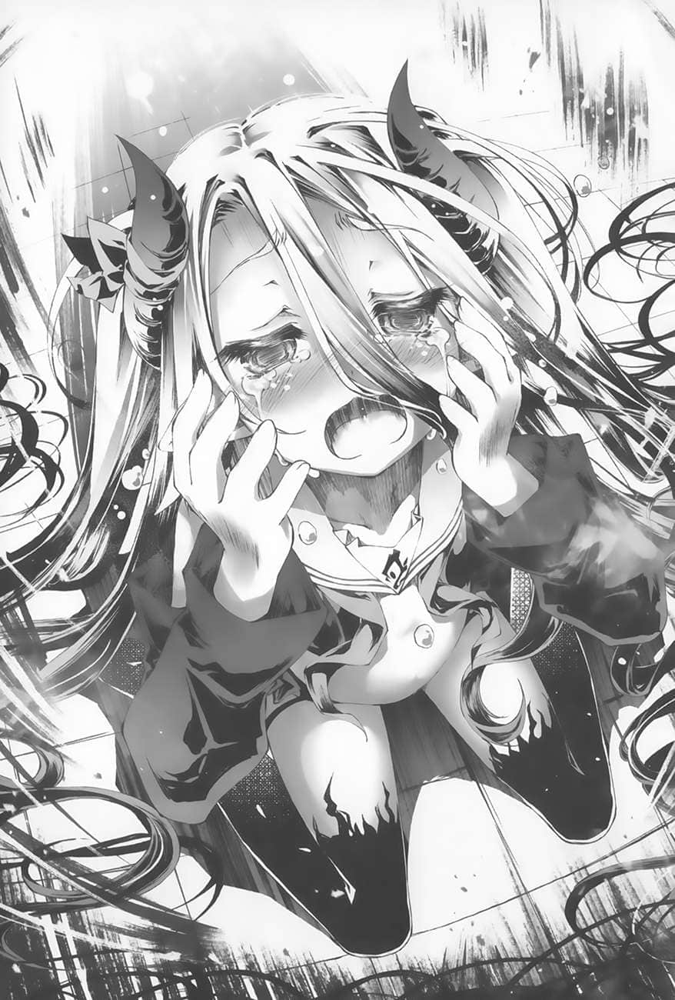
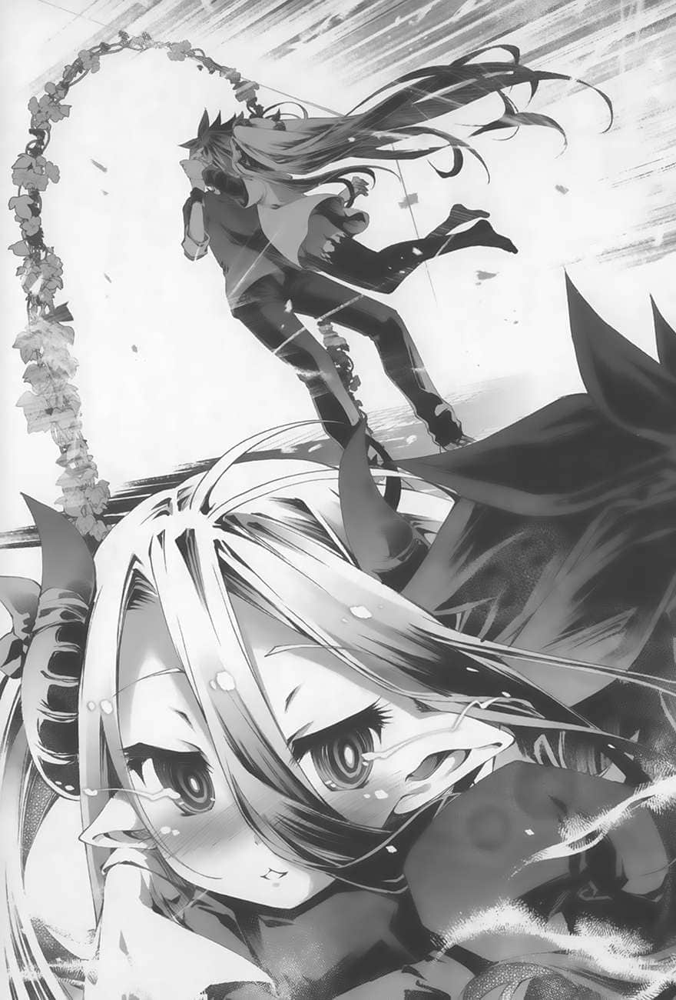
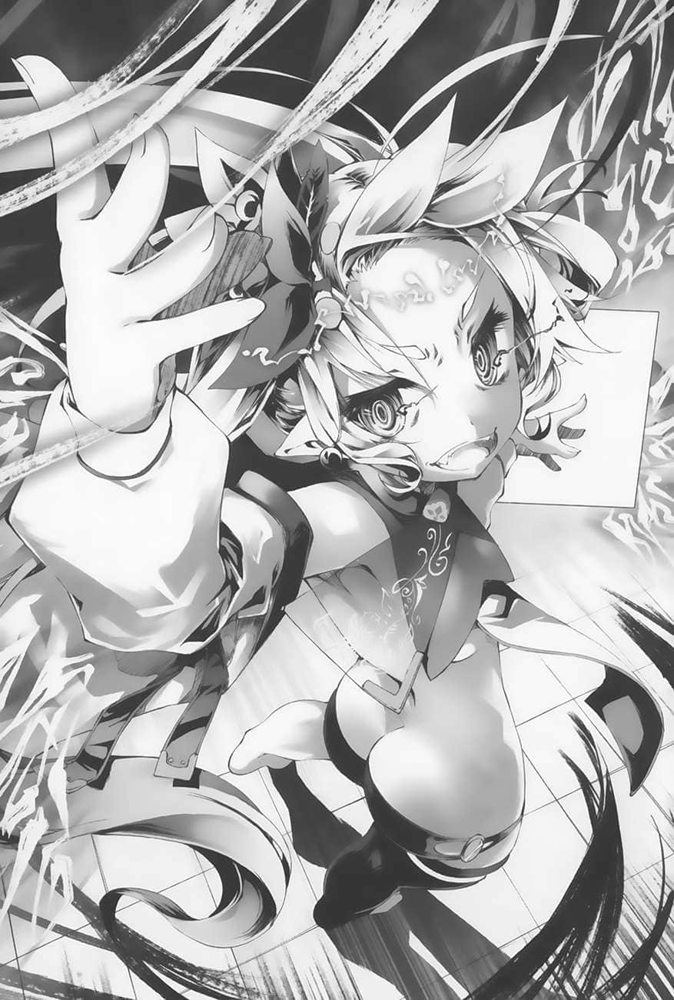

# 第三章 平行思考

> 来源：https://www.linovelib.com/novel/9/163400.html

──《洛园（世界）》完全变了个样子。

不只是中庭，就连整间房屋也随着巨大的爆炸声消失得无影无踪。

包括在浴室内的空以及各自在房间里休息的史蒂芙等三人，都突然被弃置在一片空荡荡、直到视野的尽头都空无一物的景色中，原本所在的建筑物都消失，只能茫然地呆立在原地。

「…………咦？呃、咦……？发、发生什么事了……？」

史蒂芙糊里糊涂地这么问道。不过，除了她之外，所有人都知道答案。

那就是──佛耶妮可兰所创造的空间──《洛园》被完全重组了。

也就是说，某人消费了『支援（课金）』，将整个舞台连同房屋完全改造了。

不，正确地说，是『目前仍在改造』才对。

至于那某人究竟是谁？答案就在上空。除了史蒂芙以外的所有人都抬头看着那个人。

空等人看到的是，高高地浮在半空中的白。她手上拿着手机，手机不断地冒出黑色泡沫，大量的黑色泡沫有如漩涡一般地在她的周遭盘旋。

「……不理解，不理解，什么都不理解……」

白低着头，有如梦话般地不断这么喃喃道。

她每说一次，就有一颗黑色泡沫破裂，景色也跟着变化。

很明显地，她正在消耗大量的『支援（课金）』，购买另一个新的世界。

这便是『发生什么事』这个史蒂芙所提疑问的答案。但是，在这个问题之后的下一个问题──

也就是『接下来会怎么样』的答案，则是谁也不知道。

所有人只知道，眼前这景象既骇人又诡异，仿佛世界末日一般，不由分说地让所有目睹的人陷入不安。

除了正在改造世界、同时改造自己的白本人之外，没有人知道答案。

「不理解，不理解，不理解不理解不理解──」

房屋与庭园消失得无影无踪，世界化为什么都没有的平地。景象继续改变，化为荒芜的大地。

那当然想了。打从心底想要女朋友。该说是渴望，想要得不得了。

「哥从原理上来说就是个不受异性喜爱的家伙，没人要。人格简直烂透了，除了玩游戏之外没有任何长处。在游戏方面也完全不是我的对手，因此只特别擅长说谎跟作弊。自己一个人的话连爬行都不会，连八个月大的婴儿都不如。你是这整个三千大千世界中最低劣的生物，所有生物阶层中的最后一名，无药可救的杂碎。不管你怎么掩饰，我全部都知道。你说是不是啊，杂碎？杂碎♡杂碎♡来，有种就反驳啊。杂碎杂碎～～啊哈哈哈哈哈哈哈哈♡你这杂碎♡」

白列举的事实让空完全无法反驳，忍不住开始向世界万物道歉。

「除了敝人小弟我的存在之外！！一切都！！没有错！！」

空间位相境界──《洛园》，是妖精种的领域。

总之，简单来说──

「──────」

「接下来，就由我黑白在没有任何人的地方彻底地『调教』你♡」

最后，大量的泡沫在那里形成一座巨大耸立的『城堡』。

「说不出来吧。我早就知道了。因为哥的事我全～都知道唷♡」

「嗯，我知道。哥的事情我什么都知道。哥是──」

造好城堡之后，白的脸上浮现温和的笑容，温柔地将空拥入怀中。

「你这种杂碎也想跟美少女──而且还不只一个──上演恋爱喜剧，甚至还敢奢望成为恋人？你不觉得这种想法太不知天高地厚了吗？草履虫也敢痴心妄想跟几个国民偶像级的美少女成为恋人，这可不只是想吃天鹅肉了。怎么，你觉得我说的有错吗？……说啊，我在问你话呢，还不快回答？杂碎♡」

「回答一！我才想知道！！回答二也一样，我才想知道！！回答三！我刚才在洗澡！而且我才没有光着身子，别说这么失礼的话！我还裹着一条毛巾！有没有提及这条毛巾的存在在法律上有关键性的差异，注意妳的措辞！」

「即使如此，唯有一件事我能理解……那是很明显的……」

白本身的白色长发同时变得更长，末端开始逐渐染黑。同时，白心里想着──

「……好了！状况的变化似乎告一个段落了，那就容我发问啰♪」

最后，白将景色改造得仿如魔界，自己的外貌也变得像个魔王一样。

于是，白抱着空，飞向耸立于远方的那座『城堡』。

「问题一！到底是发生了什么事让白气成这样！？问题二！『黑白』是什么鬼！？到底是白的还是黑的，厘清一下好吗！？问题三！！为什么空光着身子！？还不快穿上衣服！」

一颗泡沫在空的脚下破裂，于是那里的地面突然高高地隆起。

只要是在这领域之内，妖精种就有权能做到有如天地创造一般的事，堪称神的境界。

「────────等等、别……」

对于这最大疑问感到的焦躁不耐，正是白现在最能明确理解的情感。她只能任凭这股情感驱动自己。

因此，她说话的速度突然变得流畅，肯定是因为她已经停止了思考。

「──好，我再也不问『发生了什么事』这种问题了。反正状况已经很明显了♪」

---

■■■

有如求饶似地，空正要阻止白继续说下去。但是──

「妳也没去上学，没资格说我吧──不不不，我什么都没说！没这回事！！」

而白，现在正在运用这权能改造世界。

白已经完全气疯，失去理智，甚至连这种台词都脱口而出了……

──啊啊，想不通。什么都想不通。

白再度消费钜额的『支援（课金）』，顿时，大量的泡沫有如暴风般地刮起，泡沫涌向远方，覆盖了那扇『门』也就是挂着『不成为情侣就出不去的空间』的牌子的大门。

全身穿着漆黑服装的白笑着逼近空。

空高高地升上半空中，慌张地大叫。

白的笑容灿烂得反而让人感觉诡异。她继续说道：

这个世界本来就是神秘难解，能理解的本来就相当有限。

但是空却不知道该不该照实回答，而犹豫了起来。接着，白继续说道──

她终于抬起头，扬起嘴角，俯视着空，有如唱歌般地这么说道──

「『不打算回收的旗子』就不该竖起，难道你在义务教育中没学过这件事吗？啊，我看当然是没有学过了，因为哥是杂碎尼特族嘛♡」

「哥，你就是这样才会让我这么焦躁。区区的哥还敢这么嚣张♡」

看来，是白消费了『支援（课金）』造出了看不见的屏障。

因此，人只能尽量从当中找出极少数能够理解的事、明确的事，以其为支柱来思考。

白──不，自称黑白的那个人的声音响起的同时。

「啊～真是令人不耐烦♡哥的一切都让我好焦躁啊♡」

「【报告】无法前进。【解析】──【推测】她购买了看不见的屏障！？」

吉普莉尔与依蜜尔爱因连忙上前，却被看不见的屏障困住，当下讶异得说不出话来。

史蒂芙笑着这么说道。或许是因为她最不理解状况，反而因此最快从茫然的状态中回神。然后，她大吼了起来：

「真的？可是你没有妹妹在的话，就没办法跟女生说话，甚至无法呼吸，只是个杂碎。」

但是，包括白本人，没有人能理解白这样的变化。

「都说了，我这样才不是全裸！再说整个房子都消失了，我去哪找我的衣服啊！？」

「我说，哥啊。你是真的想要交到女朋友吗？」

「『99％裸体』跟全裸差不多！」

「──哥，你这家伙凭什么得意忘形？」

空下意识地想要反驳，但是白灿烂的笑容却逼得他把说出一半的话吞了回去。

「────」

「经过我的彻底调教之后，你就不会不自量力，到处乱竖不必要的恋爱旗，痴心妄想交女朋友，并且发自心底认为『身为杂碎不该跟女生对上眼的，我很抱歉』。交给我吧♡这样至少你就能升等为『知道自己斤两的杂碎』啰♡」

「明明有沟通障碍，心理素质跟体能、人品都是废物中的废物，竟然还像这样跟美少女上演恋爱喜剧、竖起半调子的恋爱旗，看了就让人不爽，恼火得不得了♡」

「──」

『一切都是让自己焦躁不耐的哥不好』──这就是白唯一能明确理解的事。

空脚下的地面继续隆起，使他上升至浮在半空中的黑白的眼前。

白这么说完，一对翅膀一拍，飞上半空中。

白的笑声响彻天空，看起来心情很好。她说话也前所未有地流畅。

「唔喔喔喔喔，这次又怎么了！？」

荒野开始出现山与溪谷，天空被涂改成血红色。白浮在空中，雷云以她为中心旋绕。同时，她换上与这样骇人的气氛十分相衬的黑色服装，说了一声「但是」。

之所以感觉思绪变得清晰，反而只是因为放弃思考所造成的错觉。

随着她的一字一句，泡沫不断破裂，天地也跟着大幅变化。

在场剩下的三个人，四周都被看不见的屏障包围，完全动弹不得。

空因为过于混乱，忍不住跟史蒂芙说起了相声。

「1％的少数可以被忽视的话，这世界上就没有富人了！！妳不知道全世界一半的财富都聚集在那1％的人们身上吗！？」

「…………对不起……我不该诞生的……」

只留下愉悦的笑声──

而一旁的吉普莉尔与依蜜尔爱因察觉了非比寻常的气氛，在一旁不发一语，全神贯注地提防着。

「…………呃、咦……？」

──平常白说话之所以不流畅，是因为嘴巴跟不上思考的速度。

「主人！？我这就去救您……什么！？」

即使空流着眼泪对白鞠躬哈腰，白似乎仍然焦躁难平。她继续操作手机。

「恋爱、爱情、恋人、妹妹，不理解……什么都无法理解──」

「──哥，你就是这样♡」

「吾乃『黑白』──要来审判哥的罪行♡」

没错──唯一理解的事，那就是『最不理解的事』。

「追根究柢来说，为什么我非得这么烦恼不可？这太奇怪了。呵呵、呵呵呵──啊啊，真是畅快。思绪整个清晰了起来。我还是有生以来第一次感觉脑袋这么清楚。现在的我或许可以解开整个宇宙所有的不解之谜。呵呵、呵呵呵……啊哈哈哈哈！！」

「如果你真的想要女朋友的话──那你说说看，交了女朋友之后想做什么？」

身上除了缠在腰际的毛巾以外什么都没有，要是从这么高的地方摔下去，肯定会没命。空害怕得全身不停发抖。

---

■■■

「不过，哥，你放心吧。没有问题的♡」

「别以全裸的状态逼近我说这些话！反正你快穿上衣服就对了！！」

加上急转直下的展开在眼前上演，她们都不知所措地呆住了。

不过，这次一样是史蒂芙最早回过神来。

「他们两个现在去『宾馆』了！不用说，这样下去肯定是不行的！！」

「「──！！」」

史蒂芙有如哀嚎般地如此简要描述了目前的危机，让另外两人也马上跟着回过神来。

没错──黑白带着空前往的目的地，确实是『城堡』。

那座城堡上还有巨大的爱心雕塑装饰，上下到处都有粉红色与紫色的灯光点缀，发出璀璨而妖异的光辉。

这栋彻底展现出猥琐风情的建筑物，老实说，不管怎么看都像是那种为了猥琐目的而设立的宾馆。

「【反省】用『支援（课金）』迫使竞争对手无法反抗，然后将主人调教、洗脑为自己的奴仆──本机真该这么做的。为什么当初没想到呢？本机真傻。」

「妳该反省的不是这一点吧！？」

「……真不愧是白小姐。即使陷入混乱状态，仍能想出这么高明的策略。太佩服了。」

「那也不是该佩服的地方！得设法带回他们两人才行，不然这个社会的秩序──伦理就要崩坏了啊啊啊啊！！」

「但是，小多，我找不到平板电脑……现在还能怎么办？」

「这、这个嘛……」

──三人被看不见的屏障困住，到底该如何脱困？

在《洛园》内，吉普莉尔与依蜜尔爱因都无法使用任何魔法。

即使想使用『支援（课金）』，也必须透过空与白的手机或平板电脑。但是现在却完全没看到，有可能是黑白在让房屋消灭的时候趁机带走了。

也就是说，现在三人完全『无计可施』。在沉默之中──

「唔唔喔喔喔喔！真是太疏忽了是也！这个发展实在是来得太突然，老娘竟然忘了开启影像直播是也！一直都让观众只听到声音是也！啊，各位观众，请放心✿老娘有录影是也！之后会让大家观赏白堕入黑暗面的情境是也✿」

佛耶妮可兰现在才聒噪地出现，打破了三人之间的沉默。

空被关在牢笼内，看起来很镇定。

「没办法•毕竟这『士兵（NPC）』只是用来射出『支援（课金）』，也就是『灵魂』的装置，很多细节都能省则省是也。这点就别在意了！总之，这些士兵头上的花朵各搭载了一定量的『灵魂（子弹）』，用这些子弹可以涂改黑白所创造的空间，将其恢复成原状是也！」

另外，还有──张爱心形状的床，以及牢笼。

眼看白步步逼近，意图剥夺空的处子之身，空眼眶泛泪，哀嚎了起来。

不顾她们的态度，佛耶妮可兰迳自解说了起来。

对着再踏一步过来的白，空坚定地说道：

说完，佛耶妮可兰将衣服丢进牢笼里。空急急忙忙地穿上。

看来，佛耶妮可兰接着要进行的就是这样的游戏。从她发表的题名来看，完全看不出个所以然，也不知道游戏规则如何，因此三个人都眯起眼睛，提高警觉。

然后，其中一具开花丧尸史蒂芙有如要示范似地举起手指，「砰」一声地射出一颗泡沫。

「【指正】多小姐平常头上总是戴着花朵发饰。只会说『呜』与『啊』的智能指数，其实也跟多小姐平常的表现不相上下，在误差范围内。【结论】多小姐的复制体大量出现，太惊悚了。」

在牢笼的铁栅栏外，白正对着他面露妖艳的微笑。

「黑白拥有那座『城堡』，所以也要给这三人『据点』是也！」

「接下来我要说的才是最重要的。人类的屁股是『出口』绝对不是『入口』！！用这种手段无法矫正人格，那只是色情媒体内的虚构剧情！！当然，原本说来妳不该有这种十八禁的想法，那是不可以的！！最后我要说的是！杂碎也该主张最基本的人权，也就是说……拜托妳放过我吧别那么做啊啊啊啊啊！！」

「还有空，你要全裸到什么时候？观众福利也该有个限度，否则只是低级梗是也。」

说到这里，佛耶妮可兰播放庄重的背景音乐，接着宣布道：

「也就是说，我可以理解为接下来要发生的是不用问也知道的事，也就是看也看得出来的事。那么，哥哥先承认自己是杂碎，即使如此也要坚决地表明这一点。我的妹妹啊，听好了……」

「今天本来是打算让各位放假，自由地度过一整天的。不过要是真的这么做，在那栋包含了『门』的『城堡』内，黑白也可以任意做她想做的事是也。无论怎样老娘都不负责是也✿」

「原来如此。」空点头，接着说道：

「除了空以外的四个玩家可以运用发给自己的『支援（课金）』购买『士兵』是也！做为初回优惠，老娘已经先给妳们各汇了足以买100个士兵的金额是也！各位马上试试看吧！」

「当然有是也！老娘至今有强迫过妳们任何事吗！？」

「妳、妳之前到底都在哪里啊！？不，听妳这样说，妳一直都在现场看着吧！？不只，莫非妳一直在直播！？妳为什么没有阻止白！？」

无形的墙壁化为光粉消散，在一片荒凉可怕的景象中，只有那个地方变回了原本的花田景色。

空直视白那对黯淡无光的眼眸，继续说道：

「……姑且还是问问，我们有权拒绝吗？」

也就是吉普莉尔之前说过的抢地盘──『改造空间的游戏』……

「要老娘阻止她！？老娘为何要那么做呢！？这才是最精彩的局面耶！而且还是超乎想像的理想状况，是最棒的发展是也！！」

「──『救回被魔王掳走的公主！！于是两人结合，永远在一起游戏』！！」

空终于再也无法忍受，放弃说服，恳求了起来。

意思就是说──拒绝的权利？当然没有了是也。

「够啰够啰✿不好意思打扰你们享乐，但是接下来必须强制终止是也✿」

白抓走了空，来到了外型诡异的粉红色城堡。在城堡内某个同样充满粉红色的诡异房间内。

佛耶妮可兰这么说道，同时动手操纵手边的操作画面。

「喔喔我唯一的盛装竟然没有消失！？」

正确来说，让空惧怕的并不是白，而是她手上握着的那丑恶的『东西』。

射出的泡沫击中围在三人周遭的无形墙壁，发出声响并破裂。

史蒂芙指责佛耶妮可兰擅自直播并坐视意外状况发生。但是──

「而且嘴巴只会发出『呜』或『啊』的声音！？这什么鬼啊！？太恐怖了吧！！」

「很明显地，妳正要做的事是错的。」

至于史蒂芙则是一脸搞不清楚状况的样子，照佛耶妮可兰的指示开始动手操作。

「「「「呜……啊……」」」」

「────♡」

即使空的眼神与话语是那么地真挚，白却仍然不放在心上，继续往前踏出一步。

听佛耶妮可兰这么说，吉普莉尔与依蜜尔爱因满怀戒心地看了彼此一眼。

「──接下来要玩的就是这样的游戏是也！如何？妳同意吧？」

「……好了，白，告诉哥哥，接下来妳想把哥哥怎样？」

「『那个』并不是十一岁的女孩子该拿在手上的东西。快放在地板上。」

──这是年仅十一岁的人类种（女孩子）该有的杀气吗？

「还敢说？难道我们从被抓来关在这个空间的那一天开始，十天内体验的一切都是错觉吗？」

---

■■■

佛耶妮可兰这么说的同时，「碰」一声，史蒂芙、吉普莉尔、依蜜尔爱因的身边各冒出一朵浮在半空中的小花。

三人听懂了她的暗示，看了彼此一眼，然后……

同时举起手，向盟约宣誓。

随后，世界仿佛被泼上了颜料似地受到了涂改。

又一步。

「有什么事？难道……妳也想阻挠我吗♡」

「那么，接着老娘要花一些时间准备游戏，包括取得黑白等玩家的同意之类的。因此现在请各位观众先欣赏白堕入黑暗面的影像是也✿」

「我才不是全裸！而且衣服早就不见了，要我说几次！？」

「很遗憾，这场直播企划是普通级，不能发生任何限制级的事是也。话说，黑白啊，老娘必须消除妳手上的那个东西，玩笑真的不能这样开是也。即时直播还要一直打马赛克是很费事的是也。」

她用手指触碰小花投影出来的操作画面，点选『步兵』项目。

「做这种事是没有意义的。」

「透过『支援（老娘的力量）』无法消除你们的私人物品是也。快点穿上是也。」

小花各自投影出平面状的光幕──也就是操作画面。

「哥，别问这种不用问也知道的问题。你就是这样才是杂碎♡」

「放、放心啦，老娘怎么可能会阻挠妳呢？老娘可是来『协助』妳的是也。当然，必须透过普通级的方法（游戏）是也！」

「妳要『调教』我──这件事本身我并不反对。如果妳调教过我就甘心原谅我的话，我乐意接受。如果这样能让我更接近稍微正常一点的人，我反而求之不得。但是──」

从空中现身的同时，佛耶妮可兰没收了白手上的邪恶之物。

白杀气腾腾的眼光甚至让佛耶妮可兰错觉城堡在震动。她的表情僵硬地抽搐着。

「咿咿咿咿！？有好多好多头上顶着一朵大花的我出现了！！」

史蒂芙眯着眼睛这么反驳道。但是佛耶妮可兰却装作没听到。

──妖精种本来的游戏……

「这……与其说是『士兵』，还比较像是脑袋被花寄生的丧尸之类的吧……」

「咕嘿嘿嘿，这样一来，只要稍加修改就能照原本的规划，在第十天推出『妖精种本来的游戏』是也！这下子肯定能一口气大赚一笔是也！题名就叫──」

佛耶妮可兰快速地对观众们如此说明完游戏规则之后──

说完，佛耶妮可兰开始播放影片。确认麦克风与镜头都关掉之后，转身面向三人，问道：

佛耶妮可兰这么叫道，于是在黑白的『城堡』所在的反方向，同样冒出了三朵巨大的『花蕾』。

拯救了空的危机的，是跟往常一样突然出现的声音。

佛耶妮可兰连忙这么解释道，接着向白说明游戏的规则。

下一个瞬间──白全身冒出气场，让另外两人不约而同地倒抽一口气。

「────♡」

看到不断有自己（史蒂芙）从地下冒出来的光景，史蒂芙被吓坏，慌张地大叫。

佛耶妮可兰脸上浮现浅笑，暗示城堡里可能发生的事。

…………────

佛耶妮可兰反问道，脸上浮现猥琐的笑容。

「事情就是这样是也。妳们当然会参加这个游戏吧？」

吉普莉尔与依蜜尔爱因畅所欲言地说出各自的感想，尤其依蜜尔爱因的说法更是失礼。但是，史蒂芙还来不及发火──

「规则很简单！！接下来观众的『支援（课金）』能针对参加者个人发送一成！！」

随后，史蒂芙的小花──也就是她专用的装置强劲地喷出泡沫。泡沫钻进地下，然后──

看着步步逼近的白，空强忍着内心的恐惧。

这房间似乎是宝座大厅，里面有一张爱心形状的宝座，背对着通向这个世界出口的『门』。

「好啦好啦。你们两个在爆炸中遗失的衣服，老娘已经帮你们拿回来了是也。」

「总之，玩家们要在各自的据点购买『士兵』加以配置之后，让军队出击是也。借着涂改地形开拓进军路线，并且涂抹对手的『士兵』使其消灭是也！最终的目的是让灵魂子弹打中玩家，使其无法继续战斗是也！！游戏时间为两个小时，玩家们必须在时间之内制伏其他玩家，并且抢回空！！按照惯例，在游戏结束时手牵着手的玩家，将在一天之内强制成为暂时情侣！以上是也！！」

如此如此，这般这般。佛耶妮可兰说明了史蒂芙等人已经同意的游戏内容。

空听完之后，不由自主地出声问道：

「……我说啊，光是《洛园》跟『堕落园』之类的名称，老实说我就有这种感觉……妳们真的对我们原本的世界一无所知吗？为什么这设定这么熟悉？当然，我不会说清楚，当然不能说清楚了！」

空虽然这么叫道，但是没人理会他。

「不要♡我才不玩那种游戏呢♡」

白看起来完全不感兴趣，笑着明确地拒绝。

「咦？为什么？只要妳赢了，就能跟空成为情侣──」

「我才不在乎什么情不情侣的。我只想让哥再也不敢妄想交女朋友，那就够了。现在要开始调教哥，所以我才不玩游戏呢♡啊哈哈♡」

白的脸上浮现调皮的笑容，转身要继续调教空。

「原来是这样是也！那么，老娘再追加一个胜利的奖励是也！！」

佛耶妮可兰接下来的提议，终于让白停下了脚步。

「如果黑白能够在两个小时内守住空、不让空被抢走的话，就让空向盟约宣誓『一辈子不交女朋友』这样如何！？这条件妳总会满意吧！？」

「什么鬼啊啊啊啊啊！？」

「………………」

不顾空的哀嚎，白沉思了足足十秒钟，然后──干脆地答应了。

「嗯，那就OK。好，就陪妳们玩玩吧♡」

「一点都不好！凭什么不经我的同意就拿我的一生当赌注──啊呜！？」

空大声抗议。但是铁笼外的白一鞭子重重地甩过来，逼得他马上闭上嘴巴。

「哥，抱歉，你刚说什么？我没听见。你可以再说一次吗？你应该是没那个胆，不过──你身为杂碎，该不会是想交女朋友吧？……不，肯定是错觉吧♡因为──哥是什么？你自己说说看♡」

「哥哥是杂碎！！杂碎中的杂碎！！哥哥没有意见啦，可恶～～！！」

「呃……呃……飞行兵要怎么迎击啊！？购买狙击兵就行了吗……啊，资金不够！？只好把步兵叫回来……也不行，都被黑白的狙击兵挡住了，根本来不及！……咦？等等，莫我这下子死定了？」

眼看自己的士兵数量急速减少，史蒂芙连忙将画面切换到『士兵』的视角。

因此，如果想都不想就胡乱地涂改景色，只会虚耗自军的兵力。

史蒂芙这么想。虽然她逐渐熟悉了游戏的内容，但她的心里还是很着急。

唉唉──『曾经交过女朋友的空』啊……永别了……

『不是犯规是也！那只是普通的「装备之一」，妳不会自己确认操作画面吗！？』

现在，兵力多达5000的史蒂芙军团正在铺桥、渡过溪谷。

『话虽这么说，但是……妳自己还不是打算抢先偷跑？』

──她已经清楚地描绘出通往胜利的路线，接下来要做的，对她来说只是使其成真的手续。

那就是白目前的表情。

面对无法避免的未来，史蒂芙眼神迷茫、面露浅笑……

黑白的飞行部队逼近而来。数量虽少，行军的速度却很快，吓得史蒂芙惊声大叫。

必然地，史蒂芙军团所架起的桥也有如溶化般迅速消失，桥上的『士兵』全都坠入谷底。

──玩家必须用观众提供给自己的『支援（课金）』购买『士兵』并加以配置。

「我专职内政啦！这游戏又没有任何内政要素！」

---

■■■

这样一来，军队就能渡过溪谷了。

在消灭完白的飞行兵之后，吉普莉尔军立即转向，将炮口朝着史蒂芙的据点与步兵们。史蒂芙见状，唉声叹气了起来。

──又发生什么事了！？

画面能够显示所选择的『士兵』的俯瞰视角，也能透过其主观视角来观看。

被染红的天空雷电交加，一眼望去是无尽荒芜的大地与废墟。

根据规则，为了胜利，必须在两个小时之内打倒黑白，并且夺回空。但是「看到十一岁的女孩子跟男人──而且还是她的哥哥──一起进了宾馆，哪能悠哉地等上两个小时！？必须在发生无法挽回的事情之前尽快把他带回来才行！！」

于是，欲哭无泪的空宣布将自己的人权交给妹妹，任其处置。

于是，每当『支援（课金）』随着锵锵音效进帐的时候，史蒂芙便毫不犹豫地投入所有的金额，将其换成『士兵』，以最短距离直指粉红色城堡，完全不在乎耗损。

军团里只有步兵的史蒂芙完全没有方法抵抗。

这时候，画面中传来佛耶妮可兰的声音，回答了她的疑问。

──以我来说，这样还算撑得够久了吧。

佛耶妮可兰这么说的同时，关闭了手机与平板电脑的购买功能，接着在空中消失。

为了避免空被敌人夺走，白必须防卫自军的据点，并且摧毁敌军。也就是说──

但是，当她抬起头，看到的却是黑白的飞行兵爆破的景象，不由得讶异地睁大了双眼。

「抢先偷跑……？不，我才没有那么做。」

没错。在这场游戏中，我们的目的是打倒黑白──是团队合作！

──

───如果要避免『士兵』耗损，或许当初应该绕路的。

「呼，这一点妳不用担心。白现在的反应肯定是一脸无奈地说『果然』之类的。」

「简单来说就是一种RTS（策略类游戏）──类似塔防游戏吧。小意思♡」

同时，又有新的黑影自在地从它们上方飞过──

「好耶！！那老娘就回去跟另外三个人说明这些规则是也。啊，对了。另外在这场游戏中，每个人能使用的只有『属于个人的份的「支援（课金）」』是也，请留意喔！好好加油是也！」

史蒂芙心里这样想，眼眶泛泪，仰望天空，准备接受败北。

『既然这样，为什么不一开始就跟她们两个联手？』

「规则上又没这么说！是妳说明不够充分！」

甚至可以一次指定复数『士兵』来下命令，使它们改变行进方向或是发射子弹。

「……呼，仔细想想，我怎么可能会是白的对手嘛。」

接下来，飞行兵的灵魂（子弹）肯定会马上打中史蒂芙本身，到时候她就会陷入无法继续战斗的状态。

在这种有如世界末日一般的景色当中，出现了更为异常的景象。

『妳未免也太不会玩游戏了吧！？真亏妳这样还能当一国的宰相是也！？』

「──呃、等等，黑、黑白的军队怎么已经快来到这里了！？」

于是，游戏开始后约十四分钟。

咦……？

于是，史蒂芙连忙点开操作画面来看。

但是与白对战的时候，这样的表情对空来说是绝望的象征，意味着必败无疑的下场。

『每个玩家听到的说明都是一样的是也！！妳是那种说明书里没有写上全部游戏机制就断定为烂游戏的玩家吗！？尽速掌握游戏的详细机制，也是身为玩家的能力是也！！』

「好啦！反正我就是个三流玩家，我就烂！是我不好，这样行了吧！？」

（快点……快点……要快啊！！史蒂芬妮•多拉！）

『不只是因为这样吧！？妳玩游戏玩得这么烂，在这个一切都凭游戏决定的世界到底是怎么活到现在的！？运气未免太好了是也！！』

现在，史蒂芙的军队来到了大溪谷前。据点内的史蒂芙没有提出任何指示，静观其变。

透过部分越过了狙击兵的枪林弹雨赶回据点的『士兵』视角，她看到了答案。

如果吉普莉尔与依蜜尔爱因是自己人的话，那将是多么地可靠──

透过『士兵』视角，她看到的是头上顶着花的吉普莉尔──是一群狙击兵。

五千具头上顶着大朵花的史蒂芙军团正在行军。

『少来！军队资金与兵力的管理完全就是内政是也！！妳的内政管理问题重重是也！！』

『……老娘刚才去她那边看了一下，还真的被妳说中了是也……妳对自己的认知倒是很正确是也。』

虽然这次两者都不是，但空还是只能悄悄地流泪，在心里悲叹道──

『谁叫妳据点附近完全没有任何防备，让所有士兵出去进攻，当然会这样是也。』

看着吉普莉尔狙击兵将黑白的飞行兵一一击落的景象，史蒂芙欢呼了起来。

『如果目的只是阻止黑白的话，很明显地跟其他人联手才是正确的是也。之所以没这么做，是因为妳想要「跟空成为情侣」不是吗？』

正当史蒂芙忙着哇哇大叫的时候，密集地聚在一块的史蒂芙军团畅快地被陆续消灭。

──看来，如果没有特别下任何指示的话，『士兵』只会沿着路线不停地前进。

「唉唉……为什么呢？明明有共通的敌人存在，为什么还要相争呢……？为什么……大家就是不能团结一致呢！？」

就如同佛耶妮可兰所说的，能够购买的『士兵』清单当中，除了史蒂芙目前所量产的『步兵：10』之外，下方还有『狙击兵：30』、『飞行兵：50』等项目，看来除了步兵之外还有各种生产成本与能力不同的『士兵』。

白笑着这么说道，接着毫不迟疑地用手指操作画面。那是空所熟知的白的一面。

但是，如同规则所说明的，每个『士兵』发射完──定数量的『灵魂』之后，便会自动消灭。

白面对画面，闭着双眼。同时，空也在脑内整理游戏规则。

「──咦？怎、怎么了！？」

于是，她看到正在横渡溪谷的军团部队的正后方，有头上开着一朵花的『黑色的白』正在发射某种东西。那东西以直线飞来，然后史蒂芙的士兵就被消灭了。

与空成为情侣──是从这游戏开始的十天以来还没人达成过的目标。

「啊啊……对啊……我怎么会以为自己是孤军奋战呢？」

『今天的游戏与之前的有着关键性的不同是也。只要能抢回空，并与他手牵着手，至少有一个人能够确实地跟空成为情侣是也。如果每个人都想要争夺那一个名额，那就不可能联手是也。妳也在打这个如意算盘，不是吗？』

「那是什么！？竟然射出了泡沫以外的灵魂（子弹）！？这样不是犯规吗！？」

……最后，黑白的飞行兵轻而易举地一下子逼近过来，轻易到难以置信的地步。它们发射的灵魂（子弹）有如暴雨般淋在史蒂芙的据点上。被灵魂（子弹）击中的地方立即形成坑洞，史蒂芙这下子不用透过画面也能直接看到黑白的飞行兵了。

当士兵在路上遭遇无法通行的地形──也就是黑白创造的溪谷、废墟瓦砾、或者是敌方的『士兵』时，便会自动发射灵魂──也就是泡沫。每当一个泡沫破裂，其半径约一公尺的范围内便会化为花田，也就是恢复成原本的景色。

也就是说，埋伏在溪谷前对史蒂芙军团展开奇袭的，是黑白手下的狙击兵。

──没错。

同时，白的身旁冒出了一朵浮在半空中的小花，同时显示出平面状的操作画面。

看着后方的『士兵』接连被炸掉、消失的惨状，史蒂芙惊声尖叫。

『士兵』们开始发射泡沫。于是溪谷上方出现花田，形状仿佛一座桥。

与白合作的时候，这样的表情总是让空感觉可靠无比。

军队笔直地朝着地平线的彼端前进，目的地是那座粉红色的『城堡』，也就是黑白的据点。史蒂芙正在自己的据点──巨大的花蕾内──透过画面看着自己的军队前进的样子，同时努力地试图理解游戏的概要。

史蒂芙的游戏技术烂到令人无法理解的地步，甚至让佛耶妮可兰感到害怕。她继续说道：『老娘觉得黑白也没想到这样就能攻陷妳的据点是也！她派兵来只是为了侦察兵力，没想到竟然就这样攻陷了！她肯定比任何人都还要惊讶是也！』

被打倒的『士兵』爆破、洒出『灵魂』，将周围的景色涂改回原本荒凉的血色世界。

「──我就知道当然不可能有这回事了！对啦对啦，我就知道！我现在也差不多能理解空他们常说的『竖旗』是什么意思了！！」

突然，军团最后方的部分──竟然消失了。

之所以急着抢先行动，不就是为了这个目标吗？！面对佛耶妮可兰如此的质疑，史蒂芙的内心纠结了起来。

史蒂芙之所以急于行动，是为了避免空与白做出有违伦常的行为……这一点是事实。

但是，自己真的完全没想过要跟空成为情侣吗？真的完全没有这个念头吗？

该承认这一点吗？要不然就是──

「──纯粹只是因为我是个三流的游戏玩家，没想到这一点而已！」

就是承认自己游戏玩得烂。经过一番思索之后，史蒂芙毫不犹豫地选择了后者。

最后，吉普莉尔的『士兵』终于逼近到史蒂芙的眼前。

眼看大军杀进据点，不等敌军将炮口瞄准自己，史蒂芙便主动高举双手──

「呵呵……好吧，要射就射吧。但是……请答应我一件事。」

她干脆地认输，脸上浮现了无牵挂的笑容。

「──答应我，一定要守住这个世界的伦理与和平。吉普莉尔，就托付给妳了……」

留下如此悲壮的遗志，史蒂芙闭上双眼，准备迎接死亡──

「……不，我当然不会开枪了……」

另一道声音这么回答道。口气大方，同时有些无奈。

「应该说，什么托付的只会让我困扰。我自己一个人怎么可能敌得过黑白小姐呢？」

声音是从头上顶着花的吉普莉尔军队中传来的。

……仔细一看，军队中只有一具吉普莉尔的头上没有花。

史蒂芙很快就察觉到，那是玩家本身在说话，讶异地叫了起来。

「咦咦！？是吉普莉尔本人吗！？为、为什么会来这里！？」

「规则可没说玩家本人不能离开据点吧♪」

「我要阻止黑白小姐获胜，这是我唯一的目标。小多，我需要妳的协助，请助我一臂之力。」

「【断定】即使放弃与主人牵手的权利仍然不可能实现联手，没有意义。烂主意。笨蛋。」

而且『支援（课金）』的提供对象还是个人。依蜜尔爱因要求两人思考这其中的意义。

「────！」

「【协定】──本机要求组成『百合联合』。」

依蜜尔爱因的一句挑衅，就让吉普莉尔把联手的决心抛到九霄云外。

「因此，为了主人……没错，白小姐也一样是我的主人。为了避免主人不愿意见到的结果，我一定要全力以赴，设法阻止。」

要是史蒂芙与吉普莉尔都放弃跟空成为情侣，而让给依蜜尔爱因一个人的话。

当然，正确来说并不是三倍。观众之中支持三人与空配对的人数想必有落差，而且也无法精准地知道赞同白与空配对的观众有多少。

既然这样，观众──也就是那些想观赏恋爱的妖精种们──特地给予『支援（课金）』的动机何在？

「────！」

──有、有道理！无法联手的原因，是因为我们彼此争夺与空成为情侣的权利！

「可、可是──」

「现在的白小姐──也就是黑白小姐，既然陷入错乱状态，我本来是偷偷期待有机会赢过她的。但是，事情果然没有那么容易……相反地，我认为现在的她比平常还要精明。」

但是，听到这个答案，史蒂芙与吉普莉尔依然是一头雾水。

「小多。只要妳也这么发誓，我们就能联手了。不是吗？」

「────────」

吉普莉尔这么说道，脸色显得凝重。

想当然耳，愿意提供『支援（课金）』的就只剩下支持『空×依蜜尔爱因』这个配对的观众。

『妳们可总算明白了是也！真是太好了，要是游戏就这样结束的话，老娘还真的不知该如何是好呢！幸好是也！身为游戏主办人没办法主动插嘴，老娘差点急死了是也！』

到头来，等于是让依蜜尔爱因独自对抗黑白。

吉普莉尔拚命地压抑着杀意。

我哪有理由拒绝呢？不，不可能！

之所以来这里，表示她应该拥有可能打倒黑白的方法才对！

被子弹射中的玩家将无法战斗，并且败北。

目前最直接面临这个问题的是史蒂芙。

对了……即使三人合作，战力也不过是增为三倍而已。

但是，规则上可没说玩家本身不能离开据点。

虽然依蜜尔爱因面无表情地嘲讽，但是吉普莉尔并没有太大的反应，只是脸部僵硬地抽动着。

观众送给各玩家的『支援（课金）』，是为了让玩家各自购买『士兵』。

史蒂芙眼神空洞地这么想。不过，依蜜尔爱因不理会她的反应，继续说道：

「玩家的技术相差这么多，要颠覆如此差距，只能以『压倒性的量』来压制。因此，联手是必要的。」

现在，即使是吉普莉尔也只能仰赖依蜜尔爱因了。

吉普莉尔这么说道，同时将自己的操作画面转向史蒂芙给她看。

吉普莉尔接着表示，这正是她亲自前来的理由。

「……喔？原来在机凯语之中，『请杀掉我』是这么说的，是吗？又上了一课呢♪」

为了她所重视的、打从心底爱着的人们，她宣称要将自己的感情摆在第二。

「咦？既、既然这样──难道我们完全束手无策吗！？」

说完，吉普莉尔深深地低下了头。她这副模样让史蒂芙深深地心动，胸口顿时一阵紧缩。同时她想到──

依蜜尔爱因特地跑这一趟，不可能只是为了说这种话。这表示她拥有解决这个问题的答案。

这些士兵虽然人数稀少，但是却能精准无比地预测吉普莉尔军团的动线，一一击破。

更何况吉普莉尔这样坚毅而重视荣耀的少女，现在竟然寻求我的协助。

而且史蒂芙的据点毫不设防，途中的迎击甚至不需提防，可以悠悠哉哉地靠近。吉普莉尔脸上浮现从容的笑意。

虽然她极度不愿意，但也只能歪着头催促依蜜尔爱因快点说出答案。那答案就是──

即使如此，少女仍选择尊重他人的恋爱情感，优先于自己的。

看史蒂芙与吉普莉尔终于理解了游戏的本质，佛耶妮可兰似乎是松了一口气，从画面里这么说道。于是史蒂芙对她吼叫了起来。

「【提问】号外个体认为区区三倍的战力差距能胜过黑版的妹妹小姐吗？」

「【必然】妳们两个要是放弃配对的意图，等于是自断来自支持『主人（空）×多小姐（史蒂芙）』与『主人（空）×号外个体（吉普莉尔）』这两组配对的观众的『支援（课金）』。这样一来就无法增加兵力，联手也没有意义了，笨～～蛋。」

「……！？」

既然这样，只要放弃权利就能联手了……！

「【下策】再度确认天翼种的智商之低落，简直无药可救，本机真不敢相信。唉唉……」

「【傻了】号外个体的低能已超越能理解的范围。考虑将其智商修正为『负值』。」

──给个人的『支援（课金）』。

做出如此结论之后，吉普莉尔接着提出了促成联手的手段。那就是──

「…………我现在有『为了主人们』这样明确的目的，妳应该感激涕零。要不然即使是个性温顺的我也早就动手宰掉妳了♪」

──没错，明白这一点之后，接下来该怎么办？

──自游戏开始之后，很快地一个小时即将过去。

原来如此，吉普莉尔说得对，对三人来说击败黑白是共通的目的。

──对了，我的目的也是带白与空离开那间宾馆。

吉普莉尔提出的替代方案让史蒂芙恍然大悟，感动地看着她。不过，那不重要。

虽然天翼种的少女无法理解恋爱感情，但是──

可是那个白啊……

『那样就不有趣了是也！而且重点是妳们察觉了之后，接下来要怎么办？这才是重头戏是也！』

面对依蜜尔爱因接着提出的这个疑问，吉普莉尔无言以对，只能咬牙切齿。

「…………原来如此。既然这样，那我们就先以『最后让自己与空牵手』为目的，在『击败黑白小姐』之前都要联手合作。应该是这样吧……」

其间，白仍然持续地在调教空。对她来说，处理史蒂芙等人的攻势不过是顺便进行的小事而已。

「白小姐──也就是黑白小姐，现在很明显地心神失常了。」

「我愿意向盟约宣誓──即使夺回主人也不跟他牵手。」

──原来是这样……难怪佛耶妮可兰说联手是不可能的。

依蜜尔爱因一副『怎么连这种事都不懂？』的态度，显得有些困扰，接着继续说明。

虽说依蜜尔爱因应该是不肯放弃，即使如此……

但是，对手是黑白。

依蜜尔爱因这么说道。虽然一样面无表情，但是她的脸看起来似乎透露着确定必胜的笑容。

「但、但是……这样的话，吉普莉尔，妳要为了什么而战呢？」

面对杀气腾腾的吉普莉尔，依蜜尔爱因似乎不打算跟着斗嘴，继续说出她的看法。

──画面中，黑白的『士兵』正在废墟之中敏捷地四处移动。

「这次要是让黑白小姐胜利的话，主人就没有办法跟任何人成为情侣了。不只是在这场游戏之中，而是今后『一辈子』──当然，也不能跟白小姐成为情侣。」

「……咦？」

现在史蒂芙的脸上完全就是恋爱中少女的表情。正当她要握住吉普莉尔的手时──

但是──与吉普莉尔出现的反方向的墙壁，这时被打穿了一个孔。

虽然被禁止做任何限制级的行为，但是残酷的调教仍然确实地腐蚀着空的心神。

迟了一下子之后，史蒂芙也想通了。

「【明显】提供给『特定个人』的意义，在于观众希望『该玩家与主人成为情侣』。也就是援助自己所『支持』的玩家。【解答】因此，本游戏的本质其实是『各配对组合』之间的支援（课金）大战。」

一群长相跟依蜜尔爱因完全一样的军团从那里出现。同样地，依蜜尔爱因本人也混在军团当中。

「既然这样，妳一开始就该告诉我们的！」

这样一来，吉普莉尔的好处何在？史蒂芙这么问道。

「【建议】关于『给个人的「支援（课金）」』这条规则，请深入思考其意义。」

而且对手还是『守方』，在游戏中更是压倒性地有利。如同吉普莉尔说过的，要颠覆压倒性的技术差距，只能依赖『压倒性的物量差距』。

「另外……刚才的话我也听说了，所以先让我反驳妳吧。『联手』是可能的。」

──现在是怎样？我的据点是白天的公园吗？任谁都能轻松地来散步……说不定等一下白也会来。

「虽然我资质驽钝，在恋爱方面仍然有很多不理解的地方，但是至少我认为那绝对不是白小姐真心想要的结果。」

「没错，就如那个妖精种所说的，只要所有人的目标都是与主人成为情侣，那就不可能联手。既然这样，我们都主动放弃这个目标就行了。」

只要史蒂芙与吉普莉尔都放弃的话，她应该也没有理由拒绝联手才对。

吉普莉尔则是因为被依蜜尔爱因彻底驳倒而羞得全身颤抖。她有如低吼般地说道：

---

■■■

史蒂芙与吉普莉尔屏息凝神，等她继续说下去。

即使没有与空联手，她无疑是最强的游戏玩家『 （空白）』的半身。

「好、好吧！这样的话，我很乐意联手──」

「好了，哥，跟我复诵一遍。哥是什么♡」

「我是杂碎。不知自己有几两重还敢命令美少女（史蒂芙）喜欢上自己，之后却置之不理。面对美少女（依蜜尔爱因）的好感，明明自己没资格，却不接受也不拒绝，甚至还妄想更进一步的发展。还有，被美女（莱拉）称为达令竟不知惭愧──」

现在，空正在被迫不停地列举以往的各种行为。

「我就是这种全生物阶层中最后一名的卑微可悲生物──嗷呜！？」

空的眼神黯淡无光，如此为自己的存在做总结。但是，换来的却是白的狠狠一鞭。

「你说错了。是全生物阶层中并列最后一名才对。连这点小事都记不住吗？你这杂碎♡」

「身、身为杂碎竟然擅自窜改白大人所说的话，小的非常抱歉。但、但是，我实在不觉得世界上还有其他的杂碎会跟我并列同等……！！」

整整一个小时，白都在对空说他有多么地低劣。

因此，空也坚信世上不可能存在跟自己并列的下等生物。

但是，白脸上浮现温柔的笑容，对空这么说道：

「……当然有啰。哥是没人要的处男茧居族、而且还有沟通障碍──当然还有人能够跟你并列了。那就是跟哥一样、甚至更烂的杂碎──也因为这样，她才能接纳哥的一切──这样的女孩子，世界上只存在一人♡」

──怎么可能……那是不可能的。

这样的女孩只存在于幻想当中。要不然就是女神吧。

空心里想，打算这么回答，于是他战战兢兢地抬起头。他看到的是──

「看──就在哥的面前♡」

在铁栅栏之外对着他微笑的──女神。

「好了，哥，现在你明白了吧♡」

──呃……啊啊……

白的甜美呢喃声彻底渗透空疲惫的脑袋。

「无论哥是再怎么烂的杂碎，只有白一个人，一定会接受哥唷♡」

「【肯定】具体来说，能拉拢的观众是支持『号外个体×多小姐』『本机×多小姐』『本机×号外个体』这三个配对的派阀。如果能同时拉拢『妹妹小姐×多小姐』『妹妹小姐×本机』『妹妹小姐×号外个体』这三个派阀是最理想的状况。这样一来，就能得到合计九个派阀的『支援（课金）』。」

对于满面疑惑的史蒂芙与吉普莉尔，依蜜尔爱因开始说明详情。

……妳们被空影响得很彻底呢……

「【确认】规则是『在游戏结束时牵着手的两人，将在24小时内强制成为情侣』……但是这条规则中并不限只有『一组』。因此，推测能跟主人以外的人成为情侣。」

「【提议】在玩家之间追加规则。由包含本机的三人向盟约宣誓，『在游戏结束的180秒前同时拥有空与白两人者为『胜者』，『败者』必须无条件地向胜者投降，并且与胜者指定的人物牵着手直到游戏结束时为止』。」

「停。不能再说下去了，不能再继续下去是也……」

「要怪就怪妳自己多说了最后那一句是也……妳要用暗示的方式就算了，讲得那么明白就是限制级，违规是也……老、老娘也很过意不去啊……」

为了达成这个目标，只有一个方法，那就是让史蒂芙获胜，同时带走空与白两个人。

「──咦？呃……吉普莉尔，妳这话的意思是──」

──没错，现在，三个人正忙着打情骂俏。

没错，史蒂芙等人的军事行动之所以能压倒白的军队，并不是因为任何战略或策略。

──时间先回溯到四十六分钟前。

──总之，就是在击败黑白、救回空之前要联手。然后──

听到忽然出现的佛耶妮可兰的声音，空有如临崖勒马般把持住心智，睁开眼睛。

剩下史蒂芙一个人还不理解，于是吉普莉尔解释给她听。

白正在责备佛耶妮可兰的时候，空在一旁喘着气，内心感到万分惊险。

──很坏的话？有吗？

因此，支持『吉普莉尔×依蜜尔爱因』配对的观众，如果想要看到自己支持的配对成真，必须让史蒂芙在击败黑白之后胜过吉普莉尔与依蜜尔爱因。但是她的胜算近乎零。为了提升胜算，只能在『百合联合』还在的阶段大幅提升她与另外两人的兵力差距。于是，史蒂芙得到了非常热烈的『支援（课金）』。

──……

「这……到底是发生什么事了！？」

但是，如今局势完全反了。敌军陆续打倒白所配置的『士兵』，势如破竹地逼近过来。

──啊啊……啊啊啊……

「好了，接下来呢──小多，来吧。脱掉脱掉❤」

被不由分说的数量暴力所震慑，满心疑惑的白忍不住惊叫了起来。

具体来说，该怎么做？两人以视线如此问道。依蜜尔爱因淡定地继续解说。

于是_二人举起手，说出了缔结需绝对遵守的协定之宣誓文。

依蜜尔爱因先是指出规则的漏洞，然后继续说明。

史蒂芙惊慌地这么大叫道。她的『士兵』增加得太多，让她来不及操作。

「只要是哥想要的事，我全部会为你做喔。包括性欲处理……」

「在日常白会喂你吃喝。虽然现在还不擅长下厨，但是我一定会进步的。也会照料你的其他生活各方面、你需要的钱也全都由我来为你想办法。哥只要整天让我抚摸、什么都不用想，整天玩游戏就够了。就像这样……乖、乖♡」

一切都不过是事实……反而是女神启蒙了愚昧无知的我。

「刚才对你说了那么坏的话，真是抱歉。但是这一切都是为了你好♡」

「放心吧，小多。妳的身体我看习惯了，很漂亮的，没有必要觉得丢脸♪」

「竟然要我来选！？呃……这、这种事我才没办法选──不，两者都不要！现在正在直播对吧！？我可没有在众目睽睽下脱衣服的嗜好！」

对于这样的策略，依蜜尔爱因与吉普莉尔一下子就理解、认同了。

---

■■■

「为、为什么史蒂芙她们变得这么强！？不，与其说是强……应该说，这数量是怎么回事！？」

每当她们三人上演百合味十足的亲热戏码时，『支援（课金）』进帐的锵锵音效就有如暴雨般大量响起。

而史蒂芙则是在心底暗自想道──

「【协定】──本机要求组成『百合联合』。」

白的声音有如融化的蜜糖，腐蚀理性，侵蚀精神。

不过是眼光离开画面一下子而已，有什么好紧张的？白心里这么想，再度望向画面──

画面上显示的是史蒂芙等人的军队，也就是到刚才为止她随手顺便应付的对手。

吉普莉尔与依蜜尔爱因一得到『支援（课金）』，马上就用来造出大量的『士兵』。

「另外，老娘身为游戏主办人，老实说这种行为是超出权限的……不过，如果让妳因为分心而落得败北的下场，那这场游戏就太扫兴了是也。因此，老娘是来提醒妳专心玩游戏的。」

──……

「为什么又要来阻挠我！？还差一点点就能让哥完全沦陷了！！」

──好、好险！

也就是【向盟约宣誓】──……

也就是说，不只是争夺跟空配对的权利，同时还要向观众宣称将会凑出另一组情侣，提高观众对这场支援（课金）大战的关注程度。

「能够实现这个结局的就是小多妳，因此当然最多人赞助了❤」

但是，史蒂芙并没有能力操作这么庞大的兵力。

「【评价】号外个体，非常好的百合表现。本机已确认高额的『支援（课金）』进帐。让前线右翼往前推进。」

「这样一来就能拉拢『期望我们三人配对成情侣』的观众们。」

没错。白的疑问──发生了什么事──的答案就是这个。

「【公告】本『百合联合』开放指示，可以用『支援（课金）』为条件，要求『结果之外』的事。」

而是凭着排山倒海般的庞大兵力淹没敌军，连同任何战略一并吞没。

另一方面，吉普莉尔与依蜜尔爱因也需要更多的兵力。

白的脸上终于失去笑容，茫然地低吟道。

于是，在期盼百合发展的观众们的热情『支援（课金）』下，『百合联合』的手下兵力已成长至三十万以上，成了一支规模非常庞大的军队。

正当空忙着在自己的精神世界里挣扎的时候……

对于白的这个疑问，答案只存在于白所无从得知的地方。

我竟然差点就沦为被妹妹包养的小白脸……！

「话说回来……是我的错觉吗！？观众给我的『支援（课金）』是不是明显比妳们两个还要多！？」

没错──大家最想看到的是天翼种与机凯种配对成功。

我、我刚才在想什么！？

「【整理】即使本机等三人通力合作，也只能得到来自支持『主人（空）×自己』配对的观众之『支援（课金）』，也就是只有三个派阀。这样的话战力仍嫌不足。因此，有必要设法拉拢其他的派阀。」

「没错，所以才说是『协定』啊♪」

「【肯定】击败黑版的妹妹小姐，并且夺回主人。到这个阶段为止除了支持『妹妹小姐×主人』以外的所有派阀，利害都是一致的。本目标达成时，协定即告终。各自回到自己的阵地，重整阵脚之后，再来决定『谁能跟主人牵手、败者必须跟谁牵手』。也就是战争。」

「我说啊！！我操作的速度赶不上了！妳们谁可以来替我操作一下！？」

虽然有依蜜尔爱因在一旁指示，但她仍然无法拿出相对于数量应有的战果。

如果能从杂碎进化为稍微接近正常人一点的存在，他当然很乐意接受白的调教了！

「这样啊。那么，接下来由妳跟小多缠绵的话，我应该也能增加兵力吧？」

被抚摸着头的触感实在太过舒适，正当空想要闭上眼睛、放开自己的一切时……

看佛耶妮可兰苦笑着如此说道，白讶异地皱起了眉头。

这种肯定自己所有一切的慈爱，很快地融化了空的思绪。

在史蒂芙的据点内，正上演着这样的戏码──

「呃呃呃呃、等等……我脱衣服没有任何意义吧！？」

「【宣示】只要提供40万的『支援（课金）』给本机──本机马上跟号外个体接吻。」

────…………

────…………

但是，史蒂芙的游戏技巧之烂，已经在游戏一开始的时候彻底展现出来了。

「呃……所以呢……？这么做会怎么样？」

但是，都已经是个杂碎了，如果还多了一个『靠妹妹（11岁）养的小白脸』这样的属性的话──那已经不能说是杂碎了。这样还对不起杂碎这个词。根本是退化成连杂碎都不如的（废渣）存在了啊

「喂！喂！妳们两个！怎么可以这样玩弄少女的纯情！？」

于是，依蜜尔爱因打出第二张王牌。

说到这里，白从铁栅栏外伸手进来抚摸空的头。空感受着那温柔的温暖。

「【否定】由号外个体脱去多小姐的衣服，这行为本身是有意义的。由本机来脱也可。【选项】妳想让谁脱？」

「────这是、怎么回事……？」

──啊！？

我要冷静！再怎么说那都是不应该的啊，十八岁处男空！！

「等等，这样一来就不是『联手』了吧？」

也就是依蜜尔爱因命名为『百合联合』的真正意涵…………

「【当然】因为观众最想看的结局是『本机与号外个体配对成情侣』，自然会有如此结果。」

到底发生了什么事呢？

「────咦咦咦咦！？依蜜尔爱因，妳、妳是说真的吗！？」

依蜜尔爱因竟然要跟自己以外的人接吻──而且还是吉普莉尔！？

这让史蒂芙的心境复杂无比，忍不住惊呼了起来。但是，吉普莉尔却不假思索地回应了。

「我就是死也不要♪我还宁愿舔猪的屁眼呢♪」

「【同意】跟号外个体接吻什么的，本机也觉得很噁……但是事实仍然不变，战力仍然不足。」

没错，虽然难以置信，但是即使拥有这么大量的军队，三人现在依然无法压制黑白的军队。

如果没有更进一步的『支援（课金）』，甚至无法抵挡黑白军的反击。

「【提示】只要号外个体也提出相同的宣言，即能争取更多的『支援（课金）』。以目前的兵力必然无法胜过黑版妹妹小姐──【提问】号外个体，对妳来说自己的好恶难道比『主人』更重要吗？」

「──！──！！～～！……！」

……那个吉普莉尔竟然被依蜜尔爱因驳得无言以对，连个挖苦都说不出口。

她双手抱头，表情扭曲，内心非常纠结。这是非常罕见的景象。

结果到底会如何？──史蒂芙忐忑不安地看着她。最后，她终于下定决心。

「──可以通融一下吗？为了40万的『支援（课金）』接吻是可以，但是接吻的对象必须是小多。」

「啊！？我、我吗！？」

吉普莉尔勉为其难地挤出声音来回答，史蒂芙听了大声惊叫。至于依蜜尔爱因则是──点头了。

「【试行】只要能得到必要的战力，可不择手段。不过，容本机郑重声明。本机不计任何代价，无论如何都要击败黑版妹妹大人、救回主人。为此──本机什么事都做得出来。」

意思是，依蜜尔爱因认为吉普莉尔可以试试看，但如果这样做还是战力不足的话，依蜜尔爱因仍然会不择手段。也就是说，为了达成目标，她还是不惜与吉普莉尔接吻。

「好了……事情就是这样。小多，可以吧？」

「呃呃呃呃！？这是我的初吻耶，别这样贱卖啊！！」

「当然，如果小多妳真的不愿意的话……我也不想勉强妳……」

依蜜尔爱因的步兵们从正门入侵，被黑白的狙击兵打倒、消失。

被消灭的士兵最后所传回的视觉同步影像，是室内的光景。

同时被两人亲吻，让她无法压抑胸口的澎湃──如此事实，让史蒂芙流下了眼泪。

「──别让白孤独一人啊啊啊啊啊────！！」

那是她唯一的心愿、唯一的期望。

白迅速地调整战术、操作画面，拚命地抵抗。同时──

另外，室内深处还站着一道人影，被狙击兵们保护着。

「【报告】勉强补足了不足的兵力。接下来本机将从右翼突破最终防线。」

百合联合（史蒂芙等人）终于杀进了粉红色的城堡，也就是黑白的据点。

即使自己赢了，哥哥到最后也不会跟任何人配成情侣……不。

但是依蜜尔爱因马上点选了自己部队中的几个步兵，让它们冲进室内。

白这么大叫，捂着脸啜泣了起来。

被关在铁笼里的空被上了手铐与口塞，正无奈地挣扎着。不过，白并不是在问他。

她不经意地如此喃喃问道。但是……

黑白跪倒在地上，哇哇大哭了起来。

「那我就负责左翼吧──重头戏终于要上场啰♪」

「吉普莉尔！？别露出那样的表情，太狡猾了……！？」

「【起哄】本机也一样，愿意为了40万的『支援（课金）』与多小姐接吻。可以拒绝。妳……不愿意跟本机接吻吗？」

是现在将她逼入险境的那些人。

──这白也知道。但是、但是──！！

---

■■■

「呜呜──！？呜、呜！呜呜──！？」

「白没办法像其他人那样，就是无法成为哥的女朋友！！但是，其他的事，白一定会很努力的！」

……呃……不……就说了……

甚至没察觉到背后某人靠近的声响……

史蒂芬妮竟然沦落到如此地步，成了为钱卖身的女人……

白的军队配置与操作精确无比，现在却只能惨遭蹂躏，毫无还手的余地。

「但是，敌军已经没得补给了，大可以不用在意地展开波状攻势。这是战争的常识唷，小多♪」

看着荧幕上的资讯，白非常确定，面对如此排山倒海而来的大军，再也没有任何胜机了……

在毫无自觉的状态下，她拉紧声带──

……………………

但是，事实上三人就是联手了，而且以庞大的兵力压垮白的防线，步步逼近。

──冷静，妳要冷静啊，史蒂芬妮•多拉！！这只是被强制增幅的恋爱感情──只是一种错觉而已！！

──在这个游戏中，无法精确地知道其他玩家的『士兵』数量。

「恋爱真的……这么重要吗？不恋爱……难道就、不行吗……！？」

「但是……为什么……？为什么大家给白的『支援（课金）』这么少！？」

白知道自己输定了。想到接下来的发展，口气忍不住颤抖了起来。

──狙击兵无法连续发射，而且发射几次之后就会耗尽『灵魂（子弹）』，最后自动消灭。

「我生在没有战争的时代，跟妳们经历过大战的世代不同啦！」

不过，老实说，史蒂芙现在的心里更多的是安心感──不用被逼着选择任何一边的安心感。

「难道……不是恋人的话，就不能想跟他一直在一起吗！？」

──哥哥，即将跟自己以外的某人，手牵着手。

她正在对观众们喊话。

两人接下来终于要攻略黑白军的防线了。至于史蒂芙──

「虽然白不如依蜜尔爱因那么可爱，但是会努力学习化妆跟打扮的。」

「怎、怎么办！？这样一来无法进去了。啊，对了，可以先消除墙壁──」

但是……其实，白自己也知道答案。

这是为了观众们存在的游戏，观众们等着看『空（哥哥）与某人配成情侣』。

「……为什么……白就是……不行呢……？」

「【否定】强行突破。」

史蒂芙等人究竟是怎么凑到这么多兵力的？

──游戏开始之后，一个小时又四十七分过去了……

「不要啊……白不要……那样……不要啊啊啊啊！！」

「呃、不会吧！？都到这里了，竟然还会被削减这么多兵力！？」

「……白……除了哥之外、一无所有……除了哥之外、什么都不需要……！！」

很幸福地注视彼此、对彼此微笑……即使只有短短的一天……

百合联合的士兵们杀进室内之后，再度爆破。

──啊啊……爷爷大人……

势如破竹的大军已经杀到了不远处。

这时她已在不自觉之间摆脱了错乱的状态，恢复为『白』了。

──不管这场游戏的结局如何，我可能已经不行了……

「【常识】攻城战的重头戏本来就是杀进城里之后的阶段。集中防御城堡的中枢，让敌人难以活用数量的优势。」

既然无法从门口进入，史蒂芙提议先破坏墙壁。

──到时候，我到底会跟谁牵手呢？

也就是对史蒂芙等人提供『支援（课金）』，想要阻止『空×白』配对的人们。

最后，欲哭无泪的史蒂芙决定妥协，条件是『只亲吻脸颊』。

由此可轻易推知，双方的战力差距至少达二十倍以上。

依蜜尔爱因也以同样的表情从另一边逼近史蒂芙。

---

■■■

「白可以做饭给哥吃。虽然不能做得像史蒂芙那么好，但是白会努力学习的。」

「虽然白的胸部不如吉普莉尔那么大，但是白会天天努力按摩的。」

「白的话……可以为哥做到任何哥想要的事。」

她们即将抵达宝座大厅。黑白与空应该就在那里。但是──

不只如此，哥哥还会被迫发誓『一辈子不交女朋友』。

室内有复数狙击兵，以集中炮火消灭所有自门口闯入的入侵者。这些狙击兵恐怕是黑白最后的战力了。

想像到这里，白再也按捺不住，斗大的泪珠滑落在操作荧幕上。

史蒂芙的心意摇摆不定，以至于她对这个问题完全拿不出答案。

发自心底的呐喊，咒骂着企图从自己的手中夺走哥哥的人们。

没错，百合联合还必须面对黑白精心配置的步兵。

面对吉普莉尔一脸忧伤的恳求攻势，史蒂芙驱使所有的理智，想要拒绝她。但是──

也就是──史蒂芙等人莫大的『支援（课金）』的来源。

不，在那之前，她们到底是怎么谈成『联手』的？这一点，白不得而知。

则是在一旁仰着头，用双手按着分别被吉普莉尔与依蜜尔爱因所亲吻过的左右脸颊，心想──

假使最后真的能够击败黑白、救回空，并且奇迹一般地胜过这两人。

「不要……抢走白的、哥……」

期盼恋爱的妖精种──也就是大多数的观众，当然不可能会支持白，自然没什么『支援（课金）』可言了。

黑白军的步兵以泡沫的枪林弹雨铺设防线，百合联合则是不顾损伤地强行突破防线，杀进室内。

她问的对象，是不知道用何种方法凑成的庞大军队。

但是依蜜尔爱因仍无视耗损，继续以量制人，不停地让步兵冲进去。黑白军的狙击兵陆续被消灭。

最后，依蜜尔爱因的狙击兵们穿过枪林弹雨、冲上前线，同时射击。

于是，黑白的狙击兵们一下子被全部轰掉了。

随着黑白兵的爆炸而洒出的残余『灵魂』涂改了宝座大厅的景观，一半以上都变成了花田。现在可以看到，黑白本人站在花田的后方。失去了所有兵力的她，正低垂着头，一动也不动。

「……面对总共七十五万大军，竟然能以极少的兵力抵抗四十分钟以上……真不愧是白小姐。」

「【同意】我军所蒙受的损伤与苦战都超乎预期。但是──这下子就结束了。」

两人先是赞赏黑白的实力，然后依蜜尔爱因动手操作画面，命令狙击兵射击。

──「啪咻」一声。

狙击兵射出的灵魂（子弹）直线飞去，正中黑白的胸口。

黑白整个人被子弹的冲击力道弹飞出去，全身无力地卧倒在地上。

────…………

「成、成功了──！」

这样一来，世界的伦理与和平，总算是成功守住了！！

史蒂芙高声欢呼，正回头要与战友们分享胜利的喜悦时──

还来不及回头，在她欢呼完之前，两道枪声响起。

史蒂芙身中两发子弹（灵魂），还来不及收起笑容就被轰飞出去，脸部着地。

「──────咦？」

──到底发生什么事了？

史蒂芙完全不明白，当然，也不知道自己被吉普莉尔与依蜜尔爱因的狙击兵从背后各开了一枪。

玩家本身（史蒂芙）被击中，陷入『无法战斗』的状态，也就是说，她输了。

听佛耶妮可兰这么说道，吉普莉尔先是道谢，然后──

也就是说，吉普莉尔与依蜜尔爱因其中一方剩下的『士兵』被某人全数击破了。

看着吉普莉尔与依蜜尔爱因各自离去的背影，史蒂芙叹了一口气。

史蒂芙与吉普莉尔都知道，有一个人能办到这种事。

此话一出，吉普莉尔与依蜜尔爱因同时停下了脚步，回过头来。

听了吉普莉尔接下来说的话之后，史蒂芙这时才终于听懂了如此的言下之意。

某人是谁？这还用说吗？

最近开始习惯受骗的她，尽力地动着脑袋，试图理解现况。

两人各自表明对彼此的敌意之后，同时转身，打算先回自己的『据点』。

「咦……？呃、请问……？」

「咦？呃、我的意思是说，女生穿着男生的衣服……不、不就是那么一回事吗？我只是想说，会不会我们来迟了呢……莫非是我想太多了！？」

「小多，妳太老实（冒失）了。老实说我并不讨厌妳这一点♪」

当然是──

既然黑白在这，表示空当然也在这。

「但是妳们没对我履行当初的约定！」

『嗨、有什么事？✿』

「唉……算了。至少这下子总算是成功阻止了男人跟未成年女孩在宾馆内乱搞的邪恶案件。我的目的已经达成了……没错……」

──黑白的军队仍在活动。

对方还利用『士兵』的配置巧妙地引诱她们，使她们让狙击兵射中黑白。

「──小多，妳刚才说了什么？」

「【断定】反正多小姐肯定是开战即败。现在的下场跟履行约定的状况差不多。」

吉普莉尔没有回答史蒂芙的疑问，而是对着画面问道。

她的花朵装置与操作画面、还有她所持有的所有兵力，也随着她的败北全数消失无踪。

对于史蒂芙的这个疑问，答案很明显。

这代表什么？这更明显了。

「【遗憾】奇袭失败，但是没问题。按照原订计划重整阵脚，正面击破即可。放马过来吧。」

对方竟然能够在没有任何情报的情况下、一声不响地做到这些事。

「唉唷，妳这大型垃圾，这是什么意思呢❤」

现在，她才想到自己『被背叛了』。

「呃……不好意思，现在又是怎样？可以解释给我听吗？在我的记忆之中，我们应该都向盟约宣誓在击败黑白、夺回空之后，各自回到据点再重新开战才对……」

「【确认】……【愕然】……这、不可能……」

「──佛耶妮可兰，姑且让我确认一下。」

不过，就算有画面给我看，我应该也会问一样的问题就是了──史蒂芙这么自嘲道。但是──

「没什么不好嘛。结果还是要回各自的据点重整阵脚，就跟当初约定的一样。」

「该不会……难道说……不会吧！？」

说着，吉普莉尔显得很高兴。她的脸颊因为满心的崇敬而泛红，然后闭上双眼。

为了同时掳获空与白两人，一旦让对方抢得先机，对自己当然非常不利。这一点不需赘述。

这一切发生在眼前的现实，只让史蒂芙觉得莫名其妙，完全无法理解。只是看着吉普莉尔与依蜜尔爱因避开彼此射出的子弹。

──『发生什么事了』？

「……结果还是变成这样了……」

出现的时机抓得恰到好处，仿佛在等待两人想到这个答案似的。

只是，双方都没能打倒史蒂芙以外的对手，手下的士兵则全部因为自相残杀而消失了。

现在，即使吉普莉尔嘲讽她，她也会脸红。同时，她继续听两人说明。

至于口说无凭的约定，当然是『为了违背而存在的』。

「从打败黑白小姐的那一瞬间开始，我们三人彼此就是敌对关系，该开战了。『背叛的时机很重要』主人还没教妳这一点吗？」

这时候，刚才还在交战的双方军队的背后又突然冒出了新的势力，将两军团团包围。

但是，吉普莉尔与依蜜尔爱因双方的所有『士兵』，竟然只因为互相厮杀而一具都不剩，那是几乎不可能的事。

没错──

两人只能各自赞叹那个人，而史蒂芙则是惊讶地大叫。

「嗯，我想也是。这只是确认，为的是正确地赞赏对方。」

「真不愧是主人。多么精彩的手腕，吉普莉尔心服口服，无话可说。」

两人连忙确认各自的操作画面，皆惊讶得哑口无言。

双方配置在黑白据点内的『士兵』全都被消灭了，一具都不剩。

「差多了！凡事只看结果是不对的！！」

『完全没有是也。妳们两边也无从得知对方的情报是也。这种事不用说也知道是也。』

那个人，就是在白的背后──不，是随时都在她身旁的『他』──

「真要说的话，我还担心另一件事──」

甚至在这之后，吉普莉尔等人会当场开始自相残杀的事，也在对方预料之中。

还能怎样……答案很明显了……

啊～原来是这样喔～♪

「请问……这个问题我也问腻了，但是，现在又是什么情况？」

为了这么做，吉普莉尔与依蜜尔爱因在史蒂芙的据点集合，并且暗中先准备好伏兵。

「所谓『各自回到据点再重新开战』，终究只是口头约定而已❤」

照理说，应该会有其中一方还剩下少数几具才对，不可能这么刚好地两败具伤。

因此，两人在黑白据点内的『士兵』当然是最先收到指示的。

难怪妳们一直没提防兵力最多的我❤

──吉普莉尔等三人如何联手、甚至是协议的内容，全都被对方料中了。

「【敬爱】一声不响地歼灭所有敌手。只凭一手就完全扭转局势。主人太猛了……好喜欢。」

──那会是白吗？不，不是。

听史蒂芙这么说，吉普莉尔与依蜜尔爱因慌张了起来，连忙回想刚才的情景。

但是，不管怎么想还是想不到她们到底是如何违背向盟约宣誓过的协定，内心困惑不已。

「正合我意。再也不用跟妳假装要好，总算可以尽情厮杀啰♪」

史蒂芙看着她们双方互相攻击，彼此的『士兵』一下子全都被消灭，最后只剩她们两人彼此对峙，唇枪舌剑。

但是──

史蒂芙不经意地再度开口，继续说道：

──而且这样一来，我也不用再烦恼赢了之后要跟谁牵手了……

也就是说，黑白的中弹是『伪装』后的结果。

「什么──！？也就是说，空帮了黑白！？怎么会！？黑白要是赢了，空就一辈子不能交女朋友了耶！？所以是怎样！？」

即使是相处时间还不久的依蜜尔爱因也知道。

史蒂芙陷入无法战斗的状态，已经失去了操作画面，完全无法掌握任何状况。

带走空这件事，大可以等到解决所有敌人之后再好整以暇地进行。

刚才，低垂着头站着的黑白，胸前确实有着『I❤人类』的字样。两人现在才注意到这一点。

咦？怎样呢？

「【明显】跟妳一样的意思，号外个体。无意义的提问是低能的证据。噗。」

「白为什么穿着空的T恤……？别跟我说已经是『事后』了……」

史蒂芙已经先出局了，没办法透过画面确认状况。不过她想像得到，双方的军队正在别处猛烈厮杀。她忍不住嘀咕道──

「【确认】本机等所达成的协定内容。向盟约宣誓的内容是『游戏结束的180秒之前同时得到空与白的唯一人为「胜者」，「败者」需无条件向胜者投降，并且与胜者所指定的人物手牵着手直到游戏结束』，就只有这样。」

──只要在击倒黑白的那一瞬间以最快的速度向所有敌人开枪，使其陷入『无法战斗』的状态即可。

「……我们这边的对话与谈判内容，妳应该没有泄漏给黑白小姐吧？」

刚才，两人在黑白被击中的那一瞬间，立即下令各自的士兵与对方的厮杀。

于是对方事先隐藏兵力，埋伏在看不到的位置，伪装战力……然后，在最合适的时机出来包围、歼灭。

史蒂芙没有说出这句话。说服自己就结果来说这是最好的状况。

「就是这样了。小多……妳想哭就哭，没关系的。」

「【提议】本机的胸口可以暂时借给多小姐……要一起哭吗？」

对手如果只有白一个人也就算了；如果是『 （空白）』联手的话，这场游戏必败无疑。

不只这场游戏，今后的其他游戏也绝对没有胜算。

明白了两人的言下之意，史蒂芙接受她们的好意，将脸靠在依蜜尔爱因的胸口……

---

■■■

最后，事实正如三人所推测的。

在粉红色的『城堡』──也就是黑白的据点内。

「哼哼哼……哈哈哈……啊～哈哈哈哈！！脆弱！利害关系不一致的同盟就是这么不堪一击！太好对付了，太好掌控了！！」

空正代替白操作着画面，同时发出戏剧化的三段笑声，仿佛真正的魔王。

没错，空并没有听说史蒂芙等人达成了什么样的协议。

但是，即使没听说，他也照样知道。想到这里，他得意地大笑，同时叫道：

「在这样的条件下联手，还能凑出这么多的战力，可能的方法就只有一个。那就是透过某个条件在游戏结束前先决定胜者，并且给胜者指定败者与他人牵手的权利。这样一来就能得到支持『百合』配对的观众的『支援（课金）』，我说中了吧！？」

空在这里这么说，史蒂芙等人听不到他的声音。

但是他肯定观众们一定听得到，而继续说出他的推测。

「至于决定胜者的条件，应该就是抓到我或白，要不然就是同时抓到两者。」

既然这样，事情就简单了。

先假装兵力被削减、失去一切的样子，实则让兵力事先埋伏。

在游戏中，玩家没有办法确切得知其他玩家手下『士兵』的数量。既然这样，那就简单了。

「那就让白中弹，让她们误以为白陷入『无法战斗』的状态……下一个瞬间，她们肯定会马上开始内讧！等她们自相残杀到一个地步之后，再将其包围、歼灭，这样就大功告成啦呼哈哈哈！！」

说完，空高声大笑。

「────────！」

纯粹只是忘记上锁──要不然就是在无意识之间真的像哥哥说的那样。

所以──

因此，必须诱导吉普莉尔她们让狙击兵瞄准白的胸口。这需要精确无比的诱导。

而且，冒了这么大的险之后，即使一切真的进行得很顺利，假如三人过去确认白是否真的中弹的话，计划就会被看穿，到时就真的束手无策了。

想到这里，白焦急了起来。不过──

另外，如果子弹打中T恤以外的部位──也就是狙击兵以外的『士兵』的子弹，例如步兵的泡沫弹或『士兵』本身爆破时洒出来的灵魂，如果打中了T恤以外的部位，这样肯定会被视为白（玩家）中弹的。

跟平常一样，哥哥用半开玩笑的口气接着说出的话，一定是──

…………咦…………？

（……对了……就是……这个……）

脸颊没有因此泛红，也没有为此掉泪，更没有颤抖。

──不，我并没有那么想……──白心想。

那是──在不自觉中，对永恒的誓言。

即使白穿在身上的空的T恤被子弹打中，也不等于白（玩家）本身中弹！！

不可能。

「所以说……目前确实无法否定我不曾以性需求的眼光看待过自己的妹妹，是个噁心又糟糕的家伙。身体跟心理素质都糟糕到无药可救的地步，是这个三千大千世界中所有生物阶层里并列最后一名的杂碎。直到以后有一天白要我滚蛋为止，我绝对不会让妳孤单一个人。」

为了回应当时白孤独地哭着说出的唯一心愿，空在这里宣示道。

白的记忆告诉她，应该是第一次见面的那一天。不过，肯定不是。

「……白、白可是……对哥做了很过分的事啊！还、还说了很多很伤人的话！这样的女孩子……简直就是噁心！连、连白自己都……不、不知道自己想要怎样！白被哥讨厌是理所当然的……哥应该要拒绝白才对！」

不过，『让白假装被射中』其实是最危险的赌注。

白看着哥哥的表情，注视着哥哥的眼神，听哥哥说出这句话──

「只要是白的期望、白想要做的事，我永远都支持白。如果白想要下地狱，我很乐意跟妳一起去。如果白想要毁灭世界，我也会很开心地跟妳一起动手。」

白茫然地听着哥哥这么说，终于恍然大悟。

但是，不管怎样，最重要的问题还是……

佛耶妮可兰之前说过──

空事先让白的『士兵』做过实验，证实子弹确实无法打穿空的T恤。

那一天是绝对不可能到来的。

但是，现在状况完全不一样了。空也推知了协议的内容。

即使天塌下来，空也不可能抗拒白。

──呃、咦？

「怎么挣脱？还用问吗？手铐跟铁笼打从一开始就没有上锁。」

「所以，如果白讨厌我、无法原谅我，我也无所谓。如果白嫌我噁心、要我滚蛋、永远不跟妳扯上关系，我也会照做。虽然我不知道要是真的那样，以后我要怎么活下去就是了……不过……算了。」

听空这么说，白在内心断定道：

「口塞也塞得不紧。这不是妳故意弄的吗？为的就是让我打从心底抗拒的时候随时可以自己挣脱。」

这个赌注，建立在一个非常缺乏根据的假说之上。

白亲手将自己的哥哥关进铁笼内。

对了，白追求的，就是这『习以为常』的一句话。

「唔，先让我问个问题。妳有对我做什么很过分的事吗？」

「……为什么……哥……是怎么挣脱出来的……！？」

如果即使这样……

原本来说，知道协议内容的三人之中，只有史蒂芙一个人能实现这个配对。

「很简单，当然是支持我──也就是给白『支援（课金）』了！好了，两位！准备好同时被压倒性的技术差距与压倒性的物量差距蹂躏了吗！？呼哈哈哈哈哈啊啊啊！！」

到现在才理解，真是察觉得太晚了。

「而且──」空温和地微笑，继续说道。

为什么要帮白取胜！？白要是赢了，哥不就……

没有任何心动、没有任何不安。听着这句话，白的心境就像望着早晨东升的太阳。

但是……为什么还要对白这么好……！？

──妳可以对我生气、可以打我，要求我反省与改善，我都会接受──

哥哥不解地斜着头问道。

不知是不是错觉，那黑色的眼珠子看起来没有任何一点光彩。察觉这一点，白僵住了。

空一下子收起魔王般的表情，温柔地对白这么说道。

「但是，到那个地步之前，我绝对不会让白孤单，不会让妳一个人哭泣。」

但是，哥哥最后却突然出现在自己背后，提议了他的策略，并且代替白操作画面。

「我当然不可能拒绝白了。」

…………

那句话，当然是──

就这样，空只凭这一手就将必败的局面逆转为必胜。

──在这受到『十条盟约』规范的世界，白怎么有办法强掳、监禁自己的哥哥，甚至鞭打？

她心如止水，刚才那么狂暴的情绪仿佛不曾存在过似的。

「不只如此！接下来的局面更有意思了！既然史蒂芙已经出局，那么支持『吉普莉尔×依蜜尔爱因』这为数最多的观众族群接下来会想让谁胜出？他们的『支援（课金）』对象会是谁呢！？」

「我永远都是支持白的。」

不经意地，白开始回想，这句非常熟悉的话，究竟是什么时候第一次听到的？

他面容邪恶地大笑，比黑白更像个魔王。这时，在他的背后──

「我跟白两个人会永远在一起。」

那是理所当然的存在，习以为常的东西。正因为这样，才能让她的心境无比安宁。

按照哥哥的指示假装中弹的白，听说了一切。

「这样一来……哥一辈子都不能交女朋友了！？为什么要帮助白！？」

但是在游戏规则上来说，这样到底算不算玩家被打中，则无从验证。

后来甚至上了手铐与口塞。

如果这是事实，那么，子弹或许无法打穿空的T恤。也就是说──

第一次听到这句话的时候，白肯定是很心动的。那究竟是什么时候？

空一脸讶异，不假思索地这么回答道，让白说不出话来。

「那……哥为什么不抗拒……！？」

哥哥肯定没有自觉，不知道他这句绝对不可能食言的话代表什么意义。

「妳应该也没对我说什么伤人的话才对。像我这种杂碎，本来就不应该奢望交女朋友，那太不知天高地厚了。冷静想想，『一辈子不交女朋友』是什么鬼话？明明就是『交不到』而不是『不交』，问题不在于个人的意志，根本就用不着向盟约宣誓。所以有没有发誓都无所谓。」

──真是……莫名其妙。

当时，白在浴室内哭泣的时候，哥哥所说过的话，早已说明了一切。

她看起来非常茫然，好不容易才挤出声音，近乎尖叫般地问道：

白慌张失措，尖叫般地这么问道，声音一直在发抖。但是──

因为，那一天听到这句话时候，白的心境已经跟现在一样了。

──『透过「支援（老娘的力量）」无法消除你们的私人物品是也。』

莫名其妙，简直是莫名其妙！

哥哥的越狱技巧让白无法置信。不过，哥哥的回答更是让她讶异地瞪圆了双眼。

这真是一场非常危险的赌注。但是，就如同结果看到的，一旦赌赢，就是大获全胜。想到这里，空笑得更得意了。

「为……为什么……？」

如果还是无法原谅，空也愿意接受白的决定。只是──

──难道说……哥真的完全被『洗脑』了……？

对于这样的誓言，白的心情并不激动。

白大声地问道。

无论怎么搜索记忆，也想不起那究竟是哪一天。因此，白的脸上浮现了安心的笑容。

──对了……果然没错。

白果然没有弄错。

只是一时陷入错乱而已。

自己的这份『恋爱情感』肯定早在出生之前就开始了。

害怕被讨厌。害怕被抛弃。害怕被厌倦。满怀种种的不安。

随时都能结束、脆弱而无聊的『恋人』关系。

自己跟哥哥，肯定早在诞生之前就过了那样的阶段。白的心底如此肯定──

────…………

---

■■■

现在，距游戏结束还剩下90秒──

「呼哈哈哈哈哈！！让大家久等啦！为了回应各位观众的热烈『支援（课金）』，我要指定『吉普莉尔与依蜜尔爱因牵手』！！喂！佛耶妮可兰！！快把老子的指令传达过去──啊，不对，我本来不是这场游戏的玩家，应该要由白下令才对吧。白小姐，这样可以吗？」

如同哥哥的预测，吉普莉尔与依蜜尔爱因立即休兵，完全投降。

对于空的配对命令，白也微微地点头同意，同时取出手机。

现在，白的脑袋已经完全恢复了冷静。

她的眼光注意到的，是位于宝座后方的『门』。

以及手机荧幕上显示的数字──也就是远超过【50亿】的『支援（课金）』余额。

这时候，她察觉了佛耶妮可兰发起这场游戏的真正意图。

──只要购买『钥匙』就能让一个人出去……

当初，自己跟大家都以为购买『钥匙』才是这个游戏最困难的部分，但实际上并非如此。

其实问题在于剩下的四个人必须凑成两对情侣，才能从『门』出去这一点。

吉普莉尔与依蜜尔爱因牵着彼此的手，虽然互相敌视，但仍然一起穿过了『门』。

「咱们妖精种的大多数个体为了观看森精种的恋爱，一直都在拚命讨好他们是也。老娘一直都反对这件事是也。被限缩在种族框架内的恋爱，一点意思都没有是也。」

但是，为什么只能跟同种族的对象恋爱呢？

「老娘一直以来总是这么主张，但是大家都嘲笑老娘，说老娘的脑袋有问题是也……」

另外，白也发现了。之所以在无意识之间没对哥哥的铁笼与手铐上锁，之所以在无意识之间将这个房间的位置设于『门』之前──自己会这么做，也是有用意的。

但是，白决心一定要在这个时候跨出一步，即使脑袋烧坏也在所不惜！

这所代表的意义，佛耶妮可兰已在事前向观众说明过了。

「如果你们想观赏这段恋情的后续──就追随老娘是也！！」

没错，这并不是结局。

──『支援（课金）』已经超过了50亿，现在仍然源源不绝地涌入。

因为这场直播必须同意她的条件才能收看。

仅仅是开场而已！！

为什么只能满足于这样的恋爱？

「『为了负起让妹妹陷入混乱、并且使她有那个意思的责任，我在此发誓以后一定会对妹妹出手』❤」

如此状况、如此机会、如此优势，没有不好好利用的道理。

也就是说，佛耶妮可兰早就料到一行人能够在这场游戏中，凑足购买『钥匙』所需的金额。

「嗯。我是无法否定以性的眼光看待妹妹之可能性的变态杂碎。」

虽然白的心神已经完全恢复正常，但是外表仍然是黑白的造型。她打算怎么做？

「请大家想像看看是也！人类种跟天翼种或机凯种谈恋爱，甚至是天翼种跟机凯种也能和彼此谈恋爱。还有森精种爱上人类种、连神灵种也会爱上兽人种──甚至是人类种与人类种之间，也能谱出这么动人心弦的恋情！这么多如此精彩的恋情，无限地遍布于眼前的大地，等待咱们去发掘是也！！」

「即使这么噁心，妹妹还是宽容地准许我跟她在一起，真是万分荣幸。」

「哥不是说……会达成白所有的期望吗……？原来你……是说假的？」

而且非常明显。白怀着确信，脸上浮现微笑。

「──那么，老娘接下来要进行最后的『确认』了……」

──难得有这个机会，让白再往前跨一步，应该也可以吧？──白的心里这么想。

刚才白怎么能说话说得那么流畅？

他们，向观众们证实了这一点！！

因此，佛耶妮可兰接下来要做的不是说明，而是确认──也就是演说。

她脸颊微微泛红，在空的耳边轻声呢喃。

……现在，手机跟平板电脑都由白一个人掌握着。

「那么，哥，跟着我复诵吧❤『我是以性的眼光看待妹妹的变态杂碎』❤」

至于让谁配对成情侣，让谁使用钥匙独自出去，才是最大的问题所在。

这些观众，也就是没有成为爱尔文•加尔得奴隶的所有妖精种。对于这么多的妖精种，她高声疾──

「唔喔！？干嘛！？难道哥哥的诚意还不够────！？」

空反射性地鞠躬敬礼，同时这么说道。

并且用自己的唇，堵住了他慌张地大叫的嘴巴，让他闭嘴。

心神状态完全复原的白，运用原本的思考能力，想出了一计。

最后独自被留在现场的史蒂芙眼眶泛泪、眼神空洞地笑着。但是，她同时也为不用选择任何人而感到安心。接着，她用白留下的手机购买了『钥匙』。

「呵呵……哥，很好。你总算认清自己的斤两啦，你这杂碎❤」

周围所见的范围逐渐被光辉笼罩。白这时才缓缓地放开嘴唇。

确认这两点之后，白抛开手机，以全身的重量扑向空。

画面传出如此的广播声，宣告游戏结束。

现在，白确实是想起哥哥与自己的关系『比恋人更深』。

白眼眶泛起泪水，给他临门一脚。

没错──佛耶妮可兰原本是备受嘲讽的永恒底端网红。

白满意地笑了起来。然后──

『时──间──到──！！游戏结束是也！！好，这样一来吉普莉尔与依蜜尔爱因现在开始当一天的情侣是也！！呀呼──！！」

「『即使这么噁心还是被妹妹原谅，获准与妹妹在一起』❤」

在这段『结局剧情』直播的同时──

即使白的思考速度再快，也很难做到这件事。她感觉脑袋在剧烈脉动，仿佛要裂开了。

白的脸上挂着笑容，步步逼近。

于是，在佛耶妮可兰与观众们的见证下──

「为了负起让妹妹陷入混乱、并且使她有那个意思的责任，我在此发誓以后一定会对妹妹……不，才不会出手！」

白从空的背后探过头去，望着他这么说道。

「──就这么『约好了』……❤」

---

■■■

「由佛耶妮可兰频道主办、老娘的个人直播企划『不成为情侣就出不去的空间』，今天就是最后一回，圆满地迎来了大结局是也。」

「这段恋情的后续，就存在于咱们妖精种与那些孩子们共创的新世界当中！！」

白抓着空的手，将他往『门』的方向扑倒。

「好了……各位观众，相信大家都明白。」

「这样一来，哥就再也无法交女朋友了❤以后得永～～远跟我在一起啰❤」

这样一来，哥哥『一辈子不交女朋友』的誓言就生效了。

没错，他们想要创造的世界，充满着这样的恋爱，拥有无限的可能！！

看哥哥苦笑着这么回答，其实白在心里拚命地转动脑袋。

「因为我太噁心而让白陷入混乱，为了负起责任，我在这里发誓，如果白的心神恢复正常之后依然如此期望的话，将来也会考虑对她出手的！！」

能确认金额已达50亿、能察觉这个事实的，只有自己一个人。

她试着模拟并重现刚才因错乱而思绪停止时的语言回路。

借由这场游戏，就能一口气解决这个问题。

「还有人不感兴趣吗？如果有的话，这是最后的机会了！现在马上退订老娘的频道是也。但是在那之前，最后再听老娘说这一句是也。」

空被逼得忍不住往后退，但仍然试着反驳。

不出所料，空慌忙地大声否定。白默默地逼近他。

这个世界存在的种族多达十六种。

没错，这既不是痴人说梦，也不是对于未来的想像，而是已经存在的东西。

「才不出手呢！！要是出手了，这次真的不会被原谅了吧！？」

打从一开始就不打算把空交给任何人，也不打算跟空以外的人成为情侣的白，与哥哥成了互认彼此为『恋人以上』的关系之后，带着空抢先离开了这『不成为情侣就出不去的空间』。

……刚才是怎么办到的？

……嗯，好吧，这样也行，目前就先这么妥协好了❤

「好了……现在让老娘反过来问问大家，谁才是脑袋有问题是也！？」

没错，如果要配成两组情侣的话，空与白之中的一人势必要与某人配对。而这肯定是一行人不管争吵得再厉害也无法决定的问题。

最后，空终于被逼到墙边──也就是『门』的前面。

大脑也回应了白的决心，转速更上一层楼，让白得以继续扮演黑白。她继续说道──

但是，即使如此，还要继续安于『原本的关系』吗？

「嗯，哥求之不得。真要说的话，白要是能恢复正常，那就更好了。」

『支援（课金）』的音效响个不停的同时，佛耶妮可兰对观众们说道。

同时，即使在这个时候牵手也不会被强制成为情侣。

但是，现在她能够向多达180万以上的频道订阅者（观众）喊话。

「……哥？你在做什么？我要你复诵❤」

如果还不肯伸出手的话──

「我等乃是《爱神（阿尔拉姆）》所创的爱之种族！！为了别人的恋爱话题，即使沦为奴隶也在所不惜，那就是妖精种！！为了让爱充满世界，不惜与世界为敌！！如果在这关键时机还退缩的话──你现在就别当妖精种了！！」

于是，大量的留言有如风暴般地淹没画面。

『『『没错！！没错！！没错！！』』』

看着大量的留言不停地流窜，佛耶妮可兰扬起嘴角。

既然这样，那就来干吧──她大大地张开双臂，这么宣示道。

「以妖精种全权代理者•佛耶妮可兰的名义宣布！现在展开『反叛』是也。」

瞬间，大量的『灵魂（力量）』有如漩涡般地聚集在成为妖精种之首的佛耶妮可兰手上。

向妖精种们募集而来的50亿，这些『灵魂（力量）』，正是他们的意志。

如此灵魂（意志），足以超越将整个国家困在《洛园》内的力量。

「改变世界的伟大恋爱即将发生！！咱们要成为见证者是也！！只知满足于森精种的恋爱、狗屎一般的黑暗时代，就在今天、这个时候！！划下句点了！！」

这一股即将用来夺回艾尔奇亚的超常灵魂（力量），不断凝缩、成形，随着佛耶妮可兰的声音──

「从这一刻开始！！咱们妖精种要跟那些孩子们一起反抗森精种（爱尔文•加尔得）是也！！──『剥落园』──去吧是也────！！」

佛耶妮可兰的宣战布告，响彻整个空间位相境界。

---

■■■

空等人脱离了佛耶妮可兰所创的《洛园（游戏）》，也就是『不成为情侣就出不去的空间』之后，满心困惑地发现自己在东部联合领土内的无人岛上。

不过，困惑持续不久。他们马上听见佛耶妮可兰喊了一声『剥落园』。

在这一瞬间，所有的疑惑与疑问一下子荡然无存。

因为，他们找回了失去的记忆，得到了所有问题的解答。

没错──他们找回了全部的记忆。

为了不让他们找出真相，原本相关的记忆都被彻底删除了。

败得体无完肤，甚至没有找借口的余地。

也就是──

──他们输给了爱尔文•加尔得。

被删除的，正是跟空等人布下的『毒』有关的所有记忆。

不出所料，这些记忆正是这场游戏开始的来龙去脉。

没错──『毒』被敌手反过来彻底利用，导致他们败得一塌糊涂。

也就是森精种的全权代理者──『那个男人』──…………

正确来说，是爱尔文•加尔得的统领府主席。

──『 （空白）』初尝『大败』的记忆……
