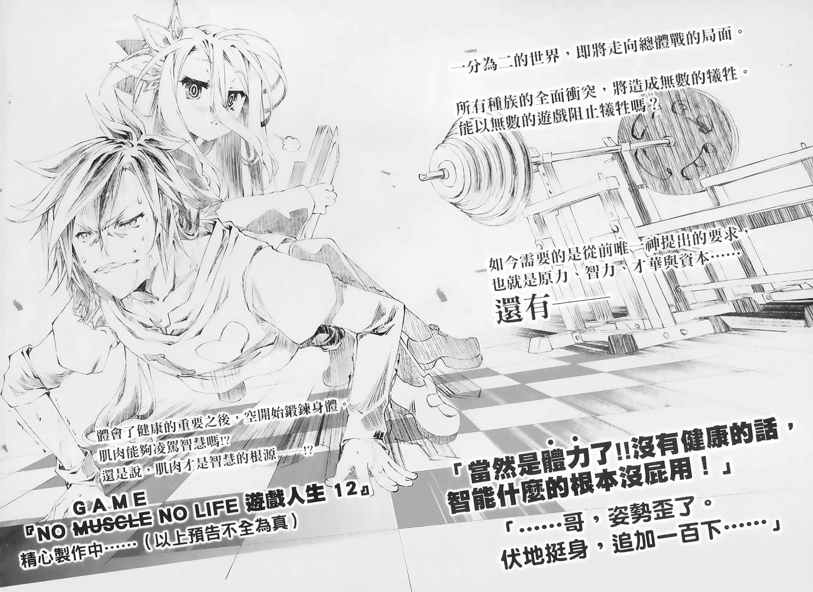
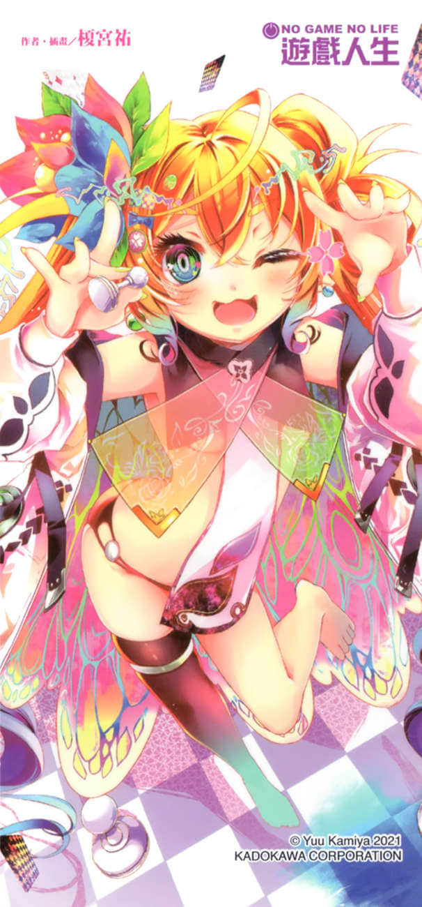
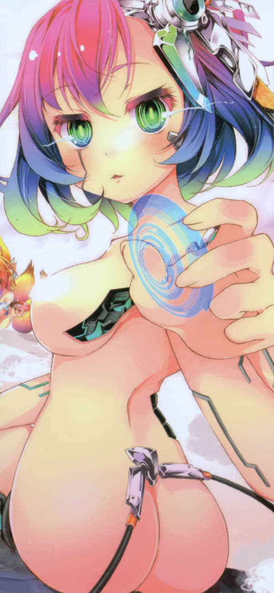

# 后记

> 来源：https://www.linovelib.com/novel/9/163403.html

「……那么，就开门见山吧。关于整整三年半都没新稿的事，请问老师有什么话要说？」（※编注：以下皆为日本出版情形。）

透过网路，新任责任编辑Ｏ面带笑容，这么质问道。

但是，榎宫却在心底感激着当今的社会状态。

因为透过网路通讯讨论的话，就不用担心会物理性地挨揍了！

因此，榎宫怀着游刃有余的心情，脸上装出困扰的表情，这么回答道：

「不是我的错，谁叫特图迟迟不肯交出原稿，我也很困扰啊。」

「唔唔……老实说我听不懂你在说什么，麻烦你解释得详细一点。」

责任编辑依然保持着笑容。榎宫煞有其事地点头，继续说道：

「像是『四面楚歌』或『矛盾』等来自中国的词语、以及『业障』等来自佛教的词语，也就是这一类典故来自地球历史或传闻的惯用句或表现方式，是否能用在虚构的奇幻世界，这样的议论一直存在着，你应该知道吧。」

「我当然知道。」

「对于这个问题，我的答案很单纯。因为特图的原文就是这么写的，所以可以使用。」

「……是喔。」

看责任编辑将身子往前探，似乎对这话题有兴趣的样子。榎宫心里有些得意，继续说道：

「在作品中也多次提到过，《NO GAME NO LIFE 游戏人生》这部作品就是特图所写的那一本书。是由神所撰写、最终将成为神话的那个故事。也就是说，我的工作只是把作者（特图）交出来的原稿翻译成日语而已。如果说在虚构的奇幻世界使用的典故来自地球的词汇，这件事不合理的话，那么使用地球的语言这件事本身就更不合理了。原文当然是异世界的语言。而我则是将原文的表现方式意译成读者看得懂的现代日语。证据就是吉普莉尔的语言，在英语版被译为英语佛教语混杂的语体。」

「原来如此，这确实有道理。」

──不过老实说，这其实是很久很久以前奇幻小说的鼻祖《魔戒》的作者说过的话。

榎宫正大光明地隐瞒这一点，脸不红气不喘地继续说道：

「也就是说，要是原作者特图不给我原稿，我就无能为力。至于他整整三年半没交出原稿的理由，我当然不得而知了。请去问他本人。或许他一直在玩游戏吧。」

榎宫如此为他天衣无缝的借口做总结。责任编辑依然保持笑容，开口说道。

「原来是这样，那我明白了。那么，版税就归特图所有，没问题吧？」

──咦？责编先生在学生时期看了我的书，如今成了我的责编……？

举例来说──

身体受了伤之后就会恶化，恶化的身体将会影响精神……

「是啊！我在学生时期第一次读了《NO GAME NO LIFE 游戏人生》，当时的震撼我仍记忆犹新呢！」

时隔三年半才推出新刊，让各位读者等了这么久，真的很对不起大家。

这还用说吗？责任编辑露骨地夸奖人的时候，肯定是另有所图。

……没事，我、我只是想请问，责编先生您入社第几年了……？

嗯？等等，不对吧？时间算起来不对啊。

如果要写得含糊一点，就是这样。

「我是这么说了没错。怎么了吗？」

「其实我是《《NO GAME NO LIFE 游戏人生》》这部作品的死忠粉丝，成为这部作品的责任编辑是我的梦想，所以我才进这家出版社。如今梦想实现了，我真的很高兴。看到这本书上刊着自己的名字，我真的好感动啊！！」

反正你接下来要说的话肯定是『快点给我交出接下来的原稿』是吧？

是。文体改回来之后，请容我在此正式问候您，新责任编辑Ｏ先生。

擦伤＝不用在意，其实这种想法根本就不合理。

「好、好吧。那我们可以换个正向一点的话题吗？」

各位读者，如果不想被医师如此看待，请好好保重自己。

「还有其他已出刊的作品也是。如果榎宫先生只是译者，契约书的内容就需要修正了。」

「也得跟法务部好好谈一谈呢。这样一来之前的费用就是过度支付了，到时可能要……」

「有。还满常听到的。」

大家好，好久不见！我是让读者等了三年半的作者榎宫祐！！

以前尼采也提醒过，精神不过是肉体的奴隶。

也就是说，这段时间我失去了全部的健康资产，身无分文──不，不只。甚至还负债累累，得花上以年为单位的时间偿还。

「所以呢？拖了这么久才交出新稿的真正原因到底是什么？」

竟、竟然真的是正向的话题！！恭喜你！谢谢你！该感到荣幸的是我──

这是什么鬼话题嘛！一点都不正向啊啊啊啊啊啊啊啊啊啊啊！！

好啦，我当然会写了！会小心在不折损健康资本的前提下用心地写！

「哪有不对？《游戏人生》明年就要满十周年了。」

等等，你刚才说了「学生时期」是吗？

义大利黑帮要杀害目标之前也会送礼。一样的道理。

到现在才好不容易有希望偿清。我的状况差不多就是这样。

────────

但是我认为，正因为它太过于简洁有力，反而更应该冷静地审视，不应该囫囵吞枣。

同时，也很感谢大家愿意等这么久。

──为什么一无是处？因为身体坏掉了。

是啊。这句话真的是简洁有力。

当然也会请各位读者继续期待下集了。各位读者，我们下集再见。

「咦咦！？老师为什么突然这么明显地提防我呢！？」

什、什么────！？十、十、十、十年！？这部作品我已经写了十年！？

而我的状况就是严重到连这点自觉都没有，根本是末期症状，连医师的眼神都像是在说「你是笨蛋吗」。

话说，我从第一集推出到现在已经老了十岁吗！？实际算来的话白都已经成年了吧！？

因此我只能说是『真的把身体彻底搞坏了』。

没错。人体可没有方便到光凭精神论或心情就能打发的地步。

──『除了死，都只是擦伤』这句话有听过吗？

都写了十、十、十、十年，含外传竟然只出了十二本！？

「呃、不、等等……」

相反地，正因为擦伤＝治得好，所以才更应该好好地治疗才对吧。

────

──咦？怎么，难道你说的是真心话吗？

「作品要满十周年了！故事的局面也从这一集开始进入终盘！！新的漫画化企划也开始了！身为责任编辑，在故事完结之前可要卯足全力来把作品经营得有声有色！身为书迷，我当然也很期待下一集的出版了！请快点让我看到续集吧！」

「……你到底经历了什么样的人生？我都说要谈正向的话题了。」

这个嘛……写得太具体的话会显得很沉重，没办法一笑置之。

「呃～算算这应该是第八年了。」

……即使只是擦伤，置之不理的话一样会化脓，还是会要命的。

…………啊，是喔，这样啊。谢谢支持，我很荣幸……

喔，好啊。我最喜欢正向的话题了。欢迎！

话说……十年？……真的假的…

说了这么多，结果你的目的还是催稿嘛！！

精神恶化到最后，人会陷入烦恼，觉得自己一无是处。

「咦？」

即使是擦伤也是需要治疗的！健康才是最重要的资产！

