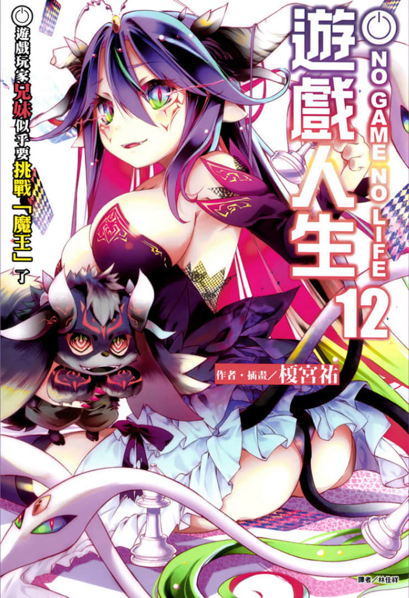
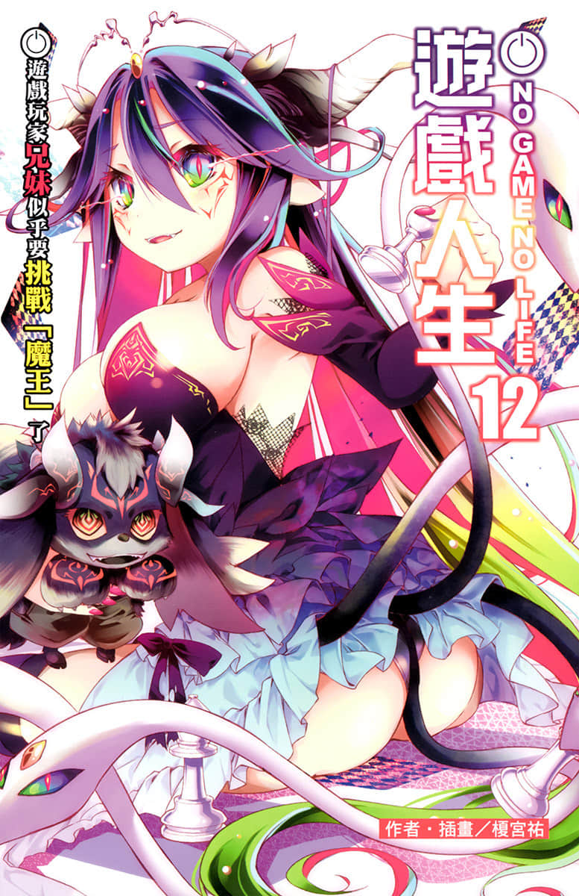
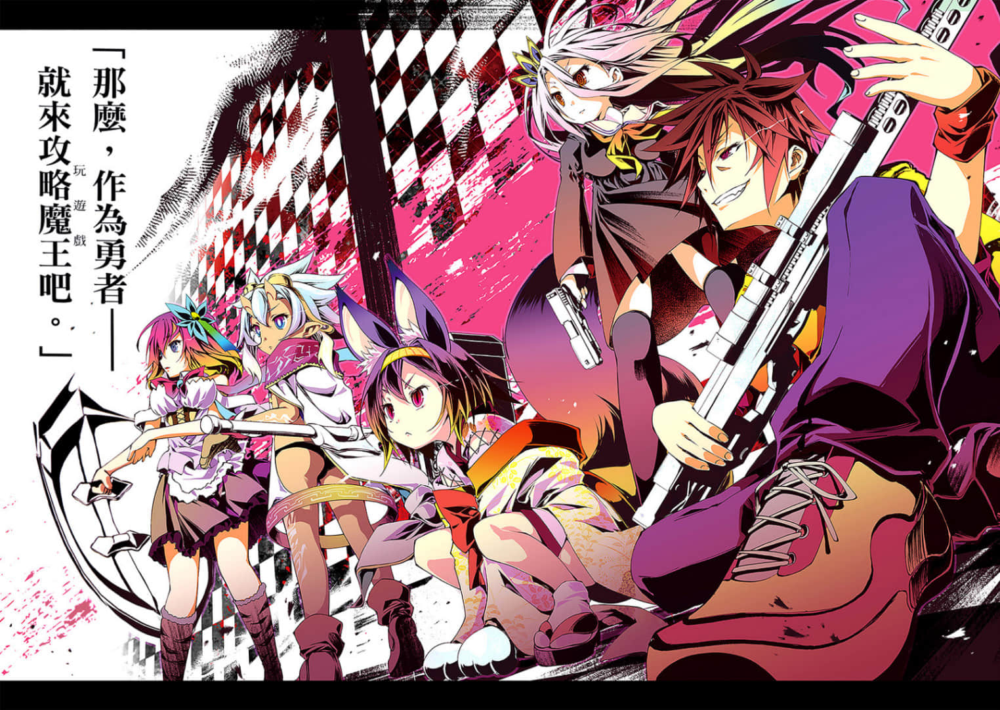
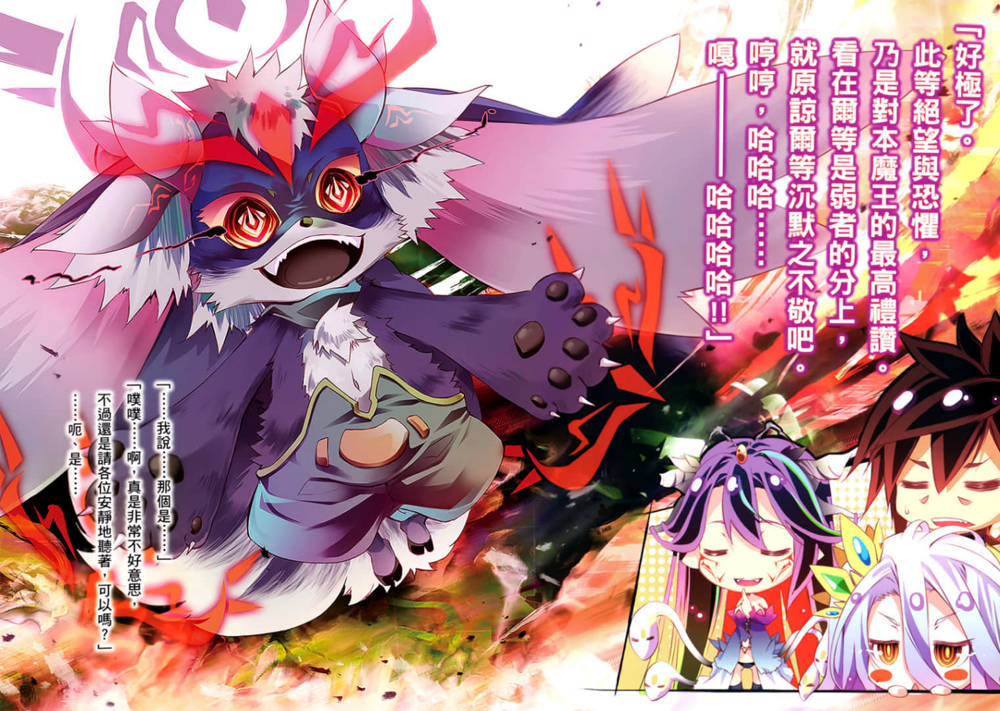
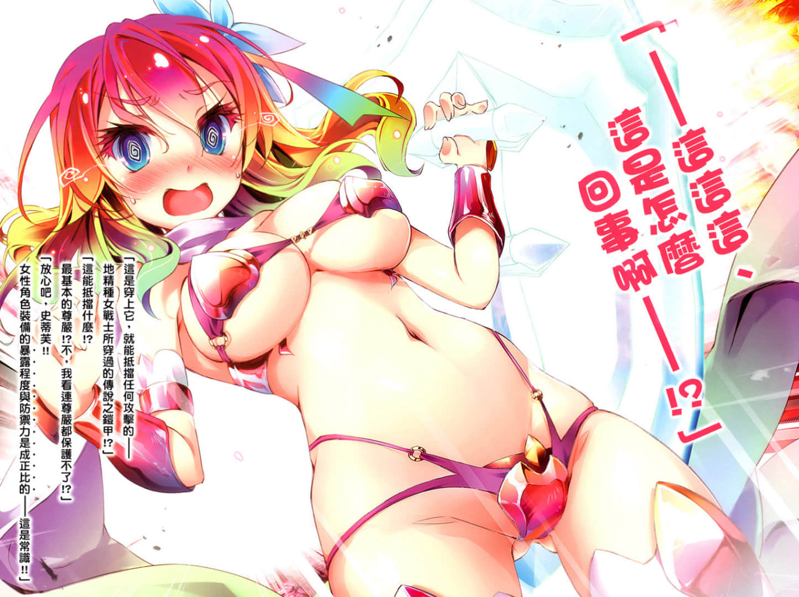
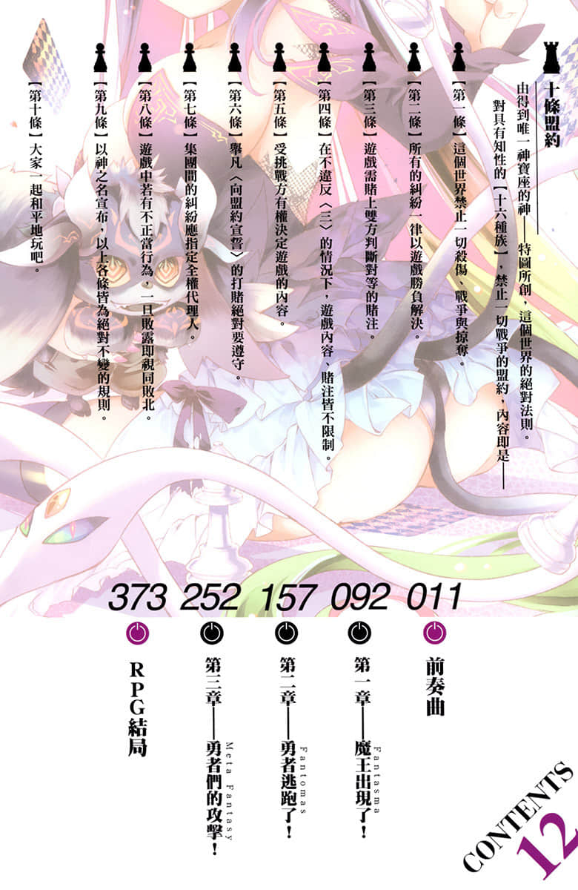

# 插图

> 来源：https://www.linovelib.com/novel/9/184724.html

台版 转自 轻之国度×天使动漫录入组

作者：榎宫祐

插画：榎宫祐

译者：林佳祥

图源：银姬子

扫图：linpop

录入：轻之国度录入组

修图：小尘

轻之国度：www.lightnovel.cn

天使动漫：www.tsdm39.com

仅供个人学习交流使用，禁作商业用途

下载后请在24小时内删除，LK与TSDM不负担任何责任

请尊重翻译、扫图、录入、校对的辛勤劳动

转载请保留完整的资讯，否则往后一律禁止

——————————————

内容简介

「为什么偏偏要现在毁灭世界！？不该是现在吧～～识相一点啊！？」

这里是一切凭游戏决定的世界──【迪司博德】。空与白来到这里，不知不觉间已经满一年了。世界一分为二，全面冲突迫在眉睫，一触即发，空等人却仍找不出有效的对策。就在此时，完全不识相的妖魔种──以及『魔王』出现了！

「嘎～哈哈哈！！畏惧吧！颤抖吧！勇者一行人！吾等魔王军毁灭世界的时刻终于来啦！！」

「要毁灭世界也不该是现在吧～～识相一点啊！」──即使空等人并没有什么身为勇者的使命感，却依然挺身挑战据说不可能破关的超高难度迷宫『魔王之塔』，除了「希望」之外没有任何武器的他们，能够战胜绝望吗──！？超人气异世界奇幻钜作，第12集！！

