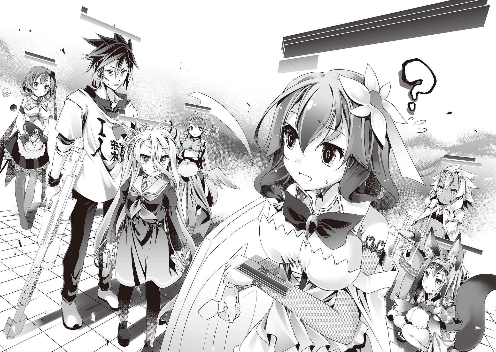
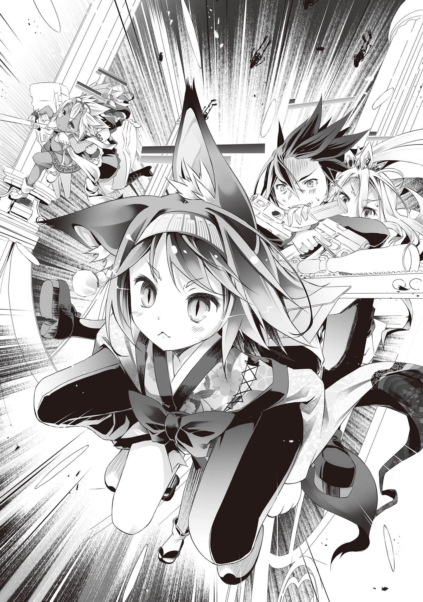

# 第二章 勇者逃跑了

> 来源：https://www.linovelib.com/novel/9/185621.html

──魔王领地《葛拉铎•勾卢姆》……

全世界最小的大陆•葛拉卢姆大陆全境都是妖魔种的固有领土。

由一片广大的陆块组成的领地，据说至今从未被其他种族占领过。

理由只有一个──那就是自从久远得无法理解的太古时代，便出现于大陆中央的存在。

破灭之塔，不灭的领域──也就是幻想种『魔王』的存在。

不过，现在有七人即将挺身而出，讨伐这不灭的『魔王』。

亦即，『勇者团队』借由长距离空间转移，站在这块土地上。

……应该是，站着的。至少在转移之前是这么听说的……

「～～～～冷死了────！？这这这这是什么地方！？南极吗！？」

「──哥、哥哥哥、哥！好、好冷──应该说……好、好痛……！」

七名勇者之中的两名──空与白跟平常一样，只做轻便的装扮、揹着一个背包。

在连前方一步处都看不见的黑暗里，两人身陷猛烈的暴风雪中，就连自己的哀嚎声都几乎听不见。

回答他们的──是似乎就在身旁的依蜜尔爱因，七名勇者中的第三人。

「【解说】葛拉卢姆大陆，为距南极点最近之大陆。魔王领地首都目前为寒冷期。因为复杂的地形与海流，来自南极的寒流经常侵袭此处，频有暴风雪发生。平均气温为──摄氏负三十一度。」

看来一行人没有走错地方，这里的确是魔王领地的首都。

空与白勉强把持着意识，聆听依蜜尔爱因的报告。

──既然妳早知道这里的气候条件，怎么没有在出发前提醒我们……？

空已经发不出声音，只能沉默地在心里如此抗议，与白抱着彼此，牙齿颤抖个不停。

「【报告】已将本机的机体表面温度设定为摄氏五十四度。主人！请抱住本机？」

没错──依蜜尔爱因坦承是为了自己的策略，才没有提醒两人这件事。

空只是「嗯」的一声深深点头，然后满怀自信地说明他的理由。那就是──

对于自己刚才以貌取人（骨）的失礼行径，史蒂芙非常惭愧。

顿时，头上浮现光球，发出充分的热能，阻止了依蜜尔爱因的阴谋得逞。

她从洞中稍微探出头来，抱着那颗一直在发牢骚的毛球，仍然嫌着冷。

──在妖魔种中地位仅次『魔王』──在谢勒•赫卸任之后的最高干部，似乎由他接任。面对彬彬有礼、深深地垂下那颗头骨鞠躬的骷髅──

不过，接下来满心的疑问让她们大声嚷嚷了起来。

而代替维格的竟然还是史蒂芙，这又是为什么？两人一直在追问如此决定的理由。

「刚刚我真是太失礼了我、我吓了一跳，才会忍不住──！！」

七名勇者中的第五人──初濑伊纲一抵达这里，似乎是在感受到寒气的那一瞬间，就马上像要过冬的狐狸似地挖了地洞。

「哼哼……也就是说，实际上让人害怕的还是魔王大人……！」

「喀喀……各位勇者大人，初次见面，幸会。在下是──」

「主人，我来迟了。撰写──调整术式的功率多花了我一点时间♪」

──除了这两点规则尤其特殊之外，游戏的规则本身是很单纯的。

「……喔，请多多指教……话说回来，你是从哪里发出声音──」

老实说，完全看不出表情──不，应该说，根本没有表情。

但是，联邦（空等人）一直以来都不敢轻举妄动，因为贸然采取行动的话，可能真的会被『战线』逼上绝路──所以这段期间才一直都没有行动。

环境这么恶劣，搞不好会在抵达『塔』之前就先遇难……

（话说回来……空啊，你之前不是说过『现在无法贸然行动』吗？）

除了不怕冷的两人（吉普莉尔与依蜜尔爱因）之外，其他人都能轻松地容纳进去。

一反这辆马车让人以为都是以骨头打造而成的外观，车厢内很宽敞，而且装修典雅高级。

「────唔，这、这么说好像也是！？嘎～哈哈！人类啊，终于理解本王的可怕了吧！！」

虽说这里就是魔王领地的首都，但接下来恐怕免不了要以徒步的方式前进了。

总之，拉车的似乎是一对类似半人马的妖魔种。

人马车的车门开启，一道人影从车上下来，看来似乎一样是妖魔种。

──空很想知道这具喀喀作响的骷髅，声带到底在哪里。

「…………还是很冷、得斯……伊纲讨厌寒冷、得斯……」

然而这位名叫盖纳乌•伊的骷髅，反而再度行礼道谢。

冒险团队必须打倒来袭的妖魔种（无名小兵）并前进，打倒顶层──第一百层的魔王后，即为胜利。

「哼哼哼……请放心。迎接者似乎已经来了。」

七名勇者中的第四人──吉普莉尔施展魔法。

「在、在游戏方面，我可是自认且公认最派不上用场的角色喔！？更何况游戏的内容是击退来袭的妖魔种并前进──也就是『战斗』，就算不是游戏，我也办不到啊！？」

……得、得救了……

「喂，小拘！！把本王当玩具之后，接着当成了暖暖包是吧！？妳把魔王当成什么──」

在这之前，谢勒•赫一直不发一语，像是在等待着什么。

「真不愧是魔王大人……已经安排好迎接者了呢。哼哼……」

真要说的话，迷宫本身即为『塔』──亦即『魔王』的内部，也就是《绝望领域》的影响范围，会吞噬希望的领域。

如此满怀自信地回答的空，暂且不理会依然疑惑地歪着头的史蒂芙。

但是，既然这样，为什么加入的不是最强的地精种（维格），而是最弱的地精种（缇儿）呢？

史蒂芙一脸苦恼地把脸凑过来咬耳朵问道。

至于七名勇者中的第六人与第七人──

哼！当然，这是非常有理论根据的人选。

正当两人要按照依蜜尔爱因所说的抱住她取暖的时候──

──吉普莉尔与依蜜尔爱因的空间转移无法前往视野以外的地点。

「嗯，没关系的。这正是我一直在等的时机，是采取行动的理想时机啊。」

……话虽这么说，但也没听说魔王会正直地救助快死在路边的勇者吧……

「……【咂舌】【要求】号外个体调整魔法功率所费的时间大幅超出推测，请公布理由。」

「请、请请、请问！？为什么一起来的是我，而不是首领──不是叔父大人！？」

「喀喀……喀喀喀──不会、不会！！对我来说，妳的反应让我感到非常荣幸！」

「魔王大人啊！如果在下令人害怕，那都是因为魔王大人赐给在下的外貌所致啊！」

而且说到底，真的有办法胜过『魔王』吗？即使真的能胜过，今后又该怎么办──？

入侵迷宫的冒险团队人数上限为七人，最多五个战斗人员加上两个预备人员。

他再次露出邪恶的笑容，发出喀喀的声音说道。

差点冻死的空与白，在内心如此庆幸。不过──

「别连空阁下都说这种好像首领会说的话啊啊啊～～～～～！？」

──这具骷髅的自我介绍，被吓得花容失色的史蒂芙的尖叫声打断了…………

一行人在心里如此嘀咕的时候，灯光已经来到眼前，一行人终于看清楚了来者的身影。

要挑战这样的游戏……找来天翼种（吉普莉尔）、机凯种（依蜜尔爱因）、血坏个体的兽人种（伊纲），还有过去「疑似与『魔王』打成平手」的地精种加入团队，这都能理解。

「……我还以为空会更有理论地准备战略呢……」

缇儿与史蒂芙从出发前就一直这么问，而且一直被忽视到现在……

「嘎哈哈哈！那是当然的！！怎么可以让勇者在挑战本王之前就先遇难冻死呢！？」

「最想问『为什么』的明明是我！？」

「直觉！！我身为游戏玩家的直觉，告诉我这就是最好的组合！！」

看来，被伊纲抱在怀中的这颗毛球之本体──『塔』那边派人来迎接了。

「盖纳乌•伊，真是不公平！？这些家伙可是根本不怕我们啊！？」

──不出所料，拉马车的半人马果然也是妖魔种。

──那是一辆很大的马车……不，应该说是『人马车』才对。

察觉冻死的危机暂时解除，心里松了一口气，跟空与白一样。

而唯一能成为武器的，据说就是那会被吞噬的『希望』。

──阻止《绝望领域》扩大的确是非做不可的事，我们无从选择。

---

■■■

这时，从她眺望的方向──在刮着风雪的黑暗中，出现了小小的光源，正在往这里靠近。

「……那么，谢勒•赫，我们的目的地在哪里？」

「喀喀……容我重新自我介绍。在下是骷髅爵士族的族长，同时也是继智将谢勒•赫大人之后接任统合参谋本部议长的盖纳乌•伊。今后请多多指教。」

只是在理论确定的过程中，以直觉弥补其不足，是身为游戏玩家理所当然的做法──空在心里桀骜不驯地暗自呢喃。不过──

「……虽然我不是很明白……不过你们希望别人害怕自己吗？」

虽然吉普莉尔的魔法确保了最基本所需的热能与光源，但是在魔法屏障之外，仍是伸手不见五指的黑夜，以及狂风暴雪。

对于毛球提出的抗议，两名部下连忙哄──不，是连忙说出了由衷的赞美。

正确来说，拉车的不是马，而是上半身是人、下半身是马的人马，而且有两匹……不，应该说是两人？

来者面露邪恶的笑容──大概吧。

随后，头上的光球照亮了眼神针锋相对的两人。

光球的力量还阻挡了周围的暴风雪，使撕心裂肺般的酷寒缓解到有些寒冷的地步。

但是，空与白根本无暇计较这一点，只好把满心的不平与不满暂时摆到一旁。

空眯着眼睛，疑惑地问道。

──没错……经过谢勒•赫的解说，以及缇儿提供了过去的纪录，一行人已经理解了游戏的内容。简单来说，是这样的──

──游戏的内容是『攻略迷宫』。

身上穿着质地优良的西装，显示其高尚的身分地位。他一手贴在胸前，恭敬地鞠躬行礼，然后──

「身为仆从，为了主人无数次突破极限是应该的♪不过呢～为了自己的欲望让主人吃苦的冒牌仆从，无法理解也是理所当然的吧。所以请别放在心上❤」

言行极其失礼的男人──空的回应被史蒂芙给打断。

「────咿──呀啊啊啊～～～～～～～～～～～～啊！？」

「想被害怕！？话不是这么说的吧！？我可是魔王，被害怕是当然的啊！？」

还是一样被伊纲抱在怀中挣扎着的毛球这么反驳道。

「喀喀──我们妖魔种是引导世界走向灭亡的存在，当然该受到害怕了！？不过，对我表现出害怕的，妳是第一个，我由衷感激妳，迷人的人类种淑女。」

绅士骷髅这么说道，温和地亲吻了史蒂芙的手背。看着他的样子，空等人心想……

──原来如此？毕竟妖魔种是以毁灭世界为首要目的的种族……但是在大战时却被当成杂碎看待，在盟约成立后，也一直被视为无价值的种族，屡遭忽视、瞧不起。

所以他们应该不常被害怕吧。也难怪史蒂芙的反应会让他们感动──或许是这样……？

「喀喀……话说回来，智将谢勒•赫大人，很庆幸妳还平安。」

不顾众人的思考，彬彬有礼的骷髅提起了空等人也很在意的问题。

──那就是……

「当魔王大人命令智将谢勒•赫大人去死的时候，我还真不知该怎么办呢。」

「────────咦？本王并没有那么命令啊？」

「是！当然没有！但是在您复活的时候──」

『哼哼哼……嘎～哈哈哈！！睽违四百零八年的降临──真是太畅快了！！谢勒•赫，我们马上来毁灭世界吧！妳先去消灭几个候补勇者过来！！』

「──在下白骨我还记得您是这么说的。」

「呃、咦？……嗯……本王的确是这么说过，所以呢……？」

……竟然真的说了这种话……

空等人傻眼地眯着眼睛盯着魔王，不过他似乎完全没察觉。

接着，彬彬有礼的骷髅只凭动作与音调，就纯熟地表现出苦恼的神情。

「『战线』乃是魔王军（我等）之麾下，必然地，『勇者候补』将会是联邦的重要人物。」

「……呃、嗯，这是当然的啊？」

…………？

──也就是说，实现了如此高度文明的，其实是谢勒•赫一个人的手笔。

──沉默了足足三十秒后，毛球的头上冒出问号。

实际上，被伊纲抱在怀中的那颗毛球（魔王）自己也是满脸问号喔……？

「哼哼哼……？没错，这一切都是为了毁灭世界啊？」

「──原、原来是这样……喔、喔喔、魔王大人啊……！！」

「──本来是打算那么做的，但是真的很抱歉，可以让我们直接前往魔王大人的座前吗……？」

「推动建设的是我谢勒•赫的『智慧』，既然这样，当然是魔王大人的意志了。」

……不，魔王肯定没想那么多吧。

毕竟至少在空与白原本的世界，这根本不是什么需要特地去思考的事。

而这些一看之下，反而显示这里是经过高度规划而建立的城镇。

────…………？

只是因为他们过度盲从有点那个的创造主，才会显得有点那个……

「喀喀……正是。一切都是智将谢勒•赫大人的意思──根本来说就是魔王大人的意思！」

虽然建筑物是石砌的，但也有不少高层建筑物──这里毋庸置疑地是一座『都市』。

「……难、难道说其实『魔王』不太受到尊敬吗……？」

「哼哼……依规定，加班费为通常薪资的三倍，并且必须提前两天在员工的同意下向劳动局提出申请，任何不符合规范的申请将完全不受理──原因只是如此单纯。」

「呃！？……这、这样的话……那、那就没办法了……」

既然期望世界毁灭，本身所居住的城镇应该要更加地──该怎么说呢？要更荒废才对吧。

「……以毁灭世界为目标的种族为什么要发展高度的文明社会啊……」

毁灭世界这种事，反而是如果什么都没想的话，就会『不小心』造成的后果──

她低头像是为刚才乱了分寸的反应道歉，然后──

「……本来以为……一定、是在……洞窟……之类的地方……」

「想不到是个普通的城镇──不，文明程度甚至不亚于艾尔奇亚呢……？」

……是这样吗？

「难道你以为你这等角色的担忧，魔王大人会从未想过吗？」

「哼哼……你们认为为了毁灭世界，需要的东西是什么呢……？」

「哼哼……因为谢勒•赫拥有魔王大人所赐的智慧，智能仅次于全世界最睿智的魔王大人──拥有如此智能，连这点程度的事都办不到的话，才是对魔王大人不敬。」

谢勒•赫满面邪恶地──说明魔王领地的劳动环境是多么地正派。

「────────呃，啊、咦？」

「……呃……唔，好，本、本王就原谅你。毕竟本王宽宏大量，呼、哈哈哈……」

……但是，谢勒•赫似乎有不同的看法？

被犀利的蛇眼瞪着，骷髅有如被雷击中似地全身颤抖。

空难掩惊讶，姑且再度确认道：

「哼哼……当然不可能了！只要说是魔王大人的意思！不只是境内的所有旅馆，全妖魔种都会马上起床，感激涕零地为魔王大人劳动、效命！只是──」

看谢勒•赫如此夸耀自己的智慧与忠诚，空心里想──

「喀喀喀喀！！魔王大人的威严可是遍及天下，有如阳光普照喔！？」

得到恩赦的骷髅，恭敬地低下头骨鞠躬之后，开口道谢──不，是道歉。

──魔王大人的怒火，只因为『不在营业时间』这样的理由就平息了。

即使空等人如此冷眼在心里吐槽，谢勒•赫依然发挥她的智慧──滔滔不绝地说了起来！！

──魔王似乎希望勇者们以万全的状态挑战自己，对于部下打算做出违反自己命令的举动，显得非常生气。但是──

…………？

「哼哼……在魔王领地（葛拉铎•勾卢姆），劳动时间原则上都是八小时，而且完全采周休三日制。」

「哼哼！？妳、妳……妳怎么能说这种话呢！？」

明明是魔王……明明是绝望之幻想的化身，毁灭世界的毛球……

谢勒•赫之所以有勇无谋地挑战吉普莉尔与依蜜尔爱因，原来是因为这样。

「哼哼哼……另外，勇者大人们绝对会拒绝选择『牺牲』，宁愿选择次善的选项，这也是已知的事实。因此肯定不会选择杀害我谢勒•赫──当然，魔王大人早就料到了这一点。」

空等人理解了这一点之后，接着换谢勒•赫反过来对他们问道：

不是为了世界和平，而是为了毁灭世界……众人或许是第一次思考这种事。

缇儿忍不住小声地对空这么问道，但──

|真不愧是智将谢勒•赫大人……能从魔王大人简单的几句话中，如此深入地推测出大人的真意……」

空等人本以为会是个空有国家之名，实则极为荒废的聚落，而谢勒•赫与骷髅同时回答：

她脸上的笑容依然典雅而邪恶──但也清楚地透露冷酷的斥责之意。

不明白骷髅为何向自己道歉，空等人疑惑地歪着头。而毛球的态度，却与他们完全相反。

「哼哼……阿剌克涅族的丝绢纤维兼具强韧与超群的质感，结合史莱姆族的染色技术和半兽人族采伐的木材，经哥布林族的木工技术加工，才能做出这样的座椅。各位还满意吗？」

──结果……令空一行人讶异的，不只是如此正派的劳动环境……

「……那么，这件事就到此为止。接着，我们就依魔王大人的意思，送勇者大人一行人前往旅馆──」

「喂！！你打算让疲惫的勇者挑战本王吗！？那可是本王的命令，让他们去旅馆休息，恢复到最佳状态！！」

…………

「那是职权骚扰不是吗！？算了！！就这么办，马上带领勇者们去本王的座前吧！！」

「啊！！喔喔，真不愧是魔王大人──请原谅在下这无脑白骨的戏言！！」

「……咦？我们本来就是这么打算的……话说，旅馆？」

──看来『魔王（老板）』本身也是极为正派的主管。

……这个嘛。

谢勒•赫邪恶地笑着，得意洋洋地介绍自国的产业──见状，空等人忍不住嘀咕了起来。

载着众人的人马车似乎是来到了都市的中心区域，现在风雪已经减弱许多，车窗外看得到黑暗中的街景与无数灯光──

「我谢勒•赫卸下议长之职，主动落败，将此身的所有权利转让给勇者大人们！以此证明了勇者大人们基于盟约『除了挑战魔王大人之外别无选择』之事绝对不假！也就是说，我的行动断了勇者大人们的退路──这正是魔王大人的真正目的！」

──果然……妖魔种其实还挺聪明的吧……？

……竟然因为『不在营业时间』而拒绝魔王的命令……

「……即使是魔王的命令也一样吗？」

「咿咿！？对、对不起，是我失言了，可是『魔王』照亮黑暗好像不太对吧！？」

至少应该是个让智能与能力有落差的各族群分开居住、彻头彻尾的格差社会才对。

「喔喔，魔王大人啊，请恕罪！但由于这个命令来得实在太过突然──境内的旅馆都在营业时间之外！！」

因此，空只能以问句回答。听了他的答案，谢勒•赫邪恶地点头，并加以订正。

然后，谢勒•赫干咳一声，说道：

「……这……应该是『强大的武力』……之类的吧？」

「听说是妖魔种居住的魔王领地，我想说既然是怪物的国度，还以为……」

空、白以及史蒂芙都错愕地说出各自的感想。

「哼哼哼……你这等角色，当然无法理解魔王大人的深思熟虑了……因此，你不需要觉得内疚──但是，你该留意言行，不得逾矩。」

「────！」

「即使是伟大的智将谢勒•赫大人，一旦挑战有天翼种与机凯种效命的艾尔奇亚国王，也必定要败北──因此，对于魔王大人的命令，在下无脑的白骨只觉得是『命令她去死』的意思……」

耳朵敏锐的谢勒•赫与骷髅听到了，都严厉地指正缇儿。骷髅更是激动得全身喀喀作响。缇儿吓得躲进白的裙子里，但还是忍不住开口吐槽。

这颗毛球似乎实在不好意思摆出大牌的架子，眼光游移，假装自己宽宏大量。

对于魔王的原谅，这具骷髅感动得全骨颤抖。

或许是因为居民包括各式各样的种族，建筑物、门、铺好的道路与沿路的路灯都特别巨大。

──也就是说，是因为『魔王』没怎么多想就下达这样的命令……

空等人的眼光转向被伊纲抱在怀中的毛球（魔王），但这颗毛球依然行使缄默权，移开眼光，避不回答。代替他回答的是──

「……话说回来，其实我一直很在意这车厢的装潢，莫非这座位的材质是丝绢吗……？」

「哼哼……你说的没错。正确来说，应该是『强大的国力』。」

接着，她又以同样邪恶如恶魔的笑容和音调，继续说道：

「哼哼……那么，『国力』究竟是什么？那当然就是『国民』，不会有别的答案了吧？」

她轻描淡写地说出的理论，却是连贤君圣王都自叹弗如……

「伟大的魔王大人创造出了多样的国民，赋予他们形形色色的特性。虽有差异，却绝无贵贱之分。如果能建立让这样多样的国民各自充分发挥、活用能力的社会──那将会成为『国力』的基础。」

「…………」

谢勒•赫的理论无比正确，令空等人哑口无言。她继续说道：

「例如，若没有魔虫族的能力，要开拓这片冰天雪地将是难如登天。史莱姆的体液能提炼成药剂，多产且强壮的半兽人族提供大规模劳动力。他们所使用的工具，则出自被赋予了灵巧技术的哥布林之手──缺了任何一个种族，妖魔种都无法经营农工或土木等事业。哼哼……」

「…………」

「必然地──没有他们的话，我谢勒•赫也会饿死。既然我本人也为他们所养，为他们运用魔王大人所赐予的『智慧』也是应该的吧？」

──她说的一点都没错，是完全的正论，没有反驳的余地。

问题在于正论往往都只是『理想论』。

一旦要实行理想，往往会遇上无数问题。

具体来说──

「……这么说来，魔王领地（葛拉铎•勾卢姆）是封建制吗？照这样说，职业的选择跟经济流动性不就──」

对于史蒂芙的疑问，谢勒•赫邪恶地笑着回答：

「哼哼……不，我们妖魔种由多样的部族形成，因此，例如对于需要大量食物的个体或部族，我们修法提供食物方面的减税措施。另外，在职业选择方面也是自由的。因为只有摆脱部族窠臼的创意才能带来变革。当然，我们会提供相关的补助措施────」

────────……

就这样，谢勒•赫滔滔不绝地说起将理想论实践的无数政策与法律制度。

史蒂芙则做起了笔记，摇身一变成为虚心受教的学生──

「魔王领地（这个国家）是工作八小时、完全周休三日制吧……既然这样，会不会因为下班时间到了，游戏就完全无法进行？」

克苏鲁神话系列中常见的描述──『非欧几里得几何型构造物』，指的肯定就是这样的东西。照理说那是于三次元空间不可能存在的、有违直觉的、难以名状的顶天耸立之奇形怪状物体。任何人看了都会不由分说地被赋予异样感和不安的情绪，并且在内心更加肯定──

也就是说──中途离开与弃权都是不可能的。如此提醒之后──

「哼哼……咳咳。那么──容我们正式介绍。」

但是，唯独『魔王（老板）』一个人完全无法体恤部下的辛劳。

看来无论怎么正派经营的国家也有极限，难免有例外存在，理想终归只是理想。

她肯定是个无人能及的智者，这是毋庸置疑的。

「嘎～哈哈！！怎样～很大吧～怕了吧！？现在终于明白本王的可怕了吧！？那么，谢勒•赫！！在勇者们害怕得临阵脱逃之前，快点开始吧！！」

「呼──这是当然的！！怎么可能有勇者以周休三日、准时上下班的方式挑战魔王呢！？」

这即是据说会令踏入其领域的性命无条件地堕入绝望的──

看来理想终归只是理想啊……众人的眼神变得有些感慨。

这是这个游戏的大前提，却太过暧昧不明。

挑战者（勇者）以『希望』为唯一武器，打倒『塔（迷宫）』内的妖魔种（敌人）并抵达塔的顶层──击破位于顶层的『魔王之核』后，即为胜利。胜者将能得到『魔王』所曾经拥有的一切。

骷髅如此要求众人宣言，对此──

至少这「智将谢勒•赫」的称号绝对名不虚传。

---

■■■

「让各式各样的国民充分发挥其多元的特性，并保有十足的气力与活力──这样的社会，也就是这样的国民，每一个都是魔王军的一分子──都是魔王大人所创造的宝物！！每一个国民都要有扛起世界的坚定责任心、自负和荣誉感！！团结一致并一起朝目标迈进。如此强大的国力，才是毁灭世界所需的最基本必要条件──以上是我谢勒•赫个人的一点拙见。」

「……真是不敢相信，原来『多元民族共存共荣的国家』早就已经实现了吗……」

并且──

在他们背后的景象无比奇异，让第一次目睹的空、白、史蒂芙、缇儿与伊纲都忍不住倒抽了一口气。

「哼哼……不，魔王大人。我谢勒•赫的权利目前全归勇者大人们所有……」

空在心里整理过规则之后，提出了他的疑虑与疑问。

「……唔，我有大约三个问题，可以提问吗？」

「……空，谢勒•赫小姐的人身权利可以转让给我吗？我想诚挚邀请她担任艾尔奇亚联邦的顾问──不，担任我的上司。」

「──那么最后是一个完全无所谓的疑问……不，从某个角度来说，是最重要的问题。」

而且为了实现此事，主管本人还不辞辛劳地奔波，让空等人相当感动。

「是！魔王大人，因为如此，目前由在下白骨逾矩，带领统合参谋本部，负责主持游戏的进行。」

其主（魔王）所赐之智慧所推导出的如此结论，令空忍不住倒抽一口气。

离开艾尔奇亚之前，谢勒•赫曾说明过这个游戏『以希望为唯一武器战斗』──其具体方法，在空确认骷髅点了头后，决定先不做深究。

──没想到已经有人为了毁灭世界而实现了。

──妖魔种是愚笨的种族？绝对没那回事。

「第一──能保证不会在进入『塔』的瞬间马上遭受攻击吗？」

「那接着是第二个问题。说到底──你们所说的『希望』具体而言是什么？」

也难怪他们会有这样的反应──因为它甚至不算是建筑物……而是一种幻想（恶梦）般的存在。

「『弃权』等同于落败，所有的『希望』将会立即遭到征收──」

「……果然是这样啊……」

勉强自己接受答案之后，空提出了第三个疑问。

只是……她的目标方向，存在着致命般的文化（思想）差异…………

「那么，各位勇者大人，相信各位已经听过说明，不过……」

谢勒•赫准备为她的治国课程做结论。

那么，『塔』内的妖魔种如果都准时上下班的话──比方说，虽然还不知道有没有，不过假如『塔』里面有守关头目之类的角色存在，但是在下班时间前没有打倒他，那在他隔天上班时间之前游戏都无法继续进行──空担心规则有这样的漏洞存在。

如此确认过游戏规则之后，骷髅最后补充说明：

……既然这样，也就只能理解为『就是这样的东西』了，是吗……？

要是没有最后那一句多余的话就完美了……空在心里扼腕。

终于到达目的地，下了人马车的一行人──不，除了吉普莉尔与依蜜尔爱因之外的所有人，都被眼前的光景震慑住，甚至忘了呼吸。

「是的……我们将以一天四班、每班六小时的轮班制营运游戏。各层的头目也会一直等待勇者大人们前往，并且获得休假津贴。追根究柢来说，支援本游戏原本就是业务之外的劳动……不只要向劳动局提出申请，还要调整所有妖魔种（工作人员）的班表……光是营运就让头骨疼痛不已……要不是多亏智将谢勒•赫大人在提出辞呈的同时提供了企划书，在下肯定不知所措，根本应付不来……」

「喀喀……请放心。游戏由在下全权负责，保证二十四小时运作无碍。」

──一旦进了『塔』，在结束之前都无法出去。

──那是一座外型无比奇异的『塔』，比他们见过的任何建筑物都还要来得巨大。

然后──

真是太可惜了……怎么会这样。就差那么一点点……

骷髅彬彬有礼地这么回答。

同时参与战斗者最多五人──预备人员需在『袋子』中待机。

──这个游戏，只能以此『希望』为武器战斗。

吞噬希望之猛兽、破灭的幻想、绝望之领域──『魔王』本身……

毛球与他的部下们的对话，一下子让众人忘了来之不易的恐惧。空等人的心神迅速地回归了镇定。

──两名妖魔种鞠躬行礼，满怀荣耀地介绍『魔王』──他们的主人、创造主。

不过，这次回答他的疑问的，不是谢勒•赫，也不是骷髅，而是──

「喀喀……各位勇者大人，欢迎来到魔王大人的座前。」

「……咦？是这样吗？……算了，无妨。那么，盖纳乌•伊，快开始吧！！」

不过，下一个问题则是……

两人的解释，证实游戏的营运果然是正派经营的表率。

──『希望之武器』……

一旦『希望』被吞噬殆尽，即为落败……

──在那之后，一行人乘着人马车，摇摇晃晃地又前进了约一个小时左右。

要是没有『十条盟约』的保护，血肉之躯的人类肯定无法在其面前维持心神正常。

相反地，当所有挑战者（勇者）的『希望』都被吞噬殆尽时，即为挑战失败（败北），游戏就此结束。

「哼哼……请放心。勇者大人们在获取『希望之武器』的地方──也就是位于入口处的『准备室』，是无法互相攻击的安全地带。」

「另外，在游戏结束之前都不能离开『塔』，请见谅。」

──挑战者（勇者）组成最多七人的团队，攻略『塔（迷宫）』。

然后，西装笔挺的骷髅恭敬地鞠躬，进行游戏规则的最终确认──

看来，『希望』就跟这个世界似乎可清楚确认其存在的『灵魂』一样，被明确地定义为来自『灵魂』的东西之一。

「哼哼…………是的，我谢勒•赫也差点就累倒，不过还是勉强赶上了。」

「【再答】那是组成『灵魂』的精神活动要素之一。定义为『心』的一部分。为感情的一种。」

在离开艾尔奇亚之前，空也向谢勒•赫确认过此事•现在他又重新确认一次。

「主要是司掌求生意志之『魂』的机制──是生命所内含的概念之一。」

对于这个回答，空的心里莫名地失望，就连他自己都觉得不可思议。不过──

我们以为目前为止没人实现过的多元社会。

「哼哼哼……啊，真是不好意思，我太唠叨了吧。总之，简单来说──」

「以上，如果没有问题的话，那就请各位【向盟约宣誓】并开始游戏吧……可以吗？」

啊啊……这的确是『魔王』没错。

亲眼目睹，众人才心生实感，身体忍不住颤抖起来。

「……无论听几次……都听不懂、呢。」

啊啊──艾尔奇亚联邦做为目标的最终理想。

「──啊，原来是这样啊……」

吉普莉尔与依蜜尔爱因毫不迟疑的解答，就跟从艾尔奇亚出发前谢勒•赫所解释过的一样，让空与白翻了白眼。

「──那么，如果没有其他疑问的话，接下来请跟随我等（工作人员）一起进行宣誓。」

骷髅这么说，同时举起了手。众人的眼光同时转向空。

──无论是在大战时期，还是终战之后，甚至是现代。

过去任何人──甚至是神灵种，都不曾战胜过『魔王』。

……真的要挑战吗？众人把判断的权利完全托付给空。

「嗯，那就开始游戏吧──【向盟约宣誓】。」

看空笃定地举手宣誓──既如此，众人都不再有异议。

加上白、史蒂芙、缇儿、伊纲、吉普莉尔、依蜜尔爱因这七人，与骷髅和『塔』内的妖魔种（工作人员）们同时宣誓──

──【向盟约宣誓】──

「哼哼……啊，魔王大人？恕小人冒犯，您也必须跟着做──请说【向盟约宣誓】……」

「嗯咦？……啊，对喔。本王不跟着同意的话，游戏就无法开始吧。既然这样！嗯！好，本王也同意吧！！勇者们，尽管来挑战吧──【向盟约宣誓】！！」

在谢勒•赫的催促下，仍然被伊纲抱在怀中的毛球大声宣誓。

──那外表奇异而巨大、凶恶的『塔』之大门，随之敞开了。

「喀喀……那么，在下得前往营运本部，就在这边失陪了……」

骷髅恭敬地深深鞠躬，留在原地目送一行人。

「哼哼……各位勇者大人，这边请。由我谢勒•赫送各位到入口。」

在谢勒•赫的带领下，空一行人通过了『塔』的大门──

---

■■■

穿过『塔』的巨大前门，进入内部之后──看到的是无机质的宽广大厅。

看起来应该有艾尔奇亚王城的玉座大厅那么大──不过以刚才那扇前门的巨大程度来说，这大厅显得太小了点。回头一看，才发现刚才那扇巨大的门，竟然已经缩小成适合这大厅的大小了。

看来『塔』的内部就跟外观一样，无法用常理判断。

「……原来如此？这就是所谓的──『希望之武器』吗？」

──原来如此。看来勇者团队（我方）的『希望』真的都变成『武器』的样子了。

谢勒•赫先是邪恶地微笑点头──然后歪起了头。

对这个世界的人来说，所谓的『武器』的确是古老到不行、可说是太古时代的道具。

「……嗯……这个解释……说得通……」

看了各人手中的武器之后，空「嗯」一声地点头。

「──我很肯定这绝对不是『武器』吧！？」

「我想──应该是『本人希望的形态具现而成的武器』吧？」

与其说是敏锐，其实只是因为这是多数电子游戏共通的规则。

──看来这个男人──空之所以会带自己来，果然不是因为单纯的直觉，而是深思熟虑的结果！

「……谢勒•赫•我姑且问问，这能力值的分配偏颇有什么意图吗？」

在谢勒•赫的催促下，空等七人即使怀着戒心，仍各自触摸了一道浮在空中的光。

也难怪史蒂芙自称对武器不熟。即使如此，看到她手中所得到的『武器』──

「嘎～哈哈！！这武器太适合只知以自己的肉身为武器的兽人种（小狗）了！！──话说妳差不多该放开本王了吧？小狗，喂，妳有没有在听啊！？」

吉普莉尔陶醉地凝视着手中正散发淡淡微光的──凶恶的『大镰刀』。

缇儿没有拿到任何新武器，只有她平常随身携带的『大槌』正在发光，她不安地嘀咕道。

兄妹俩看着彼此头上的计量表，如此嘀咕：

至于空与白的情形，则与史蒂芙形成了对比。

空的回答让史蒂芙仰天大叫，表情刚好是希望与绝望各占一半。

──而是她头上浮现的『计量表』……

「哼哼……那么各位勇者大人，请先触摸那些光。」

──既然『武器』是由个人的『希望』之形态显现而成，那么，自然不可能会形成无法希望（想像）的『武器（形式）』──也就是实际上并不存在的武器。

──她的权利完全归空等人所有……应该不会对他们撒谎才对。

「……史蒂芙……妳的状态列，是怎么回事……？」

「……这HP……会不会……被敌人、摸一下……就死了……？」

「史蒂公……拥有三条HP，实在是太犯规了、得斯……？」

「是吗！？我怎么觉得你对我的评价好像是褒贬各半！？」

「奇怪了，我几乎没有使用过武器……但不知道为什么，这把武器拿起来莫名地顺手呢。」

因此，令三人错愕的，并不是那张『大盾』──

那是『攻击机（无人机）』，看起来一副会发射雷射光的样子。

空与白确认着手上的『武器』，都觉得莫名地顺手。

「不……因为听说这是『以希望为唯一武器战斗的游戏』对吧……？所以我想说，所有人之中最乐天、脑袋里都是花园的──我是说，心里充满保护大家的希望的，应该就是史蒂芙了吧。」

从墙上的小窗户能稍微看到塔外的夜空，大厅的中心处有一道模样扭曲的巨大魔法阵。魔法阵的中央，有七个形状不定的光以及小小的『袋子』浮在半空中。

「你早就知道我会这样，所以才带我来的，是吗！？要不然一般来说才不会选择我这种对游戏毫无帮助的角色！空，你果然已经知道怎么攻略这游戏了吧────！？」

──『大盾』……那必定是不想伤害任何人，只想守护的心愿形成的武器……

「……史、史蒂公……妳这、简直是怪物、得斯……！？」

──瞬间……

毕竟其他人看着她的眼光好像很不安──仿佛看到怪物似的。

没错──史蒂芙的HP异常地高，相反地，MP计量表却莫名地短。

毕竟空手上的武器，是一种大口径的枪，看起来像是他们原本世界的『对物狙击枪』。

「那个……虽然我对于所谓的『武器』只有古老的知识，不过……」

──至于其余四人，也就是伊纲、缇儿、吉普莉尔与依蜜尔爱因，虽然多少有些差异，不过HP与MP的对比看起来还算平衡。

「哼哼……？不，勇者大人，就如同你刚才所理解的，这只是将希望可视化而成的结果而已。」

七人手中──各自出现了绽放微光的『武器』。

「──【分析】【推测】应该是操作型的小型悬浮攻击机。对于非战斗体的本机而言是合适的武器。」

空这么想，心里少了一个罢碍。此时──

「莫非这是将『希望』可视化之后形成的计量表？上头的红色计量表是遭受攻击就会减少的『HP』，下方的蓝色计量表则是使用『武器』──也就是进行攻击就会减少的『MP』，是吗？」

「……至于我的，则只是我本来拥有的灵装在发光，这样真的没问题吗？」

总之，众人都理解了这两条计量表的意思。缇儿代表众人说出心中的疑惑，大声惊呼道：

空与白苦笑，他们明白谢勒•赫不知道这些『武器』也是理所当然的。

──从『以希望为唯一武器战斗』──

因此，即使是活过数万年的谢勒•赫也完全不认得空与白手中的『武器』。

依蜜尔爱因拿到的武器，则是在周围悬浮的复数小型悬浮体，同样散发着微光。

──以及『希望耗尽即落败』这两条规则来看──

而白则是左右手各握着一把可全自动射击的『机关手枪』。

伊纲与依蜜尔爱因都摇头，表示从她的身上没有检验出说谎的迹象──也就是说，事实就如她所说的，游戏本来就是这样的机制。

「哼哼……真不愧是勇者大人…………说真的，未免有些敏锐过头了吧？」

「哼哼哼……真不愧是勇者大人，果然睿智────另外，请原谅我谢勒•赫少见多怪，请问两位勇者大人手上的那些，究竟是什么时代、什么样的种族使用过的武器呢……？」

仍然抱着一颗嚷嚷着的毛球的伊纲，双手出现的是散发微光的──『猫掌手套』。

对了──这个世界从六千年前就被禁止使用武力。

──在众人手上出现『武器』的同时，头上与左手的手腕都浮现了『上下共二条计量表』。

手上的巨大『盾牌』让史蒂芙困惑地喊道。一旁的空、白、伊纲都错愕地瞪大了眼睛。

史蒂芙满怀期待地望着他，但……

至少目前看来，不需要提防游戏的主持方会对『武器』动手脚了。

「关键──什么意思！？──啊！」

而空与白的HP计量表则是极短，MP计量表却比任何人都要来得长。

「……咦、咦咦？我、我这样很奇怪吗……？」

「……这、这么说来，史蒂芙阁下──其实是不死之身吗！？」

看其他人都很惊讶的样子，史蒂芙察觉自己似乎不太对劲，向众人问道。

谢勒•赫疑惑地歪头，邪恶地笑着回答。

亲自确认其如字面所示的真正形态之后，空终于恍然大悟。

无论如何，看来这里就是谢勒•赫刚才所说的『准备室』──也就是安全地带。

那的确是最适合史蒂芙的『希望之形式』，说是属于她的『武器』也很合理。

两者都是这个世界上应该不存在的武器。

「……话说，伊纲的这个……真的是『武器』吗？得斯？」

「果不其然，史蒂芙是这场游戏的关键。」

──『以希望为唯一武器战斗』的规则。

「话说回来，我们两个的HP这么低，MP却特别高，到底是为什么呢……」

只有空似乎明白状况，如此喃喃自语。闻言，史蒂芙双眼闪闪发亮。

…………唔唔。

既然这样──就来确认『游戏机制』吧。

「吉普莉尔、依蜜尔爱因，魔法果然无法使用吧？」

──游戏规则是『以希望为唯一武器战斗』。

那么当然，魔法会无法使用才对。空只是想顺便确认这件事，向两人问道。但是，结果令他意外──

「……啊，不，主人……似乎是可以使用的样子。」

「【报告】疑似精灵回廊接续神经可正常同步，推测可行使魔法。」

────什么？

听了吉普莉尔与依蜜尔爱因的报告，空皱起眉头，瞄了谢勒•赫一眼。

「哼哼哼……？呃～是的。的确如二位所说，在这座『塔』──也就是魔王大人的内部，不知为何能使用魔法──但是，使用魔法似乎会消耗大量的『希望』，实在不建议各位使用。」

她这么回答，自己也觉得很不可思议的样子。

──以『希望』为唯一武器战斗的游戏。

明明是这样，却能够使用魔法？

而且──还会消耗『希望』……？

「……吉普莉尔，妳尽力把出力抑制到最小，使用魔法看看。在指尖产生亮光之类的就可以了。」

吉普莉尔忠实地实行主人的命令，举起一手，在指尖点亮了魔法之光。但──

…………

「……虽说是我自己的命令，不过……吉普莉尔，原来妳能把力量抑制到这样的地步吗？」

没错……吉普莉尔造出的光源非常微小，有如萤火虫的光似的。

不同于佩服着的空，吉普莉尔本人则是一脸不解的反应。

吉普莉尔与依蜜尔爱因的担忧是有道理的。但是──

「……小、伊……反正到了最顶（一百）层，魔王肯定在……好吗？」

「因为魔王大人的碎片（那位）是以我谢勒•赫为媒介而显灵的，一旦离开谢勒•赫就会消失，因此不管怎么样，妳们都无法带进入游戏之中……」

立于该处的门，其后应该就是等待着他们攻略的迷宫空间吧。

『【反驳】天翼种才是魔法生命体，应能任意变化外型。【建议】──变成蘑菇？』

不管伊纲再怎么有力气，要在这样的状态下前进……还是难免感到不安，空与白于是要求伊纲放下毛球。

「总之，目前可以确定『坦克』可以由史蒂芙担任。」

──的确，如她们所说，空与白的HP奇低无比，说不定遭受敌人攻击一次就会死掉。

为什么非得做那种事不可──！！

「都说了，本王才不是任何人的东西喔！？」

而在游戏要素中，看起来并没有透过战斗让『希望』增加（升级）的机制──

她用力地抓着石头材质的地板，拒绝前进。

只是缇儿本人满怀自信地承认自己的魔法可能会失控，表示自己无法使用魔法。

「……我说啊，伊纲？那个布偶就别带去了吧。」

没错，在这种类型的游戏中，战斗的目的本来应该是收集经验值、金钱、掉落道具──亦即以强化玩家角色为目的。

「……『肉盾』……就交给妳了……史蒂芙……！」

──实际上，依蜜尔爱因的假设与报告应该没错，吉普莉尔的MP计量表看起来确实稍微缩短了一点点。

「吉普莉尔，我顺便问问，假如要在目前的条件下使用空间转移，需要耗费比这多几倍的力量？」

「我才不知道什么角色扮演游戏呢！？」

「呜呜呜呜！？不、不要，得斯！这、这是伊纲的东西，得斯！？」

…………

而且似乎还能收纳行李，非常方便。于是空等人顺便将行李装进了『袋子』内──

两人安静地接受了空的意见，不再辩驳──于是，空等人重新望向『准备室』的深处──

──对于把伙伴收进『道具袋』这样的游戏设计，一行人心里其实有些疑惑。

「呜呜呜呜……呜呜呜呜呜呜！」

但是，在这个游戏中，却是将原本各自拥有的『希望』变成『武器』与能力值来使用。

『……主人，对您的指示提出疑问，还请恕罪。但是……』

…………唔……

「至于吉普莉尔与依蜜尔爱因──妳们是预备战力。进去『袋子』里吧。」

「哼哼……会被魔王大人的魅力所迷惑，也是理所当然的结果。但是那边的魔王大人是我谢勒•赫的所有物（东西）。」

空点头，再次转向众人──讲解攻略『塔（迷宫）』的战术。

这么看来，至少对挑战方（空等人）来说，战斗完全没有任何益处。

──根据规则，能同时参与战斗的人数最多为五人。

必然地，在攻略的过程中，将会有两人是『预备战力』。

「史蒂芙，难道妳是那种玩RPG（角色扮演游戏）时，一定要清光眼前所见的怪物才甘心的类型吗？冷静想想吧，那可是『虐杀』耶？妳的思想真凶狠，令人不敢恭维……」

『妳以为我愿意触碰破铜烂铁吗？既然妳是机械，就变形成跟手掌一样的大小啊❤』

史蒂芙如此抗议，但空不理她，继续说道：

「虽然我不懂『坦克』是什么意思，不过『肉盾』听起来好像很危险！？」

「伊纲跟缇儿就这样扛着我们，一路直奔最顶（一百）层！凭兽人种（伊纲）跟地精种（缇儿）的体能，应该能察觉所有敌人的存在并且回避才对，总之，在抵达顶层之前，我们要避免所有战斗，一场都不打！！」

「【推测】在『塔』内部虽可使用魔法──但是功率会被抑制到百分之一以下……？【补充】【报告】已确认号外个体的MP减少0•03%。推测原因为使用了此魔法。」

「……可以的话……希望妳用、双手……抱起白与哥……」

同样被伊纲揹在背上、自己还揹着白的空夸大地摇头说道。

『……【了解】主人，请小心。』

「……………………就我自己的感觉，大致是数千倍左右，主人。」

「嗯，包在我身上得斯，小意思得斯。」

即使毛球自称不属于任何人，但其拥有者──谢勒•赫仍邪恶地低下头说道。

「听到了吧？就是这么一回事，把毛球放下，快走吧──话说虽然早就知道了，但妳的力气也未免太大了吧！？」

「什么忽视前提？别胡说，避免多余的战斗，反而是基础，不是吗？」

基于谢勒•赫本人，以及拥有谢勒•赫一切权利的空与白这三人的意志，毛球终于获得释放──但是，伊纲仍然依依不舍。

兄妹俩好不容易说服了她，再度被她扛在背上──

「……嗯，算了。剩下的就边攻略边确认吧……」

无论如何，空决定继续提出指示，为战略做出结论。

「──从游戏一开始就彻底忽视游戏的前提……真不愧是空……」

『【明了】主人与妹妹小姐的HP致命地低。【进谏】该由两位当预备战力才对。』

『【报告】主人，已确认该空间比想像中还要狭窄。【警告】号外个体对本机的接触令本机深表遗憾。好挤。别碰我。滚？』

那就是──！！

两名身材娇小的非人类种伙伴，按照空的指示──轻而易举地扛起了空、白和史蒂芙。接着──

──刚才那彬彬有礼的骷髅曾经提过『头目』的存在，要忽视他们前进，或许不太可能。

「史蒂芙阁下，妳真轻耶？平常应该要再多吃一些比较好喔？」

两个伙伴一进入『袋子』就马上开始吵架──

既然这样，为了将消耗控制在最少并前进……空开始在脑中拟定战略。这时候──

「……咦？」

「话虽如此，各层似乎都有头目守关的样子，要避开所有的战斗应该是不可能的。」

在『袋子』里的两个预备战力怯生生地建议道。

「接下来的请求有些不好意思，不过，希望伊纲扛着我跟白，缇儿扛着史蒂芙移动，可以吗？」

被指定为预备战力的人，会被收进刚才浮在魔法阵上空的那个小小的『道具袋』之中。关于这一点，在离开艾尔奇亚之前，谢勒•赫就曾说明过，『袋子』会自动跟随在冒险团队的背后。

听了空的高声宣言，被缇儿揹着的史蒂芙如此嘀咕。不过──

──虽然说显示在左手手腕的状态列（UI）……也就是显示HP与MP的计量表『下方的空白空间』，令人有些在意──

调侃完史蒂芙后，空马上板起了脸，开口道：

就在一行人终于要跨出脚步，开始攻略『塔（迷宫）』──之前……

……打倒来袭的妖魔种（怪物）并前进……？

『……明白了，就照主人的意思。』

「…………咦？这么说好像也是……？」

「发生万一时，妳们是最后底牌──会魔法的就只有妳们两个。」

即使被伊纲扛着，说不定也会因为一点意外（流弹）而惨遭淘汰。

……正确来说，身为地精种的缇儿，照理说应该也会使用魔法。

也就是说，在这游戏之中，魔法虽然能使用──但实际上等于无法使用。

但是，对于依蜜尔爱因的结论，空没有应声，而是深思了起来──

「……咦？不该是这样的，这道术式应该是可以发出比这亮上一百倍的亮光才对……」

「『以希望为唯一武器战斗』……──旦进行攻击，MP就会减少；而遭受攻击，HP就会减少。也就是说，『希望』会一直减少──在这种规则下，战斗完全没有意义。所以，任何敌人都应该忽略。」

「……【困惑】。」

──一听到空的指示，两人立即讶异地瞪圆了眼睛，同时连同话声被吸进了那个浮在空中的小小『袋子』中。

因此，才要尽可能减少吉普莉尔与依蜜尔爱因的耗损──

「【概算】将会耗费3334倍以上的力量，号外个体将会因此耗尽MP。【结论】使用魔法不是可行的做法。」

是的──由于伊纲仍然小心翼翼地带着那颗毛球──『魔王』，所以她只能用单手撑起空与白两人份的体重。

空言下之意是──这个游戏还有很多未解之谜。

「好了！！目标是在一天之内抵达最顶（一百）层！！我们要超快地分出胜负！！」

「……喔喔～……」

「好、好的！！」

「收到～！！」

「呜呜呜呜……知道了，得斯！！」

空与白激励众人，伊纲与缇儿分别扛着他们与史蒂芙。

以及──悬浮在空中的『袋子』主动追随在他们的背后。

一行人穿越门扉──以猛烈的速度奔了出去，向『塔』的攻略迎面而上──

────…………

「……谢勒•赫，那些家伙真的到得了本王面前吗？」

「是。谢勒•赫相信魔王大人您所赐予的这份『智慧』。」

目送一行人出发的毛球，以及全身黑的蛇眼少女，在只剩下寂静的大厅内如此交谈着。

「他们一定能抵达魔王大人所期望的地方……以及更远的地方──」

没错──那甚至不是确信。谢勒•赫如此断定，仿佛那双蛇眼看到的，是过去已经发生的事实。

然后，她抱着自己魔王的碎片，静静地离开了『塔』…………

---

■■■

──门的另一侧别有洞天，仿佛是完全不同的另一个世界。

刚才那间『准备室』冷冰冰的印象一转，眼前的景象竟是──

「……这间大圣堂是……这哪是『魔王』的住处，根本是『圣王』的场地吧？」

「……哥……如果是FS社的游戏……两者根本……没什么差、喔？」

「……你们两个从刚才就在说些什么？」

那么……头目的外表看起来十分沉重而迟钝──实际上又是如何呢……？

──敌人们的头上，跟空等人一样有一红一蓝的两条计量表。

介绍完简单明了的作战计划之后，空看了看伙伴们，以眼神要求众人提出问题。

「咿咿咿咿咿呀啊啊啊啊啊死、要摔、死、要死了啊啊啊啊！？」

现在甚至能感受到『袋子』里的两人仍然在担心着兄妹俩。不过──

──与先前途中的妖魔种（敌人）一样，其头上有两条计量表──不过十分地长，的确有头目的样子。

「首先，由史蒂芙担任『坦克』──也就是前卫。前卫要尽可能地接近敌人，并尽可能地接下敌人的所有攻击。也就是名符其实地担任大家的『盾牌』──是我们的生命线……靠妳了喔？」

白的脸上浮现桀惊不驯的笑容，仿佛在问伊纲「妳忘了吗？」。

根据撞击声的回音，伊纲轻而易举地锁定了通往上层的阶梯位置。

这应该就是目前为止没人能在这个游戏中胜利（通关）的原因吧。因此──

「────这些异种族的能力真的很夸张耶……虽说早就知道了……」

不过，依照原先的作战计划，伊纲对来袭的敌人连看都不看，高举拳头──

「────知道了，包在我身上。」

空在内心如此吼道，同时举起自己的『武器』──『对物狙击枪』。

在史蒂芙的大盾抵御下，身材高大的头目重重挥下的斧头只能造成微乎其微的损伤。

甚至连复杂交错的通路，以及陷阱等所在──都悉数暴露在她的五感之下。

「史、史蒂芙阁下！别、别在我的耳边大叫啦！？」

从大厅的中央──传来了奇妙的咆哮声，频率低沉得人类种（空等人）无法听见。

一发现空等人，便立即来袭的无数妖魔种（敌人）──身穿铠甲的骷髅。

缇儿提出的问题，跟十几分钟前吉普莉尔与依蜜尔爱因担心的点一样。

「还差一点点了──！！」史蒂芙叫道。

不过，兄妹俩的自信绝对不是虚张声势──

而缇儿身为地精种，其臂力与动态视力、灵活度也仅次于兽人种。

被扛着的三人终于从伊纲与缇儿的背上下来。

与此同时，五人同时蹬地前进，展开这实质上的第一场战斗…………

看来，就如同先前所预料的──头目战是无法避免的。

「以最快的速度干掉这家伙！！全员把耗损控制在最低──一鼓作气收拾牠！！」

魔法阵随即碎裂，门扉发出轰隆声响，逐渐开启──

她揹着空与白前进，揹着史蒂芙的缇儿则紧随在后。

「不用担心。万一出现了复数头目，或是面临无法避开的攻击，就由史蒂芙从背后保护我们，同时伊纲与缇儿则彻底支援史蒂芙。这样一来，我们肯定就安全了。」

往前延伸的通道两旁，有装饰得金碧辉煌的无数柱子，也有岔路，以及──

「……不需、要……反正、白跟哥是、不会……被打中的……」

──果然，不打倒头目妖魔种（这家伙）就无法出去，也无法前进！？

「这前面应该有守关头目，而且应该无法避开。也就是说──接下来是第一场战斗。」

机制应该跟空等人一样，一旦遭受攻击，HP就会减少，归零便无法战斗。

咆哮声的源头──双手持着巨大斧头、身高至少五公尺的牛头人身妖魔种（牛头人）──发出狰狞的低吼。

相较之下，头目妖魔种（牛头人）的攻击与外表一样笨重缓慢，根本不可能瞄准速度极快的两人。

两人理所当然似地跳上跳下地高速前进，被扛着的三人只能拚命地抓紧。

之所以自信，是因为连无法完全应付的攻击都想好了万全的措施──一样在作战计划之中。

另外，史蒂芙的『大盾』也发挥了高于期待的性能。

空等人一口气通过九层，奔上了通往第十层的阶梯──

「────嗯，发现『阶梯』了，得斯。在这边，得斯！！」

空这么说道，口气难得地渗着紧张。他伸出手，触碰门的魔法阵。

「伊纲与缇儿担任的是『近距离DPS』──也就是运用妳们本身的速度与动态视力避开敌人针对妳们的攻击，把攻击引导到史蒂芙的盾上，并且乘隙攻击敌人。可能的话也设法扰乱敌人，避免让史蒂芙承受过多的攻击。我跟白则是『远距离DPS』──也就是担任后卫射击敌人。作战计划就是这样。」

──白说的没错……这个游戏几乎没有任何『回复手段』。

……这道沉重门扉前的氛围，完全就是一副『欢迎，前方是十层守关头目的房间♪』的样子。

「作战计划是这样的──」空先如此起头。

对于牛头人再度发出的吼声，空不服输地大声号令。

于是，空再次转身面向门扉，准备面对等待在内的头目──这时，白忽然喃喃说道：

──伊纲与缇儿肆无忌惮地踩过施有庄严装饰的墙壁与柱子，甚至是至少有二十公尺高的天花板。

听空这么说，众人各自默默地拿好手上的『武器』，显得有些紧张。

「……哥……没有『补师』……其实、挺头疼的……」

要抓住她们根本是不可能的事──现场的妖魔种（敌人）甚至连看都看不清楚。

在伊纲的『猫掌手套』、缇儿的『大槌』、空与白的子弹持续攻击下，头目妖魔种（牛头人）头上的HP计量表只剩下一点点，眼看就快要被打倒了。这时候──

「──走吧。」

「……哥、哥……白、白……快被、甩下……去了……！」

然后，他们来到一扇不自然的门前──该处同样浮着一面形状扭曲的魔法阵……

「……既、既然这样，谁来保护空阁下跟白阁下呢……？」

分配完各自担任的角色，空环顾众人，只见大家纷纷点头表示接受、理解──

──以前在对抗东部联合的时候，就连伊纲的枪林弹雨结界都无法伤及兄妹俩。

以此为信号，白、伊纲、缇儿、以及史蒂芙都跟着举起各自的『武器』。

虽然怀疑自己是否能胜任这么重要的职责，不过史蒂芙摇了摇头，抛开这些想法，坚定地向空点头。空也严肃地点头──接着说道：

即使抛出斧头攻击躲在史蒂芙背后的空与白，兄妹俩也能不疾不徐地避开。

两人移动的范围不只平面，甚至是墙上或天花板，能轻易地避开并诱导头目的所有攻击。

光就结果来看──是『轻松获胜』。

《～～～～～～～～～～～～～～～～～～～～～～～～！！》

---

■■■

但是，从地面到天花板──甚至是空等人的内脏都跟着为之震动。

……然后──

她挥下的拳头宛如炮弹一般，在地板上打出一个大洞，发出吓人的巨响──

那是一座大理石材质的城堡，庄严到甚至让人感到神秘──距离天花板看来至少有二十公尺高。

拒绝护卫的兄妹俩一副『别小看我们』的态度，自信得甚至有些狂妄，让伙伴们不由得倒抽一口气。

即使偶尔有妖魔种（敌人）勉强追上，也全被空与白射出的子弹悉数击倒。兄妹俩非常灵巧，在攻击的同时仍紧紧地抓着伊纲，避免摔落。

于是──仅过了不到十八分钟的时间。

史蒂芙不由自主地发出「咿」的一声，强忍着不尖叫。同时，空等人毫不迟疑地冲进了大厅。

──轰隆────嗡──！！

光论单纯的体能，兽人族是十六种族之中最卓越的──而且伊纲还是血坏个体。

瞬间，背后的大门再度隆隆作响地关上──而头目妖魔种（牛头人）的背后同样有一扇大门，表面浮着一道魔法阵。那恐怕就是通向上一层的出口──

────…………

「…………咦？奇、奇怪……？」

毫无征兆地，头目妖魔种（牛头人）突然跪倒在地，全身发光，不声不响地消失了──

「……呼，以实际上第一场战斗来说，表现得算是很好了……不过还是耗损了不少……」

不顾错愕的史蒂芙，空冷静地确认众人头上的HP／MP（计量表），讲评这次的战斗结果。

──第一场战斗。面对强敌（头目），除了史蒂芙隔着盾牌承受的攻击之外──HP损失为零。

MP方面也一样──在战斗结束时，所有人的MP平均都还剩下九成以上。

如果是一般的状况下，这样应该算是『压倒性的胜利』──毋庸置疑是完封。

但是──这里还只是第十层……如果游戏难度的安排也按照一般套路的话，刚才的头目（牛头人）应该是最弱的。

假如这之后的敌人──无论是途中的妖魔种（无名小兵）还是头目妖魔种都会愈来愈强的话──

迷宫还有一百层──但是MP在通过第十层时就已经消耗了一成，老实说实在是不妙……

连白、缇儿、伊纲也有同样的担忧，纷纷皱起眉头。

「不、不是！！等等！？各位怎么一副已经没事的样子！？头、头目的HP还有剩耶！？说、说不定还会再来攻击我们！？」

史蒂芙怀疑头目妖魔种（牛头人）只是暂时消失，现在仍不敢松懈，一个人张望着周遭持续索敌──

「……喔，史蒂芙，看来妳还没有发现。目前为止的妖魔种（敌人）都是这样啊。」

「────什么？」

「途中我跟白有射击敌人，伊纲跟缇儿也有偶尔出手攻击敌人，记得吧？」

「呃、是……明明说过要忽略全部的敌人，所以我很疑惑，不知道你们为什么要这么做。」

「……因为在挑战头目之前，可不能不先验证、掌握攻击的机制……」

史蒂芙一脸天真地歪着头，空眯着眼睛，说明验证的结果。

「『塔』内的敌人──妖魔种们都是『工作人员』，一天四班轮班，完全周休三日制，劳动环境非常正派。」

两人担心的并没错，被敌人攻击一次就可能丧命的空与白在外面实在是太危险了。

没错……这个游戏几乎没有『回复手段』。

「第一，这个游戏内的『攻击』完全没有冲击。」

缇儿与伊纲的身影再度从『袋子』中窜出。

「毕竟这是以希望为唯一武器战斗的游戏……我们可以把HP视为『希望的防护罩』之类的东西，我们跟敌人彼此『攻击』──即是以『希望（MP）』碰撞彼此的防护罩──我想机制应该是这样。要不然，即使隔着一张盾牌，史蒂芙也不可能挡下头目妖魔种的（牛头人）斧头。」

针对史蒂芙最初提出的疑问，空提出了假说。

『……【疑问】……【不情不愿】……了解。』

空这么说，竖起一根手指──继续说道：

没错──那是在自艾尔奇亚出发之前，从缇儿口中听过的、关于四百零八年前的情报。

──为什么与自己调换的不是空与白，而是缇儿与伊纲……？

看其他人都点头，史蒂芙才尴尬地发现只有自己没察觉这一点。空继续说明：

要是在之后的关卡，因为地形因素被大量敌人包围，连伊纲与缇儿都逃不了的话────

吉普莉尔与依蜜尔爱因则再度被吸入『袋子』之中。空指示道：

空这样低喃的同时，缇儿与伊纲立即被吸入了『袋子』之中。

【……既然魔王大人都许可了……智将谢勒•赫大人，请说。】

「但是，我们在游戏中的落败条件就是『耗尽希望』──HP归零。理所当然，我们是勇者一行人（挑战者），不可能享有这种福利吧？」

「喂！反正妳有在听吧！？谢勒•赫，妳倒是说说看啊！？」

为什么两人完全没战斗，HP与MP的计量表却稍微减少了一点？

「……【确认】本机与号外个体的HP与MP减少了将近二％。【疑问】……为什么？」

因此空才会将目标定为在一天之内抵达顶层──第一百层。

没错……也就是说敌人──『塔』内的妖魔种（工作人员）享有如此的救济措施。

看来浮在空中的『袋子』内部，也听得到外面的对话。

听了『袋子』里的吉普莉尔再次提出的建言，空这次深思了数秒……

「反正随时都能换人，妳们两个就按照原订计划先在里面待机，以防万一。」

──说起来，为什么打倒敌人会让HP和MP回复呢？目前仍然不明。

──吉普莉尔与依蜜尔爱因很可能会是『只能用一次的重要王牌』──

「也就是说──要是不设法耗尽敌人的HP，我们完全无法阻止敌人前进。这是个问题。」

「……………………」

「另外，这次唯一有被敌人打中的史蒂芙，在打倒头目之后HP有回复──可见HP也一样会回复。」

事到如今想到这一点，史蒂芙的脸色才转为铁青，不得不感谢起自己的迟钝。

虽然打倒头目的回复量相对较多，但平均下来还是亏损将近一成。

「……但是，还有比这更令人在意的问题──而且有『三个』。」

「当我们真的耗尽希望──也就是在游戏中落败之后，下场就跟大家所知道的一样。」

──完全丧失希望。也就是陷入『绝望』──

敌人即使遭受攻击也不会畏缩──游戏中不存在任何『遏止力』。

不过似乎是获得了毛球（魔王）的准许，大厅内响起场内广播，听到了谢勒•赫邪恶而典雅的笑声。

「第二个问题，就是妳刚才提到的──『敌人在耗尽HP之前就消失了』。」

空突然拉大嗓门，叫唤不在场人物的名字。

如果只是空与白的子弹攻击，那还能以妖魔种的身体性能来解释这一点。

「…………什么？」

「────咦？是这样的吗……？」

听了谢勒•赫的话，史蒂芙终于也明白了，忍不住倒抽了一口气。空苦笑，继续说明：

──谢勒•赫应该是在『塔』外的『营运本部』跟骷髅一起行动吧。其所有权归空与白所有，不算营运人员，照理说是不能回答的。

不消耗『希望（生命）』就无法前进，却几乎没有回复手段的游戏……

几乎──也就是说，并非完全没有。但是……

「────────」

但是，目前还存在比这一点更危险的疑虑──为此，空眯起眼睛，思索了起来。

「……啊？呃、是的，没错。虽然详情不明，不过我曾听首领说过，从进入『塔』到确认『魔王』消灭为止，经过了约三十个小时的时间！」

【哼哼……只能说果然明察秋毫，勇者大人。】

这是想像得到的设计。因此，问题在于──这样的机制对于敌人同样有效的事实。

「……缇儿、伊纲，再跟吉普莉尔与依蜜尔爱因『调换』。」

「看来就跟我们原本预料的一样，战斗只是徒增消耗，没有意义。」

既然这样，敌人在HP耗尽之前就消失的理由，已经很明显了──

「……为什么妳们两个的HP跟MP都稍微少了一点点……？」

「……………………」

史蒂芙紧张地吞了一口唾液。此时，空竖起第二根手指。

「简单来说──这个游戏的营运者，基于『员工福利』的观点，会保护工作人员。」

……挡下那样的攻击，为何完全没有觉得自己会『死』呢？

「总之，在我们耗尽MP的当下，就会失去攻击手段，HP也没救了。好一点的下场是自尽，最坏的下场则是沦为行尸走肉。不过哪一个比较坏，大概是见仁见智啦。」

空这么一说，的确实是这样……刚才那头目妖魔种（牛头人）挥舞的斧头是那么地巨大。

「……？是没错，盖纳乌•伊先生是这样说的，那又如何……？」

综上所述，这个游戏──希望被吞噬殆尽后即为挑战失败（败北）的游戏，在本质上，每当玩家『攻击』，就必须消耗『希望（MP）』，每一次攻击──虽然只有一点点，但都确实地离『死亡（绝望）』更近一步。

「……缇儿，让我再确认一次。据说当年在这游戏中唯一以『平手』收场的地精种冒险团队，花了『一天又多一点』的时间破关──对吧？」

「────咦？」

听空语带讽刺地讲解之后，不只是史蒂芙，就连白、缇儿、伊纲都终于明白，自己正在挑战的是何等的『绝望（游戏）』，表情不自觉地绷紧──

但是实际上，无论是小兵还是头目，即使被伊纲强如炮弹的拳头打中，一样文风不动，连一个踉跄都没有。

而当然，如果要把每一个敌人的HP削减至零，玩家的MP很快就会见底。

史蒂芙等人都愣住了，过了足足十几秒之后──

那就是无论大战前还是大战后，进入『塔』中的任何存在都免不了的下场。

【哼哼……没错，被各位勇者大人称为『HP』的计量表一旦耗尽，就等于是『希望的耗尽』……因此妖魔种（工作人员）会在耗尽之前被转移到『塔』外，领取职业伤害津贴并获得公伤病假。】

包括提出问题的空，没有人能回答这个疑问，一行人只能困惑。然后──

史蒂芙还是不明白空在说什么，更无法理解这究竟会有什么问题。不顾史蒂芙的疑惑──

……本来应该是这样的。照理说，应该是如此……──不过，真的是这样吗？

「────────」

除了将『希望』的耗损控制在最小范围内，并以最短距离通过所有楼层，没有任何其他机会能在这游戏中胜出。

『……既然这样，请容我逾矩一言，果然还是两位主人应该当预备才对……』

「……吉普莉尔、依蜜尔爱因，妳们跟缇儿和伊纲『调换』。」

──途中，空等人试着打倒了数具妖魔种（无名小兵）──包括骷髅与史莱姆等敌人。

即使史蒂芙以外的四人同时打倒同一具敌人──也就是四人分摊MP消费量，回复的量仍然非常微少。消耗的量反而更多──总体收支为负。

「首先，无论是小兵还是头目──只要打倒敌人，我们的MP就会稍微恢复一点点。」

福利真是太周到了，真不愧是超级正派的职场。但是──

──不过，这是事前早就能料到的事……毕竟在『十条盟约』的限制下，会有这样的机制也是理所当然的。

即使是『战斗游戏』，在这个世界要『危害』彼此，以原理上来说还是不可能的。

取而代之地，吉普莉尔和依蜜尔爱因从『袋子』里面窜了出来。

「但是──与打倒敌人所需的MP量相比，回复量完全不划算。」

『……是，属下知道了。』

吉普莉尔和依蜜尔爱因都为此感到疑惑。空瞄了她们头上的计量表一眼，问道：

「…………话说回来啊……喂，谢勒•赫！？我的『武器』未免太弱了吧！？」

在构思并整理今后战略的同时──空忍不住如此吼道。

那是刚才在途中以及在对付头目的时候，空一直很在意的疑问。

「这枪这么大一把，但是一发子弹的威力却跟白的『机关手枪』完全一样，是怎么回事！？连射性能也不好，填弹数也只有七发──而且填弹速度（冷却时间）超慢的！！根本就是抽到烂武器了吧！？」

──或许是因为这是『希望』获得形体而成的武器，完全没有任何重量，发射时也没有后座力，拿起来非常顺手，从外观难以想像。这的确是没话说。

但是『对物狙击枪（我）』跟『机关手枪（白）』的子弹威力完全相同，这实在让人难以接受啊！？

空如此抗议之后，场内广播再度回答他的疑问，口气邪恶但有些困扰……

【哼哼……不好意思，这跟我说也没用。各位在那里使用的武器，都是各位勇者大人的『希望之形体』，并非由营运端设定的……】

「……虚有其表……又小又弱……即是、哥、本身的形态？」

「呼……妹妹啊，虽然哥哥不明白妳指的是什么，但还是姑且反驳一下──哥哥的才不是虚有其表！！而且一点都不小！？再说，能连射七发就已经很值得骄傲了──不过哥哥完全不明白妳在说什么喔！？」

「史蒂公啊，空跟白到底在说什么得斯？」

「……伊纲小姐可以十年后再明白──不，可以的话一辈子都不明白会比较好……总之，我对于听得懂的自己感到遗憾。就是这样的话题。」

「空阁下！就跟空阁下告诉我的一样──武器重要的不是性能，而是使用的方法！！」

『是，一点都没错，主人。比起大小跟连射性能，最重要的还是技术。』

『【肯定】【补充】命中的精准度高，乃是卓越个体的证明。主人应该引以为傲。』

空一下子遭受来自全方位的性骚扰，就连『袋子』里的两人也跟着凑热闹。

空忍不住抱头望天──同时，他独自在内心认真地思考。

──实际上，这可不是什么好笑的事。怎么想都想不出个所以然。

当然，史蒂芙高得异常的HP也很令人在意。

而且那张『大盾』──恐怕拥有不用消费MP就能减低损伤的特异功能。

「…………咦？……骗人……」

但是……空拚命地想要否定、抹去的这个疑虑（不安），竟然会在短短一个小时之后便得到证实。

自第二十一层起的地形──让伊纲与缇儿无法充分发挥机动力的洞窟。

那是一般游戏中常见的套路──头目的第二阶段强化吗？不，正好相反。

──……

──他决定打出其中一张『王牌』──大声呼唤其名！！

装着吉普莉尔与依蜜尔爱因的『袋子』也浮在空中紧追在后。

在没有道路的森林内──人型植物（曼德拉草）的妖魔种（小兵）大量来袭。

────…………

如空的预料，第十一层开始的景色又变得与先前完全不同。

──依蜜尔爱因依照命令，如字面所示扫荡了敌人们，使其HP归零。光辉收敛之后──

伊纲的警告打断了空的思绪。本来凭她的五感，是不可能会犯下这种失误的。

「…………」

──目前所有人平均剩余的MP──为『比一半多一些』的程度。

于是──伊纲再度扛起空与白，缇儿扛起史蒂芙，奔了出去。

各自的『希望』可视化而成的HP与MP（状态列）──名为『希望的形态』的『武器』……

据说在这个世界已经被清楚地解明的，来自于『灵魂』的概念。

被伊纲扛在背上的空跟着她摇晃，同时在脑海里整理状况──

假如头目动作变化的原因，真的是空所猜想的那样。

伊纲依然揹着空与白，准确地找出通往上层阶梯的所在位置以及路线，领着揹着史蒂芙的缇儿，迅速地钻过敌人之间的空隙，踏着树木以高速直线前进。

察觉一行人的脚步与脸色都显得沉重，史蒂芙主张现在有必要休息。

「……空、空啊，是不是先休息一下比较好呢……？」

「除了头目之外，也可能因为地形或妖魔种（小兵）的能力，发生无法避免的战斗。大家要有心理准备。」

「啊哇哇哇伊纲阁下！？现在可不是道歉的时候，背后、背后！？」

下一个瞬间，无数的『攻击机（无人机）』发出大量光辉，白光填满洞窟。

然后，一行人来到了二十层的守关头目──巨大植物怪物（三脚树）的面前。

……『希望』……

---

■■■

即使是在战斗中，也是移动到安全的位置，身体的活动量一直控制在最小范围。

「维持原本的作战方式，忽视小兵，直奔下一个守关头目──只是，如果这个游戏跟一般的套路一样的话，接下来的关卡应该会是跟先前不同的场景吧。」

对于空的提醒，众人默默地点头。

事实就如史蒂芙所说──一行人从开始攻略『塔（迷宫）』开始到现在，将近两个小时都一直在前进，完全没有休息。

对空来说，这是非常熟悉的『另一种疲倦』，同时也是他事前一直担忧的事。

对于他的心思，伊纲与缇儿毫不知情，快步奔上了通往第十一层的阶梯。

但是，却不再像一个小时左右前那般地有气势，只是默默地前进着。

──看来不打倒这些敌人就不能出去……！？空忍不住「啧」了一声。

由于注意力涣散，伊纲没有配合好缇儿，撞上了她。不只如此──

……结果，空还是没说出第三个问题。

白轻易地推算出敌人的攻击轨道，找出安全的位置，空则为她掩护。

跟各人的HP与MP（状态列）一样──『武器』的性能彼此之间也有过多的落差。

即使空想去支援，但他的『武器』无法连续射击，威力也低。

──一行人在错综复杂的钟乳石洞中，朝着通往上层的阶梯前进。

「……！？对不起、得斯……」

──事实真的是这样吗？那么，这些差异又是从何而来的──？

（……刚才的头目妖魔种（牛头人），在HP减至一半以下的时候，动作明显地不一样了……）

同时──伊纲被吸入『袋子』中，然后──

而且子弹无法阻止敌人行动……眼看敌人在枪林弹雨中毫不迟疑地步步逼近──

──白的子弹没打中瞄准的目标──连如此异常的状况都发生了。

空摇了摇头，有如要甩开心里的疑虑。

史蒂芙一脸呆然……不过，理解他们算是度过危机的安心感，让她不禁跪坐到地上。

空这么说道，同时望着失去了魔法阵的门。那应该就是通向下一阶层的入口。

「──空空空、空啊！？这这这这样是不是应付不了！？」

一行人又通过五层，来到第二十六层的时候──

……不会错的，这肯定是……

不再是庄严的白色城堡──而是神秘的森林，完全无法想像这里竟然是『塔』的内部。

不过，伊纲与缇儿的动态视力与反应速度，一样能应付这些攻击。

──HP与MP是『希望』数值化而成的计量表。

「……可恶！！好死不死竟然是『怪兽窝』的陷阱──！？」

头目的攻击变得迟钝，反应也变慢──说穿了，就是明显地变弱了。

巨大植物怪物甩出有如鞭子一般的藤蔓、发射种子，散布阻碍视线的花粉──

两人的疲倦感──绝对不是肉体方面的疲倦。

取而代之地，另一名少女现身，身上的女仆装优雅地随风摇摆。她一个鞠躬如此宣告之后──

──但是，空与白在战斗时间之外，一直被伊纲扛着。

「────！？糟糕──对不起，踩到陷阱了，得斯！！」

没有确切的证据证明，却一直无法抹去的疑虑。他暗自心想……

在这个时间点，谁都还无从得知────…………

「…………」

史蒂芙担忧众人肉体上的疲劳而提议休息，也是应该的。

──刚才在第二十层与头目妖魔种（三脚树）战斗的情况，以及──

就这样到了第二十一层──景色变成了错综复杂的优美钟乳石洞。

即使如此也难以避开的攻击，就由史蒂芙出面抵挡──于是，一行人顺利地打倒了头目。

──但是，众人的动作明显地不太俐落──

「【承认】该本机出马，领命。歼灭。敌人们──永别了（Auf Wiedersehen）。」

十五具以上的妖魔种（小兵）──手持武器的半兽人围着他们咆哮。

眼前一阵闪烁，下一个瞬间──空一行人被传送到一个死胡同内──

看起来像是唯一出口的通路，被熟悉的扭曲魔法阵堵住了。

「依蜜尔爱因！！跟伊纲『调换』──扫荡敌人！！」

面对想不出答案的无数疑惑，空决定暂停思考，然后──

另外，伊纲的『猫掌手套』在威力与MP消耗率方面，也都高过缇儿的『大槌』。

来袭的妖魔种们（半兽人与哥布林等）以数量优势堵住去路，一行人被迫战斗数次，意外地耗损了不少……

并且，他们自己也会发生相同现象的话────

（……不，那是不可能的。要不然，当年地精种根本不可能破关。）

「史蒂芙的背后交给我跟白！！伊纲跟缇儿无视史蒂芙正面的敌人，处理侧面！！」

「…………算了，光是在这里想也不是办法。还是前进吧……」

听到史蒂芙的惊叫，空大大地咂嘴了一声。

空简洁地号令，一行人同时点头并开始行动。

「得、得救了……话说回来，空！？既然她这么强，干嘛不一开始就──」

让依蜜尔爱因出场战斗？

史蒂芙正打算接着这么说，不过──

「……依蜜尔爱因，跟伊纲『调换』……」

空淡淡地下令道，而这句话就像是某种信号──

「…………我……我受够了…………」

──白跪倒在地上，抛开手中的双枪（武器）。

豆大的泪珠流出，她以双手掩面，哽咽起来。

「────啊、咦？等等、白、白！？妳是怎么了！？」

莫非是被敌人击中了？还是因为别的因素受伤了？

心里浮现如此想法，史蒂芙的脸色转为铁青，马上跑到白的身旁。不过，她的身上没有发现任何伤口。

HP也没有减少──只是，白似是没有听到史蒂芙的话，一直在哭泣，让史蒂芙不知所措。

果然是这么一回事──只有空一个人了然于心。

最坏的担忧成真，让他咬牙切齿起来，随后他也跑到了白的身边。

终于──白说出了她的『绝望』。

那就是──

「……哥，为什么白的胸部都不会变大呢！？」

「白！！妹妹啊！？妳绝望的方向真的这样就好吗！？」

另外，同样蹲在一旁的伊纲也──

「……呜呜呜……心情好乱喔，得斯……肚子饿了，得斯……！」

当年『魔王』只是因为别的理由消灭，而这游戏在原理上根本不可能破关？

大部分的RPG游戏──不，应该说大部分的电子游戏中，都存在的不可思议现象。

甚至空一点都不轻松──不好的记忆不停在脑海中浮现。

──不可能。不管怎么想都不可能！！

从谢勒•赫的言行与『魔王』的性质来判断──这是很明显的事实！！

当时地精种冒险团队一定是这样判断，空也是这么想的──然而，结果却是这步田地。

是的──空与缇儿只是在忍耐，勉强自己继续行动。

「……没什么好说的了。这就是刚才第十层的头目在HP降到一半以下之后，动作莫名其妙地变迟钝的理由……可恶，最坏的担忧竟然成真了……」

就是因为这样，自己当初才会答应挑战这个有很多不明了的规则的游戏──！！

一旦失望，判断力与思考能力都会降低，在这样的状态下战斗，只会耗损得更厉害──陷入恶性循环。

不只是潸潸流着泪的白与伊纲，『袋子』里面也传来了绝望的声音──

──『失去』一定程度以上的『希望』──名为『失望』的必然。

但是，理由仍然不明。这让空焦躁地搔起了头──

没错……这个游戏，有明确的破关方法。

基于这些前提，他们以空等人四倍以上的效率，抵达了顶层──第一百层……？

这个游戏────从前提上来说是『可以攻略』的──这点是绝对的！！

亦即──无论玩家角色的HP跟MP再怎么减少，即使疲劳或受伤，只要没死，都能照常以最佳的状态活动身体，这种现象不符合现实，十分不可思议。

空的表情苦恼地扭曲，悲痛的吼叫声透露出急迫的心境，让史蒂芙僵住了。

「这家伙的绝望倒是又突然又沉重！？太沉重了吧！！落差大得我都要耳鸣了！？」

「……空，你有第二方案，对吧？」

「……嗯，当然有。『第二张王牌』也是为此准备的……」

对于空的答案，史蒂芙的神色充满期待。但是──

「……呵？呵呵，这是因为我已经很习惯感到沮丧了。这种程度的沮丧，我一个星期有五天──不，有七天都是这样……不过，我还是很想马上去喝杯酒、早早上床睡觉呢……」

──在『绝望』之前，一定会有该有的过程变化不是吗？

只要稍一松懈，就会马上跪倒在地，动弹不得。

既然这样，『希望』──至少MP的损失──『失望』是无可避免的。

「果然！那就别卖关子了，快点把那张王牌拿出来──！」

如她所说，这里还只是第二十六层……

『【已知】……本机派不上用场。六千年前也背叛、欺骗了意志者。没能保护。这次又一样辜负了主人的期待……本机无法保护任何人。无法守住约定。什么都……』

（────别碍事，给我滚。）

（──不，绝对不是这样！！别被迷惑了，十八岁处男────更正，现在是十九岁！！）

史蒂芙同样摸不清楚状况，不知所措地问道。空挤尽力气，回答她的疑问：

「还不是时候啊！！要是不先识破这游戏的根干（机制）就使用，那就『将死（结束）』了啊！！」

没错……史蒂芙的MP依然全满。

不──说是有『特地准备好的破关方法』存在也不为过！

察觉空没有说出的弦外之音，史蒂芙点头。

……快思考。

──第五十层。没错……即使如此，顶多到第五十层就是极限。

再加上──空瞪着自己头上与左手手腕显现的计量表看。

除此之外，攻略时注重最大的效率、『没有经验』等条件也跟空等人一样才对。

虽然内容是芝麻小事──但是对当事人来说，却是如假包换的『绝望』。

──史蒂芙很肯定他有准备『B计划』，所以才这么问──而实际上究竟如何？

即使照这样下去，他们也会连第三十层的头目无法打倒，就『全军覆没』……

──他大大地深呼吸一口……然后命令道。

『主、主人，这究竟是怎么一回事……这破铜烂铁的MP已经完全见底了……？』

既然这样，『希望』耗尽──等于HP与MP归零。

或许是因为『希望』衰减──『绝望』造成的精神疲劳，负面的想法逐渐涌现。

即使是地精种，也不可能在这种条件（规则）下将这个游戏通关──！！

如果把这两个条件也考虑进去，正确计算的话──便几乎可以断定。

「……看起来像是没事吗？嗯……首先，因为史蒂芙妳是担任『盾牌（坦克）』的角色，不用主动攻击。」

不过，缇儿与空其实跟白与伊纲一样，MP已经消费了一半以上──

「这、这到底是怎么一回事……？各位到底是怎么了──」

莫非……

而且，如此计算并没有考量到阶层愈高、敌人当然就会愈强大的事实。

他可没有闲工夫理会过去的无聊记忆，以及无足轻重的不安。

「虽然没有到缇儿那种地步，不过我也很习惯了……总之，我们只是在硬撑。」

「那……那我们这下子该怎么办呢？都还没到第三十层啊……」

如同伙伴们满心不安、哭泣的表情所表现的──那是逐渐绝望的过程。

对于这样的史蒂芙……虽然很抱歉──但空实在无暇顾虑她的心情。

也就是说──不是肉体，而是精神方面的疲劳、耗损。

听了空与缇儿的回答──史蒂芙强忍着哀叫的冲动，接着问道：

每当他想要静下心来沉思，不好的回忆就会闪现，阻碍他思考。

──没错，那才是不可能的。

不──即使真的办得到这种事，应该也无法避免头目战才对。

──面临这急需判断的局面，攸关伙伴的、自己的性命，更重要的是，攸关了妹妹的性命。

「……我们的HP跟MP是『希望』可视化而来的对吧？无论是发动攻击或遭受攻击，『希望』都会减少──也就是说，这两条计量表显示的是『希望的剩余量』啊。」

HP也还很充足，即使攻略到这里，也还有八成以上──她的『希望』几乎没有减少。

也没有把眼前因『希望』衰减，而导致状况愈发低落的状态列入考虑。

「────！」

空，这个男人，人类种最强的游戏玩家──『 （空白）』的战略负责人。

虽说空与白、缇儿和伊纲的HP都还是满的，MP也还剩下将近一半──单纯计算的话，应该可以攻略到第五十层。

距离顶层──第一百层，还剩下四分之三的路程。

──莫非地精种当年凭着『感性』避开了所有的战斗？

但空摇了摇头，连忙否定。

从前地精种的冒险团队在入侵『塔』后，只花了一天多的时间便破关了。

空在心里一声令下，驱散脑中闪现的所有不必要之物，然后更深入地思考──

既然几乎没有回复『希望』的手段──那就只能以最大的效率迅速破关了。

在这仅仅一次的战斗中──依蜜尔爱因的MP一转眼就归零了。

正因为确认了如此事实，空才会马上要求她跟伊纲调换。

「这边的绝望还真是可爱啊！？」

这样的男人，绝对不会没为初期计划受阻时做准备，就挑战游戏。

看着已经连行动的意愿都失去白与伊纲──

「……可、可是……我都──还有空你自己，跟缇儿小姐，都没事呢……？」

的确──或许现在的自己与伙伴们，跟当年的地精种冒险团队不能相提并论。

──这件事，空也知道。

当年『魔王』的消灭，理由其实与地精种冒险团队的挑战──无关？

一行人无法避开所有的敌人，尤其在第二十一层之后，无法避免的战斗多了许多。

但是，既然这样，这个破关方法──到底藏在哪里！？

──HP与MP（状态列），以及『武器』本身的性能都有过大的个人落差，理由何在？

──打倒敌人后，HP与MP就会微幅回复──这究竟代表什么？

──以『希望』为唯一武器的游戏，为什么还能使用魔法？为什么会消耗MP！？

──为什么依蜜尔爱因仅战斗了一次，就耗尽了所有MP！？

──为什么吉普莉尔与依蜜尔爱因明明没有战斗，HP与MP都稍微减少了一点点！？

这其中肯定存在着──被准备好的答案！！

空在思考的汪洋中，无限地深入、下沉而去。因此……

「────空、空！？」

「空阁下！？背、背后！！」

一群似乎是在洞窟内徘徊的妖魔种（半兽人）察觉空等人的存在，从背后接近。

一直到听见史蒂芙与缇儿的惊叫声为止，空都没有察觉敌人的到来……

────…………

空回过头──或许是他思考得太深，思绪运转过度，逼近而来的其中一具妖魔种（半兽人）向他挥下的棒槌──在他的眼中显得莫名地缓慢。

但是，接下来他感受到的不是冲击，也不是被击中的触感，更不是『绝望』。

而是带给他不由分说的幸福的两道触感。

……柔软到不可思议的地步。

却又拥有光以矛盾无法形容的──十足的反弹力。

这甚至称得上是神秘的触感──来自在情急之下扑向自己的两人。

亦即──缇儿的腹部，以及史蒂芙的胸部的触感。

「哈哈──啊！！果然会这样啊！？『希望的形态成为武器』──指的就是理解『自己的希望』的本质后──会出现《技能解锁系统》啊！！」

然后──

子弹以快过音速的速度疾驱，划过空中──不偏不倚地射向他所瞄准的目标。

没错──空大声喊出了『第二张王牌』的名字。

史蒂芙如此惊叫。空瞥了她一眼，扬起嘴角──那是当然的。

望着空等人离去之后的景象，西装笔挺的骷髅与其他营运工作人员，都错愕得一脸茫然……

伴随着沉重的爆炸声、闪光和火光，炮口喷出了子弹。

「史、史蒂芙阁下！？妳、妳做了什么！？」

子弹掠过史蒂芙的身旁，而她的盾牌的另一侧──

难怪自己的『武器』──普通地使用了会这么弱！！

因为这群妖魔种（半兽人们）刚才只是被空的《技能》电晕而已。

「──咦？呃、啊──啊！是的！我曾听说过，当年挑战游戏的，是当时的哈登费尔首领，以及他的六个妻子──共七名成员！！」

留在原地的史蒂芙如此大喊，同时将她的『大盾』插在地面上。那一瞬间──

──空的眼睛确实地看到，史蒂芙的头上──那条MP计量表，第一次减少了。

「……哈哈哈……啊────哈哈哈！！啊啊，『希望』！！希望希望希望！！这的确是『希望』！？没错，这的确是『希望』啊！？啊哈哈哈哈哈哈！！」

「──咦？发生什么事了……？」史蒂芙茫然地喃喃出声。

哈哈……

大家都担心他是不是发疯了，不过，空并不在意伙伴们的反应。

──空一直沉默地思考，看起来呆滞无神──然后突然大笑起来。

不过，唯一知道答案，已经理解了一切的空却──

不过──果不其然。这样一来，一切的谜团都解开了！！

────…………

缇儿抱着空，一脚跳跃向大厅的深处。

瞬间────他理解了一切……

「……喂，谢勒•赫。那些家伙逃走了喔！？真的会来找本王吗！？」

强光收敛之后，她看到的光景是──

因为刚才自己一直低着头哭泣，才没有察觉空的危机。

刹那之间──空感觉到枪管内填装好的子弹替换好了，他随即扣下扳机。

史蒂芙满怀疑问，正要转头向空寻求答案，不过在那之前……

他毫不犹豫、毫不怀疑，满怀确信地，将自己的『武器』──大型枪的枪口──笔直地指向史蒂芙──不。

空立即向她传达指示！

──那个模样……空确实看到了。

「我、我不知道……！？突、突然──左手手腕发光，眼前浮现文字──不、不过这个──恐、恐怕撑不久──！？」

「缇儿！！我是不是没问过，当年破关这游戏的地精种冒险团队的组合！？」

「休、休想伤害空啊啊啊啊────！！」

「空，空！？敌人又开始动起来了！？」

「那么～各位期盼已久的第二方案（B计划）来了──吉普莉尔！！跟史蒂芙『调换』！！」

刚才隔着『大盾』殴打史蒂芙的那一群妖魔种（半兽人）纷纷倒下，有如断了线的傀儡人偶般。

另外，还看到敌方团体只瞄准史蒂芙一个人攻击──仿佛没看到她以外的人似的。

他看到了那个。

吉普莉尔鞠躬行礼，如此回应之后──下一个瞬间。

啊啊──这件事真该最先确认清楚的！

技能的有效时间差不多快过了。因此──

──另一方面……在『塔』的外面──营运本部。

投影于空间上的画面中，显示的是空一行人原本所在的场所。

白与伊纲为此扑过来，哭着向空道歉。空将两人缓缓地拥入怀中。

是指向史蒂芙盾牌另一侧的敌方团体。瞄准目标的同时，他在心里强烈地描绘──

空在内心吼出──瞬间，在自己左手手腕──两条计量表下方的空白处，有如闪光般浮现了同样的文字，从眼前闪过──

然而，空还是自顾自地大笑，同时大声呐喊！

「空阁下……难、难道是撞到头了吗……！？」

──以本人的希望形态所形成的──『武器』……

以及计量表下方的空白空间存在的理由。

史蒂芙的身影随即「咻」地被吸进了『袋子』，取而代之地，吉普莉尔现身。

──左手手腕所显示的两条计量表中，蓝色那一条──MP之所以稍微、却确切地恢复的理由。

──没错……这是以希望为唯一武器战斗的……游戏。

除了空之外，所有人都跟史蒂芙一样有如此疑问，瞪大了眼睛。

同时也明白了史蒂芙发挥的是──《吸仇恨值》的能力──

──发生什么事了？

除了空以外在场的所有人──就连『袋子』里的吉普莉尔与依蜜尔爱因，都满脸疑问与困惑。

他莫名地沉着冷静──接着将眼光转向左手的手腕。

「……哥……哥……？」

──《技能『声光昏迷弹』解放》──

他们的HP计量表完全没有减少──只是名符其实地倒在地上……

「────！？什、什么────」

没错──『自己希望的形态』要无比强烈而明了、鲜明地在脑海中描绘。

难怪──会是这样的外型，这样的形状──！！

「是，可爱的魔王大人。正确来说，是『只有他们有办法来找您』才对。」

空一行人的身影，有如在空间中溶化似地凭空消失了──

要不然，这点程度的小事，空一定能马上想到的──！？

「────咦？啊，嗯，的、的确是没有呢……？」

「先别说，让我猜吧！！那些人──全都是夫妻，不然就是情侣吧！？」

「当然。若是主人的命令，我将化不可能为可能──！！」

「空、空……抱、抱歉、抱歉、得斯！！」

空还来不及理解──

这一枪吓得史蒂芙忍不住惊呼──不过，她的声音随即被爆破声与强光掩盖。

全部。没错……他全都理解了……

---

■■■

────哈……

「该死啊！！竟然是真正的后宫团队，给我爆炸吧！？」

「……哥！哥，哥对不起、对不起……」

「用空间转移带我们所有人回到『塔』的入口──『准备室』！！办得到吧！？」

──对于有些超出预料的答案，空不屑地吐了一口唾液。

房间的角落，毛球（魔王）吼出了在场所有营运工作人员的心声。

然而邪恶淑女却如此断言，蛇眼中寄宿的，就只有确信的神情。

「……妳也看到了，那些家伙就连第三十层都无法通过，就落荒而逃了。即使这样，妳还是这么认为吗？」

「是，魔王大人。只要您希望，我谢勒•赫无论几次都会说出同样的答案。」

鲜红的嘴唇扬起，面露蛊惑的微笑，她满怀慈爱地将魔王的碎片拥入怀中。

谢勒•赫如同自己所说的，无论几次──都有如在呢喃心中的爱慕之情般，诉说道。

「他们肯定就是魔王大人在漫长的永恒中，盼望的真正的勇者。能够在真正的意义上实现魔王大人的心愿，完全降魔──永恒的时光中，不曾出现过这样的勇者大人一行人……」

──…………
