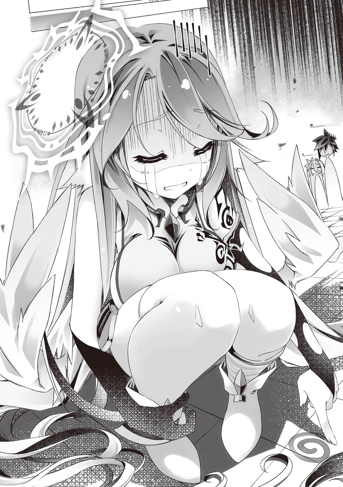
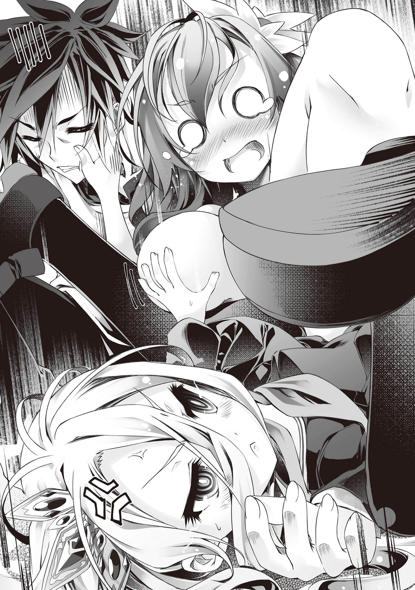
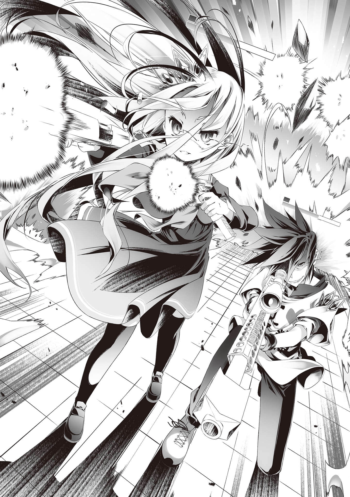
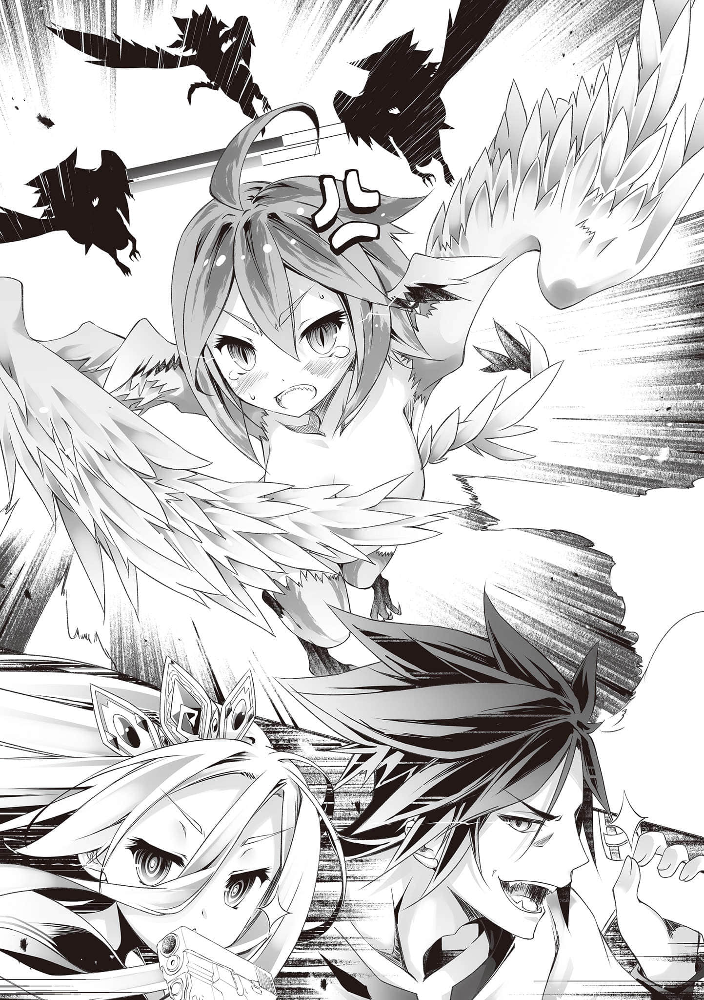

# 第三章 勇者们的攻击

> 来源：https://www.linovelib.com/novel/9/185622.html

──在『魔王』之『塔』第一层的『准备室』……

到昨天为止，这大厅还是除了地面上的魔法阵之外，什么都没有的冷清房间，而现在──

「哼哼哼……勇者大人们，各位要求的物品都送来了。」

「是！辛苦了！麻烦请把东西都堆在那边！！」

「……这样真的好吗……这真的不是违反规定的行为吗……？」

西装笔挺的骷髅跟谢勒•赫一起送来了堆满一整台推车的大量物品。

缇儿则是扛着大槌，以犀利的眼光威风地环视周遭。

不只如此……

「啊，对了，我们要追加需求。这房间实在是太单调了，弄些摆饰来吧！！」

「哼哼……是，遵命。马上为各位准备……」

大厅的中央有一座大帐棚，里面有看起来很舒服的床。

以及烤炉、餐桌、各式厨具，还有简单的浴室与厕所。

『准备室』已经变成了舒适无比的生活空间，但一行人似乎还嫌不够，要求更进一步地提升生活品质。此时──

──砰！一声响起。

「喂！？你们这些家伙，不管『塔』的攻略（跟本王的游戏），在这里搞什么────」

空一行人从昨晚起，就在这『塔』里悠然自适地度过了一整晚，以谢勒•赫为媒介显形的『魔王』的碎片──毛球终于忍无可忍地提出了不满……

「…………不好意思，咦？说真的你们这是在干嘛？」

「看不、出来吗……！？这是在……锻炼、肌肉……啊！？」

毛球一来，就看到白正在优雅地看书──眼光向下，则看到空被压在白的屁股下，一脸要死不活地做伏地挺身。如此景象，让毛球不禁露出无比困惑的表情。

「……虽说这种话由本王来说不太对，不过你们人类种即使锻炼肌肉也无法战胜魔王（我）的喔？」

被缇儿的严厉号令打断了说明，空连忙站起来。

──借着吉普莉尔施展的空间转移（里雷米多），一行人从第二十六层回到了第一层的『准备室』。

「……做得、很好喔……要好好……补充水分、喔……」

「具体来说就是！！健全的肉体所分泌的肾上腺素、多巴胺、睾固酮等各种会使大脑活化、清醒的物质，其产物就是智能！！总而言之，我正在借由锻炼肌肉同时锻炼大脑──也就是在锻炼『智能』！！要不然谁要做这么痛苦的事啊！？Do you understand～～～～！？」

望着更加难以理解的光景，毛球终于忍不住大声哀叫。

「就规则上来说，这里是安全地带──也就是所谓的『存档点』。在这里就能放心地休息。」

「……哼、哼哼……原来如此？我也跟那破铜烂铁一样，为主人出力一次之后就再也派不上用场了……啊啊，主人……请严惩总是在这样重要的时刻，却帮不上忙的无能奴仆吧……具体来说，请用小人的身体当作宣泄欲望的工具……」

「实际上应该是可行的呢。」

不顾毛球的错愕，空乘胜追击，继续说道！

那是昨天晚上的事……

──不过，幸好空间转移（里雷米多）还是勉强成功了。

「吁……吁……魔、魔王……你是有什么、不满吗？」

……………………

「其实还是能回复的吧～因为我找到让『希望』回复的方法了。」

「────────啊，呃、这个……」

──当然，空不打算真的在这里度过一辈子。

「空阁下，你很努力地完成了今天的训练课程！！汗水在闪闪发亮喔！？」

「……能用『里雷米多（译注：《勇者斗恶龙》中用来脱离迷宫的咒文。）』……超级、有用啊……？」

「……只是、这是不会……回复HP跟MP（状态列）的……存档点……」

「谢勒•赫！？这根本是钻规则的漏洞吧！？天底下哪有跟魔王同居的勇者啊！？」

空的脸上笑得更加狂傲，继续说道！

接着，他的眼光转向别处──

「……在这样的状态下，别说要去最顶（一百）层了，就连第二十六层都过不了吧……」

────！？

……话虽如此，幸好能平安地回来……空这么想，在内心捏了一把冷汗。

…………

……不用特地重申也知道，这里是魔王之『塔』的内部。

──为了讨伐魔王，勇者正在接受特训。

下了一次危险的赌注，最后平安抽身，让空暗自松了一口气。不过──

「～～～～话说回来！！为什么天翼种、机凯种跟兽人种（小狗）一～～直聚在那边默默地大吃大喝！？兽人种也就算了，另外两个家伙──不是根本就不需要进食吗！？」

毛球身为魔王，有点不知道该不该否定这样的行为，说得有些过意不去。

「没错！我们的确是无法出去『塔』外！只要我们想，即使要在这里度过一生，你们也不该有任何怨言，不是吗！？你有什么意见吗！？啊～～！？」

没错……空昨天解开了『希望』的真相……

「智力究竟是什么──？是健全的智能活动的产物。那么健全的智能活动又是什么──？是健全的精神活动的产物。既然这样，健全的精神又是什么！？那就是健全的肉体的产物！！」

也就是说，这栋建筑物与空间本身就是『魔王』的内部。

毛球──『魔王』终于缠着谢勒•赫哭叫了起来。

──还不明白吗？呵，这也难怪。为了启蒙你这无知的魔王大人，就讲解给你听吧。

「很好，空阁下，三十次五组都完成了！真的很努力了，接下来是放松时间！！」

「～～～～谢勒•赫！！这、这些家伙打算在这里舒适自在地度过一生喔！？在本王的塔──在魔王（我）的体内！！他们好像根本不打算来打倒我！？」

但是，空却这么回答，脸上浮现桀骜不驯的笑容。

缇儿把大槌当成竹刀般敲打地面号令道。闻言，空趴倒在地板上。

「喂！谢勒•赫！？这家伙到底在胡说八道些什么！？」

「…………等着吧、得斯……等我吃完……就要玩你、得斯……」

众人似乎都跟史蒂芙有相同的疑问，眼光同时转向空。

没有人给他一个正经的回答，毛球的眼角终于泛起泪水──

「……谢勒•赫，这家伙到底在胡说什么东西？」

「【报告】以口腔摄取食物并将其分解、吸收的功能，以及感知味觉的机能还是有的。【报告】真好吃。」

对于空的说明，毛球一个字都听不懂，搔着头大叫。

「……呼……呼呼，魔王啊……你跟外表一样天真呢……」

平安回到入口之后，空与白眯着眼睛，对绝望的吉普莉尔回道。

趁着魔王还在错愕，空高声地说出结论！

「而这个游戏完全没有任何一条规则提及时间限制──也就是说，即使我们在『准备室（这里）』长期停留，或者像这样搭帐棚休息，也不算违反规则吧？」

「这的确是在锻炼肌肉，但我主要锻炼的不是『肌力』──而是『智力』！！」

史蒂芙则是不断地忙着做菜、将料理端上桌。桌上堆满量多得荒唐的料理。

「────呃？咦、咦？」

---

■■■

脸上却浮现桀骜不驯的笑容，高声回答魔王的疑问──！

同样地把白揹在身上，他接着开始深蹲，而且继续讲了下去！

众人同时惊讶地瞪圆眼睛。空桀骜不驯地笑得更深──

「……………………」

他双手颤抖，气喘如牛，状态非常不堪。

他擦了擦汗，同时淡定地说了一声「让我确认一件事」……

「勇者团队（我们）在游戏结束之前都无法出去『塔』外。但是，没有任何规则规定不属于勇者团队、且所有权利归我们所有的妖魔种谢勒•赫不能进入『塔』内！当然也没有规则规定不能让她带食物与其他生活用品进来给我们，不是吗啊啊！？」

「哼哼……可爱的魔王大人，但是勇者大人说的一点都没错，这在规则上完全没有任何问题，我们不得不接受！而且我谢勒•赫也想住在魔王大人里面（这里）。」

确认过做为大前提的规则之后，空接着说道：

空却仍然得意洋洋，「啧啧啧」地摇了摇食指，一样无畏地回道：

白费力地如此呢喃，可以窥见她严重的精神（MP）损耗。但是──

缇儿与白如此慰劳空。空忙着调整急促的呼吸，从两人的手中接过毛巾与饮用水。

看他的反应，空心满意足地转身背对他，前往简便的淋浴间，冲去满身的汗水。

「首先……『准备室（这里）』是绝对不会有妖魔种（敌人）来袭的安全地带对吧？」

根据空的估算，即使耗掉吉普莉尔的所有MP，也不见得能让空间转移（里雷米多）顺利发动。

「各位，注意看～～我的MP！！──有没有什么发现？」

「空阁下！放松时间结束！接下来是深蹲，三十次五组！！」

这只不过是『让希望回复』的手段而已。

史蒂芙接着这么说道。虽然她的希望（HP与MP）还剩很多，不过表情却透露出明显的『绝望』。

三人以同样荒唐的速度吃掉料理，同时回答毛球。

「……吉普莉尔就连绝望的样子也跟平常一样呢。莫非她其实好得很？」

更正确地说──是『希望的来源』…………

「……这就是你准备的第二方案吗？不过，这样只是回到了原点对吧……？」

──这些家伙在本王的体内到底在搞什么？？

「嚼嚼？吞……我们天翼种的确是不需进食，不过……嚼嚼。」

结果不出所料，或许是因为消耗了所有MP也不够──她的HP莫名其妙地少了将近一半。

听空这么说，众人停顿了几秒之后──

「…………！哥的……MP……没有、减少……？」

「【比对】……主人的MP。数值跟进入怪兽窝之前的纪录几乎相同……？」

有所发现的白与依蜜尔爱因各自报告道。其他人听了，都惊讶地瞪大了双眼。

刚才因为踩到陷阱，众人被困在怪兽窝中，被敌人包围，进行了战斗！

况且空还施放了让所有敌人倒下的神秘攻击──即使如此，空的MP却几乎没有减少！

也就是说──『希望』的回复终于追上了消费──！

面对六人探究原理的疑问眼光，空说出他准备好的回答……

「没错……这是『以希望为唯一武器战斗的游戏』──我们的HP与MP（状态列）跟『武器』，都是由那所谓的『希望』可视化成形而来的。那么──我再问第三次。」

那是这个游戏的基础，却也是一直以来都无法真正理解的嗳昧要素，那就是──

「──追根究柢来说，『希望』究竟是什么？」

「……【再答】……那是组成『灵魂』的要素之一……『心』之一部分……概念。」

没错──『希望』在这个世界已有明确的定义，并被彻底解明──

对于第三次的提问，空得到第三次相同的答案──那个答案，在这个世界是常识。

但是，空这次却扬起嘴角，清楚地说了：

「不，不对。假如这就是这个世界（你们）的常识，那就是这个世界（你们）的所有人都错了。」

空喜孜孜地将这世界的常识，连同整个世界一起否定了。

与愕然的众人相反，他脚步轻快地走了起来，像个学者一般娓娓道来。

「『希望究竟是什么』……这个问题，在我们的世界仍然没有答案。当然，我们的世界对于『灵魂』之谜别说解开，甚至无法观测──但是，即使如此，对于希望的原理与机制，仍然有一定程度的理解。」

空这时候以脚跟「叩」地踏出清脆声响，停下脚步。

难道这事实不是反而证明『心』不过是肉体的反应吗……？

啊啊──希望到底是什么？

「我就说得再容易理解一些吧！？不只是『希望』，甚至是称为『精神』、『心灵』、『感情』的这些林林总总！！全都是脑内物质的化学反应与生理作用所带来的『错觉』罢了！！」

「……这真是太荒唐了。早在四千多年前就有森精种说什么『肌肉可以解决一切』之类的疯话，明明是森精种却一辈子都在锻炼肌肉──精神错乱的植物的胡扯，怎么能相信？」

「……这样看来，的确没有反驳的余地──不，既然主人这样说，那全世界当然都是错的。还请原谅我这愚昧奴仆的戏言。」

……以前竟然有过这种森精种（家伙）……

更进一步来说，即使是在他们原本的世界，在这方面一样有显著的个人差距，而且这些物质的化学反应与相互作用更是无比地复杂难解，到现在依然无法彻底解明……这理论还不到能完全说明人类精神的地步。

在这样的游戏中，却有不知为何能使用魔法这个疑点。

确实是半斤八两──史蒂芙妥协兄妹俩的说法，这么吼道。

「「────！」」

另外五个人──订正。伊纲闹脾气先去睡了，所以是四个人──总之！！

…………────？

但是，其他人却显得愈来愈不理解，目光逐渐冷漠。

「但是攻击性（MP）却多到不必要的地步，真的是令人困扰呢～……」

亦即──所谓的『阳精』！

「『希望』──不过是脑内物质的化学反应────！！」

缇儿先是如此附和吉普莉尔。不过──

「话、话说回来，空阁下，你是怎么察觉这些事实的？」

「……所以……打倒、敌人……就会因为『成就感』……促进快感物质、分泌……造成少量的、回复……！哥……真了不起……！」

无论原理如何──即使机凯种跟我们都一样，『心』只是一种生理程序，那跟『心』──感情（希望）是可贵的东西这点，应该不存在矛盾才对……？

空如此断言道。众人难以置信。

──空刚才会被偷袭，恐怕就是因为太专注于沉思了。

「但是！假如事实真的跟这个假说、跟空阁下的理论一样的话，那就说得通了！！」

──她说的没错，这的确是空与白原本世界的理论。

「被两个全身都是攻击性，精神却脆弱得跟杂鱼一样的国王整天耍得团团转，要是没有足够的抗压性的话，我的心早就生病了。如果说这样也是异常的话，那我跟你们的确是彼此彼此呢！？」

在众人瞠目结舌的时候，只有一个人──

现场只有白一个人理解空的话语，甚至清楚地看到哥哥背后出现雷电特效的幻觉。

刚才看起来在发愣，结果又突然大笑──他应该就是那个时候想通的。

双方的热量差距形成气压，尴尬得仿佛要在大厅内刮起强风。

「呃、是啊……『肉体只是「灵魂」的容器』这一点目前仍是世界的定论。而『阳精』与『阴精』加起来在体内精灵中所占的比例也不满一％，一般都认为其影响是可以忽略的，因此，这个假说一直被视为奇妙的笑话。」

但是，他却不从『灵魂』的角度，而是将其作为物质来观测，还试着解明了一部分。

同样位于暴风中心的白，接着哥哥的话继续说道！

唯独依蜜尔爱因仍在喃喃自语，显得更加绝望……

「亦即『希望』来自于极为物理性的、可观测的──『物质』！！」

「也就是说，空跟白的HP之所以极端地低，是因为他们的精神强度弱得跟豆腐一样吗……？」

────…………

──果然，缇儿说明的假说与他料想的相去不远，空的脸上浮现苦笑。

「主、主人，恕我多嘴，不过……我想那应该是两位主人原本的世界的理论……」

「……史蒂芙、从没、沮丧过……吧……？」

「……精神强度、要是够的话……才不会当、家里蹲、尼特族喔……？」

白完全理解了哥哥的话，表现出敬佩不已的反应。相反地──

──机械之种族得到了『心』。

劈啪────────！！

希望是情感──是概念。

「吉普莉尔阁下是魔法生命，依蜜尔爱因阁下则是机械生物，为了维持生命，两位需要随时消耗精灵！！可是在这座『塔』内能运用的只有『希望』既然这样，妳们两位明明什么都没做『希望（HP与MP）』却逐渐减少，这又是为什么！？」

「妳说得一副好像我们很不正常的样子，但史蒂芙妳自己的精神强度（HP）高得跟怪物一样，也没立场说吧？」

老样子，史蒂芙干脆地承认自己不明白。

「……这样、啊……！……原来是……这么一回事……！？」

这样一想，的确能解释这个游戏目前为止无法解释的机制──白也得出了如此结论。

缇儿突然这么喊道。

吉普莉尔怯生生地提出反驳，闻言，空先是对她点了点头。

对于这个疑问，空即将展现真理（答案）──那就是──！！

「……相反、地……要是这些物质分泌不足、吸收不良、分泌过剩……或者是其他不快乐的荷尔蒙（化学物质）占优势的话……就会感觉不快乐、不安……最后……无精打采……陷入『绝望』……！」

对于空的理论有了更进一步的理解，白的反应也跟着激动起来。

即使是超科学的种族（依蜜尔爱因），也不敢相信这来自异世界的智慧。

不过，她像是要确认唯一理解的事实似地，眯着眼睛问道：

看来森精种是比想像中还要富有多样性的种族呢……也难怪他们可以持续掌握世界的霸权长达数千年──空在心里这么佩服。

空含笑望着她，应该是要把说明权让给她，催促她继续说下去。

白似乎是想到了什么。空故做夸大地点头。

空像是看出了白的思考，深深地朝她点头，继续说明。

「呃……这是以前某个森精种提倡过的假说。简单来说，感情跟精神，其实是由摄取进体内的精灵变质后带来的──司掌快感的精灵群『阳精』，以及司掌不快感受的精灵群『阴精』，两者对灵魂的作用，便会产生感情与精神……只要把空阁下所说的『脑内物质』代换为『体内精灵』──那就几乎是一模一样的假说了！！」

吉普莉尔似乎终于接受了这个说法，跪下来请求原谅。

其他人都还是一脸茫然。不过，空仍继续阐述他的理论！！

「没错！！例如血清素、多巴胺、脑内啡、肾上腺素、催产素──在这类无数的快感荷尔蒙（化学物质）对于人体的作用下，人会感到兴奋或冷静──也就是感受到快乐与幸福！意志也变得积极、活泼──这就是所谓的『希望』！！」

……那还用说吗？

「…………啊……」

的确……无法直接套用。但是，空已经在这个世界生活一年了。

不过，吉普莉尔似乎还是无法接受，有些不屑地嘀咕了起来。

比方说──！！

「……既、既然这样，《魂魄假说》果然是正确的吗！？」

没错──游戏的规则是以『希望』为唯一武器战斗。

──……

更何况在有精灵与『灵魂』存在的这个世界，或许无法直接套用这样的理论。

看吉普莉尔与依蜜尔爱因哑口无言，空笑了起来，心里早已有了答案。

根据经验，他能打从心底肯定。那么──

「……【挣扎】【苦恼】……遗志体所解明的『心』……竟只是精灵反应？只是生理作用？……【困惑】【失望】……事实竟然如此地单纯……咦咦……那算什么……」

那时，那个瞬间，到底是什么让空理解到这个地步的？

──但是。

也就是说所谓的『希望』──是『精灵的一种』──

「呼……以史蒂芙来说，算是理解得挺精确的……对，就是这样啦！？」

「例如说！！红色的计量表（HP）就是『被动的强度』──亦即抗压性！其反映的是维持精神的脑内物质的量或比例！至于蓝色的计量表（MP），则是『主动的强度』──也就是攻击性！！反映的是触发消除压力源行为的脑内物质的量与比例！！」

这也是因为『希望』是精灵之一。如此就能说明这不可思议的现象了──！！

「不只如此！在『塔』内魔法能发挥的功率不到平常的百分之一，应该也是因为注入术式的精灵之中，能生效的就只有『希望』──精灵中占比不到百分之一的『阳精』，所以在计算上是说得通的！！」

「…………呃～老实说，我几乎──不，其实是一个字都完全没有听懂。」

「呼哈哈哈！！是吧、是吧！？只不过，这种事我真该更早察觉的！」

但是，位于暴风中心的空却不以为意，继续说道！

然而对于依蜜尔爱因的绝望，空感到不解。

对于缇儿的疑问，以及五双眼睛的好奇目光，空脸上浮现自信的笑容。

他满怀感谢地说出向自己降下神谕的伟大来源。亦即──！！

「不瞒妳们说！！我刚才被史蒂芙的胸部以及缇儿的腹部夹住的时候──那一瞬间，我发现我的MP以超高速回复了──！！」

从这个事实推论出答案，那当然简单了。

因为──！！

「简单来说，『希望（MP）』可以借由性兴奋──也就是脑内（快乐）物质得到回复啊！？」

既然这样，只要回去『准备室』养精蓄锐，重复采取能让大脑分泌快乐物质的行动，自然就能让『希望（HP与MP）』无限次数地完全回复，然后无数次地挑战『塔』──！！

「……真──真是差劲死了──！？」

「────────嗯？咦，哪里差劲了！？」

回想起当时幸福无比的感动，空沉醉其中。

史蒂芙却用手遮掩自己的胸部，满脸通红地痛骂起来。

「当然是因为这种事而回复希望的你的希望（精神）啊！？你的脑袋里就只有猥亵（色色）的东西吗！？」

「我之前也说过──没错！！事到如今我就说清楚、讲明白了，男人在沮丧、失落的时候，只要有女人过来安慰说『没事吧？要不要揉胸部？』，光是这样就能解决大部分的问题了！！」

「只有你是这样啦！！──咦，应该是吧？这不是真的吧！？」

史蒂芙东张西望，要求其他人帮腔。不过，现在没必要把她放在心上。

「──事情就是这样。总之，看来我的直觉是对的。」

「…………喔。呃、咦？你在说什么？」

注视着缇儿那瞠圆的蓝白色的感应钢眼珠，空露出微笑。

参加这场游戏，为何空选择的不是最强的地精种──维格，而是缇儿，以及一般来说不会列入战力的史蒂芙呢？

当时被问起这个问题的时候，空一直说不出明确的根据──

因此，为了让大家『睡得好』，她先吩咐谢勒•赫准备上好的床与帐棚。

白由于连锻炼肌肉的体力都没有，只好先从伸展操开始。

「──────」

「【报告】机凯种不需透过摄取食物补充能量。【要求】说明意图。」

【我谢勒•赫马上赶过去，请问各位需要些什么东西呢！？】

──那些是基本中的基本。

翌日早上，缇儿把大槌像一把竹刀似地扛在肩上，这么说道。

「────────」

「『阳精』会在生命体内生成──换句话说，食物也含有微量的『阳精』！！所以两位应该要透过食物大量摄取『阳精』才行！！由于目前无法知道必要的份量究竟是多少，所以妳们必须至少吃到回复量大于自然消耗的地步才行！！一整天都要吃，一直吃！！」

这名一周不只绝望五天，甚至七天都在绝望的地精种（少女）──

但是，如今薄弱的根据得到了证实──空忍不住在心里自夸了起来。

缇儿的指导，就如同她自己所宣告的──非常严厉。

谢勒•赫与骷髅绅士以推车往返好几趟，运来了大量的厨具，以及远比厨具还多的──堆积如山的食材。望着大量的食材，伊纲代表众人这么问道：

「……伊、伊纲虽然饿了……但是吃不了这么多，得斯？」

于是，缇儿教官严厉的希望回复指导课程开始了──

一开始的时候，一行人打算将这游戏速战速决，只带来了最基本所需的少量物资。

「…………你、你有什么根据……这么说？」

无论跌倒几次，她都会爬起来，一个人、孤独地继续挥动槌子──就是这样的眼神。

「…………什么？是要给、天翼种（我）吃的？」

提儿如此高声大喊，有如要傚仿空似地──

「……说真的，虽然每次都会被无视，不过缇儿妳这姐姐设定到底是哪──」

缇儿忙碌地指导大家充分运动伸展、享受美食。

「各位要有心理准备，我的指导可是很严厉的喔？就算是我的弟妹，也一样不会留情的！！」

「刚才妳提起的……《魂魄假说》？明明是很～久以前的森精种理论，而且还被世间当成笑话，妳却很清楚嘛～？」

「空阁下跟白阁下──最大的问题就是运动不足！！」

──老样子，缇儿再度忽略空的疑问。

空的语气，表达出全心的信赖──以及由衷的尊敬。

「啊～是这样的吗？既然这样，先前谢勒•赫在游戏刚开始的时候──也就是在【向盟约宣誓】之后进了『准备室（这里）』，不就已经违规了吗？既然发现了弊端（犯规），游戏必须强制结束──」

「总之，这个游戏的关键人物是史蒂芙，以及──缇儿，果然就是妳。」

「沮丧时振作的秘诀──其实非常单纯，但是实践起来非常困难！！那就是──『充分睡眠充分运动充分饮食充分欢笑』──就这么简单！！」

面对她严厉的彻底指导，大家虽然各有不满，但还是选择忍耐。

只是觉得在这个『绝望即败北』的游戏，与绝望最为无缘的两人应该会是关键──他只是遵从身为游戏玩家的直觉而已。

再来──是『充分的饮食』。

缇儿瞪圆她那双蓝白色的眼眸，然后低下头，心想──

谢勒•赫的所有权利归空等人所有，原本是无权拒绝的。但是她并非勇者团队的一员，进入『塔（迷宫）』是违反规则的行为──当她要如此反驳的时候──

「啊，别误会，这些几乎都是要给吉普莉尔阁下与依蜜尔爱因阁下吃的！」

「啊，当然，如果吃得太难过，那就是本末倒置！！享受美味的饮食，本身会带来快感──这样才能回复『阳精』也就是『希望』！！所以为了避免厌倦，必须把食材做成种类丰富的料理──史蒂芙阁下，拜托了！！」

那一双感应钢之眼──神情虽然怯懦，反映出的却是远比火红还要炽热的苍蓝色意志（火焰）。

至于最后一点──『充分欢笑』……

「……真、真的要吃掉这么多食材吗……？」

「根据？那还用说。就是那双眼睛啊。」

虽然比不上维格，不过看来我的直觉也不是盖的呢……

既然这样，就算在这里努力回复『希望』，消费量也会高于回复量──形成收支赤字。

与绝望最是无缘的两个人之中，除了史蒂芙之外的另一个人──

接着要求她设置简易的淋浴设备、浴缸，甚至厕所设备。

──在长达五十年以上的期间，历经近乎无限的绝望，却从未向绝望屈服。

「呼────呼呼呼！！说得一点都没错！！」

---

■■■

「嗯，有事。麻烦妳把接下来缇儿交代的东西全部送过来。拜托啰♪」

「今天该做的就是充分的进食和优质的睡眠！！然后还要喝酒！！啊，不过我们只带来了刚好够吃的食物对吧！？也没有寝具──咦？这下子该怎么办！？」

「包括吉普莉尔与依蜜尔爱因──缇儿能让我们所有人的『希望』所谓的『阳精』以最大的效率回复。我敢肯定，没有比缇儿更合适的人选了。」

因为──这种感觉，无论体验几次都还是令人难以忍受啊──！！

「『对抗绝望的专家』──世上还有谁比缇儿更有资格得到这个称号？」

「────啊？」

即使她们能在体内自行合成『阳精』，也会马上被彻底消耗掉。

骷髅与谢勒•赫慌忙地透过广播回应，甚至忘了加上邪恶的笑声。

于是，缇儿给空安排了比极限还要再稍微艰辛一些的重训菜单。

空扬起嘴角奸笑。缇儿显得很尴尬，连忙想要辩解。

缇儿抬起头，单薄的胸膛挺到不能再挺起的地步。

【哼哼……？……不，可是我谢勒•赫并不是勇者团队的成员，因此──】

「那当然！对了，这些食材是一天份的量！！」

为了达成目标，不惜接纳、利用一切，甚至是森精种的魔法理论，以及《魂魄假说》。

真是荒唐，别闹了……真希望能够放过我。

「两位光是维持生命机能，就必须随时消耗『希望』──『阳精』啊！」

「────啊。呃、不！那个、那是因为～──不是那样的！？」

「……别担心，这一点还算好解决！喂～谢勒•赫！？」

【就在方才已经将谢勒•赫大人注册为『临时外部营运人员』了！】

然而，缇儿历经半个世纪的岁月，体悟到『彻底做好基本才是精髓之第一步』的道理。

【哼哼……？呃～我在。请问有什么事吗……？】

「是！！由于史蒂芙阁下可能必须整天都为了下厨奔忙，运动量已经很够了，这样是一石两鸟！！好了，别浪费时间！即使是现在这一个瞬间，吉普莉尔阁下跟依蜜尔爱因阁下的『希望』也在减少呢，快点动起来！俐落一点！」

「……啊，原来就是因为这样，才没有安排运动菜单给我啊──」

缇儿一想起这件事，先前的自信马上消失无踪。看她这欲哭无泪的表情，空叹了一口气。

在短短几个小时之内，『准备室』即摇身一变，成为舒适的卧房。一行人先在里面充分地休息了一晚。

空如此叫唤。跟先前一样，隔了数秒之后，馆内广播启动，那邪恶而典雅的声音响起。

缇儿过于严厉的指导让一行人无言以对。不过，缇儿仍毫不留情地继续说道：

到了小窗外的天空被夕阳染红的时刻，缇儿指示众人看书或玩游戏──充分地休息。

即使理解自己没有资质，被周遭讥为废物，仍然孤独地爬上堆积如山的废物堆，只为了超越被誉为空前绝后的天才──自己的叔父维格。

接着──是『充分的运动』。

因此──

「说什么『希望』的衰减跟回复之类的，那些事我都不懂，不过──如果只是『在沮丧时振作起来』的话，我可是资历多达五十年的专业老手！！不会输给任何人──我就是专家！」

在机凯种（依蜜尔爱因）的分析能力辅助下，缇儿给兄妹俩展开了天衣无缝的运动指导。

「肉体没有承受适度的运动负荷（压力），无法充分地生成『阳精』！更重要的是，完全没有柔软度可言的僵硬肉体（肌肉），血液无法流畅地循环，不说『阳精』，甚至空气与营养都无法在身体内顺利吸收！！总之你们给我运动就是了！！」

面对两人的反驳，缇儿难得地以犀利的眼光直视两人，回答道：

她的笑容狰狞，高傲而桀惊不驯地宣告。

……现在是我长年累积的绝望（失败）发挥功用的时候是吗……？

──虽说『充分的饮食』很重要，但是『暴饮暴食』恐怕只会适得其反。对于伊纲的疑虑……

因此与昨晚相比，众人的脸上多了不少笑容，满意地进入梦乡。

────…………

翌日早上，──众人从帐棚内爬出来之后，意外地发现自己睡得很饱，醒来后精神很好。

……甚至已经无法想起前天跟昨天到底是为了什么那么沮丧。

看来缇儿指导回复『希望』的效果超出了预期，大家的心态转为积极。

空打算继续攻略『塔（迷宫）』，然而严厉的教官（缇儿）却制止了他。

「无论再怎么有效率地休息，短短一天的时间，顶多只能排解肉体的疲劳！！精神的休息也很重要，而那是在身体不再疲劳、紧张的状态下，才能开始收到的效果！！」

听缇儿这么说，空等人转眼确认自己的左手腕，以及彼此头上的计量表。

──事实就如她所说，身体虽然觉得很舒畅，HP与MP却还没有完全回复……

「唔唔……疲劳这种事，当事人意外地无法主动察觉呢。」

「……这种功能……可以搬去游戏外……继续使用吗？」

得到空的赞同，缇儿满意地点头，继续说道：

「更何况，空阁下因为前一天有做肌肉训练，应该会肌肉酸痛才对。再一天，今天只进行轻松的运动与伸展操，然后──『什么都不做』！！」

由于这次的指示不够具体，众人以眼光要求更进一步的说明。但是，缇儿却摇了摇头。

「要是用『命令』的方式，各位就无法发自内心地享受休息。因此，今天就让大家自由决定休息的方式。各位做什么事会觉得心里舒畅──能得到充足感与满足感呢？」

缇儿收起严格教官的面貌，语气变得温柔。

看来她很懂得运用糖果与鞭子。

「那还用说？要是史蒂芙、依蜜尔爱因或吉普莉尔的胸部能让我揉，肯定马上噗咳！？」

根据前天的快感经验，空想都没想就直接说出心里话，但还没说完就被白的肘击打断。

「……哥、应该会想、抚摸小伊的毛……同时玩游戏……还有躺在、吉普莉尔跟依蜜尔爱因的、大腿上……掏耳──之类的，对吧？……哥？」

空以调皮的表情说完──脸色随即转为爽朗，接着说道：

如空所说，马上就明白了『第二个理由』，而且比预料中的还要快。

「「「「「「喔喔～！！」」」」」」

「嗯。有一件事想要确认是不是我看错……我们眼前的这个是『宝箱』吗？」

空这么说明，同时让众人看看自己与史蒂芙左手腕的UI。

接着，空继续竖起第二与第三根手指。

这一句话，似乎也是伙伴们最赞同的。然后，众人带着笑容快步出发──

「既然这样，终于……我长年以来的疑问能够得到解答了吗？」

---

■■■

……唔唔……原来如此……？

确认如此事实，缇儿背对着早晨的阳光，对一行人竖起大拇指。

──抱歉喔，白就是没有胸部……！？

──那是空所意识到的，空的本质。

第一天空完全没有心思去理会他们──不过当时就想到了这个可能性。

这正是空指示伙伴们彻底探索场地每一个角落的主要理由。

史蒂芙的是『由我来对付！』，空的则是『声光昏迷弹』。

「……可是，哥……有必要为了无谓的战斗……不惜拖延进度吗……？」

──对空来说，或许是有生以来第一次？

「──嗯，非常好。各位都通过了我的严厉指导，彻底振作起来了！！」

【哼哼……？是，勇者大人。请问有事吗？】

「要探索每一个角落吗？可是，说不定会有敌人特别密集的通道喔？」

「这一点倒是不用在意。MP空了的话，再回到出发地点（这里）回复就好了。所以──吉普莉尔？妳做好准备，以便随时使用里雷米多──我是说空间转移。」

──喔～？原来如此～……

「……如果要打倒所有敌人，MP一下子就会耗尽了不是吗，得斯？」

然后，一行人享受美味的饮食与彼此触摸的感觉，同时一直玩着游戏，就这样度过了一整天。

让我们把心态回归到基本中的基本吧。

『袋子』里的吉普莉尔回应道，不难想像她一定在恭敬地鞠躬行礼。不过──

空高举拳头，另外六人也活力十足地回应，一行人都斗志高昂。

如规则所说，自己的『希望』将化为『武器』的形态──而《技能》系统也是一样──

──于是，白也要求躺在空的大腿上，让他为自己掏耳朵。

那究竟是什么？众人都以眼光向空提问──但他却刻意视而不见。

「……遗留的『希望』？」

「没错那当然了我心爱的妹妹啊只要有您在我的心灵就是最幸福最满足的好极了耶～♪」

──其实，空在第一天也有想到这个问题。

吉普莉尔与依蜜尔爱因再度进入『袋子』里。

这是以『希望』为唯一武器战斗的游戏。

「…………我说，谢勒•赫啊？」

「这宝箱到底是谁放在这里的啊！？而且还是在魔王居住的城堡里！？把装备摆在这种地方，简直是在说『请尽管拿这些去宰了魔王吧唔嘿嘿』嘛！？这种东西应该要统一收纳在武器库里才对吧，干嘛装在宝箱里面分散在各地啊！？这就是最大的疑问（吐槽点）啊！？」

在各式各样名符其实的非人美女与美少女的体温包围下迎来早晨，如果不承认这是天国的话，肯定会下地狱的──这个早晨就是令人如此满足，神清气爽。

【是。那是没完成攻略就倒下的人们，托付给日后为了打倒魔王而来的人们之希望的结晶──也就是所谓的遗物，且遗留者都有事前指定受赠者。因此，要是身为魔王大人之奴仆的我谢勒•赫或是其他妖魔种（工作人员）擅自处理的话，那即是掠夺行为──将会触犯『十条盟约』。哼哼……】

当时遭遇的妖魔种（小兵）之中，有些即使有看到空一行人出现，也明显地没有袭来的意思。

从小窗照进来的阳光，如果是平时的话只会觉得烦人，现在却显得可爱。

妹妹的眼神仿佛在这么说。她的眼神凶狠得仿佛足以直接咒死小动物，空只好快速回应。

「……这样啊。莫非里面装着的是对我们有利的武器、防具或道具之类的……？」

……又过了一晚──开始攻略『塔（迷宫）』之后的第四天早上。

「话说回来，之所以打倒敌人MP就会稍微回复……那当然是因为开心了。」

在得到了教官（缇儿）的许可之后，终于──

伊纲与缇儿疑惑地歪着头。空看了看她们与史蒂芙和白，接着说明：

「没错。史蒂芙所使用的《集中仇恨值》以及我所用过的《全体昏迷攻击》就是解锁后而得的《技能》。」

『是，遵命，主人。』

「……呼……身体好轻巧，不知道已经有多久没有这种感觉了……？」

──空制止两人，这么说道。

「那么，虽然隔了两天，不过──各位，我们继续攻略这座『塔（迷宫）』吧！！」

吉普莉尔与依蜜尔爱因似是非常羡慕，战战兢兢地提出同样的要求。

【哼哼……请放心，勇者大人，那就是宝箱没错，不是其他的东西。】

在两人HP与MP两条计量表的下方……原本空白的部分，都多了一条字样。

于是，第二次展开的『塔（迷宫）』之攻略──仅过了二十分钟。

──只有史蒂芙直到最后都不跟大家靠在一起……自己在角落睡着。

「由伊纲与缇儿扛着我跟白和史蒂芙前进，并避免不必要的战斗──这个方针不变。不过……从今天起，我打算探索每一层楼的每一个角落之后再往上前进。」

---

■■■

──这正是空在察觉『希望』之真相的同时发现的，本游戏的另一个机制。

那是一群骷髅士兵，看起来像是在守着某一条通道，但是那并不是通往阶梯的通道。

站在空身边的一行人，脸上都不再有先前的绝望神情，希望（HP与MP）也都回复到全满的程度了。

「啊，先等一下。我决定改变战略。第一天的应付方式，各位暂时先忘了吧。」

一行人打倒挡路的敌人之后，来到了一处死胡同──如果不是眼睛的错觉，这里摆着的东西应该就是『宝箱』。不过……

太阳下山之后，一行人就在这样的状态下直接睡着，依偎着彼此入梦。

看白仍然不解，空竖起手指说「理由有三个」，解说了起来。

「史蒂芙强烈地想要『保护大家』──换句话说，当时因为史蒂芙强烈地意识了自己的『希望形态』而解锁了这样的《技能》，我是这么判断的。所以，后来我也强烈地去意识自己的希望形态──自己的本质，于是不出所料，我的《技能》也被解锁了。」

「第二个理由，大家应该很快就会明白了。至于第三个──就再保密一下子吧♪」

「……解锁《技能》……」

【哼哼……不，那是败在魔王大人手下的人们所遗留下来的『希望』。】

空吼出了长年以来对这种游戏套路的由衷吐槽。不过──

「嗯，状况不同了。依我看，这些战斗应该不会是无谓的。」

没想到自己竟然会忘记这点……

「第一，在妖魔种（小兵）较弱的阶层，希望大家尽量以解锁《技能》为目标战斗。」

空深深地点头之后，深吸一口气──大吼道：

没想到真的能得到这种完全可以接受的答案，空满意地点头。

然后──

「──因为，这可是游戏啊……？」

【非常抱歉，『武器』只有各位勇者目前手上的那些，由各位自己的希望成形而来的。不过，宝箱内的确可能会有武器之外的装备品或道具。哼哼……】

「咦……？这是为什么呢？」

「……嗯，我就知道。这是迷宫攻略游戏一定会有的东西吧……果然有啊。」

「小事都摆到一旁！！让我们尽情享受吧──！」

没错──敌人之所以堵住通道……应该是因为前方有某个东西。

伙伴们会有这样的疑虑也是理所当然的。不过，空却笑着回答：

做好出发的准备之后，伊纲扛起空与白，缇儿扛起史蒂芙，双脚鼓足力气，正打算拔腿奔跑，忽视所有敌人前往上层的时候──

──原本是这样的……

──的确，在游戏中，宝箱大多藏在死胡同或难以察觉的位置。

原来那是以前的勇者（某人），为了逃避敌人的追击或藏身，在即将耗尽HP或MP的时候──为了将自己仅存的『希望（HP与MP）』托付给接下来的某人的结晶──这似乎就是『宝箱』的真面目。

没有任何人能擅自处置或移动宝箱。因此，只好多让一些妖魔种（小兵）守在这里避免被取走……

……嗯，虽说这种理由在别的RPG不见得说得通，不过在这个游戏中是可接受的！

「…………嗯，没有陷阱的气味，得斯。」

为了保险起见，还是先让伊纲确认看看。

然后，空战战兢兢地打开了宝箱──

「……这是什么……？是『衣服』……？会是防具之类的吗？」

从宝箱里取出的──是一团微弱的光，形状摇摆不定。

即使看不出来是什么东西，但不可思议地，一行人都没来由地认定那是某种『用来穿在身上的东西』──

『……【假设】既然是他人留下的『希望』残渣，或许要装备在身上才会显现形体……？』

『袋子』里传出依蜜尔爱因的推测，空思索了几秒之后──

「唔……那就应该给史蒂芙装备。」

「咦？我吗？我的HP那么多，不是应该要给你或白装备才对吗？」

「不，我们就算穿上了这个，也不知道防御力会提升多少。」

既然装备之后，会被敌人一击毙命的可能性依然存在，空与白就不能以身试法。

「所以才要先给能够替大家承受伤害的史蒂芙装备，在承受攻击时验证装备本身的性能，再依结果判断是否该让我或白装备……这样比较安全。」

「──原来如此，这样说的确有道理。」

史蒂芙点头，从空的手中接过那一团疑似防具的微光。

光芒笼罩史蒂芙的全身之后──结果就如同依蜜尔爱因所预料。

「这妳不用担心……不用讨论，接下来应该马上就能验证了。」

听着白与缇儿的冷静分析，以及空满怀感动的结论，史蒂芙拚命地用盾牌遮掩身体，一边大声嚷嚷。

「史蒂芙啊……在战场上失去冷静的角色都会先死，镇定下来。」

「我的好妹妹啊，妳冷静下来，听哥哥说……那是仅限于部分游戏的常识──那其实只是玩家技术的象征，与防御力无关。而且哥哥即使穿得再少，打滚闪避的距离都不会増加，也没有无敌时间。」

「妳、妳们两个────空啊啊啊！？」

不过，也有可能只是装备的效果让她的心情不错，任由骷髅士兵们攻击自己一个人，同时不断前进。

「放心吧，史蒂芙！！女性角色装备的暴露程度与防御力是成正比的──这是常识！！」

到最后，史蒂芙的要求仍然被忽视。

「不就是因为从后面都看得到，你们这两个后卫（空与白）才会喀嚓喀嚓地拍个不停吗！？你们到底看到了什么──不算了我不想听给我停止拍照啊啊！！」

白言下之意是──要是穿在空的身上，会有什么结果？

「我不知道你们兄妹在讨论什么，就不能先讨论我目前的状态吗！？」

──那是……

「空，你真是差劲死了！？咦咦！？那我原本的衣服到底上哪去了！？」

空的疑问打断了史蒂芙的话，让她瞪圆眼睛愣住了。

史蒂芙花了足足五秒钟的时间才理解事实，惊声尖叫。

────碰──…………

众人纷纷表示惊叹，至于空──

『【报告】在装备变更的同时，原本身上的装备似乎会被自动转移到「袋子（这里）」。』

「放心吧，史蒂芙！！我绝对会阻止敌人攻击妳的！！」

其中四具装备着长枪，另外四具装备弓箭。这些妖魔种（小兵）堵住了来路，步步逼近。

「──呃？咦、咦？我刚才不是被攻击了吗？」

「……咦……难道说……铠甲的效果……能减免伤害到、五十％以上……？」

「……好了，那就继续按照计划，探索迷宫的每一个角落吧。」

史蒂芙身上那一件（象征性地）遮蔽身体的比基尼铠甲，竟然粉碎消失了。

原来如此。的错──事到如今，那无疑就是『传说的铠甲』。

听到空拿出手机来拍照的快门音效，史蒂芙不断闪避，同时这么嚷嚷道。

「史、史蒂公•莫非妳现在是无敌状态，得斯！？」

空这么说道，同时望向某处。往他所望的方向一看──从刚才一行人过来的走廊上，出现了八具骷髅士兵……

────…………

「那、那难道是！地精种女战士所穿过的传说之铠甲！？」

听到依蜜尔爱因与吉普莉尔的通知，史蒂芙泪汪汪地恳求道。但是──

加上担任前卫的伊纲与缇儿的奋战，终于驱逐了敌人，一行人脱离了走廊──

形状不定的微光逐渐形成明确的形状，包覆史蒂芙的身体。

「这样一来──！就不用让大家攻击──消耗MP了！？只要这样将敌人全部推出走廊之外，我们就能逃走了吧！？」

被伊纲与缇儿扛着，空确认已经摆脱了敌人的追击之后，确认接下来的方针。

不等空等人发动攻击，史蒂芙便发动了上次解锁的《技能》──发挥集中敌人仇恨的效果，让所有敌人的注意力聚集在自己一个人身上。她举着盾牌朝敌人冲过去，高声叫道：

「──？……？？？──……………！呀啊啊啊啊啊啊啊啊！？」

──……

「只要妳举着盾牌，从前面就什么都看不到，根本没必要感到羞耻，不是吗？」

即使有盾牌抵挡，但几乎没传来箭与枪接触的感觉──

「吉普莉尔、依蜜尔爱因！！史蒂芙的衣服真的在那里吗！？真的是真的吗！？」

「那是名符其实的异世界常识喔！？」

「────这这这、这是怎么回事啊──！？」

「了解！」白与伊纲、缇儿同时应答道。

「我听说这是穿上它，就能抵挡任何攻击的铠甲！！」

「我才不是担心那种事啊啊～～！？反正即使穿上原本的服装，防御力应该也没差多少！？快叫她们把我的衣服还来──具体来说是把我的尊严还来啊啊啊！！」

准确地击中对手的同时──

史蒂芙也豁出去地嚷嚷一番，将『大盾』举起，跳到了敌人面前。

『【设限】本机眼前的不明物体X，暂时设定为无法认知的物体……跑哪去了？上哪去了呢～』

「史蒂芙阁下的盾牌加上铠甲的效果之后──几乎没受任何伤害！？」

「这能抵挡什么！？最基本的尊严！？不，我看连尊严都保护不了！？不，它连铠甲都不是吧，我原本衣服的防御功能看起来都比它高啊！？」

「～～～～啊啊啊啊好啦！？既然要验证，就要彻底吧啊啊！？」

这件『铠甲』虽然该遮的重要部位都有遮住，但也因为只遮住了这些部位，让史蒂芙非常困扰，不知道手该遮哪里。

史蒂芙惊叫之后，缇儿欢喜地大叫了起来，双眼兴奋得闪闪发亮。

被完全不打算归还衣服的两人捉弄的同时，史蒂芙依然认真地担任坦克，拚命地举着盾牌抵挡攻击。

但是──突然地，异状发生了。

史蒂芙──再说服自己别在意外观，同时触摸自己的左手手腕！

无疑就是传说中的──《比基尼铠甲》──！！

──……

「──『由我来对付！』──！！」

「────什么？」

听到白这么说，『袋子』里的两人似乎也很有兴趣，满怀期待。但是，空却摇了摇头。

「先让史蒂芙用盾牌抵挡敌人的攻击！确认铠甲的性能之后再反击！！」

「效果并不是减轻伤害！而是『遗留的希望（HP）』代替装备者承担了一部分的伤害呢！！当然，遗留下来的希望（HP）本身也是有限的──」

该保护的部位完全没有保护到，只保护没必要保护的部位，这样的铠甲──啊啊……

「空你惊讶什么啊！？刚才不是你自己说过有防御力的吗！？」

很难得地，史蒂芙居然临时发挥了机智，做出精确的判断。

这时候，空与白、伊纲与缇儿已经出手，开始处理正在攻击史蒂芙的骷髅士兵们。

「无论外观如何！！只要有这件铠甲，我就更能保护大家了──！！」

空与白的枪口与镜头，分别准确地对准了敌人与史蒂芙的臀部。

「啊啊！太好了！！现在马上拿出来──」

「……真是难以置信，原来比基尼铠甲真的有防御效果？……这到底是什么道理？」

「……原来、如此……因为是……『以前的勇者遗留的希望』的、铠甲……所以……！」

不管怎么样──！！

──隔了几个眨眼的空档之后……

「既然先人遗留的『希望』之中有这种可以代为承担伤害的铠甲，说不定也会有提升我们的『希望（MP）』、攻击力，或是为我们分担MP消耗的装备。」

「……不过，哥……无论是男角还是女角……穿得愈少就愈强……也是常识……」

「希望耗尽之后装备就会大破，回归赤裸裸的状态！！可恶，这机制未免太美好了吧！？」

空气定神闲地说道，接着耐心地说服史蒂芙。

随即，骷髅士兵们立即以枪和弓箭攻击史蒂芙──但是……

『是。小多的衣服在刚才穿上铠甲的时候，就被传送到这里──』

回答她疑问的声音从『袋子』里传来──

「……史蒂芙、放心，……小伊、跟缇儿……也在！」

史蒂芙忍不住错愕地呢喃。

伊纲与缇儿早已进入备战状态，史蒂芙也连忙跟着举起『大盾』。不过──

『──原来如此，小的理解了……奇怪了❤小多的衣服到底跑哪去了呢♪』

为了打倒高阶层的强敌──以及『魔王』，装备必然是不可或缺的。

因此众人都点头赞同空的方针。空也对她们点头，接着说道：

「另外，找到的防具都让史蒂芙装备吧。不然让她一直裸着身子就太可怜了。」

「……如果你真的这么想，就把我原本的衣服还给我啊？而且我还是要说，空跟白才真的需要装备防具吧！？」

被缇儿扛在背上的史蒂芙，遮掩自己的身体前面，并将『盾』揹在背上遮掩后面，满脸怨恨地嚷嚷道。

──目前已经确认防具的效果，能够让至少数十次的攻击伤害减半。

虽然要自己验证防具的防御效果是没问题，不过防具还是应该要让空或白装备比较好──史蒂芙是这么想的。

但是，空却深深地摇了摇头，严正地否定了史蒂芙的意见……

「抱歉，史蒂芙，那是不可能的……只要我们无法得知防具剩余的耐久值有多少，就不知道防具什么时候会毁坏。而且铠甲一旦坏掉，还会全身赤裸──这种铠甲，当然不能让白跟伊纲穿了。不过如果妥协一点，只要缇儿愿意穿的话，说不定还有一点机会……？」

「那为什么就不征求我的同意！？而你自己呢！？你自己呢！？」

「……唉……史蒂芙，有谁想看男人的铠甲破碎、全裸的模样？哪里有这种需求？」

空眯着眼睛，冷冷地否定了史蒂芙的主张。但是──

「……？……需求……明明、就有……？」

『【当然】百分之百有需求。【警告】从安全的角度而言，强烈建议主人装备防具。』

『请容我多嘴，主人怎么会觉得没有需求呢？唔嘿嘿～❤』

妹妹与『袋子』里的两人提出的危险意见，让空不由得表情抽搐──

「～～～～呃、这个嘛……对了！！怎么可以让白跟伊纲看男人（我）的全裸呢！？」

「…………好啦……防具都给我跟缇儿穿，这样总行了吧……」

空连忙转动脑袋，改口说出了其他的理由。

史蒂芙是放弃挣扎，叹了一口气，另外三人则咂嘴了一声…………

---

■■■

「……史蒂芙、差不多……该承认……妳有、那种兴趣……了？」

另外，对于第一天以为没有意义的战斗，现在也因为需要探索宝箱跟解锁《技能》，而抱有期待。

「……既然这样，为什么只有我一个人被迫穿上铠甲……？」

「……感觉比第一天还要轻易耶……？」

又过了三个多小时……

「是没错……不过这次的条件跟第一天完全不同，对吧……？」

但是空的态度看起来依然一派轻松，随性地挥了挥手。

空勉强装出笑容，回答困惑的伙伴们：

空一行人来到了第十层头目房间的门前。上次他们只花了十几分钟就来到了这里。

即使历经了不少战斗，却还是轻而易举地通过了第二十六层，超越了第一天的极限。

──发现只有自己一个人不知道，史蒂芙有点不满地问道。

──空与白所剩的MP则是不到『四成』……

即使如此，回复的量总归是无法追上消耗──

「……？那只大牛（牛头人）怎么不在，得斯？」

没错──第一天遭遇牛头人身妖魔种（牛头人）的大厅内，现在空荡荡的。

更何况是伊纲与缇儿，要是现在跟头目交战，MP肯定会在战斗中减至一半以下。

空独自念念有词，重新思索着战略。史蒂芙眯起眼睛，冷冷地瞪着他问：

对于缇儿怯生生的建议，空笑着回答：

「咦──等等──！？」

但是──……

「……已经打倒过的头目不会再出现，的确是能减少耗损。不过，如果我们就这样探索、战斗下去的话，别说打倒第三十层的头目，说不定无法抵达上次的极限──第二十六层呢。」

「空、空阁下！？」

不过，相对于这些耗损，得到的收获还是划算的。

尤其是后者，可说是跟吉普莉尔或依蜜尔爱因的行动限制有关的重要关键。

后来总算找到的防具也很暴露──只比比基尼铠甲稍微好一点，仍然是史蒂芙被迫穿上。

没错──在从宝箱中找到下一件铠甲之前，她被迫一丝不挂地在迷宫内到处走动了一个小时以上。

空如此断定之后，伊纲与缇儿脚往地面一蹬，奔了出去──

空闭上双眼，整理目前的状况──

而且还设立了现实且明确的目标──打倒第三十层的头目。也就是说有清楚的终点。

而且大厅的另一头，通往上层的阶梯大门还敞开着，让一行人看得一头雾水。

──第二次开始攻略『塔（迷宫）』之后，已经过了将近两个小时。

缇儿扛起史蒂芙，伊纲扛起空与白之后──

「是！因此，在守关头目所在的阶层──头目的房间之前没有妖魔种（小兵）存在，我们可以在那里让空阁下与白阁下的MP充分回复之后，继续挑战第三十层的头目！」

「……？可是，即使这样，回复的速度还是追不上消耗，第一天不是这么说过吗？」

「不，绝对可行。伊纲、缇儿，接着一样麻烦妳们了。走吧♪」

伊纲与缇儿头上的MP计量表剩下约『五成再多一些』。

──别说对付头目，现在的空与白就连要跟小兵战斗都很危险。

「……因为这一招很花时间……必须确保在完全安全的状态下才能使用……」

──就算是这样，缇儿跟伊纲的MP还是会在战斗中降至一半以下。

「强化攻击力的、分担MP消耗的戒指，其实也跟『铠甲』一样，不知道什么时候会耗尽『希望』而毁损……所以，我们应该要尽可能保留到较高的阶层再使用──最理想的状态，是挑战『魔王（最终头目）』时再使用。」

「……毕竟我们探索了迷宫的每一个角落，当然会多花不少时间了。」

──这样一来，MP就只剩下七成……活动的表现也会开始受到影响。

还有疑似能将MP消耗分担五十％的戒指。

「明明我们到处绕路，得斯！是因为没有头目的关系吗，得斯？」

「我！！是！！说！！把我的衣服还来啊啊啊！！你们害我在下一个宝箱中出现铠甲之前都必须光着屁股喔喔喔！？」

她的手像是在追求什么似地，每当抓住什么都没有的空气──眼眶便会流下一滴泪水。

不过，如同他在出发时说过的──这个答案似乎还得『保密』一阵子的样子。

────────

---

■■■

话虽如此──

虽然即使如此，只要按照原定计划回去休息就行了，不过说不定还是会发生万一。

『咦～真是奇怪了～到底在哪呢～刚才还明明有看到的～♪」

第一天抵达第十层头目房间的时候，HP与MP几乎都是全满的状态。而这次，目前所有人的MP已经消耗了约两成。

跟在什么都不明朗的状态下摸索的第一天相比，『希望』的回复量会增加也是理所当然的结果。

对于空所设立的目标，史蒂芙代表其他伙伴们提出了心里的疑问。

「好，这样一来『第三个理由』也确认了。那我们就继续维持目前的战略，从第十一层起也要探索迷宫的每一个角落，寻找宝箱！」

包括能将攻击的威力提升约二十％的手环。

「……不，还可以……我们还有大幅度回复希望（MP）──缇儿想出来的『秘招』。」

对于空的指示，众人虽然心里感到疑惑，但仍纷纷点头赞同。

也就是说──这次一行人能打从心底享受游戏……

「嗯？怎么，史蒂芙，妳还是比较想要裸体吗？」

「话说回来，要保留装备我是没有意见，不过对付头目的时候，还是使用比较好吧……？对付第十层（这里）的头目，如果情况跟上次一样的话，应该要耗损约一成的MP才能打倒吧？」

他们为了掌握技能的性能与机制而试用了几次──因此这也是理所当然的结果。

在来到这里的途中，一行人发现了复数『宝箱』，得到了珍贵的装备。其效果也与预期的相去不远。

「机制。机制啊……真要说的话～的确是机制吧～♪」

「目前就先将目标设定为──打倒第三十层的头目，然后再折返。先这样吧～？」

「──竟然真的到达第三十层了……」

白的目光空洞无神，默默地望着自己空荡荡的胸口。

「……我怎么没听说过有这种东西？既然这样，为什么到目前为止都没用过……」

空沉重地摇头，否决返回的提议，其他人则点头赞同。

「……莫非是……头目被打倒一次之后……就不会再重新出现、的机制……？」

──为了收集宝箱，并解锁伙伴们的《技能》，一行人彻底探索了目前为止的每一层。

从空的反应看起来，很明显地是从一开始就确信房间里没有头目。见状，就连白也一脸疑惑。

因此，史蒂芙认为不管怎么看，现在都应该要撤退才对。但──

「不过，目前的状态应该无法打倒第三十层（这前面）的头目。今天应该到此为止，马上折返比较好吧？」

如果能让转移魔法的消耗减半，吉普莉尔就能做其他的事了──

然后一行人通过了第二十九层──目前正聚集在通往第三十层的楼梯前。前方应该有头目在等着。不只是史蒂芙，缇儿与伊纲也对现状感到不可思议。

另一方面，空虽然勉强撑着，但很明显地已经无法维持专注力了。

「不，假如我的料想正确的话──我们甚至不用操这个心。」

解决了第一天最大的不安要素──原本以为不存在的『希望（MP）的回复方法』。

「那是因为我们每战必胜……打倒敌人的成就感与胜利的快感会让希望（MP）回复。」

──在来这里的途中，白解锁了二个《技能》，空则是四个。

空随性地开门，走进守关头目所在的房间。一行人连忙上前制止。

看空等人到现在还是没有要把衣服还给她的意思，史蒂芙只好放弃挣扎，无奈地仰着头。

史蒂芙这么说道，表情显得不安──其他人的脸上也多了疲惫的神色。

听空与缇儿说完，史蒂芙的不安还是无法消除，但──

「不用担心！只要MP够我们使用《技能》就没问题──」

「嗯！无论是什么样的头目，空跟白一定都有办法完封、秒杀，得斯！」

缇儿与伊纲的口气都满怀确信。

在『袋子』里待机的另外两人也默默地同意，表现出完全的信赖。

伙伴们已经踏出脚步，走向通往第三十层的楼梯。看着他们的背影──

「──我明白了！既然这样，我也会相信的！！」

史蒂芙坚定地点头，做好觉悟，跟着踏上了阶梯──

---

■■■

──然后，史蒂芙很快就后悔自己选择了相信。

「我就说吧！？难得我是正确的，不过我一点都不高兴！！」

「谁会想到一踏上第三十层的瞬间头目战就马上开始了！？第十层跟第二十层都是那样，我还以为第三十层也会按照固定模式在头目的房间之前设一扇门挡着！这是什么烂游戏！？」

「……呜呜……哥、哥……快说、你讨厌胸部……说没有那种……赘肉……你也一样爱白……快说……？」

「唔喔喔喔喔妹妹啊！？前半要是照着说那就是说谎了，所以我不能说，但是后半妳要我说几次都行！！但是现在完全不是做这种事的时候拜托妳用自己的脚站起来啊～～～～！！」

没错……一行人根本无暇实行空与缇儿所说的『秘招』。

一踏上第三十层的地板，头目──岩石巨人便马上抛东西过来攻击一行人。

一行人只好马上躲到唯一的安全位置──尖叫着举起盾牌的史蒂芙背后。

白因为希望（MP）减少了不少而满心绝望，哭哭啼啼了起来，空只好扛着她，拚命地叫喊……

──头目妖魔种（岩石巨人）每一次挥甩巨臂，都有无数碎石跟着射出。

每一颗碎石都跟巨大的散弹一样呈扇状射来，甚至射穿并粉碎地面与墙壁──岩石巨人交互挥甩双臂，连续施展如此暴力的大物量范围攻击。

即使空与白的状态万全，以人类的肉体能力根本无法避开这么大量的枪林弹雨……

『到底是什么意思啊～～～～！？』

缇儿微微地点了点头，最后再朝着『袋子』里的史蒂芙大声叫道：

空认为还是应该要先撤退，恢复到万全的状态再来挑战。不过──

史蒂芙一直隔着盾牌承受攻击──最后身上的『铠甲』终于粉碎，露出了臀部。

就像部分有穿铠甲的骷髅士兵──这岩石巨人看起来很坚硬的『外壳』，应该也同样是防具。

──然后……

空从『袋子』里对刚出场的两人继续下令──！！

而且还是一夫多妻，是真正存在的后宫冒险团队──！！

白与空毫不保留地说出事实，让史蒂芙忍不住尖叫起来。

但是……应该没理由执着于这个目标才对吧……？

在盾牌保护下的史蒂芙都会遭受如此伤害了──空与白只是被划过都会一击毙命！

为什么她们说要在战斗中使用那一招？还面对着如此强大的怪物？……为什么……？

「什么──！？呃、啊咿咿咿～～！？」

「……也就是说……当敌人在外面、乒乒乓乓地、攻击时……他们在袋子里也是……乒乒乓乓……」

『妳们两个千万别攻击喔！？我想妳们光是活动就会不必要地耗损「希望」！！妳们只需想着解锁《技能》，彻底辅助伊纲跟缇儿！！』

两人的表情仿佛在这么说。空与白先是瞪大眼睛，然后惭愧地苦笑起来。

「吉普莉尔！依蜜尔爱因！跟我和白和史蒂芙三个人『调换』！！」

「两位主人无须担心。请在里面享受舒适愉悦的时光♪」

真是太不堪了。不过就是少了六成的希望而已，竟然……

白的动作也很迟缓──不，根本无法战斗──空不甘地咬牙切齿。

那还用说吗？空夸张地公布真相──！

──但是，那回复MP的『秘招』很花时间，必须在确保完全安全的状态下才能实行……

「空阁下──！应该要现在马上实施那个『秘招』！！」

不只如此──

毕竟本来是以在头目战开打之前回复MP为前提。

就像史蒂芙喊出来的一样──这样实在是无可奈何……

「──！？空、空阁下！！这、这家伙好硬啊～！！」

这些家伙是怎么在这种机制的游戏下破关的？

「────────」

正当她在哀叹连埋怨的空档都没有的时候──她那多得惊人的HP，也在她被岩石散弹击中了一次之后──随即显著地减少！！

「他们肯定是轮流到『袋子（这里）』里进进出出做些有的没的，借此回复『希望（HP与MP）』的啊！！」

「是空阁下与白阁下的话，只要有MP可用，这点杂碎根本不算什么──！」

「呀啊啊我的『铠甲』碎了啊啊至少给身为少女的我一点空档害羞啊啊！？」

「根本无法对他造成伤害，得斯！？这是怎么回事，得斯！？」

在确定没机会回复MP的同时就应该当机立断，选择撤退才对！！

空大声号令之后，伴随着史蒂芙满心困惑的大叫，三人被吸进『袋子』里。

没错……这也是空在第一天解开的谜之一。

──这样──实在是…………

──就在空要大声命令吉普莉尔施展空间转移（撤退）的前一秒。

「……史蒂芙，吵死了……都已经不必要地、巨大了……别动、啊。」

「没错！实在太勇敢了，浑身是胆啊！！简直就是真正的『勇者』呢！？」

糟糕的还不只如此──！！

没有吵架已经很了不起了呢。空为两人的关系改善而感叹。总之──

「空！这下子实在是束手无策了！？现在只能撤退了啊啊啊！！」

──就跟勇者团队可以在途中得到并装备『防具』一样，妖魔种（敌方）当中也有装备能够分担损伤的『防具』的个体──！！

空决定回应史蒂芙的要求，回答她『其他的问题』。

『袋子』里非常狭窄，三个人塞进去后几乎动弹不得。

如果完全没胜算的话，那还另当别论，现在可是还有胜算啊？

即使缇儿与伊纲能勉强越过枪林弹雨过去攻击，也根本没有意义。

「这里就由伊纲来争取时间，得斯！快点回复你们的MP，得斯！！」

──现在才刚要到精采的部分不是吗──！？

「原来是这样啊！？那可以继续回答我其他的问题吗！？还有这里真是有够狭窄的！？这空间肯定不是为了让三人以上待机而设计的──等等──我不是全裸吗！？竟然全身赤裸着跟空贴在一块──衣服……我的衣服──果然在这里不是吗！？我得快点穿上──不，根本无法穿衣服，这里太窄了！？」

---

■■■

不，即使是伊纲跟缇儿，恐怕也无法承受几次直接攻击──！？

「什么勇者，根本就是『蛮族』吧！？话说别忘了白才十二岁，这种话题还太早啦！？」

两人如此鞠躬领命。

但是，问题在于其减少损伤的性能太具威胁性──看来减少了将近七成。

面目狰狞地向他呐喊的，是看起来投入地享受着游戏的两名游戏玩家。

──差点就错过了享受乐趣（危机）的大好机会啊──！！

「【应允】本机会在主人不在时，彻底分析敌人的攻击，并担任指挥与辅助的角色。包在本机身上。」

「────咦？」

……如此震惊的事实，让史蒂芙哑口无言。但是──！！

「等等──所以所谓的『秘招』到底是什么！？话说连担任『肉盾（坦克）』的我都不上场的话，大家真的不会有危险吗！？话说回来，规则上来说可以『让三个人待机』吗！？」

「一定可以轻松完封、秒杀对吧，得斯！？」

由于她们原本就拥有强大得荒唐的体能，能够以最小的动作有如漫步般优雅地避开头目妖魔种（岩石巨人）发射的弹雨。

──撤退？喂喂……别说笑了……

被陷入混乱、一丝不挂的史蒂芙（胸部）挤压着，白显得有些火大。空则想着：

──对了，我们这还是第一次进来『袋子』里呢。

──岩石巨人的攻击不只数量多，威力也大得吓人──！！

「史蒂芙阁下！空阁下与白阁下就拜托妳了喔！？」

据缇儿所说，当年的地精种冒险团队中──全员都是夫妻……

在岩石轰碎大厅的巨响中，两人以更大的音量呐喊道。空茫然地喘气──

「规则是说『战斗人数最多为五人』──是最多。因此三人待机、四人战斗也不违反规定。」

但即使史蒂芙疑惑地大喊，还是没人回答她的疑问…………

「史蒂芙，妳认为当年挑战这游戏的地精种团队是怎么破关的？」

将『打倒第三十层的头目』设立为今日目标的的确是自己。

自己现在已经连这种程度的判断力都没有，在这样的状态下，根本────

……吉普莉尔与依蜜尔爱因，竟然一直在这么狭窄的地方跟彼此紧贴着啊。

但是，空却不放在心上，毫不留情地继续说道──！！

「我想应该是在确保安全、稍事休息的状态下做的──应该就是在头目的房间之前，或者是刚打倒头目的时间点吧！？而我们是因为失算错过了回复的时机，才只好在战斗中（现在）进行！！理解了吗！？」

「……虽然不想理解，不过我知道了────等等，咦？难、难道说──」

──以前的地精种冒险团队，似乎是……该怎么说呢……？

就是，似乎是做那档子事来回复『希望（HP与MP）』的样子……

而空刚才说──我们不得不在战斗中──不得不现在、进行……？

……嗅？进行什么？

难道……要做那种事吗──？

「呃、咦？那个……！那缇儿刚才说交给我，难道是说──？」

在狭窄的『袋子』里──史蒂芙面红耳赤，想逃却无处可逃。

这里狭窄得甚至无法让她穿上衣服，只能赤裸着全身跟另外两人贴在一起，就连心跳都无法掩饰──

空的脸近在眼前，甚至能感受到他呼出的气息。

「呃、这、这是……在、在说笑吧？因为──」

「……妳认为现在是可以说笑的时候吗？──当然是认真的了，而且也没时间了。」

史蒂芙当然知道不可能是在说笑，但还是忍不住要这么问。空的神情严肃，脸逼近至眼前。

史蒂芙的心跳有如警铃般愈来愈快，思绪乱成一团──

──这、这种事……不、不，果然还是不行啊！？

这种事──还是应该要循序渐进……

对啊……至、至少让我做好心理准备啊！？

再、再说──空不是已经有白了吗！！

怀着钢铁般的坚定意志，沸腾的脑袋急速降温至冰点之下，史蒂芙因为温差太过剧烈而感觉有些头疼，勉强开口回答：

「……要够、具体……！不能太、做作……演出、妈妈味……」

她以自然无比的动作穿上衣服，神情一转变得温柔无比──口气蕴含深不可测的慈爱。

「都说了，快称赞我跟白！！摸摸我们的头！！可以的话让我们埋在胸部里！！总之在不会被判定为限制级的范围里用尽各种手段回复我跟白的『希望（精神）』啊难道妳听不懂吗！？」

这是为了保护大家。为了打倒『魔王』。更进一步地──没错，是为了全世界……

──从『袋子』里，可以看到外面的同伴们还在奋战。

空以无比真挚、坚决毅然的态度，对她提出了要求……那就是──

──空等人进入『袋子』后……过了『三十分钟』……

史蒂芙将她所有的『爱情』，连同原本被她个人的倔强、自尊等压抑住的──自身的欲望，一起灌注了给他们俩人……

────────嗯嗯？

──请把少女的悸动还给我……

…………不对……话说回来这种事，白会答应吗……？

「我们这可是在以全力撒娇啊！？胡闹的是妳吧！！要认真地称赞我们啊！？」

甚至连伊纲和缇儿的声音听起来都没什么余裕。

怎么想都想不到他们有什么好称赞的，只好勉强自己说出一些奖励的话。

她按照两人的要求，以不怎么灵巧的动作抚摸靠在自己身上的两颗头──

──强制别人让自己撒娇，这样的撒娇真的有意义吗？

兄妹俩强人所难的要求，让史蒂芙刚才的觉悟一下子便灰飞烟灭，嚷嚷着要放弃──但是……

我必须保护大家──我能保护大家。保护正在外面战斗的伙伴们，以及──

史蒂芙的眼角不自觉地泛起泪水，大声拒绝道。

「……史蒂芙……动作快……以最大的效率……给哥跟白……撒娇……」

难怪只有自己一个人被蒙在鼓里，不知道这个『秘招』。

「空阁下、白阁下！！我可能也快不行了……还没好吗！？」

──史蒂芙被要求『宠爱』兄妹俩，但实在不知道具体上该怎么做。

更何况……竟然要在白的面前……那个……

……

「～～～～用这种近似胁迫的方式逼我让你们撒娇，你们两个根本就是蛮横的虐待狂嘛！？这样撒娇还有意义吗！？这样子希望（精神）真的会回复吗！？」

「我才不要呢❤话说──照刚才的情况为什么会是这种鬼结论啊！？」

──啊啊。这无疑是史蒂芙觉醒成为神职角色（补师）的瞬间──不。

──不……不，妳要冷静下来啊，史蒂芬妮•多拉！！

『史蒂公！伊纲其实不是很懂，但妳认真点，得斯！！』

「……主人，打扰您休息、而且也没达成解锁《技能》的目标，小的真的很惭愧，不过……考虑到透过空间转移（回去）所需的MP，我可能差不多到极限了……」

…………

「……史蒂芙……别让我们……说好几次──快点……」

「伊、伊纲──还、还能坚持下去、得斯……！！」

「那当然！！催产素（快感荷尔蒙）的分泌条件是纯粹的肢体接触！！跟我们的认知如何无关！！如果能够在避免限制级的前提下性感一点地宠爱我们，还能分泌更多的快感物质喔！？」

「呃～……乖乖～空跟白都──呃……我实在想不到什么具体的事迹，不过还是要称赞你们很了不起～……虽然不知道你们哪里了不起，不过你们都是乖孩子喔～……？」

「快啊！在妳慢吞吞的时候，伙伴们还在燃烧生命战斗啊！！快点拍拍我们！！」

接着，她按照兄妹俩的要求──不，她所做的远超过了两人的要求。

──啊，原来～是这么回事啊？

『如果真的说什么都办不到的话，就快点做出决定吧──到时候就真的只能撤退了～～～～！！』

「所以妳必须快点彻底地疼爱我们，摸摸头拍拍我们！！」

当然……我也知道白的年纪还不能做这种事……？

『其实我也认为应该要做那档子事比较好！！但空阁下绝对不答应限制级的行为！！而且光是这样就能充分地回复希望（MP），在第一天的时候空阁下已经证实过了！！空阁下跟我都认为最适合担任这角色的，就是史蒂芙阁下妳！！』

同时，在无意之间……注意起表情真挚地凑过来的空的嘴唇。

「……唉……真拿你们这些孩子没办法……过来吧……」

「……妈咪……要怎么样……胸部才能变得像妳、那么大？」

理解了缇儿的言外之意，史蒂芙抱头苦恼起来。

────这可是拯救世界的战斗啊。

要是事前就听说这个方法，她当然会反对了────！？

史蒂芙微微颤抖，但还是决心接受似地闭上了眼睛。

──还是说，其实妳想做那档子事？

还有──我就是死也绝对不会承认『失望』之类的！！

就算是这样，因为『别无选择』这样的理由就做这种事，那就太对不起白了啊！？

──史蒂芙终于找到了支持行动的崇高大义名分。

史蒂芙搔了搔头──片刻后像是终于做好了觉悟。

「……主动……选择权……在于我们……别会错意了。」

满心混乱的史蒂芙已经在心里不自觉地接受，而找起了借口。

这俨然是圣母史蒂芙──降世的瞬间…………

「……我再问一次喔？做这种事真的能恢复希望（精神）吗！？」

──不只是空与白，就连在『袋子』外战斗中的伙伴们都在催促史蒂芙。

「…………是不是我听错了？……你可以再说一次吗？」

仍在对抗头目妖魔种（岩石巨人）的缇儿高声喊道：

「谁是你们的妈咪啊啊啊！？你、你们要是再胡闹，我就要停手了喔喔喔！？」

至、至少要在跟空两人单独相处的时候──

「哪里不同了！？」

白如此催促，视线瞄了『外面』一眼……

对于姑且这样努力宠爱着兄妹俩的史蒂芙，他们的反应是──

「我们完全是基于自己的意志，让妳给我们摸摸头！！」

「【报告】已确认本机解锁了《技能》──『情报分析』。主人，请称赞本机？」

『【提议】现在还来得及换角。【保证】本机一定会满足两位主人的要求。』

「史蒂芙，妳似乎是误会了。不是妳让我们撒娇，而是我们允许妳被我们撒娇！！」

「呜呜～……妈～咪～……我累了～……」

「……完全……不同……主导权……不同……！」

「────」

岩石巨人破坏力强大的散弹，使大厅被摧残得面目全非。

────

白与空──尤其是空的反应更是让史蒂芙全身起鸡皮疙瘩，发出了哀号。

空与白反而有些困惑地瞪大了眼睛，史蒂芙则像是要温柔地包容般，把两人抱进怀中。

这时候，空的头躺到史蒂芙的大腿上，白则将脸凑到史蒂芙的胸部之间──

---

■■■

『小多？两位主人把我晾在一旁，指名要妳，妳有什么不服的──？』

「～～～～我受够了！？」

这世界上所有期望着想要活下去的，一切的生命────！！

看兄妹俩如此大叫，史蒂芙终于理解了……

回答她的疑问的──却是来自『袋子』外面的声音。

在狭窄拥挤的『袋子』里，史蒂芙仰起头，静静地闭上眼睛……

持续应付这样的攻势，即使是四个体能远在人类种之上的伙伴，也无法完全闪避所有攻击。

遭受数次攻击，甚至解锁、使用了《技能》数次之后，伙伴们的希望（HP与MP）已减少到不能再少的危险地步──已经无路可退了。

大家各自报告自己的现状，有的则是示弱或逞强。

然后──她们所期盼的来自『袋子』里的声音给出了回覆。

不过，那却是令人无法理解的指示。亦即──

『──我跟白以外的人都进来「袋子」里──「调换」。』

────咦？

被吸进『袋子』里的一行人同时如此发出疑惑的声音。不过──

在调换完毕的同时，空发射的子弹（技能）──『声光昏迷弹』的闪光与声响盖过了将其尽数盖去。

然后──

『好、好挤啊！？三个人都已经够挤了，不、不可能塞得下五个人啦！？』

『史、史蒂芙阁下……快移开妳的大东西……我不能、呼吸了……』

『呼呜呜呜呜！？是谁在踩伊纲的尾巴，得斯！？』

被强迫塞进狭窄『袋子』中的五人怨声载道，吵吵闹闹。

不过，看到强光收敛之后外面的景象，让她们错愕地闭上了嘴巴。

并不是因为倒在地上头目妖魔种（岩石巨人）──而是与其对峙的两人的头上──

『史蒂芙阁下──妳是怎么让他们回复这么多MP的！？』

没错……短短的三十分钟……

虽说对于持续被头目妖魔种（岩石巨人）的大量散弹攻击的伙伴们来说，这时间绝对不算短暂──

但是要让空与白的MP回复『将近三成』，三十分钟实在是过于短暂。

这时候众人才想起重要的事，顿时倒抽一口气，同时将眼光转向『袋子』之外。

──对，我的『武器』很弱……那是当然的──因为我很弱！！

然后，兄妹俩举起各自的『武器』──也就是他们的『希望的形体』首先是白的低声呢喃。

刚才倒地的岩石巨人已经起身。与之对峙的两个人类种的身影，与那巨大身躯对比之下显得渺小而脆弱。

面对体型比自己大上好几倍的巨石怪物，依然那么泰然自若。

空狰狞地笑着这么想，扣动扳机的同时继续吼道：

因此过于强大的依蜜尔爱因，才会因为一次攻击就释尽了所有的希望（MP）。

不过，当然──还没有结束。

接着，连左臂甩出的攻击都得到一样的结果。

武器所发挥的威力，亦即一次攻击所击出的『希望（MP）』量，全凭自己希望的形态（印象）决定──！

我的这把『武器』（这个）其实是──发射多样化『特殊弹』的────

身为普通人类，空与白不可能有方法避开。

从叠加了这两个《技能》的白的两把『机关手枪』射出的──即使没有技能也必定会命中的──八发魔弹，竟能在本该贯穿空与白的碎石之间反覆弹跳，改变了所有碎石的轨道。

「就用这招解决你！！吃我一发──『反应诱爆弹』！！」

……白所施展的两个《技能》……

──在这个游戏中，自己的希望将化形为『武器』。

面对敌人投来的、无法避免的『绝望（死）』，空与白依然气定神闲，伸手触碰自己左手腕──那两条计量表之下的一排文字。

回过头来看──他自己又如何呢……？

「还没完呢，再赏你一发『声光昏迷弹』！！接着是『凝固汽油弹』、『毒气喷射弹』！！」

这是精湛到极致境界的射击技术，即使岩石巨人事先知道，也不可能理解、接受。

有如要甩开她们的眼光似地，史蒂芙甩了甩头──

「……这次……该我们……玩了……♪」

这正是破坏妖魔种之『防具』──减低其防御力的技能──！！

最后，空发动需要耗费大量MP的第五个《技能》──

也不是白那样的天才──我只是个弱小的男人，只是个凡夫俗子────！！

──岩石巨人无从得知。

既然如此，那就回应她们的期待（要求），大展身手吧，！？

缇儿与其他伙伴们疑惑的眼光，同时聚集在紧贴在眼前的史蒂芙身上，不过──

────『特殊弹发射枪』────！！！！

──明明在短短三十分钟前，兄妹俩还那么地焦虑、憔悴，现在却完全没有一点绝望的样子。

『～～～～我、绝、对不说！！而且也绝对不会再做同样的事了！』

以及给子弹附加冲击（击退）效果的──『尖头中空弹』，克服了因为攻击没有冲击力，而无法遏止敌人行动的弱点，也就是白在这个游戏中所面临的最大瓶颈。

原因其实很简单，就跟规则所说的完全一样──因为那是『各自的希望的形体』。

『比起那种事，空、白──你们打算只靠两个人战斗吗！？』

《～～～～～～～～～～～～～～～～～～！！》

只有空一个人理所当然地理解此事，因此当他看到岩石巨人重新举起手臂，准备再度发射碎石散弹时，也打从心底确信自己与妹妹绝对不会被任何一颗石子碰到。

不只是缇儿，就连吉普莉尔与依蜜尔爱因也满心好奇地窥探史蒂芙的脸。

史蒂芙满脸通红地摇头嚷嚷，拒绝回答。

同时，岩石巨人的左手臂被子弹射穿，因为冲击（击退）效果而无法立即接着采取下一步的行动……

不如说这只是开端──！

然而，史蒂芙自己头上的两条计量表──『希望（HP与MP）』也回复了。

如此令人绝望的光景，让『袋子』内的伙伴们忍不住哀叫起来。但是──

「面对这点杂碎，只要有MP可用，我跟白──」

子弹伴随着闪光射出，在飞至岩石巨人面前时突然爆开、分裂成无数的炸弹，将岩石巨人体表的外壳彻底击碎、剥落──

每一挥都会发射出大量的碎石散弹，夹带着强大的破坏力。

刚才三个人究竟在『袋子（这里）』做了什么……？

亦即──全人类种最强的游戏玩家──『 （空白）』的笑容。

「喂喂……妳们已经玩得够过瘾了吧？」

不仅如此……或许是错觉，但是……

我再怎么样也无法跟依蜜尔爱因、伊纲、缇儿那样的强者相提并论！！

分别是让射出的子弹在命中处弹跳的──『跳跃弹』。

虽然岩石巨人以右臂朝着空与白甩出了无数的碎石，不过──

既然这样，空与白跟史蒂芙为什么会恢复这么多？她的反应又代表了什么？

「……一定可以轻松『完封』……『秒杀』……对吧？」

连一颗碎石，都没有打中一步也没有移动的两人。

──他们在里面应该没办法做限制级的事才对。

不出所料──空的『声光昏迷弹』对头目的效果似乎特别短暂。

释出了一个只是贴在岩石巨人巨大的身体上的筒状物。

「喀！」的一声，枪内自动换上了别的子弹。在感受到这触感之后──空扣下扳机！

总觉得史蒂芙的皮肤看起来更有光泽、气色更好了。见状，众人忍不住猜测起来……

的确，根本无法闪避那些巨石散弹。

目睹如此事实，岩石巨人以不明的语言嚷嚷了起来，大概是妖魔语吧。虽然听不懂，不过不难猜到他一定是在叫着『无法理解』。

没错──岩石巨人无从得知。

《～～～～～～～～～～～～～～～～～～！？》

持续状态异──空接连射出给予持续伤害的子弹，剥夺敌人的体力。

岩石巨人再度被闪光与巨响剥夺五感与平衡感而倒下，紧接着被连续两种特殊子弹喷出的烈焰与毒气笼罩。

「……『跳跃弹』……『尖头中空弹』……」

因此，他既不恐惧，也没有任何感慨，只是自顾自地蹲低身子，举起自己的大口径枪，在心里意识着『自己希望的形体（武器）』……也就是自己的本质──

但是──一开始就没有闪避的必要吧──？

我这种家伙的『武器』──

──就这样，岩石巨人无能为力地被打倒在地。

『────！！』

每一个人的『武器』从外型到威力、甚至性能，都有极端的差异。

于是，白的子弹击中头目妖魔种（岩石巨人）的时候，终于能够打出像样的伤害值了。

──这是信赖着兄妹俩的缇儿与伊纲曾说过的话。

吉普莉尔恐怕也是差不多的情况。既然这样──

──自己发动的攻击，应该会造成这样的损伤……

「──装甲破碎弹！！」

岩石巨人大声咆哮，同时挥舞巨大的手臂。

就跟平时一样──两人脸上浮现狰狞而桀骜不驯的笑容。

当然不可能会是大口径大火力的『对物狙击枪』啊！？

他的外壳──『防具』遭彻底破坏，防御力降低后被烈焰与毒气笼罩，只能可怜兮兮地扭动身体挣扎──

「哼哼、呼呼呼──哇～～～～哈哈哈！？天啊，我啊！！我这种角色！！竟然有一瞬间妄想跟敌人正面对决！？多么愚昧的男人啊十九岁处男空！！」

没错──自己的武器，希望的形体，自己的本质──？

──那还用说吗？当然是彻底的『阻挠敌方之人（Debuffer）』了──！！

「先封锁敌人的行动！让他无计可施！！等他动弹不得之后单方面地狠狠修理，最理想的结果当然是让对手自灭，这才是常识啊～～～～对吧啊啊！？」

「……哥真是……太卑劣了……！太帅气了……❤」

空与白愉快无比，高声地如此宣言。

而岩石巨人就如同他们所说的，只能一面倒地被子弹攻击着──

「怎么啦！！刚才不是很嚣张吗！？站起来啊！？不过～就算你想站起来，我的『声光昏迷弹』跟白的『尖头中空弹』一样会马上满满地打在你身上喔喔喔嘎～嘎嘎！！」

「……哼、哈哈……杂碎、杂～碎❤说啊，什么都没办法、做……只能等着被打倒……感觉怎么样……？至于我们……打倒什么、都不能做的杂碎呢？感觉～超爽～的～❤」

砰砰砰砰砰砰砰砰砰砰……在持续不停的枪声之中，即使是伊纲与缇儿都几乎没能打伤的岩石巨人，头上的HP计量表毫不留情被快速削减。目睹如此景象──

『好、好惊人……空跟白真的只凭他们两个人就快打倒头目了喔，得斯！？』

『哼！我可是早就知道了喔！？他们两个一定能轻易战胜头目！！』

『【再认】主人果然厉害。已确认本机的『好感度』再度提升……羞。』

『啊啊……真不愧是我的主人……My Lord……！真是太精采了！』

『……果然空跟白……才是真的「魔王」啊……』

『袋子』里的伙伴们纷纷出声赞叹，其中约有一名倒是有些无奈……

──当『希望（HP与MP）』减低至一定程度以下，就会因为失望与绝望而导致动作转为迟缓。现在岩石巨人已经无法任意活动身体，甚至不需要声光昏迷弹的钳制了。

就在所有人都相信……空与白即将胜利的时候──状况发生了。

就在岩石巨人头上的HP计量表降至二成的瞬间──

接下来他将发动的，肯定是先前的攻击都无法比拟的──『大规模破坏』。伙伴们如此猜想着。

这当然是无比不敬的想法──却闪过了营运团队众人的脑中。

连完全掌握『塔』内所有妖魔种（工作人员）资讯的营运团队，都看不到战胜『 （空白）』的胜算。

空与白完全不在意的样子──又或许是没有察觉。

「……嗯……别小看……『 （空白）』……喔……？❤」

……嗯……说不定还不需要魔王大人亲自出马？

「……别人说、的话……要好～好、听进去……喔♪」

魔王眯起眼睛，冷冷地问道。谢勒•赫的蛇眼首度移开目光，声音颤抖着……

其中当然不乏实力远在岩石人族族长之上的强大个体。

『是的对不起我就是个没有规划就诞生下来的没有规划的处男，至少让我有规划地归西吧。』

技能本身没有攻击力，消耗的MP却高得吓人，乍看之下是相当不便的《技能》。但──

但是……那第三十层的头目（岩石巨人）──无疑是游戏中的『难关』之一才对。

没错──自爆了……

魔王军统合参谋本部的妖魔种们（工作人员们）全都沉默下来，吞了口口水。

──而如此过程，都被在『塔』外面的游戏营运团队透过投影荧幕看在眼里。

甚至在四百零八年前来挑战的地精种勇者团队中，也有人在这里被淘汰……

空与白转头望向他，调皮地吐出舌头，然后跟彼此举手击掌。

「嘎～～哈哈！！终于出现值得本王亲自对付的对手啦！！好极、好极！！谢勒•赫，本王要称赞妳！！这些家伙的确是本王所盼望的勇者！！」

「最理想的状态是请敌人自取灭亡，我之前不就这么说了吗？」

「……那……我们……回去、吧……？」

晚了一步才察觉苗头不对的伙伴们，吵吵闹闹地从『袋子』里出来、转移（消失）。看到这幅景象──

岩石巨人本来确实打算发动规模足以波及整个大厅的自爆──但是在那之前的一瞬间，黏在他身上的『小型筒状物』发生反应、放出光芒。

同样位于头上──原本还剩三成的MP计量表，突然一下子归零。

『……………………啊？』

────────

但是──

『吉、吉普莉尔！！现在马上发动空间转移，拜托了啊啊啊！？』

当然不会有任何能打倒他的存在──一定是这样……！！

虽然还不知道那个岩石巨人打算搞什么鬼，但是，他将在那般大肆破坏之后还剩三成的MP──全部消耗掉。

那即是空的第五个《技能》──『反应诱爆弹』之效果……

第三十层的头目妖魔种（岩石巨人）只剩下一点点HP──全身发光并逐渐消失。

『袋子』里的伙伴们焦躁的声音同时响了起来。

「呼～结束了结束了……真是棘手，防具都破坏掉了竟然还这么硬。」

---

■■■

各自的『希望（MP）』都剩下不到一成，心神完全被绝望所占据。并且──

「……莫非……他们真的能将『魔王』──？」

『……嗯，回去吧……不然干脆死一死算了……什么鬼能力嘛，除了阻挠别人（减益）之外一无是处……只有扯后腿特别在行的处男，到底是谁允许我（这家伙）继续呼吸的……？』

──头目妖魔种（岩石巨人）于刹那间迸射出光芒，然后──自爆了。

……在这之后，的确还有很多妖魔种等着他们挑战。

既然这样，整座『塔』内到底有谁、到底该做什么，才能阻止那两人……？

「……谢勒•赫，那些家伙真的能来到本王的面前吗？」

『快、快调换！！快让我出去！！』

但是，在非人的──高阶种族眼中看到的，并非如此。

────

「……只有HP特别高（血厚）的、头目……打起来真的、很麻烦、呢……」

──魔王大人可是妖魔种（我等）的创造主。是毁灭一切、自身却绝对不灭的绝对幻想。

他们甚至还没通过这个『塔（迷宫）』的三分之一。

『话说回来，你们两个──要是空阁下的「反应诱爆弹」没成功的话，你们打算怎么办！？剩下这点MP，根本无法消耗头目剩下的两成HP吧！？』

『主人！？敌人似乎还有动静──！！』

岩石巨人发动于自爆的所有力量（MP）顿时反扑到自己身上，『自取灭亡』──史蒂芙以外的其他伙伴都理解了事实。

没想到他们真的不需要肉盾的掩护以及任何辅助，就『秒杀』了岩石人族的族长。

看他笑得狂傲不羁，众人松了一口气，并惭愧地修正自己的想法。

空与白笑着这么说的──下一个瞬间。

「哼哼……哼哼哼…………………………………………是，吾王……？」

妖魔种们（营运团队）对兄妹俩暴涨的评价瞬间暴跌，微笑着望着荧幕。

兄妹俩早已不把岩石巨人放在眼里，转身背对他。这时──

『哇啊啊啊！？「调换」！！所、所有人都从「袋子」里出来啊！！』

……当然，他们还只是在第三十层。

但是，他们甚至让岩石人族族长如字面意义般碰不到一根寒毛──

『【紧急】思考对策。【锁定】根据主人说过的话──还好吗？要不要揉胸部？』

搞不好他们会自取灭亡？

「是！哼哼……魔王大人，一切都如您所愿……」

「嗯……这样一来，打倒第三十层头目的目标就顺利达成了……」

不……不只如此──

如此若无其事地放话──成功实现目标的两道小小的身影。

『马、马上来！！两位主人，请再撑个几秒钟，请把持住心神！！』

『……嗯，那哥……我们一起死吧……？反正白……无论做什么……胸部都……不会变大……其实白……早就、心知肚明……』

「白～她们竟然以为我们会没料到『同归于尽的自爆攻击（最后一击）』这种小把戏呢？妳来说给她们听。」

──说不定连魔王大人也会被他们打倒？

『……明明就、没有胸部……还大放厥词……白会、以死谢罪的……原谅白？』

──『反应诱爆弹』──将敌人的攻击MP转换为对敌人自身造成的伤害……

魔王本人──被谢勒•赫抱在怀中的魔王之碎片──却大笑起来。

像是要代表大家发声般，名为盖纳乌•伊的骷髅说溜了嘴，此番失言简直是罪该万死。不过──

『空！白！你们要是死了，伊纲会很～～难过的喔，得斯！？』

敌人的攻击威力──消耗MP愈大，按照比例对敌人自己造成的伤害也愈大，使其自取灭亡──无疑是完全体现了空之本质的《技能》。

岩石巨人的身上发生了小规模的爆炸，同时他所剩两成的HP一瞬间消耗殆尽，最后倒下──至少在身为人类种的史蒂芙眼中，看起来是这样。

回应缇儿与伊纲的『期待（要求）』，兄妹只凭自己两个人大显身手之后──

---

■■■

──一天十层。

搜遍每一个角落，打倒头目之后──回去。

然后花两天的时间，拚命地设法让『希望（精神）』复原。

翌日则一鼓作气地通过已经探索过的阶层，回到前一次的撤退地点。

然后再前进十层，打倒头目之后再回到起点……

空一行人反覆实践这些步骤，缓慢但确实地攻略着『塔（迷宫）』。

迷宫内的景色每十层都不同，有美丽的海滩，也有耀眼的沙漠。

阶层愈高，小兵跟头目的实力也愈强──

即使如此，由于伙伴们纷纷解锁《技能》，加上在探索途中找到的宝箱中的装备，空一行人攻略得很顺利。

部分装备在头目战中耗损掉──主要是穿在史蒂芙身上的铠甲，遭粉碎之后害她全身赤裸──不过有着强力效果的装备仍保留着。

就这样──到了开始攻略『塔（迷宫）』后的第十三天。

空一行人展开第五次的『塔（迷宫）』之征战，在第五十一层──

「呼哈哈──哈～哈哈哈，来了来了来了！就是要这样才对啊！？」

「空──！？你、你做了什么好事！？」

关卡的场景是火山地区，眼下有岩桨在流动。

无数陡峭的高崖伫立于岩浆之上，彼此之间有吊桥相连，形成迷宫。只要踏错一步就会跌入岩浆，立即死亡，结束游戏。到处都是如此致命的地形。但是──

伊纲快步奔驰，正在逃避敌人的追击。被她扛在背上的空却在欢喜地大笑。

缇儿同样在拚命地逃跑，被她扛在背上的史蒂芙发出的惊叫声，在迷宫内发生回响……

「刚才敌人明明还没察觉我们，你干嘛主动出手攻击啊！？」

「这还用说吗！？当然是因为终于出现了啊──美少女型的妖魔种！！」

「空、空！伊纲可以打倒她们吗，得斯！？」

空边说边跑，领着一行人快速往两具活铠甲原本所在的位置前进。

「那妳帮我这么告诉她们──『少啰唆！！我们也一样防具被破坏后会裸体！！条件是对等的，要告就去告把游戏设计成这样的妳们的主管！！』就这样！！」

「…………再十秒……九……八……」

如空所说──在这游戏之中，目前为止偶尔会遭遇妖魔种（敌人）明明没有被打倒、甚至还没交战，就突然消失无踪的状况。

「等、等等！？这、这到底是怎么一回事！？」

「……什么？」

白如此喃喃的同时，两具活铠甲的身影突然消失无踪。

──面对大群赤裸着身子的鹰身女妖，空显得非常欢乐地回道。

史蒂芙以为说了这么多，结果还是要战斗，做好了心理准备并举起盾牌，然而──

「意思是要我们节省MP直到头目的防御力降低为止吧，包在我身上！！」

缇儿看起来终于明白了。空笑着对她点头。

于是，一行人来到了头目房间的门前。门前的封印解除，逐渐开启。而在他们的背后──

「……是不是差不多该决定怎么做了？他们看起来很强呢。」

『【肯定】根据技能「个体分析」的结果──他们各自的战斗力相当于第十层头目（牛头人）的九十一％。』

「啊啊……多么正派的职场啊……！」

大致上跟预想的一样，但鹰身女妖们愤怒的诉讼宣言，其文明程度让空有些意外。

──在这踏错一步就会丧命的关卡中，空一行人势如破竹地前进，显得非常欢乐。

──一行人轻易地通过了第五十九层。

这两具中头目妖魔种（活铠甲），即使看到空一行人出现，也没有要过来攻击的样子。

因此，实际上空现在只有一个选择。面对史蒂芙的眼光指控，空却──

空一行人正站在一条长长的通道上。通道的另一头有一扇门，第六十层的头目应该就在那门后等着。

在踏入第五十一层，看到一群飞行的鹰身女妖时，他便连续发射子弹，

『袋子』里的吉普莉尔立即回答空的疑问。

「别担心！！她们因为羞耻心的关系，不得不边飞边遮掩重要部位──因此我们只需要加快速度拉开距离，同时用史蒂芙的盾牌抵挡来自后方的攻击就行了，没必要闪避！就这样继续探索！！这样我也大饱眼福，补回了使用《技能》所消耗的MP！！而且说不定还能借此破坏史蒂芙身上的铠甲！！依蜜尔爱因，把妳看到的都录成影片档，回去之后传到我的手机！！可以吧！？」

他一瞬间就做出判断，针对史蒂芙以外的伙伴们的要求，精确地做出指示！

「妳们又忘了吗？这魔王领地──可是超级正派经营的国家呢。」

美少女型的是『魔族』──上位个体，必定比较强，本来以为要到更后面的关卡才会出现！

「这还用说吗？当然是因为──『换班』的时间到了！！」

「既然这样，今天就只好放弃攻略头目了。谁教某两人为了无聊的事浪费了不少MP？……为什么要在这里犹豫二十分钟以上？」

如空所说──正在追击一行人的，是双臂为翅膀的飞行型妖魔种（小兵）。

「……我先声明，别指望我会答应用上次那种方式让你们回复MP喔？」

「啊，原来是为了这种目的啊！？真拿这个弟弟没办法呢～了解啦！」

「好耶！！我们就这样顺势冲进头目的房间啰──所有人，准备战斗！！」

没想到，空正在实施第三个选项。除了白以外的伙伴们都不解地歪起了头。

「啊，那个──难道说，头目被打倒一次之后就不再出现的机制，其实是……」

那些怪物现在应该都在休有薪假，过着安静又平稳的疗养生活。想像如此情景──

『【订正】推测主人的行动是为了让对象（头目）的裸体时间与本机的录影时间达到最大化。』

眼看自己职场（毛线团队）的成员猛烈地对头目妖魔种（美少女）展开性骚扰行为──

「吉普莉尔！她们说的是妖魔语吗！？虽然我大概猜得到，不过她们在说什么！？」

在这之前遇到的妖魔种（敌人），虽然不乏人型的，但仍是『魔物（怪物）』。

「妳说什么？我的妹妹真是太天才了！！就这么办！白，拜托了！！」

既然这样──当然也能用来破坏美少女型妖魔种（鹰身女妖们）的『防具（衣服）』！！

「好，差不多该走了。各位──跑起来！！」

「在这种立足点被她们用羽毛射击，要持续躲避其实有点棘手！！」

──目前为止被打倒的头目妖魔种（岩石巨人）们……

要是跟两具实力与第十层头目（牛头人）差不多强大的敌人战斗，肯定没有余力对付头目。

一行人不知所措地默默站在这里，已经过了快二十分钟。

于是，鹰身女妖们满心怒火──同时巧妙地遮掩重要部位，凶猛地飞过来攻击他们一行人，同时口中不断怒吼着。

「各位鹰身女妖～！？如果妳们要告这两个家伙，也请让我加入原告方吧！？」

伙伴们七嘴八舌地提出要求，不过空依然表现得像个称职的司令官！

没想到好机会却来得比预期中的还要早，空立即判断这正是自己的《技能》发挥本领的时候──！！

──在中头目（活铠甲）分秒不差地准时下班的同时，空一行人通过了他们所守着的位置。

「不……我在等他们离开那里。」

既然这样，目前能采取的选择就只有两个。

这是用来降低防御力的技能，能破坏骷髅士兵的铠甲与岩石巨人的外壳！

在大厅中央守候的，是第六十层的头目──与双头狼合而为一的狼少女（地狱魔狼）。确认其存在的同时──

其一是先打倒这两具中头目妖魔种（活铠甲），然后折返，要不然就是──

「上次妳们也听到了，这『塔（游戏）』内的工作人员全天二十四小时轮四班，也就是说──他们『准时下班』了！」

「我们被迫裸体的明明就只有我一个！？」

「……哥……用白的『尖头中空弹』……只攻击遮掩胸部的翅膀（手臂）的话……发挥击退效果……就能只露出上面……而不会、暴露下面……？」

──陷入『绝望』直到『希望』即将枯竭（归零）的前一秒的妖魔种（工作人员）……这就表示！

──没错……他射出了『装甲破碎弹』──

──这扇门后方的第六十层守关头目有多强大，目前仍不得而知。但是──

──MP消耗是顾着给鹰身女妖与蛇身女妖爆衣的后果，史蒂芙不想为这种事收拾烂摊子，态度非常坚决。

因此──空这么说着，眼光转向白。白点了点头，

「精神受到了严重伤害的员工……至少让他们休息一个月以上的『长期疗养假』，才是理所当然的吧？而头目都是由无可取代的人才（特殊怪物）担任，无法找到同样的员工来换班！员工福利万岁♪」

「……缇儿、小伊！支援哥……到他……成功爆衣为止……！」

「发现美少女！！立即发射『装甲破碎弹』！！……可恶！！真不愧是第六十层的头目，光被子弹打中一发也不会爆衣！！既然这样，就打到妳爆衣为止！！各位啊啊，尽管交给我吧啊～～啊啊！！」

听了『袋子』内传来的报告，史蒂芙眯起眼睛，再次望着空与白问道。

突然，空与白朝着两具守卫快步冲了出去，其余三人连忙跟上。

我方目前的平均所剩MP大约是『六成多』──

史蒂芙忍不住感动地赞叹起来，一行人从完全敞开的大门奔进了头目的房间。

「在来换班的工作人员出现之前有短短数秒的空档──这样一来，我们就能省略中头目战了！！」

『意译后是──「这完全是性骚扰，你明白吗！？如果你以为在游戏中就可以做这种事的话，我们会透过律师采取法律途径喔！？」──她们是这么说的，主人♪』

「……二……一……──零～……♪」

包括牛头人、巨大植物（三脚树）、岩石巨人等怪物……

就这样────…………

史蒂芙疑惑地嚷嚷了起来，代表空与白以外的伙伴们说出心声。

────────咦？

没错──就如同谢勒•赫所说，『塔』内的妖魔种（工作人员）们似乎会在『希望（HP）』即将归零前──被转移到『塔』外，领取职场伤害津贴，并开始休『公伤病假』。

不过，在通道的两旁──有两具看起来很强的重装铠甲守备着，应该是头目房间的守卫吧。

『【报告】已经在录影中。缩放比例、画质、影格速率皆为最大，仔细记录所有细节中。』

两具活铠甲再度出现。不出所料，他们并没有从后方追来……

──我想跳槽去魔王军了……

望着逐渐被迫脱去衣物的可怜双头狼少女（地狱魔狼），一道泪光沿着脸颊滑下，史蒂芙举起了『大盾』──……

---

■■■

第六十层的头目──地狱魔狼少女被彻底脱光了衣服，然后被打败了。

之后，一行人借着空间转移（里雷米多）回到入口处。空在美女与美少女的包围下就寝，早上神清气爽地起床。

……早晨的阳光从小窗照进『准备室』──西装笔挺的骷髅与谢勒•赫跟之前一样地运来大量的食材。在他们的旁边，史蒂芙忙碌地做菜，反覆进出厨房，把她做的料理端给吉普莉尔与依蜜尔爱因吃。一行人现在已经不需要指导，因此缇儿有时间喝酒，同时保养自己的灵装（大槌）。

白正在做伸展操，空则在她的身旁做重训……

两个星期下来，这样的生活已经成为一行人的日常。

而毛球──『魔王』也同样地……

「……我说你们啊，为什么每次都要回来一趟……？」

他每天都问同样的问题，而刚做完训练菜单的空擦着汗，每天回答同样的话。

「喂喂，身为国家元首，难道要否定自己国家的制度吗？劳动八小时、完全周休三日是你们的制度，不是吗？另外，八小时是工时上限，而不是底限喔？你要是再挑剔，我可要向劳基会控诉你。」

「哪有勇者挑战魔王还要按照劳基法的！？更何况你们根本是工作一天、休息两天，周休四日以上耶！？游戏营运团队跟在最顶层等待的本王都已经连续上班十四天了喔！？」

毛球如此主张，一旁的骷髅也喀喀地点头附和，头骨看起来显得有些疲惫──

「……你不是……在这里、吗？」

「你们也跟着休假就好啦。反正我们也在休假。」

空与白还是一样，完全不当一回事。

「～～～～本王要说的才不是这个！！虽然我不知道你们躲在『袋子』里干什么，但是既然有途中回复的方法，那就可以更积极地前进吧！？然后，本王都懒得吐槽了所以最近一直都没说，不过──差不多也该阻止这只小狗把本王当毛球玩了！不然本王真的要哭了喔！？」

「今天绝不放你走，得斯。你好香，得斯。今天得跟伊纲一起睡，得斯。」

如他所说，他每天一来到这里便会被伊纲抓去轻咬、玩弄──被拖进伊纲的日常生活里。

毛球眼眶泛起泪水呐喊完，空等人的眼光则同时转向史蒂芙。

这时候──史蒂芙喃喃自语地说了一句乐观的话。

「……菲……『魔王』到底是什么呢？」

西装笔挺的骷髅跟谢勒•赫鞠躬行礼完离去后，毛球的身影也跟着消失无踪。

「……菲，『魔王』这次为什么只向艾尔奇亚联邦宣战呢？」

忽然一张报告书的内容吸引了她的注意。上面提到联邦（空一行人）开始挑战『魔王』，至今已经过了二个星期。

但是──

空阴沉而忧郁地如此呢喃……

菲尔似乎也早就有同样的疑问，到现在仍然没找到可说服自己的解答。

众人以带着些许期待的眼光望着她，期盼她今天会公开。

为什么唯独这一次不同……？这是克拉米的疑问。不过──

在从窗外照进来的红色月光下，菲尔脸上浮现浅笑。

「……我指的不是这个……我的疑问是『魔王』本身的存在。」

这是克拉米听过无数次的答案，无数的资料上都是如此记载的。

他重新思考起先前就一直存在的几个疑问……

──那些是许多有『魔王』登场的RPG游戏共通的大量疑问……

──空与白在人类种势力一分为二，也就是在这艾尔奇亚共和国成立的时候，就不再是人类种的全权代理者，只是艾尔奇亚王国的全权代理者而已。

伊纲今天也跟往常一样，奋力抵抗却徒劳无功。

更重要的是──有吉普莉尔的空间转移，一行人即使是在战斗中也能回去出发地点……

而回复『希望（HP与MP）』之后，便可以无数次地重新挑战……

对于史蒂芙的乐观看法，其他伙伴们也纷纷点头赞同。

──如果这『最大的疑问』也能得到解答的话──

「的确……在这样的条件下，已经找不到在这个游戏中输的可能性了呢。」

然后──

「勇者们啊，无论要耗上几年的岁月──你们都必须花费有限的生命，来试图讨伐本王，听到了吗！？嘎～哈哈────我说，本王想要帅气地离开，还不快放手，小狗！！」

何况空与白只要有一个闪失就可能丧命，这样危险的状况也依然没变。

头目自然不在话下，即使是面对小兵，稍有不慎就可能遭受致命伤。

克拉米依然板着一张脸，淡定地处理令人作呕的大量文件。

「──毛球，听到了吧？事情就是这样，就别再计较了，看是要去放假还是继续连续上班都随便你们。」

……她无法判定，那疑问究竟是来自她自己的思考，还是空的记忆让她想起的。

例如──『为什么魔王军要毁灭世界？』。

──除了空与白以外的伙伴们，还不知道史蒂芙的紧急MP回复手段（治愈）的详情。

刚才那颗毛球──『魔王』有如理所当然似地说出某一句『台词』时，却是笑容满面──满怀期待与希望，同时透露出有些不一样的情绪。

「──不，不对，那应该是比这更基本的……」

──无论是游戏本身还是目前的状况，仍然有太多无解的疑问，菲尔也沉思了起来。

在艾尔奇亚共和国政厅──议院内阁主席办公室。

然而这次──她仿佛要探索那违和感的来源般，开口道……

「这个游戏的玩家里，没有任何一个是有资格以『种族的棋子』当赌注的全权代理者。」

正当她要开口说出自己所掌握的『内幕』时──

「…………？」

没察觉众人的心思，毛球笑容满面地继续说道。

「……我绝对不说，以后也绝对不再做那种事了喔？绝、对、喔！？」

缇儿则是三项，伊纲二项，史蒂芙也多解锁了一项《技能》。

──这颗毛球（魔王）……只是闲得发慌，想要我们理他吧……

──在这次之前，『魔王』每次复活──都会向全世界宣战。

「不过，他说的没错，照这样下去，只要我们花费足够的时间，似乎真的能够破关呢！」

不只是能掌握其生死，还能自在地掌控其所创造的存在──掌控『妖魔种的棋子』。

---

■■■

……这些都是空心里长年未解的疑问，也是对游戏机制的吐槽。

只有跟白一起去淋浴间冲洗汗水的空没有点头，默默地思索。

「总而言之，时间到了你们自然会来找本王对吧。好，那本王就等你们来！！」

途中捡到的装备也几乎没有用掉，而且还有依蜜尔爱因强大的瞬间火力可用。

──途中遭遇的妖魔种（敌人）的确是愈来愈强大。

史蒂芙完全不留余地地拒绝回答，一行人不满地嘟起嘴唇。

菲尔讶异地回答克拉米的疑问。

「……说不定事情没有那么简单……」

不过，在这个世界、这个游戏中，对于这些疑问，大多都提出了合理的解答。

事到如今，毛球还想装出威严的模样。不过，众人早就理解了他的心思。

「既然这样，『魔王』在这个游戏中获胜，能够得到什么？不惜让自己的性命跟整个妖魔种暴露在危险之下，也要募集玩家来挑战自己──到底是为了追求什么……？」

──但是……既然这样……

「……嗯～？就是……世界灭亡的幻想种啊～？」

伊纲只能依依不舍地在『准备室』内低吼。

──在第三十层，实力已经变得无人能敌的空与白，后来又各解锁了一项《技能》──

「……首先，这个『魔王』的游戏不管怎么想都很不自然，不是吗？」

「哼、哼，也罢。本王宽宏大量，而且是不灭的存在，时间对本王是没有意义的喔！？」

以及──『为什么魔王城里有「宝箱」？』……不只这些……

那虽然是司空见惯的台词，对空来说却是自幼就百思不解的疑问──

她心里不经意浮现了某个疑问，向在身旁帮忙的好朋友──菲尔提起……

──只要赢了就能获取『魔王』的一切的游戏。

在得知游戏规则的时候，菲尔也察觉了同样的事。她理解了克拉米的意思。

「──我知道了，妳的意思是『这个游戏背后可能另有内幕』对吧～？」

还有『为什么在旅馆睡觉就能回复HP与MP？』。

无论是大战时代、还是盟约成立后──即使是四百一十五年前也是一样。

『为什么敌人的尸体会消失？』、『为什么头目不会再度登场？』……

不只是兄妹俩，吉普莉尔、依蜜尔爱因、尼伊缇儿威尔古、初濑伊纲、史蒂芬妮•多拉也一样……

但是，每当接收到这样的说明──克拉米总觉得哪里不太对劲。

「不要、得斯……！今天一定要一起睡，得斯！唔唔唔唔唔！！」

「谍报局的见解呢～似乎认为是智将谢勒•赫说服『魔王』这么做的喔～毕竟妖魔种姑且算是『战线』这一边的……？虽然我也觉得怪怪的就是了～……」

然而──在赌注的天平、『魔王』盘面的另一侧，挑战者所放上的却只有『绝望』。而且──

因此即使是在跟头目战斗的时候，万一陷入险境，也能随时撤退。

忽然地，克拉米的脑海中又浮现了其他的疑问。

而且智将谢勒•赫本人也已经『辞去』了魔王军最高干部的职位……

看菲尔仍然一脸疑惑，克拉米慎选语词，试着继续说明她的疑问──

「就这样前进到最顶（一百）层，打倒魔王就能破关了！」

不过，即使如此──

只是她说不出来哪里不对劲，只好把心里的疑问压下去。

──克拉米不停地思索，陆续摇头否认各种假设。

她继续说出心里的想法，试图摸索心里那股异样感的来源……

「在大战的时代，『魔王』也同样地──虽然不是以游戏的形式──募集了『勇者』来讨伐自己。身为世界灭亡的幻想、装置，为什么要做这种事？简直就像是──」

────

……简直就像是……

说到这里，克拉米终于找到了不对劲感受的来源。

看来，这果然是来自空（那家伙）的记忆，是空（那家伙）的疑问……

──那是在空的记忆中，对于在无数创作中登场的『魔王』之共通疑问……

不知为何要毁灭世界的存在，又不知为何总是那么刚好地存在能够打倒他的手段。

这样的『绝对之恶』的存在，有太多的疑点跟吐槽点。

其中最大的疑问，自然是────

「……『魔王』为什么要采取不管怎么看都是为了让自己被打倒的行动呢？」

「────────这……」

──嘴巴上说要毁灭世界，但是其所作所为不管怎么看，都像是在追求自己的灭亡──如此矛盾的存在。

简直就像为了让剧情进行而不得不这么做似的──

──像是方便的舞台装置般的幻想。莫非──

「名为世界灭亡的幻想（魔王），究竟是生自什么人、什么样的共同幻想呢……？」

「……………………」

这个问题，菲尔也无法回答。

但是空的记忆，让克拉米推导出了一个假设……

──可恶……『希望（MP）』衰减的影响似乎超过了他的掌握。

「──那可不一定……」

「────────这是……什么啊……」

──果然是这么回事啊…………

即使如此，在这个世界，『魔王』仍然只是有如舞台装置般的『绝对之恶』的存在。

空说的没错──每次与强敌对战，总是免不了要连续使用《技能》，『希望（MP）』也会跟着大量耗损──这次一行人被耗损得只剩下二成。

的确……只要回去休息就能回复──换句话说，总是能够重振旗鼓。

「……这样实在是……太残酷了……」

只愿这丑恶无比的假设不是事实。

到处都是噁心的毒沼泽，场景就像某个动不动就让玩家角色丧命的、残暴游戏的腐败山谷关卡一样。

---

■■■

「……今天……我们再前进一层看看吧……」

与之相比，桌上这一大堆令人作呕的文件根本是小意思。

──空与白原本世界的『魔王』，只是存在于创作中的人物。

亦即──『魔王』这过于方便的，『绝对之恶』存在的理由。

『袋子』里的两个伙伴如此评价这次的战斗。

『【否定】主人的行动并非毫无意义，全都是兼顾了实质利益的行动，在战术上是有意义的。』

──最初的场景是庄严的城堡，看起来就像是圣王居住的地方。

接着是有如乐园般的森林。然后是充满大自然奥秘的钟乳石洞。

将心里话脱口而出之后，不但蹐蹋了史蒂芙的好意──还说出了目前还不该说的话。

名符其实地──其诞生仅作为玩家为了破关而必须克服的障碍（装置）。

空一行人展开第七次『塔（迷宫）』之征战，来到了第七十一层──不出所料，景色又完全变了个样。

──就算这时候回去，休息一天──再隔天过来一样会知道。

「……………………咦？」

踏上第八十一层──一行人目睹了眼前的景象。

面对呈现眼前的光景，一行人说不出话来，甚至连哀叫都无能为力。

虽然史蒂芙并非完全赞同，不过空所说的话本身她倒是不反对。

「……刚才不但喜孜孜地脱头目──妖魔种女性（阿剌克涅）的衣服，还推倒人家，不让人家遮掩胸部，从头性骚扰到尾还贼笑的男人，实在没资格露出现在这样的表情……这是你自作自受。」

如果事实真的跟空的记忆所推导出来的假说一样……

接着一行人抵达了第八十层，面对的头目──是个极为貌美的蜘蛛女妖（阿剌克涅），想必是非常高阶的妖魔种个体，一行人好不容易才击倒了她──没错，好不容易……

空语气平淡地说完，踩着沉重的脚步踏上阶梯。

但是……在这个棋盘上的世界（迪司博德）──『魔王』是明确而真实的存在。

如果真的要找个合理的解释，料想得到的答案就只有一个──

「不、不过！再来就只剩第九十层的一个头目而已！！只要再通过二十层──去最顶（一百）层打倒『魔王』，游戏就能破关了──再撑一下子吧♪」

为了避免自己继续在意刚才的失言，空上阶梯的同时，回顾起先前通过的关卡。

「嗯……似乎是这样呢。所以我们上去瞄一眼之后，就马上用空间转移回去。既然不战斗──吉普莉尔、依蜜尔爱因，妳们先从『袋子』里出来，做好转移的准备。」

终于目睹自己的假设成真，空的脸上浮现复杂的苦笑。

这样的情况──今后还要继续反覆体验。

「……我想我们差不多……能看到『魔王』的本质了……」

──开始攻略『塔（迷宫）』之后的第十九天。

「可恶……虽说只要返回出发地点就能回复，但是这种『失望』的感觉还是每次都不习惯啊……」

他瞥了一眼头目房间另一头敞开的大门，也就是通往上层的阶梯入口，这么说──

──如果说幻想种……『魔王』……是生自思念的存在。

但是──到了第五十一层，风格便骤然一变。

史蒂芙本身也因为『希望（HP与MP）』的耗损而精神不济，不过她勉强摇摇头，尽可能装出开朗的态度，强颜欢笑地鼓励伙伴们。但是──

这话是什么意思？发现伙伴们都以疑问的眼光看着自己，空在心里咂舌，责骂自己的失言。

通过那些地方后，抵达的是布满瘴气的毒沼泽山谷……

结果──就如同空的预告。

那正是──空所预料到的『答案』。

但是，每次那深刻的『失望』──感受沮丧的情绪这件事本身是无法避免的。

「──咦？可、可是，大家都──应该说，空你自己看起来也已经到极限了。」

思及此，一行人脸上显得更憔悴了。见状──

之后是碧蓝的大海，与在阳光下闪闪发亮的海口沙滩，以及随处有耀眼宝石般绿洲座落的沙漠……

前半段的关卡都是美丽无边的景色。

望着远方──魔王领地所在的方向──克拉米有如要呕吐般地如此祈求着……

加上依指示从『袋子』里出来的两人，六名伙伴看到空这样虽然满心困惑，仍然随后跟上。

空如此喃喃自语，拖着沉重的脚步，踏上最后一级阶梯。

『而且小多啊，贤者时间是健全的人类种男性都会有的正常反应喔♪』

也就是……这每十层楼景观都会截然不同的『塔（迷宫）』……

既然这样──先上去看看，多一点时间做心理准备，也不失为是一个办法──空是这么打算的。

──既然这样，应该差不多了吧。

除了空之外，白、缇儿、伊纲，甚至是史蒂芙自己，在这一战中都被迫耗损了大量的MP，深刻的精神疲劳全都表现在神情上。

因为精神状态恶化与疲劳，空的表情显得十分憔悴，但史蒂芙却瞪着他说道：

不由分说地让人意识到死亡危险的火山地带、乌云与浓雾笼罩的废墟。
