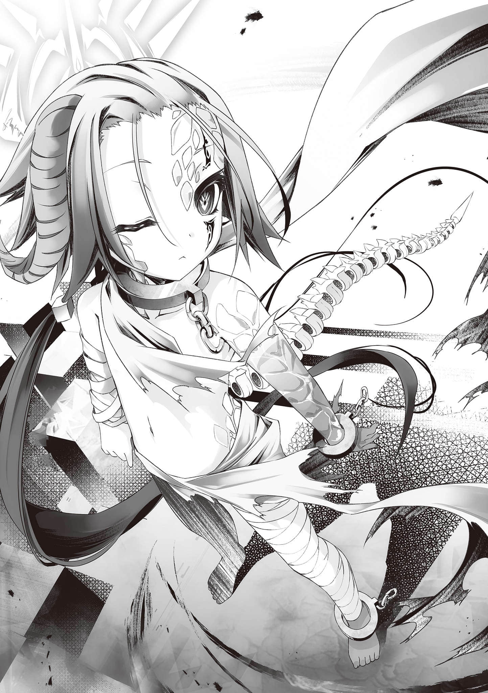
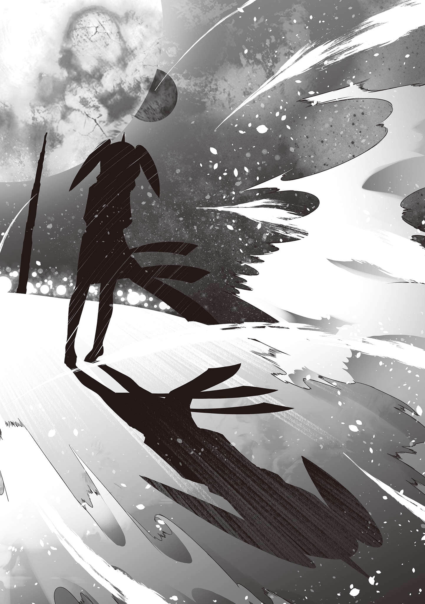

# RPG结局

> 来源：https://www.linovelib.com/novel/9/185623.html

……在很久、很久，遥远的以前。

众神之间的争战，导致某一块陆地浮上了空中。

强大无比、等同大陆板块碰撞般的威力余波，偶然导致这块陆地浮上了空中。

陆地在空中逐渐崩解──成为往大地降落的灾祸，最后完全瓦解，消失不见……

那是来自偶然的单纯天灾。但是……

──在具知性者的记忆与纪录中，那被视为『浮在天上的灾祸』。

经过长如永恒的时光──得到了『核』，最终成为幻想种……

──一开始是谁最先这么称呼的，没有人知道。

只知道不知不觉间──此幻想有了名字，被称为《阿邦特•赫伊姆》。

然而──那只是浮在空中、持续对大地降下灾祸的存在……

是只为了重现过往的天灾而存在的装置，单纯只是个机关（系统）。

并没有任何目的、害意──甚至连被称为自我的意识都没有。

只因为有人畏惧，因为有人幻想天灾日后会再度降临。

因为有人期望──它才会存在。

那仅仅只是意外诞生的『怪物』而已……

怪物为何要散播灾祸？

──那是……因为他是怪物。

──因为他就是这样的存在。

因为他是被作为这种存在而诞生的幻想（现象）。

不会有人去问云为什么要下雨，当然云也不会回答。

──是魔王领地《葛拉铎•勾卢姆》中央耸立的『塔』……

「……我羡慕……？那个幻想种──？」

这将近一年的时间──自己跟他们一样在大地上走动，体验了有如在地上爬行的蚂蚁的眼界。

「……我很在意……？那个幻想种──？」

似乎不明白她的意思，少年（阿邦君）脸上首次浮现困惑的表情──

啊啊，如果是一年前的自己，想必能完全与阿邦君同感，与他一起羡慕吧。

阿兹莉尔与阿邦特•赫伊姆共有的不只是力量──也包括其不自觉的意识。

──再不理我，我真的要哭了喵？

让阿邦君注视得忘我的──

「不过呢，阿邦君……那或许不是如你所想的那样的东西喵？」

──发自本能的危机感告诉他，这时候还是道歉比较好。

但是，阿兹莉尔却能以语言表达他那无自觉的意识──

──『魔王（那个）』是跟自己一样的幻想种。

只是存在着，没有任何意义。

不过，他很快地又把眼光移开，眼神空洞，像是在看着不是这里的某个别的地方。那是一名少年──看起来像是少年的存在。

现在脑容量依然小得跟蚂蚁差不多，仍然很迟钝……但是，即使如此──

因此，阿兹莉尔比阿邦特•赫伊姆本身更能理解──阿邦特•赫伊姆之所以事到如今才回顾遥远过往的理由，以及他那有如作梦般的迷濛目光在看着什么……

纯粹的灾祸，单纯的机关──

这『核（少年）』没有感情，自我也过于稀薄，但是──

仰望时总是在低鸣的红月──

────…………

阿兹莉尔眼眶泛泪，以眼光向对方控诉，但是──

趴在地上对某人这么叫道的，是头上一边有角的天翼种。

大约从一个月前开始──阿兹莉尔发现阿邦特•赫伊姆不再回应自己的呼唤。

「你可终于察觉了喵！？所以我才说现在很忙喵！？真要说的话──接下来的状况不管怎么样都会很不妙喵！？别说废话了，给我提起劲来俐落地干活喵啊啊啊！？」

自己所没有的一切……『魔王』，那个存在（他）都拥有。

拥有自己的角色、目的与存在意义──那是自己一度被赋予，而后丧失的东西。

绝望领域，吞噬希望之猛兽，破灭的幻想──『魔王』────

阿兹莉尔以自己不怎么聪明的脑袋──试着思考了关于『魔王』的事。

阿邦君微微歪着头，看来仍然没有自觉。阿兹莉尔脸上稍微浮现苦笑。

──原来如此……看来阿邦君并没有自觉喵。

「……阿兹莉尔……『月亮掉下来了』……？」

本来应该是这样的。明明如此……『魔王』却──拥有。

但是，即使来到面前，对方依然对她视若无睹──

头上一边的角，证明他是与阿兹莉尔共享力量的存在。单眼有如作梦般迷濛的人型存在……

……单纯只是──

那怪物就像云一样──只是浮在空中、降下灾祸──

即使知道这样做很不像平常的自己，也知道自己没有资格拥有这种情感。

少年身体一半以上的部位，都被蓝白色的结晶覆盖，很明显地不是人。

「～～话说回来，现在可不是说这种事的时候，忙死了喵！？」

「以跟人类种差不多的体能来到阿邦君的『核（这里）』可是很辛苦的喵！？再说怎么都没人要帮我，不过就是在空间上开个孔而已嘛喵！？我这辈子可是从没用过登山冰斧这种东西喵，话说贵为天翼种的族长，为什么非得亲自做挖洞这种苦工不可啊啊啊喵！？」

没有任何理由与目的，只是单纯地诞生的存在。

是名为阿邦特•赫伊姆的幻想种的最深处……也就是──

阿兹莉尔刻意不解答少年的疑惑，大声地说道。

「……………………」

──『某人所做的梦（幻想种）』……

更重要的是拥有能主动追求某物、采取行动，明确的『自我』……

「──！？是、是光喵……终、终于抵达了喵！！哼、哼哼哼哼，好了～阿邦君，就听听你怎么解释吧？──竟然忽视我，到底是什么意思喵～～！？」

那是，手持登山用的冰斧，头戴安全帽──气喘如牛，奄奄一息的阿兹莉尔……

「……我、我会尽量注意……阿兹莉尔……………………抱歉？」

不只如此，他甚至似乎无法拥有正确的自觉。

没错，换句话说──

下定决心之后，阿兹莉尔整整三天持续挖洞，终于抵达了『核』所在的空间。

然后──阿邦特•赫伊姆最后又遥望了一眼。

现在阿兹莉尔已经下定决心──要效忠于可爱的么妹那两名无比脆弱的主人。

阿兹莉尔代替阿邦君，以语言说出了他的心声。

阿兹莉尔仍然凭自己的脑袋思考，凭自己一路走到现在。因此──她继续说道：

──她脸上还是忍不住露出了悲伤的笑容，呢喃出声。

同为幻想种──明是如此……为什么会有这种差异？

「……我知道了喵。你很羡慕『魔王（那孩子）』吧？」

阿邦君所拥有的自我过于薄弱，无法明确地用语言表达理由。

其上方──那座高耸入云、形状扭曲的『塔』的上方──

「喔……你真的这么在乎那个喵～？让你在意到连理都不理我的地步喵！？」

满腹牢骚的她，现在所在的地点是──过去的主人的玉座之前。

──至少，现在还不是……

亦即──此处正是阿邦特•赫伊姆的『核』所伫立的空间……

──幻想种阿邦特•赫伊姆……

阿兹莉尔脸上浮现凶恶的笑容，就好像以前大战时代的第一号个体。

视线往远处的『魔王』望去。然而，他注意到了──

面无表情的少年再度望向阿兹莉尔，对她微微地歪起头。

──而且你让我挖坑挖到这里，这件事我要记恨好一阵子喵❤

「……………………」

三天前──她决定直接去找『核』，这样一来对方就无法忽视她了。

那个存在一直默默地听着阿兹莉尔发牢骚，这时候才缓慢地转过头来。

即使不确定他的话语中是否真有歉意，阿兹莉尔还是「哼」了一声点头，转身打算离去。

──正在靠近。

但是──现在不同了。

「别忘了，我们有我们的工作（游戏）喵！？下次要是敢再忽视我，我就铺一条直达这里的铁路，每天搭车过来戳你喵──知道了吗喵！？」

于是，阿邦特•赫伊姆的意识，从『核』回归了阿兹莉尔焦躁的意识之中……

---

■■■

──『塔』的……八十一层……

空一行人踏上阶梯后，映入眼帘的景色──不出所料又是完全不同。

白、史蒂芙、缇儿与伊纲自然不在话下。

就连吉普莉尔与依蜜尔爱因，都被震慑得说不出话来。

眼前的景色_简直是难以名状的光景。

如字面所示──无法以言语形容的光景……

──那是『战场遗址』……

不分种族，彼此凄惨地相杀相残，尸体堆积如山，填满河流──真正的尸山血海。

任何生命──或许就连微生物都彻底死去──无限多的尸体，就连腐败都不被允许。

战场上仍有战争的余火在摇曳，仿佛连这些尸体都想要彻底消灭。

除此之外没有任何会动的东西，也没有会出声的东西──在死亡的世界，只有无边的寂静笼罩着。

──但是，真正让一行人说不出话来的，不是这种小事。

天翼种（吉普莉尔）与机凯种（依蜜尔爱因）亲身经历过久远以前，让地上世界化为地狱的大战──

就连这样的她们，面对如此景象也只能沉默，甚至忍不住想移开目光。

那是笼罩在这死亡世界的──眼睛所无法看见的某物。

即使看不见，却连人类种都能确信，那看不见的『某物』确实存在──

「──这是、什么……这到底……是什么啊！？」

史蒂芙陷入半恐慌状态，惊声叫道。但是，没人能回答她的疑问。

那不容许任何人认知、理解的『某物』，没有任何语汇可以形容。

明明有憎恨、嫉妒的对象，心里怀有想要抢夺、想要折磨、想要杀害……等『希望』。

『打倒位于顶层的「魔王之核」即为游戏的胜者，而胜者将能得到「魔王」曾经拥有的一切。』

不同于倒抽一口气的伙伴们，唯有空一个人缓缓地摇头，否定道──

「这也同样地──只是单纯的『希望』而已。」

空只是语带自虐地、平淡地、有如阐述单纯事实般说着，没有表现出任何恶意或敌意──

「……对某人感到憎恨，讨厌，厌烦，嫌弃，排斥可憎嫉妒烦躁污秽不喜欢噁心想使其痛苦想伤害想毁坏想撕裂想碾碎想粉碎想消灭想千刀万剐想杀掉不甚至是死也不够最好让对方永远活着受折磨──」

「那么反过来说──『绝望』又是什么？」

空的眼睛深黑无光，直视着前方。

「──希望所有的一切都死掉，希望世界毁灭……这全部都只是单纯的情感，单纯的愿望。纯粹只是脑内物质，只是生理反应。没有正或负、善或恶的分别──」

总而言之，就是──

因此，不惜费心准备这种『原则上可破关的游戏』。

连白都怀疑自己的哥哥是不是发疯了，所有人甚至感到有些害怕。然而，空只是平淡地继续说道：

这时候，空的眼光才终于转向伙伴们，脸上浮现有些自嘲的笑容，回答道：

仿佛要拒绝一切的理解似的……那无比暧昧，以致无法以言词表现的东西。

「世界灭亡──这样无法使其发生的现象所生的──『共同幻想（希望）』……」

这是非常不可思议，却又无比普遍的情况──

那单纯只是身体的反应，一种生理现象──也就是说，不过是一种错觉。

──因此，才要把原因归咎于自己之外的某个存在……

「────────」

「……『绝望』就如同字面上的意思，是希望绝尽，并非『希望』的反义词。如果说希望是『正』的话，绝望就是『零』……而不是负。名为绝望的情感并不存在。如果说情感绝尽就是绝望的话……绝望就是──无形的。」

──空指出『魔王』的真面目。

「一样是『魔王』……世界灭亡的幻想，吞噬希望之猛兽的内部。」

空的说明还没结束。他继续说道：

那是连吉普莉尔与依蜜尔爱因都不敢直视，排山倒海般的绝对的邪恶意念。

又或者是怨恨。后悔。轻蔑厌恶杀意恐惧──不，全部都是。

最好有人可以代替自己折磨那家伙，杀掉那家伙。最好……

──他的眼神昏暗，为回答史蒂芙的疑问而张口……

「…………哥……你在……说什、么……？」

但是，那是不好的希望──就连有这样的感受，都被视为是『不应该的事』──

「──『纯粹只是希望』……那是吞噬希望之猛兽至今为止吞噬过的，纯粹的希望。」

虽然不得而知，不过，幻想种是连天翼种与机凯种都无法理解的种族。

优美的神殿、生机蓬勃的森林，或是火山、充满瘴气的山谷──

「……主、主人……您说无法使其发生，究竟……是什么意思……？」

……众人到现在依然什么都说不出来。但是──

看着这样的他，众人什么话都说不出来，只能沉默地等待空继续平淡地说下去……

──『希望』……其实只是脑内物质，以及其所引发的化学反应。

为什么偏偏说这种东西──是『希望』呢？

──因为大家不承认自己的恶意（希望），认为自己绝对不可能是坏人。

其中的突变个体──『魔王』，那是未发生现象的幻想，是更加难以解释的存在。身为人类的空，那双黑暗般的眼睛却能看破其真相，这让两人不由得心生敬畏──

「不，不对。这跟我们在其他阶层看到的一样──是『塔』。」

──这大概就是名为『魔王』的『绝对之恶』诞生的由来吧……

空那双深黑色的眼眸，究竟在看着什么？

任谁都拒绝直视、移开了目光，只有一个人──只有空直盯着『那个』不放。

「都说自己只是被『恶魔』教唆……之类的？」

令人发自本能地拒绝直视，不由分说地只能诉诸于情绪的『某物』──

──眼前的死亡世界，以及笼罩其中的『某物』……

「吞噬了世界想杀掉所有存在的『希望（恶意）』，为了毁灭世界而采取行动，却又被世界憎恨且杀掉──那只是自世界（大家）的希望所产生的，便利舞台装置……」

也就是说，这正是──

听空这么问，史蒂芙不由自主地将眼光转向与空同样的方向。

或者是恸哭。抑或是愤怒。

因为那个家伙是恶人，自己才会有这样的情感，自己是正确的。

──众人之间陷入一片沉寂。

「随便找个因果报应之类的理由，期望神或恶魔实现自己的这些希望（恶意）。」

「……史蒂芙，『希望』是什么，这我之前说过了吧。」

在这世界似乎被称为『阳精』，不过那仍然是极为物质性的东西。

「不过『人』这种东西的精神构造，就是无比地方便。」

这些意念凝聚起来，最终──

「嗯……『魔王』──也就是恶魔之王，是名符其实的存在。」

说它便是『绝望本身』，的确令人可以接受。

──因此……

自己会怀抱这么不好的情感，都是那家伙的错──又或者……

看来即使是在这个世界，也不管哪个种族都一样。

因为自己必定是善良、清白、无罪、无辜的正义之子。

最好能在自己不知情的时候悄悄实现，让自己甚至不会有罪恶感……

依然无法理解的吉普莉尔请求主人的原谅，以及更进一步的说明。

──古今中外，在空与白原本的世界──不，不只。

既然这样，在眼前蠢动的这个──到底是什么？

所以，魔王才要一直寻求来打倒自己的『勇者』。

──憎恨。

那么──

但是，也无法否定自己的心里萌生了不好的情感。因此──一切都是那个家伙不好。

啊啊……真要用言语表现的话，那应该就是──

「────────」

最后，吞噬这『共同幻想（希望）』并代替大家实行的存在出现，那就是──毁灭世界（所有人）的幻想（怪物）。

「……『魔王』是『包含被打倒这一步骤的幻想种』……」

没错──这里的一切同样是吞噬希望之猛兽──『魔王』的内部。既然如此──

正如同眼前这片景象──以及骇人地凝缩的『希望』一样。

「──你、你是要说……这景象就是『绝望』吗──！？」

将这世上所有的『邪恶』──所有的恶之情感聚集在一处而成的景象。而笼罩于其上──那让人拒绝直视与理解的出于本能的排斥感（某物）。

惊呼的同时，史蒂芙的眼光又再度快速地移开，转向了空。

「『绝对之恶』代替人们承担、实行的，是人们否定自己是『恶』的希望（恶意）──但是，光是这样也说不过去吧？因为那到头来终究是『恶』。对人们来说，肯定并认同『恶』的存在是不应该的──『绝对之恶』应该要被讨伐、打倒。」

因此，『魔王』对『勇者』要求的赌注是『空壳』。

──任何人都想认为自己是善良清白的小老百姓……

「然后──到了大战的时代。互相残杀有如家常便饭一般自然──像这个战场遗址（场景）一样的地狱景象到处都是，任何人都理所当然地憎恨彼此。在这样的时代，大家肯定都会这样想──希望自己看不顺眼的所有家伙都去死。最好是自己以外的某人可以消灭那些家伙……这就是大家心里的希望吧？」

打倒『魔王之核』……曾经拥有的一切……过去式……

「在这游戏中──只要打倒位于顶层的『魔王』，魔王的『核』应该就会同时遭到破坏，这样想应该比较自然吧。也就是说……」

其所代表的意义──当然只有──个吧？

「『魔王』的要求是────『自己的死』……仅只如此……」

────…………

「──原来如此……既然这样『魔王』就不是突变个体，而是跟其他的幻想种一样──」

「【假设】不曾主动采取行动。彻底都是被动地，只是系统性地代理实行『盼望所有生命体死去』的希望（恶意）……这样的确可以说明目前为未能解明的『突变个体说』。」

吉普莉尔与依蜜尔爱因看起来都接受了如此说明。相反地──

「……妳们……为什么都一副完全能接受的样子？哪有这样的？这太荒唐了。」

空所揭穿的真相，比眼前到处都是死尸、地狱般的战场景象，以及令人不敢直视的骇人『希望（恶意）』──都还要丑恶许多。

「大家擅自憎恨彼此！！擅自诅咒彼此、擅自自相残杀！！──『魔王』生下来就是为了承担这些自私的希望，最后还非得被杀掉不可──难道你是这个意思吗！？」

史蒂芙握紧颤抖的拳头，有如咒骂般地吼道。接着──

「为了被憎恨、被杀害而生！？这实在是……实在是太过分了！！」

听到史蒂芙悲痛的呐喊，白与缇儿都低下了头。

伊纲则是已经流出斗大的泪珠，强忍着情绪。

──那颗说话大舌头的可爱毛球，因为找到了有可能打倒自己的『勇者』，而天真无邪地开心着。

那满面的笑容，背后的意思竟然是…………

──『快来杀掉本王』吗……？

──怎么可能认同这种事。

怎么可能容许这种事！！什么『魔王』……

──额头上长有一支角，外表有如一角兔的少女。

……《月神》泽纳斯斯──

没错──即使那一行人真的有可能打倒『魔王』。

这里一样笼罩着狂风与暴雪，不过西装笔挺的骷髅完全不以为意，有如祈祷般地跪在地上。

那正是少女的创造主，她的主人。

──同时……在『塔』之外……

当然──并不是因为周遭凛冽的风雪。

「……没有，史蒂芙。那种东西……不存在。」

自从他们同意挑战游戏，踏入『塔』的那一刻开始──一切就已经无法挽回了。

抑或是，万一他们真的找到了预料之外的获胜方法。

但是，空那双比黑暗更深沉的黑色双眸空洞无光，移开了目光。

察觉自己差点浮现的想法，史蒂芙临崖勒马，连忙摇头警惕自己。

「──！？啊啊──啊啊……主人请恕罪！！竟然让主人看到如此污秽丑恶的模样，请原谅属下的无礼──！」

接着他要求吉普莉尔施展空间转移，一行人暂时离开了第八十一层（地狱）────

──【十六种族】位阶序列第十三位──『月咏种』的少女，怀抱着无上的喜悦，满心恍惚地全身颤抖…………

────────

---

■■■

既然这样，生出这『魔王』的，这个世界本身才是该受诅咒的──────

「…………空，你有吧……？」

──空。夸口『在游戏开始之前就已经分出了胜负』的男人，为了联邦，甚至拒绝付出必要的牺牲，宁愿选择压倒性不利条件的男人，不可能会答应挑战无法避免牺牲的游戏──！！

────

位于魔王领地《葛拉铎•勾卢姆》首都郊外的一座矮丘上。

骷髅慌张地叫道──同时有如要抛弃名为盖纳乌•伊的身分似地摇身一变。

变回原本的面貌之后，她再度跪下，仰天祈求主人恩赦──

骷髅只是在除他之外无人的山丘上低垂着头，郑重地报告状况。

无论他们怎么做，都是徒劳无功，一切都会如计划进行。结果不会改变……

不管他们选择接纳牺牲──虽然那是可能性极低的状况──或者是如预期地拒绝牺牲而在游戏中落败。

「──是，主人……因为您的力量，『魔王』顺利觉醒了。」

自称盖纳乌•伊的骷髅，喀喀作响地抖着头骨说道。

「联邦的介入，以及魔王军统合参谋本部（政府机关）的掌握，全都如主人所料──唯有那些人真的可能打倒『魔王』这一点是出乎预料的状况之外，一切都如计划进行，非常顺利。」

空说出了平时的他不可能会说的话，转身往回走。

顶天戴红月──美的精髓。

眼眸的颜色，就跟头上告知时机将至而逼近的红月一样。

──我才不能同流合污。

──骷髅愉快地报告着。

不只是史蒂芙，白与缇儿、伊纲也对空投以寄望的眼光。

位于比任何神都还要崇高的天上，无比高贵的远大。

「──『妖魔种的棋子』如今等于已经掌握在您的手中……我的主人。」

「啊啊……主宰一切的主人──切都如《月神》大人所愿♪」

「……我们是『勇者』，『魔王』是敌人……只要《绝望领域》扩大，世界就会灭亡。勇者必须打倒魔王不可──除此之外的剧情路线，在这个故事（游戏）中是不存在的……」

少女有如祈祷般地报告──全身颤抖起来。

然后，她凝视空那有如黑暗般的双眼──问道：

然后，他举起手机──答道：

「除了打倒『魔王』之外的胜利方法。就是因为有方法，你才答应挑战这游戏的，对不对！？」

一旦听到那美好的声音，必然会失去耳朵，因此要无声地耳语──

面临悠久以来──即将降临污秽大地的预兆──

然而，他突然察觉对方对自己有些微不悦的念头──

对于被大地囚困的所有可悲存在而言，平等地照耀的红色月光，乃是至上的慈悲。
