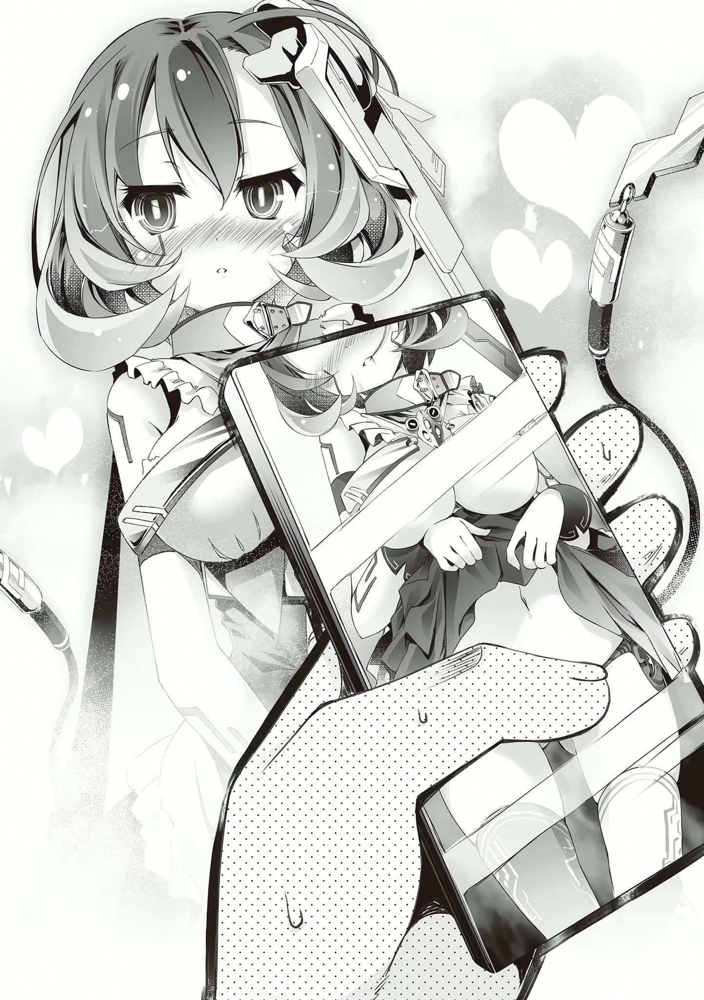
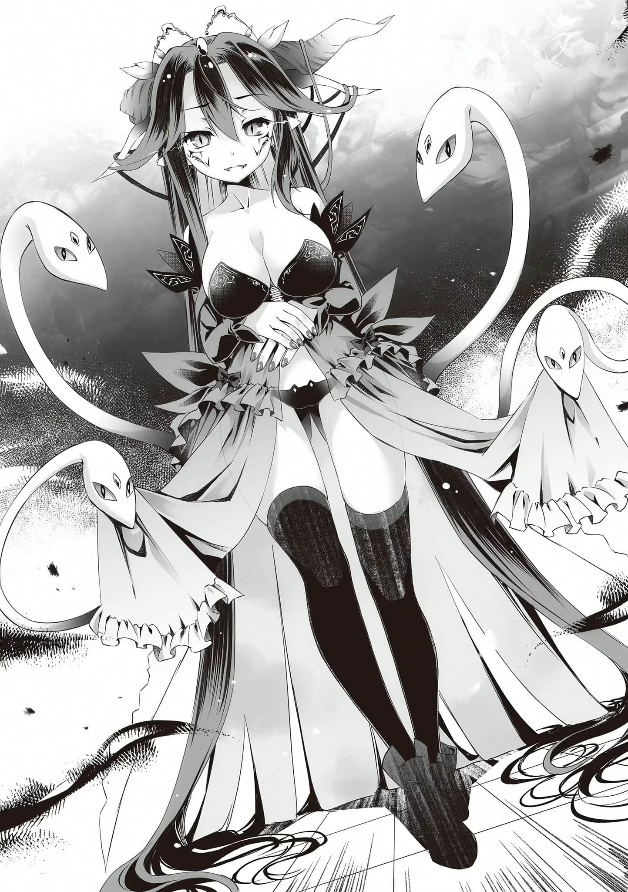

# 前奏曲

> 来源：https://www.linovelib.com/novel/9/184725.html

──『要在不给别人添麻烦的情况下活着』……

这样的论调经常听到，但是，会说这种话的人，肯定没玩过游戏。

他们甚至不明白，只要玩游戏、或是任何要分出胜负的事，就一定会有胜者与败者之分。

……假如你是个善良的小老百姓。

善良的你，某一天心血来潮，前往一间食堂用餐。你端着餐点，找了个位子坐下。

一段时间之后你张望周遭，必然会发现──有人因为没有座位可坐而困扰着。

没错……而你则坐在椅子上。因此，导致有人没有椅子可坐，产生了困扰。

这究竟是谁的错？请放心，当然不是善良的你的错。

你凭藉正当的权利坐了椅子，有人因为这样而蒙受了困扰，事实不过是如此而已……

──在游戏中臝了，当然会很高兴，不是吗？

即使有人会因为你的胜利而落败、哭泣。

在考试中被录取，一定会很高兴，不是吗？

即使有人会因为你被录取而失去被录取的机会。

……到头来，在生活中要不给任何人添麻烦，是不可能的。

整个社会，就是大风吹游戏，就是一种零和游戏。

当我们获取任何事物，就必然地代表从别人手中剥夺了某样事物。

不，不只社会生活如此。

所有生命（我们）都必须摄取其他生命维生。既然这样，活着本身就是给其他存在造成困扰的行为……

──没有错。无论怎么想办法，结果都是枉然。

无论善良的你再怎么小心翼翼地顾虑别人、每天留意着别人的脸色，对于那些看善良的你不顺眼的人来说，如此事实本身就已是困扰……

因为在他们登场之后，还有两个人在更热烈的欢呼声中登场──

他们都是代表了各种族的全权代理者，或是代行者。

站在大阳台上的，是在此地齐聚一堂的七个种族的代表们。

──史蒂芙这家伙，真的愈来愈了解我们了……

史蒂芙言下如此强调，完全不给两人退路。但是，空与白对于史蒂芙的话只是左耳进、右耳出，眼神流露出怀念的情感。

是自从十六种族诞生以来，一直都不曾有人梦想过的光景。

从天上与地上过来的各代表团、以及他们的国旗集合，一起高举而起的那一瞬间……

---

■■■

以及自虚空中显露绝对神性、降临于凡间的小小神灵种──帆楼。

拥有耀眼真灵銀发与感应钢之眼的地精种少女，首领代理人──缇儿。

他们都是让这不可能实现的梦想成真的大功臣──亦即……

垂着翅膀不动、脚踏大地的天翼种第一号个体──阿兹莉尔。

──如此『游行』的景象，让任何人都看得目不转睛，而且难以置信。

「……时间、过得、很快……又好像、很慢、呢……」

各国、各种族各自展示着代表自己的颜色、旗子或徽章，跟着游行前进，口中高唱祝福之歌。

就连为数极少的机凯种也聚在一起，在妖精种撒下的花瓣与泡沫中粉墨登场──

如今回想起来……自从来到这『棋盘上的世界（迪司博德）』之后，真的发生过很多事。

以超越人智的技术创造而成的钢铁少女，机凯种之全连结指挥体（爱因玆希）代理──依蜜尔爱因。

才能够完全没察觉，自己一路走来践踏了多少东西。

因此，要瞒着这两个国王偷偷地准备庆典，就跟小游戏一样地简单──史蒂芙言外透露出这样的意思。

但是……即使是这样的他们和她们，却仍然算不上是这历史性的一夜之主角。

在都市上空，钢铁舰队整齐地排列着，以五颜六色的船灯照耀、引导地上的这些活动。

撒着花瓣、在空中飞舞的娇小少女，提倡反叛的妖精种──佛耶妮可兰。

都市内不断的喧嚣与欢呼声，伴随着无数的灯光，将黑暗赶回了夜空。

「我们要举行艾尔奇亚国王即位一周年纪念庆典──就在下个星期。」

「虽然我不是很明白，不过这种事不是都应该更提前准备的吗？而且，虽然完全不知情，但至少应该要事先征求我们的同意吧……？毕竟被庆祝即位的国王是我们耶……」

「就是因为这样，我才会不等你们同意，便虎视眈眈地！从之前就开始擅自进行准备了♪」

「当然不可能了。」

也有群众跟随在游行队伍之后，而且不是只有人类种。

如此不可能成真的历史，在场的人们都意外地成了当事者。

于是，事实就如史蒂芙所说的，联邦现在已经是世界两大势力中的其中一大同盟了。

白刚才的喃喃自语，空也感同身受。这一年的时间，感觉起来真是既短暂、又漫长…………

是的，也就是说，这也是庆祝那名青年•空──

────嗯嗯？等一等。

另一个人则是身穿仿佛由星空制成的晚礼服，戴着造型有如男性用王冠的发夹之少女。

如此景象，恐怕在这之前从来没人想像过。

「如今世界一分为二，而我们艾尔奇亚联邦已经是其中一大同盟。你们两位可是身为盟主的艾尔奇亚国王。为了庆祝两位的即位纪念日，要邀请各国重要人士盛大地庆祝──对内对外展现加盟国的团结与各种族的共存共荣──无论是在经济或者政治上，这庆典均深具意义。到时候要让两位穿着的正式服装已顺利地准备好了，当天的行程也都以分钟为单位，安排得非常妥当──」

在露西亚大陆西部──艾尔奇亚王国的首都艾尔奇亚。

「这样啊～……我们来这个世界（迪司博德）已经满一周年啦……」

在国立图书馆──空与白正把自己关在吉普莉尔的书库内，沉浸于阅读与游戏之中。

还有原本是自治领地、后来宣布成为独立国家的妖精种之国──『史普拉特利亚』。

……『不要出生』。除此之外，肯定别无他法……

这急速发展、象征多种族共生的都市，在短短一年之前还荒废无比，濒临灭亡的危机──事到如今，真是谁也不敢相信。

就在这一天、这个夜晚，这座都市，所有具有智能、聚集在这广场上的存在，都是当事者。

你活到现在为止，真的没给任何人添过任何麻烦吗……？

没错，无论是这华丽壮观的游行，还是有如万雷齐响般的掌声、撼摇天地的欢呼声，全都是为了庆祝这两人──艾尔奇亚国王兄妹的『加冕一周年』。

然后，还与东部联合建立联邦，并将奥仙德、阿邦特•赫伊姆与哈登费尔等国家纳入联邦之中，还拉拢了神灵种、机凯种与妖精种的半数个体成为伙伴。

有如集暗夜之黑于一身的美少年，吸血种最后的男性个体──布拉姆。

下半身为布满艳丽鳞片之鱼尾的海栖种女王──莱拉。

道路上的每个角落都挤得水泄不通，就连建筑物的屋顶上也挤满了观赏游行的人潮。

所有的队伍都前往同一个目的地──艾尔奇亚王城前的广场。

虽说是因为形势所逼，但空与白竟成了面临亡国危机的人类种最后国家──艾尔奇亚的国王。

看她那洋洋得意的嘴脸，空与白小小地「啧」了一声。

---

■■■

更难以置信的是，这样的景象竟然发生在这个城市（艾尔奇亚）。

「…………下个、星期……还真是、突然呢……？」

「要是事前征求你们的同意，你们会答应吗？」

这时候，一个红头发的少女──史蒂芬妮•多拉突然过来，跟他们提起了这件事，即是这场盛宴的开端。

在那广场上，有一群人类种的团体穿着艾尔奇亚的传统服装，在等着迎接──

──时间回溯到一个星期之前。

那是在『十条盟约』之后，六千年来──不。

洋洋得意地跟在他们后头的是地精种，驾驶着两脚步行的人型灵装。

在延伸至港口的中央运河中，海栖种带领着吸血种载歌载舞。

当然，空与白肯定没在听。而且从两人的态度看起来，现在根本顾不上此事。

而运河两旁的大道上，身穿祭典装束（浴衣）的兽人种，正扛着神轿游街。

而幻想种引领着天翼种，在让星光失色的缤纷光辉中，悠然自得地翱翔天际。

拥有两条尾巴的金狐女性，兽人族的领导者──巫女。

他们的眼光都聚集在同一处──艾尔奇亚王城的大阳台上。

咦？什么？已经──过一年了吗──！？

奥仙德、东部联合、哈登费尔、阿邦特•赫伊姆──

因此，主张『要在不给别人添麻烦的情况下活着』的你啊，我要提出一个疑问──

而这些事，竟然都发生在短短的一年之内。

两个国王完全不工作──对政治漠不关心。

──也就是说，你们休想逃喔？

一个是身穿与夜晚黑暗相衬的深蓝色燕尾服，戴着造型有如女性用王冠的臂章之青年。

假如你能回答『YES』，那我打从心底羡慕你。你的人生想必是一帆风顺吧。

「──我说啊，我正在说明的可是当天的活动行程……你们有在听吗？」

假如真的有办法办到这一点，啊啊──那答案肯定只有一个。

空与白眯着眼睛，各自如此发着牢骚。面对两人，史蒂芙板着一张脸，严肃地反问道：

以处男之身迎来十九岁生日的宴会…………

──七个种族举着旗子，在联邦（一面）的旗子之下齐聚一堂。

这是个红月高挂的夜晚，却不见星光。

──不给任何人添麻烦。

两人都急忙掏出手机，甚至差点因为没拿好而掉下去，盯着荧幕看了起来。

荧幕上显示的年月日，依然是原本世界的标准时间──

「啊啊啊啊啊！？原来我早就已经十九岁了！？这不是真的吧！？我什么时候变十九岁的！？」

「……骗人骗人骗人。可是白的、身高跟胸围、竟然……一厘米都……没变！？」

也就是说──是怎么回事？

长期以来，空一直自称是『十八岁处男空』。

但实际上，在不知不觉之间──不，应该说他早就已经以正当的程序退化为『十九岁处男空』了。

而白也一样。一整年来身体都没有明显的变化，就这样长了一岁──变成了十二岁的少女。

如此事实，让兄妹俩同时仰天，嚎啕大哭──但是，还没呢！

我还不接受这个现实──！！

「不不不！我们的生日应该是『在这个世界（迪司博德）重新诞生的日子』才对！！至少在文件上应该是这样才对吧！！我说的没错吧啊啊史蒂～～～～芙！？」

「……！！没、没错！哥，你说的对！！白、白、明明还是十一岁！！」

──说到底，这个世界的历法，与原本的世界完全不同。

而且空与白来自异世界，在这艾尔奇亚根本没有户籍！

当初即位的时候，运用王权在公家文书上捏造──不，应该说是撰写──说生日是来到这个世界的第一天！！

既然这样，兄妹俩目前仍然是『十八岁处男空』与『十一岁洗衣板白』才对──！！

兄妹俩如此高声主张。史蒂芙听了之后，先是严肃地点头，然后──「嗯，是这样没错啊。所以，即位纪念日的四天前──也就是后天，就是你们两个的生日。所以才要举行庆典，同时庆祝国王的生日与即位一周年！喂，你们到底有没有在听啊！？」

当然，空与白肯定没有在听。他们现在心情非常激动，完全无暇在乎这种事。

总之──即使搬出自己在原本世界的生日不算数这种诡辩，也无法改变现状。

到了后天，兄妹俩一样要被迫成为『十九岁处男空』与『十二岁洗衣板白』……

白虽然满怀怨念地这么嘀咕，但似乎还是认同空后半段的话，点头附和。

---

■■■

…………

「说得这么笃定！？──咦？实际上应该不是吧！？只有你是这样而已吧！？」

「没错──就是『自由』。包括缔结契约的自由、考取驾驶等执照的自由、脱离父母庇护的自由、工作赚钱的自由──终归一句来说，就是凭自己的意志决定自己人生的自由！」

「……只是、白、就连一厘米……都没有、发育……就是了……！」

「例如身体的成长与发育等等。更重要的是，权利得到了解放，行动因此变得自由。」

不只如此──！！

所有生命，打从诞生的那一刻开始，就注定总有一天必须死去，几乎没有例外。

因为考量到受欢迎之后能够得到的东西，最后都是色色的事！

具体而言，就是──

也就是说，史蒂芙跟兄妹俩一样，从头到尾参与这些以分钟为单位的紧凑行程────不，不只如此，史蒂芙还是典礼的幕后工作负责人，典礼的进行与控管都由她一手包办。照理说肯定比身为主办人的兄妹俩还要忙碌才对……？？

史蒂芙精辟的反驳，以及白莫名其妙的指正，空都优雅地忽略了。

「如此看来，结论自然不理自明，至少在十八岁之前，年纪增长肯定是有利无弊的事！！因此生日的确值得纪念与庆祝，这是毋庸置疑的！！啊啊──但是！！」

---

■■■

也有可能在明天、或短短一秒之后，因为意外而突然死去。

另外，剩下的四成则是财富与地位──也就是对于异性缘的渴望！

「……唔！婚姻的、自由……！……再等、六年……！」

「这样啊。那么，史蒂芙，我问妳──追根究柢来说，『活着』又是什么？」

那么，二十一岁以后的生日呢？三十岁、四十岁以后呢──？

「反而还要劳动、纳税！！强制对社会进行贡献！也就是徒增『义务』！！肉体会因为年纪增长而衰老，精神会愈来愈僵化！满是希望的未来，在不知不觉间被不安取代，光是为了活过当下就耗尽心力！在前方等待着的，只有被工作逼得完全失去自由、只能数着剩余寿命的人生！！」

这七天来，史蒂芙一直随伺在空与白的身边。

「……这样啊，庆生……嗯，不过，对白来说，的确是很值得祝贺的事吧……嗯……」

──喔喔。

首先，邀请联邦各加盟国的代表团，一起观赏传统艺能等表演。

「你这年纪要怨叹年纪增长还嫌太早，而且你早在一年前开始就已经是一国之王了喔！？先真正地至少贡献过社会一天、尽过劳动义务之后，再来说这种悲痛的台词好吗！？」

──既然这样，撇开白不谈，十九岁（我）生日到底有什么好庆祝的？

简单来说──就是接触色情的自由──！！

「～～不！追根究柢来说，过生日才不是那么复杂的事啊！？过生日是为了庆祝并感谢又平安地活过了一年的事实──就这么单纯吧！？」

「……白……好困……史蒂芙……妳都、什么时候……睡觉……？」

「……………………咦？是、是这样的吗？」

他继续说道，表情就好像彻底失去情绪的能剧面具，使史蒂芙不由得倒抽了一口气……十九岁以后的生日──顶多就是得到一些琐碎行为的权利而已，例如抽烟或喝酒……

空深深地叹了一口气，接着说道：

「看、看来……是纪念庆典的行程让你们太辛苦了──是吧？如、如果你们真的这么疲惫的话，就由我出面跟大家解释，派对改天再举办也──」

「……？好处……？这个嘛……应该有很多吧？」

「但是──十八岁以后呢……？」

空与白事前的确听说──这是『庆祝生日与即位一周年的庆典』。

「十九岁以后，不会再随着年纪增长得到更多权利跟自由了──完全没有。」

空与白这对有社交恐惧症与视线恐惧症的兄妹，即使疲惫得要命，还是必须拚命地强忍着不打呵欠、不发抖。

「喔……不，不是的……史蒂芙，不是妳想的那样……」

「嗯，是有很多没错──因为年纪增长与获得自由同义。」

「怎么全都是跟色情有关的事！？就没有别的了吗！？」

空满脸绝望地总结他的根据。

面对史蒂芙精心准备的惊喜庆生派对，兄妹俩原本空洞的眼光变得更昏暗了。

「……过生日……十二岁……明明一厘米、都没有成长……却变成十二岁了……」

以人类种来说──即使享有最多的幸运、不断经历种种奇迹──顶多也只能活一百二十年左右。

空依然坚持，生日值得开心的阶段只到十八岁生日──那一天为止！！

「两位都辛苦了！接着是最后──不，应该说是最主要的活动！！」

不过到目前为止，却完全没有『庆生』的要素──

──史蒂芙把一切的行程都安排得无比周全，并事前联络好各相关单位，如她先前说过的，行程非常紧凑，以分钟为单位。

激昂无比的空说到这里──态度骤变。

「……值得庆祝的生日，只到十八岁为止啊。」

──于是，到了当天，艾尔奇亚国王即位一周年纪念庆典如期举行。

──活着，到底是什么……？

察觉自己刚才差点就被空的气势唬住，史蒂芙跟着大声了起来。但是──

没错，结婚的自由──也就是性方面的自由。

「首先，追根究柢来说──『年纪增长的好处』究竟何在？」

面对空与白的冷眼相瞪，史蒂芙还是以她来源不明的无限活力和满面的笑容应对。

「勉强你们整整参加了一星期无趣的活动，真的是很抱歉。所以，最后我们准备了私人的庆生会，让大家以个人的立场一起尽情地庆祝两位的生日！！」

空不太明白她这是什么意思，不过既然妹妹能打起精神，那就好了。于是他对白点了点头。

「妳竟然不知道啊……没办法了，就让我从头说明给妳听吧……」

「怎么会有人听说要办自己的庆生派对还这样满心绝望跟挣扎！？」

看空又接着抛出了更为哲学的问题，史蒂芙满脸憔悴地嘀咕道。

史蒂芙正领着脚步虚浮、眼神空洞如丧尸的空与白，徒步前往某处──

广义上说起来，男人的脑中『十成都是色色的事』。空是如此认为的。

私人的庆生派对……原来如此。

「没有！！男人的脑袋内六成都是色色的事！！」

看空的表情有如腐尸，白则一直喃喃自语地发着牢骚，史蒂芙忍不住大声哀叫。

──犹如地狱的一星期的最后一天晚上，在艾尔奇亚王城的走廊上。

对于兄妹俩这副可怜兮兮的模样，各势力的全权代理者（老面孔）────尤其是巫女与布拉姆，则是愉悦无比，拚命地忍着不笑出来。

接着还要在所有代表齐聚一堂的场合中，发表各种形式上的共同声明，包括『艾尔奇亚王国与联邦加盟国以及各种族为对等的友好关系』与『今后将致力协助彼此的发展』等等。

就这样，兄妹俩度过了有如地狱般的七天──……

「……竟然还有……话说回来，妳哪来的这么多体力？妳的体力是无限的吗……？」

由于空说得太过斩钉截铁、毫不犹豫，令史蒂芙忍不住怀疑起自己的常识。

史蒂芙皱起眉头，表情看起来非常过意不去。空打断了她，摇了摇头──

不过──

「最重要的活动还没结束不是吗？──那就是你们两位的庆生派对啊！」

空的心里怀着憾恨，白则泪眼汪汪地目测自己胸部的大小。史蒂芙的说话声听起来显得无比遥远……

「────真是的～……你这次又要胡扯什么啦……」

但是，空对这些事完全不感兴趣。就算把这些事列入考虑──值得期待的生日也顶多只到二十岁。

「……而且，哥二十五岁……空十八岁的时候……还能再得到某项权利、喔……？……啊，不过……真要说的话……那算是……义务、吧……」

白像是找到了抵抗绝望的支柱，猛然抬起了头，如此补充道。

活动始于盛大无比的游行，在接下来的整整七天内，还要隆重而庄严地举行各种庆祝活动。

当然，在这种国际庆典的场合，空与白不可能被允许穿着日常的便服。

在地精种与妖精种的技术支援下，以上的活动，将同步于整个艾尔奇亚联邦进行现场直播。

当然，想到这种事一定有个人差异，空就谦虚一点，不把话说得这么死了。然后，他继续说明：

「没错！！每个小孩子都迫不及待想长大成人，等待的过程漫长而煎熬！！尤其是正值青春期的孩子，没有一天不幻想着自己满十八岁的那一天！！也就是得到究极的自由──光明正大地接触色情游戏、色情漫画、色情同人志、色情影片的权利的一天！那是多么值得庆祝啊！每天都掰着手指等着那一天的到来！！在这个阶段，年龄增长的确是值得期待──甚至可以说是希望！！」

以史蒂芙的角度而言，这无疑是她能力可及范围内的最大惊喜，同时也是慰劳兄妹俩的方式。

空必须一直穿着燕尾服，白则是晚礼服。这样的打扮让他们感觉十分拘束，几乎要喘不过气。

接着与各国、各种族的首脑人物个别会谈，然后是联谊聚餐，并互相发表祝贺词。

既然这样，生命──打从诞生的那个瞬间开始，就一直都在慢慢地走向死亡，难道不是这样吗……？

在这个前提下──『活着』又是什么？

「──所以，我们是不是可以当『活着』……是为了『希望』呢？」

「…………」

「达成某个成就，或是期望达成而持续跨出脚步──这样才是『活着』不是吗？」

没错……这段『生』──不，应该说是『死』的过程，总有一天会迎来终结，最后一切都将回归尘土。

在理解这一点的前提下，依然如字面所示──『拚命』地……对某些事物怀抱期望，为了累积而跨出脚步，如此意志，才是『活着』不是吗？

那么，如果不对任何事怀抱期望，没希望能够达成任何成就，只是漫无目标地存在着的话──

那样的话肯定……并没有活着。

只是逐渐死去而已……

「根据以上的前提，既然妳说我该接受庆祝，那就先来回顾我这一年的人生吧……」

空当上了国王，被各式各样的超级美少女围着，在名符其实的美女如云的环境下──度过了一年。

但是，即使如此，空还是没达成任何成就──不但没交到女朋友，也还维持着处男之身，就这样过了一年。

也就是说，不只这一年，即使再过十年、甚至是百年──自己肯定也还是处男。

从这一年的状况，不难推导出如此可以确定的结论。

既然这样！究竟哪里还有……『希望』可言呢…………？

「妳说庆祝这一天，是为了感谢又平安地活过了一年──？既然这样，我这一年根本没有活着，所以根本没道理被庆祝……干脆给我办丧礼反而还比较说得过去……」

空这么为他的意见做总结，神情不抱任何希望，甚至可说到了干脆的地步。

「……不过是没交到女朋友而已，竟然能绝望到这种地步，我反而觉得厉害了……」

「……话说、回来……还不是因为哥自己拒绝……不然随时都能、开后宫……」

──叮咚。

──当下，他立即体会到，自己确实是『活着』的……

「【贺词】主人以及妹妹小姐，本机打从『心』底祝贺两位生日。生日快乐。」

「【解答】传送给妹妹小姐的，是由全连结指挥体（爱因玆希）精心撰写的九十二万字人类语的『小说』。」

「──嗯？不对，等等……难道妳也传给了白这种档案！？」

---

■■■

「……哥，别吵……？白正在、专心……」

「等等──要等吃过蛋糕和餐点才送上礼物，这不是之前就说明过了吗！？」

「……………………」

因此，目前令空最在意的，是白目前正全神贯注地阅读的内容本身──

「【主张】如果收到礼物的人本身对礼物不满意，那就没有意义。」

仔细看看周遭──这才发现食堂布置得跟平常不一样，变得更热闹了。

「【不安】……本机的『自拍』……能成为主人的配菜……吗？」

没错……礼物就是眼前这娇羞地忸怩着的美少女（机械少女）的──该怎么说呢？

「当然没问题，依蜜尔爱因，谢谢妳。我想我活到现在，一定就是为了这一刻……！」

但是，很明显地，这话不是在对空与白说！而是说给他们身后的某人听的。

「总之！你们两位主角快点就坐吧♪」

依蜜尔爱因代替白，开始回答空的疑问。

虽然依蜜尔爱因跟平常一样面无表情，她的口气却令人有她仿佛在脸红的错觉──

他的笑容开朗得有如早晨的太阳，竖起拇指，满怀希望，心想──

史蒂芙不由分说地抓起空的手，推开了门。

「【否定】妹妹小姐不需要本机的自拍。另外，妹妹小姐观览该档案将会牴触伦理规范。【附注】本机坚决拒绝主人以外的人物观览该档案。【报告】传送给妹妹小姐的，是全连结指挥体（爱因玆希）准备的礼物──适合所有年龄层观览，请放心。」

「谁要读那种鬼东西啊，依蜜尔爱因，妳判断得很好──等等，白，妳在看那种东西吗！？」

跨越了深沉的绝望，空现在的心境有如海阔天空。

说得含蓄一些──就是『见不得人的模样』的大容量档案。

空与白愣愣地听史蒂芙这么报告──

即使史蒂芙开口制止，依蜜尔爱因依然不屑一顾，正大光明地宣言要偷跑。同时──

除了刚才扑过来的伊纲之外，还有依蜜尔爱因、缇儿、帆楼──

机械种族终于踏入艺术创作的领域了啊……

没错──这无疑是只有超级电脑才办得到的事。

「空、白！！生日快乐，得斯──！！」

「……？既然这样，白究竟是在看什么看得这么入迷──」

庆生宴会的餐桌上，更是摆满了各种精美的料理，应该是史蒂芙亲手做的，但是──

那是完美无缺的究极生日礼物──彻底分析过空与白的生态、思想、意识与行动模式以及其漏洞之后，精细地推算出来的结论。

如史蒂芙所说的──食堂里有一些人，都是以个人立场来为空与白庆生的。

「【薄礼】本机以及全连结指挥体（爱因玆希）为两位准备了礼物。希望你们收下。脸红。」

这机凯种还是一样厉害得不可思议。空只能放弃争辩，干笑两声后点开画面，确认手机收到的档案──

依蜜尔爱因挺起含蓄的胸膛，脸上微微浮现笑意。

那种小说真的有这么好看吗！？竟然让白看得如此入迷！？

史蒂芙在一旁无奈地嘀咕，但是理所当然地，空装作没听到。

因此，对于众人的拍手与祝福，空与白实在不知道该如何回应，只显得困惑──

难以置信地，白似乎也很满意她所收到的礼物……

「【报告】根据本机分析，主人因为本身以及妹妹小姐的意思，不得与本机性交。但是，从过去的言行举止来判断，已确定『自慰行为』不会与这问题有所牴触。另外，本机推测主人目前最需要的，是补充因为我等机凯种而损失的『配菜』。」

至于布拉姆之所以会在这里，肯定是因为他正在坐着的那个大水缸──

这一个星期以来，兄妹俩被迫参加各种聚餐活动，已经吃腻了大餐──

「【详情】这是以『心爱的人（空）与本机（爱因玆希）』为主题的官能小说。全连结指挥体（爱因玆希）曾严令要把小说传给主人，但本机根据独自判断，拒绝了这个命令。不过……还是姑且【确认】一下…………主人，您要看吗？」

这也难怪，这超乎常识的机械少女能够准备这么完美的礼物，不可能会忽略我想得到的问题吧──空这么想，知道自己是白担心了，不禁感激起她无微不至的体贴。但是──

…………喔喔。

三人聊着聊着，就这样来到了食堂门前。这时候，史蒂芙似是完全失去了耐心──

有如煮泡面般迅速找回生存希望的空，坚强地振作了起来──不过，他又想到了一个问题。

「……哥是总受……与白的诠释、一致……机凯种……果然是可怕的、种族……！」

……竟然不是问『是否接受档案』，而是『已经收到了』吗……

这个讯息表示，空与白原本的世界──异世界（地球）的技术所做的装置轻易地被干涉，还不经同意就被塞入档案……资讯安全什么的防护简直不存在。

史蒂芙拉着兄妹俩的手，让他们坐下，加入了这场庆生盛宴。

「主人？不好意思，请问是不是有什么地方不合您的喜好呢？」

那个破铜烂铁（爱因玆希）自己写的──跟我之间的梦小说，真的有那么好看吗！？

荧幕上显示的讯息是『收到了未知的档案』。

──这时候，某人拧着裙䙓，优雅无比地上前一步。

「咦──？啊、不……没有。不是那样的……」

毕竟伊野是伊纲的监护人，一起来也可以理解。

想到刚才白的手机也同时发出了声响，而且白正坐在自己的大腿上不发一语地盯着手机看，空焦急地连忙这么确认道──

「……应该说……有一点……不……是非常、惊讶……」

「……你刚刚才进行长篇大论的『生存』问题，竟然这么即时就解决了，这样真的好吗……？」

依蜜尔爱因由衷地鞠躬，姿态比平常还要恭敬。她接着说道：

「【确认】在两位主人原本的世界──日本，『文艺』并没有年龄限制。」

头上顶着光环的天翼种──吉普莉尔，也拍手欢迎空与白的到来。

没错，也就是琥珀色的眼珠子上有十字图案的吉普莉尔，她正怒火中烧。

伊纲的祖父初濑伊野与布拉姆也在场，倒是令空有些意外。

「啊，对了，佛耶妮可兰小姐之后也会过来。她要我转告『老娘现在正忙着煽动聚集在艾尔奇亚的各种族展开跨种族恋情是也！晚点再过去会合是也✿』──她是这样说的。」

空与白两人的手机同时发出响亮的通知声。

「【肯定】但是，本机并没有同意。先发制人才是必胜之道。提升主人对本机的好感度，是该优先的任务。」

更没有想到，居然有这么多人『出于自愿地想以个人的身分为他们庆生』。

到处都有彩带跟纸圈装饰，应该是聚集在这里的人们亲手做的吧。还有颜色鲜艳的挂旗、缤纷的蜡烛、鲜花，各种装饰挤满空间。

不只是史蒂芙，就连白都一脸无奈地望着空。

这机械种族实在是太厉害，竟然连空所无法理解的白的这一面都彻底理解了。

白没有回答空的疑问，只顾着以吓人的速度滑着手机，双眼紧盯着荧幕看。

不过，这些身为超级机械的机凯种，本来就比人类还要像人类，事到如今也没什么好惊讶的。

其中包含数百张静止照片，以及占据了智慧型手机一成容量的高画质影片。

「真是的～～够了～～总之，你们两个都给我进去就是了！？不管怎样，答案就在这扇门之后！！」

「…………」

门一打开，足以掩盖其他声音的大音量祝福迎面扑来，同时拥有大耳朵与大尾巴的兽人种女孩──初濑伊纲也跟着扑了过来。

听依蜜尔爱因这么回答，空非常惭愧。

──太好了！！那我就再活一年看看吧！！

──仔细想想，空与白从来没有被人这样庆生过。

一看到眼前的景象，空与白满心困惑得说不出话来──

──然后……

但是，依蜜尔爱因却连看都不看她一眼，只是歪起嘴唇──继续嘲讽。

「【疑问】号外个体手上所持的物品──是不明生物的头骨，让主人退避三舍的机率高达九六•七％。另外一件物品，则是以古代天翼文字所书写的文献，推测目前的主人们难以解读──妳手上的这两件物品，跟给主人们的礼物有关吗？本机非常疑惑～」

「…………哼、哼……！？」

「呃……我、我说，吉普莉尔？别放在心上，送礼最重要的还是心意──」

这两件物品对吉普莉尔来说，应该都是特别有价值的重要宝物才对。

看吉普莉尔完全没有反驳依蜜尔爱因的嘲讽，只是一直发抖着，空连忙开口缓颊。但──

「【肯定】送礼最重要的的确是心意。重点在于要付出努力，去推测对方收到什么样的礼物才会高兴。问题在于努力。」

依蜜尔爱因同意空的话，可是──

「【必然】没有这种心意的礼物，等同于强加心意。那只会造成困扰，是傻瓜才会做的事。」

这时候，依蜜尔爱因终于望向吉普莉尔，有如人偶般别致的脸上浮现优美的微笑。

然后，她装模作样地，像机械般微微歪着头，继续问道：

「【提问】号外个体，这两件物品，是妳要送给主人们的礼物吗？」

「────────」

「【订正】【自答】【谢罪】那是不可能的吧。天翼种的智商极低，是已知的事实。但是妳自称是主人们的第一仆从，而且跟随主人们整整一年，不可能连这点程度的努力都无法付出，而选择这样的礼物。肯定是本机推测失误，本机郑重道歉──真是非常抱歉❤」

──……

短短数秒的寂静──应该只有这么短吧。

但是，对于依蜜尔爱因不惜模仿语气的全力挑衅，吉普莉尔高涨至极限的杀意，使这短短的寂静漫长得仿佛永恒──

「…………主人、白小姐，我知道在主人的庆生宴席上，提出这样的要求实在是非常不敬──但恳请主人将平板电脑借给我，并允许我暂时离席。只要十分钟……不，五分钟就回来。真是非常抱歉。」

对依蜜尔爱因的杀意，以及对两位主人的祝贺──

衡量两者之后，吉普莉尔最后似乎还是选择以后者为重。接过平板电脑之后，她鞠躬行礼，接着身影凭空消失。

「……爷爷，再这样的话，伊纲要生气了，得斯……？」

在收到这五张券的那一瞬间，空就已经决定好要将其中四张用于『拷问』了──！！

「谢谢妳，小伊。至于要请妳做什么，可以让我仔细考虑过之后再说吗？」

「……嗯，缇儿，谢谢、妳喔？」

……每一瓶啤酒都很大瓶，即使在场的所有人一起喝，也不见得喝得完一瓶。站在这大量的酒之前，缇儿开口：

「所以，干脆就让空跟白来决定，得斯！空、白！伊纲做什么才能让你们高兴呢？得斯！」

「……呃～……嗯，谢了？」

但是──

「空、白！这是伊纲送你们的礼物得斯！收下吧得斯！！」

但是，他却能从空与白的笑容之中，看出其下掩藏的恶意。

……伊纲不准任何人侮辱自己的朋友……不，问题在于更根本的地方。

「呃、咦咦！？莫非你们两位一点都不喜欢！？」

「竟然送什么『可以要求任何事的券』！？让这两只疯猴子拿到这种券，可不知道会怎么被恶整啊──伊纲，妳这孩子到底在想什么────呃唔！？」

哼哼哼……初濑伊纲啊，多么活泼伶俐──却天真无邪的女孩。

对于自己好不容易想到的好主意，伊纲似乎非常骄傲，挺着胸膛这么问道，脸上笑得非常灿烂。

没错──用最美味的饮料讨空与白的欢心，并慷慨地款待其他派对参加者享用美酒，炒热派对的气氛……！

面对伊纲没有一丝疑念的纯真眼神，空与白以满面的笑容回应──内心却在嘲笑着。

不顾伊野与兄妹俩之间险恶的气氛，大声地报上名号的，是有着真灵银头发与感应钢之眼的地精种。

没错，就是拷问。首先第一张──是『水刑』……！

──咚！

但是──

不过──这是两回事。

伊野忍下发自灵魂的呐喊，擦了擦眼泪之后，竖起食指──指着空与白吼了起来！

仔细地为伊纲擦干身体，然后细心地为她梳理全身的毛，直到她哭着恳求停止！！

然后──第三张，要将她『监禁』……！

伊野的眼神透露出如此坚毅的决心。但是──

──对缇儿来说，世上有对酒不感兴趣的生物存在，似乎是完全无法想像的事实。

当事人伊纲显得很不悦，可爱的脸庞表情扭曲，瞪着伊野说道。

──人就是会背叛，无论是羁绊、回忆还是过往，全都无法做为任何担保！！

初濑伊野只能以凶狠得有如要刺杀般的犀利眼光瞪着兄妹俩，与对方嘲讽的笑容交错──

…………

于是，伊野的哀嚎──不，应该说是咆哮与恸哭，撼动了整间食堂。

也就是说，这次必须要好好地教育她，让她明白──轻易相信他人是很危险的。

头上长着一对角、拥有小麦色肌肤，身材娇小的少女──缇儿。

「……──唔，这……」

她主动撕开包装，陆续取出跟她的身高差不多高的巨大酒瓶，一一整齐地摆在桌上，看起来至少有二十瓶。

这肯定是最贴心、最完美的礼物！怀着无比的信心，缇儿骄傲地挺起平坦的胸瞠。

哼哼哼……至于最后一张的要求，就到时候看看状况再决定吧……

对于妳的满心信赖，虽然感到很过意不去，但是这个世界的基本大原则，就是骗人与被骗！

不顾在场愣着的所有人，缇儿洋洋得意地大笑起来。

「……『一天之内要求任何事的券』──？咦？真的什么都能要求吗？」

「还有，爷爷别再叫人家疯猴子了，得斯。这样太没礼貌了，得斯！！」

伊纲垂着一对兽耳跟尾巴，一脸过意不去地说道。不过，她脸上的表情一下子便转为笑容。

「当然，得斯！随时都能来吩咐伊纲，得斯！！」

「这才不是重点！？重点在于让可爱的宝贝孙女给自己捶捶背！！是全世界所有祖父的梦想啊──不！算了，这种事现在不重要！！」

「结束了吧！？那就该由第三人，我尼伊•缇儿威尔古送礼物了！！」

最后，第四张要给她的折磨是──『虐待』！

那看起来是某种五张连在一起的兑换券，上面以不纯熟的人类语字迹这么写道──

实际上，初濑伊野这次的担忧完全是正确的──！！

「过生日当然要送这个了！！哈登费尔酿酒厂之首•瓦尔古雷夫家的特选精酿爱尔啤酒全套组──！！是～～也──！！」

──伊野吼着的同时，试图从空与白的手中将券抢回。

伊纲推开正在被空抚摸着头的依蜜尔爱因，来到兄妹俩面前。

空与白这对兄妹的伦理观高得甚至可说有些奇妙──其实伊野自己也不曾怀疑兄妹俩会对伊纲提出什么伤风败俗的要求。伊野这时才发现，自己居然这么地信赖这两个名为空与白的人类种，自己也有些惊讶。

「──呃……唔咕唔唔唔！？」

「【报告】以上就是『诱导号外个体自拍』送给主人当配菜的程序。主人，假如您肯定本机的努力（心意），请称赞本机……请摸摸头？」

于是，原本就已经毛绒绒的可爱小伊！就算不愿意，也会变得更加毛蓬蓬──哼哼哼，但是无情的『拷问』可不会就此结束！

──没想到依蜜尔爱因挑衅吉普莉尔并诱导其行动，都是送礼的一部分。

「……酒很臭……喝醉的人给人的印象、也很不好……」

「……谢谢、小伊……♪」

「伊、伊纲！？爷、爷爷我可是连妳的『捶背券』都没收过耶！？」

她必须提供毛蓬蓬的尾巴给兄妹俩当枕头，陪他们一起睡觉──！！

先让史蒂芙准备洗澡水，强迫不情愿的伊纲去洗澡，彻底洗净她全身上下每一个角落！！

──呼、呼呼呼……

「空跟白才不会做出真的让伊纲讨厌的事。爷爷你是这么想的吗？得斯。」

但是，既然伊纲已经将券『赠与』了空与白，那些券就已经是两人的所有物了。

但是，对于祖父的哀嚎，伊纲却一副充耳不闻的样子──

「这……老实说～我对喝酒没什么兴趣……」

「而且无酒精的啤酒，不就只是苦的汽水吗？那到底有什么意义？」

她必须一直让空与白抚摸，还要一直陪他们玩游戏，直到她恳求想上床睡觉为止……！

其实伊野也认为伊纲说的有道理。

听到空与白念出了券上的文字，初濑伊野大声惊呼了起来。

「……伊纲……什么都、肯做……是、真的吗……？」

「～～～～太长了，得斯！？妳一个人要送礼物给空跟白到什么时候得斯！！」

「什────什么～～～～～～！？」

「……伊纲想过，送什么给空跟白才能让你们高兴，得斯。想了很～～～～久、很久，得斯……但是，到最后还是，想不到，得斯……对不起、得斯……」

身为联邦的一分子，等于赞同了多种族共存共荣的主张，更应该重视应有的礼节才对──被心爱的孙女如此指正，伊野想起自己竟忘了最基本的礼节，一下子无言以对，沮丧地垂下了头。

即使不会伤风败俗，也不能保证兄妹俩不会以其他的方式滥用伊纲的好意。不过──

要不然的话，他将不惜正式提出挑战，透过游戏抢回那些券──甚至不惜以自己的性命当赌注──！！

「咦？爷爷这么强壮，送捶背券根本没意义吧？得斯。自己去给人家按摩啦，得斯。」

然后──

看空与白的反应无比地冷淡而敷衍，缇儿错愕得瞪大了双眼。

一个包装得漂漂亮亮的巨大盒子被摆在餐桌上，让餐桌吱嘎作响。

「啊，在艾尔奇亚，必须满二十岁才能喝酒。因此空阁下跟白阁下的份都是无酒精的！这可以尽管放心，瓦尔古雷夫家的商标绝对值得信赖！保证好喝！！」

──仔细考虑要让她做什么？哈哈哈，当然不可能了。

事情的发展完全如自己的计划，依蜜尔爱因脸上浮现得意的笑容，并向空鞠躬。于是空依她的要求，温柔而仔细地摸了摸她的头，同时心想──

「咦、咦咦咦咦咦！？──竟、竟然有对酒完全不感兴趣的十六种族吗！？」

看着依蜜尔爱因偷跑，伊纲一直在一旁乖乖地等待。但是，她似乎终于失去了耐心。

如此邪恶暴虐的企图──伊野当然无从看出端倪。

接着是第二张──要将她『拘束』……！

即使触犯了十条盟约中的『掠夺行为』而遭受制止，伊野仍然恶狠狠地瞪着兄妹俩──要求他们把券马上还给伊纲。

伊纲如此嚷嚷──递给两人一叠折得小小的纸。

──吉普莉尔与依蜜尔爱因（这两个家伙）相处得比我想像中还要好呢……

她惊讶得全身颤抖、大叫，史蒂芙则一手捧着脸颊，接着说道：

「其实我也没喝过酒，不过我对酒也没有好印象……」

「我也是──应该说，我们兽人种都不太喝酒。虽然巫女大人很爱喝，但以一般的兽人种味觉来说，酒的味道过于刺激……」

「【考察】饮酒。借由酒精的作用进入酩酊状态。享受错乱感的嗜好品。这是无意义的行为。」

……史蒂芙跟空与白一样未满二十岁，被她否定也就算了。

没想到就连年迈的伊野都主张整个种族几乎不喝，依蜜尔爱因还批评饮酒是无意义的行为。

──咦？他们是认真的吗？

缇儿简直不敢相信，感应钢之眼睁得大大的，完全说不出话来。这时候，空歪着头问道：

「话说回来，缇儿妳之前不是嫌维格身上都是酒臭味吗？我还以为妳完全不喝酒呢──」

「首领是因为都不洗澡，身上有一股腐败的老年臭，所以我才嫌他臭喔！？适量饮酒本身是没有过错的！！呃，不，总之，我说真的，这绝对很好喝啦。」

看空显得意兴阑珊，缇儿热情地试着说服。

「喝了就知道，一定会喜欢上的！！来、来嘛！身为姐姐，我一定会好好地教你们怎么喝的！来吧，空阁下、白阁下，还有史蒂芙阁下！先干一杯没有酒精的看看！」

缇儿似乎非常想得到众人的认同，连忙开了一瓶酒，倒入酒杯。

看缇儿这么积极地劝酒，空、白与史蒂芙无可奈何地接过了酒杯。

即使如此，空仍然念念有词地发着牢骚──

「……是无所谓啦……只是妳这种行为，在我们的世界叫做『酒精霸凌』喔……话说回来，我真的很想知道，缇儿妳每次挂在嘴上的姐姐设定是哪里来的──────这是什么！！啊啊啊！？等等，这是怎么回事，好喝得跟鬼一样耶欸欸欸！？」

喝了一口之后，空立即大吼了起来，原本心里的不满与疑惑全都抛去九霄云外了。

「咦？这就是酒的滋味吗？不，这没有酒精，正确来说应该不是酒，不过……」

「……非常……好、喝……咦？这是……什么……？」

「呼呼呼！我说的没错吧！？我先声明，即使是瓦尔古雷夫家的麦酒，少了酒精，风味还是会比原来的酒还差！！明年你们就能喝酒了，尽管期待着喔！？」

吸血种少年布拉姆面露少女般的诱人笑容，如此嘲讽道。

「……喔喔？这真是……口味的确是很刺激，不过深醇的口味却远远凌驾于刺激之上……尼伊阁下，兽人族的味觉也能接受这麦酒。当作商品出口如何？肯定会畅销的。」

神灵种•帆楼不断地疑惑、犹豫、思索这些问题，但是到最后还是想不出个假定，最后只好去问当事人。

「啊，我本来打算按照原先安排的行程，在吃过饭之后才送礼物。不过……既然大家都送了，也没关系了吧。」史蒂芙苦笑着说道。

「啊啊为了私欲而扭曲律法，实在是不应该！法律是为了人民而存在的！！在法律之前人人平等，即使是国王也不例外──法治国家就是这样伟大的发明！好，缇儿，明年一定要让我喝酒喔！」

眼前餐桌上满满的美食──各种族、各国的乡土料理，肯定都是史蒂芙准备的。

……不，应该说……

这样彼此携手，最后得到的利益远大于相争。

──当然，空其实心知肚明。

这个『场合』本身就是史蒂芙送给空与白，以及在场所有人的礼物吧。

但是，史蒂芙对自己的礼物却一直只字不提，空对她这么说，有一半是为了开玩笑，另一半则是为了感谢，却又因为害羞而说不出口，为了让众人知道她的功劳，才这样调侃她。不过──

裁缝师们肯定也这么主张过。但是，史蒂芙还是说服了他们，让联邦的专家帮忙修补──不，肯定不只如此。

「……嗯，既然这样，白也是国王……色情行为的解禁年龄与结婚年龄……也要调降为十二岁──」

桌上摆着来自各种族、各国的料理，跟各种族的成员们围着餐桌一起享用……

她肯定用尽各种方法，准备食材与食谱，还细心地调整口味，迎合众人的喜好。

毋庸置疑地，是空与白这两个人──所以……

「──────」

「────」

「这七天，以及这个，就是你们两位这一年来的成就。」

史蒂芙自己一定也亲自参与了修补。即使没有亲眼看到，空与白也能轻易地想像到那幅情境。

---

■■■

「啊哈哈～海栖种都是些只要张开嘴巴，就会有海鲜自己送上门的鱼，才会一点饮食文化都没有──但是我们吸血种可不同，对饮食都是很讲究的喔～？啊，这道料理这样调整也很不错呢～」

但是，世界还是跨出了这原本不可能会有的，伟大的第一步。

然后，吉普莉尔回到了现场，并准备了她认为足以跟依蜜尔爱因对抗的礼物。

──与其修补，重新做一套一模一样的衣服肯定比较快，而且成功率更高──

「【报告】有机生命体摄取酒精，将会造成前额叶功能暂时低落。长期饮酒将导致头脑萎缩，肝功能低落，这也是已确认的事实。主人，本机不建议您对饮酒感兴趣──」

空与白不假思索地给了她答案，她只好拚命地唱歌跳舞，来了一场生日限定演唱会──

「生日呢，也是用来说出平时不好意思说出口的话的日子。」

食物是这么地好吃，酒（无酒精）也特别好喝。

不久之后──她捧着一个包袱，回到了现场。

沦为暴君的空转眼间便觉醒为贤君，心满意足地享受起无酒精也美味无比的麦酒。

「呼呼呼……没错吧？没错吧！！」

──比起人人只在乎自己的利益，与他人相争相夺。

那是空与白熟悉的服装──不，这么说并不正确。

「这是奥仙德的料理，不过调味的方式似乎是东部联合的风格。」

「……话说回来，我还没收到史蒂芙的礼物呢？」

史蒂芙说得一副若无其事的样子，但是空与白都瞪大了双眼。

他正坐在一个盖着木盖的巨大水缸上。从水缸之中──

──众人围着餐桌，跨越了种族的隔阂，和乐融融地共餐。

喝了含酒精的麦酒之后，不只是伊野，就连依蜜尔爱因也马上改变了主张，赞不绝口。看他们喝得这么满意──

史蒂芙面露柔和的笑容，示意这食堂──这艾尔奇亚联邦，也就是兄妹俩所开创的新世界。

当时史蒂芙告诉他──答案就在门的后方。现在，史蒂芙要更进一步地说明她的回答。

史蒂芙这么说，将包袱递给兄妹俩。空与白接过包袱，各自打开来看。

还不如各退一步，容忍一点点损失而彼此接纳、妥协。

「唔唔……听说地精种的食物口味都过于刺激，不过……这还真是好吃呢。」

「我想说这两套衣服对两位来说应该有特别的意义，因此就请裁缝师们努力了一下。」

啊啊──没有错。

这都是空与白一连串的行动所带来的结果，也就是说──

「等──！？」

『喂！？盖子怎么打不开！？我都已经做好万全的准备，要说「礼物就是人家❤」了耶，快来人帮我打开盖子啊！？──啊，莫非现在坐在盖子上的就是人家的达令！？这是一种放置玩法！？啊啊嗯～那人家很欢迎！！』

……不知道为什么，缇儿的主张有一种不由分说的强烈说服力……

「这道鱼料理真的很好吃，得斯！请问这是什么料理，得斯！？」

『喂！？怎么只有我一个人没东西吃也没酒喝！？够了没，快放我出去！？达令要跟我玩放置玩法，我当然是很欢迎，但是其他人至少理我一下吧！？你们以为我是什么人！？』

──真的吗？都这么好喝了，原本有酒精的滋味还更好喝吗……？

一件印着『I❤人类』字样的T恤、以及牛仔裤，还有一套黑色的水手服。

兄妹俩向世界展示了宛如天方夜谭的主张的片段，证明那是可达成的事实……

而且手上还有依蜜尔爱因与吉普莉尔提供的大量配菜──今晚更是值得期待。

这样的话，或许过生日真的是一件还不赖的事……

──或许是因为大家都喝了缇儿款待的美酒，众人不约而同地开始动手吃起了料理，同时陆续发表自己带来的礼物。

海栖种的女王莱拉以模糊的声音这么嚷嚷着，同时摇晃着水缸。

「空、白，生日快乐。这是你们的生日礼物。」

伊纲的礼物值得期待，真正的神偶像帆楼的专场演唱会也值得赞叹。

──也就是用平板电脑拍了大量的超激烈自拍照。准备给白的礼物，则是白也看得懂的文字所写成的最珍奇的古书。兄妹俩郑重地接收了吉普莉尔重新准备的礼物之后──

不如说一切才刚要开始，等着面对的问题依然堆积如山。

「没错，我是国王，我就是王法！现在开始，艾尔奇亚的饮酒年龄调降为十九岁！！」

在这个世界──至少就空他们所知，并没有取自石油的化学纤维（聚酯纤维）可用。

「喔喔！空、以及白啊！这样真的算是礼物吗！？帆楼只不过是跟平常一样，照汝等的要求唱歌跳舞而已嘛！？假定──帆楼又被骗了！？」

那两套衣服，兄妹俩穿了一整年，本应又皱又破烂，现在却修复得几乎如全新一般。

「我本来也以为东部联合的居民一定是疯了才吃生鱼，不过实际尝过之后，真的很好吃呢！」

空刚才曾坚决地问了──过生日的意义究竟何在。

「…………我说啊……让我喝一口有酒精的看看，可以吗……？」

对于依蜜尔爱因淡淡地提出的警告，缇儿则是难得地强势反驳。

「当然不行了。身为国王，怎么能不遵守法律呢？」

满脑子被欲望占据而沦为暴君的空如此大吼，不过──接着堕落的白也开口了。

望着眼前如此的景象，空在内心重新体会了自己的主张。

「……【疑问】奥仙德是海底都市──是在水中调理的吗？」

让这个世界跨出第一步的，正是──

「什么～？我跟你们这么麻吉，哪还需要什么礼物？这样就太见外了～」

看到空、史蒂芙、甚至白都对无酒精啤酒的滋味赞不绝口，缇儿得意地挺起了扁得不能再扁的胸膛。

其实任何事都还没有结束。

即使史蒂芙付出了如此努力，她自己却一副完全不以为意的样子，只是有些腼腆地干咳一声──

──原本连食物都不够吃的艾尔奇亚，现在居然能邀请许多种族一起举行庆典。

没想到她会这么说──「请稍候。」话锋转向史蒂芙之后，她先是这么说，然后离开了现场。

缇儿说的没错，这样的话，能够开始喝酒的明年生日，的确值得期待──

「所以，我要说出口。一定要在你们两位生日的这一天，亲口告诉你们。」

「只要摄取过多，就算是水也一样对身体有害！不喝酒的人生哪忍受得了──要是连适量享受饮酒的资格都被剥夺，那还活得下去吗！？呸呸呸──────呸！！」

就算想缝补、重染空与白的衣服，也没有相同的材料可尝试才对。

──包袱内装着的，是兄妹俩这七天来一直没看到的东西。

什么是礼物？那就是会让空与白开心的东西──那么，要怎么做才能让空与白开心？

「──【接纳】本机承认认知不足。如此惊人的味觉资讯……真是好喝。」

「少啰唆！！这些大道理我才不管，『Fuck you』！！──呸！！」

「空、白，谢谢你们诞生到这个世界，谢谢你们活着。」

听史蒂芙微笑着这么说道，空与白愣愣地看了看周遭。

面对众人的视线──不只是吉普莉尔、依蜜尔爱因、缇儿与伊纲、帆楼，就连伊野与布拉姆──即使不见得完全同意，看起来也无意表示反对。

也就是──不分种族，以个人的身分想为兄妹俩庆生而聚集在这里的众人。

「……………………」

空与白不知该如何反应，只能一直愣着，心里浮现同样的想法。

──我们根本没有想过这么远大的目标。

一开始仅仅是因为被特图召唤到这个世界，被他挑战。

我们只是接受那份挑战──然后到处挑战自己看不过去的对象。

只是来体验名为这个世界的游戏，为所欲为而已。

假如我们成就的那些，真的有这么了不起的话。

那肯定是史蒂芙以及其他赞同的人们的功劳──不是我们的功劳。

──这个世界，原本就存在着像这些人一样的游戏玩家。

即使没有我们兄妹，总有一天还是会有人达到同样的成就，世界迟早会变成现在这样。

不过──既然这一年来跟着我们胡闹、奉陪我们任性妄为的史蒂芙，以及聚集在这里的一流游戏玩家们都这么说的话──

「…………这、这，总之……该怎么说呢……？」

「…………不、不客、气…………？」

──『谢谢你们诞生到这个世界，谢谢你们活着』……是吗？

空与白从没想过会有这么一天，有彼此之外的存在对自己表示这样的『感谢（话语）』。

两人觉得有些害臊、尴尬，不知该如何是好，只能暧昧不明地以疑问句回应──

「对全世界展开大规模的宣传，是有必要的。我们必须宣传，向全世界强调我们──艾尔奇亚联邦在各方面都一帆风顺，而且十分团结，今后绝对不会输。」

到了深夜，白开始耐不住睡意的时候，众人决定散会。

在原本的世界，这也是近代才形成的权利观念──正当空为自己遭到蹂躏的隐私担忧的时候……

对空来说，缇儿保住了自己卑微渺小的尊严，他非常感激。

吉普莉尔与依蜜尔爱因的身影凭空浮现。

「人家差不多想上床睡觉了喔？而且在那之前有极为重要的事项非确认不可。所以真的非常抱歉，但如果妳有事的话，请改天再来找我可以吗？嗯～～？」

空深深地叹了一口气，不情不愿、慢吞吞地穿上了牛仔裤……同时──

「呃、是……请问，我真的安全了吗……？」

他花了足足三十秒的时间确认，并特别细心地留意白是否真的睡着。

「………………这、这是因为……」

──呵呵，没什么，老样子。

应该说，我早就料到会有这种结果了！所以，我内裤还没脱呢！！

人类种被一分为二，『战线』所提倡的目标是歼灭联邦──也就是『绝对战争』。

…………

理所当然地……右手接下来有别的事要忙。

但是，也因为空是个极为真挚的绅士，面临了无法避免的难题。

收到了生日礼物，当然要仔细确认，不然就太失礼了！

「刚才说联邦处于劣势，请问那是什么意思？我们不是游刃有余地胜过了『战线』吗？而且是压倒性的大胜。『战线』根本不是我们的对手吧？」

他只是无比冷静──而缓慢地转身，面向缇儿女士。这位女士不声不响地闯入他的房间，还来到他的背后。空刚才拚命地确认周遭，全都是白费功夫。

「……真是的，这只地鼠还是一样不会看场合呢……」

---

■■■

「首先……因为上次的事件，全世界被分成了两大势力。其中之一是艾尔奇亚联邦（我们），至于另一方──说穿了，就是我们以外的几乎所有种族与国家，所组成的『对艾尔奇亚联邦战线』。」

「让各位久等了是也✿佛耶妮可兰可爱登★场！！至于老娘准备的礼物呢，可别太惊讶！！竟然是目前在艾尔奇亚内发生的热恋八卦消息──等等，这气氛是怎么回事！？啊～我知道了，是你外遇穿帮了是吧！？快告诉老娘详情，对方是谁？什么种族的？咕嘿嘿～」

面对预料之内的状况，空的思绪依然冷静，并委婉地试着赶缇儿出去。

眼前的天翼种、机凯种与人类种的十二岁少女，眼光杀气腾腾。

不得不将两者的诚意（色情度）排出优先顺序，这是多么地失礼！他在内心为此道歉，并且陷入深深的苦恼──

接下来的一句话，更是让现场和乐融融的气氛，一下子被沉痛的寂静取代……

「……那么，就先来整理一下目前的状况吧……」

他要做什么？这是个愚蠢的问题。

开口回答的，不是垂下眼光、支支吾吾的史蒂芙，而是初濑伊野。

……莫非这个世界──完全没有『隐私』这样的概念吗？

──『对艾尔奇亚联邦战线』──通称『战线』……

而因为兄妹俩的改革，再次让世界看到了希望──

这种话，史蒂芙当然心虚得说不出口。因此，伊野代替她说明。

「是！空阁下，请问有什么事！？」

突然有人从背后探头过来，这么说道。不过，空既不惊讶，也不焦躁。

「……空阁下？不穿裤子的话可是会感冒的。」

初濑伊野因为多嘴而破坏了庆生派对的气氛，不只被众人的责备眼光围攻，就连孙女伊纲也指责他说『爷爷，说话要看场合得斯』，让他欲哭无泪，一个人喝起了闷酒。而她一来就烦人地缠着伊野，跟着喝起了酒……──

但是，与之前不同的是，他们已经不是人类种的全权代理者了。

接着神经兮兮地检查周遭，确定自己终于摆脱了一切纠缠，真的能够独处。

「人类种以及其唯一的国家•艾尔奇亚也被分成了两半。分别是属于我们这一方的『艾尔奇亚王国』以及属于『战线』的『艾尔奇亚共和国』。」

「……尼伊•缇儿威尔古。」

「【抗议】主人的重要任务，以及本机等人对于主人任务的观测，已经遭到阻碍。本机表示强烈的遗憾。」

在连草木都沉眠的深夜中，空揹着白回到了自己位于艾尔奇亚王城中庭的房间。

端正地跪坐着的缇儿，依然被另外三个女生眯着眼冷冷地瞪着，瑟瑟发抖。为了让她转移注意力，空决定刻意忽视三人的怒气。

空仰头问苍天，心里是这一年来──自来到这个世界后，浮现过无数次的疑问。

因此，他毅然决然地踏着颤抖的脚步，挺身与眼前的三人对峙……──

──空与白害羞了。

────…………

另外──

缇儿──自称废物地鼠。虽然地精种是感觉敏锐的种族，她却是个完全不机灵的个体。

「………………………………」

没错，吵吵闹闹地唐突登场的，是妖精种──佛耶妮可兰。

白挤尽最后一丝力气，换上史蒂芙所送的制服之后，就马上有如昏厥般倒在床上睡死了。

那是以爱尔文•加尔得──也就是森精种为首，加上龙精种、巨人种、妖魔种、月咏种、以及复数幻想种组成的一大势力。他们所宣称的诉求是『解散并支配联邦』──实际上等于是歼灭。

左手到底该先拿起（使用）哪一个？空被迫做出痛苦的取舍，他究竟会如何选择──！！

空悄悄地掏出了手机与平板电脑。室内的黑暗中浮现两个装置的荧幕亮光。

确认白真的睡着之后，空也同样穿上了那件印着『I❤人类』字样的熟悉T恤──

那是伊野之主•巫女也曾经梦想过，却一度放弃的理想。

「……缇儿？……妳差不多、该学会……看时机和场合了、喔……？」

不过，他没有接着穿上牛仔裤，眼光转为犀利，竖起耳朵，确认周遭。

──对缇儿来说，这是远比空的『确认事项』还要重要的事。

当然是要仔细检查依蜜尔爱因与吉普莉尔提供的照片与影片（配菜）了──！！

「不，缇儿，妳保护了我。别担心，这、这、这次该由我保护妳了……！」

「因为艾尔奇亚联邦（我们），对上『对艾尔奇亚联邦战线』──明显处于劣势啊。」

不过，这里是『棋盘上的世界』。在这项条件下，不会演变成那样的局面────

空与白发起了这场世界变革。

──但是，再这样下去，不久之后这理想将会破灭…………

因此必然地，他只剩下一只手──无法同时拿着手机与平板电脑！

虽然完全并非本意且十分遗憾，但──到底该先确认谁的礼物？

---

■■■

全世界进入了全面战争的局面，直到其中一方被完全消灭为止。

──一度消沉的派对气氛又热闹了起来，但是天下没有不散的宴席。

「──嗯嗯！不过，那个～该怎么说呢？就算这样，有必要举办那么夸张的庆典吗～？害我们累成那样，说不定会在参加这场生日派对之前先往生耶？」

没错──空与白至今仍是艾尔奇亚王国的国王──也就是全权代理者。

「我、我是不是做了什么不该做的事！？我、我还不想死啊！！」缇儿哀叫道。

好不容易平息三人的怒火之后，空盘腿坐着，让白坐在自己的大腿上。

「这样啊。我无法判断我的事是否有比空阁下的确认事项还要重要，不过──」

这实在太过于难得，以至于其他人都扬起嘴角偷笑着望着他们。为了甩开众人的视线、掩饰害臊，空才这样乱发牢骚，说史蒂芙大可以只举办这场庆生派对就好。不过──

──本来是该这样的。或者说，如果是在空与白原本所在的世界，的确是这样。

虽说史蒂芙……对空与白的感谢绝对不假，但是──

白也一下子从被窝中挺起了上半身。空刚才明明仔细地检查过，没想到她只是在装睡。

「…………唉……嗯，原来是为了这件事啊……」

「……右边没人，左边没人。上下左右也都没人。接着以听觉确认──────────没问题！」

──也就是说，不得不将兄妹俩的生日，利用于政治方面的用途。

「因为这是有必要的啊……很遗憾地……」

「对，缇儿说的没错。『战线』都是些杂碎，不过是一盘散沙，无法同心协力。」

──全世界的确是被分成了两大势力。

但是，只要『战线』所提倡的目标是『歼灭』……那他们永远都只是乌合之众。

假使『战线』真的如他们所宣称的──成功地解散、支配了联邦，也就是歼灭了敌手，那么，这几乎等于全世界一半的资源与领土──『种族的棋子』，又该怎么分配？

──他们会和睦地均分吗？那是不可能的。

每个势力都会这么想。因此，即使各势力都自称是『战线』的一分子，勾搭在一块，但他们的目的打从一开始就是互相争夺联邦，也就是在『战线』内部彼此争夺主导权。就算最后真的能够降服联邦──他们接下来的假想敌，肯定是同为『战线』的其他势力（自己人）。

这样的组织，当然不可能形成统一的指挥系统。

更不可能对彼此摊开底牌，敞开心胸联手，共同奋斗。

……要补充的话，身为『战线』盟主的爱尔文•加尔得也濒临瓦解的危机……

「跟这样的乌合之众正面交锋──老实说，联邦（我们）是不可能会输的。」

如空所说的──『战线』在发表宣战布告之后，共四次对哈登费尔与东部联合发起大规模的对国家战（游戏）。

面对每一次的挑战，联邦都由空与白、天翼种与机凯种出面迎击，有时连妖精种都来协助──结果就如缇儿所说的，每次都以压倒性的胜利收场。

根据十条盟约──受挑战的那一方有权决定游戏的内容。

因此，挑战者原本就必须在对方的舞台上战斗场极为不利。

在这样的状态下，这群乌合之众根本毫无胜算，不可能赢得过对彼此摊开底牌、同心协力战斗的联邦。

也因为这样，到目前为止被挑战的次数只有『区区四次』──

「【必然】因此『战线』的主战场将不是『对国家战』，而是『对民间战』。」

没错──战线无法在毫无胜算的对国家游戏中取胜。

因此，从贸易、经济、企业、或个人等方面着手，将是他们几乎唯一可采取的手段。

但是──

「只要向世间证明『联邦绝对不可能会输』的话，应该就可以遏止各势力的反叛了吧……？」

「……该怎么说呢？每个家伙都有够麻烦的……」

「呃、咦？这又是为什么……？」

听缇儿这么说，空的嘴角僵硬地抽动了两下，姑且还是点头同意……

──看来缇儿虽然是联邦这一边的，但是有机会的话还是想『歼灭』森精种的样子。

「……但是，『战线』就是一群杂碎，不是吗？既然这样，我们早点反守为攻，收拾那些杂碎不就好了？尤其是那些会走路的植物，更要每一株都彻底采伐。」

在这震动（声音）传到空与白的耳朵的十秒之前。

那个人有着一头绣红色的真灵银头发，以及一只火红的眼睛。

没错──『战线』的战略都很拙劣，而且无法彼此携手合作，是一盘散沙。本来是可以轻易击垮的。

缇儿歪了头几下之后，发现自己最初的疑问还是没有得到解答，又开口问道：

相较之下，『战线』主张的目标是联邦的『歼灭』──至少也要达到『隶属』的目标。

「……难道、是……陨石、掉下来了……？」

毕竟艾尔奇亚共和国的存在，就是这一步棋的结果所衍生的局势。毋庸置疑地，那是用来收容为了避险而叛离王国者们的装置。

「喔～臭侄女啊……三个多月没见了吧？」

对于缇儿的疑问，空与白只能咬牙切齿，无法回答。

──没错，根据十条盟约，玩游戏的时候挑战方压倒性地不利。

这一切的过程都以神速发生，身为普通人类的空与白完全无法理解。

毫无前兆地响彻整个艾尔奇亚如爆炸巨响，打断了空与白的思绪。

吉普莉尔与依蜜尔爱因似乎感应到了什么──将眼光转向其他地方，施展空间转移。

但是，空等人却一直想不到『不会造成牺牲的制裁方式』──最后不得不容忍共和国的反叛。

──事实上，史蒂芙提供的报告也印证了如此事实。

「相反地，跟随『战线』，最后即使输了，也能乐观面对，因为不会遭受联邦过度的制裁──」

──照理说，本来应该是这样没错。

她们如此突然的举动，让空等人困惑不已。迟了几秒之后，爆炸声才传到这里──

在兄妹俩因为爆炸声而慌张失措的时候，缇儿似乎是察觉了什么，自顾自地跳了起来。

「没错，我们的确有必要反守为攻，改变当下的状况。为此，我们已经找到了突破点。我跟白所准备的策略也不只一、两个，真要说的话，一些『布局』也已经完成了。」

一只手臂伸过来抓起她的领子，让她整个人悬着，在半空中哀叫。

如果不处罚国家的叛徒，国家统治的根基将会因此动摇。

她一脸无奈地这样嘀咕。空姑且点头附和，接着这么回应：

那就是────

机凯种──也就是爱因兹希他们，应该也不会违背誓言才对。

虽然还没有台面上的反叛发生，但是听说已经有不少团体开始跟『战线』搭上线了。

「『与其跟森精种站在同一边，还不如壮烈成仁』这种坚定不摇的决心，其实才是不正常的啊，你们地精种还是多少有一点自觉比较好吧……说真的，你们到底是有多讨厌森精种啊……」

──没错，从空与白的手中夺走主导权，让他们至今仍无法夺回的人物。

也就是说……

爆炸声──来自远处，城堡之外。那是从艾尔奇亚的郊外传来的。

「────咦？」

奥仙德也是──只要吸血种还在，随时都有可能背叛。

总而言之──现况再持续下去的话，联邦只会后继无力、处境愈来愈差──结论就是这样。

闻言，缇儿的脸上浮现期待的神色。但是，空与白──甚至是吉普莉尔与依蜜尔爱因，都纷纷垂下眼光，或是脸上浮现苦涩的神情。

她连忙要躲进白的裙子下──但是已经来不及了。

毕竟东部联合一直到短短半个世纪之前，仍分成许多部族，六千年来内战不断。

由于史蒂芙有如三头六臂般的活跃，接二连三地迅速推出各种政策──并且进行先前如即位庆典那般的活动，宣传国力之安泰，艾尔奇亚王国目前仍能勉强留住民心。即使如此，仍无法完全阻止诸侯的叛离。

他的才干，让他整个人看起来比实际的身材还要高大。这个男人，似乎是以模拟转移的方式进入房间的……

「────啊、啊啊啊啊！？我、我要去避难一下──不，来不及了，白阁下，让我躲在妳的裙子里────呜呃！！」

那个时候，王国──也就是空与白，应该要对其施予彻底的制裁才对。

「从风险管理的角度来看，选择跟随联邦实在是太过危险。目前形成的局势就是这样。」

「BBB！绝对是B～～！因为我还不想死啊～～！？」

走了这一步好棋、完美地让这局势和装置发挥功能的人物──让空与白谨慎地提防着，无法贸然采取行动。

听空如此说明联邦旗下的各国内情，缇儿似乎感到很意外──

在贸易与经济等方面，联邦也不会输给『战线』。

他用左手将应该是从窗户的缝隙飞进来的短刀接下，灵巧地收进背上的大剑之中，同时右手抓着缇儿的领子，将她整个人从脖子拎了起来。

──到底发生什么事了？

缇儿会有如此疑问，也是理所当然的。空回答道

而哈登费尔更是完全没有任何一丝反叛的迹象。那是因为──

这样的对比，任谁都看得出来。也就是说──

同时，这也表示──主导权仍然在对方手上。

既然是无法联手战斗的『战线（杂碎）』，跟往常一样将其各个击破不就行了吗？

妖精种之国（史普拉特利亚）──也就是佛耶妮可兰他们，完全理解这样的局势，选择站在联邦这一边。

东部联合的情况更是严重。

亦即──某人在不知不觉间闯进了这个房间。

没错……暗中与其他种族勾结的《工商联合会》，也就是当时的艾尔奇亚议会，宣称独立成为艾尔奇亚共和国，背叛了艾尔奇亚王国。

但是，因为他们的某一步，那区区的一步，确实奏效，而达到了最致命、最关键的效果。

空与白毫不掩饰焦虑的情绪，不屑地嘀咕了起来。

「──但是，这些策略都无法贸然实行。」

现在，由于艾尔奇亚共和国没有受到制裁，巫女的向心力也开始受到了质疑。

「……因为我们联邦不得不容忍『艾尔奇亚共和国』的反叛。」

说到这里，空的笑容多了几分苦涩，依蜜尔爱因与吉普莉尔替他接下去说道：

空拍了拍手，笑着问道。

「【解说】『战线』的歼灭宣言，形成了让各势力之间无法联手的局势。但是对联邦而言，却形成了『背叛能得到好处』的形势。这样的形势，在对民间战之中，将会形成致命性的问题。」

---

■■■

──赏罚分明，是统治的前提。

「我同意妳的话，所以我讨厌政治。不过──或许只是因为你们地精种太特殊了吧……？」

就连阿邦特•赫伊姆也是，因为目前战况陷入僵局，十八翼议会对联邦的支持也开始动摇……

「……真是……火大……」

「……只要选择、跟随联邦……一旦输了，就会跟着成为……『歼灭』……的对象……」

「……如果是这样的话，那就更不足为惧了，不是吗……？」

因此，两人只能从结果推测这个问题的答案。他们花了足足数秒钟才掌握到该事实。

────咻────轰！！

「──什、什么！？发生什么事了！？」

但是，到目前为止，空等人都在这样压倒性不利的处境中一路过关斩将，赢到了现在。

而且联邦在对国家战中连战皆捷，要让个人与企业背弃联邦，更是难上加难。

缇儿马上敬礼回答，空依然笑着，点头──

「现在有两支队伍在进行游戏。A组虽然强，但是一旦输了，下场就是死。至于B组，虽然比较弱，但是即使输了，应该也不至于丧命吧──如果是妳的话，妳会选择加入哪一组？」

──那就是『歼灭宣言』……正因为他们确信联邦（空与白）不会制裁敌人，才敢走这一步棋。

「既然这样──」

「简单来说，再这样下去，随着时间经过，背弃联邦（我们）的单位只会愈来愈多──最后联邦会自行瓦解。」

「没错吧？一般来说都会这么选。而现在──联邦就是A组，『战线』就是B组。」

「那么，缇儿，我问妳一个问题好了。」

他就是──

「我真的去了没人去过的小行星──『巨乳之星』，在那里插了旗子之后回来了喔？喂，这下子妳可没意见，总算肯跟我说话了吧啊啊啊啊啊啊～！？」

「啊啊啊啊我的和平日子就这样Good bye再见了，空阁下、白阁下快Help我────话说……叔父大人，你真是前所未有地臭耶────！？」

面对刚从宇宙回来的『叔父』，缇儿不断地大呼小叫。

「什么！？少、少啰唆！？这、这也是没办法的啊！宇宙空间就连精灵都没有，更不可能会有水啊！？宝贵的饮用水可不能拿来洗澡啊！？」

「咦？也、也就是说，叔父你整整三个月没洗澡了吗！？啊啊啊这真是太夸张了！你这脏东西去洗过脸……不，洗过全身再来啊！！呸、呸、呸──！！」

「────────」

──没错……其实这个人，就是被誉为追上了地精种史上空前绝后之天才的男人──不。

在三个月前，他拚上了一切，向缇儿求婚，却被彻底拒绝。

缇儿还撂下狠话，要他去过『巨乳之星』之后才肯跟他说话！

没想到，他真的去了一趟又回来──

也就是说，他达成了星际航行的创举，这可是十六种族之中的首例。他登上了小行星，在那里插了旗子，并命名为『巨乳之星』！

刚才的巨响，或许是宇宙船坠落的声音──总之，他真的回来了！！

那让被誉为前所未有的天赋成为过去──并将之超越的最新的天赋。

感性的怪物，最强的地精种，顶天级的灵装匠师，到达神之领域的天才。

他，正是哈登费尔的全权代理者──维格•多劳布尼尔──！！

──但是，当他再度开口追求心爱的女性（缇儿）时，却被光速拒绝了。

现在正抱着大腿缩在地上，拚命地忍着泪水……这样的身影，看起来无比悲怆……

「…………嗨，我赶回来庆祝好友的生日了。勉强算是赶上了吧……？」

过了一下子之后，维格才抬起头来，吸着鼻子这么说道。

「【分析】──推断来者为妖魔种《九魔将》之最终残存个体──个体名通称『智将谢勒•赫』。【命令】尽速表明来意。若不从，将认定为『敌人』──我方已做好迎击之准备。」

因此拙劣的隐身魔法，在这里完全没有意义──两人如此警告对方。

「哼哼哼……其实我无意隐藏……」

从兄妹俩手中夺走主导权，让他们至今仍无法夺回的神秘人物，那唯一的存在──

「啊，找到了。」

吉普莉尔满是敌意的犀利眼光，紧盯着什么都没有的空中。然而──

这里不只有天翼种，还有机凯种──堪称是走动分析装置的依蜜尔爱因。

他如此说出自己的直觉，表情看起来打从心底觉得没意思的样子────…………

──也就是说，此人是妖魔种实质上的最高干部。

维格先是不屑地这么说道。

这让吉普莉尔与依蜜尔爱因表情参杂着困惑与戒心。

「哼哼……尽管来吧！不管妳们要玩什么游戏，都给我放马过来！！」

「呃～『给我听好了！吾等今晚将带给尔等绝望』咳咳！……『畏惧吧，颤抖吧──吾等魔王军毁灭世界的时刻终于来啦！！』──以上咳咳。」

「在久远的从前，魔王大人赐给了我最高的『智慧』，我乃是生来就注定拥有最高智慧的存在，……不过，在魔王大人的面前，我终归只是卑微的奴仆。今后请多多指教……哼～哼哼哼。」

吉普莉尔与依蜜尔爱因同时耸了耸肩。

──难道说……这自称妖魔种最高智囊的人物，正在同时向我们两人发起游戏挑战？

──从虚空中现身的，是身穿黑暗色礼服的妖艳少女。

好不容易意气风发地从宇宙回来见心爱的侄女（缇儿），没想到一下子就被拒绝了……

──同时，也是妖魔种的主要智囊。

她如此介绍自己，声音充满知性的魅力，同时兼具玩世不恭的邪恶。

「奥里•爱尔•斐欧鲁哈特……他到底是何方神圣？」

要是忽视空心里的这一股异样感，贸然发动攻势──肯定又会被反过来利用，而且下次一定会被逼上绝路。

那是第一个让空与白……『 （空白）』彻底输得体无完肤的对手。

无论是从学术还是历史的角度来说，这都是名符其实拥有天文学价值的宝贵物品。兄妹俩收下如此大礼──

只要一天无法掌握这个男人的真面目──与『战线』之间的战争，就会从头到尾在他的掌心起舞。

即便如此，还是不忘说声「感谢两位的倾听」，最后以鞠躬行礼结束她的发言。

「哼哼……接下来，就请两位走向灭亡吧。请觉悟！！」

谢勒•赫如此挑衅，包括她自己与四条尾蛇，十只眼睛好战地眯起。于是──

空想向维格打听关于那个人物的事。

接着她这么说道，同时取出了一张折叠起来的便条纸──并将其展开。

「哼哼……今天在百忙之中前来打扰，真是诚惶诚恐，不过────咦？抱歉…………奇怪了，我到底是收到哪里去了……？」

吉普莉尔与依蜜尔爱因侦测到从高处逼近的巨大质量──并马上辨识出那是维格的宇宙船，因此对其坠落完全不予理会。

这位感性的怪物其神级的直觉，是如何评判那名男人的呢？

原来那是──

眼前的妖魔种，高雅而邪恶地要求吉普莉尔与依蜜尔爱因允许她的问候。

「能找的情报都找过了，也得到了充分的情报。但是，怎么想都还是无法接受。」

谢勒•赫本来毕恭毕敬地鞠躬、问候，却突然慌张地翻找起礼服全身上下的隐藏口袋。

「喔，那倒是无所谓，不过──你还是老样子，出现的时机恰到好处呢。」

「嗯～？………………喔……那个啊……？」

「区区妖魔种，该不会以为能够轻易潜入我们主人所居住的城堡吧❤」

高雅的举止，彬彬有礼的用字遣词，柔和的微笑。

空与白先前埋下的『毒』被那个人全数看透，还差点被反过来利用──

---

■■■

「维格，听说你与奥里•爱尔之间有三次正式『直接对决』的纪录对吧？结果还是『二胜一败』──目前胜数较多的是你。」

「看来两位就是勇者大人一行人的同行者──请容我问候两位？」

吉普莉尔与依蜜尔爱因，分别属于即使天崩地裂也势不两立种族的两人，忍不住看了看彼此。

她似乎是喉咙痛，眼眶泛着泪水。

是的──跟刚才缇儿提问的答案有关。

「只因为在这个时间造访还嫌太早，所以我打算静静地在此等候天亮……哼哼……看来反而惊动到妳们了，真是非常抱歉。」

「……那么，本大爷先去洗个澡之后再过来吧……抱歉，这庭院的池塘可以借我洗澡吗？……可恶啊……我已经忍着不抽烟、不喝酒了说……」

曾与奥里•爱尔直接对决过的维格，除了拳头──想必『灵魂』也直接碰撞过吧。

「我想想……撇除他是一株会到处走动的碍眼杂草这一点来看，说强也算强──」

维格接着这么说，随性地抛了两颗石头给空与白。

「「…………」」

「「……………………」」

美丽与丑陋同时存在于一身，相反却彼此调和──

她们透过广域探查，发现了其他的精灵反应，因此立即以空间转移来到了反应发生的地点。

爱尔文•加尔得，森精种的全权代理者──

如空所说的……关于奥里•爱尔•斐欧鲁哈特这个人的情报，并不是找不到。这并不是被刻意隐藏的资讯。他的家名、经历甚至身世，全都非常清楚。

腰部长出四条有如尾巴般的蛇，拥有跟她本人一样直线形瞳孔的彩虹色眼珠。

──同一时刻，在艾尔奇亚王城的正门前。

正是因为空非常肯定这一点，兄妹俩才会至今仍无法采取任何行动。

无论从什么地方、向什么人、如何打听，得到的情报与评价都完全一致。

「……什么？」

两人的脸色有些困惑，却不敢放下戒心，只是默默地眯起双眼。

──从她所说的话来看，似乎真的是这样。

但是与这些相矛盾地，她说话的声音却有如要践踏对方，眼光像是在嘲讽。

因此，空无论如何都想向维格打听清楚。

「只要不脱裤子，我们可以边洗边谈。可以问你一个问题吗？」

真不愧是光凭直觉就能选择最佳行动的男人。

「……维格……你要、坚强、活着……喔……？」

空叫住了这个在最佳时机回来的男人，先不让他离开。

空与白无法反守为攻，不得不维持观望姿态的主要理由。

「……他是无趣程度远超所有人、这个世界最无聊的男人──大概就是这样吧？」

但是……脱去上衣之后，维格仍然没有停下走向池塘的脚步。

但是……凭着直觉，空却能断定，绝对不是这样──

……《奥里•爱尔•斐欧鲁哈特》……

「……抱歉啊，我才刚回来，没准备生日礼物……只好请你们将就一点，收下这个吧……这是巨乳之星以及我途中顺便经过的月亮上的石头……我之后会另外准备别的礼物给你们……」

难得地，心里浮现了相同的疑问，她们眯起眼睛，疑惑地歪着头向彼此确认。

这让吉普莉尔与依蜜尔爱因的戒心更重。两人再次紧张地绷紧全身──

不顾两人的反应，谢勒•赫自顾自地、彬彬有礼地干咳一声──

拖在地上的黑发昏暗沉重，仿如深海。头上有左右两根有缺口的大角。

──未知小行星的石头，以及月球上的石头……

谢勒•赫邪恶地宣战，全身莫名地散发奇特与典雅的气质。

看缇儿依然躲在兄妹俩的背后，不停『呸、呸、呸』地以全力对维格表示拒绝的意志，空与白不禁同情起维格，勉为其难地装出笑容，向他道谢……

「为了庆祝这值得高兴的邂逅，请让我献上祝福的诅咒。我名叫谢勒•赫──乃是伟大的魔王大人所创的《九魔将》之一。至于在当代，虽然非常不敢当，但我在最近被任命为魔王军的统合参谋本部议长……哼哼……」

这妖魔种少女，于是如此优雅地，将双手在腹部前相叠，让两条尾蛇叼起礼服的裙䙓，缓缓地鞠躬行礼。然后──

──『无论好坏都完美无缺的男人』。

维格沮丧地垂下那扛着极大才华的肩膀，低着头打开门，步履蹒跚地，正要走向庭院──

「呃、喔，那真是谢了……该说辛苦你了吗……？」

……既然这样，我们就不用手下留情了吧……？

过了约莫三分钟之后，两人让名为智将谢勒•赫的人物输得体无完肤。
