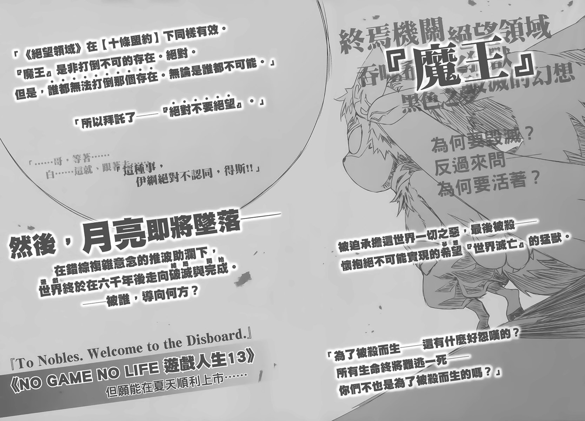
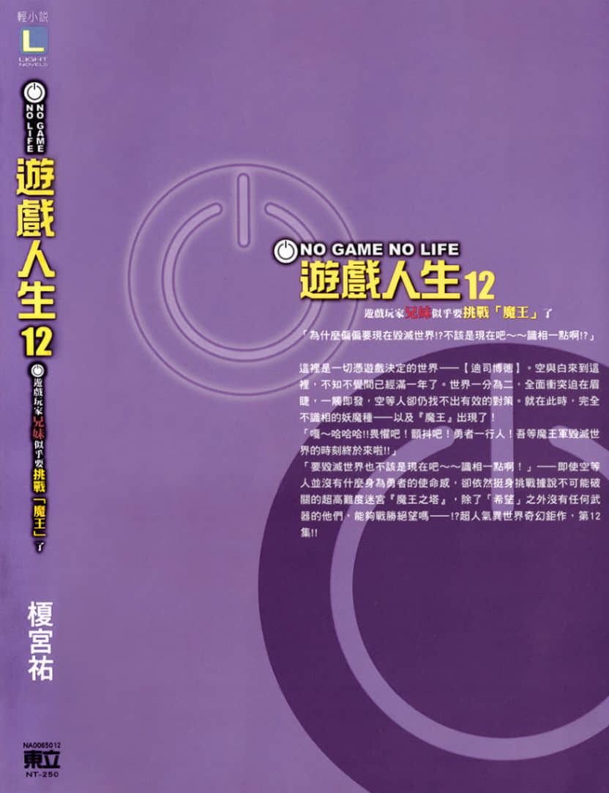
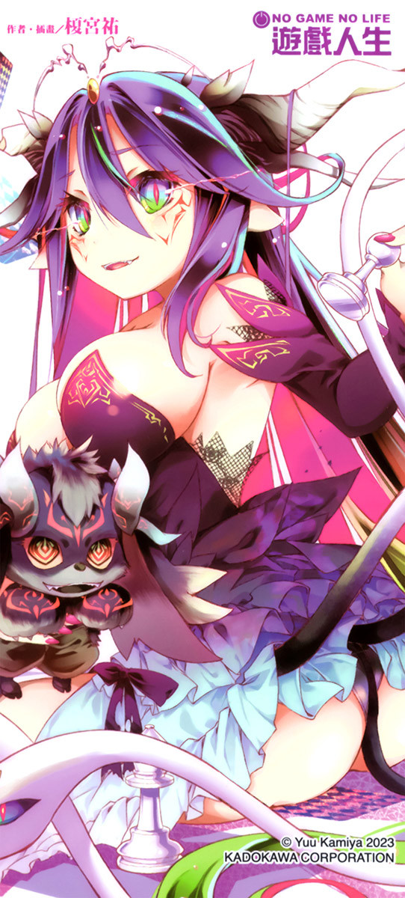

# 后记

> 来源：https://www.linovelib.com/novel/9/185624.html

从根本颠覆套路（世界）──也就是所谓的典范转移，光是提倡思想与信条是无法达成的。

唯有颠覆前提──也就是技术上达到突破，才可能达成。

……虽然笔者榎宫想不起来这是谁说过的话，不过当时就是因为这样，才会在本作中成立『十条盟约』这样的设定。

不过，一直到后来某一天，檀宫才真正亲身体会到这句话的意义。

那是二○二二年某月──与责任编辑O『开会讨论』的时候……

「不好意思……我恐怕无法在今年之内完成新刊……」

二○二二年──是《NO GAME NO LIFE游戏人生》刊载的十周年。

在这值得记念的一年，却无法来得及推出新刊……对于如此事实，榎宫打从心底感到过意不去，低垂着头道歉──但是，责任编辑O的反应却是……

「没关系。以『年度』的角度来说──二○二三年的二月为止都算是二○二二年！我们也都能体谅榎宫老师在疗养身体的同时从事写作。请别勉强自己，继续写作吧！」

责任编辑O这么说道……笑容与声音都迷人得让人不由得恍神心醉。

「谢、谢谢你……！为了来得及在二月发行，我一定会设法赶在期限之前完成！！」

「是。既然槚宫老师你都说『一定』了，我们当然不会质疑老师了。一起努力吧。」

宽容的话语让杠宫感激涕零，责任编辑的笑容与声音一样地可爱。

──各位觉得如何呢？

彼此尊重，坦承自己的失误，并互相容忍，携手合作。

这样的讨论会议，是何等地理性、宽容而和平啊……！

本来可能会是这样的──

『……老师，原稿还没好吗？（不耐烦）』

『我一开始就说过这样的截稿日期太强人所难了。我每天都有在写好吗？（不耐烦）』

『每天都有写的话为什么无法如期完成？（不耐烦）』

──无论罗列再多冠冕堂皇的话语，真相是不会改变的。

才能够如此和平理性地沟通，达成这样革命性的成就……！

──以上。大家好，我是榎宫祐。

这种火药味十足、话中带刺的讨论，反而才是理所当然的。但是！！

──没错，那就是……

即使如此，如果对方是有一双兽耳、声音可爱的美少女，当然能够冷静而宽容地对待了，不是吗？

因为有许多人的支持与帮助，我才能够走到这一步。

之所以能够这么和平地开会，达成如此革命性的成就，完全是因为技术面的突破带来的典范转移！

可爱就是正义。人类就是好骗的生物！

透过变声功能将声音变得可爱！！

希望能够在第十三集与各位相见，那么再会。

但是，如果来催稿的是声音可爱的巨乳女仆，你一定会打从心底感到良心不安吧！？

──最后，容我再次向支持我长达十年的所有人，表达最诚挚的谢意。

──在『虚拟实境』中开会！！

……我还是一样，一边写作一边留意着身体状况。

……假设你是责任编辑，负责的是写作速度慢得让人无奈、永远都不交稿的作家。

……假设你是作家，明明已经拚命在写作了，责任编辑仍然没血没泪地来催稿。

没错……也就是说，我们人类是有能力克服争执的。

由名为可爱的概念形成的生物──『猫』的存在更是证明了这个道理！！

──像这样！！

另外，第十三集的情节概要与部分草稿也已经完成，应该不会再让各位等这么久才是。

更具体来说！在虚拟会议室中，援宫与责任编辑O都使用可爱（虚拟形象）的姿态！！

如前面所说，本系列《NO GAME NO LIFE 游戏人生》终于迎来了十周年。

虽然刚才那么说，不过面对无论如何都无法在线上讨论的事，还是只能在线下开会讨论，结果不用几秒钟气氛就尴尬起来了。看来距离世界和平还很遥远，我打从心底盼望所有人类永远移居虚拟实境的那一天到来。

历任责任编辑、营业部、影像事业部、各相关同仁、朋友、家人……最重要的是，即使本作出刊的速度极慢，仍然支持本作的各位读者。

只要所有人类都进入虚拟实境的世界，变成美少女的话……！

也就是说──即使彼此都知道虚拟形象背后的是大叔，只要声音跟外表可爱，绝大多数的事都能原谅！

可以的话，还请各位务必奉陪到本作完结为止。

托了大家的福，这次写作的过程中没有住院──顺利地完成了第十二集。

『如果只要有作业时间就能完成的话任谁都能轻松当作家啦。（不耐烦）』

因此，这次又让各位等了一年以上，真的非常过意不去。

