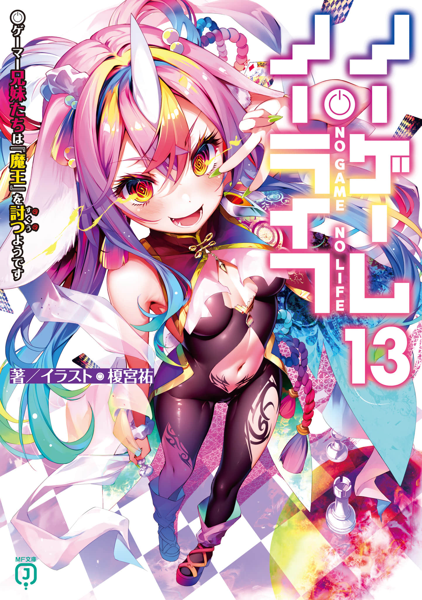
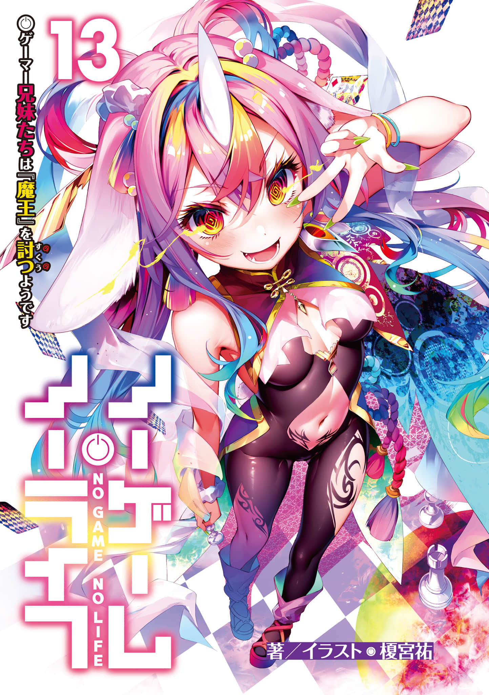
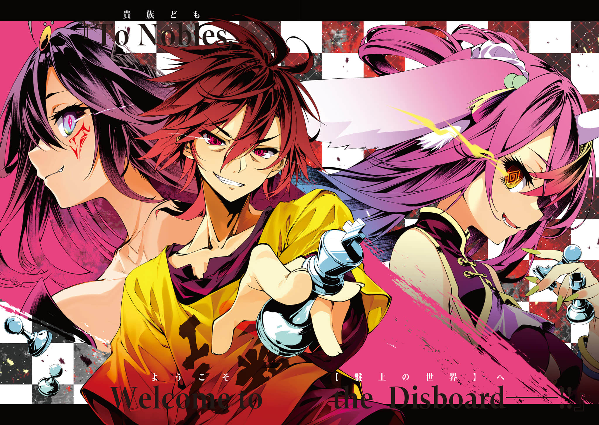
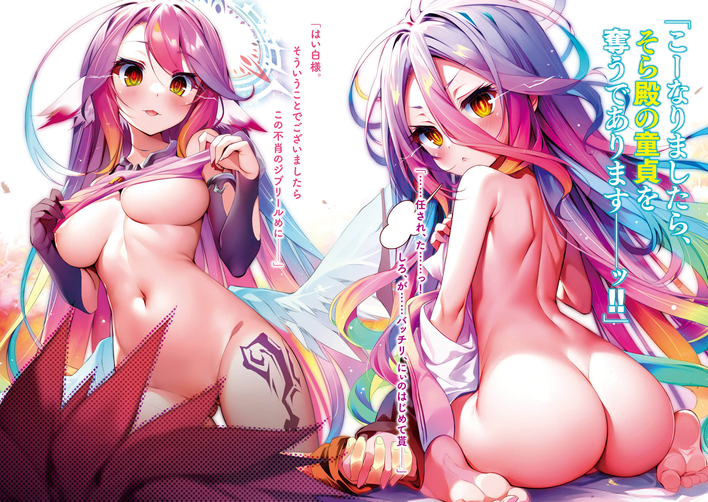
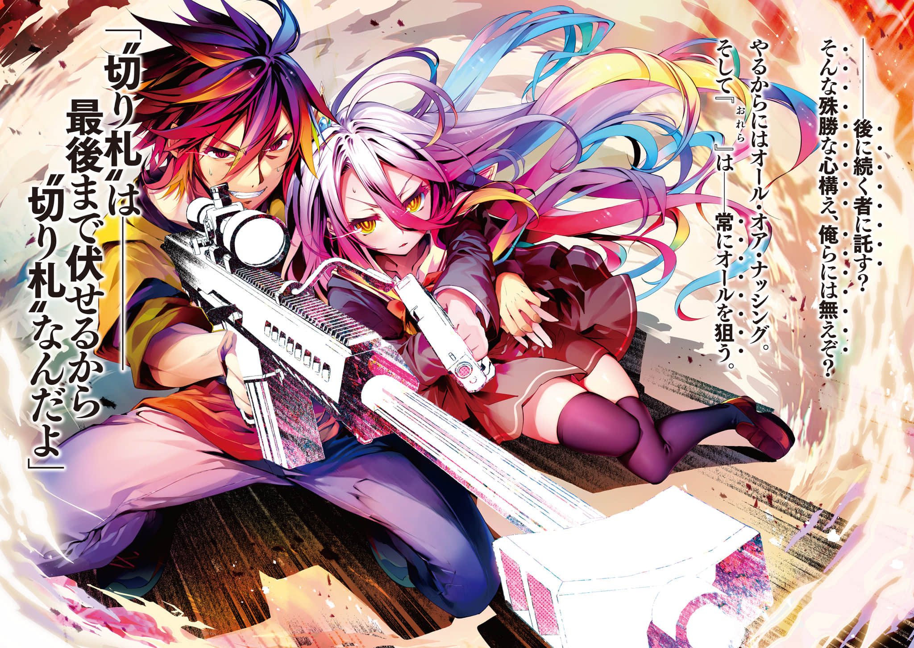
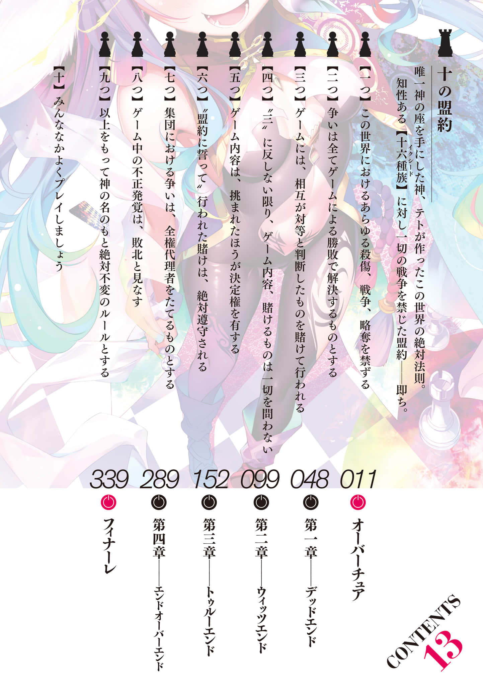

# 插图

> 来源：https://www.linovelib.com/novel/9/319155.html

网译版 转自 百度贴吧

翻译：黯然、九夜、a、CRDR、尘焱、加油努力_提不起劲、Levin（特典）

图源：Andromeda (LK＆TSDM ID：爱丽丝·莉泽)

校对：名濑渚

润色：名濑渚、黯然

纠错：黯然、ngnl群友

修图＆嵌字：hollow

——————————————

内容简介

「来吧──打倒魔王，迈向真结局吧。」

这里是一切凭游戏决定的世界──【迪司博德】。耸立于妖魔种之国的魔王之塔顶层，只以「希望」为武器挑战绝望的勇者一行人──空等人，已经逼近『魔王』的咽喉。然而决战之中，空被漆黑光柱吞没，无力地倒下。

「…………………………………………哥…………？」

所有人都怀疑起眼前的现实。就在这时，唯有空在逐渐淡去的意识中暗自窃笑。「……这样，终于凑齐了『胜利所需的拼图』。」

另一方面，在魔王之塔外──红月坠落。「加油加油，勇・者♪ 快点讨伐魔王♪ 急急如律令～」第三者的影子悄然逼近。超人气异世界奇幻钜作，第13集！！

