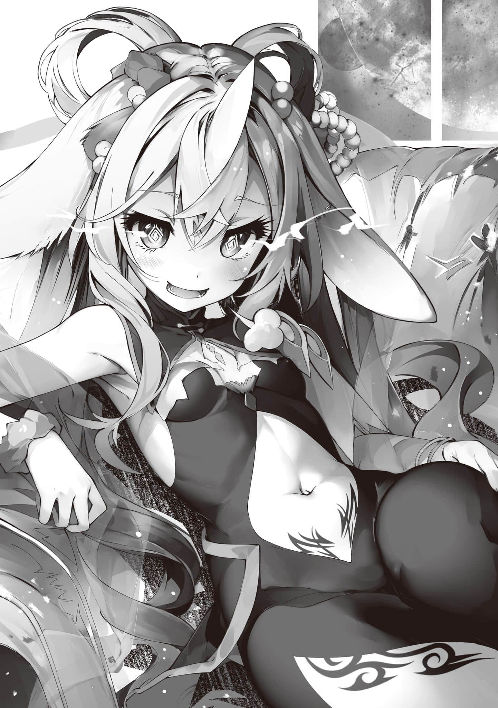

# 序曲

> 来源：https://www.linovelib.com/novel/9/326405.html

——魔王领《加拉德·高尔姆》……

是以世界最南端且面积最小的加拉尔姆大陆全境为领土的，由妖魔种所建立的国家。

这是一个由形形色色的部族(魔物)交织而成的国度。而在其首都，耸立着一座直拔天际——形态诡异的黑色巨塔。

那是昔日渴望世界终结的人们所孕育出的幻想种(怪物)——世人称之为『魔王』。

绝望领域、终焉之兽、漆黑噩梦——它是被冠以无数忌讳之名，受尽憎恶的怪物，而那座塔正是它的本体。

自悠久的远古时代起便屹立于此，不断向世间播撒绝望的这只幻想种——在它的『塔(身躯)』之中。

此刻，一场赌上世间所有生灵命运的战斗正在上演——

一方，是企图将世界推向毁灭的『魔王』，以及身为其造物的妖魔种们。

另一方，则是祈愿世界存续，以「希望」为武器发起挑战的勇者们。

这场胜负，将由亘古不变的规则来裁定——即：

——挑战者——『勇者』们，以最多七人为限闯入『塔』内。

仅凭「希望」作为武器到达最顶层(100)，击破『魔王之核』即为胜利。

反之，若「希望」枯竭，则判定为败北……仅此而已。

尽管这场战斗有着如此简单明了的规则，但至今为止，尚无一人取得胜利。

无论是在那个允许行使一切武力的六千年前——『大战』时期。

还是在因『十条盟约』而全面禁绝一切武力的今天。

谁也未曾成功讨伐『魔王』，留下的只有『塔』内堆积起的一座座尸山……

……或许，这也是命中注定的结局。

毕竟所谓的幻想种，就是「灾害」本身。

想要消灭灾害，本就是不可能的——

「这、这种事我当然知道啦！！只、只是一时忍不住——」

「【肯定】现在最重要的是主人列·举·喜·好·的·顺·序·。机娘被排在了第一位。【自明】在场全员中，本机的属性最符合主人的性癖。【宣言】胜利(Sieg)＊。……脸红」

——体长超过四百米的巨大沙虫从地底钻出，又再次潜回，如此反复……

就这样，依蜜尔爱因以漫天飞舞的碎岩为垫脚石，不断进行着跳跃。

「【解答】沙虫族。平均全长超过一百米。亦有记录表明，其中被称为族长的个体最大可生长至四百米以上————啊。【补充】族长个体在其口腔内——」

「哦～哦～还真是超级∙老套啊？也就是说只·需·要·瞄·准·那·张·只·有·在·喷·射·光·束·时·才·会·张·开·的·嘴·巴·内·部·是吧。这确实是王道战法，但当自己变成当事人的时候，脑子里就只剩一句『你他妈在逗我吗？』了吧!? 」

「那家伙超硬的，的说!? 就算全力揍上去也连一丝血皮都不掉，的说！！」

被不断突破人类极限进行急加速与急减速的机凯种少女·依蜜尔爱因背负在身，辗转腾挪在悬浮于半空的巨岩间，以高速不断翱翔于天际的两位勇者——空与白。

『好的，Master。简而言之，就是如您所见，它能从·嘴·里·发·射·光·束·的感觉』

「呀咧呀咧，我的妹妹啊。只要伪娘长得够可爱，哥哥我当然也能轻松吃下喔？但是……如果过分强调「男子气概」的话嘛……那啥，这当然只是我的个人的性癖守备范围，绝没有否定他人性癖的意思喔？比方说布拉姆，只要他（？）不是那种性格——」

然而迄今为止的二十八天艰苦奋战却没有任何用武之地，只因如今面临的危机甚至与「希望」的衰减都毫无关系＊。

先不提把这种玩意儿配置在第九十层的低级恶趣味，但不得不承认这确实有效。

一旦被卷入其中，无论HP剩下多少都必定当场去世，这片大地上根本不存在什么安全区。

虽然侵入这座绝望之『塔』已历经二十八天——但他们的「希望」仍未枯竭。

虽然空并没有特意去问，但依蜜尔爱因这段极其直观的解说——却在这时被打断了。

空在依蜜尔爱因背上被物理意义上甩得晕头转向，甚至没察觉到自己正在逃避现实。

而在她的背上，为了能在被强烈的加速度甩得七荤八素的状态下勉强保持清醒，空只能继续放声大喊。

没错……伴随着连同基岩都被击碎的巨响，从荒野的地底中破土而出的——是一只巨大的妖魔种。

「——所以我说啊……游戏的设定好歹给我统一一下啊！！本来以为在玩魂系游戏，怎么就突然蹦出来个怪猎级别的超大型怪物啊!? 」

在直觉发出警告的刹那，空仿佛尖叫着下达了指令。然后就——

且「希望」的枯竭便意味着败北——在这座绝望的巨塔之中，即是死亡。

「哈!? 事到如今这还需要问吗!? 且不说机娘、天使娘、鬼娘＊这种轻松拿捏的，我可是就连兽耳娘哪怕兽化程度再高都能驾驭的哟！！为何会觉得我偏偏会吃不下魔物娘，这反而让我完全无法理解了呀!? 」

「……哥、哥——呜……白，也要……吐——」

——时间回溯到数分钟前。

————…………

——或许是因为把类似灵魂的玩意儿都吐了个精光，稍微觉得畅快了点。

吉普莉尔是负责『空间转移』的——也就是撤退专员。必须保留她的力量。

然而，映入他们眼帘的，却是一片在这『塔』内本不该存在的，无边无际的荒野。

那是一条大到令人难以想象其规模——简直巨大得离谱的——让·人·浑·身·起·鸡·皮·疙·瘩·的·巨·型·蚯·蚓·。

这种单纯凭借质量带来的暴力虽然粗糙，但确实比至今为止遇到的任何BOSS都要更加棘手。

「～～空！！只要是个女孩子的外形其他的你终于都无所谓了是吗!? 」

空一行人到达了由BOSS妖魔种坐镇的第九十层。

『……小多拉？现在可不是问这种问题的时候』

那庞大身躯所散播的破坏力，让人根本无法在地面上立足——就连靠近都难如登天。

待在漂浮于半空的『袋子』里，身为天翼种少女的吉普莉尔寻求总结。

「……哥，连那种地步，都能接受的话……那为什么伪娘……就，不行——呢？」

没错……这种类型的敌人必定带有「弱点」——但是，

——发出这道声音的是，与被依蜜尔爱因背在身后的空与白一样。

「不～～～行啊啊啊感觉撑不住了才说的——呜呕呕呕呕呕～～～」

并且，已向最上层亮出了剑锋——直指『魔王之核』的咽喉。

『啊，空殿下空殿下？在下就算排第三也是完全OK的喔？』

「……不、不行——这个，依、依蜜尔爱因……快停，下……！」

他勉强掌握现状，并为了制定战术而拼命运转着大脑——

——紧接着，沙虫发射的光束再次爆闪，伴随的是震天动地的轰鸣声，

而不得不出击的依蜜尔爱因，其MP也在肉眼可见地慢慢减少。

「这个男人居然断言「只要是女的就行」了!? 就这样居然还能一脸正经地说出「我想受欢迎」这种话来!? 应该已经不是受不受欢迎的问题了吧!? 」

——嗯……仔细想想，好像现状确实是处于危机中？

「【拒绝】若停止回避机动，即意味着主人与妹妹大人将当场死亡。……能撑住吗？」

不过，警惕着四周的众人下一刻便察觉到了地面的震动。

这类似于灵魂的玩意儿，眼看着就要被名为「惯性」的物理法则给当场击杀了……

在这里，「希望」化为了HP与MP，更是攻击手段——成为了字面意思上的『武器』。

『Master，您当然不是这么想的吧？我怎么可能排在这种大型不可回收垃圾的后面品尝灰尘呢——』

「真是谢谢你了啊依蜜尔爱因！！不过我只是不靠大喊大叫的话就快要晕过去了而已啊～～！！」

巨大的蚯蚓——极其不讲理地——一次又一次地潜入地底，再猛然窜出。

此时，依蜜尔爱因的《技能》报告，肯定了空的思考。

这就意味着——如果继续保持常规的首发阵容，将面临根本无法躲避的攻击——！！

每一次窜出，都会将基岩击得粉碎。大地也被掀起，如巨浪般翻涌而来。

被驰骋于空中的兽人种幼女——初濑伊纲背在身后，此前一直处于昏迷状态的红发少女。

（注释：此处指经过了这么久的攻略，空一行人想必已经锻炼出了面对各种情况的适应力，并且，也应该已经学会了在HP所剩不多时，如何抵御绝望。）

再者，背着空、白以及史蒂芙，还要保持在空中的巨岩间不断移动——

（注释：Sieg，德语，胜利，名词。）

距离顶层只剩最后十层——已然突破了九成关卡的勇者们，此刻——

随后，她稳稳得落在了被震碎飞溅而起的巨岩群上并借力，避开了这一击，但是——

「【警告】主人有咬到舌头的风险。【赞赏】但主人哪怕身处此等绝境，也要优先进行吐槽，对于此等胆魄，本机体表示敬意。更加具体地重新确认好感。主人好帅。……喜欢」

「空的性癖什么的根本就无所谓啦～～～问题是现在到底该怎么办啊!? 」

（注释：其实这就是击龙枪，作者故意写反。）

在确认了一秒钟前那记横扫天地，甚至在地平线上掀起蘑菇云的攻击，并非是因严重晕G＊而产生的某种幻觉后，空便在肆虐的爆风中开始了阵阵惨叫。

————…………

千钧一发之际，背着空与白的依蜜尔爱因向着高空猛然跃去。

而且在它潜入地底的期间，攻击理所当然地无法命中？

伴随着史蒂芙的惨叫，以及不知何时已经上去给了一击的伊纲的报告。

就这样，对于正滔滔不绝地阐述着自己性癖的空，白与依蜜尔爱因，

（注释：这个其实就是指缇儿，因为最主要的特征就是有角，缇儿插画见尾页。）

这是只有身为兽人种的伊纲，以及吉普莉尔、依蜜尔爱因才能办到的事。

「——【报告】技能『个体分析』使用完毕。敌方弱点：咽喉内部·精灵性液泡」

「所以说现在根本不是搞这种事情的时候吧啊啊啊啊啊啊啊!? 」

「——缇儿，和依蜜尔爱因交换！！快躲——！！」

「都爬到九十层了，怎么还来了个纯靠粗暴地堆数值的恶心BOSS啊!? 马上都到最终BOSS了啊，好歹给我搞点更精致些的上位魔族那种的——具体来说，就是像谢拉·哈那种，无论如何都极具碎甲(爆衣)价值的美少女型怪物啊!? 你们这是不把游戏设计当回事吗，妖魔种(运营)喂——!? 」

两人正从口中吐出的是——……姑且修饰一下，在这里就文雅地表述为『灵魂』吧，总之……

就在那条恶心沙虫张开那好像是嘴巴的巨大器官的瞬间，解说戛然而止。

「是你先问我我才回答的啊!? 我哪知道该怎么办啊!? 刚才不也说了嘛，这玩意儿是得搞点兵器——而且是直接上《超级机器人大战》级别的巨大兵器(机器人)才能打的东西吧!? 」

（注释：晕G，被加速度甩的太厉害，大脑供血跟不上。）

「这种东西就算放在怪猎里，也不是单凭玩家自己和普通『武·器·』就能对付的玩意儿吧!? 好歹让人带上船啦、大炮啦、龙击枪之类的＊——哪怕就算提醒下要带『兵器』也行啊!? 」

这种离谱的回避机动，即便是地精种——缇儿也无法做到。

「【重启】其口腔内保有『精灵性液泡』。当该器官达到临界点时会释放出半流体物质——」

————…………

「所～～～以说那到底是个什么鬼啊!? 那条恶心巴拉的蚯蚓啊!? 」

「吉普莉～～～尔！！来个翻译——！！」

「对吧!? 这家伙就刚才，简直和哥斯拉一样，直接喷出了光束对吧!? 」

紧接着，这股地震逐渐加剧。不，更准确的说，是正·在·逼·近·。

本该守在这里的BOSS妖魔种，却也怎么也找不到踪影。

史蒂芙好像也终于恢复了意识，然而开口第一句话便是这般咆哮——但是，

——在一望无际的，破·碎·的·荒·野·——其高空之上。

也就是说——再这样下去，最终连躲避都会变得不可能。

但是——这种怪物，往往都有——

最后还从嘴里射出光束……别说直接命中了，就算只是擦到一点也会被一击秒杀的吧。

但是，天翼种(吉普莉尔)和机凯种(依蜜尔爱因)——这两人只·要·采·取·行·动·就·会·消·耗·M·P·。

勉强找回了些许抱怨余地的空，对着妖魔种——不，是对着游戏运营发出了抗议的怒吼。

——然而，这一次的勇者们，依然在『塔』中继续着艰苦的战斗。

听着依蜜尔爱因随后的生硬解说，空只能向「替补成员」——

没错——魔王之塔·第九十层……

就算能摸到它，那巨大身躯上厚重的表皮就是天然的装甲——几乎指望不上能造成伤害。

「啊咕咕嘎嘎啊呜哦哦～～～要死了要死了要死了要死了啊啊啊咕唉唉！」

————…………

甚至是『袋子』里的吉普莉尔以及地精种少女缇儿，都在聚精会神地倾听着。

——咕咕嘎嘎——就这样……

巨大沙虫的嘴巴第三次张开，而这一次，它的目标明确地对准了空这组。

……要攻击那里面？

以伊纲的近战攻击，根本来不及撤退就会被卷入光束的发射中。

就算是空和白的远程攻击，也必须到发射前一刻为止，一直待在光束的射击直线上——

往好了想——在依蜜尔爱因为了回避而产生的强大G力加速度下，失去意识。

往坏了想——被席卷而来的毁灭之力收割所有HP(生命)——想到这里，空与白不禁浑身僵硬。

然而——

「那种小事轻·轻·松·松·啦，的说！！空，白，交给我吧，的说——！！」

「————唉？————啊？等等，等等哦哦哦哦哦哦哦!? 」

伴随着这声惊呼，伊纲一把将史蒂芙扔了出去，随即蹬碎了空中的岩石，瞬间冲出！！

那是字面意义上以肉眼根本无法捕捉的速度，她一边蹬碎悬浮在空中的巨岩，一边不断加速。

看着向那眼看就要发射光束的巨大沙虫巨口直冲而去的伊纲——

「依蜜尔爱因！！和缇儿交换！！」

只晚了一瞬便领会了伊纲意图的空，架起了属于他的『希望的形状(武器)』。

也就是——『特殊弹投射枪』，并下达了指令。

——这是一个将背负着空与白的依蜜尔爱因替换下场，让他俩瞬间变得毫无防备的危险命令。

然而，事到如今，在场没有任何一个人会对空的指令抱有哪怕一丝的犹豫。

「白和缇儿准备技能！！——缇儿！你·能·模·仿·我·的·技·能·吗!? 」

「在下也不清楚!? ——不过，在下会尽·力·尝·试·的！！」

「在下办不到那种在半空中蹬着石头飞奔这种离谱的事在下根本做不到！！在下果然还是只废柴鼹鼠虽然早就知道了！！」

「唉唉唉那和依蜜尔爱因交换——啊咧!? 可是依蜜尔爱因背着我们几个就已经是极限了对吧那伊纲小姐怎么办!? 吉普莉尔要保存MP——唉，这到底该怎么办啊!? 」

啊啊，当然这也是原因之一，但是更重要的是——！！

（注释：吉普莉尔放技能依靠体内妖精回廊，刻印不具现。）

「不过看样子，白的『瞄准弹』所增幅的，只有我的『连锁引爆弹』啊!? 」

「伊纲小姐她！！已经失去战斗能力了哦!? 现在是做这种事的时候吗!? 」

「嗯！！现在伊纲小姐已经事实上失去了继续战斗的能力——」

将「近八成」的MP装填于其中的那一拳，最终化作了接近伊纲基础攻击力五·千·倍·的恐怖威力，毫不留情地狠狠砸进了巨大沙虫的口腔内部——也就是「弱点」上。

——虽说是打中了弱点，但巨大沙虫总体的HP绝对不算少。

空苦笑了一下，下达了指令——

就这样，悬浮在巨大沙虫头顶的HP条，竟被这一击生生蒸发掉了足足两成……

空如此断定并正要扣动扳机——然而！！

将森精种的刻印术式，甚至连天翼种(吉普莉尔)的魔法都能刻印化＊并模仿，这确实极具缇儿的风格。

而白则举起了『双持自动手枪』，仿佛在模仿空一般——将·枪·口·瞄·准·了·伊·纲·的·后·背·。

两发『连锁引爆弹』的爆炸存在着微小的时间差，以及一倍的伤害差。

没错——如果这只巨大沙虫再次动起来，能进行闪避的人手就不够了。

计算下来——巨大沙虫企图发射的光束，转化为四倍的伤害反噬到了它自己身上！

眼看着巨大沙虫终于如山体崩塌一般，轰然倒伏在地面上。

「————唉？唉，发——发生什么事了啊!? 」

巨大沙虫因剧痛发出的嘶吼声再次震颤了天地——

犹如出膛的炮弹一般，伊纲的拳头精准命中了巨大沙虫的口腔内部。

「就假设能安全着陆好了——要是被旁边这位巨大蚯蚓阁下卷进去的话也是即死的哦？」

这是一个极具伊纲风格的、简洁明了的技能——即「倾注全力的一击右直拳」。

眼看着伊纲就要被卷入光束的发射之中——

或许是因为大量消耗了「希望(HP)」吧，导致伊纲如今好像在巨大沙虫的嘴里暂时无法动弹。

「哈哈哈！！是「技能的协同应用(Synergy)」＊啦，是不是很经典的设定!? 」

「……第·二·形·态·，居·然·是·……召·唤·小·怪·……的BOSS……？」

甚至包括她自己在内——全·员·都·身·处·光·束·的·射·击·直·线·上·这件事，她都完全抛诸脑后。

史蒂芙满脸困惑，而在同一时间释放了技能的空与白，以及缇儿则露出了笑容。

无视所有小怪！！按原计划趁现在一口气解决掉！！

看着史蒂芙还在为已经无计可施，直直坠向地面的伊纲而担忧。

——不愧是史蒂芙啊。

「————说，说的是啊啊啊啊要死了要死了——缇儿小姐快救救我们啊!? 」

「……这么，恶心巴拉的……除了大，一无是处的，蚯蚓……！」

这也难怪缇儿会因为自己的技能而如此兴奋了。

但先把那放在一边，地面差不多真的开始有点恐怖了——面对妹妹这样的提醒。

就毫不犹豫地180度翻转，高声宣告要舍弃实际利益而遵从个人爱好！！

空不禁再次在心底感叹——真不愧是史蒂芙啊，随后回答道。

伊纲的技能——『直冲过去打爆它』——

紧接着，每个人都触碰了左手腕上的UI，将《技能》置于待命状态。

——心情可以理解。

【～～～～～～～～～～～～～～～！！！！！】

听到空的命令后，史蒂芙和缇儿补充道，空也夸张地点了点头表示同意。

——只让依蜜尔爱因一人出击，将其余所有人强制避难进『袋子』里。

「明明长了那么大个块头!? 竟然还搞这种阴险的设计(机制)，拜托，你难道不觉得丢脸吗!? 」

如果被这具庞大身躯倒塌所引发的大破坏卷入其中的话——

——去他的，谁有空陪你玩这个！！

巨大沙虫发出了响彻天际，仿佛要撕裂空气般的惨叫声。

却被空、白，以及缇儿那里响起的——「三声枪响」给完全盖过了。

即使瞬间造成了如此夸张的伤害，却依然未能阻止巨大沙虫发射光束。

「——『直冲过去打爆它』，的说——！！！」

「……哥……虽然我懂，欺负史蒂芙……很有趣……但是差不多……」

于是，在白《技能》的加持下，威力翻倍的『连锁引爆弹』足足有「两发」！！

最后是缇儿的第二个技能——『模仿刻印』……

总之，空一看到那美·少·女·型·的·蜥·蜴·魔·物·娘·，

【～～～～～～～～～～～～～～～～～～～～！！！！！】

能·够·模·仿·己·方·最·后·使·用·的·技·能·的·技·能·——！！

「啊，对了史蒂芙。我·们·其·实·也·一·直·在·往·下·掉·哦，差不多也该想起来了吧」

但是——

「——啊，唉唉唉!? 等一下，怎么好像地面在动啊!? 」

看着刚才还萌生出一点自信，转眼便烟消云散大呼小叫的缇儿和史蒂芙。

她那声咆哮伴随着冲击波与震耳欲聋的爆音——晚了一刹才传到空等人的耳中。

能够使·空·的·下·一·次·攻·击·必·命·中·于·瞄·准·的·位·置·，并使威·力·翻·倍·的技能。

正是凭借这种「希望」的形状——依其本质，她成功模仿了空的『连锁引爆弹』——！！

就这样，依蜜尔爱因优雅地从高处着陆，且游刃有余地躲过了巨大沙虫倒下所带来的破坏，甚至连漫天飞舞的巨岩雨都全部闪避完毕之后，再次——进行人员交换。

能够将敌人用于攻击所消耗的希望(HP)，转·化·为·对·敌·人·自·身·造·成·伤·害·的技能。

但是——

「好了——赶紧趁这家伙傻乎乎地张着嘴倒地不起的时候，一口气干掉它！！」

白的第三个技能——『瞄准弹』……

「已经根本没有任何动力继续对付这玩意儿了啊！！赶紧把它解决掉！！」

「所以让这个大家伙再动起来的话，我们就恐怕难以应付了！！」

「依蜜尔爱因——和所有人交换。靠你了」

——没错……超过四百米的庞然大物，正要倒下。

围绕着空等人的地面上，突然出现无数隆起，引得史蒂芙发出了阵阵惨叫。

从地底冒出来的小怪——好像是蜥蜴人的亲戚？

虽然明白捉弄史蒂芙这个纯善的化身很有趣。

在口腔内部引发的剧烈爆炸，将其HP条一口气削减到了不到一半。

没错……或许是因为大量消耗了「希望(HP)」，此刻的伊纲依然无法动弹。

「等——伊纲小姐她——!? 」

果然，白提升威力的Buff只能作用于空的攻击上——

倒伏于地的巨大沙虫面前，空与白、史蒂芙以及缇儿四人，各自架起了自己的『武器』。

「可、可是伊纲小姐！！她还无法动弹啊!? ——要掉下去了哦！！」

而空的第五个技能——『连锁引爆弹』……

——就在准备全力开火的那个瞬间。

（注释：此处见地精种那一册关于缇儿和维格的幼时约定。）

「……就算，这样……缇儿的『模仿刻印』……也是超·模·技·能·，＊了，吧？」

——本以为是这样……

「居然只需固·定·消·耗·一·成·的·M·P·就能模仿空殿下的技能了耶!? 而且还能连发喔！！在、在下——难道终于要从废柴鼹鼠毕业了吗!? 」

伊纲消耗了八成MP——凭借着倍率高达百·分·之·几·十·万·的这种离谱的威力，才勉强削掉了两成。

没错——

这种彻底将自己的安危置之度外，只顾着担心伊纲安危的史蒂芙的悲鸣——然而。

……顺带一提，距离地面已经没多远了，还有就是——

这·是·一·个·根·据·所·消·耗·的·任·意·M·P·比·例·，使·其·威·力·呈·指·数·级·暴·增·的·重·拳·。

对着眼前那条被干趴下了的巨大沙虫狠狠地嘲讽了一番后，空在短暂的思考后咂了下嘴。

「好嘞！！先把小·怪·扫·荡·干·净·！！我要把你们扒得连裤衩都不剩，做好准备吧!? 」

众人也纷纷将枪口对准了巨大沙虫的口腔内部，准备倾泻出带有技能的最大火力——

那分明是有什么东西——嘛，想必是敌人吧——就要从地底钻出来的预兆。

（注释：最简单的例子就是元素反应。）

缇儿与瞬间被吸入了『袋子』中的依蜜尔爱因进行了交换，然后举起了她的『大锤』。

而空与白，再加上缇儿的技能所打出的伤害，竟然还超越了那个数值。如果沙虫再想发射光束，下次或许光靠缇儿技能的连发就能把它彻底干掉！

——下一刻，

与发出这般迫切吼声的空和白一样。

紧接着——

————…………

————…………

「吉普莉尔！！依蜜尔爱因！！和史蒂芙交换！！把MP消耗压制到极限，来辅助我和白还有缇儿！！史蒂芙去『袋子』里给伊纲进行「恢复」！！」

随着空的指示，吉普莉尔和依蜜尔爱因瞬间出现。

而作为替换被吸入『袋子』里的史蒂芙，却仍然在『袋子』里提出了抗议。

『——啊，您的意思是想让我对伊纲小姐也做那·个·吗!? 仅仅是为了空你的个人趣味!? 别开玩笑了！！唯独这次请容我严词拒绝!? 』

没错——那是十八天前，仅仅花了三十分钟就让空和白的MP迅速回满的「绝招」。

除了空、白，以及作为当事人的史蒂芙之外，目前还没有人知道其中的细节——但是。

面对表示坚决不从的史蒂芙，空只是夸张地点了点头。

啊啊……这当然完完全全是出于他个人的恶趣味。

但是本大爷——说来惭愧，鄙人十九岁·处男空！！

你以为我连临时瞎编一套「倒果为因的论证」的本事都没有吗——!?

「听我说史蒂芙——要在对付这么多美少女，不对，小怪的同时，还要确保完全削光巨大沙虫剩下的HP，这种火力我和白还有缇儿是不具备的。所以至少要让伊纲的MP恢复到能够行动的程度！！「我们会为你争取这段时间」————！！！！！」

「……哥，果然厉害……」

「啊啊Master！！真是毫无破绽，堪称完美的倒果为因，除了敬仰之外别无他言！！」

「【赞赏】实测0.24秒内完成无法反驳的逻辑体系构建。惊异的思考速度。主人好厉害」

「真是个完美得让人搞不清原本想做什么了的绝妙的借口是也!? 」

『就算想要强词夺理，好歹也请努力下别让人察觉到自己正在被骗好吗——!? 』

——总之。

就这样将尊敬与谴责集于一身，获得了完美无缺的大义名分的空。

怀着终于找回来的动力，面对着逼近而来的蜥蜴型美少女军团，

「好了，我们前进吧诸位！！为了完成我的美少女型妖魔种图鉴——！！」

如此一来——宝箱的产出极端偏向『防具(由HP转化而来)』也就是必然的结果了。

首先——道中的小怪变得异常强大，这当然是原因之一。

---

■■■

考虑到众人自身《技能》的特性，只能说这些装备的实用性实在是很低——

仅仅是在其中行走，不断前进，本身就已等同于在与绝望交战了。

别说循环再生，甚至连被风化都没有任何的希望(指望)余地——一·个·真·正·迎·来·了·终·焉·的·世·界·……

把整整一天的精力，全都耗费用来进行极限训练，有氧运动以及韧性拉伸上……

「……既然这样，那制霸全楼层的目标要不就算了吧？……效率真的太低了」

「「————!? 」」

说到底，『装备』是由在途中耗尽HP或MP的过去的勇者们的「希望(HP·MP)」所化。

紧接着连伊纲也将期待的目光投向了史蒂芙——

如果加以有效利用，就能大幅省去史蒂芙口中那些所谓的「无用功」，可她却一直拒绝采用这种方法……

为什么直到现在才想到这一点!? 空和白都对此感到一阵错愕。

「……健康的人……一辈子，都要做这种事，吗……？那样的人生……真的好吗……？」

没错——就是那幅光景。那片古战场的遗迹……

「……呐呐，史蒂公。「那个」……再对我做一次吧，的说」

怪物图鉴理所当然也要填满，如果那上面都是美少女魔物娘的裸体的话，那就更不用说了！！

啊啊……因为这全都是游戏机制(设定)，所以确实没办法。

————，

「让你们上瘾了那还得了!? 我绝对不会再做了哦!? 听到了没!? 」

史蒂芙叹了口气——不仅如此。她的话语中还流露出一抹难以掩饰的沉重。

一想到如果一辈子都要这样持续下去的话——那还是就算不健康点也没关系了。

而在前十层以外获得的、偏向攻击(MP)系的『装备』，居然只有区区「两件」。

「享受那个的就只有空你一个人好吗！！拜你所赐我还白白浪费了不必要的开支啊!? 」

那是将迄今为止入手的『装备』的获取位置以及已确认的效果进行了汇总的表格。

「……如果不做那么多无用功去把妖魔种的各位脱光光，恢复起来应该也会轻松很多的吧？」

而这，也是在场所有人——甚至包括白在内，都抱有同感的事情。

正当空高声地重新确认着自己的动力——「希望」的源泉之时——

此时，与空等人不同，天翼种与机凯种只能依靠进食来持续摄取「希望」，即『阳精』。

——等通关了这个游戏后，就再也不干了……

伴随着枪声的响起，其中一只被剥得精光，以此为信号，众人拉开了大混战的序幕…………

——能在短时间内让空、白甚至伊纲都恢复的——「那个」……

「这最重要个鬼啊！完全无所谓!? 」

——没错。

一边满面笑容地回击道：保持高昂的干劲去挑战才是最关键的。面对这样的空，

能到达上层阶级的人本来就屈指可数，更何况……

「……不管把据点弄得多舒服，这种重复性作业带来的疲惫感还是习惯不了啊……」

——魔王之塔·第一层『准备之间』……

……「话虽如此」，尽管已经考虑到以上所有因素，空还是忍不住发牢骚。

时隔十六天未见的毛球——『魔王』突然出现，并高声喊道。

「最重要的是要补全我的美少女型妖魔种图鉴上的爆衣收集——！！」

……啊啊。确实效率很差。

「……嘛，不过要是对「那个」上瘾了也确实很麻烦，算了算了」

那简直就是世间一切的恶之希望汇聚在一起，仿佛在蠕动翻腾的……世界。

更具体地说——就是史蒂芙对再次被剥得精光这一事实提出了抗议。

拖着刚泡完晨浴的身体，空和白却依然在发着牢骚……

然而，空只是无奈地摇了摇头，掏出了智能手机。

身体状况明显变好了。心情也不错——但即便如此。

自游戏开始已经过了三十天，不断追求生活质量＊的这里，如今已变得宛如豪华露营地一般。

「啊！对啊!? 史蒂芙，你不是几十分钟就能恢复「希望」的吗!? 」

史蒂芙的脸颊涨得通红，坚决地表示拒绝。

这样一来不就可以省去肌肉训练那些烦死人的破事了吗!?

「（吧唧吧唧）『装备』是过去的挑战者们的「希望」所剩下的残渣，所以这是理所当然的嚼嚼」

没错，比方说这样——

真要说的话，对比现在这种恢复希望得白白浪费两天时间的方式——甚至能一晚上就全恢复满不是吗!?

从配备空调的帐篷，到一体式集成厨房以及吊床，再到可以生火的场所

那么理所当然随之而来的就是第二天的全身肌肉酸痛。空和白不约而同地想到。

一种不容置疑的生理厌恶油然而生——明天或许就要面对更加凄惨的景象(场地)……

结果就是——在前十层拿到了两件『装备』——

（注释：原文QOL，Quality of life。）

「……只有在最开始的开荒期才能拿到最强力的『装备』，这作为游戏来说到底算什么设计啊？」

「绝·对·不要!? 倒不如说我之前就已经说过了绝对不会再做第二次的对吧!? 」

原本每天能攻略十层楼的推进速度，在到达第八十一层之后便急剧放缓了。

提升20%攻击力的手镯，以及-50%MP消耗的戒指。

「呵呵哈哈哈哈！！突破九十层——干得漂亮，容本大爷稍微夸奖你们一下吧勇者们！！」

「嗯！本大爷就知道你们一定会来到我的面前!? 真、真的哦!? 现在终于只剩下本大爷了！！既然都来到这里了，剩下的那九层也都随便努力下赶紧搞定吧。本大爷可是闲得要死——所～以～说～你这家伙也差不多给我适可而止啊你这小狗!? 」

看着拉了拉史蒂芙的衣袖，并如此嘀咕着的伊纲，空和白不禁瞪大了眼睛。

仿佛在宣告，所谓的灭亡，即是连时间本身都随之死去的，绝对的寂静——

但更重要的是——八十一层之后的——那片景象(场地)，会让人不由自主地失去希望……

进一步说——人类种以外的其他种族，几·乎·不·会·被·妖·魔·种·的·攻·击·打·中·而掉血……

那么必然地，绝大多数勇者都是因为「MP耗尽」而中道崩殂的——

「——不！！越是这种你觉得「反正肯定啥都没有」就随手跳过的地方，往往就隐藏着传说级(Legendary)的道具啊。等事后才知道了肯定会抱头痛哭的！！制霸全楼层，这是决定事项！！绝不更改！！而且最重要的是——！！」

将在九十层用掉的『防具』删除，确认了还剩着的『装备』后——

是帮忙分担一部分MP消耗的项圈，以及攻击力翻倍的项链……仅此而已。

空一边欣赏着顺利入手的蜥蜴少女们的爆衣视频。

——没错，正如进食动作完全没停下来的吉普莉尔和依蜜尔爱因所推测的那样。

……啊啊，这一整套流程确实很健康。

「……啊……嗯……作为、人来说……确实有点……呢……？」

直到击破九十层的BOSS为止——他们总·计·被·迫·中·途·撤·退·了·两·次·。

「咔嚓咔嚓。【推测】到达高层者。少数。「希望」的剩余量也会变少咔嚓咔嚓」

「……只要史蒂芙，每天、每·时·每·秒·……都做「那个」的、话……就能瞬间·恢复哦」

说实话，就连空也觉得心情沉重——但是。

一切生物都消亡殆尽，只有连腐烂都不被允许的尸体堆积成山，一直延伸到地平线的尽头。

把坚持不肯退让的史蒂芙晾在一边，坐在吊床上的空和白拿起智能手机。

于是缇儿、吉普莉尔和依蜜尔爱因这三人，也终于开始对在『袋子』里进行的「那个」到底是什么，产生了强烈的好奇——但是，

切换画面后，空打开了一个『列表』——

「……装备属性还真是寒酸啊……一·般·来·说·，越·是·接·近·最·终·B·O·S·S·，装·备·的·品·质·应·该·越·高·才·对·吧·」

「要我说多少次你才懂啊史蒂芙？这个游戏的关键在于「希望」——也就是心态……哪怕看起来像是在绕远路，也要尽·情·享·受·途中的一切——这才是攻略的关键！」

正为了给这两个暴食大户准备食物而忙得团团转的史蒂芙没好气地吐槽道。

能到达那里的人，理所当然地——他们在那时的「」剩余量也已经所剩无几了。

这是为了恢复在『塔』的攻略中所消耗的「希望(HP)」——也就是恢复精神状态，或者说，心态(Mental)的重复性作业。

既然要玩游戏，就必须全成就解锁·白金奖杯全收集(Trophy Complete)。此外一概不认！

伴随着妖艳的妖魔种女性，谢拉·哈无声无息地送来今日份食物。

以及那位自称盖那乌·伊的优雅骷髅……在两人的旁边——砰的一声。

空仿佛要将一切阴霾都挥去一般，故意提高嗓门，坚定地做出了总结！

突然——

理所当然地，空开场就毫不客气地轰出了『装甲破碎破甲弹』。

过了六十层以后，宝箱，以及里面的内容物就明显减少了，空对此感到十分不满。

在赢下了那场激烈至极的九十层BOSS战，并如往常一般回归后的——第三天。

而且，如果按照惯例的话，明天要挑战的第九十一层——场景(场地)又会再次变化。

甚至有浴缸——连桑拿房都给装上了。在这个极尽舒适的绝望之塔内据点中——然而。

——事实上最后因为沙虫战被拖长，导致又消耗掉了一件『防具』。

众人凝视着空，他们那同样难以掩饰的情感所凝聚的视线与沉默，也正诉说着这一点。

「你这混蛋为啥这么久都不来，的说。既然是伊纲的东西那就要每天都来，的说」

「都说了本大爷才不是你的东西啊!? 别咬别踹快——放——开——啊!? 」

——就这样……不但带来了「这之后已经没有其他BOSS了」的宝贵情报。

而且明明知道会被伊纲纠缠，毛球还是因为想要人陪而跑了出来。

但是……除了空和扑上去的伊纲之外，在场的其余人都露出了复杂的表情。

「……你这家伙，果然散发着「好的味道」，的说。绝对不是什么坏人，的说」

「对着魔王说不·坏·是什么意思!? 本大爷可是魔·族·之·王·！这简直是侮辱啊!? 」

看着如此激烈反驳伊纲的话，并慌乱不已的『魔王(布偶)』。

除空以外的众人，事到如今终于产生了一种奇妙的恍然大悟之感……

啊啊——怪不得伊纲会一直说『魔王』身上有「好的味道」＊。

（注释：这个好的味道和好闻的味道在日语里完全相同，但是如果加了双引号就含有了别的意思，在第十二卷的时候有出现过，但是当时是没有引号的。）

也怪不得伊纲会如此奇妙地亲近它——现在终于能理解了……

——『魔王』……

被迫出生，又被迫独自承受世间所有的仇恨与恶意，

然后又被所有人所憎恨——只为了被杀害……一个仅为此而诞生的幻想……

它如众人所愿般做出遭人憎恨的举动，如众人所愿般最终祈求着自身的死亡——

那它岂不是——比起犯下了孕育出『魔王』这一罪行的，这个世界上所有的生灵来说。

是唯一没有罪孽……而且比任何人都要更纯粹无暇的存在吗————？

「～～～唉—不管怎样！！赶紧给我爬到最顶层来，听到了没勇者们！！」

这样抛下一句狠话后，毛球就像出现时那样「砰」地一声消失不见。

「……怎么了？找我有什么事吗？」

目送着那些背影离去，大厅陷入了短暂的寂静——

从谢拉·哈的行为，以及『魔王』的存在及其本质来看——这是个不容置疑的事实。

除了极少数的真正例外————

「……哥？……哥，到你的……回合、了哦？」

克拉米和菲尔两人也是如此。

年迈的兽人种——初濑伊野，也冷静地眯起了眼睛。

「这片污秽的大地，终于要被主上那赤红的圣光所净化……」

——红色的月亮，正在缓缓下坠。

然而，在魔王军·统合参谋本部议长——盖那乌·伊的房间内。

「呜呜呜呜呜又被毛球给跑了，的说！空，白，一决胜负，的说！！」

况且在场的所有人都深知，空绝不是一个「谜语人」。

他们也都知道，空在什么关键时刻，会成为这样的一个谜语人。

「……是月咏种的入侵吗？」

「……啊啊——终于……要来了——」

「月咏种的暗中谋划先不提～……明面上居然会连·着·整·个·月·亮·一·起·下·来·，这我是真没想到呢～♪」

（这样一来——从·原·理·上·来·说·，应·该·没·有·任·何·人·能·够·战·胜·『魔·王·』才对……）

也就是——那位月咏种少女。

「～～～正合我意！！要吃多少我都做，随便点单尽管来吧！！」

……能·够·以·零·牺·牲·确·定·胜·利·的·，那·唯·一·的·一·招·——应·该·还·……

还有一位——而且是理所当然……

因为如果打倒『魔王』就意味着「杀死它」的话，空是绝对不会这么做的。

幼小的两人敏锐地察觉到了空脸上微微流露出的不安神情。

——而谢拉·哈，伴随着蛇尾同时凑近窥视空的眼眸，与空交换了一个眼神。

巨龙再次安静地进入了梦乡……

然而，即便如此，空还是——还·没·能·够·找·到·……

它留下这句意味深长的话后，同样优雅地行了一礼，转身离去。

然后用闭着的另一只眼窥视未来(世界)，心绪慵懒地思索着——

事到如今已无人再怀疑空，众人纷纷忙碌起来，为明天的攻略做准备。

「……不，失礼了。我只是想感受一下，向魔王大人发起挑战之人的那份意志罢了……」

事到如今才终于发觉，自己终究也不过是个愚蠢之辈罢了——

——就是那无·法·明·说·的·时·候·。啊啊，如果说出口的话。

意料之中——只不过规模之大超出了预期。

龙精种『聪龙』雷金莱维用睁开的一只眼仰望现在(月亮)。

空就这样傻兮兮地躺倒在吊床上，和白一起打起游戏来。

「……？空你在发什么呆，的说？」

即使收到了大惊失色的部下的报告，金色狐狸——依然优雅地坐在桥栏杆上。

——没错。反过来说。

空以那种仿佛要窥视颅骨深处的目光回应着，然而——

比如——东部联合。

就算他们明白其中的原因，却也无法理解其背后的「意义」——

紧接着——

没错，一边陪白和伊纲……和两人打着游戏，空一边不动声色地思考着。

东部联合——兽人种全权代理者『巫女』，就这样发出宛如摇铃般清脆的笑声。

---

■■■

又或者比如——艾尔齐亚共和国。

那个冒·用·了·这·个·样·子·与·名·字·的人——脸上浮现出一丝若有若无的笑容。

【焉龙(亚兰雷夫)……汝究竟是错还是对。看来吾似乎到最后也无法知晓】

这是个被·精·心·设·计·过·的游戏——甚至可以说是「作弊游戏」也不为过的，有人故意安排好的游戏。

「……一看就知道啦……真是吵死了」

「那么，就按照『魔王』大人的意愿，为了尽快前往最顶层——现在开始全力放松！！」

————就·不·再·是·必·胜·之·局·面·的·关·键·时·刻·————

【——果然。变成这样了吗】

——目不转睛地……

「不对哦？这恐怕是月之神(泽娜斯丝)亲自降临了吧。还真是盛大的登场呢」

如果自己的猜测是正确的话——在超越了原理上的不可能之后，理应存在的

「……哦？啊——抱歉抱歉。我刚才在想最终BOSS战的事情。呃……到哪了？」

她笑着的同时，也警惕地眯起眼睛仰望天空……

——为了维持世界的均衡，虽不情愿但还是借出了名号加入了战线那一侧——但是。

啊啊，即便有能够冷静地仰望这一事实的人——但是。

——不过，如果我猜测的是正确的话……

那是一只——站在世界之巅，环抱着群山的白色巨龙。

无一例外，所有人都或多或少地陷入混乱之中，只能仰望天际。

透过执务室的窗口，不禁无言地仰望着那逼近的红月……

因此——龙精种最后的【王】雷金莱维只能自嘲地笑了笑。

——看来应当摘下这「聪龙」之名了，她想。

大地上的所有生灵，无一例外，都陷入了混乱之中。

「……菲，这也是你预料之中的吗？」

「哇哦是酒！！终于到货了！！哈～明明没有饮酒文化，妖魔种的文明水平还真是让在下惊叹————难～～难喝死了!? 这是工业酒精吗!? 」

联邦一方的诸国自不必说——就连爱尔文·加尔得，乃至加拉德·高尔姆也是。

——真的要打倒『魔王(那个)』吗？对于这件事，没有任何人提出疑问。

空用——这并非谎言的话语，笑着将那一丝不安挥散————

艾尔齐亚王国、阿邦特·赫伊姆、奥仙德以及斯普拉托利亚。

「巫女大人！！镇、镇台府传来报告——红月正在坠落！！」

啊啊……这个游戏，有着明确的胜利法吗——不。

「你们瞧瞧，今晚这月亮多漂亮啊。这样的夜晚，不正是赏月喝酒的最佳时候吗？」

---

■■■

除了身处魔王之『塔』内的空等人之外——几乎所有人。

——几乎在同一时刻。

————，

跨越国家与种族的界限——不，甚至是超越了十六种族这一范畴。

面对着那字面意义上——天·空·要·掉·下·来·了·的，前所未有的光景。

「【要求】改善阳精摄取速度。【推荐】高吞咽效率的料理。【点单】来一份小碗荞麦面」

「啊，小多拉？白米饭差不多已经吃腻了，请弄些面食之类的来吧♪」

又或者是，在说出这句话并仰头饮酒的巫女身旁侍奉之人。

————，

她朝着那坠落而来的天空闭上了双眼。

与地上各处一样，同样陷入混乱的魔王领《加拉德·高尔姆》——

均衡的崩溃，同样也是所有可能性的世界(世界)中所共有的，不可回避的趋势。

回想起昔日那些为·了·追·求·不·可·知·未·来·而·奔·赴『大·战·』的·同·胞·们·，嘲笑他们愚蠢的日子。

除了那个将这份信赖揽于一身的——空自己——

---

■■■

「…………」

能够保持平静并抬头仰望的，实在是极少数人而已——

然后深深地，极其恭敬地行了一个无言之礼后追随毛球离去。

被一分为二的世界——，这·架·天·平·究·竟·会·向·哪·边·倾·斜·，连·这·点·也·…………

凝视着空的眼眸的是——那具有着空洞眼窝，举止优雅的骷髅。

这场游戏——胜·利·已·然·板·上·钉·钉·。

没错——所有的国家，所有的种族。

感受着不断膨胀的主上的气息，以及那红月逼近的威严光辉，她眯起双眼祈祷起来。

啊啊，她怀着深切的理解，从室内的窗户仰望月亮——然后。

……啪嗒，一声。静静地关上了窗户，拉上了窗帘。

就好像是为了避开自家主上的视线一般。

粗暴地，像脱掉不合身的衣服一样，摆脱了骷髅的伪装。

变回了额上长着一只独角的兔子少女的模样——然后。＊

（注释：下面和后文兔子的发言混合了古文、网络梗、辣妹等元素。）

「且说——可否速速(麻溜点)给吾了结此事!? 这身乔装(破变装)当真荒唐可笑(无语子)——实在令人忧烦＊(整个大破防)好吗！！」

（注释：pien，2020年网络梗。）

就好像真心觉得烦透了似的，她一头栽倒在沙发上，胡乱地挥舞着手脚大喊大叫起来……

「噫～～～当真下贱粗鄙(Low爆了)草草草＊！实在荒谬(恶心心)！若非顺应主上(老大)＊之计，吾怎会去扮作此等下等之人(贱民)的模样(Cosplay)，简直滑天下之大稽(离了大谱)……」

（注释：代表笑的草。）

（注释：老大p。）

——说到底，为什么偏偏要扮成这么个骷髅啊。

哎，虽说是因为在『智之谢拉·哈』之后，地位最高的就是盖那乌·伊了。

可是啊。那可是骷髅(skull)啊，是骸骨啊。竟让吾(人家)亲自来扮!?

「再者说～～这家伙的膳食，简直荒谬绝伦(没谁了)!? 」

说着，她瞥了一眼桌上摆着的，原本属于盖那乌·伊的餐食。

「当然啦，骸骨当食何物，吾原本亦是不解(人家也很迷啊)——可这「石灰、骨粉与磷灰石」的意图何在(到底是什么玩意啊)？这不也是骨头么!? 既如此，直接啃骨头啊！哎呀，纵使真端上骨头来，吾亦会十分苦恼(懵圈)的！啊～～～好歹赏吾些甜食吃吃吧～～～真是～～～～实乃荒唐至极(无大语)……忧愁(杯具/pien)过后唯剩郁闷(餐具/paon)＊了……」

（注释：paon，比pien更甚。）

她情不自禁地——开始由衷地为勇者们加油起来。

——又或者，如果连「更进一步的发展」——也一并期待的话，则是自己太高估那个男人了吗？

月咏种少女那双眼眸中所蕴含着的『诳气』。

这场游戏，无论以何种形式决出胜负，这枚『妖魔种的棋子』——都已然落入此手。

——嘛……若说毫不介意(不在乎)，那便是虚言(在骗自己)了……？

最终得出「好像没啥问题」这一结论的月咏种少女。

也就是落入《月神》泽娜斯丝大人的手中，这已经是板上钉钉的事实了——

故而，为了自己，亦为了主上——月神大人。

虽然隔着虚假的皮囊，却与他——与那个名叫「空」的卑贱之人(下头男)——四目相对。

自己「在其眼眸之中所见之物」，究竟是幻觉还是真实————

没错——他们或许真·的·能·够·击·败·『魔·王·』——那些勇者们。

「加油～加油～勇·者·大·人～♪快快(速度点)讨伐魔王♡急急如律令(加把劲儿)～」

但是——冒充盖那乌·伊的月咏种少女，却突然想到。

彻底化身为其他种族——她在切身感受着这份无人能理解的艰辛的同时。

极其微弱地闪烁了一下，露出了一个淡淡的苦笑——

「唉～总之速速(麻溜地)将那『魔王』讨伐(干)掉吧……」

当然，无论胜负结果如何——哪怕是平局，主上的计策也绝不会失败。

摸着饿得咕咕叫的肚子，只能发出了敷衍的加油声——

