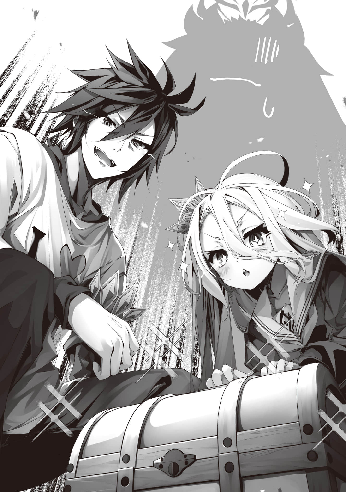

# 第一章 死亡结局

> 来源：https://www.linovelib.com/novel/9/326406.html

「好嘞！！这样一来——轻轻松松！到达第一〇〇层啦！！」

「……与轻·轻·松·松·相差甚远啊喂，空你把这一路的辛苦都当作乌有了吗？」

「……嗯？」

『哦呦小多拉……？您是经历了什么值得一提的辛苦吗……？』

「宝箱也终于全部开完了……这也太小气了吧。呸」

「我！！ 可是被！！ 剥光了两回啊喂！！！」

『【思考】……？ 【断定】没什么大不了的。轻轻松松推到顶层』

「难道现在连我的人权被侵犯这件事都已经不足为提了吗喂!? 」

——史蒂芙的这番主张，空荡无力地回响在——魔王之塔·九十九层。

众人终于来到了一扇巨大而不祥、想必将是通往第一百层的大门前。

……虽说大家都用玩笑回应大呼小叫的史蒂芙，但实际上确实耗费了不少力气。

所有杂鱼都变成了BOSS级怪，经历了两次撤退——耗时十日方才抵达此处。

即便如此众人仍异口同声的断言「没什么大不了的」——实属出人意料。

因为从第九十一层开始，眼前的景象(Field)——就是「纯粹的无」……

……唯有无尽延伸的玻璃沙漠与无色的苍穹……

最终万物湮灭，所有希望无论善恶尽数崩溃的，虚无世界(Field)……

与在地狱行军＊相比，算得上是「轻轻松松」就抵达最顶层了

（注释：这里指81-90层。）

因此，空一行曾一度撤退并休整后再重新出发，才得以几乎无伤地，站在了这扇通往最顶层的大门前……

——没错。

「吵死了！！本来到中途为止我还是打算好好听的好吗!? 」

无数的烛台一一苏醒。

那是与之前的魔王碎片——可爱毛球并非相同的，名为『魔王』的超越者。

「都吊胃口到这个份上了，里面肯定是很厉害的装备吧!? 喂，史蒂芙，赶紧确认一下效果——」

「——唉，抱歉本大爷有点记不住，能不能用文字打出来!? 」

「……呜哟。『宝箱』发★现！！而且还是两个！！果然不出所料!? 我就知道肯定会有!? 」

——、

只有屈指可数的人可以达到其顶点……然而。

《……甚好。既然如此，便让你们用肉身去深刻铭记，直至毁灭的那一刻去彻底领悟吧……》

但是——

「这个也·是!? 说了多少次那个(小号毛球)也是本大爷的碎片，从来都不是你的东西啊!? 」

《吾·乃·——魔·王·》

眼前是一个跟平时没两样，只是单纯变大了而已的毛球。

————————、

「——那么，吉普莉尔，依蜜尔艾因——开始进行最终确认」

然而——

——背后是一心只想享受游戏的勇者(Gamer)们。伴随着他们的话语，悲怆和不安都无影无踪。

『【明示】智之谢拉·哈的裸体。尚未记录。但该个体已为主人们所保有。随时可完成收集。已与机凯种数据库进行了比对。遗漏数「0」』

没错。换言之——

就在空几乎要如此确信的瞬间——然而。

没错——并非是因为自己被无视。

如果非要找个理由的话——那便是为了从空的口中得到肯定的回答，从而驱散不安与紧张。

「我们只要把『魔王』……打败就可以了吧？」

直到片刻前还和睦融洽的气氛骤然一变，瞬间被一股紧张的氛围所笼罩。

《为何要执着于生。为何渴望延续存在。不愿屈服于甘甜毁灭的众生啊——》

「呼、呵呵——超越过去的头领队伍……我一定要做到啊!? 」

「……那玩意，难道说是那啥影像事业部给的提词板？你认真的吗……？」

大概是妖魔语吧——？但是……

「……对、哦……因为曾经、地精种队伍……到达了、第100层……所以……」

「————！！！！！！！!? 」

空和白直接朝着王座之厅——角落那个发光的『宝箱』飞奔了过去。

但她随即摇了摇头——毅然决然地，说出了那句话……

突然，空语气一转，用严肃的声音低语。

---

■■■

——众人轻轻地点了点头，然后。

巨大毛球似乎听到了些什么空他们听不到的东西。

「——「可喜可贺可喜可贺」—— 这个故·事·的结局，除此之外别无他选」

「听好了啊！！喂，你们倒是听本大爷说啊!? 特别是那边的那两个——勇者代表！！」

在历经无数时代更迭、亿万生灵消逝的漫长岁月之中——依然。

「————」

————、

听到从『袋子』里传出的严肃回答，空郑重地点头，

啊啊——

而史蒂芙，甚至已经无语到反向生出了一种敬意，一边翻着白眼。

仿佛是在呼应着伴随雷鸣轰响传来的那道声音一般。

穿过巨大的门扉，一步步踏上那仿佛没有尽头的石阶。

仅仅是从王座上站了起来——仅·仅·是·动·了·起·来·——仅此而已。

视野被黑暗所笼罩，宛如无底深渊般的虚无之中，只有寂静无声。

诡异又庄严的光芒逐渐填满整个空间——啊啊，那便是。

这并不是一个疑问句，因为谁都未曾怀疑过。

沉没于黑暗之中的——大厅缓缓显现出了姿态。

——无论是声音，还是外观，没有任何一处与刚才有所不同。

「好～～～大的毛茸茸……这个也是伊纲的东西，的说。要带回去，的说」

然后巨大毛球的眼前果然浮现出了发光的文字。

就在巨大毛球不断争论的的时候——好像是有人来打圆场？

然后——空以极其认真的态度、锐利的眼神，开始了重要的最终确认——

在众人无声的视线之中，空开口了——

突然，他察觉到一丝气息——让伊纲一跳就退到大厅的一隅，被·迫·逃·离·此·处·的·气·息·。

「……嗯。那就……这可是从未有前人踏足过的……通关率0%的游戏……呐……」

仿佛是为了衡量世界的命运而存在的——王座大厅。

「我们会成为第一个通关的，的说！！ 已经跃跃欲试了——的说！！」

空走向通往最顶层的那扇沉重而巨大的门，伸出了手————

「最后的最后还是要这样吗……？」

《库库库……库哈哈哈——啊啊，即便明知是徒劳仍要反抗绝望吗……甚好》

「你!? 事到如今还要愚弄本大爷吗!? 不管谁从哪个角度看，本大爷现在都是个恐怖的庞然大物了吧!? 你倒是给我害怕一下啊!? ——还有——喂，小狗！！这好歹是最终BOSS战，别跑来抱着本大爷啊，稍微有点紧张感啊！！不，求你们了有点紧张感吧!? 真的！！」

没错——终焉机构。吞噬希望之兽。黑之梦魇。绝望领域。

换而言之——

仿佛从世界之底迸发而出一般，那道声音响彻开来的同时。

话语强而有力——虽是于二十二日前，在八十一层也曾说过的话，然而。

如果觉得靠那玩意就能让人害怕的话，那就真的是蠢到————

「啊·啊·……我们是『勇者』，而『魔王』是敌人……勇者打败魔王，然后——」

不——连这份沉默，都不过只是前兆罢了——

（注释：白上司，与黑上司相对，指体恤下属的良心上司。）

然而，啊啊……那是一种无需言语，就能让本能立刻理解的存在。

「这可是影像事业部为了符合「魔王该有的样子」，而辛苦修改剧本，本大爷也倾注了心血的演说啊!? 你们好歹听一下啊!? 明明是勇者，难道连体谅他人辛苦的心都没有吗！」

——没错。到黑暗逐渐被照亮的那部分为止，姑且还是有在认真听的。

接下来的沉默，便足以说明这句话正是大家内心的真实写照。

「我也豁出去了！！ 就算被剥光多少次我也会扛住的，防御就交给我吧！！」

一盏、两盏、四盏、八盏——

黑暗刚一被驱散，便全然无视了『魔王』的演出和台词——

声音的主人——从黑暗中浮现的巨大身影跨上宝座，其轮廓显现了出来。

暗影的支配在刹那之间崩解——在这仅有的一瞬，世界展露出其本来面目。

闪电撕裂苍穹，从窗口迸射的白光劈开黑暗。

但『魔王』似乎依然无法理解，只是茫然地回答——

那一股清晰而恐怖的气场，甚至让身为普通人类的空与白，产生了肉体正被割裂的幻觉。

「顶着这·么·副·样·子·，你再怎么装凶也帅不起来吧——!? 」

而且何止有些警惕——不，老实说的话，甚至还有几分紧张。

空指着从黑暗中浮现出来的——跨上王座的那个东西吼道。

「我那『美少女型妖魔种图鉴』的脱衣差分——应该确确实实都全部收集齐了吧……？」

『是的……Master、本大爷君——据我所知，除·了·那·一·只·之·外·，别无他恙』

如此才终于走到了这里——这扇巨门之后，毋庸置疑存在着『魔王之核(最终Boss)』。

就在统治绝望之塔的霸主，其身姿被光芒照亮，终于完全浮现而出之时——！

空仅仅加上了这微不足道——然而却最为关键的补充，便一锤定音。

那样子，不仅空和白，甚至连伊纲、缇儿还有史蒂芙都为此失去了紧张感——

这座足以剥夺目击者理智的巨塔——正是那永恒不灭的终焉幻想种本身。

《甚好。甚好啊。不愧是跨越无数尸骸成功抵达此地的勇者哟》

太过清晰、仿佛以带着实体的刀刃般横扫整个大殿的——气息的源头是……

在那前方等待着的，终于是『绝望之塔』的——最顶层。

是因为部下的努力被轻视而愤怒＊。

「这不就是个「XL码的超大号毛球」吗！！要搞排场的话先搞定你这副样子啊！！一个巨大又可爱的玩偶不管说什么鬼话都根本进不了脑子好吗!? 」

背负无数禁忌之名，让众生畏惧至今的——不灭的幻想。

《除永恒外，再无逾吾更永恒者。而吾，亦为终结永恒而生》

身为一切有生之物的绝对之敌——亦为绝对之恶——

《勇者哟。是与这世间的一切共同毁灭。亦或是超越吾——此刻正是裁决之时》

吞噬世间的一切邪恶(希望)、并代为执行的存在——那即。

众生亲手孕育出的——绝·对·恐·怖·，其具现之形……

——、

————、

「……可恶。怎么还是吓了一跳啊！那明明只是个念提词板的家伙啊喂！！」

还有，别特么每次都只给招牌台词加混响啊！！

为了摆脱这份失态——因恐惧而全身僵硬的这个事实。

同时也是为了激励同样僵在原地的众人。

空故作从容地露出狰狞的笑容，然后架起了自己的『武器』——

「那么，最终BOSS前哨战＊——都准备好了吗!? 那就按·作·战·计·划·开始吧!? 」

（注释：门神，前半或是P1，第一阶段/形态etc。）

随着空的大声号令，果不其然，在停顿了一拍之后——

似乎是摆脱了恐惧，白、伊纲、缇儿、史蒂芙也各自架起了『武器』。

连同『袋子』中的依蜜尔爱因和吉普莉尔——都仅用一句话做出了回应。

『收到！』——

啊啊，也就是说——

时间回到二十四小时前——

伊纲则不停抱怨着，一边挠着头，一边持续盯着半空中的文字——

但听到他用严肃的眼神竖起一根手指说出的话后，众人立刻端正态度认真倾听。

---

■■■

「伊纲的技能『直冲过去打爆它』——威·力·太·大·。而我的『连锁引爆弹』已经确认了有「伤害反弹」机制，既然如此，轻易地假定『魔王』不会反弹技能是很危险的……万一攻击被反弹回来，如果从HP余量反推后发现自己扛不住自己的技能伤害，就禁止使用该技能」

（注释：梗源自《最终幻想6》中的能够瞬间恢复全队的HP与MP稀有道具名。）

「首先——『装备』方面，要尽·可·能·地·一·个·都·不·用·」

为了降伏眼前高耸的绝望——众人的脑海中回忆起「昨日的作战会议」。

「竭尽所能，将『魔王』的所有底牌全部逼出来——并且「在没有任何人牺牲的情况下撤退」——想做到这点绝非易事……但，这就是我们首战的唯一目的。明白了吗？」

「……嗯，大概就是这些说明了？剩下的细节就麻烦大家自行记住了」

之后就是读档，准备好对策，然后重新挑战——通常都是这种流程。

进一步融入了空的奇绝构想与丰富经验所编织而成的——等同于「游戏解密数据」的终极结晶。

通常情况下——「最终BOSS战里不能逃跑」也是惯例。

那便意味着——「首战必败」。

「……诶……这、这是什么呀……？」

通过依蜜尔爱因的观测和白的头脑，才好不容易导出的数据中——

「以上就是全部——但尽管采取了这么多对策，有一点仍然必须明确：想首·战·即·获·胜·是·不·可·能·的·」

面对众人疑惑的视线，空依然嬉皮笑脸地——

明·明·是·个·死·亡·游·戏·＊，却·只·有·一·条·命·，是个不讲道理的游戏。

——噗哗的一下——

不过——空既然不说，那便是因为——不能说。

看着着慌忙端正姿势、准备倾听自己发言的众人，他继续说了下去。

但感到绝望的，并不止有史蒂芙一人。

基于「希望」消耗量所决定的攻击力，射程以及有效范围的相关性、MP槽的消耗反映到动作生效之间的时间差、从这一时间差的长短推测出的攻击规模、以及从目视确认到后决定应采取的回避与防御行动、以及这些行动可能带来的延迟等等——

「喂喂～，缇儿也就算了，但白你肯定知道这个常识吧？最终BOSS战往往都有那么几个「惯例」。其中之一就是——『第二形态』，对吧？」

花费两天时间恢复「希望」之后，众人却将出发时间——推迟了一天。

除了空、白和依蜜尔爱因以外的所有人，都瞪大了眼睛。那究竟是——

众人点了点头，但心中也同时涌起了难以消除的疑问。

空指着漂浮在空中的数据，开始逐一进行讲解……

（注释：这里作者好像是把空白算一人了？还是说因为机娘不需要背诵？）

包含了至今为止——不仅是他们自己，从BOSS级妖魔种到每一个杂兵——

——『如果有一线胜机的话就去争取』——

就这么呈现在众人面前，

「首先，一旦觉得情况不妙就「逃跑」——吉普莉尔，你要随时做好准备」

在制霸了通往第一百层的第九十九层之后，一行人照例——回到据点。

接着，他竖起了第二根手指——

「这里汇总了所有能够设想到的『魔王』的攻击与防御行动，以及相应的应对方法的数据」

而是——并·且·有·很·大·可·能·的·，「强·化·」。

如·何·在·初·见·的·情·况·下·处·理·初·见·杀·呢——要打破这一矛盾。

「遵命，Master。只要您一声令下，我将在刹那之间进行空间转移」

——魔王之塔·一层的『准备之间』——

就这样，持续了十多个小时的作战会议——不，应该说是学术讲座——终于结束了。

——所有攻击都有攻击范围。要时刻注意敌人的MP槽，从而提前采取应对措施——

「不在最终决战用那要什么时候用……？」

「……哥……终极圣灵药综合征＊……？」

「当然喽。全部——一个不剩、完美无缺地记住才行」

看着同样翻着白眼的伊纲和缇儿，空却无情地摇了摇头，

讲完这些后，见众人似乎理解了之后，空随即说道「那么——」。

但在这不讲道理的游戏里，那种惯例不值一提。

随着HP——「希望」的衰减，行动模式必然也随之变化。

——还有————更进一步————然后————

————…………、

然而，他并未给出这一断言的依据——众人的疑问便源于此。

没错……就是那种仅凭观察无法躲避——甚至都无法事先预测的攻击。

史蒂芙、缇儿和伊纲都已是疲惫不堪、筋疲力尽，空也终于能喘口气——

除了早已牢记于心的空、白、依蜜尔爱因，

然后——当众人在舒适至极的据点里悠闲放松时——

那么，理所当然地，『魔王』应该也具备这种特性——而且，

因为空显然已经了完·全·排·除·这个选项。

「然后，另一个惯例就是——『初·见·杀·攻·击·』」

几乎填满了整个准备之间、空中浮现出庞大的光之文字串，

通常来说，这种攻击根本无法应对。几乎都会吃到——然后暴毙。

（注释：死亡游戏指黑魂那种不死就几乎无法初见过关的游戏。）

——？

「企图首战取胜，以及为此而进行冒险的一切行为——都严令禁止」

为了说明自己的策略，空瞥了一眼依蜜尔爱因。

他这样总结，归纳道——又接着说道：

正因如此确信，众人才又将疑问都咽了回去。

一旦有任何人有掉队的迹象——就立刻撤退。

而且肯定不会是像以往那样的「弱化」。

「在下乃不才废柴鼹鼠是也！！但如果要论记性之差，我可是有无人能及的自信！！」

「我们这边根本无法补充任何道具。所以在『第一形态』期间，要保留实力(静观其变)」

以毫无顾虑地违·背·惯·例·为前提，在此基础上更进一步——

于是，史蒂芙与缇儿一边嘟囔地发着牢骚，一边拼命地继续记笔记。

一旦说出口——就不再是必胜了——

面对史蒂芙战战兢兢的提问，空即答。

「不行，必须全·部·记·住·。否则连逃跑的机会都没有，直接就会被一击毙命」

没错……在至今为止遇到的所有BOSS身上，也都存在类似『第二形态』的东西。

但遗憾的是，这个游戏。

「从现在开始才是此次作战会议的正题——那么依蜜尔爱因，拜托了」

「那个……虽然我觉得不太可能……？该不会是要把这一切全部记住……」

明明都已经把『魔王』的攻击与行动模式充分设想、并掌握到了这个地步，甚至还准备好了所有的应对方法。

以及似乎正发挥活字典本色，甚至快要流着口水兴高采烈地将一切记下的吉普莉尔这三人＊之外，

即使突然意识到了决胜的关键，或者突然解锁了新的《技能》，这次也绝不使用。

————————、

「……总计……8·0·5·7·种·可·能·的·行·动·模·式·……」

接下来——他又指向另一处——

比如——

「同样，由我的技能引发的「异常状态(Debuff)攻击」——以及由白的『瞄准弹』引发的「能力提升(Buff)」，也同样需要纳入考虑。这边已经将所有可能性都列出来了，接下来会逐一说明解法和应对措施。首先——」

「那么。重新来谈谈『魔王』战的策略吧——」

为了开启最终BOSS战前的最后一次作战会议，空如此开了口。

这是，响应对这场对空前绝后、前无古人的「超绝无理游戏」进行挑战的——回应。

「嗯。我和白进行了归纳整理，并且让依蜜尔爱因帮忙进行了解析和分析——」

众人似乎理解了，纷纷点头，空也点头回应。

——接下来，要在考虑到这些情况的前提下、保持相互掩护的阵型。为此——

然后，迈出了第一步，猛然蹬地向前冲去——

因为首先，唯一的目标是弄清『魔王』的底牌(攻击手段)——贯彻此点，而藏匿我方的手段。

而空又以「游戏在开始之前便已分出胜负」为信条——既然如此。

因此，只能通过模拟的方式来进行重现与应对。具体来说就是——

「……空……你丫是认真的吗，的说……？」

——当然也会有例外和漏看。因此，前期要依靠史蒂芙的盾，坚持远程作战——

---

■■■

——时间回到现在，魔王之塔·最上层……

与挥舞着巨大身躯、四处破坏的『魔王』的交战还在继续。

就在『魔王』举起两只巨拳时——在·其·头·顶·——

「史蒂芙，「二号」方案！！！」

「——『不会让任何人倒下！』——！！！」

刚一确认『魔王』消耗了大量MP，空和史蒂芙便几乎同时怒吼。

刹那间——砸落下来的双拳，击碎了巨大的王座之厅的地板——不。

应该说，引发了一场能将整个空间彻底粉碎的爆炸。

——但是——！！」

「喂，你们这群人是不是作弊了!? 连刚才的攻击居然都躲开了，这绝对有问题吧!? 」

「哈～哈～!? 你以为区区「全体连续攻击」就能初见杀我们吗!? 」

「……呀～，菜鸟♪……别小看、我们……硬核玩家……！」

「喂～～～！！给我衣——服！！不对，是给我下一件『防具』！！立刻！！马上——————！！」

大厅地板坍塌，所有人都处于自由落体状态之中，＊

（注释：还有转场说是。）

两人对魔王火上浇油的挑衅，以及全裸史蒂芙的惨叫一同回响着——

爆发性重拳将王座之厅一并粉碎——

粉碎的大厅本身先化作无数碎片弹雨，从四面八方袭来。

这还没完，立足之地被剥夺后，『魔王』抓住众人下坠的时机，还追·加·了·两·道·冲·击·波·——

『魔王』怀疑他们作弊也情有可原，因为按常理来说，这毫无疑问是无法回避的初见杀。

不过，也只是按预想躲开了那种对于最终Boss来说未免太耍小聪明的攻击罢了。

他们确实被击中了。一部分瓦砾，以及随之而来的那两道冲击波，都毫无疑问直·接·命·中·了他们。

简单来说：通过空在千钧一发之际察觉并发出的号令，史蒂芙得以用《技能》承担了所有伤害。

巨大的毛球一脸愉快，但是无法无法接受众人的毫发无损，于是继续横冲过去。

「等不了啦，对不住喽————的说！！」

————、

没错，缇儿的第二个技能——『隐身』……

「库库库——哈哈哈！啊，好！！甚好，这样的勇者才配得上本大爷于漫长时间长河中的等待。来吧——来啊来啊来啊！！来试着毁灭本大爷，给绝望画上句号吧！！」

在那个像是由巨大布偶的「臀部冲击」＊所留下的痕迹之中，

缇儿这样说着，以自己那单薄的胸脯，炫耀着自己稀薄的存在感。

史蒂芙的第二个技能——『不会让任何人倒下！』……

——随着空的信号，背着史蒂芙的伊纲随即发动了『血坏』——蹬踏虚空。

而从战斗开始，已经过去了整整九分钟，灼烧的持续伤害却依然没有停止。

让史蒂芙代受全体伤害，以及让依蜜尔爱因消耗精灵悬浮——

是的，从始至终都如此愉快地。

面对着握紧双拳逼近而来的伊纲，『魔王』像是要将至今为之累积的所有愤懑回敬一般，露出狰狞笑容，同样以巨大的拳头迎击——

没错——空他们根·本·就·没·有·躲·开·……也不可能躲得开。

事先设想、预测到的关于『魔王』的庞大数据。

以及基于这些数据，穷举出的、数量惊人的走位与应对策略＊。

——开战至今已有不到三十分钟。

——虽·然·觉·得·结·果·已·经·显·而·易·见·了·……不过。

能隐·去·身·形·——并增·幅·从·敌·人·背·后·进·行·的·攻·击·的·技·能·……

果不其然——「希望(HP)」耗尽、理应伏倒在地的『魔王』身上，竟微微然响起了笑声。

伴随着「希望(HP)」的下降，众人也开始渐显颓势。

「————好·痛·!? 哈？诶——等等等等小狗你先等一下，刚才发生了什么!? 」

九·十·层·的·B·O·S·S·要·强·得·多·——至少，光就HP量而言是这样的。

——『连锁引爆弹』……

笑着的『魔王』重新开始了攻击——

无论哪一个，本都应该是「底牌」——本应作为最终手段——也就是说，那是货·真·价·实·的·不·可·避·攻·击·……

战场陷入了寂静——

然后——

『魔王』如此叫喊着——啊啊，差点忘了说。

「尽管骄傲吧……能将本大爷逼至此等地步的，你们是「第二个」——」

但还没等众人着地，伊纲就在瓦砾上一蹬，朝『魔王』冲去——！

「库哈哈哈！！啊啊，本大爷终于可以反击了——来吧，小狗！！」

众人反而因此感到不安——对那「就差一下」犹豫了起来。

然后——映入眼帘的是，之前使用《技能》隐去身形的缇儿，以及她那「奇袭成功」的欢呼——

——……

（注释：原文为立回，格斗游戏术语，双方不断的试探与招架，以抓对方的失误。）

——明明接着使用的『毒雾喷射毒气弹』和『闪光爆音震撼弹』都无效。

「库库库、库哈哈哈——精彩，绝伦啊！！就差一点了哦，勇者们！！」

——没错，抓落地时点……是太过基础的手段了，不可能会预料不到。

就在空如此说明的同时，手上也理所当然地没有停下与白一起的射击——

但这一切都「在设想范围之内」——因此，仅仅是对此做出了应对而已。

将所有可能的反击都考虑过后，打出了只这一发的——子弹。

但眼前缓缓起身的『魔王』——有·所·不·同·、

同时耳边传来伊纲那毫不留情地，在刹那之间单方面进行数十次殴打后的抱歉声。

突然从·背·后·遭到袭击，那出乎意料的巨大冲击力让『魔王』惊慌失措，连忙回头查看。

伊纲仿佛在替众人表达疑惑一般，终于还是低声说了出来。

（注释：即抓落地的Timing，格斗游戏或魂游中，敌方在我方下落时，无法机动时进行攻击。）

话说……『油脂燃烧凝固汽油弹』……应该没这么长的效果持续时间才对。

但那一攻击所消耗的MP(威力)——都原封不动地反弹给了『魔王』自身。

「老早就在啦！！要说逃和躲，在下可是有着绝对自信的！！」

空正这样想着的同时，在『魔王』的下一次攻击即将到来之际采取了行动。

再加上空那句『首战必败』的默示宣言。

——是预示「没赢」的魔咒(Flag)啊……

这其实才是真实的现状。

——但是刚才那两招——

（……确实。看起来是这样。既然如此——那好，要试着赌一下吗？）

于是，又一次碎裂了『防具』，伴随着被剥光了的史蒂芙的惨叫声——众人一同坠向下层……

终于，众人就快落到下层的地板——『魔王』却依然开心地笑着。

随着HP被彻底清空的『魔王』缓缓倒下的轰鸣声，

在下方楼层出现的——巨大撞击坑的正中央。

于是都纷纷将视线投向了空。

（注释：臀部冲击，即千斤坠，用臀部撞击地面的技能，例如超级马里奥的流星下坠。）

背着空和白的依蜜尔爱因则消耗精灵浮空，成功避开了那一击——

「哼哼哼的哼—～！！空殿下，白殿下，快夸在下快夸在下！！」

——「就·差·一·下·」的·斩·杀·线·内·了·……

——不过算了，不管怎样——

就连一手承担全部防御职责的史蒂芙，也消耗了整整的一条HP——全体的三成以上。

瞬间，众人拉开距离、重新摆好基本阵形，毫不松懈地架起了武器。

它从战斗开始后就一直……处于『灼烧』状态……

瞬间——咕隆～，随着『魔王』猛然转动那巨大的身躯——

……啊啊，史蒂芙，多谢你如此周到。因为这句台词——

「库库库……哈——哈哈哈！既然如此，那就试试躲开这招吧，勇者们！！」

「聊天的时候怎么也持续攻击的啊!? 还有——好烫啊这玩意儿要烧到什么时候啊!? 」

「……空、那个……感觉——好·像·能·正·常·地·打·赢·、的说……？」

几乎就在空发出指令的瞬间——

若全凭本能和临场反应，恐怕数秒内就会全军覆没的猛攻仍在持续————然而。

魔王最后想要发动怎样的攻击——已无从得知。

「诶——奇怪？你、你这家伙——刚，刚才明明不在啊！！诶，什么时候交换的!? 」

「——哟？还真躲开了啊——不过你们果然是作弊了吧!? 」

果然是因为那个吗？因为是毛绒玩具——是个毛球，所以是弱·点·特·攻·？

全员都必须将这些完美记住、并严格执行——通过对『魔王』MP槽的消耗情况进行瞬间分析，预判其行动并加以应对——这才好·不·容·易·打·成·勉·强·的·优·势·的局面。

——黑色光刃。扩散追踪的黑球。全方位冲击波，以及超音速群体攻击……

「…………库库……库哈、哈哈哈……」

这是开幕时，配合白的『瞄准弹』，由空的『油脂燃烧凝固汽油弹』所造成的——

——坦白说吧。

其实只要有一瞬间的失误——哪怕只·是·一·着·不·慎·，便会毫·无·道·理·地·导·致·全·军·覆·没·……

致死级的猛攻仍在继续这一事实未曾改变，形式依然容不得乐观。

——没错……啊啊，全员都消耗了不少的MP。

虽说——是在做了万全对策之后才发起了挑战——

————————咚……的一声……

「咬紧牙关吧——这次可是会有点疼哟，的说——！！」

——然而。

空他们都能悠然自若地化解、予以反击——并同样是带着愉快的笑容——然而。

「依蜜尔爱因！！和缇儿交换！！全员，往上！！」

但是居然能在封印了高伤技能，甚至连防具以外的『装备』都不准使用的自我限制下——

——一·个·持·续·五·秒·，通·过·盾·牌·承·受·所·有·队·友·所·受·的·伤·害·的·技·能·……

「明明是最终BOSS却会中异常状态，那就怪不得我了——至于为什么烧成这样，我也不太清楚」

「——唉？赢、赢了吗……？」

「起手动作那么明显，还特意作出攻击宣言，生怕别人不知道你要「抓落地」＊吗!? 都用不着作弊，真有人会中这种招吗!? 」

————…………

还能将如此笑着的『魔王』的HP削减到——

伴随着如此笑声再度站起的『魔王』——其头·顶·上·方·。

——看·着·那·两·条·肉·眼·可·见·迅·速·回·复·的·槽·，众人瞪大了双眼。

「那么就稍微认真一点好了……你们肯定能承受得住的吧——？勇者们啊……」

仿佛洋溢着永远的愉悦般，特大毛球再度将它的巨大双臂高高举起。

然后————————

…………————

……——

---

■■■

「等——等一下～怎么回事!? 这才是作弊吧!? 」

「这，这就是空殿下所说的『第二形态』吗？」

从地板到墙壁，再到天花板，都被随意切碎。

如同暴风一般的猛攻摧毁了塔的层层结构，在塔内制造出了巨大的空洞。

「……最终BOSS——会·有·、两·条·血·……确实是惯例、但是……唔！」

「在这无法恢复生命值的游戏里，出现能·回·血·的·B·O·S·S·，太坑爹了，的说!? 」

面对愈发凶残，随意倾泻着暴力风暴的『魔王』，众人纷纷发出悲鸣。

至于白和伊纲，更是直接开始批判起这款『粪作』。

众人拼命防守，才好不容易撑住。

但是——

「——诶诶!? 这，这个攻击的威力很明显上升了吧!? 」

即使是隔着双重防御——『盾』和铠甲。

史蒂芙的HP照样被『魔王』的一道光刃进行了肉眼可见的削减。

会让自己的亲友露出这种表情的人——自己只知道一个人——

但其实——……让·月·亮·坠·落·到·地·面·上·根·本·不·可·能·发·生 ·

即使是『袋子』中的吉普莉尔也终于发出了悲鸣。

月咏种一直在暗中搞鬼这件事，因为空之前下的《毒》＊，早在商工联合会的自白里就已经得到确认。

但「凭直觉」就弄·清·楚·现·状·也不奇怪……？

没错——结果最终还是会取决于「那件事」……

————，

因此——「本国(爱尔文·加尔德)」也正在确认中，只能这样回答来应付公众。

但——

能够理解现状的人虽极少——但还是存在的。

哈登费尔的首领·地精种全权代理者。

而如此轻易就把这种暗号丢过来的维格大概也不遑多让。

甚至没有经过大脑思考就以脊椎反射的本能削除掉了信息。

说到底月咏种也是『战线』那一侧的——他们很明显在计划着「某件事」。

这是空提出的初战目标——而目标的前·半·，应该已经完成了。

菲的脸上出现了不应有的憎恨表情，克拉米想要开口询问，但已经自行得出了答案。

「啊啊啊啊啊啊谁他妈知道啊！也太烦人了吧！」

就连依蜜尔爱因也从『袋子』中发出了制止的声音。

『…………没事～哟～？只是收到了令人作呕的「骚扰信息(垃圾邮件)」而已哟♪』

『呜呜……唔、不，不要～～～～要读臭地鼠写的文章～实在是要比任何恐怖故事都要吓人啊……克、克拉米？人家想要你牵手手嘛……』

————好像也并非如此？

但马上下定了决心，重新集中精神。

---

■■■

「我说过的吧，「想做到这点绝非易事」！！要交换了，准备好了吗!? 」

但空依然，咬紧牙关却保持着冷静——

『所以说～……「月亮究竟会在哪里停下」才是问题啦～』

以及站在她身旁的，始终挂着如太阳般温柔微笑的森精种的少女——

更何况是和「战线」这一侧——在表面上是「敌人」的己方。

——对于维格来说，和森精种(菲)取得联系应该算是最终手段了。

克拉米和菲尔，同时小小地咂了一下舌。

那么菲就不可能不理解这件事究竟有多么重要——

也就是说「月咏种的真正意图」，至今仍没有人能够掌握。

毕竟，归根结底——这·根·本·就·还·不·是·『第·二·形·态·』……！！

众人都这样想着，等待着空的撤退命令进行空间移动。

上到叛国贵族和工商联合会中的大人物及他们的支持者——下到普通市民。

确实如果是维格(那家伙)的话那么就算不理·解·整个事态的来龙去脉。

一轮红月正缓慢地，但又无可质疑地正在朝着地面坠落而来。

（注释：「毒」指的是在第9、第10卷中，空白在知晓人类种内部存在各个种族间谍的情况下，通过盟约力量设下陷阱，打算一次性让这些间谍吐露他们所知道的各个种族的情报。然而，在11卷中，被森精全权代理奥里·爱尔察觉并利用，提前通过盟约许可，在艾尔齐亚王城使用「洛园」隔绝了情报内容，让空白未能获知这些情报，反而是森精种单独知晓了多个种族的情报，并用于促成了「战线」一方的联合，也即是通过掌握的这些「盟友」的弱点来逼迫他们合作。因此属于森精种的菲尔拥有这些证据和情报。）

当然，对公众不可能这样回答。

那么就只剩下后·半·——只需要撤退应该就可以了——

这本来就是大家预料之中的事，甚至菲尔都已经拿到了事实证据。

空只是摇了摇头否决。

正因如此。所以，如果不确认到「那件事」的话——唔！！

或者说——恐怕不止是再尝试一次而已——无·论·击·破·多·少·次·都·是·徒·劳·的 ·

因为过度使用魔法，额头上的魂石与脸上的表情都显得黯淡无光的菲尔摇了摇头，回答道。

「不是说了「正在调查中」了吗！你们这群卖国贼，去问问躲在你们背后的间谍(种族)们不就知道了！！不过，反正也没人会回答你们的问题，所以才来这儿抱怨吧！」

上面所写着的内容，让人怀疑其是否还有着作为十六种族所需的最低知性。

或是用一些适当的利益让他们暂时闭嘴。

不管红月是否以《月神(泽娜斯丝)》的意志——不，无论它受谁的意志驱使而移动。

面对空的激励，众人——迟疑了一瞬间。

『就是那·一·点·啊～…… 在「十条盟约」的影响下让·月·亮·掉·下·来·这·种·事·情·是·不·可·能·的·哟』

『————臭地鼠先生……终于是连作为十六种族的最低要求也达不到了吗～？』

——能够「凭直觉」找出最优解——拥有着史上第二的神域天赋(鬼才)。

『……菲？』

——维格·德劳乌尼尔……

「还不够。『魔·王·』的·底·牌·还·没·亮·出·来·——再来一次——耗尽它的HP！！」

众人重新各自架好武器，出声回应——

在亲友(克拉米)的劝说下，终究是理性战胜了极度的不情愿。

无论是什么种族——都在询问『发生了什么』，或是『月亮会坠落于何处』这种问题。

试图「危害」地上——这种显而易见的带着恶·意·的行为违背『盟约』。因此，

被询问的对象则是，被委任为共和国实际全权代理者的人类种的黑发少女。

在有着多重隔音的办公室里，克拉米终于忍受不住大骂出口。

——啊啊，再一次削减『魔王』的HP到0已经很困难了。

可那堆积如山的公文(投诉)却不见丝毫减少，这让憋着一肚子失眠怨气的克拉米，将其愤怒地狠狠砸向了办公桌——

菲憎恨的唯一种族，地精种……「感性的怪物」——他们的首领。

在一瞬就理解了其中信息内容的菲，突然愣住了——

恐怕是暗号吧——还是只有六重术者(菲尔)才能解开的暗号。

『所以呢!? 那个奇怪的月亮大人到底要掉到哪里去？再说了——真·的·会·掉·下·来·吗·？』

位于极其遥远的巴拉尔大陆——旧提尔诺古州腹地。

在此之上——更是连保密线路都要突破才能传来的信息。

与此同时，另一边——

就这样维持住了最起码的秩序——已经过去了整整十天。

突然——亲友的表情仿佛触到了粪坑一般，脸上露出明显的厌恶之色。

——上面具体写着什么，克拉米并不知道。

所以才会如此混乱——现·状·谁·也·无·法·理·解·……

——啊啊。确实不对，原来如此？

『收到！！』

即克拉米和菲尔，她们被包围在人群中心，场面已然接近暴动——

——没错……虽然许多人都对月球的坠落感到困惑不已。

——但——带·着·整·个·月·亮·一·起·过·来·的·意·义·实·在·令·人·无·法·理·解 ·

是的——红月必定会在某处停下。但——

向身旁——同样显得疲惫不堪的亲友——菲尔发出疑问。

——克拉米将愤怒的矛头转向那个给自己带来如此巨大压力的罪魁祸首。

啊啊——菲可是能够窃听爱尔文·加尔得的情报部门。况且她还使用了多重术式来加密所利用的妖精网络保密线路，但发件人却依然能够轻松地找到并联系上菲。

但是那种生理上的厌恶实在无法抗拒——菲眼眶中渗出泪水。

首先当然是……当事人月咏种——以及《月神(泽娜斯丝)》本人，此为一。

现·状·谁·也·无·法·理·解·——这句话并不正确。

如果还有人与他们共谋的话，那当然也包括他们，此为二。

听到这番话，众人脸色顿时紧张起来，额头也渗出冷汗。

『【解析】以现存战力(MP)再次击破「魔王」。成功率72％。危险。【推荐】立即撤退』

『Master！！目标应该已经达成了——我认为情·况·很·不·妙·，请下达指示！』

『既然无·法·判·断·对·方·的·目·的·那就根本无法弄清楚了嘛～……所以说啊～无论是情报部门，还是议会和学会，大家的看法都五花八门、混乱不堪～……彻底一团糟呀～……』

正如其他国家一样，艾尔齐亚共和国也乱成了一锅粥。

接·着·是·——

——尽可能地揭露『魔王』的底牌，并确保在无人牺牲的情况下撤退。

……大概是因为持续监听所有的妖精网络线路、不断收集信息而导致的疲劳吧。

她牵着亲友的手微微颤抖，点开了维格发来的信息。

试图将早已达到极限的愤懑情绪发泄出来——但。

『……？怎么了，菲——啊啊。难道说……？』

她装傻回应——明明才刚确认了发件人。

『————这根本不可能啊』

再次脱口而出。

显然，内容一定非同寻常。

菲不停地摇头否定着，但——

————，

『……不过，嘛……？偶尔～那只臭地鼠也是会搞错的～……把这个事实证明(教导)给他们看也是种～……启蒙？也是先进文明种族所必须经历的苦劳呀～……』

——看·来·有·必·要·亲·自·去·确·认·一·下·，如此。

似乎终于是勉强说服了自己，她低语了一声。

随即就当场以要烧断精灵回廊的气势展开了魔法。

克拉米什么都没问，重新回到了她的公文。

——自己有自己该做的工作，菲也有她该做的工作。

是的—就像空他们也有空他们该做的事一样。但是……

（空他们(那些家伙)，对这个现状到底掌握到了什么程度……？）

——现在『塔』中到底在发生着什么……克拉米根本无从知晓。

但是，空他们也同样无法得知『塔』外正在发生的事情(现状)。

他们究竟读到了哪一步，准备到了哪一步，又打算怎么做。

这一切都会影响到这边的应对方式——

（……再不快点通关『魔王』的游戏的话就——）

——这么思考着的克拉米，却突然被一个念头打断了。

啪嗒，她再度停下在文书上滑动着的笔，低声问道。

无前摇(零帧)而且是之前没有见过的初见杀。

比起自己的手，从白脚下出现的力量更早地抓住了她。

空他们打算如何取胜，她们之前也研究过。

至少希望那个结局能有所救赎吧——克拉米不禁祈祷到。

啊啊，又来了……又是空的记忆在作祟吧。

就这样克拉米重新提起笔开始书写，但是……即便如此。

不。就算能够「确认」，如果不给再战留足底牌的话——也不行！！

克拉米虽然不确信这一点，但空的记忆却断定了它的性质——即。

「……？克拉米？为什么事到如今又提起这个话题呢～？」

啊啊……确实是这样。

以「希望」为武器——虽然克拉米并不知道这一规则的详细内容。

她将视线投向遥远的魔王领地，低声轻语——

（可恶——果然留·手·的·话·就·「·确·认·」·不·了·吗——!? ）

但是经过了两次复活后的『魔王』——其攻击范围——

「————啊啊……嗯……抱歉。菲……」

被强制中断思绪的克拉米不禁想到。

不管是判断力还是思考速度都开始降低，更糟糕的是——

仿佛一切都归于沉寂，有着那致命的一线之差。

至今为止都没人能成功通关，才是理所应当的——

——这是自相矛盾的。理应是不可能的。但是——如果真的是这样的话

即使是——空的脸上，也浮现出明显的焦躁之情……

「————不就意味着『魔王』拥·有·无·限·的·希·望·吗……？」

——「为了被杀死而诞生的幻想」——

突然间————时间停止了……

众人的「希望(HP)」平均下来，则已经衰减到了不足二成……

空强行用意志力维持住随着「希望(HP)」的下降而逐渐衰退的思考能力。

——看着再次开始回复的『魔王』的HP条和MP条。

——那是——在·白·脚·下·凭·空·出·现·的·攻·击·……

「克拉米可不是空先生哦。也不可能重现空先生的思考——那·只·会·毁·掉·克·拉·米·而·已·。希望你能和我约定不会再这么做了吧？」

——但，即便如此……

自己只是拥有着空的记忆碎片。

那是——在一个月前就产生了的想法——关于『魔王』这一幻想的思考。

这才是不可避的——不……不·可·知·的——真正『初见杀』——

允许使出所有底牌？但即便如此，如果还是被逼入绝境的话？

看着这样轻松地继续说道的菲，克拉米不禁笑了出来。

但是，克拉米仍然——无法停止那些不由自主浮现出来的思绪。

——始终找不到获胜的希望——这是没有尽头的战斗

「真的～～～不可能做的到吧是也!? 这种敌人到底要怎么样打败是也!? 」

因此——在不足刹那的瞬间。

「说到底～要担心空先生他们～并不属于我们的工作范围哦」

「这·边·是·这·边·，那·边·是·那·边·——两·边·都·只·是·自·顾·自·做·着·自·己·的·事·而已哟～♪」

应该是得出了「不需要知道」的结论才对——菲回想起之前，歪着头回应。

——竟·然·扩·大·了·那·么·一·点·点·。

白只能拼命地将这种平常绝不可能出现的想法牢牢地压在心底。

「……克拉米？」

如果连自身被杀死都包含在这一幻想内的话——便能推导出来一个假说，也就是——

终于是字面意义上的——显露出了「绝望」的样子。

不—倒不如说，它以一种甚至流露出几分释然的声音，发出了响亮的咆哮。

即便如此——还是忍不住想到。

那是谁都无法预想到的——无法对策的攻击。

——再一次……『魔王』的巨大身躯倒向了大地。

---

■■■

——然后，随着一声响亮的巴掌。

「……但是，这种情况下……空。你究竟、打算如何拯·救·『魔王』……？」

伊纲也以零帧前摇发动了『血坏』——突破了物理极限。

在亲友那温柔而严厉的目光注视下，克拉米乖乖地道歉了。

「——啧……哈！这，这家伙，又·开·始·回·复·了·——的说!? 」

以神之领域的速度——突破音障并以接近光的速度伸出了手——

但克拉米却故意将大脑托付给思绪，让其自然蔓延下去——

——奇怪……『十条盟约』是在摸鱼吗……？

即——拥有兽人种独有的「第六感」的伊纲。

克拉米将思绪交给了空的记忆——完全放弃了自身的思考。

让人不得不承认这简直是奇迹——虽然十分勉强。

看到这样的情形，菲似乎决定原谅她了，于是点了点头。

即使能够方便的加以利用，但也无法做到模仿(复刻)那种思维方式的。

「…………然后、魔王的游戏是「仅以希望为武器进行战斗」对吧？」

这只是有着他记忆的自己擅自推断出的结论。

————但是，

……啊啊，不仅是白和缇儿。

（赶——不上了啊啊啊——的说……）

——有白在，他不可能找不到办法的——

摸着微微作痛的左脸颊，克拉米呆呆地望着扇了自己一巴掌的亲友。

唯有对再次站起来的『魔王』来说，现状无比满足。

虽然确实是和菲签订了奴隶契约，但行使暴力的许可应该已经取消了才对啊。

毕竟，那个男人——根本就不会去参加「必败」的游戏。

这对谁来说都是显而易见的——

————，

——就连白——也开始觉得「哥是不是搞错了什么？」……

「库哈哈哈哈！！啊啊，无尽的岁月中这是第一次这么爽啊！！怎么了？到底还要留手到何时!? 都还完全没有用过装备吧!? 你们有回复手段本大爷也是知道的哦!? 还是准备先撤退然后重新集结部队!? 无碍！本大爷现在心情极好！！愿意原谅你的一切计谋！！无论是诡计多端、权谋手段，还是千方百计，都尽管使出来吧，然后再以那份勇气——漂亮的打倒本大爷让本大爷见识见识吧！！来吧！！来啊，来啊，来啊！！来啊啊啊——唔！！！」

「克拉米～稍微用力扇你一巴掌可以吗～不回答就当同意了哟～♥」

啊啊……没错。

如果，自己的想法是正确的话。

「……哥，哥……好像哪里不对——哥……想想办法……唔」

以及，捕捉到了本应在攻击范围之外的『魔王』，其视线的微小晃动中——蕴含对·妹·妹·的·恶·意·。

众人已熟知了『魔王』的攻击范围，都始终处于其攻击范围之外。

我们有自己的工作要做。空他们也有自己的工作。

——空以极快的思绪，不断超载着大脑，想要拼凑出次优的策略——

「……喂……请、请告诉我这不是真的……这一定是在开玩笑吧——!? 」

就连在『袋子』中的吉普莉尔与依蜜尔爱因也没能察觉到。

望着如此渴望继续战斗的『魔王』——终于。

——那接下来该怎么办……？

然而依旧有两人得以知·晓·不·可·知·——超越了矛盾而进行行动。

这一过于便利的绝对恶，源于丑陋欲望中诞生的幻想种。

「……等下。和『魔王』的游戏————真·的·能·赢·吗·……？」

众人成功地将『魔王』的HP条再次削减到0，但是。

「……你回·来·啦？」

——如果还是「确认」不了的话，那就真的完了——唔！！

——至今无人能成功通关的『魔王』游戏——

我们做自己该做的事——仅此而已。

并以超越了人类领域的思考速度预见了未来的空。

不能尝试。那人再怎么说也是和白二人一起才能够——

——再继续战斗已经是不可能的了。

（——怎么办。只能维·持·现·状·吗？暂时先撤退，多战斗几次后再想办法——）

正是那「第六感」所带来的确凿信号，让伊纲想要呐喊出来。

最终——在那连一丝念头都不容存在的时间碎片中——

——她看到一直牵着白的手的空，用他那过于孱弱的身体。

稍微地……推·开·了·白·——伊纲睁大了眼睛。

然后——

…………————

……………………————————

「…………………………………………哥…………？」

——被脚下突然出现的黑色光柱所吞噬。

在谁都没有反应过来之前，空缓缓地，无力地倒下。

这一次——整个世界就都像是时间停止了一般陷入了寂静。

啊啊——不管是谁都睁大眼睛，无语失声，静止思考，停滞动作，怀疑起了现实。

不管是白，还是史蒂芙，还是伊纲，还是缇儿。

吉普莉尔也是，依蜜尔爱因也是，甚至——

——『魔·王·』也·是·——

因此——在时间停滞的世界里。

只有一人。只有空——

（——哈……果·然·————终于确认到了……——）

——『魔·王·』的·「希望(HP·MP)」突·然·消·失·了·一·部·分·——……这一事实。

以及他的视野内，浮现出了新的《技能》的名字这一点。

「……惶恐至极，但。智之谢拉·哈，凭借魔王大人赐予的无上智慧，只要您希望，无论多少次、无论多少回，我都将虔诚地——无数次重复」

加速后的思维无论怎样推演，都只能得出那个结论

意识终将要完全陷入黑暗。

那声音传遍了魔王领《加拉德·高尔姆》，甚至整片大陆都为之震动。

「……是。遵命」

「就如同伟大的魔王大人无论多少次都会复活一样，愿他们也——」

智之谢拉·哈——如此断言。

然而那终究只是一场把希望押在无数未验证要素上的——绝·望·的·豪·赌·。

空确信自己的意识很快就会熄灭——但。

不——是失声恸哭。

那么接着，她就像是在叙述自己亲眼见过的往事一般。

既然如此，那么这便是自己下意识都未曾纳入考量，却——「早已埋下的后招」！！

没问题。通向胜利的道路勉强已经连上……但是。

但是。即便如此。

那震耳欲聋的声音响彻了整个『塔』——不。

——如果。万一。虽然非常不愿意这样去想。

（哈哈……到头来还是要赌·后·手·发·展·吗……居然要寄希望于『运气』，我也真是沦落到这一步了啊——）

——妖精回廊仿·佛·串·联·了·起·来·。

——「现在开始才是问题」才对。

这只地精种(鼹鼠)到底在说什么呢……

——应该只是个烂玩笑罢了，吉普莉尔嗤笑到。

即便此身粉碎消散也绝不会放它活着。

相信伊纲，相信大家——尤其是最需要相信白。

————不对————

然而，依旧能感受到从右手传来的，另一半的温暖——

对着连同四根蛇尾都低垂着跪倒在地的谢拉·哈，主发出了怒吼。

杀

空的『灵魂』……停止了燃烧——

身体已经无法移动，强行维系住正在一同消散的意识。

「无论多少次陷入绝望都能够重新振作起来，与魔王大人真正并立争衡，遂君所愿」

智之谢拉·哈没有一丝动摇。

计划之外的变数，最终在结果中拼成了完整的图景——

无论付出什么代价，都要否定这家伙的存在——

那么——承担那份牺牲的人，只·能·是·我·——正是怀着这样的确信，才布下了这场豪赌——

虽然微弱，但仍比任何东西都要沉重。

——那么……？

---

■■■

她突然看见了抱着那位主人(空)的——另一位主人(白)的身影。在下一瞬间，她带着所有人进行了空间转移——

以深不见底的智慧及——蕴藏着坚定希望的瞳孔——

大脑终是抵达了极限，空在自嘲中逐渐失去意识，然而。

「你——是骗了吾吗？他们一定，能在这次，能够讨伐吾——你是这样说的吧……？你——又让吾夺走了他们的生命！！」

在意识逐渐模糊中，他在心中暗自窃喜……

不会吧，这只地精种(鼹鼠)正在让自己「逃跑」？

她的眼中失去光彩——只是歪着头，脸上露出虚无的微笑。

「————」

凭借那至今仍不断加速、甚至足以令时间停止的思考

以及——右·手·始·终·紧·握·着·的·感·触·——让他重新改变了想法。

即便直面绝对之王的滔天愤怒

那是创造主的——绝对上位存在的逆鳞被触碰所引发的怒吼，恸哭以及——「失望」

看着头顶上那已经枯竭的HP条——也就是象征着『死』，倒在地上的空。

如果无论如何都必须——要·以·谁·去·牺·牲·才·能·确·认·那·关·键·的·胜·机·的话。

——相信吧。相信自己「希望(灵魂)」的形状。

——于刹那未及的须臾之间，推演出胜利的可能——

所有妖魔种都感受到了灵魂被碾碎的痛苦，是字面意义上的天谴。

「————」

那是主人(空)的命令。

尽管心中已经如此确信，但是——

将终究还是没能说出口的抱歉留到了最后

确实是要赌后手发展——但是——这是所·有·必·要·条·件·却·都·已·经·齐·备·得·近·乎·反·常·的·豪·赌·！！

她张开双翼，准备以·自·杀·为·代·价·将·一·切·摧·毁·——

这可是「必·胜·的·豪·赌·」——！！

（之后——不管怎么惩罚我，都……毫无怨言接受，所以——）

「吉普莉尔阁下！！遵循空·殿·下·的·命·令·必须撤退了！！」

---

■■■

「他们正是魔王大人长久以来苦苦等待的真正勇者。真·正·意·义·上·能·够·完·全·实·现·魔·王·大·人·的·希·望·并·打·败·您·——在这永劫的时刻(时间)中，第一次出现的，唯一的，真正的勇者大人一行——并且」

与时间，空间以及自身意志都无关紧要。她不由分说地被转移到了主上的面前。

——『觉得情况不妙就「逃跑」』

下意识移动的左手——不·断·传·来·的·熟·悉·触·感·。

啊啊——「此刻还能这样思考着」不正是那场豪赌已经奏效的最好证明吗——！！

被系统移出『袋子』中的吉普莉尔，和其他人并没有什么不同。

是的——在茫然自失的状态中，伴随着心中某种东西的断裂。

眼前这个——摆出一副蠢样站在那里的——「敌人」。

……………………，

…………，

…………

也只是用那虹色的蛇瞳回望

然后，在只剩下寂静的『塔』顶层——不知过了多久。

吉普莉尔将满腔杀意投向了『魔王』——但。

是几分钟，还是几个小时。呆若木鸡般站在那里的『魔王』，终于发出了微弱的声音。

哪怕只剩那么几毫秒，也要尽数利用，为此不惜将脑髓燃烧殆尽

——用那近乎于无的刹那，完成对现状的分析——

……这样一来，终于「凑齐了通向胜利的所有要素」。

杀死了自己最亲爱的主人——这大逆不道的仇敌就在自己眼前。

啊啊，也就是说——

「————谢拉·哈。回答吾」

但——「还不到时候」。

「……吉普莉尔阁下、和史蒂芙阁下交换……该撤退了」

如果仅凭这句话还不足以安抚魔王，

（——……啊啊……抱歉，白……又……把重任交到你手里了……）

听到缇儿用颤抖的声音大叫后，吉普莉尔停了下来。

——大概是创造主的权能吧。
