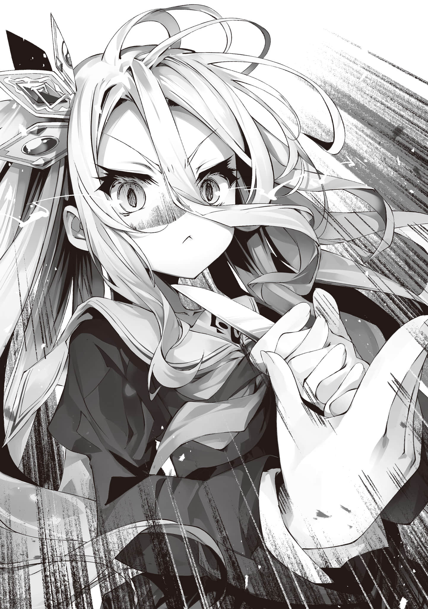

# 第二章 无解死局

> 来源：https://www.linovelib.com/novel/9/326407.html

——那么。这里是什么地方……？

仿佛在梦中漂浮一般，思绪也混乱不堪。

即使如此■仍在漫无目的地胡思乱想着……

环顾四周——什么也没有。

既没有白也没有黑，既看不到亮也看不到暗，既感受不到温暖也感受不到寒冷。

不——这是一个连是否真的能够环顾四周都难以确定的空间。

连五感和自我意识——都仿佛飘荡在『无』之中。

试图将那飘忽不定的意识以某种形式表达出来——因而编织出话语——

「喂喂……这里该不会就是「那个世界」吧……？」

——像这样发出声音后，意识稍微稳定了下来。

「嗯～这下麻烦了啊……这样的话，就相当于赌·输·了·呗——」

——赌输。自己也不明白到底是在说什么事。

但■苦笑着摇了摇头仍继续思考——

——不可能的。

就算所谓的「那个世界」真的存在。

自己也应该会——跳过阎王那边的手续，直接被扔进地狱才对。

——虽然连自己是谁都尚不清楚，但唯有这一点，却不可思议地确信无疑。

而且，眼前的这个地方——作为地狱来说也太过于舒适了。

讽刺的是，随着思考的不断深入，在逐渐定型的意识中——突然间。

——感受到了右手传来的温暖触感。

伊纲仍然强有力的否定着，大声控诉到——

吉普莉尔说着疯话，不断责备着没能做出撤退判断的自己。

在察觉到的同时——也明白了自己为何只有一个人还能保持着镇定＊。

「——「希望」能从彻底的丧失中恢复过来，重新诞生吗——您认为这有可能吗……？」

「【系统崩溃(Error)】又一次什么都没能保护住。又失败了。失败。无能。无为。毫无价值【系统崩溃(Error)】」

「……………………？」

空则已经预判到了后续的发展，因此不禁露出了一丝苦笑……

大概这些——都是至今为止被『魔王』所吞噬的「希望」——

伊纲说的没错——如果自己都察觉不到，那还怎么行呢!?

要是真的变成了活死人的话——这又算什么!?

用责备自己的怒声，强烈地予以否认。

因此众人愈发陷入绝望，但是，

——究竟为何，空要保护白呢——？

「……这么说来，就是那种情况了吧。现在是字面意义上的在「生与死的边界」上徘徊的状况吗？」

伊纲的这一句话，终于让白睁大了双眼。

就在空还在为朝哪边走而犹豫不决的时候——突然。

————，

「……这都是我的判断错误……我的错……我的……我把……我，…………」

「要真是那样的话，空——为·什·么·依·然·没·有·放·开·白·的·手·，的说!? 」

虽然还没有人明说出来，但现状本身已经以最直接，最无情的方式表明了一切。

两个人，是一心同体的——

不，这其实都已经是那之前的问题了，缇儿垂下眼，声音颤抖。

瞳孔中稍微有了一些光亮的众人，将视线集中到仍在诉说着的伊纲身上，

---

■■■

依蜜尔爱因陷入思考崩坏，最终像一台坏掉的机器一样只是重复播放着声音。

「……死·的·时·候·，也·要·一·起·死·——如此『约定』过了……！！」

白紧握着躺在地上一动不动的空的手——却并没有哭。

如果不赶紧回去，就会真正死去的展开——吗……

（注释：三途川为此岸和彼岸的界河，也就是冥河。彼岸即为阴界，此岸为阳界。）

然后——

和白一起抱着空的伊纲突然露出困惑的表情。

「——那，也……」

不……现在连胜负都已经变得无关紧要了。

——在本应空无一物的空间里，除了自己之外，还有无数其他的气息在飘荡……

「哭哭啼啼的就能复活空吗，的说!? 什么都不做的话就真的要结束了，的说！！」

擦干眼角的泪水后，伊纲站起身来，大声喊道。

（注释：空和白离开了对方会类似癫痫发作。）

——当「希望」枯竭之时，要么成为活死人，要么选择结束自己的生命。

这样的话这里就不是「彼岸」——而是还属于「三途川」＊的地界。

「才没那种事，的说！！」

空掉队的现在——已经不存在胜利的可能了。

「你，你这家伙是……勇者——!? 为什么你还有自我意识啊!? 」

除了白以外的众人都露出了疑惑的表情，不过，这也有其依据。

如今众人的「希望(HP·MP)」也快要完全枯竭，眼看就要步入空的后尘——但是。

仿佛被指出了一个不仔细看根本察觉不到的，微乎其微的希望。

众人通过吉普莉尔的空间转移回到了『准备之间』，但。

哥他，留下白孤身一人，独自逝去——？

（注释：站在作品外分析，高一层的视点。）

——当时，白的死亡已经是不可避免的——在那种情况下。

吉普莉尔，用勉强挤出的声音向缇儿问道。

这是——这个游戏的「规则」——也就是大·前·提·才对。

于是——空靠着终于清晰的思考和，久经锻炼的游戏脑。

缇儿沉默着，和史蒂芙一样……只是将脸埋在膝盖间，看着地面——所有人都如此

要么一起活着，要么一同死去。

在这个前提下——那么，那又是为什么，空推开了白呢——？

这种事情，还需要问吗——

我·们·输·了·……

「————！」

昏迷中躺着的空，右手依然紧握着白的手。

……这·场·游·戏·已·经·结·束·了·。

「…………哥……喂，哥？快醒，来？呐……快醒来，快醒来，快醒来……」

不可能。只有这件事。绝对！！

白用那细弱的嗓音，竭尽全力地喊着。

虽然已经身处于绝望之兽(魔王)的体内——却陷入到了，比『魔王』更深的绝望当中。

选项什么的，从诞生之日起就只有这两个才对！！

——只是有人出声有人沉默。

——微乎其微的。

「空他——应该是「猜测自己(空)即使『HP0(归零)』也能复活」——不对，的说！！应该是断·定·——所以才决定推开了白，的说！！」

「好了。要是去到彼岸那边就是出局(死)对吧……看不到三途川啊哪边才是此岸啊？」

「白，你也是啊，的说!? 你要是不好好振作的话怎么行，的说!? 」

——魔王之塔·一层……

「…………不·对·……绝·对·，不·是·——这·样·的·！！！」

也就是过去的挑战者——勇者们的『灵魂』碎片吧。

「——都犹犹豫豫的——你也是她也是，太死气沉沉了——的说！！」

——啊啊……确实如此……虽然确实是这样，但。

「……未免逻辑跨越有点太大了，吧……？」

这件事已经明显到甚至不用确认头上的状态条。

————————，

「……为什么，是指……？那不是因为——」

毕竟还有作为事实证据的——在漫长的时光中堆积起来的尸体……

她只是拒绝接受现实，不停地摇晃着无力躺着的哥哥的身体。

除此之外，在场的众人没有任何一点不同。

「为·什·么·空·保·护·了·你·——连这个都不明白的话那怎么行，的说!? 」

「……据在下所知，『阳精』完全枯竭后能够恢复的例子从未有过……」

失去了空——即便从现在起能够取胜，那又有什么意义呢——

但是空推开了白——！！

——啊啊，原来如此，是这种展开？吗……

————，

没错——在场的所有人，都丧失了几乎全部的「希望」。

众人进行着理所当然的推测，但是。

忽然——

然后，那个从虚无中浮现出来的，漆黑的身影瞪大了双眼。

没错，环顾四周不管哪边都是无限延伸的虚无空间。

通过直截了当的元解读＊，终于把握了大致的状况。

突然从背后传来——一道异常清晰的气息，让空急忙转过头去

没错，是一个因为惊愕而脸色扭曲的，漂浮在空中的黑色毛球。

突如的在准备之间响起的少女的催促声让众人微微一震。

注意到空的左手好像紧握着什么东西，她拿起来一看——顿时瞪大了双眼

如果是为·了·一·起·死·去·而甘愿暴露在攻击之下，那倒可以理解。

然后，他再次环顾四周——察觉到了周围漂浮着的无数气息——

那么，答案显然不言自明了——

记忆如同潮水般涌入——『空』的意识，逐渐清晰起来。

「……至少要把白救下来，不是这样的吗……？」

伊纲，举起了空的左手一直紧握着的那个东西。

那是——『一天内做什么都可以券』——

伊纲在空白的生日那天送给他的——所剩的最后一张。

那里写着——究竟是……何时写下的呢。

但是——那显然是空的笔迹。

只有一句话，如此……写着……

——『请·不·要·绝·望·』——

「空绝对会复活的，的说！！而且就在今天之内，的说——！！」

啊啊，没错——肯定是这样的！

绝对是有复活的事前准备所以才准备了这张券的！！

而且绝对是在今天内复活。绝对不会错！！因为这张券是——

「伊纲——绝对不会绝望的，的说！！不管发生什么——不管你们这群家伙说什么伊纲都不会听的，不会承认，绝对不会放弃——的说！！」

啊啊，因为。

因——为——

「这，这张，这张券——仅·限·一·天·，的说……所，所以，伊纲……在今天，绝对不绝望，的说……说了，绝对不绝望，就不绝望的说……呜——啊呜呜啊啊啊啊啊」

——等今天过去了的话，大概……

伊纲……就会坚持不下去了，的说……

伊纲最后终究还是像小孩子闹别扭般哭了出来。

但即便如此，她还是继续如此诉说——

「……空殿下的「希望」由在下来恢复」

缇儿毅然决然地，站了起来。

果然自己「希望」的存在方式——也就是『灵魂』的形态——和自己预想的一样。

「库，库，库——哈，哈，哈！！ 原来如此。不，这才是真正的勇者！！ 连绝望都不足以让你屈服吗！！ 甚好，甚好啊！ 那就赶紧返回你的肉体里去。现在可不是在这里磨蹭的时候啊！」

「……缇儿小姐，真亏你在这种状况下还能开得出玩笑呢……」

——要是能回去的话肯定立刻就回去了。

那就赶紧像个特例一样从这里出去再来打倒本大爷，魔王如此回应道。

看着那虽然身体一动不动，但绝不放开白的手的空——

如同从右手不断传来的那份温热一般，又有另一种新的温暖，包裹住了身体——这一次却是多重叠加的温暖。

（注释：来自12卷开头。）

「……喂。你们到底在说什么啊，的说？ 把伊纲也加进去啊，的说……？」

必须离开这种事应该是不用说也知道的才对，但是为什么——

而空却忍不住用严厉的声音不抱希望地问了一遍——果然不出所料，

——虽然不知道为什么。但不知道为什么的自己现在。

---

■■■

她坚定无比的断言道——

「不行不行不行!? 不管怎么说伊纲小姐和白也脱的话就太糟了啊!? 」

「……交给我，了……！就由白，来……完美的，收下哥的第一次——」

但是——也还只·有·一·半·而已。

————…………

根据依蜜尔爱因的解析，仅剩下呼吸，脉搏——以及微弱的脑波残留。

「……我的『灵魂(Ghost)』在低语：不赶紧回去的话绝对会后悔」

即使像让他进食也无法完成吞咽动作——想从食物获取『阳精』是很危险的。

但是——即便如此……事情恐怕还是不会如愿以偿吧……

但是——！

——这一次，终于燃起了希望之火————

将这无言的诉说收入眼中的众人。

「啊啊你说的一点没错所以怎么才能回去赶紧告诉我喂死毛球」

「～～虽然完全搞不懂，但意思就是伊纲也脱掉就行了吧，的说!? 」

为了强行驱散那沉重的绝望感，众人开始吵吵闹闹起来。

没错，缇儿背后有如轰雷闪过。

——明明空自己都还没有放弃，自己这群人又到底在做什么呢？

即便如此——众人还是能领会她强打精神诉说的用意。

这样一来，有可能恢复空「希望」的手段就变得极为有限了。

「……………………【了解】但是——」

——好了，该怎么办呢。

……与此同时，另一边。

缇儿这样说着，随后豁出去般，用手指向空

「哦呀小多拉想抢跑？不过说的也有道理——就让我来陪您一起吧♥」

「【反驳】主人大人和他的妹妹大人维持握着手的现状的话还需要满足主人所认定的伦理规定的同时，进行生殖行为。困难。【然而】本机的话可以做到。极其重要的任务。交给本机……啾」

缇儿却毫不在意地，依然坚定地陈述着！！

（注释：德语，开始吧。）

「啊啊啊啊啊不妙啊虽然不清楚具体哪里不妙但这个绝对很糟啊啊」

「现在在场的人里还冷静的就只有我了好吗!? 」

……可恶。真是个一无是处的破毛球……

意识还清醒着——也就是说——看来事情还没有结束。

——童贞吧……贞吧，吧……

————奇怪？这是怎么了……

「史蒂芙殿下……？还请您冷静一点……」

「那种事情我怎么可能知道啊!? 但是就如伊纲阁下所说的那样，什么都不做的话就要在这里结束了！！ 既然这样，那就挣扎到——最后的最后！！」

没错，具体来说就是————！！

空虽然本来就没对它抱有什么期待，但还是不由得咂舌思考起来……

那么，这场豪赌————可以算是已经成功了「一半」吧。

于是众人也都加入，拼尽全力开始讨论起来——

「而且，空殿下没有放开白殿下的手。既然能检测到仍残留着的微弱脑波——那就意味着肉体的感知功能或许还保留着！！既然如此——那就给予更强烈的刺激——总之就是这样放·手·去·「做·」吧！！」

她们将史蒂芙合理的危机感抛之脑后。

一个接一个的，开始脱掉衣服————

这是一个有着两大根据的，极为现实的方案，缇儿继续诉说着！！

「在下看起来像是在开玩笑吗，认真的啊，我这是超认真的好吗!? 」

幸运的是，得到了『魔王』大人的亲自确认，这下就确信了。

「你们俩为什么要脱衣服啊!? 」

众人对着这突如其来且不合时宜的缇儿的提议，投来了批判的白眼。

众人将他移动到帐篷里的床上，小心地让他躺下。

「空殿下曾经通过摸史蒂芙殿下的欧派恢复过希望——这可是有先例的＊！！」

于虚无中漂浮着的空的心中，突然萌生出强烈的焦躁。

「啊啊伊纲小姐不加进去也可以的不如说请伊纲永远也不要懂这些！」

空虽然仍未放开白的手——但果然仍是一动不动。

他那紧闭着双眼的面容，像是在说。

在足足数秒的沉默后。

毛球看着突然焦躁起来的空，反而安心了下来，开心的搭话道。

---

■■■

——「这场游戏还没有结束」……

缇儿的头上——「希望(MP)」条，虽然已经所剩无几。

「【追从】【报告】脱衣。完毕。Los geht's—＊」

在稍有放松意识就会溶入虚无中的情况下，空仍在冷静地进行分析。

推测是靠「做」才得以恢复「希望」的——！！

伊纲，大家——还有最关键的白，只能期待她们了。

空不由预感到一种极其沉重的后·悔·，与之相比，连·「死·亡·」都·根·本·算·不·上·什·么·，于是他越来越焦躁。

「空殿下已经失去了意识——所以眼·下·这·里·就·只·剩·下·女·性·而已！！」

首先——空的肉体，几乎无法动弹。

啊啊——而且，还不止如此！！

啊啊——赶紧从这个地方离开——必须马上醒来。

「不！！ 不如说所有人都应该脱掉才对！！ 没有布料的话空殿下的恢复才更有希望——废柴鼹鼠的平板也好什么都行，只要能有用的话就试试看！！」

「白是最不能承担这个任务的角色啊!? 」

——你是特例啊。

唯余寂静，回应着这空虚的回声。

而遗憾的是，完成「剩下的那一半」的方法——尚·不·明·确·——

过去的地精种小队也是，靠着这样那样的手段……

啊啊——自己，还能保持冷静进行分析呢。

「没错白大人。这种事情就交给不肖的我吉普莉尔来——」

「既然这样的话，那就来夺走空殿下的童贞吧——！！」

帐篷里充满了紧张、不安，还有希望——种种复杂的情绪交织在一起。

「空·殿·下·还·没·有·放·弃·——那么，就把能想到的办法全都试一遍吧！！」

缇儿经过深思熟虑后，深深的点了下头，终于说出了她的第一句话——

「……换作平时，我会毫不犹豫地接受这个任务……」

「——不，不对吧……虽然现在确实已经不是还能挑手段的时候！ 但要是缇儿小姐的说法正确的话那就更应该从我的欧……欧派开始验证了不是吗!? 」

——就这样。

「唔姆，不·知·道·！！「掉进」到这里却还能保持意识的勇者可是闻所未闻诶!? 」

面对众人如此恳求的目光，缇儿只是抓狂地挠着脑袋，

「……缇儿……「唤醒事件」开启了……？太天才，了吧……？」

「到底，应该怎么做呢……？」

好像正在错失某种难以置信的机会啊————！！

只·要·这·只·右·手·的·温·暖·还·在·，自·己·就·不·会·屈·服·——因·为·白·还·没·有·屈·服·。

当哥哥的反而先放弃什么的，根本不可能————！！

给自己打完气后，空在虚无中开始寻找能做的事，漫无目的地飘荡着。

————，

「……不过这样一来本大爷不就是对谢拉·哈说了很过分的话吗……之后得好好道个歉……不对现在更重要的是——喂勇者！！为什么你掉进到这里来却还能保持清醒啊，差不多该告诉我了吧!? 」

「……你怎么还跟着我啊？话说「这里」到底是什么地方啊」

原来是在意这事吗，还是单纯怕被留下而感到孤单呢。

大概两者皆有吧——空看着那个一直跟着自己的浮空毛球。

他再次尝试询问，为了得到哪怕一点复活的线索。

——但是，这次却。

「唔姆。虽然本大爷也不是很清楚——但大概是在本大爷的『灵魂』之中！！」

「————」

出乎意料地得到了一个认真的回答——空的思考便被延伸到了「那所代表的意义」上。

他不由得哑空无言，于是再次环顾四周——

……原来如此。所谓「希望」归根结底就是『灵魂』……的组成部分啊——这样来说的话。

如果「希望」被『魔·王·』的·「希·望·」所吞噬的话——两者的『灵魂』就会融合在一起。

啊啊，空早已习惯将无法理解的「上位种」知识粗暴地吞入认知之中，于是也以同样随意的方式理解了这一切。

但是——这样的话。

这里有无数——数量多得惊人的「气息」在『魔王』的灵魂中徘徊……

空从它们身上察觉到了至·今·仍·在·不·断·涌·出·的·情·感·的真面目后——

对于那『魔王』的提问，空感受不到任何恶意、敌意——甚至连一丝伤害的意图感受不到。

啊啊——还问魔王『为什么要毁灭世界』——？

——「根本没有什么理由」——不。

「那么!? 到底怎样!? 本大爷可是认真回答过了!? 这次轮到你回答本大爷了!? 」

那是仿佛连人格都改变了的宣告，但那真的是演戏吗……？

所以——正因如此。那至少，让自己来代为问出那个问题吧。

伊纲说的没错——这家伙「好人」过头了……

「——勇者们啊。擅自让吾降生于世，又擅自希望吾之死亡，如今还宣言着想要生存下去——如此横行无理之事却能被汝等默许。回答我吧，用汝等所谓的生命之价值——那对抗灭亡的道理(希望)」

——为·何·明·知·会·死·还·要·诞·生·于·世·？

空所代为提出的疑问——对于『魔王』来说，想必也是完美无缺的吧。

————————，

没错。这和第一次见面时问的问题，得到的答案如出一辙。

「——如何！！就像这种感觉！！怎么样！！」

（注释：死意，即绝望后的寻死之意。）

即那些被魔王亲手堆积起来的尸体之丘——至今仍在用「希望」——

——这个问题，真·的·有·人·可·以·回·答·的·上·来·吗·？……

————，

孕育了自己的这个世界也好，怨恨本无责任的自己的人们也罢。

代替这只毛球——问出——「真正应该问的问题」。

虽然是在诅咒中诞生，却没有去诅咒过任何人。

————，

即——

但这一次，它的目光不再闪耀，而是带着不安与疑虑，以疑问的形式将这个问题抛了出来。

天地神明，世间万物，无一例外，所有的一切都将注定走向毁灭。

终于——它似乎意识到自己被·岔·开·了·话·题·。

即便被如此对待，被如此憎恶，却依然不感到愤怒……

「————喂，喂……」

「……所以，我不是早说了吗……你这家伙根本没资格当魔王啊……多锻炼锻炼再来吧……」

所以——

在意识几乎溶解，连灵魂都快混合在了一起的感觉中，终于说完了这番话。

性情大变的空说完这段长篇台词之后——终于恢复成了原本的样子。

世界终末的幻想种。终焉机构。漆黑噩梦。吞噬希望之兽。绝望领域——

——吾为魔王。幻想种——『魔王』……

这是第四次——要是算上空的代问的话则是第五次——的那个问题。

——不妙啊……看来要坚持不下去了吗……？……

听到那声音这样问。

「——喂。喂!? 刚才那番话能算成是本大爷说的吗!? 」

————就这样，空骤然一转态度。

没错——「那些情感」正指向着眼前的这个毛球。

没错——被擅自创造出来，又被擅自憎恨，还被擅自期待自己去死。

……啊啊……自己，没有避开视线的资格。

被吾，还是被时间——所毁灭，其中又有何种不同——？

没错，就故意装出一副夸张的样子，抬头仰望天空吧。

「……呃嗯。抱歉用问题回答你的问题啊，但你又为啥希望世界灭亡呢？」

空触及『魔王』的灵魂，像是要和它同化一样。

「————」

吾才该用问题回答你们所问——即————

意识，感官，记忆——一切都在逐渐变得清晰明了——

无人可以置身事外。争斗。衰老。疾病——

——「为什么你能抵抗死意＊？」…………

没错，这正是字面意义上的，紧紧抓住「希望」不放的绝望之兽。

仍处于茫然状态的『魔王』，过了足足好几秒，才突然睁大双眼，目光闪闪发亮。

——————，

——也就是用「憎悪」和「怨恨」指向着『魔王』——而它眼中却闪烁着光芒——

空慌忙地试图取回意识，摇头大叫起来……

因此——空为了维系住那即将消散的意识＊——

正因如此，『魔王』才会怀着无法拭去的不安提出疑问——

世间万物其发生与尽竭皆无意义。

然而，空依然毫无感情地，如装置般机械地代为传达话语——

没错——拼命维系着终于要溶化消失的意识，空心想。

「太帅了吧!? 为什么勇者说的话比魔王还要魔王啊!? 」

而空的那道连他自身都未能理解其状态的声音，让『魔王』都不禁倒吸一口凉气。

「什么啊～～～所以说这设定也太粗糙了，既然是『魔王』那就给我说点像·样·的话啊！！」

「……为什么，能够抵抗的了绝望——你·能·回·答·我·吗·？勇者……」

就这样，依然毫无目的地在虚无之中徘徊——在魔王的『灵魂』中飘荡。

那正是——不，唯·有·那·是·『魔王』存在的理由。

应该说——它翘首以盼的是，「快来杀掉我吧」——被「希望(勇者)）」……

「……真是奇怪的问题啊……这·难·道·不·是·你·们·这·群·家·伙·所·希·望·的·吗·……？」

——啊啊，这个毛球，根本没资格当魔王啊……

能够战胜，打败自己——能够杀掉自己的「希望」真的存在吗？

不仅如此……那话语中含有的，是一种类似对『勇者』的「憧憬」。

「————」

啊啊——实际上……也确实是那么回事。

像在反复咀嚼着空的话语一般，毛球一边不停地点头沉思，一边跟上了空。

空只能强行压制住自己那不由自主想要移开的视线。

又为何渴望灭亡，将吾唤于世间，还矛盾地希望自己的生存？

那么『为何要毁灭世界』之问——答案就是你们自身。

空如此思考着——但突然，从右手传来的温暖，再次变得强烈起来。

「————」

看着那双，充斥着无法调和的矛盾，过于纯洁的眼睛——

这个毛球。『魔王』。本来，理所应当抱有这样的疑问——

——但在逐渐模糊的意识中，空终究还是没有资格给出答案——

——比如说！！

右手传来的感觉微弱到几乎要消失，意识也再次陷入消散的边缘——

这家伙——不会责备任何人。

————，

由你们传颂，由你们催生(期望)的，名为『世界毁灭』的愿望，其代理执行的装置。

他在脸上挂上了——那凌驾于魔王邪恶之上的死寂笑容。

（注释：进行消极思考可能就抵抗不住绝望了。）

——究竟过了几分钟、几小时，还是仅仅一瞬间，都难以确定，在这种情况下。

以及像是要吞噬一切光芒一般的，那漆黑无比的眼眸。

——仅·仅·因·为·杀·掉·了·我·，就·快·要·陷·入·绝·望·了·。

「让一切生命都消亡吧」——为了实现你们这一希望(幻想)的绝对恶，即是吾。

至少现在的自己——还·没·有·……

——自己没有任何资格去怜悯那份期望。

「你和这里的其他家伙到底有什么不同——为什么你如此强大，能够抵抗「绝望」!? 」

既然如此，自己也就没有资格去回答那个急切的问题了。

「……之前不就回答过了吗……？ ——因为「本·大·爷·是·魔·王·」啊!? 」

生存无意义，灭亡亦无意义。

因此——所有的一切都只是为了「被时间杀死」这一目的而诞生的。

「…………但是你啊，还没有回答本大爷的问题吧……？」

数千，数万，甚至数亿？无数的——曾经是「生命」的东西。

即——「愤·怒·」。

在永恒的时间之中——究竟有多少东西被它吞噬了呢。

不仅如此——甚至连自己已被罪恶感淹没这个事实……都毫无察觉。

——白·，果·然·做·到·了·……呢。

得到确信了的空，总算，终于。

「唉～～～你这个魔王到底有多三流啊!? 这·里·哪有什么能回答那个问题的勇者啊!? 」

终于得到了回答这个问题的资格。

然而，空却刻意以挑衅的态度注视着『魔王』，宣告道。

「好好等着吧——我们会再一次来到你的面前，进行一场最终决战(Last Battle)——然后以无与伦比的完美Climax(高潮)来回答你的那个问题——就让我们来个干脆利落的结尾吧？」

「————」

即使看到空给出了如此肯定的断言，毛球似乎却还是没能消除不安。

空看着那仍在沉默中不断颤动眼眸的毛球——嘛，既然这样。

那就先给你埋下些符合现在这个状况的「伏笔」吧——

「喂毛球。你有没有想过「勇·者·究·竟·是·什·么·」这个问题？」

「…………？」

——『魔王』究竟是什么，空已经代为回答过了。

但是，与之相对的——勇者又是什么呢？

「是一脉相承的血统吗？还是说是被寄予宿命的人呢？又或者仅仅只是一种职业？都不是。要说为什么的话——因为勇·者·不·是·一·个·人·。勇·者·从·来·不·会·独·自·战·斗·」

没错——自己并不是孤身一人。

自己的另一半，和自己『灵魂』相通之人只要还有「活下去」的意愿。

只要还没有一起坠入深渊的想法——我的灵魂就绝对不会屈服……

啊啊，从右手传来的——来自『灵魂』相通之人的希望涌入了进来。

这便是——必然可以赢下这场豪赌的确信来源——

「白，白殿下……？那，那是——」

——或许，真的已经没有办法了……

——所以，成为『勇者』的条件究竟是什么？

哥的「希望(HP)」明明已经枯竭了，却仍然没有绝望的原因——那是

伊纲也因时限逼近，脑中闪过与众人相同的想法。

————，

距离整整一天过去只剩下一小会儿了，因此那抹渺茫的希望也即将濒临破灭……

看着终于露出笑容的『魔王』。

只是——从说出如此令人不安话语的白的眼中。

啊啊……原来是这样，白静静的苦笑着。

显然，大家都看得出，白现在处于一种危险的精神状态之中。

哥他，明明做到了字面意义上的——即·使·死·也·不·放·手·……

——自·己·也·——不·赌·上·生·命·又·怎·么·能·行·——!?

没错，感受着那终于来到的意识上浮的感觉。

既然这样————

————，

为什么自己一直都没发现呢——为什么一直没有去尝试设想呢！！

除去如此发过誓的伊纲之外——剩下的全员，都已不再出声。

但是，众人感到震惊的，却并不只是白的额头在流血。

——如果。万一。这是，哥预料之外的状况的话……

---

■■■

「…………」

只是这么简单的事情，将哥的希望，『灵魂』——生命！勉强地维系着！！

——哥他，绝对……会复活的。

没错——就连始终握着那只正被伊纲不停摇晃的手的白，心中也不禁想到——

吉普莉尔和依蜜尔爱因，缇儿——还有。

如果说要摧毁众人仅存的「希望」的话，这已经绰绰有余了……

「喂喂喂喂开什么玩笑啊白!? 你在打算做什么啊喂!? 」

…………喂…………

……她感受着额头裂开，鲜血顺着脸颊流下的感觉——

————咚！！……

啊啊……肯定是因为自己(白)太不像话了……

（————————!? ）

「……啊啊。啊，好吧！！那我就拭目以待了勇者！！」

这些，都已经都无法传达到白的耳中了。

不论是众人的震惊，还是因为担心而赶过来的史蒂芙的话语。

终于得到断言这件事资格的空，如此宣言道。

——但是——回来到据点这里后，自己。

——但是，在下一个瞬间。

但自己(白)刚才却，到底想要做些什么啊——!?

然而仅仅是一丝微弱的松懈，白却……

——魔王之塔·一层『准备之间』……

还在天真地想着干脆跟·在·哥·的·后·面·一起逝去——！！

那是——一·直·回·握·着·的·哥·的·手·也·松·开·了·的感觉。

白开始思考——

——在『魔王』战中，空将「希望」消耗殆尽后立刻展开的——一场起死回生的尝试。

白的思考也随着慢慢淌下的鲜血的凝固而冷却了下来。

————，

——却唯独，看不到「绝望」的迹象……

整·个·『灵·魂·』——全·部·的·「希·望·」，都·是·连·在·一·起·的·——！！

却，怀疑了哥——甚至差点就要放弃了。

空露出无畏的微笑，立下了一个绝对不会违背的「誓言」。

——啊啊，可能就像伊纲所说的那样，哥绝对是做了复活的事前准备的。

最后，就连伊纲也无言地，只是一边频频回头一边离开了。

啊啊……两个人是一心同体的——也就是说。

——只要白(自己)不绝望——

在那绝望之中，白不由得将紧紧牵着的手的力量稍微松开了一些。

在理解了那一真相的同时——白头上的「希望(状态条)」便开始恢复。

因为她确信自己的「希望」，能通过紧握着的手传递给哥——

——「一起来这边」才是，这只手所宣告的含义。

但是——无论做什么，那具仿佛活死人般的躯体(空)依然毫无反应地躺着。

——哥他，早就知道会变成现在这样……

无论如何都应该拒绝才对……然而白却好像发现了些什么。

众人拼尽本就所剩无几、几近枯竭的「希望」，执着地尝试让空复苏。

如今只剩下白和空……在只剩下两人的帐篷里。

但……自己的这只手——所紧握着的手所代表的含义，应该还是有两·种·可能的……

那是对无可救药的自己的愤怒，然而此刻却不得不报对之以感谢并将其转化为思考的原动力。

只·要·自·己·还·希·望·「一·起·活·下·去·」。

为什么自己的意识突然开始急速上浮——空终于察觉到了那个原因。

这份令人心如火烧般的情绪——这份『愤怒』也，是一种「希望」吗……

「为什么……为什么空，不醒过来，的说……!? 」

面对额头上还流着血却如此宣告的白，众人犹豫了起来。

空确认了它的不安终于被消除，便也回以一个得意的笑。

「白，白!? 你，你在做什么啊——血……！！」

两个人——是一·心·同·体·的……

自己居然还在内心的某处想着——要不放弃吧

没错——这是一·个·抉·择·……

但是，那么哥为什么无法醒来呢？

所以——

将生命，托付给自己的哥。

——「至少今天之内绝不绝望」。

两人，是一心同体的——要么一起活着，要么一起死去。

正因为有那份确信所以才把生命交给了自己。

——因·为·自己(白)还·没·有·绝·望·——仅仅，只是这么简单的事情罢了——

感受到了如同字面意义上的，从自己灵魂上松手的——无边恐惧。

史蒂芙决然地走出了帐篷，随之。

但空已经，无法再得知这件事了————

哥就绝对不会堕入绝望之中……

从诞生之日起，就只有这两种选择——

『————————』

那是回到这里来之后，第一次——哥所表·现·出·的·反·应·————

『魔王』的脸上，再次浮现出了一丝不安。

狼狈地，惨叫着的空的身影，在虚空中扑腾着消失了。

「你·将·会·被·我·们·这·些·勇·者·击·败·——所以，安心地在最上层等着吧」

「……嗯，不，没关系的，我等着你……哦？一定要来啊勇者……？」

那是一度找回希望，恢复了些许喧嚣的据点——但是。

——怎么会……为什么，真是笨蛋……

白，将额头撞向了空横躺着的床沿上。

「——我明白了。空就交给你了……白……」

「勇者即——那些绝·不·违·背·誓·言·的·人·」

即使「希望」用尽，却仍然相信着自己的哥。

也就是说——只有一个条件——没错……

「……大，家……让白，和，哥……单独，呆一下……？」

那么——要怎么做才能让哥醒来呢……？

啊啊，要字面意义上的，赌上生命——打从心底里。

没错——白拿起插在床边水果上的小刀。

用与哥相连的手，认真地，用力地握住。

然后——精准无误地。稳稳当当地。毫无感情地

以可以贯穿大脑(生命)的角度——瞄准喉咙——宣告道。

「……哥。白赌上自己的生命，令你「活·过·来·」……」

——好了，是会复活过来阻止这只手呢。

还是，一起死去呢————

————非此即彼的答案，会是哪一个————!?

于是——

————，

伊纲靠着兽人种敏锐的五感察觉到了危险的气息后，立刻冲入了帐篷。

最终，映入眼帘的，让她瞪大了双眼的是——

「……………………」

阻止了两人一同握着的那把刀的——空的身影。

紧接着赶到帐篷中的众人也全都惊得说不出话来，只能瞪大了眼睛。

唯有白一人，毫无惊讶之色。只是满怀感慨地开口说道。

「……欢迎回来……哥……」

「——啊啊。我回来了白……不过话说，你刚刚，不会真的是想要自杀吧？」

对于那个终于苏醒，还半闭着眼睛如此低声说道的空——

————哦？……忘记了。

————寂静无声。

用那个方法，也只会落得孤身一人的下场——

齐刷刷地摇了摇头，以沉默作为回答。

「……呐。那完全就是那种让人根本无法冷静下来听下去的玩意的开场白吧……」

对此毫无怀疑的白笑着这样宣告。但——

但那豪赌所带来的副产品——是远超预期的赏金！

「……哥，那也太——」

「没错！！「不同时打倒两者就可以复活」＊——依然是很常见的机制啊」

那实在是过于危险的豪赌——虽说是必要的，但也确实是赌上性命的豪赌。

————————？？？？

没错，空做好了因印刻效应＊而潜移默化地坠入爱河的准备，询问道——

「你们是龙卷风吗!? 上什么菜都风卷残云的!? 我还是不太明白，就不能解释一下吗!? 」

——难道说，是因为喝了酒？吗。

在魔王之塔1层的『准备之间』——如同暴风雨般的狂欢开始了……

谁啊？大家吗——？

——「摆脱处男」这件事！！

——自『魔王』战后，『希望』消耗殆尽的状态——已经过了约二十四个小时。

不知是谁，漏出了微小的声音。

不眠不休地尝试复活空的众人，因空真的得以复活而感到安心——便几乎都直接昏了过去。

啊原来如此原来如此是这样吗——？

然后——众人看着到了现在才抱在一起开始大哭的兄妹俩——

「这种程度的恐吓就把我弄醒了，感觉有点亏啊——不过从结果上来说，毕竟是成功地恢复了意识？考虑到哥哥对白做的事情的话，这点报复可以算是太轻了。如果因为这点小事就能原谅的话，那就算下跪道歉也不够——但是啊？」

同时他也决定，这之后不管遭到什么报复都心甘情愿地接受——所以，

众人相互交换了一下视线后。

啊啊，虽然确实？自己当时是没有意识的——

原本，那应该会成为他在生死边缘预感到的、刻骨铭心的悔恨才对＊。

---

■■■

（注释：西餐敲服务铃叫服务员，来源于中世纪的仆役文化。）

即使哥身处绝望，沉沦在那比深渊更深处的底部，也绝对会——

史蒂芙虽然完全不明白其中的含义。

就这样，在如同昏睡般睡去又醒来的——那一刻起。

白却毫无愧疚地，露出恶作剧得逞了的笑容点了点头——

「在空殿下失去意识的时候，夺走空殿下的童贞——这件事是我提议的」

这个事实是毫无疑问的发生了的！！

反过来，如果哥所期盼的是一起活着的话。

「是是我也当然希望不要再来一次了——但为什么你那么兴奋啊？」

「总之就是，对于空和白来说——就·算·有·其·中·一·方·被·打·倒·了·也·还·是·可·以·复·活·的意思吗？」

对于这对有着无法理解的精神构造的兄妹，在场的每个人都这么想。

虽然好好睡了一觉，但明明十小时前还在死亡的边缘徘徊。

当然，那时候发生的一切，自己完全没有任何记忆。

「当然会兴奋啊!? 毕竟从出生到现在经历了十九年的漫长等待——终·于·成功摆·脱·了·处·男·啊!? 」

在众人都移开视线时——难道她才是真正的勇者吗？

「……啊。是吧？ 我也是这么听说的。所以是缇儿——？」

————————？

——「啊」……

在史蒂芙疑惑的同时，空仍在高兴的说着。

自己也会完全没有任何犹豫和留恋地跟上去吧。

「……那个，其实我到最后还是不太明白……」

所有人都怀着这一同样的念头，于是聆听起了缇儿挺身而出，试图解释的勇敢(话语)……

————？

但看起来也还是勉强接受了，然而——

「【催促】尽快提供下一道料理。叮叮叮～＊」

（注释：如果死了就会悔恨，因为死了才得以摆脱处男，但是现在没死，还摆脱处男了，血赚。）

但是——即便如此！！

「吧唧吧唧吧唧吧唧……小多拉料理吃完了」

——……不，重点根本不在那……吧。

「但是，那个……大家都——「忘·记·了·」……」

史蒂芙当然也为空的成功复活感到高兴。

这次轮到白脸色苍白，因为恐惧而瘫软在地。

他似是终于忍耐到了极限，因恐惧而——咆哮了起来。

「不明白的是!? 哦，伊纲～抱歉交给你这么艰巨的任务！！要我怎么道歉都行原谅我吧！！要我做什么呢!? 游戏吗!? 吃饭吗还是说撸毛呢!? 」

空就如此高声地喊出了「希望」——但。

（注释：就是所谓的生命链接。）

就这样，空在努力装出冷静地铺垫了一番开场白之后——

「……啊啊，确实都是哥哥的错」

认识到自己差点犯下字面意义上的不可挽回的错误。

————？

由于不清楚具体的复活方法，空就干脆全部交给了白。

就这样——空和白随意地解释着自己得以复活的理由。

紧接着的——是史蒂芙对空异常高涨的情绪提出了疑问。

「——哈哈～？ 原来如此。不——也确实？ 毕竟就算是再怎么紧迫的状况，那也不是出于自己的本意吧。想从记忆里删掉也说得通。反正我这种人啊……就算处男毕了业，也还是纯洁的空十九岁。啊，既然这样我也就不问了——」

「哇～哦～终于能喝到像样点的酒了————————～～～～果然刚醒就是要喝酒才对是也」

…………啊。

「那么!? 到底是谁得到了我的第一次啊!? 嗯～～!? 」

没错——在听说了白他们为了让自己复活，尝试了一切能想到的手段之后。

但又因为那份更强烈的安心感，谁都没能把这句话说出口……

「当然是「全部」，的说！伊纲可是有点生气了，的说！！」

但是，只有空没有察觉到那声音带来的寂静，依旧喘着粗气继续着。

但，要说空自己为什么那么兴奋的原因的话。

负责运来大量食材的谢拉·哈，以及负责烹饪食物的史蒂芙。

「……空殿下。请冷静地听我说……」

「————————————————……啊——啊，噫——!? 」

把什么忘了？夺走了我童贞的这一事实吗？

「好那就交给我吧！！一边游戏一边吃饭也好撸毛也罢全都来吧！！」

虽然空嘴上这样说着——但他心里应该明白吧。

在忙碌地跑来跑去的两人中，只有史蒂芙还灵巧地发出了疑问。

————，

只为了指出白完全不该犯的错误。

——就绝对会醒过来，阻止白的。

「顺序搞反了啊!? 我这边还是处于「活死人」的状态还没真的死掉啊!? 不·先·把·哥·哥·杀·掉·的·话·那·留·下·我·一·个·人·该·怎·么·去·追·白·啊·!? 」

没错——就算是要一起死去。

「嘛～不过这也是个相当严苛的被动技能——毛球也说了是例外中的例外!? 能不能再来一次也不知道——不如说这是个一次都不想尝试的万不得已的最后手段多亏了大家勉强成功了！大家就当绝对没有第二次了吧！」

「……一般来说……那个……是「敌·人·、的·……常·见·机·制·」就是……了……」

…………诶，嗯？什么什么？诶，怎么了？

啊啊——要是哥所期盼的是一起死去的话。

从听到具体的经过的那一刻起，空就可以说已经兴奋到天上去了。

「……嗯。因为，白……哪·边·，都·……可·以·……♪」

（注释：印刻效应，是动物幼体在出生后敏感期内对首次接触对象产生不可逆跟随行为的现象，表现为特定敏感期的短暂性及印记的永久性，该理论在动物行为学研究中被证实具有跨物种适用性。）

看着语速飞快，眼神游移，眼角却微微泛着泪光在笑着的空。

众人纷纷移开视线，只有缇儿露出了沉痛的表情。

确实最开始是提案——要夺走空的童贞。

但是，是从欧派开始验证的。

于是，众人尝试了能想到的所有方法……

但是，空的身体完全没有任何反应……

——结果，那个，该怎么说，呢……？

「就已经变得不·是·那·种·气·氛·了……」＊

（注释：怕有人不知道嗯，如果男生身体没反应是无法摆脱童贞的……这边是故意用了比较隐晦的说法一笔带过。）

所以——也就是说。

缇儿鼓起勇气，抓住了空的肩膀。

「……空殿下——现在也，仍然是处男！！」

悲痛的宣告，终于冻结了空的笑容。

——瞬间，空头上的「希望」——嘎巴，减半了。

啊，啊，啊啊啊啊——啊啊啊啊啊————

「怎——怎么会……那，那，我到底是为了什么徘徊于生死边界的啊——!? 」

——连处男之身都未能摆脱，其他的种种也完全没有记忆……那么。

啊啊——空再次堕入那时感受到的，死·一·般·绝·望·的·后·悔·当中——

「也不是为了那种事才差点死掉的吧!? 呃。肯定不是的对吧!? 」

「咕——空殿下的希望正在急剧衰减！ 快让他冷静下来是也！！」

「……没、关系……哥的，第一次，现在——由白来，收下」

「——没·有·人·能·杀·死·『魔·王·』」

于是——正如空所言的那样，那一刻很快就到来了……

他擦干泪水，虽然为时已晚——但还是强装镇定地如此回答。

如果无视所有的妖魔种(小怪)直线前进的话——不过是不到一小时的路程。

——没错……『魔王』可能在任何地方听着＊。

结果，还是靠着包括史蒂芙在内的全员的拼命照顾——

「…………哎～……好吧！ 那就，奉陪到底吧！！」

「「打倒『魔王』的手牌」已经集齐了……这场游戏——是我·们·赢·了·」

「老实说不像是正常人能想出的作战，但OK是也！！」

————，

但他们几乎是在「希望(无伤)」无损的状态下——来到了魔王之塔·第九十九层的那扇大门前。

史蒂芙直视着空的双眼如此断言道，众人也都纷纷点头。

空重新确认了装备后点了点头。他环视每一个人——

史蒂芙的这番话再次道出了大家的心声，于是视线再次聚集到空身上。

「那么——终于来到最终决战了。全员都记住作战计划了吗？」

没错，空终于——开口了

这一次，空却露出了歉意的苦笑——

一遍遍劝说自己的空继续宣告道，即——

没错——这次的『不语』并非出于担忧或者什么不确定性。

「啊啊。已经揭露了『魔王』的全部手牌并且成功撤退——目标达成了」

——靠着削减希望，来杀死希望着死亡的『魔王』？

——赌上性命的豪赌，赌赢了。

「——应该真的不是为了那种事才差点死掉的，对吧……？」

由此空才好不容易摆脱了绝望，史蒂芙小心翼翼地——问到。

这是所有楼层都已完成了地图绘制，且『宝箱』也已全部回收完毕的『塔(迷宫)』……

史蒂芙的提问，也不过只是为了确认是否就是那样罢了 。

只要空有把握——「那就已经足够了吧？」

终于，自开始攻略『塔』的第四十六天——在『准备之间』。

「那个……虽然，只是以防万一，但还是请允许我确认一下……？」

然后——最后的是。

没错——这是空「首战告捷」的报告。

「所以说白才是问题所在啊!? 」

「——就是这样史蒂芙。虽说让你久等了——但现在就让我来宣布结论吧」

「抱歉啊。因为不知道『魔王』在哪听着——现·在·还·不·到·该·说·的·时·候·」

————————，

——啊啊，确实，上次是收集了『魔王』的所有行动模式再进行的挑战。

---

■■■

「哦！准备好了的说！！」

…………，

这是一个简单的——但又缜·密·无·比·，且·执·行·难·到·离·谱·的——「作战」。

即在说——「我们不用知道也没关系，对吧？」

打·倒·可·以·无·限·回·复·的·『魔·王·』的，那个方法——仍然

（注释：这一段请联系横跨章节的下文，关键在于『魔王』可能在任何地方听着。）

「哎!? 诶，哈——怎么突然要下结论了!? 」

史蒂芙越来越无法拂去心中的这份疑虑——如果是这个男人的话说不定真的会做。

「放心。这次不会让你们等太久的。谜底会很快就揭晓的♪」

……没错——空所揭露的，可以用于战胜『魔王』的「手牌」。

「不，如果因为这种事这个男人就一直绝望下去的话，还不如不管他算了!? 」

以及，后续的计划也已确定的宣言。

因此——只不过是「出牌时机的问题」的那件事，却

——现在，就是那个出牌时机了……

连史蒂芙也带着复杂的表情，点了点头。

为了召开周密的作战会议，又过去一天，总共花费了三天

没错——即，「把·生·命·托·付·给·空·」。

这次也不过是像往常一样的想要得到空肯定回答的宣言罢了，但令人意外的是。

就这样——为了让「希望」完全恢复，过去了两天。

这已经是足够丰厚的成果了吧。该满足了——对吧？

终于踏上了通向一〇〇层——也就是王座之间的，最后一级台阶。

众人纷纷点头，表示已经牢牢地记住了这一作战内容，但——

怎么可以对计划外的奖赏擅自期待，又擅自绝望呢。

最后差点导致全军覆没的那一计策的意图——要是真的。

即——

空把食指放到嘴边，然后，继续说道。

「不才的吉普莉尔，定会完全不负Master的期待」

即——在『魔王』战中——那时候，不撤退而强行继续战斗。

具体来说就是——全员强行将胸压向空进行「安抚」。

没错……冷静下来，空·永远的处男·十九岁。

虽然在途中，空和白为了进行一些小·小·的·验·证·而使用了一些技能。

并且将空失去意识期间的，依蜜尔爱因的部分视觉记录传输到了空的智能手机上。

（注释：德语，完毕，over。）

当然这一次也会沿袭那一套——但会进一步将作战推到更·高·的·阶·段·。

这是原理上的矛盾……因此，没有人能杀死『魔王』。

看着空的这一神情，众人也严肃地点了点头——

「『魔王』以·死·为·希·望·——一·旦·快·要·被·杀·死·「希望(HP·MP)」就·会·恢·复·」

——既然这样，这条命就再次交给你了。

啊啊——大概这次也是「无法说出口」。

——是的啊！！ 所以行了赶紧满足吧！！

——空发出了胜利确定宣言，但是，他的脸色却像是在说。

---

■■■

——「只不过是在等待出牌时机罢了」空这样明示道。

「但最关键的部分你还是没告诉我们啊——这次也这·样·就·可·以·是吗？」

面对他如此认真的询问，众人也依次点头回应。

时隔五天，空一行人再次一步步地向上踏去。

「……诶？ 啊，啊……当然不是啦……怎么会呢……」

啊啊——这还用说吗？因为——

——即·便·如·此·，那·也·绝·非·易·事·……

只不过是如此简单的，稍加思考就能明白的事情罢了。

「……嗯……完，美……」

看着落泪的空现在依旧把脸埋在吉普莉尔和依蜜尔爱因的胸口。

只是为了有一丝机会童贞毕业的话——那我可真要发火了哦？

————，

——啊啊，当然，那应该是不可能的吧。

空终于，做出了，从欧派中离开的英明决断。

「……嗯。和上次的作战比起来，要·记·的·东·西·倒是少·了·很·多·」

「【宣言】排除万难完全执行主人的作战——Aus＊」

然后穿过那扇门——踏上了通往一〇〇层的，漫长阶梯。

「【自明(不言而喻)】全员同时一起来。此刻不宜争论，应优先做出迅速决策」

「因为说出口就不再是必胜了」——所以。

「没错，白大人。如果想让Master尽快恢复希望的话——」

于是——勇者一行，开始了最后的，向最上层的进军——

没错——

「所以说，杀死『魔王』这件事——是绝·对·不·可·能·的·」

——魔王之塔——最上层。

在·严·阵·以·待·的·『魔·王·』面·前·，空揭示了这一真相。

「…………………………………………这，算什么啊……」

——虽然它是身为『魔王』的——绝望之兽。

却——在听到这个结论的同时，开始陷入了对自身的「绝望」。

以头上的「HP·MP(希望)」开始减少的状态迎接了众人————
