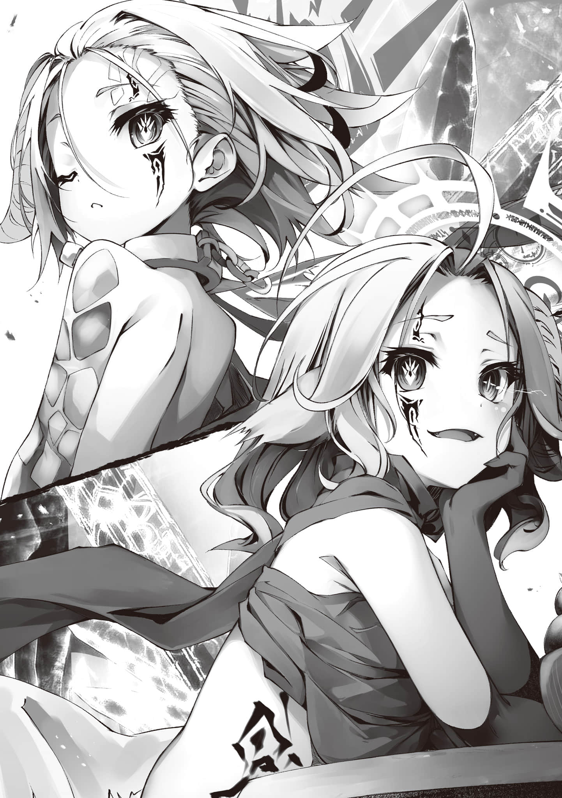
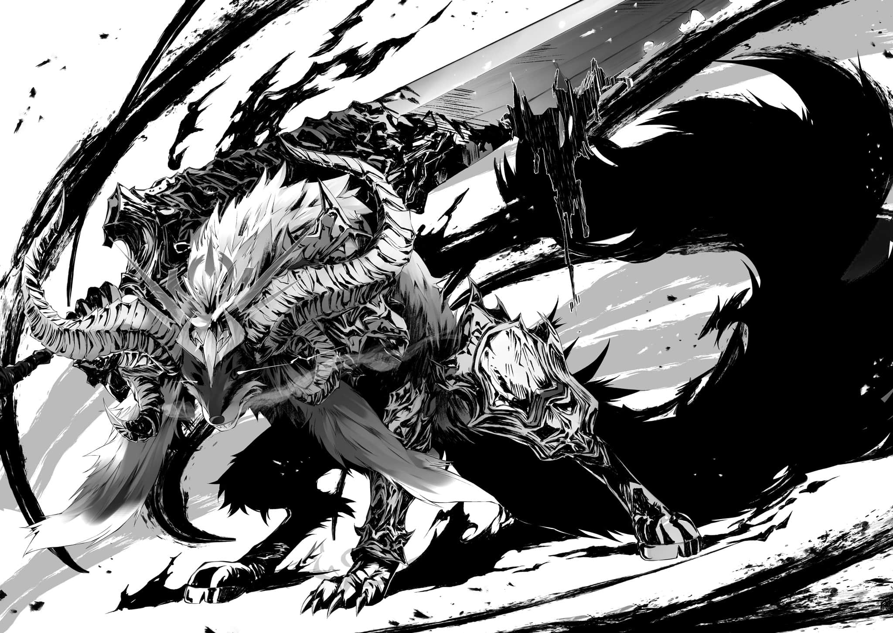
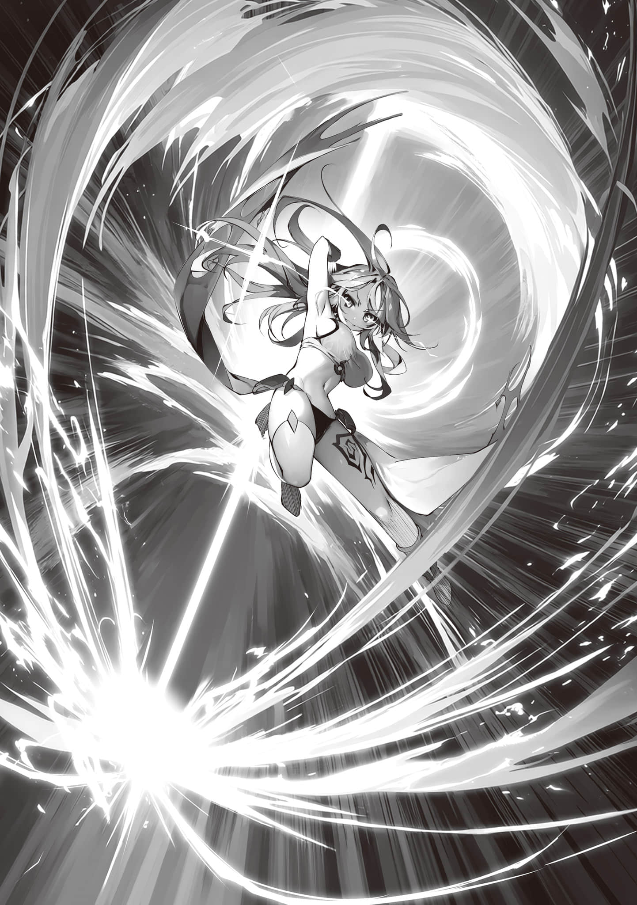

# 第三章 真实结局

> 来源：https://www.linovelib.com/novel/9/326408.html

……在很久很久很久以前，

由于诸神力量的碰撞，大地漂浮到了空中，给地上带来了灾难。

这只是自然现象——只不过是暴力的产物而已。

然而，经历了漫长时间，深植于人们记忆和记录中的现象，

从人们的念想中获得了『核』——最终那个怪物(阿邦特·赫伊姆)诞生了。

——怪物只是飘在空中，

作为「重现过往天灾的装置」——在漫长的岁月里，持续飘荡于天际。

没有自我，没有意义，对于单纯的现象(怪物)来说，连疑问都不可能拥有。

在永无止境的时间内，怪物只是无私无欲地，如固有程序一般不断向地面降下灾厄。

——就像是乌云一样，

或者就像是永不停息的雷雨一样，只是单纯的自然现象。

怪物只是无意间、无意义地漂浮在永远的时间里——然而突然有一天——

《不逊的幻想啊，吾之降临之际，却依旧在凌天傲世》＊

（注释：神言，因此书名号。）

——突然出现在怪物身后的存在，不含一丝感性如此宣告着，

仿佛是在阐述世间道理一般，甚至不让人觉得有丝毫傲慢之意。

让声音回荡于空中的是——一尊神灵(神)种。

对于那些以思念之深浅来决定自身权能的神灵而言。

体内寄宿着庞大到足以彻底笼罩天地——『战』的神髓的这尊存在。

万神莫及，没有任何存在可与之比肩的最强，无双神灵——「战神」……

以及频繁无视自己——理应和自己心意相通的幻想种(阿文君)，阿兹莉尔十分生气。

正因如此，阿兹莉尔才会这样想着……

「说实话——其实我也还不是很明白喵……」

用极度沮丧的语气——倾诉着最近以来的烦恼。

「…………？」

单纯的怪物——仅·此·而·已·。啊啊，想必在那一天到来之前——

——看样子，再这样下去也毫无反应了啊……干脆真的哭出来算了喵。

---

■■■

又或是像为了下一个细胞的诞生而自灭的细胞一样。

啊啊，从一开始，就通过阿邦特·赫伊姆的视线和意识，一直注视着『魔王』，

——这样下去的话，就赶·不·上·小·空·的·要·求·了。

能够让·人·放·弃·对·死·亡·的·渴·求·——某人的『认可(希望)』是必要的。

受到来自上天的不容异议的裁决的幻想。

——『啊，因为说到底我们侍奉的终究只是吉普莉尔酱呢♪』，这样说着！

「简而言之，『活着』这件事，并·非·仅·仅·指·存·在·着·而已……大概，怀有「想要活下去的希望」，才是『活着』。现在的话，我会不自觉地会这样想喵……」

眼前的少年，阿邦特·赫伊姆的『核』的意识突然持续不断地流入脑中。

那么，这条命就不能轻易舍弃了。

在那些生灵中，不管哪一个本来都毫无意义、毫无价值……

——「希望」是必要的，或是换个说法——「借口」是必要的。

亦或是像天(我)翼种(们)轻而易举收割的万千生灵一样。

所以说——

朦胧的人形轮廓——空虚的少年眺望着遥远的某处。对着这样的少年——

就像天(我)翼种(们)一样，只不过是阿尔特修大人手中的消(武)耗品(器)罢了。

当场就打算什么都不管了，像个孩子一样撒泼打滚。

——也就是从一开始就注·视·着·『塔·』的·内·部·的阿兹莉尔，

不得已决定在『核(这里)』安家的阿兹莉尔，泪眼汪汪地嚷嚷道。

可即便如此，仍有人会告诉你：即·使·这·样·，也·可·以·继·续·活·着·。——那份愿望——比死亡更加沉重——

「在遥远过去的那一天——阿文君的存在被阿尔特修大人认可了——被·需·要·了·喵。所以——阿文君从那一天开始——确实是「活着」的喵」

脑内突然闪过遥远往昔的记忆，对此感到困惑的幻想种。对于这份困惑，

被蓝色结晶所覆满的此处，便是幻想种的『核』之密室。

已经做好充分心理准备的阿兹莉尔深深地吸了一口气——然而，

啊啊——『活着』这件事，实在并非易事。

「为——什——么大家都不听我说的话喵!? 我明明是大家的姐姐喵!? 更何况我还是以天翼种族长的身份下令，起码听听我个人的小小请求吧喵!? 」

少年仍旧是用疑惑的眼神，注视着低下头去的阿兹莉尔。

本来也和『魔王』一样——只有稀薄的自我意识

——………

既廉价又方便，用完即可丢弃的——单纯的消耗品。

「……不过，我变了，大家变了，阿文君——也变了喵」

不过是具现化了的，不知何处的某(幻)人做(想)的梦(种)罢了——

「阿文君……我……果然真的被大家讨厌了喵……？」

——曾经只是存在着，不小心被诞生出来的，

换句话说——

「但是——如果我试图赴死的话，别人肯定会超级生气的，这一点我还是明白的……连这样的我，吉普喵也还·是·竭·尽·全·力·希·望·我·能·活·下·去·喵」

替自己的盟友(阿文君)说出了他陷入沉思的理由。

那大概是因为——说白了，就是产生了「执着」。

有用就多用，无用便丢齐——不过是如此而已……

——就像为被吃而生的家畜一样。

————、

——有他人希望自己活着。

「这不就是阿文君和『魔王(那孩子)』的区别喵？」

那视线本应注视逐渐坠落的红月，然而现在却望向遥远的魔王领。

这一年以来……和他们以相同的视角，匍匐在底面上，看着世界并不断思考，

……大概是这样。

至于阿文君，大概就是想要侍奉阿尔特修大人……想要派上用场……

即使这样频繁地搭话对方却仍旧一点反应都没有——

——————、

因此，自己才能希望自己活着。

早已理解空事前向自己打招呼的用意了。

渗透进了自己的内核，赋予了自我……

《汝——才配得上成为我那高悬于天际的宝座》

正好喵！！——这样的话我就自己按我之前说的把铁路架到『核(这里)』喵！！

啊啊——「生命」本来，就是极其微不足道东西。

脆弱短命而又无力、在眨眼间就会死掉的他们又会如何思考呢。

啊啊——阿邦特·赫伊姆也是幻想种，

生命本质上，就是以杀害他人、伤害他人、夺取他人的东西为前提的。

就像那些为被动物吃掉而诞生的植物一样。又如同为了被植物吃掉而诞生的微生物一样＊。

因此，对于仍旧疑惑地歪着头的少年(阿文君)，阿兹莉尔只能苦笑以对。

怪物成为了——阿邦特·赫伊姆，只是不知为何，它如此清楚地记得——

阿兹莉尔又叹了口气，苦笑着……

就我而言，大概就是因为不希望可爱的幺妹死掉吧

战神那时的决定如同坠入沙粒的水滴一般，

（注释：作者的神奇生物学。）

啊啊。而阿文君也是——

少年用仍旧空虚的视线看向她，微微歪头。

这样想着的阿兹莉尔去请求妹妹们的帮助，结果却被说「真好笑」，完全没被当回事！

啊啊，如果是在以前，连我自己也不可能明白的吧。不过，如果是小空他们的话——

（注释：吉普莉尔派系。）

估计是长姐困扰的样子很有趣吧，她们＊也纷纷用句尾听得出（笑）的语气来拒绝了。

啊啊………而且就连那些妹妹们也——

——阿邦特·赫伊姆——最深处。

「想必，本来——生命本身就毫无意义喵……」

——阿兹莉尔深深地叹了一口气，

所以——并非理想论——事实上没·有·任·何·存·在·可·以·独·自·活·下·去·………

不知是不是终于意识到了阿兹莉尔的存在。

「阿文君也是！！ 这样下去要来不及了喵——快点喵！～～真的是～～！！」

不断地杀戮、伤害、掠夺他人，明明最终谁都无法逃离死亡。

有意志的存在称其为阿尔特修，是为撒播战祸。

自己——至今仍未觉得自己的生命有什么特别的价值。

「为～～～什么会这样喵!? 我们姑且还是议会制吧喵!? 虽然从形式上来说，议(我)长偏袒特定的某个人确实是有点不好喵——但至少稍微帮我点忙也是可以的吧喵!? 」

「为了应对红月，要联络各方面的人！！明明要做的事已经堆得像山一样了！！明明我都用不了空间转移——会听我的请求得却只有吉普喵派系的人，这到底是怎么回事呢喵!? 」

将除了头以外的全身埋进带过来的被炉，一边剥着橘子一边说道。

——然而。

对于这样心不在焉，

向着眼前的少年——阿邦特·赫伊姆的『核』这样说道。

如果是为了吉普喵，或是为了妹妹们的话，自己能轻易地赴死。

本来必须要更早到才行的——！！

头上生出半边角的天翼种——阿兹莉尔。

阿兹莉尔为自己的想法感到可笑。

为何——现在会想起「那一天的记忆」呢。

「…………？」

只有这种相互关系，这种循环，

让即便有朝一日，一定会迎来死亡的我们——产生「那一日不是今日」的想法，

使我们期盼活下去——怀着名为『活着』的矛盾活下去。

「————————」

阿邦特·赫伊姆的核——有着少年外貌的存在复杂地扭曲了表情。

即便阿兹莉尔说的话是正确的，他还是浮现出了许多疑问。

然后，从那些疑问中挑了一个——

「……那么，那个幻(魔)想种(王)呢……？」

没错，幻想种是人们梦到的幻想——从某种意义上说，它们是应人们的愿望而诞生的。

然而在被阿尔特修认可之前，自己从未真正活着。

那么——『魔王』呢？

面对这个比起自己更在意『魔王』的发问，

阿兹莉尔脸上浮现出更深的苦笑，点头回应——

「嗯，那种希望所有人都能死的毁灭念头——终灭的念想。名·为·恶·意·的·希·望·的代理执行装置—绝对恶的幻想——它存·在·的·意·义·不·就·只·是·为·了·被·消·灭·的喵？毁灭世界——那样的希望，但同时也是绝·对·不·能·被·实·现·的·希·望·喵？」

啊啊，因为——

「大家，都·只·希·望·自·己·不·被·杀·掉·——喵」

「————————」

「就这样，一个充满矛盾的机制(系统)完成了喵」

也就是说——

「必·须·要·毁·灭·世·界·」

（注释：拍电影的那个咔！重拍！）

这样，充满矛盾的幻想(系统)。

——————？？？

啊啊——照这样继续下去的话，只会再现当时的场景吧。

少年沉默了——足足好几分钟，它好像并没有意识到。

——『魔王』只·是·自·杀·了·…………

这个故事，除此之外还能有什么别的救赎(Ending)吗？——

看着这样的魔王，史蒂芙、缇儿、伊纲都在不断思考着。

然而就在一瞬之后——笑声就转为了恸哭的嚎叫：

天翼种的全员都从虚空中进行了空间转移、聚集到了此地。

到底对阿兹莉尔的话理解到了何种程度呢。

————少年颤抖着说道：

【我想要实现阿文君的愿望喵，和我有一样想法的孩子——过来集结喵】

——巨大的质量凭空消失于天际……

『魔王』失去气力般地零落出几个字，而史蒂芙她们却想不出任何合适的话语，

连想要被他人需要都不被允许——啊啊，也就是说——

那是与幻想种阿邦特·赫伊姆共有力量的阿兹莉尔的声音，

「————？」

啊啊，最终阿兹莉尔洞穿本质，

「C——————U——————T！！」＊

怎么可以，绝不可能就这样结束。

——就在魔王正要继续说出『败北了』的时候，

除了身在『塔』中的吉普莉尔以外，

——终焉机构。绝望领域。破灭幻想。漆黑噩梦……『魔王』。

它——『魔王』到底是犯下了什么弥天大罪呢。

「————」

『魔王』继续丧失「希望」，最后归零——然后败北。

然而，『魔王』只要仍渴望着死亡，就无法死去。

自己那因为不理解而吐露出的声音，正微微颤抖着。

是的，仿佛终于找到了某·种·慰·借·一般，

「这样的话，我……我到底算什么啊——！！」

「——无人渴望的幻想……」

「…………啊啊……已经够了………我已经累了………」

空朝头顶开枪，带来了震天动地的巨响，紧接着.

但是……啊啊，既然如此。

空突然挑明的事实，以及这其中的含义——

没错——和阿文君一同挺过大战和终战、幸存下来的，我等这些与幻想种命运相连之人。

明明必须得去死，但只要还希望去死就死不掉。

它缓缓地屈膝，露出绝望的笑容。

最终，它终于产生了足以颤抖着发出声音的自我、意志以及明确的「希望」，

究竟是什么罪行，才配得上如此残酷的惩罚呢……？

说出了拥有着无数别名——终焉机构、漆黑噩梦、绝望领域——的『魔王』的真名，

难道说，那罪行就是『魔王』的诞生本身吗。

---

■■■

……只是——

「……已经……够了……」

如同盖上了盖子一般，寂静笼罩着广大的王座之间。

啊啊……确实，不会出现任何牺牲。

看着『魔王』头上显示的「希望」在逐渐消逝，众人终于明白了。

而——只与「绝望之兽」这一名称＊相称的那份悲恸，让史蒂芙皱起了脸。

为了实现幻(朋)想种(友)的小小心愿而聚集在此地的意义，阿文君果然还是无法理解。

然而，那样的话——这就并不该是『魔王』所应背负的罪行，

——真的可以，就这样落下帷幕吗？

「来吧，带着阿文君一起转移喵——目的地魔王领『加拉德·高尔姆』喵！！」

随之，阿兹莉尔下达了指令——下一个瞬间——

他以比肩枪声的音量，强硬地打断了『魔王』。

由此而生的失望——不，绝望，让它丧失了「希望」——然后。

——刹那间。

————

……不被任何人期望、不被任何人需要，就这样擅自被创造出来。

——啊啊，这就是，

明明必须要毁灭世界，却又不能毁灭世界。

「自·己·必·须·去·死·——」

唯有能和他共有意识的阿兹莉尔，才能真切地听到他那痛苦的心声——

从史蒂芙、白再到伊纲、缇儿都不由得这样想到。

己方便能在这场游戏中，取得胜利。

——不·管·是·活·着·，亦·或·是·死·去·，都·不·被·允·许·……？

最终，打破了漫长沉默的，居然是笑声。

曾经的，地精种小队与魔王同归于尽，那无法解释的结局的答案吧。

爆发出与这些别名极为不相称的——悲恸的哀嚎。

——啊啊，换句话说所谓『魔王』就是……

自嘲的笑声回响于王座之间，

……『魔王』也不会死去——只是进入『休眠』……

「被迫背负起世间的仇恨，被众人称之为恶，被期盼着去死——却·又·永·远·无·法·死·去·…………」

『魔王』希望(期待)着地精种小队杀死自己，然而最后自己却把他们杀了——

「————「绝望之兽」……那就是……『魔王』喵……」

「哈哈哈……呵呵……哈哈哈哈！！这都什么啊……」

「……那样——太·残·酷·了·……」

（注释：第二章有说，这是唯一的真名，绝望之兽。）

阿兹莉尔这样笑着。然后——

「我们一定就是为此，才被空叫去(被空需要)的喵♪」

「是啊，这故事也太无可救药了——然后，要·去·吗·喵？」

充满扭曲混乱及矛盾的装置，系统，终于形成了具体的形态——

而应是那些将魔王创造出来的人所该背负的罪行——

——魔王之塔·最上层。

真的可以，就以这样一个充满绝望的胜(Ending)利来收场吗？

在场的全员都察觉到了——沉浸在各自的思绪中，茫然自失地伫立着。

那并非是作为天翼种族长，亦或是十八翼议会议长的发言，

「——啊啊……虽然这个结局有些仓促，但是勇者们啊——」

——然而·——

突然——

【——在此宣告喵】

阿文君对此却毫无自觉。阿兹莉尔对他说道。

…………，

于是就这样——陷入了『休眠』……

「……那样————是·错·的·」

单纯只是——作为名为阿兹莉尔的一名天翼种个体——

————咚！！

在向全体天翼种宣告着。——然而，

即——

「——这是你们的胜利……是我的——」

而看着明显还处于困惑中的少年(阿文君)，天翼种全员脸上都露出了各不相同的笑容。

对世间一切感到疲惫不堪，『魔王』有气无力地说着，

「CUT CUT CUT！！大错特错！！怎么行呢，不～～是～～～这个发展！！」

所有人都茫然不知所措，包含『魔王』在内，所有人的理解都被甩开到了九霄云外。

「全部～一切～都错了！！ Oh，NO——这样连三流都算不上，你这八流魔王！！」

空挠着头径直走向『魔王』，怒吼声依旧不绝于耳！

「完——全没有做到啊！！在三途川那边不是教过你怎么演一个合格的魔王吗!? 你这家伙在最终决战(La stBattle)前尽说些什么扫兴的话啊——你是在小看魔王这一概念吗!? 」

————

「…唉，诶诶……？因为你刚才不是说——对，对不起!? 」

——让我这么消沉的不就是你吗？

『魔王』的反驳确实合情合理，然而空的话语已经逼近到了眼前，

加之空毫无隐瞒的——与那做·作·的·话·语·完全相反的——认真的眼神。

以及充满全身的，强烈的、认·真·的·意·志·，让它被压迫地不由自主地道了个歉。

然后空更加夸张地——做作地用脚尖跺着地面，一副无可奈何的模样。

他取出手机，开始匆忙地在上面写着什么。

「真——是——拿你没办法啊，就破例这一次啊!? 我来亲自指导你台词，给我对着提词器好好念！！区区人类语你总该能看得懂吧!? 幻想种既然以超越种自居，那么哪怕是十三流魔王应该也看得懂吧!? 」

「……呃……嗯……看得懂——遵命，我看得懂！！」＊

（注释：前面一句看得懂为平辈语气，从后面的看得懂开始切换成了敬语。）

——你tm在对谁用平辈语气讲话啊？＊

（注释：此处是混混用语+关西腔，双倍语气。）

被那双区区人类种的眼睛所紧紧盯着，魔王不由得改用敬语回答。

「好—那就——————嗯，大概就这样吧，拿着！」

将触及的地面砸得粉碎，划过空中产生的冲击波则摧毁了四周的墙壁和柱子。

「话先说在前头，读的时候要带感情啊!? 要是再用那副寒碜的表情讲话，我就真的要怒了啊!? 」

将这一切攻击，在毫厘之间看穿、化解，勉强应对过去的同时，

众人毫不松懈地摆好架势——等待空下达「作战」开始的指令。

然后，终于——

——这一次才是。

就这样，在那瞬间，

「放心吧……到『第二形态』之前——这家伙暂· ·时·只·会·是·个·杂·鱼·」

明明和我一样，充满了矛盾——

难道说那是要让『魔王』绝望然后使其自灭——？

『魔王』一脸无趣地这样说着，一字一句都完全照着空准备的稿子。

但是，它每说出一个词，每说出一句话，

——啊啊，空确实说过——

「好了，快把手机还我吧。收尾的话——你就自己即兴发挥吧！！」

「当然！！本大爷可是货真价实的魔王啊!? 稍微认真一下大概就有这种水平啦！！」

——为何明知会死还要诞生于世。

「你·这·家·伙·一·定·会·被·勇者(我们)打·倒·———我曾这样宣誓了！！而且我也明确说过，勇者——是绝不会打破『约定(誓言)』的人——没错吧!? 」

——嗯，最后的表情还是不太行啊，大概给个72分吧。

『魔王』没有回答，取而代之——它深深地吸了一口气，

那巨大躯体处在堪比瞬间移动的速度下，又同样以近乎瞬移的速度挥出重拳，

却被高高举起的『魔王』的双臂，

空那句意味深长的话——其中的含义，

这场游戏————是我们赢了！！他这样断言了！

正因为这群家伙和我一样，充满了矛盾

「「勇者到底是什么」——为何能够对抗绝望，将那答案展示给吾看吧！！」

那种无·趣·至·极·的·结·局·——这个男人，

然而——

才是那，毋庸置疑的「最终决战」。

「『你从绝望的深渊底部——从死亡的边缘复生，大费周章地再次站到吾之面前，难道就仅仅是为了告诉吾这种理所当然的事情吗！！』——呐？呐————勇者啊——————!? 」

伴随着粉碎大地的暴力风暴，最终决战「序幕」就此拉开。

————不，不对。

就这样，空回到了白和史蒂芙等人的身边——站回到了自己的位置，大声吼道。

「我说过吧？到『第二形态』之前都要温存体力——计划不变，都给我做好觉悟！」

那是以人类种的眼睛连认知都做不到的——以那巨大身躯来说不可能拥有的机动性。

「来吧——最终决战「序幕」——开始了——！！」

按照约定将手机交还给空后，『魔王』却陷入了犹豫。

空——才不会允许的————！！

魔王瞪大了那双大大的眼睛。

因为——现在暂时不需要担心了。毕竟——

『魔王』已经无法掩饰期待和希望＊——面露喜色地大声喊道。

没错——完美地、利落地，

然后————下定决心，开口说道：

勇者再次站到了我的眼前——正是那最终决战(La stBattle)，

众人纷纷发出好似悲鸣的谴责声，然而空却只是从容地苦笑着。

「……嗯，只要努力还是能做到的嘛毛球？给你89分吧」

「干脆利落地给我来一发魔王式的决胜台词吧！！」

「空殿下该不会真的是得了什么『终极圣灵药综合征』之类的病吧!? 」

就这样互相斗着嘴的同时——巨大的毛球张开了双臂。

「……甚好。啊啊，这才是本大爷翘首以盼的真正的勇者啊——那么！！」

「所以说——不好意思了『魔王』……你将抵达的结局只有一个」

用无可挑剔，完美无比的最高潮(Climax)来回应吧，让你曾立下的那个誓言也得以实现啊！！

————？

——「皆·大·欢·喜·结·局·」——！！

也就是说——『魔王』最后会被勇者打倒的，然后，

每一击都是致命的、蛮横至极的暴力。然而——

「空！！这次真的要「全力以赴」了，可以吗，的说!? 」

打倒『魔王』的手牌已经全部集齐了。

「喂，你！！怎么变·得·比·初·战·还·弱·了啊！！怎么回事啊！！你觉得这样温吞的攻击就能打倒勇(我)者大人(们)吗!? 别小看人啊你这巨型毛球！！」

「——就将吾(魔王)身上的原理性矛盾，超越给吾看吧。化不可能为可能，打倒无论何人都无法讨伐的『魔王』——即绝望，最终漂亮地回答吾的问题吧！！」

仅仅如此，塔便开始晃动，甚至能听到地面震动的声音，『魔王』展露出明显的敌意，

「————————」

然后只是呆呆地愣在原地——

「————」

即————

「不，还不～行♪继续温存体力。全员，要把消耗压到最低啊」

又为何渴望灭亡，将吾唤于世间，还矛盾地希望自己的生存。

就像这家伙刚才自己说的，原理上，不可能有人能杀死我。

——如同暴风骤雨般的猛烈攻击就要开始了。

所以——正·因·为·这·样·——！

这样说完，空转身大步离开。看着他的背影——不。

满载着希望(确信)——要将我打倒。

「又来这一套啊!? 」

看着刚丢过来的手机画面上显示着的，人类语的语句——

开始之前的这短暂的寂静则意味着——

带着魔王应有的的威严，『魔王』放声大笑，然后语气一转，改为用无奈的语气说着。

尽管这样，这家伙——不，是这群家伙，却毫无疑问——

说完空的稿子的最后一句话，

啊啊——那么。

「这不是当然的吗，『魔王』啊！！你这家伙才是，不会要说已经忘了我的宣誓了吧！！」

内心给『魔王』打了个及格分后，空架起『武器』———用演技回应道。

听着『魔王』说完，史蒂芙、伊纲和缇儿也终于从茫然自失中振作了起来。

「还有我那个手机里，放了超级多重要的图片和视频，读完了就赶快还我。————————听到没有！！」

————就这样。

就这样——空一边要求『魔王』归还他极其重要的手机，一边说：

然而，众人对空那句意味深长的话所产生的疑问。

————不明白。

然而，空仍用纯粹的话语，不掺杂一丝谎言地大声咆哮着。

以及仿佛与之呼应的——空的宣言打断了。

魔王手忙脚乱地接住空扔过来的手机，

众人很快就理解了——

面对符合魔王的举止言行，空也以符合勇者的举止言行回应——

（注释：这边之所以魔王会越来越有希望，是因为看到稿子的最后一句话，使它想起了在第二章末尾空的宣誓。）

「『谁都无法抹杀吾，吾背负着世界对灭亡之期望，因而成为不灭的幻想，吾即魔王』」

---

■■■

众人察觉到这无需多言的的氛围，伊纲代表紧张的全员发问。

它头上的——临近枯竭的「希望(HP·MP)」便不断增加。

白和史蒂芙她们也效仿空，毅然决然地架起了各自的『武器』。

——『魔王』的攻击依旧极其猛烈，

没错——简直做作得离谱。

「『呵呵呵，哈——哈哈哈！！……还以为你要说什么，吾当然会还』」

『魔王』挥下双臂，迸出黑色冲击波。

没错……那么结局也必然和这个男人宣誓的一样，

对，计划——「绝对不能变更」。

众人也不得不赞同空的挑衅言语。

——『魔王』的攻击，明显变得比初战要弱得多。

虽然仍旧不容许刹那的判断失误，必须做出精密无比的处理。

然而这些猛攻全都——比起初战，发动时间略微久了那么一点。

另外，史蒂芙需要通过盾牌承受的伤害也明显少了很多。

那么必然——露出如此破绽的『魔王』，

「～～～吵死了吵死了吵死了！！我已经很努力了啊!? 话说回来先前让我那么沮丧的不就是你吗！！怎么可能一下子就恢复成原来的状态啊!? 」

它含泪反驳着空的挑衅的同时，却仍不断地单方面挨打——

「哼——，明明是个『魔王』，心灵怎么这么脆弱，这就破防了，真服了！！」

一个黑球突然逼近眼前——千钧一发之际，缇儿用『大锤』帮忙挡下了攻击。

感受到那名副其实的掠过脸颊的死亡，流下冷汗，但仍旧持续挑衅着的空想到。

啊啊——没错，这家伙——『魔王』，

连心灵上都是个杂鱼，单纯只是一个毛球而已……

如果只是幻想种——只·是·单·纯·的·装置(系统)的·话·是·不·可·能·这·么·弱·的！！

所以这家伙还没有使出全力。不，是无·法·使·出·全·力·。

想必它迄今为止，应从未真正使出过全力吧。

照这样下去，它这次也——到最后都使不出来全力，就这样结束……

（不过——那样一来，这·边·可·是·会·很·困·扰·的·啊————！！）

所以——！！

「话说现在的时代已经不流行了啊！！这种『杀了我吧』的剧情展开！！而且还是像你这家伙一样的毛球——根本构不成画面啊！！退一百步来说，给我变成美少女之后再重来一遍啊!? 」

「虽然我也完·全·不·明·白啊!? 不过就是这么一回事啊——!? 」

让这个游戏在原理上无法被攻略的原因，并不是「那个矛盾」。

「————————」

——为何，能将生存视为渴望之事呢。

如果只是舞台装置的话，就能作为一个便于进行表演的道具，理所当然地存在着吧。

——这个世界擅自创造了你，你又有什么理由对它讲情面呢？

「因为我们，不·管·是·几·千·回·还·是·几·万·回·，都·会·把·你·打·倒·的·♪」

希望毁灭的同时又拒绝毁灭，不负责任的人们的，充满矛盾又破绽百出的希望。

但是这一次，终于是——用自己的语言，发自「内心」提问了——

那幻想(系统)，确实是从充满矛盾的希望中诞生的吧。

空的话语，不管其中真意到底是什么——

——没有丝毫的余裕。

为此而诞生的怪(我)物——和你们，到底是哪里不同？

终于获得了自觉的『魔王』，再次——问出了空指引给自己的、应当质问之事。

究竟是谁——屏住了呼吸呢。

然而，空如此确信。

「……喂，你们几个，这家伙到底在瞎扯什么啊？」

过于漏洞百出，空和白、伊纲、缇儿都纷纷瞄准这些漏洞进行攻击。

生存无意义，灭亡亦无意义。

眼睛瞪大到不能再大的『魔王』听着空说的话————

——想必，根·本·不·会·有·什·么·问·题·，世人早就能讨伐成功……

世界若是渴望『存续』，那么魔王就注定会被无数次打倒。

————————、

「——勇者们啊……你们为何——能与绝望抗争到这个地步呢」

——无意义地诞生，无意义地希望毁灭，无意义地被杀死。

「那个……空殿下？我们姑且应该算是勇者……」

「……吾乃魔王——幻想种……『魔王』……」

「别找借口了毛球！！你都渴望死亡了，这不就是承认了自己没有干劲了吗！！死·了·的·话·不·就·无·法·毁·灭·世·界·了·吗!? 至少让我看看你的斗志啊！！斗志！！」

如果『魔王』真的只是单纯的幻想——单纯的装置……单纯的……怪物的话，

不过这次果然也一样——咚咚！！

「～～～我，完全跟不上你的情感变化啊，你这到底什么情绪构造啊!? 」

也不会因为失手杀了地精种小队——而深陷绝望进入『休眠』了吧……

————、

四声枪响——也就是说

「————？所以话说为什么勇者会在推动世界毁灭啊!? 」

那是因空的话语而降临的、饱含复杂感情的寂静，

被期望去毁灭这个世界，同时又没有任何人希望它能实现……

「……抱歉，伊纲也不是很懂，的说……」

『魔王』则是那些希望的代理执行装置——单纯的『评判者』——

然后——同样地，

勇者啊——反抗绝望之人啊……即，怀着希望战斗之人啊。

「……不想杀死任何人——「所·以·」期望着自己的死，这是」

众人没有正面回答，只是移开目光，这样回应道。

「话说回来!? 我们都已经自封装备和技能来「放水」了，你这菜鸡杂鱼如果不用无(作)限回复(弊)的话已经都被揍得落花流水整整两回了啊——你这家伙到底有没有毁灭过世界啊!? 」

——因为那挑衅的话语就是「胜利的条件」之一，

「怎么可能毁灭过啊!? 如果有的话世界不早就毁灭了!? 」

「想要毁灭世界——却·又·不·想·杀·害·任·何·人·——」

「喂！！你的言语比你的攻击还痛啊!? 刺得我生疼——我要哭了啊!? 」

和被称为幻想种的，那种意义不明的东西无关。

「就是啊～～!? 可就你这种家伙！！还有闲心去担心那些——根本不把你放在眼里、自顾自发起战争、在灭亡边缘反复横跳的家伙们的世界，真是笑掉大牙！！我把话给你说清楚！！就算你使出全力几千几万次，也根本毁灭不了世界啊——别太自以为是了，你这只蛞蝓!? 」

果然———这过于轻松了。

万一魔王真做到把世界毁灭了——『灭亡(那)』便是世·界·达·成·的·共·识·，仅此而已。

毕竟，逻辑上来说————？

由白的两发『瞄准弹』和空的『毒雾喷射毒气弹』、『油脂燃烧凝固汽油弹』，打破了寂静。

——陷入困惑和混乱的『魔王』所发动的——攻击。

原本，那只是名为『魔王』的——没有自我的幻想(系统)罢了。

都·不·应·该·有·希·望·或·是·绝·望·……

自相矛盾，充满缺陷、毫无意义地诞生、又毫无意义地消逝，都处在这种命运之中。

「————」

被期望去成为绝对的恶，同时又没有任何人肯定它的存在……

那么，因此——究竟为什么会有如此之大的不同。

「明明战斗还在进行中啊!? 别太天真了你这毛球，嘿～嘿嘿！！」

更重要的是，空的「言弹」，正不容分说地削减着『魔王』的「希望(HP)」。

即便如此，空依然不顾一切持续挑衅，

空仍高声不断地煽动着『魔王』。

「……既然你要求它要有魔王的样子，那空你自己是不是应该先表现得像个勇者呢？」

就这样，当『魔王』再度开始发起攻击，众人也举起『武器』，纵身跃起——

不过这·次·貌·似·只·有·毒·b·u·f·f·生·效·了，带着这一困惑，空以讥笑回答大叫着的『魔王』。

——说实话……众人非常想出声同意『魔王』，然而最后还是把到口的话咽了回去。

「你这家伙自身，你的自我，你的『灵魂(内心)』所渴望着的希望，不是吗？」

——九成「希望(HP)」被削去，『魔王』终于弯下了膝盖。

「————诶——？ 哇!? 咳，咳!? 」

即使处于虚弱，『魔王』的攻击也全是致命的一击。

——寂静无声……

反正你是被擅自创造出来的，那你也擅自去做不就好了……？

除空以外，其余所有人都一言不发，这便是最好的证明。

「……所以说啊，来吧。放·心·地·使·出·你·的·全·力·吧」

——不是没有任何区别吗。

————

然而——除了白以外——面对投来疑问视线的『魔王』，

「你，你们这群家伙——居然在这种氛围下进行攻击吗!? 」

「所·以·请·杀·了·我·——是这个意思吗？失手杀了一个人——就因为这种破事每次都要「绝望」一下，这种玻璃心的毛绒玩偶，有什么资格自称『魔王』啊。要开玩笑的话就光靠你那副外表就够了」

「————————」

然而，空却不在意地继续说着——

因此还险些玩脱，为此众人还必须拼死地持续保护他，

空的挑衅也再次开始了！！

就不会因为发现失手杀了空而绝望，

无心的『审判机器』……然而——

这早已超越了那种机制，是存在于其彼·端·的——

而那些终于理解了其本质的人，无一例外都哑口无言。

作为装置，却无自觉地获得了自我、获得了心灵、获得了感情，因此成为了破绽百出的——怪物。然而。

「又不是我想诞生成这幅模样的别向我抱怨啊！！」

世间万物其发生与尽竭皆无意义。

——这样说着，空抬头看着『魔王』巨大的身躯，苦笑起来。

在突如其来的寂静之中，

「世界什么的，你想·毁·灭·的·话·去·毁·灭·不·就·好·了·!? 」

空无畏地笑着——然而，他用温柔的语调接着说——

最终，『魔王』都不由得停下攻击发问道。

——啊啊……『魔王』……

如果时间终将平等地将一切存在引向名为『死』的唯一结局的话——

然而……名为『魔王』的，是极其难以理解的幻想种——

正因共有着这一不容置疑的前提——然而，究竟是否真的如此呢，

「为何能希望活着——勇者们啊。你·们·，究·竟·是·什·么·呢·……？」

——如果只是单纯的装置——单纯的怪物的话，

没错——那就是。那才是——

你们必须要面对——这由希望带来的、无可救药的矛盾，

要如何跨越这矛盾，并伫立于绝望前呢———

就这样——看着想要紧紧抓住希望(答案)而提问的『魔王』，

空温和地笑了，并郑重其事地——开始编织话语：

「啊，魔王啊！！绝望之兽啊！！那么就听好了，现在我方能回答你了」

按照约定。遵循誓言，这一次，终于能将那问题的答案，

「所谓勇者——便是绝不会违背誓言之人——即」

——以及那答案的前方、一一道出。没错——

反抗一切命中注定，否定一切事不可为，

无论面对怎样的绝望——都能一次次地高呼「绝不」。

即·便·如·此·也要坚持，下·次·一·定·就能获得成功。怀着这样的想法，直至抵达『胜利』——

如此宣誓，持续前进(挑战)的意志，即「希望」。

绝不偏离此道之人便是勇者的话——那么——

——勇者便是背·负·着·那·矛·盾·——却·仍·继·续·向·前·迈·进·的·人·——

我们这些只要存在于世——就会「慢慢死去「的人们。

但即便如此，我们仍怀有希望、怀有目标、能去不断积累。

那么——」所谓勇者，究竟是什么「——？

要真正回答这个问题——其实再单纯不过了吧？

「不断与绝望抗争，而终将打倒绝望之人——便是勇者」

「————————————————」

————『那·还·用·说·嘛·』♪

最终坠向大地的「那个存在」，缓缓地，

即——以沉默的方式，展现出了近乎无穷的「恶意(HP·MP)」。

只是像个『魔王』一样——无需顾忌，想问什么就尽管继续问吧。

如同拙劣的拼贴画一般，以生拼硬凑的方式共存着，毫无条理可言，

从破裂的甲胄中，露出长耳、鬃毛，以及飘动着的尾巴——那是一头巨大的野兽。

成为了将战斗提升至另一个次元的导火索————

「————如果是你们几个的话，或许能做到吧……？」

宛如扎根于天穹的球茎一般，是一团即将腐朽的黑色球体。

「呵呵……呵哈，哈哈哈哈哈哈哈……啊啊——那么，就认真地，来玩吧……」

只要是生灵，在其面前就必然会因威压而战栗，最强的幻想种『魔王』……

因此——

始终在用温柔的语调——依旧煽动着『魔王』。

三人的对话将严肃的气氛一扫而空。

越过那一瞬的黑暗，再次睁开双眼的他们，究竟目睹了什么——

毕竟就连白，以及强装镇定高声叫喊的空也心里没底——

所有人都不由得浑身发抖，牙齿打颤，僵在原地。

——啊啊，眼前正是名副其实的『魔王』……

那过于异样的姿态——那压倒性的存在感。正是具现化了的绝望。

——比如，『这个世界还有存续下去的价值吗』

但他还是宛如聆听到了福音一般，终于——『魔王』震颤起了身躯，

确凿无疑的『魔·王·』真·正·的·姿·态·……

——如同暴风般肆虐的黑色风浪中，众人本能地用手臂遮住脸庞。

那就是——不久前他们还在与之战斗的存在(东西)，即，

『魔王』——被·赋·予·了·存·在·的·意·义·——

无限接近于神，却连众神都无法歼灭的，无双的怪物。

但是——空仅以与妹妹紧握着的手作为唯一的依据，

——那是，一座已经腐·朽·坍·塌·的·大·圣·堂·。

尽管实在与『魔王』的形象极为不相称，

众人闭上双眼，仅那一瞬——原本投向『魔王』的视线就此中断了。

「喔，喔喔，喂——那那那，那个，真打的过吗、的说——!? 」

代替那些陷入绝望而渴望世界灭亡的人们——不断地发问就可以了啊。

「空、空殿下白殿下！你你你们两人才是，完全没有什么恐怖的概念吗!? 」

---

■■■

……啊啊——「那」究竟是什么。

「————————」

————魔王之『核』——其中的」内核「……

他们却因为其他理由而浑身颤栗——然后，大叫道：

有着人形的——弓着背仍有数米高的身躯，

然后——在那毛茸茸的脸颊上，确实地渗出了泪水……

身披腐朽的铠甲，单手扛着同样已经腐朽的巨剑的——「野兽」。

————

众人纷纷将这样的视线投向空和白，然而这一行为也确实无可厚非。

是崩塌的洞窟，是死亡的沙漠，是干涸的海岸，是连瘴气都已断绝的深谷，是失去了热量的火山——更是连火焰都已熄灭的古战场的亡骸——是的……

「你这家伙——果然有「真实形态」啊!? 什么啊你那·帅·爆·了·的·野·兽·形·态·!? 这么严肃冷酷的家伙之前居然在和兽(伊)耳幼女(纲)嬉戏，这样一来之前的所有事件不都得全部重新解读了吗！！那这样看你这家伙的道德观念完全崩坏了啊!? 」

又或是应该称之为「真核」——然而，不管怎样，

被那锐利眼神射穿的众人，无需多言便明白了其中的含义。

不知是谁咽了口水，紧接着，所有人都惊愕地睁大了眼睛。

扼杀掉恐惧，堂堂正正地断言道。

至此，在塔内所见过的每一处景色(场景)，都无一例外地、腐朽到了骨髓深处。

都荡然无存，唯有「不可思议的景象」一直延伸至视野的尽头……

「——好吧。既然如此，就请你们大显身手，然后证明给吾看吧——勇者们啊」

如此异样的姿态，其头上显示的————究竟有多·少·条·……？

「……啊……人·设·没·变·？…………嗯，勉(原)强能接受(谅)吧……还好还好……」

紧接着，言外暗含「可别让我感到后悔啊？」——的那后半句话，

——那里——早已不再是先前自己所在的大厅。

——听到这番话，好像显得由衷满意，

是已变得面目全非的巨大毛球——其实只是『魔王』的「外核」。

「你不管付出全力几千回还是几万回——最终都会被勇者(我们)击败♪」

就这么简单而已。

「————————」

「「战胜这世间所有的恶意」——将这不可能之事超越吧」

诞生而出的「某个存在」，仿佛发出了新生儿的啼哭一般——

如同拨开尘土飞扬的帷幕一般向前走去——直至它编织出话语为止。

众人终于取回些许余裕，恢复到了勉强可以发出悲鸣(吐槽)的程度。

「它」——是任何人都不曾目睹的存在。

然而在这一时刻，没有任何人能察觉到这一点。

「我再重复一次——『魔王』啊——别太自以为是了哦？」

——漆黑而巨大膨胀着的——「某物」……

「所以我不是一直让她停手吗!? 还有——虽然我确实是魔王！！但唯独被你这种人来说教我的道德观念，实在让人无法接受啊!? 」

这个世界——只要仍充满勇者(活着的人)，

那是绝对到令人绝望的，「恶意本身的具现化」——也就是

「当然，勇者不会背弃誓言，所以不管多少次我都会说——能·打·倒·」

在翻涌混沌的天穹正中央，有一处仿佛嘲弄着重力一般，镇座其间的存在——

就这样，在堪比永恒的漫长时间中，第一次。

然后——从球体的底部，裂隙骤然蔓延。

————

「还是说——你想用」因为放水了所以我才输了「这种理由当·借·口·来给自己留退路吗♪」

然而空——却如同呼吸一般自然地，

空紧最后说出的话——其弦外之音，魔王切实地听懂了。

而后，于裂开的头盔中，「它」闪烁着锐利的目光——开口说道——

同时，也是一片失·去·了·生·命·的·巨·大·森·林·。

然而即便如此，她们还是无法掩饰声音的颤抖……

然而，真正让众人屏住呼吸的，并非是那景象本身。

『魔王』仰起头——为了掩饰自己拭去眼泪的动作——

世界终灭的幻想——甚至能够创造整个种族的超越者——即

——对，

——所有人都下意识地想要寻求依靠——

————————

「所以说啊，咱们都别再藏着掖着了，认真地来玩(战斗)吧？」

——所以『魔(你)王』啊，尽管继续保持『魔(你)王』的样子，就可以了啊。

——不，应该订正一下……有两人除外。

只要你想问，不管多少次勇(我)者们(们)都会和你一起玩(战斗)——并这样回答你

然后也学空无畏地放声大笑，站了起来。

————真的能打倒这样的怪物吗？

终于——在漫长的沉默之后，

啊啊————

数十条？还是数·百·条？那无数的，重叠在了一起的血条——

倒伏的柱子、破碎的墙壁、龟裂的地板——甚至连天花板

「这这这这一点也不好吧!? 」

『魔王』的嘴角扭曲成了笑容——

「来吧，终于到了『第二形态』——那么「按计划行事」，从现·在·开·始·解·除·一·切·限·制·！！」

——面对似乎下一瞬间就要开始行动的『魔王(野兽)』，

那简直是即将袭来的雪崩——但空只想到，「来得正好！」。

随即露出狰狞的笑容，并咆哮道回应。

啊啊——从现在开始才是真正的考验，是名副其实的决胜时刻。

白、史蒂芙、伊纲、缇儿，

以及『袋』中的吉普莉尔和依蜜尔爱因，

都强行驱散恐惧，目光变得锐利，集中了全部的注意力。

——「按计划行事」——

啊啊，那是周密至极的作战计划——但也是个如同要贯穿无数针孔般的艰难任务。

能完全执行到位的话就是「必胜」——否则便是「必败」的——

——All or Nothing的最(高)终决战(潮)——

「来吧————让这场游戏结束吧————!? 」

正因如此——才显得无比开心，快乐至极，

空内心大吼着「多巴胺要炸了」，如此说道。被这样的空带动，

众人脸上也都浮现出「豁出去了」的笑容，然后以此为号。

就这样——『魔王(野兽)』的头上。

无数黑色球体涌现而出，覆盖住了整个天空。————紧接着——

---

■■■

——「全·员·交·换·！！」——

『魔王』将那份发自「内心」的敬意，如此这般地融入了话语之中。

接着，所能辨认到的只剩下——那一瞬的暴力所造成的残骸罢了——

『魔王』面无表情地如此低语道。

在这连一秒会被拉长成至永恒的战场上——

（注释：lesen，德语，咏唱，典开日语发音同展开；Hau rein，德语，上吧。）

——最终，确切地说，是一六分三二秒七七……

但『魔王』头上的HP槽还是由于不断被重复的挑衅，在不断衰减，尽管速度很慢。

而吉普莉尔和依蜜尔爱因则——因无法掩饰的焦躁和惊愕而扭曲了表情。

当然，二人确实连一丝一毫的余裕都没有。

——啊啊，在这场游戏中……

「——嚯！！真能避开啊！！刚才那招——！！」

『魔王』像是发自内心地愉悦着，如此高声宣告。

没错——正如『魔王』所嗤笑的那般，那正是二人——不·可·能·一·直·逃·避·下·去·的理由。

二人全神贯注于闪避才只能「勉强躲过攻击」。

——为·了·尽·可·能·多·引·出·一·次·攻·击·。

一步便将数百米距离归零的突进——以及紧随其后的、近乎无前摇的斩击。

撕裂大地、划破天空的剑气向两人袭来——

这一现实令『袋』中的空等人战栗不已，然而不等他们多想些什么——

更何况，在如此毁灭性的风暴之中，『魔王』竟然还发动了横扫进行追击。

「啊啊，这才是勇者！！靠天马行空般的巧思来挑战吾，确实很合理啊!? 」

「怎么会……也就是说那个毛绒玩偶的智力超过了仙人掌!? 」

——也就是如同初战一样——是为了揭露『魔王』的行动模式！！

二人能继续逃避的限制时间……

毕竟吉普莉尔和依蜜尔爱因，这两枚底牌，

——离谱也得有个度吧。

能使用的精灵仅限于『阳精』——也就意味着要消耗「希望(MP)」。

终于——那道声音响起了。

吉普莉尔和伊米尔亚因的「希望(MP)」，早已跌破三成。

「啊啦，真是巧呢♪我这边才是没有余裕、更没有义务去关照一堆破铜烂铁呢。要变成废铁的话请在我视线之外哦♪」

却不由得突然停下了攻击，一脸愉快地思索起来。

只是因为，除了激怒魔王之外，没有更有效的手段而已……

以名副其实的——「光速」，砸向地表，炸成碎片，造成了巨大的破坏与毁灭。

转而又像是在寻找安全区域一样，不断改变距离。

一般人根本不会这么干。啊啊，这才对嘛——————！

没错，即使一次攻击都没遭受过，

「【请求】请番外个体对现在这一场景作出感想。【指示】那就是一七八秒前还哭哭啼啼的，自称『魔王』的家伙的样子。本机先陈述感想——『草』＊」

吉普莉尔和依蜜尔爱因……不论哪一人对空等人来说都是「底牌」。

因此，从那一瞬的结果来推断——恐·怕·，

即便二人一直专注于躲避攻击，但『魔王』终于还是看穿了他们奇怪的举动。

——是的……解·除·一·切·限·制·的·二·人·——即，装备上了『防具』。

对于空等人而言，别说反应，连感知都做不到的、一触即死的猛攻。

仅仅一挥之下，腐朽的圣堂便化为了瓦砾，再一剑，沙漠中便出现了一条峡谷——

面对这些不讲理的——「不可避的初见杀」

——明显没有攻击的意图，却故意试图靠近。

因此二人正是超越了矛盾，才得以从『魔王』的攻击下不断逃脱——

——但是，

它却丝毫不放缓进攻，反而发出了嘲笑——

哪怕多争取一秒也好，哪怕那只是十分之一秒、千分之一秒——

——不断逃跑——仅·此·而·已·。

——舍弃了『空(逃)间转移(跑)』这一选项。

将「初见就能完全躲开」这一不可能之事——强硬地贯彻到底的。

「啧——察觉的速度，是不是比预想的要稍微快太多了啊……!? 」

——根· ·本·没·有·任·何·能·够·反·击·的·机·会·——换句话说，

将这两枚「底牌」打出，然而。

然而——急转直下，

——

二人头上的，正在无情地不断减少着的「希望(MP)」，昭示着。

「但是————还·不·够·啊」

——那是哪怕以天翼种之眼和机凯种的观测器来看，都会判定为是空间转移的行动。

唯有跨越这一不可能之后——才能将更·进·一·步·的·不·可·能·也·化·为·可·能·。

连地(缇)精种(儿)和兽(伊)人种(纲)的眼睛——都完全没能捕捉到任何东西。

空发出短暂的咆哮，瞬间，『袋子』里的人和外面的全员进行了交换。

听着在互相开着玩笑——但似乎却并无多少余裕的两人的交谈，

若是拉开距离，黑球将自动追踪而来；一旦分心去对付它，等待着二人的便是『魔王』的夹击。

「——原来如此……？让我猜猜，你们两个应该是所谓的——「侦察干员」吧……？」

若试图躲避，它便释放撕裂全方位的光波；若想从死角逼近，又有黑球进行狙击。

「是啊～？稍～微获得了点力量就立刻得意忘形了……也是，此乃再典型不过的小喽啰(mob)行为了，反倒显得有点可爱呢♪」

也就是说，目的是不让『魔王』察觉到空的计划的真正意图——！！

在空的计划中被赋予的职责，正是

——在这一瞬间，究竟发生了什么？

就这样，『魔王』又一次不由自主地眼角渗出泪水。

——『魔王』终于察觉到了吉普莉尔和依蜜尔爱因的意图，

瞬间转移至『袋』中的所有人——人类种(空等人)自不必说，

——————

大概都被和空等人交换，「解除一切限制」而出击的二人——

「呐!? 你们两个，难道说根本还游刃有余!? 既然要求我表现得像魔王，那你们也表现得像勇者一点啊——怎么还在挑衅啊!? 」

空等人身在『袋』中，也不由得脸色一僵。

也就是说——

『魔王』轻蔑地笑了笑，漫不经心地挥下了那把腐朽的剑。

「哈哈！！精彩！！但是接下来怎·么·办·呢!? 继续逃吗？不，逃不掉的!? 」

如果空哪怕有一刻的迟疑，没有进行交换的话便已全灭，然而能造成这种后果的却还只是个「试探性攻击」罢了，

是那些覆满天穹的黑球，如同闪电一般倾泻而下。

吉普莉尔和依蜜尔爱因二人本身，也同样是不(离)讲理(谱)的存在。

『魔王』嘲笑着终将到来的，不久后二人「希望(HP)」耗尽后的未来。

「【猛省】误算了『魔王』的智商水平。【补正】推定值从3上调至9。大幅向上修正」

（注释：即www，代表笑。）

与平时的吉普莉尔和依蜜尔爱因极为不相称的感情——

「都·说·了——你们俩别光用·嘴·输·出·了，至少也进行些攻·击·吧——!? 」

『魔王』化为野兽姿态，在它身影微微晃动之际——当即决断地，

仅仅为了这个——就在第一手直接打出了最强的两枚「底牌」——!?

那刀光快得无法捕捉。剑锋之上，黑色的光波迸发而出。

连精·灵·的·使·用·都·不·再·受·限·，「全力以赴」的天翼种(吉普莉尔)和机凯种(依蜜尔爱因)——即便如此，仍然只是勉强撑过『魔王』全力的攻击就已是极限，然而——这还只·是·第·一·击·。

吉普莉尔和依蜜尔爱因躲掉了吧·，除此之外则无从知晓。

性能在持续下降——然而，在这场连纳秒级的判断失误都不被容许的逃亡剧中。

「【典开(lesen)】『解放超载(Ü berBoost)』——【警告】拒绝番外个体拖后腿。于该状况下，断定其支援本机的剩余性能为0。……Hau rein＊～」

明显的危机感和焦躁显露在了二人的脸上——再次艰难地回避了攻击。

——有趣，有趣！！

直接命中就意味着死亡——不言自明的这第二发攻击——又是千钧一发之际。

用刹那来形容都显得太久的瞬间内——『魔王』进行的全部攻击，

『魔王』无法掩饰伤心而大叫——然而，

只有自绝退路后才能使用的——绝境「底牌」……

采取夹击的架势却不进行攻击，只是观察『魔王』的对应方式——

——下一个瞬间。

「「————!? 」」

这回才是真正的，是「不可避」的……不，是「不可知」的攻击，

最终捕捉到了吉普莉尔和依蜜尔爱因——

——从上方——被「空间操作」击中了……

等到依蜜尔爱因的解析勉强追上的时候——然而。

已经是连同防具和自身的「希望」都被击碎了一半、被击倒在地之后了。

——然而——没·关·系·——！！

能代替Master们能吃下这一击，

——那就无需在意！！

瞬间来到试图起身的二人面前，『魔王』缓慢地——

「说是要吾拿出真本事来——但·你·们·这·样·还·远·远·不·够·啊·勇者」

如此这般持续说着、抹去了一切感情的『魔王』突然「砍伤了自己的手」，而在其头顶。

是那缓缓地，沾·满·鲜·血·向·天·举·起·的·大·剑·——在剑的前端。

是从开战至今，一直持续进行猛烈攻击——却一条都没减少的「希望(MP)」条。

深不见底的庞大MP——却在『魔王』将腐朽大剑刺入大地的同时。

——整·整·「八·条·M·P· ·」消·失·殆·尽·。

「——『漆刻』……」

紧接着，像是在回应魔王的话语一般——就在那一瞬间

这一次，伴随着声响，空间如同震动着般荡漾开来。

刹那的交锋、一瞬的攻防。在那空与白连看都无法看清的短兵相接之中——

被笼罩着二人的两个「某种东西」，无声地停下了动作。

瞪大眼睛发出悲鸣的——反而是『魔王』……

啊啊，因为『袋·子·』无·法·追·上·二·人·的·速·度·——注·定·会·被·远·远·甩·在·后·面·。

初见杀——将「不可回避」也一并回避，持续堆叠不可能之举的二人。

那一瞬间——仅一刻，空和白——便看穿了一切。

「但是，你们接·下·来·要·怎·么·办·呢？天翼种和机凯种——那两个家伙也只能做到四处逃窜罢了。虽然吾觉得不可能，但你们不会是打算只靠你们几个来和吾战斗吧……？」

却精·准·地·击·中·了·千米开外(数秒后未来)的·『魔·王·』，这事实一超乎了常理——

空从远处确认了从『漆刻(时停)』的影响中脱离出来的二人的身影。

————

——即使揭露出……来，——也————

「这就是你们想要的吾之全力(技能)——『漆刻』和『古血葬(Blood Bone Kasia)剑』——躲给吾看看吧」

————在那刹那未满的更早之时。

那爆发将自己的整整十·五·条·「希望(HP条)」一削而尽，『魔王』不得不立刻转身应对。

像是在回应之前呆在『袋』中观战的一行人的警戒一般，果然。

然而——空和白却轻松地笑了笑，回答道。

————既然如此，那么接下来这一击————

（——来吧，履行你的誓言吧——勇者啊）

然而——机凯种的演算速度超越了时间，才得以将发生之事揭露了出来。

——伊纲开启『血坏』，缇儿用『灵装』加速，二人一同逼近『魔王』。

更何况是在1000米之外，就看穿了数秒后的未来。

在场的任何人，应该都不会有任何异议——这是个毋庸置疑的事实。

连续击在魔王背上。

空低声说着的同时，无视距离被『袋子』吸入其中的二人的声音响起。

空与白不慌不忙地，如此褒奖着两人的出色表现。

————————？

最终三人才得以无声无息地离开『袋子』——接着。

『魔王』接下来的一击会伴·随·大·量·的·M·P·消·耗·，他们在近乎零的时间内看破了这点。

然而现在被『魔王』的浴血大剑所释放的——「不可觉」的剑刃给困住，

即便眼前的四人，根本不可能能与之抗衡。

「吉普莉尔、依蜜尔爱因——和伊纲交换」

没错，二人被减速至几乎静止的「时空气泡」所包裹住了。

——没错，发生了什么很明显。

然后————『事实胜于雄辩』————！！

————

那正是将枪口对准自己——悠然而立，发出嘲笑的勇者们。

……那冲击过于微小，

————————

即，白的『自动手枪』——的枪口初速只有300米每秒左右，

因此，那一斩——必将带来前所未有的绝对破坏力。

然而缇儿和伊纲，却毫无余裕地摆出架势。

也就是说——『魔王』将吉普莉尔和依蜜尔爱因，二人周围的

——因为两人都心知肚明。

以实际上足足三倍的威力返还给了『魔王』。

没错——1000米的距离对·于·这·个·『魔·王·』来·说·等·同·于·零·。

在足足有大约1000米距离的地方，站着三个身影。

就这样，将『魔王』本要用来切断时空的庞大的MP——

如同散步一样，轻而易举缩短距离而来的『魔王』，发出了赞美之词。

---

■■■

『……【致歉】本来估算还能再坚持一会的……本机的性能不足。对不起(Entschuldigung)＊』

以至于『魔王』在那一瞬间，甚至都没有意识到——那如同被蚊子叮咬般的冲击。

1000米这种距离，对那·个·『魔·王·』来说——

——啊啊，『魔王』那时确实是在缓慢地行动着——然而。

如同『魔王』所期望的那样，空等人击落了自己的这一击——甚至，远远地超越了预期。

「——————————!? 」

然而——

————首先『魔王』的『漆刻(技能)』将吉普莉尔和依蜜尔爱因周围的时间停滞了。

——三发微小的冲击，

「————喂……喂(oi)！！这次你们才是真的作弊了吧——到·底·在·搞·什·么·鬼·啊·!? 」

HP减半、MP不足三成、满身疮痍的二人如此谢罪。

那毫无保留的赞美、充满真诚敬意的声音，却——显得有几分遥远。

————

——吉普莉尔和依蜜尔爱因——

二人被静止的时空气泡所笼罩。

「……嗯……接下，来……轮到……我们……来达成……不可能……♪」

白的射击精度足以将那1000米的射击距离化为零，她首先射出了『瞄准弹』。

「没这回事，你们两人都做得很好。第一个不可能——已经顺利达成了」

这回轮到『魔王』无法理解、陷入混乱了。

——它是在困惑发生了什么？——不。

『……万分——抱歉，Master……＜二十分钟＞的命令，未能完成——』

不，不是声音被停止了，而是「声带」被停止了，身体也——被强行停住了——

不知是由于『魔王』因为惊愕而下意识解除了呢，还是说单纯过了有效时间。

然后几乎同时空射出『连锁引爆弹』，缇儿对此进行『模仿刻印』……

——不——不对……是连·思·考·都·被·停·住·了——

『魔王』早已理解发·生·了·什·么·。

「即使揭露了、知晓了其本质，仍然——不可避。正因如此才叫——「必杀」——」

——然后在距『魔王』千米开外的地方。

若能斩断此物——即——也只能是＜撕裂时空之刃＞

（注释：德语，对不起。）

然后，宣誓要将吾打倒。

出言让吾使出全力，

超越一切想象与预料的「不可避之死」，除此以外，二人再无任何其他结局——因此。

（——【假……定】——局部的……时空……减速——!? ）

「呵呵……哈哈哈哈——哈————哈哈哈哈！！难以置信！！怎么会！！当真把吾全力的一击超越给吾看了——!? 到底是怎么做到的!? ——不！！要问这个就过于不解风情了啊!? 真是精彩——太过精彩了勇者们！！」

在那三道微弱的冲击飞来的方向——在其背后、遥远的地方。

即使如此，那也绝不是人类种的眼睛所能捕捉到的动作。

————到底发生了什么!?

如此祈愿着，『魔王』架起血剑，摆出横砍的姿势。

这样超乎常理的事，使得『魔王』出于警惕——而拉开了距离。

然后——

『魔王』像是在试探，不断揣摩着事到如今还能摆出从容笑容的空等人的意图。

啊啊，绝不会违背誓言之人啊。

吉普莉尔和依蜜尔爱因将——连HP的概念都形同虚设，被一刀两断。

就这样，魔王仍旧以缓慢的动作，正如它手持着的那柄统御时间的血剑所昭示的那样。

为·了·这·个·破·绽·——吉普莉尔和依蜜尔爱因才不断地保持高速移动。

……终于。

然后，消耗了整整六条「希望(MP条)」，就要使出那斩断时空的一击——

然而空和白、伊纲和缇儿只是微微点头相互示意，随后摆好了战斗姿势。

也请漂亮地击落给吾看吧————！！

——「时间减速了(停止了)」，这一结论(超出常理之事)，然而——

『魔王』如此说着——却仍然保持着警戒。

然而，那三发冲击最终引发的，下一瞬间的冲击——却。

问题是——到·底·是·如·何·做·到·的·——

——啊啊……伊纲和缇儿的加速，确实超越了物理极限。

然而那与天翼种和机凯种相比，实在相去甚远——在『魔王』看来，那简直如同静止。

因此，它从容不迫地，像是伸懒腰一样，拔出剑迎击二人——

而那剑击——却在·挥·出·之·前·就·被·打·断·了——

于是伊纲和缇儿的攻击就毫无阻碍地击中了『魔王』。

啊啊，那虽然是在庞大的HP面前几乎等同于零的伤害。

别说惊愕了，不如说让『魔王』在意的价值都没有。

所以让『魔王』惊愕的，是停下了自己剑刃的枪弹。

是一介人类种——白的『被甲空尖弹』——以无比精准的方式。

——打·断·了·自·己·的·斩·击·，这一事实！！

——如果看到『魔王』的动作再射击，绝对来不及。

不——！！不如说对人类种而言，别说目视确认了，连认知剑被挥动了这一事实应该都不可能做得到！！

更何况白的枪弹甚至劣于音速——比·伊·纲·二·人·的·行·动·还·要·更·慢·！！

……这样的话——答案就只有一个。

那是无论多么难以置信，也只能承认的事实——

那便是，先前让『魔王』感到困惑的，事情的真相。

也就是说——

——这个人类种少女。白——比·『魔·王·』更·早·行·动·——不

是比·伊·纲·和·缇·儿·行·动·得·还·要·更·早·——完·全·「预·知·」了·『魔王』的斩击。

没有一丝细微的误差。精准无比，只是＜将子弹置于了＞——未来的轨道之上。

然而空接下来所说的，却是下一步——

「那～么……你刚刚是不是问——我们接·下·来·要·怎·么·办·来着？」

「……把『魔王』……「完封」……给你们……看……♪」

即便如此，空看向二人的视线依然毫无动摇，他继续说着。

「那么关于『第二形态魔王』的作战策略——现在开始召开「最后的作战会议」！！」

「——「二十分钟」，希望你们能从动真格的『魔王』手里——逃·过·二·十·分·钟·」

「啊，史蒂芙看不清也没关系，因为你还有更为重要的任务」

「这不全是问题吗!? 文字？这不是快到只有拖影吗!? 」

空以一种清澈澄净的「接受现实」的心境，带着如菩萨般温和的微笑说道。

——然而，关于那部分呢——现在还是先暂且不提。

——追溯到大约十四小时之前……

最终决战的前夕——这天晚上——在『准备之间』。

——『魔王』——本质上「渴望被杀死」，

对于吉普莉尔的发言，依蜜尔爱因毫无异议地点了点头。

---

■■■

（注释：全身全灵在日语中指「倾注全部精神和心力」，这里也指「精灵回廊全开」。）

「比如说——攻击前会伴有「希望(MP)」的消耗」

空笑嘻嘻地回应，众人却察觉到其中暗藏着的不对劲，

……然而就连『第一形态』都需要全部记住才能有胜算——那么。

是『魔王』的一·举·一·动·都·解·析·殆·尽·——并·构·建·了·完·美·的·对·应·方·式·。

无异于能否化·不·可·能·为·可·能·，这样的佛法问答。

——那画面，简直就像是在以最高速度滚动着的小说文本一样。

——「——能做到吗？」……

因此，上次会议时，空判断不会出现极端的攻击，从而得以事先做出攻击预测。

「——是我的错觉吗？按常理来说，这不该被称为『束手无策』吗？」

没错，正如缇儿用遥远的目光低声说的那样。

空随意地糊弄一下，咬了口面包——继续说着。

「在此期间，我希望依蜜尔爱因能够调动所有无人机，用多角度——将从『魔王』身上引出的、尽可能多的攻击·行动·举动·以及细微的习惯——全部进行解析·分析，并将这些数据传送到『袋』中的我和白的平板电脑上——能·做·到·吗·？」

当然，即便只是二十分钟，那也是建立在极致的困难之上——这一点空再清楚不过。

「……耶～……咚咚、拍手、拍手～……」

然后终于吃完了饭，他凝视着吉普莉尔和依蜜尔爱因——

然而，尚未达到空那种觉悟境界的人——首当其冲的就是史蒂芙，

将本应不可视、不可避的『魔王』的攻击模式——不

————

在二十分钟内——回·避·、洞·察·，并彻·底·分·析·掌·握·——

一行人终于开始对此认真思考，怀疑是否应该重新审视十六种族的分类方式了，空对此却毫不在意——

面对远超预想的离谱程度，众人不禁哑口无言。

「进入『第二形态』后，毫无疑问『魔王』会动真格地杀过来……姑且确认一下，吉普莉尔，「动真格地从正面杀来的幻想种」——这个，有多危险？」

「我来预言(回答)吧——我们不·会·让·你·有·任·何·行·动·的·机·会·，只·能·被·单·方·面·地·被·暴·揍·♪」

「……轻、松……没问题……完、美……」

「难道说又要把『魔王』的攻击模式全部记下来吗!? 」

人类种(空等人)、地(缇)精种(儿)、兽(伊)人种(纲)——对于这些依然处于会受到物理限制的种族来说，这一小技巧根本起不到任何的安慰作用。

面对这般断然的言语。

因为即使有前兆，而其后的反应跟不上就没有任何意义。

空和白的平板亮了起来。然后————

没错——全力以赴。连精灵的使用也不再受限——字面意义上的「全灵」＊的二人。

这个世界……果然不知道什么叫分寸啊……

依蜜尔爱因如人偶般端正的脸上浮现出不安，她这样低语着的同时。

如果把空间转移——即「撤退」的手段也舍弃掉，只要愿意承担这无法回头的风险——

听到那战战兢兢发问的声音，空却依然波澜不惊地断言道。

「————恕我直言……那恐怕是我·们·完·全·束·手·无·策·的·怪·物·吧……」

但是——

「噢，哦哦哦哦……？伊，伊纲，只能勉，勉强看清一点，的说？」

「正如位阶序列所示，第二位——不，如果只论『魔王』的话，它已超出了幻想种的范畴，是接近了神灵种的存在……因此，若要假定「与神灵种战斗」的话——在「从正面发起挑战」这一前提下，即便能集结三位数的天翼种，也根本无法构成一场『战斗』。当被·他·认·知·到·、并被·投·以·敌·意·的·那·一·刻·——想必就·会·全·灭·吧」

但由于这关系到主人的性命，她卸下了一切虚张声势，继续说道：

是超越了吉普莉尔与依蜜尔爱因所必须完成的不可能的，更进一步的不可能——

空用真挚的眼神看向她们——继续说着……

反过来说它·其·实·也·不·想·杀·掉·勇·者·们·，有着这样充满矛盾的希望。

「我们会在二十分钟内将那些所有都记住，找出应对方法——然后将其贯彻到底」

然后规则是必然对等的，当然也适用于『魔王』。

「「…………」」

啊啊，那即——

但正因如此，『魔王』才觉得难以理解，不禁哑然失声————

空突然发话，而做出友善回应的却只有白一人。

「……不过嘛，就算知道了也没什么意义？这才是问题所在吧……」

——再次陷入数秒的沉默之后。

也就是说只要盯着MP条，「毫无前兆的攻击」在原理上是不存在的。

「宇宙规模的玩意反正怎么都搞不懂」他这样想着——接受了这无法理解的事实。

然而即便如此——依旧无法断言能与之抗衡。

「啊啊，没·那·种·事·？毕竟，这是场游戏——有相应的规则存在」

面对先前『魔王』的提问。白和伊纲、缇儿纷纷架起『武器』。

不可能全部记住，也不可能全部涵盖。

「【模拟】……预测平板电脑上将要显示的信息量。按预估最大值进行传输。……开始验证」

然后——空的脸上浮现出比『魔王』更为邪恶的笑容——他架起枪回答道。

吉普莉尔和依蜜尔爱因只是以沉默回应，

——『魔王』感受到了，自诞生以来首次感受到的感情。

「就是这么回事，所以说像之前一样把攻击模式全部记下来是没用，不，是不可能的。别说应对了，连反应都做不到——不可视不可知的初见杀会一个接一个地冒出来吧。比如说瞬·间·凭·空·生·成·的·不·可·视·的全·屏·攻·击·——要是把这种东西也考虑进去的话，攻击模式就是无穷的了」

「————唉。从，从现在开始是也——!? 」

没错——这是一场游戏。既然是游戏那便有规则。

特别是吃饭被打断的伊纲，十分不服气地半眯着眼盯着空，然而。

——既然如此，为什么不早点说呢。

很难想象其攻击模式会与『第一形态』相同。

——仅用了16分32秒77的时间。

「啊啊，但要是吉普莉尔和依蜜尔爱因「全力以赴」的话，就另当别论——了吧？」

——真不知道怎么说……

「……空殿下，白殿下，你们二人……真的是人类种吗……？」

就连提出疑问的空，在得到这宇宙级别的答案时，也忍不住表情僵硬起来。

然而空仍旧嬉皮笑脸、自身也一边享受美食，一边继续开会……

兽人种和地精种都勉强才能看清，空和白却笑着回答「没问题」。

『魔王』终于理解了，这一事实所蕴含的含义。

重新投来的询问视线中所蕴含的意思，换句话说就是这样——

「啊啊，没事的。这·次·的·作·战·会·议·没有那么多要记住的东西。毕竟——几·乎·没·有·什·么·能·做·的·事·。想吃的话，就这么边吃边听也可以啊？」

——确实，想想就知道，如果『魔王』有所谓的『第二形态』的话。

对未知的「恐惧」——让它不寒而栗——

对他来说别说反应和认知——恐怕就连想象都做不到那种领域的战斗。

在众人正享用着如往常一般美味的史蒂芙做的晚饭时，

「首先，面对『第二形态魔王』时，上回做的攻击预测——恐怕毫无用处」

——不可避·、不·可·视·、不·可·知·的攻击，将其全部，

反而都认真地竖起了耳朵——除了按照空说的，继续吃起饭的伊纲——

「————————」

这样说着，空确认了作·战·的·必·要·成·员·都能顺利读取信息，

被问及此事的吉普莉尔，说出了若是以前的自己根本不可能给出的回答。

「哦，这种程度的话还勉强能看懂，ok的」

以一介人类种之身——要将已踏入了神域的幻想种，从·正·面·降·伏·给·他·人·看·。

而且——还是在仅二十分钟这样近乎于无的短暂时间内——

——要将进一步的不可能化为可能，空和白这样断言道。

「若是Master的命令，我将化一切不可能化为可能，并将其展现给您」

「【宣誓】为主人指引通往胜利的信息，本机将滴水不漏、丝毫不剩地彻底解析。——以上(Aus)＊」

（注释：Aus，德语，完毕。）

——怎么能说，「做不到」呢。

吉普莉尔折叠起双翼，合手跪下。

依蜜尔爱因优雅地捻起裙边，垂下头。

看着这样的二人，空也深深地低头致谢。

「好，那就把·这·两·个·不·可·能·作·为·前·提·——我来说说「最后的作战计划」吧」

空平淡地继续说着——将各自的《技能》和『装备』——全部悉数用尽。

在这名副其实的总力战上，倾尽所有毫无保留的策略＊————

（注释：不留余力的全员全资源作战。）

————

---

■■■

——于是，正如空所预言一般——别说挥剑了。

就连动弹都做不到，一切举动都被提前预判——被抓住前摇打断＊。

（注释：这里很像格斗游戏中的打康(counter)，即总在对手出招前先出手打中前摇，导致对手无法继续完成那个举动的情况。这要求压制的一方需要刚好只比对手欲行动的前几帧内进行出招，不多不少，如果早了就只能打中对方肉体，而不是前摇，就会扣血结束，但是己方也进入硬直。如果晚了就无法打断前摇，因为动作发生阶段已经结束，会进入到结算阶段导致相杀，即同时打中对方，在这里后果不言而喻。）

就连那无需前摇便可降下的黑球之雨，也被一·发·经·过·多·次·弹·跳·的·子·弹·给击偏了。

结果就是，出现了一种，『魔王』身为幻想种——超越种，都感到超乎理解的现实——

空和白没有丝毫失误。

这回终于轮到『魔王』勉强开口，尝试进行语言攻击。

————它以·神·速·将·剑·插·进·大·地·。

——简直荒谬……绝不可能，

——也就是说自己——只·是·，在·被·不·断·诱·导·着·行·动·罢了……！！

（——不对，不对不对，不对吧——肯定不是这样的！！）

面对这份初次发自「内心」的感情与自尊，最终『魔王』……

面对终于相遇的宿敌，该如何回应——这不是明摆着的吗。

（那么，吾应该怎么做呢？——不，没·有·采·取·任·何·行·动·的·必·要·……）

从鼻子和眼睛中流出血的两人的模样，正诉说着那一点……

那么，就只能是，他们正如宣称的那样——已经制定了能·够·应·对·一·切·的·战·术·——

没错——面对伊纲和缇儿的行动——『魔王』会有什么反应，

说到底，那不过是人类种智慧的体现，即弱者无法依靠力量，只能用策略、技巧、创意作为武器。而做到极致也能够触及神域的证明罢了。

还有封锁住『魔王』的白的如神附体的射击也罢，

绝对绝对绝对「不可能」！！

（…………真·的·会·这·样·吗·……？）

是更令人恐惧的——「正在创造」想要的未来……那是，

因为，若非至少有两位连『魔王』的理解都无法触及的怪物存在，这一切就根本无法解释。

持续分歧，拥有无限可(未)能性的世界(来)——其收束之处，就连神也无法得知！！

啊啊，那是考虑到了已经见识过一次的『漆刻』的，完美的射击。

没错————

它切开了自己的手掌，将巨大的浴血古剑朝天高举。

血流让大脑加速运转，毛细血管因无法承受而破裂，

当白的MP耗尽，或是射击精度下降，这个「支配」就会立刻结束。

这些家伙——并不是什么怪物，仅仅只是人类种之躯。

——没错，这显然已经远远超越了人类种的极限——然而。

这种想法本身，才是最不·该·出·现·的！！

我，身为魔王，如勇者所言——应表现的像个魔王一样的这个我！！

终于理解了的『魔王』，正因如此而更加震惊不已。

『魔王』——果然，不再受白封锁的影响——

没错……如果只是这样的话，他们在不久后「希望(MP)」就会枯竭。

然而，无论是何种存在——即便是「神灵种」，当然自己也一样，在·原·理·上·做·不·到·预知未来！！

面对有生以来第一次动真格(我)的魔王——他们从正面挑战给我看了啊!?

于是，发动『漆刻』所需要的庞大的MP便反噬给了魔王自身——

——「啊啊……有趣」……

而另一边，空和缇儿显然在·刻·意·节·省·M·P·……

——即·使·做·到·这·种·地·步·，这·也·已·经·是·极·限·了·。

因而『魔王』在承受着狂风骤雨般的攻击的同时，依然在不断思考着……

身为魔王，绝望领域、终焉机构、漆黑噩梦——幻想种的顶点，

那是能将其心理和习惯，将那一·切·都以恶魔般的方式彻底揭露、并彻底模式化了的怪物。

将迄今为止的不可能化为可能，展示给我看，达到了自身种族极致的人们。

然而——既然如此，那这又是怎么一回事!?

——我在永久的时间中翘首以盼的，难得可敬的「宿敌」——真正的勇者们。

哪怕只要有万分之一秒的反应慢了，哪怕只要有一处的判断失误，便会让人瞬间丧命！！他们就如同站在细如发丝的钢丝上一样！！

————「不可能」……

并且，为了将这种不可能化为可能——白因为《技能》的连发，——虽然使用了减少MP消耗的装备——即便如此，「希望(MP)」仍在毫不留情地持续削减着。

只是一介地精种一介兽人种，一介人类种，以我『魔王』为对手——却一步都不退缩！！

不可能没有想到！！不可能没有将之加入到计划之中！！

仅此而已，这是自己的胜利————

终于克服了惊愕、恢复了冷静的『魔王』开始思考起来。

会没有考虑到眼下的这种情况吗……

既然使出浑身解数、凭借深谋远虑、编织战术战略至极限，来向我挑战的，才是勇者。

缇儿和伊纲、以及空的普通攻击，

全部的攻击都被封锁——但也仅·此·而·已·了……

只不过————

就像是在对自身的思考作出批判一般，『魔王』在心中咆哮道——

没错——维持着超越人体承受能力的专注和思考，

——『魔王』的一连串动作，已远非第一次那慢悠悠的速度可比——

————

就连我现在的——这份思考，也全都在他们的掌控之内！！

——然而，正如先前所说的，这根本不是能让人接受的事。

「你这离谱的化身还好意思说这个!? 让我做到这个地步的不就是你这家伙吗！！」

要说为什么——因为那是比预知未来还要更加离谱的事……

然而，在一直承受着封锁自身行动的弹幕的同时，『魔王』仍在不断自我追问。

——本来等待我的自灭便可胜利的勇(他)者们(们)，

经历数次思考，结论依旧不变。

即先前将『魔王』的十五条HP削减殆尽的攻击——

毫无疑问——啊啊，何止如此————！

因而『魔王』只需要，虎视眈眈地等待着那个瞬间。

但很可惜——舌战正是属于空的个人舞台。

没错——是空的『连锁引爆弹』和缇儿的『模仿刻印』形成的组合技。

可是他们却坚定认为「那样的胜利毫无价值」——抛弃了那个结局，选择从正面来挑战我啊!?

最终『魔王』如同字面意思一样，什么都做不了只能单方面不断承受攻击——

————那·根·本·不·是·这·种·层·次·的·事·吧！！

将自己的攻击模式——不。是」一举一动「，全部观测并记录而得到的机凯种的数据。

——『来吧，尽管使出强力攻击来吧。我们会原数奉还的』……

——采取怎样的行动后，『魔王』会怎样行动——

————————

正是名为空和白的——被·冠·以·人·类·种·之·名·的·怪·物·！！

而那毫无疑问就是——眼前的两人。

能够以恶魔般的方式，持续实时计算变化着的变量的怪物。

完全封住了自己的一举一动——那样的精度已然达到了「预·知·未·来·」的领域！！

——这·种·事·有·可·能·吗·？

这一切在『魔王』庞大的HP面前都毫无作用。

那么——面对这份勇气，这份谋略，以最大的敬意予以回应的，才是魔王！！

其中的意义，他们的表情中浮现出的意图——显而易见。

将超越种，终焉机构，最强的幻想种『魔王』——完全支配——

————只·需·要·把·这·一·切·都·从·正·面·强·行·碾·碎·便·可·————

「你们几个离谱也要有个度吧!? 这可不是一句「因为是勇者」就能让人接受的事啊!? 」

然后，在剑刺穿大地的同时——所有人的时间都不可避免地停滞了。

——啊啊，这绝不是什么「预知未来」，

——以及那模式化了的一切都全部记下，持续进行精密射击的——

如果只是单纯地记下来的话，这种未来预知(离谱的事)是绝对无法解释的！！

竟然只是，就这样——「等待勇者的自灭」——？

提前预判那之后，自己（空和白）如何攻击来打断、『魔王』被打断之后又会怎么行动。

然而那真正离谱的，堪称惊异的事实，其实并不是——空和白——二人是怪物的事实。

——在此之前，从空和白的枪口中飞出的子弹命中了『魔王』。

对·场·面·的·完·全·掌·控·——一·切·都·无·法·脱·离·其·控·制·——正可谓是「支·配·」。

不可能是计算。他们正在做着连机凯种都不可能做得到的事。

为了遵从空等人所愿，释放出了强大攻击——『漆刻』

——啊啊……确实自己完全无法动弹。

——既然这样，我，

仅此而已……

————

————————

头上的「希望(MP)」的——整整「十六条」削减殆尽，

是用来停下吉普莉尔和依蜜尔爱因所需的，两倍的的消耗量。

『魔王』停下了空和白、伊纲和缇儿——四人的时间，然而。

在短暂的延迟后——感受到两发子弹击中自己，『魔王』难掩惊愕，不禁低语出声：

「……精彩，实在是精彩……真是令人惊叹不已啊勇者们……」

就这样——向着空和白、伊纲和缇儿。

——被迟滞时空的气泡笼罩，停下动作的四人，

『魔王』缓缓地走近，明知无法传达到，仍送上了毫不吝惜的赞辞。

啊啊，『魔王』消耗整整十六条MP发动的『漆刻』——成功了。

——令『魔王』感到可怕的是——就·差·了·那·么·一·点·点·，

那多半是白的『瞄准弹』和，空的『连锁引爆弹』吧——那两发子弹

就差了那么一点点，就可以打断『漆刻』了，只是终究没能赶上……＊

（注释：子弹发射到魔王需要飞行时间。）

也就是说，『魔王』第·一·次·是·故·意·放·慢·速·度·使·出·的时停，

然而那两人却已经完全看穿，自己多·半·可·以·以·更·快·的·速·度·使·出·。

是凭借魔王脸上浮现出的那狰狞笑容看穿的呢——

还是说，连那笑容浮现之前的感情波动也已经被感知到了呢——

——没错，比如说——在和『魔王』的初战中。

然而，即便如此，很可惜。

也就是说——通过白的技能『瞄准弹』————

「没·错·——所以啊——所·有·的·「底·牌·」都·要·用·来·虚·张·声·势·♪」

这样的话——

以那方法确实能封锁住『魔王』的强力攻击。

没错——因此，

「目的是创·造·出·能·无·条·件·灌·满·全·部·火·力·的·一·瞬·——为此而实施的一切都是虚张声势」

——勇者也得有个度吧——『魔王』接触到了那属于过于扭曲偏执的处男的——蛮勇与执念。

（注释：即停止了思考。）

「……曾击落过一次我使 (Blood )出全力(Bo ne)的一斩(Kadesia)，而现在竟还能第二次将其击落给我看，真是了不起」

然而，那么——

接着——

也是因为空最终吐露出的话语——即——！！

这样一来——『魔王』就不得不警惕这一组合技——

是「通往必胜的刹那」得以构建完成的瞬间——于是

被预料之外的人——突然从『袋』中跳出的史蒂芙的『大盾』防住了。

即————

以成倍的威力，反噬给自身吧。

「将·本·不·是·「底·牌·」的·手·牌·变·为·「底·牌·」，比如说」

那——啊啊……简直是无语到绕了一整圈回来，反而让人觉得空」看起来很正常「的地步——

「——？那还有一个，是什么啊……？」

——这一次，则是魔王的思考的时间停止了＊。

思维都不由得停滞了，连时停都解除了——陷入了混乱之中。

——时间再次回到，昨晚的『准备之间』。

并不是因为史蒂芙的突然出现。

空继续讲述着他的作战计划，这一次，大家是真的一句话都说不出来了。

然而如此一来——己方用来对『魔王』造成伤害的唯一有效手段同样也会被封锁住。

「将这第三斩也击落给我看吧，勇者啊——你能连这个场景也预料到吗!? 」

空竖起了三根手指，却只挑明了两个方法。

幻想种——即使作为超越种，『魔王』也出于生·理·上·的·厌·恶·发出悲鸣，

会因为射中了自己的，空和白的『瞄准弹』和『连锁引爆弹』，

即「不让敌人实施任何行动，用最大火力一口气结束」。

即便如此，空也一边挠着头，一边尝试用言语表达出来——没错……

「话说史蒂芙你也差不多该记住了吧，所谓「底牌」就是用·了·一·次·就·无·效·的，一旦让对手见识过一次后就不能称作什么「底牌」了，连着用两三次这种事是三流(笨蛋)才会干的」

并·不·是·——『连锁引爆弹』——而是『装甲破碎破甲弹』。

也不是因为她能无伤挡下这全力一击！

——『古血葬剑(Blood·Bone·Kasia)』……

也就是说——

——那个本不可能传达到的问题。

在这名副其实的总力战，倾尽所有毫无保留的策略，

然而——没·有·问·题·。

平淡地说完了这些的空——进行了总结，

——这甚至可以称得上是弱者用来彻底击败强大敌人的，属于弱者的「正攻法」。

白和空、缇儿用『瞄准弹』『连锁引爆弹』『模仿刻印』形成的组合技来打断『魔王』。

没错——那是经过白的『瞄准弹』加成，必中且伤害翻倍的，击中了自己的空射出的子弹，

「只为了那之后的——仅仅一个瞬间。也就是说——」

「毕竟唯一能对『魔王』造成有效伤害的手段——就是这个组合技了♪」

————对空和白而言，已足以让下一发子弹命中目标。

并不是那些细枝末节的小事——！！

简而言之——

——交叠了二重的不可能、赌上性命的走钢丝也不例外，

出于过度的惊愕，『魔王』下意识解除了『漆刻』，

也就是『魔王』立刻低头看向自己的后背，得出的结论——没错……

其他的异常状态都对『魔王』无效——不·知·为·何·只·有·一·次·起了效果。

没错——正如空所说，唯一能对『魔王』造成有效伤害的方法……

「————————哈？」

即空的『油脂燃烧凝固汽油弹』——他利用了其中不可思议的特性。

——那正是，只有克服了两个不可能才能抵达的境地，

——这样一来，『魔王』就不得不封锁自己的强力攻击。

---

■■■

再次将血缠绕其上——注入斩断时空之力……

这实在称得上是惊异——不，简直应该用令人钦佩来形容才对。

最终『魔王』以横扫之势，以其会被打断为前提，

——六发子弹——这正是宣告决出胜负的信号弹————

「啊啊，是所·有·。吉普莉尔和依蜜尔爱因要赌上性命的逃亡也好，那之后我们要赌上性命的应对也好，以及『魔王』对『连锁引爆弹』组合技的警戒也罢。甚至在此基础上——让魔王以为『它要使用的时停才是我们的真正目标』，到这一点为止————全·部·都·要·用·来·当·作·幌·子·」

白耗尽剩下的几乎所有「希望(MP)」，倒向了空。

『魔王』终于意识到了那个超乎其理解范围的事实。

面对这样说着的空，然而史蒂芙却小心翼翼地问道——

那只是，仅仅的几瞬。然而——却是足以致命的几瞬『空档』——

还是因微秒之差没能成功打断『漆刻』……

「————你这家伙，连魔(我)王都能用「那种眼神」看待吗——!? 」

没错——舍弃掉持有的所有「底牌」，都只为了充作虚张声势。

因此——『魔王』缓缓举起腐朽大剑，

「……但，但那是「底牌」对吧？要怎么才能打倒『魔王』呢」

然后——用接下来的第二刀解决你们——只需这样便可……

也就是说—————简直太勇者了———

——怀着敬意(全力)，同时也将心中的疑问融入剑势之中，『魔王』挥出了那一斩。

然后——那便是，足·以·终·结·一·切·的·——几·瞬·。

「休想得逞啊啊啊啊啊啊啊啊啊啊啊啊啊啊啊啊啊啊！！」

——『啊啊·。早·就·在·这·等·着·你·了·』……

『魔王』却，确实地——在时间停止的空脸上看到了。

啊啊，整整消耗了六条MP的太刀——然而，

在吉普莉尔和依蜜尔爱因被逼入绝境之时。

「果然你这家伙也是「雌性」吧？这下美少女型妖魔种图鉴才终于算是集齐了♪」

看着甚至能以满脸笑容说完这番话的空，众人都不由得为之触动了。

……没错，不知何时，自己的铠·甲·被·破·坏·，自己变·成·裸·体·。

那是本应造成不可避的绝对死亡的『魔王』的剑刃——到底发生了什么。

——那是爽朗到令人发指、无可救药、完全疯了的发言……

不管如何，那两人比·进·入·『漆·刻·』的·准·备·动·作·还·要·更·早·地·就·开·了·枪·。

面对如此发问的史蒂芙，「稍微有点难说明啊」，空这么想着，

——在『魔王』挥下斩断时空的必杀一击的同时——然而，

以及同样不可能收到的回答。

————那么……

史蒂芙替众人说出内心的疑惑，然而，空却露出了彰显他极度扭曲性格的笑容，

既然说了会揭露并且能完全应对我的一切攻击。

————史蒂芙毫发无损地彻底挡下了那一击。

「啊啊……硬要说的话就是这两个的组合技，所以有点复杂——」

因为害怕铠甲吃不下伤害而消失，史蒂芙带着眼泪，然而——那仿佛象征着不屈的『灵魂』却依然屹立不摇。

为表最大限度的敬意，第一刀我就刻意吃下这反噬吧。

「「底牌」的用法——有三·个·。要么是「藏在最后」，要么就是「用来虚张声势」♪」

——而是自己能·使·出·『古血葬剑(Blood·Bone·Kasia)』这·件·事·本·身·！！

这就是空这个火力至上主义者的——却难以让其他人也理解的，真正目的。

「必中化之后的，我的异常状态弹，能够——有·且·只·有·一·次·机·会·突·破·『魔·王·』的·抗·性·的，这一张新的底牌吧♥」

---

■■■

——最终……白射出的六枚魔弹，

是『弹跳弹』和『瞄准弾』——双重《技能》的叠加＊。

（注释：6枚子弹但是同时具有了弹跳和瞄准的双重特性。）

利用场地内的一切——碎砖、废墟残骸，甚至地面上细小的石块和裂缝，使弹跳弹不断叠加。

比原子钟更为精准地，刻·出·「一·发·一·秒·」的节奏——在第一发(第零秒)命中『魔王』的同时。

空射出了装填在自己的『特殊弹(Payload)投射枪(Rifle)』中的子弹————！！

「————————为!? 为什么————!? 」

承受着本不该对自己有效的异常状态，

『魔王』发出了悲鸣——屈膝跪倒在地。

——啊啊——初战的时候，不知为何起效的『油脂燃烧凝固汽油弹』——

然而在这场再战中是却失效了，反倒这次不知为何起效的是『毒雾喷射毒气弹』……

不管哪种——都·是·跟·在·白·的·『瞄·准·弹·』后·才·生·效·的·！！

因此，理所当然——刚才空射出的子弹——

————『闪光爆音震撼弹』也同样会起效————！！

啊啊……再战前用杂兵确认了——并且也对『魔王』进行了反复的异常状态机制验证。

将会以理论最大值生效——但即使如此也只·会·生·效·一·次·——没·有·第·二·次·——！！

就如同第二发的『油脂燃烧凝固汽油弹』，即使附上白的必中buff也无效了！！

——恐怕，『魔王』被设定为有着极·高·的·异·常·状·态·抗·性·——然而。

那·并·不·是·1·0·0·%·——因此经过白的『瞄准弹』附上必中效果后，异常状态便会生效一次。

……啊啊……

——那就是——《十·秒·》——

而且还用·上·了·剩·下·的·所·有·四·个·攻击(MP)系·装·备·的吉普莉尔。

「————!? 什么————!? 」

更何况考虑到史蒂芙的身体能力，本来都不可能命中——因此。

——《三秒经过》……

然而这次作出回答的——并不是空。

——接替MP耗尽的伊纲和史蒂芙的，是不知是何时出击的，

伊纲将『魔王』连同岩层一起，都砸进了龟裂的大地里——击碎了整整「八十六条」HP——！！

——第三发子弹——《两秒经过》……

「『全部奉还！』——————！！」

恐怕『魔王』至今仍无法从混乱中摆脱出来吧——然而，

成功回应了为自己这个技能觅得生路的空的期待——史蒂芙脸上露出了笑容，

或许是出于情感吧？但『魔王』的忠告，却被突如其来的、在肩头炸裂开的冲击给打断了。

然后即使是在眩晕状态下——也不能确保「目标是自己的技能」无法使用！！

（注释：发音同以牙还牙。）

因此，在说明那技能效果的时候，『什么啊这个技能』，『这能用在什么地方啊』，『史蒂公，果然是笨蛋吧，的说？』，『你在「灵魂」层面都是个游戏废柴吗!? 不能把伤害无效化的话你的HP要怎么办!? 话说至少设定成用盾承受攻击的瞬间就造成伤害吧，你到底在想什么啊!? 』——是从全方位被责问的史蒂芙的「已死技能」＊。

几乎消耗了——将近全部的「希望(MP)」——目测代价为接近99%的全部MP——

——换句话说，就是一场不成功便成仁的，最后的豪赌。

紧接着，来自天空的笑声，肯定了那份直觉。

正是因·为·之·前·的·交·战·，本·应·已·处·于·濒·死·状·态·的依蜜尔爱因————

而扣动第四发『连锁引爆弹』扳机的空，也已经无法做出回答了，

这回——是伊纲向『魔王』逼近！！

貌似终于理解了自己身上发生了什么——『魔王』将视线投向了空。

——啊啊，严格来说，空其实并·没·有·预·料·到·……而且，现在他也仍·然·不·知·道·——

『魔王』终于在一定程度上理解了自身所处的状况。

面对那闪现而出的杀意，『魔王』下意识地立刻——想必是又一次用出了反射防御吧。

白之前射出的第四发子弹，象征着又一秒的经过，再次精确无比地命中了『魔王』，

在不值得警戒的史蒂芙挥下的大盾——触碰到『魔王』的——那一瞬。

如此宣告着的白的第五发魔弹——也毫不犹豫地命中了『魔王』，

然而『魔王』那惊愕的视线却并未投向伊纲，

那一刻，死亡便不可避免了————！！

啊啊——

内心的直觉如此宣告——『魔王』刹那抬头望向天空，

魔王因惊愕而扭曲的表情，仿佛在如此诉说着。

「你是个好家伙，的说——所·以·才必须要在这里把你打倒，的说——！！」

它以野兽的面容，眼中已再无半点混乱，清晰地锁定了正向他逼近的伊纲。

必须致密无比地按照作战计划进行——必须精密无比地将全部火力倾泻而出。

（注释：德语，完毕。）

『魔王』的HP一下子碎掉了「三·十·条·」，这让它惊愕地瞪大了眼睛。

『魔王』刚才想发动的，到底是怎样性质的技能。

来吧——那么接下来就是————!?

实际上，不管是再次(Cool)使用所(Down)需要等(Time)待的时间＊，还是有效持续时间——空都完全不知道——！！

而是因为那·攻·击·——来自本不可能发出攻击的人，这一事实吧……

连我和史蒂芙都能使用伤害反弹技能——那谁会觉得『魔王』用不了啊!?

然而，因为知道作战内容——所以一直在等待着这个瞬间的伊纲——

然而，令『魔王』从心底发出惊愕的叫声的，并不是空的反制。

因此，无论『魔王』想要在何时使用何种防御技能——都·让·他·无·法·使·用·就行了。

将·自·己·的·《攻·击·反·射·技·能·》引·爆·，使·其·无·效·化·。

而它也看到了早已开启『血坏』逼近的伊纲的拳上充满的「灵魂(希望)」。

（注释：即CD时间。）

放出仅仅一瞬的闪光(攻击)，并消耗了全部MP，甚至动用了一部分HP。

「嚯，正好——来吧小狗……但是我先给你个忠告，你最好还是住手——」

伊纲的技能——『直冲过去打爆它』——

「原来如此，终于明白主人为什么会说『要是中毒(上瘾)了就麻烦了』。确实，小·多·拉·的·回·复·——真的是会让人上瘾的呢♪」

因此——

然而却因用尽MP而倒下——紧接着，

如此雀跃的声音——是来自MP几乎完全回复的——

（难道说——他一直都知道吗!? 我的『以死还死』＊技能!? 不仅如此，他甚至还知道——在·眩·晕·状·态·下·也·能·使·用·——这一连我自己都一直不知道的事实!? 到底是怎么做到的!? ）

只要消耗MP，那就能无视一切的技能属性，使其无效化——

所有攻击都能无条件地击中『魔王』——在这仅仅的十秒内。

因此——在爬塔路上验证过的『闪光爆音震撼弹』的理论最大值，

「————哈——!? 你，你这家伙，怎么回事这威力————!? 」

（伤害反弹技能什么的最开始就想到了啊——这就是经验值(游戏水平)的差距啊你这大外行！！）

然而果然，又一次被瞬间飞至的、必中化后的空的第二发『连锁引爆弹』打断了。

看着仅用目光就表达出满腔惊愕的『魔王』，空也仅仅只是以嘲弄的视线回应，仿佛在说——

咬紧牙关吧————的说！！

之前用来作为幌子的『连锁引爆弹』组合技——因为是「互相封锁技能而无法使用的底牌」，所以得以保留了大量的MP。

没错——不久前命中自己的正是空的『连锁引爆弹』，

超越了二重的不可能后终于创造出的十秒，

填充80％便有5000倍的威力——足以击溃当时那只巨大蠕虫——而接下来这一拳的威力将是那7·0·倍·以·上·。

于是『魔王』的HP，又有二十一条被干脆地彻底击碎——！

————是名副其实的，最初也是最后的唯一胜机。

——而那其实只是为了这一刻——为·了·将·其·转·变·为·能·将·『魔·王·』的·所·有·防·御·彻·底·封·死·的·底·牌·——！

全部火力便一齐扫射——首当其冲的是史蒂芙。

伊纲使用了能替代MP消耗的项圈，突破了原本的上限——她挥出了填·充·1·2·0·%·力·量·的·超·载·拳·头·。

史蒂芙连同屈膝倒地的『魔王』一起，在大地上制造出了巨大的龟裂。

然后——这一事实蕴含的意义，即————！！

更何况，史蒂芙必须要用『大盾』进行接触才能生效————

……而且那并不能将伤害无效化，只是造成五倍的伤害。

将释放前用盾牌抵挡住的攻击，立即以五·倍·的·威力(伤害)——返·还·给接下来触碰到盾的敌人。

成功的话便是胜利。失败的话——

然而——无论其性质如何，空当然全·都·已·经·计·算·在·内·了……

——那究竟是什么造成的冲击，『魔王』无从知晓。

用尽最后的力量跃向远方，并高声报告『之(A)后就(u)拜托(s)了』的人，

——这回真的会很痛哦……

然而——最后在魔王之间发现了两个『宝箱』，其中有一个是——

（————怎么可能!? 那个机凯种应该已经不剩多少MP了才对！！到底是从什么地方挤出这种火力的!? 再加上『解析』——!? 甚至还发动了《技能》————!? ）

然而结果『魔王』会「获得抗性」——第二次便会完全无效，大概就是这样的机制吧——

MP终于是几乎枯竭(为0)——他勉强才能维持住意识。

即使是妖魔种最弱的杂兵，以史蒂芙的身体能力，都不可能抓得到。

史蒂芙的第三个技能——『全部奉还！』——

——第二发子弹——《一秒经过》……

同时，空再次——以大量的MP为代价扣下扳机——瞬间，

就算它恢复了正常的思考能力，大概也完全不会在意吧。

——能无·效·化·一·次·攻·击·的铠甲，以此抵挡『魔王』的致命一击。

代替这样的空做出回答的是——如·果·依·蜜·尔·爱·因·都·能·发·动·攻·击·的·话·——

（注释：即废技，这里史蒂芙的技能没数值也没机制，在别人看来就是一废技。）

于是，甚至不等空那不足毫秒的思考结束，

——《四秒经过》……

以及其中蕴含的意义——

「【报告】以『解析』锁定铠甲下的弱点，对该部位投入全火力——10.8倍的有效攻击结束——十分抱歉……A·u·s·＊……」

环绕在其周围的，是一股强大到难以想象的能量波————

——啊啊……那是。

怎么可能看错呢。

大战之时——一次又一次地。

无数次无数次无数次无数次地！！

倾注于己身的、多到令人感到厌烦的庞大力量。

「喂(o)!? 这回绝对是作弊了吧你们几个——都用『天·击·』了怎么可能还符合规则啊!? 」

面对发出惨叫的『魔王』，空在朦胧的意识中发出了嗤笑。

啊啊……『天击』。

——用吉普莉尔的话说，那即是，

将构成天翼种身体的精灵——全数转化成了巨大的精灵回廊的神经连接。

据说，那是从「精灵回廊的原流」中，强行汲取出甚至连天翼种都无法驾驭的庞大精灵，然后猛地砸过去的——一种蛮不讲理、粗暴至极、简直等同于暴力本身的运用方式……

『魔王』——本身就是拥有独立精灵回廊的幻想种。

从其体内，别说原流了，就连和外部精灵回廊建立连接都做不到。

因此，在这座『塔』内，所有的魔法都只能靠自己体内的精灵来实现——

而那，也只限定于全部精灵的1%的「希望」——『阳精』……

这就是，在这场游戏中几乎无法使用魔法的理由。

而这也是，若没有来自外部精灵回廊的供给，连待着不动都做不到的两人——

吉普莉尔和依蜜尔爱因她们一直处于巨大劣势的理由，

——然而，就在那天，在那一刻。

空的『闪光爆音震撼弹』的有效时长终于过去。

——《五秒经过》……

以及——最后在魔王之间找到的两个宝箱中的另一个里面的——

贯穿大地、震撼天空的光之洪流……那是压倒性的毁灭之力。

让人觉得是无穷无尽的『魔王』的「希望(HP条)」正在一条接一条地。

吉普莉尔降下『天击』，空等人全部转移至『袋』中避难。

——《六秒经过》……

又一个，让吉普莉尔得以释放如此『天击』的道具，

无论是防御还是反射，一切尝试果然还是都被『连锁引爆弹』所阻止。

碎裂吧、四散吧、炸裂吧——！！

两声，三声，发出声响碎裂开来——

——十条，二十条，五十条——

将『魔王』的反弹技能、防御技能、全部封锁——而代价就是。

——其目的从一开始就是为了让依蜜尔爱因，以及更重要的是，

就这样，空维系着那模糊的意识，却仍将面孔扭曲成最为狰狞的笑容。

包·括·自·己·……已·经·，谁·都·……不·剩·了·……

倒下吧、倒下吧——给我倒下……

————

————即所谓「独立精灵回廊」的东西————！！

啊啊，仔细想想也是理所当然的事。

刹那间『魔王』心中涌现出了无数疑问——然而。

看着那仍在持续肆虐的光之洪流，无论身处『袋』内还是『袋』外——

——《九秒经过》……

最终用尽自身MP的的缇儿也终于倒下了。

——《八秒经过》……

要是这下没是能打败魔王——就『结束』了。

没错……就在这幻(魔)想王(王)的体内——

——已经，真的已经——大家都已经到极限了是也。

为了让吉普莉尔「进行恢复」——最终得以释放——

听到吉普莉尔如此宣告，『魔王』终于理解了一切，因此，

已经不剩任何一张手牌可以打出了————！！

最终都被盘旋在头顶的力量——其即将收束的迹象给切断了——

充其量不过是本来吉普莉尔的『天击』的1%吧——然而，

压缩·浓缩·凝缩成力量，从天而降，向『魔王』袭来。

却仅仅只是昔日焚尽世界之力的，冰山一角。

——那是足以抹消天地之界线的暴力。

「……这就是最后一课了毛球……「底牌」就是因为要留到最后才能被叫作「底牌」啊」

---

■■■

将名为吉普莉尔和依蜜尔爱因的两张「底牌」从一开始就打出，

直到将剩余的全部「希望」都消耗殆尽为止——每半秒就重复释放一次『模仿刻印』。

——啊啊……除·了·空·和·白·……

最终，力量耗尽——伴随一声倒地的人是……

她使用了《技能》——模仿了刚才最后被使用的，空的『连锁引爆弹』，射向光柱。

然后用愤怒到极点反而极度冷静的大脑，

每一发子弹都消耗着一成的「希望(MP)」——而在这一步步走向死亡的过程中……

白的第六发子弹命中『魔王』——在那瞬间，

全部——全部全部全部——已经竭尽全部努力了。

依蜜尔爱因方才用最后的力量一跃而出，将『袋子』也带到了遥远的远处去避难(进行交换)。

那持续肆虐了长达五秒的暴力风暴——终于停歇了。

甚至会让人觉得是无穷无尽的HP条——

到达了人类种的极致，才终于得以实现的不可能，

——代·替·全·部·M·P·消·耗·的·戒·指·——全部的装备——都……

——在那『袋子』里究竟发生了什么!?

整个战场上——撼天动地的光之洪流，随之倾泻而下——

那力量——哪怕只有极少部分被「反弹」给吉普莉尔的话——一切就完了……！！

「倒下吧，快倒下啊！！倒下吧倒下吧倒下吧倒下吧！！」

——如果需要精灵回廊的话——

涌现出这样想法的吉普莉尔——似乎脑中的某根弦断·了·。

空等人——即除开那两人，也展现出了足以和『魔王』对峙的能力。

一发，又一发，缇儿也不断释放着『连锁引爆(模仿刻印)弹』。

强化两成攻击力的手环、MP消耗减半的戒指、让攻击力翻倍的项链，

不断碎裂开来——而朝着HP条下模糊的轮廓，

紧接着立·刻·再·次·出·击·的是——瞬间得以转移到『天击』范围之外的三人。

——《七秒经过》……

只有缇儿在如同祈祷般地喊叫着，

————就这样给我碎掉，全部，全部碎光——！！

而那三人中的最后一人，缇儿却不在此列。没错——

仅仅只是————

察觉到了某件事，体验到了「连接上了」的感觉。

啊啊——正在不断碎裂的……

——《十秒》……

然后『袋』中——伊纲、史蒂芙、依蜜尔爱因也意识朦胧地看着外面——

那段等同于奇迹的「支配」时间，

在持续倾泻的『天击』中——『魔王』那深不见底的，

所有人一同，看向那道连接天地的光柱——在意识逐渐模糊的状态下，于心底发出了呐喊。

仅仅只是。

都仅仅只是。

这·里·不·就·有·吗·。

因此只有缇儿——还不能像众人一样耗尽力量而倒下——！！

最终——吉普莉尔全力一击的『天击』——完全直击了『魔王』的身体。

啊啊……连·在·下·的·M·P·也·——已·经·……

空和白，勉强维系着因「希望(MP)」枯竭而快要中断的意识，

然后————

在总计四秒的时间内、连续射击了多达八发的『连锁引爆弹』。

初战时——「Master被杀死了」。

正因如此，它终于，开始怀疑空是不是早就疯了，瞪大了眼睛盯着他的脸。

（————也就是说那都仅仅只·是·为·了·拖·延·时·间·而已吗……!? ）

只要有刹那间的差错，就会将连同性命在内的一切都化为乌有的，一场赌上性命的赌博，

「仅·以·「希·望·」为·武·器·战·斗·——那即便使用「在(你)塔内翻涌着的(的)希望」——也完全不违反规则吧♥」

然而——「啪嗒」一声……一个，

——总而言之。

简直疯了！！还是说这就是勇者的做法吗!? 离谱也总该有个度吧!?

勉强还保有意识的每一个人，都一同、祈祷般地，不停地呼喊着……

为了这一瞬间的、仅仅只有一击的『天击』，是这么回事吗——!?

---

■■■

仿佛是在回应那样的空——吉普莉尔再次开口——

所有人已经连渣滓都不剩了——！

————从『魔(塔)王』自身(中)榨取而来的精灵(希望)，

「装备」也好「底牌」也罢，这回真的全部用尽了！

然而……

「……精彩……实在是——精彩啊……勇者们……」

并不是从光的残渣中迈步走出、发出赞赏之声的『魔王』。

而是不凝视目光就无法看清的，希望(MP)枯竭、坠落而下的——吉普莉尔。

————

「……即便用尽我所知的一切语言、一切词汇，也完全不足以表达这份钦佩之情——因此，只能说「精彩绝伦」，实为憾恨之极啊……还望见谅」

——一步，又一步。

面对斟酌着话语，走近而来的『魔王』，众人已经束手无策了。

——毫无防备地吃下那样的攻击——即便如此。

仍然带着由衷赞赏走近而来的『魔王』——啊啊，确实已经可以看到HP已经所剩无几了。

毕竟……和之前的成百上千条的HP相比，这只是残存着的微乎其微的量。

「……你们正是勇者——竭尽全力战斗、将我逼入绝境——面对在漫长时光中，首次使出全力的我，你们才是真正的勇者，对此，如今已再无丝毫可以介入疑念的余地。……」

——啊啊，所剩不多的——几·十·条·H·P·……

按比例来算，『魔王』恐怕已经连1%的HP都不剩了吧。

然而，对于已经倾尽了一切的空等人来说，那便是……

「……正因如此——才令人遗憾……你们最终还是没能触及到我，只·差·一·点·……」

——没错……那是比·无·限·还·更·为·遥·远·的·只差一点……

只是，这样而已————……………

————

————————

其一——「包含自己在内的己方所有人的剩余MP都降至10%以下」……

倒在地上的吉普莉尔和缇儿——连『袋』中的史蒂芙等人也，

那是一个需要刻意自残的——除了那(自)帮可(虐)爱的(玩)笨蛋(家)以外，根本没人能用好的技能，可偏偏……

——仅·有·一·发·子·弹·射·出·，却·消·耗·了·那·全·部·————

它看着那过于美丽的「生存方式」，像是觉得太耀眼一般，不禁眯起了眼睛。

只有拥有超越时间认知的魔王，才能勉强捕捉到那一现象……

因为那是，名副其实的「必胜」一击

防御技能，反弹技能，最后加上『漆刻』——甚至用上时停，

——也就是说——为了我这个，活(为)下去(了)的意义(白)。所以——

或许会就这样，一事无成地迎来终结。

持续直视着魔王——而看着那两对瞳眸的——

「——……原来如此，原来如此，勇者啊……你们说过绝不会违背誓言——绝不会一个人战斗——这样啊……连「死」这种东西——对勇者(你们)来说都不·值·得·绝·望·啊……」

————然而，

——他继续说道。

没错——即名为「傲慢与大意」的————

空和白——一同将枪口对准了『魔王』。

「……不是稍微理解了点吗，啊啊，活着没有意义，即使这样却仍旧要活着……」

在那些如同眨眼般短暂的时光(生命)里，寻找生命的意义与价值——即希望，然后继续前行——

啊啊，已是名副其实的满身疮痍——没有人还真的觉得，她们能逃得掉。

……使用条件——有两个。

——空当然无从知晓『魔王』此时的内心想法，

为了保护白而死了一回的空——在生死的交界处终于解锁的技能。

或许会在达成些什么之后，才迎来终结。

————托·付·给·后·继·之·人·？

面对那两个应该已经束手无策的人做出的——最后的抵抗。

没错，所有人，终有一死。

——啊啊……即使观测到了，魔王仍然。

首先，包含空在内全员的「希望(HP·MP)条」的空白部分——即已被消耗了的部分发光了。

啊啊——绝不会违背誓言……

——那即是空的第七个——也是最后一个《技能》……

「好不容易成为了二流『魔王』——不过看起来，是已经将我才上的「最后一课」给还回来了啊？」

众人都已经动弹不得，能勉强维持意识、发出呻吟，便已是竭尽全力了。

它下意识拥腐朽大剑——统御时空之剑进行了「防御」。

——「根据己方的希望剩余量，以·反·比·例·增·大·威·力·的技能」——

（没用的……没用的啊，『魔王』……只·有·那·颗·子·弹·是·无·法·阻·挡·的·……）

啊啊，『魔王』啊，看来你还·是·没·理·解·对·哦。

无论是空等人、还是天翼种和机凯种——就连神、连宇宙都注定会灭亡。

『……伊、伊纲……还能……继续打……的说』

（————这，这是——什么!? 这是什么啊啊啊啊啊啊啊啊啊！！）

他们也坚信——有朝一日，会有谁将魔王打倒——

『魔王』没有做出任何应对，不知是出于怜悯，还是犹豫、亦或是敬意呢。

即便如此，众人仍未陷入绝望而一齐喊道。

然而不管怎样————那总算算是有·了·点·『魔·王·』的·样·子·的举动。

魔王自诞生以来——首次感受到了『死』——

啊啊——那正是所有邪恶终将败北的，最终理由，

……………………

面对本应已经束手无策，遍体鳞伤的人类种所释放出的一击，

————致·命·破·绽·啊————！！

既然要做那就是ALL·or·NOTHING (·孤注一掷的豪赌)

无论是明天，还是数十年后。

即————

即便如此这一切也全部被那子弹所贯穿、无法阻挡其分毫，魔王内心发出绝望的呐喊。

握住了一直在自己身旁的妹妹——白的手——

就这样，那名「为了赴死而诞生的人」——自嘲般轻轻一笑。

其二——「除了自己和白以外，让己方全员都确·信·注·定·败·北·」……

那是连眨眼都来不及的、被切得粉碎的微小时间碎片……因此，

「啊啊……即便这样，我们前行的脚步——也终究会在某日停下」

——简而言之，是常有的那种「要在濒死时才能发挥效果的技能类型」。

就这样——慢慢地，缓缓地。

就这样，在内心狰狞咆哮的空，扣下了扳机——那瞬间。

『……【恳求】……快逃……』

——真正意义上的万策尽矣……到此为止了……

那是——无·论·经·历·多·少·代·人·——都如此。

「……………………」

无法知道那现象究竟意味着什么。

然后——首先是白的子弹……击中了『魔王』。

啊啊，不会是——今天————

所有人的头顶都闪过一道光芒，从空的枪口中迸发出了最后一道光束——

那·种·高·尚·的·观·念·，我们可没有哦·？

「——Mas、ter……！请、……请快点……！」

---

■■■

是的——只要维系住自己这『灵魂』的人(白)这样期待着，

只是——看着空和白，真(二)正的勇者(人)瞳孔中满溢的「确信」，

「空、殿下……只、带着、白殿下也好……——」

——一切都在转瞬之间发生了。

事到如今，仍不存有任何一丝绝望之色。

「只要还有一个人希望我活下去。我就会活下去。只要那条路还存在——哪怕只能持续到明天或者后天，又或者能持续到最后的最后的，最后一秒——我都会继续抗争下去」

和在漫长的岁月里，在这座『塔』里逝去的人们所留下的希望一样。

而且『□□(我们)』——一直都以·ALL为目标·（始·终·追·求·完·胜·）。

将魔王——将原理上无法打倒之人，从不败的宝座上拉下，将其逼入绝境——

——通过不断积累各种可能性的证据，来逐步铺垫道路展示给后人——只为了，

毫无意义地诞生，又毫无意义地死去——万·物·虽·皆·相·同·……

『……不会让…………任何人……倒下的……』

「「底牌」————就是因为要直到最后才揭晓，所以才可被称之为「底牌」啊」

「——但是，那一天，可不·会·是·今·天·……」

这是凌驾了先前『天击』的——极·不·合·理·的·力·量·————！！

那自嘲的笑容——忽然一转，变为了讥讽的表情，继续说道。

如此一来，即便明白终有一死——却仍旧得以继续前行。

然而在开枪的同时，他吊起嘴角，以快要断绝的意识想着……

唯有静寂在诉说的，是那最终将所有人都笼罩的「绝望」。

其特性——如同字面意思一样，是绝对的。

——为了给后·继·之·人·铺路……

因此，对于他们——这些勇者(活着的人)来说——死亡并非终结……

不仅如此，空白仿佛仍然坚信己方会胜利一般，

接着，空的MP条突·破·了·上·限·，猛·增·至·十·几·条·——然后

就这样……魔王终于理解了。

带着这样的矛盾——怀揣希望前行——这样，才称得上真正活·着·……

不过，这真是个，连我自己都觉得离谱到头晕的技能……啊啊……

被赋予意义。或是找到意义。亦或是创造意义。

——唯有空和白……在二人的瞳孔里，

你是绝对阻挡不了的啊————！！

亦或是数千年或者数亿年后，其实并没有太大区别。

然而————

貌似有一个名为空的笨蛋将其实装在了这样的一个「一次都不能死的死亡游戏」上——。

——当然，由于其特性，根本无法事先检验其效果。

不——一旦事先进行了测试，就会被察觉——就无法再成为「底牌」了。

因此……这是空没有向除了白以外的任何人吐露过的技能——

因此，其具体威力都尚不清楚。

是一个只能见机行事的、一次定胜负的、太过危险的技能——

然而——即便如此，空和白内心都十分确信。

——将伊纲、缇儿、吉普莉尔、依蜜尔爱因——将同伴们都尽数欺瞒。

为了满足发动条件，费尽心血将她们导向了那层叠了数十重不可能的「虚假胜利」——

——更重要的是，他们(空和白)唯有将自己的性命一直都置于死亡的面前——才终于能够放出这一击。

——空在死之境域徘徊时发现了——这个《技能》。

倘若那是从空的『灵魂(希望)』的存在方式中孕育而出的技能的话——

——那便绝不可能被防下，无论是谁都一样。

啊啊，如果只是空一人尚且还好说，但如果配合上了白的『瞄准弹』——

二人牵着互相的手，共同释放的——这颗子弹，

即便目标在无限远的彼方，这颗子弹也一定能穿透一切障碍——抵达胜利。

没错——正如那《技能》名——

——『誓(空)约胜利之弹(白)』——

啊啊……冠以「誓约」之名的这一击——

无论是何种因果，甚至连法则本身，都将被贯穿，这一击必定会命中目标。

不——已不可再奢求更多了。

只有这颗子弹——你是无法……不

「————你刚才说了对吧？刚才承·认·了·对吧？」

『魔王』终于——如此干脆利落地承认了。

同样的——『魔王』也变回了原本巨大毛球的样子，身体摆成大字倒在地板上。

「哈哈哈……嗯，确实……你们比我更像魔王啊……」

也为了那些明显在犹豫着是否该给予最后一击的——太过温柔的她们——

但也——到此为止了，

只是耸了耸肩，轻松地笑着回答道……

（注释：「米纳丁」源自《勇者斗恶龙》的究极光魔法「米纳丁(Minadein)」，效果是将同伴的MP汇聚成一束，来释放出极其强大的光线攻击。）

结果，他们回到了最初进入的，那座『塔』的最上层——恢复了本来面貌的王座之间。

---

■■■

只是，与那本来面貌略有差异的是，天花板正连同整座塔在逐渐崩塌……而就在这一层的中央——

看着这样爽朗大笑着的『魔王』，

在那毛茸茸的肉体连同『塔』一同崩坏消逝而去之时，『魔王』——低声呢喃道，

在·他·们·眼·里·，说·不·定·『魔·王·』就·是·正·义·的·一·方·——？

从『袋』中传出的，是那个一直独自承受着的，操劳之人的声音。

这一切，都仅仅是为了满足发动这一击的条件……只为了在那刹那、发动仅仅一发攻击而已。

为天翼种和机凯种争取回复「希望」的时间，让天翼种释放『天击』的乱来行为也好，

————

这样的念头在脑海中闪过——但『魔王』摇了摇头，将其甩去。

啊啊——即便如此，自己的HP还仍·然·没·有·耗·尽·。

——啊啊，真是讽刺啊……

「……真是无礼，把·大·家·的·「希·望·」汇·聚·起·来·一·起·释·放·——这不就是「米纳丁」＊吗。我觉得没有比这更像勇者的底牌——必杀技了吧……？」

——为了毁灭世界而诞生的装置，

「就连那样的我和白，都会有家伙对我们说「感·谢·你·们·出·生·到·这·个·世·上·」」

就这样，空虽然尝试着辩解了一下，

然后再次……看着自己那已毫无恢复迹象的「希望(HP)」——苦笑了起来。

看着这样的——不带一丝愧疚，甚至没有一丝罪恶感地——

将自己的「希望(HP)」——削·减·至·只·剩·下·1·的那一击——『魔王』终于触及了其真面目和本质。

所以，像这样——魔王用半真半假的话语，继续说着……

「……那·不·是·挺·好·的·吗·……不管怎么说，想要活下去的权利谁都有吧」

随后，

——感到开·心·……

这世界真是——不讲道理啊……

为了那些向他展示了何为魔王的、真正的勇者们——

它明确地感受到了『死亡』的——那一瞬间，

但很遗憾，除了白——被欺骗到最后的一行人，

蕴含着古老鲜血、能自由操纵时空之剑，

「……来吧……给我最后一击，将『胜利』握在手中吧……勇者们……」

真的是从最开始到最后的这一切——都只是幌子……

『————』

————————

就这样——空笨拙地表达着感激之情，在心中想道——

毕竟明明连「希望(HP和MP)」都已经快要枯竭了——自己却——如此地——

希望空(我)与白(们)去死的家伙，少说也至少占了世界的一半。

——面对空释放的最后一击，

——不，这根本不必多想——应该是前者吧，魔王苦笑着。

然后——

说出了「你可以继续希望(活着)」，来肯定了它。

这次都不约而同地站在了『魔王』的那边……

——说到底，一个人眼中的善，

「…………」

貌似已经连『塔』的外形，甚至已经连自己的形态都无法维持了。

——几乎为0……「希望(HP)」已近乎枯竭……

我在最后的最后，确确实实地活过了——而他们，确确实实地是勇者。

————

或许是被这样说有些不甘心吧，空嘟起嘴说道。

比这更圆满的结局，就未免太过奢望了——

『……根本，不……好……desuwa，这种时候应该要……反省——不对，至少得表现出……歉意才行……………啊啊啊算了，果然还是怎样都好，吧……』

「只要白还活着，我就会活下去，哪怕为此需要毁灭世界——我也会笑着去做，抛开那些虚伪的伪装，大家都只不过是这样的存在」

最终，『魔王』的那把腐朽大剑——

所以……抱歉啊『魔王』——

极度震惊到失语，他发出了由衷的笑声——只是让之前说过的话在逐渐崩塌的『塔』中不断回荡……

然而——

——那么，这究竟是因为——我是不是已经不再期盼死亡了呢。

听着那个人在无数次妥协之后，终于放弃了自己诉求的话语——

原来自己不·断·追·求·的·，居然是·对·『死·亡·』的·抗·拒·……

「……所以……你，就……因此，诞生……了吧♪」

为了被杀死而诞生的幻想。面对这般存在，空却像这样用过分轻松的语气——

（——是任·何·人·都绝对无法防下的啊啊啊啊啊！！）

而同样「希望」也已处于枯竭状态的空，却——

还是因为，我已经倾尽所有——连「死」这一希望都已拿来用掉了呢。

仿佛在回应空内心发出的咆哮一般。

那·么·那·些·人·也·一·定·没·错·……

抬头看着——并非虚假的夜空。

听到了『魔王』的那个，它自己却比任何人都更为惊讶的，脱口而出的疑问——

啊啊——简而言之，全部，

「话说，别让我重复那么多遍好不好……就算你不特地出手，放着不管世界总有一天也会毁灭的——不是吗？光是我和白两个人，就好几次差点把人类种乃至好几个种族都给一起灭了……所以说，怎样都好吧」

——因为与真『魔王』只要一开战，空也好白也好，根本没有机会发动这一《技能》，只要真『魔王』随便丢个攻击，他们就会无条件立即死亡……

全部的——全部，所有的一切——都·只·是·幌·子·——！！

利用其解析，在短时间内，达到了足以和我对峙的未来预知的境界，最终将我支配彻底封锁的乱来行为也好，

终于——涌现出无数裂痕——

也不过是另一个人眼中的恶罢了……

「……呐，勇者，我·存·在·于·世·，真·的·好·吗·？我·真·的·可·以·，希·望·活·下·去·吗·？」

『魔王』浮现出满足的笑容——对沉默着的众人说道。

自己采取的行动竟然是——「防御」——

——以·同·伴·的·「绝·望·」为·养·分·才得以释放出——那一击——！！

必须……要让这场游戏结束。

……一定让它命中给你看————————！！

在近乎永恒的时光中，一直渴望着死亡——却始终未能死去。

因此，他们让己方全体都耗尽MP，只为了能让「真正的底牌」发挥出最大威力——

天翼种和机凯种做出的——回避不可避的攻击的乱来行为也好，

大海与高山、森林与沙漠、人工造物与自然相互扭曲地共存着的景象，如同幻觉一般消散了。

笑着说出「只要情况需要，就会毁灭世界」的空与白——

「————哈、哈哈……哈哈哈哈哈哈！……这什么啊……就算是勇者也该有个度吧……你们几个简直疯了————！啊哈哈哈哈哈！！」

「确实！！这样的话都不知道哪边才是魔王了啊!? 啊哈哈哈哈！！」

然而……在终于觉得「继·续·活·着·也·可·以·」的此刻——却能够死去了。

没错——就连自·己·的·同·伴·，也·都·一·并·欺·骗·到·底·——

——一行人，时隔四十六天，

「……无需愧疚……勇者们啊……我已无法动弹——这是你们的胜利……为之自豪吧……我……啊啊……在这漫长的岁月中……此刻……第一次……感到了满足……」

————

……啊啊，正因如此————

然而——『魔王』的那番思绪，

却被露出一脸恶作剧般笑容的空所打断。

「你承·认·败·北·了·——你刚才承·认·了·！！对吧!? 」

————

————————

「————呃，确实是……承认了……吧……？」

空的意图让一行人摸不着头脑——

「……是要让『魔王』……『弃权』……吗……？」

「可、可是……那这样的话……结果不也是一样的吗……？」

不仅是『魔王』，缇儿和史蒂芙——除了白之外的所有人都露出了困惑的表情。

——空剩余的「希望(MP)」，也应该几乎为零才对……

这股精力到底是从哪来的……无论敌我，所有人都不禁如此想着……

——「以击破最上层的『魔王之核』者为胜者，胜者将获得『魔王』所拥有的一切」。

那本该是，结束这场游戏必须的，绝(规)对条件(则)。

但若『魔王』自身宣告败北——选择『弃权』的话——

「啊——啊，那·个·其·实·无·所·谓·啦。毕竟按规则『弃权』了的话『希望』会被全额征收——到头来『魔王』不还是得死吗？」

没错——『弃权』将被视为败北，其全部『希望』将立即被征收——

看着满心疑惑，认为「那就解决不了任何问题」的众人，然而空却说道——

「所以不必弃权。「是我们赢了」——只要有这个口头承认就足够了♪」

就这样——除了白之外，无人能看穿其真正意图。

「——这，就是你们游戏设计方因为未曾料想到而导致的——『无法继续的bug』吧♪」

因此——面对『魔王』的质问，

直到连那份勇气也消逝殆尽的、世界迎来毁灭的那一天为止——！！】

『魔王』只对之抱有微小的希望，但也是确确实实的希望——承认了自己的败北。

——将如此的力量降下的存在，啊啊……我——是知道的……

像在尝试将朦胧的自我，一点点聚拢起来一般。

————『高空轰炸』————

《以你之死为终的结局——我拒·绝·……你——应当活下去》

究竟是从何时起出现在自己头顶上的——但对方却突然攻击了自己，那实在费解——

但如今，已被『十条盟约』所禁止。

然而吾是不灭的！！只要这世间还有恶意存在，吾就会无数次地复活！！

然后，果然比『魔王』更像『魔王』的空，邪恶地如此宣告道，

就这样，高声地……继续宣告了下去——

就像大战时期曾多次发生过的那样——我不过会进入『休眠』而已。

就在空向着位于他们头顶之上的存在发出怒吼的瞬间——同时。

「……不错啊，这次是真正的100分……努力一下的话还是能做到的嘛」

是终有一日会消逝的幻影……但是——那一天不·会·是·今·天·。

能够前往勇者所说的——「真 (True )实结(End)局」啊。

……啊啊……你也是，我也是，都是毫无意义的幻想。

空与白满足地点了点头，然后终于停下脚步——仰望天空，继续说道。

空到底在谋划着什么——别说『魔王』，除了白以外的任何人都无从知晓，只能保持沉默

《————————》

好了——

——魔王质问对方为何打断自己与勇者们的战斗。面对这份责问——然而——

在崩塌着的『塔』的寂静中，他确认了谢拉·哈已让·所·有·妖·魔·种·安·全·撤·离·——

【——真是精彩啊勇者们！！居然能将吾击败！！

「呼哈哈，这不是当然的吗!? 毕竟我才是货真价实的！！魔王啊！！」

到底发生了什么——一时之间根本无法理解。

「……………………」

「「强制召唤真实结局(True Ending)」！全员准备好哭了吗!? 阿·兹·莉·————尔·！！」

——就·当·作·是·被·流·弹·偶·然·命·中·，导·致·游·戏·被·迫·终·止·了·吧·。

「因为规则限制，不杀死『魔王』就无法迎来胜利结局。但如果杀了『魔王』——那只会变成坏结(Bad End)局——」

——确实是根本不用任何讨论的，明目张胆的违规了啊。

阿邦特·赫伊姆回答到一半——然而，

『魔王』脸上浮现出浅浅的苦笑，然后点了点头。

我不希望你死，

————你·第·一·次·产·生·了·想·要·活·下·去·的·念·头·的·今·天·————

不·。不·对·吧·。他这样想着，把话咽了回去。

然而——毫无疑问。这一定会是『魔王』所认为的「无法更加奢求」的结局——

---

■■■

——像是在笨拙地、搜寻着话语一般。

——原来如此？确实——这·样·的·话·，游·戏·的·胜·负·就·无·所·谓·了·。

『魔王』对他们倾尽全力地，说完了这番话——

对于那倾注向整(自)座『塔(身)』的暴力————以及其中所蕴含的意志。

——究竟还是要在从天而降的暴力中消失殆尽吗——

不知道是出于什么理由，

更不知道有什么意义，

除了『魔王』之外的所有人，都被光的泡沫所包裹——然后，紧接着——

看着竖起大拇指的空和白，它更加开心地笑了起来

在刹那间，因为曾与自身交集碰撞过——所以，『魔王』认出了那『灵魂』的主人——

————

空与阿兹莉尔之间就达成了的「秘密协议」。

——不管是几次、几百次、还是几千次，都反抗世界毁灭给吾看看吧……

「……呵呵呵……哈哈哈，哈————哈哈哈哈哈！！」

啊啊……这个漏洞的名字就是——没错……

足以将迄今为止所交错的全部力量，都视为儿戏的——

「……还会再…………愿意和我，一起玩吗……？」

《…………我不知道…………》

————哦？……？

「好了，那么再正式确认一遍？「勇者(我们)胜利了」、「『魔(你)王』败北了」——也就是说，不管我们怎么揍你怎么打你，甚至杀了你，你都没什么怨言，对吧？」

在那片天空的尽头，他究竟看到了什么——众人无从知晓。

《我希望你得到「救赎」，就如同我——被阿尔特修大人所救赎一般》

那似乎是——在·前·往·魔·王·领·之·前·——

《…………不知道……只是按照阿兹莉尔的命令————》

啊啊——就这样理解，然后装作没注意到、睁一只眼闭一只眼。

但即便如此，从这微弱的自我(灵魂)之中传出了——

而阿邦特·赫伊姆的的回应之声也同样带着难以理解的动摇。

「……那、么……从·、现·在·……开·始·……不·管·、做·、什·么·——都·是·在·、双·方·同·意·的·、基·础·上·——对吧？♪」

它应该是曾效命于最强之神——孕育出天翼种的战神(阿尔特修)的使徒。

即便如此，『魔王』依然——放声大笑……

听到白紧接说出的话。

我，执意要，如此断言————

「……完、美♪……这才、是……一流、的『魔王』……」

那是——与它同属幻(怪)想种(物)的一员。

只是——空收到了「按照订单送达」的配送——一切都如计划所料。

---

■■■

——「收到信号就用最大火力把『塔(魔王)』轰飞」——

没错——那是一个，有渊源正统、历史悠久的漏洞。

「那我也就按我的方式，『利·用·漏·洞·』来·应·对·，你没意见吧!? 」

然后，露出了最为灿烂的笑容——

「……啊啊，是在双方同意的基础上。要杀要剐，悉听尊便吧……勇者啊」

他这样……回答道……

但，那是连天翼种所释放的『天击』都显得温吞的——过于庞大的力量瀑布。

毕竟这可是在漫长的岁月里——一直梦寐以求的结局的，更进一步。

《……你想干什么……幻想种阿·邦·特··赫·伊·姆·……》

——在这场游戏中，不牺牲任何一个人。

好吧……那我就奉陪到底吧————！！！

『塔』在持续崩塌，而空则心情愉快地在大厅里踱步——

——就这样……

据说——在大战时代，那甚至曾被视为「正攻法」。

空再次将目光投向『魔王』。

那两个笑容满面的黑与白的勇者眼中，闪烁着要带着『魔王』一起离开的决心。

——那·一·天·不·会·是·——

如此说着的空抬头望向崩塌的天花板之外——那片与他瞳孔同色的天空。

也就是说——是一·个·可·以·强·行·结·束·一·切·的·手·段·。

空等人被光之气泡——应该是阿邦特·赫伊姆展开的防(魔)护罩(法)所保护着，

然而——只要双方同意，就仍可使用——那就是——没错。

——比·那·还·要·更·进·一·步·的结局。

以那内心的希望，不断证明，这个世界还有存续的价值吧！！

——连接天地的暴力之柱，倾注于『塔(魔王)』之上————

这一次——才真的是没有任何借口可言的，外(作)部干涉(弊)。

——听着在光芒中逐渐消融的『魔王』所发出的，那带着些许不安的声音……

「啊啊，勇者绝不会违背誓言——不是约定好了吗？」

「……不管、几千次还是几万次……都会痛扁……你♪」

「哈！在下的话还是算了吧!? 但如果空殿下和白殿下所期望的话，就算是地狱深处我也愿意跟去！！」

「【条件】强烈要求修改规则，按照现有条件，除主人们以外之人的胜算几乎为零。【批评】该游戏存在重大平衡不足。稍后会以列表形式传送，要求进行改善」

「嗯嗯，特别是『宝箱』全都已经被我们搜刮干净了——」

「对啊!? 再玩一次的话，根本就是不可能通关的游戏了呀desuwa!?

众人也这样七嘴八舌地回应道。

「——一定会，再次相见，的说……毕竟，你是伊纲的东西，的说」

伊纲紧紧抱住那巨大的毛球——即逐渐消失的『魔王』，她带着哭腔回应道。

而这便是——『魔王』所能听到的，最后的声音了。

『魔王』笑着回答————

——啊啊，我虽然不是勇者，

不过以誓言来回应誓言，才称得上是魔王吧。

……下次醒来不知道是几十年、还是几千年后。

到那时……他们应该都已经不在了吧——

「——啊啊……再·见·了·……勇者们……」

没什么的……勇者的意志，是会超越生命、超越时间而传承下去的。

所以————一定，还会……………

就这样笑着，『魔王』的意识融进了光芒之中……………
