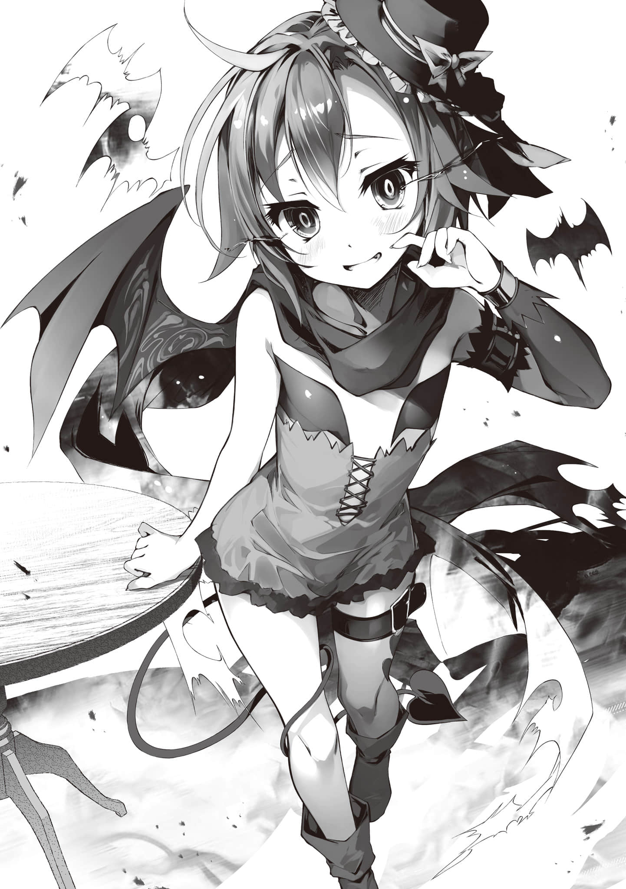
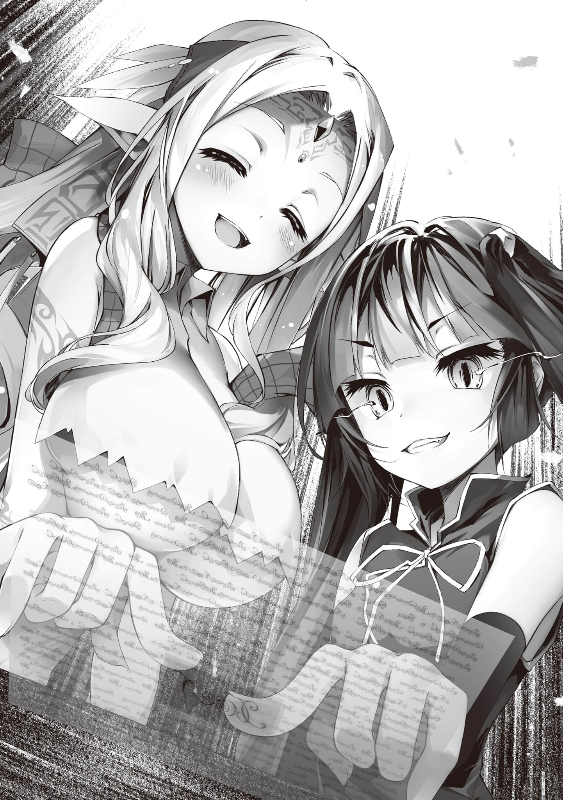

# 第四章 天翻地覆

> 来源：https://www.linovelib.com/novel/9/326409.html

「喂喂，这饭也太好吃了点吧!? 虽然完全搞不懂这是什么东西！！」

「库库……嗯，这是把阿塔斯的德博嘎吱嘎吱削成的缇吉」

——从与『魔王』的战斗结束到现在已经过去了一夜，这大概是魔王领特有的料理吧。

总之，谢拉·哈的解说没能提供任何有用的信息。

「……嗯、还是什么、都没懂……但是……」

「好吃就行，的说！ 再来一碗，的说！！」

「哼哼，未知的料理、未知的味道——啊啊，真应该更早来到魔王领才对♥」

「……真的没问题吗？ 该不会是那巨大蚯蚓的肉吧？」

「【报告】未检测到对生物有害的物质。【附注】十六种族(妖魔种)的肉不可食用。安全」

「重点不是这个啊！就是身体本能地还有点抗拒嘛——」

一行人正在吵吵嚷嚷的地方——依然是魔王领……

——虽说战胜了『魔王』，但「希望」也几乎枯竭……

他们别说有返回艾尔奇亚的余力了，甚至连站都站不起来。

于是他们被抬进了原本预定第一天打算住的旅馆，在那过了一夜。

——结果与其说是一家旅馆，不如说是一家酒店。

——豪华，却并不过度装饰，

采用的是精简的现代设计风格——想必是考虑到了会有多种妖魔种入住吧。

从门厅，到各楼层不同的天花板高度，也都被纳入统一协调的室内设计之中。

就连这间被空他们所包场的餐厅也是如此。

无论是桌椅的大小还是样式，都各不相同，但它们和谐地排列在一起，丝毫不影响整体的设计感，这令空不禁感叹。

「咔咔……嗯，没错。确实只能用精彩绝伦来形容了……」

自称·骷髅族长勋爵——盖那乌·伊的人物。

——————？

在这般充满团圆氛围的用餐时刻——

践踏语言体系，连思维方式——以及笑点都完全无法理解——简直就是混乱的存在！！

「这就是能抵达这个结局(真结局)的、我所能找到的唯一道路……不杀死『魔王』而拯救他——打·开·新·篇·的·结·局·……我倒是挺满意的，史蒂芙你不这么觉得吗？」

——那些辛苦付出。那一次次的死斗。更重要的是自己所受的种种屈辱。

——从扭曲世界的诅咒中所诞生的怪物……

总而言之——正如白所说，只是变成了一场无效比赛而已。

「……唉。乃也(算了，说的也是呢)……如此，此番伪装已无所裨益(看来这伪装已经没用了呢～)」

下一刻——那具骸骨仿佛脱下了面纱般消失了——

没错——语气虽古风，情绪却高涨，用词也奇妙＊。

也就是说——

「吾乃胧宵(人家～是胧宵)——一介浅学之月咏种(一个才疏学浅的月咏种)。请多关照的嘭哟♡」

这下才真是冻结住了所有人的思考。

额头上长着一根独角，耳朵像兔儿一般下垂下来——

（注释：此，乃本书翻译的最大难点，即兔娘胧宵的措辞，她的所有句式几乎都是古文汉字（比如这句话里原文就出现了冠絶奢侈，飨応，矫饰这三个词），再加上极具现代现充JK风，或者说年轻人网络用语，SNS即推特，微博这种社交媒体的用语的注音，故而本组决定使用如上的翻译法，即如果是夹杂了古风的台词，就先用古文写一遍，然后再用括号进行真实语气的翻译。而后文甚至会多有原文中直接夹杂中文英文的情况，不可能全部写注，故而请各位自行体感兔娘那高涨的情绪和自我意识。）

……纠正了吧……一定如此……

「……规则上、是……完全……「没有获胜」……的、一个……无效比赛」

除空与白、及谢拉·哈之外所有人脑中一片混乱。

即——

活·着·也·可·以·吧·。

这与连续吃了四十四天的，史蒂芙亲手做的质朴美味不同。

「唉，那样的话不是什·么·都·没·得·到·吗!? 那这场游戏到底算什么!? 」

它如此希望着……进入了梦乡。

对方咔哒咔哒地摇头晃脑地说道。

「……哦？」

——完全无法理解对方会在什么节点突然说「笑死了」或是「太有感觉了」……

（咦……？这家伙，该不会就是传说中的——『现充JK』——!? ）

——魔王领《加拉德·高尔姆》……文化水平真是高得惊人啊。

而且从她那完全按照自己步调点单的样子来看——

————戛然而止。

——啊啊……如果说只是情绪高涨的家伙的话，过去也有过。

「……那个……我想了一整晚，但果然还是不太对劲吧」

听到这番话后，众人静静地闭上了眼睛。

在经过反复斟酌之后得出了一个结论——也就是说，

——奇妙的氛围笼罩了全场，所有人又停下了手。

突然——从骷髅口中发出的话语让人震惊不已，

被期待死亡、却连死都不被允许的——绝望之兽。

——有位幻想种，想·要·活·下·去·。

「咔咔……勇者大人们得了我这把老骨头，怕是也没什么好处吧？」

众人正沉醉于只有手艺娴熟的匠人才能呈现出的绝妙美味，感动得赞不绝口时——

没错……游戏的胜利条件，始终是摧毁『魔王之核』。

盖那乌·伊在空和白的对面，深深地行了一礼之后坐了下来……

说罢，空将妹妹挪到自己膝盖上，朝伊蜜尔爱因使了个眼色。

「纵为此策(哪怕是为了谋略)，穿成这种低等蛮族的装束(扮)，诚令人郁结难舒(真是让人下头啵)……」

空看着骷髅仍旧装模作样——笑着回应道，

——没错，自称月咏种的少女。

「咔咔……这还真是难得的机会……请务必……那么，失礼了——」

——没错，举止始终优雅得体又彬彬有礼。

接过她用光编织出的棋盘，空的话音刚落，

————

啊……果然不出所料，确实是无可挑剔的美少女加兔娘……

「——」

——那声音高高地回荡在餐厅里。

「规则是——这场对局中，我会回答你的所有提问。对手是我和白——嘛，虽然明·摆·着·不·可·能·赢就是了。你要是赢了的话就相当于白嫖了提问；要是输了的话，就成为我和白的所有物，就这么个感觉♪」

一直保持沉默，似乎在一直思考着什么的史蒂芙，

「重新问好——然，吾本非受尔等下界人所当跪拜之姿(虽然本来就不是让你们这样的阴角都要跪拜的样子啦)——如何？此姿，可谓至高至极乎？(怎样？是不是完全不是一个level的美貌呀？♡)」

然后。

————

「啊啊，告诉你也没关系，但是「免费」的话是不是有点太贪心了～？」

「顺便——在这场对局，你能将「你的一切」押上来吗」

空和白，察觉到自己天敌的气息后，悄悄地给笑容蒙上了一层阴影。

「但是——就·算·如·此·『妖·魔·种·的·棋·子·』本·该·落·到·在·下·手·中·的……方便的话，能否请教一下——你们究竟用了怎样的诡计呢？」

「和『魔王』的游戏，我们根本就「·没·有·赢·」吧!? 」

即便有『魔王』的败北宣言，那也只是拒绝了这个条件，让游戏变得无法继续进行而已。

嘎吱嘎吱……然后，咔哒咔哒……

但是，这真的——应该弄到手吗——还是不弄到手好呢!?

难道说比我们原来的世界还要先进得多……？

但是——众人却感到一股违和感。

首先吉普莉尔就是，史蒂芙也无疑是阳光开朗的性格。这本身并没什么问题。

然后，史蒂芙像在细细品味这段话一样——露出了微笑。

当空和白、盖那乌·伊各自无言地走了几步棋之后。

「哈——神清气爽～！烦心事情一扫而空的感觉♡话说，既然这么畅快——那就让人家点单！！既饰骷髅之形，则百味尽失其味(饰演骷髅之时，一切食物都索然无味)——姑且将此间穷极奢华之甘馔奉于吾前(总之把这家店奢华极致的甜品给吾呈上来～♡)，此番自当由尔等宴请吾，对否(啊，由你们请客对不对耶？)」

高雅的皮鞋在餐厅的地板上发出清脆的响声，每走一步都伴随着骨头碰撞的声音。

延续了成千上万年的这种扭曲状况，终于被我们纠正了过来

过于美丽的那副姿态，正是月神创造了她的证明。

「就这样『魔王』被打倒了——「可喜可贺可喜可贺」」

刚才，这家伙——突然说了什么？

啊啊，没错，确实抵达了任何『胜利』结局都将失色的最后。

「请便♪正好我们也吃饱了，难得有空，跟我还有白对战一局怎么样？」

————

但是空却难得地露出了温和而柔软的笑容。

但空和白却毫不在意，手上的动作也没停，回答道。

众人如此一同望向空和白——特别是史蒂芙。

「当然有啊。因为——反正你肯定是只很·可·爱·的·小·兔·子·吧？我当然超级想把你弄到手。如果有什么理由可以让我放弃这个机会的话，倒是说来听听啊♪」

随着恭敬的一礼，现身在众人面前的是——现魔王军·统和参谋本部议长——

「——」

从那骸骨中传来了本不该有的深深叹息声——以及清脆的嗓音。

空也毫不在意，只是淡淡一笑回答道。

————

空瞬间开始调整战略，让大脑全速运转————

那确实是值得自己都骄傲的美貌—美到令人惊叹得说不出话来。

那确实是一个以「皆大欢喜」告终的故事。

「……不。说得对呢。确实是最棒的结局了——我为此感到自豪」

但如果按照这种直觉来判断——这家伙——真是传说中的存在『现充JK』的话——

众人与史蒂芙一起，都露出满意的笑容，点了点头……

「……呼唔，好吃。啊·啊·，是·这·样·没·错·？ 我不是说了吗。那场游戏，按设定本来就是『无法继续』的。所以我们也只是在『魔王』同意之下『强制召唤了结局』——只不过是强行制·造·出·了·通·关·了·的·感·觉·而已——」

所有人都停下了手。

「这·样·的·手·笔·简·直·超·乎·我·的·想·象·——啊，能否让在下同席？」

——————哈？

那对空和白——这类阴暗之人来说，某种意义上，是比神以上更无法理解的存在！！

啊啊……究竟是为了什么啊——。

取而代之，响起了懒惰的声音。

展露着那如绯红月亮般令人着迷的妖艳笑容——

这是迄今为止从未接触过的类型——完全未知的生命体，那就是『现充JK』！！

面对这样的对手，真的能一直掌握主动权吗——!?

（怎么办，空依然是处男十九岁！！这真的是你能驾驭得了的对手吗!? ）

……面对『魔王』，甚至神明也不曾动摇的男人。

因极度的偏见驱使而战栗不已，头一次露出了动摇并及警惕之意——

与得出相同结论、脸颊渗出汗水的白交换了视线。

但是——

「……恕我冒昧，主人。月咏种属于——未知的种族」

语气中没有丝毫余力来掩饰警惕的吉普莉尔用翅膀掩住了他们。

——【十六种族】位阶序列·第十三位——月咏种。

大战时就已身处红月之上，因此无人知晓其详细情况。

似乎是在月亮背面建立了都城——除此之外一切不明的种族。

就连被誉为活着的图书馆的吉普莉尔也承认不知其详。

在帆楼战役的『大战再现游戏』中——恐怕也正因如此——被当作「未知单位」。因为没有情报，当时未能作出有效对应而被逼入绝境……

对空和白来说，这也是一个充满苦涩回忆的种族——但。

——若是原来的吉普莉尔，应该会对「未知」感到垂涎欲滴吧——

而她之所以只是加深警惕——正是因为她那唯一的已知情报。

连伊蜜尔爱因和伊纲也毫不放松地摆好架势，即——。

「但——据说她们的瞳孔中蕴含着『诳气』，会夺·走·目·睹·者·的·理·智·。直视它非常危险——而且，她·究·竟·是·如·何·伪·装·姿·态·的也不清楚——对局，应该避免」

「【报告】未能检测到伪装反应。这超出了本机的分析能力？怎么做到的……」

「大战时期能从吉普莉尔他们天翼种手里逃出来的家伙，竟然逃·难·到·了·艾尔奇亚王国——我们这里。光是这一点，就足以说明「魔王领被占领了」吧——到这里能理解吗？」

于是回忆——初次见面时，自己的骷髅模样，是不是露出了什么破绽呢。

胧宵不由得哑口无言，一副无法理解的样子瞪大了眼睛。

「如果把谢拉·哈算作「我们这边」的人的话——从·你·试·图·从·那·个·蠢·毛·球·取·得·『妖·魔·种·的·棋·子·』的·转·让·权·的·那·一·刻·起·……甚至是，从·你·取·代·了·真·正·的·盖·那·乌··伊·的·那·天·起·——说到这个地步也不为过。对吧？谢拉·哈♪」

——很罕见的是，众人都如史蒂芙一般跟不上话题。

除了空和白、以及谢拉·哈之外的所有人都——

「不～哦～？倒不如说我这可是已经尽可能地在谦虚地回答了哦？因为——」

但是——

空说着，轻轻拨开了吉普莉尔的翅膀。

一·夜·之·间·就·复·活·的困惑，被飞扑上来的伊纲打断了。

「当然。那我也按照传统惯例回答你——从一开始♪」

——【向盟约宣誓】……

她在面对这三人时，能·够·完·全·没·有·暴·露·地·伪·装·了·姿·态·。

——她理解为——和空他们第一次见面就被看穿了一切。

「————哈？」

「————不是，你这这也吹得太过了吧……？」

---

■■■

再次在『盟约』的约束下面对国际象棋的空。

看到白移动了一枚棋子，便按照规则。

（注释：笑止这个词来自于日文成语笑止千万，主要意思是可笑至极、非常愚蠢或荒唐可笑，和中文古文的用法略有区别。本文中兔娘直接当离谱的意思用。）

据谢拉·哈所说，那「毫无疑问是『魔王』本体」——『核的碎片』。

「好了——？那就赶紧开始吧——」

「——啊、啊嘞？……不对？哦对的，本大爷确实说过无论几次都会复活吧？那可是本大爷以史上最嚣张的态度发出的宣言，『不管几次都尽管来挑战吧！』这一赌上灵魂的决定台词啊？」

胧宵默默地看着这场互动。

「你遵守约定回来了，的说！那伊纲也要按照约定陪你玩，的说！！」

「……那个……我完全跟不上话题了。有人能给我解释一下吗？」

突然——

「……这家伙，一点都没闻到，精灵的气味，的说……」

「……非常抱歉，小多拉……这次连我也完全……」

正带着发自内心笑容享用着的胧宵说道——

空察觉到无言困惑的众人的内心，这次轮到他移动了棋子，回答道。

然而——

「因为我们抵达了「真实结局(True End)」啊——正如你所见♪」

————你

——空这次终于是露出了一副让人都不用怀疑到底谁才是『魔王』的恶劣表情。

那正是一个二头身的——漂浮在空中的黑色毛球。

「【坦白】超出本机的理解。再次认识到机凯种推理能力的极限……怎么回事？」

没错…………

按照规则——空必须「回答一切问题」——也就是说……

出于上述原因，三人保持着最大级别的警惕，并发出了警告。

无视了从吉普莉尔乃到史蒂芙——所有人的困惑，

于是『魔王』终于理解了——啊啊，在他那临死前一刻的。

空思索着，一边看着白移动着棋子，一边缓缓开口说道。

看着空正嘲笑着因羞耻而苦恼的可怜玩偶——

空脸上浮现的那温·柔·笑·容·的含义。

空重新——不是对着胧宵，而是朝向史蒂芙他们——

「对呀！哎呀～憋住不笑真的超级辛苦的好吗～？」

面对带着疏远感，被排除在外的众人们的发声。

「……诶？那么，勇者你——从一开始就知道本大爷不会被阿邦特·赫伊姆的攻击消灭吗？你早就知道……却还是听了本大爷那赌上灵魂的……最后一句台词吗……？」

为了继续质问世界的存亡而不断复活的、不灭毛球。

一边困惑地笑着，一边搜寻着记忆。——然而。

瞥了谢拉·哈一眼后，这样……回答道——

「……啊～这样？就是说「全部被看穿了」这样子吗——诚？(真假？)，笑止＊(这也太好笑了吧♡)」

一边移动棋子，一边凝视着空。

「啊……不，那·倒·没·有·问·题·。所以——」

「我·们·既·没·有·杀·死·『魔·王·』，也·没·有·让·他·『休·眠·』——你应该明白这意味着什么吧♪」

「——————」

「就是这个！！我就是为了看你这副表情才忍住没笑的啊！！啊哈哈～让我好好看看吧♥」

她不知不觉地同意了『魔王』的这番话，然后默默地捂住了脸……＊

「————」

决定诚实回答胧宵最初的问题。也就是说——

「你你你你这勇者啊啊啊啊啊啊！！就只有你现在立刻给本大爷毁灭一次啊！！」

对着立刻送了上来的甜点——三层圣代。

空和白下定决心，也以无所谓的笑容回应——举起手，宣誓道。

然后立刻被抱住、被啃咬、甚至被欣喜地抛来抛去。

「说起来你别把本大爷当玩具啊，的说！！至少别再咬我了行不行!? 」

——吉普莉尔，伊蜜尔爱因，以及伊纲——

——也就是指，那边那个玩偶（中等尺寸）……

接着她又往嘴里塞了一口圣代，脸颊鼓起还笑着的月咏种少女，就保持着那样的笑容——

————砰的一下……

——————你，你，你这混蛋……

——这个回答最终还是超出了她的预期吧。

『魔王』的被玩弄——对胧宵来说自然是完全没预料到的事情。

……就连那出现的东西自己也，愕然出声。

一边说着，兔子一边下意识地收起了笑容，然而——

面对着无言地思考自己的回合，却径直凝视着自己的月兔之瞳。

史蒂芙也不由得认为——确实，空或许确实应该被毁灭一次。

「就是啊，的说！！空，你用伊纲也能听懂的方式说话啊，的说！！」

————诶……？

空反而笑得更开了——继续说道。

「…………」

——就这样胧宵一边来了个wink，一边比着三指的V字手势＊——以无所谓的态度回应。

「话说空殿下……这次只有您自己明白而不说明的事情也太多了吧……」

原来如此，这是被摆了一道啊——于是用双手比出了三指的V字手势。

包括毛球自己在内的全员，都一副「到底怎么回事？」的表情。

空绽放了灿烂的笑容。

「……嗯～？初逢之时(初次见面时起吗)～？诶～莫非，是吾有所舛错(那是不是我失误了露出了什么破绽呢)～？笑止(太离谱了吧)……」

（注释：在校对第三章最后那边真的笑嘻了，而且憋的很辛苦，因为到这里才终于能写注，这之间的篇幅有点大，建议回去再看一遍嗯。）

…………

「嗯，啊～善哉(OK可○)～若能边吃甜点边进行，也无妨(也没问题的话)——【向盟约宣誓】对吧♡」

「不，是从比初次见面更早的时候开始的——从·谢·拉··哈·来·到·艾·尔·奇·亚·的·那·时·起·」

也就是说——『魔王』——「不过」它继续说道——

某个身影伴随着极其轻柔的声音突然出现了。

……那么，该从哪里说起好呢——

「————这·也·太·快·了·吧·!? 为什么本大爷已经复活——喂，怎么已经在抓着我玩了啊你这小狗！！」

（注释：即封面彩页动作。）

「如果你想下的话——能请你宣誓吗？」

「不是「复活」，而是一·开·始·就·没·有·消·失·……理所当然的吧？因为我们确实把『塔(魔王)』炸飞了——但不是全部。『魔王之核』之一的——谢·拉··哈·所·持·有·的·碎·片·」

「那么，作为传统惯例——可否请教『尔究竟是自何时起便有所察觉(你是何时起，就注意到的呢)』？」

「是啊……首先……『智之谢拉·哈』——」

「「为什么『妖魔种的棋子』没有落到你手里」对吧」

空——他再一次重复来解释『从一开始』的真正所指。

「库库……不愧是真正的勇者大人。您的洞察力真是登峰造极了」

————

「……诶？哈，哈啊啊啊!? 诶，本大爷什么时候被篡夺的!? 」

看来好像完全没有理解。

代表所有人发出疑问的，不是别人，正是『魔王』。

——不是，至少你总应该是能理解的吧毛球……

现任魔王军·统合参谋本部长——魔王领的实际统治者。

其真身居然是伪装成盖那乌·伊的月咏种……？

所以在她解除伪装的时候就应该察觉到了吧……

空半眯着眼睛这样想着，但暂时先不管，继续往下说——

「那么，是·谁·篡·的·位·？至少不是妖魔种，也不是我们联邦侧的人。排除法的话，是『战线』那边的某人。森精种或者月咏种之类的——嘛，这点也不重要」

没错，关键不在这里，毕竟——

「问题在于，像谢拉·哈这样聪明绝顶的人——竟然会持有能作为「当『魔王』被打倒时的备用方案」也就是『魔王的碎片』，却在一开始就把自身全部的保·有·权·故·意·输·给·了·我·们·。这种行为未免也太奇怪了吧？觉得没有『内幕』的话那才不正常吧？」

——『所有』和『保有』……

前者是字面意义上的完全归为己有——毁掉也好扔掉也罢，全凭自己意愿。

但是后者，保·有·——仅·仅·是·持·有·的状态。

这是看似如出一辙，其内在逻辑却天差地别的一·个·交·易·。

身为当事人的谢拉·哈到底为什么要如此区分来提出这样的交易＊？

（注释：关于此处，首先我要替本组全员向第12卷的读者们道歉，本组无一人，发现了老贼这个伏笔。保有这个词在12卷整整出现了15次，贯穿整本书。而本组的译文仅保留了3处，其他的都随意地改成了所有。只能说，不得不佩服老贼。）

「那么，那个『内幕』究竟是什么呢？从她的行为来看——可以推测出的情况应该已经不剩几种了吧？」

——国家被篡夺，拥有最高智慧的人却来委身于此的境况。

啊啊——被托付了如此荒唐的根本无法完成的难题。

然后——

「库库……不愧是魔王大人。为了让普通人的理解也能跟上，故意献丑是吗？对于这比天空更广阔的宽容，本谢拉·哈感动得颤抖不已。那么，请各位好好聆听」

「实现魔王大人的夙愿、让勇者将其击败，同时又避·免·魔·王·大·人·被·讨·伐·或·进·入·休·眠·状·态·——库库……即便是被魔王大人赐予了无上智慧的谢拉·哈看来，这也是一项极其艰巨的任务」

……相信空他们能够做到——这大概只是谢拉·哈个人的希望吧。

「……可，可是，谢拉·哈小姐从一开始就察觉到了吧？」

「真是巧妙得可怕的骗局啊！如·果·是·你·设·计·的·话·，我可要由衷地称赞你了」

史蒂芙这番不像她会做出的尖锐指摘，让在场的所有人不由得一怔，

却·是·一·场·连·胜·利·也·好·败·北·也·罢·，甚·至·连·平·局·都·不·被·允·许·的·游·戏·——

…………

啊啊，然后——

于是——他展示了「哪一个选择都不选」的真实结局(True End)。

——是一个过于完美的陷阱。

嗯……将之暂且搁置——接着这回合是白移动了棋子。

「而艾尔奇亚联邦，已经将多个『种族棋子』基于各全权代理人的自由意志押上赌局并挑战、且获得了胜利——他们跨越种族界限，形成了紧密的团结」

最危险的既不是『魔王』也不是空他们。

因为——

她拎起礼裙行了一礼，回答道——……

「就这样不断付出牺牲让『魔王』进入『休眠』状态——即使达成平局，『妖魔种的棋子』也会落入伪装成统合幕僚本部议长(盖那乌·伊)的月咏种(这家伙)手中，那些挑战失败的家伙们则会被逐一清除——而且，就算成功通关游戏——成功杀死了『魔王』——『妖魔种的棋子』还是会落入月咏种(这家伙)的手中……就是这么回事吧♪」

那份深谋远虑——终于揭露了。

所有人——连胧宵甚至『魔王』都一脸被吓到了的样子。

……不是，它根本就没有察觉到吧。

——「虽然不太可能发生，但万一魔王大人败北或者进入休眠状态时，

正当众人惊讶地下意识吞口水时，这次轮到空移动棋子了，

而且现在正因为被骗了而处于绝赞伤心中的状态啊。

「库库……嗯？反过来问，为什么不是呢？」

————————

「——向各位勇者大人，重新致以由衷的感谢」

那么这次，不就真的逃不开这只小狗了吗——？

再加上『魔王』游戏。再按照其规则来分析——没错，比如说——

「既然本体(塔)已经被炸飞，那现·在·的·『魔·王·』完·全·就·是·谢·拉··哈·的·所·有·物·吧？当然其全部权力都属于谢拉·哈。而那个谢拉·哈——现在可是由·我·们·所·保·有·着啊♪」

那么，就只能同过去一样——无论付出多少代价，也要持续挑战『魔王』。

……不过，那个条件——

「——之类的吧？应该是八九不离十吧。怎样，毛球？」

谢拉·哈从月咏种取代盖那乌·伊的那一天起就注意到了。

终于让您明白了，不胜惶恐，空在内心苦笑着继续思考——

在场的那位毛球大人绝对没有想过这种事。

看吧果然。

谢拉·哈优雅地浮现出邪恶的笑容，

「首先——这只是一个连我这智之谢拉·哈都能察觉到的谋略，所以深谋远虑、洞察一切、拥有无上之智的魔王大人，不可能会没有察觉」

然后，经过了漫长的沉默，史蒂芙说出了与魔王相同的疑问。

为了妖魔种的存续，请将『妖魔种的棋子』移交至统合幕僚本部」——

————没错，也就是说。

…………嗯。

在全知全能的魔王大人的计谋面前，连婴孩的游戏都称不上。

「最·后·只·要·将·『唯·一·神·的·宝·座·』给·掠·夺·过·来·，献·给·魔·王·大·人·——如此一来，最终！！便可实现完美无缺的世界毁灭了——！！」

像是无法想象会存在理解不了这种简单事情的知性生命体一般。

总而言之——空总结道。

……

————

谢拉·哈对着月咏种——胧宵，巧妙地浮现出了优雅的嘲笑。

「——诶？诶？本大爷，真的已经是谢拉·哈的所有物了吗!? 」

谢拉·哈微笑着眯起蛇瞳、以沉默的方式给予了肯定——

——史蒂芙望向旁边的蛇瞳问道——如果空的推测没错的话。

不断扩大的《绝望领域》——最终将覆盖整颗星球……没人能够坐视不管。

「————诶，是怎样变成那样的结论的啊？」

「……诶？啊，嗯……就是本大爷就算输了妖魔种也不会灭亡，为了这个目标——盖·那·乌··伊·——诶。本大爷——是被·伪·装·成·盖·那·乌··伊·的·月·咏·种·骗了吗!? 」

让世界走向毁灭的——清晰无比的线路图。

没错——正因如此。

但是，谢拉·哈的信仰似乎没有丝毫动摇——

没错——

————

仿佛在印证着这种担忧一般，伊纲正摆弄着被当作玩具的『魔王』。

这个蠢货毛球完全没理解，而且还在那问。

……那么，接下来会发生什么呢？

那场游戏——虽·然·是·个·不·得·不·去·挑·战·的·游·戏·。

如此擅自解释着的谢拉·哈突然话音一转——「但是！！」

也就是说——谢拉·哈来到艾尔奇亚的——那一刻起。

「大概，是因为某·个·人·——让可爱的『魔王』大人？发下了这样的宣誓吧」

「这才是魔王大人的计谋，本谢拉·哈终于明白了……库库」

「不杀死魔王而打倒并拯救它」才是最艰巨的任务。

「……既然如此，为什么不在那个节点就指出来并处理掉呢？」

「…………抱歉啊，谢拉·哈……为什么本大爷要加入联邦呢？」

空故意投身于这场不允许胜利、也不允许败北、甚至连平局都不允许的游戏。

她继续铿锵有力地串起话语——！！

「库库……非常失礼——但请允许我称之为「愚蠢的问题」」

而是谢拉·哈这家伙……吗……

——没错，字面意义上的——神之领域的阴谋。

于是谢拉·哈——将属于她个人的。

「在此基础上，魔王大人依旧欣然同意将『妖魔种的棋子』交给月咏种——由此可见，毫无疑问那便是魔王大人想要「将其最大化利用」的意志」

没错……月神泽娜斯丝的阴谋？啊·啊·，无·聊·。

「战线方面无法共同作战——因·为·无·法·统·合·『种·族·棋·子·』」

「……诶呀～♡正如您所料，这正是在下们(人家们)的主上——月神(泽娜斯丝)大人之计谋。不用说——何其尊贵(是不是直接沦陷啦～？♡)」

至少——必须坚持到让『魔王』进入『休眠』状态……

甚至——可能连同之前『魔王』突然从休眠中醒来都是——

伴随着贤者的纯粹带来的傲慢，谢拉·哈理所当然地说道。

「啊啊不愧是魔王大人！在永恒的时间尽头，它早已察觉到终于出现了能够达成如此伟业者！！是的——就是艾尔奇亚的各位——真正的勇者大人一行！！既然如此！要利用这一点，抢在伪装成盖那乌·伊的、企图掌握魔王军·统合幕僚部实权的其他种族之前！！更进一步地打击其背后的存在——」

月咏种的少女——胧宵，像是在炫耀自己的神明一般比了个V字手势。

「既然如此，妖魔种也应该加入联邦，共同挑战唯一神——并取得胜利」

「如·果·要·毁·灭·世·界·的·话·，那·么·加·入·联·邦·则·是·必·然·的·」

不对——呃，肯定哪里不对劲吧。

她就已经是相当于向空他们提出了「共斗」的邀请……

————难道……这个世界上。

不过，包括『魔王』在内的一行人的想法，都没能传达给谢拉·哈——

那样的话事情不早就解决了吗——？

恐怕就连谢拉·哈本人，也构建不出具体方案吧。

没错，也就是说——

——但·是·——

然后，就像曾经的那样——如同地精种小队所做过的那样——

「——加 入 联 邦 阵 营——！！」

……

因此，那毫无疑问是——

但是——反正不可能是的吧？空讥讽地笑了笑。

如此响亮地宣告出了妖魔种的真正目的——也就是说。

「一旦谢拉·哈被我们保有，如果我们能不杀死『魔王』就将其击败——那么无论游戏胜负如何、「预先支付的奖品」都会生效」

因此，空静静地思考着——

——智之谢拉·哈……

已经无人能够质疑她是一位超一流的战略游戏玩家，但。

恐怕——连她本人都未曾意识到，这里其实存在着矛盾……

『魔王』所希望的，归根结底——是『自己的死』……

在那之后——渴望「救赎」的，明·显·是·谢·拉··哈·个·人·的·希·望·。

从『魔王』的无策中强行解读出意图——到此为止尚可理解为出于信仰。

但是——否·定·了·『魔·王·』的·希·望·——无论如何都算是「背叛行为」。

以她的智慧，绝不可能不明白这一点。

更何况——谢拉·哈相信——空他们能够拯救『魔王』。

完全是素未谋面的人们——所·以·这·也·只·是·毫·无·根·据·可·言·的·一·厢·情·愿·。

——但她将自己种族(妖魔种)的一切。

就·连·至·高·无·上·的·主人(·魔王)也·欺·骗·，将其沦为赌注——

——因此空可以断言。

谢拉·哈的真心，完全没有通过任何语句表现出来过。

而正是因为连她自己都未曾意识到，所以不算是谎言——

——她只是单纯地仰慕着『魔王』而已……

并非因为它是自己的创造主……而是出于自己的自由意志。没错——

「谢拉·哈！！喂，你肯定能阻止这只小狗吧，快阻止她啊！！」

「库库……啊啊，可爱的——不对令人畏惧的魔王大人。正如之前所言——无能的谢拉·哈，实在是无能为力——请您原谅我吧」

——那一天。

胧宵露出略带歉意的笑容，眨了眨眼说道「抱歉啦♡」。

仿佛要贯穿般凝视着空的夜色瞳孔——

「感觉嘛＊～♡非要说的话——滑稽至极(难受死惹)？笑止(笑死)♡」

---

■■■

「然(恩)！所谋『妖魔种的棋子』之策，确已尽皆瓦解(确实都化为了泡影噗哟～)」

于·爱·尔·文··加·尔·得·——的·首·都·上·空·。

将爱尔文·加尔得引以为傲的巨大森林——汲取至枯死。

像是被欺诈之火(狂气之火)的热度所迷醉了一般，愉快地说着——那番话。

通过吉普莉尔迅速开辟的空间投影。

而当对局进入终盘时，空重新正视前方。

终于——胧宵用那与红月同色的月色瞳孔。

没错，她始终保持着轻浮的语气——后续的话语也同样如此。

「读不透」——是因为她是『现充JK』，还是因为——

只是——如同抽取着大地的恩惠一般。

仍然是只能认为是发自内心的话语，

伴随着白移动棋子，轻声说出的「将军」，

——红月正在汲取着爱尔文·加尔得的森林……

「嗯～我个人来说的话倒是更喜欢被夸帅气呢……」

究竟是为什么呢。

月亮以所抽取的生命力将自身的表面从红色转为了鲜艳的绿色。

「你能做点什么的吧!? 本大爷是你的所有物的话，你就可以从这家伙手里夺过来的吧——小狗!? 你终于开始舔本大爷了吗!? 我好歹要开始主张作为十六种族的基本人权了啊——别吞我啊!? 」

同时。

然后——

在这段时间里轮流执棋，月咏种始终保持着沉默。

仿佛正诉说着她的真心……空如此觉得……

森精种的创造主——《森神》凯纳斯——其至高无上的『神髓』。

是一个连星辰——不，连星系都为之颤动的——历史性的瞬间。

没错……这不过是输了一场罢了。

那并非噩梦，而是暴力般的现实。

空……「嗯」了一声……

————

因此，能准确理解发生了什么的人，几乎为0。

唯有那有着深邃智慧而微笑着的，充满温柔的——蛇瞳。

仿佛断定了污秽的大地没有任何值得诉诸言语的价值。

也就是说——

「然(不过)——也·就·仅·此·而·已·了吧？」

于是，「那东西」再次显现了出来，

然后，所有人都目睹了——「星辰颤动之日」……

那副光景不容分说地，让人确信胧宵的话绝非虚张声势。

吉普莉尔、伊蜜尔爱因——伊纲、提尔。

即便如此，也不得不去理解。

为了掩饰对月咏种言行举止的困惑与警惕，空便如此装作开玩笑的样子。

但胧宵——依然用真诚的笑容继续说着毫无虚假的话语——

「嗯～太可爱啦！真的不行了，就是因为太神圣了，反而更能推了的感觉♡」

没错——仿佛印证了吉普莉尔所说的蕴藏着『诳气』一般。

那抹仿佛在嘲笑着重力般静止在那的红色，已经不能再被称之为天体了。

---

■■■

超巨大质量(红月)的空间转移——扭曲了时空，甚至让整个星系都为之鸣动。

——嘛……不管如何。

「「「「「————————————————!? 」」」」」

哪怕只是妄想也已超过了可以容忍的限度。

紧接着，震撼世界的，是一股连天变地异这样的词汇都显得过于温和的巨大冲击力。

在战神陨落后的世界里，它以最强之姿统治着星球，长达六千年之久。

仿佛连其创造神——月神(泽娜斯丝)一同贬低一般，空嘲笑着问道。

（注释：原文vibes，氛围、感觉、气场。）

抬头仰望他——至少对森精种而言——足以明白其中的含义——

「总而言之——」

————

她移动棋子，回应道「将军」。

胧宵依然凝视着空的瞳孔，比着三根手指的V字手势说道……

就像是在注视着自己最心爱的孩子在与朋友玩耍一般。

但是——仅凭这种程度，就妄想蔑视比天更高更尊贵的神——我们的主。

传达了自己的创造主——月神的话语。

「……虽然不是很懂，但看来我好像是被说可爱了，白」

本应缓缓坠落的红月——却突然——消失了。

它悬浮在近乎亲吻着大地的低空中，物理意义上地盖住了天空。

「————这·一·步·棋·，您·可·曾·看·透·了·？♡」

——完·全·察·觉·不·到·任·何·的·虚·伪·或·者·是·虚·张·声·势·……

——被《月神》泽娜斯丝给「吞噬」了……

空一行人也目睹了爱尔文·加尔得上空的——那令人难以置信的光景。

——不。称之为上空，未免太过近了。

「『种族棋子』的「一双(两颗)」——想来，已尽在主上酱掌中☆」

甚至连『魔王』也——同时一起望向天空。

——感知到天体转移的庞大精灵反应。

「啊～那是何等眼眸——仿佛蕴藏着欺诈之火＊(狂气之火) ？身非主上，却洞悉万象(不是主上酱却能全部都看透)——笑止(太离谱了简直都感到神圣了)！简直可爱到不行♡」

没错——向着那策划了这个计谋的月咏种——胧宵的幕·后·人·。

---

■■■

反而是一脸满足、无比愉快的笑着——

啊啊，真是超乎常理。

充满期待与诳热的兔瞳问道——

（注释：原文为眼中蕴含着诳火，诳，即欺诈，代表此火有两大属性，狂气和欺诈，便也是兔娘的两大属性，其实还有更符合这一属性的对象，敬请期待，到了终曲自会揭晓，亦或是仅凭目前为止的前文就已经猜出来了？。）

——曾经在大战期间——将世界一分为三的神灵之一。

——红月，一言不发，

深深地铭刻在一切有生之物的视网膜、耳膜，以及记忆之中。

「嘛，对区区的卑微下界人(阴角)来说，能尽己之力，干坤一掷，已属难得(能拼尽全力一搏已经很不错了啦)」

抛开了这一切的理解的事实——确实发生了。

接着——「但是」——

「……嗯？哥……是很可爱，哦……？……哥不知道，吗……？」

没错——

「胆敢无视主上(主上酱)，自称全知全能的诳者啊，吾亦有一问(让人家也问你一个问题吧)？」

「——被·耍·得·团·团·转·，现·在·滋·味·如·何·？还好吗？♥」

「你「们」啊，并·不·是·输·给·了·我·们·。而是被你们企图利用的妖魔种(谢拉·哈)——哦？应该叫「低·等·蛮·族·」来着？——被那家伙看穿了一切，还反过来被利用了。我们只是顺水推舟而已。好了，现在我也想问你一个问题，可以不？」

——不知感受到了什么——但。

——也就是说，

「所以……人家才特地替主上传达旨意，像是这种感觉？」

她将圣代的最后一口塞进嘴里——既不生气，也没有指责。

到底又是如何做到的。

听着胧宵那无比轻浮的话语，无法出声地目睹了这一切。

但是，她依然凝视着空的瞳孔——

「然(话虽如此)……若主上的尊贵御言＊(如果主上酱的糟糕信息)让下界人听到(直接就这么传达给阴角)，必将顷刻癫狂(你们肯定会直接发狂的吧)，吾欲以意译之法传达之(所以就由人家来稍作意译，替主上传达了)……嗯～～……其意大略如此(大概这么个感觉)，如何——？」

（注释：此指神言。）

始终以轻浮调子笑着的，只是一个普通的月咏种的少女。

但是，从她口中说出的话语——却以让在场的所有人——

甚至连天翼种和机凯种都为之畏缩的神威，响彻开来……

「——「骄傲自大也要有个限度你们这群渣滓——宰了你们啊？」……这样？♡」

——啊啊……伴随着谢拉·哈那超乎常理的谋略。

空他们阻止了的——不过是同时进行着的无数谋略中的一环。

究竟是怎么做到的——同时夺·走·了·两·颗·——『种族棋子』。

甚至将世界最大国——森精种的创造主——《森神》的『神髓』也夺取了。

而且，那个计谋甚至——「还没有结束」。

红月俯视着大地，遮蔽着天空，沉默不语——然而。

正是以这种沉默，才得以最有力地诉说一切……没错……

——「接下来就是你们了」……

通过胧宵轻浮的口吻传达了过来——但其中的愤怒却显而易见。

这是对亵渎神明的重罪的惩罚，无异于死刑宣判……

「…………」

人之智慧——不，这是非神者的一切智慧都无法企及的谋略。

被那字面意义上的神之领域的，毫无感情、却又庞大至极的杀意所锁定。

那其中明显地，浸染着满满的喜悦——

「那么——最后一个问题——「这一步棋，您是否也看透了」——是吗？」

然后——如同在宣告自己才是神明一般。

空白猛地将棋子拍在了棋盘上。

（注释：来自于装甲核心FA里 ORCA旅团领袖的名言：To Nobles. Welcome to the Eart(献给高踞天穹的贵族们——欢迎重返大地)。）

——将「月之石」抛给了维格的人，以这种方式无·声·地·传·达·了·月·咏·种·阴·谋·的人。

「——我们似乎看透了你的这步旗呢，「蠢货」」

朝着红月张开双臂——又仿佛在迎接「挑战者」一般——

并回以戏弄的话语。

长着仿佛由黑夜编织而成的的翅膀，有着令人为之着迷的容貌，宛如美少女般的少年。

伊蜜尔爱因如此点头后，将影像投射到了虚空中。

「你觉得在谢拉·哈的计谋中——她为什么不从一开始就向我们透露详情呢？」

「哈哈！观之，月君之怒，竟至怒发冲冠乎(看来月亮大人气的头发都竖起来了嘛)！哎呀～甚是可怕到爆了鸭」

空确认到了从那之中找了想·要·信·息·的白的点头——

以及，当谁都没有能察觉到盖那乌·伊的伪装时——空也终于确信了的那个人。

——空面朝透过胧宵注视着己方的存在。

只有空会注意到——这实在是太过危险的的赌局。

如果从一开始就坦诚地传达共斗的意愿，岂不是更为稳妥吗？

————————哈……？

其存在，竟连一鳞半爪也未曾被察觉，这真是布拉姆的幻惑魔法吗。

「————啊？」

————诶？

布拉姆果然如此给出回答。

没错——吸血种·全权代理者布拉姆·斯托克……

「特意跑到我·们·的·射·程·范·围·内·，可真是费心了啊——欢迎光临哦？」

「那不是明摆着的吗？能策划出如此大规模的阴谋，他（？）当然是不可或缺的人物了」

连吉普莉尔——甚至伊蜜尔爱因都只能保持沉默——

就这样——终于有机会说出「一直想说一遍的名台词」——番外篇。

见此情形，所有人都愕然不已。

伊蜜尔爱因和伊纲都失声地瞪大了眼睛。

（注释：此处空和白都故意模仿兔娘语气进行嘲讽。）

以史蒂芙为首，一行人都为之疑问。

终于判明了到底是谁背叛了众人。

「还要能打的垮的话，只剩下巨人种了吧。——那么？你接下来打算怎么办？」

在众人震惊不已之际，空将话语抛向了虚空。

本以为在现实绝无机会说出口的台词。

「《月神》得到的那两个『种族棋子』——是巨人种和吸血种。对吧？布拉姆」

这一次，连月咏种——胧宵也哑口无言了。

「……哥～，白……今晚，可能……不敢、上厕所、了……鸭」＊

她想知道现在究竟在发生着什么事情？

「……真、够……大、胆的……呢？布拉姆……？」

这句话到底是什么意思呢……

「嗯？怎么办，是指？」

「啊哈哈～……嘛，您的话应该能理解吧，这是有·条·件·的呜……为了从海栖种那里获得解放——这种程度也是「必要成本」啦♪」

于是，在游戏中败北——成为了空他们所有物的月咏种少女。

「话说回来，你就算要背叛，至于把『种族棋子』都交出去吗？」

——没错，如同挑衅一般，两人向着神明宣战了。

然而，让众人真正震惊不已的却是——

于是——

空和白将仍处于茫然中的众人置于一旁，重新面对棋盘。

不过，那么谢拉·哈究竟是对谁无法明说呢——

————

「是呀——当然啦「怎么可能」嘛♪毕竟——这又不影响？不管我们是协助月咏种还是背叛联邦，甚至就算把『种族棋子』都交出去——」

唯有空和白，依旧直视着胧宵的瞳孔——窥视着诳气的深处。

「反正——空·大·人·他·们·会·把·『吸血种(我们)的·棋·子·』给·夺·回·来·的·嘛·♪」

「话说回来「那招」可真是步臭棋啊月神……这下大局已定了」

「……龙精种、是……平衡者……来着的……？」

没错，仍然像是相伴多年的损友一般。

然后——面对空的提问。

当然，即便如此，空一行人的行动方针也不会改变。

「嗯？啊，也没什么，只是单纯的排除法。不是森精种，然后妖魔种这边失败了——」

「——」

但史蒂芙那恳切的悲鸣被无视了——取而代之的是。

「在各位前往魔王领之前——空大人给阿邦特·赫伊姆传话的那时起——我就说过一切都已经暴露了……你不听就是会变成这样的嘛」

『To Nobles， Welcome to the Disb(致贵族们，欢迎来到【棋盘上的世界】)——！！』＊

……然而……？

但布拉姆过去确实有着欺骗了拥有幻想种阿邦特·赫伊姆之力的阿兹莉尔的实绩。

「伊蜜尔爱因。能显示爱尔文·加尔得的妖精网络吗？」

空如此回答，然后愉快地继续说道——

「话说回来……吸血种姑且不论，您是怎么知道另一枚棋子是巨人种的？」

「……月神……没什么、了不起……的嘛……？」

「啊～没错呢♡确实如此！然吾未信之(虽说我不相信嘛～)。然然(而且而且)，纵信之，亦不过徒然，局势未改(即便信了事态也不会有什么改变吧♪)，诸行无常(don't mind，别在意♡)」

啊啊……也就是说，只要利害关系一致，随时都会背叛的家伙——

即神——《月神》泽娜斯丝。

「……是因为——无·法·明·说·的吗？……可是，是对谁……？」

「不是……你总不会蠢到真的倒向「那边」吧？你这家伙」

向着那自诩为贵族、居高临下的神明——宣告。

知道这一事实的吉普莉尔，虽然很不愉快但还是咂舌接受了现实。

「……是的……将·死·……♪」

那么，即便如此也不愿告知的理由是——？

「喂史蒂芙。也回答你的一个疑问吧」

空和白，终于等到了时机——啊啊，如此响亮地。

于是空苦笑道——

看着那彻底放弃思考的、一脸开心地和胧宵交谈的布拉姆。

没错，不告知是因为无法明说。只要泄露天机就不再是必胜之策。

爱尔文·加尔得的错综复杂的情报网陷入了混乱不堪中。

空和白依然若无其事和他交谈。

——如此。

然而，空只是转过头来——面向史蒂芙。

「问题都要被回答，因为这就是刚才定下的规则嘛，所以我当然会回答给你听」

「你看……所以我忠告过的吧？空大人早发现了～……」

「能使用连伊纲、吉普莉尔、伊蜜尔爱因——甚至身为幻想种的『魔王』都无法察觉到的「姿态伪装魔法」的人物。即便艾尔奇亚王城内，都必须警戒其偷听的人」

胧宵——伴随着诳气在眼瞳中熊熊燃烧，高声喊道——

从虚无中显现的，正如预想那样——是一张福薄而凄清的面容。

「————哈？是哪个疑问呢!? 希望不要只回答一个，全部回答呀!? 」

——唯有胧宵眼中闪烁着光芒——其含义无人能理解。

——精灵反应——无。

「……【肯定】从同盟妖精种·个体名佛耶妮可兰的链接枝投影——」

「彼等之荒谬，实惊天动地也，(他们脑袋真的有病对吧!? )——然而那却正是我找到的，属于我的「诳火」！！」

而且，谢拉·哈不可能不明白这一点。

然后——面对着面前的月咏种——胧宵，不——是面对着其背后更高的那位。

继续自顾自地往下说着——来嘲笑神明。

---

■■■

然后——就在几·分·钟·前·。

在距离空他们所在的魔王领极其遥远的彼端。

艾尔奇亚共·和·国·——政务室内＊。

（注释：注意不是王国。）

「啊～啊～啊～果然已经是大混乱了呢？」

「毕竟天塌下来了～字面意义上的天翻地覆的大骚乱呢～♪」

——在妖精网络中，无论是公开还是私密的各类频道中，都流淌着错综复杂的信息。

克拉米和菲尔——两位少女，只是痛快地笑着。

——将爱尔文·加尔得引发的大恐慌，当作他人之事般旁观着。

啊啊——因为那无疑意味着，期盼已久的「那一天」终于到来了。

面对这一事实，克拉米感慨万千——向自己的搭档问道。

「那么……终于要来了——不过说实话，菲你预见到了哪一步？」

「…………说实话，吗～……？」

言下之意就是，你到底瞒着我收集了多少走钢丝般危险的情报。

克拉米并非责备，只是以真挚的眼神——恶作剧般地发问。

菲躲开视线，抿起嘴。——但最终还是老实回答了。

…………嘛…………

「……如果不是那只臭地鼠的「联络(短讯)」～再怎么说我也想不到要去潜入到森神神殿的最深处吧——虽然也不能说完全没有可能性吧～不过我绝对不会承认啦～但或许还是值得参考一下的，这样～……？」

——没错……总而言之，虽然怎么都不想承认。

但如果没有维格·德劳乌尼尔——那个疯子地精种(鼹鼠)的传信。

没有人会想得到比维格更疯狂的那——爱尔文·加尔得长期隐瞒的——事实。

——在同一天。

「是的呢～♪那么～——请大家(妖精网络上的各位)一起跟着我复述吧～♪」

——伴随着吊唁之词，一起发送了出去。

「————————不，果然还是算了吧，就算死也不要啊……呕……」

爱尔文·加尔得史上最大的国家机密——禁忌的真相。

「「再见了，爱尔文·加尔得。你漫长的历史将在此刻终结」」

以正常的思维，是无法将那难以想象的「那行径」暴露于世的。

过度的兴奋带来的掠过脑海中的念头，令她作呕。

简直是连狗屎都不如的闹剧……以及，更重要的是一项耗时长达一年终于达成的艰巨课题。

「……呼，真是漫长啊——喂，空。作业已经帮你完成了哦」

懊恼与挫败感——但此刻，被一种远远超越这些情绪的、强烈的解脱感所取代。

——于是，在这一天。

红月坠落大地，森神『神髓』被月神夺走——

历代的森精种全权代理人，对自己的创造主——森神所做的事情。

看着好不容易终于妥协、勉强承认的亲友，克拉米只能苦笑以对。

持续掌握世界霸权长达六千余年的大国。

——没错……终于要结束了。

其漫长无比的历史，终于被画上了句号————＊

无论如何，克拉米和菲尔握住了彼此的手——

经历了内乱之后，这个世界最大的国家——爱尔文·加尔得陷入了恐慌之中。

……接下来，只要动一动这根手指头，就完成了——

当然——森神凯纳斯的『神髓』被吞噬这种事情。

没错，克拉米和菲尔——在接到维格的通知后揭露了真相——

在这个名为「艾尔奇亚共和国」的，充满着叛徒与卖国贼的垃圾堆里。

克拉米心情愉快地如此总结道，转向妖精网络终端。

「嘛，那就——用「大家齐心协力完成」这样的漂亮话来收尾吧」

---

■■■

小心翼翼地不·得·罪·任何人，没完没了地察言观色——

（注释：白上一幕在终端上找到的就是这条发出来的信息。）

如果是正常人——根本不可能预料得到这种事情发展。

啊啊……这么一想，就算现在让她去亲吻空也可以——

两人一同触摸——记载着那详细真相的文章

因仅仅两人，所在妖精网络泄露的信息作为的最后一击。

又一次——没能追赶上空他们，结局依旧只能按·照·他·的·意·愿·来行动。

「——就是这样～♪」

字面意义上的，星辰为之倾斜——这是一个将被载入后世历史、具有重大意义的变革之日。

