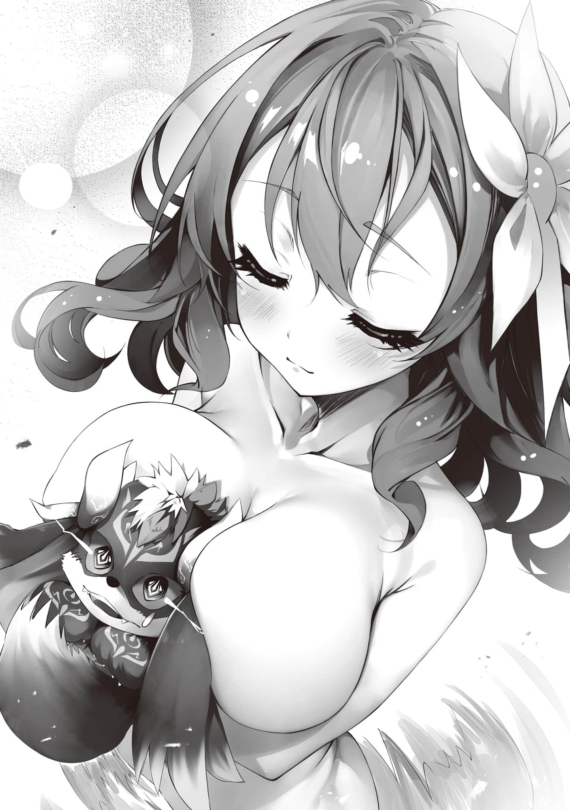

# 终曲

> 来源：https://www.linovelib.com/novel/9/326410.html

——啪嗒，哗啦……

从水汽氤氲的深处传来的那个声音——究竟是什么声音呢……？

艾尔齐亚王城大浴场……那里本不该有什么木制的浴桶才对。

然而，那声响却无比真切，充斥着整个空间。

又或许——已非耳中所闻之音。

而是如释重负与宁和等无形情感遗留下来的残响……

亦即，重归乐园之魂所能听见的安宁之音。

啊啊，具体来说就是——

「哈～……终于活过来了……果然温泉就是用来洗涤灵魂的是也」

「……喂。喂喂！！本大爷绝对不要洗什么澡啊!? 快放开我你这小狗！！」

「嗯，伊纲也讨厌洗澡，的说。可是你这家伙——稍微有点臭了，的说」

「那不是因为你的口水吗!? 」

「才不是，的说。伊纲是想把·你·身·体·舔·干·净·，的说。但是怎么舔都还是、臭烘烘的，的说。没办法只能把你扔水里洗了，的说。你这家伙到底多久没洗过澡了，的说？」

「哈～？哈！！果然是短生种的想法。身为幻想种·魔王的本大爷，为何非得洗澡不可!? 」

「库库……是的。属下谢拉·哈过去也曾几次三番地劝说魔王大人入浴，可是……」

「呵呵呵，在这千千万万的光阴里倾注于吾身的恶意——这绝望与灰烬、死亡的香气，正是本王的——」

「唉。那魔王先生——难道说从·出·生·到·现·在·一·次·澡·都·没·洗·过·吗!? 」

「——伊、伊纲一直以来、到底是在舔什么东西啊，的说!? 呸、呸！！」

「哈哈哈终于意识到了吗你这小狗！！——没错。你一直在舔着的可是堆积而成的死————喂。喂喂喂你这——不对，是你们！！难道真的打算用那块肥皂来搓本大爷吗!? 谢拉·哈！！快把本大爷救出去！！」

「库库……可爱的魔王大人若是带上恰到好处的野兽清香的话——？……库库……！！非常抱歉魔王大人——属下谢拉·哈也完全无法抵御这份诱惑」

「————唉……谢拉·哈，你……难道也一直觉得、本大爷……很臭、吗……？」

面对停止了叫嚷、突然又转而诚惶诚恐、不知所措的胧宵。

以及胧宵随后行动的真正意义，吉普莉尔和依蜜尔爱因如此宣告道——

「……你们、查出了……什么、吗……？」

「系(没错)，言中正鹄(Bingo)～！＊不愧是吾(人家)真正的主(真命天子/gachi-p)、诳火大人(诳火p)的——诳之从者们(老前辈/辈前)啊!? 此等冠绝群伦(完美无缺)的推理当真出类拔萃(完全不是一个Level)♡」

却反过头来说我和白「脑子有坑」吗……？＊

「啊～～～～真是的～～～～～所以你这家伙到底要怎样啊啊啊啊啊啊！！！！」

「开头铺垫得有点长，实在抱歉。总之——」

——暂且不提这些。

可以认为，应该是那位最初的原始之神——通称《诳火》的存在。

就在空和白互相使眼色的时候——

胧宵用她那兴奋不已、响亮刺耳的声音给出了回应。

没错——两人一边表达着歉意，一边解释。

…………哦～？这还真是宏大的故事啊——

因此——

「……所以呢？那这和现·在·的·状·况·有什么关系？」

空终于忍无可忍，让怒吼声响彻了整个浴场……

——『但求宽恕，容吾(家)为「诳火大人」沐浴擦背吧』，她如是说道。

由自己所创造的种族所崇拜的那位神明——被称为了《诳火(欺诈之火)》。

（注释：原文就是姑娘两个大字，来自汉语。）「这家伙——除了似乎对我身为处男这件事感到极度不满之外，我完全听不懂她在说什么啊？一个劲儿地在那里狂爆粗口，完全没有要给我和白搓背的意思——我甚至都开始怀疑她是不是在搞什么想让我们感冒的阴谋了，这到底和刚才说的事有什么关系啊……？」

「应当更加、是这种感觉——比如一把扒掉我的衣服，然后抓着我闯入女澡堂——带着「有何疑问，理当如此！」的神情狂傲大笑才对嘛!? 」

空和白将半睁着的死鱼眼，投向了他们身后的——那个赤身裸体的月咏种少女……

「在比遥远更遥远的远古时代——比那场后来被称为『大战』的永恒之战——还要更加遥远的远古。我们发现了一段关于那个时代的，由「无名之神」所孕育出的种族的传说」

「……哥……到底、是在哪里……看漏了、呢……？」

「————这个……果然……还是读不懂啊……」

「恐怕……是在两位Master的眼眸中——她看到了凌驾于她自身——甚至凌·驾·于·月·神·之·上·的《诳火》的残渣——也·就·是·她·原·本·真·正·主·人·的·气·息·，即——『诳气』吧……」

「……这可是否上加否～！言语道断(根本不可能)！真要那么做可就离谱到家了！」

在魔王领进行了国际象棋对决后，成为了空与白所有物的月咏种——胧宵。

「【举例】兽人种的文化。吸血种对夜晚的依赖，以及利用瞳孔施展魔法这种方式——这些都能看出红月所带来的文化与种族影响，是因为这两个种族都是由那些被《月神》统合了『神髓』并消灭掉的众神所创造出的种族。【假设】……大概？」

而且——『美少女型妖魔种图鉴』的爆衣差分图——之前唯一漏掉的那个。

「那里还有未成年在啊!? 你是想让我被抓起来吗，开什么玩笑啊!? 」

——『大战』究竟始于何时，没有任何人知晓确切的时间。

「且慢——！！谬误(不对吧)!? 保持这样才行！！」

「……白……白、白……好、好冷……要去、浴……浴池……」

……或许是因为她那想要帮忙搓背的请求被应允了吧。

啊啊，一如既往地？空是不被允许直接目视那片乐园的。

嘛——毕竟才接触过诞生于生命的共同幻想的幻想种的实例……？

「是的。也就是说……月咏种真正的创造主并·不·是·《月·神·》——」

能够将森罗万象焚烧殆尽……仅仅只是「那样的火焰」——但是。

毕竟上位种的那些破事，早就已经超越了人类认知的范畴，从一开始就完全理解不了。

没错——就在几天前。

「……这、和……现·在·的·状·况·————阿嚏！」

被胧宵一把抓住手臂拦下来的空，这次终于是发出了惨叫。

「……吉普莉尔、依蜜尔爱因……差不多、救救我们……？」

就这样，仿佛侍奉在空与白身边一般。

「吾(人家)的诳火大人绝不应该如此！！此乃何意!? 竟顾忌人伦却又难掩好奇，避开众人耳目，欲窥姑娘＊(乙女)玉肌，这般童贞男子(处男)的行径实在太过寻常(太土了)，令人愁容满面(下头完了)好吗!? 」

「这样啊……不过能让我再问一次吗……所以「那又怎样」呢？」

正被依蜜尔爱因操控的、大量的配备了光(隐)学迷(形)彩的无(无)人操控(人)飞行装置(机)全方位录像中。

如果是始于「概念的相互吞噬」的话——那就应该是与智慧的诞生同时开始的。

「喂，所以……如果你要搓背的话，能不能麻溜点……？」

（注释：本句中的咦，啊，呀皆为原文且为中文，日文里不存在这些用法。）「这不是你自己提出来的吗!? 话说回来我们到底是不是那个什么『诳火大人』啊——你起码在自己脑子里把逻辑理顺了再说好吗!? 」

——嗯。原来如此……？

「因此，月咏种在现存的十六种族中——说不定其实是最为古老的种族」

在败北的瞬间，她突然称呼空与白为「诳火大人」，并用痴迷的眼神注视着他们。

然后就在刚才，众人刚回到了艾尔齐亚王国的时候——

然后，由《诳火》所孕育出的生灵，便被《月神》进行了「重新创造」——

——据说那位无名之神——最初只是「一团单纯的火焰」。

「真!? 咦、啊，诳、诳火大人的御、御体(尊贵之身)——！！呀，当真畏敬畏敬(不行不行)——此乃吾(人家)万不该触碰之物吧!? ——不对，然若蒙受恩准，啊——究竟该如何是好……!? 吾触碰心中所想(人家居然要接触到我推本尊了)——触碰本尊，到底是好还是坏啊(这到底是天大的好事还是大不敬啊)!? 」＊

这不就是「先有鸡还是先有蛋」的问题吗——？

开始讲述那段过于古老的传说——

「连回答(吐槽)都这般千篇一律(模板化)简直是滤镜剧烈破碎(究极萎了)！！咦咦咦咦(不行不行不行不行)！吾(人家)所亲手发掘出的诳火大人绝不能是这样的！！身为诳火大人，若是一举一动都不诳，岂不遗憾至极(不符合人设啊)!? 」

或者，如果是始于「自然(能量)的流动」的话，那么也有学者认为那是与开天辟地同时开始的。

但是——于是，当真正走进大家都在等候的浴场一看时——

不，或者应该说，如果正是月咏种让那团火焰显现了这一『神髓』的话。

没错，那是连神的策略都能一眼看穿的男人，然而此刻。

——没错，正常情况下应该兴奋不已才对。

听到那带着逃避现实意味的微弱声音后，两人恭敬地行了个礼。

（注释：原文即系，就是粤语的那个是，不知道巴西人哪里找来的，日语里完全没这个用法的。第二个原文即正鹄，出自于《礼记·射义》：「正鹄之名，出自此也。正者，正也」意思是箭靶的中心，引申为目的或正确的目标；还有gachi-p、辈前等地雷用语，在这里不一一说明。）——看来那推测是正确的。

即使无法亲眼目睹，但那片展现在身后的乐园，仍应让空心潮澎湃。但是——

「【假设】月咏种的创造主甚至连·神·灵·种·都·不·是·——让被月神所吞噬的、通称《诳火》的存在显现『神髓』的，反而是月咏种的祖先。前身。如果是这样的话——」

虽然确实非常让人在意，但对于空和白来说，事到如今也不值得有多吃惊。

一群女生＋一只毛球，就这样一丝不挂地，吵吵闹闹着、开心地交谈着。

「诳火大人怎可穿上衣物!? 那简直会滤镜破碎(真的要萎了)!? 您可是能让吾(人家)背弃月神而改志(换推)的啊！！吾(人家)亲手发掘出的诳火大人，若是如此平庸(一般人)，那简直是荒谬绝伦(绝对不能发生)好吗！！」＊

啊啊——空所规定的所谓『迎接新同伴时的仪式』这一乐园——理所当然地。

「【报告】主人与妹妹大人在持续直视该月咏种——个体名·胧宵的瞳孔后，仍未受到任何影响。此外，根据胜利后该月咏种的行为，本机进行了深入分析并得出了相关假设」

没错，白终究还是因为太冷打了个喷嚏。

「哎——不管了！再这样下去要感冒了，让白先进浴池泡着，我把衣服——」

「总之，《诳火》也在诸神的『神髓』争夺战中败北并被吞噬了」

——要不还是干脆什么都别管了，直接痛痛快快地跳进浴池里算了。

……其实说白了，「哪个都无所谓啦」……

「……白、白……差不多……有点冷、了……」

这个脑子有坑的地雷妹对自己的问题视而不见，

同样露出柔软肌肤、跪坐在旁的吉普莉尔和依蜜尔爱因说道。

……也就是说——啥？

——而吞噬了那份『神髓』的存在——正是后来的《月神(泽娜斯丝)》——

空与白即便一直凝视胧宵的瞳孔，也完全没有受到影响的原因。

没错——只用毛巾遮住前面、兄妹俩的声音已经开始发抖。

「虽然还无法彻底确定，但是否要为您讲述那段复原的古老神话呢？」

（注释：胧宵对于空的看法，是JK追星，或者说推偶像的感觉，所用用语皆是偶像圈的词，比如换推，转推，增推等等。）胧宵不顾一切地继续叫嚷着——

但是，将这一切记录下来早已成为可能——因此，没什么好哀叹的！！

「【对照】机凯种的数据库与番外个体(Irregular)的记载。进行比较验证。事实一致」

「……啊啊……事到如今，只要能稍微分散一下注意力，听什么都行了……」

并非是神孕育出了种族，而是种族孕育出了神……

就会产生一个令人极其感兴趣的假设。即是——

据说，那令人目眩的红月之所以能迷惑一切所视之人，正是因为这个原因。

最终，从那火种之中——似乎诞生出了一个拥有微弱智慧的种族。

「啊啊魔王大人！！属下绝无此意——只是，那个……确实稍微有那么一点点……」

『智之谢拉·哈』的也终于成功入手——这样一来就达成全收集了！！

（注释：此处应是空把诳气理解为了狂气，两者发音相同。）…………，

然后抓狂地挠着头——

「Master……结合我所保有的最古老文献的残片，以及这堆废铁的——」

据说它就这样——获得了『神髓』……

「也就能够解释为，月咏种是孕·育·出·神·灵·种·的·种·族·了」

却和妹妹一起垂下头，露出疲惫的神情承认了自己的极限——

把想吐槽的话暂时咽回肚子里——用颤抖的声音这样说道的空和白，然而。

局面眼看就要无法控制。

冻得瑟瑟发抖的白发出求救的声音，空也投来视线——

「……哎呀……她应该也是和我一样，对两位Master大人心生狂热了吧……」

「【推测】把·自·己·心·中·的·完·美·形·象·投·射·到·崇·拜·对·象·身·上·的·信·徒·。【分类】借用主人手机资料中的分类——「强火厄介＊偶像宅」」

（注释：强火厄介即极端狂热粉，魔怔粉，死忠粉等。）「『强火厄介偶像宅地雷妹』!? 那到底是什么幻想生物啊!? 」

——既然都是幻想的话，好歹也该从『对阿宅温柔的地雷妹』开始吧！！

为啥一口气跳过了好几个阶段啊！这个世界怎么老是这么极端啊!?

而且属性也太多了吧，难道就没有个中间值吗，中间值啊————！！！！

没错，终于有人对眼角泛泪、内心疯狂咆哮的空伸出了援手。

吉普莉尔和依蜜尔爱因嗖的一下介入了双方之间，然而——

「不是，要我来说——老从者们(前辈你们/辈前)真的有在认真干吗!? 」

——真是何等不要命的家伙啊……

果然脑子有病。这就是月咏种的所谓诳气吗。

胧宵毫不犹豫地将矛头调转向了世界两大决战兵器。

「身为人类种之王、独掌天下——其诳气耀眼至能够轻松降伏「魔王」，嘲笑月神，此方为真正的诳火——虽宿人之貌，然其器已至神之领域(虽是人类种的皮囊，但其器量早已踏入了神域)!? 怎能容许他被囚于处男这种真真愚昧(究极LowB)的破事所存在呢!? 」

受到月咏种少女胧宵的如此接连质问——然而。

两人——两具——还是两台？不管怎样。

这两个决战兵器——始终保持着极其平稳的语气，

「……是的。首先——Master是为了白大人而保持贞操」

「【肯定】但其妹妹大人也许可了主人的后宫与性交。这是事实」

「当然，以·你·这·种·人·的·寻·常·认·知·来看，Master的行为自然是不可理解的——但是」

嘛，看来当初提议这么做的人应该还是谢拉·哈吧？

然后——

只能如此敷衍着那份悲伤，想着至少收集点施法素材来转移注意力……悲惨地不知道在忙些什么。

——果然还是那个废物毛球嘛……空想道。

（注释：原文为达咩的咩，通常是家长对小孩、宠物禁止某个行动的语气词。）「————————唉？」

「————————诶诶……？」

这家伙终于开始会动脑子了，这才是『魔王』嘛，他想。

那道让他之所以能够成为这些身份的、两人即是一人的视线，这样回应了他——

正是因为空与白的视线交错之中的——「那个」矛盾的思绪。

——哦……？空不禁赞叹。

随后，他只说了一句话……

「——姑且听听看吧……那么，如果是你赢了的话呢？」

啊啊——既然自己的另一半，既然妹妹，既然白。

而且还像落汤猫一样可怜巴巴地缩成一团的毛球，移动到了空的面前宣告道。

既然她宁愿甘心于这份矛盾之中。

毕竟就算是幻想种本体的碎片，那也是受『盟约』保护的十六种族之一，不可能为人『所有』。

没错……既然没有讨伐(杀死)『魔王』，也没有让它进入休眠——那么。

啊啊……无论用什么样的理由来辩解——最终都只会让胧宵的言论更加站得住脚。

「说我可以去毁灭世界的人可是你们自己哦!? 呵呵呵——这样真的好吗真的好吗？就在你们这般悠哉地折磨我的期间，《绝望领域》也还在不断扩大——而且是不受我的意志控制的哦。但是！如果你们能够赢得胜利，就能凭借『盟约』的力量让它停下来了哦!? 」

「库库……请原谅属下，魔王大人。既然加入了联邦，目前就不能再造成伤亡了。一切都要等到魔王大人成为唯一神之后……还请您耐心等待……」

「哦……这倒是。不过，我可没说具体是什·么·时·候·开始啊……至少——」

身为世界最大势力的领袖。

总计三道视线都带着深谋远虑——即。

——「是的吧？」

「把·我·从·这·只·小·狗·手·里·解·放·出·来·——！！来吧，【向盟约宣(Aschente)誓】吧勇者——啊！！」

等我从这种无可奈何的无力感中恢复过来之后再说吧——

「我押上的筹码是——《绝·望·领·域·》的·停·止·！！怎么样，这下没法拒绝了吧!? 」

没错——正如最初浮现在脑海中的那样。坦率地，流下了血泪。

但是，面对那压倒性的杀意——胧宵或许是看到了名为「盲信」的『诳气』吧。

——这一切都是谢拉·哈早就策划好的计谋。

但是——空微微侧目……看向了自己身旁的人。

「那块碎片如今成为了你的「全部」——现·在·的·你·，已经是谢拉·哈的所有物了。既然受到『盟约』的绝对约束，那你当然无·法·违·抗·谢·拉··哈·的·命·令·。因此——关于《绝望领域》是否继续扩大——无论你是否有意见——你都不再有决定权了」

————诶？ 发生什么事了？ ……

那个必须击败『魔王』的理由，至今依然存在。

浴场里的所有人都被这番话吓得肩膀一跳，甚至连整座城堡都发出了令人牙酸的嘎吱声。

「非也(才不是)!? 大错特错(根本不是那个意思啦)！！这是在说二位无上尊高(神圣至极)的意思鸭!? 」

「————啊……原来如此。那这确是吾(人家)之过错……」

——面对着三个将『抱我♡』写在脸上……随时都We(可)lcom(以)e的美少女们。

白走向了浴池，而空也开始穿起衣服——

正当空想这么说的时候，『魔王』却露出更加深沉的笑容，说道——

但是，仿佛突然想到了什么好主意，『魔王』露出邪恶的笑容——对空说道。

也就是说——仅凭谢拉·哈刚才的那一句话。

「啊～懂了♡如何如何(怎么样啦)？终究汝乃吾之诳火(不愧是人家的诳火大人)，当真无与伦比(太厉害了嘛)」

就像胧宵说的那样，考虑到我的地位，就算让女性侍奉左右、干点涩涩的事情，又有什么问题？

——《绝望领域》的扩大——尚·未·停·止·————

……似乎是因为察觉到了没有任何人会来救自己这个事实，它的声音里渗着一丝绝望。

——瞬间膨胀而开的是、毫无情感的杀意。

也就是——向着与自己共享地位的另一半，投去了视线。

——『魔王』便似乎察觉到了，《绝望领域》的扩张就这样停止了。

「——诶？ 啊。是的……是用过了……可是那又怎么样……？」

「若不诳气则根本无法有这样的设想，然若陷于诳气则又反而无法成就其业。吞噬理性的诳气，与吞没诳气的理性，双焰彼此矛盾、本应自毁，但正因能够「相互纠缠翻涌」，最终方能化作焚尽森罗万象之业火——！！其所为虽支离破碎，毫无条理，但恰因如此，方能「以混沌完成创造」——是连矛盾都能凌驾(打破矛盾)的真正诳气(Real Vibes)！！唉(啊啊)……吾(人家)竟妄图以如萤火般的微弱智慧，去揣度至高(完全不是一个Level)的诳火大人(您二位)，实乃不敬千万(真正Guilty)，唯有以死谢——」

「闭嘴啊啊啊啊啊谁知道啊混————————蛋！！！！！」

————诶!?

缇儿、伊纲，还有史蒂芙——在场的许多人都倒吸了一口凉气。

对于自己到底为什么还是处男这个疑问，空，顺利地得出了结论。

身为拥有最强武(玩)力之人(家)。

「你把『核』的碎片交给谢拉·哈的时候，本来就用了『盟约』的力量吧……」

「……你们那边谈完了吗？那么勇者哟——和本大爷一决胜负吧……」

——身为人类种的王。

而空却也如同呼吸般自然地看穿了这一切——

那也是成为人类种之王、世界最大势力领袖，以及最强玩家的必要条件。

那就是，能让所有生灵绝命的、不断扩张的领土——

胧宵似乎从中窥见了些什么，她跪倒在地，犹如在忏悔罪孽般抬头仰望两人——

——用『你到底为什么还是个处男啊？』的眼神看向了空。

随后——非常自然地——

以上——这就是客观来看，这个浴场目前的现状——真实情况。

空为自己哪怕只有一瞬间调高了对它的评价而感到羞耻，并在内心偷偷地进行了一个撤回。

——「对吧？」

（注释：此处所指即炼金术和神秘学中代表循环的衔尾蛇乌洛波罗斯，∞的起源，但是由与空白是两人，所以变成了双头，暗指骨科。）没错——就好像是重新认识了自己崇拜的对象，这合二为一的火焰一般，她双手合十。

就这样，在终于理解了和胧宵根本无法达成意思沟通后。

「——区区一个新来的，也·敢·对·M·a·s·t·e·r·指·手·画·脚·吗·——？就让我从「认清本分」开始好好调教你吧♪」

「只要谢拉·哈不解除禁令——这事就算完了」

「【断言】主人拥有着我们这些机体所无法理解的、严谨而逻辑自洽的行为准则。仅此而已。月咏种个体名称：胧宵。若你胆敢否定主人。【警告】最后通牒——赌·上·你·自·己·的·性·命·吧·」

怀揣着对未来劲敌的期待，空似乎很高兴地、无畏地笑了起来，

「你没有拒绝的权利哦？你们发过誓的。无论多少次，都会接受我的挑战！！」

那么，接下来会变成怎样呢——？

——「其·实·可·以·哦·」。

对如此说道的毛球——不，『魔王』。

它似乎一直很守规矩地在等他们谈完——如今已经完全变成了香氛(Fragrance)。

那么自己，便也甘心为这份矛盾而殉道吧。

「库库……非常抱歉魔王大人——属下将禁·止·《绝·望·领·域·》的运作哦……停＊」

啊啊……我绝对不是什么「统治者」，但即便如此——也是世界最大势力的领袖。

「……很遗憾，这场胜负无法成立……因为你·根·本·无·法·支·付·那·相·应·的·代·价·啊」

——「但·是·我·不·要·」。

面对如此分量的「底牌」，他询问对方要求什么样的代价。

伴随着血泪、空一副彻底放弃思考的模样——。

越是冷静思考，就越觉得莫名其妙啊……？

——仅仅如此。就轻而易举地封印了那巨大的威胁。

「——啊哈♡荒唐可笑(笑死)……老从者们(前辈们/辈前)也真是完全被传染了(太酷了)嘛♡」

……喂，我……为什么到现在还是个处男啊……？

结果却……呜呼，这次也没能成功脱离处男之身啊……

「你这家伙从刚才开始就在用极其丰富的词汇说我·们·两·个·脑·子·有·坑·对吧!? 既然连白都敢侮辱，那就如你所愿，赌上性命跟你一决胜负，有种就来啊混蛋啊啊啊——!? 」

「吾之诳火大人——其真身应是「循环之双头焰」＊也(才对啊)」

承受着妹妹这般矛盾的视线——最终。

却依然拒绝了——究竟要用什么样的逻辑才能将自己的这种行为正当化呢？

她们微笑着这样回答，然后——依然保持着那平稳的笑容，

被利刃贯穿般的危机感，反而让她欣喜若狂，浑身颤抖起来。

仅仅因为谢拉·哈的这一句话。

所以肯定是通过【向盟约宣誓】打假赛来完成让渡的。

——『闭嘴啊，谁他妈知道啊混蛋』……

也就是说——『我他妈到底在干啥啊？』————

即——

空——深深地、静静地点了点头，并在心底想道……

不仅是『魔王』，仿佛是为了回应陷入呆滞的众人的视线一般，

面对胧宵这吵闹的声音，唯独这一次谁也没有出言反驳，都只是默默听着——

「……嘛、嘛……既然危机已经解除了那就好，可是归根结底——」

于是，史蒂芙抛出了——最后一个尚未得到解答的疑问。

没错，那正是他们不得不向『魔王』发起挑战的原因。

也就是——

「为什么《绝望领域》在『十条盟约』的约束下依然能够发挥作用呢……？」

——那可是无差别地让所有生物陷入绝望并致其死亡的、不断扩大的灾厄。

但是，在有『十条盟约』的如今——这明显是属于被禁止的「危害」。

面对要求解释这种「现象」为何依然有效的史蒂芙——

「————」

在场的所有人——甚至连作为当事人的『魔王』事到如今居然也——。

就连谢拉·哈都陷入了沉默，只是摇头表示「不知道」。

（——嘛这也是理所当然的吧）

唯独一人——在内心苦笑着的空。

于是，空抱着试一试的心态，也将视线投向了胧宵——

「呜呼～诚挚致歉(抱歉啦)～月神复生了「魔王」虽是切中要害(是真的啦)，但计策的全貌与手段(缘由与机制)都未曾告知。实在令人万念俱灰(/悲)＊……未能预见自己会背叛(换推)是吾(人家)的过失(锅)……」

（注释：qq输入/dk那个表情，pien表情。）……早知道会背叛月神的话，就该先把情报套出来再说的。

胧宵对于自己手上没什么重要情报而认认真真地为自己的失策道歉。

但是——嘛，本来就没对她抱有什么期待，空依然轻松地笑着。

——那么，既然如此。

不管是智之谢拉·哈，还是月咏种——不。

也就是史蒂芙真正的职阶(Role)，正如字面意思，是『心灵之盾』——「治疗者(Healer)」这一事实。

——轻柔地……

如果从它们身上夺走『阳精』的话————？

————，

看着处在困惑中，不安却渐渐消散的『魔王』，空露出了苦笑。

史蒂芙她——啊啊……真是个善·良·到·骨·子·里·，无·可·救·药·的人啊……

又比如，空将白、白将空作为肯定自己存在的绝对条件——但即便如此。

「就这————!? 《绝望领域(我)》竟然变成了这么寒酸的东西吗!? 」

「喂特图！！『十条盟约』有些地方有缺陷啊，赶紧更新(Update)打补丁!? 」

因为，那正是「选择了活下去之人的宿命」……

「——喂、喂!? 对魔王做出如此不敬之举，你到底想、干嘛……啊？」

两人即是一人。正·因·为·是·封·闭·的·，所以「不被世界所肯定其存在」——

「库库……啊啊魔王大人，这专挑盟约漏洞下手的一步棋——简直精彩绝伦！」

虽然毛球毫无自觉地这么说着，但它的瞳孔中却依然毫无自觉地摇曳着不安。

「哦、哦哦？哦、哦哦！嗯，唔姆!? 你们终于察觉到本大爷的恐怖了吗!? 」

换言之——即史蒂芙在『袋』中所进行的「恢复」的真面目。

啊啊……说到底，谢拉·哈的话语是无法真正传达给『魔王』的……

————————，

无论走到哪一步，谢拉·哈——都只能是『魔王』的从者，无法更进一步……

但是，连空与白——甚至连吉普莉尔和依蜜尔爱因——最终竟然连『魔王』也。

因为空，勇者他们，约定了要打败魔王，所以它即使渴望世界毁灭也可以。即使无数次质问世界的存续也可以。

也就是《绝望领域》的真面目——完全无法掩饰战栗。

——乍一看应是如此，但是应该还有些别的什么。

也就是说对十六种族来说，这似乎是将构成「危害」的……

史蒂芙温柔地将『魔王』拥入怀中，无言地抚摸着它——

但是——那么。既然如此。它现在所有能够采取的手段都已经被封死了——事到如今。

（注释：因为魔王的存在意义就是要毁灭世界，现在它已无力继续执行，维持自己的存在意义。）自己的——存在还能被世界允许吗？它想……

「这不是断·粮·攻·城·吗!? 唉，『十条盟约』真的允许这种事情发生吗!? 」

所以只有已经解明了「希望」原理的自己能够将其真面目揭开！

……那是犯下了永远无法偿还的罪孽与过错、杀戮了无数生灵的——甚至都不能称为人的存在。

谁也不想住在那种地方——住在那里肯定会抑郁的!?

啊啊……仅仅只是如此简单的行为……

——这大概是她看到『魔王』不安的模样后，下意识的举动吧。

因为她自身将『魔王』视为绝对，却·又·无·法·完·全·相·信·自·己·的·意·志·——只要身处这种矛盾之中。

——毕竟，这最后的谜团恐怕就是——没错……

——甚至不惜打出自己最后的底牌也渴望从伊纲手里解放出来。

说不定——还真有可能毁灭世界啊——!?

啊啊——也就是说——

如果真的那么讨厌的话就不贴贴了……面对沮丧的伊纲充满反省的话语——

——自己真的还可以继续待在这里吗？它想……＊

但是，唯有空与——谢拉·哈，彼此对视了一眼，便明白了其中缘由。

无论是什么样的罪过——她都愿意全部接纳。

既不否定，也不肯定——只是陪伴在身边。

又或者在被捕捞上来之前，不·属·于·任·何·人·所·有·物·的·——海·产·品·呢？

因此，她才将拯救『魔王』的重任，托付给了真正的勇者——空等人。

——那份不安的根源。那是连『魔王』自身都无法理解的东西。

既然如此——就由自己来揭开给你们看吧，空淡淡地笑了笑。

结果，地精种们抛弃了那片不毛之地——选择了「迁徙」！！

「……史蒂公，伊纲果然还是，希望你每天睡前都能给我做这·个·，的说」

——没错，这就是空等人直到最后的最后都不曾揭晓的「真正的底牌」……

突然间，伊纲敏锐地察觉到了陷入沉默的毛球所散发出的「不安」气息。

「你、你、你这家伙——原来是最坏的大坏蛋啊，的说!? 」

那是一种源自无意识而感到的不安吧——而。

沉默着低下头的谢拉·哈无法给出答案。

「……饭菜、变……难吃、的话……真的是攸关生死的、大问题……哦……？」

用颤抖的声音，如同尖叫一般说出了那个结论——

「不、不是这样的！！那个、这个——我之前明明说过绝对不会再做了的呀!? 」

「……哈？……本大爷可是魔王啊。怎么可能把区区小狗的嬉戏当作一回事而认真计较呢！」

——最终，空面对于自己得出的结论中所蕴含的恐怖。

但只要看到对方在眼前承受着伤痛、疲惫与绝望——她一定会包容所有的一切。

面对空这般恐怖的结论————

她那份身为『智』的理性便明白，自己是无法拯救『魔王』的。

没错——看着这差点爆发的世界毁灭级别的真实剧本。

空进一步深入思考，提升了『十条盟约』所保护对象的确定性。

而『阳精』的丧失就会导致「绝望」——

「————难道说……不可能啊……？不对，就是这样才解释得通……」

————————，

但是，对『阳精』的夺取行为，显然会受到『十条盟约』的约束。

（注释：上文逻辑的关键在于分解者微生物，整个动植物界离不开氮循环和磷循环，没有了微生物，落叶会堆积，尸体不会腐烂，粪便不会矿化，植物吸收完土壤里的氮磷钾就再也没有补充，会越来越贫瘠。家禽就会没有食物。人就会没有食物。现代人类可以工业制氨绕过生物固氮，但是以前的化肥主要依赖于桔梗粪便尸体堆肥，但是这也离不开环境微生物。没有现代工业的盘上世界只能贫瘠下去。而且因为除了物种的家畜，其他一切野生生物将灭绝，不再有别的获取食物的手段，是名副其实的《绝望领域》，真正在十条盟约下依然可能的世界毁灭级的灾厄。这其实是一个非常严肃的话题，确实如空所说是恐怖至极的，也正是断粮攻城，是生死攸关的，上文是为了让这个话题不那么沉重（毕竟有未成年）所以故意用玩笑和调侃把事情带过去。）……但是——

当察觉到这个愿望甚至都无法实现后的绝望——伊纲将其解释为了「不安」吧。

——《绝望领域》为何能在『十条盟约』下发挥作用的那个真正原因——

连吉普莉尔和依蜜尔爱因都在那之下恢复了「希望」，这就是最好的证明。

「嘛，我觉得其实不用想的那么复杂……？」

——空与白，在原本的世界中——也依然无法逃脱那份不安……

——啊啊……『魔王』，渴望了想要活下去。

——仅·仅·只·是·无·言·地·、轻·拥·入·怀·、抚·慰·心·灵·……

『魔王』发出了这般叹息的声音——但是。

——但是，很遗憾，要拂去那份不安——就连空也做不到。

——说白了它其实并不反感。

啊啊——这次确实无法反驳。确实恐怖至极……

「……这、这是……怎么回事……？总觉、得……身体……变轻了……」

——存在于地上、地中、水中、海中的微生物类——

『魔王』挣扎着试图反抗，然而发出的抗议声却渐渐消融。

主要是从需要进食的那些生物们那里，纷纷传来了对魔王言论的声讨！

所以，空终究无法为『魔王』的那份不安指出答案——然而，却突然。

如果全世界的饭菜都变得难吃，最终大家都会陷入抑郁……

也就是说，十六种族所食用的——无论是家畜还是农作物——它·们·所·吃·的·东·西·又怎么样呢？

——如果是伊纲，或者缇儿的话，还能理解。

「关键在于『魔王』——也就是《绝望领域》所榨取的「希望」的真面目吧」

——但是，那么——那·些·不·属·于·任·何·人·的·生·物·又该作何解释呢……？

这些存在则应该不受『十条盟约』的保护。

「……那、那个啊……待在伊纲身边，就那么讨厌、吗，的说？……对不起，的说……」

空高声向着遥远彼方的唯一神，提交了Bug报告……＊

「在下没听错吧!? 这种大恶行怎么能被原谅呢!? 」

「在《绝望领域》内——所·有·的·食·物·都·会·变·得·很·难·吃·啊·!? 」

搞不好——连月神都未能揭开的，那个谜团。

——《绝望领域》榨取的「希望」是——『阳精』。

「我懂我懂～竟然连『魔王』都有效吗……果然那·招·超厉害啊」

事到如今也没什么好隐瞒的了——那就是——

（注释：注意所有和保有的区别。）理所当然的，十六种族所拥有的家畜，以及农作物，也是无法受到伤害的。

——啊啊，真是个可怕的事实啊——但这样一来所有的一切就都解释得通了——！！

「……………………」

更准确地说——是十六种族，以及——他·们·的·所·有·物·＊。

被指出后，史蒂芙慌忙松开『魔王』，开始辩解——

面对那深可见骨的伤口，面对那沾满鲜血而颤抖着的双手。

——她能与之共同痛苦、共同颤抖、共同流泪……并将其抚慰……

没错……如果用语言描述出来的话，如此简单。

说来如此简单，但在这个世上，又有几人能真正做到呢。

无论种族、无论过去、无论罪孽、一切都不重要——

——只是静静地拥入怀，『即·便·如·此·你·也·依·然·可·以·活·下·去·』。

仅仅如此而已——就足以让人觉得……活下去是有价值的吧？

……啊啊——史蒂芬妮·多拉……

若是在别的时代，毫无疑问，她必然会被作为『圣人』而代代传颂。

她的『灵魂』就是到了这种地步——纯粹到了极点，无比高洁……

……但可悲的是……那份纯粹。

在这个「被骗的人才是活该」的世界(游戏)里，只会成为致命的不利因素……

（……有时候我会在想啊，特图。如果说是选错了出生的世界，那史蒂芙不也是吗？）

没错，他在内心对那位让他们兄妹俩重获新生的唯一神如此说道——但是。

空慌忙——摇了摇头说了声「不对」。

如果没有她，联邦肯定。

——甚至这个世界都。

空(我)和白(们)，早已————

……嘛，不过……

「「妈妈」～……我也要我也要～……好累了啦～」

到底发生了什么——恐怕现在真的处于没有任何一个人能把握全貌的状况吧。

现代人类最伟大的发明——终于被成功引入了这个世界——！！

如果是那家伙的话，说不定这也在预料之内——不过，谁知道呢……？

——就在那一晚，夜深人静之时……

---

■■■

空发出了这般怒吼，但下一个瞬间——他却以连自己都惊讶的冷静心态进行了思考。

史蒂芙看着制造出那个地狱的众人——然后她首先如此问向了主(空)犯。

与吸血种——布拉姆等人也失去了联系。

——又或者，那位森精种的全权代理者。

空和白像这样开着玩笑——但那其中蕴含着的感激之情。

空如此整理完思绪，然而。

没错——终于到手了，基本人权。

但这些妖精种原本就是与爱尔文·加尔得签有奴隶契约的。想必绝非易事。

如果再加上要通过「共和国」来安置难民和流亡者，嘛～简直就是地狱般的状况了……

啊啊，回到艾尔齐亚王国后的这几天里，一直没能好好睡上一觉，真是疲惫不堪啊……

至少在这一刻想要抛下所有，于是她将脸埋入了浴池中……

「……难道还会有更糟糕的事情发生吗……？」

甚至含泪去恳求了吉普莉尔、依蜜尔爱因，以及缇儿。

甚至还让他们帮忙给白施加了轻微的『睡眠魔法』——！！！！

「我姑且问一句哦……？您知道现在外面的世界变成了什么样子吗……？」

————————，

——啊啊，也就是说正如字面意思。

「——接·下·来·会·发·生·什·么·——只要知道这一点，就足够了♪」

原本就在构建一个联邦内部的闭环经济体系——而这次事件迫使这一进程加速推进。

「……「妈妈」……白、也……累了～」

史蒂芙也像往常一样，满脑子想着自己那只会越来越多的工作。

理所当然的，被迫连日熬夜的史蒂芙和艾尔齐亚王国也毫不例外。

于是，在频繁与共和国方面进行协商的王城中，没有人是不忙得团团转的。

「不过嘛，其实也没必要非得知道世界到底变成了什么样吧？」

全世界都翻了个底朝天、正处于大混乱的漩涡之中——这就是「现在的世界」。

——为了使用积攒了那么久的施法素材——！！！！

但这一切——都。

啊啊……生日那天收到的吉普莉尔和依蜜尔爱因毫不设防的自拍！！

啊啊——冷静点……这根本不是什么问题……

「唉……真是一种「就这样，和平恢复了。可喜可贺可喜可贺」——这样的氛围呢……简直让人觉得自己仿佛身处与外面完全不同的另一个世界里了……」

然而空却……仰望着天花板，任由泪水划过脸颊——在心底想道……

不知通过何种手段、提前察觉到了红月——即月神入侵的——维格。

————，

至于巨人种那边现在的情况如何，已经拜托阿邦特·赫伊姆——

「……一·年·多·了·啊·……呵呵……啊啊……实在是，实在是太漫长了……」

「所～谓～曰～(所以说)……大错特错(不对吧)……怎会如此也(怎么会变成这样呢)……？」

其次——没有提前把胧宵也一起打发走，这彻头彻尾是我自己的失误。

联邦同样也会受到巨大帝国崩溃所带来的余波影响，而陷入处理这一烂摊子的混乱漩涡之中吧……

「——啊啊……终于。终于……我能一个人独处了……！」

「你你你这家伙——要是再敢试探我理智的极限，我就在这儿直接把你推倒了啊——！！」

发出了那早已习以为常的、充满无奈的声音。

或者说，难道不应该给我颁发个什么奖项吗？

长年累月被侵犯，即便是在追求舒适度的『塔』里，也始终没能获得的东西。

世界上最大的国家迎来灾(硬)难性的(着)崩溃(陆)——随之而来的经济、贸易混乱，其影响根本无法估量。

明明被字面意义上的非人级别的诸多美少女环绕、逐渐靠近，甚至直接诱惑！！

在熟睡的妹妹身旁，空细细品味着「人权」的滋味，感动得泪流满面……

东部联合和哈登费尔想要趁此机会发动进攻——这种事当然也是不可能的。

「我·很·清·楚·，现·在·已·经·变·成·了·谁·都·搞·不·清·状·况·的·超·级·大·混沌(Chaos)了对吧？」＊

连作为神灵种的帆楼，以及背后有锻神奥肯因撑腰的维格，也都不知道去了哪里。

以及，至少揭露了月神是如何夺走森神『神髓』的那两人。

自从来到这个世界以来，竟·然·连·一·次·都·没·能·——

空深深地、深深地点了点头——以极为诚恳的态度回答了一句「啊啊」。

艾尔齐亚王城中庭——在空与白的房间里。

据说如今连情报的混乱现象都观测不到了——只剩下令人毛骨悚然的沉默。

---

■■■

这一切，都是为了——行使自己最基本的人权——只为了这个目的。

一想到只要踏出这座乐园(浴场)一步、地狱就在外面等待着，她不禁疲惫地叹了口气。

这也只到今天为止了——！！他毅然决然地，将泪水抹去。

哪怕是发个『努力奖』也好啊——他如此想着，然而。

——，

更不用说在『魔王』游戏中用相机持续记录下来的、无数魔物娘们毫无掩饰的姿态！！

他们决定……就留到史蒂芙的生日那天再说吧——

——众人看着如同往常一样露出笑容的空的脸庞。

但是，能像往常一样点头回应的，只有白一人——

——红月，依然没有任何回应。

即阿兹莉尔他们天翼种去确认了，但恐怕很难掌握真实情况。

在这个世界上似乎还不存在的——名为「隐私」的概念！！

他无所谓地笑了笑，对史蒂芙如此说道……

再说艾尔齐亚共和国原本就只·是·作·为·用来收容那些企图骑墙而背叛联邦之人的收容所罢了——仅仅作为「风险对冲装置」的它——一旦形势不妙，理所当然就会立刻背叛。

——不……何止如此——

由爱尔文·加尔得内的妖精种所构筑的妖精网络已被切断。

空直到现在……竟然一次都没能用过——！！

妖精种——佛耶妮可兰她们，似乎趁此机会与放弃了森精种的妖精个体们汇合了。

啊啊，更具体地说就是————

因此——这个世界现在究竟变成了什么样子呢？

爱尔文·加尔得——随着这一盟主国的崩溃，「战线」自不必说。

首先，这种展开我早就已经习惯得不能再习惯了。虽然并不情愿。

就这样泡在浴池里，让疲惫随热水消散，史蒂芙轻声呢喃着。

果然不出所料，听着这个又一次平淡无奇地践踏了自己人权的月咏种少女——胧宵发出的那透着无语的声音。

这表明，爱尔文·加尔得确实如字面意义上——被分割成了无数块。

……奥里＝爱尔·斐欧鲁哈特——

克拉米和菲尔——在与这三人汇合之前。

听说正在构筑全新的联邦专用的妖精网络……

停留在旧爱尔文·加尔得首都上空的《月神(泽娜斯丝)》的真意——。

「谁·是·妈·妈·啊啊啊尤其绝对不会是你们俩的妈妈啦啊啊啊！！」

——没错……现在只是暂时抽出身来的史蒂芙。

……一个身心健康的19岁处男。

然后他不紧不慢地拿起智能手机，另一只手伸向了裤子————

——红月坠落大地，世界最大的国家崩溃了……

就连作为其间谍的月咏种——胧宵，也无法知晓全貌。

还是应该叫作前·全权代理者？虽然不知道那家伙现在在干什么。

（注释：「混沌下也有着重号，这边应该都要加上标。）「……正因为真·是·如·此·，才让人觉得糟透了啊……」

……呐……差不多真的该有谁来夸奖我一下了吧……

但是——她可是我和白的所有物——对于我们的「命令」是绝对遵守的。

因此，只要用一句『出去一个小时』来命令她——事情就解决了。

这是能挽回的失误。没有任何问题。好了，赶紧处理完她，好早点继续处理我自己的——

正当空打算这么开口的时候——

「切中要害(说的太对了)。极其妥当(完全正确嘛)。——推·倒·吾·便·可·嘛·♡」

————，

「————啊？」

听到这过于甜美的言辞(诱惑)，空瞬间停止了思考。

然后十分不争气地，听她继续说了下去……

「将吾(人家)推倒不就好了？有何不可(又没什么后果)？」

没错——她依然是一副地雷风的、轻松且带着恶作剧意味笑容的样子。

胧宵将三根手指比出胜利手势放在嘴边——妖艳地逼近过来。

空——经历了刹那间的挣扎——但最终还是叹了口气回应道。

「……那个啊……刚才在浴场里也说过了吧？我——」

空勉强维持着理智如此回答道——啊啊……

「明了(OK)。然则——妹火大人此刻，正怡然安睡(睡得正香)不是吗？」

…………，

…………呃啊？

对于一个心智健全的十九岁处男来说，无法听到这句话后选择置之不理。

「如·是·说·来～(那么)……若·用·吾(人家)的·这·具·躯·体·来·「做·」了·的·话·，不也是极好的嘛(不也没关系嘛)♡」

仅仅用两秒钟就完成了布置、空随即立刻将手伸向内裤。

胧宵也说了句「怎了(咋了)？」，并停下了动作。

不对……

啊啊，「整整一个小时」……经过了极其充分的深思熟虑，空终于得出了结论。

在这期间，胧宵甚至都无聊到开始玩起头发、摆弄起指甲(美甲)，最后甚至以为空已经睡着了。

「既然看投射之影像自慰都可(OK)的话——那此举应亦可(OK)嘛♡」

————这·完·全·没·问·题·嘛·——！！！！

「话说——我他妈到底花了一个小时在那苦恼个什么劲啊!? 整整一个小时啊我脑子有坑吗!? 要是早点下决断的话至少现在已经把某件事办成了啊啊啊啊啊所以说你这个叫空的家伙才会永远是个处男啊！！还有从刚才开始就在我脑子里逼逼赖赖吵死了——我都说我听到了啊啊啊啊啊真是————搞什么啊！！为什么每次每次所有家伙都这样啊啊啊啊啊！！」

昏昏欲睡，意识渐渐朦胧起来的胧宵被吓得肩膀一跳。

经过漫长思考后得出结论的空，将之付诸行动的速度简直快如闪电！！

————，

胧宵开心得一边晃着双腿一边笑着。

胧宵将敞开的肌肤贴了上来，在空的耳边低语道。

「……………………喂……这是骗人的吧。是幻听吧……」

——在这般带着胧宵瞳孔中那股诳气——如同被热浪灼烧一般的话语下。

————，

「我早就在想了啊——特图!? 是不是因为你这家伙的这最后一句话，导致「自娱自乐」直接被『盟约』的力量给取消了啊!? 这怎么想都是这个世界在针对我吧这到底算什么啊啊啊!? 」＊

在睡着了的白的旁边做这种事，总觉得，绝对——

这接触的时间点，未免也比预想要早太多了吧————

「极言之(要不然)，兄火大人什么都不做也是极好的。就当是吾(人家)「在兄火大人面前自娱自乐」好啦？兄火大人是被逼·着·看·这·些·的——此乃不·可·抗·力·……有错的只是吾(人家)罢了不是吗？♡」

……嗯。不，也没什么。

究竟会怎样呢————

但仿佛是为了抢先一步似的，胧宵伸出舌头舔了舔嘴唇。

【————————】

「啊哈♡兄火大人当真猴急呢♡简直荒谬至极(搞笑过头)反而让人肃然起敬(反而更好推)了～♡」

——大家一起 友好地 玩游戏吧……

我确实预料到了。甚至可以说是在等这个。

空再次，仰望天花板——在心中思索起来……

——如果说把照片或视频当施法素材是没问题的话。

胧宵继续举例道，没错——

——就在此时。

然而，无论空多么想要拒绝接受现实，那声音依然不绝于耳。

（注释：这个伏笔可能要追及到动画第一集，可以说是饺子醋了。但是这第十条真的是为了特意针对空的吗（笑）。）「对唯一神勃然大怒(羞成怒)，当真可笑(太搞笑了吧)～♡果然诳火大人是为至高无上(太棒了)♡」

【完】

「倒也并非～非要行那男女交接之事(上床)吧……？」

随后，她突然转变态度，妖艳而缓慢地将手搭在衣服上，准备向上撩起————

「……咦!? 唉、怎么……？啊、哇——兄火大人您醒了吗!? 」

继续——宣告。即——

「……哥、吵、死了……至少、稍微……安静一、点……？」

「好就这个！就选不·可·抗·力·这个理由！就是这样！！那我们开——不对这里面不存在我的个人意志所以是我们被迫开始了对吧！！啊啊这是何等不幸的事故啊全都怪这个世界没有隐私概念！！啊对我再安装个摄像机——好嘞设置完毕不管什么时候开始发生事故都OK了放马过来吧！！」

「——好。就这么来吧——！！」

终于忍不住哭着发出惨叫的空。

——不对，诶？……确实……有道理？

不对……

面对突如其来的——在·脑·海·中·响·起·的·声·音·，空怀疑自己产生了幻听。

不，等等等等。这总感觉哪里不对吧!?

【————————】

面对如此甜蜜的诱惑——空直视着那双充满诳气的眼瞳。

「确实是如同预料之中的某人发来的接触」……

「兄火大人就在自己能够宽容(自己允许)的范围内，将吾(人家)随意「摆弄」便是♡抚摸也可，吃掉也罢——「一起做」更是极好极好的尊享(大好特好)啊♡」

空无法抗拒——甚至连后续的话语，也都只得继续听了。

「烦死了啊～～～～～～～特图你这个s～～～～bs～～～～b！！」

不对不对不对，那样做肯定不行吧，空在心底做着斗争。

然后，空迎上了终于被吵醒的妹妹的视线，开始在心底悲叹。

————————，

尽管这微弱的残存理智正在绝望地尖叫，然而。

那把眼前的兔娘当成施法素材又有什么问题呢？她如此阐述……

果不其然，那露出妖艳笑容、将衣服褪下肩膀的兔娘继续说道。

「吾(人家)在兄火大人面前「做给您看」等等(之类的)——意下如何？」

嗯……可是，啊——？

啊啊，也就是——『十条盟约』的——第十条……

他只能流着眼泪——今天也默默地提上了裤子——

————，

空刚才闭上了眼睛——经过了极其漫长的苦恼后终于得出了结论。

————，

将一直以来隐隐约约抱有的疑问，终于大声喊了出来——
